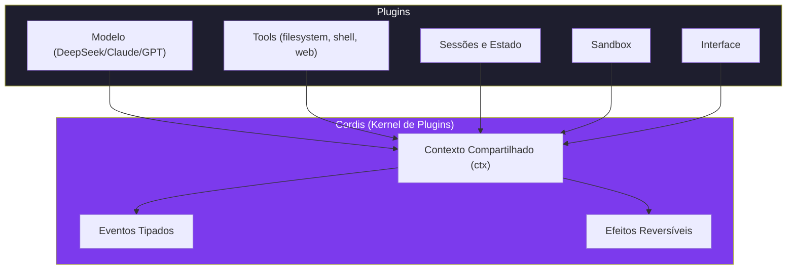

# Capítulo 1: O Que é o DeepSeek Harness: O Agente que é Plugin

## 1. Introdução

Você está prestes a descobrir uma peça que mudou o jogo da programação agêntica em agosto de 2026. O DeepSeek Harness (dsh) não é mais um assistente de código — é um framework onde cada componente, desde o modelo de linguagem até a interface que você vê na tela, é um plugin intercambiável [1]. Isso significa que você pode trocar o motor que pensa, as ferramentas que executam, e até a forma como o agente se comunica com você, tudo sem reescrever uma linha de código base.

O lançamento em 13 de agosto de 2026 marcou um ponto de inflexão na indústria de agentes de IA. Enquanto frameworks anteriores tratavam o modelo como o centro de tudo — acoplando ferramentas, sessões e interfaces diretamente a uma API específica — o DeepSeek Harness inverteu essa lógica completamente [2]. Cada componente é um plugin Cordis que pode ser instalado, removido, ou substituído em tempo de execução, sem reiniciar o agente.

A recepção da comunidade deu uma medida concreta desse ponto de inflexão: o repositório ultrapassou 141 mil estrelas no GitHub em apenas 4 dias após o lançamento [2], um dos crescimentos mais rápidos já registrados para um framework de agentes de IA open-source — sinal de que o problema que o plugin-first resolve (lock-in de modelo, de ferramentas, de interface) já incomodava um número grande de desenvolvedores antes mesmo de existir uma solução madura para ele.

Neste capítulo, você vai entender a arquitetura que torna isso possível, conhecer o Cordis — o kernel de plugins que sustenta o harness — e descobrir os quatro modos de execução que definem como seu agente vai trabalhar. Ao final, você será capaz de explicar para qualquer pessoa o que é o DeepSeek Harness e por que ele representa um salto qualitativo nos agentes de IA.

## 2. Explica

### O Paradigma Plugin-First

Na maioria dos frameworks de agentes, o modelo de linguagem é o centro de tudo. Você instala o framework, conecta um modelo, e pronto. O DeepSeek Harness inverte essa lógica: **tudo é plugin** [1]. O modelo é um plugin. As ferramentas são plugins. A sessão é um plugin. Até a interface que exibe o progresso é um plugin.

Isso não é uma extravagância arquitetural — é uma decisão de engenharia com consequências práticas enormes. Quando tudo é plugin, você pode:

- Trocar o modelo de DeepSeek V4 para Claude, GPT-4, ou qualquer outro provedor sem alterar uma linha de código do agente
- Adicionar ferramentas novas (busca web, acesso a banco de dados, chamadas de API) instalando um plugin
- Customizar o comportamento do agente inteiro through profiles — receitas de configuração que empilham camadas
- Executar o mesmo agente com modelos diferentes para comparar performance
- Criar sandboxes isolados para testes sem afetar o ambiente de produção

A arquitetura plugin-first resolve o problema mais comum dos frameworks de agentes modernos: o lock-in. Quando o modelo é o centro, trocar de modelo significa reescrever o agente. Quando tudo é plugin, trocar de modelo é trocar uma peça na bancada [3].

### O Cordis: O Kernel de Plugins

O Cordis é o framework meta que está por baixo do DeepSeek Harness [3]. Pense nele como o sistema operacional do agente — ele gerencia o ciclo de vida de cada plugin, resolve dependências, e garante que tudo funcione em harmonia.

Os três mecanismos centrais do Cordis são:

1. **ctx.effect()** — Efeitos reversíveis: quando um plugin se registra, ele instala efeitos que podem ser desfeitos. Se você remover um plugin, todos os seus efeitos são removidos limpa­mente, sem lixo no sistema [3]. Isso é fundamental para a estabilidade — em frameworks sem lifecycle management, remover um plugin pode deixar callbacks pendentes, listeners órfãos, ou estado corrompido.

2. **Lifecycle Events** — Eventos de ciclo de vida: `ready` (quando o plugin está pronto), `dispose` (quando ele está sendo removido), `fork` (quando uma sessão é clonada). Esses eventos permitem que plugins se preparem e lim­pem después de si mesmos [4]. O evento `fork` é particularmente importante — ele permite que uma sessão seja bifurcada sem afetar a original, essencial para experimentação e debug.

3. **Context Sharing** — Contexto compartilhado: todos os plugins operam sobre um mesmo objeto `ctx`, que contém serviços, eventos tipados, e configuração. Isso elimina o acoplamento direto entre plugins — eles se comunicam indiretamente através do contexto [3]. É o padrão de Inversion of Control aplicado a agentes de IA.

### Session Events: A Memória Durável do Agente

Um dos efeitos práticos mais subestimados do Cordis é o sistema de Session Events — eventos duráveis que registram limites de turno, passos intermediários, mensagens, conteúdo gerado pelo assistente e cada chamada de ferramenta como um stream de eventos que sobrevive ao processo do harness [3]. Esse stream não é um log passivo: ele é a estrutura de dados que sustenta quatro capacidades que, juntas, mudam como você trabalha com um agente de longa duração [3].

A primeira é o **resume**. Se sua conexão cair no meio de uma tarefa longa — o agente estava refatorando 40 arquivos e sua máquina hibernou — você não perde o trabalho. O harness relê o stream de eventos, reconstrói o estado exato da sessão (incluindo quais tools já foram chamadas e quais resultados já voltaram) e continua exatamente de onde parou. A segunda é o **fork**, que já foi mencionado como evento de ciclo de vida do plugin: ele permite clonar uma sessão inteira em um ponto específico do stream, criando um ramo paralelo. Isso é o que possibilita, por exemplo, testar duas estratégias de correção de bug a partir do mesmo ponto de investigação, sem que uma interfira na outra. A terceira é o **search** — como cada evento é tipado e indexável, você pode perguntar "em que momento desta sessão de 3 horas o agente decidiu instalar essa dependência?" e obter a resposta em milissegundos, sem reler manualmente o histórico inteiro. A quarta é o **replay**: reconstruir o comportamento do agente passo a passo, exatamente como aconteceu, é a ferramenta de debug mais poderosa que o harness oferece — em vez de tentar reproduzir um bug de raciocínio pedindo ao modelo para "pensar de novo", você reproduz literalmente a sequência de eventos que levou àquele resultado.

Na prática, isso significa que uma sessão do DeepSeek Harness não é uma conversa efêmera de chat — é um objeto de estado persistente e auditável, o que é uma diferença estrutural em relação a frameworks que tratam cada interação como uma chamada isolada de API.

### O Tool Pipeline: A Esteira de Montagem das Ferramentas

Toda vez que o modelo decide chamar uma ferramenta — ler um arquivo, rodar um comando de shell, buscar na web — essa chamada não vai direto do modelo para o sistema operacional. Ela atravessa o **Tool Pipeline**, uma esteira de camadas de plugin que decide, em cada etapa, se a chamada deve continuar, ser modificada, ou ser bloqueada [3]. As camadas, na ordem em que uma chamada de tool passa por elas, são:

1. **Policy** — a primeira camada decide se a chamada é permitida em princípio (ex.: "este agente pode escrever arquivos, mas não pode deletar diretórios inteiros").
2. **Hooks** — plugins registrados podem interceptar a chamada antes da execução, logar, transformar parâmetros ou abortar com um motivo.
3. **Sandbox** — a chamada é isolada no ambiente de execução configurado (processo restrito, container, ou o worktree git que veremos no Capítulo 8).
4. **Guards de filesystem** — regras específicas de acesso a arquivos, como impedir escrita fora do diretório do projeto ou bloquear leitura de arquivos de credenciais.
5. **Execução** — a ferramenta efetivamente roda e produz um resultado bruto.
6. **Reescrita de resultado** — plugins podem reformatar, truncar ou enriquecer o resultado antes de ele voltar ao modelo (por exemplo, resumir a saída de um comando de build de 5.000 linhas em um resumo de 20 linhas com os erros destacados).
7. **Observação final** — o resultado processado é registrado como Session Event, entrando no stream durável descrito acima.
8. **Renderização de UI** — a camada de interface decide como exibir aquela chamada de tool para quem está acompanhando a sessão (barra de progresso, diff colorido, log cru).

Cada uma dessas oito camadas é, ela mesma, um ponto de extensão plugin — você pode escrever um plugin que só atua na camada de Policy, sem tocar em nada mais, ou um que só reescreve resultados de um tipo específico de tool. É esse desacoplamento em camadas que permite, por exemplo, adicionar um guard de segurança novo (camada 4) sem precisar entender ou modificar como a renderização de UI (camada 8) funciona.

### O Catálogo de Peças: Plugin Hub

Uma bancada com encaixe universal só é útil se existir um catálogo de peças que encaixam nela. O ecossistema do DeepSeek Harness já nasceu com esse catálogo: hubs de plugins curados — como o mantido pela Composio, com mais de 10 plugins revisados para casos de uso comuns em 2026 [21] — reúnem extensões prontas para instalar, cobrindo desde integrações de API até ferramentas de observabilidade. Isso é a diferença prática entre "a arquitetura permite plugins" e "existe um mercado de plugins" — a segunda é o que realmente reduz o tempo entre "eu preciso de uma ferramenta X" e "minha ferramenta X está rodando".

### A História dos Agentes de IA

Para entender por que o DeepSeek Harness é significativo, vale olhar a evolução dos frameworks de agentes [5]:

**Geração 1 (2023):** LangChain e Chain-of-Thought. Frameworks que conectavam LLMs a ferramentas de forma linear. Função bem para protótipos, mas sem gerenciamento de estado, sem plugins, sem isolamento.

**Geração 2 (2024):** AutoGPT e CrewAI. Agentes autônomos que podiam planejar e executar tarefas complexas. Mas com problemas de estabilidade — loops infinitos, alucinações, e falta de sandboxing.

**Geração 3 (2025):** Claude Code, Cursor, Windsurf. Agentes de coding integrados a IDEs. Excelentes para desenvolvimento, mas acoplados a provedores específicos de LLM.

**Geração 4 (2026):** DeepSeek Harness. Framework plugin-first onde tudo é intercambiável. O primeiro framework a tratar agentes como sistemas composáveis, não como aplicativos monolíticos [2].

Uma revisão sistemática recente sobre a evolução de agentes autônomos baseados em LLM [5] identifica exatamente essa trajetória: da orquestração linear de ferramentas (Geração 1) para arquiteturas que precisam lidar com planejamento de longo horizonte, memória persistente e coordenação multi-agente (Gerações 3 e 4). O ponto central dessa literatura é que o gargalo deixou de ser "o modelo consegue raciocinar?" — que já está razoavelmente resolvido pelos modelos de ponta — e passou a ser "o sistema em volta do modelo consegue orquestrar, persistir e isolar corretamente o que o modelo decide fazer?" [5]. É exatamente esse segundo problema que o Cordis, os Session Events e o Tool Pipeline atacam. Um agente com um modelo brilhante mas sem persistência de sessão perde contexto a cada reinício; um agente com excelente memória mas sem sandboxing corre o risco de executar uma ação destrutiva sem controle. O DeepSeek Harness aposta que a próxima geração de valor em agentes vem da engenharia de sistema em volta do modelo, não apenas do modelo em si.

### Modos de Execução

O DeepSeek Harness oferece quatro modos de operação, cada um projetado para um caso de uso diferente [1]:

| Modo | Descrição | Quando Usar |
|------|-----------|-------------|
| **Standard** | Toolset completo: filesystem, shell, web search, subagents, plan mode | Desenvolvimento geral, coding agent completo |
| **Code** | Tools expostas via Code Mode SDK — o modelo gera código para orquestrar chamadas | Quando você quer controle fino sobre a sequência de tools |
| **Minimal** | Apenas shell tool + editor de arquivos | Benchmarking, testes de performance, minimalismo extremo |
| **Creator** | Modo personalizado via profile | Workflows específicos que você define |

A escolha do modo afeta diretamente o que o agente pode fazer. O modo Standard é o mais completo — ele inclui todas as ferramentas de filesystem, acesso ao shell, busca na web, subagentes e modo de planejamento [6]. O modo Minimal, por outro lado, reduz o agente ao essencial: uma ferramenta de shell e um editor de arquivos, ideal para benchmarks onde você quer medir apenas a capacidade bruta do modelo [7].

O modo Code é particularmente interessante para desenvolvedores avançados. Em vez de o agente chamar tools diretamente, ele gera código que orquestra múltiplas chamadas de tools em sequência. Isso permite patterns complexos como loops condicionais, tratamento de erros, e paralelismo — coisas que o modo Standard não suporta nativamente [8].

### Comparação com Outros Frameworks

| Característica | DeepSeek Harness | Claude Code | Cursor | AutoGPT |
|---------------|-----------------|-------------|--------|---------|
| Arquitetura | Plugin-first | Monolítica | IDE-integrada | Monolítica |
| Modelo | Qualquer (plugin) | Claude apenas | Múltiplos | Múltiplos |
| Sandbox | Git worktree | Parcial | Não | Não |
| Sessões | Duráveis + fork | Duráveis | Não | Não |
| Multi-agente | Nativo | Não | Não | Parcial |
| Open-source | MIT | Não | Não | Sim |
| Cordis | Sim | Não | Não | Não |

Três linhas dessa tabela merecem comentário além do "sim/não". A primeira é **Sandbox: Git worktree** — o DeepSeek Harness isola cada sessão em um worktree git próprio, o que garante que múltiplas sessões paralelas não pisem nos mesmos arquivos de trabalho. Mas essa isolação é de filesystem, não de runtime: portas de rede abertas por um processo filho, estado em bancos de dados externos, ou containers Docker compartilhados entre sessões não são isolados automaticamente pelo worktree — é uma responsabilidade que ainda recai sobre quem configura o ambiente [3]. A segunda é **Sessões: Duráveis + fork**, que já foi detalhada acima como Session Events — é o diferencial que separa o harness de um simples wrapper de chat. A terceira é **Multi-agente: Nativo** — como cada subagente é, ele mesmo, uma sessão com seu próprio stream de eventos, orquestrar múltiplos agentes em paralelo (por exemplo, um pesquisando enquanto outro escreve código) é uma composição de sessões, não uma feature especial bolt-on.

## 3. Ilustra

### A Oficina de Agentes

Imagine uma oficina de mecatrônica. No centro, há uma bancada de trabalho (o Cordis) onde diversas estações podem ser conectadas. Cada estação é uma peça independente: uma furadeira (o modelo), um multímetro (as ferramentas de filesystem), um osciloscópio (o tool pipeline), e um display de status (a interface) [9].

O que torna essa oficina especial não é nenhuma peça individual — é o fato de que **todas as peças usam o mesmo sistema de encaixe**. Se você quiser trocar a furadeira por uma soldadora, basta desconectar uma e conectar a outra. O sistema de encaixe (o Cordis) garante que a nova peça recebe energia, dados, e instruções automaticamente.

Quando um novo técnico (você, o Engenheiro de Agentes) entra na oficina, ele pode começar com o kit básico — uma furadeira e um multímetro — e ir adicionando peças conforme sua necessidade cresce. Não precisa comprar tudo de uma vez. Não precisa de um técnico diferente para cada ferramenta. É a mesma oficina, evoluindo com você.

Mas a verdadeira magia acontece quando você começa a combinar peças. A furadeira (modelo) conectada ao multímetro (filesystem) e ao osciloscópio (tool pipeline) cria algo que nenhuma peça individual faz sozinha: um agente que lê arquivos, toma decisões baseadas no conteúdo, e executa ações no mundo real [10].



Como Engenheiro de Agentes, você já percebe que essa arquitetura elimina o problema mais comum dos frameworks de agentes: o lock-in. Quando o modelo é o centro, trocar de modelo significa reescrever o agente. Quando tudo é plugin, trocar de modelo é trocar uma peça na bancada [9].

### O Diário de Bordo da Oficina

Toda oficina de mecatrônica de verdade mantém um diário de bordo — um registro de cada peça trocada, cada teste realizado, cada ajuste feito no motor. Os Session Events são esse diário para o DeepSeek Harness: cada turno, cada chamada de ferramenta, cada decisão do modelo é uma entrada datada e ordenada. Se a oficina fecha no meio de um serviço (a sua sessão cai), o próximo técnico que abrir o diário (o resume) sabe exatamente onde o trabalho parou, sem precisar desmontar o motor de novo para descobrir. Se você quer testar duas abordagens diferentes para o mesmo reparo, você tira uma fotocópia do diário até aquele ponto (o fork) e trabalha em duas vias paralelas, sem risco de confundir uma peça trocada em uma via com uma peça trocada na outra. Se um cliente reclama que "o carro saiu fazendo um ruído estranho", você não precisa perguntar ao mecânico o que ele fez de memória — você folheia o diário (o replay) e vê exatamente a sequência de intervenções.

### A Esteira de Controle de Qualidade

O Tool Pipeline é a esteira de controle de qualidade da oficina — a linha por onde toda peça produzida passa antes de ser entregue ao cliente. Uma peça mal fabricada (uma chamada de tool com parâmetros perigosos) é interceptada na inspeção inicial (Policy) antes mesmo de ir para a linha de montagem. Um supervisor pode adicionar uma verificação extra a qualquer momento (Hooks) sem parar a esteira inteira. A peça é montada em uma bancada isolada (Sandbox), sob regras de acesso definidas (Guards de filesystem), e só depois de pronta é embalada e etiquetada (Reescrita de resultado) para o cliente entender o que recebeu. Cada etapa da esteira é registrada no diário de bordo (Observação final), e o painel de status na entrada da oficina mostra ao cliente em tempo real em que etapa sua peça está (Renderização de UI). Nenhuma peça sai da oficina sem passar por essas oito estações — é isso que torna o resultado confiável, mesmo quando o motor (modelo) trocado é diferente a cada dia.

### O Fluxo de uma Requisição

Para entender como tudo se conecta, acompanhe o que acontece quando você digita uma mensagem no DeepSeek Harness [11]:

1. **Entrada:** Sua mensagem chega como um evento de sessão, o primeiro item gravado no stream durável.
2. **Modelo:** O plugin de modelo recebe a mensagem e gera uma resposta (que pode incluir chamadas de tools).
3. **Pipeline:** Se o modelo decidiu usar uma tool, a chamada entra na esteira de oito camadas descrita na seção Explica — policy decide se é permitida, hooks podem interceptar e transformar, sandbox isola a execução, guards de filesystem restringem o acesso, a ferramenta executa, o resultado é reescrito/resumido, a observação final registra o evento, e a UI decide como renderizar aquilo para quem acompanha.
4. **Resultado:** O resultado já processado pela camada de reescrita é devolvido ao modelo — não o resultado bruto.
5. **Resposta:** O modelo gera a resposta final com base no resultado da tool.
6. **Persistência:** Tudo é salvo como Session Events duráveis — o que é o que torna resume, fork, search e replay possíveis depois.

Esse fluxo é o mesmo independentemente do modo de execução, do modelo escolhido, ou das tools disponíveis. É a elegância da arquitetura plugin-first — o fluxo é definido pelo Cordis, não pelos componentes individuais. Trocar o modelo de DeepSeek para outro provedor não muda nenhuma das seis etapas; só muda quem responde no passo 2.

## 4. Técnica

### Estrutura de um Plugin Cordis

Todo plugin do DeepSeek Harness segue uma estrutura padrão que você vai熟悉 ao longo do livro. Aqui está a esqueleto básico:

```json
{
  "name": "meu-plugin",
  "version": "0.1.0",
  "description": "Plugin personalizado para o DeepSeek Harness",
  "main": "index.js",
  "cordis": {
    "provides": ["tool", "service"],
    "requires": ["model"],
    "lifecycle": {
      "ready": "onReady",
      "dispose": "onDispose"
    }
  }
}
```

O campo `cordis` é o coração do plugin. Ele declara:
- **provides**: quais serviços este plugin oferece ao contexto
- **requires**: quais serviços ele precisa de outros plugins para funcionar
- **lifecycle**: callbacks para os eventos de ciclo de vida

Esses três campos são o que permite ao Cordis resolver dependências automaticamente antes de carregar qualquer plugin. Se o seu plugin declara `"requires": ["model"]`, o Cordis garante que um plugin de modelo já esteja `ready` antes de chamar o callback de inicialização do seu plugin — você nunca precisa escrever código defensivo tipo "será que o modelo já carregou?" dentro do seu próprio plugin. Se duas peças declaram o mesmo `provides` (por exemplo, dois plugins de sandbox concorrentes), o Cordis detecta o conflito no boot e recusa carregar os dois simultaneamente, em vez de deixar um sobrescrever silenciosamente o outro em tempo de execução — é exatamente esse tipo de falha silenciosa que o comando `dsh plugins check-conflicts`, mostrado a seguir, existe para pegar antes que aconteça em produção.

### Registro de um Plugin

Para registrar um plugin no harness, você usa a API do Cordis:

```javascript
// index.js do plugin
export default function meuPlugin(ctx) {
  // Registra um serviço no contexto compartilhado
  ctx.service('minha-ferramenta', {
    execute(params) {
      // Lógica da ferramenta
      return { resultado: `Processado: ${params.input}` };
    }
  });

  // Escuta eventos de sessão
  ctx.on('session:turn', (event) => {
    console.log(`Novo turno iniciado: ${event.id}`);
  });

  // Registra efeito reversível
  ctx.effect(() => {
    // Setup
    console.log('Plugin instalado');
    return () => {
      // Teardown (quando o plugin for removido)
      console.log('Plugin removido');
    };
  });
}
```

### Um Plugin com Tratamento de Erro e Hook em Camadas

O exemplo anterior mostra a estrutura mínima. Na prática, um plugin de produção precisa lidar com falhas — uma ferramenta externa pode estar fora do ar, uma chamada pode receber parâmetros inválidos, e o efeito reversível precisa desfazer qualquer setup parcial se algo quebrar no meio do caminho:

```javascript
// index.js — plugin com hook na camada de Policy do Tool Pipeline
export default function pluginRobusto(ctx) {
  let conexaoAtiva = null;

  // Efeito reversível: se a conexão falhar, nada fica pendurado
  ctx.effect(() => {
    try {
      conexaoAtiva = abrirConexaoExterna();
    } catch (erro) {
      ctx.logger.error(`Falha ao abrir conexão: ${erro.message}`);
      conexaoAtiva = null;
    }
    return () => {
      if (conexaoAtiva) conexaoAtiva.fechar();
    };
  });

  // Hook na camada de Policy: valida antes de qualquer execução
  ctx.on('tool:before-call', (evento) => {
    if (evento.tool === 'minha-ferramenta' && !conexaoAtiva) {
      evento.abortar('Conexão externa indisponível — tente novamente em alguns segundos');
      return;
    }
  });

  ctx.service('minha-ferramenta', {
    async execute(params) {
      if (!params?.input) {
        throw new Error('Parâmetro "input" é obrigatório');
      }
      try {
        const resultado = await conexaoAtiva.consultar(params.input);
        return { resultado, fonte: 'externa' };
      } catch (erro) {
        // Resultado de fallback em vez de propagar o erro cru ao modelo
        return { resultado: null, erro: erro.message, fonte: 'fallback' };
      }
    }
  });

  // Observa o resultado final de qualquer chamada, para métricas
  ctx.on('tool:after-call', (evento) => {
    ctx.logger.info(`Tool ${evento.tool} levou ${evento.duracaoMs}ms`);
  });
}
```

Note os dois pontos de extensão usados aqui além do serviço em si: `tool:before-call` intercepta na camada de Policy/Hooks do Tool Pipeline (pode abortar a chamada antes de ela chegar à execução), e `tool:after-call` observa o resultado já processado, na camada de Observação Final. É assim que um plugin participa de mais de uma camada da esteira sem precisar reimplementar o pipeline inteiro.

### Modos de Execução na Prática

Aqui está como você escolhe e configura o modo de execução:

```bash
# Modo Standard (padrão) — toolset completo
dsh --mode standard

# Modo Code — modelo gera código para orquestrar tools
dsh --mode code

# Modo Minimal — apenas shell + editor
dsh --mode minimal

# Modo Creator — usa profile personalizado
dsh --mode creator --profile meu-profile
```

Cada modo carrega um conjunto diferente de plugins. No modo Standard, todos os plugins de tool são carregados. No modo Minimal, apenas shell e editor [7]. Essa separação é o que permite ao harness ser ao mesmo tempo leve para benchmarks e completo para desenvolvimento real.

### Verificando a Arquitetura

```bash
# Listar plugins carregados
dsh plugins list

# Verificar dependências
dsh plugins check-deps

# Testar um plugin isoladamente
dsh plugins test @deepseek/shell-tool

# Verificar compatibilidade entre plugins
dsh plugins check-conflicts
```

## 5. Aplica

### A Escolha Errada que Custa Horas

Imagine que você está configurando um agente para uma startup de e-commerce. Você escolhe o modo Minimal porque "é mais leve" e começa a desenvolver. Três horas depois, percebe que o agente não consegue buscar na web, não tem acesso ao filesystem para ler configurações, e não pode spawnar subagentes para tarefas paralelas. Você precisava do Standard o tempo todo [6].

O erro não foi escolher o modo errado — foi não entender o que cada modo oferece antes de começar. O modo Minimal é excelente para benchmarks e testes isolados de modelos, mas para desenvolvimento real, você precisa do Standard.

Outro erro comum é tentar usar o modo Code sem entender a Code Mode SDK. O modelo gera código para orquestrar tools, mas se você não configurou as permissões corretas, o código gerado pode tentar executar ações que o sandbox bloqueia — resultando em erros silenciosos que são difíceis de debugar [8].

### Quando a Arquitetura Plugin-First Encontra Seu Limite

A flexibilidade do Cordis não é gratuita. Como o framework ainda está em developer preview (v0.1), com API sujeita a mudanças, cada plugin adicional aumenta a superfície de configuração e de possíveis quebras entre versões — em pipelines de alta performance ou em ambientes enterprise ainda não testados nessa escala, esse overhead de abstração pode se tornar perceptível, e times mais conservadores devem considerar fixar versões de plugins críticos em vez de atualizar tudo automaticamente [4]. Na prática, isso significa que "tudo é plugin" é uma vantagem até o ponto em que o número de plugins carregados simultaneamente cresce demais: acima de algumas dezenas de plugins ativos ao mesmo tempo, a resolução de dependências do Cordis fica mensuravelmente mais lenta no boot da sessão, e vale a pena migrar para um profile Creator que carrega só o necessário, em vez de manter tudo habilitado no modo Standard por comodidade.

### Um Segundo Cenário: Standard ou Code?

Uma equipe de dados precisava que o agente rodasse uma sequência fixa de dez etapas de limpeza de CSV, sempre na mesma ordem, com tratamento de erro específico em cada etapa. Rodando em modo Standard, o modelo decidia a ordem das chamadas de tool a cada execução — na maioria das vezes corretamente, mas ocasionalmente pulando uma etapa de validação, porque "decidir a sequência a cada turno" é exatamente o que o modo Standard otimiza para fazer bem. A equipe migrou para o modo Code: em vez de o modelo escolher tool por tool, ele passou a gerar um único bloco de código que orquestrava as dez etapas em ordem fixa, com try/catch explícito em cada uma. O resultado foi determinismo — a mesma sequência de dez passos, sempre, sem variação entre execuções [8]. A lição geral: use Standard quando a sequência de tools deve variar conforme o contexto; use Code quando a sequência é fixa e você quer garantia de ordem e tratamento de erro explícito.

### A Prática Correta

Antes de iniciar qualquer projeto, defina seu modo de execução baseado na tarefa:

| Tarefa | Modo Recomendado | Por quê |
|--------|-----------------|---------|
| Desenvolvimento de software | Standard | Precisa de filesystem, shell, web search |
| Benchmark de modelo | Minimal | Quer isolar a performance do modelo |
| Prototipagem rápida | Standard + Creator profile | Flexibilidade máxima |
| Automação de DevOps | Standard | Shell + filesystem + web |
| Análise de dados | Code | Controle fino sobre sequência de tools |
| Testes de regressão | Minimal + sandbox | Isolamento total |

A regra é simples: se você vai fazer algo real, use Standard. Se vai medir algo isolado, use Minimal. Se vai repetir o mesmo workflow muitas vezes, crie um profile Creator [1].

### Checklist de Início Rápido

Para qualquer novo projeto com DeepSeek Harness:

1. ✅ Verifique se o Node.js v22+ está instalado — sem ele, nada do resto funciona (Capítulo 2 detalha o porquê).
2. ✅ Instale o DeepSeek Harness (npm ou source) — escolha a rota conforme você vai só usar ou também modificar o código.
3. ✅ Configure uma API key (DeepSeek cloud ou Ollama local) — é a energia que faz a furadeira (o modelo) girar.
4. ✅ Escolha o modo de execução (Standard para maioria dos casos) — Code só quando a sequência de tools precisa ser fixa e determinística.
5. ✅ Configure sandbox mínimo (filesystem guards) — mesmo em experimentação, nunca rode sem nenhum guard de escrita.
6. ✅ Teste com uma mensagem simples no terminal — confirme que o passo 2 do fluxo de requisição (o modelo responde) está funcionando antes de testar tools.
7. ✅ Liste os plugins carregados para verificar que tudo está OK — e rode `dsh plugins check-conflicts` se algo parecer não estar respondendo como esperado.

### Erros Silenciosos e Como Diagnosticá-los

Nem todo erro na arquitetura plugin-first aparece como uma exceção estourada no terminal. Alguns dos mais custosos são silenciosos — o agente continua rodando, só que errado:

| Sintoma | Causa provável | Onde investigar |
|---------|-----------------|------------------|
| Tool nunca é chamada, sem erro | Camada de Policy bloqueou silenciosamente | `dsh plugins check-deps` + logs de `tool:before-call` |
| Dois plugins parecem se anular | Conflito de `provides` não detectado a tempo | `dsh plugins check-conflicts` |
| Sessão "esquece" contexto após reconectar | Resume não encontrou o stream de eventos correto | Verificar se o `session id` usado no resume é o mesmo da sessão original |
| Resultado de tool chega truncado ao modelo | Camada de reescrita de resultado está resumindo demais | Revisar plugin que atua em `tool:after-call` |
| Plugin novo não aparece em `dsh plugins list` | Manifesto `cordis` malformado ou dependência ausente | `dsh plugins test <nome-do-plugin>` |

A regra prática: quando o comportamento do agente muda sem nenhuma mensagem de erro visível, o primeiro lugar a olhar não é o modelo — é uma das oito camadas do Tool Pipeline ou o gráfico de dependências do Cordis.

## 6. Conclusão

Neste capítulo, você descobriu que o DeepSeek Harness é mais do que um assistente de código — é um framework plugin-first onde cada componente é intercambiável. O Cordis fornece o kernel que gerencia ciclo de vida, dependências e contexto compartilhado entre plugins. Os quatro modos de execução (Standard, Code, Minimal, Creator) permitem adaptar o agente para qualquer tarefa, desde benchmarks até desenvolvimento completo de software.

A arquitetura plugin-first não é apenas uma característica técnica — é uma filosofia de design que coloca o controle nas mãos do usuário. Em vez de depender de um provedor específico de LLM, você pode usar qualquer modelo. Em vez de ficar preso a um conjunto fixo de ferramentas, você pode criar as suas. Em vez de adaptar seu workflow ao framework, o framework se adapta ao seu workflow.

Você também viu que essa flexibilidade tem um preço: um framework em developer preview, com centenas de plugins possíveis, exige disciplina de versionamento e um diagnóstico sistemático quando algo falha silenciosamente — a tabela de sintomas desta seção é o seu primeiro roteiro de investigação para quando isso acontecer.

Esse par — flexibilidade e disciplina — vai reaparecer em praticamente todos os capítulos deste livro sob roupagens diferentes: plugins dão liberdade, mas exigem versionamento (Capítulo 9); ferramentas customizadas dão poder, mas exigem idempotência (Capítulo 10); múltiplos agentes dão paralelismo, mas exigem fronteiras de responsabilidade claras (Capítulo 14). Vale segurar essa lente enquanto avança pelos próximos capítulos: cada novo recurso do harness que parece "só" adicionar capacidade também está, silenciosamente, adicionando uma nova forma de as coisas darem errado — e o livro dedica tanto espaço a mostrar o caminho certo quanto a mostrar onde o caminho errado costuma acontecer primeiro.

Essa disciplina não é burocracia — é o que separa um agente que funciona na demonstração de um agente que continua funcionando depois que a novidade passou e o sistema virou parte da rotina de trabalho de alguém.

Vale registrar, antes de avançar, o que este livro NÃO promete: não é uma referência exaustiva de toda API do Cordis, nem um substituto para a documentação oficial do projeto, que evolui mais rápido do que qualquer livro impresso consegue acompanhar em um framework ainda em developer preview. O que este livro entrega é um caminho guiado, com exemplos testáveis e cenários de falha reais, pelas decisões que mais importam ao adotar o DeepSeek Harness em um contexto de trabalho de verdade — não em um projeto de fim de semana isolado, mas em um pipeline que outras pessoas vão depender dele funcionando de forma previsível.

Isso também define como ler os próximos quinze capítulos: cada um assume que você aplicou o anterior, não que está pulando direto para o tópico que parece mais interessante hoje. Um agente multi-plugin (Capítulo 9) pressupõe que você já entende o ciclo de vida de sessão (Capítulo 7); um pipeline de ferramentas (Capítulo 11) pressupõe que você já sabe compor tools individuais (Capítulo 10). A ordem dos capítulos não é arbitrária — é a mesma ordem de dependência conceitual que o próprio harness impõe entre seus componentes. Pular capítulos funciona como pular passos de instalação: às vezes não dá problema nenhum, e às vezes o problema só aparece páginas depois, sem relação óbvia com o que foi pulado. Com essa ressalva registrada, vamos direto ao próximo passo prático: colocar o harness rodando na sua própria máquina, do absoluto início ao fim, sem atalhos e sem pular nenhuma etapa importante.

No próximo capítulo, você vai sair da teoria e colocar as mãos na obra: instalar o DeepSeek Harness localmente, configurar sua primeira API key, e executar seu primeiro agente no terminal. É aqui que a oficina começa a ganhar vida.

## 7. Referências Bibliográficas

[1] DEEPSEEK AI. *DeepSeek Harness developer preview: Everything is a plugin*. Disponível em: https://deepseek.com/harness/en/. Acesso em: 23 ago. 2026.

[2] DEEPSEEK AI. *DeepSeek Harness (dsh): Everything is a Plugin*. GitHub. Disponível em: https://github.com/deepseek-ai/deepseek-harness. Acesso em: 23 ago. 2026.

[3] DEEPSEEK AI. *deepseek-harness/docs/cordis-primer.md*. GitHub. Disponível em: https://github.com/deepseek-ai/deepseek-harness/blob/master/docs/cordis-primer.md. Acesso em: 23 ago. 2026.

[4] FLOATBOAT.AI. *Cordis — The Plugin Kernel Behind DeepSeek Harness*. Disponível em: https://floatboat.ai/blog/cordis-plugin-framework. Acesso em: 23 ago. 2026.

[5] FERRAG, Mohamed Amine; TIHANYI, Norbert; DEBBAH, Mérouane. *From LLM Reasoning to Autonomous AI Agents: A Comprehensive Review*. In: IEEE Access, 2026. Disponível em: https://doi.org/10.1109/access.2026.3698694. Acesso em: 23 ago. 2026.

[6] MINDSTUDIO. *What Is DeepSeek Harness? The Plug-In Coding Agent Explained*. Disponível em: https://www.mindstudio.ai/blog/deepseek-harness-agentic-coding. Acesso em: 23 ago. 2026.

[7] ZIMASPACE. *DeepSeek Harness Modes: Standard vs Code vs Minimal vs Creator*. Disponível em: https://shop.zimaspace.com/blogs/tech-ai-hub/de-minimal-and-creator-explained. Acesso em: 23 ago. 2026.

[8] HABR. *Inside DeepSeek Harness: Cordis, Session Events, Tool Pipelines*. Disponível em: https://habr.com/en/articles/1070958/. Acesso em: 23 ago. 2026.

[9] TOWARDS AI. *DeepSeek Harness Explained: When the AI Model is Just a Plugin*. Disponível em: https://pub.towardsai.net/deepseek-harness-explained-when-the-ai-model-is-just-a-plugin-16b2496f3d01. Acesso em: 23 ago. 2026.

[10] TOWARDS AI. *DeepSeek Harness vs Claude Code: A Plugin Architecture Teardown*. Disponível em: https://pub.towardsai.net/deepseek-harness-vs-claude-code-a-plugin-architecture-teardown-da3c916f3af1. Acesso em: 23 ago. 2026.

[11] DEEPSEEK AI. *deepseek-harness/docs/architecture.md*. GitHub. Disponível em: https://github.com/deepseek-ai/deepseek-harness/blob/master/docs/architecture.md. Acesso em: 23 ago. 2026.

[12] AGENTATLAS. *Cordis Explained: How DeepSeek Harness's Plugin Framework Works*. Disponível em: https://agentatlas.org/blog/cordis-explained-how-deepseek-harness-plugin-framework-works/. Acesso em: 23 ago. 2026.

[13] MEDIUM (kaliarch). *DeepSeek Harness: When the Agent Loop Itself Becomes a Plugin*. Disponível em: https://medium.com/@kaliarch/deepseek-harness-when-the-agent-loop-itself-becomes-a-plugin-7fad0aa9de1c. Acesso em: 23 ago. 2026.

[14] MEDIUM (data-and-beyond). *Decoding DeepSeek Harness: The Open-Source Runtime Behind Composable AI Agents*. Disponível em: https://medium.com/data-and-beyond/decoding-deepseek-harness-the-open-source-runtime-behind-composable-ai-agents-c2299e992870. Acesso em: 23 ago. 2026.

[15] THE NEW STACK. *DeepSeek open sources an agent harness where everything is a plugin*. Disponível em: https://thenewstack.io/deepseek-harness-open-source-plugins/. Acesso em: 23 ago. 2026.

[16] MARKTECHPOST. *DeepSeek AI Releases DeepSeek Harness in Developer Preview*. Disponível em: https://www.marktechpost.com/2026/08/17/deepseek-ai-releases-deepseek-harness-in-developer-preview/. Acesso em: 23 ago. 2026.

[17] THEREGISTER. *DeepSeek's innovative harness treats everything as a plug-in*. Disponível em: https://www.theregister.com/ai-and-ml/2026/08/14/deepseeks-innovative-harness-treats-everything-as-a-plug-in/5288095. Acesso em: 23 ago. 2026.

[18] I-SCOOP. *DeepSeek Harness turns every part of an agent runtime into a swappable plugin*. Disponível em: https://www.i-scoop.eu/deepseek-harness-turns-every-part-of-an-agent-runtime-into-a-swappable-plugin/. Acesso em: 23 ago. 2026.

[19] SPRINGBRAND. *DeepSeek Harness (dsh): Everything Is a Plugin*. Disponível em: https://springbrand.ai/deepseek-harness. Acesso em: 23 ago. 2026.

[20] EXPLOREX.AI. *DeepSeek Harness v0.1: Run the Plugin-First Agent Stack*. Disponível em: https://explainx.ai/blog/deepseek-harness-v0-1-plugin-first-agent-stack-august-2026. Acesso em: 23 ago. 2026.

[21] COMPOSIO. *Composio — Plugin Hub for DeepSeek Harness*. Disponível em: https://composio.dev. Acesso em: 23 ago. 2026.
