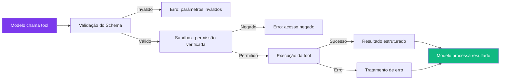

# Capítulo 10: Ferramentas Customizadas: Construindo Pecas Novas

## 1. Introdução

No Capítulo 9, você criou seu primeiro plugin. Agora vamos detalhar como construir ferramentas (tools) customizadas — as peças que o agente realmente chamará para executar ações [1]. Uma tool bem projetada é a diferença entre um agente que resolve problemas e um que só gera texto bonito.

Tools são o elo entre o mundo digital (o modelo de linguagem) e o mundo real (arquivos, APIs, comandos). Sem tools, o agente é apenas um chatbot. Com tools, ele é um assistente que pode ler, escrever, buscar, e agir [2].

Neste capítulo, você vai aprender a definir schemas JSON para parâmetros, executar ferramentas com segurança dentro do sandbox, retornar resultados estruturados, e compor tools encadeando output de uma como input de outra.

O plugin do Capítulo 9 é o invólucro — ele instala, versiona e ciclo-de-vida a tool. A tool é o que efetivamente executa. Um mesmo plugin pode expor uma, cinco ou vinte tools; o que você aprende aqui vale para qualquer uma delas, seja a tool nativa mais simples ou a mais elaborada tool de terceiros instalada via hub.

## 2. Explica

### O que é uma Tool?

Uma tool é uma função que o agente pode chamar para interagir com o mundo exterior. Diferente de uma função comum, uma tool tem [3]:

- **Schema JSON** que define parâmetros e tipos — o modelo sabe exatamente quais argumentos passar
- **Execução sandboxed** — roda em ambiente isolado, não pode corromper o sistema
- **Retorno estruturado** — resultado previsível que o modelo pode processar
- **Integração com o pipeline** — passa por policy, hooks, e guards como qualquer tool nativa

Essa integração com o pipeline é o que distingue uma tool do DeepSeek Harness de uma função JavaScript comum chamada por function-calling genérico: a Tool Pipeline do harness intercepta toda chamada de tool — nativa ou de plugin de terceiros — nas mesmas camadas de policy, hooks, sandboxing, guards de filesystem, reescrita de resultado e observação final [1]. Não existe atalho: uma tool customizada mal-comportada é freada pelas mesmas guardas que protegem o `shell:execute` nativo.

### Schema de Ferramentas

Todo schema de tool segue o padrão JSON Schema:

```json
{
  "name": "buscar-repositorio",
  "description": "Busca um repositório Git pelo nome",
  "parameters": {
    "type": "object",
    "properties": {
      "nome": {
        "type": "string",
        "description": "Nome do repositório a buscar"
      },
      "diretorio": {
        "type": "string",
        "description": "Diretório raiz para busca",
        "default": "."
      }
    },
    "required": ["nome"]
  },
  "returns": {
    "type": "object",
    "properties": {
      "encontrado": { "type": "boolean" },
      "caminho": { "type": "string" }
    }
  }
}
```

### Validação de Schema em Profundidade

O exemplo acima usa apenas `type`, `properties`, `description` e `required` — o subconjunto mínimo. Mas o JSON Schema completo oferece ferramentas de restrição que valem a pena dominar, porque cada restrição declarada é uma classe de erro que o modelo nunca vai conseguir cometer:

- **`enum`:** restringe um parâmetro a um conjunto fechado de valores (ex.: `"formato": { "enum": ["json", "yaml", "csv"] }`). Elimina a categoria inteira de "o modelo inventou um formato que não existe".
- **`oneOf`/`anyOf`:** permite parâmetros polimórficos — por exemplo, aceitar tanto um caminho de arquivo único quanto uma lista de caminhos, sem duas tools separadas.
- **`additionalProperties: false`:** rejeita qualquer campo que o modelo tenha incluído por engano e que não está no schema — sem isso, um typo do modelo passa silenciosamente e é ignorado, em vez de gerar um erro claro na validação.
- **`minimum`/`maximum`/`pattern`:** restringem números e strings ao intervalo ou formato esperado (ex.: um `timeout_ms` nunca negativo, um `email` que casa com um regex).

Quando a validação de schema falha, o pipeline retorna o erro de volta ao modelo antes mesmo de a função `execute` ser chamada — o desenvolvedor da tool nunca precisa escrever código defensivo para "o parâmetro não é uma string", porque o schema já garantiu isso [3].

### Execução Segura

As tools rodam dentro do sandbox configurado no Capítulo 8. Isso significa [4]:

- Acessam apenas os diretórios permitidos pelos filesystem guards
- Não podem executar comandos shell não autorizados
- Resultados são comprimidos antes de retornar ao modelo (evita context overflow)
- Erros são tratados graceful — uma tool que falha não derruba o agente

A compressão de resultados merece atenção especial. Uma tool que lista arquivos de um diretório com milhares de entradas, ou que faz `git log` num repositório com anos de histórico, pode retornar megabytes de texto — e tudo isso entraria no contexto do modelo se não houvesse um limite. O pipeline aplica truncamento e sumarização antes de repassar o resultado: em vez de devolver 5.000 linhas de log, devolve as primeiras N linhas mais uma contagem total, deixando explícito para o modelo que o resultado foi cortado. Uma tool bem projetada já pagina ou filtra por conta própria (aceitando parâmetros como `limit` e `offset`) em vez de depender só da compressão do pipeline como rede de segurança.

### Composição de Tools

Tools podem ser encadeadas — o output de uma tool pode ser usado como input de outra. O agente decide automaticamente a ordem de execução baseado nos parâmetros [1]. Essa composição acontece em dois níveis distintos, e confundi-los é fonte comum de bugs de design:

1. **Composição implícita (decidida pelo modelo):** o agente lê o resultado de uma tool, decide sozinho que precisa de outra, e a chama numa próxima rodada. Não há garantia de ordem determinística — depende do raciocínio do modelo naquele turno.
2. **Composição explícita (declarada em pipeline):** o desenvolvedor define, fora do modelo, que a saída da tool A alimenta a tool B sempre, sem depender de o modelo "lembrar" de encadear. É o assunto do Capítulo 11 — pipelines tornam determinístico o que a composição implícita deixa a cargo do raciocínio do modelo.

Tools que serão compostas com frequência devem manter contratos de saída estáveis — mudar o formato do campo `sources` de uma tool de busca, por exemplo, quebra silenciosamente qualquer pipeline (ou qualquer memória de sessão anterior do modelo) que espera aquele formato exato.

### Idempotência: o Requisito Escondido para Retry

Uma propriedade que o schema JSON não consegue expressar, mas que toda tool exposta a retries automáticos precisa ter, é a idempotência: executar a mesma tool duas vezes com os mesmos parâmetros deve produzir o mesmo efeito final que executá-la uma vez só. A tool `deploy-docker` do exemplo desta seção não é idempotente da forma como está escrita — se o `docker push` for interrompido a meio caminho e o pipeline (Capítulo 11) tentar de novo automaticamente, a segunda tentativa pode deixar a imagem em um estado inconsistente no registry, dependendo de como o registry trata pushes parciais.

Tornar uma tool idempotente geralmente significa checar o estado atual antes de agir — "essa tag já existe no registry com este mesmo hash de conteúdo? então não faça nada" — em vez de assumir que a ação nunca foi tentada antes. Tools que só leem (buscar, listar, analisar) já são idempotentes por natureza; tools que escrevem ou alteram estado (deploy, delete, publish) exigem esse cuidado explícito, e são exatamente essas que mais se beneficiam de retry quando falham por timeout de rede.

### Cache de Resultados de Tool

Tools de leitura, por serem idempotentes, abrem uma otimização que tools de escrita não podem usar com segurança: cache do resultado. Se o agente chama a mesma tool de busca com os mesmos parâmetros duas vezes na mesma sessão — o que acontece com frequência quando o modelo "esquece" que já tinha essa informação em um turno anterior e busca de novo por segurança — devolver o resultado cacheado em vez de reexecutar a chamada evita gastar orçamento de latência e de rede em algo que já se sabe a resposta.

A armadilha do cache de tool é a mesma de qualquer cache: invalidação. Uma tool que lê o conteúdo de um arquivo do repositório não pode cachear indefinidamente — se o próprio agente editou aquele arquivo entre a primeira leitura e a segunda chamada da tool, o cache precisa ser invalidado por aquele evento de escrita, não por um TTL arbitrário de tempo. Tools que consultam um recurso externo fora do controle do harness (uma API de terceiros, por exemplo) são o caso mais simples de cachear com TTL curto; tools que leem o próprio estado do repositório que o agente está editando são o caso onde cache por tempo é a escolha errada, e invalidação por evento é a única correta.

## 3. Ilustra

### A Ferramenta Personalizada

Na sua oficina de agentes, uma tool customizada é como fabricar uma chave inglesa sob medida para um parafuso específico. Uma chave genérica (tool nativa) funciona para a maioria dos casos, mas quando você precisa apertar um parafuso hexagonal especial, precisa de uma chave hexagonal — e só você sabe as dimensões exatas [5].

O schema JSON é como as especificações técnicas da chave: diâmetro, comprimento, material. Sem essas especificações, a ferramenta pode não se encaixar no parafuso (o modelo passa parâmetros errados) ou quebrar durante o uso (execução sem tratamento de erros).

A execução sandboxed é como testar a chave num bancada de provas antes de usar na máquina real. Se a chave quebrar, quebra no banco de testes — não na máquina do cliente.

A compressão de resultados é como a caixa de ferramentas ter um limite de peso: se você trouxer da bancada um saco de parafusos inteiro quando só precisava de três, o carrinho de ferramentas (o contexto do modelo) fica pesado demais para manobrar pela oficina. Um bom operário separa antes de carregar — três parafusos, não o saco inteiro — em vez de confiar que alguém vai aliviar o carrinho depois.



## 4. Técnica

### Criando uma Tool de Deploy

Vamos criar uma tool que faz deploy de uma aplicação Docker:

```javascript
// tools/deploy-docker.js
export default {
  name: "deploy-docker",
  description: "Faz build e deploy de uma aplicação Docker",
  parameters: {
    type: "object",
    properties: {
      dockerfile: {
        type: "string",
        description: "Caminho para o Dockerfile"
      },
      tag: {
        type: "string",
        description: "Tag da imagem Docker"
      },
      registry: {
        type: "string",
        description: "Registry de destino",
        default: "docker.io"
      }
    },
    required: ["dockerfile", "tag"]
  },
  async execute(params, ctx) {
    const shell = ctx.service('shell');
    
    try {
      // Build da imagem
      const buildResult = shell.execute(
        `docker build -t ${params.tag} -f ${params.dockerfile} .`
      );
      
      // Push para o registry
      const pushResult = shell.execute(
        `docker push ${params.registry}/${params.tag}`
      );
      
      return {
        success: true,
        image: `${params.registry}/${params.tag}`,
        buildOutput: buildResult,
        pushOutput: pushResult
      };
    } catch (error) {
      return {
        success: false,
        error: error.message
      };
    }
  }
};
```

### Composição de Tools

```javascript
// Tool que busca e analisa um repositório
export default {
  name: "analisar-repo",
  description: "Busca um repositório e retorna análise de qualidade",
  parameters: {
    type: "object",
    properties: {
      repo: { type: "string" },
      branch: { type: "string", default: "main" }
    },
    required: ["repo"]
  },
  async execute(params, ctx) {
    const shell = ctx.service('shell');
    
    // Step 1: Clonar o repositório
    shell.execute(`git clone ${params.repo} /tmp/analysis`);
    
    // Step 2: Analisar complexidade
    const loc = shell.execute('find /tmp/analysis -name "*.js" | xargs wc -l');
    const issues = shell.execute('cd /tmp/analysis && npm audit --json');
    
    // Step 3: Limpar
    shell.execute('rm -rf /tmp/analysis');
    
    return {
      linesOfCode: loc,
      securityIssues: JSON.parse(issues)
    };
  }
};
```

### Uma Tool com Paginação (Evitando o Problema da Compressão Cega)

A tool a seguir aplica o princípio discutido na seção Explica: em vez de depender só da compressão automática do pipeline, ela mesma pagina o resultado, com `limit` e `offset` explícitos no schema:

```javascript
// tools/listar-arquivos.js
export default {
  name: "listar-arquivos",
  description: "Lista arquivos de um diretório com paginação",
  parameters: {
    type: "object",
    properties: {
      diretorio: { type: "string", description: "Diretório a listar" },
      extensao: {
        type: "string",
        description: "Filtrar por extensão (ex.: .js)",
        default: null
      },
      limit: { type: "number", minimum: 1, maximum: 100, default: 20 },
      offset: { type: "number", minimum: 0, default: 0 }
    },
    required: ["diretorio"],
    additionalProperties: false
  },
  async execute(params, ctx) {
    const fs = ctx.service('filesystem');
    const todos = await fs.readdir(params.diretorio);
    const filtrados = params.extensao
      ? todos.filter(f => f.endsWith(params.extensao))
      : todos;

    const pagina = filtrados.slice(params.offset, params.offset + params.limit);

    return {
      arquivos: pagina,
      total: filtrados.length,
      proximaOffset: params.offset + params.limit < filtrados.length
        ? params.offset + params.limit
        : null
    };
  }
};
```

O campo `proximaOffset` sendo `null` sinaliza claramente ao modelo que não há mais páginas — evitando que ele chame a tool em loop indefinidamente tentando "buscar mais" quando já buscou tudo. `additionalProperties: false` garante que qualquer parâmetro fora do schema (um typo do modelo) gera erro de validação em vez de ser silenciosamente ignorado.

### Compondo Duas Tools em Código

O exemplo abaixo mostra composição explícita — não deixada a cargo do modelo — encadeando `listar-arquivos` com `analisar-repo` da seção anterior, dentro de uma única função auxiliar que um plugin de nível mais alto poderia expor:

```javascript
async function auditarDiretorio(ctx, diretorio) {
  const listagem = ctx.tool('listar-arquivos');
  const analise = ctx.tool('analisar-repo');

  const arquivosJs = await listagem.execute({ diretorio, extensao: '.js', limit: 100 });
  if (arquivosJs.total === 0) {
    return { aviso: 'Nenhum arquivo .js encontrado', diretorio };
  }

  const resultadoAnalise = await analise.execute({ repo: diretorio });
  return { arquivos: arquivosJs.arquivos, analise: resultadoAnalise };
}
```

## 5. Aplica

### A Tool que Travou o Agente

Um desenvolvedor criou uma tool que fazia chamadas HTTP para uma API externa. Quando a API ficou lenta (30s de timeout), a tool ficou travada, e o agente inteiro parou de responder [4]. Não havia timeout configurado na tool — o `fetch` simplesmente esperava a resposta do servidor remoto, e o loop do agente esperava a tool. Do ponto de vista do usuário, a sessão inteira parecia "pendurada": nenhuma mensagem, nenhum erro, nenhum sinal de que algo estava em andamento, só silêncio até o timeout padrão do próprio harness (bem mais longo que qualquer timeout que a tool deveria ter definido) eventualmente interromper a chamada.

### A Prática Correta

```javascript
// Tool com timeout e tratamento de erros
async function executeWithTimeout(fn, timeoutMs = 10000) {
  return Promise.race([
    fn(),
    new Promise((_, reject) => 
      setTimeout(() => reject(new Error('Timeout')), timeoutMs)
    )
  ]);
}

// Usar na tool
async execute(params, ctx) {
  try {
    const result = await executeWithTimeout(async () => {
      return await fetch(params.url);
    }, 5000);
    
    return { success: true, data: await result.json() };
  } catch (error) {
    return { success: false, error: error.message };
  }
}
```

Regras para tools robustas:
1. **Sempre defina timeout** — tools não devem rodar indefinidamente
2. **Trate todos os erros** — rede, arquivo, permissão
3. **Retorne resultados estruturados** — o modelo precisa processar o output
4. **Limpe recursos** — arquivos temporários, conexões, processos
5. **Teste cenários de falha** — API fora do ar, disco cheio, permissão negada

### O Limite do Timeout Isolado

Timeout por chamada individual funciona bem quando o agente executa dezenas de tools por sessão. Em volumes maiores — centenas de chamadas de tool numa única sessão longa, comum em pipelines de auditoria de repositórios grandes — o overhead agregado de "esperar o timeout, falhar, tentar de novo" em cada chamada isolada pode dominar a latência total da sessão, mesmo que cada timeout individual seja curto. Nesse volume, a prática recomendada deixa de ser só timeout por chamada e passa a incluir um circuit breaker por serviço externo: depois de N falhas consecutivas contra a mesma API, o pipeline para de tentar aquela tool por um período de resfriamento, em vez de continuar pagando o timeout completo a cada nova chamada que provavelmente vai falhar do mesmo jeito.

## 6. Conclusão

Neste capítulo, você aprendeu a construir ferramentas customizadas com schemas JSON restritivos (`enum`, `additionalProperties: false`, `min`/`max`), execução segura no sandbox, paginação explícita para evitar a compressão cega, e composição — tanto implícita (decidida pelo modelo) quanto explícita (encadeada em código). Tools personalizadas são o que transforma um agente genérico em um assistente especializado para seu caso de uso.

A diferença entre uma tool amadora e uma tool de produção normalmente não está na lógica principal — está no que acontece quando algo dá errado: timeout ausente, schema permissivo demais, resultado gigante sem paginação. São exatamente os pontos que a seção Aplica deste capítulo cobriu, e são os primeiros lugares a inspecionar quando um agente "trava" sem motivo aparente.

No próximo capítulo, você vai orquestrar múltiplas tools em pipelines complexos — chains, fan-outs, e retries automáticos.

## 7. Referências Bibliográficas

[1] DEEPSEEK AI. *DeepSeek Harness developer preview*. Disponível em: https://deepseek.com/harness/en/. Acesso em: 23 ago. 2026.

[2] MEDIUM (kaliarch). *DeepSeek Harness: When the Agent Loop Itself Becomes a Plugin*. Disponível em: https://medium.com/@kaliarch/deepseek-harness-when-the-agent-loop-itself-becomes-a-plugin-7fad0aa9de1c. Acesso em: 23 ago. 2026.

[3] ATLASCLOUD. *DeepSeek Harness Plugins: The 7 Worth It*. Disponível em: https://www.atlascloud.ai/blog/tips/deepseek-harness-plugins. Acesso em: 23 ago. 2026.

[4] SPRINGBRAND. *DeepSeek Harness (dsh): Everything Is a Plugin*. Disponível em: https://springbrand.ai/deepseek-harness. Acesso em: 23 ago. 2026.

[5] TOWARDS AI. *DeepSeek Harness Explained*. Disponível em: https://pub.towardsai.net/deepseek-harness-explained-when-the-ai-model-is-just-a-plugin-16b2496f3d01. Acesso em: 23 ago. 2026.

[6] HABR. *Inside DeepSeek Harness*. Disponível em: https://habr.com/en/articles/1070958/. Acesso em: 23 ago. 2026.

[7] COMPOSIO. *Best plugins for DeepSeek Harness*. Disponível em: https://composio.dev/content/best-deepseek-harness-plugins. Acesso em: 23 ago. 2026.

[8] MINDSTUDIO. *What Is DeepSeek Harness?*. Disponível em: https://www.mindstudio.ai/blog/deepseek-harness-agentic-coding. Acesso em: 23 ago. 2026.

[9] DATACAMP. *DeepSeek Harness Tutorial*. Disponível em: https://www.datacamp.com/tutorial/deepseek-harness. Acesso em: 23 ago. 2026.

[10] FLOATBOAT.AI. *Cordis — The Plugin Kernel*. Disponível em: https://floatboat.ai/blog/cordis-plugin-framework. Acesso em: 23 ago. 2026.

[11] AGENTATLAS. *Cordis Explained*. Disponível em: https://agentatlas.org/blog/cordis-explained-how-deepseek-harness-plugin-framework-works/. Acesso em: 23 ago. 2026.

[12] 0XSLINE. *awesome-deepseek-harness*. GitHub. Disponível em: https://github.com/0xsline/awesome-deepseek-harness. Acesso em: 23 ago. 2026.

[13] TOWARDS AI. *DeepSeek Harness vs Claude Code*. Disponível em: https://pub.towardsai.net/deepseek-harness-vs-claude-code-a-plugin-architecture-teardown-da3c916f3af1. Acesso em: 23 ago. 2026.

[14] MEDIUM (data-and-beyond). *Decoding DeepSeek Harness*. Disponível em: https://medium.com/data-and-beyond/decoding-deepseek-harness-the-open-source-runtime-behind-composable-ai-agents-c2299e992870. Acesso em: 23 ago. 2026.

[15] LINKEDIN (Tony Ren). *DeepSeek Harness: Agent Operating System*. Disponível em: https://www.linkedin.com/posts/tonyren_i-spent-the-evening-in-the-deepseek-harness-activity-7493848102076882944-GGXB. Acesso em: 23 ago. 2026.

[16] YOUTUBE. *Every Deepseek Harness Concept Explained*. Disponível em: https://www.youtube.com/watch?v=24UCnAs7MVg. Acesso em: 23 ago. 2026.

[17] YOUTUBE. *NEW Deepseek Agent Harness EXPLAINED*. Disponível em: https://www.youtube.com/watch?v=Hpw4fAHlHDw. Acesso em: 23 ago. 2026.

[18] EXPLOREX.AI. *DeepSeek Harness v0.1*. Disponível em: https://explainx.ai/blog/deepseek-harness-v0-1-plugin-first-agent-stack-august-2026. Acesso em: 23 ago. 2026.

[19] DEEPSEEKHARNESSAI. *Security Plugins for DeepSeek Harness*. Disponível em: https://deepseekharnessai.com/categories/security. Acesso em: 23 ago. 2026.

[20] MEDIUM (kaliarch). *DeepSeek Harness: When the Agent Loop Itself Becomes a Plugin*. Disponível em: https://medium.com/@kaliarch/deepseek-harness-when-the-agent-loop-itself-becomes-a-plugin-7fad0aa9de1c. Acesso em: 23 ago. 2026.
