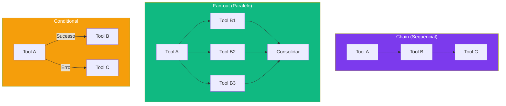

# Capítulo 11: Pipelines de Ferramentas: Orquestrando Acoes Complexas

## 1. Introdução

No Capítulo 10, você construiu ferramentas individualmente. Mas na vida real, resolver um problema geralmente exige múltiplas ferramentas trabalhando em sequência ou paralelo [1]. Neste capítulo, você vai aprender a construir pipelines de ferramentas — orquestrações complexas que o agente executa automaticamente, com hooks, middlewares, chains, e patterns avançados de retry.

Um pipeline é mais do que uma lista de ferramentas — é uma orquestra onde cada instrumento (tool) toca na hora certa, com a intensidade certa, e para na hora certa. O maestro (orquestrador) garante que tudo funciona em harmonia [2].

O Capítulo 10 introduziu a idempotência como requisito escondido para qualquer tool que pudesse ser repetida automaticamente. Este capítulo é onde essa propriedade deixa de ser teórica: todo pipeline com retry depende de que as tools que ele orquestra sejam seguras para executar mais de uma vez. Se você pulou aquela seção, vale revisitá-la antes de configurar retries em produção — um retry sobre uma tool não idempotente não corrige uma falha, duplica um efeito.

## 2. Explica

### Patterns de Pipeline

O DeepSeek Harness suporta vários patterns de orquestração [3]:

**Chain:** Ferramentas executadas em sequência. O output de uma é input da próxima. Padrão mais comum — como uma esteira de montagem. Cada etapa processa o resultado da anterior e passa para a próxima. A configuração `on-fail` de cada step (visto na seção Técnica) é o que diferencia um chain ingênuo de um chain de produção: sem ela, uma falha no meio da sequência propaga de forma implícita e imprevisível; com ela, cada step declara explicitamente se uma falha aborta o pipeline (`stop`), segue para o próximo mesmo assim (`next`), ou aciona uma rotina de desfazimento (`rollback`).

**Fan-out:** Uma ferramenta dispara múltiplas execuções em paralelo. Útil para tarefas independentes que podem rodar simultaneamente — como buscar dados de múltiplas APIs ao mesmo tempo. O resultado final consolida as respostas de todas as execuções paralelas.

A pergunta que todo fan-out precisa responder explicitamente é: o que acontece quando uma das execuções paralelas falha e as outras têm sucesso? Existem três semânticas possíveis, e o pipeline precisa escolher uma deliberadamente em vez de herdar o comportamento padrão por acidente: **fail-fast** (qualquer falha aborta o fan-out inteiro, mesmo que as outras execuções já tenham terminado com sucesso), **best-effort** (o fan-out consolida o que teve sucesso e reporta as falhas junto, sem abortar) e **all-or-nothing com rollback** (se uma falhar, desfaz o efeito das que tiveram sucesso). A consolidação de uma auditoria de código, por exemplo, tolera bem o modo best-effort — um relatório parcial ainda é útil. Já um fan-out que dispara três transações financeiras em paralelo não tolera: precisa de all-or-nothing.

**Conditional:** O pipeline toma decisões baseadas em resultados intermediários. Se a tool A retornou erro, executa a tool B; se retornou sucesso, executa a tool C. É a inteligência do pipeline — ele adapta seu comportamento baseado no que acontece durante a execução.

**Retry-with-backoff:** Quando uma tool falha por timeout ou erro temporário, o pipeline tenta novamente com intervalos crescentes (1s, 2s, 4s, 8s...). Essencial para serviços de rede instáveis [4].

### Hooks e Middlewares

Hooks interceptam o pipeline em pontos específicos [1]:

- **Pre-chain hook:** Executa antes do pipeline começar. Pode preparar dados ou verificar condições — por exemplo, confirmar que um token de autenticação ainda é válido antes de disparar um chain de dez steps que dependem dele.
- **Inter-tool hook:** Executa entre cada tool. Pode transformar output, registrar logs, ou validar resultados — por exemplo, normalizar o formato de data que uma tool retorna antes de passá-lo para a próxima, que espera outro formato.
- **Post-chain hook:** Executa depois do pipeline terminar. Pode consolidar resultados ou enviar notificações — por exemplo, montar um resumo único a partir dos resultados de cada step e publicá-lo num canal de observabilidade, independentemente de o pipeline ter terminado com sucesso ou com falha.

Middlewares são hooks reutilizáveis que podem ser aplicados a qualquer pipeline — como plugins de segurança, logging, ou métricas.

A ordem de registro dos middlewares importa, e é uma fonte recorrente de bugs sutis. Middlewares empilham como camadas: o primeiro registrado é o mais externo (executa antes de todos os outros na entrada, e depois de todos os outros na saída), o último registrado é o mais interno. Um middleware de autenticação precisa vir antes (mais externo) de um middleware de logging de payload — senão o log pode registrar uma chamada que a autenticação ainda vai rejeitar, poluindo métricas com tentativas que nunca deveriam ter sido contadas como execuções reais. Da mesma forma, um middleware que captura exceções para retry precisa envolver os middlewares que podem falhar, não o contrário — um middleware de retry registrado depois do middleware que efetivamente chama a tool nunca vai ver a exceção para decidir se tenta de novo.

## 3. Ilustra

### A Linha de Montagem Automatizada

Na sua oficina de agentes, um pipeline é como uma linha de montagem automatizada. A peça bruta (input) entra por um lado, passa por várias estações de trabalho (tools), e sai do outro lado como produto acabado (resultado final) [5].

O **chain** é a linha de montagem tradicional — cada estação faz uma operação e passa para a próxima. Corte → soldagem → pintura → embalagem.

O **fan-out** é como quando a linha se divide em três ramos paralelos — uma estação pinta a peça azul, outra pinta vermelha, terceira pinta verde — e depois se encontram no final para comparar resultados.

O **retry-with-backoff** é como quando uma máquina dá pau — em vez de parar a linha inteira, a peça volta para o início daquela estação e tenta de novo, com cada tentativa sendo mais cuidadosa.

O **conditional** é o inspetor de qualidade postado entre duas estações — ele decide, peça por peça, se ela segue para a próxima etapa ou se vai para o retrabalho, sem que ninguém precise vir manualmente decidir isso a cada peça que passa. E os **hooks** são os pontos de checagem fixados na linha — não fazem parte da fabricação em si, mas registram, no relógio de ponto, quando cada peça entrou e saiu de cada estação, e alertam o supervisor se algo sair fora do padrão.



## 4. Técnica

### Configurando um Pipeline Chain

```yaml
# pipelines/deploy.yaml
name: deploy-completo
description: Pipeline de deploy: lint → test → build → push → deploy
steps:
  - name: lint
    tool: shell:execute
    params:
      command: "npm run lint"
    on-success: next
    on-fail: stop
    
  - name: test
    tool: shell:execute
    params:
      command: "npm test"
    on-success: next
    on-fail: rollback
    
  - name: build
    tool: shell:execute
    params:
      command: "npm run build"
    on-success: next
    on-fail: rollback
    
  - name: push
    tool: git:push
    params:
      branch: "main"
    on-success: next
    on-fail: rollback
```

### Configurando Fan-out Paralelo

```yaml
# pipelines/analise-multiplas.yaml
name: analise-multiplas-fontes
description: Analisa múltiplas fontes em paralelo
parallel:
  - name: analise-codigo
    tool: analisar-codigo
    params:
      directory: "./src"
      
  - name: analise-testes
    tool: analisar-testes
    params:
      directory: "./tests"
      
  - name: analise-documentacao
    tool: analisar-docs
    params:
      directory: "./docs"
      
consolidate:
  tool: consolidar-relatorio
  params:
    inputs:
      - "{{steps.analise-codigo.result}}"
      - "{{steps.analise-testes.result}}"
      - "{{steps.analise-documentacao.result}}"
```

### Fan-out com Consolidação Best-Effort

O trecho abaixo implementa explicitamente a semântica best-effort discutida na seção Explica: as execuções paralelas usam `Promise.allSettled` (que nunca lança exceção, mesmo que algumas promessas rejeitem) em vez de `Promise.all` (que aborta no primeiro erro e descarta os resultados que já tinham sucesso):

```javascript
async function fanOutBestEffort(ctx, tarefas) {
  const resultados = await Promise.allSettled(
    tarefas.map(t => ctx.tool(t.tool).execute(t.params))
  );

  const sucesso = [];
  const falhas = [];

  resultados.forEach((r, i) => {
    if (r.status === 'fulfilled') {
      sucesso.push({ tarefa: tarefas[i].name, resultado: r.value });
    } else {
      falhas.push({ tarefa: tarefas[i].name, erro: r.reason.message });
    }
  });

  return {
    consolidado: sucesso,
    parcial: falhas.length > 0,
    falhas
  };
}
```

O campo `parcial: true` no retorno é o sinal explícito para o modelo (ou para o próximo step do pipeline) de que o resultado não é completo — evita que um relatório com 2 de 3 fontes analisadas seja apresentado como se fosse completo.

### Configurando Pipeline Conditional

```yaml
# pipelines/deploy-condicional.yaml
name: deploy-com-verificacao
description: Só faz deploy em produção se os testes de staging passarem
steps:
  - name: deploy-staging
    tool: deploy-docker
    params:
      dockerfile: "./Dockerfile"
      tag: "app:staging"
    on-success: next
    on-fail: stop

  - name: smoke-test-staging
    tool: http:request
    params:
      url: "https://staging.exemplo.com/health"
    on-success: next
    on-fail: notify-e-parar

  - name: deploy-producao
    tool: deploy-docker
    params:
      dockerfile: "./Dockerfile"
      tag: "app:latest"
      registry: "docker.io/producao"
    condition: "{{steps.smoke-test-staging.result.status}} == 200"
    on-success: next
    on-fail: rollback
```

O campo `condition` referencia o resultado de um step anterior — o pipeline só executa `deploy-producao` se a expressão avaliar como verdadeira, sem exigir que o modelo decida isso a cada execução. É a diferença entre confiar num agente para "lembrar" de checar staging antes de produção, e garantir isso estruturalmente no pipeline.

### Hooks de Auditoria

```javascript
// hook de auditoria para pipelines
export default function pipelineAuditHook(ctx) {
  ctx.on('pipeline:start', (event) => {
    console.log(`[PIPELINE] ${event.name} iniciado`);
  });

  ctx.on('pipeline:step:complete', (event) => {
    console.log(`[PIPELINE] ${event.step} completado em ${event.duration}ms`);
  });

  ctx.on('pipeline:step:fail', (event) => {
    console.log(`[PIPELINE] ${event.step} falhou: ${event.error}`);
  });
}
```

### Debugging de Pipeline: Onde Procurar Primeiro

Com o hook de auditoria acima instrumentando cada etapa, um pipeline que se comporta de forma inesperada tem três classes de causa — e vale sempre checar nesta ordem, porque cada classe seguinte só faz sentido investigar depois de descartar a anterior:

1. **A etapa individual está falhando:** o log de `pipeline:step:fail` aponta exatamente qual step e qual erro — se o problema está aqui, é um bug na tool daquele step específico, não no pipeline. Comece sempre por descartar essa hipótese, porque é a mais fácil de confirmar ou refutar com o log que já existe.
2. **A ordem de execução não é a esperada:** em fan-out paralelo, a ordem de conclusão dos steps não é garantida — se um step de consolidação assume, implicitamente, que outro step específico já terminou antes dele, mas o pipeline não declarou essa dependência explicitamente, o bug só aparece de forma intermitente (às vezes a ordem "por acaso" sai certa). Esse tipo de bug é o mais caro de debugar justamente porque não reproduz de forma confiável.
3. **O dado passado entre steps mudou de formato:** um step anterior alterou o formato do seu output (a mesma armadilha discutida no Capítulo 10 sobre contratos de saída estáveis), e o step seguinte não foi atualizado para o novo formato. O sintoma aqui costuma ser um erro de parsing ou um campo `undefined`, não uma falha explícita — o pipeline "roda", só que com dado errado.

Pular direto para a hipótese 2 ou 3 sem descartar a 1 primeiro é o erro de debugging mais comum em pipelines — muita gente assume race condition ou contrato quebrado quando o log de `pipeline:step:fail` já mostrava, o tempo todo, uma falha simples e determinística na etapa isolada.

## 5. Aplica

### O Pipeline que Travou para Sempre

Um desenvolvedor configurou um pipeline chain com 5 steps. O step 3 dependia de uma API externa que ficou fora do ar. O pipeline tentou retry 10 vezes (configuração padrão), cada uma com 30 segundos de timeout. Total: 5 minutos de espera antes de reportar erro [4].

### A Prática Correta

```yaml
# Configuração inteligente de retry
steps:
  - name: chamada-api
    tool: http:request
    retry:
      max-attempts: 3
      backoff: exponential
      base-delay: 1000  # 1s
      max-delay: 10000  # 10s
      retry-on:
        - "timeout"
        - "5xx"
        - "rate-limit"
```

Recomendações práticas para pipelines robustos — não há número universal, cada valor abaixo deve ser calibrado ao SLA do serviço dependente e revisado com dados reais de produção, mas servem como ponto de partida sensato [3]:
1. **Prefira um número pequeno de retries (ordem de 3 a 5)** — acima disso, a probabilidade marginal de sucesso adicional tende a cair rápido, enquanto o tempo total de espera do usuário só cresce.
2. **Prefira backoff exponencial a intervalos fixos** — crescer o intervalo entre tentativas (ex.: dobrar a cada tentativa) espalha a carga sobre o serviço que está se recuperando, em vez de martelar no mesmo ritmo que talvez tenha causado a instabilidade.
3. **Defina sempre um timeout por step, curto o suficiente para o caso de uso** — nenhum step deve poder rodar indefinidamente; o valor exato depende do que o step faz, mas ausência de timeout é sempre um bug.
4. **Logs em cada step** — para debug quando algo falha.
5. **Rollback automático** — se o deploy falhar, desfazer mudanças.

Esse padrão de retry não escala indefinidamente: acima de 5 tentativas o ganho marginal de sucesso cai rápido, e o tempo total de espera do usuário passa a ser um problema maior que a falha original que o retry tentava mascarar. Quando o serviço dependente está fora do ar por minutos (não segundos), a estratégia correta deixa de ser "tentar de novo" e passa a ser falhar rápido, alertar e deixar o operador decidir — insistir cegamente só empurra a mesma falha para mais tarde, com menos contexto de debug.

Essas cinco práticas não são medições empíricas deste livro — são heurísticas de engenharia amplamente adotadas em sistemas de orquestração de longa duração, e a justificativa de cada uma está na mecânica do próprio problema (rede instável, serviço sobrecarregado, usuário esperando), não em um benchmark específico.

### Composição de Patterns na Prática

Os quatro patterns descritos neste capítulo raramente aparecem isolados em um pipeline real — a composição entre eles é onde a orquestração ganha poder. O pipeline `deploy-condicional.yaml` desta seção já combina chain (a sequência staging → smoke-test → produção) com conditional (o `condition` que só libera produção se o smoke test passar). Adicionar um fan-out nesse mesmo pipeline — por exemplo, rodar smoke tests contra três regiões de staging em paralelo antes do `deploy-producao` — exigiria apenas trocar o step `smoke-test-staging` por um bloco `parallel`, e ajustar a condição para agregar os três resultados (`todos os três retornaram 200`) em vez de checar um único.

Essa composição é também onde a robustez de um pipeline se prova ou quebra: um retry mal configurado dentro de um fan-out multiplica o problema — se três execuções paralelas falham e cada uma tenta 5 vezes com backoff, o tempo total até o fan-out inteiro desistir não é o tempo de uma tentativa, é o pior caso das três, cada uma correndo seu próprio backoff. Dimensionar retry e backoff pensando apenas no chain sequencial, e depois reaproveitar a mesma configuração dentro de um fan-out sem revisar o tempo total, é como o desenvolvedor do exemplo desta seção descobriu — só que multiplicado pelo grau de paralelismo.

## 6. Conclusão

Neste capítulo, você aprendeu a orquestrar múltiplas ferramentas em pipelines complexos — chains sequenciais, fan-outs paralelos (com suas três semânticas possíveis de falha parcial), conditionais que decidem estruturalmente em vez de depender do modelo, hooks e middlewares com ordem de composição, e retries com backoff calibrados ao SLA real do serviço dependente. Pipelines são o que transforma um agente que executa ações isoladas em um agente que resolve problemas complexos automaticamente — e a idempotência das tools que os compõem, discutida no Capítulo 10, é a fundação silenciosa que torna qualquer retry seguro.

No próximo capítulo, você vai construir um pipeline RAG completo — memória de longo prazo que permite ao agente buscar e utilizar informações de documentos grandes.

## 7. Referências Bibliográficas

[1] DEEPSEEK AI. *DeepSeek Harness developer preview*. Disponível em: https://deepseek.com/harness/en/. Acesso em: 23 ago. 2026.

[2] HABR. *Inside DeepSeek Harness*. Disponível em: https://habr.com/en/articles/1070958/. Acesso em: 23 ago. 2026.

[3] IDEABOSQUE. *Long-running Agent Patterns*. Disponível em: https://www.ideabosque.com/library/long-running-agent-patterns-keeping-agents-alive-across-hours-and-days/. Acesso em: 23 ago. 2026.

[4] LINKEDIN (Tony Ren). *DeepSeek Harness: Agent Operating System*. Disponível em: https://www.linkedin.com/posts/tonyren_i-spent-the-evening-in-the-deepseek-harness-activity-7493848102076882944-GGXB. Acesso em: 23 ago. 2026.

[5] TOWARDS AI. *DeepSeek Harness Explained*. Disponível em: https://pub.towardsai.net/deepseek-harness-explained-when-the-ai-model-is-just-a-plugin-16b2496f3d01. Acesso em: 23 ago. 2026.

[6] FLOATBOAT.AI. *Cordis — The Plugin Kernel*. Disponível em: https://floatboat.ai/blog/cordis-plugin-framework. Acesso em: 23 ago. 2026.

[7] AGENTATLAS. *Cordis Explained*. Disponível em: https://agentatlas.org/blog/cordis-explained-how-deepseek-harness-plugin-framework-works/. Acesso em: 23 ago. 2026.

[8] MEDIUM (data-and-beyond). *Decoding DeepSeek Harness*. Disponível em: https://medium.com/data-and-beyond/decoding-deepseek-harness-the-open-source-runtime-behind-composable-ai-agents-c2299e992870. Acesso em: 23 ago. 2026.

[9] TOWARDS AI. *DeepSeek Harness vs Claude Code*. Disponível em: https://pub.towardsai.net/deepseek-harness-vs-claude-code-a-plugin-architecture-teardown-da3c916f3af1. Acesso em: 23 ago. 2026.

[10] ATLASCLOUD. *DeepSeek Harness Plugins: The 7 Worth It*. Disponível em: https://www.atlascloud.ai/blog/tips/deepseek-harness-plugins. Acesso em: 23 ago. 2026.

[11] COMPOSIO. *Best plugins for DeepSeek Harness*. Disponível em: https://composio.dev/content/best-deepseek-harness-plugins. Acesso em: 23 ago. 2026.

[12] MINDSTUDIO. *What Is DeepSeek Harness?*. Disponível em: https://www.mindstudio.ai/blog/deepseek-harness-agentic-coding. Acesso em: 23 ago. 2026.

[13] DATACAMP. *DeepSeek Harness Tutorial*. Disponível em: https://www.datacamp.com/tutorial/deepseek-harness. Acesso em: 23 ago. 2026.

[14] SPRINGBRAND. *DeepSeek Harness (dsh): Everything Is a Plugin*. Disponível em: https://springbrand.ai/deepseek-harness. Acesso em: 23 ago. 2026.

[15] YOUTUBE. *Every Deepseek Harness Concept Explained*. Disponível em: https://www.youtube.com/watch?v=24UCnAs7MVg. Acesso em: 23 ago. 2026.

[16] YOUTUBE. *NEW Deepseek Agent Harness EXPLAINED*. Disponível em: https://www.youtube.com/watch?v=Hpw4fAHlHDw. Acesso em: 23 ago. 2026.

[17] EXPLOREX.AI. *DeepSeek Harness v0.1*. Disponível em: https://explainx.ai/blog/deepseek-harness-v0-1-plugin-first-agent-stack-august-2026. Acesso em: 23 ago. 2026.

[18] DEEPSEEKHARNESSAI. *Security Plugins for DeepSeek Harness*. Disponível em: https://deepseekharnessai.com/categories/security. Acesso em: 23 ago. 2026.

[19] MEDIUM (kaliarch). *DeepSeek Harness: When the Agent Loop Itself Becomes a Plugin*. Disponível em: https://medium.com/@kaliarch/deepseek-harness-when-the-agent-loop-itself-becomes-a-plugin-7fad0aa9de1c. Acesso em: 23 ago. 2026.

[20] 0XSLINE. *awesome-deepseek-harness*. GitHub. Disponível em: https://github.com/0xsline/awesome-deepseek-harness. Acesso em: 23 ago. 2026.
