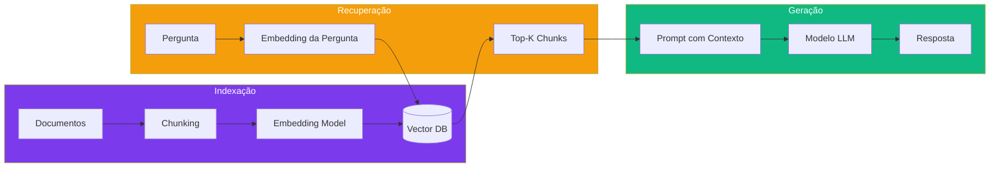

# Capítulo 12: RAG Local: Memoria de Longo Prazo para Agentes

## 1. Introdução

No Capítulo 11, você aprendeu a orquestrar pipelines de ferramentas. Mas o que acontece quando o agente precisa acessar informações que não cabem no contexto de uma sessão? Documentação de projetos, bases de conhecimento, repositórios de código inteiros — o RAG (Retrieval-Augmented Generation) resolve esse problema [1].

RAG é a técnica que transforma um agente de "memória curta" em um agente com "memória de longo prazo". Em vez de depender apenas do que o modelo "lembra" (parâmetros treinados), ele busca informações relevantes em uma base de dados externa antes de gerar uma resposta [2].

Neste capítulo, você vai construir um pipeline RAG completo e self-hosted: embedding models para converter texto em vetores, vector databases (ChromaDB, Qdrant, Weaviate) para armazenar e buscar, e integração direta com o DeepSeek Harness.

RAG é hoje um dos padrões mais estudados em sistemas de linguagem aplicados — a quantidade de pesquisa publicada sobre variações do tema (recuperação híbrida, quantização de embeddings, mitigação de ruído, avaliação de qualidade) cresce rapidamente porque a técnica se tornou peça central de praticamente qualquer sistema que precise responder com base em conhecimento que não estava nos dados de treinamento do modelo [25]. Este capítulo cobre a versão self-hosted mais direta do padrão; os refinamentos mais recentes da literatura aparecem ao longo do texto como extensões, não como pré-requisito para a primeira versão funcional.

## 2. Explica

### O que é RAG?

RAG é uma técnica que combina recuperação de informação com geração de texto. Em vez de o modelo depender apenas do que "lembra" (parâmetros treinados), ele busca informações relevantes em uma base de dados externa antes de gerar uma resposta [3]:

1. **Indexação:** Documentos são divididos em chunks (pedaços), convertidos em vetores (embeddings), e armazenados em um banco de vetores. Essa etapa roda uma única vez por documento (ou sempre que o documento muda) — é o custo fixo do pipeline, pago antecipadamente e não a cada pergunta do usuário.

2. **Recuperação:** Quando o usuário faz uma pergunta, a pergunta é convertida em vetor, e os chunks mais similares são recuperados do banco. Essa etapa roda a cada pergunta — é o custo variável, e é onde a latência do RAG mais aparece para quem está usando o sistema.

3. **Geração:** O contexto recuperado é injetado no prompt do modelo, que gera uma resposta baseada nas informações encontradas. Se a recuperação trouxe os chunks errados, nenhuma qualidade de geração compensa — o modelo só pode responder bem com o que foi colocado à sua frente.

### Embedding Models

Embedding models convertem texto em vetores numéricos — representações matemáticas que capturam o significado semântico [4]:

- **sentence-transformers:** Biblioteca Python leve, múltiplos modelos pré-treinados
- **BGE (BAAI):** Modelos de alta qualidade para busca semântica
- **E5 (Microsoft):** Modelos otimizados para retrieval

Para uso local, o `all-MiniLM-L6-v2` do sentence-transformers é um excelente ponto de partida: é um modelo compacto o suficiente para rodar em CPU comum sem GPU dedicada, e funciona bem para a maioria dos casos de busca semântica em documentação técnica [4]. O trade-off é capacidade semântica menor que modelos maiores como BGE-large ou E5-large — a economia de custo computacional tem um custo em qualidade de recuperação para consultas mais ambíguas ou multilíngues, algo que a literatura de RAG chama atenção repetidamente ao avaliar sistemas de embedding vetorial [23].

### Vector Databases

Cada banco de vetores tem seu caso de uso ideal [5]:

**ChromaDB:** Leve, ideal para desenvolvimento local. Integração fácil com Python. Não escala para produção com milhões de vetores.

**Qdrant:** Escalável, escrito em Rust. API REST/gRPC. Self-hostable. Ideal para produção com dezenas de milhões de vetores.

**Weaviate:** Mais features (busca vetorial + keyword), GraphQL API. Self-hostable. Bom para aplicações que precisam de busca híbrida.

**Milvus:** Para produção em larga escala (bilhões de vetores). Requer infraestrutura dedicada.

### O Problema do Ruído na Recuperação

A intuição inicial de quem implementa RAG por conta própria é que "mais contexto recuperado é sempre melhor" — se 3 chunks ajudam, 10 devem ajudar mais. A pesquisa sobre o tema mostra o contrário na prática: aumentar o número de chunks recuperados sem filtrar por relevância introduz ruído que pode degradar a qualidade da resposta em vez de melhorá-la, porque documentos irrelevantes competem por atenção do modelo com os documentos que de fato importam [21]. O efeito é contraintuitivo justamente porque parece que "dar mais informação para o modelo" deveria ser estritamente positivo — na prática, contexto irrelevante tem custo, não é neutro.

Isso reforça, com base em evidência de pesquisa, a recomendação prática de manter Top-K moderado (3-5 chunks) da seção Aplica deste capítulo: o ganho de recall ao aumentar K precisa ser pesado contra a perda de precisão por diluição de sinal relevante em meio a ruído.

### Quantização e Compressão de Embeddings

O mesmo trade-off entre economia de recursos e perda de qualidade que aparece na quantização de modelos de linguagem (Capítulo 6 abordou GGUF/AWQ/GPTQ) também se aplica aos vetores de embedding armazenados na vector database: representar cada vetor em 4 bits em vez de float32 reduz drasticamente o espaço de armazenamento e a latência de busca, ao custo de precisão na similaridade calculada [22]. Para bases de conhecimento de algumas centenas de documentos, essa otimização raramente compensa a complexidade adicional; mas em bases corporativas com milhões de chunks indexados, a diferença de custo de armazenamento e velocidade de busca pode justificar aceitar a perda de precisão, de forma análoga a como Q4_K_M GGUF é aceito para inferência local mesmo perdendo qualidade mensurável em relação ao modelo original.

### RAG Híbrido: Vetorial, Keyword e Grafo

Busca puramente vetorial (a que este capítulo descreve até aqui) tem um ponto cego conhecido: ela captura similaridade semântica, mas pode falhar em consultas que dependem de correspondência exata — um nome de função, um número de versão, um identificador específico — porque o embedding desses tokens específicos se dilui entre os vizinhos semânticos. Sistemas híbridos combinam busca vetorial com busca por palavra-chave (keyword/BM25) para cobrir os dois casos simultaneamente [23]. Uma extensão mais recente desse conceito integra grafos de conhecimento à recuperação vetorial: em vez de tratar cada chunk como independente, o grafo modela relações explícitas entre entidades mencionadas nos documentos, permitindo recuperar não só "chunks parecidos com a pergunta" mas também "chunks conectados à entidade da pergunta por um relacionamento relevante" [24]. O Weaviate, mencionado nesta seção como opção de vector database, já nasce com essa filosofia híbrida (vetorial + keyword via GraphQL); Qdrant e ChromaDB exigem compor a camada de keyword search por fora.

### Avaliação de Qualidade de RAG

Sem uma forma de medir, ajustar Top-K, reranking ou chunking se torna palpite guiado por vibe em vez de decisão fundamentada. A métrica mais direta para avaliar um pipeline de RAG é recall@k: dado um conjunto de perguntas de teste com a resposta certa conhecida, recall@k mede em quantas dessas perguntas o chunk que de fato continha a resposta apareceu entre os K resultados recuperados. Se recall@5 é baixo, aumentar K às vezes ajuda — mas, como discutido na seção sobre ruído, também tem custo; se recall@5 já é alto e a resposta final do agente ainda está errada, o problema não está na recuperação, está em como o modelo usa o contexto recuperado (um problema de prompt, não de RAG).

Montar esse conjunto de teste não exige ferramenta sofisticada — um punhado de perguntas reais que o time já sabe a resposta certa, revisado manualmente conforme a base de conhecimento evolui, já permite comparar "configuração A vs configuração B" de forma objetiva antes de trocar em produção. Sem esse hábito, toda mudança de Top-K ou de embedding model é uma aposta às cegas sobre se a qualidade da recuperação melhorou ou piorou.

## 3. Ilustra

### A Biblioteca da Oficina

Na sua oficina de agentes, o RAG é como uma biblioteca técnica organizada. Quando você precisa de informações sobre um assunto específico, não precisa decorar todos os livros — vai na biblioteca, busca pelo índice, e encontra exatamente o que precisa [6].

O embedding model é o catalogador da biblioteca. Ele lê cada livro (documento), identifica os conceitos principais, e cria um índice de referência cruzada (vetor). Quando alguém pergunta sobre "como configurar Docker", o catalogador encontra automaticamente os trechos mais relevantes — não precisa ler o livro inteiro.

A vector database é o sistema de catalogação da biblioteca. É onde os índices são armazenados e onde as buscas são feitas. Cada vez que um novo livro chega (novo documento), o catalogador o processa e adiciona ao catálogo.



## 4. Técnica

### Setup com ChromaDB (Local)

```python
# rag_setup.py
import chromadb
from sentence_transformers import SentenceTransformer

# Inicializar modelo de embeddings
model = SentenceTransformer('all-MiniLM-L6-v2')

# Criar cliente ChromaDB
client = chromadb.PersistentClient(path="./chroma_db")
collection = client.get_or_create_collection("documentos")

# Função para indexar documentos
def indexar_documento(texto, metadata):
    # Dividir em chunks de 500 caracteres
    chunks = [texto[i:i+500] for i in range(0, len(texto), 500)]
    
    for i, chunk in enumerate(chunks):
        embedding = model.encode(chunk).tolist()
        collection.add(
            ids=[f"{metadata['id']}_{i}"],
            embeddings=[embedding],
            documents=[chunk],
            metadatas=[{**metadata, "chunk_index": i}]
        )

# Função para buscar
def buscar(query, n_results=3):
    query_embedding = model.encode(query).tolist()
    results = collection.query(
        query_embeddings=[query_embedding],
        n_results=n_results
    )
    return results['documents'][0]
```

### Setup com Qdrant (Produção)

```bash
# Instalar Qdrant via Docker
docker run -p 6333:6333 -v qdrant_data:/qdrant/storage qdrant/qdrant

# Python
pip install qdrant-client
```

```python
from qdrant_client import QdrantClient
from qdrant_client.models import VectorParams, Distance

client = QdrantClient("localhost", port=6333)

# Criar coleção
client.create_collection(
    collection_name="documentos",
    vectors_config=VectorParams(size=384, distance=Distance.COSINE)
)
```

### Reranking: Refinando os Resultados do Top-K

A busca vetorial inicial (o `collection.query` do exemplo ChromaDB) usa um embedding model leve e rápido para varrer toda a base rapidamente, mas essa velocidade tem um custo de precisão — o embedding de um chunk inteiro é uma compressão aproximada do seu conteúdo. Uma técnica comum para mitigar o problema do ruído discutido na seção Explica é o **reranking em duas etapas**: recuperar um conjunto maior de candidatos (ex.: Top-20) com o embedding model rápido, e depois reordenar apenas esses 20 com um modelo mais lento e mais preciso (um cross-encoder, que compara par a par a pergunta com cada candidato, em vez de comparar vetores pré-computados), entregando ao modelo só o Top-3 ou Top-5 final já refinado:

```python
# reranking.py — segunda passada sobre os candidatos do ChromaDB
from sentence_transformers import CrossEncoder

reranker = CrossEncoder('cross-encoder/ms-marco-MiniLM-L-6-v2')

def buscar_com_reranking(query, n_candidatos=20, n_final=3):
    candidatos = buscar(query, n_results=n_candidatos)

    pares = [[query, chunk] for chunk in candidatos]
    scores = reranker.predict(pares)

    ranqueados = sorted(zip(candidatos, scores), key=lambda x: x[1], reverse=True)
    return [chunk for chunk, score in ranqueados[:n_final]]
```

O custo do cross-encoder é maior por candidato do que a busca vetorial pura, mas como ele só processa os 20 candidatos já pré-filtrados (não a base inteira), o custo total permanece administrável — é o mesmo princípio de funil aplicado ao Capítulo 11: filtrar rápido e grosseiro primeiro, refinar lento e preciso depois, só sobre o que sobrou do primeiro filtro.

### Integrando com DeepSeek Harness

```javascript
// Plugin de RAG para o harness
export default function ragPlugin(ctx) {
  ctx.service('rag-search', {
    async execute({ query, collection }) {
      // Buscar chunks relevantes
      const results = await fetch('http://localhost:8000/rag/search', {
        method: 'POST',
        body: JSON.stringify({ query, collection, top_k: 3 })
      });
      
      const chunks = await results.json();
      
      // Formatar para o modelo
      return {
        context: chunks.map(c => c.document).join('\n\n'),
        sources: chunks.map(c => c.metadata.source)
      };
    }
  });
}
```

## 5. Aplica

### O RAG que Retornava Lixo

Um desenvolvedor implementou RAG com chunks de 2000 caracteres. O embedding model não conseguia capturar o significado de chunks tão grandes — os resultados da busca eram irrelevantes 60% das vezes [4].

A causa: chunks grandes diluem o significado. Um documento sobre "configuração de Docker" misturado com "introdução ao Linux" no mesmo chunk confunde o embedding model.

### A Prática Correta

Regras para RAG de qualidade:

| Parâmetro | Recomendação | Por quê |
|-----------|-------------|---------|
| Chunk size | 300-500 chars | Tamanho ideal para embeddings |
| Overlap | 50-100 chars | Mantém contexto entre chunks |
| Embedding model | all-MiniLM-L6-v2 | Leve e eficiente para local |
| Top-K | 3-5 chunks | Suficiente sem poluir o contexto |
| Distância | Cosine | Padrão para busca semântica |

### O Limite do RAG Local: Quando Migrar de ChromaDB

A configuração descrita nesta seção — ChromaDB local, `all-MiniLM-L6-v2`, chunks pequenos — atende bem bases de conhecimento de até algumas centenas de milhares de chunks, o volume típico da documentação de um projeto ou de uma base de conhecimento departamental. A partir de alguns milhões de vetores, contudo, o ChromaDB local começa a mostrar seu limite: a ausência de sharding e a dependência de índice em disco único fazem a latência de busca crescer de forma perceptível, e a estratégia deixa de ser a escolha certa. Nesse volume — o cenário de RAG corporativo com múltiplos times e bases de conhecimento consolidadas —, a migração para Qdrant ou Milvus com particionamento horizontal e réplicas passa a ser necessária, não opcional; é exatamente o corte de escala que a seção Explica descreveu entre "ideal para desenvolvimento local" e "produção com dezenas de milhões de vetores".

## 6. Conclusão

Neste capítulo, você construiu um pipeline RAG completo — da indexação de documentos à recuperação de contexto para o modelo. Embedding models convertem texto em vetores, vector databases armazenam e buscam, e a integração com o DeepSeek Harness permite que o agente acesse informações de bases grandes sem sobrecarregar o contexto. Você também viu por que "recuperar mais chunks" não é estritamente melhor (o problema do ruído), como reranking em duas etapas refina o Top-K inicial, e onde termina o limite prático de uma configuração local com ChromaDB.

Vale notar a diferença de natureza entre RAG e fine-tuning, tema do próximo capítulo: RAG injeta conhecimento externo no momento da consulta, sem alterar nenhum parâmetro do modelo — é rápido de atualizar (basta reindexar) mas depende inteiramente da qualidade da recuperação. Fine-tuning altera os próprios parâmetros do modelo para incorporar um padrão ou domínio — é mais lento e caro de atualizar, mas não depende de uma etapa de busca em tempo de execução. As duas técnicas não são substitutas uma da outra; sistemas de produção maduros frequentemente combinam as duas.

No próximo capítulo, você vai personalizar os próprios modelos com fine-tuning — treinando um DeepSeek para seu domínio específico.

## 7. Referências Bibliográficas

[1] BLAŠKOVIĆ, Luka et al. *Robust Clinical Querying with Local LLMs*. In: Big Data and Cognitive Computing, 2025. Disponível em: https://doi.org/10.3390/bdcc9100256. Acesso em: 23 ago. 2026.

[2] FIRECRAWL. *Best Vector Databases in 2026*. Disponível em: https://www.firecrawl.dev/blog/best-vector-databases. Acesso em: 23 ago. 2026.

[3] KUNALGANGLANI. *Weaviate vs Chroma 2026*. Disponível em: https://www.kunalganglani.com/blog/weaviate-vs-chroma-vector-db. Acesso em: 23 ago. 2026.

[4] BRAINTRUST. *Best vector databases for RAG in 2026*. Disponível em: https://www.braintrust.dev/articles/best-vector-databases-for-rag-2026. Acesso em: 23 ago. 2026.

[5] ALEXEWERLOF. *Using local LLMs for agentic coding*. Disponível em: https://blog.alexewerlof.com/p/local-llms-for-agentic-coding. Acesso em: 23 ago. 2026.

[6] TOWARDS AI. *DeepSeek Harness Explained*. Disponível em: https://pub.towardsai.net/deepseek-harness-explained-when-the-ai-model-is-just-a-plugin-16b2496f3d01. Acesso em: 23 ago. 2026.

[7] HABR. *Inside DeepSeek Harness*. Disponível em: https://habr.com/en/articles/1070958/. Acesso em: 23 ago. 2026.

[8] FLOATBOAT.AI. *Cordis — The Plugin Kernel*. Disponível em: https://floatboat.ai/blog/cordis-plugin-framework. Acesso em: 23 ago. 2026.

[9] AGENTATLAS. *Cordis Explained*. Disponível em: https://agentatlas.org/blog/cordis-explained-how-deepseek-harness-plugin-framework-works/. Acesso em: 23 ago. 2026.

[10] MEDIUM (data-and-beyond). *Decoding DeepSeek Harness*. Disponível em: https://medium.com/data-and-beyond/decoding-deepseek-harness-the-open-source-runtime-behind-composable-ai-agents-c2299e992870. Acesso em: 23 ago. 2026.

[11] TOWARDS AI. *DeepSeek Harness vs Claude Code*. Disponível em: https://pub.towardsai.net/deepseek-harness-vs-claude-code-a-plugin-architecture-teardown-da3c916f3af1. Acesso em: 23 ago. 2026.

[12] ATLASCLOUD. *DeepSeek Harness Plugins: The 7 Worth It*. Disponível em: https://www.atlascloud.ai/blog/tips/deepseek-harness-plugins. Acesso em: 23 ago. 2026.

[13] COMPOSIO. *Best plugins for DeepSeek Harness*. Disponível em: https://composio.dev/content/best-deepseek-harness-plugins. Acesso em: 23 ago. 2026.

[14] MINDSTUDIO. *What Is DeepSeek Harness?*. Disponível em: https://www.mindstudio.ai/blog/deepseek-harness-agentic-coding. Acesso em: 23 ago. 2026.

[15] DATACAMP. *DeepSeek Harness Tutorial*. Disponível em: https://www.datacamp.com/tutorial/deepseek-harness. Acesso em: 23 ago. 2026.

[16] SPRINGBRAND. *DeepSeek Harness (dsh): Everything Is a Plugin*. Disponível em: https://springbrand.ai/deepseek-harness. Acesso em: 23 ago. 2026.

[17] YOUTUBE. *Every Deepseek Harness Concept Explained*. Disponível em: https://www.youtube.com/watch?v=24UCnAs7MVg. Acesso em: 23 ago. 2026.

[18] YOUTUBE. *NEW Deepseek Agent Harness EXPLAINED*. Disponível em: https://www.youtube.com/watch?v=Hpw4fAHlHDw. Acesso em: 23 ago. 2026.

[19] EXPLOREX.AI. *DeepSeek Harness v0.1*. Disponível em: https://explainx.ai/blog/deepseek-harness-v0-1-plugin-first-agent-stack-august-2026. Acesso em: 23 ago. 2026.

[20] DEEPSEEKHARNESSAI. *Security Plugins for DeepSeek Harness*. Disponível em: https://deepseekharnessai.com/categories/security. Acesso em: 23 ago. 2026.

[21] CUCONASU, Florin et al. *The Power of Noise: Redefining Retrieval for RAG Systems*. 2024. Disponível em: https://doi.org/10.1145/3626772.3657834. Acesso em: 23 ago. 2026.

[22] JEONG, Taehee. *4bit-Quantization in Vector-Embedding for RAG*. In: arXiv. 2025. Disponível em: http://arxiv.org/abs/2501.10534v1. Acesso em: 23 ago. 2026.

[23] KIRAN, S. *Hybrid Retrieval-Augmented Generation (RAG) Systems with Embedding Vector Databases*. In: International Journal of Scientific Research in Computer Science Engineering and Information Technology. 2025. Disponível em: https://doi.org/10.32628/cseit25112702. Acesso em: 23 ago. 2026.

[24] SARMAH, Bhaskarjit et al. *HybridRAG: Integrating Knowledge Graphs and Vector Retrieval Augmented Generation for Efficient Information Extraction*. 2024. Disponível em: https://doi.org/10.1145/3677052.3698671. Acesso em: 23 ago. 2026.

[25] GAO, Yunfan et al. *Retrieval-Augmented Generation for Large Language Models: A Survey*. In: arXiv (Cornell University). 2023. Disponível em: http://arxiv.org/abs/2312.10997. Acesso em: 23 ago. 2026.
