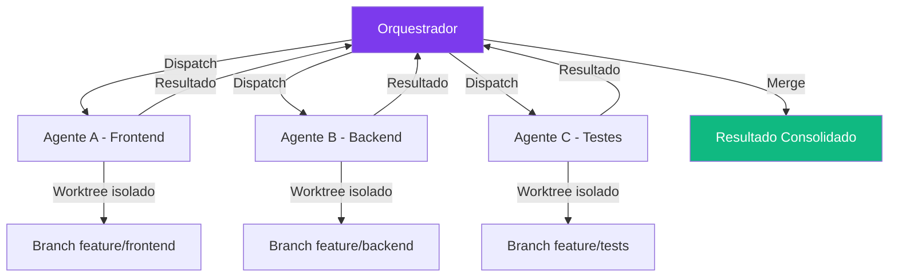

# Capítulo 14: Multi-Agente: Coordenando uma Equipe de Agentes

## 1. Introdução

No Capítulo 13, você personalizou o modelo com fine-tuning. Agora é hora de escalar: em vez de um único agente fazendo tudo, você vai coordenar múltiplos agentes trabalhando em paralelo [1]. Cada agente tem seu próprio worktree isolado, sua própria sessão, e sua própria tarefa — e todos colaboram para resolver problemas complexos.

Multi-agente é o que transforma um assistente individual em uma equipe produtiva. Assim como uma empresa não depende de um único funcionário para fazer tudo, um sistema de agentes não depende de um único agente para resolver todos os problemas [2].

Mas paralelismo não é gratuito — e esse é o fio condutor deste capítulo. Cada agente adicional soma overhead de coordenação, disco duplicado e superfície para conflito. A pergunta interessante não é "quantos agentes posso rodar em paralelo", mas "a partir de quantos agentes o custo de coordenar supera o ganho de paralelizar" — pergunta que respondemos com números concretos ao longo das próximas seções, e que fecha o capítulo na seção Aplica.

## 2. Explica

### Worktrees para Paralelismo

Cada agente em paralelo opera em seu próprio git worktree — um branch isolado do repositório. Isso permite que múltiplos agentes modifiquem os mesmos arquivos sem conflitos [3]. Tecnicamente, um worktree não duplica o histórico do repositório: os objetos Git (`.git/objects`) continuam compartilhados entre todos os worktrees, só o índice (`HEAD`, staging area) e o diretório de trabalho são independentes. Isso significa que criar um worktree é rápido — mas o custo em disco do checkout completo dos arquivos ainda existe, e ele se multiplica pelo número de agentes ativos (ver "Custos Ocultos do Paralelismo" abaixo).

```bash
# Criar worktrees para cada agente
git worktree add ../agent-a feature/frontend
git worktree add ../agent-b feature/backend
git worktree add ../agent-c feature/tests

# Cada agente trabalha em sua cópia isolada
cd ../agent-a && dsh --mode standard  # Agente A: frontend
cd ../agent-b && dsh --mode standard  # Agente B: backend
cd ../agent-c && dsh --mode standard  # Agente C: testes
```

### Custos Ocultos do Paralelismo

Worktrees isolados resolvem conflito de arquivo, mas não são gratuitos. Cada `git worktree add` cria uma cópia completa do checkout — não do histórico do repositório (que é compartilhado via `.git`), mas de todos os arquivos do diretório de trabalho [2][4]. Um repositório com 2 GB de arquivos versionados, replicado em 5 worktrees simultâneos, consome 10 GB adicionais de disco só em checkouts — um custo que cresce linearmente com o número de agentes e é frequentemente esquecido até o disco encher no meio de um pipeline longo [2].

### Patterns de Orquestração

O DeepSeek Harness suporta três patterns de coordenação entre agentes [1]:

**Dispatch:** o orquestrador distribui tarefas para agentes workers, cada um recebendo um escopo fechado (ex.: "implemente o endpoint /api/leads", "escreva os testes de integração do checkout"). O dispatch pode ser paralelo (todos os workers começam ao mesmo tempo) ou em fila (um worker por vez, liberando o próximo conforme capacidade de VRAM/CPU disponível) [1][3].

**Wait:** o orquestrador aguarda a conclusão de todos os workers antes de prosseguir — essencial quando a próxima etapa depende do resultado de todas as anteriores (ex.: só faz sentido rodar a suíte de testes depois que frontend E backend terminaram). Um `wait: all` ingênuo, porém, trava o pipeline inteiro se um único worker travar; por isso pipelines de produção combinam wait com timeout e retry (ver seção Técnica) [1].

**Escalate:** quando um worker encontra um problema fora do seu escopo ou da sua competência (ex.: o agente de testes descobre um bug de arquitetura, não um bug de teste), ele escala para o orquestrador ou para outro worker mais especializado, em vez de tentar resolver por conta própria e arriscar uma mudança fora do escopo revisado [3].

### Comunicação entre Agentes

Agentes se comunicam através de três canais, cada um com um custo diferente [4]:

- **Shared Context:** contexto compartilhado via Cordis — serviços e eventos tipados
- **Message Passing:** mensagens diretas entre agentes via sessões
- **Result Aggregation:** consolidação dos resultados de múltiplos agentes em um output final

### Quando Cada Modo de Comunicação Compensa

Shared Context via Cordis é eficiente para estado que todos os agentes precisam ler (configuração, resultados parciais), mas não foi pensado para alto volume de eventos — é um barramento de contexto, não uma fila de mensagens dedicada [1][3]. Message Passing direto entre sessões é melhor para coordenação ponto-a-ponto (ex.: o agente de testes avisando o agente de backend que um endpoint quebrou), mas exige que cada agente saiba explicitamente para quem enviar — não escala bem além de um punhado de agentes sem um roteador central. Result Aggregation, por fim, só funciona bem quando os resultados dos workers são independentes o suficiente para merge automático; quando dois workers editam o mesmo arquivo, a agregação vira meramente um merge de git — e merge de git não entende intenção, só texto [3].

### Cadeias de Escalonamento

Escalate raramente é um salto direto de worker para orquestrador humano — na prática, funciona melhor como uma cadeia de níveis [1]. Um worker de testes que encontra uma falha de asserção resolve sozinho (ajusta o teste). Se a falha revela um bug de lógica fora do escopo dele, escala para o worker responsável por aquele módulo. Se o problema é de arquitetura (ex.: dois módulos foram desenhados com contratos incompatíveis), o worker especializado escala para o orquestrador, que decide se pausa o pipeline ou aciona um humano. Pular direto para "humano" a cada obstáculo pequeno derrota o propósito do multi-agente — o ganho de paralelismo desaparece se toda escalada interrompe o operador.

## 3. Ilustra

### A Equipe de Mecânicos

Na sua oficina de agentes, agentes em paralelo são como uma equipe de mecânicos trabalhando em carros diferentes ao mesmo tempo. Cada mecânico tem sua própria bancada (worktree), suas próprias ferramentas (tools), e sua própria tarefa (prompt) [5].

O orquestrador é o chefe da oficina — ele distribui os carros entre os mecânicos, monitora o progresso, e no final verifica se todos os carros estão prontos antes de entregar ao cliente.

Se um mecânico encontra uma peça que não tem (problema que não consegue resolver), ele chama o chefe (escalate), que decide se designa outro mecânico ou compra a peça.



## 4. Técnica

### Configurando Multi-Agent com Worktrees

```bash
# Script de setup multi-agente
#!/bin/bash
REPO="/home/user/projeto"
AGENTS=("frontend" "backend" "tests")

for agent in "${AGENTS[@]}"; do
  # Criar worktree
  git -C "$REPO" worktree add "../${agent}" "feature/${agent}"
  
  # Criar sessão isolada
  dsh session create --name "agent-${agent}" --worktree "../${agent}"
  
  # Configurar agente com foco específico
  dsh config set agent.focus "${agent}" --session "agent-${agent}"
done

echo "✅ ${#AGENTS[@]} agentes configurados"
```

### Orquestração com Pipeline

```yaml
# pipelines/multi-agente.yaml
name: desenvolvimento-completo
orchestrator: standard
agents:
  - name: frontend
    focus: "React, TypeScript, UI components"
    worktree: "feature/frontend"
    tools: ["filesystem", "shell"]
    
  - name: backend
    focus: "Python, FastAPI, database"
    worktree: "feature/backend"
    tools: ["filesystem", "shell", "database"]
    
  - name: tests
    focus: "pytest, integration tests"
    worktree: "feature/tests"
    tools: ["filesystem", "shell"]

dispatch:
  parallel: true
  wait: all
  aggregate: merge
```

### Monitorando e Limpando Worktrees

Sessões multi-agente de longa duração acumulam worktrees órfãos — branches de agentes que já terminaram mas cujo diretório continua ocupando disco [2]:

```bash
# Listar worktrees ativos e seu tamanho em disco
git worktree list --porcelain | grep worktree | awk '{print $2}' | while read wt; do
  echo "$wt: $(du -sh "$wt" 2>/dev/null | cut -f1)"
done

# Remover worktrees de agentes já finalizados
git worktree remove ../agent-a --force
git worktree prune
```

### Retry e Backoff entre Workers

Quando um worker falha (timeout, erro de ferramenta, sessão travada), o orquestrador precisa de uma política de retry — sem isso, uma falha transitória de um agente derruba o pipeline inteiro [1]:

```yaml
# pipelines/multi-agente.yaml — política de retry
dispatch:
  parallel: true
  wait: all
  aggregate: merge
  retry:
    max_attempts: 3
    backoff: exponential
    base_delay_ms: 1000
    on_exhausted: escalate  # escala pro orquestrador humano após 3 falhas
```

### Observando Múltiplos Agentes ao Mesmo Tempo

Com 3+ agentes rodando em paralelo, acompanhar logs individuais em terminais separados não escala visualmente. Um agregador simples de logs por sessão já ajuda a enxergar o pipeline como um todo [4]:

```bash
# Agrega o log de cada sessão em uma view única, prefixada por agente
for agent in frontend backend tests; do
  tail -f "sessions/agent-${agent}.log" | sed "s/^/[${agent}] /" &
done
wait
```

Para pipelines recorrentes, vale trocar esse script por um dashboard real (Grafana lendo métricas do harness, como no Capítulo 16) — mas em desenvolvimento local, agregação de log já resolve a maioria dos casos de "não sei o que cada agente está fazendo agora".

### Idempotência entre Agentes: Quando Dois Workers Tentam a Mesma Coisa

O Capítulo 10 tratou idempotência como propriedade de uma tool isolada, frente a retry automático. Em multi-agente, o mesmo problema aparece numa forma mais traiçoeira: dois agentes diferentes, cada um seguindo sua própria fronteira de responsabilidade corretamente, podem ainda assim convergir para a mesma ação sem que nenhum dos dois tenha "errado" isoladamente — por exemplo, o worker de backend e o worker de infraestrutura ambos decidindo, de forma independente, que precisam criar o mesmo recurso em um serviço externo porque nenhum dos dois tinha visibilidade de que o outro já havia feito isso.

Retry idempotente (Capítulo 10) resolve "a mesma tool, chamada duas vezes pelo mesmo agente". Esse problema é outro: a mesma AÇÃO, decidida de forma independente por dois agentes que não compartilham o mesmo turno de raciocínio. A defesa não está na tool em si — está em desenhar a fronteira de responsabilidade (próxima seção deste capítulo) de forma que apenas um agente tenha autoridade para decidir sobre aquele recurso específico, ou, quando isso não é possível, em fazer a própria criação do recurso ser idempotente por identificador determinístico (o mesmo nome de recurso sempre resolve para a mesma criação-ou-no-op, independente de qual agente chamou).

## 5. Aplica

### O Conflito de Merge

Dois agentes modificaram o mesmo arquivo `config.py` em branches diferentes. Quando o orquestrador tentou fazer merge, houve conflito. Como nenhum dos agentes estava ciente do outro, o merge falhou silenciosamente — metade das mudanças de um agente sobrescreveu as do outro [3]. O `aggregate: merge` do pipeline não tinha revisão humana configurada, então o resultado quebrado foi direto para o branch principal — só foi descoberto duas horas depois, quando os testes de integração começaram a falhar.

### A Prática Correta

Regras para multi-agente seguro:

1. **Isolamento total:** cada agente em seu próprio worktree
2. **Divisão clara de responsabilidades:** agentes diferentes modificam arquivos diferentes
3. **Merge com revisão:** sempre revisar conflitos antes de consolidar
4. **Testes finais:** rodar suite de testes completa depois do merge

### Desenhando as Fronteiras de Responsabilidade

Dividir por "frontend/backend/testes" (como no exemplo deste capítulo) é o caso mais simples, mas nem sempre é a fronteira certa. A regra prática é: dois agentes nunca deveriam precisar editar o mesmo arquivo para completar suas tarefas independentes [3]. Se o `config.py` do exemplo acima é compartilhado por frontend e backend, a fronteira estava mal desenhada desde o início — a correção não é "revisar melhor o merge", é redesenhar a divisão de tarefas para que cada arquivo tenha um único agente responsável por vez. Em bases de código orientadas a módulos (um diretório por domínio, como `src/checkout/`, `src/leads/`), a fronteira natural é o próprio diretório; em bases mais acopladas, vale investir tempo desenhando a divisão antes de disparar os agentes, não depois de ver o conflito.

### Até Onde o Paralelismo Compensa

Multi-agente com worktrees isolados escala bem até times de 3 a 6 agentes trabalhando em módulos claramente separados; acima disso, o overhead de coordenação — merges, comunicação entre sessões, disco duplicado — se torna um gargalo que cresce mais rápido do que o ganho de paralelismo, e orquestrar mais workers não compensa mais o custo [2][3]. Nesse ponto, divida o problema em lotes sequenciais menores (como faz `pool-capitulos.py` neste próprio livro) em vez de aumentar o número de agentes simultâneos — mais paralelismo sem mais isolamento de responsabilidade só multiplica a chance de dois agentes tocarem o mesmo arquivo.

## 6. Conclusão

Neste capítulo, você configurou múltiplos agentes trabalhando em paralelo com worktrees isolados, patterns de orquestração (dispatch/wait/escalate), e comunicação via contexto compartilhado. Multi-agente é o que transforma um assistente individual em uma equipe produtiva.

No próximo capítulo, você vai criar profiles personalizados e otimizar o harness para diferentes cenários.

## 7. Referências Bibliográficas

[1] FERRAG, Mohamed Amine et al. *From LLM Reasoning to Autonomous AI Agents: A Comprehensive Review*. In: IEEE Access, 2026. Disponível em: https://doi.org/10.1109/access.2026.3698694. Acesso em: 23 ago. 2026.

[2] AUGMENT CODE. *How to Use Git Worktrees for Parallel AI Agent Execution*. Disponível em: https://www.augmentcode.com/guides/git-worktrees-parallel-ai-agent-execution. Acesso em: 23 ago. 2026.

[3] DEEPSEEK AI. *DeepSeek Harness developer preview*. Disponível em: https://deepseek.com/harness/en/. Acesso em: 23 ago. 2026.

[4] MINDSTUDIO. *Git Worktrees for AI Coding*. Disponível em: https://www.mindstudio.ai/blog/git-worktrees-parallel-ai-coding-agents. Acesso em: 23 ago. 2026.

[5] TOWARDS AI. *DeepSeek Harness Explained*. Disponível em: https://pub.towardsai.net/deepseek-harness-explained-when-the-ai-model-is-just-a-plugin-16b2496f3d01. Acesso em: 23 ago. 2026.

[6] HABR. *Inside DeepSeek Harness*. Disponível em: https://habr.com/en/articles/1070958/. Acesso em: 23 ago. 2026.

[7] FLOATBOAT.AI. *Cordis — The Plugin Kernel*. Disponível em: https://floatboat.ai/blog/cordis-plugin-framework. Acesso em: 23 ago. 2026.

[8] AGENTATLAS. *Cordis Explained*. Disponível em: https://agentatlas.org/blog/cordis-explained-how-deepseek-harness-plugin-framework-works/. Acesso em: 23 ago. 2026.

[9] MEDIUM (data-and-beyond). *Decoding DeepSeek Harness*. Disponível em: https://medium.com/data-and-beyond/decoding-deepseek-harness-the-open-source-runtime-behind-composable-ai-agents-c2299e992870. Acesso em: 23 ago. 2026.

[10] TOWARDS AI. *DeepSeek Harness vs Claude Code*. Disponível em: https://pub.towardsai.net/deepseek-harness-vs-claude-code-a-plugin-architecture-teardown-da3c916f3af1. Acesso em: 23 ago. 2026.

[11] ATLASCLOUD. *DeepSeek Harness Plugins: The 7 Worth It*. Disponível em: https://www.atlascloud.ai/blog/tips/deepseek-harness-plugins. Acesso em: 23 ago. 2026.

[12] COMPOSIO. *Best plugins for DeepSeek Harness*. Disponível em: https://composio.dev/content/best-deepseek-harness-plugins. Acesso em: 23 ago. 2026.

[13] MINDSTUDIO. *What Is DeepSeek Harness?*. Disponível em: https://www.mindstudio.ai/blog/deepseek-harness-agentic-coding. Acesso em: 23 ago. 2026.

[14] DATACAMP. *DeepSeek Harness Tutorial*. Disponível em: https://www.datacamp.com/tutorial/deepseek-harness. Acesso em: 23 ago. 2026.

[15] SPRINGBRAND. *DeepSeek Harness (dsh): Everything Is a Plugin*. Disponível em: https://springbrand.ai/deepseek-harness. Acesso em: 23 ago. 2026.

[16] YOUTUBE. *Every Deepseek Harness Concept Explained*. Disponível em: https://www.youtube.com/watch?v=24UCnAs7MVg. Acesso em: 23 ago. 2026.

[17] YOUTUBE. *NEW Deepseek Agent Harness EXPLAINED*. Disponível em: https://www.youtube.com/watch?v=Hpw4fAHlHDw. Acesso em: 23 ago. 2026.

[18] EXPLOREX.AI. *DeepSeek Harness v0.1*. Disponível em: https://explainx.ai/blog/deepseek-harness-v0-1-plugin-first-agent-stack-august-2026. Acesso em: 23 ago. 2026.

[19] DEEPSEEKHARNESSAI. *Security Plugins for DeepSeek Harness*. Disponível em: https://deepseekharnessai.com/categories/security. Acesso em: 23 ago. 2026.

[20] MEDIUM (kaliarch). *DeepSeek Harness: When the Agent Loop Itself Becomes a Plugin*. Disponível em: https://medium.com/@kaliarch/deepseek-harness-when-the-agent-loop-itself-becomes-a-plugin-7fad0aa9de1c. Acesso em: 23 ago. 2026.
