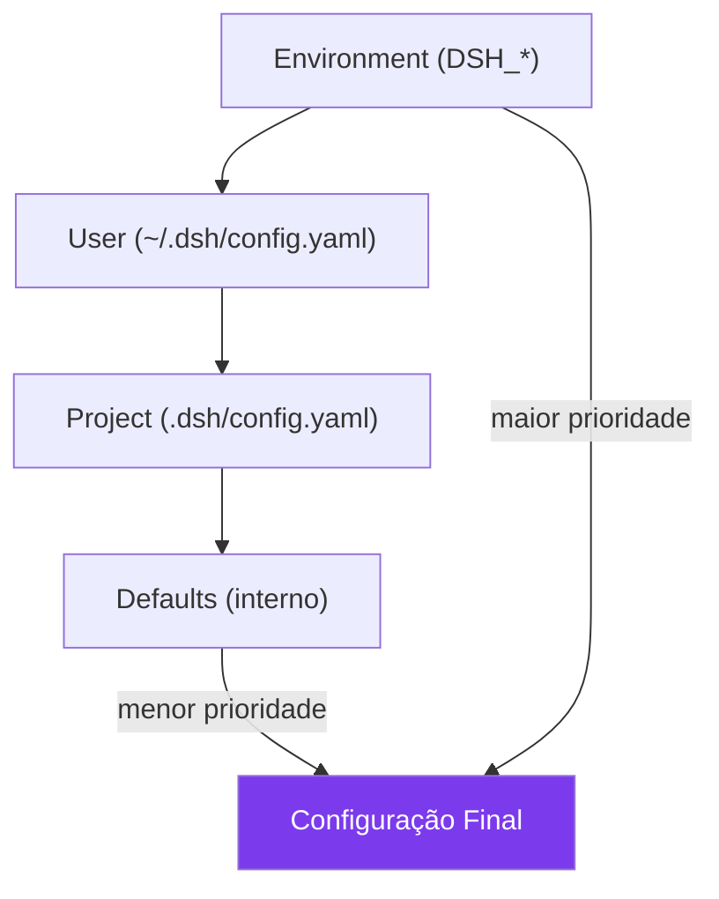

# Capítulo 15: Profiles e Configuracao Avancada: Afinando a Oficina

## 1. Introdução

No Capítulo 14, você coordenou múltiplos agentes. Agora é hora de refinar: criar profiles personalizados que definem o comportamento do harness para diferentes cenários, configurar camadas de configuração, e otimizar o sistema para máxima performance [1].

Profiles são o que transformam um harness genérico em um harness personalizado. Assim como um motorista profissional ajusta o espelho, o banco, e o volante antes de dirigir, você ajusta o harness antes de trabalhar [2].

## 2. Explica

### Camadas de Configuração

O DeepSeek Harness empilha configurações em quatro camadas, da mais genérica para a mais específica [3]:

1. **Defaults:** configurações internas do harness, compiladas no binário. Não são editáveis diretamente, mas servem de rede de segurança — mesmo um projeto sem nenhum arquivo de configuração roda com valores sensatos.
2. **Project:** arquivo `.dsh/config.yaml` no diretório do projeto. Afeta apenas esse projeto e normalmente é versionado no Git, para que o time inteiro compartilhe a mesma configuração base ao clonar o repositório.
3. **User:** arquivo `~/.dsh/config.yaml`. Afeta todas as sessões do usuário, independente do projeto — é onde ficam preferências pessoais (tema, modelo padrão) que não fazem sentido versionar junto com o código.
4. **Environment:** variáveis de ambiente (`DSH_*`). Sobrescrevem tudo, e são o mecanismo usado por CI/CD e containers (Capítulo 16) para injetar configuração sem tocar em arquivo nenhum.

A resolução é de baixo para cima: se `project` define `model: "A"` e `user` define `model: "B"`, o resultado é `model: "A"` (project tem prioridade).

Veja como isso funciona com um exemplo concreto — três camadas competindo pelo mesmo campo `model`:

```yaml
# Defaults (interno, não editável)
model: "deepseek-v4:7b"
```
```yaml
# ~/.dsh/config.yaml (User)
model: "deepseek-r1:32b"
```
```yaml
# .dsh/config.yaml (Project, na raiz do repositório)
model: "deepseek-v4:14b"
```

O resultado final é `model: "deepseek-v4:14b"` — o valor de Project vence, porque Project está mais próximo do topo da pilha de prioridade do que User. Se existisse uma variável de ambiente `DSH_MODEL=deepseek-r1:7b`, ela venceria de todas, porque Environment é a camada de maior prioridade e sobrescreve mesmo o que o projeto define.

### Profiles

Um profile é uma "receita" de configuração que combina múltiplas camadas em um atalho nomeado [1]:

```yaml
# ~/.dsh/profiles/coding.yaml
name: coding
description: "Profile para desenvolvimento de software"
config:
  model: "deepseek-v4:14b"
  mode: "standard"
  tools: ["filesystem", "shell", "web-search"]
  sandbox:
    worktree: true
    filesystem:
      write: ["./src/**", "./tests/**"]
  session:
    auto-save: 5
```

### Otimização

Otimizações para diferentes cenários [4]:

**Cache de respostas:** útil quando o mesmo prompt (ou um prefixo comum, como um system prompt longo) se repete entre sessões — economiza tempo de geração e, em modelos servidos via API paga, custo direto. Para uso 100% local com Ollama, o ganho é sobretudo em latência: um cache de 1GB com TTL de 24h absorve boa parte das perguntas repetidas de um dia de trabalho, mas não substitui o KV-cache do próprio motor de inferência (Capítulo 3) [1][3].

**Limites de contexto:** o campo `max-tokens` no profile define quantos tokens de histórico o harness mantém antes de truncar ou comprimir. O padrão de 8192 tokens atende sessões de coding curtas, mas pipelines de research que leem múltiplos documentos longos ultrapassam esse limite em poucos turnos; quando isso acontece, o profile precisa subir para 32.768 tokens (se o modelo suportar) ou ativar compressão — sem uma das duas ações, o harness trunca o histórico e o agente "esquece" contexto que já tinha processado [3][4].

**Compressão de tokens:** o `compress-threshold` dispara um resumo automático do histórico quando o contexto atinge a fração configurada (0.8 = 80% cheio). É uma técnica com trade-off: comprimir cedo demais perde detalhes finos; comprimir tarde demais arrisca truncamento abrupto no meio de uma tarefa. Na prática, a faixa de 0,75 a 0,85 costuma equilibrar bem preservar detalhe e evitar truncamento [4].

**RTK (memória de longo prazo):** grava aprendizados da sessão (padrões de erro, decisões de arquitetura) em armazenamento persistente, para que sessões futuras não precisem re-descobrir o mesmo problema. Um `max-entries: 1000` é suficiente para meses de uso individual; times que compartilham RTK entre múltiplos desenvolvedores tendem a saturar esse limite mais rápido e precisam de rotação (arquivar entradas antigas) ou de um `max-entries` maior [1].

## 3. Ilustra

### As Configurações da Oficina

Na sua oficina de agentes, as configurações são como as configurações de uma fábrica automática. Existem configurações de fábrica inteira (defaults), de linha de produção (project), de operador (user), e de emergência (environment) [5].

Um profile é como um botão de "modo rápido" na fábrica. Em vez de ajustar 20 configurações manualmente para cada tipo de trabalho, você seleciona o profile "coding" e tudo se ajusta automaticamente — modelo, ferramentas, sandbox, sessões.

A otimização é como calibrar as máquinas para máxima eficiência. Uma fábrica que produz peças pequenas não precisa da mesma potência que uma que produz peças grandes — e configurar a potência certa para cada tarefa é o que separa uma fábrica eficiente de uma desperdiçadora.



## 4. Técnica

### Criando Profiles

```bash
# Criar profile de coding
mkdir -p ~/.dsh/profiles
cat > ~/.dsh/profiles/coding.yaml << 'EOF'
name: coding
description: "Profile para desenvolvimento de software"
config:
  model: "deepseek-v4:14b"
  mode: "standard"
  tools:
    - "filesystem"
    - "shell"
    - "web-search"
  sandbox:
    worktree: true
    filesystem:
      write: ["./src/**", "./tests/**"]
      deny: ["./.git/**", "./.env"]
  session:
    auto-save: 5
    max-turns: 100
EOF

# Criar profile de research
cat > ~/.dsh/profiles/research.yaml << 'EOF'
name: research
description: "Profile para pesquisa e análise"
config:
  model: "deepseek-r1:32b"
  mode: "standard"
  tools:
    - "filesystem"
    - "web-search"
  sandbox:
    worktree: false
    filesystem:
      read: ["./docs/**", "./research/**"]
      write: ["./output/**"]
  session:
    auto-save: 10
    max-turns: 200
EOF
```

### Usando Profiles

```bash
# Iniciar com profile específico
dsh --profile coding
dsh --profile research

# Listar profiles disponíveis
dsh profiles list

# Verificar configuração ativa
dsh config show
```

### Depurando um Profile que "Não Pegou"

O sintoma mais comum de quem começa com profiles é configurar algo no YAML e ver o harness continuar com o comportamento antigo. Antes de suspeitar de bug, cheque três coisas na ordem [3][4]:

1. **O profile foi de fato ativado?** `dsh --profile coding` só ativa para aquela sessão; se você abriu um terminal novo sem a flag, voltou ao default.
2. **Alguma camada de prioridade mais alta está sobrescrevendo?** Um `DSH_MODEL` esquecido no `.bashrc`/`.zshrc` vence qualquer profile, porque Environment é a camada de maior prioridade.
3. **O YAML é válido?** Um erro de indentação silenciosamente ignora o campo malformado em vez de falhar — `dsh config show --explain` (abaixo) expõe isso ao mostrar de onde cada valor realmente veio.

### Como a Resolução de Camadas Funciona na Prática

Para depurar por que uma configuração não está "pegando", inspecione a resolução final, não os arquivos individuais [3]:

```bash
# Mostra a configuração final já resolvida, e de onde cada campo veio
dsh config show --explain

# Saída esperada (exemplo)
# model: "deepseek-v4:14b"      <- project (.dsh/config.yaml)
# mode: "standard"              <- user (~/.dsh/config.yaml)
# sandbox.worktree: true        <- profile "coding"
# context.max-tokens: 8192      <- default (interno)
```

Um erro comum é assumir que o profile tem prioridade sobre `project`. Não tem: um profile é só um atalho que *popula* as camadas normais (na prática, o equivalente a escrever os mesmos campos manualmente) — se o `.dsh/config.yaml` do projeto já define `model`, ele ainda vence sobre o que o profile tentaria aplicar, porque `project` está acima de `profile` na ordem de resolução [3].

### Profile de Deploy

Um profile de produção, usado no Capítulo 16 para rodar o harness em container, costuma ser mais restritivo do que os profiles de desenvolvimento [4]:

```bash
cat > ~/.dsh/profiles/production.yaml << 'EOF'
name: production
description: "Profile restrito para deploy em produção"
config:
  model: "deepseek-v4:14b"
  mode: "standard"
  tools:
    - "filesystem"
  sandbox:
    worktree: false
    filesystem:
      write: ["./output/**"]
      deny: ["./.git/**", "./.env", "./secrets/**"]
  session:
    auto-save: 1
    max-turns: 50
  performance:
    rate_limiting:
      enabled: true
      requests_per_minute: 60
EOF
```

Note a diferença de filosofia: o profile `coding` maximiza autonomia (worktree, várias ferramentas, muitos turnos); o profile `production` minimiza superfície de ataque (sem shell, sem web-search, deny explícito de segredos, rate limiting ativo desde o profile). Profiles não são só conveniência — são também uma forma de declarar, em um arquivo versionado, qual o apetite de risco aceito em cada contexto.

### Versionando Profiles no Git

`~/.dsh/profiles/` vive no HOME do usuário, fora do repositório do projeto — o que significa que, por padrão, profiles não são versionados junto com o código. Para times, isso é um problema: um profile ajustado manualmente na máquina de um desenvolvedor não se propaga para o resto do time [4]. A prática recomendada é manter os profiles do time dentro do próprio repositório (ex.: `.dsh/profiles-time/`) e um script curto de setup que copia (ou faz symlink) para `~/.dsh/profiles/` no onboarding:

```bash
# scripts/instalar-profiles-time.sh
mkdir -p ~/.dsh/profiles
for arquivo in .dsh/profiles-time/*.yaml; do
  ln -sf "$(pwd)/${arquivo}" ~/.dsh/profiles/"$(basename "${arquivo}")"
done
echo "Profiles do time instalados via symlink."
```

Isso resolve dois problemas de uma vez: o profile fica versionado (revisável em PR, com histórico de mudanças) e continua sendo lido do local padrão do harness — sem exigir que o `dsh` saiba nada sobre onde o time guarda os arquivos originais.

### Otimização de Performance

```yaml
# ~/.dsh/config.yaml — otimizações
performance:
  # Cache de respostas
  cache:
    enabled: true
    max-size: "1GB"
    ttl: "24h"
  
  # Limites de contexto
  context:
    max-tokens: 8192
    compress-threshold: 0.8  # Comprimir quando 80% cheio
  
  # RTK (memória de longo prazo)
  rtk:
    enabled: true
    storage: "~/.dsh/rtk/"
    max-entries: 1000
```

### Profiles por Ambiente: Dev, Staging e Produção

O profile de deploy desta seção resolve "que configuração usar ao publicar" — mas times que operam mais de um ambiente (desenvolvimento local, staging, produção) enfrentam um problema anterior: garantir que o profile certo está ativo no ambiente certo, sem depender de alguém lembrar de trocar manualmente antes de cada operação.

A prática mais segura é nomear os profiles pelo ambiente (`dev.yaml`, `staging.yaml`, `prod.yaml`) e resolver qual carregar a partir de uma variável de ambiente do próprio sistema operacional, não de um argumento de linha de comando que é fácil esquecer:

```bash
# .bashrc ou .zshrc de cada máquina/ambiente
export DSH_ENV="prod"   # ou "dev", "staging" — definido uma vez por máquina
```

```yaml
# dsh.config.yaml — resolve o profile pelo DSH_ENV do sistema
profile:
  active: "${DSH_ENV:-dev}"   # cai em "dev" se a variável não estiver definida
```

O detalhe que faz essa prática valer a pena é o fallback explícito (`:-dev`): se a variável de ambiente não estiver definida por qualquer motivo, o harness assume o profile de desenvolvimento — o mais restritivo em termos de acesso a recursos reais — em vez de silenciosamente herdar seja o que for que estivesse configurado por último naquela máquina. Errar para o lado mais seguro quando a configuração está ausente é uma escolha de design, não um acidente: o custo de rodar em modo "dev" por engano em produção é um erro óbvio e imediato; o custo de rodar acidentalmente com profile de produção durante desenvolvimento local pode significar acessar recursos ou dados reais que não deveriam ser tocados por uma sessão de teste.

Vale verificar qual profile está de fato ativo antes de qualquer operação sensível, em vez de confiar de memória em qual variável de ambiente foi exportada há semanas naquela máquina — `dsh status --json` (Capítulo 1) expõe o profile resolvido no campo correspondente, e checar esse campo antes de um deploy custa segundos, contra o custo de descobrir depois do fato que a operação rodou com o profile errado.

## 5. Aplica

### O Profile que Travou tudo

Um desenvolvedor criou um profile que definia `model: "deepseek-v4:7b"` (ocupando ~5GB de VRAM em Q4) para coding e `model: "deepseek-r1:32b"` (ocupando ~20GB de VRAM em Q4) para research, ambos na mesma GPU de 24GB. Ele esqueceu de configurar um limite de VRAM por profile. Quando trocava de profile sem encerrar a sessão anterior, os dois modelos ficavam carregados simultaneamente, ultrapassando os 24GB disponíveis — o excedente spilla para RAM do sistema e o harness travava por minutos a cada troca [4].

### A Prática Correta

Regras para profiles de qualidade:

1. **Um profile por caso de uso** — não tente fazer um profile "serve para tudo"
2. **Teste cada profile** antes de usar em produção
3. **Documente** o que cada profile faz
4. **Versione** seus profiles no Git

### Quando Profiles Deixam de Ajudar

Profiles funcionam bem para um desenvolvedor ou um time pequeno com poucos cenários distintos. Acima de 10 a 15 profiles ativos diferentes, a manutenção manual — arquivos YAML dispersos, sem revisão nem versionamento centralizado — se torna um gargalo: profiles desatualizados voltam a causar os mesmos travamentos de VRAM do caso acima, só que agora multiplicados por profile [4]. Nesse volume, a prática correta exige tratar profiles como código: repositório dedicado, CI validando cada profile antes do merge, e um processo de depreciação para profiles que ninguém mais usa — sem isso, a personalização que deveria economizar tempo passa a consumir mais tempo do que configurar manualmente.

## 6. Conclusão

Neste capítulo, você criou profiles personalizados, entendeu as camadas de configuração, e aprendeu a otimizar o harness para diferentes cenários. A oficina agora tem modos de operação pré-configurados para cada tipo de trabalho.

No próximo e último capítulo, você vai colocar tudo em produção — Docker, monitoramento, logs, e manutenção contínua.

## 7. Referências Bibliográficas

[1] DEEPSEEK AI. *DeepSeek Harness developer preview*. Disponível em: https://deepseek.com/harness/en/. Acesso em: 23 ago. 2026.

[2] DEEPSEEK AI. *deepseek-harness/docs/architecture.md*. GitHub. Disponível em: https://github.com/deepseek-ai/deepseek-harness/blob/master/docs/architecture.md. Acesso em: 23 ago. 2026.

[3] ALEXEWERLOF. *Using local LLMs for agentic coding*. Disponível em: https://blog.alexewerlof.com/p/local-llms-for-agentic-coding. Acesso em: 23 ago. 2026.

[4] TOWARDS AI. *DeepSeek Harness Explained*. Disponível em: https://pub.towardsai.net/deepseek-harness-explained-when-the-ai-model-is-just-a-plugin-16b2496f3d01. Acesso em: 23 ago. 2026.

[5] HABR. *Inside DeepSeek Harness*. Disponível em: https://habr.com/en/articles/1070958/. Acesso em: 23 ago. 2026.

[6] FLOATBOAT.AI. *Cordis — The Plugin Kernel*. Disponível em: https://floatboat.ai/blog/cordis-plugin-framework. Acesso em: 23 ago. 2026.

[7] AGENTATLAS. *Cordis Explained*. Disponível em: https://agentatlas.org/blog/cordis-explained-how-deepseek-harness-plugin-framework-works/. Acesso em: 23 ago. 2026.

[8] MEDIUM (data-and-beyond). *Decoding DeepSeek Harness*. Disponível em: https://medium.com/data-and-beyond/decoding-deepseek-harness-the-open-source-runtime-behind-composable-ai-agents-c2299e992870. Acesso em: 23 ago. 2026.

[9] TOWARDS AI. *DeepSeek Harness vs Claude Code*. Disponível em: https://pub.towardsai.net/deepseek-harness-vs-claude-code-a-plugin-architecture-teardown-da3c916f3af1. Acesso em: 23 ago. 2026.

[10] ATLASCLOUD. *DeepSeek Harness Plugins: The 7 Worth It*. Disponível em: https://www.atlascloud.ai/blog/tips/deepseek-harness-plugins. Acesso em: 23 ago. 2026.

[11] COMPOSIO. *Best plugins for DeepSeek Harness*. Disponível em: https://composio.dev/content/best-deepseek-harness-plugins. Acesso em: 23 ago. 2026.

[12] MINDSTUDIO. *What Is DeepSeek Harness?*. Disponível em: https://www.mindstudio.ai/blog/deepseek-harness-agentic-coding. Acesso em: 23 ago. 2026.

[13] DATACAMP. *DeepSeek Harness Tutorial*. Disponível em: https://www.datacamp.com/tutorial/deepseek-harness. Acesso em: 23 ago. 2026.

[14] SPRINGBRAND. *DeepSeek Harness (dsh): Everything Is a Plugin*. Disponível em: https://springbrand.ai/deepseek-harness. Acesso em: 23 ago. 2026.

[15] YOUTUBE. *Every Deepseek Harness Concept Explained*. Disponível em: https://www.youtube.com/watch?v=24UCnAs7MVg. Acesso em: 23 ago. 2026.

[16] YOUTUBE. *NEW Deepseek Agent Harness EXPLAINED*. Disponível em: https://www.youtube.com/watch?v=Hpw4fAHlHDw. Acesso em: 23 ago. 2026.

[17] EXPLOREX.AI. *DeepSeek Harness v0.1*. Disponível em: https://explainx.ai/blog/deepseek-harness-v0-1-plugin-first-agent-stack-august-2026. Acesso em: 23 ago. 2026.

[18] DEEPSEEKHARNESSAI. *Security Plugins for DeepSeek Harness*. Disponível em: https://deepseekharnessai.com/categories/security. Acesso em: 23 ago. 2026.

[19] MEDIUM (kaliarch). *DeepSeek Harness: When the Agent Loop Itself Becomes a Plugin*. Disponível em: https://medium.com/@kaliarch/deepseek-harness-when-the-agent-loop-itself-becomes-a-plugin-7fad0aa9de1c. Acesso em: 23 ago. 2026.

[20] 0XSLINE. *awesome-deepseek-harness*. GitHub. Disponível em: https://github.com/0xsline/awesome-deepseek-harness. Acesso em: 23 ago. 2026.
