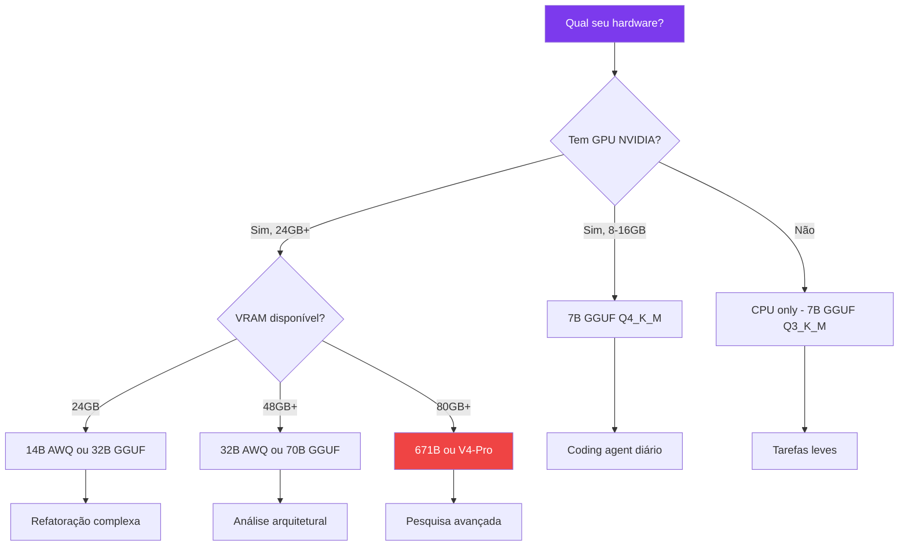

# Capítulo 3: Modelos DeepSeek: Escolhendo o Motor da Sua Oficina

## 1. Introdução

No Capítulo 2, você montou sua primeira estação de trabalho e executou o DeepSeek Harness. Mas um agente sem um bom modelo é como uma oficina com uma furaveira sem fio — a estrutura está pronta, mas não há potência. Neste capítulo, você vai conhecer a família completa de modelos DeepSeek, entender os requisitos de hardware para cada tamanho, e descobrir como a quantização pode fazer caber um modelo de 70 bilhões de parâmetros em uma GPU de 24GB [1].

A escolha do modelo é a decisão mais importante que você vai tomar ao configurar seu agente. Um modelo muito pequeno não vai ter capacidade suficiente para tarefas complexas. Um modelo muito grande vai consumir toda sua VRAM e ficar lento. E o formato de quantização errado pode transformar um modelo excelente em um papagaio de papel [2].

Ao final, você será capaz de escolher o modelo certo para o seu hardware e caso de uso, e de explicar por que a escolha errada pode transformar uma ferramenta poderosa num pesadelo de performance.

## 2. Explica

### A Família DeepSeek: Muito Mais que Um Modelo

Quando as pessoas falam em "DeepSeek", geralmente estão pensando em um único modelo. Na verdade, a DeepSeek AI mantém uma família inteira de modelos, cada um projetado para um caso de uso diferente [3]:

**DeepSeek V4-Pro (2026):** O mais recente e poderoso. Atingiu 70.3% no AIME 2025, com ecossistema nativo de ferramentas e profundidade multimodal [4]. É o estado da arte em modelos open-source, mas exige hardware significativo para rodar localmente. O V4-Pro é o primeiro modelo open-source a ultrapassar modelos proprietários em benchmarks de coding e raciocínio matemático.

**DeepSeek V4:** O modelo base da geração atual. Equilíbrio entre performance e requisitos de hardware. Ideal para a maioria dos casos de uso de coding agent [3]. Disponível em tamanhos de 7B a 671B parâmetros.

**DeepSeek R1:** Modelo de raciocínio com cadeia-de-pensamento (chain-of-thought). Projetado para problemas que exigem raciocínio passo a passo — matemática, lógica, programação complexa [5]. O R1 "pensa" antes de responder, o que aumenta a latência mas melhora drasticamente a qualidade em tarefas de raciocínio.

**DeepSeek Distilled Variants:** Versões menores (1.5B, 7B, 14B, 32B, 70B) derivadas dos modelos maiores via destilação. Mantêm uma fração significativa da performance dos modelos originais, mas cabem em hardware consumer [5]. A destilação é o processo de treinar um modelo menor para imitar o comportamento de um modelo maior — como um aprendiz que absorve o conhecimento de um mestre.

### Requisitos de Hardware: O Mapa da Decisão

A escolha do modelo é, em última instância, uma decisão de hardware. Cada bilhão de parâmetros consome aproximadamente 2GB de VRAM em FP16, ou cerca de 500MB em quantização 4-bit [6]:

| Modelo | Parâmetros | VRAM (FP16) | VRAM (4-bit) | Hardware Mínimo | Caso de Uso |
|--------|-----------|-------------|--------------|-----------------|-------------|
| DeepSeek-R1-Distill-1.5B | 1.5B | ~3GB | ~1GB | Qualquer GPU moderna | Tarefas leves, classificação |
| DeepSeek-R1-Distill-7B | 7B | ~14GB | ~4GB | RTX 3060 12GB | Coding agent diário |
| DeepSeek-R1-Distill-14B | 14B | ~28GB | ~8GB | RTX 3090 24GB | Refatoração complexa |
| DeepSeek-R1-Distill-32B | 32B | ~64GB | ~18GB | RTX 4090 24GB | Análise arquitetural |
| DeepSeek-R1-Distill-70B | 70B | ~140GB | ~40GB | 2x A100 80GB | Pesquisa avançada |
| DeepSeek-V4 (full) | 671B | ~1.3TB | ~350GB | Cluster multi-GPU | Estado da arte absoluto |

A regra de ouro: **nunca tente rodar um modelo maior do que sua VRAM suporta sem quantização adequada**. Um modelo que spilla para RAM do sistema é 10-100x mais lento que rodar em GPU [6]. É como tentar colocar um motor de caminhão num carro compacto — tecnicamente funciona, mas a performance é horrível.

A tabela acima simplifica um detalhe importante: o número de parâmetros determina o consumo de VRAM dos **pesos**, mas não é a única conta. Durante a inferência, cada token gerado também consome memória para ativações intermediárias e para o KV cache (que detalhamos na seção Técnica) — e esse consumo cresce com o tamanho do contexto e com o número de requisições simultâneas que o engine processa em paralelo. É por isso que um modelo que roda perfeitamente bem com um prompt curto pode falhar com `CUDA out of memory` num prompt longo ou numa sessão de agente com muitos turnos acumulados: a VRAM "livre" depois de carregar os pesos não é toda ela utilizável para contexto. Quando o modelo não cabe nem com quantização agressiva num único acelerador, a saída é dividir os pesos entre múltiplas GPUs — tensor parallelism, técnica que reaparece no Capítulo 4 ao configurar o vLLM com `--tensor-parallel-size`.

### Quantização: Compactando o Motor

Quantização é o processo de reduzir a precisão dos pesos do modelo (de FP16 para INT8, INT4, etc.) para diminuir o consumo de memória. Existem três formatos principais em 2026 [7]:

**GGUF (llama.cpp):** Formato para inferência heterogênea — funciona em CPU, Metal (Apple Silicon), CUDA (NVIDIA) e Vulkan (AMD). O padrão Q4_K_M mantém aproximadamente 92% da qualidade original. É o formato preferido para Ollama [7]. O GGUF é o formato mais popular porque funciona em qualquer hardware — se você tem um computador, provavelmente pode rodar um modelo GGUF.

**AWQ (Activation-aware Weight Quantization):** Formato otimizado para GPU tensor cores. Retém aproximadamente 95% da qualidade e oferece melhor throughput que GGUF em GPUs NVIDIA. Ideal para vLLM em produção [8]. O AWQ é a escolha profissional — quando performance importa mais que compatibilidade.

**GPTQ:** Formato legado para GPU. Uma vez que kernels mais recentes o superaram em performance, perdeu popularidade em 2026 [7]. Ainda funciona, mas AWQ é preferível para novos projetos. O GPTQ é como um carro antigo que ainda funciona — não vale a pena comprar um novo, mas se você já tem um, não precisa trocar.

### Por Dentro da Quantização: Per-Tensor, Per-Group e o Papel da Calibração

Quantização não é um botão único que "comprime" o modelo de forma uniforme — é uma família de estratégias, e a escolha entre elas explica por que dois formatos "4-bit" podem entregar qualidade perceptivelmente diferente mesmo consumindo a mesma VRAM.

A forma mais simples é a quantização **per-tensor**: um único fator de escala para todo o tensor de pesos. É rápida de calcular, mas perde precisão quando a distribuição dos valores dentro do tensor varia muito — alguns canais têm pesos grandes, outros pequenos, e forçar todos pelo mesmo fator de escala descarta informação justamente nos canais menores.

A alternativa é a quantização **per-channel** (ou **per-group**, quando o tensor é dividido em blocos menores antes de escalar cada bloco de forma independente). É isso que torna o esquema K-quants do GGUF (Q4_K_M, Q5_K_M, Q6_K) diferente de uma quantização INT4 ingênua: "K_M" não significa que todo o tensor está em 4 bits — significa que tensores mais sensíveis à qualidade final (como as projeções de atenção) recebem mais bits, enquanto tensores mais tolerantes a erro (como certas camadas de feed-forward) recebem menos. É uma mistura de precisões dentro do próprio arquivo, não um valor único aplicado a tudo [7].

O AWQ leva essa ideia além ao usar um **dataset de calibração** — um conjunto pequeno de prompts representativos que passa pelo modelo antes da quantização, para medir quais pesos têm maior impacto nas ativações (activation-aware, o "A" do nome). Pesos identificados como críticos para a ativação recebem uma escala que preserva mais precisão; os demais são comprimidos de forma mais agressiva [8]. Por isso a pergunta certa ao comparar dois formatos não é "quantos bits", mas "quais pesos perderam precisão, e o quanto isso importa para a tarefa que você vai rodar".

Pesquisas recentes vão além do esquema fixo por camada. O GQSA (arXiv, 2024) combina quantização em grupo com esparsidade estruturada para acelerar ainda mais a inferência sem a perda de qualidade de uma quantização uniforme equivalente [21]. O RAMP (arXiv, 2026) propõe mixed-precision **adaptativa** via aprendizado por reforço — decidindo, por camada, a precisão ótima em vez de aplicar uma receita fixa como Q4_K_M ao modelo inteiro [22]. E para hardware GPU heterogêneo (várias gerações de aceleradores coexistindo no mesmo cluster), o TripleOptim (KSII TIIS, 2025) foca especificamente em otimizar a inferência GPTQ nesse cenário misto [23].

### Quantização Não Substitui Destilação — Elas se Combinam

É comum confundir as duas técnicas porque ambas "encolhem" o modelo, mas atacam problemas diferentes. A destilação (que você já viu nos DeepSeek Distilled Variants) reduz o **número de parâmetros**, treinando um modelo menor do zero para imitar o comportamento do modelo maior. A quantização reduz a **precisão numérica** dos parâmetros que já existem, sem mudar quantos eles são. Um survey recente sobre otimização de modelos para inferência eficiente propõe combinar as duas técnicas com pruning (remoção de pesos ou neurônios pouco relevantes) num mesmo pipeline de compressão [25], e uma avaliação de LLMs em dispositivos móveis (MELTing Point) mostra que a **ordem** em que essas técnicas são aplicadas — quantizar depois de destilar, ou destilar a partir de um modelo já quantizado — afeta o resultado final; elas não são intercambiáveis [26]. É por isso que os DeepSeek-R1-Distill-XB da tabela de hardware já são o resultado de uma primeira camada de compressão (destilação), e quando você os quantiza de novo (GGUF, AWQ), está aplicando uma segunda camada sobre a primeira — cada camada carrega seu próprio custo de qualidade, e eles se acumulam [27].

### Escolhendo o Formato Certo

| Cenário | Formato Recomendado | Por quê |
|---------|-------------------|---------|
| Ollama / uso local geral | GGUF Q4_K_M | Melhor compatibilidade, funciona em CPU+GPU |
| vLLM em produção (GPU) | AWQ INT4 | Melhor throughput em tensor cores |
| Apple Silicon (M1/M2/M3) | GGUF (Metal) | Ollama + GGUF é a combinação nativa |
| Hardware antigo (GPU fraca) | GGUF Q3_K_M | Menor qualidade, mas roda em qualquer coisa |
| Máxima qualidade (GPU potente) | AWQ ou FP16 | Se você tem VRAM sobrando, não quantize |
| CPU only | GGUF Q4_K_M | Funciona, mas é lento (~5 tokens/s) |

### FP8: O Novo Padrão

Em 2026, o FP8 (8-bit floating point) está ganhando popularidade como meio-termo entre FP16 e INT4 [9]. Ele mantém mais precisão que INT4 (~97% da qualidade original) enquanto consome metade da VRAM de FP16. É a escolha ideal para GPUs que suportam FP8 nativamente (H100, RTX 4090).

A diferença técnica entre FP8 e os formatos INT4/INT8 é o que cada um faz com a distribuição de valores fora da faixa comum (outliers). Formatos inteiros (INT4, INT8) usam uma escala linear fixa — um outlier grande força a escala inteira a "abrir espaço" para ele, perdendo resolução para os valores comuns próximos de zero, que são a maioria. O ponto flutuante do FP8 (nos formatos E4M3 ou E5M2, que trocam bits entre expoente e mantissa) representa magnitudes muito diferentes sem esse compromisso, porque a escala não é fixa — é isso que preserva mais qualidade que um INT4 do mesmo tamanho nominal em bits. O custo é que FP8 exige suporte de hardware nativo para ganhar velocidade; sem tensor cores que operam em FP8 diretamente, ele não é mais rápido que FP16, só mais compacto.

## 3. Ilustra

### O Motor da Oficina

Pense nos modelos DeepSeek como motores de diferentes tamanhos para sua oficina. O modelo 1.5B é um motor de scooter — leve, econômico, perfeito para tarefas simples como classificar e-mails ou completar frases. Consome pouco combustível (VRAM), mas não vai puxar um caminhão [10].

O modelo 7B é um motor de carro compacto — suficiente para a maioria das tarefas de coding, com consumo razoável de combustível (VRAM). É o "sweet spot" para a maioria dos desenvolvedores — boa performance, custo acessível, e funciona em hardware consumer.

O modelo 32B é um motor de caminhão — potente o suficiente para tarefas complexas como refatoração de código legado e análise arquitetural, mas precisa de um tanque maior (GPU com mais VRAM). Quando você precisa que o agente entenda um sistema inteiro de 50.000 linhas de código, é esse motor que você quer.

O modelo 671B completo é um motor de locomotiva — absurdo de potente, mas exige infraestrutura ferroviária (cluster multi-GPU) para funcionar. Na prática, quase ninguém roda o modelo completo localmente — é mais comum usar versões quantizadas ou a API cloud [4].

A quantização é como usar gasolina de octanagem menor no motor. Ele funciona, consome menos combustível, mas perde um pouco de potência. Para a maioria das tarefas diárias, a perda é imperceptível. Para tarefas que exigem potência máxima — raciocínio matemático complexo, geração de código com muitas dependências — a diferença se torna notável [7].

Mas nem toda quantização degrada o motor da mesma forma. Pense na quantização per-tensor como reabastecer o tanque inteiro com um único combustível — simples, mas ruim se partes diferentes do motor precisassem de octanagens diferentes. A quantização per-group (os K-quants do GGUF, o dataset de calibração do AWQ) é como um mecânico que abastece cada cilindro com a mistura certa: mais octanagem onde o motor realmente precisa (as camadas de atenção), menos onde não faz diferença perceptível (certas camadas de feed-forward). É essa calibração fina — não o número de bits sozinho — que separa uma quantização mediana de uma excelente.



## 4. Técnica

### Instalando e Testando Modelos com Ollama

Vamos testar diferentes modelos para encontrar o ideal para o seu hardware:

```bash
# Instalar modelos de diferentes tamanhos
ollama pull deepseek-v4:7b      # ~4.7GB download
ollama pull deepseek-r1:14b     # ~9GB download
ollama pull deepseek-r1:32b     # ~19GB download

# Listar modelos instalados
ollama list
# NAME                    ID            SIZE      MODIFIED
# deepseek-v4:7b          a1b2c3d4      4.7 GB    2 minutes ago
# deepseek-r1:14b         e5f6g7h8      9.0 GB    5 minutes ago
# deepseek-r1:32b         i9j0k1l2      19.0 GB   10 minutes ago

# Testar cada modelo
ollama run deepseek-v4:7b "Explique o que é um plugin em 3 frases"
ollama run deepseek-r1:14b "Resolva: qual é a derivada de x^3 + 2x?"
ollama run deepseek-r1:32b "Escreva uma função Python que valida CPF"
```

### Monitorando VRAM em Tempo Real

Enquanto testa, monitore o consumo de memória:

```bash
# NVIDIA (Linux)
watch -n 1 nvidia-smi

# macOS (Apple Silicon)
sudo powermetrics --samplers gpu_power -n 1 -i 1000

# Windows
nvidia-smi -l 1

# Script de monitoramento contínuo
while true; do
  nvidia-smi --query-gpu=memory.used,memory.total,utilization.gpu --format=csv,noheader
  sleep 2
done
```

O número que mais importa nesse monitoramento não é o pico de `memory.used` — é a distância entre `memory.used` e `memory.total` durante uma sessão longa do agente, com muitos turnos acumulados no contexto. Um modelo que carrega ocupando quase toda a VRAM disponível parece seguro no primeiro prompt, mas se o KV cache crescer com o contexto (como detalhado na seção Técnica) e a margem livre for pequena, a sessão trava exatamente quando você menos espera — no meio de uma tarefa longa, não no início. `utilization.gpu` saturado é esperado durante a geração de tokens; o sinal real de problema é `memory.used` subindo sem que o agente termine a resposta.

### Conectando o Modelo ao DeepSeek Harness

```bash
# Verificar que o Ollama está rodando
curl http://localhost:11434/api/tags

# Configurar o DeepSeek Harness para usar Ollama
dsh config set-model ollama deepseek-v4:7b

# Iniciar o harness com o modelo local
dsh --mode standard

# Testar no harness
dsh> Escreva uma função Python que calcula Fibonacci
```

### Exportando Modelo Quantizado do HuggingFace

Para modelos que não estão no Ollama, você pode baixar e quantizar:

```bash
# Baixar modelo GGUF do HuggingFace (exemplo: 7B)
huggingface-cli download deepseek-ai/DeepSeek-V4-7B-GGUF \
  --include "deepseek-v4-7b-q4_k_m.gguf" \
  --local-dir ./models/

# Testar com llama.cpp
./llama-cli -m ./models/deepseek-v4-7b-q4_k_m.gguf \
  -p "Explique plugins em IA" -n 200

# Converter modelo para GGUF (se tiver o modelo em outro formato)
python convert_hf_to_gguf.py ./meu-modelo/ --outfile meu-modelo.gguf
```

### Inspecionando um GGUF por Dentro

Todo arquivo GGUF carrega metadados sobre como cada tensor foi quantizado — não é uma caixa preta. As ferramentas do próprio ecossistema llama.cpp permitem inspecionar isso antes de rodar o modelo:

```bash
# Listar metadados e o tipo de quantização de cada tensor
python gguf-py/scripts/gguf_dump.py ./models/deepseek-v4-7b-q4_k_m.gguf

# Saída (resumida) — cada linha é um tensor e sua precisão:
# blk.0.attn_q.weight       - type = Q4_K
# blk.0.attn_k.weight       - type = Q4_K
# blk.0.ffn_down.weight     - type = Q4_K
# blk.0.ffn_gate.weight     - type = Q4_K
# output_norm.weight        - type = F32   <- normalização fica em precisão total
# token_embd.weight         - type = Q6_K  <- embeddings recebem mais bits
```

`output_norm.weight` aparece em F32 porque camadas de normalização quase nunca são quantizadas — pequenos erros ali se propagam para toda a rede. É a mistura de precisões (per-tensor, dentro do mesmo arquivo) discutida na seção Explica: o "K_M" do nome do formato é justamente essa receita de qual tensor recebe quantos bits.

### Calculando a VRAM Real: Pesos + KV Cache

A tabela de VRAM da seção Explica considera apenas os pesos do modelo. Na inferência real, você também precisa de memória para o KV cache — os vetores de chave e valor de cada token do contexto, guardados para não recalcular a atenção do zero a cada novo token gerado. A fórmula aproximada:

```
VRAM_kv_cache ≈ 2 × num_camadas × num_cabecas_kv × dim_por_cabeca × tamanho_contexto × bytes_por_valor
```

O fator 2 vem de guardar chave E valor separadamente. Esse número cresce linearmente com o tamanho do contexto — é por isso que o `--max-model-len` do vLLM e o `-c` (context size) do llama.cpp não são apenas limites de "quanto texto cabe": são também limites de memória. Aumentar o contexto sem sobra de VRAM depois de carregar os pesos é a causa mais comum do erro `CUDA out of memory` que parece não fazer sentido quando "o modelo carregou direitinho".

```bash
# Comparar velocidade entre níveis de quantização do mesmo modelo
./llama-bench -m deepseek-v4-7b-q4_k_m.gguf -m deepseek-v4-7b-q5_k_m.gguf -p 512 -n 128

# -p 512: tamanho do prompt de teste (prefill)
# -n 128: quantidade de tokens gerados (decode)
# O llama-bench reporta tokens/s de prefill e decode para cada modelo listado,
# lado a lado — a forma correta de decidir entre Q4_K_M e Q5_K_M no SEU hardware,
# em vez de confiar em números genéricos de review.
```

## 5. Aplica

### O Erro de Ignorar VRAM

Um desenvolvedor com uma RTX 3060 de 12GB decidiu rodar o DeepSeek-R1-32B porque "vi no Reddit que é o melhor custo-benefício". O modelo carregou parcialmente, depois começou a spilla para RAM do sistema. Cada resposta levava 45 segundos em vez de 2 [6].

Ele gastou três horas tentando otimizar parâmetros do Ollama — ajustando `num_ctx`, `num_gpu`, `num_batch` — antes de perceber que simplesmente não tinha VRAM suficiente para aquele modelo. A solução era simples: trocar para o DeepSeek-R1-14B em quantização Q4_K_M. O modelo cabia inteiro na GPU, as respostas voltaram a levar 2-3 segundos, e a qualidade para coding era mais do que suficiente para o trabalho dele.

Outro erro comum: um desenvolvedor comprou uma GPU de 24GB especificamente para rodar modelos grandes, mas comprou a versão errada (RTX 3060 24GB em vez de RTX 3090 24GB). A RTX 3060 tem interfaces de memória mais lentas: acima de cargas de trabalho contínuas ela não escala tão bem quanto a RTX 3090, e mesmo com os mesmos 24GB de VRAM, o throughput fica significativamente inferior [11] — a lição prática é que VRAM sozinha não garante desempenho; a largura de banda de memória importa tanto quanto a capacidade.

### Quando Q4_K_M Não é Suficiente: Sintomas de Degradação em Código

Nem toda perda de qualidade por quantização aparece como "o modelo ficou burro" de forma óbvia. No caso de geração de código, o padrão mais comum é sutil: o modelo continua gerando sintaxe válida, mas comete erros lógicos que passam por uma revisão superficial. Um estudo recente que avalia especificamente quantização aplicada à geração de código documenta esse efeito — modelos quantizados mantêm fluência sintática, mas degradam de forma desproporcional em tarefas que exigem rastrear estado ao longo de várias linhas, exatamente o tipo de tarefa que um coding agent faz o dia todo [24].

Na prática, o sintoma que você vai notar primeiro não é o modelo recusando a tarefa — é o DeepSeek Harness aceitando o código gerado, rodando os testes de CI (Capítulo 8), e falhando em casos de borda que um Q5_K_M ou o modelo em FP16 acertariam. Se seus testes de regressão começarem a falhar com mais frequência depois de trocar de modelo ou de formato de quantização, o primeiro suspeito é o *quantization drift*, não um bug introduzido no seu prompt.

A prática correta é degradar a quantização de forma incremental e monitorada: comece em Q5_K_M (não Q4_K_M) para qualquer tarefa que envolva lógica de negócio real, e só desça para Q4_K_M depois de confirmar, com sua própria suíte de testes, que a queda de qualidade é aceitável para o caso de uso. A economia de VRAM entre Q4_K_M e Q5_K_M costuma ser pequena; o risco de regressão silenciosa, não.

### Hardware Exótico: Edge e Mobile

Quando o "hardware limitado" não é uma GPU consumer, mas um dispositivo móvel ou embarcado, os mesmos princípios de quantização se aplicam com margens ainda mais estreitas. Um estudo sobre modelos de linguagem prontos para edge documenta o pipeline completo de treino, quantização e deployment voltado a hardware restrito [28], e uma avaliação de LLMs em dispositivos móveis comerciais (COTS) mapeia onde exatamente o gargalo aparece — geralmente não é só VRAM, mas também largura de banda de memória e throughput da NPU/GPU integrada, os mesmos fatores que já vimos limitar a RTX 3060 [29]. Se o seu caso de uso é rodar um agente num dispositivo edge, trate isso como uma classe de hardware própria, não como "só mais um caso de GPU pequena" — as restrições de energia e térmica mudam a equação.

### A Prática Correta

Antes de escolher um modelo, faça o teste de VRAM:

```bash
# 1. Verificar VRAM disponível
nvidia-smi --query-gpu=memory.total,memory.free --format=csv

# 2. Calcular capacidade (aproximada)
# FP16: 2GB por bilhão de parâmetros
# Q4_K_M: 0.5GB por bilhão de parâmetros

# 3. Testar o modelo antes de comprometer
ollama run deepseek-v4:7b "Olá"  # Se funcionar bem, teste tarefas reais
```

Tabela de decisão rápida:

| VRAM Disponível | Modelo Recomendado | Formato | Tokens/s Estimado |
|-----------------|-------------------|---------|-------------------|
| 4-8GB | 7B | GGUF Q4_K_M | 15-25 |
| 8-16GB | 14B | GGUF Q4_K_M | 10-20 |
| 16-24GB | 32B | GGUF Q4_K_M (com layers no CPU) | 5-15 |
| 24-48GB | 32B | AWQ INT4 | 20-40 |
| 48GB+ | 70B | AWQ INT4 | 15-30 |

## 6. Conclusão

Neste capítulo, você conheceu a família completa de modelos DeepSeek — do V4-Pro ao distilled 1.5B — e entendeu como os requisitos de hardware escalam com o tamanho do modelo. A quantização (GGUF, AWQ, GPTQ, FP8) é a chave para rodar modelos grandes em hardware limitado, e a escolha do formato certo depende do seu engine de inferência e hardware.

O modelo certo para você é o que cabe na sua VRAM, roda na velocidade que você precisa, e produz a qualidade que seu caso de uso exige. Não existe "melhor modelo absoluto" — existe o melhor modelo para cada situação.

No próximo capítulo, você vai configurar os três motores de inferência local — Ollama, vLLM e llama.cpp — e descobrir quando usar cada um. É aqui que você conecta o motor à oficina.

## 7. Referências Bibliográficas

[1] DEEPSEEK AI. *DeepSeek V3*. HuggingFace. Disponível em: https://huggingface.co/deepseek-ai/DeepSeek-V3. Acesso em: 23 ago. 2026.

[2] DAI, Jing. *DeepSeek-V3 Core Architecture and Its Training Techniques in Detail*. In: DeepSeek in Action. 2025. Disponível em: https://doi.org/10.1201/9781003674702-3. Acesso em: 23 ago. 2026.

[3] TECH-INSIDER. *Best Open Source LLM 2026: DeepSeek, Kimi, Qwen Ranked*. Disponível em: https://tech-insider.org/best-open-source-llm-2026/. Acesso em: 23 ago. 2026.

[4] ARRITA, Aitor et al. *o3-mini vs DeepSeek-R1: Which One is Safer?*. In: arXiv, 2025. Disponível em: http://arxiv.org/abs/2501.18438. Acesso em: 23 ago. 2026.

[5] DEV.TO (AI4B). *Comprehensive Hardware Requirements Report for DeepSeek-R1*. Disponível em: https://dev.to/ai4b/comprehensive-hardware-requirements-report-for-deepseek-r1-5269. Acesso em: 23 ago. 2026.

[6] LOCALAIMASTER. *GGUF vs GPTQ vs AWQ 2026*. Disponível em: https://localaimaster.com/blog/quantization-explained. Acesso em: 23 ago. 2026.

[7] TOWARDS AI. *I Tested GGUF vs AWQ vs GPTQ: The "Fastest" 4-Bit*. Disponível em: https://pub.towardsai.net/i-tested-gguf-vs-awq-vs-gptq-the-fastest-4-bit-collapses-on-code-at-46-d65c271d7cdf. Acesso em: 23 ago. 2026.

[8] HIVENET. *DeepSeek-R1 Model Sizes and RAM Requirements*. Disponível em: https://www.hivenet.com/post/deepseek-r1-model-sizes-ram-vram-requirements. Acesso em: 23 ago. 2026.

[9] SESAMEDISK. *Quantization Techniques for AI Inference in 2026*. Disponível em: https://sesamedisk.com/quantization-techniques-ai-inference-2026/. Acesso em: 23 ago. 2026.

[10] LYCEUM.technology. *GGUF vs GPTQ vs AWQ: 2026 LLM Quantization Guide*. Disponível em: https://lyceum.technology/magazine/gguf-vs-gptq-vs-awq-quantization/. Acesso em: 23 ago. 2026.

[11] SITEPOINT. *DeepSeek R1 Local Deployment: Complete Guide 2026*. Disponível em: https://www.sitepoint.com/deepseek-r1-local-deployment-guide-2026/. Acesso em: 23 ago. 2026.

[12] DAI, Jing. *A First Look at the DeepSeek-V3 Big Model*. In: DeepSeek in Action. 2025. Disponível em: https://doi.org/10.1201/9781003674702-6. Acesso em: 23 ago. 2026.

[13] DAI, Jing. *Introduction to DeepSeek-V3 Model-Based Development*. In: DeepSeek in Action. 2025. Disponível em: https://doi.org/10.1201/9781003674702-4. Acesso em: 23 ago. 2026.

[14] DAI, Jing. *DeepSeek Open Platform and API Development Details*. In: DeepSeek in Action. 2025. Disponível em: https://doi.org/10.1201/9781003674702-7. Acesso em: 23 ago. 2026.

[15] DAI, Jing. *DeepSeek in Action*. CRC Press, 2025. Disponível em: https://doi.org/10.1201/9781003674702. Acesso em: 23 ago. 2026.

[16] APXML. *GPU System Requirements for Running DeepSeek-R1*. Disponível em: https://apxml.com/posts/gpu-requirements-deepseek-r1. Acesso em: 23 ago. 2026.

[17] REDDIT (r/ollama). *Hardware requirements for running the full size deepseek*. Disponível em: https://www.reddit.com/r/ollama/comments/1icv7wv/hardware_requirements_for_running_the_full_size/. Acesso em: 23 ago. 2026.

[18] REDDIT (r/selfhosted). *Got DeepSeek R1 running locally - Full setup guide*. Disponível em: https://www.reddit.com/r/selfhosted/comments/1i6ggyh/got_deepseek_r1_running_locally_full_setup_guide/. Acesso em: 23 ago. 2026.

[19] YOUTUBE. *DeepSeek R1 Hardware Requirements Explained*. Disponível em: https://www.youtube.com/watch?v=5RhPZgDoglE. Acesso em: 23 ago. 2026.

[20] MEDIUM (alice.yang). *How to Choose the Right Version of DeepSeek-R1 for Local Deployment*. Disponível em: https://medium.com/@alice.yang_10652/how-to-choose-the-right-version-of-deepseek-r1-for-local-deployment-read-here-b24f4d0ec6cc. Acesso em: 23 ago. 2026.

[21] ZENG, Chao et al. *GQSA: Group Quantization and Sparsity for Accelerating Large Language Model Inference*. In: arXiv (Cornell University). 2024. Disponível em: http://arxiv.org/abs/2412.17560. Acesso em: 23 ago. 2026.

[22] GAUTAM, Arpit Singh; JHA, Saurabh. *RAMP: Reinforcement Adaptive Mixed Precision Quantization for Efficient On Device LLM Inference*. In: arXiv. 2026. Disponível em: http://arxiv.org/abs/2603.17891v1. Acesso em: 23 ago. 2026.

[23] AUTOR. *TripleOptim: A Comprehensive Optimization Framework for GPTQ Quantization Inference on Heterogeneous Platforms*. In: KSII Transactions on Internet and Information Systems. 2025. Disponível em: https://doi.org/10.3837/tiis.2025.05.003. Acesso em: 23 ago. 2026.

[24] AFRIN, Saima; HAQUE, Md. Zahidul; MASTROPAOLO, Antonio. *Quantize with Confidence? An Empirical Study of Quantization for Code Generation*. In: arXiv. 2026. Disponível em: http://arxiv.org/abs/2607.14181v1. Acesso em: 23 ago. 2026.

[25] AHTASAM, Mo. *DOL-LLM - Optimizing Large Language Model Inference with Domain-Specific Adaptations and Efficiency Techniques via Quantization, Pruning, and Distillation*. 2025. Disponível em: https://doi.org/10.36227/techrxiv.174286524.45842767/v1. Acesso em: 23 ago. 2026.

[26] LASKARIDIS, Stefanos et al. *MELTing Point: Mobile Evaluation of Language Transformers*. 2024. Disponível em: https://doi.org/10.1145/3636534.3690668. Acesso em: 23 ago. 2026.

[27] TRIPATHI, OM. *"GGUF Models and Quantization"*. 2025. Disponível em: https://doi.org/10.2139/ssrn.5044207. Acesso em: 23 ago. 2026.

[28] DIAC, T. A. et al. *Edge-Ready Romanian Language Models: Training, Quantization, and Deployment*. In: AI. 2026. Disponível em: https://doi.org/10.3390/ai7020061. Acesso em: 23 ago. 2026.

[29] XIAO, Jie et al. *Understanding Large Language Models in Your Pockets: Performance Study on COTS Mobile Devices*. In: arXiv (Cornell University). 2024. Disponível em: http://arxiv.org/abs/2410.03613. Acesso em: 23 ago. 2026.
