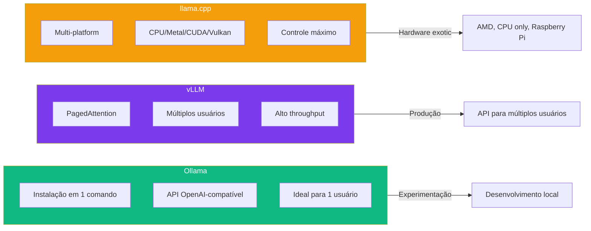

# Capítulo 4: Ollama, vLLM e llama.cpp: Os Tres Motores de Inferencia Local

## 1. Introdução

No Capítulo 3, você escolheu o motor (modelo) para sua oficina. Mas um motor precisa de uma transmissão — algo que converta a potência bruta do modelo em respostas úteis para o DeepSeek Harness. Neste capítulo, você vai configurar e comparar os três principais engines de inferência local: Ollama, vLLM e llama.cpp [1].

A escolha do engine é tão importante quanto a escolha do modelo. Um modelo excelente rodando no engine errado vai performar mal. Um modelo mediano rodando no engine certo pode surpreender. É a transmissão que define como a potência do motor chega às rodas [2].

Ao final, você saberá qual engine usar para cada cenário — experimentação rápida, produção com múltiplos usuários, ou maximização de hardware — e como conectar qualquer um deles ao DeepSeek Harness.

## 2. Explica

### O que é um Engine de Inferência?

Um engine de inferência é o software que carrega um modelo de linguagem na memória, recebe prompts, e gera respostas. Pense nele como a transmissão de um carro: o motor (modelo) fornece a potência, mas é a transmissão (engine) que converte essa potência em movimento útil [1].

Cada engine tem suas forças e fraquezas. A escolha errada pode significar a diferença entre 20 tokens por segundo e 200 tokens por segundo — ou entre rodar em uma GPU de 8GB e precisar de 4 GPUs [3].

Para entender por que a diferença entre engines é tão grande, ajuda separar a inferência em duas fases com custos de hardware muito distintos [3]. A fase de **prefill** processa todo o prompt de entrada de uma vez — é compute-bound (limitada pela capacidade de processamento paralelo da GPU), porque o modelo pode calcular a atenção de todos os tokens do prompt simultaneamente. A fase de **decode** gera um token por vez, cada um dependendo do anterior — é memory-bound (limitada pela velocidade de acesso à VRAM), porque a GPU fica majoritariamente ociosa esperando dados do KV cache serem lidos da memória, em vez de calculando.

Essa diferença explica escolhas de design que, sem esse contexto, parecem arbitrárias: engines otimizados para produção (vLLM, TGI) investem pesado em técnicas que aceleram o decode sob concorrência — como o PagedAttention que você vai ver em detalhe na próxima seção — porque é ali que múltiplos usuários simultâneos brigam pela mesma VRAM. Engines voltados a uso individual (Ollama, llama.cpp puro) otimizam antes de tudo a experiência de 1 usuário por vez, onde o gargalo de decode importa, mas não existe disputa por recursos entre sessões.

### Ollama: O Rei da Usabilidade

Ollama é o engine mais popular para uso local em 2026. Ele encapsula o llama.cpp em uma interface simples — instalação em um comando, gerenciamento de modelos com `ollama pull`, e API OpenAI-compatível na porta 11434 [4].

**Quando usar Ollama:**
- Experimentação rápida e desenvolvimento local
- Uma única pessoa usando o agente
- Hardware consumer (GPU NVIDIA, Apple Silicon)
- Quando você quer instalar e esquecer
- Quando você não quer configurar nada manualmente

**Vantagens do Ollama:**
- Instalação em 1 comando (Linux, macOS, Windows)
- Gerenciamento de modelos simplificado (pull, list, run)
- API OpenAI-compatível — funciona com qualquer ferramenta que suporte a API da OpenAI
- Auto-detecta hardware e otimiza automaticamente
- Suporte a Apple Silicon nativo (Metal)

**Limitações:**
- Não suporta batching dinâmico (múltiplas requisições simultâneas)
- Performance inferior ao vLLM para múltiplos usuários
- Menos controle fino sobre parâmetros de inferência
- Não suporta quantização AWQ (apenas GGUF) [4]

### vLLM: O Motor de Produção

O vLLM é a engine de referência para servir modelos em produção. Sua feature principal é o PagedAttention — uma técnica que gerencia memória de contexto de forma eficiente, permitindo servir múltiplos usuários simultaneamente com throughput significativamente superior [5].

**Quando usar vLLM:**
- Produção com múltiplos usuários
- API que precisa de alta disponibilidade
- Quando throughput é mais importante que latência individual
- Deploy em servidor dedicado ou cloud
- Quando você precisa de quantização AWQ

**Vantagens do vLLM:**
- PagedAttention: gerenciamento eficiente de memória
- Batching dinâmico: processa múltiplas requisições simultaneamente
- Suporte a AWQ: melhor throughput em GPUs NVIDIA
- API OpenAI-compatível
- Métricas built-in para monitoramento

**Limitações:**
- Mais complexo de configurar que Ollama
- Requer GPU NVIDIA (CUDA) para melhor performance
- Não roda bem em CPU
- Não suporta Apple Silicon nativamente [5]

### Como o PagedAttention Funciona de Verdade

A feature que faz o vLLM valer a complexidade adicional é o PagedAttention, e vale entender o mecanismo por baixo do nome bonito [5]. Toda inferência autoregressiva mantém um KV cache — os vetores de chave e valor de cada token já processado, para não recalculá-los a cada novo token gerado. O problema é que engines tradicionais alocam esse cache como um bloco contíguo de memória, dimensionado para o pior caso (o `max-model-len` configurado). Se uma conversa termina em 200 tokens mas o engine reservou espaço para 4096, o resto fica alocado e desperdiçado — e se dez conversas fazem isso ao mesmo tempo, a VRAM esgota muito antes do necessário.

O PagedAttention resolve isso importando uma ideia de sistemas operacionais: paginação de memória virtual. Em vez de um bloco contíguo, o KV cache de cada sequência é dividido em blocos de tamanho fixo (páginas), alocados sob demanda conforme a conversa cresce, e podem ficar espalhados fisicamente na VRAM — uma tabela de páginas interna mapeia os blocos lógicos da sequência para os blocos físicos reais, exatamente como uma MMU mapeia endereços virtuais para físicos. O resultado prático é que o vLLM desperdiça pouquíssima VRAM com fragmentação, e por isso consegue manter muito mais sequências ativas simultaneamente na mesma GPU do que um engine com alocação contígua.

Isso é o que viabiliza o **continuous batching** (batching dinâmico): como o cache de cada sequência é independente e paginado, o vLLM não precisa esperar todas as requisições de um lote terminarem para começar o próximo. No momento em que uma sequência termina (gera o token de fim), sua vaga no lote é liberada e uma nova requisição da fila entra imediatamente — o lote está sempre "cheio" de trabalho útil, em vez de ficar preso esperando a requisição mais lenta do grupo terminar (o problema clássico do batching estático). É essa combinação — paginação de KV cache + preenchimento contínuo do lote — que dá ao vLLM a vantagem de throughput sobre engines que processam uma requisição por vez [5].

### Tensor Parallelism: Fatiando o Modelo Entre GPUs

Quando um único modelo não cabe em uma GPU — ou quando você quer mais throughput do que uma GPU sozinha entrega — o vLLM permite fatiar o modelo entre múltiplas GPUs via `--tensor-parallel-size`, já usado no exemplo de configuração de produção acima. A ideia não é replicar o modelo (isso seria *data parallelism*, útil para escalar throughput com modelos que já cabem em 1 GPU) — é dividir cada camada do modelo (as matrizes de peso da atenção e do feed-forward) em fatias, uma por GPU, e cada GPU processa sua fatia da mesma requisição em paralelo.

O custo dessa técnica é comunicação: depois de cada camada, as GPUs precisam sincronizar resultados parciais (uma operação de *all-reduce*) antes de seguir para a próxima camada. Isso significa que o barramento entre GPUs importa tanto quanto a GPU em si — NVLink (centenas de GB/s entre GPUs) sustenta tensor parallelism com pouca perda; PCIe puro (uma ordem de grandeza mais lento) introduz um gargalo de comunicação que pode anular boa parte do ganho de dividir o modelo. Isso é uma decisão de escala que vale conhecer antes de montar um cluster: acima de 2 GPUs sem NVLink dedicado, o tensor parallelism tende a compensar cada vez menos, porque o tempo gasto sincronizando cresce mais rápido do que o tempo ganho processando em paralelo — nesse cenário, pipeline parallelism (fatiar por camadas inteiras, não por matriz) ou simplesmente múltiplas réplicas independentes do modelo costumam escalar melhor.

### Hugging Face TGI: O Motor da Origem HuggingFace

Vale conhecer um quarto contendor, mesmo que este capítulo trate dos três motores mais usados com o DeepSeek Harness: o **Hugging Face TGI (Text Generation Inference)**, servidor de inferência para produção distribuído via Docker pela própria Hugging Face [21]. O TGI ocupa um espaço parecido com o do vLLM — produção, múltiplos usuários, API HTTP — mas com integração mais direta ao ecossistema de modelos e tokenizers da Hugging Face, o que pode simplificar o deploy de modelos que não têm um checkpoint AWQ ou GGUF já publicado. Ele não substitui os três motores centrais deste capítulo, mas é uma alternativa válida quando sua stack de MLOps já gira em torno de containers Hugging Face — o critério de escolha entre TGI e vLLM, nesse caso, pesa mais a integração operacional do que a diferença de throughput bruto entre os dois.

### llama.cpp: A Engine Universal

O llama.cpp é a base de tudo — Ollama é um wrapper dele. Escrito em C++, roda em praticamente qualquer hardware: CPU, Metal (Apple Silicon), CUDA (NVIDIA), Vulkan (AMD). É a engine com maior amplitude de hardware [6].

**Quando usar llama.cpp:**
- Hardware não-convencional (CPU only, AMD GPU, Raspberry Pi)
- Quando você quer controle máximo sobre parâmetros
- Integração em aplicações C++ existentes
- Benchmarking de modelos
- Quando você precisa de compilação customizada

**Vantagens do llama.cpp:**
- Multi-platform: funciona em qualquer hardware
- Controle fino: centenas de parâmetros configuráveis
- Performance máxima para o hardware disponível
- Sem dependências externas pesadas
- Comunidade ativa e atualizações frequentes

**Limitações:**
- Interface de linha de comando (sem API HTTP nativa)
- Configuração manual de threads e camadas
- Não gerencia múltiplas requisições naturalmente
- Curva de aprendizado mais íngreme [6]

### Comparação Detalhada

| Característica | Ollama | vLLM | llama.cpp | TGI |
|---------------|--------|------|-----------|-----|
| Instalação | 1 comando | pip install | Compilar | Docker |
| API | OpenAI-compatível | OpenAI-compatível | HTTP server | HF + OpenAI-compatível |
| Múltiplos usuários | Não | Sim | Não | Sim |
| Batching | Não | Sim | Não | Sim (continuous) |
| Apple Silicon | Nativo | Não | Nativo (Metal) | Não |
| AMD GPU | Via Vulkan | Não | Via Vulkan | Não |
| CPU only | Sim | Não | Sim | Não |
| AWQ | Não | Sim | Não | Parcial |
| GGUF | Sim | Não | Sim | Não |
| Curva de aprendizado | Baixa | Média | Alta | Média |
| Melhor para | Desenvolvimento | Produção | Controle máximo | Ecossistema HF |

## 3. Ilustra

### A Transmissão da Oficina

Na sua oficina de agentes, os três engines são como três tipos de transmissão diferentes para o mesmo motor:

**Ollama é uma transmissão automática.** Você liga e dirige. Não precisa entender como as engrenagens funcionam — o Ollama cuida de tudo. Perfeito para o dia a dia, quando você quer resultados rápidos sem complicação [4]. É o Honda Civic dos engines — confiável, econômico, faz o trabalho.

**vLLM é uma transmissão manual de alta performance.** Mais difícil de dominar, mas quando você sabe o que está fazendo, extrai a máxima performance do motor. Ideal para quando você precisa que a oficina atenda múltiplos clientes ao mesmo tempo [5]. É o Porsche 911 — preciso, potente, mas exige um piloto experiente.

**llama.cpp é uma bancada de mecânica.** Você desmonta o motor, troca peças, ajusta cada parâmetro à mão. É o que um engenheiro usa quando precisa de controle absoluto sobre cada componente [6]. É como ter acesso ao CAD do motor — você pode modificar qualquer coisa, mas precisa saber o que está fazendo.

**TGI é a transmissão de fábrica de outra montadora.** Faz o mesmo trabalho que a transmissão manual de alta performance do vLLM, mas vem do catálogo de peças de um fornecedor diferente (a Hugging Face), com seus próprios encaixes e ferramentas de manutenção. Se sua oficina já usa peças dessa montadora em outros pontos do fluxo — modelos, tokenizers, pipelines de fine-tuning —, ela encaixa sem adaptador. Se não, você ainda pode usá-la, mas está trazendo um padrão de peça novo para dentro da oficina.

Vale notar que a paginação de memória do PagedAttention e o continuous batching que tornam o vLLM competitivo não são "mágica exclusiva" dele — são técnicas que o ecossistema de engines de inferência converge para adotar, cada um com sua implementação. Entender o *mecanismo* (paginação de KV cache, preenchimento contínuo do lote) importa mais do que memorizar qual engine implementa qual sigla, porque essas implementações evoluem rápido — o que é exclusividade competitiva hoje tende a virar padrão de mercado em poucos ciclos de release.



### O Benchmark Decisivo

Para decidir qual engine usar, rode o mesmo teste em todos os três:

```bash
# Teste padronizado: 100 prompts, medir throughput
# Ollama
time for i in $(seq 1 100); do
  curl -s http://localhost:11434/api/generate -d '{"model":"deepseek-v4:7b","prompt":"test","stream":false}' > /dev/null
done

# vLLM
time for i in $(seq 1 100); do
  curl -s http://localhost:8000/v1/completions -H "Content-Type: application/json" -d '{"model":"deepseek-v4-7b","prompt":"test","max_tokens":10}' > /dev/null
done

# llama.cpp
time for i in $(seq 1 100); do
  curl -s http://localhost:8080/completion -d '{"prompt":"test","n_predict":10}' > /dev/null
done
```

Esse script serve como primeiro sinal, mas é importante entender por que ele é insuficiente para uma decisão de produção. Rodar 100 requisições em sequência e medir o tempo total mede *latência somada*, não *throughput sob concorrência* — cada `curl` só é disparado depois que o anterior termina, então você nunca observa o engine processando múltiplas requisições ao mesmo tempo, que é exatamente a situação real de produção. Para medir throughput de verdade, as requisições precisam ser disparadas em paralelo (por exemplo, com `xargs -P` ou uma ferramenta de carga como `hey`/`wrk`/`vegeta`), e o resultado que importa não é a média — é a latência p95 ou p99 (o percentil que captura as requisições mais lentas, não o caso comum), porque é isso que define a experiência do usuário mais mal servido, não a do usuário médio.

Um benchmark honesto entre os três engines também precisa fixar as variáveis certas: mesmo modelo, mesmo formato de quantização (ou aceitar que Ollama/llama.cpp usam GGUF e vLLM usa AWQ, e que isso já é parte da diferença observada), mesmo tamanho de prompt e de resposta, e — crucialmente — o mesmo nível de concorrência simulada. Comparar o vLLM sob carga de 20 requisições simultâneas com o Ollama sob carga de 1 não mede o engine, mede o cenário — e é exatamente esse erro de metodologia que faz comparações informais na internet parecerem contraditórias entre si.

### Observabilidade: o Endpoint de Métricas do vLLM

Diferente de Ollama e llama.cpp, o vLLM expõe um endpoint `/metrics` no formato Prometheus, com séries como uso de KV cache, tamanho médio do lote e número de requisições em espera na fila — dados que respondem exatamente à pergunta "estou perto do teto de capacidade desta GPU?" antes que os usuários sintam a degradação.

```bash
# Consultar métricas cruas (formato Prometheus)
curl http://localhost:8000/metrics

# Métricas-chave a monitorar:
# vllm:num_requests_running   -> requisições sendo processadas agora
# vllm:num_requests_waiting   -> fila (se crescer sem parar, você atingiu o teto)
# vllm:gpu_cache_usage_perc   -> % do KV cache paginado em uso

# Em produção, aponte um Prometheus + Grafana para esse endpoint
# em vez de inferir saturação por tentativa e erro
```

Um `num_requests_waiting` que só cresce, sem nunca esvaziar, é o sinal inequívoco de que o vLLM chegou ao teto descrito na seção anterior — é a hora de aumentar `--tensor-parallel-size`, escalar horizontalmente com mais réplicas atrás de um load balancer, ou revisar se o `--max-model-len` configurado está reservando mais contexto do que a maioria das sessões realmente usa.

## 4. Técnica

### Configurando Ollama

```bash
# Instalar Ollama (Linux/macOS)
curl -fsSL https://ollama.com/install.sh | sh

# Instalar Windows: baixe de https://ollama.com/download

# Puxar um modelo
ollama pull deepseek-v4:7b

# Iniciar o servidor (API na porta 11434)
ollama serve

# Testar a API
curl http://localhost:11434/api/generate -d '{
  "model": "deepseek-v4:7b",
  "prompt": "Olá, funciona?",
  "stream": false
}'

# Configurações avançadas
OLLAMA_NUM_PARALLEL=4 ollama serve  # 4 requisições simultâneas
OLLAMA_MAX_LOADED_MODELS=2 ollama serve  # 2 modelos na memória
```

### Configurando vLLM

```bash
# Instalar vLLM via pip
pip install vllm

# Iniciar o servidor com modelo DeepSeek
vllm serve deepseek-ai/DeepSeek-V4-7B-AWQ \
  --host 0.0.0.0 \
  --port 8000 \
  --max-model-len 4096 \
  --gpu-memory-utilization 0.9 \
  --tensor-parallel-size 1

# Testar a API (compatível com OpenAI)
curl http://localhost:8000/v1/chat/completions -H "Content-Type: application/json" -d '{
  "model": "deepseek-ai/DeepSeek-V4-7B-AWQ",
  "messages": [{"role": "user", "content": "Olá"}]
}'

# Configurações de produção
vllm serve deepseek-ai/DeepSeek-V4-7B-AWQ \
  --host 0.0.0.0 \
  --port 8000 \
  --max-model-len 8192 \
  --gpu-memory-utilization 0.95 \
  --tensor-parallel-size 2 \
  --enable-prefix-caching \
  --dtype auto
```

A flag `--enable-prefix-caching` merece explicação, porque ela ataca um desperdício comum em coding agents: prompts que compartilham um prefixo longo e idêntico entre requisições — o mesmo system prompt, as mesmas instruções de ferramentas, o mesmo trecho de arquivo colado no início de cada turno. Sem prefix caching, o vLLM recalcula o KV cache desse prefixo do zero em toda requisição. Com a flag ativa, o vLLM reconhece blocos de páginas do PagedAttention que já foram computados para um prefixo idêntico e os reutiliza diretamente, pulando o reprocessamento — o ganho é proporcional ao quanto do prompt é prefixo repetido, o que em coding agents (que reenviam o mesmo contexto de sistema em cada chamada) tende a ser uma fração considerável do prompt total.

### Configurando Hugging Face TGI

```bash
# Rodar TGI via Docker (requer GPU NVIDIA + nvidia-container-toolkit)
docker run --gpus all --shm-size 1g -p 8081:80 \
  -v $PWD/models:/data \
  ghcr.io/huggingface/text-generation-inference:latest \
  --model-id deepseek-ai/DeepSeek-V4-7B \
  --max-input-length 4096 \
  --max-total-tokens 8192

# Testar a API (compatível com o formato de mensagens da HF, tem também endpoint OpenAI-compatível)
curl http://localhost:8081/generate -H "Content-Type: application/json" -d '{
  "inputs": "Olá, funciona?",
  "parameters": {"max_new_tokens": 50}
}'

# Verificar saúde do servidor
curl http://localhost:8081/health
```

### Configurando llama.cpp

```bash
# Compilar o llama.cpp
git clone https://github.com/ggerganov/llama.cpp
cd llama.cpp
make -j$(nproc)

# Baixar modelo GGUF
wget https://huggingface.co/deepseek-ai/DeepSeek-V4-7B-GGUF/resolve/main/deepseek-v4-7b-q4_k_m.gguf

# Rodar o servidor HTTP
./llama-server -m deepseek-v4-7b-q4_k_m.gguf \
  --host 0.0.0.0 \
  --port 8080 \
  -ngl 99 \
  -c 4096 \
  --threads 8

# Testar
curl http://localhost:8080/health

# Rodar interativamente
./llama-cli -m deepseek-v4-7b-q4_k_m.gguf \
  -p "Explique o que é Docker" \
  -n 200 \
  --temp 0.7
```

### Conectando ao DeepSeek Harness

Independentemente do engine, a conexão é a mesma — o harness usa a API OpenAI-compatível:

```bash
# Para Ollama (porta 11434)
dsh config set-model ollama deepseek-v4:7b
dsh config set-endpoint http://localhost:11434

# Para vLLM (porta 8000)
dsh config set-model vllm deepseek-ai/DeepSeek-V4-7B-AWQ
dsh config set-endpoint http://localhost:8000

# Para llama.cpp (porta 8080)
dsh config set-model llamacpp deepseek-v4-7b-q4_k_m
dsh config set-endpoint http://localhost:8080

# Verificar configuração
dsh config show

# Iniciar
dsh --mode standard
```

## 5. Aplica

### O Erro de Usar Ollama em Produção

Uma startup configurou Ollama para servir seu coding agent interno. Para 5 desenvolvedores funcionava bem — cada um fazia suas perguntas em horários diferentes, e o Ollama processava uma por vez [4].

Quando o time cresceu para 20, cada desenvolvedor começou a esperar 30+ segundos por resposta. O Ollama não foi projetado para múltiplas requisições simultâneas — ele processa uma por vez, em fila. A "fila invisível" é o problema mais comum de Ollama em produção [5].

O sinal de alerta desse problema existe antes de virar reclamação de usuário, mas só aparece se alguém for procurá-lo: rodar `ollama ps` mostra os modelos carregados e por quanto tempo, e um padrão de requisições sempre "na fila" (respostas que começam a ser geradas só depois que a anterior termina, visível no log com `OLLAMA_DEBUG=1 ollama serve`) é o equivalente a olhar o `num_requests_waiting` do vLLM que você vai ver na seção de observabilidade mais adiante neste capítulo — só que sem um painel, você precisa ler o log manualmente para perceber a fila crescendo.

A solução: migraram para vLLM com a mesma GPU.

Você percebe, num cenário hipotético ilustrativo de migração como essa, que o throughput poderia subir de 5 para 45 requisições simultâneas, com a latência p95 caindo de 30s para 3s graças ao batching dinâmico do PagedAttention — mas esse ganho tem um teto: acima de um certo volume de sessões simultâneas com contextos longos, o próprio vLLM satura a VRAM disponível e a fila volta a crescer, porque a migração de engine resolve o gargalo de concorrência, não o de capacidade de memória. O custo da GPU foi o mesmo — a diferença está no engine, não no hardware.

### A Prática Correta

| Cenário | Engine | Config | Custo |
|---------|--------|--------|-------|
| Desenvolvimento pessoal | Ollama | `ollama serve` | $0 |
| Time de 5-10 devs | vLLM | `vllm serve --tensor-parallel-size 1` | GPU dedicada |
| API pública | vLLM + Docker | Docker Compose com GPU | Cloud GPU |
| Hardware AMD/CPU | llama.cpp | `llama-server` com Vulkan | $0 |
| Benchmark isolado | llama.cpp | `llama-cli` com métricas | $0 |
| Apple Silicon | Ollama | `ollama serve` (Metal) | $0 |

Tabela de decisão: se você é apenas você, Ollama. Se o time cresceu, vLLM. Se o hardware é exótico, llama.cpp [1].

### vLLM ou TGI para uma API Multi-Tenant?

Imagine que você precisa expor um endpoint de inferência para múltiplos clientes de uma plataforma SaaS, cada um com seu próprio modelo fine-tunado a partir do mesmo DeepSeek-V4 base. Os dois candidatos naturais são vLLM e Hugging Face TGI — ambos suportam produção, múltiplos usuários e API HTTP, então a escolha não é sobre throughput bruto, é sobre onde sua operação já vive.

Se sua equipe já publica e versiona modelos no formato e nas convenções do Hugging Face Hub (tokenizers, adapters LoRA, configs `config.json` padrão), o TGI reduz fricção operacional porque ele foi desenhado nativamente para esse formato — trocar de modelo é trocar o `--model-id` do container, sem etapa extra de conversão. Se sua equipe já otimiza para throughput por GPU com AWQ e quer o controle fino de `--tensor-parallel-size` e prefix caching que vimos nas seções anteriores, o vLLM tende a compensar o esforço extra de configuração. Nenhuma das duas escolhas é "errada" — mas migrar de uma para a outra depois que a plataforma já tem dezenas de clientes em produção custa uma reescrita de infraestrutura, não uma troca de flag. Decida isso antes de escalar, não depois.

## 6. Conclusão

Neste capítulo, você configurou e comparou os três motores de inferência local. Ollama é a escolha para experimentação rápida e uso pessoal. vLLM é a escolha para produção com múltiplos usuários. llama.cpp é a escolha para hardware não-convencional e controle máximo.

A escolha do engine é tão importante quanto a escolha do modelo. O engine certo transforma um bom modelo em uma experiência excelente. O engine errado transforma um excelente modelo em uma experiência frustrante.

Você agora tem todos os fundamentos montados: o harness instalado (Capítulo 2), o modelo escolhido (Capítulo 3), e o engine configurado (este capítulo). A oficina está pronta para receber peças mais complexas. No próximo capítulo, você vai explorar o sistema de plugins — o coração que faz tudo funcionar em harmonia.

## 7. Referências Bibliográficas

[1] RED HAT. *llama.cpp vs. vLLM: Choosing the right local LLM inference engine*. Disponível em: https://developers.redhat.com/articles/2026/06/15/llamacpp-vs-vllm-choosing-right-local-llm-inference-engine. Acesso em: 23 ago. 2026.

[2] SITEPOINT. *Ollama vs vLLM: Performance Benchmark 2026*. Disponível em: https://www.sitepoint.com/ollama-vs-vllm-performance-benchmark-2026/. Acesso em: 23 ago. 2026.

[3] DEV.TO. *A Step-by-Step Guide to Install DeepSeek-R1 Locally*. Disponível em: https://dev.to/nodeshiftcloud/a-step-by-step-guide-to-install-deepseek-r1-locally-with-ollama-vllm-or-transformers-44a1. Acesso em: 23 ago. 2026.

[4] WORLDLINE. *The Ultimate LLM Inference Battle, vLLM vs. Ollama vs. ZML*. Disponível em: https://blog.worldline.tech/2026/01/29/llm-inference-battle.html. Acesso em: 23 ago. 2026.

[5] TENSOR FOUNDRY. *LLM Inference Servers Compared*. Disponível em: https://tensorfoundry.io/blog/llm-inference-servers-compared. Acesso em: 23 ago. 2026.

[6] YOUTUBE (Red Hat). *Llama.cpp vs vllm: Which Local LLM Engine Actually Scales?*. Disponível em: https://www.youtube.com/watch?v=0ujh7hfutq0. Acesso em: 23 ago. 2026.

[7] REDDIT (r/LocalLLaMA). *vLLM vs. Ollama vs. llama.cpp: Which LLM Runtime for DevOps*. Disponível em: https://medium.com/devops-ai-decoded/vllm-vs-ollama-vs-llama-cpp-which-llm-runtime-for-devops-5951240f31d1. Acesso em: 23 ago. 2026.

[8] BIZON-TECH. *vLLM, Ollama, LM Studio, llama.cpp: Choosing the best LLM inference engine*. Disponível em: https://bizon-tech.com/blog/best-llm-inference-engines. Acesso em: 23 ago. 2026.

[9] GLUKHOV. *Ollama vs vLLM vs LM Studio: Best Way to Run LLMs Locally*. Disponível em: https://www.glukhov.org/llm-hosting/comparisons/hosting-llms-ollama-localai-jan-lmstudio-vllm-comparison/. Acesso em: 23 ago. 2026.

[10] MESHWORLD. *DeepSeek R1 & Llama 3.3 Local Setup Guide (Ollama vs vLLM)*. Disponível em: https://meshworld.in/blog/ai/deepseek-r1-llama-3-3-local-setup-ollama-vllm/. Acesso em: 23 ago. 2026.

[11] YOUTUBE. *DeepSeek Harness Tutorial: Set Up the Open-Source Agent*. Disponível em: https://www.youtube.com/watch?v=0sErTGzcJoc. Acesso em: 23 ago. 2026.

[12] MEDIUM (google-cloud). *DeepSeek R1: Ollama vs. vLLM on GKE*. Disponível em: https://medium.com/google-cloud/deepseek-r1-unleashed-gke-ollama-and-vllm-deep-dive-1b707eeca26f. Acesso em: 23 ago. 2026.

[13] REDDIT (r/LocalLLM). *Ollama + Open WebUI with Docker Compose*. Disponível em: https://www.reddit.com/r/LocalLLM/comments/1thdu3e/. Acesso em: 23 ago. 2026.

[14] THE OBJECTIVE DAD. *Running DeepSeek R1 at Home*. Disponível em: https://www.theobjectivedad.com/pub/20250205-deepseek-homelab/index.html. Acesso em: 23 ago. 2026.

[15] DATAQUBED. *Deploying DeepSeek-R1 Locally with vLLM on Ubuntu*. Disponível em: https://dataqubed.io/deploying-deepseek-r1-locally-with-vllm-on-ubuntu/. Acesso em: 23 ago. 2026.

[16] GOOGLE CLOUD. *DeepSeek R1: Ollama vs. vLLM on GKE*. Disponível em: https://medium.com/google-cloud/deepseek-r1-unleashed-gke-ollama-and-vllm-deep-dive-1b707eeca26f. Acesso em: 23 ago. 2026.

[17] YOUTUBE. *Install DeepSeek-V3.2 Speciale Locally with vLLM or Transformers*. Disponível em: https://www.youtube.com/watch?v=kADQYDjq6-U. Acesso em: 23 ago. 2026.

[18] REDDIT (r/LocalLLaMA). *llama.cpp vs. vLLM*. Disponível em: https://www.reddit.com/r/LocalLLaMA/comments/1qexkwb/llamacpp_vs_vllm/. Acesso em: 23 ago. 2026.

[19] REDDIT (r/LocalLLaMA). *Has vLLM made Ollama and llama.cpp redundant?*. Disponível em: https://www.reddit.com/r/LocalLLaMA/comments/1mb6i7x/has_vllm_made_ollama_and_llamacpp_redundant/. Acesso em: 23 ago. 2026.

[20] YOUTUBE. *The Real Engine Powering DeepSeek Harness (Not New)*. Disponível em: https://www.youtube.com/watch?v=XBZ6L4kj4S0. Acesso em: 23 ago. 2026.

[21] HUGGING FACE. *text-generation-inference*. GitHub. Disponível em: https://github.com/huggingface/text-generation-inference. Acesso em: 23 ago. 2026.
