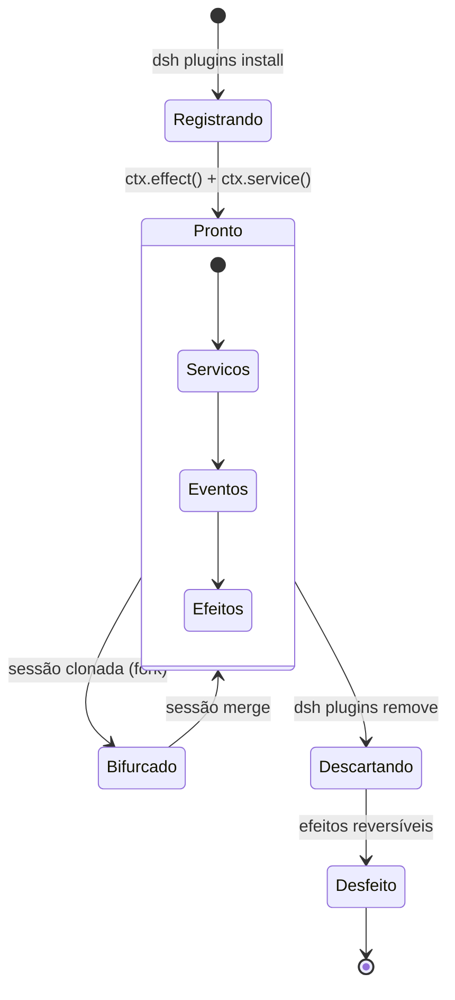

# Capítulo 5: Sistema de Plugins: O Coracao do Harness

## 1. Introdução

No Capítulo 4, você configurou os motores de inferência local. Agora é hora de abrir o capô e entender como as peças se conectam. O sistema de plugins é o coração do DeepSeek Harness — é ele que permite que cada componente (modelo, ferramentas, sessões, sandbox) funcione de forma independente mas integrada [1].

O paradigma plugin-first não é apenas uma característica técnica — é uma filosofia de design que define como o DeepSeek Harness se diferencia de todos os outros frameworks de agentes. Enquanto outros tratam plugins como uma feature opcional, o DeepSeek Harness faz deles o centro de tudo [2].

Neste capítulo, você vai dominar o ciclo de vida dos plugins Cordis, entender como funciona a injeção de dependência entre plugins, e aprender a instalar, listar e remover plugins sem quebrar nada. É o conhecimento que separa um usuário casual de um engenheiro de agentes.

## 2. Explica

### O Ciclo de Vida de um Plugin

Todo plugin no DeepSeek Harness passa por três estágios durante sua existência [3]:

1. **Ready (Pronto):** O plugin é carregado e registrado no contexto compartilhado. Ele declara seus serviços, eventos, e efeitos. É neste momento que o plugin "nasce" e começa a interagir com outros plugins. O Cordis garante que todas as dependências estão resolvidas antes de marcar o plugin como pronto.

2. **Fork (Bifurcação):** Quando uma sessão é clonada (por exemplo, quando você faz resume de uma conversa), o plugin é bifurcado. Cada instância filha tem seu próprio estado, mas compartilha os serviços do pai. Isso permite que múltiplas sessões usem o mesmo plugin sem interferir umas nas outras.

3. **Dispose (Descarte):** Quando o plugin é removido ou o harness é desligado, o plugin executa sua rotina de limpeza. Todos os efeitos reversíveis são desfeitos, garantindo que não fique lixo no sistema [3].

Esse ciclo de vida é o que torna o Cordis diferente de outros frameworks. Em um sistema sem lifecycle management, remover um plugin pode deixar callbacks pendentes, listeners órfãos, ou estado corrompido. No Cordis, a remoção é atômica — ou tudo é removido, ou nada é [1].

### Injeção de Dependência

Os plugins não se comunicam diretamente entre si. Em vez disso, eles se comunicam através do contexto compartilhado (`ctx`). Quando um plugin precisa de um serviço de outro, ele declara a dependência e o Cordis resolve automaticamente [4]:

```javascript
// Plugin A declara que fornece um serviço
ctx.service('meu-servico', { execute() { ... } });

// Plugin B declara que precisa desse serviço
const servico = ctx.service('meu-servico');
servico.execute({ input: 'dados' });
```

Esse padrão elimina acoplamento direto entre plugins. Plugin B não precisa saber quem implementa `meu-servico` — ele só precisa que ele exista. Isso permite trocar implementações sem alterar nenhum código consumidor [4].

### Gerenciamento de Plugins

O DeepSeek Harness oferece comandos nativos para gerenciar plugins [5]:

```bash
# Listar plugins instalados
dsh plugins list

# Instalar um plugin do hub
dsh plugins install @deepseek/shell-tool

# Remover um plugin
dsh plugins remove @deepseek/shell-tool

# Atualizar todos os plugins
dsh plugins update

# Verificar conflitos entre plugins
dsh plugins check-conflicts

# Verificar dependências
dsh plugins check-deps

# Testar um plugin
dsh plugins test @deepseek/shell-tool
```

O hub de plugins (awesome-deepseek-harness) mantém uma lista curada de plugins populares [6]. Para plugins personalizados, você pode registrar diretamente do sistema de arquivos local.

O comando `dsh plugins test` merece atenção especial: ele não apenas verifica se o plugin carrega, mas executa um ciclo completo de *ready → fork → dispose* em um contexto isolado, simulando o que aconteceria em produção quando uma sessão é clonada e depois descartada. Isso pega uma classe de bug muito comum — plugins que funcionam perfeitamente em *ready*, mas quebram quando bifurcados porque assumem estado global compartilhado que não deveria ser compartilhado entre sessões filhas:

```bash
dsh plugins test my-word-count-plugin --full-lifecycle
# [ready] OK — serviço 'word-count' registrado
# [fork] OK — instância filha criada com estado independente
# [dispose] OK — cleanup executado, nenhum listener remanescente
# [fork+dispose simultâneo] FALHOU — race condition detectada em contador global
#   → sugestão: mova `let totalCalls = 0` para dentro do ctx, não no módulo
```

Esse último caso — variável de módulo compartilhada entre instâncias bifurcadas — é a causa mais comum de comportamento "fantasma" relatada por quem contribui plugins para o hub: a sessão A e a sessão B, ambas filhas do mesmo plugin, acabam incrementando o mesmo contador em memória, e os números que aparecem no log de uma sessão pertencem, na verdade, à outra.

### Tipos de Plugins

O DeepSeek Harness categoriza plugins em três tipos [7]:

1. **Tool Plugins:** Oferecem ferramentas que o agente pode chamar. É o tipo mais comum — cada tool é uma ação que o agente pode executar no mundo real.

2. **Service Plugins:** Oferecem serviços internos que outros plugins podem consumir. Não aparecem diretamente para o agente, mas são usados por plugins vizinhos. Exemplos: cache, logging, métricas.

3. **Provider Plugins:** Oferecem implementações de serviços que outros plugins dependem. Quando um plugin declara `provides: ["shell"]`, ele está dizendo que implementa o serviço `shell` — outros plugins que dependem de `shell` vão consumir essa implementação.

| Tipo | Visível ao agente? | Exemplo típico | Quando escolher este tipo |
|---|---|---|---|
| Tool Plugin | Sim — aparece como ação chamável | `word-count`, `shell-tool`, `web-search` | O agente precisa decidir *quando* usar a capacidade |
| Service Plugin | Não — consumido só por outros plugins | cache, logger, coletor de métricas | A capacidade é infraestrutura interna, não uma decisão do modelo |
| Provider Plugin | Não diretamente — implementa contrato já esperado | `fs-local`, `fs-remote`, `ollama-provider` | Você quer trocar a implementação de um serviço já existente sem tocar nos consumidores |

Essa distinção evita um erro comum de quem começa a escrever plugins: transformar toda capacidade em Tool Plugin. Se o modelo nunca precisa *decidir* usar aquela capacidade — porque ela é sempre necessária como suporte de outro plugin —, ela deveria ser Service ou Provider, não Tool. Expor infraestrutura interna como Tool Plugin poluí a lista de ferramentas visível ao agente e aumenta a chance de o modelo tentar chamar algo que não faz sentido isoladamente (por exemplo, chamar `cache-invalidate` sem contexto de qual cache).

### Nomenclatura de Serviços e Namespacing

Como o contexto compartilhado (`ctx`) é um único espaço de nomes por sessão, a escolha do nome de um serviço não é um detalhe cosmético — é o que decide se dois plugins de autores diferentes vão colidir ou coexistir. O Cordis não impõe namespacing obrigatório (diferente de um registry de pacotes como o npm, que usa `@escopo/nome`), o que dá liberdade ao autor do plugin, mas também transfere para ele a responsabilidade de evitar nomes genéricos demais [4].

Duas convenções emergiram no ecossistema de plugins do hub `awesome-deepseek-harness`:

- **Serviços de infraestrutura amplamente reutilizados** (`filesystem`, `shell`, `logger`) usam nomes curtos e sem prefixo — precisamente porque a intenção é que múltiplos providers concorram para implementá-los, e o operador escolha qual usar.
- **Serviços específicos de um domínio** (por exemplo, um serviço de parsing de PDFs de um plugin de RAG) devem usar um prefixo que identifique o plugin de origem, como `pdf-rag:parse`, evitando que um nome curto como `parse` colida com o de outro plugin não relacionado.

Ignorar essa convenção é a causa mais comum de conflitos "misteriosos" reportados por quem contribui plugins novos ao hub: dois plugins de autores diferentes, sem nenhuma relação entre si, escolhem o mesmo nome curto e genérico para serviços completamente distintos — e o Cordis, corretamente, os trata como concorrentes pelo mesmo espaço de nomes.

### Anatomia do Manifesto: o Bloco `cordis` no package.json

Todo plugin declara seu contrato com o Cordis através de um bloco `cordis` no `package.json` [4]. Esse manifesto é o que permite ao harness decidir, antes mesmo de executar uma linha de código, se o plugin pode ser carregado com segurança:

```json
{
  "cordis": {
    "provides": ["shell"],
    "requires": ["filesystem", "logger"],
    "optional": ["metrics"],
    "conflicts": ["@third-party/shell-legacy"],
    "version-range": "^0.1.0",
    "lifecycle": {
      "ready": "onReady",
      "fork": "onFork",
      "dispose": "onDispose"
    }
  }
}
```

Cada campo tem uma função precisa na resolução:

- **`provides`:** os serviços que o plugin implementa. É a "oferta" no mercado de serviços do Cordis.
- **`requires`:** dependências obrigatórias. Se um serviço requerido não existe no grafo, o plugin nunca chega ao estado *Ready* — ele fica em *Pending* indefinidamente, e o harness reporta o motivo no log de boot.
- **`optional`:** dependências que, se ausentes, degradam a funcionalidade do plugin sem impedir seu carregamento (por exemplo, um plugin de shell que usa `metrics` para telemetria, mas funciona sem ela).
- **`conflicts`:** uma lista explícita de plugins incompatíveis. Instalar um plugin que conflita com outro já presente gera um erro de instalação antes mesmo de tentar resolver o grafo.
- **`version-range`:** compatibilidade semver com a API do Cordis. Um plugin declarado para `^0.1.0` quebra deliberadamente se o harness subir para `1.0.0` com breaking changes — proteção contra incompatibilidades silenciosas.

### O Algoritmo de Resolução de Dependências

Quando o harness inicia, o Cordis não carrega plugins na ordem em que aparecem no arquivo de configuração — ele constrói um grafo dirigido de dependências (cada plugin é um nó, cada `requires` é uma aresta) e calcula uma ordenação topológica [3]. Esse processo tem três propriedades importantes:

1. **Determinismo:** dado o mesmo conjunto de plugins instalados, a ordem de carregamento é sempre a mesma — isso é essencial para depurar comportamento reproduzível.
2. **Detecção de ciclos:** se o Plugin A requer o Plugin B, e B requer A, o Cordis detecta o ciclo antes de tentar carregar qualquer um dos dois, e aborta o boot com uma mensagem apontando exatamente qual ciclo foi encontrado.
3. **Carregamento parcial controlado:** se um plugin opcional falha ao carregar, os plugins que dependem dele via `optional` continuam normalmente; se um plugin obrigatório falha, apenas a subárvore de plugins que dependem dele fica em *Pending* — o resto do harness continua operacional.

Esse comportamento é o que diferencia o Cordis de um simples `require()` sequencial: em vez de o boot inteiro falhar por causa de um plugin com problema, o dano fica contido ao menor subconjunto possível do grafo [4].

### Conflitos e Resolução

Quando dois plugins tentam registrar o mesmo serviço, o Cordis detecta o conflito e aplica regras de resolução, em ordem de precedência [3]:

1. **Resolução explícita no manifesto:** se um plugin declara `conflicts` contra outro, a instalação do segundo é bloqueada antes de qualquer tentativa de merge.
2. **Prioridade por versão:** entre dois provedores compatíveis do mesmo serviço, plugins com `version-range` mais recente têm prioridade.
3. **Prioridade por ordem de carregamento:** na ausência de critério de versão, plugins carregados primeiro (ou seja, mais próximos da raiz do grafo topológico) têm prioridade.
4. **Resolução manual:** o operador pode forçar qual plugin vence, sobrescrevendo as regras automáticas.

Um caso comum de conflito é a instalação de dois plugins de shell — por exemplo, `@deepseek/shell-tool` (oficial) e um plugin de terceiros que também declara `provides: ["shell"]`. Sem `conflicts` explícito no manifesto, o Cordis resolve pela regra de versão; se as versões forem equivalentes, cai para ordem de carregamento — o que pode gerar comportamento surpreendente se o operador não tiver clareza de qual plugin foi instalado primeiro.

```bash
# Verificar conflitos antes de instalar
dsh plugins check-conflicts --before-installing @novo/plugin

# Forçar resolução de conflito
dsh plugins resolve-conflict shell --winner @deepseek/shell-tool

# Inspecionar o grafo de resolução completo (ordem topológica calculada)
dsh plugins graph --format tree
# @deepseek/filesystem (nenhuma dependência)
# └── @deepseek/shell-tool (requires: filesystem)
#     └── my-word-count-plugin (requires: filesystem; optional: metrics)
```

## 3. Ilustra

### O Sistema Elétrico da Oficina

Na sua oficina de agentes, o sistema de plugins é como o sistema elétrico. Cada tomada (serviço) pode alimentar qualquer ferramenta (plugin). Quando você pluga uma furadeira (plugin de shell) na tomada (serviço `shell`), ela funciona imediatamente — não importa se a energia vem de uma usina solar (Ollama) ou de uma hidrelétrica (API da DeepSeek) [8].

O Cordis é o quadro de distribuição elétrico. Ele garante que cada tomada receive a tensão correta, que não haja curto-circuito quando duas ferramentas tentam usar o mesmo recurso, e que, quando você despluga uma ferramenta, a tomada continua funcionando para outra.

O ciclo de vida é como a manutenção preventiva: quando uma ferramenta quebra (plugin com erro), o Cordis a remove sem derrubar o sistema inteiro. Quando você quer testar uma ferramenta nova, pode plugá-la sem desligar as que já estão funcionando [3].

A injeção de dependência é como um sistema inteligente de distribuição elétrica: quando você pluga uma furadeira, o sistema verifica automaticamente se a tomada tem energia suficiente, se não há curto-circuito, e se a tensão é compatível. Você não precisa pensar nisso — o sistema cuida de tudo.

A nomenclatura de serviços, nessa analogia, é como o padrão de tomadas de um país. Se todo eletricista decidisse etiquetar tomadas com nomes genéricos como "tomada 1" e "tomada 2", duas instalações independentes na mesma oficina acabariam usando a mesma etiqueta para coisas diferentes — e um dia alguém pluga a solda no lugar errado. É por isso que instalações elétricas profissionais nomeiam circuitos por função e localização (`circuito-bancada-3`, não `circuito-A`): o nome específico é o que evita que dois eletricistas, trabalhando sem se falar, colidam sem saber.

O algoritmo de resolução de dependências, por fim, é como o projeto elétrico que um engenheiro desenha antes de instalar qualquer fio: ele decide em que ordem os circuitos são energizados (o quadro geral primeiro, depois os disjuntores, depois as tomadas) para que nenhum equipamento receba energia antes que sua proteção esteja pronta. Se o projeto tem um erro circular — o circuito A depende do B, que depende do A — o engenheiro descobre isso na planta, no papel, antes de ligar qualquer coisa. É exatamente isso que o Cordis faz ao detectar ciclos no grafo de plugins antes do boot.



## 4. Técnica

### Criando um Plugin do Zero

Vamos criar um plugin simples que adiciona uma ferramenta de contagem de palavras:

```bash
# Criar estrutura do plugin
mkdir my-word-count-plugin
cd my-word-count-plugin
npm init -y
```

```json
// package.json
{
  "name": "my-word-count-plugin",
  "version": "0.1.0",
  "main": "index.js",
  "cordis": {
    "provides": ["tool"],
    "requires": ["filesystem"],
    "lifecycle": {
      "ready": "onReady",
      "dispose": "onDispose"
    }
  }
}
```

```javascript
// index.js
export default function wordCountPlugin(ctx) {
  const fs = ctx.service('filesystem');
  
  ctx.service('word-count', {
    async execute({ filePath }) {
      const content = await fs.readFile(filePath);
      const words = content.split(/\s+/).length;
      const lines = content.split('\n').length;
      return {
        file: filePath,
        words: words,
        lines: lines,
        chars: content.length
      };
    }
  });

  ctx.effect(() => {
    console.log('[word-count] Plugin instalado');
    return () => {
      console.log('[word-count] Plugin removido');
    };
  });
}
```

### Instalando e Testando

```bash
# Instalar localmente
dsh plugins install ./my-word-count-plugin

# Verificar que está instalado
dsh plugins list
# NAME                    VERSION  PROVIDES    REQUIRES
# my-word-count-plugin    0.1.0    tool        filesystem

# Testar no harness
dsh> Use a ferramenta word-count no arquivo README.md
# Resultado: { words: 1247, lines: 89, chars: 7832 }
```

### Resolvendo Conflitos

```bash
# Verificar conflitos
dsh plugins check-conflicts
# ⚠️ Conflito: serviço 'shell' registrado por:
#   - @deepseek/shell-tool (v1.2.0)
#   - my-custom-shell (v0.1.0)

# Resolver manualmente
dsh plugins resolve-conflict shell --winner @deepseek/shell-tool

# Ou remover o conflitante
dsh plugins remove my-custom-shell
```

### Escrevendo um Provider Plugin

Diferente do `word-count-plugin` (um Tool Plugin), um Provider Plugin implementa a *interface* de um serviço que outros componentes já esperam encontrar — por exemplo, trocar o provedor padrão de `filesystem` por um que grava em um bucket remoto em vez do disco local:

```javascript
// remote-fs-provider/index.js
export default function remoteFsProvider(ctx) {
  const bucket = ctx.config.get('remote-fs.bucket');

  ctx.service('filesystem', {
    async readFile(path) {
      return await downloadFromBucket(bucket, path);
    },
    async writeFile(path, content) {
      return await uploadToBucket(bucket, path, content);
    }
  }, { provides: 'filesystem', override: true }); // override explícito, senão o Cordis trata como conflito

  ctx.effect(() => {
    const conn = openBucketConnection(bucket);
    return () => conn.close(); // cleanup: fecha a conexão no dispose
  });
}
```

O campo `override: true` é obrigatório porque, sem ele, o Cordis trataria a segunda implementação de `filesystem` como um conflito de serviço (a mesma regra descrita na seção anterior) em vez de uma substituição intencional. Isso é o que permite trocar Ollama por vLLM, ou disco local por armazenamento remoto, sem que nenhum plugin consumidor precise saber da mudança [4].

### Depurando um Plugin que Não Sobe

Quando um plugin fica preso em *Pending* (nunca chega a *Ready*), o primeiro passo é inspecionar por que a dependência não foi resolvida:

```bash
dsh plugins status my-word-count-plugin
# STATUS: pending
# MOTIVO: dependência 'filesystem' não encontrada no grafo
# SUGESTÃO: instale um provider para 'filesystem' (ex: @deepseek/fs-local)
#           ou verifique se @deepseek/fs-local está no estado 'ready'

dsh plugins status @deepseek/fs-local
# STATUS: error
# MOTIVO: falha no lifecycle 'ready' — TypeError: Cannot read property 'root' of undefined
#         em fs-local/index.js:12
```

Esse par de comandos é geralmente suficiente para isolar se o problema é de grafo (dependência ausente) ou de execução (erro dentro do próprio `ready()`).

## 5. Aplica

### O Plugin que Quebrou Tudo

Um desenvolvedor instalou um plugin de cache que registrava um interceptor no pipeline de ferramentas. O plugin funcionava bem — até que ele desativou o cache sem remover o interceptor. O interceptor continuava ativo, mas retornava `undefined` para todas as requisições, causando erros silenciosos em todo o agente [3].

O problema era que o plugin não implementava corretamente o efeito reversível. A solução: sempre implemente `ctx.effect()` com uma função de cleanup que remove tudo o que foi adicionado.

### A Prática Correta

Regras para plugins robustos:

1. **Sempre implemente o lifecycle completo:** `ready` e `dispose` não são opcionais.
2. **Use `ctx.effect()` para side effects:** cada `addEventListener`, `setInterval`, ou modificação de estado global deve ter um cleanup associado.
3. **Declare dependências explicitamente:** o campo `requires` no `package.json` permite que o Cordis resolva conflitos antes de carregar.
4. **Teste a remoção:** antes de publicar, instale e remova seu plugin 3 vezes seguidas. Se o harness ficar instável, há um leak [4].
5. **Documente seu plugin:** README claro com exemplos de uso.
6. **Versione corretamente:** semver para commits, releases para publishes.
7. **Namespace seus serviços:** prefira `meu-plugin:servico` a nomes genéricos como `parse` ou `cache` — a colisão de nomes é o defeito mais comum reportado no hub de plugins da comunidade [4].

### Os Limites do Modelo Plugin-First

O paradigma plugin-first não é gratuito — ele troca simplicidade de chamada direta por indireção via grafo de serviços, e essa indireção tem um custo que só aparece em escala. O próprio ecossistema reconhece que o Cordis é "um framework novo e não testado em escala enterprise, com potencial de overhead de abstração em pipelines de alta performance" [1]. Na prática, isso significa duas zonas onde o modelo de plugins deixa de ser a escolha certa:

Primeiro, em pipelines com milhares de chamadas de ferramenta por segundo (por exemplo, um agente processando lotes de documentos em paralelo), a resolução de serviço via `ctx.service()` a cada chamada adiciona uma travessia de grafo que uma chamada de função direta não teria — para essa classe de carga, vale medir se o overhead de indireção é aceitável antes de comprometer a arquitetura inteira ao padrão plugin.

Segundo, em instalações com um número muito grande de plugins simultâneos (tipicamente dezenas a mais de cem, somando plugins de terceiros do hub `awesome-deepseek-harness` com plugins internos da equipe), o grafo de dependências fica difícil de auditar visualmente e os conflitos de nome de serviço passam a exigir resolução manual com frequência crescente — nesse ponto, curar ativamente quais plugins entram em produção (em vez de instalar tudo que parece útil) volta a ser necessário, mesmo com toda a automação de `check-conflicts` e `check-deps`.

## 6. Conclusão

Neste capítulo, você dominou o ciclo de vida dos plugins Cordis (ready/fork/dispose), entendeu como a injeção de dependência elimina acoplamento entre componentes, e aprendeu a gerenciar plugins com os comandos nativos do harness. O sistema de plugins é o que torna o DeepSeek Harness verdadeiramente flexível — cada componente pode ser trocado, removido, ou substituído sem afetar o resto.

No próximo capítulo, você vai mergulhar no tool pipeline — como o agente executa ações reais no mundo, camada por camada, com policy, hooks e guards de segurança.

## 7. Referências Bibliográficas

[1] DEEPSEEK AI. *DeepSeek Harness developer preview: Everything is a plugin*. Disponível em: https://deepseek.com/harness/en/. Acesso em: 23 ago. 2026.

[2] HABR. *Inside DeepSeek Harness: Cordis, Session Events, Tool Pipelines*. Disponível em: https://habr.com/en/articles/1070958/. Acesso em: 23 ago. 2026.

[3] DEEPSEEK AI. *deepseek-harness/docs/cordis-primer.md*. GitHub. Disponível em: https://github.com/deepseek-ai/deepseek-harness/blob/master/docs/cordis-primer.md. Acesso em: 23 ago. 2026.

[4] 0XSLINE. *awesome-deepseek-harness*. GitHub. Disponível em: https://github.com/0xsline/awesome-deepseek-harness. Acesso em: 23 ago. 2026.

[5] TOWARDS AI. *DeepSeek Harness vs Claude Code: A Plugin Architecture Teardown*. Disponível em: https://pub.towardsai.net/deepseek-harness-vs-claude-code-a-plugin-architecture-teardown-da3c916f3af1. Acesso em: 23 ago. 2026.

[6] COMPOSIO. *Best plugins for DeepSeek Harness every developer*. Disponível em: https://composio.dev/content/best-deepseek-harness-plugins. Acesso em: 23 ago. 2026.

[7] ATLASCLOUD. *DeepSeek Harness Plugins: The 7 Worth It*. Disponível em: https://www.atlascloud.ai/blog/tips/deepseek-harness-plugins. Acesso em: 23 ago. 2026.

[8] TOWARDS AI. *DeepSeek Harness Explained: When the AI Model is Just a Plugin*. Disponível em: https://pub.towardsai.net/deepseek-harness-explained-when-the-ai-model-is-just-a-plugin-16b2496f3d01. Acesso em: 23 ago. 2026.

[9] DEEPSEEK AI. *deepseek-harness/docs/architecture.md*. GitHub. Disponível em: https://github.com/deepseek-ai/deepseek-harness/blob/master/docs/architecture.md. Acesso em: 23 ago. 2026.

[10] FLOATBOAT.AI. *Cordis — The Plugin Kernel Behind DeepSeek Harness*. Disponível em: https://floatboat.ai/blog/cordis-plugin-framework. Acesso em: 23 ago. 2026.

[11] AGENTATLAS. *Cordis Explained: How DeepSeek Harness's Plugin Framework Works*. Disponível em: https://agentatlas.org/blog/cordis-explained-how-deepseek-harness-plugin-framework-works/. Acesso em: 23 ago. 2026.

[12] MEDIUM (data-and-beyond). *Decoding DeepSeek Harness: The Open-Source Runtime Behind Composable AI Agents*. Disponível em: https://medium.com/data-and-beyond/decoding-deepseek-harness-the-open-source-runtime-behind-composable-ai-agents-c2299e992870. Acesso em: 23 ago. 2026.

[13] LINKEDIN (Tony Ren). *DeepSeek Harness: Agent Operating System*. Disponível em: https://www.linkedin.com/posts/tonyren_i-spent-the-evening-in-the-deepseek-harness-activity-7493848102076882944-GGXB. Acesso em: 23 ago. 2026.

[14] LINKEDIN (Richard Van Ngo Tran). *DeepSeek Harness v0.1 Released*. Disponível em: https://www.linkedin.com/posts/richard-van-ngo-tran-8095441a4_deepseek-harness-v01-is-now-available-in-activity-7493832260652228608-E39a. Acesso em: 23 ago. 2026.

[15] MEDIUM (kaliarch). *DeepSeek Harness: When the Agent Loop Itself Becomes a Plugin*. Disponível em: https://medium.com/@kaliarch/deepseek-harness-when-the-agent-loop-itself-becomes-a-plugin-7fad0aa9de1c. Acesso em: 23 ago. 2026.

[16] DEEPSEEKHARNESSAI. *Security Plugins for DeepSeek Harness*. Disponível em: https://deepseekharnessai.com/categories/security. Acesso em: 23 ago. 2026.

[17] MINDSTUDIO. *What Is DeepSeek Harness? The Plug-In Coding Agent Explained*. Disponível em: https://www.mindstudio.ai/blog/deepseek-harness-agentic-coding. Acesso em: 23 ago. 2026.

[18] YOUTUBE. *NEW Deepseek Agent Harness EXPLAINED (deep dive)*. Disponível em: https://www.youtube.com/watch?v=Hpw4fAHlHDw. Acesso em: 23 ago. 2026.

[19] YOUTUBE. *Every Deepseek Harness Concept Explained (For Normal People)*. Disponível em: https://www.youtube.com/watch?v=24UCnAs7MVg. Acesso em: 23 ago. 2026.

[20] YOUTUBE. *Architecture, Loops, and the Universal Plugin Paradigm*. Disponível em: https://m.youtube.com/watch?v=Qjv8jdh4g38. Acesso em: 23 ago. 2026.
