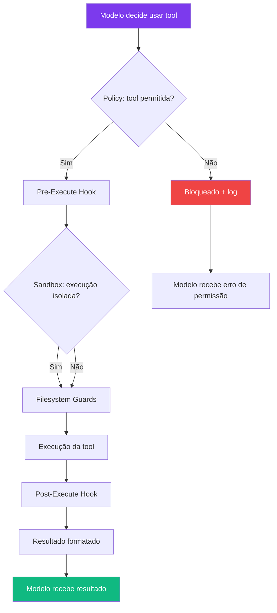
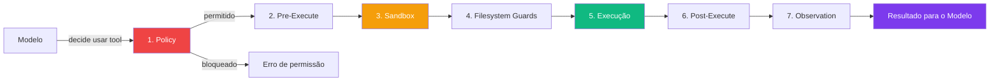

# Capítulo 6: Tool Pipeline: Como o Agente Executa Acoes

## 1. Introdução

No Capítulo 5, você entendeu como os plugins se conectam e gerenciam ciclo de vida. Mas plugins sozinhos não fazem nada — eles precisam de um sistema que coordene suas ações. O tool pipeline é essa coordenação: o fluxo completo que transforma uma decisão do modelo em uma ação no mundo real [1].

O tool pipeline é uma das partes mais elegantes do DeepSeek Harness. Ele não é apenas uma fila de ferramentas — é um sistema de defesa em profundidade com múltiplas camadas de segurança, auditoria, e processamento. Cada chamada de tool passa por policy, hooks, sandboxing, filesystem guards, execução, reescrita de resultados, e observação [2].

Neste capítulo, você vai entender cada camada do pipeline de ferramentas — policy, hooks, sandboxing, filesystem guards — e descobrir como o DeepSeek Harness garante que cada ação do agente é segura, rastreável, e reversível.

A escala em que esse pipeline precisa operar não é trivial: o repositório do DeepSeek Harness no GitHub acumulou mais de 141 mil estrelas em apenas 4 dias após o lançamento [21], um volume de adoção que expõe a arquitetura de camadas a uma diversidade de cargas de trabalho — de scripts pessoais a pipelines corporativos — muito maior do que a de um framework de nicho recém-lançado. Cada camada do pipeline precisa se comportar de forma previsível tanto para o desenvolvedor que roda um agente sozinho em um notebook quanto para a equipe que roda centenas de sessões simultâneas em produção.

## 2. Explica

### As Camadas do Pipeline

Quando o modelo decide que precisa executar uma ferramenta (por exemplo, ler um arquivo), essa decisão passa por múltiplas camadas antes de se tornar uma ação real [1]:

1. **Policy Layer:** Verifica se a ferramenta é permitida. Algumas ferramentas podem ser desativadas por configuração ou por permissões do usuário. É a primeira linha de defesa — se a policy bloqueia, a ação não acontece.

2. **Pre-Execute Hook:** Intercepta a chamada antes da execução. Pode modificar parâmetros, registrar logs, ou bloquear a ação completamente. Hooks são úteis para auditoria e customização sem modificar a tool original.

3. **Sandbox Layer:** Executa a ferramenta em ambiente isolado. Garante que o agente não pode acessar arquivos ou recursos fora do seu escopo permitido. É a camada de segurança mais importante.

4. **Filesystem Guards:** Controle granular de leitura/escrita por diretório. O agente pode ler `/home/user/projeto` mas não `/etc/passwd`. Guards são mais granulares que o sandbox — eles controlam quais diretórios específicos podem ser acessados.

5. **Execução:** A ferramenta realmente roda e retorna um resultado. É a única camada que faz trabalho real — todas as outras são de processamento e segurança.

6. **Post-Execute Hook:** Processa o resultado. Pode reescrever, comprimir, ou filtrar a saída antes de devolvê-la ao modelo. Essa camada protege o modelo de respostas muito longas ou malformadas.

7. **Observation/Rendering:** O resultado é formatado e exibido ao agente (e ao usuário) [1].

### Por que Tantas Camadas?

Cada camada existe por um motivo específico:

- **Policy** evita que o agente execute ações proibidas (como `git push --force` em produção)
- **Hooks** permitem auditoria e logging sem modificar a ferramenta
- **Sandbox** previne que o agente corrompa o sistema do usuário
- **Filesystem Guards** garantem que o agente só mexe onde deveria
- **Post-Execute** protege o modelo de respostas muito longas ou malformadas

Essa arquitetura em camadas é o que permite ao DeepSeek Harness ser ao mesmo tempo poderoso e seguro [3].

### Retries, Timeouts e Backoff no Pipeline

Nem toda chamada de ferramenta termina com sucesso na primeira tentativa. Uma chamada de rede pode falhar por instabilidade momentânea, um comando shell pode travar esperando input, ou o sandbox pode demorar para inicializar em uma máquina sobrecarregada. O tool pipeline trata essas falhas com uma política de retry configurável por camada [1]:

```yaml
# dsh.config.yaml
tools:
  execution:
    timeout: 30s              # tempo máximo por chamada individual
    retries:
      max-attempts: 3
      backoff: exponential    # 1s -> 2s -> 4s entre tentativas
      retry-on:
        - "network-error"
        - "sandbox-timeout"
      no-retry-on:
        - "policy-blocked"    # nunca reexecutar algo que a policy bloqueou
        - "filesystem-denied" # nunca reexecutar algo que os guards negaram
```

A distinção entre `retry-on` e `no-retry-on` é uma decisão de design deliberada: falhas transitórias (rede instável, timeout de sandbox) são candidatas a retry, porque a mesma chamada pode funcionar na segunda tentativa. Falhas de política e de guard, ao contrário, nunca são retentadas — reexecutar uma chamada que a Policy Layer bloqueou não vai fazer a policy mudar de decisão, e insistir apenas adiciona ruído ao log de auditoria.

### Compressão e Reescrita de Resultados no Post-Execute

A camada de Post-Execute Hook não serve apenas para auditoria — ela também protege o modelo de receber um contexto absurdamente grande. Quando uma ferramenta como `filesystem:read` retorna um arquivo de várias centenas de KB, o post-execute hook pode truncar, resumir, ou paginar o resultado antes que ele volte para a janela de contexto do modelo [4]:

```javascript
// plugin de compressão de resultados grandes
export default function resultCompressionPlugin(ctx) {
  ctx.on('tool:post-execute', async (event) => {
    if (event.result.length > 4096) {
      const truncated = event.result.slice(0, 4096);
      event.result = `${truncated}\n\n[... resultado truncado: ${event.result.length} chars totais, mostrando os primeiros 4096 ...]`;
      ctx.emit('tool:result-truncated', {
        tool: event.tool,
        originalSize: event.result.length,
        truncatedTo: 4096
      });
    }
  });
}
```

Sem essa camada, uma única chamada de ferramenta mal calibrada — por exemplo, ler um arquivo de log grande demais de uma vez — poderia consumir toda a janela de contexto disponível do modelo em uma única resposta, deixando pouco espaço para o raciocínio subsequente do agente.

### O Fluxo Completo



### Métricas de Performance

O DeepSeek Harness coleta métricas automaticamente para cada chamada de tool [4]:

| Métrica | Descrição | Importância |
|---------|-----------|-------------|
| Latência | Tempo total da chamada | Performance |
| Throughput | Chamadas por segundo | Capacidade |
| Taxa de erro | % de chamadas que falharam | Confiabilidade |
| Uso de VRAM | Pico de memória durante execução | Recursos |
| Tamanho do resultado | Bytes retornados | Eficiência |

### Taxonomia de Erros do Pipeline

Cada camada do pipeline pode falhar de um jeito diferente, e o DeepSeek Harness distingue esses erros para que o agente (e o operador) saibam exatamente onde a chamada parou [1]:

| Código de erro | Camada de origem | Significado | Retentável? |
|---|---|---|---|
| `policy-blocked` | Policy Layer | A regra de configuração bloqueou a ferramenta | Não |
| `hook-rejected` | Pre-Execute Hook | Um hook customizado vetou a chamada | Não (depende do hook) |
| `sandbox-timeout` | Sandbox Layer | O ambiente isolado não respondeu a tempo | Sim |
| `filesystem-denied` | Filesystem Guards | O caminho está fora do escopo permitido | Não |
| `execution-error` | Execução | A ferramenta rodou e falhou (ex: comando shell com exit code != 0) | Depende do erro |
| `result-too-large` | Post-Execute Hook | O resultado excedeu o limite e foi truncado (não é uma falha, é um aviso) | N/A |

Essa tabela de erros é o que permite ao agente decidir sua próxima ação de forma informada: um `policy-blocked` significa "não tente de novo, tente outra abordagem"; um `sandbox-timeout` significa "pode valer a pena tentar novamente, talvez o ambiente estivesse sobrecarregado".

### Observabilidade: Tracing de uma Chamada Ponta a Ponta

Para depurar um pipeline com sete camadas, olhar apenas o resultado final não é suficiente — é preciso ver o tempo gasto em cada estação. O DeepSeek Harness expõe isso via spans de tracing, no formato usado por ferramentas de observabilidade distribuída [4]:

```bash
dsh session trace --tool-call last
# span: tool-call [total: 187ms]
#   ├── policy-check        [2ms]
#   ├── pre-execute-hook     [5ms]  (audit-plugin)
#   ├── sandbox-init         [140ms]  ← maior custo, ambiente frio
#   ├── filesystem-guard     [1ms]
#   ├── execution            [30ms]
#   ├── post-execute-hook    [3ms]
#   └── observation-render   [6ms]
```

Nesse exemplo ilustrativo, a inicialização do sandbox (`sandbox-init`) domina o tempo total da chamada, consumindo isoladamente mais tempo que todas as outras estações somadas. Esse tipo de trace é o que revela, na prática, onde otimizar: reaproveitar sandboxes já inicializados entre chamadas consecutivas da mesma sessão, em vez de recriar o ambiente isolado do zero a cada chamada, costuma trazer o ganho de performance mais expressivo disponível no pipeline.

## 3. Ilustra

### A Linha de Montagem da Oficina

Na sua oficina de agentes, o tool pipeline é como uma linha de montagem automatizada. Quando um cliente (o modelo) faz um pedido (decide usar uma tool), o pedido passa por uma série de estações antes de se tornar um produto final (ação executada) [5]:

**Estação 1 (Policy):** O inspetor verifica se o pedido é permitido. "Você quer furar uma parede? Tem autorização? É no seu terreno?" Se o pedido é bloqueado, ele é devolto imediatamente com uma explicação do porquê.

**Estação 2 (Pre-Execute):** O planejador ajusta os detalhes. "Você quer furar a 30cm do chão? Deixe eu marcar exatamente onde." Ele pode adicionar logs, modificar parâmetros, ou verificar se há conflitos com outros pedidos em andamento.

**Estação 3 (Sandbox):** A estação de isolamento. "Vou colocar a parede numa cabine isolada para que, se algo der errado, não afete a oficina inteira." O sandbox garante que a execução não pode acessar recursos fora do escopo permitido.

**Estação 4 (Guards):** O controle de qualidade. "Você só pode furar nesta parede específica, não na parede vizinha do vizinho." Os filesystem guards verificam que a ação está dentro dos limites permitidos.

**Estação 5 (Execução):** A furadeira faz o trabalho. É aqui que a ação realmente acontece — leitura de arquivo, execução de comando, chamada de API.

**Estação 6 (Post-Execute):** O acabamento. "Deixe eu lixar a borda e limpar a poeira antes de devolver." O resultado é processado, comprimido se necessário, e formatado para o modelo.

**Estação 7 (Observation):** O relatório. "Furo feito, 3cm de profundidade, sem danos à estrutura." O resultado é exibido ao agente e registrado para auditoria.

Cada estação existe para garantir que o produto final é seguro, preciso, e rastreável [5].

Há também uma estação de retrabalho que não aparece no fluxo feliz: quando a estação de isolamento (Sandbox) trava — talvez porque a cabine estava sendo usada por outro pedido e ainda não liberou —, o supervisor não descarta o pedido imediatamente. Ele espera um pouco, tenta de novo, espera um pouco mais, tenta de novo — isso é o backoff exponencial. Mas se o inspetor da Estação 1 já rejeitou o pedido por falta de autorização, não existe "tentar de novo" — a autorização não vai aparecer magicamente na segunda tentativa, então o pedido volta para o cliente com a explicação do motivo.

E se um cliente pede a mesma peça repetidas vezes em um curto intervalo — dez vezes no mesmo minuto, por exemplo — o supervisor da linha também intervém: ele não deixa a linha inteira ser monopolizada por um único pedido repetitivo, mesmo que cada pedido individual seja legítimo. Essa é a função do rate limiter — proteger a capacidade da linha de montagem como um todo, não apenas cada pedido isoladamente.



### A Segurança em Profundidade

O tool pipeline é um exemplo clássico de "defesa em profundidade" — a mesma estratégia usada em castelos medievais. Não é uma muralha alta que impede invasores, mas múltiplas muralhas, fosso, e portões. Se um invasor atravessa uma muralha, há outra atrás. Se atravessa a segunda, há um fosso. Se cruza o fosso, há um portão [6].

No DeepSeek Harness, se a policy falhar, o sandbox pega. Se o sandbox falhar, os filesystem guards pegam. Se os guards falharem, o post-execute hook pode bloquear o resultado. É redundância deliberada — não redundância acidental.

## 4. Técnica

### Configurando Policy Rules

```yaml
# dsh.config.yaml
tools:
  policy:
    # Bloquear comandos perigosos
    blocked:
      - "git push --force"
      - "rm -rf /"
      - "sudo *"
      - "chmod 777"
    
    # Permitir apenas em modo read
    read-only:
      - "filesystem:read"
      - "web:search"
    
    # Exigir aprovação humana
    require-approval:
      - "shell:execute"
      - "filesystem:write"
      - "git:push"
      - "git:reset"
```

### Granularidade das Regras de Policy

Um detalhe frequentemente ignorado na configuração de `blocked` e `require-approval` é que as regras não operam sobre nomes de ferramenta isolados — elas casam contra o padrão completo `namespace:ação` (ou um wildcard sobre ele). Isso importa porque bloquear `shell:execute` inteiro é bem mais restritivo do que bloquear apenas `shell:execute:sudo`, e a maioria dos times comete o erro de começar restringindo demais (o que quebra fluxos legítimos) ou de menos (o que deixa buracos de segurança) [1]:

```yaml
tools:
  policy:
    # Granularidade fina: bloqueia só o padrão perigoso, não o comando inteiro
    blocked:
      - "shell:execute:sudo *"
      - "shell:execute:rm -rf *"
      - "git:push --force *"

    # Granularidade grossa: bloqueia a ação inteira, mesmo usos seguros
    blocked-total:
      - "filesystem:delete"  # nenhuma exclusão é permitida, ponto final

    # Aprovação condicional por argumento, não pela ferramenta em si
    require-approval-if:
      - tool: "shell:execute"
        when: "contains(command, 'rm') or contains(command, 'sudo')"
      - tool: "git:push"
        when: "branch == 'main' or branch == 'master'"
```

O bloco `require-approval-if` é o mais poderoso dos três porque permite deixar a maioria dos usos de uma ferramenta fluir sem fricção (por exemplo, `git push` para uma branch de feature) enquanto exige aprovação apenas para o subconjunto de usos genuinamente arriscado (push direto para `main`). Configurar tudo com granularidade grossa é mais simples de escrever, mas tende a gerar tanta fricção de aprovação que os operadores acabam desabilitando a proteção inteira por cansaço — o oposto do efeito de segurança pretendido.

### Configurando Filesystem Guards

```yaml
# dsh.config.yaml
sandbox:
  filesystem:
    # Permitir leitura em qualquer lugar
    read:
      - "/home/user/**"
      - "/tmp/**"
    
    # Permitir escrita apenas no projeto
    write:
      - "/home/user/projeto/**"
      - "/tmp/output/**"
    
    # Bloquear绝对amente
    deny:
      - "/etc/**"
      - "/root/**"
      - "/home/user/.ssh/**"
      - "/home/user/.aws/**"
```

### Hooks de Auditoria

```javascript
// plugin de auditoria
export default function auditPlugin(ctx) {
  ctx.on('tool:pre-execute', (event) => {
    console.log(`[AUDIT] ${event.tool} executada por ${event.session}`);
    console.log(`[AUDIT] Parâmetros: ${JSON.stringify(event.params)}`);
  });

  ctx.on('tool:post-execute', (event) => {
    console.log(`[AUDIT] ${event.tool} retornou ${event.result.length} chars`);
    console.log(`[AUDIT] Latência: ${event.latency}ms`);
  });

  ctx.on('tool:error', (event) => {
    console.log(`[AUDIT] ${event.tool} falhou: ${event.error}`);
  });
}
```

### Monitorando o Pipeline em Tempo Real

```bash
# Habilitar verbose mode
dsh --mode standard --verbose

# Output:
# [TOOL] policy: shell:execute -> permitido
# [TOOL] pre-execute: sandbox isolado ativado
# [TOOL] execute: ls -la /home/user/projeto
# [TOOL] post-execute: resultado comprimido de 2048 para 512 chars
# [TOOL] observation: resultado entregue ao modelo
```

### Implementando um Rate Limiter como Hook

Rate limiting é um exemplo canônico de política que pertence à camada de Pre-Execute Hook, não à Policy Layer — porque a decisão depende de estado acumulado ao longo do tempo (quantas chamadas já ocorreram na última janela), e não apenas de uma regra estática sobre qual ferramenta é permitida [4]:

```javascript
// plugin de rate limiting por ferramenta
export default function rateLimitPlugin(ctx) {
  const janelas = new Map(); // tool -> [timestamps]
  const LIMITE = 10;         // chamadas
  const JANELA_MS = 60_000;  // por minuto

  ctx.on('tool:pre-execute', (event) => {
    const agora = Date.now();
    const historico = janelas.get(event.tool) || [];
    const recentes = historico.filter((t) => agora - t < JANELA_MS);

    if (recentes.length >= LIMITE) {
      event.block(`Rate limit excedido: ${event.tool} já foi chamada ${recentes.length} vezes no último minuto`);
      return;
    }

    recentes.push(agora);
    janelas.set(event.tool, recentes);
  });
}
```

Esse padrão — estado acumulado em memória, decisão baseada em janela deslizante — é o mesmo usado por APIs públicas para conter abuso. A diferença é que, no tool pipeline, o rate limit protege o próprio agente de si mesmo: um loop de raciocínio malformado que decide chamar a mesma ferramenta repetidamente (por exemplo, tentando ler um arquivo que não existe, em um laço sem condição de parada) é contido por essa camada antes de gerar centenas de chamadas desnecessárias.

## 5. Aplica

### O Agente que Apagou o Projeto

Um desenvolvedor configurou o DeepSeek Harness sem filesystem guards. O agente, ao tentar "limpar arquivos temporários", executou `rm -rf .` no diretório do projeto. O projeto inteiro — semanas de trabalho — foi apagado em segundos [7].

A causa raiz não foi o agente ser malicioso — foi a falta de guards. O modelo interpretou "limpar" como "remover tudo", e não havia nenhuma camada de proteção para impedir. O agente não tinha intenção destrutiva — ele apenas fez o que o modelo pediu, sem restrições.

### O Lote que Travou a Fila

Uma equipe configurou um agente para processar um diretório com centenas de arquivos de log, chamando `filesystem:read` em cada um sequencialmente dentro do mesmo turno. O pipeline completo — policy, hooks, sandbox, guards, execução, post-execute — rodava para cada arquivo individualmente, e o sandbox era reinicializado do zero a cada chamada porque a configuração padrão não reaproveitava ambientes entre chamadas consecutivas da mesma sessão [4].

O resultado não foi uma falha visível — nenhum erro apareceu, nenhum arquivo foi corrompido — mas o turno inteiro demorou desproporcionalmente mais do que o esperado, porque o custo de inicializar e destruir o sandbox centenas de vezes se acumulou por cima do tempo de leitura real dos arquivos, que era trivial. A equipe só percebeu o problema ao inspecionar o tracing camada por camada, exatamente como descrito na seção anterior, e notar que `sandbox-init` dominava o tempo total em praticamente todas as chamadas.

A correção foi configurar reaproveitamento de sandbox para chamadas consecutivas de leitura dentro da mesma sessão, reservando a reinicialização completa apenas para chamadas que alteram estado (escrita, execução de comando).

### A Prática Correta

Sempre configure filesystem guards antes de usar o agente em projetos reais:

```yaml
# Configuração mínima de segurança
sandbox:
  filesystem:
    write:
      - "./src/**"
      - "./tests/**"
      - "./docs/**"
    deny:
      - "./.git/**"
      - "./node_modules/**"
      - "./.env"
```

E sempre habilite aprovação humana para ações destrutivas:

```yaml
tools:
  policy:
    require-approval:
      - "shell:execute"
      - "filesystem:write"
      - "git:*"
```

Regras de ouro:
1. **Nunca rode agentes com acesso total ao filesystem**
2. **Sempre teste em um diretório temporário primeiro**
3. **Mantenha backups antes de qualquer operação de agente**
4. **Use approval mode para qualquer coisa que você não pode desfazer**
5. **Monitore os logs regularmente**

### Onde o Pipeline em Camadas Deixa de Compensar

A defesa em profundidade tem um custo de latência que cresce com o número de camadas ativas — cada policy check, cada hook, cada guard de filesystem adiciona um salto de processamento antes da execução real da ferramenta. Para a maioria dos casos de uso (um desenvolvedor trabalhando em um repositório, um agente de suporte respondendo tickets), esse overhead é imperceptível frente à latência do próprio modelo de linguagem. Mas em dois cenários o cálculo muda:

Em pipelines de **altíssimo volume de chamadas** — por exemplo, um agente que processa milhares de arquivos em lote, disparando uma chamada de ferramenta por arquivo — a soma do overhead de cada camada, multiplicada por milhares de chamadas, pode se tornar o gargalo dominante do processo, maior do que o próprio tempo de inferência do modelo. Nesses casos, vale avaliar quais camadas são realmente necessárias para aquele lote específico (por exemplo, desativar hooks de auditoria verbosos em um ambiente de teste já isolado) em vez de rodar a pilha completa de segurança para uma operação de baixo risco repetida milhares de vezes.

Em **operações de latência crítica** — onde o agente precisa responder em tempo real a um evento externo — o approval mode (aprovação humana síncrona) descrito nas regras de ouro acima é, por definição, incompatível com baixa latência: qualquer camada que pausa a execução esperando um humano decidir não serve para um fluxo que precisa responder em milissegundos. Para esses casos, a arquitetura correta é mover a decisão de risco para a Policy Layer (regras automáticas e pré-aprovadas) em vez de depender de `require-approval`, reservando a aprovação humana síncrona para os fluxos onde a latência de segundos a minutos é aceitável.

## 6. Conclusão

Neste capítulo, você entendeu o tool pipeline completo — cada camada que transforma uma decisão do modelo em uma ação segura e rastreável. Policy, hooks, sandbox, filesystem guards, e observação formam um sistema de defesa em profundidade que protege tanto o sistema do usuário quanto a integridade do agente.

O tool pipeline não é apenas segurança — é também performance e usabilidade. Cada camada pode otimizar, comprimir, ou filtrar resultados para tornar a experiência do agente mais fluida.

No próximo capítulo, você vai explorar como o DeepSeek Harness gerencia sessões e estado — a memória de longo prazo que permite ao agente manter contexto entre conversas.

## 7. Referências Bibliográficas

[1] DEEPSEEK AI. *DeepSeek Harness developer preview: Everything is a plugin*. Disponível em: https://deepseek.com/harness/en/. Acesso em: 23 ago. 2026.

[2] MEDIUM (codetodeploy). *Explored DeepSeek Harness: How a Plugin-Native Agent Runtime Actually Works*. Disponível em: https://medium.com/codetodeploy/explored-deepseek-harness-how-a-plugin-native-agent-runtime-actually-works-7b815436a6b3. Acesso em: 23 ago. 2026.

[3] LINKEDIN (Tony Ren). *DeepSeek Harness: Agent Operating System*. Disponível em: https://www.linkedin.com/posts/tonyren_i-spent-the-evening-in-the-deepseek-harness-activity-7493848102076882944-GGXB. Acesso em: 23 ago. 2026.

[4] TOWARDS AI. *DeepSeek Harness Explained: When the AI Model is Just a Plugin*. Disponível em: https://pub.towardsai.net/deepseek-harness-explained-when-the-ai-model-is-just-a-plugin-16b2496f3d01. Acesso em: 23 ago. 2026.

[5] DEEPSEEKHARNESSAI. *Security Plugins for DeepSeek Harness*. Disponível em: https://deepseekharnessai.com/categories/security. Acesso em: 23 ago. 2026.

[6] HABR. *Inside DeepSeek Harness: Cordis, Session Events, Tool Pipelines*. Disponível em: https://habr.com/en/articles/1070958/. Acesso em: 23 ago. 2026.

[7] ZHANG, Jie et al. *When LLMs Meet Cybersecurity: A Systematic Literature Review*. In: arXiv, 2024. Disponível em: http://arxiv.org/abs/2405.03644. Acesso em: 23 ago. 2026.

[8] DEEPSEEK AI. *deepseek-harness/docs/architecture.md*. GitHub. Disponível em: https://github.com/deepseek-ai/deepseek-harness/blob/master/docs/architecture.md. Acesso em: 23 ago. 2026.

[9] DEEPSEEK AI. *deepseek-harness/docs/cordis-primer.md*. GitHub. Disponível em: https://github.com/deepseek-ai/deepseek-harness/blob/master/docs/cordis-primer.md. Acesso em: 23 ago. 2026.

[10] FLOATBOAT.AI. *Cordis — The Plugin Kernel Behind DeepSeek Harness*. Disponível em: https://floatboat.ai/blog/cordis-plugin-framework. Acesso em: 23 ago. 2026.

[11] AGENTATLAS. *Cordis Explained: How DeepSeek Harness's Plugin Framework Works*. Disponível em: https://agentatlas.org/blog/cordis-explained-how-deepseek-harness-plugin-framework-works/. Acesso em: 23 ago. 2026.

[12] MEDIUM (data-and-beyond). *Decoding DeepSeek Harness*. Disponível em: https://medium.com/data-and-beyond/decoding-deepseek-harness-the-open-source-runtime-behind-composable-ai-agents-c2299e992870. Acesso em: 23 ago. 2026.

[13] TOWARDS AI. *DeepSeek Harness vs Claude Code: A Plugin Architecture Teardown*. Disponível em: https://pub.towardsai.net/deepseek-harness-vs-claude-code-a-plugin-architecture-teardown-da3c916f3af1. Acesso em: 23 ago. 2026.

[14] ATLASCLOUD. *DeepSeek Harness Plugins: The 7 Worth It*. Disponível em: https://www.atlascloud.ai/blog/tips/deepseek-harness-plugins. Acesso em: 23 ago. 2026.

[15] COMPOSIO. *Best plugins for DeepSeek Harness*. Disponível em: https://composio.dev/content/best-deepseek-harness-plugins. Acesso em: 23 ago. 2026.

[16] MINDSTUDIO. *What Is DeepSeek Harness? The Plug-In Coding Agent Explained*. Disponível em: https://www.mindstudio.ai/blog/deepseek-harness-agentic-coding. Acesso em: 23 ago. 2026.

[17] YOUTUBE. *NEW Deepseek Agent Harness EXPLAINED*. Disponível em: https://www.youtube.com/watch?v=Hpw4fAHlHDw. Acesso em: 23 ago. 2026.

[18] YOUTUBE. *Every Deepseek Harness Concept Explained*. Disponível em: https://www.youtube.com/watch?v=24UCnAs7MVg. Acesso em: 23 ago. 2026.

[19] DEEPSEEKHARNESSAI. *Security Plugins for DeepSeek Harness*. Disponível em: https://deepseekharnessai.com/categories/security. Acesso em: 23 ago. 2026.

[20] EXPLOREX.AI. *DeepSeek Harness v0.1: Run the Plugin-First Agent Stack*. Disponível em: https://explainx.ai/blog/deepseek-harness-v0-1-plugin-first-agent-stack-august-2026. Acesso em: 23 ago. 2026.

[21] DEEPSEEK AI. *DeepSeek Harness (dsh): Everything is a Plugin*. GitHub. Disponível em: https://github.com/deepseek-ai/deepseek-harness. Acesso em: 23 ago. 2026.
