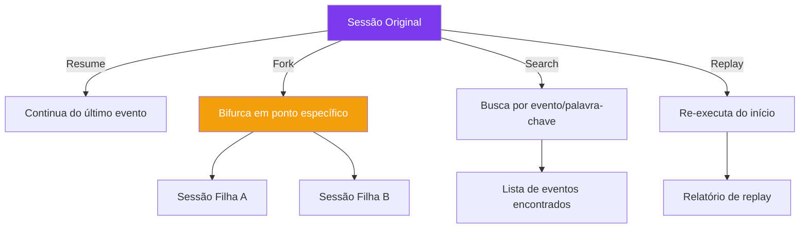

# Capítulo 7: Sessoes e Estado: Memoria do Agente

## 1. Introdução

No Capítulo 6, você viu como o agente executa ações através do tool pipeline. Mas e a memória? Quando você conversa com um agente por 30 minutos, ele lembra do que falou no início? O DeepSeek Harness resolve isso com um sistema de sessões duráveis e eventos tipados que permitem resume, fork e replay de qualquer ponto da conversa [1].

A memória é o que transforma um assistente de "uma vez" em um parceiro de trabalho contínuo. Sem memória, cada conversa começa do zero. Com memória, o agente pode retomar de onde parou, aprender com interações anteriores, e manter contexto ao longo de dias ou semanas [2].

Neste capítulo, você vai configurar sessões que persistem entre reinicializações, entender os eventos de sessão (turn, step, message), e descobrir como manipular o histórico de execução do agente — seja para continuar de onde parou, bifurcar uma conversa, ou revisitar uma decisão específica.

## 2. Explica

### O que são Session Events?

Session events são eventos duráveis que marcam cada momento significativo de uma sessão do agente [3]:

- **Turn Boundary:** Marca o início e fim de um turno completo (mensagem do usuário + resposta do agente + tools executadas). É a unidade fundamental de uma conversa.
- **Step Boundary:** Marca cada passo dentro de um turno — quando o agente decide usar uma tool, quando termina de processar, etc. Um turno pode ter múltiplos steps.
- **User Message:** A mensagem enviada pelo usuário. É a entrada que dispara o turno.
- **Assistant Content:** A resposta gerada pelo modelo. Pode incluir texto, chamadas de tool, ou ambos.
- **Tool Call:** Cada chamada de ferramenta feita pelo agente, com parâmetros e resultado.

Esses eventos são armazenados de forma append-only — nunca são modificados depois de gravados. Isso garante rastreabilidade total: você pode revisitar qualquer momento da sessão e ver exatamente o que aconteceu [1].

A granularidade entre Turn e Step é o que costuma confundir quem chega do modelo mental de "uma mensagem, uma resposta". Um único turno — o usuário pediu "corrija o bug de autenticação" — pode conter uma dezena de steps internos: o modelo decide ler três arquivos, decide rodar os testes, vê que dois falharam, decide editar um arquivo, roda os testes de novo. Cada uma dessas decisões intermediárias é um Step Boundary distinto dentro do mesmo Turn Boundary. Essa distinção importa porque o fork opera em granularidade de evento, não apenas de turno — você pode bifurcar no meio de um turno, exatamente no step em que o agente decidiu editar o arquivo, sem precisar esperar o turno inteiro terminar.

| Tipo de evento | Granularidade | Exemplo |
|---|---|---|
| Turn Boundary | 1 por interação completa | "corrija o bug de autenticação" → resposta final |
| Step Boundary | Vários por turno | decidiu ler arquivo → decidiu rodar teste → decidiu editar |
| Tool Call | 1 por chamada de ferramenta | `filesystem:read src/auth.js` |
| User Message | 1 por mensagem enviada | a mensagem original do usuário |
| Assistant Content | 1 ou mais por resposta | texto + chamadas de tool intercaladas |

### Persistência de Estado

O estado da sessão é persistido em disco. Quando você reinicia o harness, o agente pode retomar exatamente de onde parou, com todo o contexto anterior disponível [4].

Isso é fundamental para tarefas longas. Imagine que você está refatorando um código complexo com o agente. Depois de 2 horas, o computador reinicia. Sem persistência, todo o contexto se perde. Com persistência, o agente recarrega a sessão e continua como se nada tivesse acontecido.

A persistência funciona em três níveis:

1. **Memória de curto prazo:** O contexto da conversa atual. Disponível imediatamente, mas perdido quando a sessão termina.

2. **Memória de médio prazo:** Sessões salvas em disco. Podem ser retomadas dias depois, mas ocupam espaço em disco.

3. **Memória de longo prazo:** RAG e RTK (Run-Time Knowledge). Informações que persistem mesmo quando a sessão é deletada.

### Resume, Fork, Search e Replay

O DeepSeek Harness oferece quatro operações para manipular o histórico de sessão [1]:

**Resume:** Continuar uma sessão anterior. O agente recarrega todo o contexto e continua de onde parou. Essencial para tarefas que se estendem por múltiplas sessões de trabalho.

**Fork:** Bifurcar uma sessão. Cria uma cópia da sessão em um ponto específico, permitindo explorar um caminho diferente sem perder o original. É como uma branch no Git — você pode experimentar sem comprometer o caminho principal.

**Search:** Buscar no histórico de eventos. Encontrar todos os momentos em que uma ferramenta específica foi chamada, ou quando uma determinada palavra-chave apareceu. Essencial para debug e auditoria.

**Replay:** Re-executar uma sessão do início. Útil para debug e para validar que o agente produz os mesmos resultados com as mesmas entradas [3].

### O Formato de Armazenamento: Log de Eventos Append-Only

Na prática, uma sessão é um arquivo de log estruturado, no qual cada linha é um evento serializado com timestamp, tipo, e payload [3]:

```jsonl
{"seq":1,"type":"turn:start","ts":"2026-08-23T14:32:01Z","turn_id":"abc123"}
{"seq":2,"type":"user:msg","ts":"2026-08-23T14:32:01Z","content":"Refatore a função X"}
{"seq":3,"type":"tool:call","ts":"2026-08-23T14:32:05Z","tool":"filesystem:read","params":{"path":"src/x.js"}}
{"seq":4,"type":"tool:result","ts":"2026-08-23T14:32:06Z","result":"...conteúdo do arquivo..."}
{"seq":5,"type":"tool:call","ts":"2026-08-23T14:32:10Z","tool":"filesystem:write","params":{"path":"src/x.js","content":"..."}}
{"seq":6,"type":"turn:end","ts":"2026-08-23T14:32:15Z","tools_used":3}
```

O campo `seq` é o que torna o log totalmente ordenável mesmo se eventos chegarem fora de ordem por causa de latência de disco — é a mesma técnica usada em bancos de dados baseados em *event sourcing*: a verdade sobre o estado atual nunca é armazenada diretamente, ela é *derivada* ao reproduzir a sequência de eventos do início. Isso tem uma implicação prática importante: não existe comando para "editar" um evento passado, porque isso quebraria a garantia de que o replay sempre produz o mesmo resultado a partir do mesmo log.

### Fork em Detalhe: Cópia do Ponteiro, Não do Conteúdo

Quando você bifurca uma sessão em `turn:15`, o Cordis não duplica os 15 turnos anteriores em disco — ele cria um novo arquivo de log que referencia o arquivo original até o ponto de corte, e só grava fisicamente os eventos novos a partir daí [1]. Esse esquema, equivalente a *copy-on-write*, é o que torna o fork uma operação barata mesmo em sessões grandes: bifurcar uma sessão com muitos turnos custa o mesmo, em tempo e espaço, que bifurcar uma sessão com poucos — o custo é proporcional apenas ao que muda depois do fork, não ao histórico anterior.

```bash
dsh session fork refatoracao-api --point turn:15 --name "experimento-alternativo"
# Sessão filha criada:
#   - Compartilha turns 1-15 com a sessão original (referência, sem cópia)
#   - Turns 16+ são exclusivos da sessão filha
#   - Deletar a sessão original NÃO afeta a filha (ela mantém sua própria referência)
```

### Replay e o Limite do Não-Determinismo

O replay reexecuta fielmente a sequência de eventos gravados — as mesmas mensagens de usuário, na mesma ordem, com os mesmos parâmetros de tool call. O que ele não garante é que o *modelo* vá gerar exatamente a mesma resposta na nova execução: como a geração de texto por LLM é estocástica por natureza (mesmo com a mesma entrada, a amostragem de tokens pode variar de uma chamada para outra), o replay reproduz fielmente as *ações* registradas no log — mas não força o modelo a "pensar" de novo do mesmo jeito, a menos que o harness seja configurado para reexecutar em modo de *replay estrito* (usando as mesmas respostas gravadas, sem novas chamadas ao modelo) [3]. Essa distinção é frequentemente mal-entendida: replay serve para auditoria e depuração do que aconteceu, mas não é uma ferramenta de reprodução científica de resultado de modelo — para isso, seria necessário fixar semente de amostragem e temperatura, e mesmo assim provedores de API cloud não garantem determinismo bit-a-bit entre chamadas.

### Sessões e Segurança

Sessões duráveis trazem implicações de segurança importantes [5]:

- **Dados sensíveis:** Sessões podem conter chaves de API, senhas, ou dados confidenciais. É essencial criptografar o armazenamento.
- **Acesso não autorizado:** Se alguém acessar o diretório de sessões, pode ler todo o histórico de conversas.
- **Tamanho:** Sessões longas podem ocupar gigabytes de disco.

A criptografia de sessões, quando habilitada, opera na camada de armazenamento — não impede que a chave de API apareça em texto puro *dentro* do processo do agente (o modelo precisa lê-la para usá-la), mas impede que alguém que copie o diretório `~/.dsh/sessions/` sem a chave de criptografia consiga ler o conteúdo [6]:

```yaml
# dsh.config.yaml
session:
  storage:
    encryption:
      enabled: true
      algorithm: "aes-256-gcm"
      key-source: "env"            # lê a chave de uma variável de ambiente, nunca do próprio config
      key-env-var: "DSH_SESSION_KEY"
      rotate-every: "90d"          # rotação periódica da chave de criptografia

    secrets-scan:
      enabled: true                 # varre novos eventos por padrões de segredo antes de gravar
      patterns: ["api[_-]?key", "sk-[a-zA-Z0-9]{20,}", "-----BEGIN.*PRIVATE KEY-----"]
      on-detect: "redact"           # substitui o trecho detectado por [REDACTED] no log
```

O campo `key-source: "env"` é uma decisão de design deliberada: a chave de criptografia nunca deve viver no mesmo arquivo de configuração que ela protege, porque isso anularia a proteção — qualquer pessoa com acesso ao config teria também a chave. O bloco `secrets-scan` é o controle que faltava no caso do desenvolvedor que colou a chave de API no chat: com ele habilitado, o padrão `sk-[a-zA-Z0-9]{20,}` teria sido detectado e redigido antes mesmo de o evento ser gravado no log.

## 3. Ilustra

### O Diário de Bordo da Oficina

Pense nas sessões como um diário de bordo da sua oficina. Cada vez que você trabalha com o agente, ele escreve no diário: "Às 14:32, o Engenheiro de Agentes pediu para refatorar a função X. Executei 3 tools: li o arquivo, fiz mudanças, e rodei os testes. Resultado: 2 testes falharam, corrigi, agora passa." [6]

Quando você volta no dia seguinte, o agente lê o diário e sabe exatamente onde parou. Se você quer explorar uma abordagem diferente, pode "fotocopiar" o diário até aquele ponto e começar um novo caderno — isso é o fork. Se precisa encontrar quando vocês discutiram sobre a função Y, pode pesquisar no diário — isso é o search.

O replay é como reler o diário inteiro do início, verificando se cada passo foi executado corretamente. É a forma mais completa de auditoria — você pode ver exatamente o que o agente pensou, fez, e decidiu em cada momento.

A persistência é como ter um diário que nunca se perde. Mesmo que a oficina feche (computador desligue), o diário continua lá, pronto para ser retomado quando a oficina abrir novamente.

O fork, nessa metáfora, não é literalmente fotocopiar o diário inteiro — é comprar um caderno novo que começa com uma nota dizendo "continua a partir da página 15 do caderno original" e só escrever páginas novas a partir daí. Se alguém rasgar o caderno original depois, o caderno novo continua legível, porque ele guardou sua própria referência à página 15, não uma dependência viva do caderno de origem. É por isso que apagar a sessão-mãe depois de um fork não corrompe a sessão-filha.

E o snapshot é como, de vez em quando, copiar à mão um resumo do que já foi escrito — "até aqui, decidimos usar Postgres, corrigimos 3 bugs de concorrência, e a função de autenticação está pronta" — para não ter que reler as duzentas páginas anteriores cada vez que reabre o diário. Você guarda esse resumo junto com o caderno, e só relê as páginas escritas *depois* do último resumo.



## 4. Técnica

### Criando e Gerenciando Sessões

```bash
# Criar nova sessão
dsh session create --name "refatoracao-api"

# Listar sessões existentes
dsh session list
# NAME                CREATED            STATUS
# refatoracao-api     2026-08-23 14:30   active
# debug-cache         2026-08-22 09:15   paused

# Retomar sessão anterior
dsh session resume refatoracao-api

# Bifurcar sessão
dsh session fork refatoracao-api --point turn:15 --name "experimento-alternativo"

# Deletar sessão antiga
dsh session delete debug-cache
```

### Visualizando Eventos

```bash
# Listar eventos da sessão atual
dsh session events --last 10
# EVENT       TIMESTAMP           DETAILS
# turn:start  2026-08-23 14:32:01  turn_id: abc123
# user:msg    2026-08-23 14:32:01  "Refatore a função X"
# tool:call   2026-08-23 14:32:05  filesystem:read src/x.js
# tool:result 2026-08-23 14:32:06  2048 chars lidos
# tool:call   2026-08-23 14:32:10  filesystem:write src/x.js
# tool:result 2026-08-23 14:32:11  arquivo atualizado
# turn:end    2026-08-23 14:32:15  3 tools executadas

# Buscar eventos por ferramenta
dsh session search --tool "shell:execute"
# Encontra todos os momentos em que o agente executou comandos no shell

# Buscar por palavra-chave
dsh session search --keyword "docker"
# Encontra menções a "docker" em qualquer evento
```

### Configurando Persistência

```yaml
# dsh.config.yaml
session:
  storage:
    # Armazenar sessões em disco
    type: file
    path: ~/.dsh/sessions/
    
    # Comprimir sessões antigas (>7 dias)
    compress: true
    
    # Limitar tamanho por sessão
    max-size: "100MB"
    
    # Auto-save a cada N eventos
    auto-save: 10
```

### Snapshotting e Compactação

Um log append-only puro cresce para sempre — mesmo comprimido, uma sessão de meses de uso acumula um volume de eventos que torna o replay completo cada vez mais custoso. A saída para isso é o *snapshot*: periodicamente, o harness materializa o estado derivado (o resultado de ter reproduzido todo o log até aquele ponto) e grava esse estado como um checkpoint, permitindo que futuros replays comecem do snapshot mais recente em vez do início absoluto [4]:

```yaml
# dsh.config.yaml
session:
  storage:
    snapshot:
      enabled: true
      every-n-events: 500     # cria um snapshot a cada 500 eventos
      keep-last: 3            # mantém só os 3 snapshots mais recentes
    compress: true            # comprime segmentos de log mais antigos que o último snapshot
```

Com snapshotting habilitado, retomar uma sessão significa: carregar o snapshot mais recente, depois reproduzir apenas os eventos gravados *depois* dele — uma fração pequena e previsível do histórico total, em vez do log inteiro.

### Indexação para Busca Rápida

O comando `session search` não faz uma varredura linear pelo arquivo de log a cada busca — isso ficaria progressivamente mais lento à medida que a sessão cresce. Em vez disso, o harness mantém um índice invertido leve por sessão, mapeando palavras-chave e nomes de ferramenta para os números de sequência (`seq`) onde aparecem [3]:

```bash
# Reconstruir o índice de busca manualmente (normalmente automático)
dsh session reindex refatoracao-api

# Buscar por ferramenta usa o índice, não uma varredura linear
dsh session search --tool "shell:execute" --explain
# índice: 'shell:execute' -> [seq: 12, 45, 78, 203]
# retornando 4 eventos correspondentes em O(1) de lookup + O(k) de leitura
```

Essa indexação é o que torna viável investigar uma sessão de meses de duração em busca de um evento específico sem precisar reler cada linha do log manualmente.

### Exportando e Importando Sessões

```bash
# Exportar sessão para compartilhar
dsh session export refatoracao-api --format json --output sessao.json

# Importar sessão de outro computador
dsh session import sessao.json --name "continuacao"

# Exportar todas as sessões (backup)
dsh session export --all --output backup-sessoes.tar.gz
```

## 5. Aplica

### A Sessão que Sumiu

Um desenvolvedor estava trabalhando em uma refatoração complexa com o agente. Depois de 3 horas de sessão, fechou o terminal sem pensar. Ao reabrir, percebeu que a sessão não foi salva automaticamente — o harness estava em modo ephemeral (sem persistência configurada) [4].

Ele perdeu todo o contexto: as decisões de arquitetura, as tools executadas, os erros encontrados e corrigidos. Teve que recomeçar do zero — e, dessa vez, parou o trabalho real para configurar a persistência antes de escrever a próxima linha de código, exatamente o tipo de retrabalho que a configuração mínima abaixo existe para evitar. Este é um cenário ilustrativo hipotético, não uma medição — mas reflete um padrão de falha estrutural conhecido do modo *ephemeral*: qualquer sessão sem `storage.type: file` configurado está, por definição, sujeita a essa perda total ao fim do processo [4].

### A Chave que Ficou no Diário

Em outro cenário, um segundo desenvolvedor rodava uma sessão persistente de longa duração enquanto depurava um problema de integração com uma API externa. Em algum ponto, ele colou uma chave de API diretamente no chat para que o agente pudesse testar uma chamada — e o log de eventos, sendo append-only e não criptografado, gravou a chave em texto puro na mensagem de usuário [5]. Meses depois, ao exportar a sessão para compartilhar com um colega (`session export`), a chave foi junto, sem que ele percebesse — porque nada no fluxo de export sinaliza a presença de segredos no conteúdo histórico.

O problema não é o log em si — é a ausência de dois controles complementares: criptografia do armazenamento (que protege contra acesso não autorizado ao arquivo) e varredura de segredos antes de qualquer exportação ou compartilhamento (que protege contra vazamento acidental por um usuário legítimo). Nenhuma das duas é automática por padrão; ambas precisam ser habilitadas explicitamente.

### A Prática Correta

Sempre configure persistência antes de iniciar qualquer sessão de trabalho real:

```yaml
# Configuração mínima recomendada
session:
  storage:
    type: file
    path: ~/.dsh/sessions/
    auto-save: 5  # Salvar a cada 5 eventos
```

Regras para gerenciar sessões:
1. **Nomeie suas sessões descritivamente** — "refatoracao-api" é melhor que "sessao1"
2. **Faça fork antes de experimentar** — preserve o caminho original
3. **Exporte sessões importantes** — backup é segurança
4. **Limpe sessões antigas regularmente** — disco não é infinito
5. **Criptografe sessões com dados sensíveis** — segurança primeiro

### Quando o Modelo Append-Only Deixa de Escalar

O armazenamento append-only de eventos — nunca sobrescrever, só adicionar — é o que garante rastreabilidade total, mas essa mesma propriedade se torna um problema em sessões que vivem por muito tempo sem nunca serem encerradas. Uma sessão de exploração contínua, que roda por semanas acumulando milhares de eventos de tool call, cresce em disco de forma monotônica: nada nunca é removido, apenas comprimido. Em algum ponto, o tempo de replay do histórico completo (necessário sempre que a sessão é retomada) começa a competir com o tempo real de trabalho — retomar uma sessão gigantesca pode demorar sensivelmente mais do que abrir uma nova.

Para esse cenário, o modelo de sessão única e monolítica não é a escolha certa: a prática recomendada é encerrar e fazer fork em pontos de marco natural do trabalho (fim de uma feature, fim de um dia), mantendo cada sessão individual em um tamanho gerenciável, e usar `session search` entre sessões arquivadas em vez de manter tudo dentro de uma única sessão viva indefinidamente. Da mesma forma, times que precisam de sessões compartilhadas por múltiplos agentes simultâneos encontram um limite estrutural diferente: o armazenamento por sessão do DeepSeek Harness é pensado para um único fluxo de eventos por vez, não para escrita concorrente de múltiplas fontes — nesse caso, a coordenação deve acontecer em uma camada acima (orquestração entre sessões), não dentro de uma sessão só.

## 6. Conclusão

Neste capítulo, você configurou sessões duráveis que persistem entre reinicializações, entendeu os eventos de sessão (turn, step, message, tool call) e aprendeu a manipular o histórico com resume, fork, search e replay. A memória de longo prazo é o que transforma um agente de "assistent de uma vez" em um parceiro de trabalho contínuo.

No próximo capítulo, você vai explorar sandboxes e segurança — como isolar o agente do sistema do usuário para garantir que ele só faz o que deveria.

## 7. Referências Bibliográficas

[1] DEEPSEEK AI. *DeepSeek Harness developer preview: Everything is a plugin*. Disponível em: https://deepseek.com/harness/en/. Acesso em: 23 ago. 2026.

[2] HABR. *Inside DeepSeek Harness: Cordis, Session Events, Tool Pipelines*. Disponível em: https://habr.com/en/articles/1070958/. Acesso em: 23 ago. 2026.

[3] DEEPSEEK AI. *deepseek-harness/docs/architecture.md*. GitHub. Disponível em: https://github.com/deepseek-ai/deepseek-harness/blob/master/docs/architecture.md. Acesso em: 23 ago. 2026.

[4] LINKEDIN (Richard Van Ngo Tran). *DeepSeek Harness v0.1 Released*. Disponível em: https://www.linkedin.com/posts/richard-van-ngo-tran-8095441a4_deepseek-harness-v01-is-now-available-in-activity-7493832260652228608-E39a. Acesso em: 23 ago. 2026.

[5] DEEPSEEK AI. *deepseek-harness/docs/cordis-primer.md*. GitHub. Disponível em: https://github.com/deepseek-ai/deepseek-harness/blob/master/docs/cordis-primer.md. Acesso em: 23 ago. 2026.

[6] TOWARDS AI. *DeepSeek Harness Explained: When the AI Model is Just a Plugin*. Disponível em: https://pub.towardsai.net/deepseek-harness-explained-when-the-ai-model-is-just-a-plugin-16b2496f3d01. Acesso em: 23 ago. 2026.

[7] FLOATBOAT.AI. *Cordis — The Plugin Kernel Behind DeepSeek Harness*. Disponível em: https://floatboat.ai/blog/cordis-plugin-framework. Acesso em: 23 ago. 2026.

[8] AGENTATLAS. *Cordis Explained*. Disponível em: https://agentatlas.org/blog/cordis-explained-how-deepseek-harness-plugin-framework-works/. Acesso em: 23 ago. 2026.

[9] MEDIUM (data-and-beyond). *Decoding DeepSeek Harness*. Disponível em: https://medium.com/data-and-beyond/decoding-deepseek-harness-the-open-source-runtime-behind-composable-ai-agents-c2299e992870. Acesso em: 23 ago. 2026.

[10] TOWARDS AI. *DeepSeek Harness vs Claude Code*. Disponível em: https://pub.towardsai.net/deepseek-harness-vs-claude-code-a-plugin-architecture-teardown-da3c916f3af1. Acesso em: 23 ago. 2026.

[11] ATLASCLOUD. *DeepSeek Harness Plugins: The 7 Worth It*. Disponível em: https://www.atlascloud.ai/blog/tips/deepseek-harness-plugins. Acesso em: 23 ago. 2026.

[12] COMPOSIO. *Best plugins for DeepSeek Harness*. Disponível em: https://composio.dev/content/best-deepseek-harness-plugins. Acesso em: 23 ago. 2026.

[13] MINDSTUDIO. *What Is DeepSeek Harness?*. Disponível em: https://www.mindstudio.ai/blog/deepseek-harness-agentic-coding. Acesso em: 23 ago. 2026.

[14] LINKEDIN (Tony Ren). *DeepSeek Harness: Agent Operating System*. Disponível em: https://www.linkedin.com/posts/tonyren_i-spent-the-evening-in-the-deepseek-harness-activity-7493848102076882944-GGXB. Acesso em: 23 ago. 2026.

[15] YOUTUBE. *Every Deepseek Harness Concept Explained*. Disponível em: https://www.youtube.com/watch?v=24UCnAs7MVg. Acesso em: 23 ago. 2026.

[16] YOUTUBE. *NEW Deepseek Agent Harness EXPLAINED*. Disponível em: https://www.youtube.com/watch?v=Hpw4fAHlHDw. Acesso em: 23 ago. 2026.

[17] EXPLOREX.AI. *DeepSeek Harness v0.1*. Disponível em: https://explainx.ai/blog/deepseek-harness-v0-1-plugin-first-agent-stack-august-2026. Acesso em: 23 ago. 2026.

[18] MEDIUM (kaliarch). *DeepSeek Harness: When the Agent Loop Itself Becomes a Plugin*. Disponível em: https://medium.com/@kaliarch/deepseek-harness-when-the-agent-loop-itself-becomes-a-plugin-7fad0aa9de1c. Acesso em: 23 ago. 2026.

[19] DEEPSEEKHARNESSAI. *Security Plugins for DeepSeek Harness*. Disponível em: https://deepseekharnessai.com/categories/security. Acesso em: 23 ago. 2026.

[20] SPRINGBRAND. *DeepSeek Harness (dsh): Everything Is a Plugin*. Disponível em: https://springbrand.ai/deepseek-harness. Acesso em: 23 ago. 2026.
