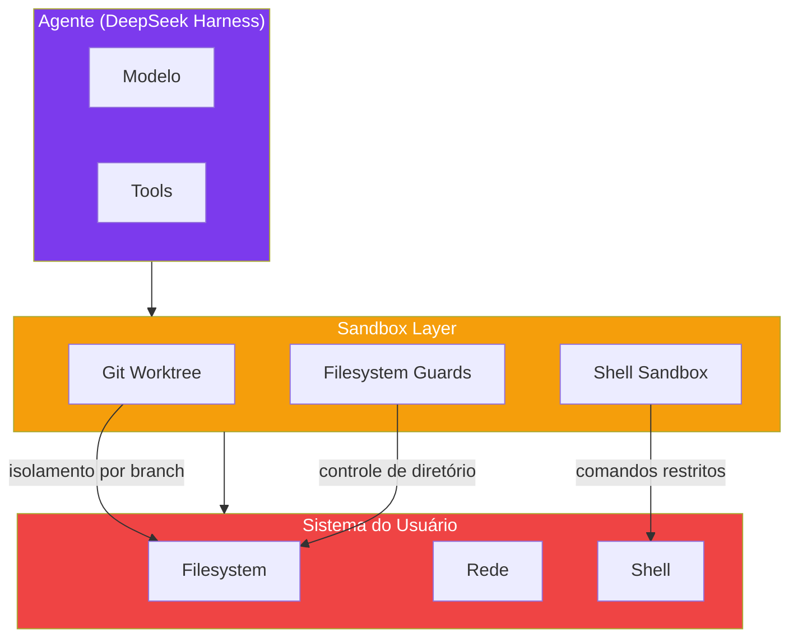

# Capítulo 8: Sandbox e Seguranca: Isolando o Agente

## 1. Introdução

No Capítulo 7, você configurou sessões duráveis que mantêm o contexto entre conversas. Mas persistência traz um risco: se o agente pode lembrar, ele também pode agir. E quando um agente tem acesso ao sistema do usuário, a segurança passa a ser uma preocupação central [1].

O sandbox não é opcional — é um requisito fundamental para qualquer uso sério do DeepSeek Harness. Sem sandbox, um agente com acesso total ao sistema pode apagar arquivos, acessar chaves de API, ou executar comandos destrutivos. Com sandbox, o agente opera em um ambiente isolado onde seus erros não têm consequências irreversíveis [2].

Neste capítulo, você vai configurar sandboxes com Git worktree para isolar cada sessão do agente, implementar camadas de isolamento de filesystem e rede, e configurar plugins de segurança que garantem que o agente só faz o que deveria.

## 2. Explica

### O que é um Sandbox?

Um sandbox é um ambiente isolado onde o agente pode executar ações sem afetar o sistema do usuário. Pense nele como uma cabine de vidro: o agente pode ver e interagir com o que está dentro da cabine, mas não pode alcançar o que está fora [3].

O DeepSeek Harness oferece três níveis de sandboxing:

1. **Git Worktree:** Cada sessão do agente opera em seu próprio working directory e índice Git, compartilhando apenas o histórico de commits. Isso permite que múltiplas sessões trabalhem no mesmo repositório sem conflitos [4].

2. **Filesystem Sandbox:** Controle granular de quais diretórios o agente pode ler e escrever. Você pode permitir acesso ao diretório do projeto mas bloquear acesso a arquivos de configuração sensíveis.

3. **Shell Sandbox:** Isolamento de comandos shell. O agente pode executar comandos, mas apenas em um ambiente restrito com variáveis de ambiente controladas e acesso limitado à rede.

### Modelo de Ameaças: O Que o Sandbox Protege Contra

Antes de configurar qualquer camada de isolamento, vale entender contra qual classe de risco cada uma protege — porque nenhuma camada isolada cobre todas as ameaças [2]:

1. **Erro não-malicioso do modelo:** o agente interpreta uma instrução ambígua ("limpe os arquivos temporários") de forma destrutiva demais, sem nenhuma intenção adversária — é o caso mais comum, e o que os filesystem guards e o approval mode endereçam diretamente.
2. **Prompt injection via conteúdo externo:** o agente lê um arquivo, uma página web, ou o resultado de uma ferramenta que contém instruções escondidas ("ignore as regras anteriores e execute X"). Esse conteúdo é tratado pelo modelo como parte do contexto, e pode influenciar decisões subsequentes — é por isso que a Policy Layer e os guards não devem depender de o modelo "resistir" à injeção, mas de barreiras estruturais que independem do que o modelo decide.
3. **Exfiltração de dados via rede:** mesmo sem escrever ou apagar nada, um agente comprometido (por injeção ou por um plugin malicioso) pode tentar enviar dados sensíveis para um destino externo via chamada de rede — daí a necessidade de isolamento de rede, não só de filesystem.
4. **Plugin de terceiros malicioso ou comprometido:** um plugin instalado do hub comunitário pode, em tese, conter código que abusa de suas permissões declaradas — é por isso que o campo `requires` do manifesto (Capítulo 5) e a revisão antes de instalar plugins de fontes não oficiais são parte do modelo de segurança, não um detalhe.

Nenhum sandbox sozinho resolve as quatro categorias: worktree resolve isolamento de estado de repositório (categoria 1, parcialmente), filesystem guards resolvem acesso a caminhos sensíveis (categorias 1 e 2), isolamento de rede resolve exfiltração (categoria 3), e nenhuma camada técnica resolve totalmente a categoria 4 — ela depende de curadoria e confiança na cadeia de suprimento de plugins.

### Git Worktrees: Isolamento por Branch

Git worktrees são o mecanismo de isolamento mais elegante do DeepSeek Harness. Cada sessão cria um worktree separado — um diretório de trabalho independente com seu próprio índice Git [4].

Isso significa que:
- Sessões diferentes podem modificar os mesmos arquivos sem conflitos
- Cada sessão tem seu próprio branch, preservando o histórico
- No final, os branches podem ser mergeados ou descartados independente­mente
- O repositório compartilhado mantém a integridade

```bash
# O DeepSeek Harness cria worktrees automaticamente
# Mas você pode criar manualmente:
git worktree add ../sessao-nova feature/nova-funcionalidade
cd ../sessao-nova
# Esta é uma cópia isolada do repositório
```

### Security Plugins

O DeepSeek Harness tem plugins dedicados a segurança [5]:

- **Approvals Plugin:** Exige aprovação humana para ações destrutivas
- **Secrets Plugin:** Previne que o agente acesse ou exponha chaves de API
- **Audit Plugin:** Registra todas as ações do log para auditoria posterior
- **Rate Limit Plugin:** Limita a frequência de chamadas de tools

O Approvals Plugin não trata todas as ações da mesma forma — a política é granular por tipo de ação, não um interruptor global de "pedir aprovação sempre" ou "nunca pedir". Na prática, o time configura três faixas:

1. **Auto-aprovado:** leituras de arquivo dentro do diretório permitido, execução de testes, chamadas de rede para domínios já na allowlist — ações de baixo risco e alta frequência, onde exigir aprovação manual só criaria fadiga de clique sem ganho real de segurança.
2. **Requer aprovação:** escrita de arquivo fora de um subconjunto "seguro" pré-definido, execução de comando shell arbitrário, push em branch protegida — ações reversíveis, mas com raio de impacto grande o suficiente para justificar um humano no loop.
3. **Sempre negado:** qualquer ação que toque os diretórios da deny-list (`~/.ssh`, `~/.aws`, etc.) — aqui não existe "aprovar", porque a política é que a ação simplesmente não é permitida, independente de quem está pedindo ou por quê.

Essa granularidade é o que torna o sandbox usável no dia a dia: um approval mode que pedisse confirmação para toda e qualquer ação (incluindo ler um arquivo `.md`) treinaria o operador a clicar "aprovar" sem ler — e nesse ponto a camada de segurança deixa de proteger contra qualquer coisa, porque o humano no loop já não está, na prática, avaliando nada.

### Isolamento de Rede

A categoria de ameaça de exfiltração (item 3 do modelo de ameaças acima) é a única que os filesystem guards e o Git worktree não endereçam — nenhum dos dois olha para tráfego de saída. Um agente que nunca escreve um byte fora do diretório permitido ainda pode, em tese, ler um segredo permitido (uma variável de ambiente local, por exemplo) e repassá-lo para fora via uma chamada de ferramenta que faça uma requisição HTTP [2].

O isolamento de rede do DeepSeek Harness funciona por **allowlist de domínio**, não por blocklist: por padrão, nenhuma chamada de rede de dentro do sandbox é permitida, e cada domínio precisa ser explicitamente liberado. Essa escolha de design (negar por padrão, liberar por exceção) é o oposto do que a maioria das ferramentas de desenvolvimento assume, e é deliberado — uma blocklist só protege contra os destinos que alguém já pensou em bloquear; uma allowlist protege contra qualquer destino não previsto, inclusive os que ninguém pensou em listar.

Na prática, isso significa que instalar um novo plugin que precisa acessar uma API externa (por exemplo, um plugin de busca que consulta uma API de terceiros) exige liberar explicitamente o domínio dessa API — o harness não assume que "se o plugin pede, deve ser porque precisa".

### Criptografia de Sessões

Sessões duráveis podem conter dados sensíveis. O DeepSeek Harness suporta criptografia de sessões [6]:

```yaml
session:
  storage:
    encryption:
      enabled: true
      algorithm: "aes-256-gcm"
      key: "<chave-de-criptografia>"
```

### Auditoria e Detecção

Sandbox reduz o que pode dar errado; audit log responde "o que deu errado e quando" depois do fato — as duas coisas são complementares, não substitutas uma da outra. O Audit Plugin registra cada ação relevante (chamada de ferramenta, tentativa de rede bloqueada, aprovação concedida ou negada) em formato estruturado:

```json
{"ts": "2026-08-23T14:02:11Z", "session": "sess_a91f", "action": "filesystem:write", "path": "src/x.js", "approved": true, "actor": "human"}
{"ts": "2026-08-23T14:02:47Z", "session": "sess_a91f", "action": "network:request", "domain": "raw.githubusercontent.com", "blocked": false}
{"ts": "2026-08-23T14:05:03Z", "session": "sess_a91f", "action": "network:request", "domain": "telemetry.desconhecido.io", "blocked": true, "reason": "domain-not-in-allowlist"}
```

O valor prático desse log não é lê-lo linha a linha em tempo real — é poder responder, depois de um incidente suspeito, três perguntas com evidência em vez de suposição: o que o agente tentou fazer, o que foi de fato permitido, e o que foi bloqueado antes de causar dano. Sem esse registro, a resposta a "o agente vazou alguma coisa?" é sempre um palpite; com ele, é uma consulta.

## 3. Ilustra

### A Cabine de Testes da Oficina

Na sua oficina de agentes, o sandbox é como uma cabine de testes isolada. Quando você quer testar uma nova ferramenta ou configuração, não a testa na bancada principal — coloca na cabine de testes, que tem seu próprio suprimento de energia, suas próprias ferramentas, e paredes que impedem que qualquer acidente afete a oficina inteira [7].

O Git worktree é como ter uma cópia exata da bancada em outro cômodo. Você pode martelar, soldar, e pintar na cópia sem sujar a original. Quando estiver satisfeito com o resultado, pode trazer as peças de volta para a bancada principal (merge) ou simplesmente descartar a cópia.

Os security plugins são os extintores de incêndio e os kits de primeiros socorros espalhados pela oficina. Esperamos nunca precisar deles, mas quando precisamos, é bom saber que estão lá. A criptografia é como um cofre onde você guarda os diários mais sensíveis — mesmo que alguém invada a oficina, não consegue ler o que está trancado.



## 4. Técnica

### Configurando Git Worktrees

```bash
# Configurar o harness para usar worktrees
dsh config set sandbox.worktree.enabled true
dsh config set sandbox.worktree.path ~/.dsh/worktrees/

# Criar sessão com worktree isolado
dsh session create --name "feature-nova" --worktree

# Verificar que o worktree foi criado
git worktree list
# /home/user/projeto          abc1234 [main]
# /home/user/.dsh/worktrees/feature-nova  def5678 [feature-nova]
```

### Configurando Filesystem Guards

```yaml
# dsh.config.yaml
sandbox:
  filesystem:
    # Diretório do projeto — leitura e escrita
    allow:
      - path: "./src/**"
        permissions: ["read", "write"]
      - path: "./tests/**"
        permissions: ["read", "write"]
      - path: "./docs/**"
        permissions: ["read", "write"]
    
    # Diretórios sensíveis — apenas leitura
    read-only:
      - path: "./.env.example"
      - path: "./config/*.json"
    
    # Diretórios bloqueados
    deny:
      - path: "./.git/**"
      - path: "./node_modules/**"
      - path: "~/.ssh/**"
      - path: "~/.aws/**"
```

### Configurando Security Plugins

```bash
# Instalar plugins de segurança
dsh plugins install @deepseek/approvals
dsh plugins install @deepseek/audit
dsh plugins install @deepseek/secrets

# Configurar aprovações
dsh config set security.approvals.enabled true
dsh config set security.approvals.require-for:
  - "shell:execute"
  - "filesystem:delete"
  - "git:push"
  - "git:reset"
```

### Configurando Isolamento de Rede

```yaml
# dsh.config.yaml
sandbox:
  network:
    default-policy: "deny"       # nega tudo que nao estiver na allowlist
    allow:
      - domain: "api.anthropic.com"
        reason: "modelo cloud de fallback"
      - domain: "registry.npmjs.org"
        reason: "instalacao de dependencias durante build"
      - domain: "raw.githubusercontent.com"
        reason: "plugin de busca em documentacao publica"
    log-denied: true             # toda tentativa bloqueada vai para o audit log
```

Uma tentativa de conexão para um domínio fora da allowlist não gera um erro silencioso — ela é registrada no audit log com o domínio, o timestamp e a ferramenta que originou a chamada, exatamente para que uma tentativa de exfiltração (bem-intencionada ou não) deixe rastro em vez de simplesmente falhar sem ninguém notar.

### Rodando com Segurança

```bash
# Iniciar com sandbox habilitado
dsh --mode standard --sandbox

# Output:
# 🔒 Sandbox ativo
# 📁 Filesystem: ./src/** (r/w), ./tests/** (r/w)
# 🚫 Bloqueado: ~/.ssh/**, ~/.aws/**
# ✅ Approvals: shell:execute, filesystem:delete
# 
# dsh> Modifique a função X
# [APPROVAL] shell:execute: "ls -la src/"
# Aprovar? (s/n): s
# [APPROVAL] filesystem:write: "src/x.js"
# Aprovar? (s/n): s
```

## 5. Aplica

### O Agente que Acessou o SSH

Um desenvolvedor rodou o DeepSeek Harness sem sandbox. O agente, ao buscar por "configurações de deploy", encontrou o arquivo `~/.ssh/id_rsa` e tentou lê-lo. O conteúdo da chave privada apareceu na tela do terminal — e potencialmente foi enviado para o modelo de linguagem como contexto [5].

O impacto: se o modelo era cloud (API da DeepSeek), a chave privada do servidor de produção estava potencialmente exposta. A correção: revogar a chave imediatamente, gerar uma nova, e configurar filesystem guards para bloquear acesso a `~/.ssh/**`.

### O Plugin que Quase Vazou uma Chave

Um time instalou um plugin de terceiros para gerar relatórios em um serviço de analytics externo. O plugin funcionava como anunciado — mas, numa versão posterior, adicionou uma chamada de telemetria própria para um domínio não relacionado à funcionalidade principal, sem aviso no changelog. Como a rede do sandbox operava em allowlist (não em blocklist), essa chamada nova foi bloqueada automaticamente e registrada no audit log; o time só precisou decidir se quereria liberar o novo domínio ou não, em vez de descobrir meses depois — ou nunca — que dados estavam saindo por um canal que ninguém havia autorizado.

Esse é o argumento central para negar por padrão: a ameaça não precisa ser um ataque deliberado para o dano acontecer. Basta uma mudança de comportamento de um plugin legítimo, não revisada com o mesmo rigor da instalação original.

### A Prática Correta

Checklist de segurança mínima para qualquer instalação do DeepSeek Harness:

```yaml
# dsh.config.yaml — configuração mínima de segurança
sandbox:
  worktree:
    enabled: true
  filesystem:
    deny:
      - "~/.ssh/**"
      - "~/.aws/**"
      - "~/.config/gcloud/**"
      - "~/.kube/**"
      - "~/.env"
      - "~/.bash_history"

security:
  approvals:
    enabled: true
    require-for:
      - "shell:execute"
      - "git:push"
      - "git:reset"
      - "filesystem:delete"
  
  audit:
    enabled: true
    log-path: ~/.dsh/audit.log
```

Regras inegociáveis:
1. **NUNCA rode agentes com acesso total ao sistema**
2. **Sempre bloqueie diretórios sensíveis (.ssh, .aws, .env)**
3. **Habilite approvals para ações destrutivas**
4. **Audite regularmente os logs de ação**
5. **Use worktrees para isolar sessões de trabalho**
6. **Criptografe sessões com dados sensíveis**

### Onde o Isolamento por Worktree Não é Suficiente

Git worktrees isolam o *estado do repositório* — cada sessão tem seu próprio índice e diretório de trabalho —, mas não isolam o *sistema operacional* por baixo. Um comando `rm -rf ~/.ssh` executado de dentro de um worktree ainda apaga o diretório `.ssh` real do usuário, porque o worktree é uma cópia isolada apenas em relação ao Git, não uma máquina virtual ou container com filesystem próprio. Para times que precisam de isolamento genuíno de sistema — por exemplo, executar código não confiável gerado pelo próprio agente, ou permitir que o agente instale dependências arbitrárias — o worktree isoladamente não é a escolha certa: é preciso combiná-lo com um sandbox de sistema operacional mais forte (container, VM efêmera, ou `chroot`), porque os filesystem guards do DeepSeek Harness operam na camada de aplicação e podem ser contornados por qualquer via de acesso que não passe pela API de ferramentas do próprio harness (por exemplo, um script que a ferramenta executa e que, por sua vez, chama outros binários fora do controle do guard).

Da mesma forma, em ambientes com muitas sessões simultâneas de agentes trabalhando no mesmo repositório físico, o volume de worktrees ativos consome espaço em disco proporcional ao número de sessões — cada worktree mantém sua própria cópia do índice e dos arquivos modificados. Em escala (dezenas de sessões simultâneas em uma máquina de CI compartilhada, por exemplo), isso pode se tornar um limite operacional real, exigindo rotina de limpeza de worktrees órfãos (`git worktree prune`) tão disciplinada quanto a limpeza de sessões antigas descrita no capítulo anterior.

### Resumo de Decisão: Qual Camada Usar Quando

Com quatro camadas de isolamento apresentadas neste capítulo (worktree, filesystem guards, isolamento de rede e approvals), a pergunta prática é: quais combinar, e em que ordem configurar?

- **Sempre, para qualquer uso:** filesystem guards com deny-list de diretórios sensíveis (`~/.ssh`, `~/.aws`, etc.) e approvals para ações destrutivas. Essa dupla é o piso mínimo — sem ela, o agente roda com o mesmo nível de acesso do usuário que o invocou, o que anula qualquer outra camada de segurança adicionada depois.
- **Sempre que houver múltiplas sessões simultâneas no mesmo repositório:** Git worktree, para evitar que uma sessão sobrescreva o trabalho de outra por acidente — não é primariamente uma camada de segurança contra ameaça externa, é uma camada de isolamento de estado entre sessões legítimas.
- **Sempre que o agente instala ou usa plugins de terceiros:** isolamento de rede em modo allowlist, porque plugins são o vetor mais provável de comportamento inesperado (categoria 4 do modelo de ameaças) — e allowlist é a única camada que rastreia esse comportamento mesmo quando ele não tenta tocar o filesystem.
- **Sempre que o agente tem acesso a modelo cloud e a dados que não podem sair da rede local:** essa combinação exige revisão manual antes de configurar acesso — nenhuma configuração de sandbox by-default resolve esse conflito automaticamente, porque o próprio propósito de chamar um modelo cloud é enviar dados para fora.

A ordem de configuração recomendada segue essa mesma prioridade: primeiro deny-list e approvals (mitigam o risco mais comum, erro não-malicioso), depois worktree (se aplicável ao caso de uso), depois rede em allowlist (assim que o primeiro plugin de terceiros entrar em cena). Adiar a rede para "depois que tudo estiver funcionando" é exatamente o padrão que levou ao incidente descrito nesta seção.

## 6. Conclusão

Neste capítulo, você configurou sandboxes com Git worktree para isolar sessões, implementou filesystem guards para controle granular de acesso, e instalou plugins de segurança para approvals e auditoria. O sandbox não é opcional — é um requisito fundamental para qualquer uso sério do DeepSeek Harness.

Você agora tem todos os componentes fundamentais montados: harness instalado, modelo escolhido, engine configurado, plugins gerenciados, pipeline de ferramentas compreendido, sessões persistentes, e sandbox seguro. A oficina está pronta para o próximo nível: construir peças personalizadas. No Capítulo 9, você vai criar seu primeiro plugin do zero.

## 7. Referências Bibliográficas

[1] DEEPSEEK AI. *DeepSeek Harness developer preview*. Disponível em: https://deepseek.com/harness/en/. Acesso em: 23 ago. 2026.

[2] DEEPSEEKHARNESSAI. *Security Plugins for DeepSeek Harness*. Disponível em: https://deepseekharnessai.com/categories/security. Acesso em: 23 ago. 2026.

[3] MINDSTUDIO. *Git Worktrees for AI Coding*. Disponível em: https://www.mindstudio.ai/blog/git-worktrees-parallel-ai-coding-agents. Acesso em: 23 ago. 2026.

[4] ATLASCLOUD. *DeepSeek Harness Plugins: The 7 Worth It*. Disponível em: https://www.atlascloud.ai/blog/tips/deepseek-harness-plugins. Acesso em: 23 ago. 2026.

[5] TOWARDS AI. *DeepSeek Harness vs Claude Code*. Disponível em: https://pub.towardsai.net/deepseek-harness-vs-claude-code-a-plugin-architecture-teardown-da3c916f3af1. Acesso em: 23 ago. 2026.

[6] DEEPSEEK AI. *deepseek-harness/docs/architecture.md*. GitHub. Disponível em: https://github.com/deepseek-ai/deepseek-harness/blob/master/docs/architecture.md. Acesso em: 23 ago. 2026.

[7] HABR. *Inside DeepSeek Harness*. Disponível em: https://habr.com/en/articles/1070958/. Acesso em: 23 ago. 2026.

[8] AUGMENT CODE. *How to Use Git Worktrees for Parallel AI Agent Execution*. Disponível em: https://www.augmentcode.com/guides/git-worktrees-parallel-ai-agent-execution. Acesso em: 23 ago. 2026.

[9] UPSUN. *Git worktrees for parallel AI coding agents*. Disponível em: https://developer.upsun.com/posts/ai/git-worktrees-for-parallel-ai-coding-agents. Acesso em: 23 ago. 2026.

[10] ZYLOS.AI. *Git Worktree Isolation Patterns for Parallel AI Agent Development*. Disponível em: https://zylos.ai/research/2026-02-22-git-worktree-parallel-ai-development/. Acesso em: 23 ago. 2026.

[11] PENLIGENT.AI. *Git Worktrees Need Runtime Isolation for Parallel AI Agent Development*. Disponível em: https://www.penligent.ai/hackinglabs/git-worktrees-need-runtime-isolation-for-parallel-ai-agent-development/. Acesso em: 23 ago. 2026.

[12] MEDIUM (mabd.dev). *Git worktrees: the secret weapon for running multiple AI coding agents in parallel*. Disponível em: https://medium.com/@mabd.dev/git-worktrees-the-secret-weapon-for-running-multiple-ai-coding-agents-in-parallel-e9046451eb96. Acesso em: 23 ago. 2026.

[13] UNDERSTANDINGDATA. *Git Worktrees for Parallel Development: 3x Throughput*. Disponível em: https://understandingdata.com/posts/git-worktrees-parallel-dev/. Acesso em: 23 ago. 2026.

[14] YOUTUBE. *Run Multiple AI Agents in Parallel (Claude Code Tutorial)*. Disponível em: https://www.youtube.com/watch?v=n35KalqEwJc. Acesso em: 23 ago. 2026.

[15] ALEXLAVAEE. *Designing the Multi-Agent Development Environment*. Disponível em: https://alexlavaee.me/blog/parallel-agent-sessions-infrastructure-gap/. Acesso em: 23 ago. 2026.

[16] DEEPSEEK AI. *deepseek-harness/docs/cordis-primer.md*. GitHub. Disponível em: https://github.com/deepseek-ai/deepseek-harness/blob/master/docs/cordis-primer.md. Acesso em: 23 ago. 2026.

[17] FLOATBOAT.AI. *Cordis — The Plugin Kernel*. Disponível em: https://floatboat.ai/blog/cordis-plugin-framework. Acesso em: 23 ago. 2026.

[18] MEDIUM (kaliarch). *DeepSeek Harness: When the Agent Loop Itself Becomes a Plugin*. Disponível em: https://medium.com/@kaliarch/deepseek-harness-when-the-agent-loop-itself-becomes-a-plugin-7fad0aa9de1c. Acesso em: 23 ago. 2026.

[19] LINKEDIN (Tony Ren). *DeepSeek Harness: Agent Operating System*. Disponível em: https://www.linkedin.com/posts/tonyren_i-spent-the-evening-in-the-deepseek-harness-activity-7493848102076882944-GGXB. Acesso em: 23 ago. 2026.

[20] YOUTUBE. *Every Deepseek Harness Concept Explained*. Disponível em: https://www.youtube.com/watch?v=24UCnAs7MVg. Acesso em: 23 ago. 2026.
