# Capítulo 9: Criando seu Primeiro Plugin personalizado

## 1. Introdução

No Capítulo 8, você configurou sandboxes e segurança. A oficina está segura. Agora é hora de começar a fabricar peças próprias. Neste capítulo, você vai desenvolver um plugin do zero para o DeepSeek Harness — desde a estrutura de projeto até a publicação no hub [1].

Até agora, você usou peças que vieram de fábrica — plugins oficiais do DeepSeek. Criar seu primeiro plugin personalizado é como fabricar sua primeira peça na oficina. Você pega um bloco de metal bruto (um conceito), usa as ferramentas da oficina (Node.js, APIs do Cordis), e molda uma peça que se encaixa perfeitamente no sistema [2].

Ao final, você terá um plugin funcional instalado no harness, e o conhecimento para criar qualquer ferramenta personalizada que precisar. É o momento em que você para de ser um usuário e se torna um construtor.

O plugin é a menor unidade de extensão dentro do DeepSeek Harness — a peça atômica. Nos próximos capítulos você vai combinar peças: tools individuais (Capítulo 10) que um plugin pode expor, e pipelines (Capítulo 11) que orquestram várias tools em sequência. Mas tudo começa aqui, com o plugin isolado, porque entender como uma peça única é fabricada, testada e descartada é o que permite entender como centenas delas convivem sem se atropelar dentro do mesmo processo.

## 2. Explica

### Estrutura de um Plugin

Todo plugin do DeepSeek Harness segue uma estrutura padrão que facilita integração e manutenção [3]:

```
meu-plugin/
├── package.json          # Metadados e configuração Cordis
├── index.js              # Ponto de entrada principal
├── README.md             # Documentação
└── test/                 # Testes
    └── index.test.js
```

Essa padronização não é burocracia — é o que permite que o `dsh plugins lint` e o hub de publicação processem qualquer plugin sem precisar entender sua lógica interna. O hub só precisa ler o `package.json` para saber quais serviços o plugin oferece, quais ele consome, e se a versão declarada é compatível com a versão do harness instalada. Sem essa convenção, cada plugin exigiria um parser próprio, e a promessa de "tudo é plugin" do DeepSeek Harness [1] se tornaria inviável de sustentar em escala.

O `package.json` é o contrato do plugin. Ele declara:
- **name**: identificador único no hub
- **version**: versão semântica (semver)
- **cordis.provides**: serviços que este plugin oferece
- **cordis.requires**: serviços que ele precisa de outros plugins
- **cordis.lifecycle**: callbacks para ready/dispose

### Interfaces e Providers

Um plugin pode oferecer três tipos de serviços [4]:

1. **Tools:** Ferramentas que o agente pode chamar. Cada tool tem um schema JSON que define parâmetros e retorno. É o tipo mais comum — cada tool é uma ação que o agente pode executar no mundo real. Um plugin de repositórios Git, por exemplo, pode expor a tool `buscar-commits`, que o modelo invoca quando decide que precisa daquela informação para responder ao usuário; o Capítulo 10 detalha como esse schema é desenhado.

2. **Services:** Serviços internos que outros plugins podem consumir. Não aparecem diretamente para o agente, mas são usados por plugins vizinhos. Exemplos: cache, logging, métricas. Um plugin de cache, por exemplo, não expõe nenhuma tool ao modelo — sua única função é oferecer o serviço `cache.get`/`cache.set` para que outros plugins evitem repetir chamadas de rede caras.

3. **Providers:** provedores de implementação. Quando um plugin declara `provides: ["shell"]`, ele está dizendo que implementa o serviço `shell` — outros plugins que dependem de `shell` vão consumir essa implementação.

```javascript
// exemplo mínimo de um provider: implementa o serviço "shell"
export default function shellProvider(ctx) {
  ctx.provide('shell', {
    execute(command) {
      const { execSync } = require('child_process');
      return execSync(command, { encoding: 'utf-8', timeout: 10000 });
    }
  });
}
```

Um plugin que depende de `shell` (via `cordis.requires: ["shell"]`) não sabe nem precisa saber qual provider está por trás — pode ser este provider síncrono local, ou um provider que executa o comando dentro de um container remoto. Essa é a inversão de dependência que torna o Cordis extensível: trocar a implementação de `shell` não exige tocar em nenhum plugin consumidor, só reinstalar o provider.

### Efeitos Reversíveis e Contexto Compartilhado

O Cordis modela cada contribuição de um plugin — um serviço registrado, um listener de evento, uma modificação de configuração — como um **efeito reversível**. Isso significa que, ao lado da função que aplica o efeito, o plugin (ou o próprio framework) sabe exatamente como desfazê-lo [2]. Essa simetria é o que torna o `dispose` do ciclo de vida seguro: quando um plugin é removido ou uma sessão é finalizada, o Cordis percorre a pilha de efeitos na ordem inversa de registro e os desfaz um a um, sem deixar listeners órfãos, conexões abertas ou entradas de configuração pendentes.

Na prática, isso resolve um problema clássico de sistemas de plugins mais simples: o vazamento de estado entre sessões. Se um plugin registra um `setInterval` para verificar métricas periodicamente e nunca o cancela, cada `fork` de sessão duplica o timer — depois de algumas dezenas de forks, o processo está rodando centenas de timers órfãos disputando CPU. Com efeitos reversíveis, o `fork` clona o contexto (e os efeitos ainda ativos), mas o `dispose` de cada ramificação desfaz apenas os efeitos daquela ramificação, preservando a árvore de sessões íntegra.

### Integração com Session Events

Além de registrar serviços e efeitos, um plugin pode assinar **Session Events** — o stream de eventos duráveis que o DeepSeek Harness usa internamente para representar limites de turno, passos de execução, mensagens, conteúdo gerado pelo assistente e chamadas de ferramentas [1]. Esse stream é o que permite recursos como resume (retomar uma sessão interrompida), fork (bifurcar o histórico em dois ramos independentes), search (buscar por eventos passados) e replay (reexecutar a sessão a partir de um ponto).

Um plugin de auditoria, por exemplo, pode assinar apenas o evento `tool:call` do stream de Session Events em vez de interceptar a Tool Pipeline inteira — a diferença é que o consumo de Session Events é passivo (leitura de um log durável) enquanto interceptar a Tool Pipeline é ativo (participa da execução, podendo adicionar latência a cada chamada). Essa escolha de design é o que separa um plugin de observabilidade bem-comportado de um que compete por tempo de CPU com a própria ferramenta que está observando — o erro exatamente descrito na seção Aplica deste capítulo.

### Configuração do Plugin

Além de tools e services, um plugin pode expor opções de configuração que o operador ajusta no momento da instalação — por exemplo, limitar a profundidade de busca de repositórios ou definir um timeout customizado. O Cordis valida essas opções contra um schema declarado no próprio plugin, rejeitando a instalação antes que o `ready` dispare se a configuração for inválida:

```javascript
export default function repoStatsPlugin(ctx, config = {}) {
  const maxDepth = config.maxDepth ?? 3;
  const timeoutMs = config.timeoutMs ?? 5000;
  // ... resto do plugin usa maxDepth e timeoutMs em vez de valores fixos
}

repoStatsPlugin.schema = {
  type: 'object',
  properties: {
    maxDepth: { type: 'number', minimum: 1, maximum: 10, default: 3 },
    timeoutMs: { type: 'number', minimum: 1000, default: 5000 }
  }
};
```

Validar a configuração no momento da instalação — e não silenciosamente em tempo de execução — é o que evita que um typo em `maxDeth` (faltando um "p") vire um bug obscuro descoberto só em produção, semanas depois.

### Testes e Publicação

A publicação de um plugin no hub é irreversível na prática: uma vez que outros desenvolvedores instalam uma versão, removê-la quebra quem depende dela. Por isso o `dsh plugins lint` roda antes do `npm publish` — ele valida o schema do `package.json`, verifica se o grafo de `provides`/`requires` é resolvível, e confirma que existe ao menos um teste cobrindo o caminho principal de cada tool exposta [3]. Antes de publicar, todo plugin deve passar por testes [1]:

```bash
# Rodar testes do plugin
npm test

# Verificar compatibilidade com o harness
dsh plugins lint meu-plugin

# Testar localmente antes de publicar
dsh plugins install ./meu-plugin --dev
```

A publicação no hub segue o padrão npm:

```bash
# Publicar no hub
npm publish --access public

# Ou, para plugins privados
npm publish --access restricted
```

O versionamento semântico (semver) de um plugin não é apenas convenção — é o contrato que outros plugins usam para declarar dependências via `cordis.requires`. Um `MAJOR` incrementado (ex.: 1.x → 2.0.0) sinaliza que a interface de serviço mudou de forma incompatível; plugins que dependem da versão antiga não devem atualizar automaticamente. Um `MINOR` (1.1.0 → 1.2.0) adiciona funcionalidade de forma compatível; um `PATCH` (1.1.0 → 1.1.1) corrige bugs sem mudar a interface. Publicar uma mudança de interface como `PATCH` — erro comum de quem está sob pressão para lançar — quebra silenciosamente todo plugin que depende do seu no hub, sem aviso prévio a ninguém.

### Ciclo de Vida dos Plugins

Todo plugin passa por três estágios [3]:

1. **Ready:** O plugin é carregado e registrado. Ele declara seus serviços e efeitos.
2. **Fork:** Quando uma sessão é clonada, o plugin é bifurcado.
3. **Dispose:** Quando o plugin é removido, ele executa cleanup.

O estágio de Fork é o que mais gera bugs sutis, porque ele testa uma suposição que o desenvolvedor do plugin nem sempre percebe que fez: se o estado interno do plugin (um contador em memória, uma conexão de rede aberta, um arquivo de lock) não for tratado explicitamente no fork, a sessão bifurcada herda uma REFERÊNCIA ao mesmo estado da sessão original, não uma cópia independente. Um plugin de contador de repositórios (como o exemplo desta seção) que guarda o total em uma variável de módulo, em vez de em contexto de sessão, faz com que duas sessões forkadas incrementem o MESMO contador — cada uma pensando que está contando algo próprio. O sintoma costuma aparecer como "número errado" muito depois de o fork ter acontecido, e a causa (estado compartilhado indevidamente) raramente é a primeira hipótese de quem debuga.

A prática correta é o plugin declarar explicitamente, no hook de fork, o que precisa ser clonado (copiar o valor) versus o que pode ser legitimamente compartilhado (uma conexão de banco de dados somente leitura, por exemplo, não precisa ser duplicada por sessão). Cordis expõe esse hook justamente para que essa decisão seja explícita do autor do plugin, e não um acidente de como a linguagem trata closures e referências por padrão.

## 3. Ilustra

### A Primeira Peça Fabricada

Até agora, você usou peças que vieram de fábrica — plugins oficiais do DeepSeek. Criar seu primeiro plugin personalizado é como fabricar sua primeira peça na oficina [5].

A primeira peça sempre sai imperfeita — talvez o encaixe não seja limpo, talvez o acabamento seja grosseiro. Mas funciona. E uma vez que você sabe moldar uma peça, pode moldar qualquer outra. É a habilidade fundamental que transforma um operário em um mestre de oficina.

O teste é como inspecionar a peça na bancada de medições. Se ela se encaixa, se funciona, se não vaza — está pronta para uso. Se não, você ajusta e tenta novamente. É um ciclo de fabricação → teste → ajuste que se repete até a peça ficar perfeita.

O ciclo `ready → fork → dispose` tem um paralelo direto com o efeito reversível que sustenta o Cordis por baixo dos panos: quando a oficina bifurca uma tarefa em duas linhas de produção paralelas (fork), cada linha herda as ferramentas já montadas na bancada original, mas qualquer ferramenta nova que uma linha instala pertence só àquela linha. Quando a linha termina (dispose), suas ferramentas específicas são recolhidas — a bancada original nunca fica contaminada pelo que aconteceu numa ramificação que já terminou.

```mermaid
%% legenda: Ciclo de vida do desenvolvimento de um plugin DeepSeek Harness
flowchart LR
    A[Conceito do Plugin] --> B[Estrutura do Projeto]
    B --> C[Implementação]
    C --> D[Testes Locais]
    D -->|Falha| C
    D -->|Sucesso| E[Publicação no Hub]
    E --> F[Instalação no Harness]
    F --> G[Uso em Produção]
    
    style A fill:#7C3AED,color:#fff
    style G fill:#10B981,color:#fff
```



## 4. Técnica

### Criando o Plugin: Contador de Repositórios

Vamos criar um plugin que conta repositórios Git em um diretório e retorna estatísticas:

```bash
# Criar estrutura
mkdir repo-stats-plugin
cd repo-stats-plugin
npm init -y
```

```json
// package.json
{
  "name": "@meu-usuario/repo-stats",
  "version": "0.1.0",
  "description": "Plugin que conta repositórios Git e retorna estatísticas",
  "main": "index.js",
  "keywords": ["deepseek-harness", "plugin", "git"],
  "cordis": {
    "provides": ["tool"],
    "requires": ["filesystem", "shell"],
    "lifecycle": {
      "ready": "onReady",
      "dispose": "onDispose"
    }
  },
  "devDependencies": {
    "vitest": "^1.0.0"
  }
}
```

```javascript
// index.js
import { execSync } from 'child_process';

export default function repoStatsPlugin(ctx) {
  const fs = ctx.service('filesystem');
  const shell = ctx.service('shell');

  ctx.service('repo-stats', {
    async execute({ directory }) {
      // Verificar se o diretório existe
      const exists = await fs.exists(directory);
      if (!exists) {
        return { error: `Diretório não encontrado: ${directory}` }
      }

      // Contar repositórios Git
      const result = shell.execute(`find ${directory} -name ".git" -type d`);
      const repos = result.split('\n').filter(line => line.trim());

      // Coletar stats de cada repositório
      const stats = repos.map(repo => {
        const repoPath = repo.replace('/.git', '');
        const name = repoPath.split('/').pop();
        
        try {
          const commits = shell.execute(`git -C ${repoPath} rev-list --count HEAD`);
          const branches = shell.execute(`git -C ${repoPath} branch -r | wc -l`);
          const lastCommit = shell.execute(`git -C ${repoPath} log -1 --format="%ai"`);
          
          return {
            name,
            path: repoPath,
            commits: parseInt(commits.trim()),
            branches: parseInt(branches.trim()),
            lastCommit: lastCommit.trim()
          };
        } catch (e) {
          return { name, path: repoPath, error: e.message };
        }
      });

      return {
        totalRepos: repos.length,
        repos: stats,
        scanDirectory: directory
      };
    }
  });

  ctx.effect(() => {
    console.log('[repo-stats] Plugin instalado');
    return () => {
      console.log('[repo-stats] Plugin removido');
    };
  });
}
```

### Testando o Plugin

```bash
# Instalar localmente
dsh plugins install ./repo-stats-plugin

# Testar no harness
dsh> Use a ferramenta repo-stats no diretório /home/user/projetos
# Resultado:
# {
#   "totalRepos": 5,
#   "repos": [
#     { "name": "projeto-a", "commits": 234, "branches": 3 },
#     { "name": "projeto-b", "commits": 89, "branches": 1 }
#   ],
#   "scanDirectory": "/home/user/projetos"
# }
```

### Escrevendo Testes

```javascript
// test/index.test.js
import { describe, it, expect } from 'vitest';
import repoStatsPlugin from '../index.js';

describe('repo-stats plugin', () => {
  it('deve retornar stats de repositórios', async () => {
    const mockCtx = {
      service: (name, impl) => {
        if (name === 'repo-stats') return impl;
      },
      effect: () => {}
    };
    
    // Mock dos serviços
    mockCtx.service('filesystem', { exists: () => Promise.resolve(true) });
    mockCtx.service('shell', { execute: (cmd) => '/path/to/repo/.git' });
    
    const plugin = repoStatsPlugin(mockCtx);
    const result = await plugin.execute({ directory: '/path/to' });
    
    expect(result.totalRepos).toBe(1);
  });

  it('deve retornar erro gracioso quando o diretório não existe', async () => {
    const mockCtx = {
      service: (name, impl) => {
        if (name === 'repo-stats') return impl;
      },
      effect: () => {}
    };

    mockCtx.service('filesystem', { exists: () => Promise.resolve(false) });
    mockCtx.service('shell', { execute: () => '' });

    const plugin = repoStatsPlugin(mockCtx);
    const result = await plugin.execute({ directory: '/caminho/inexistente' });

    expect(result.error).toContain('não encontrado');
  });
});
```

Esse segundo teste exercita o caminho de erro que a maioria dos plugins publicados no hub esquece de cobrir — o `dsh plugins lint` verifica a presença de testes, mas não garante que os cenários de falha (diretório ausente, serviço dependente indisponível, permissão negada) estejam exercitados. Um plugin sem teste de falha frequentemente lança exceção não tratada na primeira vez que o cenário adverso ocorre em produção, e é exatamente esse tipo de falha que interrompe o agente inteiro em vez de retornar um erro estruturado que o modelo pode processar.

## 5. Aplica

### O Plugin que Travou o Harness

Um desenvolvedor criou um plugin que executava consultas SQL pesadas diretamente no handler de `tool:pre-execute`. Cada chamada de qualquer tool disparava a consulta, adicionando 500ms de latência a cada ação do agente [4].

O problema: o plugin não respeitou o princípio de responsabilidade mínima. Ele tentou fazer auditoria (sua função) mas interceptou todas as chamadas (não sua função).

### A Prática Correta

Regras para plugins de qualidade:

1. **Responsabilidade única:** cada plugin faz UMA coisa bem feita.
2. **Performance:** plugins não devem adicionar latência perceptível.
3. **Graceful degradation:** se um serviço dependência não estiver disponível, o plugin deve funcionar parcialmente, não quebrar.
4. **Testes:** todo plugin deve ter testes unitários antes de ser publicado.
5. **Documentação:** README claro com exemplos de uso.
6. **Versione:** semver para commits, releases para publishes.

### Limite do Padrão: Quando um Plugin Deixa de Ser a Unidade Certa

Esse modelo de responsabilidade única funciona bem enquanto a oficina tem algumas dezenas de plugins instalados. Em escala maior — instalações corporativas com uma centena de plugins ou mais — o grafo de dependências declarado em `cordis.requires`/`cordis.provides` cresce de forma combinatória, e a ordem de carregamento vira, ela mesma, fonte de bugs difíceis de reproduzir: um plugin que assume que `shell` já está pronto quando seu `ready` dispara, mas nem sempre está, dependendo da ordem de instalação naquela máquina específica. Nesse volume, a prática recomendada muda de direção: consolidar responsabilidades correlatas em menos plugins mais amplos (um único plugin "observabilidade" em vez de cinco plugins que cada um adiciona um listener separado) reduz a superfície do grafo de dependências, ao custo de menos granularidade de instalação para o operador final. Não existe fábrica pequena demais para começar com plugins granulares, mas toda fábrica que cresce o suficiente eventualmente precisa decidir onde parar de fragmentar — o limite não é técnico, é de complexidade de depuração.

## 6. Conclusão

Neste capítulo, você criou seu primeiro plugin personalizado — desde a estrutura do projeto até a publicação. Entendeu as interfaces (tools, services, providers), o modelo de efeitos reversíveis que sustenta o `ready`/`fork`/`dispose`, como assinar Session Events sem competir por tempo de CPU com a Tool Pipeline, e aprendeu a testar cenários de sucesso e de falha antes de publicar. A oficina agora tem sua primeira peça fabricada in-house — imperfeita, mas testada e reversível.

Uma peça isolada, porém, resolve pouco por si só. O valor real aparece quando várias peças se combinam: um plugin que expõe uma tool bem desenhada, consumida por um pipeline que encadeia várias tools, que por sua vez alimenta um agente com memória de longo prazo via RAG. É essa progressão — plugin, tool, pipeline, memória — que os próximos três capítulos constroem, cada um assumindo o anterior como pré-requisito.

No próximo capítulo, você vai construir ferramentas customizadas que o agente pode chamar — com schemas JSON, execução segura, e composição com o pipeline existente.

## 7. Referências Bibliográficas

[1] DEEPSEEK AI. *DeepSeek Harness developer preview*. Disponível em: https://deepseek.com/harness/en/. Acesso em: 23 ago. 2026.

[2] DEEPSEEK AI. *deepseek-harness/docs/cordis-primer.md*. GitHub. Disponível em: https://github.com/deepseek-ai/deepseek-harness/blob/master/docs/cordis-primer.md. Acesso em: 23 ago. 2026.

[3] COMPOSIO. *Best plugins for DeepSeek Harness*. Disponível em: https://composio.dev/content/best-deepseek-harness-plugins. Acesso em: 23 ago. 2026.

[4] DATACAMP. *DeepSeek Harness Tutorial*. Disponível em: https://www.datacamp.com/tutorial/deepseek-harness. Acesso em: 23 ago. 2026.

[5] TOWARDS AI. *DeepSeek Harness Explained*. Disponível em: https://pub.towardsai.net/deepseek-harness-explained-when-the-ai-model-is-just-a-plugin-16b2496f3d01. Acesso em: 23 ago. 2026.

[6] ATLASCLOUD. *DeepSeek Harness Plugins: The 7 Worth It*. Disponível em: https://www.atlascloud.ai/blog/tips/deepseek-harness-plugins. Acesso em: 23 ago. 2026.

[7] MINDSTUDIO. *What Is DeepSeek Harness?*. Disponível em: https://www.mindstudio.ai/blog/deepseek-harness-agentic-coding. Acesso em: 23 ago. 2026.

[8] HABR. *Inside DeepSeek Harness*. Disponível em: https://habr.com/en/articles/1070958/. Acesso em: 23 ago. 2026.

[9] FLOATBOAT.AI. *Cordis — The Plugin Kernel*. Disponível em: https://floatboat.ai/blog/cordis-plugin-framework. Acesso em: 23 ago. 2026.

[10] AGENTATLAS. *Cordis Explained*. Disponível em: https://agentatlas.org/blog/cordis-explained-how-deepseek-harness-plugin-framework-works/. Acesso em: 23 ago. 2026.

[11] 0XSLINE. *awesome-deepseek-harness*. GitHub. Disponível em: https://github.com/0xsline/awesome-deepseek-harness. Acesso em: 23 ago. 2026.

[12] TOWARDS AI. *DeepSeek Harness vs Claude Code*. Disponível em: https://pub.towardsai.net/deepseek-harness-vs-claude-code-a-plugin-architecture-teardown-da3c916f3af1. Acesso em: 23 ago. 2026.

[13] MEDIUM (data-and-beyond). *Decoding DeepSeek Harness*. Disponível em: https://medium.com/data-and-beyond/decoding-deepseek-harness-the-open-source-runtime-behind-composable-ai-agents-c2299e992870. Acesso em: 23 ago. 2026.

[14] LINKEDIN (Tony Ren). *DeepSeek Harness: Agent Operating System*. Disponível em: https://www.linkedin.com/posts/tonyren_i-spent-the-evening-in-the-deepseek-harness-activity-7493848102076882944-GGXB. Acesso em: 23 ago. 2026.

[15] YOUTUBE. *Every Deepseek Harness Concept Explained*. Disponível em: https://www.youtube.com/watch?v=24UCnAs7MVg. Acesso em: 23 ago. 2026.

[16] YOUTUBE. *NEW Deepseek Agent Harness EXPLAINED*. Disponível em: https://www.youtube.com/watch?v=Hpw4fAHlHDw. Acesso em: 23 ago. 2026.

[17] SPRINGBRAND. *DeepSeek Harness (dsh): Everything Is a Plugin*. Disponível em: https://springbrand.ai/deepseek-harness. Acesso em: 23 ago. 2026.

[18] EXPLOREX.AI. *DeepSeek Harness v0.1*. Disponível em: https://explainx.ai/blog/deepseek-harness-v0-1-plugin-first-agent-stack-august-2026. Acesso em: 23 ago. 2026.

[19] MEDIUM (kaliarch). *DeepSeek Harness: When the Agent Loop Itself Becomes a Plugin*. Disponível em: https://medium.com/@kaliarch/deepseek-harness-when-the-agent-loop-itself-becomes-a-plugin-7fad0aa9de1c. Acesso em: 23 ago. 2026.

[20] DEEPSEEKHARNESSAI. *Security Plugins for DeepSeek Harness*. Disponível em: https://deepseekharnessai.com/categories/security. Acesso em: 23 ago. 2026.
