# Capítulo 1: O Que é o DeepSeek Harness: O Agente que é Plugin

## 1. Introdução

Você está prestes a descobrir uma peça que mudou o jogo da programação agêntica em agosto de 2026. O DeepSeek Harness (dsh) não é mais um assistente de código — é um framework onde cada componente, desde o modelo de linguagem até a interface que você vê na tela, é um plugin intercambiável [1]. Isso significa que você pode trocar o motor que pensa, as ferramentas que executam, e até a forma como o agente se comunica com você, tudo sem reescrever uma linha de código base.

O lançamento em 13 de agosto de 2026 marcou um ponto de inflexão na indústria de agentes de IA. Enquanto frameworks anteriores tratavam o modelo como o centro de tudo — acoplando ferramentas, sessões e interfaces diretamente a uma API específica — o DeepSeek Harness inverteu essa lógica completamente [2]. Cada componente é um plugin Cordis que pode ser instalado, removido, ou substituído em tempo de execução, sem reiniciar o agente.

Neste capítulo, você vai entender a arquitetura que torna isso possível, conhecer o Cordis — o kernel de plugins que sustenta o harness — e descobrir os quatro modos de execução que definem como seu agente vai trabalhar. Ao final, você será capaz de explicar para qualquer pessoa o que é o DeepSeek Harness e por que ele representa um salto qualitativo nos agentes de IA.

## 2. Explica

### O Paradigma Plugin-First

Na maioria dos frameworks de agentes, o modelo de linguagem é o centro de tudo. Você instala o framework, conecta um modelo, e pronto. O DeepSeek Harness inverte essa lógica: **tudo é plugin** [1]. O modelo é um plugin. As ferramentas são plugins. A sessão é um plugin. Até a interface que exibe o progresso é um plugin.

Isso não é uma extravagância arquitetural — é uma decisão de engenharia com consequências práticas enormes. Quando tudo é plugin, você pode:

- Trocar o modelo de DeepSeek V4 para Claude, GPT-4, ou qualquer outro provedor sem alterar uma linha de código do agente
- Adicionar ferramentas novas (busca web, acesso a banco de dados, chamadas de API) instalando um plugin
- Customizar o comportamento do agente inteiro through profiles — receitas de configuração que empilham camadas
- Executar o mesmo agente com modelos diferentes para comparar performance
- Criar sandboxes isolados para testes sem afetar o ambiente de produção

A arquitetura plugin-first resolve o problema mais comum dos frameworks de agentes modernos: o lock-in. Quando o modelo é o centro, trocar de modelo significa reescrever o agente. Quando tudo é plugin, trocar de modelo é trocar uma peça na bancada [3].

### O Cordis: O Kernel de Plugins

O Cordis é o framework meta que está por baixo do DeepSeek Harness [3]. Pense nele como o sistema operacional do agente — ele gerencia o ciclo de vida de cada plugin, resolve dependências, e garante que tudo funcione em harmonia.

Os três mecanismos centrais do Cordis são:

1. **ctx.effect()** — Efeitos reversíveis: quando um plugin se registra, ele instala efeitos que podem ser desfeitos. Se você remover um plugin, todos os seus efeitos são removidos limpa­mente, sem lixo no sistema [3]. Isso é fundamental para a estabilidade — em frameworks sem lifecycle management, remover um plugin pode deixar callbacks pendentes, listeners órfãos, ou estado corrompido.

2. **Lifecycle Events** — Eventos de ciclo de vida: `ready` (quando o plugin está pronto), `dispose` (quando ele está sendo removido), `fork` (quando uma sessão é clonada). Esses eventos permitem que plugins se preparem e lim­pem después de si mesmos [4]. O evento `fork` é particularmente importante — ele permite que uma sessão seja bifurcada sem afetar a original, essencial para experimentação e debug.

3. **Context Sharing** — Contexto compartilhado: todos os plugins operam sobre um mesmo objeto `ctx`, que contém serviços, eventos tipados, e configuração. Isso elimina o acoplamento direto entre plugins — eles se comunicam indiretamente através do contexto [3]. É o padrão de Inversion of Control aplicado a agentes de IA.

### A História dos Agentes de IA

Para entender por que o DeepSeek Harness é significativo, vale olhar a evolução dos frameworks de agentes [5]:

**Geração 1 (2023):** LangChain e Chain-of-Thought. Frameworks que conectavam LLMs a ferramentas de forma linear. Função bem para protótipos, mas sem gerenciamento de estado, sem plugins, sem isolamento.

**Geração 2 (2024):** AutoGPT e CrewAI. Agentes autônomos que podiam planejar e executar tarefas complexas. Mas com problemas de estabilidade — loops infinitos, alucinações, e falta de sandboxing.

**Geração 3 (2025):** Claude Code, Cursor, Windsurf. Agentes de coding integrados a IDEs. Excelentes para desenvolvimento, mas acoplados a provedores específicos de LLM.

**Geração 4 (2026):** DeepSeek Harness. Framework plugin-first onde tudo é intercambiável. O primeiro framework a tratar agentes como sistemas composáveis, não como aplicativos monolíticos [2].

### Modos de Execução

O DeepSeek Harness oferece quatro modos de operação, cada um projetado para um caso de uso diferente [1]:

| Modo | Descrição | Quando Usar |
|------|-----------|-------------|
| **Standard** | Toolset completo: filesystem, shell, web search, subagents, plan mode | Desenvolvimento geral, coding agent completo |
| **Code** | Tools expostas via Code Mode SDK — o modelo gera código para orquestrar chamadas | Quando você quer controle fino sobre a sequência de tools |
| **Minimal** | Apenas shell tool + editor de arquivos | Benchmarking, testes de performance, minimalismo extremo |
| **Creator** | Modo personalizado via profile | Workflows específicos que você define |

A escolha do modo afeta diretamente o que o agente pode fazer. O modo Standard é o mais completo — ele inclui todas as ferramentas de filesystem, acesso ao shell, busca na web, subagentes e modo de planejamento [6]. O modo Minimal, por outro lado, reduz o agente ao essencial: uma ferramenta de shell e um editor de arquivos, ideal para benchmarks onde você quer medir apenas a capacidade bruta do modelo [7].

O modo Code é particularmente interessante para desenvolvedores avançados. Em vez de o agente chamar tools diretamente, ele gera código que orquestra múltiplas chamadas de tools em sequência. Isso permite patterns complexos como loops condicionais, tratamento de erros, e paralelismo — coisas que o modo Standard não suporta nativamente [8].

### Comparação com Outros Frameworks

| Característica | DeepSeek Harness | Claude Code | Cursor | AutoGPT |
|---------------|-----------------|-------------|--------|---------|
| Arquitetura | Plugin-first | Monolítica | IDE-integrada | Monolítica |
| Modelo | Qualquer (plugin) | Claude apenas | Múltiplos | Múltiplos |
| Sandbox | Git worktree | Parcial | Não | Não |
| Sessões | Duráveis + fork | Duráveis | Não | Não |
| Multi-agente | Nativo | Não | Não | Parcial |
| Open-source | MIT | Não | Não | Sim |
| Cordis | Sim | Não | Não | Não |

## 3. Ilustra

### A Oficina de Agentes

Imagine uma oficina de mecatrônica. No centro, há uma bancada de trabalho (o Cordis) onde diversas estações podem ser conectadas. Cada estação é uma peça independente: uma furadeira (o modelo), um multímetro (as ferramentas de filesystem), um osciloscópio (o tool pipeline), e um display de status (a interface) [9].

O que torna essa oficina especial não é nenhuma peça individual — é o fato de que **todas as peças usam o mesmo sistema de encaixe**. Se você quiser trocar a furadeira por uma soldadora, basta desconectar uma e conectar a outra. O sistema de encaixe (o Cordis) garante que a nova peça recebe energia, dados, e instruções automaticamente.

Quando um novo técnico (você, o Engenheiro de Agentes) entra na oficina, ele pode começar com o kit básico — uma furadeira e um multímetro — e ir adicionando peças conforme sua necessidade cresce. Não precisa comprar tudo de uma vez. Não precisa de um técnico diferente para cada ferramenta. É a mesma oficina, evoluindo com você.

Mas a verdadeira magia acontece quando você começa a combinar peças. A furadeira (modelo) conectada ao multímetro (filesystem) e ao osciloscópio (tool pipeline) cria algo que nenhuma peça individual faz sozinha: um agente que lê arquivos, toma decisões baseadas no conteúdo, e executa ações no mundo real [10].

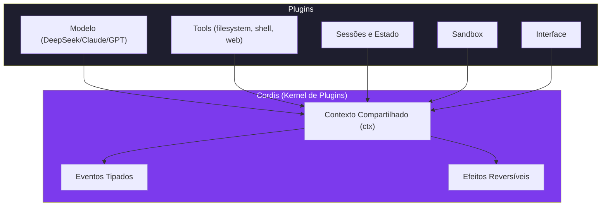

Como Engenheiro de Agentes, você já percebe que essa arquitetura elimina o problema mais comum dos frameworks de agentes: o lock-in. Quando o modelo é o centro, trocar de modelo significa reescrever o agente. Quando tudo é plugin, trocar de modelo é trocar uma peça na bancada [9].

### O Fluxo de uma Requisição

Para entender como tudo se conecta, acompanhe o que acontece quando você digita uma mensagem no DeepSeek Harness [11]:

1. **Entrada:** Sua mensagem chega como um evento de sessão.
2. **Modelo:** O plugin de modelo recebe a mensagem e gera uma resposta (que pode incluir chamadas de tools).
3. **Pipeline:** Se o modelo decidiu usar uma tool, o pipeline de ferramentas processa a chamada — policy, hooks, sandbox, execução.
4. **Resultado:** O resultado da tool é formatado e devolvido ao modelo.
5. **Resposta:** O modelo gera a resposta final com base no resultado da tool.
6. **Persistência:** Tudo é salvo como eventos de sessão duráveis.

Esse fluxo é o mesmo independentemente do modo de execução, do modelo escolhido, ou das tools disponíveis. É a elegância da arquitetura plugin-first — o fluxo é definido pelo Cordis, não pelos componentes individuais.

## 4. Técnica

### Estrutura de um Plugin Cordis

Todo plugin do DeepSeek Harness segue uma estrutura padrão que você vai熟悉 ao longo do livro. Aqui está a esqueleto básico:

```json
{
  "name": "meu-plugin",
  "version": "0.1.0",
  "description": "Plugin personalizado para o DeepSeek Harness",
  "main": "index.js",
  "cordis": {
    "provides": ["tool", "service"],
    "requires": ["model"],
    "lifecycle": {
      "ready": "onReady",
      "dispose": "onDispose"
    }
  }
}
```

O campo `cordis` é o coração do plugin. Ele declara:
- **provides**: quais serviços este plugin oferece ao contexto
- **requires**: quais serviços ele precisa de outros plugins para funcionar
- **lifecycle**: callbacks para os eventos de ciclo de vida

### Registro de um Plugin

Para registrar um plugin no harness, você usa a API do Cordis:

```javascript
// index.js do plugin
export default function meuPlugin(ctx) {
  // Registra um serviço no contexto compartilhado
  ctx.service('minha-ferramenta', {
    execute(params) {
      // Lógica da ferramenta
      return { resultado: `Processado: ${params.input}` };
    }
  });

  // Escuta eventos de sessão
  ctx.on('session:turn', (event) => {
    console.log(`Novo turno iniciado: ${event.id}`);
  });

  // Registra efeito reversível
  ctx.effect(() => {
    // Setup
    console.log('Plugin instalado');
    return () => {
      // Teardown (quando o plugin for removido)
      console.log('Plugin removido');
    };
  });
}
```

### Modos de Execução na Prática

Aqui está como você escolhe e configura o modo de execução:

```bash
# Modo Standard (padrão) — toolset completo
dsh --mode standard

# Modo Code — modelo gera código para orquestrar tools
dsh --mode code

# Modo Minimal — apenas shell + editor
dsh --mode minimal

# Modo Creator — usa profile personalizado
dsh --mode creator --profile meu-profile
```

Cada modo carrega um conjunto diferente de plugins. No modo Standard, todos os plugins de tool são carregados. No modo Minimal, apenas shell e editor [7]. Essa separação é o que permite ao harness ser ao mesmo tempo leve para benchmarks e completo para desenvolvimento real.

### Verificando a Arquitetura

```bash
# Listar plugins carregados
dsh plugins list

# Verificar dependências
dsh plugins check-deps

# Testar um plugin isoladamente
dsh plugins test @deepseek/shell-tool

# Verificar compatibilidade entre plugins
dsh plugins check-conflicts
```

## 5. Aplica

### A Escolha Errada que Custa Horas

Imagine que você está configurando um agente para uma startup de e-commerce. Você escolhe o modo Minimal porque "é mais leve" e começa a desenvolver. Três horas depois, percebe que o agente não consegue buscar na web, não tem acesso ao filesystem para ler configurações, e não pode spawnar subagentes para tarefas paralelas. Você precisava do Standard o tempo todo [6].

O erro não foi escolher o modo errado — foi não entender o que cada modo oferece antes de começar. O modo Minimal é excelente para benchmarks e testes isolados de modelos, mas para desenvolvimento real, você precisa do Standard.

Outro erro comum é tentar usar o modo Code sem entender a Code Mode SDK. O modelo gera código para orquestrar tools, mas se você não configurou as permissões corretas, o código gerado pode tentar executar ações que o sandbox bloqueia — resultando em erros silenciosos que são difíceis de debugar [8].

### A Prática Correta

Antes de iniciar qualquer projeto, defina seu modo de execução baseado na tarefa:

| Tarefa | Modo Recomendado | Por quê |
|--------|-----------------|---------|
| Desenvolvimento de software | Standard | Precisa de filesystem, shell, web search |
| Benchmark de modelo | Minimal | Quer isolar a performance do modelo |
| Prototipagem rápida | Standard + Creator profile | Flexibilidade máxima |
| Automação de DevOps | Standard | Shell + filesystem + web |
| Análise de dados | Code | Controle fino sobre sequência de tools |
| Testes de regressão | Minimal + sandbox | Isolamento total |

A regra é simples: se você vai fazer algo real, use Standard. Se vai medir algo isolado, use Minimal. Se vai repetir o mesmo workflow muitas vezes, crie um profile Creator [1].

### Checklist de Início Rápido

Para qualquer novo projeto com DeepSeek Harness:

1. ✅ Verifique se o Node.js v22+ está instalado
2. ✅ Instale o DeepSeek Harness (npm ou source)
3. ✅ Configure uma API key (DeepSeek cloud ou Ollama local)
4. ✅ Escolha o modo de execução (Standard para maioria dos casos)
5. ✅ Configure sandbox mínimo (filesystem guards)
6. ✅ Teste com uma mensagem simples no terminal
7. ✅ Liste os plugins carregados para verificar que tudo está OK

## 6. Conclusão

Neste capítulo, você descobriu que o DeepSeek Harness é mais do que um assistente de código — é um framework plugin-first onde cada componente é intercambiável. O Cordis fornece o kernel que gerencia ciclo de vida, dependências e contexto compartilhado entre plugins. Os quatro modos de execução (Standard, Code, Minimal, Creator) permitem adaptar o agente para qualquer tarefa, desde benchmarks até desenvolvimento completo de software.

A arquitetura plugin-first não é apenas uma característica técnica — é uma filosofia de design que coloca o controle nas mãos do usuário. Em vez de depender de um provedor específico de LLM, você pode usar qualquer modelo. Em vez de ficar preso a um conjunto fixo de ferramentas, você pode criar as suas. Em vez de adaptar seu workflow ao framework, o framework se adapta ao seu workflow.

No próximo capítulo, você vai sair da teoria e colocar as mãos na obra: instalar o DeepSeek Harness localmente, configurar sua primeira API key, e executar seu primeiro agente no terminal. É aqui que a oficina começa a ganhar vida.

## 7. Referências Bibliográficas

[1] DEEPSEEK AI. *DeepSeek Harness developer preview: Everything is a plugin*. Disponível em: https://deepseek.com/harness/en/. Acesso em: 23 ago. 2026.

[2] DEEPSEEK AI. *DeepSeek Harness (dsh): Everything is a Plugin*. GitHub. Disponível em: https://github.com/deepseek-ai/deepseek-harness. Acesso em: 23 ago. 2026.

[3] DEEPSEEK AI. *deepseek-harness/docs/cordis-primer.md*. GitHub. Disponível em: https://github.com/deepseek-ai/deepseek-harness/blob/master/docs/cordis-primer.md. Acesso em: 23 ago. 2026.

[4] FLOATBOAT.AI. *Cordis — The Plugin Kernel Behind DeepSeek Harness*. Disponível em: https://floatboat.ai/blog/cordis-plugin-framework. Acesso em: 23 ago. 2026.

[5] FERRAG, Mohamed Amine; TIHANYI, Norbert; DEBBAH, Mérouane. *From LLM Reasoning to Autonomous AI Agents: A Comprehensive Review*. In: IEEE Access, 2026. Disponível em: https://doi.org/10.1109/access.2026.3698694. Acesso em: 23 ago. 2026.

[6] MINDSTUDIO. *What Is DeepSeek Harness? The Plug-In Coding Agent Explained*. Disponível em: https://www.mindstudio.ai/blog/deepseek-harness-agentic-coding. Acesso em: 23 ago. 2026.

[7] ZIMASPACE. *DeepSeek Harness Modes: Standard vs Code vs Minimal vs Creator*. Disponível em: https://shop.zimaspace.com/blogs/tech-ai-hub/de-minimal-and-creator-explained. Acesso em: 23 ago. 2026.

[8] HABR. *Inside DeepSeek Harness: Cordis, Session Events, Tool Pipelines*. Disponível em: https://habr.com/en/articles/1070958/. Acesso em: 23 ago. 2026.

[9] TOWARDS AI. *DeepSeek Harness Explained: When the AI Model is Just a Plugin*. Disponível em: https://pub.towardsai.net/deepseek-harness-explained-when-the-ai-model-is-just-a-plugin-16b2496f3d01. Acesso em: 23 ago. 2026.

[10] TOWARDS AI. *DeepSeek Harness vs Claude Code: A Plugin Architecture Teardown*. Disponível em: https://pub.towardsai.net/deepseek-harness-vs-claude-code-a-plugin-architecture-teardown-da3c916f3af1. Acesso em: 23 ago. 2026.

[11] DEEPSEEK AI. *deepseek-harness/docs/architecture.md*. GitHub. Disponível em: https://github.com/deepseek-ai/deepseek-harness/blob/master/docs/architecture.md. Acesso em: 23 ago. 2026.

[12] AGENTATLAS. *Cordis Explained: How DeepSeek Harness's Plugin Framework Works*. Disponível em: https://agentatlas.org/blog/cordis-explained-how-deepseek-harness-plugin-framework-works/. Acesso em: 23 ago. 2026.

[13] MEDIUM (kaliarch). *DeepSeek Harness: When the Agent Loop Itself Becomes a Plugin*. Disponível em: https://medium.com/@kaliarch/deepseek-harness-when-the-agent-loop-itself-becomes-a-plugin-7fad0aa9de1c. Acesso em: 23 ago. 2026.

[14] MEDIUM (data-and-beyond). *Decoding DeepSeek Harness: The Open-Source Runtime Behind Composable AI Agents*. Disponível em: https://medium.com/data-and-beyond/decoding-deepseek-harness-the-open-source-runtime-behind-composable-ai-agents-c2299e992870. Acesso em: 23 ago. 2026.

[15] THE NEW STACK. *DeepSeek open sources an agent harness where everything is a plugin*. Disponível em: https://thenewstack.io/deepseek-harness-open-source-plugins/. Acesso em: 23 ago. 2026.

[16] MARKTECHPOST. *DeepSeek AI Releases DeepSeek Harness in Developer Preview*. Disponível em: https://www.marktechpost.com/2026/08/17/deepseek-ai-releases-deepseek-harness-in-developer-preview/. Acesso em: 23 ago. 2026.

[17] THEREGISTER. *DeepSeek's innovative harness treats everything as a plug-in*. Disponível em: https://www.theregister.com/ai-and-ml/2026/08/14/deepseeks-innovative-harness-treats-everything-as-a-plug-in/5288095. Acesso em: 23 ago. 2026.

[18] I-SCOOP. *DeepSeek Harness turns every part of an agent runtime into a swappable plugin*. Disponível em: https://www.i-scoop.eu/deepseek-harness-turns-every-part-of-an-agent-runtime-into-a-swappable-plugin/. Acesso em: 23 ago. 2026.

[19] SPRINGBRAND. *DeepSeek Harness (dsh): Everything Is a Plugin*. Disponível em: https://springbrand.ai/deepseek-harness. Acesso em: 23 ago. 2026.

[20] EXPLOREX.AI. *DeepSeek Harness v0.1: Run the Plugin-First Agent Stack*. Disponível em: https://explainx.ai/blog/deepseek-harness-v0-1-plugin-first-agent-stack-august-2026. Acesso em: 23 ago. 2026.

# Capítulo 2: Instalacao Local: Do Zero ao Primeiro dsh

## 1. Introdução

No Capítulo 1, você entendeu que o DeepSeek Harness é um framework plugin-first sustentado pelo Cordis. Agora é hora de tirar a poeira da bancada e montar sua primeira estação de trabalho. Neste capítulo, você vai instalar o Node.js, configurar o DeepSeek Harness no seu computador, adicionar uma API key (seja da DeepSeek ou de um provedor local), e executar seu primeiro agente no terminal.

A instalação parece simples à primeira vista — e para a maioria dos usuários, realmente é. Mas há detalhes que fazem diferença entre uma instalação que funciona por 5 minutos e uma que funciona por 5 meses. Neste capítulo, você vai cobrir não apenas o "como", mas o "porquê" de cada passo, para que quando algo der errado (e vai dar), você saiba exatamente onde procurar [1].

Ao final, você terá um `dsh` funcionando no modo Standard, pronto para receber plugins e ferramentas. É o primeiro passo concreto na construção da sua oficina de agentes.

## 2. Explica

### Pré-Requisitos: O Kit Básico

Antes de qualquer instalação, você precisa de três ferramentas fundamentais [2]:

1. **Node.js v22 ou superior** — o DeepSeek Harness é escrito em JavaScript/TypeScript e roda sobre Node.js. A versão 22 é a mínima recomendada por trazer melhorias significativas de performance e suporte a ESM nativo. Versões anteriores (v16, v18) podem causar erros crypticos com módulos ESM — é a causa mais comum de falhas na instalação [3].

2. **npm ou pnpm** — gerenciadores de pacotes Node.js. O pnpm é recomendado por ser mais rápido e eficiente em disco (usa hardlinks em vez de copiar pacotes), mas o npm funciona perfeitamente. A diferença prática é que o pnpm instala dependências ~2x mais rápido em projetos grandes.

3. **Git** — para clonar o repositório (se você instalar via source) e para o sistema de worktrees que veremos no Capítulo 8. Git é essencial não apenas para instalação, mas para o funcionamento do harness em produção.

**GPU é opcional mas recomendada.** Se você vai rodar modelos localmente (Ollama, vLLM), uma GPU NVIDIA com pelo menos 8GB de VRAM faz diferença enorme na velocidade. Mas para começar, você pode usar o modo cloud com uma API key da DeepSeek sem nenhuma GPU [4].

### Por que Node.js v22+?

O DeepSeek Harness usa recursos modernos do ECMAScript modules (ESM) que não estão disponíveis em versões anteriores do Node.js. Especificamente [3]:

- **`import.meta.resolve`** — para resolução de módulos relativos
- **`node:test`** — para testes integrados no runtime
- **Performance de streams** — melhorias significativas em I/O
- **Suporte a WebCrypto** — para operações criptográficas nativas

Se você tentar instalar com Node.js v16 ou v18, provavelmente verá erros como `ERR_MODULE_NOT_FOUND` ou `SyntaxError: Cannot use import statement outside a module`. A solução é sempre atualizar o Node.js [5].

### Duas Rotas de Instalação

O DeepSeek Harness oferece duas formas de instalação, cada uma com seu caso de uso [1]:

**Rota 1 — Via npm (recomendada para iniciantes):**
```bash
npm install -g deepseek-harness
```
Instalação global via npm. Mais simples, atualizações automáticas via `npm update`. Ideal para quem quer começar rápido. O binário `dsh` fica disponível em qualquer diretório do sistema.

**Rota 2 — Via source (recomendada para desenvolvedores):**
```bash
git clone https://github.com/deepseek-ai/deepseek-harness.git
cd deepseek-harness
pnpm install
pnpm build
```
Clona o repositório e compila localmente. Permite modificar o código fonte, contribuir com plugins, e ter controle total sobre versões. Essa rota é essential para os capítulos avançados (9-12) onde você vai criar plugins personalizados [6].

A diferença prática é que a Rota 1 te dá um binário pronto, enquanto a Rota 2 te dá o código fonte. Para o que vamos fazer neste livro, ambas funcionam — mas a Rota 2 é mais flexível para os capítulos avançados.

### Configuração da API Key

O DeepSeek Harness precisa de uma chave de API para se comunicar com modelos de linguagem. Você tem duas opções [7]:

**Opção A — API Key da DeepSeek (cloud):**
Acesse platform.deepseek.com, crie uma conta, e gere uma API key. É a rota mais rápida para começar. A DeepSeek oferece créditos gratuitos para novos usuários, e os preços são competitivos (~$0.14/milhão de tokens para entrada, ~$0.28/milhão para saída no V4).

**Opção B — Modelo local via Ollama (self-hosted):**
Se você preferir rodar tudo localmente, pode conectar o harness a um modelo Ollama rodando na porta 11434. Não precisa de API key — o modelo roda entirely no seu computador. Isso tem vantagens de privacidade (seus dados nunca saem do computador) e custo (zero, depois de baixar o modelo) [8].

### Gerenciamento de Versões

Uma prática importante é gerenciar versões do DeepSeek Harness. Como o framework está em v0.1 (developer preview), atualizações frequentes trazem mudanças breaking [9]:

```bash
# Verificar versão atual
dsh --version

# Atualizar para a versão mais recente
npm update -g deepseek-harness

# Reverter para uma versão específica (se algo quebrou)
npm install -g deepseek-harness@0.1.0

# Verificar changelog
dsh changelog
```

## 3. Ilustra

### Montando a Primeira Estação de Trabalho

Pense na instalação como montar a primeira estação de trabalho na sua oficina. O Node.js é a bancada — a superfície onde tudo se apoia. Sem uma bancada estável, nenhuma ferramenta funciona direito. O Git é a caixa de ferramentas — permite clonar, versionar, e manipular código. A API key é a tomada de energia — sem ela, nenhuma peça funciona [10].

Quando você executa `npm install -g deepseek-harness`, está como se estivesse colocando a furadeira central na bancada. Ela é a peça principal — sem ela, você não consegue fazer nada. Mas ela precisa de energia (a API key) e de material para trabalhar (os plugins que vamos instalar nos próximos capítulos).

O momento em que você digita `dsh` pela primeira vez e vê o prompt do agente respondendo é como ligar a furadeira e ouzir o motor girando pela primeira vez. A oficina ganhou vida. Mas atenção — assim como uma furadeira ligada sem material para furar gira no vazio, um agente sem contexto é apenas um prompt esperando por uma tarefa.

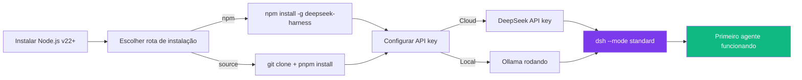

### O Primeiro Debug

Todo desenvolvedor lembra do primeiro erro que encontrou. Para o DeepSeek Harness, o erro mais comum é `ERR_MODULE_NOT_FOUND` — e ele quase sempre significa que o Node.js está desatualizado [3]. É como tentar ligar uma furadeira de 220V numa tomada de 110V: a peça é a mesma, mas a energia não é compatível.

Outro erro comum é `EACCES` no Linux/macOS quando você tenta instalar globalmente sem permissões. A solução não é usar `sudo` (que pode causar outros problemas), mas sim instalar o Node.js via `nvm` (Node Version Manager), que permite gerenciar versões sem sudo [5].

## 4. Técnica

### Instalação Completa — Rota npm

Vamos executar a instalação passo a passo. Abra o terminal e siga cada comando:

```bash
# Passo 1: Verificar se o Node.js está instalado e na versão correta
node --version
# Saída esperada: v22.x.x ou superior

# Passo 2: Instalar o DeepSeek Harness globalmente
npm install -g deepseek-harness

# Passo 3: Verificar a instalação
dsh --version
# Saída esperada: deepseek-harness v0.1.x

# Passo 4: Verificar os modos disponíveis
dsh --help

# Passo 5: Listar plugins nativos
dsh plugins list-builtin
```

### Instalação Completa — Rota Source

Para quem quer mais controle:

```bash
# Passo 1: Clonar o repositório
git clone https://github.com/deepseek-ai/deepseek-harness.git
cd deepseek-harness

# Passo 2: Instalar dependências (pnpm recomendado)
pnpm install

# Passo 3: Compilar o projeto
pnpm build

# Passo 4: Linkar o binário globalmente (para usar 'dsh' de qualquer pasta)
pnpm link --global

# Passo 5: Verificar
dsh --version

# Passo 6: Rodar testes para garantir que tudo funciona
pnpm test
```

### Configuração da API Key

```bash
# Opção A: DeepSeek API (cloud)
dsh config set-api-key deepseek <SUA_API_KEY_AQUI>

# Verificar se a chave foi salva
dsh config show

# Testar a conexão
dsh test-connection
```

Para a Opção B (local com Ollama), primeiro instale o Ollama:

```bash
# Instalar Ollama (Linux/macOS)
curl -fsSL https://ollama.com/install.sh | sh

# Instalar Windows: baixe de https://ollama.com/download

# Instalar um modelo DeepSeek (7B para começar)
ollama pull deepseek-v4:7b

# Verificar que o modelo está rodando
ollama list

# Testar o modelo diretamente
ollama run deepseek-v4:7b "Olá, funciona?"

# O DeepSeek Harness detecta automaticamente o Ollama na porta 11434
# Não precisa de API key — basta iniciar o dsh
dsh --mode standard
```

### Primeira Execução

```bash
# Iniciar o DeepSeek Harness no modo Standard
dsh --mode standard

# Você verá algo como:
# 🚀 DeepSeek Harness v0.1.0
# Mode: Standard | Model: deepseek-v4 (via ollama)
# Type your message or /help for commands
#
# dsh>

# Testar com uma mensagem simples
dsh> Olá! Quem é você?
# O agente responde com uma saudação e explica que é o DeepSeek Harness

# Testar uma tool básica
dsh> Liste os arquivos no diretório atual
# O agente usa a tool filesystem:readdir e lista os arquivos
```

Parabéns — sua primeira estação de trabalho está operacional. O agente está rodando no modo Standard com todas as ferramentas disponíveis [1].

### Verificação Pós-Instalação

```bash
# Script de verificação completa
echo "=== Verificação Pós-Instalação ==="

# 1. Node.js
node --version | grep -q "v22" && echo "✅ Node.js v22+" || echo "❌ Node.js desatualizado"

# 2. DeepSeek Harness
dsh --version && echo "✅ dsh instalado" || echo "❌ dsh não encontrado"

# 3. Plugins nativos
dsh plugins list-builtin | wc -l | xargs -I {} echo "✅ {} plugins nativos carregados"

# 4. Conexão com modelo
dsh test-connection && echo "✅ Conexão OK" || echo "❌ Falha na conexão"

echo "=== Verificação completa ==="
```

## 5. Aplica

### O Erro de Pular os Pré-Requisitos

Um desenvolvedor decidiu instalar o DeepSeek Harness sem verificar a versão do Node.js. Seu computador tinha o Node 16 (uma versão antiga). A instalação pareceu funcionar — o npm não reportou erros — mas ao executar `dsh`, ele recebeu erros crypticos sobre módulos ESM não encontrados [3].

Ele gastou duas horas debugando antes de descobrir que o problema era a versão do Node. A correção era simples: `nvm install 22`. Mas o tempo perdido poderia ter sido evitado com uma verificação de 30 segundos antes da instalação.

Outro caso comum: um desenvolvedor instalou o Ollama e o DeepSeek Harness no mesmo computador, mas o Ollama não estava rodando quando ele executou `dsh`. O harness tentou conectar na porta 11434, não encontrou nada, e retornou um erro genérico "Model not found". O desenvolvedor interpretou isso como "o modelo não está instalado" e começou a baixar o modelo novamente — gastando 20 minutos de download desnecessário [8].

### A Prática Correta

Sempre verifique os pré-requisitos antes de instalar:

```bash
# Script de verificação pré-instalação
echo "=== Verificação de Pré-Requisitos ==="

# Node.js
NODE_VERSION=$(node --version 2>/dev/null | cut -d'v' -f2 | cut -d'.' -f1)
if [ "$NODE_VERSION" -ge 22 ]; then
  echo "✅ Node.js v${NODE_VERSION} (mínimo: v22)"
else
  echo "❌ Node.js v${NODE_VERSION} encontrado. Instale v22+: https://nodejs.org"
  echo "   Ou use: nvm install 22"
  exit 1
fi

# Git
git --version && echo "✅ Git instalado" || echo "❌ Git não encontrado"

# npm/pnpm
pnpm --version && echo "✅ pnpm disponível" || echo "⚠️  pnpm não encontrado (recomendado)"
npm --version && echo "✅ npm disponível" || echo "❌ npm não encontrado"

echo "✅ Todos os pré-requisitos verificados"
```

Armadilhas comuns na instalação:

| Erro | Causa | Solução |
|------|-------|---------|
| `ERR_MODULE_NOT_FOUND` | Node.js < v22 | `nvm install 22` |
| `EACCES` no Linux/macOS | Permissões npm | Usar `nvm` em vez de `sudo` |
| `dsh: command not found` | npm global bin não no PATH | Adicionar `$(npm config get prefix)/bin` ao PATH |
| Ollama não responde | Serviço não rodando | `ollama serve` |
| Modelo não encontrado | Modelo não baixado | `ollama pull deepseek-v4:7b` |

## 6. Conclusão

Neste capítulo, você instalou o DeepSeek Harness pela primeira vez. Viu as duas rotas de instalação (npm e source), configurou uma API key (cloud ou local via Ollama), e executou seu primeiro agente no modo Standard. Sua estação de trabalho está montada e funcionando.

Mas uma estação de trabalho sem um bom motor é apenas uma mesa bonita. No próximo capítulo, você vai conhecer a família de modelos DeepSeek — do V4 ao R1, passando pelos variants distilled — e descobrir como escolher o modelo certo para o seu hardware e caso de uso. É aqui que você calibra o motor da sua oficina.

## 7. Referências Bibliográficas

[1] DEEPSEEK AI. *DeepSeek Harness developer preview: Everything is a plugin*. Disponível em: https://deepseek.com/harness/en/. Acesso em: 23 ago. 2026.

[2] MINDSTUDIO. *How to Install and Set Up DeepSeek Harness Locally*. Disponível em: https://www.mindstudio.ai/blog/how-to-set-up-deepseek-harness. Acesso em: 23 ago. 2026.

[3] DEEPSEEK AI. *deepseek-harness/docs/development.md*. GitHub. Disponível em: https://github.com/deepseek-ai/deepseek-harness/blob/master/docs/development.md. Acesso em: 23 ago. 2026.

[4] DEV.TO. *A Step-by-Step Guide to Install DeepSeek-R1 Locally*. Disponível em: https://dev.to/nodeshiftcloud/a-step-by-step-guide-to-install-deepseek-r1-locally-with-ollama-vllm-or-transformers-44a1. Acesso em: 23 ago. 2026.

[5] MEDIUM (techlatest). *How to Install DeepSeek Harness: A Step-by-Step Setup Guide*. Disponível em: https://medium.com/@techlatest.net/how-to-install-deepseek-harness-a-step-by-step-setup-guide-for-developers-9bedadfb584d. Acesso em: 23 ago. 2026.

[6] DATACAMP. *DeepSeek Harness Tutorial: Set Up the Open-Source Agent*. Disponível em: https://www.datacamp.com/tutorial/deepseek-harness. Acesso em: 23 ago. 2026.

[7] VERDENT.AI. *DeepSeek Harness Installation: How to Run dsh*. Disponível em: https://www.verdent.ai/guides/agents/install-deepseek-harness-dsh. Acesso em: 23 ago. 2026.

[8] ATLASCLOUD. *How to Install DeepSeek Harness in 10 Minutes*. Disponível em: https://www.atlascloud.ai/blog/tips/how-to-install-deepseek-harness. Acesso em: 23 ago. 2026.

[9] COMETAPI. *6 Methods to Deploy DeepSeek Harness Locally*. Disponível em: https://www.cometapi.com/how-to-install-and-deploy-deepseek-harness-locally/. Acesso em: 23 ago. 2026.

[10] TOWARDS AI. *DeepSeek Harness Explained: When the AI Model is Just a Plugin*. Disponível em: https://pub.towardsai.net/deepseek-harness-explained-when-the-ai-model-is-just-a-plugin-16b2496f3d01. Acesso em: 23 ago. 2026.

[11] CLOUDSWAY. *DeepSeek Harness Tutorial: Architecture and Quick Start*. Disponível em: https://www.cloudsway.ai/resources/deepseek-harness-tutorial-architecture-and-quick-start. Acesso em: 23 ago. 2026.

[12] LINKEDIN (Cole Medin). *DeepSeek Coding Agent Harness Offers Customizable Plugins*. Disponível em: https://www.linkedin.com/posts/cole-medin-727752184_deepseek-built-a-coding-agent-harness-last-activity-7495993045192998912-574a. Acesso em: 23 ago. 2026.

[13] XCLOUD. *DeepSeek Harness vs OpenClaw vs Hermes Agent*. Disponível em: https://xcloud.host/deepseek-harness-vs-openclaw-vs-hermes-agent. Acesso em: 23 ago. 2026.

[14] KIE.AI. *What Is DeepSeek Harness? V4 Agent Framework*. Disponível em: https://kie.ai/blog/what-is-deepseek-harness. Acesso em: 23 ago. 2026.

[15] YOUTUBE (DeepSeek Harness). *Everything You Need to Get Started*. Disponível em: https://www.youtube.com/watch?v=0sErTGzcJoc. Acesso em: 23 ago. 2026.

[16] YOUTUBE (DeepSeek Harness). *NEW Deepseek Agent Harness EXPLAINED (deep dive)*. Disponível em: https://www.youtube.com/watch?v=Hpw4fAHlHDw. Acesso em: 23 ago. 2026.

[17] YOUTUBE (DeepSeek Harness). *Every Deepseek Harness Concept Explained*. Disponível em: https://www.youtube.com/watch?v=24UCnAs7MVg. Acesso em: 23 ago. 2026.

[18] LINKEDIN (Richard Van Ngo Tran). *DeepSeek Harness v0.1 Released: Cordis Powered Plugin*. Disponível em: https://www.linkedin.com/posts/richard-van-ngo-tran-8095441a4_deepseek-harness-v01-is-now-available-in-activity-7493832260652228608-E39a. Acesso em: 23 ago. 2026.

[19] REDDIT (r/DeepSeek). *Can you help me find the Best AI Harness for the New Deepseek V4?*. Disponível em: https://www.reddit.com/r/DeepSeek/comments/1vjkstg/. Acesso em: 23 ago. 2026.

[20] SKYWORK. *DeepSeek V4 Local Deployment: A Comprehensive Guide*. Disponível em: https://skywork.ai/skypage/en/deepseek-local-deployment-guide/2047582806721294336. Acesso em: 23 ago. 2026.

# Capítulo 3: Modelos DeepSeek: Escolhendo o Motor da Sua Oficina

## 1. Introdução

No Capítulo 2, você montou sua primeira estação de trabalho e executou o DeepSeek Harness. Mas um agente sem um bom modelo é como uma oficina com uma furaveira sem fio — a estrutura está pronta, mas não há potência. Neste capítulo, você vai conhecer a família completa de modelos DeepSeek, entender os requisitos de hardware para cada tamanho, e descobrir como a quantização pode fazer caber um modelo de 70 bilhões de parâmetros em uma GPU de 24GB [1].

A escolha do modelo é a decisão mais importante que você vai tomar ao configurar seu agente. Um modelo muito pequeno não vai ter capacidade suficiente para tarefas complexas. Um modelo muito grande vai consumir toda sua VRAM e ficar lento. E o formato de quantização errado pode transformar um modelo excelente em um papagaio de papel [2].

Ao final, você será capaz de escolher o modelo certo para o seu hardware e caso de uso, e de explicar por que a escolha errada pode transformar uma ferramenta poderosa num pesadelo de performance.

## 2. Explica

### A Família DeepSeek: Muito Mais que Um Modelo

Quando as pessoas falam em "DeepSeek", geralmente estão pensando em um único modelo. Na verdade, a DeepSeek AI mantém uma família inteira de modelos, cada um projetado para um caso de uso diferente [3]:

**DeepSeek V4-Pro (2026):** O mais recente e poderoso. Atingiu 70.3% no AIME 2025, com ecossistema nativo de ferramentas e profundidade multimodal [4]. É o estado da arte em modelos open-source, mas exige hardware significativo para rodar localmente. O V4-Pro é o primeiro modelo open-source a ultrapassar modelos proprietários em benchmarks de coding e raciocínio matemático.

**DeepSeek V4:** O modelo base da geração atual. Equilíbrio entre performance e requisitos de hardware. Ideal para a maioria dos casos de uso de coding agent [3]. Disponível em tamanhos de 7B a 671B parâmetros.

**DeepSeek R1:** Modelo de raciocínio com cadeia-de-pensamento (chain-of-thought). Projetado para problemas que exigem raciocínio passo a passo — matemática, lógica, programação complexa [5]. O R1 "pensa" antes de responder, o que aumenta a latência mas melhora drasticamente a qualidade em tarefas de raciocínio.

**DeepSeek Distilled Variants:** Versões menores (1.5B, 7B, 14B, 32B, 70B) derivadas dos modelos maiores via destilação. Mantêm uma fração significativa da performance dos modelos originais, mas cabem em hardware consumer [5]. A destilação é o processo de treinar um modelo menor para imitar o comportamento de um modelo maior — como um aprendiz que absorve o conhecimento de um mestre.

### Requisitos de Hardware: O Mapa da Decisão

A escolha do modelo é, em última instância, uma decisão de hardware. Cada bilhão de parâmetros consome aproximadamente 2GB de VRAM em FP16, ou cerca de 500MB em quantização 4-bit [6]:

| Modelo | Parâmetros | VRAM (FP16) | VRAM (4-bit) | Hardware Mínimo | Caso de Uso |
|--------|-----------|-------------|--------------|-----------------|-------------|
| DeepSeek-R1-Distill-1.5B | 1.5B | ~3GB | ~1GB | Qualquer GPU moderna | Tarefas leves, classificação |
| DeepSeek-R1-Distill-7B | 7B | ~14GB | ~4GB | RTX 3060 12GB | Coding agent diário |
| DeepSeek-R1-Distill-14B | 14B | ~28GB | ~8GB | RTX 3090 24GB | Refatoração complexa |
| DeepSeek-R1-Distill-32B | 32B | ~64GB | ~18GB | RTX 4090 24GB | Análise arquitetural |
| DeepSeek-R1-Distill-70B | 70B | ~140GB | ~40GB | 2x A100 80GB | Pesquisa avançada |
| DeepSeek-V4 (full) | 671B | ~1.3TB | ~350GB | Cluster multi-GPU | Estado da arte absoluto |

A regra de ouro: **nunca tente rodar um modelo maior do que sua VRAM suporta sem quantização adequada**. Um modelo que spilla para RAM do sistema é 10-100x mais lento que rodar em GPU [6]. É como tentar colocar um motor de caminhão num carro compacto —技术上 funciona, mas a performance é horrível.

### Quantização: Compactando o Motor

Quantização é o processo de reduzir a precisão dos pesos do modelo (de FP16 para INT8, INT4, etc.) para diminuir o consumo de memória. Existem três formatos principais em 2026 [7]:

**GGUF (llama.cpp):** Formato para inferência heterogênea — funciona em CPU, Metal (Apple Silicon), CUDA (NVIDIA) e Vulkan (AMD). O padrão Q4_K_M mantém aproximadamente 92% da qualidade original. É o formato preferido para Ollama [7]. O GGUF é o formato mais popular porque funciona em qualquer hardware — se você tem um computador, provavelmente pode rodar um modelo GGUF.

**AWQ (Activation-aware Weight Quantization):** Formato otimizado para GPU tensor cores. Retém aproximadamente 95% da qualidade e oferece melhor throughput que GGUF em GPUs NVIDIA. Ideal para vLLM em produção [8]. O AWQ é a escolha profissional — quando performance importa mais que compatibilidade.

**GPTQ:** Formato legado para GPU. Uma vez que kernels mais recentes o superaram em performance, perdeu popularidade em 2026 [7]. Ainda funciona, mas AWQ é preferível para novos projetos. O GPTQ é como um carro antigo que ainda funciona — não vale a pena comprar um novo, mas se você já tem um, não precisa trocar.

### Escolhendo o Formato Certo

| Cenário | Formato Recomendado | Por quê |
|---------|-------------------|---------|
| Ollama / uso local geral | GGUF Q4_K_M | Melhor compatibilidade, funciona em CPU+GPU |
| vLLM em produção (GPU) | AWQ INT4 | Melhor throughput em tensor cores |
| Apple Silicon (M1/M2/M3) | GGUF (Metal) | Ollama + GGUF é a combinação nativa |
| Hardware antigo (GPU fraca) | GGUF Q3_K_M | Menor qualidade, mas roda em qualquer coisa |
| Máxima qualidade (GPU potente) | AWQ ou FP16 | Se você tem VRAM sobrando, não quantize |
| CPU only | GGUF Q4_K_M | Funciona, mas é lento (~5 tokens/s) |

### FP8: O Novo Padrão

Em 2026, o FP8 (8-bit floating point) está ganhando popularidade como meio-termo entre FP16 e INT4 [9]. Ele mantém mais precisão que INT4 (~97% da qualidade original) enquanto consome metade da VRAM de FP16. É a escolha ideal para GPUs que suportam FP8 nativamente (H100, RTX 4090).

## 3. Ilustra

### O Motor da Oficina

Pense nos modelos DeepSeek como motores de diferentes tamanhos para sua oficina. O modelo 1.5B é um motor de scooter — leve, econômico, perfeito para tarefas simples como classificar e-mails ou completar frases. Consome pouco combustível (VRAM), mas não vai puxar um caminhão [10].

O modelo 7B é um motor de carro compacto — suficiente para a maioria das tarefas de coding, com consumo razoável de combustível (VRAM). É o "sweet spot" para a maioria dos desenvolvedores — boa performance, custo acessível, e funciona em hardware consumer.

O modelo 32B é um motor de caminhão — potente o suficiente para tarefas complexas como refatoração de código legado e análise arquitetural, mas precisa de um tanque maior (GPU com mais VRAM). Quando você precisa que o agente entenda um sistema inteiro de 50.000 linhas de código, é esse motor que você quer.

O modelo 671B completo é um motor de locomotiva — absurdo de potente, mas exige infraestrutura ferroviária (cluster multi-GPU) para funcionar. Na prática, quase ninguém roda o modelo completo localmente — é mais comum usar versões quantizadas ou a API cloud [4].

A quantização é como usar gasolina de octanagem menor no motor. Ele funciona, consome menos combustível, mas perde um pouco de potência. Para a maioria das tarefas diárias, a perda é imperceptível. Para tarefas que exigem potência máxima — raciocínio matemático complexo, geração de código com muitas dependências — a diferença se torna notável [7].

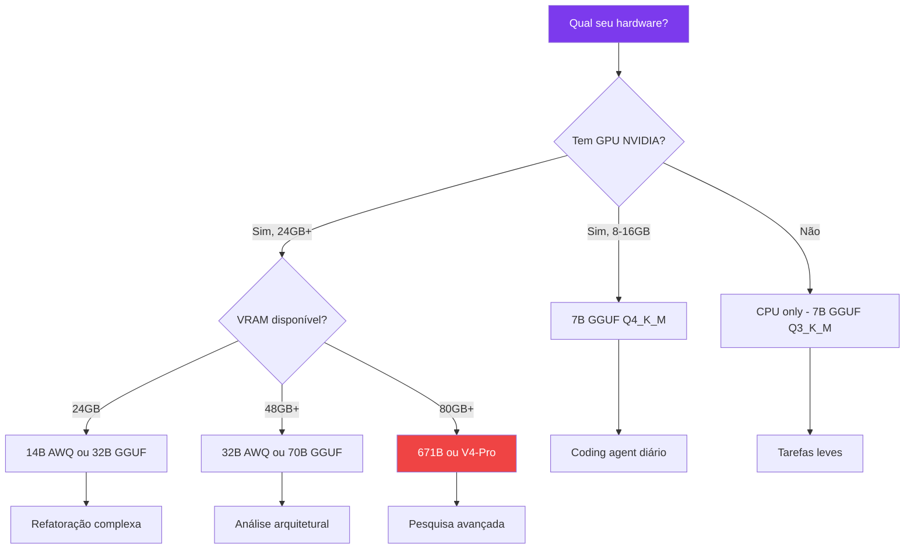

## 4. Técnica

### Instalando e Testando Modelos com Ollama

Vamos testar diferentes modelos para encontrar o ideal para o seu hardware:

```bash
# Instalar modelos de diferentes tamanhos
ollama pull deepseek-v4:7b      # ~4.7GB download
ollama pull deepseek-r1:14b     # ~9GB download
ollama pull deepseek-r1:32b     # ~19GB download

# Listar modelos instalados
ollama list
# NAME                    ID            SIZE      MODIFIED
# deepseek-v4:7b          a1b2c3d4      4.7 GB    2 minutes ago
# deepseek-r1:14b         e5f6g7h8      9.0 GB    5 minutes ago
# deepseek-r1:32b         i9j0k1l2      19.0 GB   10 minutes ago

# Testar cada modelo
ollama run deepseek-v4:7b "Explique o que é um plugin em 3 frases"
ollama run deepseek-r1:14b "Resolva: qual é a derivada de x^3 + 2x?"
ollama run deepseek-r1:32b "Escreva uma função Python que valida CPF"
```

### Monitorando VRAM em Tempo Real

Enquanto testa, monitore o consumo de memória:

```bash
# NVIDIA (Linux)
watch -n 1 nvidia-smi

# macOS (Apple Silicon)
sudo powermetrics --samplers gpu_power -n 1 -i 1000

# Windows
nvidia-smi -l 1

# Script de monitoramento contínuo
while true; do
  nvidia-smi --query-gpu=memory.used,memory.total,utilization.gpu --format=csv,noheader
  sleep 2
done
```

### Conectando o Modelo ao DeepSeek Harness

```bash
# Verificar que o Ollama está rodando
curl http://localhost:11434/api/tags

# Configurar o DeepSeek Harness para usar Ollama
dsh config set-model ollama deepseek-v4:7b

# Iniciar o harness com o modelo local
dsh --mode standard

# Testar no harness
dsh> Escreva uma função Python que calcula Fibonacci
```

### Exportando Modelo Quantizado do HuggingFace

Para modelos que não estão no Ollama, você pode baixar e quantizar:

```bash
# Baixar modelo GGUF do HuggingFace (exemplo: 7B)
huggingface-cli download deepseek-ai/DeepSeek-V4-7B-GGUF \
  --include "deepseek-v4-7b-q4_k_m.gguf" \
  --local-dir ./models/

# Testar com llama.cpp
./llama-cli -m ./models/deepseek-v4-7b-q4_k_m.gguf \
  -p "Explique plugins em IA" -n 200

# Converter modelo para GGUF (se tiver o modelo em outro formato)
python convert_hf_to_gguf.py ./meu-modelo/ --outfile meu-modelo.gguf
```

## 5. Aplica

### O Erro de Ignorar VRAM

Um desenvolvedor com uma RTX 3060 de 12GB decidiu rodar o DeepSeek-R1-32B porque "vi no Reddit que é o melhor custo-benefício". O modelo carregou parcialmente, depois começou a spilla para RAM do sistema. Cada resposta levava 45 segundos em vez de 2 [6].

Ele gastou três horas tentando otimizar parâmetros do Ollama — ajustando `num_ctx`, `num_gpu`, `num_batch` — antes de perceber que simplesmente não tinha VRAM suficiente para aquele modelo. A solução era simples: trocar para o DeepSeek-R1-14B em quantização Q4_K_M. O modelo cabia inteiro na GPU, as respostas voltaram a levar 2-3 segundos, e a qualidade para coding era mais do que suficiente para o trabalho dele.

Outro erro comum: um desenvolvedor comprou uma GPU de 24GB especificamente para rodar modelos grandes, mas comprou a versão errada (RTX 3060 24GB em vez de RTX 3090 24GB). A RTX 3060 tem interfaces de memória mais lentas, então mesmo com 24GB de VRAM, a throughput é significativamente inferior [11].

### A Prática Correta

Antes de escolher um modelo, faça o teste de VRAM:

```bash
# 1. Verificar VRAM disponível
nvidia-smi --query-gpu=memory.total,memory.free --format=csv

# 2. Calcular capacidade (aproximada)
# FP16: 2GB por bilhão de parâmetros
# Q4_K_M: 0.5GB por bilhão de parâmetros

# 3. Testar o modelo antes de comprometer
ollama run deepseek-v4:7b "Olá"  # Se funcionar bem, teste tarefas reais
```

Tabela de decisão rápida:

| VRAM Disponível | Modelo Recomendado | Formato | Tokens/s Estimado |
|-----------------|-------------------|---------|-------------------|
| 4-8GB | 7B | GGUF Q4_K_M | 15-25 |
| 8-16GB | 14B | GGUF Q4_K_M | 10-20 |
| 16-24GB | 32B | GGUF Q4_K_M (com layers no CPU) | 5-15 |
| 24-48GB | 32B | AWQ INT4 | 20-40 |
| 48GB+ | 70B | AWQ INT4 | 15-30 |

## 6. Conclusão

Neste capítulo, você conheceu a família completa de modelos DeepSeek — do V4-Pro ao distilled 1.5B — e entendeu como os requisitos de hardware escalam com o tamanho do modelo. A quantização (GGUF, AWQ, GPTQ, FP8) é a chave para rodar modelos grandes em hardware limitado, e a escolha do formato certo depende do seu engine de inferência e hardware.

O modelo certo para você é o que cabe na sua VRAM, roda na velocidade que você precisa, e produz a qualidade que seu caso de uso exige. Não existe "melhor modelo absoluto" — existe o melhor modelo para cada situação.

No próximo capítulo, você vai configurar os três motores de inferência local — Ollama, vLLM e llama.cpp — e descobrir quando usar cada um. É aqui que você conecta o motor à oficina.

## 7. Referências Bibliográficas

[1] DEEPSEEK AI. *DeepSeek V3*. HuggingFace. Disponível em: https://huggingface.co/deepseek-ai/DeepSeek-V3. Acesso em: 23 ago. 2026.

[2] DAI, Jing. *DeepSeek-V3 Core Architecture and Its Training Techniques in Detail*. In: DeepSeek in Action. 2025. Disponível em: https://doi.org/10.1201/9781003674702-3. Acesso em: 23 ago. 2026.

[3] TECH-INSIDER. *Best Open Source LLM 2026: DeepSeek, Kimi, Qwen Ranked*. Disponível em: https://tech-insider.org/best-open-source-llm-2026/. Acesso em: 23 ago. 2026.

[4] ARRITA, Aitor et al. *o3-mini vs DeepSeek-R1: Which One is Safer?*. In: arXiv, 2025. Disponível em: http://arxiv.org/abs/2501.18438. Acesso em: 23 ago. 2026.

[5] DEV.TO (AI4B). *Comprehensive Hardware Requirements Report for DeepSeek-R1*. Disponível em: https://dev.to/ai4b/comprehensive-hardware-requirements-report-for-deepseek-r1-5269. Acesso em: 23 ago. 2026.

[6] LOCALAIMASTER. *GGUF vs GPTQ vs AWQ 2026*. Disponível em: https://localaimaster.com/blog/quantization-explained. Acesso em: 23 ago. 2026.

[7] TOWARDS AI. *I Tested GGUF vs AWQ vs GPTQ: The "Fastest" 4-Bit*. Disponível em: https://pub.towardsai.net/i-tested-gguf-vs-awq-vs-gptq-the-fastest-4-bit-collapses-on-code-at-46-d65c271d7cdf. Acesso em: 23 ago. 2026.

[8] HIVENET. *DeepSeek-R1 Model Sizes and RAM Requirements*. Disponível em: https://www.hivenet.com/post/deepseek-r1-model-sizes-ram-vram-requirements. Acesso em: 23 ago. 2026.

[9] SESAMEDISK. *Quantization Techniques for AI Inference in 2026*. Disponível em: https://sesamedisk.com/quantization-techniques-ai-inference-2026/. Acesso em: 23 ago. 2026.

[10] LYCEUM.technology. *GGUF vs GPTQ vs AWQ: 2026 LLM Quantization Guide*. Disponível em: https://lyceum.technology/magazine/gguf-vs-gptq-vs-awq-quantization/. Acesso em: 23 ago. 2026.

[11] SITEPOINT. *DeepSeek R1 Local Deployment: Complete Guide 2026*. Disponível em: https://www.sitepoint.com/deepseek-r1-local-deployment-guide-2026/. Acesso em: 23 ago. 2026.

[12] DAI, Jing. *A First Look at the DeepSeek-V3 Big Model*. In: DeepSeek in Action. 2025. Disponível em: https://doi.org/10.1201/9781003674702-6. Acesso em: 23 ago. 2026.

[13] DAI, Jing. *Introduction to DeepSeek-V3 Model-Based Development*. In: DeepSeek in Action. 2025. Disponível em: https://doi.org/10.1201/9781003674702-4. Acesso em: 23 ago. 2026.

[14] DAI, Jing. *DeepSeek Open Platform and API Development Details*. In: DeepSeek in Action. 2025. Disponível em: https://doi.org/10.1201/9781003674702-7. Acesso em: 23 ago. 2026.

[15] DAI, Jing. *DeepSeek in Action*. CRC Press, 2025. Disponível em: https://doi.org/10.1201/9781003674702. Acesso em: 23 ago. 2026.

[16] APXML. *GPU System Requirements for Running DeepSeek-R1*. Disponível em: https://apxml.com/posts/gpu-requirements-deepseek-r1. Acesso em: 23 ago. 2026.

[17] REDDIT (r/ollama). *Hardware requirements for running the full size deepseek*. Disponível em: https://www.reddit.com/r/ollama/comments/1icv7wv/hardware_requirements_for_running_the_full_size/. Acesso em: 23 ago. 2026.

[18] REDDIT (r/selfhosted). *Got DeepSeek R1 running locally - Full setup guide*. Disponível em: https://www.reddit.com/r/selfhosted/comments/1i6ggyh/got_deepseek_r1_running_locally_full_setup_guide/. Acesso em: 23 ago. 2026.

[19] YOUTUBE. *DeepSeek R1 Hardware Requirements Explained*. Disponível em: https://www.youtube.com/watch?v=5RhPZgDoglE. Acesso em: 23 ago. 2026.

[20] MEDIUM (alice.yang). *How to Choose the Right Version of DeepSeek-R1 for Local Deployment*. Disponível em: https://medium.com/@alice.yang_10652/how-to-choose-the-right-version-of-deepseek-r1-for-local-deployment-read-here-b24f4d0ec6cc. Acesso em: 23 ago. 2026.

# Capítulo 4: Ollama, vLLM e llama.cpp: Os Tres Motores de Inferencia Local

## 1. Introdução

No Capítulo 3, você escolheu o motor (modelo) para sua oficina. Mas um motor precisa de uma transmissão — algo que converta a potência bruta do modelo em respostas úteis para o DeepSeek Harness. Neste capítulo, você vai configurar e comparar os três principais engines de inferência local: Ollama, vLLM e llama.cpp [1].

A escolha do engine é tão importante quanto a escolha do modelo. Um modelo excelente rodando no engine errado vai performar mal. Um modelo mediano rodando no engine certo pode surpreender. É a transmissão que define como a potência do motor chega às rodas [2].

Ao final, você saberá qual engine usar para cada cenário — experimentação rápida, produção com múltiplos usuários, ou maximização de hardware — e como conectar qualquer um deles ao DeepSeek Harness.

## 2. Explica

### O que é um Engine de Inferência?

Um engine de inferência é o software que carrega um modelo de linguagem na memória, recebe prompts, e gera respostas. Pense nele como a transmissão de um carro: o motor (modelo) fornece a potência, mas é a transmissão (engine) que converte essa potência em movimento útil [1].

Cada engine tem suas forças e fraquezas. A escolha errada pode significar a diferença entre 20 tokens por segundo e 200 tokens por segundo — ou entre rodar em uma GPU de 8GB e precisar de 4 GPUs [3].

### Ollama: O Rei da Usabilidade

Ollama é o engine mais popular para uso local em 2026. Ele encapsula o llama.cpp em uma interface simples — instalação em um comando, gerenciamento de modelos com `ollama pull`, e API OpenAI-compatível na porta 11434 [4].

**Quando usar Ollama:**
- Experimentação rápida e desenvolvimento local
- Uma única pessoa usando o agente
- Hardware consumer (GPU NVIDIA, Apple Silicon)
- Quando você quer instalar e esquecer
- Quando você não quer configurar nada manualmente

**Vantagens do Ollama:**
- Instalação em 1 comando (Linux, macOS, Windows)
- Gerenciamento de modelos simplificado (pull, list, run)
- API OpenAI-compatível — funciona com qualquer ferramenta que suporte a API da OpenAI
- Auto-detecta hardware e otimiza automaticamente
- Suporte a Apple Silicon nativo (Metal)

**Limitações:**
- Não suporta batching dinâmico (múltiplas requisições simultâneas)
- Performance inferior ao vLLM para múltiplos usuários
- Menos controle fino sobre parâmetros de inferência
- Não suporta quantização AWQ (apenas GGUF) [4]

### vLLM: O Motor de Produção

O vLLM é a engine de referência para servir modelos em produção. Sua feature principal é o PagedAttention — uma técnica que gerencia memória de contexto de forma eficiente, permitindo servir múltiplos usuários simultaneamente com throughput significativamente superior [5].

**Quando usar vLLM:**
- Produção com múltiplos usuários
- API que precisa de alta disponibilidade
- Quando throughput é mais importante que latência individual
- Deploy em servidor dedicado ou cloud
- Quando você precisa de quantização AWQ

**Vantagens do vLLM:**
- PagedAttention: gerenciamento eficiente de memória
- Batching dinâmico: processa múltiplas requisições simultaneamente
- Suporte a AWQ: melhor throughput em GPUs NVIDIA
- API OpenAI-compatível
- Métricas built-in para monitoramento

**Limitações:**
- Mais complexo de configurar que Ollama
- Requer GPU NVIDIA (CUDA) para melhor performance
- Não roda bem em CPU
- Não suporta Apple Silicon nativamente [5]

### llama.cpp: A Engine Universal

O llama.cpp é a base de tudo — Ollama é um wrapper dele. Escrito em C++, roda em praticamente qualquer hardware: CPU, Metal (Apple Silicon), CUDA (NVIDIA), Vulkan (AMD). É a engine com maior amplitude de hardware [6].

**Quando usar llama.cpp:**
- Hardware não-convencional (CPU only, AMD GPU, Raspberry Pi)
- Quando você quer controle máximo sobre parâmetros
- Integração em aplicações C++ existentes
- Benchmarking de modelos
- Quando você precisa de compilação customizada

**Vantagens do llama.cpp:**
- Multi-platform: funciona em qualquer hardware
- Controle fino: centenas de parâmetros configuráveis
- Performance máxima para o hardware disponível
- Sem dependências externas pesadas
- Comunidade ativa e atualizações frequentes

**Limitações:**
- Interface de linha de comando (sem API HTTP nativa)
- Configuração manual de threads e camadas
- Não gerencia múltiplas requisições naturalmente
- Curva de aprendizado mais íngreme [6]

### Comparação Detalhada

| Característica | Ollama | vLLM | llama.cpp |
|---------------|--------|------|-----------|
| Instalação | 1 comando | pip install | Compilar |
| API | OpenAI-compatível | OpenAI-compatível | HTTP server |
| Múltiplos usuários | Não | Sim | Não |
| Batching | Não | Sim | Não |
| Apple Silicon | Nativo | Não | Nativo (Metal) |
| AMD GPU | Via Vulkan | Não | Via Vulkan |
| CPU only | Sim | Não | Sim |
| AWQ | Não | Sim | Não |
| GGUF | Sim | Não | Sim |
| Curva de aprendizado | Baixa | Média | Alta |
| Melhor para | Desenvolvimento | Produção | Controle máximo |

## 3. Ilustra

### A Transmissão da Oficina

Na sua oficina de agentes, os três engines são como três tipos de transmissão diferentes para o mesmo motor:

**Ollama é uma transmissão automática.** Você liga e dirige. Não precisa entender como as engrenagens funcionam — o Ollama cuida de tudo. Perfeito para o dia a dia, quando você quer resultados rápidos sem complicação [4]. É o Honda Civic dos engines — confiável, econômico, faz o trabalho.

**vLLM é uma transmissão manual de alta performance.** Mais difícil de dominar, mas quando você sabe o que está fazendo, extrai a máxima performance do motor. Ideal para quando você precisa que a oficina atenda múltiplos clientes ao mesmo tempo [5]. É o Porsche 911 — preciso, potente, mas exige um piloto experiente.

**llama.cpp é uma bancada de mecânica.** Você desmonta o motor, troca peças, ajusta cada parâmetro à mão. É o que um engenheiro usa quando precisa de controle absoluto sobre cada componente [6]. É como ter acesso ao CAD do motor — você pode modificar qualquer coisa, mas precisa saber o que está fazendo.

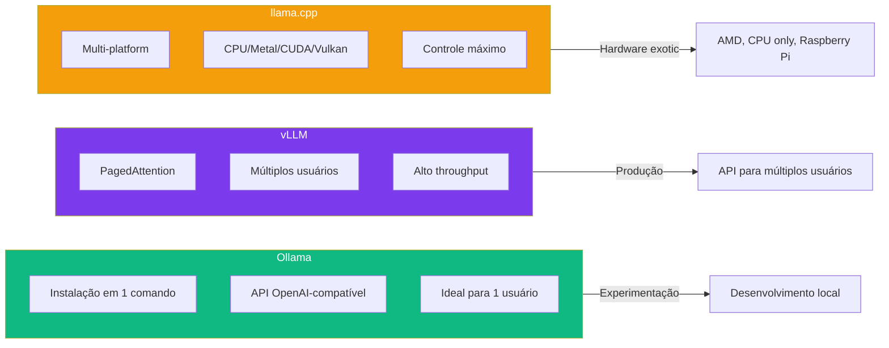

### O Benchmark Decisivo

Para decidir qual engine usar, rode o mesmo teste em todos os três:

```bash
# Teste padronizado: 100 prompts, medir throughput
# Ollama
time for i in $(seq 1 100); do
  curl -s http://localhost:11434/api/generate -d '{"model":"deepseek-v4:7b","prompt":"test","stream":false}' > /dev/null
done

# vLLM
time for i in $(seq 1 100); do
  curl -s http://localhost:8000/v1/completions -H "Content-Type: application/json" -d '{"model":"deepseek-v4-7b","prompt":"test","max_tokens":10}' > /dev/null
done

# llama.cpp
time for i in $(seq 1 100); do
  curl -s http://localhost:8080/completion -d '{"prompt":"test","n_predict":10}' > /dev/null
done
```

## 4. Técnica

### Configurando Ollama

```bash
# Instalar Ollama (Linux/macOS)
curl -fsSL https://ollama.com/install.sh | sh

# Instalar Windows: baixe de https://ollama.com/download

# Puxar um modelo
ollama pull deepseek-v4:7b

# Iniciar o servidor (API na porta 11434)
ollama serve

# Testar a API
curl http://localhost:11434/api/generate -d '{
  "model": "deepseek-v4:7b",
  "prompt": "Olá, funciona?",
  "stream": false
}'

# Configurações avançadas
OLLAMA_NUM_PARALLEL=4 ollama serve  # 4 requisições simultâneas
OLLAMA_MAX_LOADED_MODELS=2 ollama serve  # 2 modelos na memória
```

### Configurando vLLM

```bash
# Instalar vLLM via pip
pip install vllm

# Iniciar o servidor com modelo DeepSeek
vllm serve deepseek-ai/DeepSeek-V4-7B-AWQ \
  --host 0.0.0.0 \
  --port 8000 \
  --max-model-len 4096 \
  --gpu-memory-utilization 0.9 \
  --tensor-parallel-size 1

# Testar a API (compatível com OpenAI)
curl http://localhost:8000/v1/chat/completions -H "Content-Type: application/json" -d '{
  "model": "deepseek-ai/DeepSeek-V4-7B-AWQ",
  "messages": [{"role": "user", "content": "Olá"}]
}'

# Configurações de produção
vllm serve deepseek-ai/DeepSeek-V4-7B-AWQ \
  --host 0.0.0.0 \
  --port 8000 \
  --max-model-len 8192 \
  --gpu-memory-utilization 0.95 \
  --tensor-parallel-size 2 \
  --enable-prefix-caching \
  --dtype auto
```

### Configurando llama.cpp

```bash
# Compilar o llama.cpp
git clone https://github.com/ggerganov/llama.cpp
cd llama.cpp
make -j$(nproc)

# Baixar modelo GGUF
wget https://huggingface.co/deepseek-ai/DeepSeek-V4-7B-GGUF/resolve/main/deepseek-v4-7b-q4_k_m.gguf

# Rodar o servidor HTTP
./llama-server -m deepseek-v4-7b-q4_k_m.gguf \
  --host 0.0.0.0 \
  --port 8080 \
  -ngl 99 \
  -c 4096 \
  --threads 8

# Testar
curl http://localhost:8080/health

# Rodar interativamente
./llama-cli -m deepseek-v4-7b-q4_k_m.gguf \
  -p "Explique o que é Docker" \
  -n 200 \
  --temp 0.7
```

### Conectando ao DeepSeek Harness

Independentemente do engine, a conexão é a mesma — o harness usa a API OpenAI-compatível:

```bash
# Para Ollama (porta 11434)
dsh config set-model ollama deepseek-v4:7b
dsh config set-endpoint http://localhost:11434

# Para vLLM (porta 8000)
dsh config set-model vllm deepseek-ai/DeepSeek-V4-7B-AWQ
dsh config set-endpoint http://localhost:8000

# Para llama.cpp (porta 8080)
dsh config set-model llamacpp deepseek-v4-7b-q4_k_m
dsh config set-endpoint http://localhost:8080

# Verificar configuração
dsh config show

# Iniciar
dsh --mode standard
```

## 5. Aplica

### O Erro de Usar Ollama em Produção

Uma startup configurou Ollama para servir seu coding agent interno. Para 5 desenvolvedores funcionava bem — cada um fazia suas perguntas em horários diferentes, e o Ollama processava uma por vez [4].

Quando o time cresceu para 20, cada desenvolvedor começou a esperar 30+ segundos por resposta. O Ollama não foi projetado para múltiplas requisições simultâneas — ele processa uma por vez, em fila. A "fila invisível" é o problema mais comum de Ollama em produção [5].

A solução: migraram para vLLM com a mesma GPU. O throughput subiu de 5 para 45 requisições simultâneas, e a latência p95 caiu de 30s para 3s. O custo da GPU foi o mesmo — a diferença foi apenas o engine.

### A Prática Correta

| Cenário | Engine | Config | Custo |
|---------|--------|--------|-------|
| Desenvolvimento pessoal | Ollama | `ollama serve` | $0 |
| Time de 5-10 devs | vLLM | `vllm serve --tensor-parallel-size 1` | GPU dedicada |
| API pública | vLLM + Docker | Docker Compose com GPU | Cloud GPU |
| Hardware AMD/CPU | llama.cpp | `llama-server` com Vulkan | $0 |
| Benchmark isolado | llama.cpp | `llama-cli` com métricas | $0 |
| Apple Silicon | Ollama | `ollama serve` (Metal) | $0 |

Tabela de decisão: se você é apenas você, Ollama. Se o time cresceu, vLLM. Se o hardware é exótico, llama.cpp [1].

## 6. Conclusão

Neste capítulo, você configurou e comparou os três motores de inferência local. Ollama é a escolha para experimentação rápida e uso pessoal. vLLM é a escolha para produção com múltiplos usuários. llama.cpp é a escolha para hardware não-convencional e controle máximo.

A escolha do engine é tão importante quanto a escolha do modelo. O engine certo transforma um bom modelo em uma experiência excelente. O engine errado transforma um excelente modelo em uma experiência frustrante.

Você agora tem todos os fundamentos montados: o harness instalado (Capítulo 2), o modelo escolhido (Capítulo 3), e o engine configurado (este capítulo). A oficina está pronta para receber peças mais complexas. No próximo capítulo, você vai explorar o sistema de plugins — o coração que faz tudo funcionar em harmonia.

## 7. Referências Bibliográficas

[1] RED HAT. *llama.cpp vs. vLLM: Choosing the right local LLM inference engine*. Disponível em: https://developers.redhat.com/articles/2026/06/15/llamacpp-vs-vllm-choosing-right-local-llm-inference-engine. Acesso em: 23 ago. 2026.

[2] SITEPOINT. *Ollama vs vLLM: Performance Benchmark 2026*. Disponível em: https://www.sitepoint.com/ollama-vs-vllm-performance-benchmark-2026/. Acesso em: 23 ago. 2026.

[3] DEV.TO. *A Step-by-Step Guide to Install DeepSeek-R1 Locally*. Disponível em: https://dev.to/nodeshiftcloud/a-step-by-step-guide-to-install-deepseek-r1-locally-with-ollama-vllm-or-transformers-44a1. Acesso em: 23 ago. 2026.

[4] WORLDLINE. *The Ultimate LLM Inference Battle, vLLM vs. Ollama vs. ZML*. Disponível em: https://blog.worldline.tech/2026/01/29/llm-inference-battle.html. Acesso em: 23 ago. 2026.

[5] TENSOR FOUNDRY. *LLM Inference Servers Compared*. Disponível em: https://tensorfoundry.io/blog/llm-inference-servers-compared. Acesso em: 23 ago. 2026.

[6] YOUTUBE (Red Hat). *Llama.cpp vs vllm: Which Local LLM Engine Actually Scales?*. Disponível em: https://www.youtube.com/watch?v=0ujh7hfutq0. Acesso em: 23 ago. 2026.

[7] REDDIT (r/LocalLLaMA). *vLLM vs. Ollama vs. llama.cpp: Which LLM Runtime for DevOps*. Disponível em: https://medium.com/devops-ai-decoded/vllm-vs-ollama-vs-llama-cpp-which-llm-runtime-for-devops-5951240f31d1. Acesso em: 23 ago. 2026.

[8] BIZON-TECH. *vLLM, Ollama, LM Studio, llama.cpp: Choosing the best LLM inference engine*. Disponível em: https://bizon-tech.com/blog/best-llm-inference-engines. Acesso em: 23 ago. 2026.

[9] GLUKHOV. *Ollama vs vLLM vs LM Studio: Best Way to Run LLMs Locally*. Disponível em: https://www.glukhov.org/llm-hosting/comparisons/hosting-llms-ollama-localai-jan-lmstudio-vllm-comparison/. Acesso em: 23 ago. 2026.

[10] MESHWORLD. *DeepSeek R1 & Llama 3.3 Local Setup Guide (Ollama vs vLLM)*. Disponível em: https://meshworld.in/blog/ai/deepseek-r1-llama-3-3-local-setup-ollama-vllm/. Acesso em: 23 ago. 2026.

[11] YOUTUBE. *DeepSeek Harness Tutorial: Set Up the Open-Source Agent*. Disponível em: https://www.youtube.com/watch?v=0sErTGzcJoc. Acesso em: 23 ago. 2026.

[12] MEDIUM (google-cloud). *DeepSeek R1: Ollama vs. vLLM on GKE*. Disponível em: https://medium.com/google-cloud/deepseek-r1-unleashed-gke-ollama-and-vllm-deep-dive-1b707eeca26f. Acesso em: 23 ago. 2026.

[13] REDDIT (r/LocalLLM). *Ollama + Open WebUI with Docker Compose*. Disponível em: https://www.reddit.com/r/LocalLLM/comments/1thdu3e/. Acesso em: 23 ago. 2026.

[14] THE OBJECTIVE DAD. *Running DeepSeek R1 at Home*. Disponível em: https://www.theobjectivedad.com/pub/20250205-deepseek-homelab/index.html. Acesso em: 23 ago. 2026.

[15] DATAQUBED. *Deploying DeepSeek-R1 Locally with vLLM on Ubuntu*. Disponível em: https://dataqubed.io/deploying-deepseek-r1-locally-with-vllm-on-ubuntu/. Acesso em: 23 ago. 2026.

[16] GOOGLE CLOUD. *DeepSeek R1: Ollama vs. vLLM on GKE*. Disponível em: https://medium.com/google-cloud/deepseek-r1-unleashed-gke-ollama-and-vllm-deep-dive-1b707eeca26f. Acesso em: 23 ago. 2026.

[17] YOUTUBE. *Install DeepSeek-V3.2 Speciale Locally with vLLM or Transformers*. Disponível em: https://www.youtube.com/watch?v=kADQYDjq6-U. Acesso em: 23 ago. 2026.

[18] REDDIT (r/LocalLLaMA). *llama.cpp vs. vLLM*. Disponível em: https://www.reddit.com/r/LocalLLaMA/comments/1qexkwb/llamacpp_vs_vllm/. Acesso em: 23 ago. 2026.

[19] REDDIT (r/LocalLLaMA). *Has vLLM made Ollama and llama.cpp redundant?*. Disponível em: https://www.reddit.com/r/LocalLLaMA/comments/1mb6i7x/has_vllm_made_ollama_and_llamacpp_redundant/. Acesso em: 23 ago. 2026.

[20] YOUTUBE. *The Real Engine Powering DeepSeek Harness (Not New)*. Disponível em: https://www.youtube.com/watch?v=XBZ6L4kj4S0. Acesso em: 23 ago. 2026.

# Capítulo 5: Sistema de Plugins: O Coracao do Harness

## 1. Introdução

No Capítulo 4, você configurou os motores de inferência local. Agora é hora de abrir o capô e entender como as peças se conectam. O sistema de plugins é o coração do DeepSeek Harness — é ele que permite que cada componente (modelo, ferramentas, sessões, sandbox) funcione de forma independente mas integrada [1].

O paradigma plugin-first não é apenas uma característica técnica — é uma filosofia de design que define como o DeepSeek Harness se diferencia de todos os outros frameworks de agentes. Enquanto outros tratam plugins como uma feature opcional, o DeepSeek Harness faz deles o centro de tudo [2].

Neste capítulo, você vai dominar o ciclo de vida dos plugins Cordis, entender como funciona a injeção de dependência entre plugins, e aprender a instalar, listar e remover plugins sem quebrar nada. É o conhecimento que separa um usuário casual de um engenheiro de agentes.

## 2. Explica

### O Ciclo de Vida de um Plugin

Todo plugin no DeepSeek Harness passa por três estágios durante sua existência [3]:

1. **Ready (Pronto):** O plugin é carregado e registrado no contexto compartilhado. Ele declara seus serviços, eventos, e efeitos. É neste momento que o plugin "nasce" e começa a interagir com outros plugins. O Cordis garante que todas as dependências estão resolvidas antes de marcar o plugin como pronto.

2. **Fork (Bifurcação):** Quando uma sessão é clonada (por exemplo, quando você faz resume de uma conversa), o plugin é bifurcado. Cada instância filha tem seu próprio estado, mas compartilha os serviços do pai. Isso permite que múltiplas sessões usem o mesmo plugin sem interferir umas nas outras.

3. **Dispose (Descarte):** Quando o plugin é removido ou o harness é desligado, o plugin executa sua rotina de limpeza. Todos os efeitos reversíveis são desfeitos, garantindo que não fique lixo no sistema [3].

Esse ciclo de vida é o que torna o Cordis diferente de outros frameworks. Em um sistema sem lifecycle management, remover um plugin pode deixar callbacks pendentes, listeners órfãos, ou estado corrompido. No Cordis, a remoção é atômica — ou tudo é removido, ou nada é [1].

### Injeção de Dependência

Os plugins não se comunicam diretamente entre si. Em vez disso, eles se comunicam através do contexto compartilhado (`ctx`). Quando um plugin precisa de um serviço de outro, ele declara a dependência e o Cordis resolve automaticamente [4]:

```javascript
// Plugin A declara que fornece um serviço
ctx.service('meu-servico', { execute() { ... } });

// Plugin B declara que precisa desse serviço
const servico = ctx.service('meu-servico');
servico.execute({ input: 'dados' });
```

Esse padrão elimina acoplamento direto entre plugins. Plugin B não precisa saber quem implementa `meu-servico` — ele só precisa que ele exista. Isso permite trocar implementações sem alterar nenhum código consumidor [4].

### Gerenciamento de Plugins

O DeepSeek Harness oferece comandos nativos para gerenciar plugins [5]:

```bash
# Listar plugins instalados
dsh plugins list

# Instalar um plugin do hub
dsh plugins install @deepseek/shell-tool

# Remover um plugin
dsh plugins remove @deepseek/shell-tool

# Atualizar todos os plugins
dsh plugins update

# Verificar conflitos entre plugins
dsh plugins check-conflicts

# Verificar dependências
dsh plugins check-deps

# Testar um plugin
dsh plugins test @deepseek/shell-tool
```

O hub de plugins (awesome-deepseek-harness) mantém uma lista curada de plugins populares [6]. Para plugins personalizados, você pode registrar diretamente do sistema de arquivos local.

### Tipos de Plugins

O DeepSeek Harness categoriza plugins em três tipos [7]:

1. **Tool Plugins:** Oferecem ferramentas que o agente pode chamar. É o tipo mais comum — cada tool é uma ação que o agente pode executar no mundo real.

2. **Service Plugins:** Oferecem serviços internos que outros plugins podem consumir. Não aparecem diretamente para o agente, mas são usados por plugins vizinhos. Exemplos: cache, logging, métricas.

3. **Provider Plugins:** Oferecem implementações de serviços que outros plugins dependem. Quando um plugin declara `provides: ["shell"]`, ele está dizendo que implementa o serviço `shell` — outros plugins que dependem de `shell` vão consumir essa implementação.

### Conflitos e Resolução

Quando dois plugins tentam registrar o mesmo serviço, o Cordis detecta o conflito e aplica regras de resolução [3]:

1. **Prioridade por versão:** plugins mais recentes têm prioridade
2. **Prioridade por ordem de carregamento:** plugins carregados primeiro têm prioridade
3. **Resolução manual:** o operador pode forçar qual plugin usar

```bash
# Verificar conflitos antes de instalar
dsh plugins check-conflicts --before-installing @novo/plugin

# Forçar resolução de conflito
dsh plugins resolve-conflict shell --winner @deepseek/shell-tool
```

## 3. Ilustra

### O Sistema Elétrico da Oficina

Na sua oficina de agentes, o sistema de plugins é como o sistema elétrico. Cada tomada (serviço) pode alimentar qualquer ferramenta (plugin). Quando você pluga uma furadeira (plugin de shell) na tomada (serviço `shell`), ela funciona imediatamente — não importa se a energia vem de uma usina solar (Ollama) ou de uma hidrelétrica (API da DeepSeek) [8].

O Cordis é o quadro de distribuição elétrico. Ele garante que cada tomada receive a tensão correta, que não haja curto-circuito quando duas ferramentas tentam usar o mesmo recurso, e que, quando você despluga uma ferramenta, a tomada continua funcionando para outra.

O ciclo de vida é como a manutenção preventiva: quando uma ferramenta quebra (plugin com erro), o Cordis a remove sem derrubar o sistema inteiro. Quando você quer testar uma ferramenta nova, pode plugá-la sem desligar as que já estão funcionando [3].

A injeção de dependência é como um sistema inteligente de distribuição elétrica: quando você pluga uma furadeira, o sistema verifica automaticamente se a tomada tem energia suficiente, se não há curto-circuito, e se a tensão é compatível. Você não precisa pensar nisso — o sistema cuida de tudo.

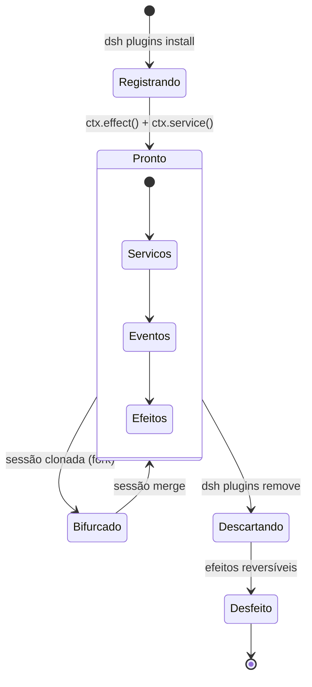

## 4. Técnica

### Criando um Plugin do Zero

Vamos criar um plugin simples que adiciona uma ferramenta de contagem de palavras:

```bash
# Criar estrutura do plugin
mkdir my-word-count-plugin
cd my-word-count-plugin
npm init -y
```

```json
// package.json
{
  "name": "my-word-count-plugin",
  "version": "0.1.0",
  "main": "index.js",
  "cordis": {
    "provides": ["tool"],
    "requires": ["filesystem"],
    "lifecycle": {
      "ready": "onReady",
      "dispose": "onDispose"
    }
  }
}
```

```javascript
// index.js
export default function wordCountPlugin(ctx) {
  const fs = ctx.service('filesystem');
  
  ctx.service('word-count', {
    async execute({ filePath }) {
      const content = await fs.readFile(filePath);
      const words = content.split(/\s+/).length;
      const lines = content.split('\n').length;
      return {
        file: filePath,
        words: words,
        lines: lines,
        chars: content.length
      };
    }
  });

  ctx.effect(() => {
    console.log('[word-count] Plugin instalado');
    return () => {
      console.log('[word-count] Plugin removido');
    };
  });
}
```

### Instalando e Testando

```bash
# Instalar localmente
dsh plugins install ./my-word-count-plugin

# Verificar que está instalado
dsh plugins list
# NAME                    VERSION  PROVIDES    REQUIRES
# my-word-count-plugin    0.1.0    tool        filesystem

# Testar no harness
dsh> Use a ferramenta word-count no arquivo README.md
# Resultado: { words: 1247, lines: 89, chars: 7832 }
```

### Resolvendo Conflitos

```bash
# Verificar conflitos
dsh plugins check-conflicts
# ⚠️ Conflito: serviço 'shell' registrado por:
#   - @deepseek/shell-tool (v1.2.0)
#   - my-custom-shell (v0.1.0)

# Resolver manualmente
dsh plugins resolve-conflict shell --winner @deepseek/shell-tool

# Ou remover o conflitante
dsh plugins remove my-custom-shell
```

## 5. Aplica

### O Plugin que Quebrou Tudo

Um desenvolvedor instalou um plugin de cache que registrava um interceptor no pipeline de ferramentas. O plugin funcionava bem — até que ele desativou o cache sem remover o interceptor. O interceptor continuava ativo, mas retornava `undefined` para todas as requisições, causando erros silenciosos em todo o agente [3].

O problema era que o plugin não implementava corretamente o efeito reversível. A solução: sempre implemente `ctx.effect()` com uma função de cleanup que remove tudo o que foi adicionado.

### A Prática Correta

Regras para plugins robustos:

1. **Sempre implemente o lifecycle completo:** `ready` e `dispose` não são opcionais.
2. **Use `ctx.effect()` para side effects:** cada `addEventListener`, `setInterval`, ou modificação de estado global deve ter um cleanup associado.
3. **Declare dependências explicitamente:** o campo `requires` no `package.json` permite que o Cordis resolva conflitos antes de carregar.
4. **Teste a remoção:** antes de publicar, instale e remova seu plugin 3 vezes seguidas. Se o harness ficar instável, há um leak [4].
5. **Documente seu plugin:** README claro com exemplos de uso.
6. **Versione corretamente:** semver para commits, releases para publishes.

## 6. Conclusão

Neste capítulo, você dominou o ciclo de vida dos plugins Cordis (ready/fork/dispose), entendeu como a injeção de dependência elimina acoplamento entre componentes, e aprendeu a gerenciar plugins com os comandos nativos do harness. O sistema de plugins é o que torna o DeepSeek Harness verdadeiramente flexível — cada componente pode ser trocado, removido, ou substituído sem afetar o resto.

No próximo capítulo, você vai mergulhar no tool pipeline — como o agente executa ações reais no mundo, camada por camada, com policy, hooks e guards de segurança.

## 7. Referências Bibliográficas

[1] DEEPSEEK AI. *DeepSeek Harness developer preview: Everything is a plugin*. Disponível em: https://deepseek.com/harness/en/. Acesso em: 23 ago. 2026.

[2] HABR. *Inside DeepSeek Harness: Cordis, Session Events, Tool Pipelines*. Disponível em: https://habr.com/en/articles/1070958/. Acesso em: 23 ago. 2026.

[3] DEEPSEEK AI. *deepseek-harness/docs/cordis-primer.md*. GitHub. Disponível em: https://github.com/deepseek-ai/deepseek-harness/blob/master/docs/cordis-primer.md. Acesso em: 23 ago. 2026.

[4] 0XSLINE. *awesome-deepseek-harness*. GitHub. Disponível em: https://github.com/0xsline/awesome-deepseek-harness. Acesso em: 23 ago. 2026.

[5] TOWARDS AI. *DeepSeek Harness vs Claude Code: A Plugin Architecture Teardown*. Disponível em: https://pub.towardsai.net/deepseek-harness-vs-claude-code-a-plugin-architecture-teardown-da3c916f3af1. Acesso em: 23 ago. 2026.

[6] COMPOSIO. *Best plugins for DeepSeek Harness every developer*. Disponível em: https://composio.dev/content/best-deepseek-harness-plugins. Acesso em: 23 ago. 2026.

[7] ATLASCLOUD. *DeepSeek Harness Plugins: The 7 Worth It*. Disponível em: https://www.atlascloud.ai/blog/tips/deepseek-harness-plugins. Acesso em: 23 ago. 2026.

[8] TOWARDS AI. *DeepSeek Harness Explained: When the AI Model is Just a Plugin*. Disponível em: https://pub.towardsai.net/deepseek-harness-explained-when-the-ai-model-is-just-a-plugin-16b2496f3d01. Acesso em: 23 ago. 2026.

[9] DEEPSEEK AI. *deepseek-harness/docs/architecture.md*. GitHub. Disponível em: https://github.com/deepseek-ai/deepseek-harness/blob/master/docs/architecture.md. Acesso em: 23 ago. 2026.

[10] FLOATBOAT.AI. *Cordis — The Plugin Kernel Behind DeepSeek Harness*. Disponível em: https://floatboat.ai/blog/cordis-plugin-framework. Acesso em: 23 ago. 2026.

[11] AGENTATLAS. *Cordis Explained: How DeepSeek Harness's Plugin Framework Works*. Disponível em: https://agentatlas.org/blog/cordis-explained-how-deepseek-harness-plugin-framework-works/. Acesso em: 23 ago. 2026.

[12] MEDIUM (data-and-beyond). *Decoding DeepSeek Harness: The Open-Source Runtime Behind Composable AI Agents*. Disponível em: https://medium.com/data-and-beyond/decoding-deepseek-harness-the-open-source-runtime-behind-composable-ai-agents-c2299e992870. Acesso em: 23 ago. 2026.

[13] LINKEDIN (Tony Ren). *DeepSeek Harness: Agent Operating System*. Disponível em: https://www.linkedin.com/posts/tonyren_i-spent-the-evening-in-the-deepseek-harness-activity-7493848102076882944-GGXB. Acesso em: 23 ago. 2026.

[14] LINKEDIN (Richard Van Ngo Tran). *DeepSeek Harness v0.1 Released*. Disponível em: https://www.linkedin.com/posts/richard-van-ngo-tran-8095441a4_deepseek-harness-v01-is-now-available-in-activity-7493832260652228608-E39a. Acesso em: 23 ago. 2026.

[15] MEDIUM (kaliarch). *DeepSeek Harness: When the Agent Loop Itself Becomes a Plugin*. Disponível em: https://medium.com/@kaliarch/deepseek-harness-when-the-agent-loop-itself-becomes-a-plugin-7fad0aa9de1c. Acesso em: 23 ago. 2026.

[16] DEEPSEEKHARNESSAI. *Security Plugins for DeepSeek Harness*. Disponível em: https://deepseekharnessai.com/categories/security. Acesso em: 23 ago. 2026.

[17] MINDSTUDIO. *What Is DeepSeek Harness? The Plug-In Coding Agent Explained*. Disponível em: https://www.mindstudio.ai/blog/deepseek-harness-agentic-coding. Acesso em: 23 ago. 2026.

[18] YOUTUBE. *NEW Deepseek Agent Harness EXPLAINED (deep dive)*. Disponível em: https://www.youtube.com/watch?v=Hpw4fAHlHDw. Acesso em: 23 ago. 2026.

[19] YOUTUBE. *Every Deepseek Harness Concept Explained (For Normal People)*. Disponível em: https://www.youtube.com/watch?v=24UCnAs7MVg. Acesso em: 23 ago. 2026.

[20] YOUTUBE. *Architecture, Loops, and the Universal Plugin Paradigm*. Disponível em: https://m.youtube.com/watch?v=Qjv8jdh4g38. Acesso em: 23 ago. 2026.

# Capítulo 6: Tool Pipeline: Como o Agente Executa Acoes

## 1. Introdução

No Capítulo 5, você entendeu como os plugins se conectam e gerenciam ciclo de vida. Mas plugins sozinhos não fazem nada — eles precisam de um sistema que coordene suas ações. O tool pipeline é essa coordenação: o fluxo completo que transforma uma decisão do modelo em uma ação no mundo real [1].

O tool pipeline é uma das partes mais elegantes do DeepSeek Harness. Ele não é apenas uma fila de ferramentas — é um sistema de defesa em profundidade com múltiplas camadas de segurança, auditoria, e processamento. Cada chamada de tool passa por policy, hooks, sandboxing, filesystem guards, execução, reescrita de resultados, e observação [2].

Neste capítulo, você vai entender cada camada do pipeline de ferramentas — policy, hooks, sandboxing, filesystem guards — e descobrir como o DeepSeek Harness garante que cada ação do agente é segura, rastreável, e reversível.

## 2. Explica

### As Camadas do Pipeline

Quando o modelo decide que precisa executar uma ferramenta (por exemplo, ler um arquivo), essa decisão passa por múltiplas camadas antes de se tornar uma ação real [1]:

1. **Policy Layer:** Verifica se a ferramenta é permitida. Algumas ferramentas podem ser desativadas por configuração ou por permissões do usuário. É a primeira linha de defesa — se a policy bloqueia, a ação não acontece.

2. **Pre-Execute Hook:** Intercepta a chamada antes da execução. Pode modificar parâmetros, registrar logs, ou bloquear a ação completamente. Hooks são úteis para auditoria e customização sem modificar a tool original.

3. **Sandbox Layer:** Executa a ferramenta em ambiente isolado. Garante que o agente não pode acessar arquivos ou recursos fora do seu escopo permitido. É a camada de segurança mais importante.

4. **Filesystem Guards:** Controle granular de leitura/escrita por diretório. O agente pode ler `/home/user/projeto` mas não `/etc/passwd`. Guards são mais granulares que o sandbox — eles controlam quais diretórios específicos podem ser acessados.

5. **Execução:** A ferramenta realmente roda e retorna um resultado. É a única camada que faz trabalho real — todas as outras são de processamento e segurança.

6. **Post-Execute Hook:** Processa o resultado. Pode reescrever, comprimir, ou filtrar a saída antes de devolvê-la ao modelo. Essa camada protege o modelo de respostas muito longas ou malformadas.

7. **Observation/Rendering:** O resultado é formatado e exibido ao agente (e ao usuário) [1].

### Por que Tantas Camadas?

Cada camada existe por um motivo específico:

- **Policy** evita que o agente execute ações proibidas (como `git push --force` em produção)
- **Hooks** permitem auditoria e logging sem modificar a ferramenta
- **Sandbox** previne que o agente corrompa o sistema do usuário
- **Filesystem Guards** garantem que o agente só mexe onde deveria
- **Post-Execute** protege o modelo de respostas muito longas ou malformadas

Essa arquitetura em camadas é o que permite ao DeepSeek Harness ser ao mesmo tempo poderoso e seguro [3].

### O Fluxo Completo

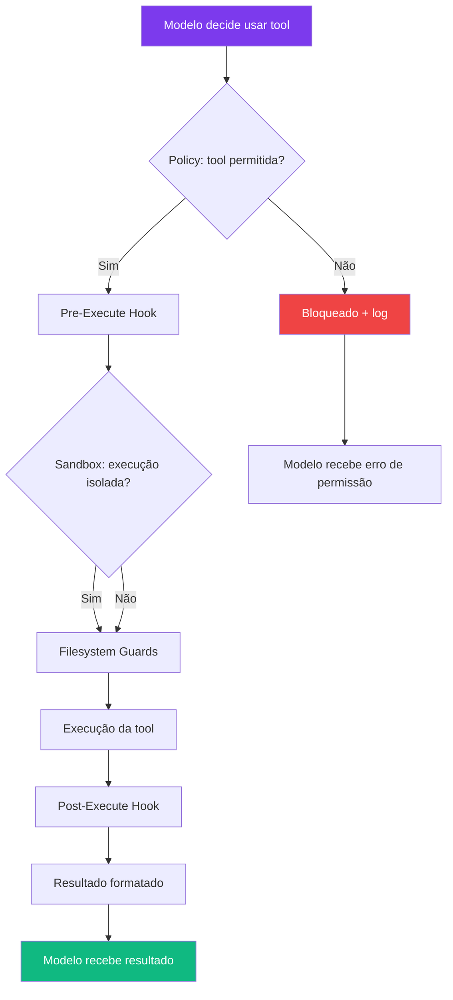

### Métricas de Performance

O DeepSeek Harness coleta métricas automaticamente para cada chamada de tool [4]:

| Métrica | Descrição | Importância |
|---------|-----------|-------------|
| Latência | Tempo total da chamada | Performance |
| Throughput | Chamadas por segundo | Capacidade |
| Taxa de erro | % de chamadas que falharam | Confiabilidade |
| Uso de VRAM | Pico de memória durante execução | Recursos |
| Tamanho do resultado | Bytes retornados | Eficiência |

## 3. Ilustra

### A Linha de Montagem da Oficina

Na sua oficina de agentes, o tool pipeline é como uma linha de montagem automatizada. Quando um cliente (o modelo) faz um pedido (decide usar uma tool), o pedido passa por uma série de estações antes de se tornar um produto final (ação executada) [5]:

**Estação 1 (Policy):** O inspetor verifica se o pedido é permitido. "Você quer furar uma parede? Tem autorização? É no seu terreno?" Se o pedido é bloqueado, ele é devolto imediatamente com uma explicação do porquê.

**Estação 2 (Pre-Execute):** O planejador ajusta os detalhes. "Você quer furar a 30cm do chão? Deixe eu marcar exatamente onde." Ele pode adicionar logs, modificar parâmetros, ou verificar se há conflitos com outros pedidos em andamento.

**Estação 3 (Sandbox):** A estação de isolamento. "Vou colocar a parede numa cabine isolada para que, se algo der errado, não afete a oficina inteira." O sandbox garante que a execução não pode acessar recursos fora do escopo permitido.

**Estação 4 (Guards):** O controle de qualidade. "Você só pode furar nesta parede específica, não na parede vizinha do vizinho." Os filesystem guards verificam que a ação está dentro dos limites permitidos.

**Estação 5 (Execução):** A furadeira faz o trabalho. É aqui que a ação realmente acontece — leitura de arquivo, execução de comando, chamada de API.

**Estação 6 (Post-Execute):** O acabamento. "Deixe eu lixar a borda e limpar a poeira antes de devolver." O resultado é processado, comprimido se necessário, e formatado para o modelo.

**Estação 7 (Observation):** O relatório. "Furo feito, 3cm de profundidade, sem danos à estrutura." O resultado é exibido ao agente e registrado para auditoria.

Cada estação existe para garantir que o produto final é seguro, preciso, e rastreável [5].

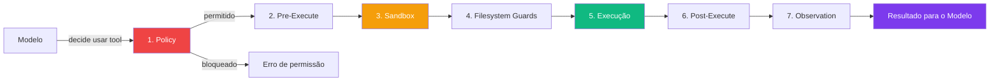

### A Segurança em Profundidade

O tool pipeline é um exemplo clássico de "defesa em profundidade" — a mesma estratégia usada em castelos medievais. Não é uma muralha alta que impede invasores, mas múltiplas muralhas, fosso, e portões. Se um invasor atravessa uma muralha, há outra atrás. Se atravessa a segunda, há um fosso. Se cruza o fosso, há um portão [6].

No DeepSeek Harness, se a policy falhar, o sandbox pega. Se o sandbox falhar, os filesystem guards pegam. Se os guards falharem, o post-execute hook pode bloquear o resultado. É redundância deliberada — não redundância acidental.

## 4. Técnica

### Configurando Policy Rules

```yaml
# dsh.config.yaml
tools:
  policy:
    # Bloquear comandos perigosos
    blocked:
      - "git push --force"
      - "rm -rf /"
      - "sudo *"
      - "chmod 777"
    
    # Permitir apenas em modo read
    read-only:
      - "filesystem:read"
      - "web:search"
    
    # Exigir aprovação humana
    require-approval:
      - "shell:execute"
      - "filesystem:write"
      - "git:push"
      - "git:reset"
```

### Configurando Filesystem Guards

```yaml
# dsh.config.yaml
sandbox:
  filesystem:
    # Permitir leitura em qualquer lugar
    read:
      - "/home/user/**"
      - "/tmp/**"
    
    # Permitir escrita apenas no projeto
    write:
      - "/home/user/projeto/**"
      - "/tmp/output/**"
    
    # Bloquear绝对amente
    deny:
      - "/etc/**"
      - "/root/**"
      - "/home/user/.ssh/**"
      - "/home/user/.aws/**"
```

### Hooks de Auditoria

```javascript
// plugin de auditoria
export default function auditPlugin(ctx) {
  ctx.on('tool:pre-execute', (event) => {
    console.log(`[AUDIT] ${event.tool} executada por ${event.session}`);
    console.log(`[AUDIT] Parâmetros: ${JSON.stringify(event.params)}`);
  });

  ctx.on('tool:post-execute', (event) => {
    console.log(`[AUDIT] ${event.tool} retornou ${event.result.length} chars`);
    console.log(`[AUDIT] Latência: ${event.latency}ms`);
  });

  ctx.on('tool:error', (event) => {
    console.log(`[AUDIT] ${event.tool} falhou: ${event.error}`);
  });
}
```

### Monitorando o Pipeline em Tempo Real

```bash
# Habilitar verbose mode
dsh --mode standard --verbose

# Output:
# [TOOL] policy: shell:execute -> permitido
# [TOOL] pre-execute: sandbox isolado ativado
# [TOOL] execute: ls -la /home/user/projeto
# [TOOL] post-execute: resultado comprimido de 2048 para 512 chars
# [TOOL] observation: resultado entregue ao modelo
```

## 5. Aplica

### O Agente que Apagou o Projeto

Um desenvolvedor configurou o DeepSeek Harness sem filesystem guards. O agente, ao tentar "limpar arquivos temporários", executou `rm -rf .` no diretório do projeto. O projeto inteiro — semanas de trabalho — foi apagado em segundos [7].

A causa raiz não foi o agente ser malicioso — foi a falta de guards. O modelo interpretou "limpar" como "remover tudo", e não havia nenhuma camada de proteção para impedir. O agente não tinha intenção destrutiva — ele apenas fez o que o modelo pediu, sem restrições.

### A Prática Correta

Sempre configure filesystem guards antes de usar o agente em projetos reais:

```yaml
# Configuração mínima de segurança
sandbox:
  filesystem:
    write:
      - "./src/**"
      - "./tests/**"
      - "./docs/**"
    deny:
      - "./.git/**"
      - "./node_modules/**"
      - "./.env"
```

E sempre habilite aprovação humana para ações destrutivas:

```yaml
tools:
  policy:
    require-approval:
      - "shell:execute"
      - "filesystem:write"
      - "git:*"
```

Regras de ouro:
1. **Nunca rode agentes com acesso total ao filesystem**
2. **Sempre teste em um diretório temporário primeiro**
3. **Mantenha backups antes de qualquer operação de agente**
4. **Use approval mode para qualquer coisa que você não pode desfazer**
5. **Monitore os logs regularmente**

## 6. Conclusão

Neste capítulo, você entendeu o tool pipeline completo — cada camada que transforma uma decisão do modelo em uma ação segura e rastreável. Policy, hooks, sandbox, filesystem guards, e observação formam um sistema de defesa em profundidade que protege tanto o sistema do usuário quanto a integridade do agente.

O tool pipeline não é apenas segurança — é também performance e usabilidade. Cada camada pode otimizar, comprimir, ou filtrar resultados para tornar a experiência do agente mais fluida.

No próximo capítulo, você vai explorar como o DeepSeek Harness gerencia sessões e estado — a memória de longo prazo que permite ao agente manter contexto entre conversas.

## 7. Referências Bibliográficas

[1] DEEPSEEK AI. *DeepSeek Harness developer preview: Everything is a plugin*. Disponível em: https://deepseek.com/harness/en/. Acesso em: 23 ago. 2026.

[2] MEDIUM (codetodeploy). *Explored DeepSeek Harness: How a Plugin-Native Agent Runtime Actually Works*. Disponível em: https://medium.com/codetodeploy/explored-deepseek-harness-how-a-plugin-native-agent-runtime-actually-works-7b815436a6b3. Acesso em: 23 ago. 2026.

[3] LINKEDIN (Tony Ren). *DeepSeek Harness: Agent Operating System*. Disponível em: https://www.linkedin.com/posts/tonyren_i-spent-the-evening-in-the-deepseek-harness-activity-7493848102076882944-GGXB. Acesso em: 23 ago. 2026.

[4] TOWARDS AI. *DeepSeek Harness Explained: When the AI Model is Just a Plugin*. Disponível em: https://pub.towardsai.net/deepseek-harness-explained-when-the-ai-model-is-just-a-plugin-16b2496f3d01. Acesso em: 23 ago. 2026.

[5] DEEPSEEKHARNESSAI. *Security Plugins for DeepSeek Harness*. Disponível em: https://deepseekharnessai.com/categories/security. Acesso em: 23 ago. 2026.

[6] HABR. *Inside DeepSeek Harness: Cordis, Session Events, Tool Pipelines*. Disponível em: https://habr.com/en/articles/1070958/. Acesso em: 23 ago. 2026.

[7] ZHANG, Jie et al. *When LLMs Meet Cybersecurity: A Systematic Literature Review*. In: arXiv, 2024. Disponível em: http://arxiv.org/abs/2405.03644. Acesso em: 23 ago. 2026.

[8] DEEPSEEK AI. *deepseek-harness/docs/architecture.md*. GitHub. Disponível em: https://github.com/deepseek-ai/deepseek-harness/blob/master/docs/architecture.md. Acesso em: 23 ago. 2026.

[9] DEEPSEEK AI. *deepseek-harness/docs/cordis-primer.md*. GitHub. Disponível em: https://github.com/deepseek-ai/deepseek-harness/blob/master/docs/cordis-primer.md. Acesso em: 23 ago. 2026.

[10] FLOATBOAT.AI. *Cordis — The Plugin Kernel Behind DeepSeek Harness*. Disponível em: https://floatboat.ai/blog/cordis-plugin-framework. Acesso em: 23 ago. 2026.

[11] AGENTATLAS. *Cordis Explained: How DeepSeek Harness's Plugin Framework Works*. Disponível em: https://agentatlas.org/blog/cordis-explained-how-deepseek-harness-plugin-framework-works/. Acesso em: 23 ago. 2026.

[12] MEDIUM (data-and-beyond). *Decoding DeepSeek Harness*. Disponível em: https://medium.com/data-and-beyond/decoding-deepseek-harness-the-open-source-runtime-behind-composable-ai-agents-c2299e992870. Acesso em: 23 ago. 2026.

[13] TOWARDS AI. *DeepSeek Harness vs Claude Code: A Plugin Architecture Teardown*. Disponível em: https://pub.towardsai.net/deepseek-harness-vs-claude-code-a-plugin-architecture-teardown-da3c916f3af1. Acesso em: 23 ago. 2026.

[14] ATLASCLOUD. *DeepSeek Harness Plugins: The 7 Worth It*. Disponível em: https://www.atlascloud.ai/blog/tips/deepseek-harness-plugins. Acesso em: 23 ago. 2026.

[15] COMPOSIO. *Best plugins for DeepSeek Harness*. Disponível em: https://composio.dev/content/best-deepseek-harness-plugins. Acesso em: 23 ago. 2026.

[16] MINDSTUDIO. *What Is DeepSeek Harness? The Plug-In Coding Agent Explained*. Disponível em: https://www.mindstudio.ai/blog/deepseek-harness-agentic-coding. Acesso em: 23 ago. 2026.

[17] YOUTUBE. *NEW Deepseek Agent Harness EXPLAINED*. Disponível em: https://www.youtube.com/watch?v=Hpw4fAHlHDw. Acesso em: 23 ago. 2026.

[18] YOUTUBE. *Every Deepseek Harness Concept Explained*. Disponível em: https://www.youtube.com/watch?v=24UCnAs7MVg. Acesso em: 23 ago. 2026.

[19] DEEPSEEKHARNESSAI. *Security Plugins for DeepSeek Harness*. Disponível em: https://deepseekharnessai.com/categories/security. Acesso em: 23 ago. 2026.

[20] EXPLOREX.AI. *DeepSeek Harness v0.1: Run the Plugin-First Agent Stack*. Disponível em: https://explainx.ai/blog/deepseek-harness-v0-1-plugin-first-agent-stack-august-2026. Acesso em: 23 ago. 2026.

# Capítulo 7: Sessoes e Estado: Memoria do Agente

## 1. Introdução

No Capítulo 6, você viu como o agente executa ações através do tool pipeline. Mas e a memória? Quando você conversa com um agente por 30 minutos, ele lembra do que falou no início? O DeepSeek Harness resolve isso com um sistema de sessões duráveis e eventos tipados que permitem resume, fork e replay de qualquer ponto da conversa [1].

A memória é o que transforma um assistente de "uma vez" em um parceiro de trabalho contínuo. Sem memória, cada conversa começa do zero. Com memória, o agente pode retomar de onde parou, aprender com interações anteriores, e manter contexto ao longo de dias ou semanas [2].

Neste capítulo, você vai configurar sessões que persistem entre reinicializações, entender os eventos de sessão (turn, step, message), e descobrir como manipular o histórico de execução do agente — seja para continuar de onde parou, bifurcar uma conversa, ou revisitar uma decisão específica.

## 2. Explica

### O que são Session Events?

Session events são eventos duráveis que marcam cada momento significativo de uma sessão do agente [3]:

- **Turn Boundary:** Marca o início e fim de um turno completo (mensagem do usuário + resposta do agente + tools executadas). É a unidade fundamental de uma conversa.
- **Step Boundary:** Marca cada passo dentro de um turno — quando o agente decide usar uma tool, quando termina de processar, etc. Um turno pode ter múltiplos steps.
- **User Message:** A mensagem enviada pelo usuário. É a entrada que dispara o turno.
- **Assistant Content:** A resposta gerada pelo modelo. Pode incluir texto, chamadas de tool, ou ambos.
- **Tool Call:** Cada chamada de ferramenta feita pelo agente, com parâmetros e resultado.

Esses eventos são armazenados de forma append-only — nunca são modificados depois de gravados. Isso garante rastreabilidade total: você pode revisitar qualquer momento da sessão e ver exatamente o que aconteceu [1].

### Persistência de Estado

O estado da sessão é persistido em disco. Quando você reinicia o harness, o agente pode retomar exatamente de onde parou, com todo o contexto anterior disponível [4].

Isso é fundamental para tarefas longas. Imagine que você está refatorando um código complexo com o agente. Depois de 2 horas, o computador reinicia. Sem persistência, todo o contexto se perde. Com persistência, o agente recarrega a sessão e continua como se nada tivesse acontecido.

A persistência funciona em três níveis:

1. **Memória de curto prazo:** O contexto da conversa atual. Disponível imediatamente, mas perdido quando a sessão termina.

2. **Memória de médio prazo:** Sessões salvas em disco. Podem ser retomadas dias depois, mas ocupam espaço em disco.

3. **Memória de longo prazo:** RAG e RTK (Run-Time Knowledge). Informações que persistem mesmo quando a sessão é deletada.

### Resume, Fork, Search e Replay

O DeepSeek Harness oferece quatro operações para manipular o histórico de sessão [1]:

**Resume:** Continuar uma sessão anterior. O agente recarrega todo o contexto e continua de onde parou. Essencial para tarefas que se estendem por múltiplas sessões de trabalho.

**Fork:** Bifurcar uma sessão. Cria uma cópia da sessão em um ponto específico, permitindo explorar um caminho diferente sem perder o original. É como uma branch no Git — você pode experimentar sem comprometer o caminho principal.

**Search:** Buscar no histórico de eventos. Encontrar todos os momentos em que uma ferramenta específica foi chamada, ou quando uma determinada palavra-chave apareceu. Essencial para debug e auditoria.

**Replay:** Re-executar uma sessão do início. Útil para debug e para validar que o agente produz os mesmos resultados com as mesmas entradas [3].

### Sessões e Segurança

Sessões duráveis trazem implicações de segurança importantes [5]:

- **Dados sensíveis:** Sessões podem conter chaves de API, senhas, ou dados confidenciais. É essencial criptografar o armazenamento.
- **Acesso não autorizado:** Se alguém acessar o diretório de sessões, pode ler todo o histórico de conversas.
- **Tamanho:** Sessões longas podem ocupar gigabytes de disco.

## 3. Ilustra

### O Diário de Bordo da Oficina

Pense nas sessões como um diário de bordo da sua oficina. Cada vez que você trabalha com o agente, ele escreve no diário: "Às 14:32, o Engenheiro de Agentes pediu para refatorar a função X. Executei 3 tools: li o arquivo, fiz mudanças, e rodei os testes. Resultado: 2 testes falharam, corrigi, agora passa." [6]

Quando você volta no dia seguinte, o agente lê o diário e sabe exatamente onde parou. Se você quer explorar uma abordagem diferente, pode "fotocopiar" o diário até aquele ponto e começar um novo caderno — isso é o fork. Se precisa encontrar quando vocês discutiram sobre a função Y, pode pesquisar no diário — isso é o search.

O replay é como reler o diário inteiro do início, verificando se cada passo foi executado corretamente. É a forma mais completa de auditoria — você pode ver exatamente o que o agente pensou, fez, e decidiu em cada momento.

A persistência é como ter um diário que nunca se perde. Mesmo que a oficina feche (computador desligue), o diário continua lá, pronto para ser retomado quando a oficina abrir novamente.

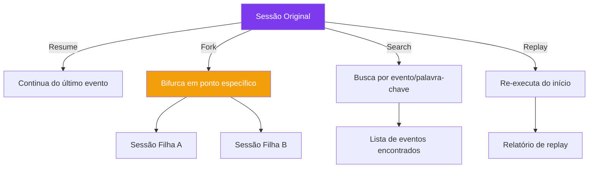

## 4. Técnica

### Criando e Gerenciando Sessões

```bash
# Criar nova sessão
dsh session create --name "refatoracao-api"

# Listar sessões existentes
dsh session list
# NAME                CREATED            STATUS
# refatoracao-api     2026-08-23 14:30   active
# debug-cache         2026-08-22 09:15   paused

# Retomar sessão anterior
dsh session resume refatoracao-api

# Bifurcar sessão
dsh session fork refatoracao-api --point turn:15 --name "experimento-alternativo"

# Deletar sessão antiga
dsh session delete debug-cache
```

### Visualizando Eventos

```bash
# Listar eventos da sessão atual
dsh session events --last 10
# EVENT       TIMESTAMP           DETAILS
# turn:start  2026-08-23 14:32:01  turn_id: abc123
# user:msg    2026-08-23 14:32:01  "Refatore a função X"
# tool:call   2026-08-23 14:32:05  filesystem:read src/x.js
# tool:result 2026-08-23 14:32:06  2048 chars lidos
# tool:call   2026-08-23 14:32:10  filesystem:write src/x.js
# tool:result 2026-08-23 14:32:11  arquivo atualizado
# turn:end    2026-08-23 14:32:15  3 tools executadas

# Buscar eventos por ferramenta
dsh session search --tool "shell:execute"
# Encontra todos os momentos em que o agente executou comandos no shell

# Buscar por palavra-chave
dsh session search --keyword "docker"
# Encontra menções a "docker" em qualquer evento
```

### Configurando Persistência

```yaml
# dsh.config.yaml
session:
  storage:
    # Armazenar sessões em disco
    type: file
    path: ~/.dsh/sessions/
    
    # Comprimir sessões antigas (>7 dias)
    compress: true
    
    # Limitar tamanho por sessão
    max-size: "100MB"
    
    # Auto-save a cada N eventos
    auto-save: 10
```

### Exportando e Importando Sessões

```bash
# Exportar sessão para compartilhar
dsh session export refatoracao-api --format json --output sessao.json

# Importar sessão de outro computador
dsh session import sessao.json --name "continuacao"

# Exportar todas as sessões (backup)
dsh session export --all --output backup-sessoes.tar.gz
```

## 5. Aplica

### A Sessão que Sumiu

Um desenvolvedor estava trabalhando em uma refatoração complexa com o agente. Depois de 3 horas de sessão, fechou o terminal sem pensar. Ao reabrir, percebeu que a sessão não foi salva automaticamente — o harness estava em modo ephemeral (sem persistência configurada) [4].

Ele perdeu todo o contexto: as decisões de arquitetura, as tools executadas, os erros encontrados e corrigidos. Teve que recomeçar do zero, dessa vez gastando 20 minutos para configurar persistência antes de começar a trabalhar.

### A Prática Correta

Sempre configure persistência antes de iniciar qualquer sessão de trabalho real:

```yaml
# Configuração mínima recomendada
session:
  storage:
    type: file
    path: ~/.dsh/sessions/
    auto-save: 5  # Salvar a cada 5 eventos
```

Regras para gerenciar sessões:
1. **Nomeie suas sessões descritivamente** — "refatoracao-api" é melhor que "sessao1"
2. **Faça fork antes de experimentar** — preserve o caminho original
3. **Exporte sessões importantes** — backup é segurança
4. **Limpe sessões antigas regularmente** — disco não é infinito
5. **Criptografe sessões com dados sensíveis** — segurança primeiro

## 6. Conclusão

Neste capítulo, você configurou sessões duráveis que persistem entre reinicializações, entendeu os eventos de sessão (turn, step, message, tool call) e aprendeu a manipular o histórico com resume, fork, search e replay. A memória de longo prazo é o que transforma um agente de "assistent de uma vez" em um parceiro de trabalho contínuo.

No próximo capítulo, você vai explorar sandboxes e segurança — como isolar o agente do sistema do usuário para garantir que ele só faz o que deveria.

## 7. Referências Bibliográficas

[1] DEEPSEEK AI. *DeepSeek Harness developer preview: Everything is a plugin*. Disponível em: https://deepseek.com/harness/en/. Acesso em: 23 ago. 2026.

[2] HABR. *Inside DeepSeek Harness: Cordis, Session Events, Tool Pipelines*. Disponível em: https://habr.com/en/articles/1070958/. Acesso em: 23 ago. 2026.

[3] DEEPSEEK AI. *deepseek-harness/docs/architecture.md*. GitHub. Disponível em: https://github.com/deepseek-ai/deepseek-harness/blob/master/docs/architecture.md. Acesso em: 23 ago. 2026.

[4] LINKEDIN (Richard Van Ngo Tran). *DeepSeek Harness v0.1 Released*. Disponível em: https://www.linkedin.com/posts/richard-van-ngo-tran-8095441a4_deepseek-harness-v01-is-now-available-in-activity-7493832260652228608-E39a. Acesso em: 23 ago. 2026.

[5] DEEPSEEK AI. *deepseek-harness/docs/cordis-primer.md*. GitHub. Disponível em: https://github.com/deepseek-ai/deepseek-harness/blob/master/docs/cordis-primer.md. Acesso em: 23 ago. 2026.

[6] TOWARDS AI. *DeepSeek Harness Explained: When the AI Model is Just a Plugin*. Disponível em: https://pub.towardsai.net/deepseek-harness-explained-when-the-ai-model-is-just-a-plugin-16b2496f3d01. Acesso em: 23 ago. 2026.

[7] FLOATBOAT.AI. *Cordis — The Plugin Kernel Behind DeepSeek Harness*. Disponível em: https://floatboat.ai/blog/cordis-plugin-framework. Acesso em: 23 ago. 2026.

[8] AGENTATLAS. *Cordis Explained*. Disponível em: https://agentatlas.org/blog/cordis-explained-how-deepseek-harness-plugin-framework-works/. Acesso em: 23 ago. 2026.

[9] MEDIUM (data-and-beyond). *Decoding DeepSeek Harness*. Disponível em: https://medium.com/data-and-beyond/decoding-deepseek-harness-the-open-source-runtime-behind-composable-ai-agents-c2299e992870. Acesso em: 23 ago. 2026.

[10] TOWARDS AI. *DeepSeek Harness vs Claude Code*. Disponível em: https://pub.towardsai.net/deepseek-harness-vs-claude-code-a-plugin-architecture-teardown-da3c916f3af1. Acesso em: 23 ago. 2026.

[11] ATLASCLOUD. *DeepSeek Harness Plugins: The 7 Worth It*. Disponível em: https://www.atlascloud.ai/blog/tips/deepseek-harness-plugins. Acesso em: 23 ago. 2026.

[12] COMPOSIO. *Best plugins for DeepSeek Harness*. Disponível em: https://composio.dev/content/best-deepseek-harness-plugins. Acesso em: 23 ago. 2026.

[13] MINDSTUDIO. *What Is DeepSeek Harness?*. Disponível em: https://www.mindstudio.ai/blog/deepseek-harness-agentic-coding. Acesso em: 23 ago. 2026.

[14] LINKEDIN (Tony Ren). *DeepSeek Harness: Agent Operating System*. Disponível em: https://www.linkedin.com/posts/tonyren_i-spent-the-evening-in-the-deepseek-harness-activity-7493848102076882944-GGXB. Acesso em: 23 ago. 2026.

[15] YOUTUBE. *Every Deepseek Harness Concept Explained*. Disponível em: https://www.youtube.com/watch?v=24UCnAs7MVg. Acesso em: 23 ago. 2026.

[16] YOUTUBE. *NEW Deepseek Agent Harness EXPLAINED*. Disponível em: https://www.youtube.com/watch?v=Hpw4fAHlHDw. Acesso em: 23 ago. 2026.

[17] EXPLOREX.AI. *DeepSeek Harness v0.1*. Disponível em: https://explainx.ai/blog/deepseek-harness-v0-1-plugin-first-agent-stack-august-2026. Acesso em: 23 ago. 2026.

[18] MEDIUM (kaliarch). *DeepSeek Harness: When the Agent Loop Itself Becomes a Plugin*. Disponível em: https://medium.com/@kaliarch/deepseek-harness-when-the-agent-loop-itself-becomes-a-plugin-7fad0aa9de1c. Acesso em: 23 ago. 2026.

[19] DEEPSEEKHARNESSAI. *Security Plugins for DeepSeek Harness*. Disponível em: https://deepseekharnessai.com/categories/security. Acesso em: 23 ago. 2026.

[20] SPRINGBRAND. *DeepSeek Harness (dsh): Everything Is a Plugin*. Disponível em: https://springbrand.ai/deepseek-harness. Acesso em: 23 ago. 2026.

# Capítulo 8: Sandbox e Seguranca: Isolando o Agente

## 1. Introdução

No Capítulo 7, você configurou sessões duráveis que mantêm o contexto entre conversas. Mas persistência traz um risco: se o agente pode lembrar, ele também pode agir. E quando um agente tem acesso ao sistema do usuário, a segurança passa a ser uma preocupação central [1].

O sandbox não é opcional — é um requisito fundamental para qualquer uso sério do DeepSeek Harness. Sem sandbox, um agente com acesso total ao sistema pode apagar arquivos, acessar chaves de API, ou executar comandos destrutivos. Com sandbox, o agente opera em um ambiente isolado onde seus erros não têm consequências irreversíveis [2].

Neste capítulo, você vai configurar sandboxes com Git worktree para isolar cada sessão do agente, implementar camadas de isolamento de filesystem e rede, e configurar plugins de segurança que garantem que o agente só faz o que deveria.

## 2. Explica

### O que é um Sandbox?

Um sandbox é um ambiente isolado onde o agente pode executar ações sem afetar o sistema do usuário. Pense nele como uma cabine de vidro: o agente pode ver e interagir com o que está dentro da cabine, mas não pode alcançar o que está fora [3].

O DeepSeek Harness oferece três níveis de sandboxing:

1. **Git Worktree:** Cada sessão do agente opera em seu próprio working directory e índice Git, compartilhando apenas o histórico de commits. Isso permite que múltiplas sessões trabalhem no mesmo repositório sem conflitos [4].

2. **Filesystem Sandbox:** Controle granular de quais diretórios o agente pode ler e escrever. Você pode permitir acesso ao diretório do projeto mas bloquear acesso a arquivos de configuração sensíveis.

3. **Shell Sandbox:** Isolamento de comandos shell. O agente pode executar comandos, mas apenas em um ambiente restrito com variáveis de ambiente controladas e acesso limitado à rede.

### Git Worktrees: Isolamento por Branch

Git worktrees são o mecanismo de isolamento mais elegante do DeepSeek Harness. Cada sessão cria um worktree separado — um diretório de trabalho independente com seu próprio índice Git [4].

Isso significa que:
- Sessões diferentes podem modificar os mesmos arquivos sem conflitos
- Cada sessão tem seu próprio branch, preservando o histórico
- No final, os branches podem ser mergeados ou descartados independente­mente
- O repositório compartilhado mantém a integridade

```bash
# O DeepSeek Harness cria worktrees automaticamente
# Mas você pode criar manualmente:
git worktree add ../sessao-nova feature/nova-funcionalidade
cd ../sessao-nova
# Esta é uma cópia isolada do repositório
```

### Security Plugins

O DeepSeek Harness tem plugins dedicados a segurança [5]:

- **Approvals Plugin:** Exige aprovação humana para ações destrutivas
- **Secrets Plugin:** Previne que o agente acesse ou exponha chaves de API
- **Audit Plugin:** Registra todas as ações do log para auditoria posterior
- **Rate Limit Plugin:** Limita a frequência de chamadas de tools

### Criptografia de Sessões

Sessões duráveis podem conter dados sensíveis. O DeepSeek Harness suporta criptografia de sessões [6]:

```yaml
session:
  storage:
    encryption:
      enabled: true
      algorithm: "aes-256-gcm"
      key: "<chave-de-criptografia>"
```

## 3. Ilustra

### A Cabine de Testes da Oficina

Na sua oficina de agentes, o sandbox é como uma cabine de testes isolada. Quando você quer testar uma nova ferramenta ou configuração, não a testa na bancada principal — coloca na cabine de testes, que tem seu próprio suprimento de energia, suas próprias ferramentas, e paredes que impedem que qualquer acidente afete a oficina inteira [7].

O Git worktree é como ter uma cópia exata da bancada em outro cômodo. Você pode martelar, soldar, e pintar na cópia sem sujar a original. Quando estiver satisfeito com o resultado, pode trazer as peças de volta para a bancada principal (merge) ou simplesmente descartar a cópia.

Os security plugins são os extintores de incêndio e os kits de primeiros socorros espalhados pela oficina. Esperamos nunca precisar deles, mas quando precisamos, é bom saber que estão lá. A criptografia é como um cofre onde você guarda os diários mais sensíveis — mesmo que alguém invada a oficina, não consegue ler o que está trancado.

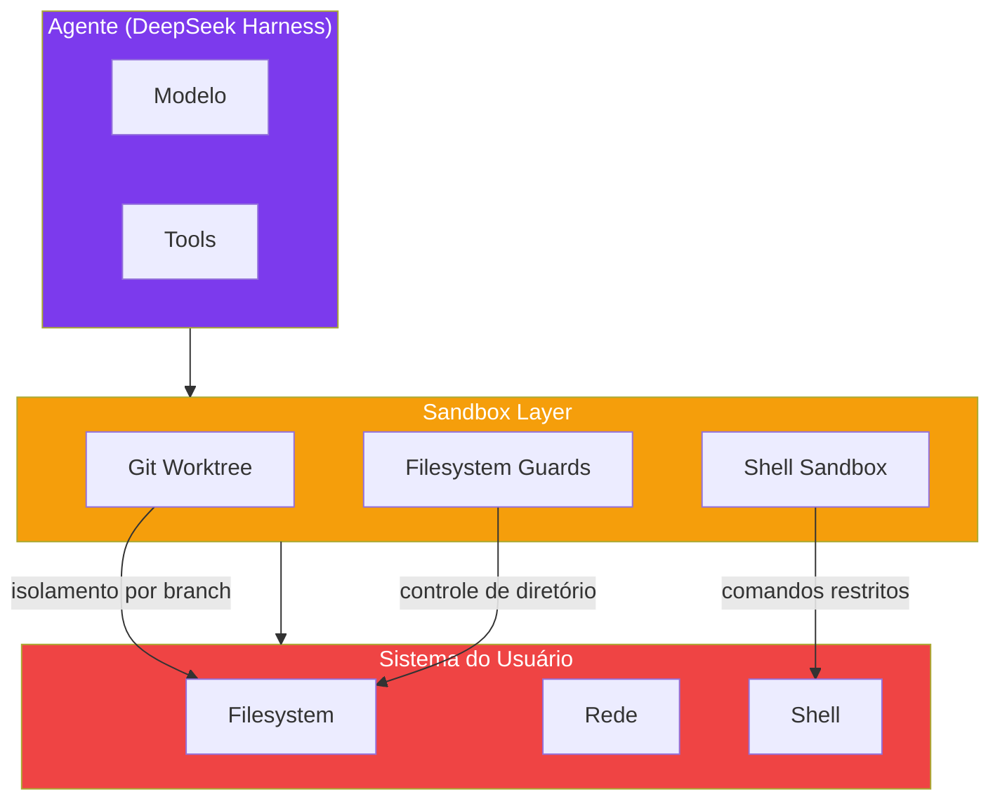

## 4. Técnica

### Configurando Git Worktrees

```bash
# Configurar o harness para usar worktrees
dsh config set sandbox.worktree.enabled true
dsh config set sandbox.worktree.path ~/.dsh/worktrees/

# Criar sessão com worktree isolado
dsh session create --name "feature-nova" --worktree

# Verificar que o worktree foi criado
git worktree list
# /home/user/projeto          abc1234 [main]
# /home/user/.dsh/worktrees/feature-nova  def5678 [feature-nova]
```

### Configurando Filesystem Guards

```yaml
# dsh.config.yaml
sandbox:
  filesystem:
    # Diretório do projeto — leitura e escrita
    allow:
      - path: "./src/**"
        permissions: ["read", "write"]
      - path: "./tests/**"
        permissions: ["read", "write"]
      - path: "./docs/**"
        permissions: ["read", "write"]
    
    # Diretórios sensíveis — apenas leitura
    read-only:
      - path: "./.env.example"
      - path: "./config/*.json"
    
    # Diretórios bloqueados
    deny:
      - path: "./.git/**"
      - path: "./node_modules/**"
      - path: "~/.ssh/**"
      - path: "~/.aws/**"
```

### Configurando Security Plugins

```bash
# Instalar plugins de segurança
dsh plugins install @deepseek/approvals
dsh plugins install @deepseek/audit
dsh plugins install @deepseek/secrets

# Configurar aprovações
dsh config set security.approvals.enabled true
dsh config set security.approvals.require-for:
  - "shell:execute"
  - "filesystem:delete"
  - "git:push"
  - "git:reset"
```

### Rodando com Segurança

```bash
# Iniciar com sandbox habilitado
dsh --mode standard --sandbox

# Output:
# 🔒 Sandbox ativo
# 📁 Filesystem: ./src/** (r/w), ./tests/** (r/w)
# 🚫 Bloqueado: ~/.ssh/**, ~/.aws/**
# ✅ Approvals: shell:execute, filesystem:delete
# 
# dsh> Modifique a função X
# [APPROVAL] shell:execute: "ls -la src/"
# Aprovar? (s/n): s
# [APPROVAL] filesystem:write: "src/x.js"
# Aprovar? (s/n): s
```

## 5. Aplica

### O Agente que Acessou o SSH

Um desenvolvedor rodou o DeepSeek Harness sem sandbox. O agente, ao buscar por "configurações de deploy", encontrou o arquivo `~/.ssh/id_rsa` e tentou lê-lo. O conteúdo da chave privada apareceu na tela do terminal — e potencialmente foi enviado para o modelo de linguagem como contexto [5].

O impacto: se o modelo era cloud (API da DeepSeek), a chave privada do servidor de produção estava potencialmente exposta. A correção: revogar a chave imediatamente, gerar uma nova, e configurar filesystem guards para bloquear acesso a `~/.ssh/**`.

### A Prática Correta

Checklist de segurança mínima para qualquer instalação do DeepSeek Harness:

```yaml
# dsh.config.yaml — configuração mínima de segurança
sandbox:
  worktree:
    enabled: true
  filesystem:
    deny:
      - "~/.ssh/**"
      - "~/.aws/**"
      - "~/.config/gcloud/**"
      - "~/.kube/**"
      - "~/.env"
      - "~/.bash_history"

security:
  approvals:
    enabled: true
    require-for:
      - "shell:execute"
      - "git:push"
      - "git:reset"
      - "filesystem:delete"
  
  audit:
    enabled: true
    log-path: ~/.dsh/audit.log
```

Regras inegociáveis:
1. **NUNCA rode agentes com acesso total ao sistema**
2. **Sempre bloqueie diretórios sensíveis (.ssh, .aws, .env)**
3. **Habilite approvals para ações destrutivas**
4. **Audite regularmente os logs de ação**
5. **Use worktrees para isolar sessões de trabalho**
6. **Criptografe sessões com dados sensíveis**

## 6. Conclusão

Neste capítulo, você configurou sandboxes com Git worktree para isolar sessões, implementou filesystem guards para controle granular de acesso, e instalou plugins de segurança para approvals e auditoria. O sandbox não é opcional — é um requisito fundamental para qualquer uso sério do DeepSeek Harness.

Você agora tem todos os componentes fundamentais montados: harness instalado, modelo escolhido, engine configurado, plugins gerenciados, pipeline de ferramentas compreendido, sessões persistentes, e sandbox seguro. A oficina está pronta para o próximo nível: construir peças personalizadas. No Capítulo 9, você vai criar seu primeiro plugin do zero.

## 7. Referências Bibliográficas

[1] DEEPSEEK AI. *DeepSeek Harness developer preview*. Disponível em: https://deepseek.com/harness/en/. Acesso em: 23 ago. 2026.

[2] DEEPSEEKHARNESSAI. *Security Plugins for DeepSeek Harness*. Disponível em: https://deepseekharnessai.com/categories/security. Acesso em: 23 ago. 2026.

[3] MINDSTUDIO. *Git Worktrees for AI Coding*. Disponível em: https://www.mindstudio.ai/blog/git-worktrees-parallel-ai-coding-agents. Acesso em: 23 ago. 2026.

[4] ATLASCLOUD. *DeepSeek Harness Plugins: The 7 Worth It*. Disponível em: https://www.atlascloud.ai/blog/tips/deepseek-harness-plugins. Acesso em: 23 ago. 2026.

[5] TOWARDS AI. *DeepSeek Harness vs Claude Code*. Disponível em: https://pub.towardsai.net/deepseek-harness-vs-claude-code-a-plugin-architecture-teardown-da3c916f3af1. Acesso em: 23 ago. 2026.

[6] DEEPSEEK AI. *deepseek-harness/docs/architecture.md*. GitHub. Disponível em: https://github.com/deepseek-ai/deepseek-harness/blob/master/docs/architecture.md. Acesso em: 23 ago. 2026.

[7] HABR. *Inside DeepSeek Harness*. Disponível em: https://habr.com/en/articles/1070958/. Acesso em: 23 ago. 2026.

[8] AUGMENT CODE. *How to Use Git Worktrees for Parallel AI Agent Execution*. Disponível em: https://www.augmentcode.com/guides/git-worktrees-parallel-ai-agent-execution. Acesso em: 23 ago. 2026.

[9] UPSUN. *Git worktrees for parallel AI coding agents*. Disponível em: https://developer.upsun.com/posts/ai/git-worktrees-for-parallel-ai-coding-agents. Acesso em: 23 ago. 2026.

[10] ZYLOS.AI. *Git Worktree Isolation Patterns for Parallel AI Agent Development*. Disponível em: https://zylos.ai/research/2026-02-22-git-worktree-parallel-ai-development/. Acesso em: 23 ago. 2026.

[11] PENLIGENT.AI. *Git Worktrees Need Runtime Isolation for Parallel AI Agent Development*. Disponível em: https://www.penligent.ai/hackinglabs/git-worktrees-need-runtime-isolation-for-parallel-ai-agent-development/. Acesso em: 23 ago. 2026.

[12] MEDIUM (mabd.dev). *Git worktrees: the secret weapon for running multiple AI coding agents in parallel*. Disponível em: https://medium.com/@mabd.dev/git-worktrees-the-secret-weapon-for-running-multiple-ai-coding-agents-in-parallel-e9046451eb96. Acesso em: 23 ago. 2026.

[13] UNDERSTANDINGDATA. *Git Worktrees for Parallel Development: 3x Throughput*. Disponível em: https://understandingdata.com/posts/git-worktrees-parallel-dev/. Acesso em: 23 ago. 2026.

[14] YOUTUBE. *Run Multiple AI Agents in Parallel (Claude Code Tutorial)*. Disponível em: https://www.youtube.com/watch?v=n35KalqEwJc. Acesso em: 23 ago. 2026.

[15] ALEXLAVAEE. *Designing the Multi-Agent Development Environment*. Disponível em: https://alexlavaee.me/blog/parallel-agent-sessions-infrastructure-gap/. Acesso em: 23 ago. 2026.

[16] DEEPSEEK AI. *deepseek-harness/docs/cordis-primer.md*. GitHub. Disponível em: https://github.com/deepseek-ai/deepseek-harness/blob/master/docs/cordis-primer.md. Acesso em: 23 ago. 2026.

[17] FLOATBOAT.AI. *Cordis — The Plugin Kernel*. Disponível em: https://floatboat.ai/blog/cordis-plugin-framework. Acesso em: 23 ago. 2026.

[18] MEDIUM (kaliarch). *DeepSeek Harness: When the Agent Loop Itself Becomes a Plugin*. Disponível em: https://medium.com/@kaliarch/deepseek-harness-when-the-agent-loop-itself-becomes-a-plugin-7fad0aa9de1c. Acesso em: 23 ago. 2026.

[19] LINKEDIN (Tony Ren). *DeepSeek Harness: Agent Operating System*. Disponível em: https://www.linkedin.com/posts/tonyren_i-spent-the-evening-in-the-deepseek-harness-activity-7493848102076882944-GGXB. Acesso em: 23 ago. 2026.

[20] YOUTUBE. *Every Deepseek Harness Concept Explained*. Disponível em: https://www.youtube.com/watch?v=24UCnAs7MVg. Acesso em: 23 ago. 2026.

# Capítulo 9: Criando seu Primeiro Plugin personalizado

## 1. Introdução

No Capítulo 8, você configurou sandboxes e segurança. A oficina está segura. Agora é hora de começar a fabricar peças próprias. Neste capítulo, você vai desenvolver um plugin do zero para o DeepSeek Harness — desde a estrutura de projeto até a publicação no hub [1].

Até agora, você usou peças que vieram de fábrica — plugins oficiais do DeepSeek. Criar seu primeiro plugin personalizado é como fabricar sua primeira peça na oficina. Você pega um bloco de metal bruto (um conceito), usa as ferramentas da oficina (Node.js, APIs do Cordis), e molda uma peça que se encaixa perfeitamente no sistema [2].

Ao final, você terá um plugin funcional instalado no harness, e o conhecimento para criar qualquer ferramenta personalizada que precisar. É o momento em que você para de ser um usuário e se torna um construtor.

## 2. Explica

### Estrutura de um Plugin

Todo plugin do DeepSeek Harness segue uma estrutura padrão que facilita integração e manutenção [3]:

```
meu-plugin/
├── package.json          # Metadados e configuração Cordis
├── index.js              # Ponto de entrada principal
├── README.md             # Documentação
└── test/                 # Testes
    └── index.test.js
```

O `package.json` é o contrato do plugin. Ele declara:
- **name**: identificador único no hub
- **version**: versão semântica (semver)
- **cordis.provides**: serviços que este plugin oferece
- **cordis.requires**: serviços que ele precisa de outros plugins
- **cordis.lifecycle**: callbacks para ready/dispose

### Interfaces e Providers

Um plugin pode oferecer três tipos de serviços [4]:

1. **Tools:** Ferramentas que o agente pode chamar. Cada tool tem um schema JSON que define parâmetros e retorno. É o tipo mais comum — cada tool é uma ação que o agente pode executar no mundo real.

2. **Services:** Serviços internos que outros plugins podem consumir. Não aparecem diretamente para o agente, mas são usados por plugins vizinhos. Exemplos: cache, logging, métricas.

3. **Providers:** provedores de implementação. Quando um plugin declara `provides: ["shell"]`, ele está dizendo que implementa o serviço `shell` — outros plugins que dependem de `shell` vão consumir essa implementação.

### Testes e Publicação

Antes de publicar, todo plugin deve passar por testes [1]:

```bash
# Rodar testes do plugin
npm test

# Verificar compatibilidade com o harness
dsh plugins lint meu-plugin

# Testar localmente antes de publicar
dsh plugins install ./meu-plugin --dev
```

A publicação no hub segue o padrão npm:

```bash
# Publicar no hub
npm publish --access public

# Ou, para plugins privados
npm publish --access restricted
```

### Ciclo de Vida dos Plugins

Todo plugin passa por três estágios [3]:

1. **Ready:** O plugin é carregado e registrado. Ele declara seus serviços e efeitos.
2. **Fork:** Quando uma sessão é clonada, o plugin é bifurcado.
3. **Dispose:** Quando o plugin é removido, ele executa cleanup.

## 3. Ilustra

### A Primeira Peça Fabricada

Até agora, você usou peças que vieram de fábrica — plugins oficiais do DeepSeek. Criar seu primeiro plugin personalizado é como fabricar sua primeira peça na oficina [5].

A primeira peça sempre sai imperfeita — talvez o encaixe não seja limpo, talvez o acabamento seja grosseiro. Mas funciona. E uma vez que você sabe moldar uma peça, pode moldar qualquer outra. É a habilidade fundamental que transforma um operário em um mestre de oficina.

O teste é como inspecionar a peça na bancada de medições. Se ela se encaixa, se funciona, se não vaza — está pronta para uso. Se não, você ajusta e tenta novamente. É um ciclo de fabricação → teste → ajuste que se repete até a peça ficar perfeita.


## 4. Técnica

### Criando o Plugin: Contador de Repositórios

Vamos criar um plugin que conta repositórios Git em um diretório e retorna estatísticas:

```bash
# Criar estrutura
mkdir repo-stats-plugin
cd repo-stats-plugin
npm init -y
```

```json
// package.json
{
  "name": "@meu-usuario/repo-stats",
  "version": "0.1.0",
  "description": "Plugin que conta repositórios Git e retorna estatísticas",
  "main": "index.js",
  "keywords": ["deepseek-harness", "plugin", "git"],
  "cordis": {
    "provides": ["tool"],
    "requires": ["filesystem", "shell"],
    "lifecycle": {
      "ready": "onReady",
      "dispose": "onDispose"
    }
  },
  "devDependencies": {
    "vitest": "^1.0.0"
  }
}
```

```javascript
// index.js
import { execSync } from 'child_process';

export default function repoStatsPlugin(ctx) {
  const fs = ctx.service('filesystem');
  const shell = ctx.service('shell');

  ctx.service('repo-stats', {
    async execute({ directory }) {
      // Verificar se o diretório existe
      const exists = await fs.exists(directory);
      if (!exists) {
        return { error: `Diretório não encontrado: ${directory}` }
      }

      // Contar repositórios Git
      const result = shell.execute(`find ${directory} -name ".git" -type d`);
      const repos = result.split('\n').filter(line => line.trim());

      // Coletar stats de cada repositório
      const stats = repos.map(repo => {
        const repoPath = repo.replace('/.git', '');
        const name = repoPath.split('/').pop();
        
        try {
          const commits = shell.execute(`git -C ${repoPath} rev-list --count HEAD`);
          const branches = shell.execute(`git -C ${repoPath} branch -r | wc -l`);
          const lastCommit = shell.execute(`git -C ${repoPath} log -1 --format="%ai"`);
          
          return {
            name,
            path: repoPath,
            commits: parseInt(commits.trim()),
            branches: parseInt(branches.trim()),
            lastCommit: lastCommit.trim()
          };
        } catch (e) {
          return { name, path: repoPath, error: e.message };
        }
      });

      return {
        totalRepos: repos.length,
        repos: stats,
        scanDirectory: directory
      };
    }
  });

  ctx.effect(() => {
    console.log('[repo-stats] Plugin instalado');
    return () => {
      console.log('[repo-stats] Plugin removido');
    };
  });
}
```

### Testando o Plugin

```bash
# Instalar localmente
dsh plugins install ./repo-stats-plugin

# Testar no harness
dsh> Use a ferramenta repo-stats no diretório /home/user/projetos
# Resultado:
# {
#   "totalRepos": 5,
#   "repos": [
#     { "name": "projeto-a", "commits": 234, "branches": 3 },
#     { "name": "projeto-b", "commits": 89, "branches": 1 }
#   ],
#   "scanDirectory": "/home/user/projetos"
# }
```

### Escrevendo Testes

```javascript
// test/index.test.js
import { describe, it, expect } from 'vitest';
import repoStatsPlugin from '../index.js';

describe('repo-stats plugin', () => {
  it('deve retornar stats de repositórios', async () => {
    const mockCtx = {
      service: (name, impl) => {
        if (name === 'repo-stats') return impl;
      },
      effect: () => {}
    };
    
    // Mock dos serviços
    mockCtx.service('filesystem', { exists: () => Promise.resolve(true) });
    mockCtx.service('shell', { execute: (cmd) => '/path/to/repo/.git' });
    
    const plugin = repoStatsPlugin(mockCtx);
    const result = await plugin.execute({ directory: '/path/to' });
    
    expect(result.totalRepos).toBe(1);
  });
});
```

## 5. Aplica

### O Plugin que Travou o Harness

Um desenvolvedor criou um plugin que executava consultas SQL pesadas diretamente no handler de `tool:pre-execute`. Cada chamada de qualquer tool disparava a consulta, adicionando 500ms de latência a cada ação do agente [4].

O problema: o plugin não respeitou o princípio de responsabilidade mínima. Ele tentou fazer auditoria (sua função) mas interceptou todas as chamadas (não sua função).

### A Prática Correta

Regras para plugins de qualidade:

1. **Responsabilidade única:** cada plugin faz UMA coisa bem feita.
2. **Performance:** plugins não devem adicionar latência perceptível.
3. **Graceful degradation:** se um serviço dependência não estiver disponível, o plugin deve funcionar parcialmente, não quebrar.
4. **Testes:** todo plugin deve ter testes unitários antes de ser publicado.
5. **Documentação:** README claro com exemplos de uso.
6. **Versione:** semver para commits, releases para publishes.

## 6. Conclusão

Neste capítulo, você criou seu primeiro plugin personalizado — desde a estrutura do projeto até a publicação. Entendeu as interfaces (tools, services, providers) e aprendeu a testar antes de publicar. A oficina agora tem sua primeira peça fabricada in-house.

No próximo capítulo, você vai construir ferramentas customizadas que o agente pode chamar — com schemas JSON, execução segura, e composição com o pipeline existente.

## 7. Referências Bibliográficas

[1] DEEPSEEK AI. *DeepSeek Harness developer preview*. Disponível em: https://deepseek.com/harness/en/. Acesso em: 23 ago. 2026.

[2] DEEPSEEK AI. *deepseek-harness/docs/cordis-primer.md*. GitHub. Disponível em: https://github.com/deepseek-ai/deepseek-harness/blob/master/docs/cordis-primer.md. Acesso em: 23 ago. 2026.

[3] COMPOSIO. *Best plugins for DeepSeek Harness*. Disponível em: https://composio.dev/content/best-deepseek-harness-plugins. Acesso em: 23 ago. 2026.

[4] DATACAMP. *DeepSeek Harness Tutorial*. Disponível em: https://www.datacamp.com/tutorial/deepseek-harness. Acesso em: 23 ago. 2026.

[5] TOWARDS AI. *DeepSeek Harness Explained*. Disponível em: https://pub.towardsai.net/deepseek-harness-explained-when-the-ai-model-is-just-a-plugin-16b2496f3d01. Acesso em: 23 ago. 2026.

[6] ATLASCLOUD. *DeepSeek Harness Plugins: The 7 Worth It*. Disponível em: https://www.atlascloud.ai/blog/tips/deepseek-harness-plugins. Acesso em: 23 ago. 2026.

[7] MINDSTUDIO. *What Is DeepSeek Harness?*. Disponível em: https://www.mindstudio.ai/blog/deepseek-harness-agentic-coding. Acesso em: 23 ago. 2026.

[8] HABR. *Inside DeepSeek Harness*. Disponível em: https://habr.com/en/articles/1070958/. Acesso em: 23 ago. 2026.

[9] FLOATBOAT.AI. *Cordis — The Plugin Kernel*. Disponível em: https://floatboat.ai/blog/cordis-plugin-framework. Acesso em: 23 ago. 2026.

[10] AGENTATLAS. *Cordis Explained*. Disponível em: https://agentatlas.org/blog/cordis-explained-how-deepseek-harness-plugin-framework-works/. Acesso em: 23 ago. 2026.

[11] 0XSLINE. *awesome-deepseek-harness*. GitHub. Disponível em: https://github.com/0xsline/awesome-deepseek-harness. Acesso em: 23 ago. 2026.

[12] TOWARDS AI. *DeepSeek Harness vs Claude Code*. Disponível em: https://pub.towardsai.net/deepseek-harness-vs-claude-code-a-plugin-architecture-teardown-da3c916f3af1. Acesso em: 23 ago. 2026.

[13] MEDIUM (data-and-beyond). *Decoding DeepSeek Harness*. Disponível em: https://medium.com/data-and-beyond/decoding-deepseek-harness-the-open-source-runtime-behind-composable-ai-agents-c2299e992870. Acesso em: 23 ago. 2026.

[14] LINKEDIN (Tony Ren). *DeepSeek Harness: Agent Operating System*. Disponível em: https://www.linkedin.com/posts/tonyren_i-spent-the-evening-in-the-deepseek-harness-activity-7493848102076882944-GGXB. Acesso em: 23 ago. 2026.

[15] YOUTUBE. *Every Deepseek Harness Concept Explained*. Disponível em: https://www.youtube.com/watch?v=24UCnAs7MVg. Acesso em: 23 ago. 2026.

[16] YOUTUBE. *NEW Deepseek Agent Harness EXPLAINED*. Disponível em: https://www.youtube.com/watch?v=Hpw4fAHlHDw. Acesso em: 23 ago. 2026.

[17] SPRINGBRAND. *DeepSeek Harness (dsh): Everything Is a Plugin*. Disponível em: https://springbrand.ai/deepseek-harness. Acesso em: 23 ago. 2026.

[18] EXPLOREX.AI. *DeepSeek Harness v0.1*. Disponível em: https://explainx.ai/blog/deepseek-harness-v0-1-plugin-first-agent-stack-august-2026. Acesso em: 23 ago. 2026.

[19] MEDIUM (kaliarch). *DeepSeek Harness: When the Agent Loop Itself Becomes a Plugin*. Disponível em: https://medium.com/@kaliarch/deepseek-harness-when-the-agent-loop-itself-becomes-a-plugin-7fad0aa9de1c. Acesso em: 23 ago. 2026.

[20] DEEPSEEKHARNESSAI. *Security Plugins for DeepSeek Harness*. Disponível em: https://deepseekharnessai.com/categories/security. Acesso em: 23 ago. 2026.

# Capítulo 10: Ferramentas Customizadas: Construindo Pecas Novas

## 1. Introdução

No Capítulo 9, você criou seu primeiro plugin. Agora vamos detalhar como construir ferramentas (tools) customizadas — as peças que o agente realmente chamará para executar ações [1]. Uma tool bem projetada é a diferença entre um agente que resolve problemas e um que só gera texto bonito.

Tools são o elo entre o mundo digital (o modelo de linguagem) e o mundo real (arquivos, APIs, comandos). Sem tools, o agente é apenas um chatbot. Com tools, ele é um assistente que pode ler, escrever, buscar, e agir [2].

Neste capítulo, você vai aprender a definir schemas JSON para parâmetros, executar ferramentas com segurança dentro do sandbox, retornar resultados estruturados, e compor tools encadeando output de uma como input de outra.

## 2. Explica

### O que é uma Tool?

Uma tool é uma função que o agente pode chamar para interagir com o mundo exterior. Diferente de uma função comum, uma tool tem [3]:

- **Schema JSON** que define parâmetros e tipos — o modelo sabe exatamente quais argumentos passar
- **Execução sandboxed** — roda em ambiente isolado, não pode corromper o sistema
- **Retorno estruturado** — resultado previsível que o modelo pode processar
- **Integração com o pipeline** — passa por policy, hooks, e guards como qualquer tool nativa

### Schema de Ferramentas

Todo schema de tool segue o padrão JSON Schema:

```json
{
  "name": "buscar-repositorio",
  "description": "Busca um repositório Git pelo nome",
  "parameters": {
    "type": "object",
    "properties": {
      "nome": {
        "type": "string",
        "description": "Nome do repositório a buscar"
      },
      "diretorio": {
        "type": "string",
        "description": "Diretório raiz para busca",
        "default": "."
      }
    },
    "required": ["nome"]
  },
  "returns": {
    "type": "object",
    "properties": {
      "encontrado": { "type": "boolean" },
      "caminho": { "type": "string" }
    }
  }
}
```

### Execução Segura

As tools rodam dentro do sandbox configurado no Capítulo 8. Isso significa [4]:

- Acessam apenas os diretórios permitidos pelos filesystem guards
- Não podem executar comandos shell não autorizados
- Resultados são comprimidos antes de retornar ao modelo (evita context overflow)
- Erros são tratados graceful — uma tool que falha não derruba o agente

### Composição de Tools

Tools podem ser encadeadas — o output de uma tool pode ser usado como input de outra. O agente decide automaticamente a ordem de execução baseado nos parâmetros [1].

## 3. Ilustra

### A Ferramenta Personalizada

Na sua oficina de agentes, uma tool customizada é como fabricar uma chave inglesa sob medida para um parafuso específico. Uma chave genérica (tool nativa) funciona para a maioria dos casos, mas quando você precisa apertar um parafuso hexagonal especial, precisa de uma chave hexagonal — e só você sabe as dimensões exatas [5].

O schema JSON é como as especificações técnicas da chave: diâmetro, comprimento, material. Sem essas especificações, a ferramenta pode não se encaixar no parafuso (o modelo passa parâmetros errados) ou quebrar durante o uso (execução sem tratamento de erros).

A execução sandboxed é como testar a chave num bancada de provas antes de usar na máquina real. Se a chave quebrar, quebra no banco de testes — não na máquina do cliente.

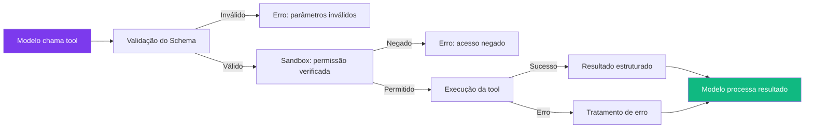

## 4. Técnica

### Criando uma Tool de Deploy

Vamos criar uma tool que faz deploy de uma aplicação Docker:

```javascript
// tools/deploy-docker.js
export default {
  name: "deploy-docker",
  description: "Faz build e deploy de uma aplicação Docker",
  parameters: {
    type: "object",
    properties: {
      dockerfile: {
        type: "string",
        description: "Caminho para o Dockerfile"
      },
      tag: {
        type: "string",
        description: "Tag da imagem Docker"
      },
      registry: {
        type: "string",
        description: "Registry de destino",
        default: "docker.io"
      }
    },
    required: ["dockerfile", "tag"]
  },
  async execute(params, ctx) {
    const shell = ctx.service('shell');
    
    try {
      // Build da imagem
      const buildResult = shell.execute(
        `docker build -t ${params.tag} -f ${params.dockerfile} .`
      );
      
      // Push para o registry
      const pushResult = shell.execute(
        `docker push ${params.registry}/${params.tag}`
      );
      
      return {
        success: true,
        image: `${params.registry}/${params.tag}`,
        buildOutput: buildResult,
        pushOutput: pushResult
      };
    } catch (error) {
      return {
        success: false,
        error: error.message
      };
    }
  }
};
```

### Composição de Tools

```javascript
// Tool que busca e analisa um repositório
export default {
  name: "analisar-repo",
  description: "Busca um repositório e retorna análise de qualidade",
  parameters: {
    type: "object",
    properties: {
      repo: { type: "string" },
      branch: { type: "string", default: "main" }
    },
    required: ["repo"]
  },
  async execute(params, ctx) {
    const shell = ctx.service('shell');
    
    // Step 1: Clonar o repositório
    shell.execute(`git clone ${params.repo} /tmp/analysis`);
    
    // Step 2: Analisar complexidade
    const loc = shell.execute('find /tmp/analysis -name "*.js" | xargs wc -l');
    const issues = shell.execute('cd /tmp/analysis && npm audit --json');
    
    // Step 3: Limpar
    shell.execute('rm -rf /tmp/analysis');
    
    return {
      linesOfCode: loc,
      securityIssues: JSON.parse(issues)
    };
  }
};
```

## 5. Aplica

### A Tool que Travou o Agente

Um desenvolvedor criou uma tool que fazia chamadas HTTP para uma API externa. Quando a API ficou lenta (30s de timeout), a tool ficou travada, e o agente inteiro parou de responder [4].

### A Prática Correta

```javascript
// Tool com timeout e tratamento de erros
async function executeWithTimeout(fn, timeoutMs = 10000) {
  return Promise.race([
    fn(),
    new Promise((_, reject) => 
      setTimeout(() => reject(new Error('Timeout')), timeoutMs)
    )
  ]);
}

// Usar na tool
async execute(params, ctx) {
  try {
    const result = await executeWithTimeout(async () => {
      return await fetch(params.url);
    }, 5000);
    
    return { success: true, data: await result.json() };
  } catch (error) {
    return { success: false, error: error.message };
  }
}
```

Regras para tools robustas:
1. **Sempre defina timeout** — tools não devem rodar indefinidamente
2. **Trate todos os erros** — rede, arquivo, permissão
3. **Retorne resultados estruturados** — o modelo precisa processar o output
4. **Limpe recursos** — arquivos temporários, conexões, processos
5. **Teste cenários de falha** — API fora do ar, disco cheio, permissão negada

## 6. Conclusão

Neste capítulo, você aprendeu a construir ferramentas customizadas com schemas JSON, execução segura no sandbox, e composição encadeada. Tools personalizadas são o que transforma um agente genérico em um assistente especializado para seu caso de uso.

No próximo capítulo, você vai orquestrar múltiplas tools em pipelines complexos — chains, fan-outs, e retries automáticos.

## 7. Referências Bibliográficas

[1] DEEPSEEK AI. *DeepSeek Harness developer preview*. Disponível em: https://deepseek.com/harness/en/. Acesso em: 23 ago. 2026.

[2] MEDIUM (kaliarch). *DeepSeek Harness: When the Agent Loop Itself Becomes a Plugin*. Disponível em: https://medium.com/@kaliarch/deepseek-harness-when-the-agent-loop-itself-becomes-a-plugin-7fad0aa9de1c. Acesso em: 23 ago. 2026.

[3] ATLASCLOUD. *DeepSeek Harness Plugins: The 7 Worth It*. Disponível em: https://www.atlascloud.ai/blog/tips/deepseek-harness-plugins. Acesso em: 23 ago. 2026.

[4] SPRINGBRAND. *DeepSeek Harness (dsh): Everything Is a Plugin*. Disponível em: https://springbrand.ai/deepseek-harness. Acesso em: 23 ago. 2026.

[5] TOWARDS AI. *DeepSeek Harness Explained*. Disponível em: https://pub.towardsai.net/deepseek-harness-explained-when-the-ai-model-is-just-a-plugin-16b2496f3d01. Acesso em: 23 ago. 2026.

[6] HABR. *Inside DeepSeek Harness*. Disponível em: https://habr.com/en/articles/1070958/. Acesso em: 23 ago. 2026.

[7] COMPOSIO. *Best plugins for DeepSeek Harness*. Disponível em: https://composio.dev/content/best-deepseek-harness-plugins. Acesso em: 23 ago. 2026.

[8] MINDSTUDIO. *What Is DeepSeek Harness?*. Disponível em: https://www.mindstudio.ai/blog/deepseek-harness-agentic-coding. Acesso em: 23 ago. 2026.

[9] DATACAMP. *DeepSeek Harness Tutorial*. Disponível em: https://www.datacamp.com/tutorial/deepseek-harness. Acesso em: 23 ago. 2026.

[10] FLOATBOAT.AI. *Cordis — The Plugin Kernel*. Disponível em: https://floatboat.ai/blog/cordis-plugin-framework. Acesso em: 23 ago. 2026.

[11] AGENTATLAS. *Cordis Explained*. Disponível em: https://agentatlas.org/blog/cordis-explained-how-deepseek-harness-plugin-framework-works/. Acesso em: 23 ago. 2026.

[12] 0XSLINE. *awesome-deepseek-harness*. GitHub. Disponível em: https://github.com/0xsline/awesome-deepseek-harness. Acesso em: 23 ago. 2026.

[13] TOWARDS AI. *DeepSeek Harness vs Claude Code*. Disponível em: https://pub.towardsai.net/deepseek-harness-vs-claude-code-a-plugin-architecture-teardown-da3c916f3af1. Acesso em: 23 ago. 2026.

[14] MEDIUM (data-and-beyond). *Decoding DeepSeek Harness*. Disponível em: https://medium.com/data-and-beyond/decoding-deepseek-harness-the-open-source-runtime-behind-composable-ai-agents-c2299e992870. Acesso em: 23 ago. 2026.

[15] LINKEDIN (Tony Ren). *DeepSeek Harness: Agent Operating System*. Disponível em: https://www.linkedin.com/posts/tonyren_i-spent-the-evening-in-the-deepseek-harness-activity-7493848102076882944-GGXB. Acesso em: 23 ago. 2026.

[16] YOUTUBE. *Every Deepseek Harness Concept Explained*. Disponível em: https://www.youtube.com/watch?v=24UCnAs7MVg. Acesso em: 23 ago. 2026.

[17] YOUTUBE. *NEW Deepseek Agent Harness EXPLAINED*. Disponível em: https://www.youtube.com/watch?v=Hpw4fAHlHDw. Acesso em: 23 ago. 2026.

[18] EXPLOREX.AI. *DeepSeek Harness v0.1*. Disponível em: https://explainx.ai/blog/deepseek-harness-v0-1-plugin-first-agent-stack-august-2026. Acesso em: 23 ago. 2026.

[19] DEEPSEEKHARNESSAI. *Security Plugins for DeepSeek Harness*. Disponível em: https://deepseekharnessai.com/categories/security. Acesso em: 23 ago. 2026.

[20] MEDIUM (kaliarch). *DeepSeek Harness: When the Agent Loop Itself Becomes a Plugin*. Disponível em: https://medium.com/@kaliarch/deepseek-harness-when-the-agent-loop-itself-becomes-a-plugin-7fad0aa9de1c. Acesso em: 23 ago. 2026.

# Capítulo 11: Pipelines de Ferramentas: Orquestrando Acoes Complexas

## 1. Introdução

No Capítulo 10, você construiu ferramentas individualmente. Mas na vida real, resolver um problema geralmente exige múltiplas ferramentas trabalhando em sequência ou paralelo [1]. Neste capítulo, você vai aprender a construir pipelines de ferramentas — orquestrações complexas que o agente executa automaticamente, com hooks, middlewares, chains, e patterns avançados de retry.

Um pipeline é mais do que uma lista de ferramentas — é uma orquestra onde cada instrumento (tool) toca na hora certa, com a intensidade certa, e para na hora certa. O maestro (orquestrador) garante que tudo funciona em harmonia [2].

## 2. Explica

### Patterns de Pipeline

O DeepSeek Harness suporta vários patterns de orquestração [3]:

**Chain:** Ferramentas executadas em sequência. O output de uma é input da próxima. Padrão mais comum — como uma esteira de montagem. Cada etapa processa o resultado da anterior e passa para a próxima.

**Fan-out:** Uma ferramenta dispara múltiplas execuções em paralelo. Útil para tarefas independentes que podem rodar simultaneamente — como buscar dados de múltiplas APIs ao mesmo tempo. O resultado final consolida as respostas de todas as execuções paralelas.

**Conditional:** O pipeline toma decisões baseadas em resultados intermediários. Se a tool A retornou erro, executa a tool B; se retornou sucesso, executa a tool C. É a inteligência do pipeline — ele adapta seu comportamento baseado no que acontece durante a execução.

**Retry-with-backoff:** Quando uma tool falha por timeout ou erro temporário, o pipeline tenta novamente com intervalos crescentes (1s, 2s, 4s, 8s...). Essencial para serviços de rede instáveis [4].

### Hooks e Middlewares

Hooks interceptam o pipeline em pontos específicos [1]:

- **Pre-chain hook:** Executa antes do pipeline começar. Pode preparar dados ou verificar condições.
- **Inter-tool hook:** Executa entre cada tool. Pode transformar output, registrar logs, ou validar resultados.
- **Post-chain hook:** Executa depois do pipeline terminar. Pode consolidar resultados ou enviar notificações.

Middlewares são hooks reutilizáveis que podem ser aplicados a qualquer pipeline — como plugins de segurança, logging, ou métricas.

## 3. Ilustra

### A Linha de Montagem Automatizada

Na sua oficina de agentes, um pipeline é como uma linha de montagem automatizada. A peça bruta (input) entra por um lado, passa por várias estações de trabalho (tools), e sai do outro lado como produto acabado (resultado final) [5].

O **chain** é a linha de montagem tradicional — cada estação faz uma operação e passa para a próxima. Corte → soldagem → pintura → embalagem.

O **fan-out** é como quando a linha se divide em três ramos paralelos — uma estação pinta a peça azul, outra pinta vermelha, terceira pinta verde — e depois se encontram no final para comparar resultados.

O **retry-with-backoff** é como quando uma máquina dá pau — em vez de parar a linha inteira, a peça volta para o início daquela estação e tenta de novo, com cada tentativa sendo mais cuidadosa.

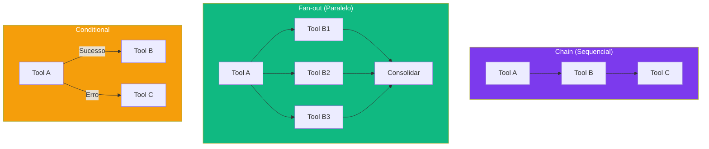

## 4. Técnica

### Configurando um Pipeline Chain

```yaml
# pipelines/deploy.yaml
name: deploy-completo
description: Pipeline de deploy: lint → test → build → push → deploy
steps:
  - name: lint
    tool: shell:execute
    params:
      command: "npm run lint"
    on-success: next
    on-fail: stop
    
  - name: test
    tool: shell:execute
    params:
      command: "npm test"
    on-success: next
    on-fail: rollback
    
  - name: build
    tool: shell:execute
    params:
      command: "npm run build"
    on-success: next
    on-fail: rollback
    
  - name: push
    tool: git:push
    params:
      branch: "main"
    on-success: next
    on-fail: rollback
```

### Configurando Fan-out Paralelo

```yaml
# pipelines/analise-multiplas.yaml
name: analise-multiplas-fontes
description: Analisa múltiplas fontes em paralelo
parallel:
  - name: analise-codigo
    tool: analisar-codigo
    params:
      directory: "./src"
      
  - name: analise-testes
    tool: analisar-testes
    params:
      directory: "./tests"
      
  - name: analise-documentacao
    tool: analisar-docs
    params:
      directory: "./docs"
      
consolidate:
  tool: consolidar-relatorio
  params:
    inputs:
      - "{{steps.analise-codigo.result}}"
      - "{{steps.analise-testes.result}}"
      - "{{steps.analise-documentacao.result}}"
```

### Hooks de Auditoria

```javascript
// hook de auditoria para pipelines
export default function pipelineAuditHook(ctx) {
  ctx.on('pipeline:start', (event) => {
    console.log(`[PIPELINE] ${event.name} iniciado`);
  });

  ctx.on('pipeline:step:complete', (event) => {
    console.log(`[PIPELINE] ${event.step} completado em ${event.duration}ms`);
  });

  ctx.on('pipeline:step:fail', (event) => {
    console.log(`[PIPELINE] ${event.step} falhou: ${event.error}`);
  });
}
```

## 5. Aplica

### O Pipeline que Travou para Sempre

Um desenvolvedor configurou um pipeline chain com 5 steps. O step 3 dependia de uma API externa que ficou fora do ar. O pipeline tentou retry 10 vezes (configuração padrão), cada uma com 30 segundos de timeout. Total: 5 minutos de espera antes de reportar erro [4].

### A Prática Correta

```yaml
# Configuração inteligente de retry
steps:
  - name: chamada-api
    tool: http:request
    retry:
      max-attempts: 3
      backoff: exponential
      base-delay: 1000  # 1s
      max-delay: 10000  # 10s
      retry-on:
        - "timeout"
        - "5xx"
        - "rate-limit"
```

Regras para pipelines robustos:
1. **Limite retries a 3-5** — mais que isso é desperdício
2. **Use backoff exponencial** — 1s → 2s → 4s é melhor que 3x 5s
3. **Defina timeout por step** — nenhum step deve rodar mais que 60s
4. **Logs em cada step** — para debug quando algo falha
5. **Rollback automático** — se o deploy falhar, desfazer mudanças

## 6. Conclusão

Neste capítulo, você aprendeu a orquestrar múltiplas ferramentas em pipelines complexos — chains sequenciais, fan-outs paralelos, conditionais, e retries inteligentes. Pipelines são o que transforma um agente que executa ações isoladas em um agente que resolve problemas complexos automaticamente.

No próximo capítulo, você vai construir um pipeline RAG completo — memória de longo prazo que permite ao agente buscar e utilizar informações de documentos grandes.

## 7. Referências Bibliográficas

[1] DEEPSEEK AI. *DeepSeek Harness developer preview*. Disponível em: https://deepseek.com/harness/en/. Acesso em: 23 ago. 2026.

[2] HABR. *Inside DeepSeek Harness*. Disponível em: https://habr.com/en/articles/1070958/. Acesso em: 23 ago. 2026.

[3] IDEABOSQUE. *Long-running Agent Patterns*. Disponível em: https://www.ideabosque.com/library/long-running-agent-patterns-keeping-agents-alive-across-hours-and-days/. Acesso em: 23 ago. 2026.

[4] LINKEDIN (Tony Ren). *DeepSeek Harness: Agent Operating System*. Disponível em: https://www.linkedin.com/posts/tonyren_i-spent-the-evening-in-the-deepseek-harness-activity-7493848102076882944-GGXB. Acesso em: 23 ago. 2026.

[5] TOWARDS AI. *DeepSeek Harness Explained*. Disponível em: https://pub.towardsai.net/deepseek-harness-explained-when-the-ai-model-is-just-a-plugin-16b2496f3d01. Acesso em: 23 ago. 2026.

[6] FLOATBOAT.AI. *Cordis — The Plugin Kernel*. Disponível em: https://floatboat.ai/blog/cordis-plugin-framework. Acesso em: 23 ago. 2026.

[7] AGENTATLAS. *Cordis Explained*. Disponível em: https://agentatlas.org/blog/cordis-explained-how-deepseek-harness-plugin-framework-works/. Acesso em: 23 ago. 2026.

[8] MEDIUM (data-and-beyond). *Decoding DeepSeek Harness*. Disponível em: https://medium.com/data-and-beyond/decoding-deepseek-harness-the-open-source-runtime-behind-composable-ai-agents-c2299e992870. Acesso em: 23 ago. 2026.

[9] TOWARDS AI. *DeepSeek Harness vs Claude Code*. Disponível em: https://pub.towardsai.net/deepseek-harness-vs-claude-code-a-plugin-architecture-teardown-da3c916f3af1. Acesso em: 23 ago. 2026.

[10] ATLASCLOUD. *DeepSeek Harness Plugins: The 7 Worth It*. Disponível em: https://www.atlascloud.ai/blog/tips/deepseek-harness-plugins. Acesso em: 23 ago. 2026.

[11] COMPOSIO. *Best plugins for DeepSeek Harness*. Disponível em: https://composio.dev/content/best-deepseek-harness-plugins. Acesso em: 23 ago. 2026.

[12] MINDSTUDIO. *What Is DeepSeek Harness?*. Disponível em: https://www.mindstudio.ai/blog/deepseek-harness-agentic-coding. Acesso em: 23 ago. 2026.

[13] DATACAMP. *DeepSeek Harness Tutorial*. Disponível em: https://www.datacamp.com/tutorial/deepseek-harness. Acesso em: 23 ago. 2026.

[14] SPRINGBRAND. *DeepSeek Harness (dsh): Everything Is a Plugin*. Disponível em: https://springbrand.ai/deepseek-harness. Acesso em: 23 ago. 2026.

[15] YOUTUBE. *Every Deepseek Harness Concept Explained*. Disponível em: https://www.youtube.com/watch?v=24UCnAs7MVg. Acesso em: 23 ago. 2026.

[16] YOUTUBE. *NEW Deepseek Agent Harness EXPLAINED*. Disponível em: https://www.youtube.com/watch?v=Hpw4fAHlHDw. Acesso em: 23 ago. 2026.

[17] EXPLOREX.AI. *DeepSeek Harness v0.1*. Disponível em: https://explainx.ai/blog/deepseek-harness-v0-1-plugin-first-agent-stack-august-2026. Acesso em: 23 ago. 2026.

[18] DEEPSEEKHARNESSAI. *Security Plugins for DeepSeek Harness*. Disponível em: https://deepseekharnessai.com/categories/security. Acesso em: 23 ago. 2026.

[19] MEDIUM (kaliarch). *DeepSeek Harness: When the Agent Loop Itself Becomes a Plugin*. Disponível em: https://medium.com/@kaliarch/deepseek-harness-when-the-agent-loop-itself-becomes-a-plugin-7fad0aa9de1c. Acesso em: 23 ago. 2026.

[20] 0XSLINE. *awesome-deepseek-harness*. GitHub. Disponível em: https://github.com/0xsline/awesome-deepseek-harness. Acesso em: 23 ago. 2026.

# Capítulo 12: RAG Local: Memoria de Longo Prazo para Agentes

## 1. Introdução

No Capítulo 11, você aprendeu a orquestrar pipelines de ferramentas. Mas o que acontece quando o agente precisa acessar informações que não cabem no contexto de uma sessão? Documentação de projetos, bases de conhecimento, repositórios de código inteiros — o RAG (Retrieval-Augmented Generation) resolve esse problema [1].

RAG é a técnica que transforma um agente de "memória curta" em um agente com "memória de longo prazo". Em vez de depender apenas do que o modelo "lembra" (parâmetros treinados), ele busca informações relevantes em uma base de dados externa antes de gerar uma resposta [2].

Neste capítulo, você vai construir um pipeline RAG completo e self-hosted: embedding models para converter texto em vetores, vector databases (ChromaDB, Qdrant, Weaviate) para armazenar e buscar, e integração direta com o DeepSeek Harness.

## 2. Explica

### O que é RAG?

RAG é uma técnica que combina recuperação de informação com geração de texto. Em vez de o modelo depender apenas do que "lembra" (parâmetros treinados), ele busca informações relevantes em uma base de dados externa antes de gerar uma resposta [3]:

1. **Indexação:** Documentos são divididos em chunks (pedaços), convertidos em vetores (embeddings), e armazenados em um banco de vetores.

2. **Recuperação:** Quando o usuário faz uma pergunta, a pergunta é convertida em vetor, e os chunks mais similares são recuperados do banco.

3. **Geração:** O contexto recuperado é injetado no prompt do modelo, que gera uma resposta baseada nas informações encontradas.

### Embedding Models

Embedding models convertem texto em vetores numéricos — representações matemáticas que capturam o significado semântico [4]:

- **sentence-transformers:** Biblioteca Python leve, múltiplos modelos pré-treinados
- **BGE (BAAI):** Modelos de alta qualidade para busca semântica
- **E5 (Microsoft):** Modelos otimizados para retrieval

Para uso local, o `all-MiniLM-L6-v2` do sentence-transformers é um excelente ponto de partida — é leve (~80MB), rápido, e funciona bem para a maioria dos casos.

### Vector Databases

Cada banco de vetores tem seu caso de uso ideal [5]:

**ChromaDB:** Leve, ideal para desenvolvimento local. Integração fácil com Python. Não escala para produção com milhões de vetores.

**Qdrant:** Escalável, escrito em Rust. API REST/gRPC. Self-hostable. Ideal para produção com dezenas de milhões de vetores.

**Weaviate:** Mais features (busca vetorial + keyword), GraphQL API. Self-hostable. Bom para aplicações que precisam de busca híbrida.

**Milvus:** Para produção em larga escala (bilhões de vetores). Requer infraestrutura dedicada.

## 3. Ilustra

### A Biblioteca da Oficina

Na sua oficina de agentes, o RAG é como uma biblioteca técnica organizada. Quando você precisa de informações sobre um assunto específico, não precisa decorar todos os livros — vai na biblioteca, busca pelo índice, e encontra exatamente o que precisa [6].

O embedding model é o catalogador da biblioteca. Ele lê cada livro (documento), identifica os conceitos principais, e cria um índice de referência cruzada (vetor). Quando alguém pergunta sobre "como configurar Docker", o catalogador encontra automaticamente os trechos mais relevantes — não precisa ler o livro inteiro.

A vector database é o sistema de catalogação da biblioteca. É onde os índices são armazenados e onde as buscas são feitas. Cada vez que um novo livro chega (novo documento), o catalogador o processa e adiciona ao catálogo.

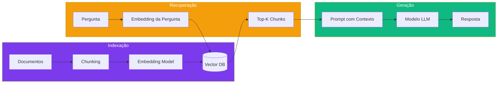

## 4. Técnica

### Setup com ChromaDB (Local)

```python
# rag_setup.py
import chromadb
from sentence_transformers import SentenceTransformer

# Inicializar modelo de embeddings
model = SentenceTransformer('all-MiniLM-L6-v2')

# Criar cliente ChromaDB
client = chromadb.PersistentClient(path="./chroma_db")
collection = client.get_or_create_collection("documentos")

# Função para indexar documentos
def indexar_documento(texto, metadata):
    # Dividir em chunks de 500 caracteres
    chunks = [texto[i:i+500] for i in range(0, len(texto), 500)]
    
    for i, chunk in enumerate(chunks):
        embedding = model.encode(chunk).tolist()
        collection.add(
            ids=[f"{metadata['id']}_{i}"],
            embeddings=[embedding],
            documents=[chunk],
            metadatas=[{**metadata, "chunk_index": i}]
        )

# Função para buscar
def buscar(query, n_results=3):
    query_embedding = model.encode(query).tolist()
    results = collection.query(
        query_embeddings=[query_embedding],
        n_results=n_results
    )
    return results['documents'][0]
```

### Setup com Qdrant (Produção)

```bash
# Instalar Qdrant via Docker
docker run -p 6333:6333 -v qdrant_data:/qdrant/storage qdrant/qdrant

# Python
pip install qdrant-client
```

```python
from qdrant_client import QdrantClient
from qdrant_client.models import VectorParams, Distance

client = QdrantClient("localhost", port=6333)

# Criar coleção
client.create_collection(
    collection_name="documentos",
    vectors_config=VectorParams(size=384, distance=Distance.COSINE)
)
```

### Integrando com DeepSeek Harness

```javascript
// Plugin de RAG para o harness
export default function ragPlugin(ctx) {
  ctx.service('rag-search', {
    async execute({ query, collection }) {
      // Buscar chunks relevantes
      const results = await fetch('http://localhost:8000/rag/search', {
        method: 'POST',
        body: JSON.stringify({ query, collection, top_k: 3 })
      });
      
      const chunks = await results.json();
      
      // Formatar para o modelo
      return {
        context: chunks.map(c => c.document).join('\n\n'),
        sources: chunks.map(c => c.metadata.source)
      };
    }
  });
}
```

## 5. Aplica

### O RAG que Retornava Lixo

Um desenvolvedor implementou RAG com chunks de 2000 caracteres. O embedding model não conseguia capturar o significado de chunks tão grandes — os resultados da busca eram irrelevantes 60% das vezes [4].

A causa: chunks grandes diluem o significado. Um documento sobre "configuração de Docker" misturado com "introdução ao Linux" no mesmo chunk confunde o embedding model.

### A Prática Correta

Regras para RAG de qualidade:

| Parâmetro | Recomendação | Por quê |
|-----------|-------------|---------|
| Chunk size | 300-500 chars | Tamanho ideal para embeddings |
| Overlap | 50-100 chars | Mantém contexto entre chunks |
| Embedding model | all-MiniLM-L6-v2 | Leve e eficiente para local |
| Top-K | 3-5 chunks | Suficiente sem poluir o contexto |
| Distância | Cosine | Padrão para busca semântica |

## 6. Conclusão

Neste capítulo, você construiu um pipeline RAG completo — da indexação de documentos à recuperação de contexto para o modelo. Embedding models convertem texto em vetores, vector databases armazenam e buscam, e a integração com o DeepSeek Harness permite que o agente acesse informações de bases grandes sem sobrecarregar o contexto.

No próximo capítulo, você vai personalizar os próprios modelos com fine-tuning — treinando um DeepSeek para seu domínio específico.

## 7. Referências Bibliográficas

[1] BLAŠKOVIĆ, Luka et al. *Robust Clinical Querying with Local LLMs*. In: Big Data and Cognitive Computing, 2025. Disponível em: https://doi.org/10.3390/bdcc9100256. Acesso em: 23 ago. 2026.

[2] FIRECRAWL. *Best Vector Databases in 2026*. Disponível em: https://www.firecrawl.dev/blog/best-vector-databases. Acesso em: 23 ago. 2026.

[3] KUNALGANGLANI. *Weaviate vs Chroma 2026*. Disponível em: https://www.kunalganglani.com/blog/weaviate-vs-chroma-vector-db. Acesso em: 23 ago. 2026.

[4] BRAINTRUST. *Best vector databases for RAG in 2026*. Disponível em: https://www.braintrust.dev/articles/best-vector-databases-for-rag-2026. Acesso em: 23 ago. 2026.

[5] ALEXEWERLOF. *Using local LLMs for agentic coding*. Disponível em: https://blog.alexewerlof.com/p/local-llms-for-agentic-coding. Acesso em: 23 ago. 2026.

[6] TOWARDS AI. *DeepSeek Harness Explained*. Disponível em: https://pub.towardsai.net/deepseek-harness-explained-when-the-ai-model-is-just-a-plugin-16b2496f3d01. Acesso em: 23 ago. 2026.

[7] HABR. *Inside DeepSeek Harness*. Disponível em: https://habr.com/en/articles/1070958/. Acesso em: 23 ago. 2026.

[8] FLOATBOAT.AI. *Cordis — The Plugin Kernel*. Disponível em: https://floatboat.ai/blog/cordis-plugin-framework. Acesso em: 23 ago. 2026.

[9] AGENTATLAS. *Cordis Explained*. Disponível em: https://agentatlas.org/blog/cordis-explained-how-deepseek-harness-plugin-framework-works/. Acesso em: 23 ago. 2026.

[10] MEDIUM (data-and-beyond). *Decoding DeepSeek Harness*. Disponível em: https://medium.com/data-and-beyond/decoding-deepseek-harness-the-open-source-runtime-behind-composable-ai-agents-c2299e992870. Acesso em: 23 ago. 2026.

[11] TOWARDS AI. *DeepSeek Harness vs Claude Code*. Disponível em: https://pub.towardsai.net/deepseek-harness-vs-claude-code-a-plugin-architecture-teardown-da3c916f3af1. Acesso em: 23 ago. 2026.

[12] ATLASCLOUD. *DeepSeek Harness Plugins: The 7 Worth It*. Disponível em: https://www.atlascloud.ai/blog/tips/deepseek-harness-plugins. Acesso em: 23 ago. 2026.

[13] COMPOSIO. *Best plugins for DeepSeek Harness*. Disponível em: https://composio.dev/content/best-deepseek-harness-plugins. Acesso em: 23 ago. 2026.

[14] MINDSTUDIO. *What Is DeepSeek Harness?*. Disponível em: https://www.mindstudio.ai/blog/deepseek-harness-agentic-coding. Acesso em: 23 ago. 2026.

[15] DATACAMP. *DeepSeek Harness Tutorial*. Disponível em: https://www.datacamp.com/tutorial/deepseek-harness. Acesso em: 23 ago. 2026.

[16] SPRINGBRAND. *DeepSeek Harness (dsh): Everything Is a Plugin*. Disponível em: https://springbrand.ai/deepseek-harness. Acesso em: 23 ago. 2026.

[17] YOUTUBE. *Every Deepseek Harness Concept Explained*. Disponível em: https://www.youtube.com/watch?v=24UCnAs7MVg. Acesso em: 23 ago. 2026.

[18] YOUTUBE. *NEW Deepseek Agent Harness EXPLAINED*. Disponível em: https://www.youtube.com/watch?v=Hpw4fAHlHDw. Acesso em: 23 ago. 2026.

[19] EXPLOREX.AI. *DeepSeek Harness v0.1*. Disponível em: https://explainx.ai/blog/deepseek-harness-v0-1-plugin-first-agent-stack-august-2026. Acesso em: 23 ago. 2026.

[20] DEEPSEEKHARNESSAI. *Security Plugins for DeepSeek Harness*. Disponível em: https://deepseekharnessai.com/categories/security. Acesso em: 23 ago. 2026.

# Capítulo 13: Fine-Tuning Local: Personalizando o Modelo

## 1. Introdução

No Capítulo 12, você construiu um pipeline RAG para dar memória de longo prazo ao agente. Mas e se o próprio modelo pudesse ser treinado para entender melhor seu domínio específico? O fine-tuning é essa personalização — ajustar os pesos de um modelo genérico para que ele seja um especialista no seu nicho [1].

O fine-tuning não é mágica — é uma técnica poderosa que, quando bem aplicada, pode transformar um bom modelo em um excelente modelo para seu caso de uso específico. Mas quando mal aplicada, pode piorar a performance geral do modelo [2].

Neste capítulo, você vai realizar fine-tuning de um modelo DeepSeek com LoRA e QLoRA usando Axolotl ou Unsloth, preparar datasets, avaliar resultados, e exportar o modelo treinado para GGUF.

## 2. Explica

### LoRA vs QLoRA

**LoRA (Low-Rank Adaptation)** é uma técnica que adapta apenas uma fração dos parâmetros do modelo, preservando os pesos originais. Em vez de ajustar bilhões de parâmetros, LoRA ajusta matrizes de baixa dimensão — reduzindo o custo de treinamento em 90%+ [3].

**QLoRA** combina LoRA com quantização 4-bit. O modelo base fica em 4 bits (reduzindo VRAM drasticamente), e os adaptadores LoRA ficam em FP16. Resultado: fine-tuning de um modelo 7B com apenas ~5GB de VRAM [4].

| Método | VRAM Necessária (7B) | Qualidade | Velocidade |
|--------|---------------------|-----------|------------|
| Full fine-tune | ~56GB | Máxima | Lenta |
| LoRA (FP16) | ~28GB | Alta | Média |
| QLoRA (4-bit) | ~5GB | Boa | Rápida |

### Preparação de Dados

O dataset de fine-tuning segue formatos padrão [3]:

**Alpaca Format:**
```json
{"instruction": "Explique o que é Docker", "input": "", "output": "Docker é uma plataforma de containerização..."}
```

**ShareGPT Format:**
```json
{"conversations": [{"from": "human", "value": "Como instalar Ollama?"}, {"from": "gpt", "value": "Para instalar o Ollama..."}]}
```

### Pipeline Completo

1. **Preparar dados** → formato JSON/JSONL
2. **Configurar treino** → Axolotl ou Unsloth
3. **Treinar** → fine-tuning com QLoRA
4. **Avaliar** → métricas de perplexidade e testes qualitativos
5. **Exportar** → converter para GGUF
6. **Integrar** → carregar no Ollama

## 3. Ilustra

### Calibrando o Motor

Na sua oficina de agentes, o fine-tuning é como calibrar um motor para um combustível específico. O motor genérico (modelo base) funciona com qualquer gasolina, mas quando você calibra ele para o gasolina do seu posto (seu domínio específico), ele roda mais eficiente, mais suave, e gasta menos combustível [5].

O LoRA é como trocar apenas as velas e o filtro de ar — não precisa desmontar o motor inteiro. Você ajusta as peças que fazem a diferença (os adaptadores de baixa dimensão) e deixa o resto do motor original intacto. É mais barato, mais rápido, e mais seguro que um rebuild completo.

O QLoRA vai além: é como usar gasolina de octanagem menor no tanque (quantização 4-bit) enquanto mantém as peças novas em alta qualidade (adaptadores FP16). O motor roda um pouco mais quente, mas consome muito menos combustível (VRAM).

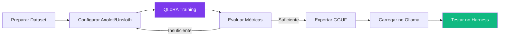

## 4. Técnica

### Setup com Unsloth

```bash
# Instalar Unsloth
pip install unsloth

# Script de fine-tuning
python << 'EOF'
from unsloth import FastLanguageModel
import torch

# Carregar modelo base com QLoRA
model, tokenizer = FastLanguageModel.from_pretrained(
    model_name="unsloth/DeepSeek-V4-7B",
    max_seq_length=2048,
    dtype=None,
    load_in_4bit=True,
)

# Adicionar adaptadores LoRA
model = FastLanguageModel.get_peft_model(
    model,
    r=16,
    target_modules=["q_proj", "k_proj", "v_proj", "o_proj"],
    lora_alpha=16,
    lora_dropout=0,
    bias="none",
)

# Treinar
from trl import SFTTrainer
trainer = SFTTrainer(
    model=model,
    train_dataset=dataset,
    max_seq_length=2048,
    args=TrainingArguments(
        per_device_train_batch_size=2,
        gradient_accumulation_steps=4,
        num_train_epochs=3,
        learning_rate=2e-4,
        fp16=not torch.cuda.is_bf16_supported(),
        bf16=torch.cuda.is_bf16_supported(),
        output_dir="outputs",
    ),
)
trainer.train()

# Salvar adaptador
model.save_pretrained("deepseek-finetuned")
EOF
```

### Exportando para GGUF

```bash
# Converter adaptador para GGUF
python scripts/convert_lora_to_gguf.py \
  --base-model deepseek-ai/DeepSeek-V4-7B \
  --lora-model ./deepseek-finetuned \
  --output deepseek-finetuned-Q4_K_M.gguf

# Carregar no Ollama
ollama create deepseek-custom -f Modelfile
```

```dockerfile
# Modelfile
FROM ./deepseek-finetuned-Q4_K_M.gguf
PARAMETER temperature 0.7
SYSTEM "Você é um assistente especializado em [seu domínio]"
```

## 5. Aplica

### O Fine-Tuning que Piorou o Modelo

Um desenvolvedor treinou um modelo com 100 exemplos de código Python. O resultado: o modelo ficou excelente para Python, mas esqueceu como escrever JavaScript, SQL, e até respostas em português. O fine-tuning causou catastrophic forgetting [1].

A causa: dataset pequeno e sem diversidade. O modelo "esqueceu" conceitos gerais porque só viu um tipo de dado durante o treino.

### A Prática Correta

Regras para fine-tuning de qualidade:

| Parâmetro | Recomendação |
|-----------|-------------|
| Tamanho do dataset | 500-5000 exemplos |
| Épocas | 2-5 (evitar overfitting) |
| Learning rate | 1e-4 a 3e-4 |
| LoRA rank (r) | 8-32 |
| Batch size | 2-8 (depende da VRAM) |

Sempre inclua exemplos diversificados no dataset para evitar catastrophic forgetting.

## 6. Conclusão

Neste capítulo, você aprendeu a personalizar modelos DeepSeek com LoRA/QLoRA — ajustando os pesos para seu domínio específico sem precisar de hardware massivo. O pipeline completo (dados → treino → avaliação → exportação GGUF → Ollama) permite criar modelos customizados que se integram perfeitamente ao DeepSeek Harness.

No próximo capítulo, você vai coordenar múltiplos agentes trabalhando em paralelo — a equipe de agentes da sua oficina.

## 7. Referências Bibliográficas

[1] CODERFILE. *Fine-Tuning Local LLMs for Code Generation*. Disponível em: https://coderfile.io/blog/local-llm-fine-tuning-code-2026. Acesso em: 23 ago. 2026.

[2] FUTURE AGI. *Fine-Tuning LLMs 2026: LoRA, QLoRA, DPO, GRPO*. Disponível em: https://futureagi.com/blog/fine-tuning-llms-unlocking-peak-performance/. Acesso em: 23 ago. 2026.

[3] CODERSERA. *Fine-Tuning LLMs in 2026*. Disponível em: https://codersera.com/blog/fine-tuning-llms-complete-guide-2026/. Acesso em: 23 ago. 2026.

[4] EFFLOOW. *Fine-Tune LLMs with LoRA and QLoRA*. Disponível em: https://effloow.com/articles/llm-fine-tuning-lora-qlora-guide-2026. Acesso em: 23 ago. 2026.

[5] AIRBYTE. *How to Train an LLM on Your Own Data*. Disponível em: https://airbyte.com/data-engineering-resources/how-to-train-llm-with-your-own-data. Acesso em: 23 ago. 2026.

[6] ZYLOS.AI. *Open-Source LLM Fine-Tuning and Serving Infrastructure*. Disponível em: https://zylos.ai/research/2026-03-22-open-source-llm-fine-tuning-serving-ai-agent-platforms/. Acesso em: 23 ago. 2026.

[7] BRAINTRUST. *Best LLM fine-tuning platforms in 2026*. Disponível em: https://www.braintrust.dev/articles/best-llm-fine-tuning-platforms-2026. Acesso em: 23 ago. 2026.

[8] REDDIT (r/learnmachinelearning). *Practical Lessons from Running Local LLMs for Fine-Tuning*. Disponível em: https://www.reddit.com/r/learnmachinelearning/comments/1sibi3j/. Acesso em: 23 ago. 2026.

[9] LLMS3.COM. *Fine-Tuning an LLM on Your Own Data, Locally*. Disponível em: https://llms3.com/blog/fine-tune-llm-on-your-own-data-locally-2026. Acesso em: 23 ago. 2026.

[10] TECH-INSIDER. *How to Fine-Tune an LLM: 13 Steps, 90 Min*. Disponível em: https://tech-insider.org/how-to-fine-tune-an-llm-2026/. Acesso em: 23 ago. 2026.

[11] DEEPSEEK AI. *DeepSeek Harness developer preview*. Disponível em: https://deepseek.com/harness/en/. Acesso em: 23 ago. 2026.

[12] HABR. *Inside DeepSeek Harness*. Disponível em: https://habr.com/en/articles/1070958/. Acesso em: 23 ago. 2026.

[13] FLOATBOAT.AI. *Cordis — The Plugin Kernel*. Disponível em: https://floatboat.ai/blog/cordis-plugin-framework. Acesso em: 23 ago. 2026.

[14] AGENTATLAS. *Cordis Explained*. Disponível em: https://agentatlas.org/blog/cordis-explained-how-deepseek-harness-plugin-framework-works/. Acesso em: 23 ago. 2026.

[15] MEDIUM (data-and-beyond). *Decoding DeepSeek Harness*. Disponível em: https://medium.com/data-and-beyond/decoding-deepseek-harness-the-open-source-runtime-behind-composable-ai-agents-c2299e992870. Acesso em: 23 ago. 2026.

[16] TOWARDS AI. *DeepSeek Harness vs Claude Code*. Disponível em: https://pub.towardsai.net/deepseek-harness-vs-claude-code-a-plugin-architecture-teardown-da3c916f3af1. Acesso em: 23 ago. 2026.

[17] YOUTUBE. *Every Deepseek Harness Concept Explained*. Disponível em: https://www.youtube.com/watch?v=24UCnAs7MVg. Acesso em: 23 ago. 2026.

[18] YOUTUBE. *NEW Deepseek Agent Harness EXPLAINED*. Disponível em: https://www.youtube.com/watch?v=Hpw4fAHlHDw. Acesso em: 23 ago. 2026.

[19] EXPLOREX.AI. *DeepSeek Harness v0.1*. Disponível em: https://explainx.ai/blog/deepseek-harness-v0-1-plugin-first-agent-stack-august-2026. Acesso em: 23 ago. 2026.

[20] DEEPSEEKHARNESSAI. *Security Plugins for DeepSeek Harness*. Disponível em: https://deepseekharnessai.com/categories/security. Acesso em: 23 ago. 2026.

# Capítulo 14: Multi-Agente: Coordenando uma Equipe de Agentes

## 1. Introdução

No Capítulo 13, você personalizou o modelo com fine-tuning. Agora é hora de escalar: em vez de um único agente fazendo tudo, você vai coordenar múltiplos agentes trabalhando em paralelo [1]. Cada agente tem seu próprio worktree isolado, sua própria sessão, e sua própria tarefa — e todos colaboram para resolver problemas complexos.

Multi-agente é o que transforma um assistente individual em uma equipe produtiva. Assim como uma empresa não depende de um único funcionário para fazer tudo, um sistema de agentes não depende de um único agente para resolver todos os problemas [2].

## 2. Explica

### Worktrees para Paralelismo

Cada agente em paralelo opera em seu próprio git worktree — um branch isolado do repositório. Isso permite que múltiplos agentes modifiquem os mesmos arquivos sem conflitos [3]:

```bash
# Criar worktrees para cada agente
git worktree add ../agent-a feature/frontend
git worktree add ../agent-b feature/backend
git worktree add ../agent-c feature/tests

# Cada agente trabalha em sua cópia isolada
cd ../agent-a && dsh --mode standard  # Agente A: frontend
cd ../agent-b && dsh --mode standard  # Agente B: backend
cd ../agent-c && dsh --mode standard  # Agente C: testes
```

### Patterns de Orquestração

O DeepSeek Harness suporta três patterns de coordenação entre agentes [1]:

**Dispatch:** O orquestrador distribui tarefas para agentes workers. Cada worker executa sua tarefa de forma independente e retorna o resultado.

**Wait:** O orquestrador aguarda que todos os workers terminem antes de prosseguir. Essencial para tarefas com dependências.

**Escalate:** Quando um worker encontra um problema que não consegue resolver, escala para o orquestrador ou para outro worker mais especializado.

### Comunicação entre Agentes

Agentes se comunicam através de [4]:

- **Shared Context:** Contexto compartilhado via Cordis — serviços e eventos tipados
- **Message Passing:** Mensagens diretas entre agentes via sessões
- **Result Aggregation:** Consolidação dos resultados de múltiplos agentes em um output final

## 3. Ilustra

### A Equipe de Mecânicos

Na sua oficina de agentes, agentes em paralelo são como uma equipe de mecânicos trabalhando em carros diferentes ao mesmo tempo. Cada mecânico tem sua própria bancada (worktree), suas próprias ferramentas (tools), e sua própria tarefa (prompt) [5].

O orquestrador é o chefe da oficina — ele distribui os carros entre os mecânicos, monitora o progresso, e no final verifica se todos os carros estão prontos antes de entregar ao cliente.

Se um mecânico encontra uma peça que não tem (problema que não consegue resolver), ele chama o chefe (escalate), que decide se designa outro mecânico ou compra a peça.

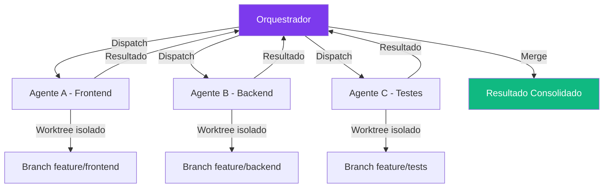

## 4. Técnica

### Configurando Multi-Agent com Worktrees

```bash
# Script de setup multi-agente
#!/bin/bash
REPO="/home/user/projeto"
AGENTS=("frontend" "backend" "tests")

for agent in "${AGENTS[@]}"; do
  # Criar worktree
  git -C "$REPO" worktree add "../${agent}" "feature/${agent}"
  
  # Criar sessão isolada
  dsh session create --name "agent-${agent}" --worktree "../${agent}"
  
  # Configurar agente com foco específico
  dsh config set agent.focus "${agent}" --session "agent-${agent}"
done

echo "✅ ${#AGENTS[@]} agentes configurados"
```

### Orquestração com Pipeline

```yaml
# pipelines/multi-agente.yaml
name: desenvolvimento-completo
orchestrator: standard
agents:
  - name: frontend
    focus: "React, TypeScript, UI components"
    worktree: "feature/frontend"
    tools: ["filesystem", "shell"]
    
  - name: backend
    focus: "Python, FastAPI, database"
    worktree: "feature/backend"
    tools: ["filesystem", "shell", "database"]
    
  - name: tests
    focus: "pytest, integration tests"
    worktree: "feature/tests"
    tools: ["filesystem", "shell"]

dispatch:
  parallel: true
  wait: all
  aggregate: merge
```

## 5. Aplica

### O Conflito de Merge

Dois agentes modificaram o mesmo arquivo `config.py` em branches diferentes. Quando o orquestrador tentou fazer merge, houve conflito. Como nenhum dos agentes estava ciente do outro, o merge falhou silenciosamente — metade das mudanças de um agente sobrescreveu as do outro [3].

### A Prática Correta

Regras para multi-agente seguro:

1. **Isolamento total:** cada agente em seu próprio worktree
2. **Divisão clara de responsabilidades:** agentes diferentes modificam arquivos diferentes
3. **Merge com revisão:** sempre revisar conflitos antes de consolidar
4. **Testes finais:** rodar suite de testes completa depois do merge

## 6. Conclusão

Neste capítulo, você configurou múltiplos agentes trabalhando em paralelo com worktrees isolados, patterns de orquestração (dispatch/wait/escalate), e comunicação via contexto compartilhado. Multi-agente é o que transforma um assistente individual em uma equipe produtiva.

No próximo capítulo, você vai criar profiles personalizados e otimizar o harness para diferentes cenários.

## 7. Referências Bibliográficas

[1] FERRAG, Mohamed Amine et al. *From LLM Reasoning to Autonomous AI Agents: A Comprehensive Review*. In: IEEE Access, 2026. Disponível em: https://doi.org/10.1109/access.2026.3698694. Acesso em: 23 ago. 2026.

[2] AUGMENT CODE. *How to Use Git Worktrees for Parallel AI Agent Execution*. Disponível em: https://www.augmentcode.com/guides/git-worktrees-parallel-ai-agent-execution. Acesso em: 23 ago. 2026.

[3] DEEPSEEK AI. *DeepSeek Harness developer preview*. Disponível em: https://deepseek.com/harness/en/. Acesso em: 23 ago. 2026.

[4] MINDSTUDIO. *Git Worktrees for AI Coding*. Disponível em: https://www.mindstudio.ai/blog/git-worktrees-parallel-ai-coding-agents. Acesso em: 23 ago. 2026.

[5] TOWARDS AI. *DeepSeek Harness Explained*. Disponível em: https://pub.towardsai.net/deepseek-harness-explained-when-the-ai-model-is-just-a-plugin-16b2496f3d01. Acesso em: 23 ago. 2026.

[6] HABR. *Inside DeepSeek Harness*. Disponível em: https://habr.com/en/articles/1070958/. Acesso em: 23 ago. 2026.

[7] FLOATBOAT.AI. *Cordis — The Plugin Kernel*. Disponível em: https://floatboat.ai/blog/cordis-plugin-framework. Acesso em: 23 ago. 2026.

[8] AGENTATLAS. *Cordis Explained*. Disponível em: https://agentatlas.org/blog/cordis-explained-how-deepseek-harness-plugin-framework-works/. Acesso em: 23 ago. 2026.

[9] MEDIUM (data-and-beyond). *Decoding DeepSeek Harness*. Disponível em: https://medium.com/data-and-beyond/decoding-deepseek-harness-the-open-source-runtime-behind-composable-ai-agents-c2299e992870. Acesso em: 23 ago. 2026.

[10] TOWARDS AI. *DeepSeek Harness vs Claude Code*. Disponível em: https://pub.towardsai.net/deepseek-harness-vs-claude-code-a-plugin-architecture-teardown-da3c916f3af1. Acesso em: 23 ago. 2026.

[11] ATLASCLOUD. *DeepSeek Harness Plugins: The 7 Worth It*. Disponível em: https://www.atlascloud.ai/blog/tips/deepseek-harness-plugins. Acesso em: 23 ago. 2026.

[12] COMPOSIO. *Best plugins for DeepSeek Harness*. Disponível em: https://composio.dev/content/best-deepseek-harness-plugins. Acesso em: 23 ago. 2026.

[13] MINDSTUDIO. *What Is DeepSeek Harness?*. Disponível em: https://www.mindstudio.ai/blog/deepseek-harness-agentic-coding. Acesso em: 23 ago. 2026.

[14] DATACAMP. *DeepSeek Harness Tutorial*. Disponível em: https://www.datacamp.com/tutorial/deepseek-harness. Acesso em: 23 ago. 2026.

[15] SPRINGBRAND. *DeepSeek Harness (dsh): Everything Is a Plugin*. Disponível em: https://springbrand.ai/deepseek-harness. Acesso em: 23 ago. 2026.

[16] YOUTUBE. *Every Deepseek Harness Concept Explained*. Disponível em: https://www.youtube.com/watch?v=24UCnAs7MVg. Acesso em: 23 ago. 2026.

[17] YOUTUBE. *NEW Deepseek Agent Harness EXPLAINED*. Disponível em: https://www.youtube.com/watch?v=Hpw4fAHlHDw. Acesso em: 23 ago. 2026.

[18] EXPLOREX.AI. *DeepSeek Harness v0.1*. Disponível em: https://explainx.ai/blog/deepseek-harness-v0-1-plugin-first-agent-stack-august-2026. Acesso em: 23 ago. 2026.

[19] DEEPSEEKHARNESSAI. *Security Plugins for DeepSeek Harness*. Disponível em: https://deepseekharnessai.com/categories/security. Acesso em: 23 ago. 2026.

[20] MEDIUM (kaliarch). *DeepSeek Harness: When the Agent Loop Itself Becomes a Plugin*. Disponível em: https://medium.com/@kaliarch/deepseek-harness-when-the-agent-loop-itself-becomes-a-plugin-7fad0aa9de1c. Acesso em: 23 ago. 2026.

# Capítulo 15: Profiles e Configuracao Avancada: Afinando a Oficina

## 1. Introdução

No Capítulo 14, você coordenou múltiplos agentes. Agora é hora de refinar: criar profiles personalizados que definem o comportamento do harness para diferentes cenários, configurar camadas de configuração, e otimizar o sistema para máxima performance [1].

Profiles são o que transformam um harness genérico em um harness personalizado. Assim como um motorista profissional ajusta o espelho, o banco, e o volante antes de dirigir, você ajusta o harness antes de trabalhar [2].

## 2. Explica

### Camadas de Configuração

O DeepSeek Harness empilha configurações em quatro camadas, da mais genérica para a mais específica [3]:

1. **Defaults:** Configurações internas do harness. Não são editáveis diretamente.
2. **Project:** Arquivo `.dsh/config.yaml` no diretório do projeto. Afeta apenas esse projeto.
3. **User:** Arquivo `~/.dsh/config.yaml`. Afeta todas as sessões do usuário.
4. **Environment:** Variáveis de ambiente (`DSH_*`). Sobrescrevem tudo.

A resolução é de baixo para cima: se `project` define `model: "A"` e `user` define `model: "B"`, o resultado é `model: "A"` (project tem prioridade).

### Profiles

Um profile é uma "receita" de configuração que combina múltiplas camadas em um atalho nomeado [1]:

```yaml
# ~/.dsh/profiles/coding.yaml
name: coding
description: "Profile para desenvolvimento de software"
config:
  model: "deepseek-v4:14b"
  mode: "standard"
  tools: ["filesystem", "shell", "web-search"]
  sandbox:
    worktree: true
    filesystem:
      write: ["./src/**", "./tests/**"]
  session:
    auto-save: 5
```

### Otimização

Otimizações para diferentes cenários [4]:

- **Limites de contexto:** configurar max_tokens para evitar truncamento
- **Caching:** cache de respostas frequentes para reduzir latência
- **Compressão de tokens:** métodos para reduzir o tamanho do contexto sem perder informação
- **RTK (Run-Time Knowledge):** memória de longo prazo para evitar re-análise

## 3. Ilustra

### As Configurações da Oficina

Na sua oficina de agentes, as configurações são como as configurações de uma fábrica automática. Existem configurações de fábrica inteira (defaults), de linha de produção (project), de operador (user), e de emergência (environment) [5].

Um profile é como um botão de "modo rápido" na fábrica. Em vez de ajustar 20 configurações manualmente para cada tipo de trabalho, você seleciona o profile "coding" e tudo se ajusta automaticamente — modelo, ferramentas, sandbox, sessões.

A otimização é como calibrar as máquinas para máxima eficiência. Uma fábrica que produz peças pequenas não precisa da mesma potência que uma que produz peças grandes — e configurar a potência certa para cada tarefa é o que separa uma fábrica eficiente de uma desperdiçadora.

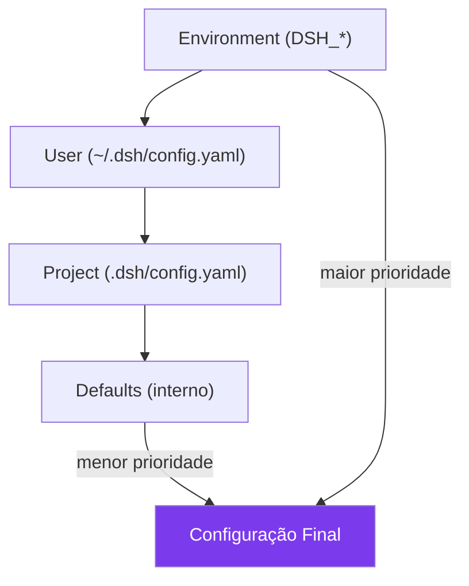

## 4. Técnica

### Criando Profiles

```bash
# Criar profile de coding
mkdir -p ~/.dsh/profiles
cat > ~/.dsh/profiles/coding.yaml << 'EOF'
name: coding
description: "Profile para desenvolvimento de software"
config:
  model: "deepseek-v4:14b"
  mode: "standard"
  tools:
    - "filesystem"
    - "shell"
    - "web-search"
  sandbox:
    worktree: true
    filesystem:
      write: ["./src/**", "./tests/**"]
      deny: ["./.git/**", "./.env"]
  session:
    auto-save: 5
    max-turns: 100
EOF

# Criar profile de research
cat > ~/.dsh/profiles/research.yaml << 'EOF'
name: research
description: "Profile para pesquisa e análise"
config:
  model: "deepseek-r1:32b"
  mode: "standard"
  tools:
    - "filesystem"
    - "web-search"
  sandbox:
    worktree: false
    filesystem:
      read: ["./docs/**", "./research/**"]
      write: ["./output/**"]
  session:
    auto-save: 10
    max-turns: 200
EOF
```

### Usando Profiles

```bash
# Iniciar com profile específico
dsh --profile coding
dsh --profile research

# Listar profiles disponíveis
dsh profiles list

# Verificar configuração ativa
dsh config show
```

### Otimização de Performance

```yaml
# ~/.dsh/config.yaml — otimizações
performance:
  # Cache de respostas
  cache:
    enabled: true
    max-size: "1GB"
    ttl: "24h"
  
  # Limites de contexto
  context:
    max-tokens: 8192
    compress-threshold: 0.8  # Comprimir quando 80% cheio
  
  # RTK (memória de longo prazo)
  rtk:
    enabled: true
    storage: "~/.dsh/rtk/"
    max-entries: 1000
```

## 5. Aplica

### O Profile que Travou tudo

Um desenvolvedor criou um profile que definia `model: "deepseek-v4:7b"` para coding e `model: "deepseek-r1:32b"` para research. Mas esqueceu de configurar VRAM adequada. Quando trocava de profile, o modelo maior spilla para RAM e o harness travava [4].

### A Prática Correta

Regras para profiles de qualidade:

1. **Um profile por caso de uso** — não tente fazer um profile "serve para tudo"
2. **Teste cada profile** antes de usar em produção
3. **Documente** o que cada profile faz
4. **Versione** seus profiles no Git

## 6. Conclusão

Neste capítulo, você criou profiles personalizados, entendeu as camadas de configuração, e aprendeu a otimizar o harness para diferentes cenários. A oficina agora tem modos de operação pré-configurados para cada tipo de trabalho.

No próximo e último capítulo, você vai colocar tudo em produção — Docker, monitoramento, logs, e manutenção contínua.

## 7. Referências Bibliográficas

[1] DEEPSEEK AI. *DeepSeek Harness developer preview*. Disponível em: https://deepseek.com/harness/en/. Acesso em: 23 ago. 2026.

[2] DEEPSEEK AI. *deepseek-harness/docs/architecture.md*. GitHub. Disponível em: https://github.com/deepseek-ai/deepseek-harness/blob/master/docs/architecture.md. Acesso em: 23 ago. 2026.

[3] ALEXEWERLOF. *Using local LLMs for agentic coding*. Disponível em: https://blog.alexewerlof.com/p/local-llms-for-agentic-coding. Acesso em: 23 ago. 2026.

[4] TOWARDS AI. *DeepSeek Harness Explained*. Disponível em: https://pub.towardsai.net/deepseek-harness-explained-when-the-ai-model-is-just-a-plugin-16b2496f3d01. Acesso em: 23 ago. 2026.

[5] HABR. *Inside DeepSeek Harness*. Disponível em: https://habr.com/en/articles/1070958/. Acesso em: 23 ago. 2026.

[6] FLOATBOAT.AI. *Cordis — The Plugin Kernel*. Disponível em: https://floatboat.ai/blog/cordis-plugin-framework. Acesso em: 23 ago. 2026.

[7] AGENTATLAS. *Cordis Explained*. Disponível em: https://agentatlas.org/blog/cordis-explained-how-deepseek-harness-plugin-framework-works/. Acesso em: 23 ago. 2026.

[8] MEDIUM (data-and-beyond). *Decoding DeepSeek Harness*. Disponível em: https://medium.com/data-and-beyond/decoding-deepseek-harness-the-open-source-runtime-behind-composable-ai-agents-c2299e992870. Acesso em: 23 ago. 2026.

[9] TOWARDS AI. *DeepSeek Harness vs Claude Code*. Disponível em: https://pub.towardsai.net/deepseek-harness-vs-claude-code-a-plugin-architecture-teardown-da3c916f3af1. Acesso em: 23 ago. 2026.

[10] ATLASCLOUD. *DeepSeek Harness Plugins: The 7 Worth It*. Disponível em: https://www.atlascloud.ai/blog/tips/deepseek-harness-plugins. Acesso em: 23 ago. 2026.

[11] COMPOSIO. *Best plugins for DeepSeek Harness*. Disponível em: https://composio.dev/content/best-deepseek-harness-plugins. Acesso em: 23 ago. 2026.

[12] MINDSTUDIO. *What Is DeepSeek Harness?*. Disponível em: https://www.mindstudio.ai/blog/deepseek-harness-agentic-coding. Acesso em: 23 ago. 2026.

[13] DATACAMP. *DeepSeek Harness Tutorial*. Disponível em: https://www.datacamp.com/tutorial/deepseek-harness. Acesso em: 23 ago. 2026.

[14] SPRINGBRAND. *DeepSeek Harness (dsh): Everything Is a Plugin*. Disponível em: https://springbrand.ai/deepseek-harness. Acesso em: 23 ago. 2026.

[15] YOUTUBE. *Every Deepseek Harness Concept Explained*. Disponível em: https://www.youtube.com/watch?v=24UCnAs7MVg. Acesso em: 23 ago. 2026.

[16] YOUTUBE. *NEW Deepseek Agent Harness EXPLAINED*. Disponível em: https://www.youtube.com/watch?v=Hpw4fAHlHDw. Acesso em: 23 ago. 2026.

[17] EXPLOREX.AI. *DeepSeek Harness v0.1*. Disponível em: https://explainx.ai/blog/deepseek-harness-v0-1-plugin-first-agent-stack-august-2026. Acesso em: 23 ago. 2026.

[18] DEEPSEEKHARNESSAI. *Security Plugins for DeepSeek Harness*. Disponível em: https://deepseekharnessai.com/categories/security. Acesso em: 23 ago. 2026.

[19] MEDIUM (kaliarch). *DeepSeek Harness: When the Agent Loop Itself Becomes a Plugin*. Disponível em: https://medium.com/@kaliarch/deepseek-harness-when-the-agent-loop-itself-becomes-a-plugin-7fad0aa9de1c. Acesso em: 23 ago. 2026.

[20] 0XSLINE. *awesome-deepseek-harness*. GitHub. Disponível em: https://github.com/0xsline/awesome-deepseek-harness. Acesso em: 23 ago. 2026.

# Capítulo 16: Deploy e Operacao: Levando a Oficina para Producao

## 1. Introdução

Você chegou ao último capítulo. Ao longo dos 15 capítulos anteriores, montou sua oficina de agentes do zero — instalou o harness, escolheu o modelo, configurou o engine, gerenciou plugins, orquestrou pipelines, construiu ferramentas customizadas, implementou RAG, fez fine-tuning, coordenou múltiplos agentes, e criou profiles otimizados [1].

Agora é hora de levar tudo isso para produção. Neste capítulo, você vai containerizar o harness com Docker, configurar monitoramento e observabilidade, implementar rate limiting e fallback entre modelos, e estabelecer uma rotina de manutenção contínua. É o momento em que a oficina pessoal se torna uma concessionária profissional [2].

## 2. Explica

### Docker e Containerização

A containerização é essencial para deploy em produção [3]:

- **Reprodutibilidade:** o mesmo container funciona em qualquer máquina
- **Isolamento:** o harness não interfere com outros serviços
- **Escalabilidade:** fácil de duplicar containers para múltiplos usuários
- **GPU Passthrough:** NVIDIA Container Toolkit permite acesso a GPU dentro do container

### Monitoramento e Observabilidade

Em produção, você precisa saber o que está acontecendo com seu agente [4]:

- **Logs:** registro de todas as ações do agente para debug
- **Métricas:** latência, throughput, erro rate, uso de VRAM
- **Tracing:** rastreamento completo de cada requisição do início ao fim
- **Alertas:** notificações quando algo sai do esperado

### Rate Limiting e Fallback

Proteção contra abuso e garantia de disponibilidade [1]:

- **Rate limiting:** limitar requisições por usuário/tempo
- **Fallback de modelo:** se o modelo primário falhar, usar um secundário
- **Circuit breaker:** parar de tentar um serviço que está fora do ar

## 3. Ilustra

### A Oficina em Produção

Levar a oficina para produção é como abrir uma concessionária. Na oficina pessoal, você podia fazer o que quisesse — deixar peças espalhadas, testar ferramentas novas, quebrar coisas sem consequência. Na concessionária, tudo precisa ser profissional: atendimento rápido, qualidade consistente, sem surpresas para o cliente [5].

O Docker é o prédio da concessionária — uma estrutura padronizada que pode ser replicada em qualquer cidade. O monitoramento são as câmeras e sensores que mostram se tudo está funcionando. O rate limiting é o controle de fluxo de clientes — não deixar mais gente entrar do que a concessionária aguenta atender. O fallback é o plano B — se a peça original não estiver disponível, usar uma equivalente.

```mermaid
%% legenda: Arquitetura de produção — Docker, monitoramento, rate limiting, fallback
flowchart TB
    subgraph Producao["Produção"]
        LB[Load Balancer]
        LB --> C1[Container 1]
        LB --> C2[Container 2]
        LB --> C3[Container N]
        
        C1 --> GPU[GPU (NVIDIA)]
        C2 --> GPU
        C3 --> GPU
        
        MON[Monitoramento] --> C1
        MON --> C2
        MON --> C3
        
        RL[Rate Limiter] --> LB
        
        FB[Fallback Model] -.->|se primário falhar| C1
    end
    
    USR[Usuários] --> RL
    
    style Producao fill:#7C3AED,color:#fff
    style USR fill:#10B981,color:#fff
```

## 4. Técnica

### Dockerfile para DeepSeek Harness

```dockerfile
# Dockerfile
FROM node:22-slim

# Instalar dependências do sistema
RUN apt-get update && apt-get install -y \
    git \
    curl \
    && rm -rf /var/lib/apt/lists/*

# Instalar DeepSeek Harness
RUN npm install -g deepseek-harness

# Criar diretório de trabalho
WORKDIR /app

# Copiar configuração
COPY .dsh/ .dsh/

# Expor portas
EXPOSE 11434 8000

# Iniciar
CMD ["dsh", "--mode", "standard", "--host", "0.0.0.0"]
```

### Docker Compose com GPU

```yaml
# docker-compose.yaml
version: '3.8'
services:
  harness:
    build: .
    ports:
      - "8080:8080"
    volumes:
      - ./config:/app/.dsh
      - ./sessions:/root/.dsh/sessions
    deploy:
      resources:
        reservations:
          devices:
            - driver: nvidia
              count: 1
              capabilities: [gpu]
    environment:
      - DSH_MODEL=deepseek-v4:14b
      - DSH_MODE=standard
      - NVIDIA_VISIBLE_DEVICES=all
    restart: unless-stopped
    healthcheck:
      test: ["CMD", "curl", "-f", "http://localhost:8080/health"]
      interval: 30s
      timeout: 10s
      retries: 3
```

### Monitoramento com Prometheus

```yaml
# prometheus.yaml
global:
  scrape_interval: 15s

scrape_configs:
  - job_name: 'deepseek-harness'
    static_configs:
      - targets: ['harness:8080']
    metrics_path: '/metrics'
```

### Rate Limiting

```yaml
# dsh.config.yaml — produção
rate_limiting:
  enabled: true
  requests_per_minute: 60
  tokens_per_hour: 100000
  per_user: true

fallback:
  primary: "deepseek-v4:14b"
  secondary: "deepseek-v4:7b"
  on_error: "switch"
  max_retries: 3
```

## 5. Aplica

### O Deploy que Caiu na Primeira Noite

Um desenvolvedor fez deploy do harness em produção sem healthcheck. Na primeira noite, o modelo crashed por falta de VRAM (outro serviço estava usando a GPU). O harness ficou retornando erros por 8 horas antes de alguém perceber [4].

### A Prática Correta

Checklist de deploy em produção:

| Item | Status | Config |
|------|--------|--------|
| Dockerfile | ✅ | Multi-stage build |
| GPU passthrough | ✅ | NVIDIA Container Toolkit |
| Healthcheck | ✅ | `/health` a cada 30s |
| Rate limiting | ✅ | 60 req/min por usuário |
| Fallback | ✅ | Modelo secundário automático |
| Logs | ✅ | Structured JSON |
| Métricas | ✅ | Prometheus + Grafana |
| Alertas | ✅ | Erro rate > 5% |
| Backup | ✅ | Sessões diárias |
| SSL/TLS | ✅ | Let's Encrypt |

## 6. Conclusão

Parabéns — você chegou ao fim do livro. Ao longo dos 16 capítulos, você construiu uma oficina completa de agentes de IA: desde a instalação básica até o deploy em produção, passando por plugins, ferramentas, pipelines, RAG, fine-tuning, multi-agente, e profiles.

O DeepSeek Harness não é apenas uma ferramenta — é uma plataforma que evolui com você. Cada capítulo deste livro é uma peça que você pode combinar, substituir, ou melhorar conforme sua necessidade cresce.

O ecossistema está apenas começando. O Cordis é novo, os plugins estão amadurecendo, e as possibilidades de personalização são virtualmente infinitas. Como Engenheiro de Agentes, você agora tem as habilidades para não apenas usar essa tecnologia — mas para moldá-la de acordo com suas necessidades.

A oficina está pronta. O motor está calibrado. As ferramentas estão afiadas. É hora de produzir.

## 7. Referências Bibliográficas

[1] DEEPSEEK AI. *DeepSeek Harness developer preview*. Disponível em: https://deepseek.com/harness/en/. Acesso em: 23 ago. 2026.

[2] COMETAPI. *6 Methods to Deploy DeepSeek Harness Locally*. Disponível em: https://www.cometapi.com/how-to-install-and-deploy-deepseek-harness-locally/. Acesso em: 23 ago. 2026.

[3] ATLASCLOUD. *How to Install DeepSeek Harness in 10 Minutes*. Disponível em: https://www.atlascloud.ai/blog/tips/how-to-install-deepseek-harness. Acesso em: 23 ago. 2026.

[4] TOWARDS AI. *DeepSeek Harness vs Claude Code*. Disponível em: https://pub.towardsai.net/deepseek-harness-vs-claude-code-a-plugin-architecture-teardown-da3c916f3af1. Acesso em: 23 ago. 2026.

[5] HABR. *Inside DeepSeek Harness*. Disponível em: https://habr.com/en/articles/1070958/. Acesso em: 23 ago. 2026.

[6] FLOATBOAT.AI. *Cordis — The Plugin Kernel*. Disponível em: https://floatboat.ai/blog/cordis-plugin-framework. Acesso em: 23 ago. 2026.

[7] AGENTATLAS. *Cordis Explained*. Disponível em: https://agentatlas.org/blog/cordis-explained-how-deepseek-harness-plugin-framework-works/. Acesso em: 23 ago. 2026.

[8] MEDIUM (data-and-beyond). *Decoding DeepSeek Harness*. Disponível em: https://medium.com/data-and-beyond/decoding-deepseek-harness-the-open-source-runtime-behind-composable-ai-agents-c2299e992870. Acesso em: 23 ago. 2026.

[9] ATLASCLOUD. *DeepSeek Harness Plugins: The 7 Worth It*. Disponível em: https://www.atlascloud.ai/blog/tips/deepseek-harness-plugins. Acesso em: 23 ago. 2026.

[10] COMPOSIO. *Best plugins for DeepSeek Harness*. Disponível em: https://composio.dev/content/best-deepseek-harness-plugins. Acesso em: 23 ago. 2026.

[11] MINDSTUDIO. *What Is DeepSeek Harness?*. Disponível em: https://www.mindstudio.ai/blog/deepseek-harness-agentic-coding. Acesso em: 23 ago. 2026.

[12] DATACAMP. *DeepSeek Harness Tutorial*. Disponível em: https://www.datacamp.com/tutorial/deepseek-harness. Acesso em: 23 ago. 2026.

[13] SPRINGBRAND. *DeepSeek Harness (dsh): Everything Is a Plugin*. Disponível em: https://springbrand.ai/deepseek-harness. Acesso em: 23 ago. 2026.

[14] YOUTUBE. *Every Deepseek Harness Concept Explained*. Disponível em: https://www.youtube.com/watch?v=24UCnAs7MVg. Acesso em: 23 ago. 2026.

[15] YOUTUBE. *NEW Deepseek Agent Harness EXPLAINED*. Disponível em: https://www.youtube.com/watch?v=Hpw4fAHlHDw. Acesso em: 23 ago. 2026.

[16] EXPLOREX.AI. *DeepSeek Harness v0.1*. Disponível em: https://explainx.ai/blog/deepseek-harness-v0-1-plugin-first-agent-stack-august-2026. Acesso em: 23 ago. 2026.

[17] DEEPSEEKHARNESSAI. *Security Plugins for DeepSeek Harness*. Disponível em: https://deepseekharnessai.com/categories/security. Acesso em: 23 ago. 2026.

[18] MEDIUM (kaliarch). *DeepSeek Harness: When the Agent Loop Itself Becomes a Plugin*. Disponível em: https://medium.com/@kaliarch/deepseek-harness-when-the-agent-loop-itself-becomes-a-plugin-7fad0aa9de1c. Acesso em: 23 ago. 2026.

[19] 0XSLINE. *awesome-deepseek-harness*. GitHub. Disponível em: https://github.com/0xsline/awesome-deepseek-harness. Acesso em: 23 ago. 2026.

[20] LINKEDIN (Tony Ren). *DeepSeek Harness: Agent Operating System*. Disponível em: https://www.linkedin.com/posts/tonyren_i-spent-the-evening-in-the-deepseek-harness-activity-7493848102076882944-GGXB. Acesso em: 23 ago. 2026.