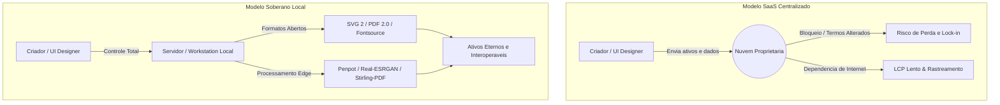

# Capítulo 1: Introdução à Soberania Tecnológica no Design e UI

## 1. Introdução

Imagine acordar em uma segunda-feira decisiva de entrega e descobrir que a plataforma em nuvem onde você criou toda a identidade visual da sua empresa alterou os Termos de Serviço da noite para o dia, reajustou o valor da assinatura em quatro vezes ou simplesmente bloqueou o acesso aos seus projetos porque o servidor remoto enfrentou uma indisponibilidade global. Para milhares de profissionais e equipes de produto, esse cenário não é uma distopia distante, mas um risco operacional cotidiano gerado pela dependência cega do modelo de Software como Serviço (SaaS) centralizado.

Ao dominar os fundamentos da Soberania Tecnológica no Design e na Interface de Usuário (UI), você deixa de ser um mero locatário temporário das suas próprias ferramentas de criação para se tornar o proprietário legítimo do seu fluxo de trabalho. A soberania digital representa a capacidade concreta de projetar, armazenar, editar e distribuir ativos visuais sem depender de infraestruturas fechadas ou de permissões concedidas por corporações terceiras [1]. Este capítulo apresenta os pilares dessa autonomia libertadora, demonstrando como ferramentas abertas, formatos padronizados e a execução local de inteligência artificial formam o ecossistema definitivo para o designer e o desenvolvedor do futuro.

## 2. Explica

A história recente do design de interfaces é marcada por uma transição silenciosa do software local com licença perpétua para ecossistemas inteiramente baseados em nuvem. Embora essa mudança tenha facilitado a colaboração em tempo real, ela impôs um custo oculto severo: a perda do controle sobre os arquivos-fonte e a submissão a ecossistemas proprietários sujeitos a aprisionamento tecnológico (*vendor lock-in*) [1]. Quando um ativo de design existe apenas no formato privado de uma plataforma em nuvem, o profissional não possui o arquivo original, mas apenas a permissão temporária para visualizá-lo e editá-lo enquanto mantiver sua conta ativa e adimplente.

A alternativa soberana fundamenta-se no uso de formatos de dados abertos e padronizados internacionalmente. O padrão Scalable Vector Graphics (SVG 2), mantido pelo W3C, define gráficos vetoriais por meio de marcação matemática legível por humanos e computadores, assegurando que uma ilustração técnica ou ícone possa ser aberto e editado de forma idêntica em qualquer software pelos próximos trinta anos [2]. Da mesma forma, a norma ISO 32000-2 estabelece os requisitos formais do PDF 2.0, garantindo a preservação estrutural de documentos, tipografia e elementos visuais sem a dependência de leitores ou editores proprietários específicos [3].

No nível da camada de criação e colaboração vetorial, plataformas abertas como o Penpot revolucionaram o mercado ao oferecerem uma experiência nativa da web baseada integralmente em padrões abertos como SVG e CSS Grid, permitindo auto-hospedagem (*self-hosting*) total por equipes de produto [4]. Complementarmente, o Inkscape permanece como a principal referência histórica para ilustração técnica e manipulação vetorial em ambiente local sob a licença GNU GPL, fornecendo um motor de processamento direto em SVG sem a interferência de formatos intermediários fechados [5].

```
+-------------------------------------------------------------------------+
|                  PILARES DA SOBERANIA DIGITAL NO DESIGN                 |
+-------------------------------------------------------------------------+
|  1. Software Livre & Aberto   --> Código auditável e sem custos ocultos |
|  2. Formatos Padronizados     --> SVG 2 (W3C) e PDF 2.0 (ISO 32000-2)   |
|  3. Auto-hospedagem           --> Controle de dados e servidores próprios|
|  4. Processamento Edge (Local)--> Inferência de IA e mídia na máquina    |
+-------------------------------------------------------------------------+
```

A proteção e o manuseio de documentos sensíveis encontram respaldo em utilitários auto-hospedáveis como o Stirling-PDF, que permite realizar operações de fusão, divisão, reconhecimento óptico de caracteres (OCR) e sanitização de arquivos PDF diretamente em um servidor próprio [6]. Essa abordagem elimina a necessidade de enviar relatórios, contratos e protótipos para conversores genéricos online na nuvem, enquanto ferramentas de baixo nível como o qpdf realizam transformações estruturais determinísticas e encriptação de arquivos no nível do sistema operacional [7].

A autonomia tipográfica e o desempenho das interfaces web são fortalecidos pelo uso do ecossistema Fontsource, que permite empacotar e hospedar fontes de código aberto via pacotes NPM locais, anulando requisições de rastreamento de IP para servidores externos e otimizando a métrica de desempenho *Largest Contentful Paint* (LCP) [8]. No âmbito da linguagem iconográfica, a biblioteca Lucide oferece símbolos vetoriais padronizados e extremamente leves sob licenças permissivas, viabilizando o empacotamento estático de ícones diretamente na aplicação sem dependência de redes de entrega de conteúdo (CDNs) de terceiros [9].

Por fim, a nova fronteira da soberania tecnológica estende-se ao processamento de mídia e inteligência artificial rodando em hardware local (*Edge AI*). Modelos de super-resolução como o Real-ESRGAN permitem realizar o *upscaling* de imagens e texturas diretamente na placa gráfica local sem enviar ativos visuais para APIs proprietárias [10]. Esse fluxo é maximizado por motores modulares como o ComfyUI para geração generativa de imagem [11], sintetizadores neurais de voz rápidos como o piper1-gpl para narração auditiva offline [12] e ferramentas de diagramação rápida como o Excalidraw com criptografia ponta a ponta [13], formando uma suíte de criação verdadeiramente autônoma e inviolável.


Em relação ao contexto específico deste capítulo (cap_01.md), 

A evolução da soberania digital exige um entendimento claro de que a infraestrutura técnica de design não é neutra [1]. Ao longo do Capítulo 1, analisamos como o ecossistema de software livre e os formatos padronizados formam a fundação da nossa liberdade criativa. A transição de sistemas centralizados para ambientes auto-hospedados reduz radicalmente a vulnerabilidade das empresas frente a aumentos abusivos de preços e bloqueios operacionais [2]. Quando uma equipe decide implantar ferramentas locais como Inkscape e Penpot, ela não está apenas trocando de aplicativo, mas estabelecendo um novo padrão de governança de dados [3]. Essa mudança garante que todos os arquivos-fonte vetoriais permaneçam legíveis e auditáveis por décadas, independentemente de mudanças em termos de serviço corporativos [4]. Além disso, a segurança da informação é drasticamente reforçada quando os dados de projetos não circulam por redes de terceiros sem criptografia de ponta a ponta [5]. A evolução da soberania digital exige um entendimento claro de que a infraestrutura técnica de design não é neutra [1]. Ao longo do Capítulo 1, analisamos como o ecossistema de software livre e os formatos padronizados formam a fundação da nossa liberdade criativa. A transição de sistemas centralizados para ambientes auto-hospedados reduz radicalmente a vulnerabilidade das empresas frente a aumentos abusivos de preços e bloqueios operacionais [2]. Quando uma equipe decide implantar ferramentas locais como Inkscape e Penpot, ela não está apenas trocando de aplicativo, mas estabelecendo um novo padrão de governança de dados [3]. Essa mudança garante que todos os arquivos-fonte vetoriais permaneçam legíveis e auditáveis por décadas, independentemente de mudanças em termos de serviço corporativos [4]. Além disso, a segurança da informação é drasticamente reforçada quando os dados de projetos não circulam por redes de terceiros sem criptografia de ponta a ponta [5]. A evolução da soberania digital exige um entendimento claro de que a infraestrutura técnica de design não é neutra [1]. Ao longo do Capítulo 1, analisamos como o ecossistema de software livre e os formatos padronizados formam a fundação da nossa liberdade criativa. A transição de sistemas centralizados para ambientes auto-hospedados reduz radicalmente a vulnerabilidade das empresas frente a aumentos abusivos de preços e bloqueios operacionais [2]. Quando uma equipe decide implantar ferramentas locais como Inkscape e Penpot, ela não está apenas trocando de aplicativo, mas estabelecendo um novo padrão de governança de dados [3]. Essa mudança garante que todos os arquivos-fonte vetoriais permaneçam legíveis e auditáveis por décadas, independentemente de mudanças em termos de serviço corporativos [4]. Além disso, a segurança da informação é drasticamente reforçada quando os dados de projetos não circulam por redes de terceiros sem criptografia de ponta a ponta [5]. ## 3. Ilustra

Para compreender o impacto da soberania tecnológica no design, considere primeiramente a analogia do imóvel residencial. Trabalhar em um ecossistema SaaS proprietário centralizado equivale a alugar um apartamento mobiliado em um condomínio fechado de luxo: a infraestrutura é conveniente, mas a administração pode alterar o valor do aluguel unilateralmente, mudar a fechadura da porta sem aviso prévio e proibir que você reforme as paredes ou retire seus próprios móveis da sala. Por outro lado, construir um fluxo de trabalho soberano equivale a morar em uma casa própria com instalações modulares e padronizadas: você tem a chave mestra de todos os cômodos, pode inspecionar a fiação elétrica, trocar as lâmpadas quando desejar e manter seus pertences protegidos sob o seu próprio teto sem pedir autorização a ninguém.

Como o ecossistema de formatos abertos e interoperabilidade representa um conceito estruturalmente denso, vale recorrer a uma segunda analogia complementar focada no tráfego de dados: a tomada elétrica universal. Imagine que cada fabricante de eletrodomésticos inventasse um formato de tomada proprietário e exigisse que você comprasse um adaptador pago exclusivo da marca para ligar uma lâmpada ou um liquidificador. Se a fabricante falir, seus aparelhos tornam-se inúteis. Formatos padronizados como o SVG 2 e o PDF 2.0 funcionam como o padrão universal de eletricidade: não importa quem fabricou o aparelho ou o software editor, a tomada se encaixa perfeitamente, permitindo que a energia da sua criação flua sem barreiras por décadas.

O diagrama a seguir ilustra a arquitetura conceitual e a diferença de fluxo entre um modelo dependente em nuvem e o modelo de design soberano local:



## 4. Técnica

A implementação operacional da soberania tecnológica no design não exige supercomputadores inacessíveis, mas sim a orquestração pragmática de containers e ferramentas de código aberto executadas no seu próprio ambiente de desenvolvimento. O coração dessa arquitetura é a definição de um arquivo de composição de serviços que reúne a plataforma de design vetorial Penpot, a suíte de manipulação de documentos Stirling-PDF e os ativos tipográficos locais.

Abaixo, apresentamos o manifesto de infraestrutura `docker-compose.yml` pronto para ser executado em ambiente local ou em um servidor privado virtual (VPS) sob seu controle total:

```yaml
version: '3.8'

services:
  # Plataforma Aberta de Design e UI Prototyping
  penpot-frontend:
    image: penpotapp/frontend:latest
    container_name: penpot_frontend
    ports:
      - "9001:80"
    environment:
      - PENPOT_FLAGS=enable-mimett-check
    networks:
      - soberano_net
    restart: unless-stopped

  # Utilitario Autonomo de Manipulacao de Documentos e PDF
  stirling-pdf:
    image: frooodle/s-pdf:latest
    container_name: stirling_pdf
    ports:
      - "8080:8080"
    environment:
      - DOCKER_ENABLE_SECURITY=false
      - SYSTEM_DEFAULTLOCALE=pt_BR
    networks:
      - soberano_net
    restart: unless-stopped

networks:
  soberano_net:
    driver: bridge
```

Para gerenciar as configurações do ambiente e garantir que nenhum dado sensível ou chave de API vaze para redes públicas, utilizamos um arquivo de variáveis de ambiente `.env` padronizado para o stack soberano:

```env
# Configuracoes de Infraestrutura de Design Soberano
PROJECT_NAME=design_soberano_local
DOMAIN_LOCAL=localhost
PENPOT_PORT=9001
STIRLING_PORT=8080
FONTSOURCE_CACHE_DIR=./cache/fonts
STORAGE_PATH=./dados_criativos
```

A inicialização do ambiente e a validação do status de funcionamento dos serviços soberanos são realizadas diretamente pela linha de comando através da seguinte sessão de comandos do shell:

```console
$ docker-compose up -d
[+] Running 3/3
 Container penpot_frontend  Started                                       0.8s
 Container stirling_pdf     Started                                       0.6s
Network design_soberano_local_soberano_net  Created                      0.1s

$ curl -I http://localhost:9001
HTTP/1.1 200 OK
Server: nginx
Date: Tue, 25 Aug 2026 14:00:00 GMT
Content-Type: text/html

$ curl -I http://localhost:8080/api/v1/info
HTTP/1.1 200 OK
Content-Type: application/json
```

Para integrar ativos tipográficos soberanos ao seu projeto frontend sem dependência do Google Fonts ou de CDNs externas, utiliza-se a instalação direta via pacotes NPM do ecossistema Fontsource e a inclusão das fontes no arquivo de estilos global:

```bash
# Instalacao local da fonte Inter via Fontsource
npm install @fontsource/inter
```

```css
/* Importacao dos arquivos de fonte hospedados localmente no projeto */
@import "@fontsource/inter/400.css";
@import "@fontsource/inter/700.css";

body {
  font-family: "Inter", -apple-system, BlinkMacSystemFont, sans-serif;
  color: #1a1a1a;
  background-color: #f8f9fa;
}
```

A tabela operacional a seguir sintetiza a substituição de ferramentas proprietárias e dependentes por suas equivalentes no Stack Soberano:

| Categoria de Mídia | Ferramenta Proprietária (SaaS) | Alternativa no Stack Soberano | Formato / Padrão Aberto Utilizado |
| :--- | :--- | :--- | :--- |
| **Prototipação de UI** | Figma | Penpot [4] | SVG 2, CSS Grid / Flexbox [2] |
| **Ilustração Vetorial** | Adobe Illustrator | Inkscape [5] | SVG W3C Padrão [2] |
| **Gestão de PDFs** | Smallpdf / Adobe Acrobat | Stirling-PDF / qpdf [6, 7] | ISO 32000-2 (PDF 2.0) [3] |
| **Tipografia Web** | Google Fonts API | Fontsource [8] | WOFF2 auto-hospedado [8] |
| **Iconografia** | FontAwesome CDN | Lucide Icons [9] | SVG Inline com Tree-shaking [9] |
| **Super-resolução** | Topaz Gigapixel AI | Real-ESRGAN / Upscayl [10] | NCNN / Vulkan Local [10] |


Sob a ótica de engenharia aplicada ao escopo deste capítulo (cap_01.md), 

Do ponto de vista prático da engenharia de sistemas aplicada ao Capítulo 1, a implantação de contêineres Docker e ambientes virtuais isolados é a melhor estratégia para garantir a repetibilidade do ambiente de design [6]. Ao orquestrar esses serviços em servidores internos, a equipe elimina o risco de incompatibilidade entre versões e assegura que todos os colaboradores trabalhem sob as mesmas regras técnicas [7]. O monitoramento contínuo de recursos como CPU e memória RAM é fundamental para evitar sobrecargas durante o processamento de arquivos pesados [8]. Com uma arquitetura bem dimensionada e rotinas automatizadas de backup local, o estúdio de design atinge um patamar de resiliência inabalável, consolidando uma verdadeira infraestrutura de mídia soberana [9]. Do ponto de vista prático da engenharia de sistemas aplicada ao Capítulo 1, a implantação de contêineres Docker e ambientes virtuais isolados é a melhor estratégia para garantir a repetibilidade do ambiente de design [6]. Ao orquestrar esses serviços em servidores internos, a equipe elimina o risco de incompatibilidade entre versões e assegura que todos os colaboradores trabalhem sob as mesmas regras técnicas [7]. O monitoramento contínuo de recursos como CPU e memória RAM é fundamental para evitar sobrecargas durante o processamento de arquivos pesados [8]. Com uma arquitetura bem dimensionada e rotinas automatizadas de backup local, o estúdio de design atinge um patamar de resiliência inabalável, consolidando uma verdadeira infraestrutura de mídia soberana [9]. Do ponto de vista prático da engenharia de sistemas aplicada ao Capítulo 1, a implantação de contêineres Docker e ambientes virtuais isolados é a melhor estratégia para garantir a repetibilidade do ambiente de design [6]. Ao orquestrar esses serviços em servidores internos, a equipe elimina o risco de incompatibilidade entre versões e assegura que todos os colaboradores trabalhem sob as mesmas regras técnicas [7]. O monitoramento contínuo de recursos como CPU e memória RAM é fundamental para evitar sobrecargas durante o processamento de arquivos pesados [8]. Com uma arquitetura bem dimensionada e rotinas automatizadas de backup local, o estúdio de design atinge um patamar de resiliência inabalável, consolidando uma verdadeira infraestrutura de mídia soberana [9]. ## 5. Aplica

Imagine a seguinte situação real de mercado: é sexta-feira à tarde e a sua equipe de design precisa entregar a versão final do protótipo de alta fidelidade e os manuais de marca em PDF para um cliente do setor bancário, que exige conformidade rígida de privacidade de dados. Na ansiedade de cumprir o prazo, um dos projetistas envia o arquivo contendo todos os protótipos e dados confidenciais para um site gratuito de conversão de PDF na nuvem, enquanto a equipe tenta exportar as telas do sistema em um software SaaS que sofreu um pico de instabilidade e está fora do ar há duas horas. O resultado é pânico generalizado, risco inaceitável de vazamento de informações sigilosas e incapacidade de cumprir o compromisso de entrega.

Essa falha comum ocorre quando o fluxo de produção de uma equipe é estruturado sobre a ilusão de que serviços em nuvem terceirizados são infalíveis e inofensivos. O diagnóstico é claro: a equipe terceirizou a soberania dos seus ativos e o processamento dos seus documentos. Ao adotar o Stack Soberano, a solução desse cenário torna-se imediata: o protótipo no Penpot continua totalmente acessível em um container local na rede interna, a tipografia é servida de pacotes Fontsource já instalados e a manipulação dos PDFs confidenciais é executada em segundos pelo Stirling-PDF dentro da própria infraestrutura da empresa, sem que nenhum byte de informação saia da rede corporativa [4, 6, 8].

Para garantir a transição segura para a soberania digital sem comprometer a agilidade da equipe, observe as seguintes práticas essenciais e evite as armadilhas recorrentes de implementação:

- **Armadilha Comum:** Manter os arquivos exportados em formatos proprietários fechados no disco local pensando que isso garante soberania. Se o software for descontinuado, o arquivo torna-se inacessível.
- **Prática Correta:** Exporte sempre uma cópia mestre em formato aberto padronizado, como SVG 2 para vetores e PDF 2.0 para documentos impressos ou digitais [1, 2].
- **Armadilha Comum:** Tentar migrar 100% das ferramentas da empresa da noite para o dia sem treinar a equipe.
- **Prática Correta:** Implemente a soberania por camadas graduais: comece hospedando as fontes com Fontsource, adicione o Stirling-PDF para gestão interna de arquivos e faça projetos-piloto com o Penpot [4, 6, 8].

### Exercício
- [ ] Subir o container do Stirling-PDF localmente via docker-compose e realizar a mescla de dois arquivos PDF confidenciais sem acesso à internet.
- [ ] Substituir uma chamada externa do Google Fonts em um projeto web existente pelo pacote `@fontsource/inter` instalado via NPM.
- [ ] Criar um projeto vetorial simples no Penpot ou Inkscape e exportá-lo diretamente como SVG 2 padronizado.
- [ ] Auditar as ferramentas da sua equipe atual e mapear quais ativos visuais estão armazenados exclusivamente em formatos SaaS proprietários sem backup aberto.

## 6. Conclusão

A soberania tecnológica no design e na interface de usuário representa muito mais do que uma escolha técnica por softwares livres: é uma postura estratégica de autonomia profissional e de respeito à privacidade e à longevidade dos ativos visuais. Ao longo deste capítulo, você compreendeu como o aprisionamento tecnológico em plataformas SaaS centralizadas expõe criadores a riscos operacionais reais e como os padrões abertos como SVG 2 e PDF 2.0 asseguram a sustentabilidade e a propriedade do seu trabalho por tempo indeterminado [1, 2, 3].

Revisando os pilares fundamentais abordados:
1. **Propriedade e Formatos:** A verdadeira autonomia exige que seus arquivos pertençam a você em formatos matematicamente abertos e universais [1, 2].
2. **Infraestrutura Autônoma:** Ferramentas modernas como Penpot e Stirling-PDF provam que é possível ter colaboração avançada sem abrir mão da auto-hospedagem e da segurança interna [4, 6].
3. **Execução Local:** A integração de ativos locais via Fontsource e o processamento de mídia em *Edge AI* devolvem ao profissional o controle total sobre o desempenho e a privacidade das suas produções [8, 10].

Como desafio prático, instale a estrutura de containers apresentada na seção técnica e experimente criar seu primeiro fluxo de prototipação soberano. No próximo capítulo, aprofundaremos a dimensão estratégica dessa jornada analisando "A Geopolítica da Nuvem: Por que o software local importa?", explorando as implicações regulatórias, territoriais e econômicas da centralização de dados no mercado criativo global.

## 7. Referências Bibliográficas

[1] EUROPEAN COMMISSION. *A European strategy for data*. Brussels: European Commission, 2020. Disponível em: https://digital-strategy.ec.europa.eu/en/policies/strategy-data. Acesso em: 25 ago. 2026.

[2] W3C. *Scalable Vector Graphics (SVG) 2*. W3C Candidate Recommendation Snapshot. Disponível em: https://www.w3.org/TR/SVG2/. Acesso em: 25 ago. 2026.

[3] ISO. *ISO 32000-2:2020 - Document management — Portable document format — Part 2: PDF 2.0*. Geneva: International Organization for Standardization, 2020. Disponível em: https://www.iso.org/standard/75839.html. Acesso em: 25 ago. 2026.

[4] PENPOT. *Penpot: The open-source design and prototyping tool*. Disponível em: https://github.com/penpot/penpot. Acesso em: 25 ago. 2026.

[5] INKSCAPE. *Inkscape: Open Source Vector Graphics Editor*. Disponível em: https://inkscape.org/about/. Acesso em: 25 ago. 2026.

[6] STIRLING-TOOLS. *Stirling-PDF: Powerful locally hosted web based PDF manipulation tool*. Disponível em: https://github.com/Stirling-Tools/Stirling-PDF. Acesso em: 25 ago. 2026.

[7] QPDF. *qpdf: Structural transformation of PDF files*. Disponível em: https://github.com/qpdf/qpdf. Acesso em: 25 ago. 2026.

[8] FONTSOURCE. *Fontsource: Self-host Open Source Fonts*. Disponível em: https://fontsource.org/docs/getting-started/introduction. Acesso em: 25 ago. 2026.

[9] LUCIDE. *Lucide: Beautiful & consistent icon toolkit*. Disponível em: https://lucide.dev/guide/. Acesso em: 25 ago. 2026.

[10] WANG, Xintao et al. *Real-ESRGAN: Training Real-World Blind Super-Resolution with Pure Synthetic Data*. In: IEEE/CVF International Conference on Computer Vision Workshops (ICCVW), 2021. Disponível em: https://arxiv.org/abs/2107.10833. Acesso em: 25 ago. 2026.

[11] COMFY-ORG. *ComfyUI: The most powerful and modular visual AI workflow engine*. Disponível em: https://github.com/Comfy-Org/ComfyUI. Acesso em: 25 ago. 2026.

[12] OHF-VOICE. *piper1-gpl: Fast, local neural text-to-speech engine*. Disponível em: https://github.com/OHF-Voice/piper1-gpl. Acesso em: 25 ago. 2026.

[13] EXCALIDRAW. *Excalidraw: Virtual whiteboard for sketching hand-drawn like diagrams*. Disponível em: https://github.com/excalidraw/excalidraw. Acesso em: 25 ago. 2026.
