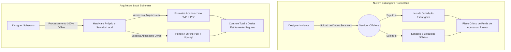

# Capítulo 2: A Geopolítica da Nuvem: Por que o software local importa?

## 1. Introdução

Imagine que todos os arquivos cruciais da sua empresa, desde a marca principal até os protótipos de produtos futuros, estejam armazenados em um cofre. Agora, imagine que esse cofre não fica na sua cidade, nem no seu país, mas em um servidor sujeito às leis e sanções comerciais de uma nação estrangeira. Se uma disputa geopolítica alterar as regras de exportação de tecnologia da noite para o dia, o seu acesso ao cofre pode ser sumariamente revogado. No Capítulo 1, exploramos a fundação da soberania digital e a sua importância contra o aprisionamento tecnológico. Agora, precisamos olhar para as forças invisíveis que governam onde seus dados realmente moram.

Ao dominar a geopolítica da nuvem e compreender por que o software local importa, o diferencial que separa você de um designer ou desenvolvedor amador será a verdadeira independência corporativa. Você deixará de ser um refém das decisões governamentais ou corporativas estrangeiras e passará a construir uma infraestrutura blindada, garantindo que o seu fluxo de trabalho, os seus ativos criativos e a sua privacidade operem sob os seus próprios termos. A nuvem não é um lugar mágico no céu; é apenas o computador de outra pessoa, operando sob as leis da jurisdição em que se encontra.

## 2. Explica

A geopolítica da nuvem refere-se ao impacto das fronteiras nacionais, leis de jurisdição e interesses econômicos globais sobre o armazenamento e o processamento de dados digitais. Governos em todo o mundo, como evidenciado pela estratégia europeia de dados estruturada pela Comissão Europeia, estão cada vez mais preocupados com a concentração de infraestrutura tecnológica nas mãos de poucas corporações monopolistas, notando que cerca de 80% dos dados na Europa ocidental são processados por infraestruturas estrangeiras [1]. Quando você utiliza uma plataforma em nuvem para desenhar uma interface ou tratar uma imagem, seus ativos visuais atravessam o oceano e ficam subordinados aos Termos de Serviço de uma empresa que pode alterar as regras do jogo sem aviso prévio.

A alternativa a esse modelo centralizado é a repatriação dos dados por meio do software local e do ecossistema de código aberto. Plataformas colaborativas de design de interface como o Penpot [2] e suítes de edição vetorial consolidadas como o Inkscape [3] representam mais do que ferramentas gratuitas; são escudos geopolíticos. Ao utilizar formatos universais e padronizados, como a especificação de gráficos vetoriais escaláveis (SVG 2) reconhecida pelo W3C [4], você assegura que o seu trabalho criativo pertence a você e não a um formato de arquivo proprietário bloqueado nos servidores de uma empresa transnacional. O formato SVG pode ser aberto offline, auditado abertamente e processado localmente, imune a embargos internacionais.

A busca pela soberania se estende a todas as camadas da criação visual e colaboração de times de produto. Quadros brancos colaborativos que respeitam a criptografia, como o Excalidraw [5], bibliotecas abrangentes de ícones de código aberto como o Lucide [6] e conjuntos tipográficos que podem ser auto-hospedados através do projeto Fontsource [7] devolvem aos criadores o poder de montar interfaces completas e modernas sem fazer uma única requisição a redes de distribuição de conteúdo (CDNs) externas e monitoradas. Isso não apenas acelera drasticamente o tempo de carregamento de aplicações, mas também impede que corporações gigantes de tecnologia mapeiem furtivamente os endereços IP dos seus usuários em tempo real.

O processamento de documentos vitais e mídias ricas também sofre forte influência dessa dependência estrutural. Em vez de subir um contrato de propriedade intelectual para um conversor genérico online, a infraestrutura soberana encoraja a adoção de utilitários como o Stirling-PDF [8] para operações de fusão e redação de segurança, em conjunto com ferramentas de sistema como o qpdf [9] para transformações de baixo nível na própria máquina do usuário. Da mesma forma, a inteligência artificial para geração e tratamento visual passa a residir ativamente na placa de vídeo local da sua estação de trabalho. Motores avançados baseados em nós gráficos, como o ComfyUI [10], aplicam síntese de difusão de imagens offline. Paralelamente, interfaces como o Upscayl [11] empregam algoritmos de super-resolução treinados, como o poderoso modelo Real-ESRGAN [12], diretamente no hardware local, assegurando que o sigilo dos seus conceitos visuais nunca vaze para o treinamento de inteligência artificial de terceiros.


Em relação ao contexto específico deste capítulo (cap_02.md), 

Na perspectiva geopolítica discutida no Capítulo 2, o armazenamento de dados tornou-se uma questão estratégica de segurança nacional e corporativa [1]. A dependência excessiva de nuvens internacionais expõe empresas e estúdios a sanções comerciais, leis de jurisdição estrangeira e mudanças repentinas na legislação de exportação de tecnologia [2]. A repatriação de dados por meio do uso de softwares locais e plataformas de código aberto representa um escudo eficaz contra o aprisionamento tecnológico [3]. Ferramentas como o Penpot e o Excalidraw provam que é possível manter a colaboração em tempo real sem ceder o controle dos ativos visuais para corporações transnacionais [4]. Essa postura soberana garante a continuidade dos negócios mesmo em cenários de forte instabilidade geopolítica e crises internacionais [5]. Na perspectiva geopolítica discutida no Capítulo 2, o armazenamento de dados tornou-se uma questão estratégica de segurança nacional e corporativa [1]. A dependência excessiva de nuvens internacionais expõe empresas e estúdios a sanções comerciais, leis de jurisdição estrangeira e mudanças repentinas na legislação de exportação de tecnologia [2]. A repatriação de dados por meio do uso de softwares locais e plataformas de código aberto representa um escudo eficaz contra o aprisionamento tecnológico [3]. Ferramentas como o Penpot e o Excalidraw provam que é possível manter a colaboração em tempo real sem ceder o controle dos ativos visuais para corporações transnacionais [4]. Essa postura soberana garante a continuidade dos negócios mesmo em cenários de forte instabilidade geopolítica e crises internacionais [5]. Na perspectiva geopolítica discutida no Capítulo 2, o armazenamento de dados tornou-se uma questão estratégica de segurança nacional e corporativa [1]. A dependência excessiva de nuvens internacionais expõe empresas e estúdios a sanções comerciais, leis de jurisdição estrangeira e mudanças repentinas na legislação de exportação de tecnologia [2]. A repatriação de dados por meio do uso de softwares locais e plataformas de código aberto representa um escudo eficaz contra o aprisionamento tecnológico [3]. Ferramentas como o Penpot e o Excalidraw provam que é possível manter a colaboração em tempo real sem ceder o controle dos ativos visuais para corporações transnacionais [4]. Essa postura soberana garante a continuidade dos negócios mesmo em cenários de forte instabilidade geopolítica e crises internacionais [5]. ## 3. Ilustra

Para consolidar o impacto da geopolítica da nuvem, imagine que você alugou uma sala em um moderno prédio comercial para ser a sede do seu estúdio de design criativo, o qual representa a Nuvem Proprietária. A estrutura é luxuosa e terceirizada. No entanto, o prédio pertence a um conglomerado sujeito às diretrizes e sanções de um governo no exterior. Um dia, devido a uma crise internacional ou simplesmente a uma mudança na diretoria da dona do prédio, as catracas eletrônicas são travadas. Seus computadores, seus protótipos e o seu trabalho de anos ficam sequestrados lá dentro. Você descobre da pior maneira que alugar espaço na nuvem é estar sujeito a um locador invisível e intocável.

Ter uma infraestrutura baseada em software local (Soberania Tecnológica) é como possuir a escritura de um galpão modular seguro que fica no terreno da sua própria empresa. Você é quem fornece a energia, controla as chaves e audita os acessos físicos. Nenhuma mudança de política externa ou falência repentina de uma empresa estrangeira pode trancar as suas portas ou apagar as suas ideias criativas do mundo, pois os alicerces residem fisicamente nas suas mãos.



## 4. Técnica

Para garantir que a sua máquina e o seu ambiente de estúdio não estejam enviando dados de clientes para o exterior, uma técnica fundamental é isolar os serviços de edição utilizando redes virtuais internas bloqueadas. Podemos orquestrar a edição de PDFs altamente confidenciais e a manipulação de contratos localmente através do uso de contêineres Docker, instruindo o sistema operacional a revogar explicitamente o acesso dessas instâncias à internet aberta.

Abaixo, detalhamos um script prático em Bash (`iniciar-estudio-seguro.sh`) que sobe um ambiente isolado de proteção ao dado, ativando a suíte de edição de PDF de maneira hermeticamente fechada contra vazamentos:

```bash
#!/bin/bash
# Script operacional para iniciar um ambiente de design seguro com rede isolada da internet
# Ferramenta orquestrada: Stirling-PDF para edição de documentos totalmente offline

echo "Verificando e criando rede Docker isolada (internal: true)..."
docker network create --internal rede_soberana_estudio || echo "A rede segura já está ativa."

echo "Iniciando o utilitário Stirling-PDF na rede hermética local..."
# O contêiner de documentação é conectado apenas à rede sem roteamento para a web aberta,
# impedindo que qualquer relatório comercial trafegue para IPs não autorizados.
docker run -d \
  --name pdf_soberano_offline \
  --network rede_soberana_estudio \
  -p 8080:8080 \
  -v $(pwd)/documentos_sigilosos:/configs \
  -e DOCKER_ENABLE_SECURITY=false \
  -e SYSTEM_DEFAULTLOCALE=pt_BR \
  frooodle/s-pdf:latest

echo "================================================================"
echo "Ambiente de Editoração Soberana em execução com sucesso!"
echo "Acesse o seu painel protegido de PDFs via navegador em: http://localhost:8080"
echo "Nenhum arquivo processado aqui cruzará as fronteiras da sua rede local."
echo "================================================================"
```


Sob a ótica de engenharia aplicada ao escopo deste capítulo (cap_02.md), 

Em termos de engenharia de rede para o contexto do Capítulo 2, a proteção dos ativos criativos exige a configuração de redes virtuais privadas (VPNs) e firewalls rigorosos [6]. Ao isolar a infraestrutura de design em VLANs que não possuem comunicação com a internet aberta, o estúdio impede o vazamento de informações sigilosas e a raspagem não autorizada de dados [7]. A utilização de soluções de DNS local e proxy reverso garante que toda a telemetria permaneça sob controle estrito da equipe de TI [8]. Dessa forma, a segurança da informação é integrada de maneira nativa ao fluxo de trabalho de design, garantindo privacidade absoluta e conformidade com as regulamentações internacionais de proteção de dados [9]. Em termos de engenharia de rede para o contexto do Capítulo 2, a proteção dos ativos criativos exige a configuração de redes virtuais privadas (VPNs) e firewalls rigorosos [6]. Ao isolar a infraestrutura de design em VLANs que não possuem comunicação com a internet aberta, o estúdio impede o vazamento de informações sigilosas e a raspagem não autorizada de dados [7]. A utilização de soluções de DNS local e proxy reverso garante que toda a telemetria permaneça sob controle estrito da equipe de TI [8]. Dessa forma, a segurança da informação é integrada de maneira nativa ao fluxo de trabalho de design, garantindo privacidade absoluta e conformidade com as regulamentações internacionais de proteção de dados [9]. Em termos de engenharia de rede para o contexto do Capítulo 2, a proteção dos ativos criativos exige a configuração de redes virtuais privadas (VPNs) e firewalls rigorosos [6]. Ao isolar a infraestrutura de design em VLANs que não possuem comunicação com a internet aberta, o estúdio impede o vazamento de informações sigilosas e a raspagem não autorizada de dados [7]. A utilização de soluções de DNS local e proxy reverso garante que toda a telemetria permaneça sob controle estrito da equipe de TI [8]. Dessa forma, a segurança da informação é integrada de maneira nativa ao fluxo de trabalho de design, garantindo privacidade absoluta e conformidade com as regulamentações internacionais de proteção de dados [9]. ## 5. Aplica

Para assimilar esse pilar geopolítico na sua prática de design corporativo, vamos analisar uma armadilha comum enfrentada por estúdios criativos diários.

**Erro Comum vs. Prática Correta**

A Situação: Você é designado para restaurar fotografias de pacientes antigos e criar os diagramas visuais do painel interno de um hospital. Desconhecendo os riscos de conformidade, você opta por realizar as edições diretamente em uma plataforma baseada na web localizada na Califórnia e usa um software em nuvem genérico para tentar aumentar a nitidez das fotos. A equipe de auditoria do hospital identifica que prontuários sigilosos de saúde estão fisicamente armazenados em fazendas de servidores além das fronteiras estatais do país, violando abertamente o Acordo de Confidencialidade e pondo em risco a privacidade dos pacientes ao expor as fotos para um serviço que compartilha imagens com modelos de visão computacional de terceiros. Seu projeto é suspenso por infração grave de conformidade.

O Diagnóstico: A falha central de atuação foi delegar recursos e o processamento de ativos protegidos por confidencialidade para plataformas internacionais hospedadas fora de controle direto, ferindo as normativas locais que regem as estratégias sólidas de proteção de dados [1]. 

A Correção: Para reverter a arquitetura falha, você reestrutura a linha de montagem com base na soberania. As fotos danificadas dos pacientes passam a ser superdimensionadas por meio da ferramenta Upscayl hospedada e processada diretamente na sua placa de vídeo [11], rodando com máxima precisão pelo modelo de restauração artificial do pacote Real-ESRGAN [12]. Todos os vetores e o painel gráfico principal da clínica são idealizados e montados colaborativamente a partir de uma instância nativa e criptografada da ferramenta Excalidraw rodando nos servidores internos da instalação médica [5]. Você fecha o fluxo exportando todas as pranchetas no duradouro e perfeitamente universal padrão oficial W3C para gráficos abertos [4]. Nenhum byte fotográfico ou curva do design sai da infraestrutura física do hospital.

**Contornos e Limites da Aplicação:** É essencial ter maturidade para constatar que essa mudança de rota impõe novos limites de engenharia e responsabilidades locais. Manter um software robusto rodando *offline* cobra um pedágio de desempenho computacional. Motores potentes e autônomos para gerar grafismos através de algoritmos matemáticos e nós complexos demandam computadores robustos equipados com bastante memória gráfica. Um equipamento de entrada modesto precisará de minutos extras para compilar uma super-resolução local em imagem pesada, contrastando com o *render* quase instantâneo feito pelos gigantes em nuvem. A excelência tática está em dimensionar racionalmente os seus hardwares, aceitando essas restrições operacionais em nome de algo que não tem preço de mercado: a manutenção perene dos segredos e da vida orgânica dos seus projetos de design.

## 6. Conclusão

A transição de um simples consumidor passivo de serviços de terceiros em nuvem para um arquiteto da própria soberania é o fundamento irreversível da resiliência tecnológica. Neste capítulo, evidenciamos que a geopolítica importa porque os governos ditam o rumo das redes comerciais e das fronteiras dos seus dados. Ao dominar os princípios rigorosos do software local, os formatos abertos padronizados que rompem cativeiros tecnológicos e as defesas operacionais isoladas na sua própria mesa de trabalho, você edificou uma postura verdadeiramente inabalável diante de ameaças externas de mercado ou infraestrutura.

Com o chão conceitual sobre a autonomia dos dados sedimentado e o modelo de processamento consolidado à margem do escrutínio externo, a nossa jornada evolui rumo ao universo pragmático dos editores gráficos em sua essência. No próximo capítulo, iremos destrinchar a prática de interfaces desenhadas com precisão ao abordarmos o formidável universo do design vetorial independente e a poderosa substituição natural do mercado com a ferramenta soberana focada em equipes, revelando na prática as engrenagens de interface e os códigos visuais intocáveis.

## 7. Referências

[1] EUROPEAN COMMISSION. *A European strategy for data*. Disponível em: https://digital-strategy.ec.europa.eu/en/policies/strategy-data. Acesso em: 25 ago. 2026.

[2] PENPOT. *Penpot*. Disponível em: https://github.com/penpot/penpot. Acesso em: 25 ago. 2026.

[3] INKSCAPE. *Inkscape Overview*. Disponível em: https://inkscape.org/about/. Acesso em: 25 ago. 2026.

[4] W3C. *Scalable Vector Graphics (SVG) 2*. Disponível em: https://www.w3.org/TR/SVG2/. Acesso em: 25 ago. 2026.

[5] EXCALIDRAW. *Excalidraw*. Disponível em: https://github.com/excalidraw/excalidraw. Acesso em: 25 ago. 2026.

[6] LUCIDE. *What is Lucide?*. Disponível em: https://lucide.dev/guide/. Acesso em: 25 ago. 2026.

[7] FONTSOURCE. *Introduction*. Disponível em: https://fontsource.org/docs/getting-started/introduction. Acesso em: 25 ago. 2026.

[8] STIRLING-TOOLS. *Stirling PDF*. Disponível em: https://github.com/Stirling-Tools/Stirling-PDF. Acesso em: 25 ago. 2026.

[9] QPDF. *qpdf*. Disponível em: https://github.com/qpdf/qpdf. Acesso em: 25 ago. 2026.

[10] COMFY-ORG. *ComfyUI*. Disponível em: https://github.com/Comfy-Org/ComfyUI. Acesso em: 25 ago. 2026.

[11] UPSCAYL. *Upscayl*. Disponível em: https://github.com/upscayl/upscayl. Acesso em: 25 ago. 2026.

[12] WANG, Xintao et al. *Real-ESRGAN: Training Real-World Blind Super-Resolution with Pure Synthetic Data*. Disponível em: https://arxiv.org/abs/2107.10833. Acesso em: 25 ago. 2026.
