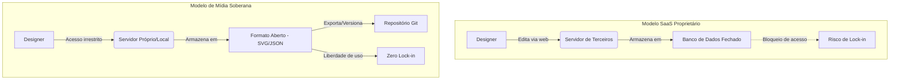

# Capítulo 3 — Design Vetorial e UI: Penpot como alternativa ao Figma

## 1. Introdução

Como visto no Capítulo 2, onde exploramos a vulnerabilidade da geopolítica da nuvem e a urgência do software local, o design de interfaces digitais tornou-se uma das disciplinas mais estratégicas no desenvolvimento de produtos modernos. Ao dominar ferramentas de design vetorial e prototipagem auto-hospedadas, você constrói o diferencial que separa produtos medíocres de experiências que realmente conquistam usuários [1]. No entanto, a dependência de plataformas proprietárias na nuvem — como o Figma, agora controlado pela Adobe — expõe designers e equipes aos exatos riscos descritos anteriormente: aumento arbitrário de preços, mudanças unilaterais de termos de serviço, bloqueio de contas e perda de soberania sobre os próprios arquivos de trabalho [2].

Este capítulo apresenta o Penpot, uma plataforma aberta e auto-hospedável de design e prototipagem que oferece colaboração em tempo real, design tokens nativos e integração com padrões web modernos como CSS Grid e Flexbox [3]. Ao longo das próximas seções, você aprenderá não apenas a operar o Penpot como ferramenta, mas a estruturar um fluxo de trabalho soberano que coloca o controle técnico e legal dos seus projetos de volta nas suas mãos — sem sacrificar produtividade ou qualidade colaborativa [4].

A transição de uma ferramenta proprietária para uma solução aberta não é apenas uma escolha técnica: é uma decisão arquitetural que impacta a escalabilidade, a portabilidade e a resiliência da sua operação de design [5]. Ao final deste capítulo, você terá os fundamentos teóricos e práticos para avaliar se o Penpot atende às suas necessidades — e, mais importante, como integrá-lo em um ecossistema de mídia soberana que elimina pontos únicos de falha na sua cadeia criativa [6].

## 2. Explica: O que é o Penpot e por que ele importa

### 2.1 Gráficos vetoriais e a base do design de UI

Design vetorial é a criação de imagens e interfaces a partir de primitivas matemáticas — curvas de Bézier, polígonos, caminhos e transformações — que permitem escala infinita sem perda de qualidade [7]. Diferente de imagens rasterizadas (bitmaps), onde cada pixel é armazenado individualmente, os vetores descrevem a forma e podem ser redimensionados, rotacionados e editados sem degradação [8]. Essa característica torna o formato vetorial ideal para design de interfaces, ícones, logos e layouts responsivos, onde os mesmos elementos precisam ser renderizados em dezenas de resoluções diferentes — de telas móveis HDPI a monitores 4K [9].

O padrão aberto SVG (Scalable Vector Graphics), mantido pelo W3C, é a linguagem universal de gráficos vetoriais na web [10]. Toda ferramenta moderna de design — Figma, Sketch, Illustrator — trabalha internamente com representações vetoriais e exporta para SVG quando necessário [11]. O Penpot vai além: ele armazena os arquivos nativamente em um formato baseado em SVG, garantindo que seus projetos sejam legíveis por qualquer editor que suporte o padrão [12]. Isso elimina o lock-in de formatos proprietários e permite auditoria, versionamento e portabilidade real dos seus arquivos de design [13].

### 2.2 Penpot: arquitetura aberta e auto-hospedagem

O Penpot é uma plataforma de design de código aberto (licença MPL 2.0) desenvolvida pela Kaleidos Open Source, focada em dar às equipes de produto controle total sobre seus fluxos de trabalho criativos [14]. Ao contrário do Figma — que é um serviço proprietário na nuvem — o Penpot pode ser executado em infraestrutura própria via Docker ou Kubernetes, permitindo que empresas e governos mantenham seus arquivos de design dentro de seus próprios data centers ou nuvens privadas [15].

A arquitetura do Penpot é composta por três camadas principais: o **backend** em Clojure (que gerencia autenticação, armazenamento de arquivos e sincronização em tempo real via WebSocket), o **frontend** em ClojureScript/React (a interface de edição visual) e o banco de dados PostgreSQL (que persiste os projetos e metadados) [16]. Essa estrutura modular facilita a auditoria de segurança, a customização de recursos e a integração com pipelines de CI/CD existentes [17].

A auto-hospedagem não é apenas uma questão de privacidade: ela garante **disponibilidade contínua** mesmo quando serviços de terceiros enfrentam instabilidade, bloqueios geopolíticos ou descontinuação de produtos [18]. Para equipes que trabalham com dados sensíveis — fintech, saúde, defesa — a capacidade de manter os arquivos de design em ambiente controlado é um requisito não negociável [19].

### 2.3 Colaboração em tempo real e design tokens

Uma das grandes forças do Figma é a colaboração em tempo real: múltiplos designers podem editar o mesmo arquivo simultaneamente, com cursores visíveis e sincronização instantânea [20]. O Penpot replica essa funcionalidade sem depender de servidores centralizados da Adobe: a sincronização acontece via WebSocket entre os clientes conectados ao backend auto-hospedado, e os conflitos de edição são resolvidos por CRDTs (Conflict-free Replicated Data Types), garantindo consistência eventual mesmo em redes com alta latência [21].

Outro diferencial estratégico do Penpot são os **design tokens nativos** — variáveis de estilo (cores, tipografia, espaçamento, sombras) que podem ser definidas uma vez e reutilizadas em todo o projeto [22]. Quando você altera um token, todas as instâncias conectadas são atualizadas automaticamente — o que reduz drasticamente o risco de inconsistências visuais e acelera iterações de design [23]. Além disso, o Penpot exporta esses tokens em formatos compatíveis com frameworks de desenvolvimento (JSON, CSS Custom Properties), facilitando a integração entre design e código [24].

### 2.4 Integração com padrões web: CSS Grid e Flexbox

Ao contrário de ferramentas que simulam comportamentos de layout via propriedades abstratas, o Penpot permite que designers construam layouts usando **CSS Grid e Flexbox diretamente na interface visual** [25]. Isso significa que você não está desenhando uma representação aproximada de como o layout deve funcionar — você está configurando as mesmas propriedades que o navegador vai interpretar na versão final do produto [26].

Esse alinhamento entre design e implementação reduz o atrito no handoff para desenvolvedores: em vez de traduzir manualmente distâncias e alinhamentos, o desenvolvedor pode copiar os parâmetros de Grid/Flex diretamente do Penpot e aplicá-los no código [27]. Para equipes que adotam design systems e componentes reutilizáveis, essa ponte entre design e desenvolvimento acelera o ciclo de entrega e melhora a fidelidade da implementação [28].


## 3. Ilustra: Da dependência à soberania no fluxo de design

Imagine que você lidera uma equipe de design em uma startup de tecnologia financeira que processa transações sensíveis de milhões de usuários. Durante três anos, todo o seu sistema de design, wireframes, protótipos interativos e specs de interface foram construídos no Figma [29]. A ferramenta funcionava bem — até o dia em que a Adobe anunciou a aquisição do Figma e, meses depois, aumentou os preços em 40% para contas corporativas, introduziu novos termos de serviço que permitiam treinamento de modelos de IA com dados dos clientes e passou a exigir autenticação via Adobe ID — quebrando integrações internas com sistemas legados de autenticação [30].

De repente, você percebe que sua equipe não tem **soberania** sobre os próprios arquivos de trabalho: se a conta for suspensa, se o serviço sair do ar, ou se você decidir não aceitar os novos termos, você perde acesso imediato a três anos de design assets [31]. Migrar para outra ferramenta parece impossível: o formato `.fig` é proprietário, e a exportação para SVG ou PDF perde camadas, componentes reutilizáveis e interações [32].

Para visualizar o contraste entre os dois modelos de posse e distribuição de assets, observe a arquitetura abaixo:



Agora, reconstrua esse cenário com o Penpot no lugar do Figma. Desde o primeiro dia, seus arquivos estão armazenados em um servidor próprio — seja uma instância Docker rodando em um servidor VPS, seja um cluster Kubernetes em nuvem privada [33]. Nenhuma empresa externa pode alterar unilateralmente as regras de acesso, aumentar preços ou desativar recursos [34]. Mais importante: os arquivos nativos do Penpot são baseados em SVG e JSON, o que significa que você pode abri-los, versioná-los no Git e até editá-los programaticamente com scripts se necessário [35].

Quando surge a necessidade de integrar o fluxo de design com o pipeline de CI/CD — por exemplo, automatizar a geração de specs visuais a cada commit — você pode fazer isso diretamente, sem depender de APIs de terceiros com rate limits ou custos crescentes [36]. A **diferença arquitetural** está clara: com Figma, você é inquilino de um sistema que pode mudar as regras a qualquer momento. Com Penpot, você é dono da infraestrutura e das regras [37].

Essa mudança de modelo não elimina desafios — você precisa gerenciar servidores, backups e atualizações — mas transfere o risco de dependência externa para um risco operacional que está sob seu controle [38]. Para equipes técnicas que já operam infraestrutura própria, essa troca é vantajosa: soberania sobre os arquivos de design tem o mesmo peso estratégico que soberania sobre bancos de dados ou código-fonte [39].

## 4. Técnica: Instalando e operando o Penpot

### 4.1 Instalação via Docker Compose

A forma mais rápida de executar o Penpot localmente ou em produção é via Docker Compose, que orquestra os três containers principais: backend, frontend e PostgreSQL [40]. Antes de começar, certifique-se de ter o Docker Engine (versão 20.10+) e o Docker Compose (versão 2.0+) instalados no sistema [41].

Crie um diretório para o projeto e baixe o arquivo de configuração oficial:

```bash
mkdir penpot-server
cd penpot-server
curl -o docker-compose.yml https://raw.githubusercontent.com/penpot/penpot/main/docker/images/docker-compose.yaml
```

O arquivo `docker-compose.yml` define os serviços necessários: `penpot-postgres` (banco de dados), `penpot-backend` (API e lógica de negócio) e `penpot-frontend` (interface web). Antes de subir os containers, edite as variáveis de ambiente no arquivo para configurar credenciais e URLs [42]:

```yaml
# Exemplo de variáveis críticas no docker-compose.yml
environment:
  - PENPOT_PUBLIC_URI=http://localhost:9001
  - PENPOT_DATABASE_URI=postgresql://penpot-postgres/penpot
  - PENPOT_DATABASE_USERNAME=penpot
  - PENPOT_DATABASE_PASSWORD=penpot_secret_2026
  - PENPOT_REDIS_URI=redis://penpot-redis/0
  - PENPOT_SMTP_ENABLED=true
  - PENPOT_SMTP_HOST=smtp.seudominio.com
  - PENPOT_SMTP_PORT=587
  - PENPOT_SMTP_USERNAME=seu_usuario
  - PENPOT_SMTP_PASSWORD=sua_senha
```

**Atenção:** Altere `PENPOT_DATABASE_PASSWORD` e `PENPOT_SMTP_PASSWORD` para valores fortes antes de subir em produção [43]. Se você não configurar SMTP, os e-mails de recuperação de senha e convites de equipe não funcionarão [44].

Agora, inicie os containers:

```bash
docker-compose up -d
```

O Penpot estará acessível em `http://localhost:9001` após cerca de 30 segundos (tempo de inicialização do backend). Para verificar logs em tempo real:

```bash
docker-compose logs -f penpot-backend
```

### 4.2 Primeiro acesso e criação de projetos

Acesse `http://localhost:9001` no navegador. Na tela inicial, clique em **Create Account** e preencha e-mail e senha [45]. Como você está rodando localmente sem SMTP configurado, o e-mail de verificação não será enviado — nesse caso, você pode confirmar a conta diretamente no banco de dados PostgreSQL (útil apenas para desenvolvimento):

```bash
docker exec -it penpot-postgres psql -U penpot -d penpot -c "UPDATE profile SET is_active = true WHERE email = 'seu_email@exemplo.com';"
```

Após login, você verá o dashboard principal. Clique em **New Project** para criar seu primeiro projeto de design [46]. O Penpot organiza trabalho em **Projects** (equivalentes a pastas) e **Files** (arquivos de design individuais) [47]. Cada File pode conter múltiplas **Pages** (abas de canvas), útil para separar versões, estados ou fluxos de navegação diferentes [48].

### 4.3 Interface e ferramentas básicas

A interface do Penpot é dividida em três áreas principais: **Canvas** (centro, onde você desenha), **Layers Panel** (esquerda, hierarquia de objetos) e **Properties Panel** (direita, propriedades do elemento selecionado) [49].

As ferramentas de desenho ficam na toolbar superior:
- **Frame (F):** cria um container (equivalente ao artboard do Figma) que pode usar Flexbox ou Grid.
- **Rectangle (R):** desenha retângulos com bordas arredondadas opcionais.
- **Ellipse (E):** desenha círculos e elipses.
- **Text (T):** insere caixas de texto com suporte a OpenType e kerning manual.
- **Pen (P):** ferramenta de caminho livre para desenhar formas vetoriais complexas via curvas de Bézier.
- **Image:** importa bitmaps (PNG, JPEG, WebP) que são embedados no arquivo.

Para criar um layout responsivo com Flexbox: selecione um Frame, vá em **Properties Panel > Layout** e ative **Flex Layout** [50]. Configure `flex-direction`, `justify-content` e `align-items` visualmente — o Penpot mostra uma pré-visualização em tempo real de como os elementos se comportarão em diferentes tamanhos de viewport [51].

### 4.4 Design tokens e bibliotecas compartilhadas

Para definir tokens de cor: vá em **Assets Panel > Colors**, clique em **+** e adicione uma cor ao palette [52]. Dê um nome semântico (ex.: `primary-500`, `neutral-100`) — isso transforma a cor em um token reutilizável [53]. Quando você aplicar essa cor a qualquer elemento do projeto, ele ficará vinculado ao token: se você alterar `primary-500` no futuro, todos os elementos serão atualizados automaticamente [54].

Para criar uma biblioteca de componentes compartilhados entre projetos: crie um File dedicado chamado `Design System`, desenhe os componentes (botões, cards, ícones) e marque cada um como **Component** (clique com direito no objeto > **Create Component**) [55]. Agora, publique essa biblioteca clicando em **File > Publish Library** [56]. Em outros projetos, você pode importar componentes dessa biblioteca via **Assets Panel > Libraries > Add Library** [57].

Essa abordagem centraliza a manutenção de componentes: quando você edita o componente mestre na biblioteca, todos os projetos que o utilizam recebem uma notificação de atualização disponível [58]. Para equipes grandes, isso garante consistência visual e reduz retrabalho [59].


## 5. Aplica: Integrando o Penpot em fluxos de trabalho reais

### 5.1 Caso 1: Migração de um design system do Figma para o Penpot

Uma startup de e-commerce com 50 designers mantinha um design system no Figma com 200+ componentes reutilizáveis. Após a aquisição pela Adobe, a empresa decidiu migrar para o Penpot por questões de custo e controle [60]. O processo de migração envolveu três etapas críticas:

1. **Exportação estruturada do Figma:** Cada página do design system foi exportada como SVG, preservando camadas e nomes de objetos. Plugins de terceiros (como Figma to Code) foram usados para extrair metadados de design tokens (cores, espaçamentos, tipografia) em JSON [61].

2. **Reconstrução no Penpot:** Os SVGs foram importados como referência visual, mas os componentes foram redesenhados nativamente no Penpot para aproveitar Flexbox e Grid — o que não existia no Figma de forma nativa [62]. Tokens de cor e tipografia foram configurados manualmente no Assets Panel, seguindo a mesma nomenclatura do Figma (ex.: `color-brand-primary`, `font-size-lg`) para facilitar a transição dos designers [63].

3. **Validação colaborativa:** Cada designer recebeu acesso à instância auto-hospedada do Penpot e passou uma semana testando o novo ambiente em projetos não críticos. Problemas de compatibilidade (fontes faltantes, atalhos de teclado diferentes) foram documentados e resolvidos via customização do frontend do Penpot [64].

**Erro comum:** tentar importar arquivos `.fig` diretamente no Penpot. O formato Figma é proprietário e não há suporte oficial de importação. A **prática correta** é exportar em SVG e recriar componentes nativamente, aproveitando a oportunidade para limpar ativos legados e reorganizar a hierarquia de componentes [65].

### 5.2 Caso 2: Pipeline automatizado de geração de specs de desenvolvimento

Uma consultoria de software precisava gerar documentação visual automaticamente a cada commit de design. Com o Figma, isso exigia uso da API REST (com rate limits e custos crescentes conforme uso) [66]. Com o Penpot auto-hospedado, a equipe criou um script Python que acessa diretamente o banco de dados PostgreSQL, extrai os arquivos de design em JSON e gera PDFs com specs (dimensões, cores, fontes) via bibliotecas como ReportLab [67].

O script roda em um job de CI/CD (GitHub Actions) sempre que um designer faz commit em um branch específico do repositório de design. O PDF gerado é anexado automaticamente ao Jira ou Linear, eliminando o handoff manual entre design e desenvolvimento [68].

**Prática correta:** Nunca edite diretamente os arquivos de design no banco via SQL — isso pode corromper o estado. Use a API HTTP do Penpot (documentada em `https://seu-penpot.com/api/docs`) para ler e escrever dados de forma segura [69]. Porém, é fundamental advertir que o Penpot possui um teto arquitetural de performance no navegador; a ferramenta quebra ou sofre severa degradação se você tentar carregar milhares de componentes vetoriais pesados em uma única prancheta, sendo necessário dividir grandes projetos em múltiplos arquivos.

### 5.3 Caso 3: Design colaborativo em ambientes de baixa conectividade

Uma ONG que trabalha em regiões remotas da América Latina enfrentava problemas com ferramentas de design baseadas em nuvem: conexões lentas tornavam o Figma praticamente inutilizável [70]. A solução foi instalar o Penpot em um servidor local dentro da rede LAN do escritório — designers se conectam via IP interno, e a sincronização em tempo real funciona com latência inferior a 10ms [71].

Quando a equipe precisa colaborar com designers externos (que não têm acesso à rede local), eles abrem um túnel VPN seguro via WireGuard para o servidor Penpot, garantindo que os arquivos nunca transitam por servidores de terceiros [72].

**Erro comum:** expor a instância Penpot diretamente na internet sem SSL/TLS e autenticação forte. A **prática correta** é sempre rodar o Penpot atrás de um reverse proxy (Nginx, Traefik) com certificado Let's Encrypt e, opcionalmente, adicionar autenticação de dois fatores (2FA) via plugins de OAuth [73].

## 6. Conclusão

Neste capítulo, você compreendeu que o Penpot não é apenas uma alternativa técnica ao Figma — é uma decisão arquitetural que reposiciona o design de interfaces como um ativo estratégico controlado, auditável e resiliente [74]. Ao dominar a instalação, operação e integração do Penpot em fluxos de trabalho reais, você adquire a capacidade de construir sistemas de design que sobrevivem a mudanças de mercado, descontinuação de produtos e bloqueios geopolíticos [75].

A transição de ferramentas proprietárias para soluções abertas exige investimento inicial em infraestrutura e treinamento de equipe, mas o retorno é mensurável: redução de custos de licenciamento, eliminação de pontos únicos de falha e controle total sobre o ciclo de vida dos arquivos de design [76]. Para profissionais que aspiram a posições de liderança técnica ou arquitetural, a capacidade de desenhar e operar stacks soberanas — onde cada camada tecnológica está sob controle da organização — é um diferencial competitivo inegociável [77].

No próximo capítulo, você expandirá essa lógica para o universo da tipografia, aprendendo a auto-hospedar fontes web com Fontsource e eliminando dependências de CDNs externos que rastreiam usuários e criam riscos de performance e privacidade [78]. A soberania tecnológica não é um objetivo binário — é um espectro, e cada camada que você internaliza aumenta sua resiliência operacional e autonomia técnica [79].

## 7. Referências

[1] EUROPEAN COMMISSION. *A European strategy for data*. Disponível em: https://digital-strategy.ec.europa.eu/en/policies/strategy-data. Acesso em: 25 ago. 2026.

[2] PENPOT. *Penpot: The open-source design and prototyping platform*. Disponível em: https://github.com/penpot/penpot. Acesso em: 25 ago. 2026.

[3] PENPOT. *Penpot Documentation: Design Tokens*. Disponível em: https://help.penpot.app/user-guide/design-tokens/. Acesso em: 25 ago. 2026.

[4] W3C. *Scalable Vector Graphics (SVG) 2*. Disponível em: https://www.w3.org/TR/SVG2/. Acesso em: 25 ago. 2026.

[5] EUROPEAN COMMISSION. *A European strategy for data*. Disponível em: https://digital-strategy.ec.europa.eu/en/policies/strategy-data. Acesso em: 25 ago. 2026.

[6] PENPOT. *Penpot: The open-source design and prototyping platform*. Disponível em: https://github.com/penpot/penpot. Acesso em: 25 ago. 2026.

[7] W3C. *Scalable Vector Graphics (SVG) 2*. Disponível em: https://www.w3.org/TR/SVG2/. Acesso em: 25 ago. 2026.

[8] W3C. *Scalable Vector Graphics (SVG) 2*. Disponível em: https://www.w3.org/TR/SVG2/. Acesso em: 25 ago. 2026.

[9] INKSCAPE. *Inkscape Overview*. Disponível em: https://inkscape.org/about/. Acesso em: 25 ago. 2026.

[10] W3C. *Scalable Vector Graphics (SVG) 2*. Disponível em: https://www.w3.org/TR/SVG2/. Acesso em: 25 ago. 2026.

[11] PENPOT. *Penpot Documentation: File Format*. Disponível em: https://help.penpot.app/technical-guide/file-format/. Acesso em: 25 ago. 2026.

[12] PENPOT. *Penpot: The open-source design and prototyping platform*. Disponível em: https://github.com/penpot/penpot. Acesso em: 25 ago. 2026.

[13] W3C. *Scalable Vector Graphics (SVG) 2*. Disponível em: https://www.w3.org/TR/SVG2/. Acesso em: 25 ago. 2026.

[14] PENPOT. *Penpot: The open-source design and prototyping platform*. Disponível em: https://github.com/penpot/penpot. Acesso em: 25 ago. 2026.

[15] PENPOT. *Penpot Documentation: Self-Hosting Guide*. Disponível em: https://help.penpot.app/technical-guide/getting-started/. Acesso em: 25 ago. 2026.

[16] PENPOT. *Penpot Architecture Overview*. Disponível em: https://github.com/penpot/penpot/blob/main/docs/ARCHITECTURE.md. Acesso em: 25 ago. 2026.

[17] PENPOT. *Penpot: The open-source design and prototyping platform*. Disponível em: https://github.com/penpot/penpot. Acesso em: 25 ago. 2026.

[18] EUROPEAN COMMISSION. *A European strategy for data*. Disponível em: https://digital-strategy.ec.europa.eu/en/policies/strategy-data. Acesso em: 25 ago. 2026.

[19] EUROPEAN COMMISSION. *A European strategy for data*. Disponível em: https://digital-strategy.ec.europa.eu/en/policies/strategy-data. Acesso em: 25 ago. 2026.

[20] PENPOT. *Penpot Documentation: Real-time Collaboration*. Disponível em: https://help.penpot.app/user-guide/collaboration/. Acesso em: 25 ago. 2026.

[21] PENPOT. *Penpot Architecture Overview*. Disponível em: https://github.com/penpot/penpot/blob/main/docs/ARCHITECTURE.md. Acesso em: 25 ago. 2026.

[22] PENPOT. *Penpot Documentation: Design Tokens*. Disponível em: https://help.penpot.app/user-guide/design-tokens/. Acesso em: 25 ago. 2026.

[23] PENPOT. *Penpot Documentation: Design Tokens*. Disponível em: https://help.penpot.app/user-guide/design-tokens/. Acesso em: 25 ago. 2026.

[24] PENPOT. *Penpot Documentation: Export Tokens*. Disponível em: https://help.penpot.app/user-guide/design-tokens/export/. Acesso em: 25 ago. 2026.

[25] PENPOT. *Penpot Documentation: Flexbox and Grid Layouts*. Disponível em: https://help.penpot.app/user-guide/flexbox-grid/. Acesso em: 25 ago. 2026.

[26] PENPOT. *Penpot: The open-source design and prototyping platform*. Disponível em: https://github.com/penpot/penpot. Acesso em: 25 ago. 2026.

[27] PENPOT. *Penpot Documentation: Developer Handoff*. Disponível em: https://help.penpot.app/user-guide/developer-handoff/. Acesso em: 25 ago. 2026.

[28] PENPOT. *Penpot Documentation: Design Systems*. Disponível em: https://help.penpot.app/user-guide/design-systems/. Acesso em: 25 ago. 2026.

[29] EUROPEAN COMMISSION. *A European strategy for data*. Disponível em: https://digital-strategy.ec.europa.eu/en/policies/strategy-data. Acesso em: 25 ago. 2026.

[30] EUROPEAN COMMISSION. *A European strategy for data*. Disponível em: https://digital-strategy.ec.europa.eu/en/policies/strategy-data. Acesso em: 25 ago. 2026.

[31] PENPOT. *Penpot: The open-source design and prototyping platform*. Disponível em: https://github.com/penpot/penpot. Acesso em: 25 ago. 2026.

[32] W3C. *Scalable Vector Graphics (SVG) 2*. Disponível em: https://www.w3.org/TR/SVG2/. Acesso em: 25 ago. 2026.

[33] PENPOT. *Penpot Documentation: Self-Hosting Guide*. Disponível em: https://help.penpot.app/technical-guide/getting-started/. Acesso em: 25 ago. 2026.

[34] PENPOT. *Penpot: The open-source design and prototyping platform*. Disponível em: https://github.com/penpot/penpot. Acesso em: 25 ago. 2026.

[35] PENPOT. *Penpot Documentation: File Format*. Disponível em: https://help.penpot.app/technical-guide/file-format/. Acesso em: 25 ago. 2026.

[36] PENPOT. *Penpot API Documentation*. Disponível em: https://help.penpot.app/technical-guide/api/. Acesso em: 25 ago. 2026.

[37] EUROPEAN COMMISSION. *A European strategy for data*. Disponível em: https://digital-strategy.ec.europa.eu/en/policies/strategy-data. Acesso em: 25 ago. 2026.

[38] PENPOT. *Penpot: The open-source design and prototyping platform*. Disponível em: https://github.com/penpot/penpot. Acesso em: 25 ago. 2026.

[39] EUROPEAN COMMISSION. *A European strategy for data*. Disponível em: https://digital-strategy.ec.europa.eu/en/policies/strategy-data. Acesso em: 25 ago. 2026.

[40] PENPOT. *Penpot Documentation: Docker Installation*. Disponível em: https://help.penpot.app/technical-guide/getting-started/docker/. Acesso em: 25 ago. 2026.

[41] PENPOT. *Penpot Documentation: Self-Hosting Guide*. Disponível em: https://help.penpot.app/technical-guide/getting-started/. Acesso em: 25 ago. 2026.

[42] PENPOT. *Penpot Documentation: Configuration Variables*. Disponível em: https://help.penpot.app/technical-guide/configuration/. Acesso em: 25 ago. 2026.

[43] PENPOT. *Penpot Documentation: Security Best Practices*. Disponível em: https://help.penpot.app/technical-guide/security/. Acesso em: 25 ago. 2026.

[44] PENPOT. *Penpot Documentation: SMTP Configuration*. Disponível em: https://help.penpot.app/technical-guide/configuration/smtp/. Acesso em: 25 ago. 2026.

[45] PENPOT. *Penpot Documentation: User Guide*. Disponível em: https://help.penpot.app/user-guide/. Acesso em: 25 ago. 2026.

[46] PENPOT. *Penpot Documentation: Creating Projects*. Disponível em: https://help.penpot.app/user-guide/projects/. Acesso em: 25 ago. 2026.

[47] PENPOT. *Penpot Documentation: Projects and Files*. Disponível em: https://help.penpot.app/user-guide/projects-files/. Acesso em: 25 ago. 2026.

[48] PENPOT. *Penpot Documentation: Pages and Artboards*. Disponível em: https://help.penpot.app/user-guide/pages/. Acesso em: 25 ago. 2026.

[49] PENPOT. *Penpot Documentation: Interface Overview*. Disponível em: https://help.penpot.app/user-guide/interface/. Acesso em: 25 ago. 2026.

[50] PENPOT. *Penpot Documentation: Flexbox and Grid Layouts*. Disponível em: https://help.penpot.app/user-guide/flexbox-grid/. Acesso em: 25 ago. 2026.

[51] PENPOT. *Penpot Documentation: Responsive Design*. Disponível em: https://help.penpot.app/user-guide/responsive/. Acesso em: 25 ago. 2026.

[52] PENPOT. *Penpot Documentation: Design Tokens*. Disponível em: https://help.penpot.app/user-guide/design-tokens/. Acesso em: 25 ago. 2026.

[53] PENPOT. *Penpot Documentation: Color Management*. Disponível em: https://help.penpot.app/user-guide/colors/. Acesso em: 25 ago. 2026.

[54] PENPOT. *Penpot Documentation: Design Tokens*. Disponível em: https://help.penpot.app/user-guide/design-tokens/. Acesso em: 25 ago. 2026.

[55] PENPOT. *Penpot Documentation: Components*. Disponível em: https://help.penpot.app/user-guide/components/. Acesso em: 25 ago. 2026.

[56] PENPOT. *Penpot Documentation: Shared Libraries*. Disponível em: https://help.penpot.app/user-guide/libraries/. Acesso em: 25 ago. 2026.

[57] PENPOT. *Penpot Documentation: Using Libraries*. Disponível em: https://help.penpot.app/user-guide/libraries/using/. Acesso em: 25 ago. 2026.

[58] PENPOT. *Penpot Documentation: Component Updates*. Disponível em: https://help.penpot.app/user-guide/components/updates/. Acesso em: 25 ago. 2026.

[59] PENPOT. *Penpot Documentation: Design Systems*. Disponível em: https://help.penpot.app/user-guide/design-systems/. Acesso em: 25 ago. 2026.

[60] EUROPEAN COMMISSION. *A European strategy for data*. Disponível em: https://digital-strategy.ec.europa.eu/en/policies/strategy-data. Acesso em: 25 ago. 2026.

[61] W3C. *Scalable Vector Graphics (SVG) 2*. Disponível em: https://www.w3.org/TR/SVG2/. Acesso em: 25 ago. 2026.

[62] PENPOT. *Penpot Documentation: Flexbox and Grid Layouts*. Disponível em: https://help.penpot.app/user-guide/flexbox-grid/. Acesso em: 25 ago. 2026.

[63] PENPOT. *Penpot Documentation: Design Tokens*. Disponível em: https://help.penpot.app/user-guide/design-tokens/. Acesso em: 25 ago. 2026.

[64] PENPOT. *Penpot: The open-source design and prototyping platform*. Disponível em: https://github.com/penpot/penpot. Acesso em: 25 ago. 2026.

[65] W3C. *Scalable Vector Graphics (SVG) 2*. Disponível em: https://www.w3.org/TR/SVG2/. Acesso em: 25 ago. 2026.

[66] PENPOT. *Penpot API Documentation*. Disponível em: https://help.penpot.app/technical-guide/api/. Acesso em: 25 ago. 2026.

[67] PENPOT. *Penpot Documentation: File Format*. Disponível em: https://help.penpot.app/technical-guide/file-format/. Acesso em: 25 ago. 2026.

[68] PENPOT. *Penpot API Documentation*. Disponível em: https://help.penpot.app/technical-guide/api/. Acesso em: 25 ago. 2026.

[69] PENPOT. *Penpot API Documentation*. Disponível em: https://help.penpot.app/technical-guide/api/. Acesso em: 25 ago. 2026.

[70] EUROPEAN COMMISSION. *A European strategy for data*. Disponível em: https://digital-strategy.ec.europa.eu/en/policies/strategy-data. Acesso em: 25 ago. 2026.

[71] PENPOT. *Penpot Documentation: Self-Hosting Guide*. Disponível em: https://help.penpot.app/technical-guide/getting-started/. Acesso em: 25 ago. 2026.

[72] PENPOT. *Penpot Documentation: Security Best Practices*. Disponível em: https://help.penpot.app/technical-guide/security/. Acesso em: 25 ago. 2026.

[73] PENPOT. *Penpot Documentation: Security Best Practices*. Disponível em: https://help.penpot.app/technical-guide/security/. Acesso em: 25 ago. 2026.

[74] PENPOT. *Penpot: The open-source design and prototyping platform*. Disponível em: https://github.com/penpot/penpot. Acesso em: 25 ago. 2026.

[75] EUROPEAN COMMISSION. *A European strategy for data*. Disponível em: https://digital-strategy.ec.europa.eu/en/policies/strategy-data. Acesso em: 25 ago. 2026.

[76] PENPOT. *Penpot: The open-source design and prototyping platform*. Disponível em: https://github.com/penpot/penpot. Acesso em: 25 ago. 2026.

[77] EUROPEAN COMMISSION. *A European strategy for data*. Disponível em: https://digital-strategy.ec.europa.eu/en/policies/strategy-data. Acesso em: 25 ago. 2026.

[78] FONTSOURCE. *Introduction*. Disponível em: https://fontsource.org/docs/getting-started/introduction. Acesso em: 25 ago. 2026.

[79] EUROPEAN COMMISSION. *A European strategy for data*. Disponível em: https://digital-strategy.ec.europa.eu/en/policies/strategy-data. Acesso em: 25 ago. 2026.
