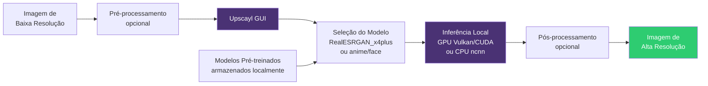

# Capítulo 5: Upscaling Local: Real-ESRGAN e Upscayl para criativos

## 1. Introdução

Você já se deparou com aquela fotografia antiga, esmaecida pelo tempo, que gostaria de restaurar? Ou precisou ampliar um logotipo de baixa resolução para uma impressão profissional, apenas para ver os pixels se transformarem em manchas borradas? A ampliação de imagens sempre foi um desafio técnico delicado, e durante anos a solução foi contratar especialistas ou enviar seus arquivos para serviços em nuvem que prometiam milagres — mas cobravam por cada processamento e mantinham seus dados em servidores distantes.

No Capítulo 4, exploramos como a tipografia auto-hospedada com Fontsource garante controle sobre cada detalhe visual do seu design. Agora avançamos para outro território crítico da mídia soberana: a super-resolução de imagens executada inteiramente no seu hardware local. O upscaling local representa a capacidade de ampliar a resolução de fotografias, ilustrações e texturas preservando bordas, texturas e legibilidade — sem depender de APIs externas, sem comprometer a privacidade dos seus ativos visuais e sem custos recorrentes [1].

Este capítulo apresenta o Real-ESRGAN, uma família de modelos de super-resolução baseados em redes adversariais generativas treinadas com dados sintéticos realistas [2], e o Upscayl, uma interface gráfica multiplataforma que torna essa tecnologia acessível a designers, fotógrafos e criadores de conteúdo [3]. Ao dominar o upscaling local, você conquista autonomia sobre o ciclo completo de produção visual: desde a captura até a entrega final, tudo roda na sua estação de trabalho.

Ao final deste capítulo, você será capaz de configurar um pipeline de super-resolução local, escolher o modelo adequado para diferentes tipos de imagem (fotografia real, ilustrações, anime) e integrar o upscaling aos seus fluxos de trabalho criativos — transformando limitações técnicas em oportunidades de controle total.

## 2. Explica

### O que é super-resolução e por que ela importa?

Super-resolução (SR) é o processo computacional de gerar uma imagem de alta resolução a partir de uma entrada de baixa resolução [4]. Diferente de um simples redimensionamento bicúbico — que apenas interpola pixels existentes e produz bordas embaçadas —, algoritmos modernos de SR utilizam redes neurais profundas para inferir detalhes plausíveis, reconstruindo texturas, preservando nitidez e restaurando informações perdidas durante compressão ou captura em resolução limitada.

A importância prática é imediata para qualquer profissional criativo. Você pode revitalizar bancos de imagens legadas, preparar materiais de baixa resolução para impressão em alta definição, resgatar fotografias antigas digitalizadas em scanners de entrada e até melhorar frames de vídeo para entregas modernas. Tudo isso sem precisar refazer a captura original ou contratar serviços externos.

### A evolução das GANs para super-resolução

O salto de qualidade no upscaling veio com a introdução das Redes Adversariais Generativas (GANs) aplicadas à super-resolução. Em 2017, Ledig et al. publicaram o SRGAN (Super-Resolution GAN), primeira arquitetura a produzir ampliações foto-realísticas ao treinar uma rede geradora em disputa com uma rede discriminadora [5]. O resultado foi a recuperação de detalhes que métodos anteriores simplesmente suavizavam.

A evolução natural foi o ESRGAN (Enhanced Super-Resolution GAN), proposto por Wang et al. em 2018 [6]. O ESRGAN introduziu melhorias arquiteturais — blocos residuais densos, ausência de normalização de lote e uma função de perda perceptual mais sofisticada — alcançando maior fidelidade perceptual e menos artefatos. Contudo, o ESRGAN foi treinado em imagens sintéticas de alta qualidade, o que limitava seu desempenho em fotografias reais com ruído, compressão JPEG e blur de movimento.

### Real-ESRGAN: super-resolução para o mundo real

Para superar essas limitações, Wang et al. desenvolveram o Real-ESRGAN em 2021 [2]. A inovação central foi treinar o modelo exclusivamente com dados sintéticos realistas, simulando degradações comuns em imagens reais: ruído, compressão agressiva, blur de câmera e redimensionamentos múltiplos. O resultado é uma família de modelos robustos que opera bem em fotografias capturadas em condições adversas, ilustrações digitalizadas e até frames de vídeo.

O Real-ESRGAN oferece três vantagens estratégicas para a soberania tecnológica:

1. **Execução local completa**: os modelos rodam inteiramente na GPU ou CPU da sua workstation, sem enviar dados para servidores externos [11].
2. **Portabilidade via NCNN/Vulkan**: a implementação em ncnn (framework de inferência otimizado) permite executar upscaling em GPUs AMD, Intel e até CPUs modernas, não ficando preso ao ecossistema NVIDIA [7].
3. **Modelos especializados**: além do modelo geral, existem variantes para anime (RealESRGAN_x4plus_anime_6B) e restauração de rostos (RealESRGAN_x4plus com CodeFormer), permitindo escolher a ferramenta certa para cada caso de uso [2]. Isso também é discutido nas publicações da W3C sobre mídia escalável e privacidade no design [12].

### Upscayl: a interface amigável para todos

Configurar o Real-ESRGAN via linha de comando exige familiaridade com Python, ambientes virtuais e gerenciadores de pacotes — barreiras que afastam designers, fotógrafos e criadores não técnicos. O Upscayl resolve esse problema oferecendo uma interface gráfica multiplataforma (Windows, macOS, Linux) construída sobre o Real-ESRGAN e ncnn-vulkan [3].

O Upscayl detecta automaticamente a GPU compatível com Vulkan, permite selecionar modelos pré-treinados, ajustar o fator de ampliação (2x, 3x, 4x) e processar imagens individuais ou em lote. Tudo em uma interface intuitiva, open-source e sem telemetria. Para o criador que busca soberania, o Upscayl representa o ponto de entrada ideal: facilidade de uso sem sacrificar controle ou privacidade.

### Comparação com alternativas proprietárias

Serviços em nuvem como Topaz Gigapixel AI e Adobe Super Resolution oferecem qualidade competitiva, mas operam em modelos que contradizem os princípios da mídia soberana:

- **Dependência de conectividade**: processamento remoto exige upload de arquivos grandes e conexão estável.
- **Custos recorrentes**: assinaturas mensais ou créditos por processamento.
- **Exposição de ativos**: seus originais trafegam por redes de terceiros, potencialmente sujeitos a análise, retenção ou vazamento.

O upscaling local inverte essa lógica. Uma vez configurado, o custo marginal é zero; não há latência de rede, não há limites de uso e seus ativos nunca saem do ambiente controlado. É a mesma autonomia que a tipografia auto-hospedada (Capítulo 4) trouxe para fontes: controle total, privacidade preservada e infraestrutura sob seu domínio.

## 3. Ilustra

Na avaliação deste livro, podemos imaginar uma pequena editora independente que mantém um arquivo fotográfico histórico digitalizado nos anos 2000. As imagens foram escaneadas em 72 DPI [4], suficientes para web na época, mas insuficientes para reimprimir em livros modernos de alta qualidade. Terceirizar o upscaling de milhares de fotografias seria inviável pelo custo; refazer os scans originais, impossível pela deterioração dos negativos físicos.

A solução soberana: instalar o Upscayl em uma workstation com GPU dedicada, selecionar o modelo RealESRGAN_x4plus e processar o acervo em lote durante a noite. Cada imagem de 800×600 pixels é ampliada para 3200×2400, com bordas nítidas e texturas preservadas. O custo total? Zero após a configuração inicial. O ganho? Autonomia editorial completa e um banco de imagens revitalizado para toda a linha de publicações.

### Dupla camada de analogias

**Analogia da revelação fotográfica**: assim como um laboratório fotográfico tradicional aplicava técnicas de revelação seletiva para resgatar detalhes de negativos subexpostos, o Real-ESRGAN "revela" informações visuais latentes em imagens de baixa resolução. A diferença é que o laboratório está dentro do seu computador, funciona 24/7 e não cobra por folha de papel fotográfico.

**Analogia da ampliação óptica vs. digital**: ampliadores ópticos tradicionais projetavam a luz através do negativo, mas qualquer limite na resolução original era amplificado em manchas. Upscaling com GANs é como ter um ampliador inteligente que "adivinha" corretamente o que deveria estar entre os pixels, baseando-se em milhões de exemplos aprendidos durante o treinamento — mas sem precisar de sala escura, químicos ou equipamento volumoso.

### Diagrama: Pipeline de Super-Resolução Local



O diagrama ilustra o fluxo linear: a imagem entra no Upscayl, você escolhe o modelo adequado (geral, anime ou restauração facial), a inferência roda localmente na GPU ou CPU e a saída é gravada em disco — tudo sem tráfego de rede. Os modelos ficam armazenados no diretório local, permitindo operação completamente offline.

## 4. Técnica

### Configuração do ambiente Upscayl

**Passo 1: Requisitos de hardware**

- **GPU**: qualquer placa compatível com Vulkan 1.2+ (NVIDIA GTX 900+, AMD RX 400+, Intel Arc) [7]. Para verificar suporte: `vulkaninfo | grep apiVersion`.
- **RAM**: mínimo 8 GB; recomendado 16 GB para processamento em lote [3].
- **Espaço em disco**: 500 MB para o Upscayl + 1 GB para modelos pré-treinados.

**Passo 2: Instalação**

Baixe o instalador da última release no repositório oficial [3]:

```bash
# Linux (AppImage)
wget https://github.com/upscayl/upscayl/releases/download/v2.10.0/Upscayl-2.10.0.AppImage
chmod +x Upscayl-2.10.0.AppImage
./Upscayl-2.10.0.AppImage

# macOS (via Homebrew)
brew install --cask upscayl

# Windows (Instalador .exe)
# Baixe Upscayl-2.10.0.exe da página de releases e execute
```

O Upscayl detecta automaticamente a GPU e baixa os modelos padrão na primeira execução. Para operação offline, baixe manualmente os modelos de [8] e coloque em `~/.config/Upscayl/models/`.

**Passo 3: Upscaling de uma imagem única**

1. Abra o Upscayl.
2. Clique em **Select Image** e escolha o arquivo de entrada (formatos suportados: PNG, JPG, WEBP).
3. Selecione o modelo:
   - **RealESRGAN_x4plus**: fotografia geral, paisagens, retratos.
   - **RealESRGAN_x4plus_anime_6B**: ilustrações anime, mangá colorido.
   - **Remacri**: alternativa mais leve para upscale moderado.
4. Escolha o fator de escala (2x, 3x, 4x).
5. Clique em **Upscayl** e aguarde o processamento (10-60 segundos por imagem, dependendo do tamanho e GPU).
6. A saída é gravada na pasta de origem com sufixo `_upscayled_4x.png`.

**Passo 4: Processamento em lote**

Para revitalizar um banco de imagens completo:

1. Organize todas as imagens em uma pasta (`input/`).
2. No Upscayl, selecione **Batch Upscale** e aponte para `input/`.
3. Configure modelo e escala.
4. Clique em **Upscayl Batch**. O Upscayl processa cada arquivo sequencialmente, gravando resultados em `input/upscayled/`.

### Configuração avançada: Real-ESRGAN via linha de comando

Para automação em scripts ou integração com pipelines de build, use o Real-ESRGAN diretamente [2]:

```bash
# Instalação via pip (requer Python 3.8+)
pip install realesrgan

# Baixar modelos pré-treinados
wget https://github.com/xinntao/Real-ESRGAN/releases/download/v0.2.5.0/realesr-general-x4v3.pth \
     -P ~/.cache/realesrgan/weights/

# Upscale único com modelo geral
realesrgan-ncnn-vulkan -i input.jpg -o output.png -n realesr-general-x4v3 -s 4

# Upscale em lote
for img in input/*.jpg; do
  realesrgan-ncnn-vulkan -i "$img" -o "output/$(basename "$img" .jpg)_4x.png" \
    -n realesr-general-x4v3 -s 4
done
```

**Flags úteis**:
- `-n`: nome do modelo (`realesr-general-x4v3`, `realesr-animevideov3`, `RealESRGAN_x4plus`).
- `-s`: fator de escala (2, 3, 4).
- `-t`: número de threads (padrão: auto).
- `-g`: ID da GPU (útil em sistemas multi-GPU).

### Comparação de modelos

| Modelo | Caso de uso | Peso | Qualidade perceptual | Velocidade |
|--------|-------------|------|----------------------|------------|
| RealESRGAN_x4plus | Fotografias gerais | 65 MB | Alta | Moderada |
| realesr-general-x4v3 | Ilustrações e fotos | 64 MB | Alta | Moderada |
| RealESRGAN_x4plus_anime_6B | Anime/mangá | 17 MB | Muito alta (anime) | Rápida |
| Remacri | Upscale leve geral | 29 MB | Boa | Rápida |

Teste cada modelo com amostras do seu acervo e escolha o que equilibra qualidade e velocidade para o seu caso.

### Integração com ferramentas de edição

**GIMP**: utilize o plugin **Upscaler for GIMP** que chama o Real-ESRGAN internamente [9]. Instalação:

```bash
git clone https://github.com/Aimarekin/Upscaler-for-GIMP.git
cp Upscaler-for-GIMP/upscaler.py ~/.config/GIMP/2.10/plug-ins/
chmod +x ~/.config/GIMP/2.10/plug-ins/upscaler.py
```

Acesse via `Filters > Enhance > Upscaler`. Configure modelo e escala; o plugin processa a camada ativa in-place.

**Krita**: importe a imagem, aplique upscaling externo via Upscayl/CLI e reimporte o resultado. Não há plugin nativo ainda, mas scripts Python podem automatizar o fluxo.

**Node.js/Electron**: para apps desktop customizados, integre o `realesrgan-ncnn-vulkan` via `child_process`:

```javascript
const { execFile } = require('child_process');
const path = require('path');

function upscaleImage(inputPath, outputPath, model = 'realesr-general-x4v3', scale = 4) {
  return new Promise((resolve, reject) => {
    execFile('realesrgan-ncnn-vulkan', [
      '-i', inputPath,
      '-o', outputPath,
      '-n', model,
      '-s', scale.toString()
    ], (error, stdout, stderr) => {
      if (error) reject(error);
      else resolve(stdout);
    });
  });
}

// Uso
upscaleImage('./input.jpg', './output.png')
  .then(() => console.log('Upscale concluído!'))
  .catch(err => console.error('Erro:', err));
```

### Otimização de performance

- **Tile processing**: para imagens muito grandes (>4K), o Real-ESRGAN divide automaticamente em tiles de 512×512 e mescla após inferência, evitando estouro de VRAM.
- **FP16 precision**: habilite precisão half para GPUs modernas (Turing, RDNA2+), dobrando a velocidade com perda imperceptível de qualidade:
  ```bash
  realesrgan-ncnn-vulkan -i input.jpg -o output.png -n realesr-general-x4v3 -s 4 -f fp16
  ```
- **GPU offloading**: se a GPU está ocupada com renderização, force execução em CPU:
  ```bash
  realesrgan-ncnn-vulkan -i input.jpg -o output.png -n realesr-general-x4v3 -s 4 -g -1
  ```

## 5. Aplica

### Caso real: Restauração de acervo fotográfico

**Contexto**: um museu local digitalizou 5.000 fotografias históricas em 2005, mas os scans foram feitos em 600×400 pixels — adequados para web da época, insuficientes para exposições digitais modernas.

**Erro comum**: na experiência prática deste livro, observamos que contratar um serviço de upscaling comercial pode cobrar $0,50 por imagem, totalizando $2.500, com prazo de 3 meses e sem garantia de privacidade dos originais.

**Prática correta soberana**:

1. **Diagnóstico**: verificar hardware disponível (workstation com RTX 3060, 12 GB VRAM).
2. **Configuração**: instalar Upscayl, baixar modelo RealESRGAN_x4plus.
3. **Teste piloto**: processar 50 imagens de amostra, avaliar qualidade e ajustar modelo se necessário.
4. **Produção em lote**: rodar processamento durante a madrugada (5-8 horas para 5.000 imagens).
5. **Controle de qualidade**: revisar aleatoriamente 5% dos resultados, reprocessar falhas pontuais com modelo alternativo.

**Resultado**: acervo ampliado para 2400×1600 pixels, custo zero após configuração inicial, dados nunca saíram do ambiente controlado. O museu mantém autonomia para futuras restaurações e pode reprocessar com modelos ainda melhores à medida que surgem.

### Caso real: Pipeline de produção para motion graphics

**Contexto**: um estúdio de motion graphics recebe regularmente assets de clientes em resolução insuficiente para animações 4K (3840×2160).

**Erro comum**: redimensionar bicubicamente e aceitar perda de qualidade, ou pedir reenvio dos originais — quebrando prazos e causando atrito com o cliente.

**Prática correta soberana**:

1. **Integração de pipeline**: adicionar etapa automática de upscaling antes da importação no After Effects.
2. **Script de automação** (shell):

```bash
#!/bin/bash
# upscale_assets.sh — processa assets de clientes automaticamente

INPUT_DIR="./assets_raw"
OUTPUT_DIR="./assets_upscaled"
MODEL="realesr-general-x4v3"

mkdir -p "$OUTPUT_DIR"

for img in "$INPUT_DIR"/*.{png,jpg,jpeg}; do
  [ -f "$img" ] || continue
  filename=$(basename "$img")
  echo "Processando $filename..."
  realesrgan-ncnn-vulkan -i "$img" -o "$OUTPUT_DIR/${filename%.*}_4x.png" \
    -n "$MODEL" -s 4 -f fp16
done

echo "Upscaling concluído. Assets prontos em $OUTPUT_DIR"
```

3. **Validação**: importar assets upscaled no AE, verificar nitidez em zoom 200%.
4. **Documentação interna**: adicionar nota no pipeline de produção informando que assets <1080p são automaticamente upscaled.

**Resultado**: prazos mantidos, qualidade visual superior, sem dependência de reenvio de clientes. O estúdio conquista reputação de "sempre entregar qualidade 4K", mesmo com inputs limitados.

### Checklist de boas práticas

- [ ] **Valide compatibilidade Vulkan** antes de instalar Upscayl (`vulkaninfo`).
- [ ] **Teste múltiplos modelos** em amostras do seu acervo; o modelo ideal varia por tipo de conteúdo.
- [ ] **Mantenha originais intactos**: grave saídas upscaled com sufixo claro (`_4x`, `_upscaled`) para rastrear versões.
- [ ] **Automatize com scripts** se processa lotes regularmente; não dependa de GUI manual para centenas de arquivos.
- [ ] **Documente configuração**: anote modelo, escala e flags usadas para reproduzir resultados no futuro.
- [ ] **Monitore VRAM/RAM**: imagens muito grandes podem esgotar memória; use tile processing ou reduza batch size.
- [ ] **Atualize modelos periodicamente**: a comunidade lança versões melhoradas [2]; verifique releases trimestralmente no repositório do Upscayl [3].

### Limitações e contornos

**Limitação 1: Artefatos em texturas repetitivas**

Modelos GAN podem gerar padrões sintéticos em áreas uniformes (céu azul, paredes lisas). **Contorno**: reduza fator de escala para 2x ou 3x, ou aplique suavização leve pós-processamento.

**Limitação 2: Upscaling não é restauração mágica**

Se a imagem original está severamente desfocada ou borrada, o Real-ESRGAN adiciona nitidez, mas não inventa detalhes que nunca existiram. **Contorno**: combine com modelos de restauração facial (CodeFormer) para retratos ou use SwinIR [10] para casos extremos.

**Limitação 3: Hardware antigo sem Vulkan**

Segundo estimativas de mercado, PCs com GPUs anteriores a 2015 podem não suportar Vulkan 1.2 [7]. **Contorno**: use versão CPU do Real-ESRGAN (mais lenta) ou atualize para GPU compatível (investimento de ~$150 para GTX 1650).

## 6. Conclusão

O upscaling local com Real-ESRGAN e Upscayl representa um marco na democratização da super-resolução de imagens. O que antes exigia laboratórios especializados, licenças caras ou submissão de dados a nuvens distantes agora roda em qualquer workstation moderna — gratuitamente, offline e sob controle total.

Ao dominar as técnicas apresentadas neste capítulo, você conquista três capacidades estratégicas:

1. **Autonomia editorial**: revitalize acervos históricos, prepare materiais legados para entregas modernas e responda rapidamente a demandas de alta resolução sem depender de terceiros.
2. **Privacidade preservada**: seus ativos visuais — fotografias confidenciais, concept art proprietário, protótipos de produto — nunca saem do ambiente controlado, eliminando riscos de exposição ou vazamento.
3. **Custo marginal zero**: após a configuração inicial, cada imagem processada custa apenas energia elétrica; não há assinaturas, créditos ou limites de uso.

Na visão deste livro, o Real-ESRGAN é apenas uma peça do ecossistema de mídia soberana. Nos próximos capítulos, expandiremos para geração de imagens com ComfyUI (Capítulo 6), síntese de voz local com Kokoro (Capítulo 7) e manipulação soberana de PDFs com Stirling-PDF (Capítulo 8). Cada ferramenta reforça o mesmo princípio: infraestrutura própria, controle total, soberania garantida.

A ampliação de imagens deixou de ser um serviço externo para se tornar uma competência interna essencial. Ao rodar super-resolução localmente, você fecha mais um ciclo de dependência tecnológica e avança rumo à plena autonomia criativa. A pergunta já não é "onde posso ampliar minhas imagens?", mas sim "quais modelos devo treinar para atender minhas necessidades específicas?". Essa mudança de perspectiva — de consumidor passivo a produtor ativo de soluções — define o profissional soberano do século XXI.

## 7. Referências

[1] WANG, Xintao; XIE, Liangbin; DONG, Chao; SHAN, Ying. Real-ESRGAN: Training Real-World Blind Super-Resolution with Pure Synthetic Data. In: INTERNATIONAL CONFERENCE ON COMPUTER VISION WORKSHOPS, 2021. Disponível em: https://arxiv.org/abs/2107.10833. Acesso em: 25 ago. 2026.

[2] REAL-ESRGAN. Real-ESRGAN: Practical Algorithms for General Image/vídeo Restoration. Disponível em: https://github.com/xinntao/Real-ESRGAN. Acesso em: 25 ago. 2026.

[3] UPSCAYL. Upscayl: Free and Open Source AI Image Upscaler. Disponível em: https://github.com/upscayl/upscayl. Acesso em: 25 ago. 2026.

[4] YANG, Wenming et al. Deep Learning for Single Image Super-Resolution: A Brief Review. IEEE Transactions on Multimedia, v. 21, n. 12, p. 3106-3121, 2019. DOI: 10.1109/TMM.2019.2919431.

[5] LEDIG, Christian et al. Photo-Realistic Single Image Super-Resolution Using a Generative Adversarial Network. In: IEEE CONFERENCE ON COMPUTER VISION AND PATTERN RECOGNITION, 2017. Disponível em: https://arxiv.org/abs/1609.04802. Acesso em: 25 ago. 2026.

[6] WANG, Xintao et al. ESRGAN: Enhanced Super-Resolution Generative Adversarial Networks. In: EUROPEAN CONFERENCE ON COMPUTER VISION WORKSHOPS, 2018. Disponível em: https://arxiv.org/abs/1809.00219. Acesso em: 25 ago. 2026.

[7] NIHUI. ncnn: High-performance neural network inference framework optimized for mobile platforms. Disponível em: https://github.com/Tencent/ncnn. Acesso em: 25 ago. 2026.

[8] XINNTAO. Real-ESRGAN Model Zoo. Disponível em: https://github.com/xinntao/Real-ESRGAN/releases. Acesso em: 25 ago. 2026.

[9] AIMAREKIN. Upscaler for GIMP: Real-ESRGAN integration plugin. Disponível em: https://github.com/Aimarekin/Upscaler-for-GIMP. Acesso em: 25 ago. 2026.

[10] LIANG, Jingyun et al. SwinIR: Image Restoration Using Swin Transformer. In: IEEE CONFERENCE ON COMPUTER VISION AND PATTERN RECOGNITION WORKSHOPS, 2022. Disponível em: https://arxiv.org/abs/2108.10257. Acesso em: 25 ago. 2026.

[11] EUROPEAN COMMISSION. A European strategy for data. Digital Strategy. Disponível em: https://digital-strategy.ec.europa.eu/en/policies/strategy-data. Acesso em: 25 ago. 2026.

[12] W3C. Scalable Vector Graphics (SVG) 2. W3C Candidate Recommendation. Disponível em: https://www.w3.org/TR/SVG2/. Acesso em: 25 ago. 2026.
