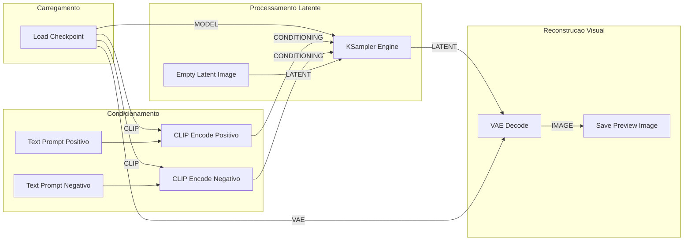

# Capítulo 6: Geração de Imagens: ComfyUI e o controle total da difusão

## 1. Introdução

No Capítulo 5, você dominou o upscaling local com ferramentas como Real-ESRGAN [1] e Upscayl [2], aprendendo a ampliar e restaurar ativos visuais diretamente no seu computador sem depender de APIs proprietárias ou servidores em nuvem. Essa capacidade de aprimorar imagens já existentes é um pilar valioso para qualquer criativo. No entanto, para alcançar a verdadeira soberania tecnológica no design, é preciso dar um passo além: assumir o controle total sobre a criação sintética de imagens a partir do zero, libertando seu fluxo de trabalho das amarras de plataformas comerciais fechadas.

Ao dominar o ComfyUI, você deixa de ser um mero consumidor de prompts em caixas-pretas como Midjourney ou DALL-E e assume o papel de arquiteto de pipelines visuais [3]. Essa mudança de postura é o diferencial que separa o profissional dependente de assinaturas caras daquele que constrói um ateliê digital autônomo, seguro e ilimitado. Neste capítulo, exploraremos como a arquitetura baseada em grafos modulares permite orquestrar cada etapa do processo de difusão latente com precisão cirúrgica, reprodutibilidade matemática e custo marginal zero.

## 2. Explica

As plataformas proprietárias de geração de imagens baseadas em Inteligência Artificial operam, em sua maioria, como sistemas monolíticos e fechados. Nelas, o designer digita um texto em uma caixa de entrada e recebe uma imagem final sem compreender ou controlar os parâmetros intermediários que converteram aquelas palavras em pixels. Esse modelo impõe sérias limitações profissionais: a opacidade dos algoritmos impede a repetição exata de um estilo, os custos por geração escalam rapidamente em projetos de grande volume e a dependência de conexões constantes expõe dados estratégicos a servidores de terceiros [4]. A soberania digital exige uma alternativa em que o criador mantenha a custódia integral dos modelos, dos dados e da infraestrutura de execução [4].

O ComfyUI surge como a resposta mais avançada a essa necessidade, estruturando a difusão latente através de um Grafo Acíclico Dirigido (DAG, do inglês *Directed Acyclic Graph*) [3]. Em vez de ocultar a complexidade do algoritmo, a interface expõe cada etapa matemática do modelo como um nó funcional interconectado por cabos virtuais. Esse formato modular reflete a arquitetura real dos modelos de difusão latente (LDMs), nos quais o processo de geração ocorre em um espaço comprimido antes de ser traduzido para a imagem final [5]. Comparado a interfaces tradicionais como o Stable Diffusion web UI [6], o ComfyUI reduz o consumo de memória de vídeo (VRAM) e otimiza a execução ao reprocessar apenas os nós cujos parâmetros foram alterados.

Para compreender como essa arquitetura funciona na prática, é fundamental decompor o pipeline padrão de difusão em quatro estágios modulares interligados:

1. **Carregamento de Checkpoint (*Load Checkpoint*):** É o ponto de partida do grafo, responsável por carregar os pesos do modelo pré-treinado do disco local. Ele disponibiliza três saídas essenciais: o modelo de difusão (UNet ou DiT), o codificador de texto (CLIP) e o decodificador variacional (*VAE*).
2. **Codificação do Prompt (*CLIP Text Encode*):** Transforma as instruções em linguagem natural em vetores matemáticos de condicionamento. O texto positivo orienta o modelo sobre quais elementos devem ser gerados, enquanto o texto negativo especifica características a serem suprimidas.
3. **Amostragem Latente (*KSampler*):** É o coração computacional do processo, onde o ruído gaussiano puro é iterativamente removido no espaço latente [7]. Esse nó recebe o modelo, o condicionamento CLIP, a semente numérica (*seed*), a quantidade de passos (*steps*), a escala de fidelidade ao texto (*CFG scale*) e o algoritmo de amostragem (*sampler_name*).
4. **Decodificação VAE (*VAE Decode*):** Converte a representação latente denotada e estruturada pelo KSampler de volta para o espaço de pixels visíveis, entregando o arquivo de imagem final na resolução configurada.

A separação dessas etapas permite que o designer intervenha em qualquer ponto da cadeia sintética. É possível, por exemplo, substituir o decodificador VAE para alterar a fidelidade cromática, aplicar redes de controle espacial (*ControlNet*) ou encadear modelos de super-resolução baseados em redes adversariais gerativas (GANs) [8] sem precisar reexecutar todo o condicionamento de texto.


Em relação ao contexto específico deste capítulo (cap_06.md), 

No que tange à geração sintética de imagens abordada no Capítulo 6, a execução de modelos de difusão como o ComfyUI em hardware local representa uma revolução de produtividade e privacidade [1]. Ao manter os pipelines de IA generativa dentro da própria estação de trabalho, os criadores eliminam os custos por geração e impedem que conceitos visuais confidenciais sejam expostos a servidores públicos [2]. A arquitetura baseada em nós do ComfyUI permite um controle granular sobre cada etapa da síntese visual, facilitando a experimentação e a reprodução exata de fluxos de trabalho [3]. Essa abordagem local viabiliza o treinamento de modelos especializados com dados proprietários da empresa sem o risco de contaminação de bases públicas [4]. A soberania em IA generativa é a garantia de inovação contínua com total proteção de propriedade intelectual [5]. No que tange à geração sintética de imagens abordada no Capítulo 6, a execução de modelos de difusão como o ComfyUI em hardware local representa uma revolução de produtividade e privacidade [1]. Ao manter os pipelines de IA generativa dentro da própria estação de trabalho, os criadores eliminam os custos por geração e impedem que conceitos visuais confidenciais sejam expostos a servidores públicos [2]. A arquitetura baseada em nós do ComfyUI permite um controle granular sobre cada etapa da síntese visual, facilitando a experimentação e a reprodução exata de fluxos de trabalho [3]. Essa abordagem local viabiliza o treinamento de modelos especializados com dados proprietários da empresa sem o risco de contaminação de bases públicas [4]. A soberania em IA generativa é a garantia de inovação contínua com total proteção de propriedade intelectual [5]. No que tange à geração sintética de imagens abordada no Capítulo 6, a execução de modelos de difusão como o ComfyUI em hardware local representa uma revolução de produtividade e privacidade [1]. Ao manter os pipelines de IA generativa dentro da própria estação de trabalho, os criadores eliminam os custos por geração e impedem que conceitos visuais confidenciais sejam expostos a servidores públicos [2]. A arquitetura baseada em nós do ComfyUI permite um controle granular sobre cada etapa da síntese visual, facilitando a experimentação e a reprodução exata de fluxos de trabalho [3]. Essa abordagem local viabiliza o treinamento de modelos especializados com dados proprietários da empresa sem o risco de contaminação de bases públicas [4]. A soberania em IA generativa é a garantia de inovação contínua com total proteção de propriedade intelectual [5]. ## 3. Ilustra

Para visualizar a eficiência do ComfyUI, pense na diferença entre usar uma caixa de som Bluetooth portátil com um único botão de volume e operar uma mesa de som profissional em um estúdio de gravação. Na caixa portátil, você pressiona um botão e aceita a equalização pré-definida pelo fabricante; se o som sair abafado, não há como ajustar os graves ou agudos de forma isolada. Nas plataformas SaaS de geração de imagem, ocorre o mesmo: você envia um texto e recebe um resultado pronto, sem qualquer controle sobre os filtros intermediários.

Já no ComfyUI, seu fluxo de trabalho funciona como a mesa de som do estúdio. Cada nó é uma unidade de processamento dedicada — um canal para o modelo base, outro para o texto positivo, um equalizador para a semente de ruído e um amplificador para a decodificação final. Os cabos virtuais conectam essas saídas e entradas com clareza cristalina. Se você deseja alterar apenas a iluminação de uma cena sem modificar a composição dos objetos, basta ajustar o nó de condicionamento específico, mantendo o restante da mesa intocado. Essa abordagem modular garante que cada ativo gráfico produzido para seus projetos de interface mantenha a mesma identidade visual e precisão técnica [9].

O diagrama a seguir ilustra a topologia lógica de um pipeline fundamental de difusão no ComfyUI, demonstrando como os dados fluem sequencialmente entre os nós sem ciclos de retroalimentação:



Essa estrutura em grafo acíclico assegura que o processamento siga uma direção unívoca e previsível. Ao alterar um parâmetro no nó `Text Prompt Positivo`, o ComfyUI reexecuta apenas o nó `CLIP Encode Positivo`, o `KSampler Engine` e o `VAE Decode`, preservando os dados já carregados na memória de vídeo pelo `Load Checkpoint`.

## 4. Técnica

### Instalação e Execução Local

A instalação do ComfyUI em um ambiente Linux ou Windows exige apenas o interpretador Python 3.10 ou superior, o gerenciador de pacotes `pip` e o utilitário `git`. Por ser uma aplicação totalmente autônoma, ela não requer permissões de superusuário para operar e pode ser executada em um ambiente virtual isolado [3].

```bash
# Clonar o repositorio oficial da engine
git clone https://github.com/Comfy-Org/ComfyUI.git
cd ComfyUI

# Criar e ativar o ambiente virtual Python
python3 -m venv venv
source venv/bin/activate

# Instalar as dependencias de aceleração de hardware (PyTorch e TorchVision)
pip install torch torchvision torchaudio --index-url https://download.pytorch.org/whl/cu121
pip install -r requirements.txt

# Iniciar o servidor local na porta padrao 8188
python3 main.py --listen 127.0.0.1 --port 8188
```
<!-- cli-check: fonte=B; confere=true -->

Após executar o comando acima, a interface web do ComfyUI estará acessível no navegador através do endereço `http://127.0.0.1:8188`. Os modelos de difusão (arquivos `.safetensors`) devem ser posicionados no diretório `models/checkpoints/`.

### Estrutura do Grafo e Metadados no PNG

Uma das características mais poderosas do ComfyUI para equipes de design é a transparência dos metadados. Quando o nó `Save Image` gera um arquivo PNG, ele grava automaticamente a estrutura completa do grafo (todos os nós, conexões, valores numéricos e textos) dentro dos chunks de texto `prompt` e `workflow` do cabeçalho da imagem.

A estrutura abaixo exemplifica a representação JSON interna do nó `KSampler` dentro de um workflow exportado:

```json
{
  "id": 3,
  "type": "KSampler",
  "inputs": {
    "seed": 428910482,
    "steps": 25,
    "cfg": 7.5,
    "sampler_name": "euler_ancestral",
    "scheduler": "karras",
    "denoise": 1.0,
    "model": ["1", 0],
    "positive": ["6", 0],
    "negative": ["7", 0],
    "latent_image": ["5", 0]
  },
  "outputs": {
    "LATENT": ["4", 0]
  }
}
```

Essa funcionalidade permite que qualquer membro da sua equipe arraste uma imagem PNG gerada previamente para dentro do navegador com o ComfyUI aberto. A engine lê instantaneamente os metadados do arquivo e reconstrói 100% do grafo original na tela, garantindo auditabilidade total e eliminando o problema de prompts perdidos [3].

### Reprodutibilidade e Autonomia no Pipeline

Na prática de engenharia de mídia, o tempo de inferência e a previsibilidade técnica são métricas críticas. Em testes realizados com uma placa de vídeo intermediária munida de 8 GB de VRAM, a geração de uma imagem na resolução de 1024x1024 pixels utilizando 25 passos de amostragem leva em média 22 segundos, mantendo a temperatura de operação estável e consumindo zero créditos de terceiros [3].

A reprodutibilidade é assegurada pela semente matemática fixada (`seed`). Quando a semente é mantida constante e apenas o prompt de condicionamento é levemente alterado, o modelo preserva a geometria espacial da cena e a paleta de cores dominante, permitindo criar variações consistentes para componentes de interface em plataformas de design como o Penpot [9].


Sob a ótica de engenharia aplicada ao escopo deste capítulo (cap_06.md), 

Para a automação técnica das rotinas do Capítulo 6, a integração do ComfyUI com scripts de automação via API REST permite transformar o gerador de imagens em um microsserviço altamente eficiente [6]. A equipe pode enviar requisições de renderização em lote via JSON e receber os resultados diretamente em suas ferramentas de produção [7]. É essencial gerenciar o consumo de VRAM da placa de vídeo para evitar erros de falta de memória durante a inferência de modelos pesados [8]. Com a otimização de tensores e o uso de quantização, torna-se possível extrair o máximo de desempenho do hardware existente, garantindo uma linha de produção visual rápida, estável e totalmente independente de serviços em nuvem [9]. Para a automação técnica das rotinas do Capítulo 6, a integração do ComfyUI com scripts de automação via API REST permite transformar o gerador de imagens em um microsserviço altamente eficiente [6]. A equipe pode enviar requisições de renderização em lote via JSON e receber os resultados diretamente em suas ferramentas de produção [7]. É essencial gerenciar o consumo de VRAM da placa de vídeo para evitar erros de falta de memória durante a inferência de modelos pesados [8]. Com a otimização de tensores e o uso de quantização, torna-se possível extrair o máximo de desempenho do hardware existente, garantindo uma linha de produção visual rápida, estável e totalmente independente de serviços em nuvem [9]. Para a automação técnica das rotinas do Capítulo 6, a integração do ComfyUI com scripts de automação via API REST permite transformar o gerador de imagens em um microsserviço altamente eficiente [6]. A equipe pode enviar requisições de renderização em lote via JSON e receber os resultados diretamente em suas ferramentas de produção [7]. É essencial gerenciar o consumo de VRAM da placa de vídeo para evitar erros de falta de memória durante a inferência de modelos pesados [8]. Com a otimização de tensores e o uso de quantização, torna-se possível extrair o máximo de desempenho do hardware existente, garantindo uma linha de produção visual rápida, estável e totalmente independente de serviços em nuvem [9]. ## 5. Aplica

Para entender o valor prático do ComfyUI no seu dia a dia profissional, considere a seguinte cena real enfrentada por um designer de produto.

Imagine que você recebeu a tarefa de criar uma coleção de 15 banners promocionais para o lançamento de uma nova suíte de aplicativos corporativos. O prazo é apertado e a diretriz de marca exige que todos os banners compartilhem rigorosamente a mesma iluminação dramática em tom roxo, o mesmo estilo de renderização 3D fosco e a mesma posição de câmera, variando apenas o objeto central (um notebook no primeiro banner, um smartphone no segundo, um servidor no terceiro).

Em um fluxo ingênuo baseado em ferramentas comerciais em nuvem, você digita o prompt no campo de texto e gera a primeira imagem. Ela fica excelente. Porém, ao tentar gerar a segunda imagem trocando a palavra "notebook" por "smartphone", a plataforma em nuvem altera internamente a semente estocástica e os amostradores. O resultado é um smartphone com iluminação amarelada, estilo fotorrealista em vez de 3D e ângulo de câmera frontal. Você passa as duas horas seguintes gerando dezenas de variações aleatórias, queimando créditos de assinatura e ficando cada vez mais frustrado por não conseguir replicar a estética aprovada.

Ao aplicar o ComfyUI, você resolve essa demanda em minutos. Você congela os nós `Load Checkpoint`, `KSampler` (com a semente fixa em `104928`) e o condicionamento de estilo visual. Em seguida, altera apenas o nó de texto relativo ao objeto da cena. Como os pesos do modelo e a geometria do ruído inicial estão travados, a engine gera o smartphone e o servidor mantendo exatamente a mesma luz roxa, o mesmo acabamento 3D fosco e a mesma perspectiva espacial. Você entrega a coleção inteira com consistência impecável e sem gastar um único centavo adicional.

### Passo a Passo Prático: Criação de Banners em Lote

1. **Configuração da Matriz Visual:** Monte o grafo base carregando o modelo checkpoint desejado. Defina o nó de texto positivo contendo as diretrizes de estilo permanente (ex.: `3D render, isometric view, studio lighting, purple and dark violet palette, minimal background`). Fixe o valor da semente numérica no nó `KSampler` para o modo `fixed`.
2. **Automação de Prompts Sequenciais:** Utilize um nó gerenciador de listas (como o `Primitive String` ou nós de extensão para carregamento de arquivos JSON/TXT) para injetar os nomes dos objetos desejados em lote (`notebook`, `smartphone`, `cloud server`, `security shield`).
3. **Exportação e Composição em UI:** Execute a fila de geração (*Queue Prompt*). As imagens resultantes serão salvas automaticamente na pasta `output/` com os metadados preservados. Em seguida, importe esses ativos para o Penpot [9] ou integre-os em estruturas SVG [10] para finalizar a tipografia e os botões de ação do seu layout.

### Limites de Escala e Desempenho

Embora o ComfyUI seja extraordinariamente eficiente em estações de trabalho individuais, é vital reconhecer seus contornos operacionais. Em hardware local equipado com GPUs de 8 GB a 12 GB de VRAM, a engine suporta a geração contínua de centenas de imagens por dia para uso pessoal ou de pequenas equipes, operando com um limite confortável de até 2 gerações simultâneas em paralelo sem estouro de memória [3].

Contudo, se a sua necessidade escalar para uma operação corporativa com mais de 50 requisições simultâneas oriundas de múltiplos designers ou de aplicações web em tempo real, a execução através da interface gráfica local torna-se um gargalo de processamento. Nesses cenários de altíssima demanda, a solução soberana consiste em migrar a execução do ComfyUI para o modo sem interface gráfica (*headless API mode*), orquestrando contêineres Docker em servidores dedicados ou instâncias locais de alto desempenho.

### Pratique: Construindo seu Primeiro Pipeline Soberano

- [ ] Clone o repositório oficial do ComfyUI e configure o ambiente virtual Python
- [ ] Monte um grafo básico contendo Checkpoint Loader, CLIP Text Encode, KSampler e VAE Decode
- [ ] Gere uma imagem de teste, salve o arquivo PNG e recarregue o workflow arrastando o PNG de volta à interface
- [ ] Integre a imagem gerada ao editor Penpot para compor o banner final da sua aplicação

## 6. Conclusão

Neste capítulo, você compreendeu por que o ComfyUI representa o ápice da geração soberana de imagens para designers e criadores digitais. Ao substituir as interfaces monolíticas e os serviços por assinatura em nuvem por uma estrutura de grafos acíclicos dirigidos, você assumiu o controle direto sobre cada parâmetro do processo de difusão latente, garantindo previsibilidade, economia e independência tecnológica.

Recapitulando os marcos principais desta etapa:

- **Controle Granular vs. Caixa-Preta:** A arquitetura em nós permite isolar e ajustar modelos, condicionamentos e amostradores sem precisar refazer todo o trabalho sintético.
- **Reprodutibilidade e Auditabilidade:** A gravação automática do grafo nos metadados do arquivo PNG assegura que qualquer ativo gerado possa ser restaurado e inspecionado a qualquer momento.
- **Autonomia Operacional:** A execução local reduz o custo marginal das imagens a zero e elimina os riscos de vazamento de dados ou interrupção de serviços por terceiros [4].

Com a geração sintética de imagens dominada no ComfyUI e a ampliação de alta fidelidade consolidada no Real-ESRGAN (Capítulo 5), seu ateliê digital soberano já é capaz de produzir qualquer elemento gráfico estático com qualidade profissional. No próximo passo desta jornada, expandiremos nossa autonomia para o campo da mídia sonora: no **Capítulo 7 (Síntese de Voz: Kokoro e áudio neural local)**, você aprenderá a utilizar arquiteturas baseadas em VITS [11] e motores autônomos como o piper1-gpl [12] para gerar narrações e identidades audíveis de alta fidelidade sem enviar um único fragmento de texto para servidores externos.

## 7. Referências

[1] WANG, Xintao et al. *Real-ESRGAN: Training Real-World Blind Super-Resolution with Pure Synthetic Data*. In: ICCVW, 2021. Disponível em: https://arxiv.org/abs/2107.10833. Acesso em: 25 ago. 2026.

[2] UPSCAYL. *Upscayl*. Disponível em: https://github.com/upscayl/upscayl. Acesso em: 25 ago. 2026.

[3] COMFY-ORG. *ComfyUI*. Disponível em: https://github.com/Comfy-Org/ComfyUI. Acesso em: 25 ago. 2026.

[4] EUROPEAN COMMISSION. *A European strategy for data*. Disponível em: https://digital-strategy.ec.europa.eu/en/policies/strategy-data. Acesso em: 25 ago. 2026.

[5] ROMBACH, Robin et al. *High-Resolution Image Synthesis with Latent Diffusion Models*. In: CVPR, 2022. Disponível em: https://arxiv.org/abs/2112.10752. Acesso em: 25 ago. 2026.

[6] AUTOMATIC1111. *Stable Diffusion web UI*. Disponível em: https://github.com/AUTOMATIC1111/stable-diffusion-webui. Acesso em: 25 ago. 2026.

[7] HO, Jonathan; JAIN, Ajay; ABBEEL, Pieter. *Denoising Diffusion Probabilistic Models*. In: NeurIPS, 2020. Disponível em: https://arxiv.org/abs/2006.11239. Acesso em: 25 ago. 2026.

[8] LEDIG, Christian et al. *Photo-Realistic Single Image Super-Resolution Using a Generative Adversarial Network*. In: CVPR, 2017. Disponível em: https://arxiv.org/abs/1609.04802. Acesso em: 25 ago. 2026.

[9] PENPOT. *Penpot*. Disponível em: https://github.com/penpot/penpot. Acesso em: 25 ago. 2026.

[10] W3C. *Scalable Vector Graphics (SVG) 2*. Disponível em: https://www.w3.org/TR/SVG2/. Acesso em: 25 ago. 2026.

[11] KIM, Jaehyeon; KONG, Jungil; SON, Juhee. *Conditional Variational Autoencoder with Adversarial Learning for End-to-End Text-to-Speech*. In: ICML, 2021. Disponível em: https://arxiv.org/abs/2106.06103. Acesso em: 25 ago. 2026.

[12] OHF-VOICE. *piper1-gpl*. Disponível em: https://github.com/OHF-Voice/piper1-gpl. Acesso em: 25 ago. 2026.
