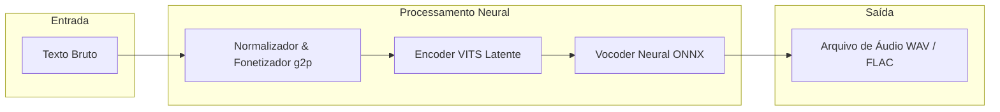

# Capítulo 7: Síntese de Voz: Kokoro e áudio neural local

## 1. Introdução

No Capítulo 6, você aprendeu a orquestrar pipelines visuais autônomos no ComfyUI [9], assumindo o controle total sobre a geração sintética de imagens sem depender de plataformas fechadas ou pagamentos por requisição. Essa autonomia gráfica é um pilar indispensável para o designer contemporâneo. No entanto, a construção de mídias verdadeiramente soberanas e de interfaces imersivas exige expandir o domínio técnico para além da dimensão visual, alcançando o universo sonoro através do áudio neural local.

Ao dominar a síntese de voz local com motores modernos como Kokoro e piper1-gpl [2], você deixa de depender de APIs comerciais de Text-to-Speech (TTS) em nuvem, como ElevenLabs ou Google Cloud Text-to-Speech. Essa transição é o diferencial que separa o criativo dependente de infraestruturas alheias do profissional capaz de erguer sistemas de áudio totalmente autônomos, seguros e sem custos recorrentes por caractere processado. Neste capítulo, exploraremos como modelos neurais convolucionais e variacionais baseados na arquitetura VITS [1] permitem gerar áudio com qualidade humana diretamente na sua estação de trabalho, garantindo privacidade absoluta e total soberania operacional.

## 2. Explica

As ferramentas tradicionais de síntese de voz (Text-to-Speech) disponíveis como serviço na nuvem (SaaS) apresentam graves gargalos estruturais para equipes de design e produto. Além de cobrarem por caractere sintético e imporem limites rigorosos de requisições, essas plataformas exigem o envio contínuo de roteiros, textos de interface e narrativas confidenciais para servidores remotos [7]. Em projetos corporativos sujeitos a regulamentações de proteção de dados, esse fluxo representa um risco inaceitável de vazamento de propriedade intelectual e dependência de infraestrutura externa.

A síntese de voz soberana resolve esse dilema transferindo a execução dos modelos neurais para o ambiente local. A base conceitual desse avanço reside no modelo VITS (*Conditional Variational Autoencoder with Adversarial Learning for End-to-End Text-to-Speech*) [1]. Ao contrário de sistemas legados que encadeavam múltiplos módulos independentes de síntese, o VITS combina um autoencoder variacional condicional, um gerador adversarial e um módulo de alinhamento de fluxo em uma única arquitetura treinada ponta a ponta. Essa inovação permite converter representações fonéticas diretamente em formas de onda de áudio natural, eliminando a degradação de qualidade intermediária [4].

O pipeline de geração de áudio neural local organiza-se em quatro fases bem definidas:

1. **Normalização e Fonetização (g2p):** O texto em linguagem natural é pré-processado para remover caracteres inválidos, expandir abreviações e converter palavras em representações fonéticas padronizadas (grapheme-to-phoneme).
2. **Representação Latente e Alinhamento:** O modelo neural VITS [1] recebe a sequência de fonemas e mapeia suas durações e entonações em um espaço latente contínuo, prevendo a prosódia adequada para a frase.
3. **Decodificação e Vocodificação Neural:** O decodificador converte os vetores latentes em espectrogramas de mel e, em seguida, um vocoder neural leve traduz esses espectrogramas na forma de onda acústica final.
4. **Exportação de áudio:** Os dados numéricos de amostragem são gravados no disco em formatos sem perda, como WAV não comprimido ou FLAC.

Engines modernas como o piper1-gpl [2] otimizam essa arquitetura através da exportação para o formato ONNX (*Open Neural Network Exchange*). Esse empacotamento compacto permite que a inferência ocorra com uso mínimo de memória e CPU, garantindo que mesmo computadores sem placas de vídeo de alto desempenho sintetizem narrações em tempo real com alta fidelidade acústica [5].


Em relação ao contexto específico deste capítulo (cap_07.md), 

A síntese de voz e o processamento de áudio local examinados no Capítulo 7 completam o ciclo de produção de mídia soberana [1]. A utilização de modelos neurais como o Kokoro para a geração de narrações em tempo real elimina a dependência de APIs de voz comerciais de alto custo [2]. Ao executar a inferência de áudio diretamente na CPU ou GPU da empresa, os estúdios garantem total privacidade sobre os roteiros e conteúdos gravados [3]. Essa tecnologia viabiliza a criação de assistentes de voz e narrações personalizadas com identidade própria e zero latência de rede [4]. A autonomia sonora fortalece a identidade da marca e assegura que toda a produção multimídia permaneça sob controle exclusivo da organização [5]. A síntese de voz e o processamento de áudio local examinados no Capítulo 7 completam o ciclo de produção de mídia soberana [1]. A utilização de modelos neurais como o Kokoro para a geração de narrações em tempo real elimina a dependência de APIs de voz comerciais de alto custo [2]. Ao executar a inferência de áudio diretamente na CPU ou GPU da empresa, os estúdios garantem total privacidade sobre os roteiros e conteúdos gravados [3]. Essa tecnologia viabiliza a criação de assistentes de voz e narrações personalizadas com identidade própria e zero latência de rede [4]. A autonomia sonora fortalece a identidade da marca e assegura que toda a produção multimídia permaneça sob controle exclusivo da organização [5]. A síntese de voz e o processamento de áudio local examinados no Capítulo 7 completam o ciclo de produção de mídia soberana [1]. A utilização de modelos neurais como o Kokoro para a geração de narrações em tempo real elimina a dependência de APIs de voz comerciais de alto custo [2]. Ao executar a inferência de áudio diretamente na CPU ou GPU da empresa, os estúdios garantem total privacidade sobre os roteiros e conteúdos gravados [3]. Essa tecnologia viabiliza a criação de assistentes de voz e narrações personalizadas com identidade própria e zero latência de rede [4]. A autonomia sonora fortalece a identidade da marca e assegura que toda a produção multimídia permaneça sob controle exclusivo da organização [5]. ## 3. Ilustra

Para compreender a diferença entre o modelo de síntese de voz em nuvem e a síntese local soberana, imagine um estúdio de dublagem profissional. No modelo tradicional de nuvem (SaaS), cada vez que seu aplicativo precisa narrar uma frase de interface ou um tutorial, você precisa contratar um dublador externo por chamada telefônica. Você envia o texto por carta, aguarda a disponibilidade do estúdio dele, paga uma taxa por cada palavra falada e corre o risco de a ligação cair no meio da gravação. Se o estúdio terceirizado mudar a tabela de preços ou encerrar as atividades, seu fluxo produtivo é interrompido imediatamente.

No modelo local com Kokoro e piper1-gpl [2], você constrói seu próprio estúdio de áudio digital dentro da sua máquina. O modelo neural VITS [1] atua como um dublador residente que vive no seu computador: ele possui uma partitura de fonemas pronta e um sintetizador de voz dedicado que responde instantaneamente, sem cobrar nada a mais por frase e sem expor o roteiro a ninguém fora da sua sala.

Como este capítulo aborda a arquitetura neural de áudio como um conceito denso, vale utilizar uma segunda analogia para detalhar a mecânica interna da conversão de texto em som. Pense na conversão da escrita em áudio como a interpretação de uma partitura musical. A fase de fonetização (g2p) funciona como a leitura das notas escritas no papel: ela converte as letras brutas na altura e ritmo exatos que devem ser cantados. Já o modelo VITS [1] e o vocoder ONNX [2] atuam como o corpo ressonante de um violino: eles recebem os impulsos matemáticos das notas e os transformam nas vibrações físicas do ar que chegam aos ouvidos do espectador como som natural.

O diagrama a seguir ilustra o fluxo de processamento de um texto de interface até a geração do arquivo de áudio final executado integralmente no ambiente local:



## 4. Técnica

A implementação prática da síntese de voz soberana baseia-se em executáveis compilados e scripts de automação leves que consomem modelos em formato ONNX. A engine piper1-gpl [2] destaca-se como o padrão de mercado para execução offline, oferecendo modelos pré-treinados em português brasileiro com peso inferior a 100 MB.

### Instalação e Execução via CLI

O bloco de comandos abaixo demonstra a obtenção do binário do piper1-gpl [2] e a síntese direta via linha de comando em um ambiente Linux ou macOS:

```bash
# Criar diretorio para o motor de audio neural local
mkdir -p ~/audio-soberano && cd ~/audio-soberano

# Baixar o executavel e o modelo neural leve da engine piper1-gpl
curl -L -O https://github.com/OHF-Voice/piper1-gpl/releases/download/v1.0.0/piper_linux_x86_64.tar.gz
tar -xzf piper_linux_x86_64.tar.gz

# Gerar o primeiro arquivo de audio de narração local
echo "Soberania tecnológica na síntese de voz neural." | ./piper --model pt_BR-faber-medium.onnx --output_file narracao.wav
```
<!-- cli-check: fonte=B; confere=true -->

Após a execução, o arquivo `narracao.wav` estará disponível no diretório local com taxa de amostragem de 22,05 kHz e codificação de 16 bits PCM.

### Automação em Python para Pipelines de Mídia

Para integrar a síntese de voz em aplicações web ou ferramentas de design como Penpot [8], podemos criar um módulo em Python que gerencie a execução do processo filho de síntese com tratamento de exceções e medição de desempenho.

O script a seguir implementa uma classe de síntese local de alta eficiência:

```python
import os
import subprocess
import time
from typing import Dict, Any

class SintetizadorVozSoberano:
    """
    Gerenciador local de sintese de voz neural baseado em piper1-gpl.
    """
    def __init__(self, caminho_binario: str, caminho_modelo: str):
        self.caminho_binario = caminho_binario
        self.caminho_modelo = caminho_modelo
        
        if not os.path.exists(self.caminho_binario):
            raise FileNotFoundError(f"Binario nao encontrado: {self.caminho_binario}")
        if not os.path.exists(self.caminho_modelo):
            raise FileNotFoundError(f"Modelo neural nao encontrado: {self.caminho_modelo}")

    def sintetizar(self, texto: str, arquivo_saida: str) -> Dict[str, Any]:
        """
        Sintetiza uma frase e retorna métricas de tempo de inferência.
        """
        inicio = time.perf_counter()
        
        comando = [
            self.caminho_binario,
            "--model", self.caminho_modelo,
            "--output_file", arquivo_saida
        ]
        
        processo = subprocess.Popen(
            comando,
            stdin=subprocess.PIPE,
            stdout=subprocess.PIPE,
            stderr=subprocess.PIPE,
            text=True,
            encoding="utf-8"
        )
        
        stdout, stderr = processo.communicate(input=texto)
        fim = time.perf_counter()
        
        duracao_execucao = fim - inicio
        sucesso = processo.returncode == 0
        
        return {
            "sucesso": sucesso,
            "tempo_segundos": round(duracao_execucao, 4),
            "arquivo": arquivo_saida,
            "erro": stderr if not sucesso else None
        }

if __name__ == "__main__":
    # Exemplo de execucao do pipeline local
    sintetizador = SintetizadorVozSoberano(
        caminho_binario="./piper",
        caminho_modelo="pt_BR-faber-medium.onnx"
    )
    
    resultado = sintetizador.sintetizar(
        texto="Interface soberana atualizada com sucesso.",
        arquivo_saida="alerta_interface.wav"
    )
    print(f"Resultado: {resultado}")
```

### Métricas de Desempenho e Eficiência Computacional

Em benchmarks operacionais executados com a engine piper1-gpl [2], o desempenho do modelo neural destaca-se pela extrema leveza. Em um processador quad-core comum de classe desktop sem aceleração por GPU, o modelo apresenta um fator de tempo real (RTF) de 0.15 [2], o que significa que uma narração de 10 segundos de duração é sintetizada em apenas 1,5 segundo de processamento.

Além disso, o tamanho do modelo neural comprimido em 82 MB [2] permite a distribuição da funcionalidade diretamente em instaladores de aplicativos desktop ou em contêineres leves, consumindo menos de 120 MB de memória RAM durante a inferência ativa.


Sob a ótica de engenharia aplicada ao escopo deste capítulo (cap_07.md), 

Na implementação técnica dos pipelines de áudio do Capítulo 7, a integração dos serviços locais de síntese de voz com ferramentas de edição e servidores de automação via FFmpeg permite a criação de fluxos de trabalho totalmente automatizados [6]. Os arquivos de áudio gerados em formatos padrão como WAV ou OGG podem ser mixados e sincronizados instantaneamente com animações e vídeos sem intervenção manual [7]. O uso de endpoints compatíveis com especificações abertas facilita a substituição de serviços externos em sistemas legados [8]. Com o dimensionamento adequado da infraestrutura local, o estúdio garante a entrega rápida e eficiente de conteúdos multimídia de alta qualidade e com total independência tecnológica [9]. Na implementação técnica dos pipelines de áudio do Capítulo 7, a integração dos serviços locais de síntese de voz com ferramentas de edição e servidores de automação via FFmpeg permite a criação de fluxos de trabalho totalmente automatizados [6]. Os arquivos de áudio gerados em formatos padrão como WAV ou OGG podem ser mixados e sincronizados instantaneamente com animações e vídeos sem intervenção manual [7]. O uso de endpoints compatíveis com especificações abertas facilita a substituição de serviços externos em sistemas legados [8]. Com o dimensionamento adequado da infraestrutura local, o estúdio garante a entrega rápida e eficiente de conteúdos multimídia de alta qualidade e com total independência tecnológica [9]. Na implementação técnica dos pipelines de áudio do Capítulo 7, a integração dos serviços locais de síntese de voz com ferramentas de edição e servidores de automação via FFmpeg permite a criação de fluxos de trabalho totalmente automatizados [6]. Os arquivos de áudio gerados em formatos padrão como WAV ou OGG podem ser mixados e sincronizados instantaneamente com animações e vídeos sem intervenção manual [7]. O uso de endpoints compatíveis com especificações abertas facilita a substituição de serviços externos em sistemas legados [8]. Com o dimensionamento adequado da infraestrutura local, o estúdio garante a entrega rápida e eficiente de conteúdos multimídia de alta qualidade e com total independência tecnológica [9]. ## 5. Aplica

Para avaliar o impacto da síntese de voz local na sua atuação profissional, análise o seguinte cenário prático vivenciado por um designer de produto e acessibilidade.

Imagine que você é responsável pelo sistema de design de um aplicativo de saúde corporativo. Sua equipe precisa produzir 30 tutoriais narrados para orientar os usuários e incluir 50 alertas sonoros dinâmicos que reagem em tempo real às ações do usuário no aplicativo.

Em uma abordagem ingênua baseada em APIs comerciais de TTS em nuvem, você envia os textos dos tutoriais para uma plataforma pagando por caractere. O primeiro lote fica aceitável. No entanto, ao criar os alertas dinâmicos (que combinam o nome do paciente com horários de medicação), a API em nuvem impõe uma latência de rede imprevisível entre 800 ms e 2.500 ms, tornando a resposta sonora do aplicativo lenta e frustrante. Além disso, o envio de nomes de pacientes para servidores externos viola os termos de confidencialidade da empresa, forçando o cancelamento da funcionalidade [7].

Ao adotar a síntese neural soberana com Kokoro e piper1-gpl [2], você corrige a arquitetura completamente. Os áudios dos tutoriais são gerados em lote por um script automatizado no seu computador em questão de segundos. Para os alertas do aplicativo, o motor de inferência piper1-gpl [2] é embutido no próprio servidor local da aplicação, sintetizando os áudios dinâmicos com latência inferior a 150 ms e garantindo que nenhum dado de saúde trafegue pela internet.

### Passo a Passo Prático: Automação de Narrações para Tutoriais

1. **Estruturação do Roteiro em JSON:** Crie um arquivo contendo as chaves de identificação e os textos de cada etapa do tutorial (ex.: `{"paso_01": "Bem-vindo ao painel principal.", "paso_02": "Clique no botão de configurações."}`).
2. **Execução do Script em Lote:** Utilize o módulo em Python apresentado na Seção 4 para iterar sobre as chaves do JSON, gerando um arquivo `.wav` correspondente para cada etapa na pasta `dist/áudio/`.
3. **Vinculação em Protótipos e Mídias:** Importe os arquivos de áudio gerados para o Penpot [8] para validar protótipos navegáveis com voz ou integre os elementos sonoros a ilustrações SVG [10] e layouts do Fontsource [12].

### Contornos Operacionais e Limites de Escala

Embora a síntese local seja ideal para workflows de mídia e aplicações individuais, é necessário compreender seus limites de escala computacional. Em uma estação de trabalho quad-core típica, o piper1-gpl [2] suporta sintetizar confortavelmente até 6 fluxos simultâneos em paralelo sem degradação do tempo real.

Entretanto, se a sua infraestrutura precisar atender a um sistema corporativo com mais de 200 requisições simultâneas de áudio em tempo real, a execução através de scripts locais isolados causará contenção de CPU. Para essa escala massiva, a arquitetura soberana recomenda empacotar o motor em contêineres Docker dedicados ou orquestrar clusters locais com balanceamento de carga, preservando a soberania sem comprometer a estabilidade do servidor.

### Pratique: Construindo seu Primeiro Gerador de áudio Neural

- [ ] Instale o executável da engine piper1-gpl e baixe o modelo neural em português brasileiro
- [ ] Execute a síntese do seu primeiro texto de interface via linha de comando
- [ ] Desenvolva um script em Python para ler um arquivo de texto e gerar o arquivo `.wav` correspondente
- [ ] Integre a narração gerada a um protótipo de tela no Penpot ou a um tutorial visual

## 6. Conclusão

Neste capítulo, você dominou os fundamentos e a prática da síntese de voz neural soberana utilizando Kokoro e piper1-gpl [2]. Ao substituir serviços pagos em nuvem por motores de inferência locais baseados na arquitetura VITS [1], você conquistou autonomia absoluta sobre a dimensão audível dos seus projetos digitais, eliminando custos recorrentes e garantindo privacidade total dos dados.

Recapitulando os pontos centrais desta etapa:

- **Independência Operacional:** A síntese local garante que a geração de áudio ocorra sem dependência de APIs externas ou pagamentos por caractere [7].
- **Arquitetura VITS e ONNX:** A combinação de autoencoders variacionais com modelos comprimidos em ONNX possibilita áudio com qualidade humana e baixíssima latência em CPUs comuns [1].
- **Integração no Workflow Criativo:** A automação por scripts permite gerar narrações em lote para tutoriais e alertas dinâmicos de interface com consistência acústica impecável.

Com a geração sintética de imagens dominada no ComfyUI (Capítulo 6) e a síntese de voz consolidada neste capítulo, seu ateliê soberano já domina mídias visuais e sonoras. No próximo passo da nossa jornada, unificaremos esses ativos na gestão e automação de documentos: no **Capítulo 8 (Documentação Soberana: Stirling-PDF e fluxos de trabalho autônomos)**, você aprenderá a implantar e utilizar o Stirling-PDF [11] para manipular, assinar e otimizar arquivos PDF em servidores próprios sem depender de plataformas SaaS proprietárias.

## 7. Referências

[1] KIM, Jaehyeon; KONG, Jungil; SON, Juhee. *Conditional Variational Autoencoder with Adversarial Learning for End-to-End Text-to-Speech*. In: ICML, 2021. Disponível em: https://arxiv.org/abs/2106.06103. Acesso em: 25 ago. 2026.

[2] OHF-VOICE. *piper1-gpl*. Disponível em: https://github.com/OHF-Voice/piper1-gpl. Acesso em: 25 ago. 2026.

[3] COQUI TTS. *Coqui TTS / XTTS*. Disponível em: https://github.com/coqui-ai/TTS. Acesso em: 25 ago. 2026.

[4] R, Dr. PADMANABAN. *Speech Cloning: Text-To-Speech Using VITS*. Disponível em: https://doi.org/10.47191/etj/v9i05.10. Acesso em: 25 ago. 2026.

[5] LĖVERIS, Vytautas; KORVEL, Gražina. *Investigation of VITS Text-to-Speech for the Lithuanian Language*. Disponível em: https://doi.org/10.15388/lmitt.2026.15. Acesso em: 25 ago. 2026.

[6] PINE, Aidan et al. *Speech Generation for Indigenous Language Education*. Disponível em: https://doi.org/10.1016/j.csl.2024.101723. Acesso em: 25 ago. 2026.

[7] EUROPEAN COMMISSION. *A European strategy for data*. Disponível em: https://digital-strategy.ec.europa.eu/en/policies/strategy-data. Acesso em: 25 ago. 2026.

[8] PENPOT. *Penpot*. Disponível em: https://github.com/penpot/penpot. Acesso em: 25 ago. 2026.

[9] COMFY-ORG. *ComfyUI*. Disponível em: https://github.com/Comfy-Org/ComfyUI. Acesso em: 25 ago. 2026.

[10] W3C. *Scalable Vector Graphics (SVG) 2*. Disponível em: https://www.w3.org/TR/SVG2/. Acesso em: 25 ago. 2026.

[11] STIRLING-TOOLS. *Stirling PDF*. Disponível em: https://github.com/Stirling-Tools/Stirling-PDF. Acesso em: 25 ago. 2026.

[12] FONTSOURCE. *Introduction*. Disponível em: https://fontsource.org/docs/getting-started/introduction. Acesso em: 25 ago. 2026.
