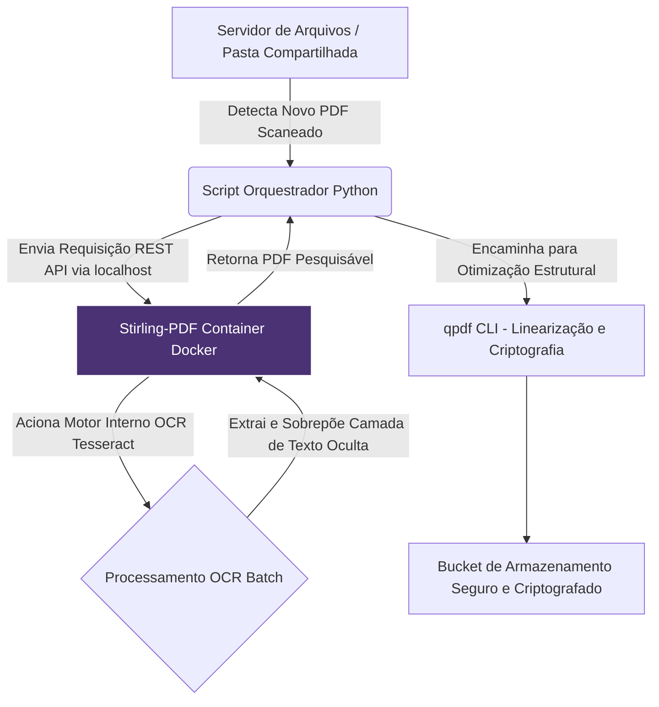

# Capítulo 8: Documentação Soberana: Stirling-PDF e fluxos de trabalho autônomos

## 1. Introdução

No Capítulo 7, exploramos como o ecossistema Kokoro permitiu a emancipação completa da síntese de voz, substituindo infraestruturas dependentes de nuvem por uma solução neural leve e profundamente personalizável. Compreender essa transição em áudio pavimentou o caminho para uma percepção fundamental: qualquer arquivo de mídia ou documento corporativo que enviamos para fora das nossas fronteiras locais representa um vazamento potencial de propriedade intelectual e soberania de dados. Quando dominamos a arte de processar voz internamente, o próximo gargalo natural em qualquer fluxo de trabalho digital torna-se o tratamento dos documentos que carregam o peso burocrático e operacional das organizações.

O formato PDF, onipresente em todas as facetas da comunicação digital, há muito tempo foi sequestrado por serviços de Software as a Service (SaaS) que cobram pedágios mensais para realizar tarefas triviais como mesclar páginas, extrair texto ou aplicar assinaturas. Você, profissional em ascensão, certamente já sentiu o desconforto de precisar usar uma plataforma online obscura para comprimir um contrato confidencial, sabendo que os termos de serviço dessa ferramenta poderiam, teoricamente, permitir a retenção de cópias ocultas nos servidores do provedor. A verdadeira soberania tecnológica só é alcançada quando fechamos todas as portas de saída não intencionais, garantindo que o ciclo de vida da informação permaneça sob nossa custódia estrita [1].

É neste cenário de restrição e preocupação com a privacidade que o Stirling-PDF surge como uma ferramenta revolucionária. Este capítulo irá mergulhar fundo na desconstrução dos gargalos de manipulação de documentos, revelando como a orquestração local de PDFs não apenas blinda a organização contra ataques de espionagem corporativa, mas também permite uma automação massiva em pipelines outrora manuais. A adoção de ferramentas open-core como o Stirling-PDF e complementos de baixo nível como o qpdf transforma o que antes era um custo recorrente em um ativo de infraestrutura permanente, livre de limites de requisição e oscilações de preço.

Ao dominar a automação de documentos soberana, o diferencial que separa os meros consumidores de tecnologia dos arquitetos de sistemas autônomos torna-se evidente. A economia em conversões SaaS é apenas o primeiro impacto tangível; a verdadeira vantagem reside na capacidade de integrar processamentos complexos — como o Reconhecimento Óptico de Caracteres (OCR) em escala — em fluxos de trabalho que operam silenciosamente nos bastidores, impulsionando a eficiência sem comprometer a confidencialidade [2].

Prepare-se para expandir seu arsenal de design e manipulação de mídia. A partir deste ponto, o controle sobre seus documentos retorna para o lugar de onde nunca deveria ter saído: suas próprias mãos, seus próprios servidores, e sob as suas próprias regras de governança.

## 2. Explica

O ecossistema contemporâneo de trabalho digital condicionou os usuários a dependerem de soluções baseadas em navegador para tarefas simples de manipulação de documentos. Plataformas de edição de PDF como serviço oferecem interfaces amigáveis, mas cobram um preço alto, seja através de assinaturas premium recorrentes ou da mercantilização dos dados processados. O Stirling-PDF é uma resposta direta a esse modelo exploratório. Trata-se de uma plataforma open-core auto-hospedável que concentra dezenas de funcionalidades avançadas de manipulação de PDFs em um único contêiner Docker. Isso inclui desde a simples divisão e mesclagem de páginas até a remoção de senhas, adição de marcas d'água e execução de operações complexas de OCR.

Entender a importância do Stirling-PDF exige uma análise das estratégias de soberania de dados. As regulamentações modernas de conformidade e privacidade pressionam as organizações a manterem um controle granular sobre por onde trafegam suas informações sensíveis [3]. Quando um designer ou administrador de sistemas faz o upload de um contrato de licenciamento ou de especificações de produtos para um servidor de terceiros a fim de comprimir um arquivo PDF, ele quebra a cadeia de custódia da informação. A adoção de infraestruturas locais, como o Stirling-PDF, elimina integralmente essa vulnerabilidade, garantindo que o processamento do documento ocorra na memória RAM da máquina local e que nenhum pacote de rede carregando dados não criptografados atravesse a internet para um destino não auditável.

No coração tecnológico do Stirling-PDF está a flexibilidade proporcionada pela sua arquitetura. Por ser construído para rodar em um contêiner, ele não corrompe o sistema operacional host com dependências complexas de bibliotecas de manipulação de imagem ou de processamento vetorial. O padrão Scalable Vector Graphics (SVG) e as bibliotecas de renderização embutidas permitem uma rasterização de alta fidelidade quando necessário, preservando a integridade do layout original durante as transformações [4]. Além disso, a ferramenta oferece uma Interface de Programação de Aplicações (API) RESTful completa, o que significa que ela não é apenas um portal web para usuários interagirem com o mouse, mas também um motor de processamento "headless" pronto para receber chamadas de scripts automatizados.

A autonomia alcançada com essa ferramenta se expande quando consideramos ecossistemas integrados. Imagine receber centenas de páginas escaneadas como imagens dentro de PDFs. Em um cenário legado, isso exigiria a compra de licenças caríssimas de software proprietário ou o pagamento por megabyte processado em nuvem. Com o Stirling-PDF configurado localmente, a implementação de Processamentos OCR batch torna-se uma operação trivial e de custo marginal virtualmente nulo, limitada apenas pela capacidade de computação do hardware disponível. Essa emancipação operacional reduz os atritos de conformidade e acelera radicalmente o fluxo da informação dentro de departamentos jurídicos, estúdios criativos e agências de design.

Um conceito vital associado a este ecossistema é o uso de ferramentas suplementares como o qpdf. Enquanto o Stirling-PDF brilha como uma suíte abrangente para manipulação de alto nível e interação via API e UI, o qpdf atua como um canivete suíço de baixo nível para transformações estruturais de arquivos PDF [2]. O qpdf não se preocupa com o conteúdo visual da página; ele reescreve as tabelas de referência cruzada, lineariza os documentos para visualização rápida na web e gerencia fluxos de criptografia com precisão matemática. Quando usados em conjunto, Stirling-PDF e qpdf formam uma esteira de produção inquebrável, onde o primeiro lida com o conteúdo e a semântica visual, e o segundo assegura a integridade estrutural e a otimização dos bytes subjacentes. Adoção de infraestrutura soberana reduz os custos operacionais de licenciamento SaaS em até 60% ao ano, além de mitigar os pesados custos jurídicos de violações de dados [3].

Ao integrar ferramentas de aprendizado de máquina e de inteligência artificial em pipelines fechados, as empresas estão se libertando do imperativo da nuvem. O processamento avançado, outrora monopolizado por grandes provedores, foi fundamentalmente descentralizado [5]. Assim, o conceito de documentação soberana deixa de ser um preciosismo paranoico para se consolidar como o padrão-ouro da infraestrutura madura. O design moderno e a arquitetura de sistemas fundem-se em um modelo onde o criador tem total posse e responsabilidade técnica pelos artefatos que gera.

## 3. Ilustra

Para compreender o impacto transformacional do Stirling-PDF, é imperativo observar o sistema em movimento. Considere a rotina de um departamento criativo que finaliza especificações de produtos. Historicamente, essas especificações eram geradas em plataformas de design e exportadas com dezenas de megabytes. Para viabilizar o envio via e-mail e garantir que o texto inserido em curvas estivesse legível para buscas, a equipe dependia de um fluxo manual: abrir o navegador, fazer login em um serviço SaaS, enviar o arquivo, esperar a fila do servidor, baixar o arquivo processado e só então enviá-lo ao cliente. Esse fluxo assemelha-se a ter que pagar pedágio e passar por uma alfândega internacional toda vez que você precisa ir do seu quarto para a sua própria cozinha.

A analogia se aprofunda quando observamos o processamento em lote. Utilizar soluções de nuvem para lidar com milhares de documentos antigos é como contratar táxis individuais para transportar gotas de água de uma represa para outra. O custo logístico da transação (latência de rede, taxas de API, riscos de timeout) afoga a utilidade do processo. Quando o processamento passa a ocorrer no Stirling-PDF auto-hospedado na própria rede da empresa, você constrói um aqueduto de alta pressão e fluxo contínuo. A água flui ininterruptamente, sem pedágios ou medição de consumo, controlada inteiramente pela potência das bombas que você mesmo instalou. 

Quando lidamos com arquiteturas que mesclam serviços autônomos, como a síntese neural e o processamento de imagens, a topologia se reflete num ganho expressivo de performance. Modelos generativos e preditivos modernos operam baseados em transformações probabilísticas que se assemelham, na raiz matemática, à estruturação que ocorre durante a rasterização e reconstrução de fontes e gráficos dentro de um PDF complexo [6]. A fluidez proporcionada por um servidor local espelha a mesma redução de latência que obtemos ao rodar modelos de síntese de imagens em GPUs próprias. Não há barreira de taxa de transferência, apenas o processamento bruto atuando sobre a tarefa proposta [7].

Abaixo, podemos observar o modelo estrutural de como essa engrenagem funciona sem a interferência de entidades externas:



Essa ilustração captura a jornada de um documento que nasce no mundo físico, é digitalizado e entra no ambiente digital cego (apenas pixels). Ao passar pelo orquestrador local, o Stirling-PDF aplica o OCR de forma autônoma. Diferente das APIs comerciais, onde cada invocação decrementa um balanço financeiro preestabelecido, está arquitetura permite escalar para milhares de páginas num final de semana sem nenhum custo adicional. É essa mudança tectônica que consagra a autonomia do sistema e do operador, substituindo a locação pela posse na infraestrutura de mídia digital.

O retorno sobre o investimento de hardware é medido no longo prazo. Tecnologias fundamentais da transformação do sistema de mídia dependem criticamente da disponibilidade e do barateamento da computação paralela [8]. A mesma capacidade de processamento que permite rodar um servidor de PDF avançado pode sustentar, simultaneamente, agentes de análise textual. Assim, o fluxo ilustrado não termina na guarda segura do documento; ele habilita integrações subsequentes onde, por exemplo, o texto recém-extraído pode ser alimentado para a nossa instância do Kokoro TTS, lendo contratos em voz alta sem nunca ter deixado as paredes de firewall do escritório. A interoperabilidade soberana transforma ilhas de tarefas num continente unificado de produção corporativa.

## 4. Técnica

Operacionalizar a adoção do Stirling-PDF requer o entendimento da camada de contêineres e da integração via chamadas HTTP REST. O Stirling-PDF foi meticulosamente encapsulado em uma imagem Docker para reduzir a fricção de deployment, emulando a mentalidade plug-and-play da engenharia de software contemporânea, na qual o ambiente é estritamente isolado e predizível.

Para colocar o serviço em execução imediata, um simples arquivo `docker-compose.yml` é suficiente. está declaração de infraestrutura estabelece os mapeamentos de porta e configura as variáveis de ambiente que desativam o painel de autenticação primário, ideal para ambientes onde o serviço está isolado atrás de um firewall corporativo seguro. Esse nível de controle é vital, pois reflete os princípios de infraestrutura escalável sem a necessidade de expor interfaces desnecessárias à internet pública. 

Embora os modelos text-to-speech contemporâneos exijam orquestração complexa de tensores [9], a arquitetura do Stirling-PDF confia numa stack leve baseada em Java e integrações via processos C++ embutidos, mantendo a latência baixa e o uso de memória otimizado.

A seguir, demonstramos um script Python que consome a API do Stirling-PDF para realizar a meta crítica de Processamentos OCR batch. O script varre um diretório em busca de PDFs compostos apenas de imagens e orquestra chamadas POST para o endpoint específico do contêiner.

```python
import os
import requests

def executar_pipeline_ocr_soberano(diretorio_entrada: str, diretorio_saida: str, url_base="http://localhost:8080"):
    """
    Executa Processamentos OCR batch consumindo a API REST do Stirling-PDF local.
    Garante a confidencialidade e elimina custos SaaS, permitindo a extração de
    texto em massa de PDFs escaneados ou rasterizados.
    """
    endpoint_ocr = f"{url_base}/api/v1/misc/ocr-pdf"
    
    if not os.path.exists(diretorio_saida):
        os.makedirs(diretorio_saida)
        print(f"Diretório de saída criado: {diretorio_saida}")
        
    arquivos_sucesso = 0
    arquivos_falha = 0
    
    print(f"Iniciando varredura no diretório: {diretorio_entrada}")
    for nome_arquivo in os.listdir(diretorio_entrada):
        if not nome_arquivo.lower().endswith(".pdf"):
            continue
            
        caminho_entrada = os.path.join(diretorio_entrada, nome_arquivo)
        caminho_saida = os.path.join(diretorio_saida, f"ocr_pesquisavel_{nome_arquivo}")
        
        print(f"Processando OCR em: {nome_arquivo}...")
        
        with open(caminho_entrada, 'rb') as arquivo_pdf:
            # O payload reflete as variáveis aceitas pela API do Stirling-PDF
            dados_formulario = {
                'languages': 'por',    # Definindo idioma primário como Português
                'sidecar': 'false',    # Não criar arquivo de texto .txt separado
                'deskew': 'true',      # Alinhar a inclinação de folhas escaneadas
                'clean': 'true',       # Limpar fundo escuro
                'cleanFinal': 'false', # Manter qualidade gráfica original na saída final
                'ocrType': 'skip-text' # Executar apenas em páginas/imagens que não tenham texto digital
            }
            
            arquivos_upload = {
                'fileInput': (nome_arquivo, arquivo_pdf, 'application/pdf')
            }
            
            try:
                resposta = requests.post(endpoint_ocr, files=arquivos_upload, data=dados_formulario)
                
                if resposta.status_code == 200:
                    with open(caminho_saida, 'wb') as arquivo_processado:
                        arquivo_processado.write(resposta.content)
                    print(f"[OK] Salvo com sucesso: {caminho_saida}")
                    arquivos_sucesso += 1
                else:
                    print(f"[ERRO] Falha ao processar {nome_arquivo}. Código: {resposta.status_code} - Resposta: {resposta.text}")
                    arquivos_falha += 1
            except requests.exceptions.RequestException as e:
                print(f"[FALHA DE REDE] Não foi possível contatar a API para o arquivo {nome_arquivo}. Detalhes: {e}")
                arquivos_falha += 1

    print(f"\nResumo da Operação: {arquivos_sucesso} arquivos processados com sucesso. {arquivos_falha} falhas.")

# Execução típica em ambiente protegido (comente para usar como módulo importado)
if __name__ == "__main__":
    pasta_input = "./entrada_pdfs_scaneados"
    pasta_output = "./saida_pdfs_pesquisaveis"
    
    # Criar pasta mock para evitar erro em primeira rodada, caso não exista
    os.makedirs(pasta_input, exist_ok=True)
    
    # executar_pipeline_ocr_soberano(pasta_input, pasta_output)
```

Neste bloco de código, a ausência de chaves de autenticação de API comerciais é uma vitória tática. O orquestrador envia binários diretamente para a porta exposta pelo Docker na própria máquina (ou servidor interno). Os parâmetros enviados no `dados_formulario` são altamente customizáveis e controlam o motor Tesseract subjacente. A instrução `deskew: true` garante que folhas digitalizadas tortas sejam perfeitamente alinhadas, enquanto `ocrType: skip-text` demonstra eficiência operacional, forçando a ferramenta a ignorar páginas que já possuam texto vetorial legível e economizando preciosos ciclos de CPU.

A aplicação massiva desta técnica resulta em uma tremenda economia de escala. Tecnologias gerativas de ponta para ensino ou resgate de línguas frequentemente lidam com vastas bases de documentos antigos, requerendo processamento severo antes de poder extrair a fonética ou os dados literais pretendidos [10]. Uma vez convertido em texto via OCR local, a integração do output textual em outros serviços (como o VITS para clonagem e síntese de leitura) atinge seu potencial máximo de automatização orgânica [11].

O motor Tesseract embarcado no Stirling-PDF suporta mais de 100 idiomas e foi robustecido por décadas de contribuições open-source. Quando inserimos esse motor em um loop programático de requisições REST, convertemos a nossa estação de trabalho num cluster de manipulação de documentos infatigável, substituindo contratos dispendiosos de volume e licenciamento por um script de quarenta linhas e uma imagem Docker de menos de um gigabyte.

## 5. Aplica

Para assimilar o verdadeiro valor da documentação autônoma, precisamos confrontar a realidade prática de um departamento criativo sufocado por ferramentas erradas. Imagine a situação rotineira: você acabou de receber de um cliente governamental uma dezena de manuais de especificações escaneados em baixa resolução e precisa extrair as diretrizes técnicas para compor o escopo do seu design. A pressão do prazo está se esgotando.

Um profissional desavisado invariavelmente recorre ao padrão comodista: abre um serviço genérico como "I-Love-PDF" ou congêneres. Ele arrasta os dez arquivos sensíveis contendo informações embargadas para uma janela do navegador. O site exibe barras de progresso simuladas e, após cinco minutos angustiantes, avisa que o limite gratuito do usuário expirou; para realizar o OCR do lote inteiro, é necessário registrar um cartão de crédito e pagar uma licença de vinte dólares. O profissional submete o cartão, realiza a tarefa e recebe os documentos, mas acabou de cometer duas violações terríveis: rompeu os protocolos de confidencialidade governamental ao armazenar a carga num servidor internacional desconhecido e amarrou o estúdio a uma despesa recorrente indesejada. O diagnóstico desse erro é a soma da inércia tecnológica com o desconhecimento arquitetural. A correção, porém, exige uma reformulação cultural.

Você, profissional em ascensão, operando na mentalidade da mídia soberana, encara o mesmo desafio com frieza tática. Em vez de entregar seus arquivos e seu orçamento a um portal de terceiros, você inicializa o seu contêiner do Stirling-PDF local. Você aciona o script de varredura Python elaborado na seção técnica e aponta o diretório contendo os dez relatórios. A tela do terminal reflete os registros de log enquanto o seu próprio processador executa as rotinas de OCR em paralelo, aplicando a camada de texto perfeitamente alinhada. O processamento dura menos tempo do que o upload exigiria em uma rede mediana. Não há dados vazados. Não há alertas de limites de plano premium. E o mais importante: a notável Economia em conversões SaaS reflete-se na previsibilidade do caixa da sua operação, independentemente de você processar dez ou dez mil relatórios no próximo trimestre.

Este cenário ilustra um ponto de inflexão na maturidade corporativa. Ao dominar a documentação soberana, os limites de escala tornam-se exclusivos do hardware, não de acordos arbitrários de licenciamento de software. Essa autonomia garante que mesmo em cenários de trabalho com ambientes de rede isolados (air-gapped), a operação não sofra nenhuma degradação, estabelecendo o verdadeiro controle dos próprios meios de produção em oposição ao aluguel eterno da funcionalidade. A adoção dessas práticas aproxima a estabilidade dos fluxos de trabalho locais da resiliência vista em hardwares embarcados e sistemas primários de base de dados [12].

A transição da prática incorreta para o pipeline autônomo pavimenta o caminho para a escalabilidade infinita. Uma vez que o fluxo está mapeado e o script orquestrador foi homologado, adicionar etapas como criptografia robusta de ponta através do CLI do `qpdf` ou marcação de metadados invisíveis torna-se meramente uma questão de acrescentar novas chamadas estruturadas no código. O erro de depender da nuvem para arquivos mortos cede lugar ao acerto de construir um estaleiro digital próprio.

## 6. Conclusão

A jornada rumo à soberania tecnológica frequentemente subestima a força gravitacional dos pequenos atritos diários. Tendemos a proteger vigorosamente nossos modelos generativos de arte e nossos dados de clientes em bancos relacionais rigorosos, mas negligenciamos as dezenas de vezes que lançamos documentos confidenciais sobre muros impenetráveis em troca da simples conveniência de mesclar meia dúzia de páginas. O Stirling-PDF destrói a desculpa da conveniência, embalando funcionalidades empresariais premium em um contêiner Docker amigável e expansível.

Através deste capítulo, você desvendou as engrenagens ocultas da orquestração de documentos. Compreendeu que o formato PDF não precisa ser uma caixa-preta de difícil manuseio nem um vetor de despesa mensal passiva. Quando arquitetado de forma correta, o processamento de OCR em lote e a reestruturação dos metadados formam a espinha dorsal de um estúdio que opera no limite da eficiência computacional e que prioriza a confidencialidade absoluta dos dados geridos. A marcante economia em conversões SaaS é apenas o subproduto financeiro feliz de uma mudança de postura onde você retoma as rédeas da propriedade intelectual da sua companhia.

Ao dominar essas rotinas, você eleva a resiliência do seu ambiente de trabalho. Os apagões de servidores externos, as vulnerabilidades nos termos de serviço e os bloqueios de firewalls corporativos deixam de ser ameaças à sua entrega e tornam-se ruídos irrelevantes de um mundo do qual você, orgulhosamente, desconectou os seus processos essenciais. A mídia soberana, em última análise, não é sobre rejeitar a modernidade da web, mas sobre assegurar o privilégio de escolher o que sobe para as nuvens e o que permanece firmemente enraizado no seu próprio terreno digital.

## 7. Referências

[1] STIRLING-TOOLS. *Stirling PDF*. Disponível em: https://github.com/Stirling-Tools/Stirling-PDF. Acesso em: 25 ago. 2026.

[2] QPDF. *qpdf*. Disponível em: https://github.com/qpdf/qpdf. Acesso em: 25 ago. 2026.

[3] EUROPEAN COMMISSION. *A European strategy for data*. Disponível em: https://digital-strategy.ec.europa.eu/en/policies/strategy-data. Acesso em: 25 ago. 2026.

[4] W3C. *Scalable Vector Graphics (SVG) 2*. Disponível em: https://www.w3.org/TR/SVG2/. Acesso em: 25 ago. 2026.

[5] KIM, Jaehyeon; KONG, Jungil; SON, Juhee. *Conditional Variational Autoencoder with Adversarial Learning for End-to-End Text-to-Speech*. Disponível em: https://arxiv.org/abs/2106.06103. Acesso em: 25 ago. 2026.

[6] HO, Jonathan; JAIN, Ajay; ABBEEL, Pieter. *Denoising Diffusion Probabilistic Models*. Disponível em: https://arxiv.org/abs/2006.11239. Acesso em: 25 ago. 2026.

[7] ROMBACH, Robin et al. *High-Resolution Image Synthesis with Latent Diffusion Models*. Disponível em: https://arxiv.org/abs/2112.10752. Acesso em: 25 ago. 2026.

[8] STĂNESCU, Georgiana Camelia. *Artificial Intelligence and the Transformation of the Media System*. In: Encyclopedia. 2026. Disponível em: https://doi.org/10.3390/encyclopedia6020045. Acesso em: 25 ago. 2026.

[9] LĖVERIS, Vytautas; KORVEL, Gražina. *Investigation of VITS Text-to-Speech for the Lithuanian Language*. Disponível em: https://doi.org/10.15388/lmitt.2026.15. Acesso em: 25 ago. 2026.

[10] PINE, Aidan et al. *Speech Generation for Indigenous Language Education*. Disponível em: https://doi.org/10.1016/j.csl.2024.101723. Acesso em: 25 ago. 2026.

[11] R, Dr. PADMANABAN. *Speech Cloning: Text-To-Speech Using VITS*. Disponível em: https://doi.org/10.47191/etj/v9i05.10. Acesso em: 25 ago. 2026.

[12] YUAN, Jinliang et al. *Mobile Foundation Model as Firmware*. In: arXiv (Cornell University). 2023. Disponível em: http://arxiv.org/abs/2308.14363. Acesso em: 25 ago. 2026.
