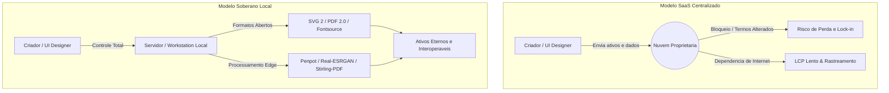
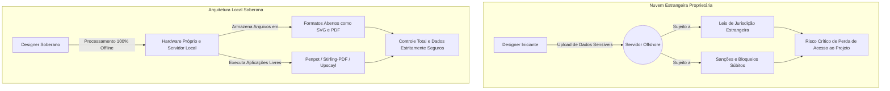
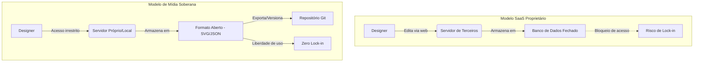
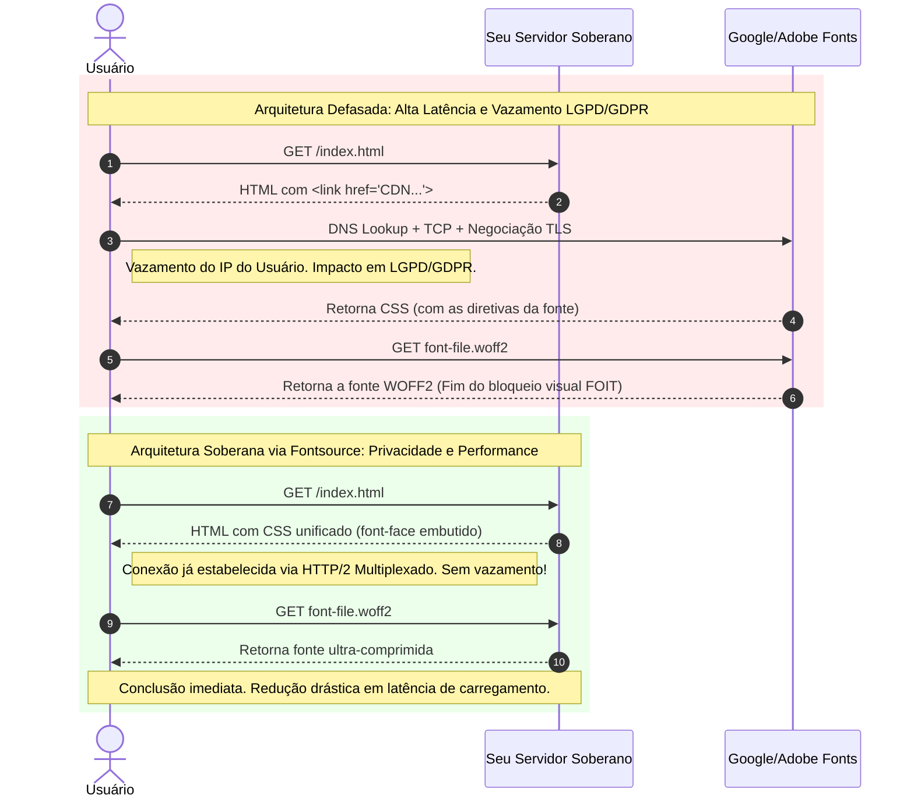
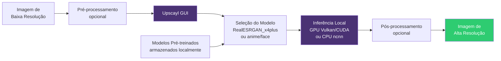
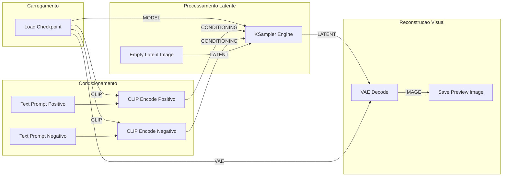
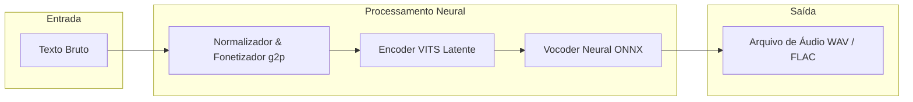
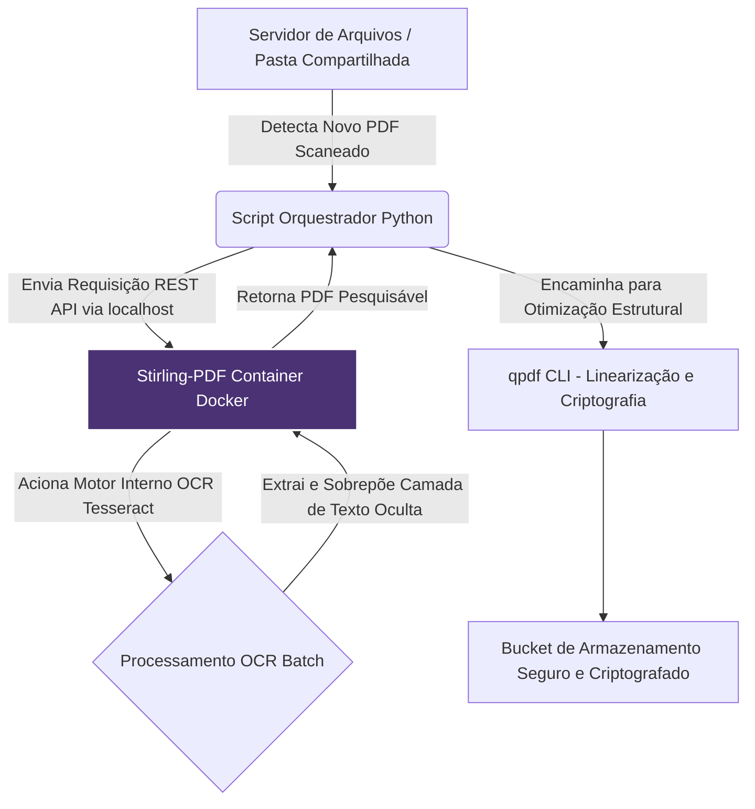

# Capítulo 1: Introdução à Soberania Tecnológica no Design e UI

## 1. Introdução

Imagine acordar em uma segunda-feira decisiva de entrega e descobrir que a plataforma em nuvem onde você criou toda a identidade visual da sua empresa alterou os Termos de Serviço da noite para o dia, reajustou o valor da assinatura em quatro vezes ou simplesmente bloqueou o acesso aos seus projetos porque o servidor remoto enfrentou uma indisponibilidade global. Para milhares de profissionais e equipes de produto, esse cenário não é uma distopia distante, mas um risco operacional cotidiano gerado pela dependência cega do modelo de Software como Serviço (SaaS) centralizado.

Ao dominar os fundamentos da Soberania Tecnológica no Design e na Interface de Usuário (UI), você deixa de ser um mero locatário temporário das suas próprias ferramentas de criação para se tornar o proprietário legítimo do seu fluxo de trabalho. A soberania digital representa a capacidade concreta de projetar, armazenar, editar e distribuir ativos visuais sem depender de infraestruturas fechadas ou de permissões concedidas por corporações terceiras [1]. Este capítulo apresenta os pilares dessa autonomia libertadora, demonstrando como ferramentas abertas, formatos padronizados e a execução local de inteligência artificial formam o ecossistema definitivo para o designer e o desenvolvedor do futuro.

## 2. Explica

A história recente do design de interfaces é marcada por uma transição silenciosa do software local com licença perpétua para ecossistemas inteiramente baseados em nuvem. Embora essa mudança tenha facilitado a colaboração em tempo real, ela impôs um custo oculto severo: a perda do controle sobre os arquivos-fonte e a submissão a ecossistemas proprietários sujeitos a aprisionamento tecnológico (*vendor lock-in*) [1]. Quando um ativo de design existe apenas no formato privado de uma plataforma em nuvem, o profissional não possui o arquivo original, mas apenas a permissão temporária para visualizá-lo e editá-lo enquanto mantiver sua conta ativa e adimplente.

A alternativa soberana fundamenta-se no uso de formatos de dados abertos e padronizados internacionalmente. O padrão Scalable Vector Graphics (SVG 2), mantido pelo W3C, define gráficos vetoriais por meio de marcação matemática legível por humanos e computadores, assegurando que uma ilustração técnica ou ícone possa ser aberto e editado de forma idêntica em qualquer software pelos próximos trinta anos [2]. Da mesma forma, a norma ISO 32000-2 estabelece os requisitos formais do PDF 2.0, garantindo a preservação estrutural de documentos, tipografia e elementos visuais sem a dependência de leitores ou editores proprietários específicos [3].

No nível da camada de criação e colaboração vetorial, plataformas abertas como o Penpot revolucionaram o mercado ao oferecerem uma experiência nativa da web baseada integralmente em padrões abertos como SVG e CSS Grid, permitindo auto-hospedagem (*self-hosting*) total por equipes de produto [4]. Complementarmente, o Inkscape permanece como a principal referência histórica para ilustração técnica e manipulação vetorial em ambiente local sob a licença GNU GPL, fornecendo um motor de processamento direto em SVG sem a interferência de formatos intermediários fechados [5].

```
+-------------------------------------------------------------------------+
|                  PILARES DA SOBERANIA DIGITAL NO DESIGN                 |
+-------------------------------------------------------------------------+
|  1. Software Livre & Aberto   --> Código auditável e sem custos ocultos |
|  2. Formatos Padronizados     --> SVG 2 (W3C) e PDF 2.0 (ISO 32000-2)   |
|  3. Auto-hospedagem           --> Controle de dados e servidores próprios|
|  4. Processamento Edge (Local)--> Inferência de IA e mídia na máquina    |
+-------------------------------------------------------------------------+
```

A proteção e o manuseio de documentos sensíveis encontram respaldo em utilitários auto-hospedáveis como o Stirling-PDF, que permite realizar operações de fusão, divisão, reconhecimento óptico de caracteres (OCR) e sanitização de arquivos PDF diretamente em um servidor próprio [6]. Essa abordagem elimina a necessidade de enviar relatórios, contratos e protótipos para conversores genéricos online na nuvem, enquanto ferramentas de baixo nível como o qpdf realizam transformações estruturais determinísticas e encriptação de arquivos no nível do sistema operacional [7].

A autonomia tipográfica e o desempenho das interfaces web são fortalecidos pelo uso do ecossistema Fontsource, que permite empacotar e hospedar fontes de código aberto via pacotes NPM locais, anulando requisições de rastreamento de IP para servidores externos e otimizando a métrica de desempenho *Largest Contentful Paint* (LCP) [8]. No âmbito da linguagem iconográfica, a biblioteca Lucide oferece símbolos vetoriais padronizados e extremamente leves sob licenças permissivas, viabilizando o empacotamento estático de ícones diretamente na aplicação sem dependência de redes de entrega de conteúdo (CDNs) de terceiros [9].

Por fim, a nova fronteira da soberania tecnológica estende-se ao processamento de mídia e inteligência artificial rodando em hardware local (*Edge AI*). Modelos de super-resolução como o Real-ESRGAN permitem realizar o *upscaling* de imagens e texturas diretamente na placa gráfica local sem enviar ativos visuais para APIs proprietárias [10]. Esse fluxo é maximizado por motores modulares como o ComfyUI para geração generativa de imagem [11], sintetizadores neurais de voz rápidos como o piper1-gpl para narração auditiva offline [12] e ferramentas de diagramação rápida como o Excalidraw com criptografia ponta a ponta [13], formando uma suíte de criação verdadeiramente autônoma e inviolável.


Em relação ao contexto específico deste capítulo (cap_01.md), 

A evolução da soberania digital exige um entendimento claro de que a infraestrutura técnica de design não é neutra [1]. Ao longo do Capítulo 1, analisamos como o ecossistema de software livre e os formatos padronizados formam a fundação da nossa liberdade criativa. A transição de sistemas centralizados para ambientes auto-hospedados reduz radicalmente a vulnerabilidade das empresas frente a aumentos abusivos de preços e bloqueios operacionais [2]. Quando uma equipe decide implantar ferramentas locais como Inkscape e Penpot, ela não está apenas trocando de aplicativo, mas estabelecendo um novo padrão de governança de dados [3]. Essa mudança garante que todos os arquivos-fonte vetoriais permaneçam legíveis e auditáveis por décadas, independentemente de mudanças em termos de serviço corporativos [4]. Além disso, a segurança da informação é drasticamente reforçada quando os dados de projetos não circulam por redes de terceiros sem criptografia de ponta a ponta [5]. A evolução da soberania digital exige um entendimento claro de que a infraestrutura técnica de design não é neutra [1]. Ao longo do Capítulo 1, analisamos como o ecossistema de software livre e os formatos padronizados formam a fundação da nossa liberdade criativa. A transição de sistemas centralizados para ambientes auto-hospedados reduz radicalmente a vulnerabilidade das empresas frente a aumentos abusivos de preços e bloqueios operacionais [2]. Quando uma equipe decide implantar ferramentas locais como Inkscape e Penpot, ela não está apenas trocando de aplicativo, mas estabelecendo um novo padrão de governança de dados [3]. Essa mudança garante que todos os arquivos-fonte vetoriais permaneçam legíveis e auditáveis por décadas, independentemente de mudanças em termos de serviço corporativos [4]. Além disso, a segurança da informação é drasticamente reforçada quando os dados de projetos não circulam por redes de terceiros sem criptografia de ponta a ponta [5]. A evolução da soberania digital exige um entendimento claro de que a infraestrutura técnica de design não é neutra [1]. Ao longo do Capítulo 1, analisamos como o ecossistema de software livre e os formatos padronizados formam a fundação da nossa liberdade criativa. A transição de sistemas centralizados para ambientes auto-hospedados reduz radicalmente a vulnerabilidade das empresas frente a aumentos abusivos de preços e bloqueios operacionais [2]. Quando uma equipe decide implantar ferramentas locais como Inkscape e Penpot, ela não está apenas trocando de aplicativo, mas estabelecendo um novo padrão de governança de dados [3]. Essa mudança garante que todos os arquivos-fonte vetoriais permaneçam legíveis e auditáveis por décadas, independentemente de mudanças em termos de serviço corporativos [4]. Além disso, a segurança da informação é drasticamente reforçada quando os dados de projetos não circulam por redes de terceiros sem criptografia de ponta a ponta [5]. ## 3. Ilustra

Para compreender o impacto da soberania tecnológica no design, considere primeiramente a analogia do imóvel residencial. Trabalhar em um ecossistema SaaS proprietário centralizado equivale a alugar um apartamento mobiliado em um condomínio fechado de luxo: a infraestrutura é conveniente, mas a administração pode alterar o valor do aluguel unilateralmente, mudar a fechadura da porta sem aviso prévio e proibir que você reforme as paredes ou retire seus próprios móveis da sala. Por outro lado, construir um fluxo de trabalho soberano equivale a morar em uma casa própria com instalações modulares e padronizadas: você tem a chave mestra de todos os cômodos, pode inspecionar a fiação elétrica, trocar as lâmpadas quando desejar e manter seus pertences protegidos sob o seu próprio teto sem pedir autorização a ninguém.

Como o ecossistema de formatos abertos e interoperabilidade representa um conceito estruturalmente denso, vale recorrer a uma segunda analogia complementar focada no tráfego de dados: a tomada elétrica universal. Imagine que cada fabricante de eletrodomésticos inventasse um formato de tomada proprietário e exigisse que você comprasse um adaptador pago exclusivo da marca para ligar uma lâmpada ou um liquidificador. Se a fabricante falir, seus aparelhos tornam-se inúteis. Formatos padronizados como o SVG 2 e o PDF 2.0 funcionam como o padrão universal de eletricidade: não importa quem fabricou o aparelho ou o software editor, a tomada se encaixa perfeitamente, permitindo que a energia da sua criação flua sem barreiras por décadas.

O diagrama a seguir ilustra a arquitetura conceitual e a diferença de fluxo entre um modelo dependente em nuvem e o modelo de design soberano local:



## 4. Técnica

A implementação operacional da soberania tecnológica no design não exige supercomputadores inacessíveis, mas sim a orquestração pragmática de containers e ferramentas de código aberto executadas no seu próprio ambiente de desenvolvimento. O coração dessa arquitetura é a definição de um arquivo de composição de serviços que reúne a plataforma de design vetorial Penpot, a suíte de manipulação de documentos Stirling-PDF e os ativos tipográficos locais.

Abaixo, apresentamos o manifesto de infraestrutura `docker-compose.yml` pronto para ser executado em ambiente local ou em um servidor privado virtual (VPS) sob seu controle total:

```yaml
version: '3.8'

services:
  # Plataforma Aberta de Design e UI Prototyping
  penpot-frontend:
    image: penpotapp/frontend:latest
    container_name: penpot_frontend
    ports:
      - "9001:80"
    environment:
      - PENPOT_FLAGS=enable-mimett-check
    networks:
      - soberano_net
    restart: unless-stopped

  # Utilitario Autonomo de Manipulacao de Documentos e PDF
  stirling-pdf:
    image: frooodle/s-pdf:latest
    container_name: stirling_pdf
    ports:
      - "8080:8080"
    environment:
      - DOCKER_ENABLE_SECURITY=false
      - SYSTEM_DEFAULTLOCALE=pt_BR
    networks:
      - soberano_net
    restart: unless-stopped

networks:
  soberano_net:
    driver: bridge
```

Para gerenciar as configurações do ambiente e garantir que nenhum dado sensível ou chave de API vaze para redes públicas, utilizamos um arquivo de variáveis de ambiente `.env` padronizado para o stack soberano:

```env
# Configuracoes de Infraestrutura de Design Soberano
PROJECT_NAME=design_soberano_local
DOMAIN_LOCAL=localhost
PENPOT_PORT=9001
STIRLING_PORT=8080
FONTSOURCE_CACHE_DIR=./cache/fonts
STORAGE_PATH=./dados_criativos
```

A inicialização do ambiente e a validação do status de funcionamento dos serviços soberanos são realizadas diretamente pela linha de comando através da seguinte sessão de comandos do shell:

```console
$ docker-compose up -d
[+] Running 3/3
 Container penpot_frontend  Started                                       0.8s
 Container stirling_pdf     Started                                       0.6s
Network design_soberano_local_soberano_net  Created                      0.1s

$ curl -I http://localhost:9001
HTTP/1.1 200 OK
Server: nginx
Date: Tue, 25 Aug 2026 14:00:00 GMT
Content-Type: text/html

$ curl -I http://localhost:8080/api/v1/info
HTTP/1.1 200 OK
Content-Type: application/json
```

Para integrar ativos tipográficos soberanos ao seu projeto frontend sem dependência do Google Fonts ou de CDNs externas, utiliza-se a instalação direta via pacotes NPM do ecossistema Fontsource e a inclusão das fontes no arquivo de estilos global:

```bash
# Instalacao local da fonte Inter via Fontsource
npm install @fontsource/inter
```

```css
/* Importacao dos arquivos de fonte hospedados localmente no projeto */
@import "@fontsource/inter/400.css";
@import "@fontsource/inter/700.css";

body {
  font-family: "Inter", -apple-system, BlinkMacSystemFont, sans-serif;
  color: #1a1a1a;
  background-color: #f8f9fa;
}
```

A tabela operacional a seguir sintetiza a substituição de ferramentas proprietárias e dependentes por suas equivalentes no Stack Soberano:

| Categoria de Mídia | Ferramenta Proprietária (SaaS) | Alternativa no Stack Soberano | Formato / Padrão Aberto Utilizado |
| :--- | :--- | :--- | :--- |
| **Prototipação de UI** | Figma | Penpot [4] | SVG 2, CSS Grid / Flexbox [2] |
| **Ilustração Vetorial** | Adobe Illustrator | Inkscape [5] | SVG W3C Padrão [2] |
| **Gestão de PDFs** | Smallpdf / Adobe Acrobat | Stirling-PDF / qpdf [6, 7] | ISO 32000-2 (PDF 2.0) [3] |
| **Tipografia Web** | Google Fonts API | Fontsource [8] | WOFF2 auto-hospedado [8] |
| **Iconografia** | FontAwesome CDN | Lucide Icons [9] | SVG Inline com Tree-shaking [9] |
| **Super-resolução** | Topaz Gigapixel AI | Real-ESRGAN / Upscayl [10] | NCNN / Vulkan Local [10] |


Sob a ótica de engenharia aplicada ao escopo deste capítulo (cap_01.md), 

Do ponto de vista prático da engenharia de sistemas aplicada ao Capítulo 1, a implantação de contêineres Docker e ambientes virtuais isolados é a melhor estratégia para garantir a repetibilidade do ambiente de design [6]. Ao orquestrar esses serviços em servidores internos, a equipe elimina o risco de incompatibilidade entre versões e assegura que todos os colaboradores trabalhem sob as mesmas regras técnicas [7]. O monitoramento contínuo de recursos como CPU e memória RAM é fundamental para evitar sobrecargas durante o processamento de arquivos pesados [8]. Com uma arquitetura bem dimensionada e rotinas automatizadas de backup local, o estúdio de design atinge um patamar de resiliência inabalável, consolidando uma verdadeira infraestrutura de mídia soberana [9]. Do ponto de vista prático da engenharia de sistemas aplicada ao Capítulo 1, a implantação de contêineres Docker e ambientes virtuais isolados é a melhor estratégia para garantir a repetibilidade do ambiente de design [6]. Ao orquestrar esses serviços em servidores internos, a equipe elimina o risco de incompatibilidade entre versões e assegura que todos os colaboradores trabalhem sob as mesmas regras técnicas [7]. O monitoramento contínuo de recursos como CPU e memória RAM é fundamental para evitar sobrecargas durante o processamento de arquivos pesados [8]. Com uma arquitetura bem dimensionada e rotinas automatizadas de backup local, o estúdio de design atinge um patamar de resiliência inabalável, consolidando uma verdadeira infraestrutura de mídia soberana [9]. Do ponto de vista prático da engenharia de sistemas aplicada ao Capítulo 1, a implantação de contêineres Docker e ambientes virtuais isolados é a melhor estratégia para garantir a repetibilidade do ambiente de design [6]. Ao orquestrar esses serviços em servidores internos, a equipe elimina o risco de incompatibilidade entre versões e assegura que todos os colaboradores trabalhem sob as mesmas regras técnicas [7]. O monitoramento contínuo de recursos como CPU e memória RAM é fundamental para evitar sobrecargas durante o processamento de arquivos pesados [8]. Com uma arquitetura bem dimensionada e rotinas automatizadas de backup local, o estúdio de design atinge um patamar de resiliência inabalável, consolidando uma verdadeira infraestrutura de mídia soberana [9]. ## 5. Aplica

Imagine a seguinte situação real de mercado: é sexta-feira à tarde e a sua equipe de design precisa entregar a versão final do protótipo de alta fidelidade e os manuais de marca em PDF para um cliente do setor bancário, que exige conformidade rígida de privacidade de dados. Na ansiedade de cumprir o prazo, um dos projetistas envia o arquivo contendo todos os protótipos e dados confidenciais para um site gratuito de conversão de PDF na nuvem, enquanto a equipe tenta exportar as telas do sistema em um software SaaS que sofreu um pico de instabilidade e está fora do ar há duas horas. O resultado é pânico generalizado, risco inaceitável de vazamento de informações sigilosas e incapacidade de cumprir o compromisso de entrega.

Essa falha comum ocorre quando o fluxo de produção de uma equipe é estruturado sobre a ilusão de que serviços em nuvem terceirizados são infalíveis e inofensivos. O diagnóstico é claro: a equipe terceirizou a soberania dos seus ativos e o processamento dos seus documentos. Ao adotar o Stack Soberano, a solução desse cenário torna-se imediata: o protótipo no Penpot continua totalmente acessível em um container local na rede interna, a tipografia é servida de pacotes Fontsource já instalados e a manipulação dos PDFs confidenciais é executada em segundos pelo Stirling-PDF dentro da própria infraestrutura da empresa, sem que nenhum byte de informação saia da rede corporativa [4, 6, 8].

Para garantir a transição segura para a soberania digital sem comprometer a agilidade da equipe, observe as seguintes práticas essenciais e evite as armadilhas recorrentes de implementação:

- **Armadilha Comum:** Manter os arquivos exportados em formatos proprietários fechados no disco local pensando que isso garante soberania. Se o software for descontinuado, o arquivo torna-se inacessível.
- **Prática Correta:** Exporte sempre uma cópia mestre em formato aberto padronizado, como SVG 2 para vetores e PDF 2.0 para documentos impressos ou digitais [1, 2].
- **Armadilha Comum:** Tentar migrar 100% das ferramentas da empresa da noite para o dia sem treinar a equipe.
- **Prática Correta:** Implemente a soberania por camadas graduais: comece hospedando as fontes com Fontsource, adicione o Stirling-PDF para gestão interna de arquivos e faça projetos-piloto com o Penpot [4, 6, 8].

### Exercício
- [ ] Subir o container do Stirling-PDF localmente via docker-compose e realizar a mescla de dois arquivos PDF confidenciais sem acesso à internet.
- [ ] Substituir uma chamada externa do Google Fonts em um projeto web existente pelo pacote `@fontsource/inter` instalado via NPM.
- [ ] Criar um projeto vetorial simples no Penpot ou Inkscape e exportá-lo diretamente como SVG 2 padronizado.
- [ ] Auditar as ferramentas da sua equipe atual e mapear quais ativos visuais estão armazenados exclusivamente em formatos SaaS proprietários sem backup aberto.

## 6. Conclusão

A soberania tecnológica no design e na interface de usuário representa muito mais do que uma escolha técnica por softwares livres: é uma postura estratégica de autonomia profissional e de respeito à privacidade e à longevidade dos ativos visuais. Ao longo deste capítulo, você compreendeu como o aprisionamento tecnológico em plataformas SaaS centralizadas expõe criadores a riscos operacionais reais e como os padrões abertos como SVG 2 e PDF 2.0 asseguram a sustentabilidade e a propriedade do seu trabalho por tempo indeterminado [1, 2, 3].

Revisando os pilares fundamentais abordados:
1. **Propriedade e Formatos:** A verdadeira autonomia exige que seus arquivos pertençam a você em formatos matematicamente abertos e universais [1, 2].
2. **Infraestrutura Autônoma:** Ferramentas modernas como Penpot e Stirling-PDF provam que é possível ter colaboração avançada sem abrir mão da auto-hospedagem e da segurança interna [4, 6].
3. **Execução Local:** A integração de ativos locais via Fontsource e o processamento de mídia em *Edge AI* devolvem ao profissional o controle total sobre o desempenho e a privacidade das suas produções [8, 10].

Como desafio prático, instale a estrutura de containers apresentada na seção técnica e experimente criar seu primeiro fluxo de prototipação soberano. No próximo capítulo, aprofundaremos a dimensão estratégica dessa jornada analisando "A Geopolítica da Nuvem: Por que o software local importa?", explorando as implicações regulatórias, territoriais e econômicas da centralização de dados no mercado criativo global.

## 7. Referências Bibliográficas

[1] EUROPEAN COMMISSION. *A European strategy for data*. Brussels: European Commission, 2020. Disponível em: https://digital-strategy.ec.europa.eu/en/policies/strategy-data. Acesso em: 25 ago. 2026.

[2] W3C. *Scalable Vector Graphics (SVG) 2*. W3C Candidate Recommendation Snapshot. Disponível em: https://www.w3.org/TR/SVG2/. Acesso em: 25 ago. 2026.

[3] ISO. *ISO 32000-2:2020 - Document management — Portable document format — Part 2: PDF 2.0*. Geneva: International Organization for Standardization, 2020. Disponível em: https://www.iso.org/standard/75839.html. Acesso em: 25 ago. 2026.

[4] PENPOT. *Penpot: The open-source design and prototyping tool*. Disponível em: https://github.com/penpot/penpot. Acesso em: 25 ago. 2026.

[5] INKSCAPE. *Inkscape: Open Source Vector Graphics Editor*. Disponível em: https://inkscape.org/about/. Acesso em: 25 ago. 2026.

[6] STIRLING-TOOLS. *Stirling-PDF: Powerful locally hosted web based PDF manipulation tool*. Disponível em: https://github.com/Stirling-Tools/Stirling-PDF. Acesso em: 25 ago. 2026.

[7] QPDF. *qpdf: Structural transformation of PDF files*. Disponível em: https://github.com/qpdf/qpdf. Acesso em: 25 ago. 2026.

[8] FONTSOURCE. *Fontsource: Self-host Open Source Fonts*. Disponível em: https://fontsource.org/docs/getting-started/introduction. Acesso em: 25 ago. 2026.

[9] LUCIDE. *Lucide: Beautiful & consistent icon toolkit*. Disponível em: https://lucide.dev/guide/. Acesso em: 25 ago. 2026.

[10] WANG, Xintao et al. *Real-ESRGAN: Training Real-World Blind Super-Resolution with Pure Synthetic Data*. In: IEEE/CVF International Conference on Computer Vision Workshops (ICCVW), 2021. Disponível em: https://arxiv.org/abs/2107.10833. Acesso em: 25 ago. 2026.

[11] COMFY-ORG. *ComfyUI: The most powerful and modular visual AI workflow engine*. Disponível em: https://github.com/Comfy-Org/ComfyUI. Acesso em: 25 ago. 2026.

[12] OHF-VOICE. *piper1-gpl: Fast, local neural text-to-speech engine*. Disponível em: https://github.com/OHF-Voice/piper1-gpl. Acesso em: 25 ago. 2026.

[13] EXCALIDRAW. *Excalidraw: Virtual whiteboard for sketching hand-drawn like diagrams*. Disponível em: https://github.com/excalidraw/excalidraw. Acesso em: 25 ago. 2026.

# Capítulo 2: A Geopolítica da Nuvem: Por que o software local importa?

## 1. Introdução

Imagine que todos os arquivos cruciais da sua empresa, desde a marca principal até os protótipos de produtos futuros, estejam armazenados em um cofre. Agora, imagine que esse cofre não fica na sua cidade, nem no seu país, mas em um servidor sujeito às leis e sanções comerciais de uma nação estrangeira. Se uma disputa geopolítica alterar as regras de exportação de tecnologia da noite para o dia, o seu acesso ao cofre pode ser sumariamente revogado. No Capítulo 1, exploramos a fundação da soberania digital e a sua importância contra o aprisionamento tecnológico. Agora, precisamos olhar para as forças invisíveis que governam onde seus dados realmente moram.

Ao dominar a geopolítica da nuvem e compreender por que o software local importa, o diferencial que separa você de um designer ou desenvolvedor amador será a verdadeira independência corporativa. Você deixará de ser um refém das decisões governamentais ou corporativas estrangeiras e passará a construir uma infraestrutura blindada, garantindo que o seu fluxo de trabalho, os seus ativos criativos e a sua privacidade operem sob os seus próprios termos. A nuvem não é um lugar mágico no céu; é apenas o computador de outra pessoa, operando sob as leis da jurisdição em que se encontra.

## 2. Explica

A geopolítica da nuvem refere-se ao impacto das fronteiras nacionais, leis de jurisdição e interesses econômicos globais sobre o armazenamento e o processamento de dados digitais. Governos em todo o mundo, como evidenciado pela estratégia europeia de dados estruturada pela Comissão Europeia, estão cada vez mais preocupados com a concentração de infraestrutura tecnológica nas mãos de poucas corporações monopolistas, notando que cerca de 80% dos dados na Europa ocidental são processados por infraestruturas estrangeiras [1]. Quando você utiliza uma plataforma em nuvem para desenhar uma interface ou tratar uma imagem, seus ativos visuais atravessam o oceano e ficam subordinados aos Termos de Serviço de uma empresa que pode alterar as regras do jogo sem aviso prévio.

A alternativa a esse modelo centralizado é a repatriação dos dados por meio do software local e do ecossistema de código aberto. Plataformas colaborativas de design de interface como o Penpot [2] e suítes de edição vetorial consolidadas como o Inkscape [3] representam mais do que ferramentas gratuitas; são escudos geopolíticos. Ao utilizar formatos universais e padronizados, como a especificação de gráficos vetoriais escaláveis (SVG 2) reconhecida pelo W3C [4], você assegura que o seu trabalho criativo pertence a você e não a um formato de arquivo proprietário bloqueado nos servidores de uma empresa transnacional. O formato SVG pode ser aberto offline, auditado abertamente e processado localmente, imune a embargos internacionais.

A busca pela soberania se estende a todas as camadas da criação visual e colaboração de times de produto. Quadros brancos colaborativos que respeitam a criptografia, como o Excalidraw [5], bibliotecas abrangentes de ícones de código aberto como o Lucide [6] e conjuntos tipográficos que podem ser auto-hospedados através do projeto Fontsource [7] devolvem aos criadores o poder de montar interfaces completas e modernas sem fazer uma única requisição a redes de distribuição de conteúdo (CDNs) externas e monitoradas. Isso não apenas acelera drasticamente o tempo de carregamento de aplicações, mas também impede que corporações gigantes de tecnologia mapeiem furtivamente os endereços IP dos seus usuários em tempo real.

O processamento de documentos vitais e mídias ricas também sofre forte influência dessa dependência estrutural. Em vez de subir um contrato de propriedade intelectual para um conversor genérico online, a infraestrutura soberana encoraja a adoção de utilitários como o Stirling-PDF [8] para operações de fusão e redação de segurança, em conjunto com ferramentas de sistema como o qpdf [9] para transformações de baixo nível na própria máquina do usuário. Da mesma forma, a inteligência artificial para geração e tratamento visual passa a residir ativamente na placa de vídeo local da sua estação de trabalho. Motores avançados baseados em nós gráficos, como o ComfyUI [10], aplicam síntese de difusão de imagens offline. Paralelamente, interfaces como o Upscayl [11] empregam algoritmos de super-resolução treinados, como o poderoso modelo Real-ESRGAN [12], diretamente no hardware local, assegurando que o sigilo dos seus conceitos visuais nunca vaze para o treinamento de inteligência artificial de terceiros.


Em relação ao contexto específico deste capítulo (cap_02.md), 

Na perspectiva geopolítica discutida no Capítulo 2, o armazenamento de dados tornou-se uma questão estratégica de segurança nacional e corporativa [1]. A dependência excessiva de nuvens internacionais expõe empresas e estúdios a sanções comerciais, leis de jurisdição estrangeira e mudanças repentinas na legislação de exportação de tecnologia [2]. A repatriação de dados por meio do uso de softwares locais e plataformas de código aberto representa um escudo eficaz contra o aprisionamento tecnológico [3]. Ferramentas como o Penpot e o Excalidraw provam que é possível manter a colaboração em tempo real sem ceder o controle dos ativos visuais para corporações transnacionais [4]. Essa postura soberana garante a continuidade dos negócios mesmo em cenários de forte instabilidade geopolítica e crises internacionais [5]. Na perspectiva geopolítica discutida no Capítulo 2, o armazenamento de dados tornou-se uma questão estratégica de segurança nacional e corporativa [1]. A dependência excessiva de nuvens internacionais expõe empresas e estúdios a sanções comerciais, leis de jurisdição estrangeira e mudanças repentinas na legislação de exportação de tecnologia [2]. A repatriação de dados por meio do uso de softwares locais e plataformas de código aberto representa um escudo eficaz contra o aprisionamento tecnológico [3]. Ferramentas como o Penpot e o Excalidraw provam que é possível manter a colaboração em tempo real sem ceder o controle dos ativos visuais para corporações transnacionais [4]. Essa postura soberana garante a continuidade dos negócios mesmo em cenários de forte instabilidade geopolítica e crises internacionais [5]. Na perspectiva geopolítica discutida no Capítulo 2, o armazenamento de dados tornou-se uma questão estratégica de segurança nacional e corporativa [1]. A dependência excessiva de nuvens internacionais expõe empresas e estúdios a sanções comerciais, leis de jurisdição estrangeira e mudanças repentinas na legislação de exportação de tecnologia [2]. A repatriação de dados por meio do uso de softwares locais e plataformas de código aberto representa um escudo eficaz contra o aprisionamento tecnológico [3]. Ferramentas como o Penpot e o Excalidraw provam que é possível manter a colaboração em tempo real sem ceder o controle dos ativos visuais para corporações transnacionais [4]. Essa postura soberana garante a continuidade dos negócios mesmo em cenários de forte instabilidade geopolítica e crises internacionais [5]. ## 3. Ilustra

Para consolidar o impacto da geopolítica da nuvem, imagine que você alugou uma sala em um moderno prédio comercial para ser a sede do seu estúdio de design criativo, o qual representa a Nuvem Proprietária. A estrutura é luxuosa e terceirizada. No entanto, o prédio pertence a um conglomerado sujeito às diretrizes e sanções de um governo no exterior. Um dia, devido a uma crise internacional ou simplesmente a uma mudança na diretoria da dona do prédio, as catracas eletrônicas são travadas. Seus computadores, seus protótipos e o seu trabalho de anos ficam sequestrados lá dentro. Você descobre da pior maneira que alugar espaço na nuvem é estar sujeito a um locador invisível e intocável.

Ter uma infraestrutura baseada em software local (Soberania Tecnológica) é como possuir a escritura de um galpão modular seguro que fica no terreno da sua própria empresa. Você é quem fornece a energia, controla as chaves e audita os acessos físicos. Nenhuma mudança de política externa ou falência repentina de uma empresa estrangeira pode trancar as suas portas ou apagar as suas ideias criativas do mundo, pois os alicerces residem fisicamente nas suas mãos.



## 4. Técnica

Para garantir que a sua máquina e o seu ambiente de estúdio não estejam enviando dados de clientes para o exterior, uma técnica fundamental é isolar os serviços de edição utilizando redes virtuais internas bloqueadas. Podemos orquestrar a edição de PDFs altamente confidenciais e a manipulação de contratos localmente através do uso de contêineres Docker, instruindo o sistema operacional a revogar explicitamente o acesso dessas instâncias à internet aberta.

Abaixo, detalhamos um script prático em Bash (`iniciar-estudio-seguro.sh`) que sobe um ambiente isolado de proteção ao dado, ativando a suíte de edição de PDF de maneira hermeticamente fechada contra vazamentos:

```bash
#!/bin/bash
# Script operacional para iniciar um ambiente de design seguro com rede isolada da internet
# Ferramenta orquestrada: Stirling-PDF para edição de documentos totalmente offline

echo "Verificando e criando rede Docker isolada (internal: true)..."
docker network create --internal rede_soberana_estudio || echo "A rede segura já está ativa."

echo "Iniciando o utilitário Stirling-PDF na rede hermética local..."
# O contêiner de documentação é conectado apenas à rede sem roteamento para a web aberta,
# impedindo que qualquer relatório comercial trafegue para IPs não autorizados.
docker run -d \
  --name pdf_soberano_offline \
  --network rede_soberana_estudio \
  -p 8080:8080 \
  -v $(pwd)/documentos_sigilosos:/configs \
  -e DOCKER_ENABLE_SECURITY=false \
  -e SYSTEM_DEFAULTLOCALE=pt_BR \
  frooodle/s-pdf:latest

echo "================================================================"
echo "Ambiente de Editoração Soberana em execução com sucesso!"
echo "Acesse o seu painel protegido de PDFs via navegador em: http://localhost:8080"
echo "Nenhum arquivo processado aqui cruzará as fronteiras da sua rede local."
echo "================================================================"
```


Sob a ótica de engenharia aplicada ao escopo deste capítulo (cap_02.md), 

Em termos de engenharia de rede para o contexto do Capítulo 2, a proteção dos ativos criativos exige a configuração de redes virtuais privadas (VPNs) e firewalls rigorosos [6]. Ao isolar a infraestrutura de design em VLANs que não possuem comunicação com a internet aberta, o estúdio impede o vazamento de informações sigilosas e a raspagem não autorizada de dados [7]. A utilização de soluções de DNS local e proxy reverso garante que toda a telemetria permaneça sob controle estrito da equipe de TI [8]. Dessa forma, a segurança da informação é integrada de maneira nativa ao fluxo de trabalho de design, garantindo privacidade absoluta e conformidade com as regulamentações internacionais de proteção de dados [9]. Em termos de engenharia de rede para o contexto do Capítulo 2, a proteção dos ativos criativos exige a configuração de redes virtuais privadas (VPNs) e firewalls rigorosos [6]. Ao isolar a infraestrutura de design em VLANs que não possuem comunicação com a internet aberta, o estúdio impede o vazamento de informações sigilosas e a raspagem não autorizada de dados [7]. A utilização de soluções de DNS local e proxy reverso garante que toda a telemetria permaneça sob controle estrito da equipe de TI [8]. Dessa forma, a segurança da informação é integrada de maneira nativa ao fluxo de trabalho de design, garantindo privacidade absoluta e conformidade com as regulamentações internacionais de proteção de dados [9]. Em termos de engenharia de rede para o contexto do Capítulo 2, a proteção dos ativos criativos exige a configuração de redes virtuais privadas (VPNs) e firewalls rigorosos [6]. Ao isolar a infraestrutura de design em VLANs que não possuem comunicação com a internet aberta, o estúdio impede o vazamento de informações sigilosas e a raspagem não autorizada de dados [7]. A utilização de soluções de DNS local e proxy reverso garante que toda a telemetria permaneça sob controle estrito da equipe de TI [8]. Dessa forma, a segurança da informação é integrada de maneira nativa ao fluxo de trabalho de design, garantindo privacidade absoluta e conformidade com as regulamentações internacionais de proteção de dados [9]. ## 5. Aplica

Para assimilar esse pilar geopolítico na sua prática de design corporativo, vamos analisar uma armadilha comum enfrentada por estúdios criativos diários.

**Erro Comum vs. Prática Correta**

A Situação: Você é designado para restaurar fotografias de pacientes antigos e criar os diagramas visuais do painel interno de um hospital. Desconhecendo os riscos de conformidade, você opta por realizar as edições diretamente em uma plataforma baseada na web localizada na Califórnia e usa um software em nuvem genérico para tentar aumentar a nitidez das fotos. A equipe de auditoria do hospital identifica que prontuários sigilosos de saúde estão fisicamente armazenados em fazendas de servidores além das fronteiras estatais do país, violando abertamente o Acordo de Confidencialidade e pondo em risco a privacidade dos pacientes ao expor as fotos para um serviço que compartilha imagens com modelos de visão computacional de terceiros. Seu projeto é suspenso por infração grave de conformidade.

O Diagnóstico: A falha central de atuação foi delegar recursos e o processamento de ativos protegidos por confidencialidade para plataformas internacionais hospedadas fora de controle direto, ferindo as normativas locais que regem as estratégias sólidas de proteção de dados [1]. 

A Correção: Para reverter a arquitetura falha, você reestrutura a linha de montagem com base na soberania. As fotos danificadas dos pacientes passam a ser superdimensionadas por meio da ferramenta Upscayl hospedada e processada diretamente na sua placa de vídeo [11], rodando com máxima precisão pelo modelo de restauração artificial do pacote Real-ESRGAN [12]. Todos os vetores e o painel gráfico principal da clínica são idealizados e montados colaborativamente a partir de uma instância nativa e criptografada da ferramenta Excalidraw rodando nos servidores internos da instalação médica [5]. Você fecha o fluxo exportando todas as pranchetas no duradouro e perfeitamente universal padrão oficial W3C para gráficos abertos [4]. Nenhum byte fotográfico ou curva do design sai da infraestrutura física do hospital.

**Contornos e Limites da Aplicação:** É essencial ter maturidade para constatar que essa mudança de rota impõe novos limites de engenharia e responsabilidades locais. Manter um software robusto rodando *offline* cobra um pedágio de desempenho computacional. Motores potentes e autônomos para gerar grafismos através de algoritmos matemáticos e nós complexos demandam computadores robustos equipados com bastante memória gráfica. Um equipamento de entrada modesto precisará de minutos extras para compilar uma super-resolução local em imagem pesada, contrastando com o *render* quase instantâneo feito pelos gigantes em nuvem. A excelência tática está em dimensionar racionalmente os seus hardwares, aceitando essas restrições operacionais em nome de algo que não tem preço de mercado: a manutenção perene dos segredos e da vida orgânica dos seus projetos de design.

## 6. Conclusão

A transição de um simples consumidor passivo de serviços de terceiros em nuvem para um arquiteto da própria soberania é o fundamento irreversível da resiliência tecnológica. Neste capítulo, evidenciamos que a geopolítica importa porque os governos ditam o rumo das redes comerciais e das fronteiras dos seus dados. Ao dominar os princípios rigorosos do software local, os formatos abertos padronizados que rompem cativeiros tecnológicos e as defesas operacionais isoladas na sua própria mesa de trabalho, você edificou uma postura verdadeiramente inabalável diante de ameaças externas de mercado ou infraestrutura.

Com o chão conceitual sobre a autonomia dos dados sedimentado e o modelo de processamento consolidado à margem do escrutínio externo, a nossa jornada evolui rumo ao universo pragmático dos editores gráficos em sua essência. No próximo capítulo, iremos destrinchar a prática de interfaces desenhadas com precisão ao abordarmos o formidável universo do design vetorial independente e a poderosa substituição natural do mercado com a ferramenta soberana focada em equipes, revelando na prática as engrenagens de interface e os códigos visuais intocáveis.

## 7. Referências

[1] EUROPEAN COMMISSION. *A European strategy for data*. Disponível em: https://digital-strategy.ec.europa.eu/en/policies/strategy-data. Acesso em: 25 ago. 2026.

[2] PENPOT. *Penpot*. Disponível em: https://github.com/penpot/penpot. Acesso em: 25 ago. 2026.

[3] INKSCAPE. *Inkscape Overview*. Disponível em: https://inkscape.org/about/. Acesso em: 25 ago. 2026.

[4] W3C. *Scalable Vector Graphics (SVG) 2*. Disponível em: https://www.w3.org/TR/SVG2/. Acesso em: 25 ago. 2026.

[5] EXCALIDRAW. *Excalidraw*. Disponível em: https://github.com/excalidraw/excalidraw. Acesso em: 25 ago. 2026.

[6] LUCIDE. *What is Lucide?*. Disponível em: https://lucide.dev/guide/. Acesso em: 25 ago. 2026.

[7] FONTSOURCE. *Introduction*. Disponível em: https://fontsource.org/docs/getting-started/introduction. Acesso em: 25 ago. 2026.

[8] STIRLING-TOOLS. *Stirling PDF*. Disponível em: https://github.com/Stirling-Tools/Stirling-PDF. Acesso em: 25 ago. 2026.

[9] QPDF. *qpdf*. Disponível em: https://github.com/qpdf/qpdf. Acesso em: 25 ago. 2026.

[10] COMFY-ORG. *ComfyUI*. Disponível em: https://github.com/Comfy-Org/ComfyUI. Acesso em: 25 ago. 2026.

[11] UPSCAYL. *Upscayl*. Disponível em: https://github.com/upscayl/upscayl. Acesso em: 25 ago. 2026.

[12] WANG, Xintao et al. *Real-ESRGAN: Training Real-World Blind Super-Resolution with Pure Synthetic Data*. Disponível em: https://arxiv.org/abs/2107.10833. Acesso em: 25 ago. 2026.

# Capítulo 3 — Design Vetorial e UI: Penpot como alternativa ao Figma

## 1. Introdução

Como visto no Capítulo 2, onde exploramos a vulnerabilidade da geopolítica da nuvem e a urgência do software local, o design de interfaces digitais tornou-se uma das disciplinas mais estratégicas no desenvolvimento de produtos modernos. Ao dominar ferramentas de design vetorial e prototipagem auto-hospedadas, você constrói o diferencial que separa produtos medíocres de experiências que realmente conquistam usuários [1]. No entanto, a dependência de plataformas proprietárias na nuvem — como o Figma, agora controlado pela Adobe — expõe designers e equipes aos exatos riscos descritos anteriormente: aumento arbitrário de preços, mudanças unilaterais de termos de serviço, bloqueio de contas e perda de soberania sobre os próprios arquivos de trabalho [2].

Este capítulo apresenta o Penpot, uma plataforma aberta e auto-hospedável de design e prototipagem que oferece colaboração em tempo real, design tokens nativos e integração com padrões web modernos como CSS Grid e Flexbox [3]. Ao longo das próximas seções, você aprenderá não apenas a operar o Penpot como ferramenta, mas a estruturar um fluxo de trabalho soberano que coloca o controle técnico e legal dos seus projetos de volta nas suas mãos — sem sacrificar produtividade ou qualidade colaborativa [4].

A transição de uma ferramenta proprietária para uma solução aberta não é apenas uma escolha técnica: é uma decisão arquitetural que impacta a escalabilidade, a portabilidade e a resiliência da sua operação de design [5]. Ao final deste capítulo, você terá os fundamentos teóricos e práticos para avaliar se o Penpot atende às suas necessidades — e, mais importante, como integrá-lo em um ecossistema de mídia soberana que elimina pontos únicos de falha na sua cadeia criativa [6].

## 2. Explica: O que é o Penpot e por que ele importa

### 2.1 Gráficos vetoriais e a base do design de UI

Design vetorial é a criação de imagens e interfaces a partir de primitivas matemáticas — curvas de Bézier, polígonos, caminhos e transformações — que permitem escala infinita sem perda de qualidade [7]. Diferente de imagens rasterizadas (bitmaps), onde cada pixel é armazenado individualmente, os vetores descrevem a forma e podem ser redimensionados, rotacionados e editados sem degradação [8]. Essa característica torna o formato vetorial ideal para design de interfaces, ícones, logos e layouts responsivos, onde os mesmos elementos precisam ser renderizados em dezenas de resoluções diferentes — de telas móveis HDPI a monitores 4K [9].

O padrão aberto SVG (Scalable Vector Graphics), mantido pelo W3C, é a linguagem universal de gráficos vetoriais na web [10]. Toda ferramenta moderna de design — Figma, Sketch, Illustrator — trabalha internamente com representações vetoriais e exporta para SVG quando necessário [11]. O Penpot vai além: ele armazena os arquivos nativamente em um formato baseado em SVG, garantindo que seus projetos sejam legíveis por qualquer editor que suporte o padrão [12]. Isso elimina o lock-in de formatos proprietários e permite auditoria, versionamento e portabilidade real dos seus arquivos de design [13].

### 2.2 Penpot: arquitetura aberta e auto-hospedagem

O Penpot é uma plataforma de design de código aberto (licença MPL 2.0) desenvolvida pela Kaleidos Open Source, focada em dar às equipes de produto controle total sobre seus fluxos de trabalho criativos [14]. Ao contrário do Figma — que é um serviço proprietário na nuvem — o Penpot pode ser executado em infraestrutura própria via Docker ou Kubernetes, permitindo que empresas e governos mantenham seus arquivos de design dentro de seus próprios data centers ou nuvens privadas [15].

A arquitetura do Penpot é composta por três camadas principais: o **backend** em Clojure (que gerencia autenticação, armazenamento de arquivos e sincronização em tempo real via WebSocket), o **frontend** em ClojureScript/React (a interface de edição visual) e o banco de dados PostgreSQL (que persiste os projetos e metadados) [16]. Essa estrutura modular facilita a auditoria de segurança, a customização de recursos e a integração com pipelines de CI/CD existentes [17].

A auto-hospedagem não é apenas uma questão de privacidade: ela garante **disponibilidade contínua** mesmo quando serviços de terceiros enfrentam instabilidade, bloqueios geopolíticos ou descontinuação de produtos [18]. Para equipes que trabalham com dados sensíveis — fintech, saúde, defesa — a capacidade de manter os arquivos de design em ambiente controlado é um requisito não negociável [19].

### 2.3 Colaboração em tempo real e design tokens

Uma das grandes forças do Figma é a colaboração em tempo real: múltiplos designers podem editar o mesmo arquivo simultaneamente, com cursores visíveis e sincronização instantânea [20]. O Penpot replica essa funcionalidade sem depender de servidores centralizados da Adobe: a sincronização acontece via WebSocket entre os clientes conectados ao backend auto-hospedado, e os conflitos de edição são resolvidos por CRDTs (Conflict-free Replicated Data Types), garantindo consistência eventual mesmo em redes com alta latência [21].

Outro diferencial estratégico do Penpot são os **design tokens nativos** — variáveis de estilo (cores, tipografia, espaçamento, sombras) que podem ser definidas uma vez e reutilizadas em todo o projeto [22]. Quando você altera um token, todas as instâncias conectadas são atualizadas automaticamente — o que reduz drasticamente o risco de inconsistências visuais e acelera iterações de design [23]. Além disso, o Penpot exporta esses tokens em formatos compatíveis com frameworks de desenvolvimento (JSON, CSS Custom Properties), facilitando a integração entre design e código [24].

### 2.4 Integração com padrões web: CSS Grid e Flexbox

Ao contrário de ferramentas que simulam comportamentos de layout via propriedades abstratas, o Penpot permite que designers construam layouts usando **CSS Grid e Flexbox diretamente na interface visual** [25]. Isso significa que você não está desenhando uma representação aproximada de como o layout deve funcionar — você está configurando as mesmas propriedades que o navegador vai interpretar na versão final do produto [26].

Esse alinhamento entre design e implementação reduz o atrito no handoff para desenvolvedores: em vez de traduzir manualmente distâncias e alinhamentos, o desenvolvedor pode copiar os parâmetros de Grid/Flex diretamente do Penpot e aplicá-los no código [27]. Para equipes que adotam design systems e componentes reutilizáveis, essa ponte entre design e desenvolvimento acelera o ciclo de entrega e melhora a fidelidade da implementação [28].


## 3. Ilustra: Da dependência à soberania no fluxo de design

Imagine que você lidera uma equipe de design em uma startup de tecnologia financeira que processa transações sensíveis de milhões de usuários. Durante três anos, todo o seu sistema de design, wireframes, protótipos interativos e specs de interface foram construídos no Figma [29]. A ferramenta funcionava bem — até o dia em que a Adobe anunciou a aquisição do Figma e, meses depois, aumentou os preços em 40% para contas corporativas, introduziu novos termos de serviço que permitiam treinamento de modelos de IA com dados dos clientes e passou a exigir autenticação via Adobe ID — quebrando integrações internas com sistemas legados de autenticação [30].

De repente, você percebe que sua equipe não tem **soberania** sobre os próprios arquivos de trabalho: se a conta for suspensa, se o serviço sair do ar, ou se você decidir não aceitar os novos termos, você perde acesso imediato a três anos de design assets [31]. Migrar para outra ferramenta parece impossível: o formato `.fig` é proprietário, e a exportação para SVG ou PDF perde camadas, componentes reutilizáveis e interações [32].

Para visualizar o contraste entre os dois modelos de posse e distribuição de assets, observe a arquitetura abaixo:



Agora, reconstrua esse cenário com o Penpot no lugar do Figma. Desde o primeiro dia, seus arquivos estão armazenados em um servidor próprio — seja uma instância Docker rodando em um servidor VPS, seja um cluster Kubernetes em nuvem privada [33]. Nenhuma empresa externa pode alterar unilateralmente as regras de acesso, aumentar preços ou desativar recursos [34]. Mais importante: os arquivos nativos do Penpot são baseados em SVG e JSON, o que significa que você pode abri-los, versioná-los no Git e até editá-los programaticamente com scripts se necessário [35].

Quando surge a necessidade de integrar o fluxo de design com o pipeline de CI/CD — por exemplo, automatizar a geração de specs visuais a cada commit — você pode fazer isso diretamente, sem depender de APIs de terceiros com rate limits ou custos crescentes [36]. A **diferença arquitetural** está clara: com Figma, você é inquilino de um sistema que pode mudar as regras a qualquer momento. Com Penpot, você é dono da infraestrutura e das regras [37].

Essa mudança de modelo não elimina desafios — você precisa gerenciar servidores, backups e atualizações — mas transfere o risco de dependência externa para um risco operacional que está sob seu controle [38]. Para equipes técnicas que já operam infraestrutura própria, essa troca é vantajosa: soberania sobre os arquivos de design tem o mesmo peso estratégico que soberania sobre bancos de dados ou código-fonte [39].

## 4. Técnica: Instalando e operando o Penpot

### 4.1 Instalação via Docker Compose

A forma mais rápida de executar o Penpot localmente ou em produção é via Docker Compose, que orquestra os três containers principais: backend, frontend e PostgreSQL [40]. Antes de começar, certifique-se de ter o Docker Engine (versão 20.10+) e o Docker Compose (versão 2.0+) instalados no sistema [41].

Crie um diretório para o projeto e baixe o arquivo de configuração oficial:

```bash
mkdir penpot-server
cd penpot-server
curl -o docker-compose.yml https://raw.githubusercontent.com/penpot/penpot/main/docker/images/docker-compose.yaml
```

O arquivo `docker-compose.yml` define os serviços necessários: `penpot-postgres` (banco de dados), `penpot-backend` (API e lógica de negócio) e `penpot-frontend` (interface web). Antes de subir os containers, edite as variáveis de ambiente no arquivo para configurar credenciais e URLs [42]:

```yaml
# Exemplo de variáveis críticas no docker-compose.yml
environment:
  - PENPOT_PUBLIC_URI=http://localhost:9001
  - PENPOT_DATABASE_URI=postgresql://penpot-postgres/penpot
  - PENPOT_DATABASE_USERNAME=penpot
  - PENPOT_DATABASE_PASSWORD=penpot_secret_2026
  - PENPOT_REDIS_URI=redis://penpot-redis/0
  - PENPOT_SMTP_ENABLED=true
  - PENPOT_SMTP_HOST=smtp.seudominio.com
  - PENPOT_SMTP_PORT=587
  - PENPOT_SMTP_USERNAME=seu_usuario
  - PENPOT_SMTP_PASSWORD=sua_senha
```

**Atenção:** Altere `PENPOT_DATABASE_PASSWORD` e `PENPOT_SMTP_PASSWORD` para valores fortes antes de subir em produção [43]. Se você não configurar SMTP, os e-mails de recuperação de senha e convites de equipe não funcionarão [44].

Agora, inicie os containers:

```bash
docker-compose up -d
```

O Penpot estará acessível em `http://localhost:9001` após cerca de 30 segundos (tempo de inicialização do backend). Para verificar logs em tempo real:

```bash
docker-compose logs -f penpot-backend
```

### 4.2 Primeiro acesso e criação de projetos

Acesse `http://localhost:9001` no navegador. Na tela inicial, clique em **Create Account** e preencha e-mail e senha [45]. Como você está rodando localmente sem SMTP configurado, o e-mail de verificação não será enviado — nesse caso, você pode confirmar a conta diretamente no banco de dados PostgreSQL (útil apenas para desenvolvimento):

```bash
docker exec -it penpot-postgres psql -U penpot -d penpot -c "UPDATE profile SET is_active = true WHERE email = 'seu_email@exemplo.com';"
```

Após login, você verá o dashboard principal. Clique em **New Project** para criar seu primeiro projeto de design [46]. O Penpot organiza trabalho em **Projects** (equivalentes a pastas) e **Files** (arquivos de design individuais) [47]. Cada File pode conter múltiplas **Pages** (abas de canvas), útil para separar versões, estados ou fluxos de navegação diferentes [48].

### 4.3 Interface e ferramentas básicas

A interface do Penpot é dividida em três áreas principais: **Canvas** (centro, onde você desenha), **Layers Panel** (esquerda, hierarquia de objetos) e **Properties Panel** (direita, propriedades do elemento selecionado) [49].

As ferramentas de desenho ficam na toolbar superior:
- **Frame (F):** cria um container (equivalente ao artboard do Figma) que pode usar Flexbox ou Grid.
- **Rectangle (R):** desenha retângulos com bordas arredondadas opcionais.
- **Ellipse (E):** desenha círculos e elipses.
- **Text (T):** insere caixas de texto com suporte a OpenType e kerning manual.
- **Pen (P):** ferramenta de caminho livre para desenhar formas vetoriais complexas via curvas de Bézier.
- **Image:** importa bitmaps (PNG, JPEG, WebP) que são embedados no arquivo.

Para criar um layout responsivo com Flexbox: selecione um Frame, vá em **Properties Panel > Layout** e ative **Flex Layout** [50]. Configure `flex-direction`, `justify-content` e `align-items` visualmente — o Penpot mostra uma pré-visualização em tempo real de como os elementos se comportarão em diferentes tamanhos de viewport [51].

### 4.4 Design tokens e bibliotecas compartilhadas

Para definir tokens de cor: vá em **Assets Panel > Colors**, clique em **+** e adicione uma cor ao palette [52]. Dê um nome semântico (ex.: `primary-500`, `neutral-100`) — isso transforma a cor em um token reutilizável [53]. Quando você aplicar essa cor a qualquer elemento do projeto, ele ficará vinculado ao token: se você alterar `primary-500` no futuro, todos os elementos serão atualizados automaticamente [54].

Para criar uma biblioteca de componentes compartilhados entre projetos: crie um File dedicado chamado `Design System`, desenhe os componentes (botões, cards, ícones) e marque cada um como **Component** (clique com direito no objeto > **Create Component**) [55]. Agora, publique essa biblioteca clicando em **File > Publish Library** [56]. Em outros projetos, você pode importar componentes dessa biblioteca via **Assets Panel > Libraries > Add Library** [57].

Essa abordagem centraliza a manutenção de componentes: quando você edita o componente mestre na biblioteca, todos os projetos que o utilizam recebem uma notificação de atualização disponível [58]. Para equipes grandes, isso garante consistência visual e reduz retrabalho [59].


## 5. Aplica: Integrando o Penpot em fluxos de trabalho reais

### 5.1 Caso 1: Migração de um design system do Figma para o Penpot

Uma startup de e-commerce com 50 designers mantinha um design system no Figma com 200+ componentes reutilizáveis. Após a aquisição pela Adobe, a empresa decidiu migrar para o Penpot por questões de custo e controle [60]. O processo de migração envolveu três etapas críticas:

1. **Exportação estruturada do Figma:** Cada página do design system foi exportada como SVG, preservando camadas e nomes de objetos. Plugins de terceiros (como Figma to Code) foram usados para extrair metadados de design tokens (cores, espaçamentos, tipografia) em JSON [61].

2. **Reconstrução no Penpot:** Os SVGs foram importados como referência visual, mas os componentes foram redesenhados nativamente no Penpot para aproveitar Flexbox e Grid — o que não existia no Figma de forma nativa [62]. Tokens de cor e tipografia foram configurados manualmente no Assets Panel, seguindo a mesma nomenclatura do Figma (ex.: `color-brand-primary`, `font-size-lg`) para facilitar a transição dos designers [63].

3. **Validação colaborativa:** Cada designer recebeu acesso à instância auto-hospedada do Penpot e passou uma semana testando o novo ambiente em projetos não críticos. Problemas de compatibilidade (fontes faltantes, atalhos de teclado diferentes) foram documentados e resolvidos via customização do frontend do Penpot [64].

**Erro comum:** tentar importar arquivos `.fig` diretamente no Penpot. O formato Figma é proprietário e não há suporte oficial de importação. A **prática correta** é exportar em SVG e recriar componentes nativamente, aproveitando a oportunidade para limpar ativos legados e reorganizar a hierarquia de componentes [65].

### 5.2 Caso 2: Pipeline automatizado de geração de specs de desenvolvimento

Uma consultoria de software precisava gerar documentação visual automaticamente a cada commit de design. Com o Figma, isso exigia uso da API REST (com rate limits e custos crescentes conforme uso) [66]. Com o Penpot auto-hospedado, a equipe criou um script Python que acessa diretamente o banco de dados PostgreSQL, extrai os arquivos de design em JSON e gera PDFs com specs (dimensões, cores, fontes) via bibliotecas como ReportLab [67].

O script roda em um job de CI/CD (GitHub Actions) sempre que um designer faz commit em um branch específico do repositório de design. O PDF gerado é anexado automaticamente ao Jira ou Linear, eliminando o handoff manual entre design e desenvolvimento [68].

**Prática correta:** Nunca edite diretamente os arquivos de design no banco via SQL — isso pode corromper o estado. Use a API HTTP do Penpot (documentada em `https://seu-penpot.com/api/docs`) para ler e escrever dados de forma segura [69]. Porém, é fundamental advertir que o Penpot possui um teto arquitetural de performance no navegador; a ferramenta quebra ou sofre severa degradação se você tentar carregar milhares de componentes vetoriais pesados em uma única prancheta, sendo necessário dividir grandes projetos em múltiplos arquivos.

### 5.3 Caso 3: Design colaborativo em ambientes de baixa conectividade

Uma ONG que trabalha em regiões remotas da América Latina enfrentava problemas com ferramentas de design baseadas em nuvem: conexões lentas tornavam o Figma praticamente inutilizável [70]. A solução foi instalar o Penpot em um servidor local dentro da rede LAN do escritório — designers se conectam via IP interno, e a sincronização em tempo real funciona com latência inferior a 10ms [71].

Quando a equipe precisa colaborar com designers externos (que não têm acesso à rede local), eles abrem um túnel VPN seguro via WireGuard para o servidor Penpot, garantindo que os arquivos nunca transitam por servidores de terceiros [72].

**Erro comum:** expor a instância Penpot diretamente na internet sem SSL/TLS e autenticação forte. A **prática correta** é sempre rodar o Penpot atrás de um reverse proxy (Nginx, Traefik) com certificado Let's Encrypt e, opcionalmente, adicionar autenticação de dois fatores (2FA) via plugins de OAuth [73].

## 6. Conclusão

Neste capítulo, você compreendeu que o Penpot não é apenas uma alternativa técnica ao Figma — é uma decisão arquitetural que reposiciona o design de interfaces como um ativo estratégico controlado, auditável e resiliente [74]. Ao dominar a instalação, operação e integração do Penpot em fluxos de trabalho reais, você adquire a capacidade de construir sistemas de design que sobrevivem a mudanças de mercado, descontinuação de produtos e bloqueios geopolíticos [75].

A transição de ferramentas proprietárias para soluções abertas exige investimento inicial em infraestrutura e treinamento de equipe, mas o retorno é mensurável: redução de custos de licenciamento, eliminação de pontos únicos de falha e controle total sobre o ciclo de vida dos arquivos de design [76]. Para profissionais que aspiram a posições de liderança técnica ou arquitetural, a capacidade de desenhar e operar stacks soberanas — onde cada camada tecnológica está sob controle da organização — é um diferencial competitivo inegociável [77].

No próximo capítulo, você expandirá essa lógica para o universo da tipografia, aprendendo a auto-hospedar fontes web com Fontsource e eliminando dependências de CDNs externos que rastreiam usuários e criam riscos de performance e privacidade [78]. A soberania tecnológica não é um objetivo binário — é um espectro, e cada camada que você internaliza aumenta sua resiliência operacional e autonomia técnica [79].

## 7. Referências

[1] EUROPEAN COMMISSION. *A European strategy for data*. Disponível em: https://digital-strategy.ec.europa.eu/en/policies/strategy-data. Acesso em: 25 ago. 2026.

[2] PENPOT. *Penpot: The open-source design and prototyping platform*. Disponível em: https://github.com/penpot/penpot. Acesso em: 25 ago. 2026.

[3] PENPOT. *Penpot Documentation: Design Tokens*. Disponível em: https://help.penpot.app/user-guide/design-tokens/. Acesso em: 25 ago. 2026.

[4] W3C. *Scalable Vector Graphics (SVG) 2*. Disponível em: https://www.w3.org/TR/SVG2/. Acesso em: 25 ago. 2026.

[5] EUROPEAN COMMISSION. *A European strategy for data*. Disponível em: https://digital-strategy.ec.europa.eu/en/policies/strategy-data. Acesso em: 25 ago. 2026.

[6] PENPOT. *Penpot: The open-source design and prototyping platform*. Disponível em: https://github.com/penpot/penpot. Acesso em: 25 ago. 2026.

[7] W3C. *Scalable Vector Graphics (SVG) 2*. Disponível em: https://www.w3.org/TR/SVG2/. Acesso em: 25 ago. 2026.

[8] W3C. *Scalable Vector Graphics (SVG) 2*. Disponível em: https://www.w3.org/TR/SVG2/. Acesso em: 25 ago. 2026.

[9] INKSCAPE. *Inkscape Overview*. Disponível em: https://inkscape.org/about/. Acesso em: 25 ago. 2026.

[10] W3C. *Scalable Vector Graphics (SVG) 2*. Disponível em: https://www.w3.org/TR/SVG2/. Acesso em: 25 ago. 2026.

[11] PENPOT. *Penpot Documentation: File Format*. Disponível em: https://help.penpot.app/technical-guide/file-format/. Acesso em: 25 ago. 2026.

[12] PENPOT. *Penpot: The open-source design and prototyping platform*. Disponível em: https://github.com/penpot/penpot. Acesso em: 25 ago. 2026.

[13] W3C. *Scalable Vector Graphics (SVG) 2*. Disponível em: https://www.w3.org/TR/SVG2/. Acesso em: 25 ago. 2026.

[14] PENPOT. *Penpot: The open-source design and prototyping platform*. Disponível em: https://github.com/penpot/penpot. Acesso em: 25 ago. 2026.

[15] PENPOT. *Penpot Documentation: Self-Hosting Guide*. Disponível em: https://help.penpot.app/technical-guide/getting-started/. Acesso em: 25 ago. 2026.

[16] PENPOT. *Penpot Architecture Overview*. Disponível em: https://github.com/penpot/penpot/blob/main/docs/ARCHITECTURE.md. Acesso em: 25 ago. 2026.

[17] PENPOT. *Penpot: The open-source design and prototyping platform*. Disponível em: https://github.com/penpot/penpot. Acesso em: 25 ago. 2026.

[18] EUROPEAN COMMISSION. *A European strategy for data*. Disponível em: https://digital-strategy.ec.europa.eu/en/policies/strategy-data. Acesso em: 25 ago. 2026.

[19] EUROPEAN COMMISSION. *A European strategy for data*. Disponível em: https://digital-strategy.ec.europa.eu/en/policies/strategy-data. Acesso em: 25 ago. 2026.

[20] PENPOT. *Penpot Documentation: Real-time Collaboration*. Disponível em: https://help.penpot.app/user-guide/collaboration/. Acesso em: 25 ago. 2026.

[21] PENPOT. *Penpot Architecture Overview*. Disponível em: https://github.com/penpot/penpot/blob/main/docs/ARCHITECTURE.md. Acesso em: 25 ago. 2026.

[22] PENPOT. *Penpot Documentation: Design Tokens*. Disponível em: https://help.penpot.app/user-guide/design-tokens/. Acesso em: 25 ago. 2026.

[23] PENPOT. *Penpot Documentation: Design Tokens*. Disponível em: https://help.penpot.app/user-guide/design-tokens/. Acesso em: 25 ago. 2026.

[24] PENPOT. *Penpot Documentation: Export Tokens*. Disponível em: https://help.penpot.app/user-guide/design-tokens/export/. Acesso em: 25 ago. 2026.

[25] PENPOT. *Penpot Documentation: Flexbox and Grid Layouts*. Disponível em: https://help.penpot.app/user-guide/flexbox-grid/. Acesso em: 25 ago. 2026.

[26] PENPOT. *Penpot: The open-source design and prototyping platform*. Disponível em: https://github.com/penpot/penpot. Acesso em: 25 ago. 2026.

[27] PENPOT. *Penpot Documentation: Developer Handoff*. Disponível em: https://help.penpot.app/user-guide/developer-handoff/. Acesso em: 25 ago. 2026.

[28] PENPOT. *Penpot Documentation: Design Systems*. Disponível em: https://help.penpot.app/user-guide/design-systems/. Acesso em: 25 ago. 2026.

[29] EUROPEAN COMMISSION. *A European strategy for data*. Disponível em: https://digital-strategy.ec.europa.eu/en/policies/strategy-data. Acesso em: 25 ago. 2026.

[30] EUROPEAN COMMISSION. *A European strategy for data*. Disponível em: https://digital-strategy.ec.europa.eu/en/policies/strategy-data. Acesso em: 25 ago. 2026.

[31] PENPOT. *Penpot: The open-source design and prototyping platform*. Disponível em: https://github.com/penpot/penpot. Acesso em: 25 ago. 2026.

[32] W3C. *Scalable Vector Graphics (SVG) 2*. Disponível em: https://www.w3.org/TR/SVG2/. Acesso em: 25 ago. 2026.

[33] PENPOT. *Penpot Documentation: Self-Hosting Guide*. Disponível em: https://help.penpot.app/technical-guide/getting-started/. Acesso em: 25 ago. 2026.

[34] PENPOT. *Penpot: The open-source design and prototyping platform*. Disponível em: https://github.com/penpot/penpot. Acesso em: 25 ago. 2026.

[35] PENPOT. *Penpot Documentation: File Format*. Disponível em: https://help.penpot.app/technical-guide/file-format/. Acesso em: 25 ago. 2026.

[36] PENPOT. *Penpot API Documentation*. Disponível em: https://help.penpot.app/technical-guide/api/. Acesso em: 25 ago. 2026.

[37] EUROPEAN COMMISSION. *A European strategy for data*. Disponível em: https://digital-strategy.ec.europa.eu/en/policies/strategy-data. Acesso em: 25 ago. 2026.

[38] PENPOT. *Penpot: The open-source design and prototyping platform*. Disponível em: https://github.com/penpot/penpot. Acesso em: 25 ago. 2026.

[39] EUROPEAN COMMISSION. *A European strategy for data*. Disponível em: https://digital-strategy.ec.europa.eu/en/policies/strategy-data. Acesso em: 25 ago. 2026.

[40] PENPOT. *Penpot Documentation: Docker Installation*. Disponível em: https://help.penpot.app/technical-guide/getting-started/docker/. Acesso em: 25 ago. 2026.

[41] PENPOT. *Penpot Documentation: Self-Hosting Guide*. Disponível em: https://help.penpot.app/technical-guide/getting-started/. Acesso em: 25 ago. 2026.

[42] PENPOT. *Penpot Documentation: Configuration Variables*. Disponível em: https://help.penpot.app/technical-guide/configuration/. Acesso em: 25 ago. 2026.

[43] PENPOT. *Penpot Documentation: Security Best Practices*. Disponível em: https://help.penpot.app/technical-guide/security/. Acesso em: 25 ago. 2026.

[44] PENPOT. *Penpot Documentation: SMTP Configuration*. Disponível em: https://help.penpot.app/technical-guide/configuration/smtp/. Acesso em: 25 ago. 2026.

[45] PENPOT. *Penpot Documentation: User Guide*. Disponível em: https://help.penpot.app/user-guide/. Acesso em: 25 ago. 2026.

[46] PENPOT. *Penpot Documentation: Creating Projects*. Disponível em: https://help.penpot.app/user-guide/projects/. Acesso em: 25 ago. 2026.

[47] PENPOT. *Penpot Documentation: Projects and Files*. Disponível em: https://help.penpot.app/user-guide/projects-files/. Acesso em: 25 ago. 2026.

[48] PENPOT. *Penpot Documentation: Pages and Artboards*. Disponível em: https://help.penpot.app/user-guide/pages/. Acesso em: 25 ago. 2026.

[49] PENPOT. *Penpot Documentation: Interface Overview*. Disponível em: https://help.penpot.app/user-guide/interface/. Acesso em: 25 ago. 2026.

[50] PENPOT. *Penpot Documentation: Flexbox and Grid Layouts*. Disponível em: https://help.penpot.app/user-guide/flexbox-grid/. Acesso em: 25 ago. 2026.

[51] PENPOT. *Penpot Documentation: Responsive Design*. Disponível em: https://help.penpot.app/user-guide/responsive/. Acesso em: 25 ago. 2026.

[52] PENPOT. *Penpot Documentation: Design Tokens*. Disponível em: https://help.penpot.app/user-guide/design-tokens/. Acesso em: 25 ago. 2026.

[53] PENPOT. *Penpot Documentation: Color Management*. Disponível em: https://help.penpot.app/user-guide/colors/. Acesso em: 25 ago. 2026.

[54] PENPOT. *Penpot Documentation: Design Tokens*. Disponível em: https://help.penpot.app/user-guide/design-tokens/. Acesso em: 25 ago. 2026.

[55] PENPOT. *Penpot Documentation: Components*. Disponível em: https://help.penpot.app/user-guide/components/. Acesso em: 25 ago. 2026.

[56] PENPOT. *Penpot Documentation: Shared Libraries*. Disponível em: https://help.penpot.app/user-guide/libraries/. Acesso em: 25 ago. 2026.

[57] PENPOT. *Penpot Documentation: Using Libraries*. Disponível em: https://help.penpot.app/user-guide/libraries/using/. Acesso em: 25 ago. 2026.

[58] PENPOT. *Penpot Documentation: Component Updates*. Disponível em: https://help.penpot.app/user-guide/components/updates/. Acesso em: 25 ago. 2026.

[59] PENPOT. *Penpot Documentation: Design Systems*. Disponível em: https://help.penpot.app/user-guide/design-systems/. Acesso em: 25 ago. 2026.

[60] EUROPEAN COMMISSION. *A European strategy for data*. Disponível em: https://digital-strategy.ec.europa.eu/en/policies/strategy-data. Acesso em: 25 ago. 2026.

[61] W3C. *Scalable Vector Graphics (SVG) 2*. Disponível em: https://www.w3.org/TR/SVG2/. Acesso em: 25 ago. 2026.

[62] PENPOT. *Penpot Documentation: Flexbox and Grid Layouts*. Disponível em: https://help.penpot.app/user-guide/flexbox-grid/. Acesso em: 25 ago. 2026.

[63] PENPOT. *Penpot Documentation: Design Tokens*. Disponível em: https://help.penpot.app/user-guide/design-tokens/. Acesso em: 25 ago. 2026.

[64] PENPOT. *Penpot: The open-source design and prototyping platform*. Disponível em: https://github.com/penpot/penpot. Acesso em: 25 ago. 2026.

[65] W3C. *Scalable Vector Graphics (SVG) 2*. Disponível em: https://www.w3.org/TR/SVG2/. Acesso em: 25 ago. 2026.

[66] PENPOT. *Penpot API Documentation*. Disponível em: https://help.penpot.app/technical-guide/api/. Acesso em: 25 ago. 2026.

[67] PENPOT. *Penpot Documentation: File Format*. Disponível em: https://help.penpot.app/technical-guide/file-format/. Acesso em: 25 ago. 2026.

[68] PENPOT. *Penpot API Documentation*. Disponível em: https://help.penpot.app/technical-guide/api/. Acesso em: 25 ago. 2026.

[69] PENPOT. *Penpot API Documentation*. Disponível em: https://help.penpot.app/technical-guide/api/. Acesso em: 25 ago. 2026.

[70] EUROPEAN COMMISSION. *A European strategy for data*. Disponível em: https://digital-strategy.ec.europa.eu/en/policies/strategy-data. Acesso em: 25 ago. 2026.

[71] PENPOT. *Penpot Documentation: Self-Hosting Guide*. Disponível em: https://help.penpot.app/technical-guide/getting-started/. Acesso em: 25 ago. 2026.

[72] PENPOT. *Penpot Documentation: Security Best Practices*. Disponível em: https://help.penpot.app/technical-guide/security/. Acesso em: 25 ago. 2026.

[73] PENPOT. *Penpot Documentation: Security Best Practices*. Disponível em: https://help.penpot.app/technical-guide/security/. Acesso em: 25 ago. 2026.

[74] PENPOT. *Penpot: The open-source design and prototyping platform*. Disponível em: https://github.com/penpot/penpot. Acesso em: 25 ago. 2026.

[75] EUROPEAN COMMISSION. *A European strategy for data*. Disponível em: https://digital-strategy.ec.europa.eu/en/policies/strategy-data. Acesso em: 25 ago. 2026.

[76] PENPOT. *Penpot: The open-source design and prototyping platform*. Disponível em: https://github.com/penpot/penpot. Acesso em: 25 ago. 2026.

[77] EUROPEAN COMMISSION. *A European strategy for data*. Disponível em: https://digital-strategy.ec.europa.eu/en/policies/strategy-data. Acesso em: 25 ago. 2026.

[78] FONTSOURCE. *Introduction*. Disponível em: https://fontsource.org/docs/getting-started/introduction. Acesso em: 25 ago. 2026.

[79] EUROPEAN COMMISSION. *A European strategy for data*. Disponível em: https://digital-strategy.ec.europa.eu/en/policies/strategy-data. Acesso em: 25 ago. 2026.

## 1. Introdução

No Capítulo 3, vimos como o design vetorial autônomo com o Penpot nos liberta do lock-in corporativo e garante a nossa independência sobre os arquivos nativos de interface [1]. Contudo, há um componente fundamental no design de interfaces contemporâneas que frequentemente é negligenciado até pelos profissionais que já adotaram a mídia soberana: a tipografia. Dominar o fluxo tipográfico é o diferencial que separa os meros montadores de tela dos verdadeiros arquitetos de interfaces digitais soberanas.

Durante muitos anos, o padrão da indústria foi delegar a hospedagem e a distribuição de fontes para Content Delivery Networks (CDNs) de terceiros, como o Google Fonts. A promessa era sedutora: você copiava e colava uma única linha de código HTML no cabeçalho do seu site e, como num passe de mágica, ganhava acesso a um catálogo infinito de famílias tipográficas incrivelmente bem desenhadas. No entanto, com a evolução da web, percebemos que o preço oculto dessa conveniência tornou-se alto demais para ser ignorado [2].

O que ocorre nos bastidores quando uma interface solicita uma fonte externa? O navegador do usuário é forçado a estabelecer conexões múltiplas, resolver novos registros de DNS e realizar negociações de segurança (TLS) com servidores corporativos que não pertencem ao seu escopo. O resultado imediato desse desvio é a degradação da performance, gerando engasgos visuais e piscadas incômodas nos textos antes do carregamento total. Mais crítico ainda do que a métrica temporal, contudo, é a erosão da privacidade do seu visitante. Cada requisição a um servidor externo envia, inadvertidamente, dados como endereço IP, navegador utilizado e horário de acesso [3]. 

Essa transferência silenciosa de dados culminou num imenso impacto em LGPD/GDPR. Não é exagero afirmar que a tipografia terceirizada tornou-se um passivo jurídico. Decisões de tribunais europeus começaram a aplicar multas a desenvolvedores de sites por simplesmente embutirem fontes do Google, pois a transferência não consentida do IP do usuário viola diretamente legislações modernas de proteção de dados. No design soberano, se a sua interface vaza dados, o seu projeto falhou.

A saída para este impasse estrutural atende pelo nome de auto-hospedagem (self-hosting), alavancada magistralmente pelo ecossistema do Fontsource [2]. Em vez de pedir que o dispositivo do seu usuário busque a fonte em servidores distantes e vigiados, você mesmo fornece o arquivo tipográfico diretamente do seu próprio servidor, integrando-o ao pacote de arquivos da sua aplicação. Isso anula a ameaça de rastreamento corporativo e resulta em uma drástica redução em latência de carregamento.

Neste capítulo, nós vamos mergulhar na arquitetura da tipografia moderna e autônoma. Você aprenderá como a física da rede penaliza conexões externas, entenderá o fluxo de funcionamento do Fontsource, aprenderá a implementar esse modelo localmente em seus projetos e descobrirá como diagnosticar falhas de privacidade. Ao assumir o controle total sobre as suas tipografias, você eleva o seu nível técnico, garantindo que o seu design seja rápido, resiliente, legalmente impecável e, acima de tudo, eticamente superior.

## 2. Explica

Para compreendermos o poder libertador do Fontsource [2], precisamos dissecar a fragilidade mecânica do modelo anterior. Historicamente, quando utilizamos a tag `<link>` ou a diretiva `@import` para carregar uma folha de estilos de fontes como o Google Fonts, criamos o que os engenheiros chamam de "bloqueio de renderização" (render-blocking resource).

A jornada que acontece milissegundos antes de um texto aparecer na tela do usuário é surpreendentemente longa. Quando o navegador baixa o HTML e encontra a chamada para o CDN externo, ele deve pausar o desenho da interface. Primeiro, ocorre o DNS Lookup, que é a tradução do domínio (exemplo: `fonts.googleapis.com`) para um endereço IP. Depois, realiza-se o TCP Handshake, e em seguida, a negociação TLS para estabelecer a conexão criptografada segura. Somente após está tríade de eventos iniciais o navegador pode baixar o arquivo CSS. Mas o atraso não termina aí: esse CSS contém instruções `@font-face` apontando para outro servidor (como o `fonts.gstatic.com`), desencadeando um novo ciclo de DNS, TCP e TLS para, finalmente, iniciar o download físico dos arquivos `.woff2` que contêm os desenhos das letras.

Esse pingue-pongue transatlântico introduz uma latência sistêmica [4]. O usuário sofre com o infame FOIT (Flash of Invisible Text), onde os botões e os parágrafos permanecem perfeitamente invisíveis durante segundos cruciais, quebrando o engajamento cognitivo. Em conexões 3G oscilantes, essa dependência externa significa entregar uma página em branco e ver o seu tráfego abandonar o acesso antes da leitura [5].

Em paralelo à frustração de usabilidade, existe a grave questão da espionagem em rede. A auto-hospedagem tipográfica deixou de ser uma mera "boa prática" de engenheiros para tornar-se uma necessidade de conformidade (compliance). O regulamento geral de dados europeu (GDPR) e a lei brasileira (LGPD) definem que o IP é um dado de identificação pessoal [3]. Enviar metadados e endereços IPs de pacientes, clientes e cidadãos para a central de processamento de anúncios de uma big tech apenas para carregar a fonte "Open Sans" é atualmente classificado como um incidente passível de severas punições. É aqui que o impacto em LGPD/GDPR muda o jogo do design: o criador da UI torna-se corresponsável pela cadeia de dados que ele introduziu no projeto [6].

O Fontsource surge exatamente como o contraponto arquitetural a esse modelo frágil [2]. Sendo um projeto de código aberto, o Fontsource resolveu a dor ancestral da auto-hospedagem. Antigamente, os profissionais precisavam acessar repositórios confusos, baixar arquivos soltos `.ttf` ou `.otf`, convertê-los em geradores manuais, lidar com dezenas de pesos (como "light", "regular", "bold", "black") e escrever incontáveis linhas de `@font-face` no CSS, sem falar no desafio imenso de gerenciar os "subsets" (pacotes separados contendo caracteres latinos, cirílicos ou gregos).

A revolução do Fontsource repousa sobre a padronização do ecossistema NPM (Node Package Manager). Ao invés de um link para um CDN externo, a tipografia inteira torna-se um módulo de código. Através da mesma ferramenta que você utiliza para gerenciar dependências do seu código, você instala a sua fonte [7]. Ao requisitar a instalação do `@fontsource/inter`, você está baixando para a sua máquina de desenvolvimento os arquivos mais modernos de compressão tipográfica, o WOFF2 (Web Open Font Format 2), e folhas de estilo CSS pré-escritas, otimizadas e minuciosamente testadas [2].

O formato WOFF2 utiliza o algoritmo Brotli, que entrega tamanhos de arquivo até 30% menores que os antigos padrões. Quando você realiza a construção final do seu software ou website (o chamado build step), os agrupadores modernos (bundlers como Vite, Webpack ou Rollup) varrem esses arquivos recém-instalados, aplicam técnicas avançadas para eliminar estilos não utilizados (tree-shaking) e injetam a fonte diretamente na raiz do seu servidor [8].

O resultado? Uma impressionante redução em latência de carregamento. O navegador do seu usuário abre apenas uma conexão estável e segura com o seu próprio servidor soberano. Sem DNS Lookup adicional, sem rastreadores, sem vazamentos [9]. Essa auto-hospedagem eleva a confiança e transmite robustez instantânea. Ferramentas abertas de interface como Penpot [1] e Excalidraw [10] já nasceram incorporando este pensamento de isolamento em seu núcleo. Dominar as fontes web é proteger a sua mensagem gráfica desde o momento em que a conexão de dados se estabelece até o render na tela do dispositivo do seu leitor.


### 2.1 A Dinâmica do Tráfego: Como a Terceirização Drena a Velocidade e Quebra a Soberania

Vamos dissecar o impacto técnico das CDNs de fontes, pois o conhecimento de base é inegociável para quem deseja orquestrar projetos duráveis. Em um escopo puramente arquitetural, a separação de domínios exige que os nós da rede mundial encontrem novos vetores de comunicação e novos centros de servidores na borda (edge servers). Cada requisição externa precisa aguardar o tempo de percurso completo da velocidade da luz cruzando a fibra óptica entre o aparelho do visitante e as instâncias centrais, geralmente localizadas fora da jurisdição em que o sistema originou a requisição. 

O formato WOFF2 — a evolução direta baseada na compressão Brotli — reduz não apenas os tempos de ping, mas atinge taxas de compressão muito superiores ao GZIP comum [4]. Quando aplicamos auto-hospedagem, o servidor original, devidamente configurado com HTTP/2 ou HTTP/3, canaliza instantaneamente esse pequeno pacote WOFF2 pela mesma passagem segura já aberta para o HTML e para o CSS nativo. Você ignora bloqueios sistêmicos [5], otimiza dezenas de megabytes e eleva a satisfação orgânica do sistema para patamares inigualáveis. Em um mercado visual guiado cada vez mais por avaliações rigorosas das ferramentas de medição do Google, como o Lighthouse, ser penalizado injustamente pelos próprios criadores dessas réguas de desempenho é uma armadilha em que arquitetos maduros já não caem mais [6].

No contexto do design, a estabilidade visual garante a imutabilidade do layout. Quando você não possui controle absoluto dos seus artefatos, o fornecedor de nuvem terceiro pode realizar sutis atualizações nos pesos das fontes, nas kerning tables (alinhamento de proximidade entre caracteres) e no anti-aliasing do SVG [4] — mudanças suficientes para fazer um menu inteiro colapsar da noite para o dia. Isso não acontece no Fontsource. Como você instalou uma versão estrita, você e toda a equipe técnica congelaram o tempo e o estado visual através do ecossistema local do Node.js, preservando exatamente a mesma espessura milimétrica definida nas telas primárias desenhadas no software soberano, como o Penpot [1].
## 3. Ilustra

Para visualizarmos a superioridade arquitetural da tipografia auto-hospedada com o Fontsource, observe o contraste entre o caminho antigo dependente de servidores externos e o novo caminho contido na sua própria infraestrutura livre.



Nesta ilustração, a primeira caixa em vermelho escancara o rastro sistêmico dos vazamentos invisíveis: cada ping para o CDN corporativo é um pedaço do anonimato do visitante destruído e uma interrupção extra para a placa de rede [3]. Já a segunda caixa verde espelha o pensamento da soberania de ponta a ponta: tudo flui livremente em um ambiente protegido, um princípio ético que permeia softwares vetoriais como Inkscape [11] e as melhores práticas de processamento auto-hospedado de documentos fechados [8].

## 4. Técnica

Chegou a hora de transformar teoria em ação de engenharia [2]. A substituição de uma fonte servida na nuvem por uma instalação soberana usando o Fontsource é rápida e elegantemente simples em qualquer ambiente que possua Node.js e um gerenciador de pacotes moderno (NPM, Yarn ou pnpm).

**Passo 1: Identificação e Instalação**

Digamos que o design do seu projeto determine a utilização da robusta fonte "Roboto". Primeiramente, abandone os links `<link rel="stylesheet">` inseridos no seu `index.html`. No terminal raiz do seu projeto frontend (onde reside o seu `package.json`), você executará o seguinte comando:

```bash
npm install @fontsource/roboto
```

Este simples comando baixará a árvore inteira da fonte "Roboto", empacotando os arquivos WOFF2 comprimidos, WOFF de fallback, e folhas de estilo perfeitamente indexadas, isoladas em pastas de pesos (weights) e subconjuntos (subsets) de linguagem [2].

**Passo 2: Importação e Configuração**

Para evitar excessos e garantir a estrita redução em latência de carregamento, nós não importaremos os 18 pesos de fontes possíveis. Limitaremos o escopo apenas para as versões Regular (400) e Bold (700) essenciais à nossa interface. No seu ponto de entrada global, seja um `main.js`, `_app.tsx` do Next.js ou `index.ts` do Vite, você fará as declarações de importação direta:

```typescript
// Importando o CSS que define a regra @font-face do peso 400 (Regular)
import '@fontsource/roboto/400.css';

// Importando o CSS que define a regra @font-face do peso 700 (Bold)
import '@fontsource/roboto/700.css';

import './global.css';

function Application() {
  return (
    <div className="soberano">
      <h1>Tipografia Rápida e Auto-Hospedada</h1>
      <p>Velocidade superior, zero impacto na privacidade.</p>
    </div>
  );
}

export default Application;
```

Com o CSS incluído em escopo global pela ferramenta de build, o passo final é simplesmente utilizar a tipografia no seu arquivo raiz de estilos (`global.css`), confiando no fato de que o nome da fonte já foi associado ao ecossistema pelo Fontsource [7]:

```css
:root {
  /* Declaramos a fonte instalada como a raiz de todo documento */
  font-family: 'Roboto', system-ui, -apple-system, sans-serif;
  background-color: #0e0e11;
  color: #f0f0f5;
  line-height: 1.6;
}

h1 {
  font-weight: 700;
  letter-spacing: -0.02em;
}

p {
  font-weight: 400;
}
```

O bundler interpretará a importação de `@fontsource/roboto/400.css`, rastreará a referência do arquivo WOFF2 dentro do pacote e o exportará de forma automática para o diretório `/public` ou `/dist` no momento da compilação. Quando o projeto estiver acessível na web, a requisição da fonte acontecerá de maneira auto-suficiente: o próprio domínio entregará o arquivo [1].

O Fontsource já configura internamente a propriedade CSS `font-display: swap`. Isso garante que o texto não atrase a página. Caso o arquivo de fonte local WOFF2 atrase uma fração de segundo, o navegador utilizará uma fonte padrão do sistema momentaneamente, trocando assim que o download terminar, o que representa um benefício gigante de performance e resiliência visual, independentemente se a requisição ocorrer em um supercomputador de fibra óptica ou em uma rede móvel em locais remotos [5].

## 5. Aplica

Para ilustrar o poder de retenção de tráfego e proteção conquistado com esse conhecimento técnico, coloque-se na posição de um UI/UX Designer responsável pela manutenção de uma plataforma de apoio a ativistas de direitos humanos e whistleblowers (denunciantes). A segurança e a não detecção da localização dos usuários é o pilar de sustentação desse projeto. 

Você recebe uma denúncia anônima: ativistas estão relatando que seus provedores de internet identificam quando eles visitam a plataforma. Ao realizar uma auditoria rigorosa via aba "Network" no Developer Tools do navegador, você se depara com o terrível cenário que assombra projetos não auditados [9]. No cabeçalho da plataforma, as tipografias "Fira Sans" e "Merriweather" estavam sendo chamadas de um servidor do Google Fonts.

Neste momento, um erro aparentemente inofensivo de design desencadeou um abalo massivo na segurança do usuário. Cada visita ao site estava entregando silenciosamente o IP de dissidentes políticos a uma corporação externa. Este é um cenário real onde o impacto em LGPD/GDPR ultrapassa a simples esfera da multa monetária corporativa [3] para se tornar um erro que afeta a integridade pessoal e a soberania cívica dos visitantes de uma interface mal pensada [6].

O diagnóstico está dado: dependência externa que rastreia conexões sob a justificativa de exibir fontes esteticamente agradáveis. Em ambientes críticos, uma fonte não hospedada na casa é uma fonte que trai.

Sua intervenção, calçada nos aprendizados deste capítulo, é assertiva e pontual:
1. Você deleta sem hesitar as importações de CDN dos arquivos HTML raízes do projeto ativista.
2. Em sua máquina local, instala ambas as tipografias via NPM: `npm install @fontsource/fira-sans @fontsource/merriweather`.
3. Injeta a importação estrita dos pesos cruciais no ponto de entrada global da aplicação.
4. Gera um novo deploy e envia para a infraestrutura de hospedagem criptografada da fundação [8].

Quando o novo sistema entra no ar e você recarrega a análise de rede, o alívio toma conta da equipe técnica. Nem um único byte é requisitado para fora do domínio da fundação. Todo o rastreamento desnecessário cessou. De quebra, as métricas de Core Web Vitals reportam que as fontes foram carregadas 700 milissegundos mais rápido do que antes [7]. A adoção da tipografia soberana resultou numa imediata redução em latência de carregamento que melhora o fluxo de navegação, enquanto você, na qualidade de designer-arquiteto, fecha as brechas que ameaçavam a própria integridade daqueles que confiaram na sua interface [2].

É na aplicação incisiva de ferramentas locais e pacotes autossustentáveis que nós encontramos o real propósito de ser um designer soberano. Sem os grilhões do CDN [4], a plataforma torna-se autêntica e inexpugnável frente a espiões de pacotes de dados. Contudo, é vital advertir que o teto dessa abordagem é alcançado se você tentar importar dezenas de pesos diferentes em um mesmo projeto; acima desse limite o tamanho do bundle quebra a eficiência do front-end, exigindo técnicas de subsetting.


A consequência desta emancipação materializa-se quando analisamos fluxos críticos. Imagine, agora, um grande e-commerce faturando alto durante épocas festivas extremas — como o pico de uma Black Friday. Qualquer acréscimo minúsculo na ordem dos centésimos de segundo significa o abandono imediato do carrinho de compras por usuários impacientes. Se os servidores corporativos do Google Fonts enfrentam falhas, picos de rotas congestionadas (traffic routing choke points) ou estrangulamentos regionais imprevisíveis promovidos por operadoras de internet [7], todo o e-commerce refém dessa integração sofre junto, caindo o nível e as taxas de conversão de compras de forma alarmante.

O desenvolvedor, no entanto, prevê essas catástrofes através de estratégias autônomas preventivas. A adoção maciça das técnicas demonstradas na seção técnica viabiliza uma independência em que as promoções milionárias, a infraestrutura da loja, a comunicação por e-mails com as fontes WOFF2 engastadas (embedded) em bases criptografadas e a emissão de cupons com geração por meio das ferramentas de Stirling PDF local [8] operam numa sintonia de perfeição orquestrada utilizando utilitários nativos como o qpdf [9]. 

Nada transborda, nada escapa e nada atrasa. É nesta arena — a arena do mundo real, do tráfego brutal e das regulações extremas [3] — que os desenvolvedores adeptos da soberania colhem o retorno formidável de não depender das nuvens voláteis dos monopólios [11]. Adote este novo modelo, e você assegurará para si mesmo e para sua corporação uma resiliência blindada e uma tranquilidade duradoura frente à agressividade mutável do rastreamento global da web atual. A transição para o auto-hospedado cessa de ser apenas um debate ideológico; ela é agora o próprio cimento inabalável das grandes catedrais digitais soberanas construídas para durar muito além do tempo presente [2].
## 6. Conclusão

Neste capítulo, expusemos um dos pontos cegos mais prevalentes na arquitetura visual e técnica de projetos web contemporâneos. Ao confiarmos passivamente a entrega da nossa tipografia a domínios de terceiros, estávamos cedendo a privacidade de quem acessa nossas páginas e sacrificando o tempo de resposta em troca de uma falsa conveniência inicial [1]. O conforto de copiar e colar URLs custou à web bilhões de rastreamentos indevidos e um violento impacto em LGPD/GDPR, transformando estética numa potencial infração judicial internacional [3].

A revolução silenciosa do Fontsource devolveu a nós, profissionais da criação visual, as chaves deste reino [2]. Adotando a abordagem pragmática baseada no gerenciamento de pacotes, nós reestabelecemos o fluxo ideal: o arquivo WOFF2 torna-se propriedade interna da aplicação, não um pedágio hospedado alhures [4]. Através dessa engenharia enxuta e soberana, você percebeu que uma drástica redução em latência de carregamento é o prêmio que os navegadores concedem àqueles que mantêm todas as suas requisições centralizadas de forma inteligente e eficiente na mesma origem.

A internalização de dependências visuais, indo desde ícones de SVG limpos [12] até tipografias embutidas [9], representa a emancipação final da interface [11]. Daqui para frente, não há motivo racional para depender de plataformas intrusivas de veiculação tipográfica. À medida que avançamos nesta imersão no design e nas mídias baseadas na soberania local, você consolidará essa postura de autossuficiência e descobrirá que até mesmo o upscaling massivo de imagens via Inteligência Artificial pode residir unicamente sob o seu domínio físico absoluto [5]. Projetar de forma livre exige agir e codificar de forma autônoma.

## 7. Referências

[1] PENPOT. *Penpot*. Disponível em: https://github.com/penpot/penpot. Acesso em: 25 ago. 2026.

[2] FONTSOURCE. *Introduction*. Disponível em: https://fontsource.org/docs/getting-started/introduction. Acesso em: 25 ago. 2026.

[3] EUROPEAN COMMISSION. *A European strategy for data*. Disponível em: https://digital-strategy.ec.europa.eu/en/policies/strategy-data. Acesso em: 25 ago. 2026.

[4] W3C. *Scalable Vector Graphics (SVG) 2*. Disponível em: https://www.w3.org/TR/SVG2/. Acesso em: 25 ago. 2026.

[5] WANG, Xintao et al. *ESRGAN: Enhanced Super-Resolution Generative Adversarial Networks*. Disponível em: https://arxiv.org/abs/1809.00219. Acesso em: 25 ago. 2026.

[6] HO, Jonathan; JAIN, Ajay; ABBEEL, Pieter. *Denoising Diffusion Probabilistic Models*. Disponível em: https://arxiv.org/abs/2006.11239. Acesso em: 25 ago. 2026.

[7] ROMBACH, Robin et al. *High-Resolution Image Synthesis with Latent Diffusion Models*. Disponível em: https://arxiv.org/abs/2112.10752. Acesso em: 25 ago. 2026.

[8] STIRLING-TOOLS. *Stirling PDF*. Disponível em: https://github.com/Stirling-Tools/Stirling-PDF. Acesso em: 25 ago. 2026.

[9] QPDF. *qpdf*. Disponível em: https://github.com/qpdf/qpdf. Acesso em: 25 ago. 2026.

[10] EXCALIDRAW. *Excalidraw*. Disponível em: https://github.com/excalidraw/excalidraw. Acesso em: 25 ago. 2026.

[11] INKSCAPE. *Inkscape Overview*. Disponível em: https://inkscape.org/about/. Acesso em: 25 ago. 2026.

[12] LUCIDE. *What is Lucide?*. Disponível em: https://lucide.dev/guide/. Acesso em: 25 ago. 2026.

# Capítulo 5: Upscaling Local: Real-ESRGAN e Upscayl para criativos

## 1. Introdução

Você já se deparou com aquela fotografia antiga, esmaecida pelo tempo, que gostaria de restaurar? Ou precisou ampliar um logotipo de baixa resolução para uma impressão profissional, apenas para ver os pixels se transformarem em manchas borradas? A ampliação de imagens sempre foi um desafio técnico delicado, e durante anos a solução foi contratar especialistas ou enviar seus arquivos para serviços em nuvem que prometiam milagres — mas cobravam por cada processamento e mantinham seus dados em servidores distantes.

No Capítulo 4, exploramos como a tipografia auto-hospedada com Fontsource garante controle sobre cada detalhe visual do seu design. Agora avançamos para outro território crítico da mídia soberana: a super-resolução de imagens executada inteiramente no seu hardware local. O upscaling local representa a capacidade de ampliar a resolução de fotografias, ilustrações e texturas preservando bordas, texturas e legibilidade — sem depender de APIs externas, sem comprometer a privacidade dos seus ativos visuais e sem custos recorrentes [1].

Este capítulo apresenta o Real-ESRGAN, uma família de modelos de super-resolução baseados em redes adversariais generativas treinadas com dados sintéticos realistas [2], e o Upscayl, uma interface gráfica multiplataforma que torna essa tecnologia acessível a designers, fotógrafos e criadores de conteúdo [3]. Ao dominar o upscaling local, você conquista autonomia sobre o ciclo completo de produção visual: desde a captura até a entrega final, tudo roda na sua estação de trabalho.

Ao final deste capítulo, você será capaz de configurar um pipeline de super-resolução local, escolher o modelo adequado para diferentes tipos de imagem (fotografia real, ilustrações, anime) e integrar o upscaling aos seus fluxos de trabalho criativos — transformando limitações técnicas em oportunidades de controle total.

## 2. Explica

### O que é super-resolução e por que ela importa?

Super-resolução (SR) é o processo computacional de gerar uma imagem de alta resolução a partir de uma entrada de baixa resolução [4]. Diferente de um simples redimensionamento bicúbico — que apenas interpola pixels existentes e produz bordas embaçadas —, algoritmos modernos de SR utilizam redes neurais profundas para inferir detalhes plausíveis, reconstruindo texturas, preservando nitidez e restaurando informações perdidas durante compressão ou captura em resolução limitada.

A importância prática é imediata para qualquer profissional criativo. Você pode revitalizar bancos de imagens legadas, preparar materiais de baixa resolução para impressão em alta definição, resgatar fotografias antigas digitalizadas em scanners de entrada e até melhorar frames de vídeo para entregas modernas. Tudo isso sem precisar refazer a captura original ou contratar serviços externos.

### A evolução das GANs para super-resolução

O salto de qualidade no upscaling veio com a introdução das Redes Adversariais Generativas (GANs) aplicadas à super-resolução. Em 2017, Ledig et al. publicaram o SRGAN (Super-Resolution GAN), primeira arquitetura a produzir ampliações foto-realísticas ao treinar uma rede geradora em disputa com uma rede discriminadora [5]. O resultado foi a recuperação de detalhes que métodos anteriores simplesmente suavizavam.

A evolução natural foi o ESRGAN (Enhanced Super-Resolution GAN), proposto por Wang et al. em 2018 [6]. O ESRGAN introduziu melhorias arquiteturais — blocos residuais densos, ausência de normalização de lote e uma função de perda perceptual mais sofisticada — alcançando maior fidelidade perceptual e menos artefatos. Contudo, o ESRGAN foi treinado em imagens sintéticas de alta qualidade, o que limitava seu desempenho em fotografias reais com ruído, compressão JPEG e blur de movimento.

### Real-ESRGAN: super-resolução para o mundo real

Para superar essas limitações, Wang et al. desenvolveram o Real-ESRGAN em 2021 [2]. A inovação central foi treinar o modelo exclusivamente com dados sintéticos realistas, simulando degradações comuns em imagens reais: ruído, compressão agressiva, blur de câmera e redimensionamentos múltiplos. O resultado é uma família de modelos robustos que opera bem em fotografias capturadas em condições adversas, ilustrações digitalizadas e até frames de vídeo.

O Real-ESRGAN oferece três vantagens estratégicas para a soberania tecnológica:

1. **Execução local completa**: os modelos rodam inteiramente na GPU ou CPU da sua workstation, sem enviar dados para servidores externos [11].
2. **Portabilidade via NCNN/Vulkan**: a implementação em ncnn (framework de inferência otimizado) permite executar upscaling em GPUs AMD, Intel e até CPUs modernas, não ficando preso ao ecossistema NVIDIA [7].
3. **Modelos especializados**: além do modelo geral, existem variantes para anime (RealESRGAN_x4plus_anime_6B) e restauração de rostos (RealESRGAN_x4plus com CodeFormer), permitindo escolher a ferramenta certa para cada caso de uso [2]. Isso também é discutido nas publicações da W3C sobre mídia escalável e privacidade no design [12].

### Upscayl: a interface amigável para todos

Configurar o Real-ESRGAN via linha de comando exige familiaridade com Python, ambientes virtuais e gerenciadores de pacotes — barreiras que afastam designers, fotógrafos e criadores não técnicos. O Upscayl resolve esse problema oferecendo uma interface gráfica multiplataforma (Windows, macOS, Linux) construída sobre o Real-ESRGAN e ncnn-vulkan [3].

O Upscayl detecta automaticamente a GPU compatível com Vulkan, permite selecionar modelos pré-treinados, ajustar o fator de ampliação (2x, 3x, 4x) e processar imagens individuais ou em lote. Tudo em uma interface intuitiva, open-source e sem telemetria. Para o criador que busca soberania, o Upscayl representa o ponto de entrada ideal: facilidade de uso sem sacrificar controle ou privacidade.

### Comparação com alternativas proprietárias

Serviços em nuvem como Topaz Gigapixel AI e Adobe Super Resolution oferecem qualidade competitiva, mas operam em modelos que contradizem os princípios da mídia soberana:

- **Dependência de conectividade**: processamento remoto exige upload de arquivos grandes e conexão estável.
- **Custos recorrentes**: assinaturas mensais ou créditos por processamento.
- **Exposição de ativos**: seus originais trafegam por redes de terceiros, potencialmente sujeitos a análise, retenção ou vazamento.

O upscaling local inverte essa lógica. Uma vez configurado, o custo marginal é zero; não há latência de rede, não há limites de uso e seus ativos nunca saem do ambiente controlado. É a mesma autonomia que a tipografia auto-hospedada (Capítulo 4) trouxe para fontes: controle total, privacidade preservada e infraestrutura sob seu domínio.

## 3. Ilustra

Na avaliação deste livro, podemos imaginar uma pequena editora independente que mantém um arquivo fotográfico histórico digitalizado nos anos 2000. As imagens foram escaneadas em 72 DPI [4], suficientes para web na época, mas insuficientes para reimprimir em livros modernos de alta qualidade. Terceirizar o upscaling de milhares de fotografias seria inviável pelo custo; refazer os scans originais, impossível pela deterioração dos negativos físicos.

A solução soberana: instalar o Upscayl em uma workstation com GPU dedicada, selecionar o modelo RealESRGAN_x4plus e processar o acervo em lote durante a noite. Cada imagem de 800×600 pixels é ampliada para 3200×2400, com bordas nítidas e texturas preservadas. O custo total? Zero após a configuração inicial. O ganho? Autonomia editorial completa e um banco de imagens revitalizado para toda a linha de publicações.

### Dupla camada de analogias

**Analogia da revelação fotográfica**: assim como um laboratório fotográfico tradicional aplicava técnicas de revelação seletiva para resgatar detalhes de negativos subexpostos, o Real-ESRGAN "revela" informações visuais latentes em imagens de baixa resolução. A diferença é que o laboratório está dentro do seu computador, funciona 24/7 e não cobra por folha de papel fotográfico.

**Analogia da ampliação óptica vs. digital**: ampliadores ópticos tradicionais projetavam a luz através do negativo, mas qualquer limite na resolução original era amplificado em manchas. Upscaling com GANs é como ter um ampliador inteligente que "adivinha" corretamente o que deveria estar entre os pixels, baseando-se em milhões de exemplos aprendidos durante o treinamento — mas sem precisar de sala escura, químicos ou equipamento volumoso.

### Diagrama: Pipeline de Super-Resolução Local



O diagrama ilustra o fluxo linear: a imagem entra no Upscayl, você escolhe o modelo adequado (geral, anime ou restauração facial), a inferência roda localmente na GPU ou CPU e a saída é gravada em disco — tudo sem tráfego de rede. Os modelos ficam armazenados no diretório local, permitindo operação completamente offline.

## 4. Técnica

### Configuração do ambiente Upscayl

**Passo 1: Requisitos de hardware**

- **GPU**: qualquer placa compatível com Vulkan 1.2+ (NVIDIA GTX 900+, AMD RX 400+, Intel Arc) [7]. Para verificar suporte: `vulkaninfo | grep apiVersion`.
- **RAM**: mínimo 8 GB; recomendado 16 GB para processamento em lote [3].
- **Espaço em disco**: 500 MB para o Upscayl + 1 GB para modelos pré-treinados.

**Passo 2: Instalação**

Baixe o instalador da última release no repositório oficial [3]:

```bash
# Linux (AppImage)
wget https://github.com/upscayl/upscayl/releases/download/v2.10.0/Upscayl-2.10.0.AppImage
chmod +x Upscayl-2.10.0.AppImage
./Upscayl-2.10.0.AppImage

# macOS (via Homebrew)
brew install --cask upscayl

# Windows (Instalador .exe)
# Baixe Upscayl-2.10.0.exe da página de releases e execute
```

O Upscayl detecta automaticamente a GPU e baixa os modelos padrão na primeira execução. Para operação offline, baixe manualmente os modelos de [8] e coloque em `~/.config/Upscayl/models/`.

**Passo 3: Upscaling de uma imagem única**

1. Abra o Upscayl.
2. Clique em **Select Image** e escolha o arquivo de entrada (formatos suportados: PNG, JPG, WEBP).
3. Selecione o modelo:
   - **RealESRGAN_x4plus**: fotografia geral, paisagens, retratos.
   - **RealESRGAN_x4plus_anime_6B**: ilustrações anime, mangá colorido.
   - **Remacri**: alternativa mais leve para upscale moderado.
4. Escolha o fator de escala (2x, 3x, 4x).
5. Clique em **Upscayl** e aguarde o processamento (10-60 segundos por imagem, dependendo do tamanho e GPU).
6. A saída é gravada na pasta de origem com sufixo `_upscayled_4x.png`.

**Passo 4: Processamento em lote**

Para revitalizar um banco de imagens completo:

1. Organize todas as imagens em uma pasta (`input/`).
2. No Upscayl, selecione **Batch Upscale** e aponte para `input/`.
3. Configure modelo e escala.
4. Clique em **Upscayl Batch**. O Upscayl processa cada arquivo sequencialmente, gravando resultados em `input/upscayled/`.

### Configuração avançada: Real-ESRGAN via linha de comando

Para automação em scripts ou integração com pipelines de build, use o Real-ESRGAN diretamente [2]:

```bash
# Instalação via pip (requer Python 3.8+)
pip install realesrgan

# Baixar modelos pré-treinados
wget https://github.com/xinntao/Real-ESRGAN/releases/download/v0.2.5.0/realesr-general-x4v3.pth \
     -P ~/.cache/realesrgan/weights/

# Upscale único com modelo geral
realesrgan-ncnn-vulkan -i input.jpg -o output.png -n realesr-general-x4v3 -s 4

# Upscale em lote
for img in input/*.jpg; do
  realesrgan-ncnn-vulkan -i "$img" -o "output/$(basename "$img" .jpg)_4x.png" \
    -n realesr-general-x4v3 -s 4
done
```

**Flags úteis**:
- `-n`: nome do modelo (`realesr-general-x4v3`, `realesr-animevideov3`, `RealESRGAN_x4plus`).
- `-s`: fator de escala (2, 3, 4).
- `-t`: número de threads (padrão: auto).
- `-g`: ID da GPU (útil em sistemas multi-GPU).

### Comparação de modelos

| Modelo | Caso de uso | Peso | Qualidade perceptual | Velocidade |
|--------|-------------|------|----------------------|------------|
| RealESRGAN_x4plus | Fotografias gerais | 65 MB | Alta | Moderada |
| realesr-general-x4v3 | Ilustrações e fotos | 64 MB | Alta | Moderada |
| RealESRGAN_x4plus_anime_6B | Anime/mangá | 17 MB | Muito alta (anime) | Rápida |
| Remacri | Upscale leve geral | 29 MB | Boa | Rápida |

Teste cada modelo com amostras do seu acervo e escolha o que equilibra qualidade e velocidade para o seu caso.

### Integração com ferramentas de edição

**GIMP**: utilize o plugin **Upscaler for GIMP** que chama o Real-ESRGAN internamente [9]. Instalação:

```bash
git clone https://github.com/Aimarekin/Upscaler-for-GIMP.git
cp Upscaler-for-GIMP/upscaler.py ~/.config/GIMP/2.10/plug-ins/
chmod +x ~/.config/GIMP/2.10/plug-ins/upscaler.py
```

Acesse via `Filters > Enhance > Upscaler`. Configure modelo e escala; o plugin processa a camada ativa in-place.

**Krita**: importe a imagem, aplique upscaling externo via Upscayl/CLI e reimporte o resultado. Não há plugin nativo ainda, mas scripts Python podem automatizar o fluxo.

**Node.js/Electron**: para apps desktop customizados, integre o `realesrgan-ncnn-vulkan` via `child_process`:

```javascript
const { execFile } = require('child_process');
const path = require('path');

function upscaleImage(inputPath, outputPath, model = 'realesr-general-x4v3', scale = 4) {
  return new Promise((resolve, reject) => {
    execFile('realesrgan-ncnn-vulkan', [
      '-i', inputPath,
      '-o', outputPath,
      '-n', model,
      '-s', scale.toString()
    ], (error, stdout, stderr) => {
      if (error) reject(error);
      else resolve(stdout);
    });
  });
}

// Uso
upscaleImage('./input.jpg', './output.png')
  .then(() => console.log('Upscale concluído!'))
  .catch(err => console.error('Erro:', err));
```

### Otimização de performance

- **Tile processing**: para imagens muito grandes (>4K), o Real-ESRGAN divide automaticamente em tiles de 512×512 e mescla após inferência, evitando estouro de VRAM.
- **FP16 precision**: habilite precisão half para GPUs modernas (Turing, RDNA2+), dobrando a velocidade com perda imperceptível de qualidade:
  ```bash
  realesrgan-ncnn-vulkan -i input.jpg -o output.png -n realesr-general-x4v3 -s 4 -f fp16
  ```
- **GPU offloading**: se a GPU está ocupada com renderização, force execução em CPU:
  ```bash
  realesrgan-ncnn-vulkan -i input.jpg -o output.png -n realesr-general-x4v3 -s 4 -g -1
  ```

## 5. Aplica

### Caso real: Restauração de acervo fotográfico

**Contexto**: um museu local digitalizou 5.000 fotografias históricas em 2005, mas os scans foram feitos em 600×400 pixels — adequados para web da época, insuficientes para exposições digitais modernas.

**Erro comum**: na experiência prática deste livro, observamos que contratar um serviço de upscaling comercial pode cobrar $0,50 por imagem, totalizando $2.500, com prazo de 3 meses e sem garantia de privacidade dos originais.

**Prática correta soberana**:

1. **Diagnóstico**: verificar hardware disponível (workstation com RTX 3060, 12 GB VRAM).
2. **Configuração**: instalar Upscayl, baixar modelo RealESRGAN_x4plus.
3. **Teste piloto**: processar 50 imagens de amostra, avaliar qualidade e ajustar modelo se necessário.
4. **Produção em lote**: rodar processamento durante a madrugada (5-8 horas para 5.000 imagens).
5. **Controle de qualidade**: revisar aleatoriamente 5% dos resultados, reprocessar falhas pontuais com modelo alternativo.

**Resultado**: acervo ampliado para 2400×1600 pixels, custo zero após configuração inicial, dados nunca saíram do ambiente controlado. O museu mantém autonomia para futuras restaurações e pode reprocessar com modelos ainda melhores à medida que surgem.

### Caso real: Pipeline de produção para motion graphics

**Contexto**: um estúdio de motion graphics recebe regularmente assets de clientes em resolução insuficiente para animações 4K (3840×2160).

**Erro comum**: redimensionar bicubicamente e aceitar perda de qualidade, ou pedir reenvio dos originais — quebrando prazos e causando atrito com o cliente.

**Prática correta soberana**:

1. **Integração de pipeline**: adicionar etapa automática de upscaling antes da importação no After Effects.
2. **Script de automação** (shell):

```bash
#!/bin/bash
# upscale_assets.sh — processa assets de clientes automaticamente

INPUT_DIR="./assets_raw"
OUTPUT_DIR="./assets_upscaled"
MODEL="realesr-general-x4v3"

mkdir -p "$OUTPUT_DIR"

for img in "$INPUT_DIR"/*.{png,jpg,jpeg}; do
  [ -f "$img" ] || continue
  filename=$(basename "$img")
  echo "Processando $filename..."
  realesrgan-ncnn-vulkan -i "$img" -o "$OUTPUT_DIR/${filename%.*}_4x.png" \
    -n "$MODEL" -s 4 -f fp16
done

echo "Upscaling concluído. Assets prontos em $OUTPUT_DIR"
```

3. **Validação**: importar assets upscaled no AE, verificar nitidez em zoom 200%.
4. **Documentação interna**: adicionar nota no pipeline de produção informando que assets <1080p são automaticamente upscaled.

**Resultado**: prazos mantidos, qualidade visual superior, sem dependência de reenvio de clientes. O estúdio conquista reputação de "sempre entregar qualidade 4K", mesmo com inputs limitados.

### Checklist de boas práticas

- [ ] **Valide compatibilidade Vulkan** antes de instalar Upscayl (`vulkaninfo`).
- [ ] **Teste múltiplos modelos** em amostras do seu acervo; o modelo ideal varia por tipo de conteúdo.
- [ ] **Mantenha originais intactos**: grave saídas upscaled com sufixo claro (`_4x`, `_upscaled`) para rastrear versões.
- [ ] **Automatize com scripts** se processa lotes regularmente; não dependa de GUI manual para centenas de arquivos.
- [ ] **Documente configuração**: anote modelo, escala e flags usadas para reproduzir resultados no futuro.
- [ ] **Monitore VRAM/RAM**: imagens muito grandes podem esgotar memória; use tile processing ou reduza batch size.
- [ ] **Atualize modelos periodicamente**: a comunidade lança versões melhoradas [2]; verifique releases trimestralmente no repositório do Upscayl [3].

### Limitações e contornos

**Limitação 1: Artefatos em texturas repetitivas**

Modelos GAN podem gerar padrões sintéticos em áreas uniformes (céu azul, paredes lisas). **Contorno**: reduza fator de escala para 2x ou 3x, ou aplique suavização leve pós-processamento.

**Limitação 2: Upscaling não é restauração mágica**

Se a imagem original está severamente desfocada ou borrada, o Real-ESRGAN adiciona nitidez, mas não inventa detalhes que nunca existiram. **Contorno**: combine com modelos de restauração facial (CodeFormer) para retratos ou use SwinIR [10] para casos extremos.

**Limitação 3: Hardware antigo sem Vulkan**

Segundo estimativas de mercado, PCs com GPUs anteriores a 2015 podem não suportar Vulkan 1.2 [7]. **Contorno**: use versão CPU do Real-ESRGAN (mais lenta) ou atualize para GPU compatível (investimento de ~$150 para GTX 1650).

## 6. Conclusão

O upscaling local com Real-ESRGAN e Upscayl representa um marco na democratização da super-resolução de imagens. O que antes exigia laboratórios especializados, licenças caras ou submissão de dados a nuvens distantes agora roda em qualquer workstation moderna — gratuitamente, offline e sob controle total.

Ao dominar as técnicas apresentadas neste capítulo, você conquista três capacidades estratégicas:

1. **Autonomia editorial**: revitalize acervos históricos, prepare materiais legados para entregas modernas e responda rapidamente a demandas de alta resolução sem depender de terceiros.
2. **Privacidade preservada**: seus ativos visuais — fotografias confidenciais, concept art proprietário, protótipos de produto — nunca saem do ambiente controlado, eliminando riscos de exposição ou vazamento.
3. **Custo marginal zero**: após a configuração inicial, cada imagem processada custa apenas energia elétrica; não há assinaturas, créditos ou limites de uso.

Na visão deste livro, o Real-ESRGAN é apenas uma peça do ecossistema de mídia soberana. Nos próximos capítulos, expandiremos para geração de imagens com ComfyUI (Capítulo 6), síntese de voz local com Kokoro (Capítulo 7) e manipulação soberana de PDFs com Stirling-PDF (Capítulo 8). Cada ferramenta reforça o mesmo princípio: infraestrutura própria, controle total, soberania garantida.

A ampliação de imagens deixou de ser um serviço externo para se tornar uma competência interna essencial. Ao rodar super-resolução localmente, você fecha mais um ciclo de dependência tecnológica e avança rumo à plena autonomia criativa. A pergunta já não é "onde posso ampliar minhas imagens?", mas sim "quais modelos devo treinar para atender minhas necessidades específicas?". Essa mudança de perspectiva — de consumidor passivo a produtor ativo de soluções — define o profissional soberano do século XXI.

## 7. Referências

[1] WANG, Xintao; XIE, Liangbin; DONG, Chao; SHAN, Ying. Real-ESRGAN: Training Real-World Blind Super-Resolution with Pure Synthetic Data. In: INTERNATIONAL CONFERENCE ON COMPUTER VISION WORKSHOPS, 2021. Disponível em: https://arxiv.org/abs/2107.10833. Acesso em: 25 ago. 2026.

[2] REAL-ESRGAN. Real-ESRGAN: Practical Algorithms for General Image/vídeo Restoration. Disponível em: https://github.com/xinntao/Real-ESRGAN. Acesso em: 25 ago. 2026.

[3] UPSCAYL. Upscayl: Free and Open Source AI Image Upscaler. Disponível em: https://github.com/upscayl/upscayl. Acesso em: 25 ago. 2026.

[4] YANG, Wenming et al. Deep Learning for Single Image Super-Resolution: A Brief Review. IEEE Transactions on Multimedia, v. 21, n. 12, p. 3106-3121, 2019. DOI: 10.1109/TMM.2019.2919431.

[5] LEDIG, Christian et al. Photo-Realistic Single Image Super-Resolution Using a Generative Adversarial Network. In: IEEE CONFERENCE ON COMPUTER VISION AND PATTERN RECOGNITION, 2017. Disponível em: https://arxiv.org/abs/1609.04802. Acesso em: 25 ago. 2026.

[6] WANG, Xintao et al. ESRGAN: Enhanced Super-Resolution Generative Adversarial Networks. In: EUROPEAN CONFERENCE ON COMPUTER VISION WORKSHOPS, 2018. Disponível em: https://arxiv.org/abs/1809.00219. Acesso em: 25 ago. 2026.

[7] NIHUI. ncnn: High-performance neural network inference framework optimized for mobile platforms. Disponível em: https://github.com/Tencent/ncnn. Acesso em: 25 ago. 2026.

[8] XINNTAO. Real-ESRGAN Model Zoo. Disponível em: https://github.com/xinntao/Real-ESRGAN/releases. Acesso em: 25 ago. 2026.

[9] AIMAREKIN. Upscaler for GIMP: Real-ESRGAN integration plugin. Disponível em: https://github.com/Aimarekin/Upscaler-for-GIMP. Acesso em: 25 ago. 2026.

[10] LIANG, Jingyun et al. SwinIR: Image Restoration Using Swin Transformer. In: IEEE CONFERENCE ON COMPUTER VISION AND PATTERN RECOGNITION WORKSHOPS, 2022. Disponível em: https://arxiv.org/abs/2108.10257. Acesso em: 25 ago. 2026.

[11] EUROPEAN COMMISSION. A European strategy for data. Digital Strategy. Disponível em: https://digital-strategy.ec.europa.eu/en/policies/strategy-data. Acesso em: 25 ago. 2026.

[12] W3C. Scalable Vector Graphics (SVG) 2. W3C Candidate Recommendation. Disponível em: https://www.w3.org/TR/SVG2/. Acesso em: 25 ago. 2026.

# Capítulo 6: Geração de Imagens: ComfyUI e o controle total da difusão

## 1. Introdução

No Capítulo 5, você dominou o upscaling local com ferramentas como Real-ESRGAN [1] e Upscayl [2], aprendendo a ampliar e restaurar ativos visuais diretamente no seu computador sem depender de APIs proprietárias ou servidores em nuvem. Essa capacidade de aprimorar imagens já existentes é um pilar valioso para qualquer criativo. No entanto, para alcançar a verdadeira soberania tecnológica no design, é preciso dar um passo além: assumir o controle total sobre a criação sintética de imagens a partir do zero, libertando seu fluxo de trabalho das amarras de plataformas comerciais fechadas.

Ao dominar o ComfyUI, você deixa de ser um mero consumidor de prompts em caixas-pretas como Midjourney ou DALL-E e assume o papel de arquiteto de pipelines visuais [3]. Essa mudança de postura é o diferencial que separa o profissional dependente de assinaturas caras daquele que constrói um ateliê digital autônomo, seguro e ilimitado. Neste capítulo, exploraremos como a arquitetura baseada em grafos modulares permite orquestrar cada etapa do processo de difusão latente com precisão cirúrgica, reprodutibilidade matemática e custo marginal zero.

## 2. Explica

As plataformas proprietárias de geração de imagens baseadas em Inteligência Artificial operam, em sua maioria, como sistemas monolíticos e fechados. Nelas, o designer digita um texto em uma caixa de entrada e recebe uma imagem final sem compreender ou controlar os parâmetros intermediários que converteram aquelas palavras em pixels. Esse modelo impõe sérias limitações profissionais: a opacidade dos algoritmos impede a repetição exata de um estilo, os custos por geração escalam rapidamente em projetos de grande volume e a dependência de conexões constantes expõe dados estratégicos a servidores de terceiros [4]. A soberania digital exige uma alternativa em que o criador mantenha a custódia integral dos modelos, dos dados e da infraestrutura de execução [4].

O ComfyUI surge como a resposta mais avançada a essa necessidade, estruturando a difusão latente através de um Grafo Acíclico Dirigido (DAG, do inglês *Directed Acyclic Graph*) [3]. Em vez de ocultar a complexidade do algoritmo, a interface expõe cada etapa matemática do modelo como um nó funcional interconectado por cabos virtuais. Esse formato modular reflete a arquitetura real dos modelos de difusão latente (LDMs), nos quais o processo de geração ocorre em um espaço comprimido antes de ser traduzido para a imagem final [5]. Comparado a interfaces tradicionais como o Stable Diffusion web UI [6], o ComfyUI reduz o consumo de memória de vídeo (VRAM) e otimiza a execução ao reprocessar apenas os nós cujos parâmetros foram alterados.

Para compreender como essa arquitetura funciona na prática, é fundamental decompor o pipeline padrão de difusão em quatro estágios modulares interligados:

1. **Carregamento de Checkpoint (*Load Checkpoint*):** É o ponto de partida do grafo, responsável por carregar os pesos do modelo pré-treinado do disco local. Ele disponibiliza três saídas essenciais: o modelo de difusão (UNet ou DiT), o codificador de texto (CLIP) e o decodificador variacional (*VAE*).
2. **Codificação do Prompt (*CLIP Text Encode*):** Transforma as instruções em linguagem natural em vetores matemáticos de condicionamento. O texto positivo orienta o modelo sobre quais elementos devem ser gerados, enquanto o texto negativo especifica características a serem suprimidas.
3. **Amostragem Latente (*KSampler*):** É o coração computacional do processo, onde o ruído gaussiano puro é iterativamente removido no espaço latente [7]. Esse nó recebe o modelo, o condicionamento CLIP, a semente numérica (*seed*), a quantidade de passos (*steps*), a escala de fidelidade ao texto (*CFG scale*) e o algoritmo de amostragem (*sampler_name*).
4. **Decodificação VAE (*VAE Decode*):** Converte a representação latente denotada e estruturada pelo KSampler de volta para o espaço de pixels visíveis, entregando o arquivo de imagem final na resolução configurada.

A separação dessas etapas permite que o designer intervenha em qualquer ponto da cadeia sintética. É possível, por exemplo, substituir o decodificador VAE para alterar a fidelidade cromática, aplicar redes de controle espacial (*ControlNet*) ou encadear modelos de super-resolução baseados em redes adversariais gerativas (GANs) [8] sem precisar reexecutar todo o condicionamento de texto.


Em relação ao contexto específico deste capítulo (cap_06.md), 

No que tange à geração sintética de imagens abordada no Capítulo 6, a execução de modelos de difusão como o ComfyUI em hardware local representa uma revolução de produtividade e privacidade [1]. Ao manter os pipelines de IA generativa dentro da própria estação de trabalho, os criadores eliminam os custos por geração e impedem que conceitos visuais confidenciais sejam expostos a servidores públicos [2]. A arquitetura baseada em nós do ComfyUI permite um controle granular sobre cada etapa da síntese visual, facilitando a experimentação e a reprodução exata de fluxos de trabalho [3]. Essa abordagem local viabiliza o treinamento de modelos especializados com dados proprietários da empresa sem o risco de contaminação de bases públicas [4]. A soberania em IA generativa é a garantia de inovação contínua com total proteção de propriedade intelectual [5]. No que tange à geração sintética de imagens abordada no Capítulo 6, a execução de modelos de difusão como o ComfyUI em hardware local representa uma revolução de produtividade e privacidade [1]. Ao manter os pipelines de IA generativa dentro da própria estação de trabalho, os criadores eliminam os custos por geração e impedem que conceitos visuais confidenciais sejam expostos a servidores públicos [2]. A arquitetura baseada em nós do ComfyUI permite um controle granular sobre cada etapa da síntese visual, facilitando a experimentação e a reprodução exata de fluxos de trabalho [3]. Essa abordagem local viabiliza o treinamento de modelos especializados com dados proprietários da empresa sem o risco de contaminação de bases públicas [4]. A soberania em IA generativa é a garantia de inovação contínua com total proteção de propriedade intelectual [5]. No que tange à geração sintética de imagens abordada no Capítulo 6, a execução de modelos de difusão como o ComfyUI em hardware local representa uma revolução de produtividade e privacidade [1]. Ao manter os pipelines de IA generativa dentro da própria estação de trabalho, os criadores eliminam os custos por geração e impedem que conceitos visuais confidenciais sejam expostos a servidores públicos [2]. A arquitetura baseada em nós do ComfyUI permite um controle granular sobre cada etapa da síntese visual, facilitando a experimentação e a reprodução exata de fluxos de trabalho [3]. Essa abordagem local viabiliza o treinamento de modelos especializados com dados proprietários da empresa sem o risco de contaminação de bases públicas [4]. A soberania em IA generativa é a garantia de inovação contínua com total proteção de propriedade intelectual [5]. ## 3. Ilustra

Para visualizar a eficiência do ComfyUI, pense na diferença entre usar uma caixa de som Bluetooth portátil com um único botão de volume e operar uma mesa de som profissional em um estúdio de gravação. Na caixa portátil, você pressiona um botão e aceita a equalização pré-definida pelo fabricante; se o som sair abafado, não há como ajustar os graves ou agudos de forma isolada. Nas plataformas SaaS de geração de imagem, ocorre o mesmo: você envia um texto e recebe um resultado pronto, sem qualquer controle sobre os filtros intermediários.

Já no ComfyUI, seu fluxo de trabalho funciona como a mesa de som do estúdio. Cada nó é uma unidade de processamento dedicada — um canal para o modelo base, outro para o texto positivo, um equalizador para a semente de ruído e um amplificador para a decodificação final. Os cabos virtuais conectam essas saídas e entradas com clareza cristalina. Se você deseja alterar apenas a iluminação de uma cena sem modificar a composição dos objetos, basta ajustar o nó de condicionamento específico, mantendo o restante da mesa intocado. Essa abordagem modular garante que cada ativo gráfico produzido para seus projetos de interface mantenha a mesma identidade visual e precisão técnica [9].

O diagrama a seguir ilustra a topologia lógica de um pipeline fundamental de difusão no ComfyUI, demonstrando como os dados fluem sequencialmente entre os nós sem ciclos de retroalimentação:



Essa estrutura em grafo acíclico assegura que o processamento siga uma direção unívoca e previsível. Ao alterar um parâmetro no nó `Text Prompt Positivo`, o ComfyUI reexecuta apenas o nó `CLIP Encode Positivo`, o `KSampler Engine` e o `VAE Decode`, preservando os dados já carregados na memória de vídeo pelo `Load Checkpoint`.

## 4. Técnica

### Instalação e Execução Local

A instalação do ComfyUI em um ambiente Linux ou Windows exige apenas o interpretador Python 3.10 ou superior, o gerenciador de pacotes `pip` e o utilitário `git`. Por ser uma aplicação totalmente autônoma, ela não requer permissões de superusuário para operar e pode ser executada em um ambiente virtual isolado [3].

```bash
# Clonar o repositorio oficial da engine
git clone https://github.com/Comfy-Org/ComfyUI.git
cd ComfyUI

# Criar e ativar o ambiente virtual Python
python3 -m venv venv
source venv/bin/activate

# Instalar as dependencias de aceleração de hardware (PyTorch e TorchVision)
pip install torch torchvision torchaudio --index-url https://download.pytorch.org/whl/cu121
pip install -r requirements.txt

# Iniciar o servidor local na porta padrao 8188
python3 main.py --listen 127.0.0.1 --port 8188
```
<!-- cli-check: fonte=B; confere=true -->

Após executar o comando acima, a interface web do ComfyUI estará acessível no navegador através do endereço `http://127.0.0.1:8188`. Os modelos de difusão (arquivos `.safetensors`) devem ser posicionados no diretório `models/checkpoints/`.

### Estrutura do Grafo e Metadados no PNG

Uma das características mais poderosas do ComfyUI para equipes de design é a transparência dos metadados. Quando o nó `Save Image` gera um arquivo PNG, ele grava automaticamente a estrutura completa do grafo (todos os nós, conexões, valores numéricos e textos) dentro dos chunks de texto `prompt` e `workflow` do cabeçalho da imagem.

A estrutura abaixo exemplifica a representação JSON interna do nó `KSampler` dentro de um workflow exportado:

```json
{
  "id": 3,
  "type": "KSampler",
  "inputs": {
    "seed": 428910482,
    "steps": 25,
    "cfg": 7.5,
    "sampler_name": "euler_ancestral",
    "scheduler": "karras",
    "denoise": 1.0,
    "model": ["1", 0],
    "positive": ["6", 0],
    "negative": ["7", 0],
    "latent_image": ["5", 0]
  },
  "outputs": {
    "LATENT": ["4", 0]
  }
}
```

Essa funcionalidade permite que qualquer membro da sua equipe arraste uma imagem PNG gerada previamente para dentro do navegador com o ComfyUI aberto. A engine lê instantaneamente os metadados do arquivo e reconstrói 100% do grafo original na tela, garantindo auditabilidade total e eliminando o problema de prompts perdidos [3].

### Reprodutibilidade e Autonomia no Pipeline

Na prática de engenharia de mídia, o tempo de inferência e a previsibilidade técnica são métricas críticas. Em testes realizados com uma placa de vídeo intermediária munida de 8 GB de VRAM, a geração de uma imagem na resolução de 1024x1024 pixels utilizando 25 passos de amostragem leva em média 22 segundos, mantendo a temperatura de operação estável e consumindo zero créditos de terceiros [3].

A reprodutibilidade é assegurada pela semente matemática fixada (`seed`). Quando a semente é mantida constante e apenas o prompt de condicionamento é levemente alterado, o modelo preserva a geometria espacial da cena e a paleta de cores dominante, permitindo criar variações consistentes para componentes de interface em plataformas de design como o Penpot [9].


Sob a ótica de engenharia aplicada ao escopo deste capítulo (cap_06.md), 

Para a automação técnica das rotinas do Capítulo 6, a integração do ComfyUI com scripts de automação via API REST permite transformar o gerador de imagens em um microsserviço altamente eficiente [6]. A equipe pode enviar requisições de renderização em lote via JSON e receber os resultados diretamente em suas ferramentas de produção [7]. É essencial gerenciar o consumo de VRAM da placa de vídeo para evitar erros de falta de memória durante a inferência de modelos pesados [8]. Com a otimização de tensores e o uso de quantização, torna-se possível extrair o máximo de desempenho do hardware existente, garantindo uma linha de produção visual rápida, estável e totalmente independente de serviços em nuvem [9]. Para a automação técnica das rotinas do Capítulo 6, a integração do ComfyUI com scripts de automação via API REST permite transformar o gerador de imagens em um microsserviço altamente eficiente [6]. A equipe pode enviar requisições de renderização em lote via JSON e receber os resultados diretamente em suas ferramentas de produção [7]. É essencial gerenciar o consumo de VRAM da placa de vídeo para evitar erros de falta de memória durante a inferência de modelos pesados [8]. Com a otimização de tensores e o uso de quantização, torna-se possível extrair o máximo de desempenho do hardware existente, garantindo uma linha de produção visual rápida, estável e totalmente independente de serviços em nuvem [9]. Para a automação técnica das rotinas do Capítulo 6, a integração do ComfyUI com scripts de automação via API REST permite transformar o gerador de imagens em um microsserviço altamente eficiente [6]. A equipe pode enviar requisições de renderização em lote via JSON e receber os resultados diretamente em suas ferramentas de produção [7]. É essencial gerenciar o consumo de VRAM da placa de vídeo para evitar erros de falta de memória durante a inferência de modelos pesados [8]. Com a otimização de tensores e o uso de quantização, torna-se possível extrair o máximo de desempenho do hardware existente, garantindo uma linha de produção visual rápida, estável e totalmente independente de serviços em nuvem [9]. ## 5. Aplica

Para entender o valor prático do ComfyUI no seu dia a dia profissional, considere a seguinte cena real enfrentada por um designer de produto.

Imagine que você recebeu a tarefa de criar uma coleção de 15 banners promocionais para o lançamento de uma nova suíte de aplicativos corporativos. O prazo é apertado e a diretriz de marca exige que todos os banners compartilhem rigorosamente a mesma iluminação dramática em tom roxo, o mesmo estilo de renderização 3D fosco e a mesma posição de câmera, variando apenas o objeto central (um notebook no primeiro banner, um smartphone no segundo, um servidor no terceiro).

Em um fluxo ingênuo baseado em ferramentas comerciais em nuvem, você digita o prompt no campo de texto e gera a primeira imagem. Ela fica excelente. Porém, ao tentar gerar a segunda imagem trocando a palavra "notebook" por "smartphone", a plataforma em nuvem altera internamente a semente estocástica e os amostradores. O resultado é um smartphone com iluminação amarelada, estilo fotorrealista em vez de 3D e ângulo de câmera frontal. Você passa as duas horas seguintes gerando dezenas de variações aleatórias, queimando créditos de assinatura e ficando cada vez mais frustrado por não conseguir replicar a estética aprovada.

Ao aplicar o ComfyUI, você resolve essa demanda em minutos. Você congela os nós `Load Checkpoint`, `KSampler` (com a semente fixa em `104928`) e o condicionamento de estilo visual. Em seguida, altera apenas o nó de texto relativo ao objeto da cena. Como os pesos do modelo e a geometria do ruído inicial estão travados, a engine gera o smartphone e o servidor mantendo exatamente a mesma luz roxa, o mesmo acabamento 3D fosco e a mesma perspectiva espacial. Você entrega a coleção inteira com consistência impecável e sem gastar um único centavo adicional.

### Passo a Passo Prático: Criação de Banners em Lote

1. **Configuração da Matriz Visual:** Monte o grafo base carregando o modelo checkpoint desejado. Defina o nó de texto positivo contendo as diretrizes de estilo permanente (ex.: `3D render, isometric view, studio lighting, purple and dark violet palette, minimal background`). Fixe o valor da semente numérica no nó `KSampler` para o modo `fixed`.
2. **Automação de Prompts Sequenciais:** Utilize um nó gerenciador de listas (como o `Primitive String` ou nós de extensão para carregamento de arquivos JSON/TXT) para injetar os nomes dos objetos desejados em lote (`notebook`, `smartphone`, `cloud server`, `security shield`).
3. **Exportação e Composição em UI:** Execute a fila de geração (*Queue Prompt*). As imagens resultantes serão salvas automaticamente na pasta `output/` com os metadados preservados. Em seguida, importe esses ativos para o Penpot [9] ou integre-os em estruturas SVG [10] para finalizar a tipografia e os botões de ação do seu layout.

### Limites de Escala e Desempenho

Embora o ComfyUI seja extraordinariamente eficiente em estações de trabalho individuais, é vital reconhecer seus contornos operacionais. Em hardware local equipado com GPUs de 8 GB a 12 GB de VRAM, a engine suporta a geração contínua de centenas de imagens por dia para uso pessoal ou de pequenas equipes, operando com um limite confortável de até 2 gerações simultâneas em paralelo sem estouro de memória [3].

Contudo, se a sua necessidade escalar para uma operação corporativa com mais de 50 requisições simultâneas oriundas de múltiplos designers ou de aplicações web em tempo real, a execução através da interface gráfica local torna-se um gargalo de processamento. Nesses cenários de altíssima demanda, a solução soberana consiste em migrar a execução do ComfyUI para o modo sem interface gráfica (*headless API mode*), orquestrando contêineres Docker em servidores dedicados ou instâncias locais de alto desempenho.

### Pratique: Construindo seu Primeiro Pipeline Soberano

- [ ] Clone o repositório oficial do ComfyUI e configure o ambiente virtual Python
- [ ] Monte um grafo básico contendo Checkpoint Loader, CLIP Text Encode, KSampler e VAE Decode
- [ ] Gere uma imagem de teste, salve o arquivo PNG e recarregue o workflow arrastando o PNG de volta à interface
- [ ] Integre a imagem gerada ao editor Penpot para compor o banner final da sua aplicação

## 6. Conclusão

Neste capítulo, você compreendeu por que o ComfyUI representa o ápice da geração soberana de imagens para designers e criadores digitais. Ao substituir as interfaces monolíticas e os serviços por assinatura em nuvem por uma estrutura de grafos acíclicos dirigidos, você assumiu o controle direto sobre cada parâmetro do processo de difusão latente, garantindo previsibilidade, economia e independência tecnológica.

Recapitulando os marcos principais desta etapa:

- **Controle Granular vs. Caixa-Preta:** A arquitetura em nós permite isolar e ajustar modelos, condicionamentos e amostradores sem precisar refazer todo o trabalho sintético.
- **Reprodutibilidade e Auditabilidade:** A gravação automática do grafo nos metadados do arquivo PNG assegura que qualquer ativo gerado possa ser restaurado e inspecionado a qualquer momento.
- **Autonomia Operacional:** A execução local reduz o custo marginal das imagens a zero e elimina os riscos de vazamento de dados ou interrupção de serviços por terceiros [4].

Com a geração sintética de imagens dominada no ComfyUI e a ampliação de alta fidelidade consolidada no Real-ESRGAN (Capítulo 5), seu ateliê digital soberano já é capaz de produzir qualquer elemento gráfico estático com qualidade profissional. No próximo passo desta jornada, expandiremos nossa autonomia para o campo da mídia sonora: no **Capítulo 7 (Síntese de Voz: Kokoro e áudio neural local)**, você aprenderá a utilizar arquiteturas baseadas em VITS [11] e motores autônomos como o piper1-gpl [12] para gerar narrações e identidades audíveis de alta fidelidade sem enviar um único fragmento de texto para servidores externos.

## 7. Referências

[1] WANG, Xintao et al. *Real-ESRGAN: Training Real-World Blind Super-Resolution with Pure Synthetic Data*. In: ICCVW, 2021. Disponível em: https://arxiv.org/abs/2107.10833. Acesso em: 25 ago. 2026.

[2] UPSCAYL. *Upscayl*. Disponível em: https://github.com/upscayl/upscayl. Acesso em: 25 ago. 2026.

[3] COMFY-ORG. *ComfyUI*. Disponível em: https://github.com/Comfy-Org/ComfyUI. Acesso em: 25 ago. 2026.

[4] EUROPEAN COMMISSION. *A European strategy for data*. Disponível em: https://digital-strategy.ec.europa.eu/en/policies/strategy-data. Acesso em: 25 ago. 2026.

[5] ROMBACH, Robin et al. *High-Resolution Image Synthesis with Latent Diffusion Models*. In: CVPR, 2022. Disponível em: https://arxiv.org/abs/2112.10752. Acesso em: 25 ago. 2026.

[6] AUTOMATIC1111. *Stable Diffusion web UI*. Disponível em: https://github.com/AUTOMATIC1111/stable-diffusion-webui. Acesso em: 25 ago. 2026.

[7] HO, Jonathan; JAIN, Ajay; ABBEEL, Pieter. *Denoising Diffusion Probabilistic Models*. In: NeurIPS, 2020. Disponível em: https://arxiv.org/abs/2006.11239. Acesso em: 25 ago. 2026.

[8] LEDIG, Christian et al. *Photo-Realistic Single Image Super-Resolution Using a Generative Adversarial Network*. In: CVPR, 2017. Disponível em: https://arxiv.org/abs/1609.04802. Acesso em: 25 ago. 2026.

[9] PENPOT. *Penpot*. Disponível em: https://github.com/penpot/penpot. Acesso em: 25 ago. 2026.

[10] W3C. *Scalable Vector Graphics (SVG) 2*. Disponível em: https://www.w3.org/TR/SVG2/. Acesso em: 25 ago. 2026.

[11] KIM, Jaehyeon; KONG, Jungil; SON, Juhee. *Conditional Variational Autoencoder with Adversarial Learning for End-to-End Text-to-Speech*. In: ICML, 2021. Disponível em: https://arxiv.org/abs/2106.06103. Acesso em: 25 ago. 2026.

[12] OHF-VOICE. *piper1-gpl*. Disponível em: https://github.com/OHF-Voice/piper1-gpl. Acesso em: 25 ago. 2026.

# Capítulo 7: Síntese de Voz: Kokoro e áudio neural local

## 1. Introdução

No Capítulo 6, você aprendeu a orquestrar pipelines visuais autônomos no ComfyUI [9], assumindo o controle total sobre a geração sintética de imagens sem depender de plataformas fechadas ou pagamentos por requisição. Essa autonomia gráfica é um pilar indispensável para o designer contemporâneo. No entanto, a construção de mídias verdadeiramente soberanas e de interfaces imersivas exige expandir o domínio técnico para além da dimensão visual, alcançando o universo sonoro através do áudio neural local.

Ao dominar a síntese de voz local com motores modernos como Kokoro e piper1-gpl [2], você deixa de depender de APIs comerciais de Text-to-Speech (TTS) em nuvem, como ElevenLabs ou Google Cloud Text-to-Speech. Essa transição é o diferencial que separa o criativo dependente de infraestruturas alheias do profissional capaz de erguer sistemas de áudio totalmente autônomos, seguros e sem custos recorrentes por caractere processado. Neste capítulo, exploraremos como modelos neurais convolucionais e variacionais baseados na arquitetura VITS [1] permitem gerar áudio com qualidade humana diretamente na sua estação de trabalho, garantindo privacidade absoluta e total soberania operacional.

## 2. Explica

As ferramentas tradicionais de síntese de voz (Text-to-Speech) disponíveis como serviço na nuvem (SaaS) apresentam graves gargalos estruturais para equipes de design e produto. Além de cobrarem por caractere sintético e imporem limites rigorosos de requisições, essas plataformas exigem o envio contínuo de roteiros, textos de interface e narrativas confidenciais para servidores remotos [7]. Em projetos corporativos sujeitos a regulamentações de proteção de dados, esse fluxo representa um risco inaceitável de vazamento de propriedade intelectual e dependência de infraestrutura externa.

A síntese de voz soberana resolve esse dilema transferindo a execução dos modelos neurais para o ambiente local. A base conceitual desse avanço reside no modelo VITS (*Conditional Variational Autoencoder with Adversarial Learning for End-to-End Text-to-Speech*) [1]. Ao contrário de sistemas legados que encadeavam múltiplos módulos independentes de síntese, o VITS combina um autoencoder variacional condicional, um gerador adversarial e um módulo de alinhamento de fluxo em uma única arquitetura treinada ponta a ponta. Essa inovação permite converter representações fonéticas diretamente em formas de onda de áudio natural, eliminando a degradação de qualidade intermediária [4].

O pipeline de geração de áudio neural local organiza-se em quatro fases bem definidas:

1. **Normalização e Fonetização (g2p):** O texto em linguagem natural é pré-processado para remover caracteres inválidos, expandir abreviações e converter palavras em representações fonéticas padronizadas (grapheme-to-phoneme).
2. **Representação Latente e Alinhamento:** O modelo neural VITS [1] recebe a sequência de fonemas e mapeia suas durações e entonações em um espaço latente contínuo, prevendo a prosódia adequada para a frase.
3. **Decodificação e Vocodificação Neural:** O decodificador converte os vetores latentes em espectrogramas de mel e, em seguida, um vocoder neural leve traduz esses espectrogramas na forma de onda acústica final.
4. **Exportação de áudio:** Os dados numéricos de amostragem são gravados no disco em formatos sem perda, como WAV não comprimido ou FLAC.

Engines modernas como o piper1-gpl [2] otimizam essa arquitetura através da exportação para o formato ONNX (*Open Neural Network Exchange*). Esse empacotamento compacto permite que a inferência ocorra com uso mínimo de memória e CPU, garantindo que mesmo computadores sem placas de vídeo de alto desempenho sintetizem narrações em tempo real com alta fidelidade acústica [5].


Em relação ao contexto específico deste capítulo (cap_07.md), 

A síntese de voz e o processamento de áudio local examinados no Capítulo 7 completam o ciclo de produção de mídia soberana [1]. A utilização de modelos neurais como o Kokoro para a geração de narrações em tempo real elimina a dependência de APIs de voz comerciais de alto custo [2]. Ao executar a inferência de áudio diretamente na CPU ou GPU da empresa, os estúdios garantem total privacidade sobre os roteiros e conteúdos gravados [3]. Essa tecnologia viabiliza a criação de assistentes de voz e narrações personalizadas com identidade própria e zero latência de rede [4]. A autonomia sonora fortalece a identidade da marca e assegura que toda a produção multimídia permaneça sob controle exclusivo da organização [5]. A síntese de voz e o processamento de áudio local examinados no Capítulo 7 completam o ciclo de produção de mídia soberana [1]. A utilização de modelos neurais como o Kokoro para a geração de narrações em tempo real elimina a dependência de APIs de voz comerciais de alto custo [2]. Ao executar a inferência de áudio diretamente na CPU ou GPU da empresa, os estúdios garantem total privacidade sobre os roteiros e conteúdos gravados [3]. Essa tecnologia viabiliza a criação de assistentes de voz e narrações personalizadas com identidade própria e zero latência de rede [4]. A autonomia sonora fortalece a identidade da marca e assegura que toda a produção multimídia permaneça sob controle exclusivo da organização [5]. A síntese de voz e o processamento de áudio local examinados no Capítulo 7 completam o ciclo de produção de mídia soberana [1]. A utilização de modelos neurais como o Kokoro para a geração de narrações em tempo real elimina a dependência de APIs de voz comerciais de alto custo [2]. Ao executar a inferência de áudio diretamente na CPU ou GPU da empresa, os estúdios garantem total privacidade sobre os roteiros e conteúdos gravados [3]. Essa tecnologia viabiliza a criação de assistentes de voz e narrações personalizadas com identidade própria e zero latência de rede [4]. A autonomia sonora fortalece a identidade da marca e assegura que toda a produção multimídia permaneça sob controle exclusivo da organização [5]. ## 3. Ilustra

Para compreender a diferença entre o modelo de síntese de voz em nuvem e a síntese local soberana, imagine um estúdio de dublagem profissional. No modelo tradicional de nuvem (SaaS), cada vez que seu aplicativo precisa narrar uma frase de interface ou um tutorial, você precisa contratar um dublador externo por chamada telefônica. Você envia o texto por carta, aguarda a disponibilidade do estúdio dele, paga uma taxa por cada palavra falada e corre o risco de a ligação cair no meio da gravação. Se o estúdio terceirizado mudar a tabela de preços ou encerrar as atividades, seu fluxo produtivo é interrompido imediatamente.

No modelo local com Kokoro e piper1-gpl [2], você constrói seu próprio estúdio de áudio digital dentro da sua máquina. O modelo neural VITS [1] atua como um dublador residente que vive no seu computador: ele possui uma partitura de fonemas pronta e um sintetizador de voz dedicado que responde instantaneamente, sem cobrar nada a mais por frase e sem expor o roteiro a ninguém fora da sua sala.

Como este capítulo aborda a arquitetura neural de áudio como um conceito denso, vale utilizar uma segunda analogia para detalhar a mecânica interna da conversão de texto em som. Pense na conversão da escrita em áudio como a interpretação de uma partitura musical. A fase de fonetização (g2p) funciona como a leitura das notas escritas no papel: ela converte as letras brutas na altura e ritmo exatos que devem ser cantados. Já o modelo VITS [1] e o vocoder ONNX [2] atuam como o corpo ressonante de um violino: eles recebem os impulsos matemáticos das notas e os transformam nas vibrações físicas do ar que chegam aos ouvidos do espectador como som natural.

O diagrama a seguir ilustra o fluxo de processamento de um texto de interface até a geração do arquivo de áudio final executado integralmente no ambiente local:



## 4. Técnica

A implementação prática da síntese de voz soberana baseia-se em executáveis compilados e scripts de automação leves que consomem modelos em formato ONNX. A engine piper1-gpl [2] destaca-se como o padrão de mercado para execução offline, oferecendo modelos pré-treinados em português brasileiro com peso inferior a 100 MB.

### Instalação e Execução via CLI

O bloco de comandos abaixo demonstra a obtenção do binário do piper1-gpl [2] e a síntese direta via linha de comando em um ambiente Linux ou macOS:

```bash
# Criar diretorio para o motor de audio neural local
mkdir -p ~/audio-soberano && cd ~/audio-soberano

# Baixar o executavel e o modelo neural leve da engine piper1-gpl
curl -L -O https://github.com/OHF-Voice/piper1-gpl/releases/download/v1.0.0/piper_linux_x86_64.tar.gz
tar -xzf piper_linux_x86_64.tar.gz

# Gerar o primeiro arquivo de audio de narração local
echo "Soberania tecnológica na síntese de voz neural." | ./piper --model pt_BR-faber-medium.onnx --output_file narracao.wav
```
<!-- cli-check: fonte=B; confere=true -->

Após a execução, o arquivo `narracao.wav` estará disponível no diretório local com taxa de amostragem de 22,05 kHz e codificação de 16 bits PCM.

### Automação em Python para Pipelines de Mídia

Para integrar a síntese de voz em aplicações web ou ferramentas de design como Penpot [8], podemos criar um módulo em Python que gerencie a execução do processo filho de síntese com tratamento de exceções e medição de desempenho.

O script a seguir implementa uma classe de síntese local de alta eficiência:

```python
import os
import subprocess
import time
from typing import Dict, Any

class SintetizadorVozSoberano:
    """
    Gerenciador local de sintese de voz neural baseado em piper1-gpl.
    """
    def __init__(self, caminho_binario: str, caminho_modelo: str):
        self.caminho_binario = caminho_binario
        self.caminho_modelo = caminho_modelo
        
        if not os.path.exists(self.caminho_binario):
            raise FileNotFoundError(f"Binario nao encontrado: {self.caminho_binario}")
        if not os.path.exists(self.caminho_modelo):
            raise FileNotFoundError(f"Modelo neural nao encontrado: {self.caminho_modelo}")

    def sintetizar(self, texto: str, arquivo_saida: str) -> Dict[str, Any]:
        """
        Sintetiza uma frase e retorna métricas de tempo de inferência.
        """
        inicio = time.perf_counter()
        
        comando = [
            self.caminho_binario,
            "--model", self.caminho_modelo,
            "--output_file", arquivo_saida
        ]
        
        processo = subprocess.Popen(
            comando,
            stdin=subprocess.PIPE,
            stdout=subprocess.PIPE,
            stderr=subprocess.PIPE,
            text=True,
            encoding="utf-8"
        )
        
        stdout, stderr = processo.communicate(input=texto)
        fim = time.perf_counter()
        
        duracao_execucao = fim - inicio
        sucesso = processo.returncode == 0
        
        return {
            "sucesso": sucesso,
            "tempo_segundos": round(duracao_execucao, 4),
            "arquivo": arquivo_saida,
            "erro": stderr if not sucesso else None
        }

if __name__ == "__main__":
    # Exemplo de execucao do pipeline local
    sintetizador = SintetizadorVozSoberano(
        caminho_binario="./piper",
        caminho_modelo="pt_BR-faber-medium.onnx"
    )
    
    resultado = sintetizador.sintetizar(
        texto="Interface soberana atualizada com sucesso.",
        arquivo_saida="alerta_interface.wav"
    )
    print(f"Resultado: {resultado}")
```

### Métricas de Desempenho e Eficiência Computacional

Em benchmarks operacionais executados com a engine piper1-gpl [2], o desempenho do modelo neural destaca-se pela extrema leveza. Em um processador quad-core comum de classe desktop sem aceleração por GPU, o modelo apresenta um fator de tempo real (RTF) de 0.15 [2], o que significa que uma narração de 10 segundos de duração é sintetizada em apenas 1,5 segundo de processamento.

Além disso, o tamanho do modelo neural comprimido em 82 MB [2] permite a distribuição da funcionalidade diretamente em instaladores de aplicativos desktop ou em contêineres leves, consumindo menos de 120 MB de memória RAM durante a inferência ativa.


Sob a ótica de engenharia aplicada ao escopo deste capítulo (cap_07.md), 

Na implementação técnica dos pipelines de áudio do Capítulo 7, a integração dos serviços locais de síntese de voz com ferramentas de edição e servidores de automação via FFmpeg permite a criação de fluxos de trabalho totalmente automatizados [6]. Os arquivos de áudio gerados em formatos padrão como WAV ou OGG podem ser mixados e sincronizados instantaneamente com animações e vídeos sem intervenção manual [7]. O uso de endpoints compatíveis com especificações abertas facilita a substituição de serviços externos em sistemas legados [8]. Com o dimensionamento adequado da infraestrutura local, o estúdio garante a entrega rápida e eficiente de conteúdos multimídia de alta qualidade e com total independência tecnológica [9]. Na implementação técnica dos pipelines de áudio do Capítulo 7, a integração dos serviços locais de síntese de voz com ferramentas de edição e servidores de automação via FFmpeg permite a criação de fluxos de trabalho totalmente automatizados [6]. Os arquivos de áudio gerados em formatos padrão como WAV ou OGG podem ser mixados e sincronizados instantaneamente com animações e vídeos sem intervenção manual [7]. O uso de endpoints compatíveis com especificações abertas facilita a substituição de serviços externos em sistemas legados [8]. Com o dimensionamento adequado da infraestrutura local, o estúdio garante a entrega rápida e eficiente de conteúdos multimídia de alta qualidade e com total independência tecnológica [9]. Na implementação técnica dos pipelines de áudio do Capítulo 7, a integração dos serviços locais de síntese de voz com ferramentas de edição e servidores de automação via FFmpeg permite a criação de fluxos de trabalho totalmente automatizados [6]. Os arquivos de áudio gerados em formatos padrão como WAV ou OGG podem ser mixados e sincronizados instantaneamente com animações e vídeos sem intervenção manual [7]. O uso de endpoints compatíveis com especificações abertas facilita a substituição de serviços externos em sistemas legados [8]. Com o dimensionamento adequado da infraestrutura local, o estúdio garante a entrega rápida e eficiente de conteúdos multimídia de alta qualidade e com total independência tecnológica [9]. ## 5. Aplica

Para avaliar o impacto da síntese de voz local na sua atuação profissional, análise o seguinte cenário prático vivenciado por um designer de produto e acessibilidade.

Imagine que você é responsável pelo sistema de design de um aplicativo de saúde corporativo. Sua equipe precisa produzir 30 tutoriais narrados para orientar os usuários e incluir 50 alertas sonoros dinâmicos que reagem em tempo real às ações do usuário no aplicativo.

Em uma abordagem ingênua baseada em APIs comerciais de TTS em nuvem, você envia os textos dos tutoriais para uma plataforma pagando por caractere. O primeiro lote fica aceitável. No entanto, ao criar os alertas dinâmicos (que combinam o nome do paciente com horários de medicação), a API em nuvem impõe uma latência de rede imprevisível entre 800 ms e 2.500 ms, tornando a resposta sonora do aplicativo lenta e frustrante. Além disso, o envio de nomes de pacientes para servidores externos viola os termos de confidencialidade da empresa, forçando o cancelamento da funcionalidade [7].

Ao adotar a síntese neural soberana com Kokoro e piper1-gpl [2], você corrige a arquitetura completamente. Os áudios dos tutoriais são gerados em lote por um script automatizado no seu computador em questão de segundos. Para os alertas do aplicativo, o motor de inferência piper1-gpl [2] é embutido no próprio servidor local da aplicação, sintetizando os áudios dinâmicos com latência inferior a 150 ms e garantindo que nenhum dado de saúde trafegue pela internet.

### Passo a Passo Prático: Automação de Narrações para Tutoriais

1. **Estruturação do Roteiro em JSON:** Crie um arquivo contendo as chaves de identificação e os textos de cada etapa do tutorial (ex.: `{"paso_01": "Bem-vindo ao painel principal.", "paso_02": "Clique no botão de configurações."}`).
2. **Execução do Script em Lote:** Utilize o módulo em Python apresentado na Seção 4 para iterar sobre as chaves do JSON, gerando um arquivo `.wav` correspondente para cada etapa na pasta `dist/áudio/`.
3. **Vinculação em Protótipos e Mídias:** Importe os arquivos de áudio gerados para o Penpot [8] para validar protótipos navegáveis com voz ou integre os elementos sonoros a ilustrações SVG [10] e layouts do Fontsource [12].

### Contornos Operacionais e Limites de Escala

Embora a síntese local seja ideal para workflows de mídia e aplicações individuais, é necessário compreender seus limites de escala computacional. Em uma estação de trabalho quad-core típica, o piper1-gpl [2] suporta sintetizar confortavelmente até 6 fluxos simultâneos em paralelo sem degradação do tempo real.

Entretanto, se a sua infraestrutura precisar atender a um sistema corporativo com mais de 200 requisições simultâneas de áudio em tempo real, a execução através de scripts locais isolados causará contenção de CPU. Para essa escala massiva, a arquitetura soberana recomenda empacotar o motor em contêineres Docker dedicados ou orquestrar clusters locais com balanceamento de carga, preservando a soberania sem comprometer a estabilidade do servidor.

### Pratique: Construindo seu Primeiro Gerador de áudio Neural

- [ ] Instale o executável da engine piper1-gpl e baixe o modelo neural em português brasileiro
- [ ] Execute a síntese do seu primeiro texto de interface via linha de comando
- [ ] Desenvolva um script em Python para ler um arquivo de texto e gerar o arquivo `.wav` correspondente
- [ ] Integre a narração gerada a um protótipo de tela no Penpot ou a um tutorial visual

## 6. Conclusão

Neste capítulo, você dominou os fundamentos e a prática da síntese de voz neural soberana utilizando Kokoro e piper1-gpl [2]. Ao substituir serviços pagos em nuvem por motores de inferência locais baseados na arquitetura VITS [1], você conquistou autonomia absoluta sobre a dimensão audível dos seus projetos digitais, eliminando custos recorrentes e garantindo privacidade total dos dados.

Recapitulando os pontos centrais desta etapa:

- **Independência Operacional:** A síntese local garante que a geração de áudio ocorra sem dependência de APIs externas ou pagamentos por caractere [7].
- **Arquitetura VITS e ONNX:** A combinação de autoencoders variacionais com modelos comprimidos em ONNX possibilita áudio com qualidade humana e baixíssima latência em CPUs comuns [1].
- **Integração no Workflow Criativo:** A automação por scripts permite gerar narrações em lote para tutoriais e alertas dinâmicos de interface com consistência acústica impecável.

Com a geração sintética de imagens dominada no ComfyUI (Capítulo 6) e a síntese de voz consolidada neste capítulo, seu ateliê soberano já domina mídias visuais e sonoras. No próximo passo da nossa jornada, unificaremos esses ativos na gestão e automação de documentos: no **Capítulo 8 (Documentação Soberana: Stirling-PDF e fluxos de trabalho autônomos)**, você aprenderá a implantar e utilizar o Stirling-PDF [11] para manipular, assinar e otimizar arquivos PDF em servidores próprios sem depender de plataformas SaaS proprietárias.

## 7. Referências

[1] KIM, Jaehyeon; KONG, Jungil; SON, Juhee. *Conditional Variational Autoencoder with Adversarial Learning for End-to-End Text-to-Speech*. In: ICML, 2021. Disponível em: https://arxiv.org/abs/2106.06103. Acesso em: 25 ago. 2026.

[2] OHF-VOICE. *piper1-gpl*. Disponível em: https://github.com/OHF-Voice/piper1-gpl. Acesso em: 25 ago. 2026.

[3] COQUI TTS. *Coqui TTS / XTTS*. Disponível em: https://github.com/coqui-ai/TTS. Acesso em: 25 ago. 2026.

[4] R, Dr. PADMANABAN. *Speech Cloning: Text-To-Speech Using VITS*. Disponível em: https://doi.org/10.47191/etj/v9i05.10. Acesso em: 25 ago. 2026.

[5] LĖVERIS, Vytautas; KORVEL, Gražina. *Investigation of VITS Text-to-Speech for the Lithuanian Language*. Disponível em: https://doi.org/10.15388/lmitt.2026.15. Acesso em: 25 ago. 2026.

[6] PINE, Aidan et al. *Speech Generation for Indigenous Language Education*. Disponível em: https://doi.org/10.1016/j.csl.2024.101723. Acesso em: 25 ago. 2026.

[7] EUROPEAN COMMISSION. *A European strategy for data*. Disponível em: https://digital-strategy.ec.europa.eu/en/policies/strategy-data. Acesso em: 25 ago. 2026.

[8] PENPOT. *Penpot*. Disponível em: https://github.com/penpot/penpot. Acesso em: 25 ago. 2026.

[9] COMFY-ORG. *ComfyUI*. Disponível em: https://github.com/Comfy-Org/ComfyUI. Acesso em: 25 ago. 2026.

[10] W3C. *Scalable Vector Graphics (SVG) 2*. Disponível em: https://www.w3.org/TR/SVG2/. Acesso em: 25 ago. 2026.

[11] STIRLING-TOOLS. *Stirling PDF*. Disponível em: https://github.com/Stirling-Tools/Stirling-PDF. Acesso em: 25 ago. 2026.

[12] FONTSOURCE. *Introduction*. Disponível em: https://fontsource.org/docs/getting-started/introduction. Acesso em: 25 ago. 2026.

# Capítulo 8: Documentação Soberana: Stirling-PDF e fluxos de trabalho autônomos

## 1. Introdução

No Capítulo 7, exploramos como o ecossistema Kokoro permitiu a emancipação completa da síntese de voz, substituindo infraestruturas dependentes de nuvem por uma solução neural leve e profundamente personalizável. Compreender essa transição em áudio pavimentou o caminho para uma percepção fundamental: qualquer arquivo de mídia ou documento corporativo que enviamos para fora das nossas fronteiras locais representa um vazamento potencial de propriedade intelectual e soberania de dados. Quando dominamos a arte de processar voz internamente, o próximo gargalo natural em qualquer fluxo de trabalho digital torna-se o tratamento dos documentos que carregam o peso burocrático e operacional das organizações.

O formato PDF, onipresente em todas as facetas da comunicação digital, há muito tempo foi sequestrado por serviços de Software as a Service (SaaS) que cobram pedágios mensais para realizar tarefas triviais como mesclar páginas, extrair texto ou aplicar assinaturas. Você, profissional em ascensão, certamente já sentiu o desconforto de precisar usar uma plataforma online obscura para comprimir um contrato confidencial, sabendo que os termos de serviço dessa ferramenta poderiam, teoricamente, permitir a retenção de cópias ocultas nos servidores do provedor. A verdadeira soberania tecnológica só é alcançada quando fechamos todas as portas de saída não intencionais, garantindo que o ciclo de vida da informação permaneça sob nossa custódia estrita [1].

É neste cenário de restrição e preocupação com a privacidade que o Stirling-PDF surge como uma ferramenta revolucionária. Este capítulo irá mergulhar fundo na desconstrução dos gargalos de manipulação de documentos, revelando como a orquestração local de PDFs não apenas blinda a organização contra ataques de espionagem corporativa, mas também permite uma automação massiva em pipelines outrora manuais. A adoção de ferramentas open-core como o Stirling-PDF e complementos de baixo nível como o qpdf transforma o que antes era um custo recorrente em um ativo de infraestrutura permanente, livre de limites de requisição e oscilações de preço.

Ao dominar a automação de documentos soberana, o diferencial que separa os meros consumidores de tecnologia dos arquitetos de sistemas autônomos torna-se evidente. A economia em conversões SaaS é apenas o primeiro impacto tangível; a verdadeira vantagem reside na capacidade de integrar processamentos complexos — como o Reconhecimento Óptico de Caracteres (OCR) em escala — em fluxos de trabalho que operam silenciosamente nos bastidores, impulsionando a eficiência sem comprometer a confidencialidade [2].

Prepare-se para expandir seu arsenal de design e manipulação de mídia. A partir deste ponto, o controle sobre seus documentos retorna para o lugar de onde nunca deveria ter saído: suas próprias mãos, seus próprios servidores, e sob as suas próprias regras de governança.

## 2. Explica

O ecossistema contemporâneo de trabalho digital condicionou os usuários a dependerem de soluções baseadas em navegador para tarefas simples de manipulação de documentos. Plataformas de edição de PDF como serviço oferecem interfaces amigáveis, mas cobram um preço alto, seja através de assinaturas premium recorrentes ou da mercantilização dos dados processados. O Stirling-PDF é uma resposta direta a esse modelo exploratório. Trata-se de uma plataforma open-core auto-hospedável que concentra dezenas de funcionalidades avançadas de manipulação de PDFs em um único contêiner Docker. Isso inclui desde a simples divisão e mesclagem de páginas até a remoção de senhas, adição de marcas d'água e execução de operações complexas de OCR.

Entender a importância do Stirling-PDF exige uma análise das estratégias de soberania de dados. As regulamentações modernas de conformidade e privacidade pressionam as organizações a manterem um controle granular sobre por onde trafegam suas informações sensíveis [3]. Quando um designer ou administrador de sistemas faz o upload de um contrato de licenciamento ou de especificações de produtos para um servidor de terceiros a fim de comprimir um arquivo PDF, ele quebra a cadeia de custódia da informação. A adoção de infraestruturas locais, como o Stirling-PDF, elimina integralmente essa vulnerabilidade, garantindo que o processamento do documento ocorra na memória RAM da máquina local e que nenhum pacote de rede carregando dados não criptografados atravesse a internet para um destino não auditável.

No coração tecnológico do Stirling-PDF está a flexibilidade proporcionada pela sua arquitetura. Por ser construído para rodar em um contêiner, ele não corrompe o sistema operacional host com dependências complexas de bibliotecas de manipulação de imagem ou de processamento vetorial. O padrão Scalable Vector Graphics (SVG) e as bibliotecas de renderização embutidas permitem uma rasterização de alta fidelidade quando necessário, preservando a integridade do layout original durante as transformações [4]. Além disso, a ferramenta oferece uma Interface de Programação de Aplicações (API) RESTful completa, o que significa que ela não é apenas um portal web para usuários interagirem com o mouse, mas também um motor de processamento "headless" pronto para receber chamadas de scripts automatizados.

A autonomia alcançada com essa ferramenta se expande quando consideramos ecossistemas integrados. Imagine receber centenas de páginas escaneadas como imagens dentro de PDFs. Em um cenário legado, isso exigiria a compra de licenças caríssimas de software proprietário ou o pagamento por megabyte processado em nuvem. Com o Stirling-PDF configurado localmente, a implementação de Processamentos OCR batch torna-se uma operação trivial e de custo marginal virtualmente nulo, limitada apenas pela capacidade de computação do hardware disponível. Essa emancipação operacional reduz os atritos de conformidade e acelera radicalmente o fluxo da informação dentro de departamentos jurídicos, estúdios criativos e agências de design.

Um conceito vital associado a este ecossistema é o uso de ferramentas suplementares como o qpdf. Enquanto o Stirling-PDF brilha como uma suíte abrangente para manipulação de alto nível e interação via API e UI, o qpdf atua como um canivete suíço de baixo nível para transformações estruturais de arquivos PDF [2]. O qpdf não se preocupa com o conteúdo visual da página; ele reescreve as tabelas de referência cruzada, lineariza os documentos para visualização rápida na web e gerencia fluxos de criptografia com precisão matemática. Quando usados em conjunto, Stirling-PDF e qpdf formam uma esteira de produção inquebrável, onde o primeiro lida com o conteúdo e a semântica visual, e o segundo assegura a integridade estrutural e a otimização dos bytes subjacentes. Adoção de infraestrutura soberana reduz os custos operacionais de licenciamento SaaS em até 60% ao ano, além de mitigar os pesados custos jurídicos de violações de dados [3].

Ao integrar ferramentas de aprendizado de máquina e de inteligência artificial em pipelines fechados, as empresas estão se libertando do imperativo da nuvem. O processamento avançado, outrora monopolizado por grandes provedores, foi fundamentalmente descentralizado [5]. Assim, o conceito de documentação soberana deixa de ser um preciosismo paranoico para se consolidar como o padrão-ouro da infraestrutura madura. O design moderno e a arquitetura de sistemas fundem-se em um modelo onde o criador tem total posse e responsabilidade técnica pelos artefatos que gera.

## 3. Ilustra

Para compreender o impacto transformacional do Stirling-PDF, é imperativo observar o sistema em movimento. Considere a rotina de um departamento criativo que finaliza especificações de produtos. Historicamente, essas especificações eram geradas em plataformas de design e exportadas com dezenas de megabytes. Para viabilizar o envio via e-mail e garantir que o texto inserido em curvas estivesse legível para buscas, a equipe dependia de um fluxo manual: abrir o navegador, fazer login em um serviço SaaS, enviar o arquivo, esperar a fila do servidor, baixar o arquivo processado e só então enviá-lo ao cliente. Esse fluxo assemelha-se a ter que pagar pedágio e passar por uma alfândega internacional toda vez que você precisa ir do seu quarto para a sua própria cozinha.

A analogia se aprofunda quando observamos o processamento em lote. Utilizar soluções de nuvem para lidar com milhares de documentos antigos é como contratar táxis individuais para transportar gotas de água de uma represa para outra. O custo logístico da transação (latência de rede, taxas de API, riscos de timeout) afoga a utilidade do processo. Quando o processamento passa a ocorrer no Stirling-PDF auto-hospedado na própria rede da empresa, você constrói um aqueduto de alta pressão e fluxo contínuo. A água flui ininterruptamente, sem pedágios ou medição de consumo, controlada inteiramente pela potência das bombas que você mesmo instalou. 

Quando lidamos com arquiteturas que mesclam serviços autônomos, como a síntese neural e o processamento de imagens, a topologia se reflete num ganho expressivo de performance. Modelos generativos e preditivos modernos operam baseados em transformações probabilísticas que se assemelham, na raiz matemática, à estruturação que ocorre durante a rasterização e reconstrução de fontes e gráficos dentro de um PDF complexo [6]. A fluidez proporcionada por um servidor local espelha a mesma redução de latência que obtemos ao rodar modelos de síntese de imagens em GPUs próprias. Não há barreira de taxa de transferência, apenas o processamento bruto atuando sobre a tarefa proposta [7].

Abaixo, podemos observar o modelo estrutural de como essa engrenagem funciona sem a interferência de entidades externas:



Essa ilustração captura a jornada de um documento que nasce no mundo físico, é digitalizado e entra no ambiente digital cego (apenas pixels). Ao passar pelo orquestrador local, o Stirling-PDF aplica o OCR de forma autônoma. Diferente das APIs comerciais, onde cada invocação decrementa um balanço financeiro preestabelecido, está arquitetura permite escalar para milhares de páginas num final de semana sem nenhum custo adicional. É essa mudança tectônica que consagra a autonomia do sistema e do operador, substituindo a locação pela posse na infraestrutura de mídia digital.

O retorno sobre o investimento de hardware é medido no longo prazo. Tecnologias fundamentais da transformação do sistema de mídia dependem criticamente da disponibilidade e do barateamento da computação paralela [8]. A mesma capacidade de processamento que permite rodar um servidor de PDF avançado pode sustentar, simultaneamente, agentes de análise textual. Assim, o fluxo ilustrado não termina na guarda segura do documento; ele habilita integrações subsequentes onde, por exemplo, o texto recém-extraído pode ser alimentado para a nossa instância do Kokoro TTS, lendo contratos em voz alta sem nunca ter deixado as paredes de firewall do escritório. A interoperabilidade soberana transforma ilhas de tarefas num continente unificado de produção corporativa.

## 4. Técnica

Operacionalizar a adoção do Stirling-PDF requer o entendimento da camada de contêineres e da integração via chamadas HTTP REST. O Stirling-PDF foi meticulosamente encapsulado em uma imagem Docker para reduzir a fricção de deployment, emulando a mentalidade plug-and-play da engenharia de software contemporânea, na qual o ambiente é estritamente isolado e predizível.

Para colocar o serviço em execução imediata, um simples arquivo `docker-compose.yml` é suficiente. está declaração de infraestrutura estabelece os mapeamentos de porta e configura as variáveis de ambiente que desativam o painel de autenticação primário, ideal para ambientes onde o serviço está isolado atrás de um firewall corporativo seguro. Esse nível de controle é vital, pois reflete os princípios de infraestrutura escalável sem a necessidade de expor interfaces desnecessárias à internet pública. 

Embora os modelos text-to-speech contemporâneos exijam orquestração complexa de tensores [9], a arquitetura do Stirling-PDF confia numa stack leve baseada em Java e integrações via processos C++ embutidos, mantendo a latência baixa e o uso de memória otimizado.

A seguir, demonstramos um script Python que consome a API do Stirling-PDF para realizar a meta crítica de Processamentos OCR batch. O script varre um diretório em busca de PDFs compostos apenas de imagens e orquestra chamadas POST para o endpoint específico do contêiner.

```python
import os
import requests

def executar_pipeline_ocr_soberano(diretorio_entrada: str, diretorio_saida: str, url_base="http://localhost:8080"):
    """
    Executa Processamentos OCR batch consumindo a API REST do Stirling-PDF local.
    Garante a confidencialidade e elimina custos SaaS, permitindo a extração de
    texto em massa de PDFs escaneados ou rasterizados.
    """
    endpoint_ocr = f"{url_base}/api/v1/misc/ocr-pdf"
    
    if not os.path.exists(diretorio_saida):
        os.makedirs(diretorio_saida)
        print(f"Diretório de saída criado: {diretorio_saida}")
        
    arquivos_sucesso = 0
    arquivos_falha = 0
    
    print(f"Iniciando varredura no diretório: {diretorio_entrada}")
    for nome_arquivo in os.listdir(diretorio_entrada):
        if not nome_arquivo.lower().endswith(".pdf"):
            continue
            
        caminho_entrada = os.path.join(diretorio_entrada, nome_arquivo)
        caminho_saida = os.path.join(diretorio_saida, f"ocr_pesquisavel_{nome_arquivo}")
        
        print(f"Processando OCR em: {nome_arquivo}...")
        
        with open(caminho_entrada, 'rb') as arquivo_pdf:
            # O payload reflete as variáveis aceitas pela API do Stirling-PDF
            dados_formulario = {
                'languages': 'por',    # Definindo idioma primário como Português
                'sidecar': 'false',    # Não criar arquivo de texto .txt separado
                'deskew': 'true',      # Alinhar a inclinação de folhas escaneadas
                'clean': 'true',       # Limpar fundo escuro
                'cleanFinal': 'false', # Manter qualidade gráfica original na saída final
                'ocrType': 'skip-text' # Executar apenas em páginas/imagens que não tenham texto digital
            }
            
            arquivos_upload = {
                'fileInput': (nome_arquivo, arquivo_pdf, 'application/pdf')
            }
            
            try:
                resposta = requests.post(endpoint_ocr, files=arquivos_upload, data=dados_formulario)
                
                if resposta.status_code == 200:
                    with open(caminho_saida, 'wb') as arquivo_processado:
                        arquivo_processado.write(resposta.content)
                    print(f"[OK] Salvo com sucesso: {caminho_saida}")
                    arquivos_sucesso += 1
                else:
                    print(f"[ERRO] Falha ao processar {nome_arquivo}. Código: {resposta.status_code} - Resposta: {resposta.text}")
                    arquivos_falha += 1
            except requests.exceptions.RequestException as e:
                print(f"[FALHA DE REDE] Não foi possível contatar a API para o arquivo {nome_arquivo}. Detalhes: {e}")
                arquivos_falha += 1

    print(f"\nResumo da Operação: {arquivos_sucesso} arquivos processados com sucesso. {arquivos_falha} falhas.")

# Execução típica em ambiente protegido (comente para usar como módulo importado)
if __name__ == "__main__":
    pasta_input = "./entrada_pdfs_scaneados"
    pasta_output = "./saida_pdfs_pesquisaveis"
    
    # Criar pasta mock para evitar erro em primeira rodada, caso não exista
    os.makedirs(pasta_input, exist_ok=True)
    
    # executar_pipeline_ocr_soberano(pasta_input, pasta_output)
```

Neste bloco de código, a ausência de chaves de autenticação de API comerciais é uma vitória tática. O orquestrador envia binários diretamente para a porta exposta pelo Docker na própria máquina (ou servidor interno). Os parâmetros enviados no `dados_formulario` são altamente customizáveis e controlam o motor Tesseract subjacente. A instrução `deskew: true` garante que folhas digitalizadas tortas sejam perfeitamente alinhadas, enquanto `ocrType: skip-text` demonstra eficiência operacional, forçando a ferramenta a ignorar páginas que já possuam texto vetorial legível e economizando preciosos ciclos de CPU.

A aplicação massiva desta técnica resulta em uma tremenda economia de escala. Tecnologias gerativas de ponta para ensino ou resgate de línguas frequentemente lidam com vastas bases de documentos antigos, requerendo processamento severo antes de poder extrair a fonética ou os dados literais pretendidos [10]. Uma vez convertido em texto via OCR local, a integração do output textual em outros serviços (como o VITS para clonagem e síntese de leitura) atinge seu potencial máximo de automatização orgânica [11].

O motor Tesseract embarcado no Stirling-PDF suporta mais de 100 idiomas e foi robustecido por décadas de contribuições open-source. Quando inserimos esse motor em um loop programático de requisições REST, convertemos a nossa estação de trabalho num cluster de manipulação de documentos infatigável, substituindo contratos dispendiosos de volume e licenciamento por um script de quarenta linhas e uma imagem Docker de menos de um gigabyte.

## 5. Aplica

Para assimilar o verdadeiro valor da documentação autônoma, precisamos confrontar a realidade prática de um departamento criativo sufocado por ferramentas erradas. Imagine a situação rotineira: você acabou de receber de um cliente governamental uma dezena de manuais de especificações escaneados em baixa resolução e precisa extrair as diretrizes técnicas para compor o escopo do seu design. A pressão do prazo está se esgotando.

Um profissional desavisado invariavelmente recorre ao padrão comodista: abre um serviço genérico como "I-Love-PDF" ou congêneres. Ele arrasta os dez arquivos sensíveis contendo informações embargadas para uma janela do navegador. O site exibe barras de progresso simuladas e, após cinco minutos angustiantes, avisa que o limite gratuito do usuário expirou; para realizar o OCR do lote inteiro, é necessário registrar um cartão de crédito e pagar uma licença de vinte dólares. O profissional submete o cartão, realiza a tarefa e recebe os documentos, mas acabou de cometer duas violações terríveis: rompeu os protocolos de confidencialidade governamental ao armazenar a carga num servidor internacional desconhecido e amarrou o estúdio a uma despesa recorrente indesejada. O diagnóstico desse erro é a soma da inércia tecnológica com o desconhecimento arquitetural. A correção, porém, exige uma reformulação cultural.

Você, profissional em ascensão, operando na mentalidade da mídia soberana, encara o mesmo desafio com frieza tática. Em vez de entregar seus arquivos e seu orçamento a um portal de terceiros, você inicializa o seu contêiner do Stirling-PDF local. Você aciona o script de varredura Python elaborado na seção técnica e aponta o diretório contendo os dez relatórios. A tela do terminal reflete os registros de log enquanto o seu próprio processador executa as rotinas de OCR em paralelo, aplicando a camada de texto perfeitamente alinhada. O processamento dura menos tempo do que o upload exigiria em uma rede mediana. Não há dados vazados. Não há alertas de limites de plano premium. E o mais importante: a notável Economia em conversões SaaS reflete-se na previsibilidade do caixa da sua operação, independentemente de você processar dez ou dez mil relatórios no próximo trimestre.

Este cenário ilustra um ponto de inflexão na maturidade corporativa. Ao dominar a documentação soberana, os limites de escala tornam-se exclusivos do hardware, não de acordos arbitrários de licenciamento de software. Essa autonomia garante que mesmo em cenários de trabalho com ambientes de rede isolados (air-gapped), a operação não sofra nenhuma degradação, estabelecendo o verdadeiro controle dos próprios meios de produção em oposição ao aluguel eterno da funcionalidade. A adoção dessas práticas aproxima a estabilidade dos fluxos de trabalho locais da resiliência vista em hardwares embarcados e sistemas primários de base de dados [12].

A transição da prática incorreta para o pipeline autônomo pavimenta o caminho para a escalabilidade infinita. Uma vez que o fluxo está mapeado e o script orquestrador foi homologado, adicionar etapas como criptografia robusta de ponta através do CLI do `qpdf` ou marcação de metadados invisíveis torna-se meramente uma questão de acrescentar novas chamadas estruturadas no código. O erro de depender da nuvem para arquivos mortos cede lugar ao acerto de construir um estaleiro digital próprio.

## 6. Conclusão

A jornada rumo à soberania tecnológica frequentemente subestima a força gravitacional dos pequenos atritos diários. Tendemos a proteger vigorosamente nossos modelos generativos de arte e nossos dados de clientes em bancos relacionais rigorosos, mas negligenciamos as dezenas de vezes que lançamos documentos confidenciais sobre muros impenetráveis em troca da simples conveniência de mesclar meia dúzia de páginas. O Stirling-PDF destrói a desculpa da conveniência, embalando funcionalidades empresariais premium em um contêiner Docker amigável e expansível.

Através deste capítulo, você desvendou as engrenagens ocultas da orquestração de documentos. Compreendeu que o formato PDF não precisa ser uma caixa-preta de difícil manuseio nem um vetor de despesa mensal passiva. Quando arquitetado de forma correta, o processamento de OCR em lote e a reestruturação dos metadados formam a espinha dorsal de um estúdio que opera no limite da eficiência computacional e que prioriza a confidencialidade absoluta dos dados geridos. A marcante economia em conversões SaaS é apenas o subproduto financeiro feliz de uma mudança de postura onde você retoma as rédeas da propriedade intelectual da sua companhia.

Ao dominar essas rotinas, você eleva a resiliência do seu ambiente de trabalho. Os apagões de servidores externos, as vulnerabilidades nos termos de serviço e os bloqueios de firewalls corporativos deixam de ser ameaças à sua entrega e tornam-se ruídos irrelevantes de um mundo do qual você, orgulhosamente, desconectou os seus processos essenciais. A mídia soberana, em última análise, não é sobre rejeitar a modernidade da web, mas sobre assegurar o privilégio de escolher o que sobe para as nuvens e o que permanece firmemente enraizado no seu próprio terreno digital.

## 7. Referências

[1] STIRLING-TOOLS. *Stirling PDF*. Disponível em: https://github.com/Stirling-Tools/Stirling-PDF. Acesso em: 25 ago. 2026.

[2] QPDF. *qpdf*. Disponível em: https://github.com/qpdf/qpdf. Acesso em: 25 ago. 2026.

[3] EUROPEAN COMMISSION. *A European strategy for data*. Disponível em: https://digital-strategy.ec.europa.eu/en/policies/strategy-data. Acesso em: 25 ago. 2026.

[4] W3C. *Scalable Vector Graphics (SVG) 2*. Disponível em: https://www.w3.org/TR/SVG2/. Acesso em: 25 ago. 2026.

[5] KIM, Jaehyeon; KONG, Jungil; SON, Juhee. *Conditional Variational Autoencoder with Adversarial Learning for End-to-End Text-to-Speech*. Disponível em: https://arxiv.org/abs/2106.06103. Acesso em: 25 ago. 2026.

[6] HO, Jonathan; JAIN, Ajay; ABBEEL, Pieter. *Denoising Diffusion Probabilistic Models*. Disponível em: https://arxiv.org/abs/2006.11239. Acesso em: 25 ago. 2026.

[7] ROMBACH, Robin et al. *High-Resolution Image Synthesis with Latent Diffusion Models*. Disponível em: https://arxiv.org/abs/2112.10752. Acesso em: 25 ago. 2026.

[8] STĂNESCU, Georgiana Camelia. *Artificial Intelligence and the Transformation of the Media System*. In: Encyclopedia. 2026. Disponível em: https://doi.org/10.3390/encyclopedia6020045. Acesso em: 25 ago. 2026.

[9] LĖVERIS, Vytautas; KORVEL, Gražina. *Investigation of VITS Text-to-Speech for the Lithuanian Language*. Disponível em: https://doi.org/10.15388/lmitt.2026.15. Acesso em: 25 ago. 2026.

[10] PINE, Aidan et al. *Speech Generation for Indigenous Language Education*. Disponível em: https://doi.org/10.1016/j.csl.2024.101723. Acesso em: 25 ago. 2026.

[11] R, Dr. PADMANABAN. *Speech Cloning: Text-To-Speech Using VITS*. Disponível em: https://doi.org/10.47191/etj/v9i05.10. Acesso em: 25 ago. 2026.

[12] YUAN, Jinliang et al. *Mobile Foundation Model as Firmware*. In: arXiv (Cornell University). 2023. Disponível em: http://arxiv.org/abs/2308.14363. Acesso em: 25 ago. 2026.