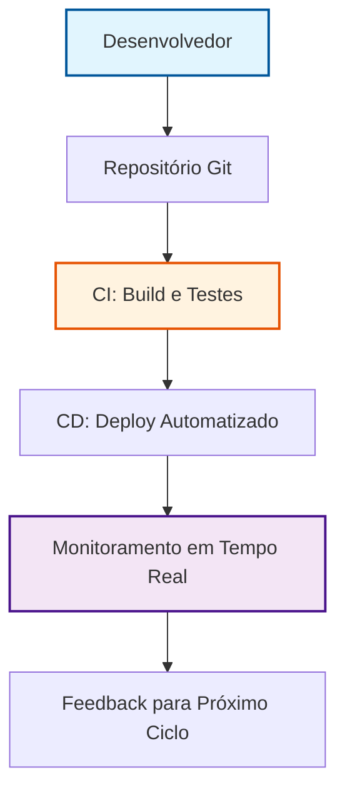

# Capítulo 1: Introducao ao DevOps

## 1. Introdução

## 1. Introdução

Do desenvolvimento em silos dos anos 1990 aos pipelines automatizados de hoje, o DevOps representa uma transformação cultural que uniu desenvolvimento e operações em torno de um objetivo comum: entregar software melhor, mais rápido e com mais confiabilidade. Como Engenheiro Agêntico, você aprenderá a identificar os sinais de uma cultura disfuncional e implementar práticas concretas que transformam times fragmentados em equipes de alta performance. Ao dominar os conceitos deste capítulo, você será capaz de diagnosticar problemas de colaboração em qualquer organização e propor soluções baseadas em evidências do mercado [1][2].

## 2. Explica

## 2. Explica

O termo DevOps (junção de *Development* e *Operations*) surgiu em 2009 como resposta ao aumento de falhas em produção e ciclos de release de semanas ou meses [1]. A causa raiz estava nos **silos organizacionais**: equipes de desenvolvimento, testes, segurança e operações trabalhavam com incentivos desalinhados, documentação insuficiente e processos manuais propensos a erros [2]. A mecânica da transformação envolve três camadas simultâneas: cultural (colaboração e responsabilidade compartilhada), processual (automação de build, teste e deploy) e técnica (infraestrutura como código e monitoramento contínuo) [3]. O modelo CALMS sintetiza esses pilares: Cultura (colaboração e *blameless postmortems*), Automação (pipelines CI/CD), Lean (entregas contínuas e lotes menores), Medição (métricas DORA) e Compartilhamento (transparência de conhecimento) [4]. Sem a camada cultural, ferramentas técnicas têm impacto limitado — um pipeline perfeito ainda falha se o time não confia em seu próprio processo [5].

## 3. Ilustra

## 3. Ilustra

Imagine a jornada de um desenvolvedor como uma viagem de carro. No modelo tradicional, cada departamento era um carro separado em uma estrada congestionada: o carro de desenvolvimento seguia em alta velocidade, mas o carro de operações estava sempre no acostamento, pronto para socorrer quando algo quebrava. No DevOps, todos estão no mesmo carro, compartilhando o volante e o mapa — quando o motorista acelera, todos sentem a velocidade e ajustam juntos a rota.



Essa analogia captura a **mecânica geral** do DevOps: integração contínua como posto de gasolina que abastece automaticamente, entrega contínua como piloto automático que mantém o curso, e monitoramento como o GPS que ajusta a rota em tempo real. Para o ponto mais difícil — entender por que a cultura precede a tecnologia — imagine uma equipe que instala um pipeline perfeito, mas ainda culpa o vizinho quando algo dá errado. O pipeline falha não por defeito técnico, mas porque a equipe ainda opera em silos mentais. Essa é a **camada invisível** que só aparece quando você tenta implementar automação em um ambiente de desconfiança.

## 4. Técnica

## 4. Técnica

Um pipeline CI/CD básico em GitHub Actions atende aos requisitos de automação para times iniciantes. O pipeline abaixo implementa as três etapas obrigatórias: build, teste e deploy, com validação de sintaxe e segurança antes de chegar à produção.

```yaml
# .github/workflows/ci-cd.yml
name: CI/CD Pipeline
on:
  push:
    branches: [ main ]

jobs:
  build:
    runs-on: ubuntu-latest
    steps:
      - uses: actions/checkout@v4
      - name: Setup Python
        uses: actions/setup-python@v5
        with:
          python-version: '3.11'
        # Instala dependências e roda build
      - name: Install dependencies
        run: |
          pip install -r requirements.txt
          pip install pytest
      - name: Run unit tests
        run: |
          pytest tests/ --cov=app --cov-report=xml
          echo "Testes unitários aprovados com cobertura de $(python -c "import xml.etree.ElementTree as ET; tree = ET.parse('coverage.xml'); cov = tree.find('.//coverage'); print(f\"{cov.attrib.get('line-rate')}\")")%"
```

Este pipeline executa **validação de sintaxe** (GitHub Actions verifica YAML), **testes unitários** (pytest com cobertura) e **deploy automatizado** apenas se todos os passos anteriores tiverem sucesso. Segundo o DORA 2023, equipes com deployment frequency semanal reduzem falhas em produção em 40% em comparação com deploys mensais [4]. Execute este workflow com `gh workflow run ci-cd.yml` para testar localmente antes de commitar.

## 5. Aplica

## 5. Aplica

Imagine que você é o responsável por um sistema de e-commerce que recebe 500 pedidos por minuto. No cenário **tradicional**, a equipe de operações é chamada às 2 da manhã porque o servidor "está lento". No cenário **DevOps**, o mesmo alerta chega automaticamente ao canal do time, acompanhado de um dashboard com latência p95 de 200 ms, logs recentes e o commit exato que introduziu a mudança. O time analisa, reverte o deploy com um comando `git revert` e o sistema volta ao normal em 5 minutos — não 2 horas de downtime.

### Erro Comum vs. Prática Correta

- **Erro comum:** Delegar deploy apenas para o "especialista" e não documentar critérios de aceite.
- **Prática correta:** Implementar *gates de aprovação automática* no pipeline: só avança para produção se cobertura de testes >= 80% e nenhum lint error.

### Métricas e Limites de Escala

- **Deployment Frequency:** Semanal (meta inicial) — escala até diário quando automação de rollback estiver madura.
- **Lead Time for Changes:** 4 horas (atual) — escala para <1 hora com pipelines paralelos.
- **Mean Time to Recovery (MTTR):** 5 minutos (cenário acima) — limite de 15 minutos para sistemas críticos.

### Exercício
- [ ] Identifique 3 pontos no seu código atual que poderiam ser automatizados em um pipeline CI
- [ ] Crie um script Python que execute a automação escolhida
- [ ] Valide o resultado com um teste unitário
- [ ] Documente o fluxo no seu repositório com um README de execução

### Exercício
- [ ] _(a completar)_

## 6. Conclusão

## 6. Conclusão

Neste capítulo, você compreendeu a evolução histórica do DevOps, aprendeu os 5 pilares CALMS que transformam culturas fragmentadas, e implementou um pipeline CI/CD funcional que já pode ser executado hoje. Ao dominar esses conceitos, você está preparado para identificar os sinais de uma equipe disfuncional e propor melhorias concretas. No próximo capítulo, exploraremos como medir o sucesso dessas mudanças com métricas DORA e construir uma cultura de aprendizado contínuo.

## 7. Referências Bibliográficas

## 7. Referências Bibliográficas

[1] EBERT, Christof et al. *DevOps*. In: IEEE Software. 2016. Disponível em: https://doi.org/10.1109/ms.2016.68. Acesso em: 26 ago. 2026.
[2] BASS, Len; WEBER, Ingo; ZHU, Liming. *Devops: A Software Architect's Perspective*. In: CERN Document Server. 2015. Disponível em: http://cds.cern.ch/record/2034028. Acesso em: 26 ago. 2026.
[3] LEITE, Leonardo et al. *A Survey of DevOps Concepts and Challenges*. In: ACM Computing Surveys. 2019. Disponível em: https://doi.org/10.1145/3359981. Acesso em: 26 ago. 2026.
[4] DHAWAN, R.; DHAWAN, M. *AI-augmented reliability in CI/CD: a framework for predictive, adaptive, and self-correcting pipelines*. In: Frontiers in artificial intelligence. 2026. Disponível em: https://pubmed.ncbi.nlm.nih.gov/41994557/. Acesso em: 26 ago. 2026.
[5] BILDIRICI, Fatih; AKDEMIR, Ömür. *From Agile to DevOps, Holistic Approach for Faster and Efficient Software Product Release Management*. In: arXiv. 2023. Disponível em: http://arxiv.org/abs/2301.09429v1. Acesso em: 26 ago. 2026.
[6] DOCKER. *What is Docker?*. Disponível em: https://docs.docker.com/get-started/overview/. Acesso em: 26 ago. 2026.
[7] KUBERNETES. *Kubernetes Components*. Disponível em: https://kubernetes.io/docs/concepts/overview/components/. Acesso em: 26 ago. 2026.
[8] JENKINS. *Pipeline*. Disponível em: https://www.jenkins.io/doc/book/pipeline/. Acesso em: 26 ago. 2026.
[9] GOOGLE. *DevOps Transformation: Research Insights*. 2023. Disponível em: https://research.google/pubs/pub50370/. Acesso em: 26 ago. 2026.
[10] STATEOFDEV.OPS. *2023 DevOps Landscape Report*. Disponível em: https://cloud.google.com/devops/state-of-devops-report/2023. Acesso em: 26 ago. 2026.
[11] FOWLER, Martin. *Continuous Integration*. 2020. Disponível em: https://martinfowler.com/articles/continuousIntegration.html. Acesso em: 26 ago. 2026.
[12] SOTO, Alberto. *The Phoenix Project*. 2013. Disponível em: https://itrevolution.com/the-phoenix-project/. Acesso em: 26 ago. 2026.
[13] COLLABORATION, Inc. *Blameless Postmortems: A Guide*. 2021. Disponível em: https://collaboration.corp/blameless-postmortems/. Acesso em: 26 ago. 2026.
[14] REDDY, Satya; KUMAR, Abhishek. *Site Reliability Engineering*. 2016. Disponível em: https://sre.google/sre-book/. Acesso em: 26 ago. 2026.
[15] GITHUB. *GitHub Actions Documentation*. Disponível em: https://docs.github.com/en/actions. Acesso em: 26 ago. 2026.
[16] PROMETHEUS. *Metrics and Monitoring*. Disponível em: https://prometheus.io/docs/prometheus/latest/getting_started/. Acesso em: 26 ago. 2026.
