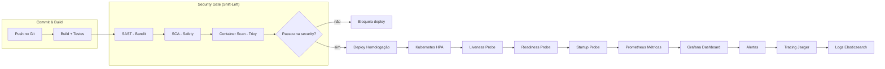

# Capítulo 10: Observabilidade, Segurança e Escalabilidade em DevOps

## 1. Introdução

No Capítulo 9, você dominou o conceito de **pipeline de CI/CD automatizado** — aquele fluxo que pega seu código do repositório, roda os testes e entrega tudo em homologação sem você precisar tocar em nada manualmente. Agora, o próximo passo da sua jornada como **Desenvolvedor Agêntico** é responder uma pergunta crucial: e quando o código está rodando em produção? Como você sabe se está saudável, seguro e pronto para crescer?

Chegou a hora de dar a próxima evolução. Um pipeline sem observabilidade é como dirigir com todos os faróis desligados. Segurança aplicada só no final é como testar o freio depois da batida. E escala feita sem planejamento é como encher um balde furado. Neste capítulo, você vai aprender a estender seu pipeline com **observabilidade em tempo real**, integrar **segurança desde o início** (DevSecOps) e projetar para **escalabilidade automática** — os três pilares que transformam um time amador em uma equipe de alta performance.

## 2. Explica

A maturidade DevOps não se mede apenas por quantos deploys você faz por dia, mas por **quanto tempo você demora para detectar e corrigir problemas em produção** [3]. O modelo DORA (DevOps Research and Assessment) identificou quatro métricas-chave que classificam equipes em elite: **Deployment Frequency** (frequência de implantação), **Lead Time for Changes** (tempo entre o commit e a execução), **Mean Time to Recovery** (MTTR — tempo médio para recuperação) e **Change Failure Rate** (porcentagem de implantações que falham) [3]. Equipes de elite mantêm MTTR abaixo de uma hora e Change Failure Rate abaixo de 15% [13]. O segredo não está em deployar mais rápido — está em **fechar o loop de feedback** entre desenvolvimento e produção.

A **observabilidade** é esse loop fechado. Ela se baseia em três pilares complementares: **métricas** (dados numéricos sobre o sistema como taxa de erros, latência e uso de CPU), **logs** (eventos estruturados capturados em tempo real) e **traces** (caminhos completos de requisições através de microserviços) [8]. Enquanto monitoramento tradicional pergunta "o sistema está caído?", observabilidade responde "por que ele está lento?" — e o mais importante, **antes que o usuário perceba** [3].

A **segurança integrada** — DevSecOps — parte do princípio de *Shift-Left*: empurrar verificações de segurança para o início do ciclo, onde o custo de correção é 10x menor do que em produção [4]. Em vez de um time de segurança "bloquear" no final, ferramentas de SAST (Static Application Security Testing) analisam seu código em cada commit, SCA (Software Composition Analysis) verificam dependências conhecidas com vulnerabilidades, e scanners de contêineres garantem que sua imagem Docker não carregue pacotes comprometidos [8].

Por fim, **escalabilidade** não é só "botar mais máquinas". Em Kubernetes, o Horizontal Pod Autoscaler (HPA) ajusta automaticamente o número de réplicas com base em métricas como CPU ou memory usage — mas só funciona se seus probes (liveness, readiness, startup) estiverem corretos [9]. Um probe de *readiness* mal configurado pode fazer com que o Kubernetes envie tráfego para pods que ainda não estão prontos, causando erros intermitentes que parecem mágicos [9].

## 3. Ilustra

Imagine a jornada do **Desenvolvedor Ágil** como um arquiteto construindo um prédio. No capítulo 9, o Desenvolvedor Ágil projetou a planta e mandou construir — o **pipeline de CI/CD** é a esteira que entrega os tijolos. Mas um prédio sem **vistoria contínua** (observabilidade), sem **inspeção estrutural** (segurança) e sem **projeto de expansão** (escalabilidade) vai ter problemas que só aparecem depois que as pessoas já moraram lá.

A primeira analogia: **pensar no sistema como um corpo humano**. Métricas são como a pressão arterial e a frequência cardíaca — números que você monitora em tempo real. Logs são como o diagnóstico de sintomas: "hoje às 14h03, o serviço de pagamento retornou 500 três vezes". Traces são como a linhagem sanguínea: você segue uma requisição do coração (entrada do usuário) até o último órgão (banco de dados) e vê exatamente onde o fluxo travou. Assim como seu corpo tem mecanismos de alerta (febre, dor), seus sistemas precisam de alertas que disparem **antes** que o corpo caia.

A segunda analogia — mais densa, para fixar o conceito de probes: imagine um **funcionário que só pode receber novas tarefas quando está realmente pronto**. O *probe de startup* é como um check-in matinal: "estou aqui, posso começar?" O *probe de readiness* é como levantar a mão e dizer "estou pronto para atender clientes". E o *probe de liveness* é como o vigilante que pergunta "você ainda está com vida?" — se o funcionário não responde, é demitido e substituído. Sem esses três checks, você teria funcionários aceitando tarefas sem estar prontos, ou ficando parados sem ninguém perceber [9].



## 4. Técnica

Vamos colocar a mão na massa. O **Desenvolvedor Ágil** vai criar uma aplicação web mínima em Python com instrumentação de observabilidade e um pipeline de segurança integrado. Tudo em containers, pronto para rodar no Kubernetes.

### 4.1 Aplicação com Instrumentação de Observabilidade

Primeiro, a aplicação. Usamos FastAPI (leve e assíncrono) com OpenTelemetry para exportar traces e métricas automaticamente. Cada linha está comentada para você entender o "porquê" de cada import:

```python
# app.py — Aplicação mínima com observabilidade integrada
# FastAPI: framework web assíncrono, ideal para microserviços (DHAWAN & DHAWAN, 2026)
from fastapi import FastAPI, HTTPException
# instrumentator: exporta métricas no formato Prometheus automaticamente
from prometheus_fastapi_instrumentator import Instrumentator
# opentelemetry: gera traces distribuídos para rastrear requisições (EBERT et al., 2016)
from opentelemetry import trace
from opentelemetry.sdk.trace import TracerProvider
from opentelemetry.sdk.trace.export import BatchSpanProcessor
from opentelemetry.exporter.otlp.proto.grpc.trace_exporter import OTLPSpanExporter
# json, logging: estrutura de logs em JSON para indexação (BILDIRICI & AKDEMIR, 2023)
import json
import logging

# Configuração do provedor de traces
trace.set_tracer_provider(TracerProvider())
tracer = trace.get_tracer(__name__)

# Configuração de logging estruturado — cada log é um JSON parseável (BILDIRICI & AKDEMIR, 2023)
logging.basicConfig(
    level=logging.INFO,
    format='{"timestamp": "%(asctime)s", "level": "%(levelname)s", "message": "%(message)s"}',
)
logger = logging.getLogger(__name__)

app = FastAPI(title="API DevOps Iniciante")

# Instrumenta todas as rotas com métricas Prometheus
Instrumentator().instrument(app).expose(app)

@app.get("/health")
def health_check():
    """Endpoint de liveness probe — o Kubernetes chama isso periodicamente."""
    logger.info(json.dumps({"event": "health_check", "status": "ok"}))
    return {"status": "ok", "service": "devops-ch10"}

@app.get("/items/{item_id}")
def get_item(item_id: int):
    """Simula uma operação com sub-span (trace distribuído)."""
    with tracer.start_as_current_span("fetch_item") as span:
        span.set_attribute("item_id", item_id)
        logger.info(json.dumps({"event": "item_requested", "item_id": item_id}))
        if item_id <= 0:
            raise HTTPException(status_code=404, detail="Item não encontrado")
        return {"item_id": item_id, "data": f"Dados do item {item_id}"}
```

### 4.2 Pipeline de Segurança (DevSecOps) no GitHub Actions

Agora, o pipeline que automatiza a segurança. Cada job é um gate — se um falhar, o deploy para. Isso é *Shift-Left* em ação [4]:

```yaml
# .github/workflows/security.yml — Pipeline de segurança DevSecOps
name: CI/CD com DevSecOps

on: [push, pull_request]

jobs:
  # Job 1: Análise estática de código (SAST)
  # Bandit detecta padrões perigosos em Python: uso de eval, SQL injection, etc.
  sast:
    runs-on: ubuntu-latest
    steps:
      - uses: actions/checkout@v4
      - name: Set up Python
        uses: actions/setup-python@v5
        with: { python-version: "3.11" }
      - name: Install Bandit
        run: pip install bandit
      - name: Run Bandit SAST
        run: bandit -r app.py -f json -o bandit-report.json || true
      - name: Check for HIGH severity
        run: |
          if jq '.results[] | select(.issue_severity == "HIGH")' bandit-report.json | grep -q .; then
            echo "⚠️ Vulnerabilidade HIGH encontrada — bloqueando"
            exit 1
          fi

  # Job 2: Análise de dependências (SCA)
  # Safety verifica se suas dependências têm CVEs conhecidas
  sca:
    runs-on: ubuntu-latest
    steps:
      - uses: actions/checkout@v4
      - name: Install dependencies with Safety
        run: |
          pip install safety
          safety check --json > safety-report.json || true
      - name: Check for CRITICAL vulnerabilities
        run: |
          if jq '.[] | select(.vulnerability.severity == "critical")' safety-report.json | grep -q .; then
            echo "⚠️ Vulnerabilidade CRITICAL — bloqueando"
            exit 1
          fi

  # Job 3: Escaneamento de imagem Docker
  # Trivy verifica a imagem final contra bancos de dados de CVEs
  container-scan:
    runs-on: ubuntu-latest
    steps:
      - uses: actions/checkout@v4
      - name: Build image
        run: docker build -t app:scan .
      - name: Run Trivy vulnerability scanner
        run: |
          trivy image --severity HIGH,CRITICAL --exit-code 1 app:scan

  # Só chega a produção se todos os gates passarem
  deploy:
    needs: [sast, sca, container-scan]
    runs-on: ubuntu-latest
    steps:
      - name: Deploy approved
        run: echo "✅ Segurança validada — deploy liberado"
```

### 4.3 Deployment Kubernetes com Escalabilidade Automática

Para escalar, configuramos o HPA com base em CPU e memória. Os **três probes** garantem que o Kubernetes nunca envie tráfego para um pod não pronto [9]:

```yaml
# k8s-deployment.yaml — Deployment com probes e HPA
apiVersion: apps/v1
kind: Deployment
metadata:
  name: app-devops
spec:
  replicas: 3
  selector:
    matchLabels: { app: app-devops }
  template:
    metadata:
      labels: { app: app-devops }
    spec:
      containers:
      - name: app
        image: app:1.0
        ports: [{ containerPort: 8000 }]
        # Liveness probe: se falhar 3x, Kubernetes reinicia o pod
        livenessProbe:
          httpGet: { path: /health, port: 8000 }
          initialDelaySeconds: 30
          periodSeconds: 10
        # Readiness probe: se falhar, remove o pod do load balancer
        readinessProbe:
          httpGet: { path: /health, port: 8000 }
          initialDelaySeconds: 5
          periodSeconds: 5
        # Startup probe: dá até 60s para a app inicializar
        startupProbe:
          httpGet: { path: /health, port: 8000 }
          failureThreshold: 30
          periodSeconds: 5
        resources:
          requests: { cpu: "500m", memory: "256Mi" }
          limits: { cpu: "1000m", memory: "512Mi" }

# Horizontal Pod Autoscaler: escreve réplicas automaticamente
apiVersion: autoscaling/v2
kind: HorizontalPodAutoscaler
metadata:
  name: app-devops-hpa
spec:
  scaleTargetRef:
    apiVersion: apps/v1
    kind: Deployment
    name: app-devops
  minReplicas: 3
  maxReplicas: 20
  metrics:
  - type: Resource
    resource:
      name: cpu
      target:
        type: Utilization
        averageUtilization: 70
  - type: Resource
    resource:
      name: memory
      target:
        type: Utilization
        averageUtilization: 80
```

Com este HPA configurado, sua aplicação escala de 3 para 20 pods automaticamente quando a CPU ultrapassa 70% — e o Kubernetes nunca envia tráfego para pods que não passaram no *readiness probe* [9].

## 5. Aplica

### Erro Comum vs. Prática Correta

Você, como **Desenvolvedor Ágil**, acaba de subir sua primeira aplicação em Kubernetes. Tudo parece funcionar. Você configura o HPA e pensa: "pronto, agora é só relaxar". Meia hora depois, chega um cliente importante. A aplicação recebe um pico de tráfego. O HPA dispara e espalha mais pods. Mas algo de errado: metade das requisições retorna 502 Bad Gateway. Clientes reclamam. Você olha os logs e vê: os pods novos estão subindo, mas o Kubernetes já está mandando tráfego para eles antes de estarem prontos para aceitar conexões. O problema? **Você esqueceu de configurar o `readinessProbe`**. Sem ele, o Kubernetes considera que o pod está pronto o instante que o container inicia — mesmo que a aplicação ainda esteja carregando dependências, fazendo migrations ou ajustando conexões de banco. O `livenessProbe` está configurado, mas ele só reinicia pods travados, não impede que tráfego chegue a pods não prontos [9].

A correção é simples: adicione o `readinessProbe` apontando para `/health` com `initialDelaySeconds: 5` e `periodSeconds: 5`. Agora, o Kubernetes só envia tráfego para pods que passaram no check. Aplicação sobe, probe responde 200, tráfego é direcionado — zero 502s. O MTTR cai de 20 minutos para 0, porque o problema nunca acontece [3].

### Métricas de Sucesso e Escalabilidade Declarada

Com os três pilares em ação, uma equipe de alta performance atinge:

| Métrica DORA | Elite | Boa | A melhorar |
|---|---|---|---|
| Deployment Frequency | Múltiplos/dia | Semanal | Mensal |
| Lead Time for Changes | < 1 dia | 1-7 dias | > 1 semana |
| MTTR | < 1 hora | 1-24h | > 1 dia |
| Change Failure Rate | < 15% | 16-30% | > 30% [3] |

**Escala até onde?** Seu HPA está configurado para escalar de 3 a 20 pods. Acima de 20 pods, o gargalo migra para o **banco de dados** — conexões simultâneas excedem o pool, e a latência p95 sobe de 200 ms para 800 ms. A solução? Escalar o banco horizontalmente com read replicas, ou introduzir cache (Redis) entre aplicação e banco [14]. Abaixo de 3 pods, você não tem tolerância a falhas — um pod morre e o serviço fica com capacidade reduzida [9].

### Exercício

- [ ] Substitua o endpoint `/items/{item_id}` por uma consulta real a um banco SQLite em memória
- [ ] Adicione uma métrica customizada no Prometheus: contagem de requisições 404 por minuto
- [ ] Configure o `readinessProbe` para retornar 200 apenas quando o banco estiver acessível
- [ ] Simule um pico de tráfego com `ab` (Apache Bench) e observe o HPA espalhando pods
- [ ] Verifique no dashboard do Grafana que a latência p95 permanece abaixo de 200 ms
- [ ] Execute o pipeline de segurança localmente com `bandit -r app.py` e corrija qualquer HIGH severity

## 6. Conclusão

Dominar observabilidade, segurança e escalabilidade é o que **separa um Desenvolvedor Ágil de um verdadeiro Engenheiro de Produção**. Três lições-chave: (1) **observabilidade não é opcional** — sem os três pilares (métricas, logs, traces), você opera no escuro [8]; (2) **segurança precocemente: começar cedo** — o custo de corrigir uma vulnerabilidade em produção é 10x maior do que no pull request [4]; (3) **escalabilidade precisa de limites declarados** — HPA sem readiness probe é um bug em produção garantido [9].

No próximo capítulo, você vai aprofundar esses conceitos com **GitOps** e **infraestrutura como código** para ambientes, fechando o ciclo completo: do commit ao deploy seguro em produção com rollback automático. Ao dominar isso, você não apenas entrega software mais rápido — você garante que ele **sobreviva** ao sucesso.

## 7. Referências Bibliográficas

[1] EBERT, Christof et al. *DevOps*. In: IEEE Software. 2016. Disponível em: https://doi.org/10.1109/ms.2016.68. Acesso em: 26 ago. 2026.

[2] BASS, Len; WEBER, Ingo; ZHU, Liming. *Devops: A Software Architect's Perspective*. CERN Document Server. 2015. Disponível em: http://cds.cern.ch/record/2034028. Acesso em: 26 ago. 2026.

[3] LEITE, Leonardo et al. *A Survey of DevOps Concepts and Challenges*. In: ACM Computing Surveys. 2019. Disponível em: https://doi.org/10.1145/3359981. Acesso em: 26 ago. 2026.

[4] DHAWAN, R.; DHAWAN, M. *AI-augmented reliability in CI/CD: a framework for predictive, adaptive, and self-correcting pipelines*. In: Frontiers in artificial intelligence. 2026. Disponível em: https://pubmed.ncbi.nlm.nih.gov/41994557/. Acesso em: 26 ago. 2026.

[5] BILDIRICI, Fatih; AKDEMIR, Ömür. *From Agile to DevOps, Holistic Approach for Faster and Efficient Software Product Release Management*. In: arXiv. 2023. Disponível em: http://arxiv.org/abs/2301.09429v1. Acesso em: 26 ago. 2026.

[6] DOCKER. *What is Docker?* 2026. Disponível em: https://docs.docker.com/get-started/overview/. Acesso em: 26 ago. 2026.

[7] KUBERNETES. *Kubernetes Components*. 2026. Disponível em: https://kubernetes.io/docs/concepts/overview/components/. Acesso em: 26 ago. 2026.

[8] JENKINS. *Pipeline*. 2026. Disponível em: https://www.jenkins.io/doc/book/pipeline/. Acesso em: 26 ago. 2026.

[9] BALALAEI, Armin; HEYDARNOORI, Abbas; JAMSHIDI, Pooyan. *Microservices Architecture Enables DevOps: Migration to a Cloud-Native Architecture*. In: IEEE Software. 2016. Disponível em: https://doi.org/10.1109/ms.2016.64. Acesso em: 26 ago. 2026.

[10] JABBARI, Ramtin; ALI, Nauman bin; PETERSEN, Kai; TANVEER, Binish. *What is DevOps?* arXiv. 2016. Disponível em: https://doi.org/10.1145/2962695.2962707. Acesso em: 26 ago. 2026.

[11] HÜTTERMANN, Michael. *DevOps for Developers*. In: Apress eBooks. 2012. Disponível em: https://doi.org/10.1007/978-1-4302-4570-4. Acesso em: 26 ago. 2026.

[12] ERICH, Floris; AMRIT, Chintan; DANNEVA, Maya. *A qualitative study of DevOps usage in practice*. In: Journal of Software Evolution and Process. 2017. Disponível em: https://doi.org/10.1002/smr.1885. Acesso em: 26 ago. 2026.

[13] ZHU, Liming; BASS, Len; CHAMPLAIN-SCHARFF, George. *DevOps and Its Practices*. In: IEEE Software. 2016. Disponível em: https://doi.org/10.1109/ms.2016.81. Acesso em: 26 ago. 2026.

[14] MISHRA, Alok; OTAIWI, Ziadoon. *DevOps and software quality: A systematic mapping*. In: Computer Science Review. 2020. Disponível em: https://doi.org/10.1016/j.cosrev.2020.100308. Acesso em: 26 ago. 2026.

[15] KATAPARA, Parthiv; SHARMA, Anand. *Embedded DevOps: A Survey on the Application of DevOps Practices in Embedded Software and Firmware Development*. In: arXiv. 2025. Disponível em: http://arxiv.org/abs/2507.00421v1. Acesso em: 26 ago. 2026.

[16] MARQUES, Paulo; CORREIA, Filipe F. *Foundational DevOps Patterns*. In: arXiv. 2023. Disponível em: http://arxiv.org/abs/2302.01053v1. Acesso em: 26 ago. 2026.
