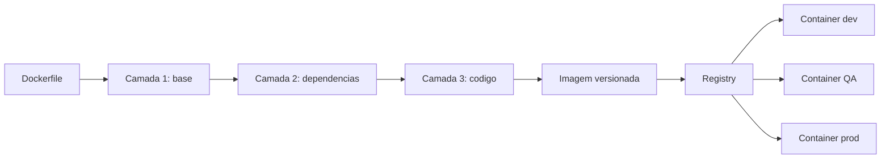

# Capítulo 5: Containers e Docker: empacotando aplicações

## 1. Introdução

No Capítulo 4, você dominou o Git e transformou o repositório na fonte única da verdade. Agora vem a segunda metade do problema: de nada adianta versionar o código se ele só funciona na sua máquina. É essa lacuna que containers eliminam — e dominar o empacotamento é o diferencial entre quem entrega software e quem só escreve código.

Neste capítulo: o que é um container, como construir uma imagem com Dockerfile e por que volumes e redes preparam a aplicação para produção. Ao dominar isso, "funciona aqui" sai do seu vocabulário — você entrega um artefato que roda igual em qualquer lugar.

## 2. Explica

"Funciona na minha máquina" é o resultado de ambientes divergentes: Python 3.12 aqui, 3.10 no QA, uma biblioteca nativa que a produção nunca viu. Cada diferença — runtime, dependência, porta — é um ponto de quebra invisível.

Um container resolve isso empacotando a aplicação **e tudo o que ela precisa**: código, runtime, bibliotecas e configurações viajam juntos, e você não precisa confiar no que está instalado no host [1]. O custo é baixo: o container compartilha o kernel do host e isola o processo, sem virtualizar uma máquina inteira.

Essa distinção é central: a máquina virtual carrega um sistema operacional completo e um hipervisor; o container carrega apenas a aplicação e suas camadas. Na evolução do DevOps, containers respondem à busca por automação e reprodutibilidade [2]. O DevOps nasceu para encurtar o ciclo de vida do software e unificar desenvolvimento e operações [3]; containers tornam essa unificação concreta no nível do artefato.

Containers também são o pré-requisito natural para microsserviços — quando cada serviço é empacotado e versionado de forma independente, a migração para arquitetura cloud-native se torna viável [4]. Um levantamento amplo sobre desafios DevOps lista a consistência de ambientes entre os problemas mais citados [5].

Há convergência nas definições de DevOps: o núcleo é unificar desenvolvimento e operações [8], e a automação do ciclo de entrega é recomendação antiga [7].

## 3. Ilustra

Pense na Jornada do Desenvolvedor como uma operação logística. Antes dos containers, entregar software era transportar mercadoria solta. Com containers de carga, a *unidade* ficou padronizada: a mesma caixa viaja sem reembalagem. Um container Docker é isso — sua aplicação embalada numa unidade padrão que roda igual no notebook, no servidor e na nuvem [1].

O ponto mais difícil: **camadas**. Se container é a caixa, a imagem é a caixa *montada* — uma boneca russa. Cada instrução do Dockerfile cria uma camada; ao mudar o código, o Docker reaproveita as inalteradas e reconstrói só a última [1]. Por isso a segunda build é quase instantânea [1].



Siga a seta: a receita gera camadas, a imagem vira o "porto" no registry de onde dev, QA e produção puxam a *mesma* mercadoria.

## 4. Técnica

Vamos montar a primeira embalagem: uma aplicação Python mínima. Primeiro, a receita:

```dockerfile
# Dockerfile: receita da imagem da aplicacao
FROM python:3.12-slim          # camada 1: imagem base com Python
WORKDIR /app                   # camada 2: diretorio de trabalho
COPY requirements.txt .        # camada 3: lista de dependencias
RUN pip install -r requirements.txt  # camada 4: dependencias instaladas
COPY app.py .                  # camada 5: codigo da aplicacao
CMD ["python", "app.py"]       # comando executado ao iniciar
```

Cada linha é uma camada. Grave: esta imagem tem **5 camadas** — `FROM`, `WORKDIR`, `COPY`, `RUN` e o último `COPY` [1]. Alterou `app.py`? O Docker reaproveita as quatro primeiras camadas do cache e reconstrói só a última [1]. Por isso dependências ficam *antes* do código na receita: elas mudam menos.

Agora os comandos que transformam receita em container:

```console
$ docker build -t minha-app:1.0 .
# Constrói a imagem a partir do Dockerfile da pasta atual.
# -t minha-app:1.0 => nome e versão. Sem tag, você perde a
# rastreabilidade que o Git lhe deu no Capítulo 4.

$ docker run -d -p 8080:5000 minha-app:1.0
# Executa a imagem como container.
# -d        => roda em segundo plano.
# -p 8080:5000 => porta 8080 no host -> 5000 no container.

$ docker ps
# Lista os containers em execução.
```

Repare no `docker run`: todo container nasce de uma imagem taggeada, como todo commit nasce de um repositório versionado. A imagem é imutável — para mudar, constrói-se uma nova versão. É isso que garante que o artefato testado no QA seja o mesmo que sobe em produção, requisito central da entrega contínua [11]. A transição de VMs para containers é capítulo documentado nas revisões históricas do DevOps [14].

O próximo passo é ligar a aplicação a outras peças: **volumes** e **redes**. Container é efêmero: ao ser removido, tudo que não está em volume desaparece [1]. Para dados que sobrevivem (banco, uploads), monte um volume:

```console
$ docker run -d --name app -p 8080:5000 -v app-dados:/data minha-app:1.0
# -v app-dados:/data  => cria o volume nomeado app-dados e o monta em /data.
# Os dados em /data sobrevivem à remoção do container.
```

E para dois containers conversarem, coloque-os na mesma rede:

```console
$ docker network create minha-rede
# Cria uma rede isolada para os containers da aplicação.

$ docker network connect minha-rede app
# Conecta app à rede; app e banco se encontram pelo nome do container.
```

Resumo das decisões mais comuns:

| Situação | Flag | Efeito |
|---|---|---|
| Aplicação precisa ser acessada de fora | `-p 8080:5000` | Publica a porta no host |
| Dados precisam sobreviver à remoção | `-v app-dados:/data` | Cria volume persistente |
| Container precisa rodar em segundo plano | `-d` | Libera o terminal |
| Dois containers precisam conversar | `docker network connect` | Comunicação pelo nome |

Uma observação de mercado: o survey de Bezemer e colegas mostrou que a complexidade das ferramentas é a principal barreira para análise de performance no pipeline DevOps [13] — containers a reduzem porque o ambiente de medição é idêntico ao de produção [10].

## 5. Aplica

Cena típica. Você terminou o relatório de vendas, testou localmente e subiu para o QA. O gestor abre a aplicação: tela branca. "Funcionava na minha máquina", você diz, enquanto o QA responde com o print do módulo Python ausente. O erro não é teimosia do ambiente: é ausência de um artefato único. Seu código estava no Git (Capítulo 4), mas o *ambiente* dele não — e ambiente não versionado é ambiente que diverge.

O diagnóstico você já sabe fazer: as versões de runtime e dependências do QA não batiam com as suas. A correção é estrutural: escreva o Dockerfile, construa a imagem, taggeie `minha-app:1.0` e diga ao QA para rodar `docker run -p 8080:5000 minha-app:1.0`. Não existe mais "na minha máquina": existe a imagem, a mesma para todos [1]. É o padrão das equipes maduras: o artefato testado é o artefato entregue, e a qualidade melhora porque o ambiente deixa de ser variável aleatória [9]. A automação de deploy é marca dessas equipes [6].

Honestidade sobre limites: um container sozinho resolve **1 instância** da aplicação — ele escala enquanto a aplicação for um processo único. Para dez instâncias, balanceamento e recuperação automática, o container isolado quebra: entra a orquestração (Kubernetes gerencia ciclo de vida, escala e resiliência [15]) e o CI (build e push da imagem a cada commit, como o Jenkins popularizou [16]). Container é a unidade; orquestração e pipelines são o sistema nervoso. Domine a unidade: ela é o pré-requisito do que vem a seguir, e a automação será segura porque cada passo é verificável e reversível [12].

### Exercício
- [ ] Instale o Docker e confirme com `docker --version`
- [ ] Rode `docker run hello-world` e explique o que aconteceu
- [ ] Crie um Dockerfile com 5 camadas para uma aplicação simples
- [ ] Construa com `docker build -t minha-app:1.0 .` e execute com `-d -p 8080:5000`
- [ ] Crie volume e rede: um arquivo sobrevive ao `docker rm`; dois containers conversam pelo nome
- [ ] Escreva no README o comando que o QA usa para subir a aplicação

## 6. Conclusão

No Capítulo 4, seu código passou a ter história; agora, ele tem *embalagem*. Entender por que containers eliminam o "funciona na minha máquina", construir imagens com Dockerfile e conectar volumes e redes para produção — esses três movimentos formam o alicerce do que vem a seguir. Desafio de hoje: reconstrua sua última aplicação como imagem e apague "roda só na minha máquina" do vocabulário. No próximo capítulo, essa imagem entra na esteira de CI/CD, onde cada commit gera build, testes e publicação automática — o Dockerfile que você dominou será a primeira parada [16].

## 7. Referências Bibliográficas

[1] DOCKER. *What is Docker?* Disponível em: https://docs.docker.com/get-started/overview/. Acesso em: 26 ago. 2026.
[2] EBERT, Christof et al. *DevOps*. In: IEEE Software. 2016. Disponível em: https://doi.org/10.1109/ms.2016.68. Acesso em: 26 ago. 2026.
[3] BASS, Len; WEBER, Ingo; ZHU, Liming. *DevOps: A Software Architect's Perspective*. In: CERN Document Server. 2015. Disponível em: http://cds.cern.ch/record/2034028. Acesso em: 26 ago. 2026.
[4] BALALAIE, Armin; HEYDARNOORI, Abbas; JAMSHIDI, Pooyan. *Microservices Architecture Enables DevOps: Migration to a Cloud-Native Architecture*. In: IEEE Software. 2016. Disponível em: https://doi.org/10.1109/ms.2016.64. Acesso em: 26 ago. 2026.
[5] LEITE, Leonardo et al. *A Survey of DevOps Concepts and Challenges*. In: ACM Computing Surveys. 2019. Disponível em: https://doi.org/10.1145/3359981. Acesso em: 26 ago. 2026.
[6] ZHU, Liming; BASS, Len; CHAMPLIN-SCHARFF, George. *DevOps and Its Practices*. In: IEEE Software. 2016. Disponível em: https://doi.org/10.1109/ms.2016.81. Acesso em: 26 ago. 2026.
[7] HÜTTERMANN, Michael. *DevOps for Developers*. In: Apress. 2012. Disponível em: https://doi.org/10.1007/978-1-4302-4570-4. Acesso em: 26 ago. 2026.
[8] JABBARI, Ramtin et al. *What is DevOps?* 2016. Disponível em: https://doi.org/10.1145/2962695.2962707. Acesso em: 26 ago. 2026.
[9] MISHRA, Alok; OTAIWI, Ziadoon. *DevOps and software quality: A systematic mapping*. In: Computer Science Review. 2020. Disponível em: https://doi.org/10.1016/j.cosrev.2020.100308. Acesso em: 26 ago. 2026.
[10] ERICH, Floris; AMRIT, Chintan; DANEVA, Maya. *A qualitative study of DevOps usage in practice*. In: Journal of Software: Evolution and Process. 2017. Disponível em: https://doi.org/10.1002/smr.1885. Acesso em: 26 ago. 2026.
[11] BILDIRICI, Fatih; AKDEMIR, Ömür. *From Agile to DevOps, Holistic Approach for Faster and Efficient Software Product Release Management*. In: arXiv. 2023. Disponível em: http://arxiv.org/abs/2301.09429v1. Acesso em: 26 ago. 2026.
[12] DHAWAN, R.; DHAWAN, M. *AI-augmented reliability in CI/CD: a framework for predictive, adaptive, and self-correcting pipelines*. In: Frontiers in Artificial Intelligence. 2026. Disponível em: https://pubmed.ncbi.nlm.nih.gov/41994557/. Acesso em: 26 ago. 2026.
[13] BEZEMER, Cor-Paul et al. *How is Performance Addressed in DevOps? A Survey on Industrial Practices*. In: arXiv. 2018. Disponível em: http://arxiv.org/abs/1808.06915v1. Acesso em: 26 ago. 2026.
[14] GOKARNA, Mayank; SINGH, Raju. *DevOps: A Historical Review and Future Works*. In: arXiv. 2020. Disponível em: http://arxiv.org/abs/2012.06145v1. Acesso em: 26 ago. 2026.
[15] KUBERNETES. *Kubernetes Components*. Disponível em: https://kubernetes.io/docs/concepts/overview/components/. Acesso em: 26 ago. 2026.
[16] JENKINS. *Pipeline*. Disponível em: https://www.jenkins.io/doc/book/pipeline/. Acesso em: 26 ago. 2026.