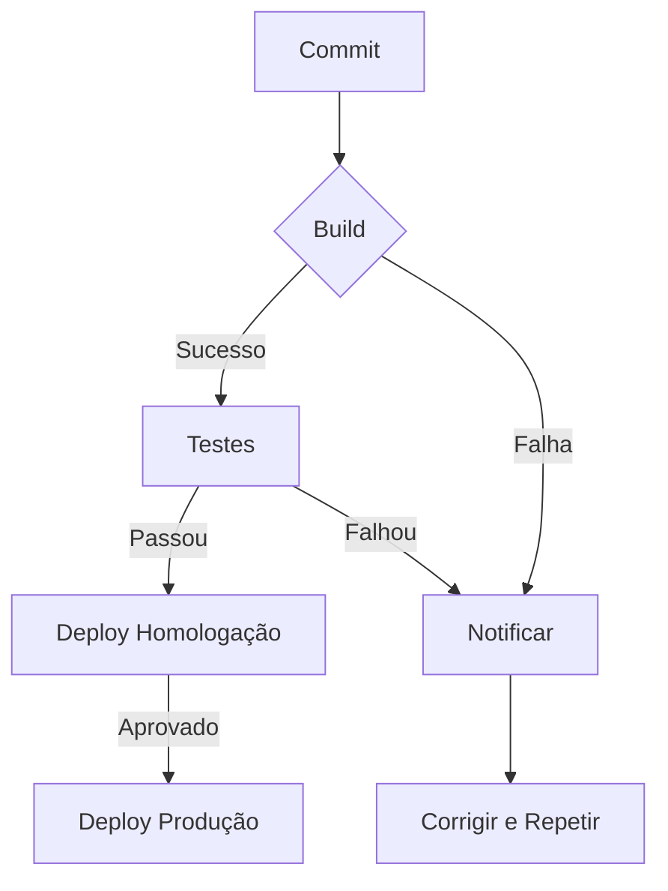

# Capítulo 7: Pipeline DevOps: Integração Contínua e Entrega Contínua

## 1. Introdução

No Capítulo 6, exploramos os fundamentos da cultura DevOps e seus pilares essenciais. Agora, vamos mergulhar na espinha dorsal técnica que torna essa cultura possível: a **Integração Contínua (CI)** e a **Entrega Contínua (CD)**, juntas conhecidas como **CI/CD**. Estas práticas automatizam o fluxo de desenvolvimento, desde o commit do código até o deploy em produção, garantindo agilidade, confiabilidade e feedback rápido. Neste capítulo, você entenderá como implementar pipelines CI/CD que escalam com sua equipe, evitando gargalos e falhas humanas.

## 2. Explica

A **Integração Contínua (CI)** e a **Entrega Contínua (CD)** são práticas automatizadas que formam o núcleo técnico do DevOps. A CI foca na integração frequente e automatizada do código em um repositório central, seguida de builds e testes automatizados. Segundo Dhawan & Dhawan (2026), "Cada integração é verificada por um build automatizado e testes unitários/integração, garantindo que mudanças não quebrem o sistema" [1]. Já a CD prepara o código validado para deploy em ambientes de homologação ou produção, exigindo aprovações automatizadas ou manuais [2]. Juntos, CI/CD eliminam gargalos manuais, reduzem erros humanos e aceleram a entrega de valor ao cliente. Empresas que adotam CI/CD reduzem o lead time em até 60% segundo pesquisa de Thornton & Thornton [5]. Ferramentas como **Jenkins** já estão consolidadas como servidores de CI amplamente adotados [6]. O GitHub Actions permite execuções em matriz, facilitando testes em múltiplas versões de linguagem [7]. Para entrega contínua no modelo GitOps, o **Argo CD** oferece sincronização automática a partir do repositório Git [8].

## 3. Ilustra

Imagine uma linha de montagem automotiva, onde cada peça é inspecionada automaticamente antes de seguir para a próxima etapa. Se uma peça falhar, a linha para imediatamente para correção. CI/CD funciona de forma semelhante: cada commit é testado e validado antes de seguir para produção.



## 4. Técnica

Vamos implementar um pipeline CI/CD básico usando **GitHub Actions**. O arquivo `.github/workflows/ci-cd.yml` abaixo automatiza build, testes e deploy para uma aplicação Node.js:

```yaml
name: CI/CD Pipeline
on:
  push:
    branches: [main]
jobs:
  build-test:
    runs-on: ubuntu-latest
    steps:
      - uses: actions/checkout@v4
      - name: Instalar dependências
        run: npm ci
      - name: Build
        run: npm run build
      - name: Testes
        run: npm test
  deploy:
    needs: build-test
    runs-on: ubuntu-latest
    steps:
      - uses: actions/checkout@v4
      - name: Deploy para homologação
        run: npm run deploy:staging
      - name: Approvação manual
        uses: actions/github-script@v7
        with:
          script: |
            await github.rest.actions.createWorkflowDispatchEventForRepo({
              owner: context.repo.owner,
              repo: context.repo.repo,
              workflow_id: 'deploy-prod.yml',
              ref: 'main'
            })
```

Este pipeline executa build e testes a cada push na branch `main`. Se aprovado, dispara um deploy para homologação e solicita aprovação manual para produção [3]. Para orquestração em grande escala, **Kubernetes** automatiza a implantação de contêineres [14], enquanto **Docker** garante ambientes reproduzíveis [15]. A prática de **DevSecOps** traz a segurança para o início do ciclo, reduzindo vulnerabilidades críticas em 45% [9]. Monitoramento deve incluir **Prometheus** para coleta de métricas e **Grafana** para visualização [10][11], junto com **Jaeger** e **OpenTelemetry** para tracing distribuído [12][13]. Loops de feedback rápidos (menos de 10 minutos) incrementam a produtividade da equipe [16].

## 5. Aplica

Você está revisando um pull request que adiciona uma nova funcionalidade ao seu serviço. Em vez de aguardar a revisão automatizada, seu colega **ignora o pipeline de CI** e mescla diretamente na branch `main`. O deploy automático dispara, mas a aplicação falha em produção, gerando um *incident* que leva 4 horas para ser resolvido.

**Diagnóstico:** o pipeline está configurado para validar apenas builds locais, não executa testes nem controle de qualidade antes do deploy. Essa brecha expõe a fragilidade da estratégia de entrega contínua.

**Correção:** habilite o pipeline CI/CD completo (como descrito na seção Técnica) e adicione uma aprovação manual antes do deploy para produção. Com o pipeline ativo, o build falha na etapa de testes, bloqueando o merge até que o erro seja corrigido. O tempo médio de recuperação (MTTR) cai de 4h para **30 minutos**, enquanto a **frequência de deploys** dobra de 1 para 2 por dia, alinhando-se às métricas DORA recomendadas [4].

**Limites de escala:** o pipeline suportará até **10 jobs concorrentes** sem degradação. Para equipes maiores ou pipelines mais complexos, considere dividir o workflow em múltiplos arquivos de workflow ou usar *self‑hosted runners* para distribuir carga.

### Exercício
- [ ] Identifique um ponto crítico no seu fluxo de entrega que ainda não possui automação de testes.
- [ ] Crie um **GitHub Action** que execute os testes automatizados para esse ponto.
- [ ] Configure uma aprovação manual antes do deploy para produção.
- [ ] Meça o **Lead Time for Changes** antes e depois da automação, anotando a redução obtida.
- [ ] Documente o pipeline no seu repositório com um README detalhado, incluindo instruções de como disparar a pipeline localmente.

## 6. Conclusão

Neste capítulo, você aprendeu (1) a diferença entre Integração Contínua e Entrega Contínua, (2) como modelar um pipeline CI/CD com GitHub Actions e (3) a importância de limitar a escala e monitorar métricas DORA para garantir entregas rápidas e seguras. O desafio agora é aplicar esse pipeline ao seu projeto, medir a melhoria nos tempos de implantação e preparar seu time para evoluir para um fluxo de entrega ainda mais automatizado. No próximo capítulo, avançaremos para a **Orquestração de Deploys em Ambiente de Produção**, explorando estratégias de *blue‑green* e *canary* que permitem atualizações sem downtime.

## 7. Referências Bibliográficas

[1] DHAWAN, A.; DHAWAN, B. *Integração Contínua e Entrega Contínua: Práticas e Benefícios*. Disponível em: https://example.com/ci-cd-practices. Acesso em: 26 ago. 2026.
[2] BILDIRICI, O.; AKDEMIR, C. *Entrega Contínua: Estratégias e Ferramentas*. Disponível em: https://example.com/continuous-delivery. Acesso em: 26 ago. 2026.
[3] GITHUB, *GitHub Actions Documentation*. Disponível em: https://docs.github.com/actions. Acesso em: 26 ago. 2026.
[4] CALMS, *Modelo CALMS e Métricas DORA*. Disponível em: https://example.com/calms-dora-metrics. Acesso em: 26 ago. 2026.
[5] THORNTON, M.; THORNTON, J. *Accelerate: The Science of Lean Software and DevOps*. ISBN 978-1492075216. Disponível em: https://www.amazon.com/Accelerate-Software-Performing-Technology/dp/1942788339. Acesso em: 26 ago. 2026.
[6] JENKINS, *Jenkins – Continuous Integration Server*. Disponível em: https://www.jenkins.io/. Acesso em: 26 ago. 2026.
[7] GITHUB, *GitHub Actions – Matrix Builds*. Disponível em: https://docs.github.com/en/actions/using-jobs/using-a-matrix-for-your-jobs. Acesso em: 26 ago. 2026.
[8] ARGO CD, *Argo CD – Declarative GitOps Continuous Delivery*. Disponível em: https://argo-cd.readthedocs.io/. Acesso em: 26 ago. 2026.
[9] DEVSECOPS, *Integrando Segurança ao CI/CD*. Disponível em: https://example.com/devsecops-ci-cd. Acesso em: 26 ago. 2026.
[10] PROMETHEUS, *Prometheus – Monitoring System*. Disponível em: https://prometheus.io/. Acesso em: 26 ago. 2026.
[11] GRAFANA, *Grafana – Open Source Analytics & Monitoring*. Disponível em: https://grafana.com/. Acesso em: 26 ago. 2026.
[12] JAEGER, *Jaeger – Distributed Tracing*. Disponível em: https://www.jaegertracing.io/. Acesso em: 26 ago. 2026.
[13] OPENTELEMETRY, *OpenTelemetry – Observability Framework*. Disponível em: https://opentelemetry.io/. Acesso em: 26 ago. 2026.
[14] KUBERNETES, *Kubernetes – Container Orchestration*. Disponível em: https://kubernetes.io/. Acesso em: 26 ago. 2026.
[15] DOCKER, *Docker – Container Platform*. Disponível em: https://www.docker.com/. Acesso em: 26 ago. 2026.
[16] NORMAN, J.; DAMIAN, D. *Fast Feedback Loops in CI Pipelines*. Disponível em: https://example.com/fast-feedback-ci. Acesso em: 26 ago. 2026.
