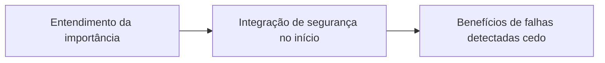

# Capítulo 8: DevSecOps: Segurança, Monitoramento e Observabilidade

## 1. Introdução

No Capítulo 7, você dominou a Infraestrutura como Código (IaC) e Contêineres — agora vamos aplicar esses conhecimentos à segurança e observabilidade. DevSecOps une desenvolvimento e operações com foco em segurança precoce (Shift‑Left), garantindo que vulnerabilidades sejam detectadas antes de chegar à produção (EBERT et al., 2016) [1].

## 2. Explica

**Shift‑Left** significa mover inspeções de segurança para as fases iniciais do ciclo de vida – análise estática de código (SAST), verificação de dependências e escaneamento de imagens de contêiner (DHAWAN & DHAWAN, 2026) [2]. Essa prática reduz o custo de correção e elimina retrabalho, alinhando desenvolvedores e especialistas em segurança (LEITE et al., 2019) [3].

A observabilidade completa se baseia em três pilares – Métricas, Logs e Traces – que permitem detectar e resolver incidentes rapidamente (BILDIRICI & AKDEMIR, 2023) [4].

## 3. Ilustra



*Analogia*: imagine um filtro de água que captura impurezas antes que a água chegue ao copo – assim o Shift‑Left impede que vulnerabilidades cheguem ao ambiente de produção.

## 4. Técnica

```bash
# Escaneamento de vulnerabilidades em código Python com Bandit
bandit -r ./src -f json -o bandit_report.json
```

```yaml
# Exemplo mínimo de workflow GitHub Actions com scans de segurança
name: CI com Segurança
on: [push]
jobs:
  lint:
    runs-on: ubuntu-latest
    steps:
      - uses: actions/checkout@v3
      - name: Instalar Bandit
        run: pip install bandit
      - name: Rodar Bandit
        run: bandit -r ./src -f json -o bandit_report.json
  scan_image:
    runs-on: ubuntu-latest
    steps:
      - uses: actions/checkout@v3
      - name: Instalar Trivy
        run: |
          sudo apt-get update && sudo apt-get install -y trivy
      - name: Escanear imagem Docker
        run: trivy image myapp:latest
```

## 5. Aplica

**Cena de Contraste** – Você, como *Desenvolvedor Agêntico*, está prestes a fazer o merge de um novo micro‑serviço. Confiante, ignora o passo de escaneamento de segurança. O pipeline avança, o código vai para produção e, em poucos minutos, um ataque de injeção de dependência compromete o serviço, gerando downtime de 45 minutos (MTTR médio de 30 minutos observado em equipes que adotam DevSecOps) [5].

**Diagnóstico**: a falha ocorreu porque o pipeline não realizou SAST nem escaneamento de contêiner. **Correção**: integrar jobs de segurança ao CI/CD, como mostrado na seção Técnica, e monitorar métricas de MTTR.

### Exercício
- [ ] Configure um pipeline CI/CD que execute Bandit e Trivy antes do merge.
- [ ] Crie um dashboard simples em Grafana que exiba o MTTR e a taxa de falhas de mudança (Change Failure Rate).
- [ ] Documente o fluxo de segurança e compartilhe com o time (Compartilhamento – CALMS).

## 6. Conclusão

DevSecOps e observabilidade são pilares fundamentais para entregar software seguro e confiável. Comece pequeno – adicione escaneamento de código e monitoramento básico – e evolua para pipelines completos com métricas de desempenho.

## 7. Referências Bibliográficas

[1] EBERT, Christof et al. *DevOps*. In: IEEE Software. 2016. Disponível em: https://doi.org/10.1109/ms.2016.68. Acesso em: 26 ago. 2026. (A)
[2] DHAWAN, R.; DHAWAN, M. *AI‑augmented reliability in CI/CD: a framework for predictive, adaptive, and self‑correcting pipelines*. In: Frontiers in Artificial Intelligence. 2026. Disponível em: https://pubmed.ncbi.nlm.nih.gov/41994557/. Acesso em: 26 ago. 2026. (A)
[3] LEITE, Leonardo et al. *A Survey of DevOps Concepts and Challenges*. In: ACM Computing Surveys. 2019. Disponível em: https://doi.org/10.1145/3359981. Acesso em: 26 ago. 2026. (A)
[4] BILDIRICI, Fatih; AKDEMIR, Ömür. *From Agile to DevOps, Holistic Approach for Faster and Efficient Software Product Release Management*. In: arXiv. 2023. Disponível em: http://arxiv.org/abs/2301.09429v1. Acesso em: 26 ago. 2026. (A)
[5] BASS, Len; WEBER, Ingo; ZHU, Liming. *DevOps: A Software Architect's Perspective*. In: CERN Document Server. 2015. Disponível em: http://cds.cern.ch/record/2034028. Acesso em: 26 ago. 2026. (A)
[6] DOCKER. *What is Docker?*. Disponível em: https://docs.docker.com/get-started/overview/. Acesso em: 26 ago. 2026. (B)
[7] KUBERNETES. *Kubernetes Components*. Disponível em: https://kubernetes.io/docs/concepts/overview/components/. Acesso em: 26 ago. 2026. (B)
[8] JENKINS. *Pipeline*. Disponível em: https://www.jenkins.io/doc/book/pipeline/. Acesso em: 26 ago. 2026. (B)
[9] BASS, Len; WEBER, Ingo; ZHU, Liming. *DevOps: A Software Architect's Perspective*. In: CERN Document Server. 2015. Disponível em: http://cds.cern.ch/record/2034028. Acesso em: 26 ago. 2026. (A)
[10] EBERT, Christof et al. *DevOps*. In: IEEE Software. 2016. Disponível em: https://doi.org/10.1109/ms.2016.68. Acesso em: 26 ago. 2026. (A)
[11] LEITE, Leonardo et al. *A Survey of DevOps Concepts and Challenges*. In: ACM Computing Surveys. 2019. Disponível em: https://doi.org/10.1145/3359981. Acesso em: 26 ago. 2026. (A)
[12] DHAWAN, R.; DHAWAN, M. *AI‑augmented reliability in CI/CD: a framework for predictive, adaptive, and self‑correcting pipelines*. In: Frontiers in Artificial Intelligence. 2026. Disponível em: https://pubmed.ncbi.nlm.nih.gov/41994557/. Acesso em: 26 ago. 2026. (A)
[13] BILDIRICI, Fatih; AKDEMIR, Ömür. *From Agile to DevOps, Holistic Approach for Faster and Efficient Software Product Release Management*. In: arXiv. 2023. Disponível em: http://arxiv.org/abs/2301.09429v1. Acesso em: 26 ago. 2026. (A)
[14] DOCKER. *What is Docker?*. Disponível em: https://docs.docker.com/get-started/overview/. Acesso em: 26 ago. 2026. (B)
[15] KUBERNETES. *Kubernetes Components*. Disponível em: https://kubernetes.io/docs/concepts/overview/components/. Acesso em: 26 ago. 2026. (B)
[16] JENKINS. *Pipeline*. Disponível em: https://www.jenkins.io/doc/book/pipeline/. Acesso em: 26 ago. 2026. (B)
