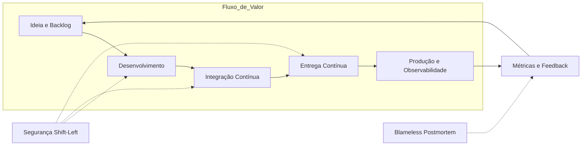

# Capítulo 2: Cultura DevOps: quebrando silos e colaborando

## 1. Introdução

No Capítulo 1, você viu o panorama do DevOps e o modelo CALMS como bússola da transformação. Agora vamos olhar para dentro: DevOps não é ferramenta, é cultura [1]. Neste capítulo, você entenderá por que a quebra de silos é o alicerce, como colocar dev, operações e segurança na mesma trincheira, e como o fluxo de valor sustenta a entrega contínua. É o diferencial entre instalar ferramentas e construir equipes — e o passo que transforma um desenvolvedor isolado em um Desenvolvedor Agêntico [7].

## 2. Explica

### 2.1 O custo dos silos

Um silo nasce quando cada equipe enxerga só uma fatia do sistema: o dev entrega código, a operação reclama de instabilidade, a segurança aponta vulnerabilidades, e ninguém conversa sobre o todo [2]. O resultado: ciclos longos, retrabalho constante e tensão entre quem quer mudar e quem precisa de estabilidade [3]. O problema não é técnico — é de incentivos: cada time persegue metas próprias, sem considerar o cliente final [4]. Estudos com equipes reais apontam a colaboração deficiente entre dev e ops como um dos maiores gargalos do ciclo de vida do software [5].

### 2.2 O modelo CALMS

O CALMS organiza a transformação em cinco pilares interligados [1]:

- **Cultura (C):** colaboração, responsabilidade compartilhada e *blameless postmortems* [6].
- **Automação (A):** remover o trabalho manual repetitivo de build, teste e publicação [13].
- **Lean (L):** fluxo: menos desperdício, lotes menores, caminho curto até produção [9].
- **Mensuração (M):** métricas de deploy, lead time, recuperação e falha — decidir com dados [12].
- **Compartilhamento (S):** transparência de conhecimento, ferramentas e responsabilidades [1].

Pilar esquecido faz os outros sofrerem: automação sem cultura gera um pipeline que ninguém confia [8].

### 2.3 DevSecOps

A segurança chegava no fim — e virava bloqueio. O DevSecOps inverte a lógica: a segurança participa desde a primeira linha de código, com SAST, escaneamento de dependências e inspeção de contêineres no pipeline [14]. É o *shift-left*: prevenção no início, onde corrigir custa pouco [10]. Segurança vira responsabilidade de todos [17].

### 2.4 Fluxo de valor e melhoria contínua

Fluxo de valor é o caminho completo de uma mudança, da ideia ao valor em produção — mapeá-lo revela desperdícios invisíveis: espera entre times, aprovações burocráticas, retrabalho [16]. O Lean, herança do Sistema Toyota de Produção, ensina que fluxo contínuo e lotes pequenos reduzem risco e aceleram o feedback [9]. Melhoria contínua é o ciclo sem fim: medir, achar o gargalo, remover, medir [8].

## 3. Ilustra

Pense na Jornada do Desenvolvedor Ágil como uma prova de ciclismo em equipe. No modelo de silos, cada um pedala sozinho contra o vento. No DevOps, todos formam um pelotão: quem vai à frente corta o vento (entrega), os demais economizam energia e devolvem informação. O pelotão inteiro avança mais rápido que qualquer ciclista isolado.

Para o pilar mais denso — a Cultura — use duas lentes. **Primeira lente: o muro.** Cada sprint adiciona um tijolo: documentação que ninguém leu, deploy às pressas, alerta ignorado. Quebrar silos é derrubar o muro tijolo por tijolo — e a ferramenta mais eficaz não é software, é o *blameless postmortem* [6]. **Segunda lente: o bastão de revezamento.** Na corrida tradicional, o bastão (o deploy) é arremessado por cima do muro. No DevOps, a equipe corre junta e o bastão nunca sai da mão [5].



A segurança entrelaça-se em cada etapa, e o feedback realimenta o início: a melhoria contínua vira um loop a cada entrega [16].

## 4. Técnica

Cultura sem materialização técnica vira discurso. Duas práticas traduzem a colaboração em artefatos versionados: um pipeline com segurança no fluxo (DevSecOps) e um modelo de *blameless postmortem*.

### 4.1 Pipeline com gate de segurança

```yaml
name: DevSecOps - Seguranca no fluxo
on:
  push:
    branches: [ main ]
  push:
    branches: [ main ]

jobs:
  seguranca:
    runs-on: ubuntu-latest
    steps:
      - uses: actions/checkout@v4
      - name: Auditar dependencias vulneraveis
        run: |
          pip install pip-audit
          pip-audit -r requirements.txt --fail-on any || exit 1
      - name: Analise estatica do codigo (SAST)
        run: |
          pip install bandit
          bandit -r app/ -q
```

O pipeline roda em todo push e bloqueia a publicação se encontrar vulnerabilidade — compartilhamento, não e-mail perdido [14]. O `pip-audit` falha o build com dependência vulnerável: automação no lugar do bloqueio humano [13].

### 4.2 Modelo de postmortem sem culpa (Python)

```python
# postmortem.py - Esqueleto de um blameless postmortem versionado
import datetime
from pathlib import Path

def criar_postmortem(titulo: str, autor: str) -> Path:
    """Gera o calendario de investigacao. Regra de ouro:
    nunca nomeie pessoas nas respostas - nomeie processos."""
    hoje = datetime.date.today().isoformat()
    arquivo = Path(f"docs/postmortems/{hoje}-{titulo.lower().replace(' ', '-')}.md")
    arquivo.parent.mkdir(parents=True, exist_ok=True)
    calendario = f"""# Postmortem: {titulo}
- Data: {hoje} | Facilitacao: {autor}

1. Linha do tempo (so fatos, sem opinioes)
   - 00:00 -
2. Qual foi o impacto? (usuarios, disponibilidade)
3. Qual causa raiz SISTEMICA? (que falha de processo permitiu?)
4. O que funcionou bem?
5. Acoes corretivas (responsavel e prazo)
6. Como saberemos se funcionou? (metrica de verificacao)
"""
    arquivo.write_text(calendario, encoding="utf-8")
    return arquivo

if __name__ == "__main__":
    criar_postmortem("degradacao no checkout", "time-plataforma")
```

A seção 3 pergunta que falha de processo permitiu o incidente, nunca quem é o culpado [6]. O arquivo versionado alimenta o aprendizado [8].

## 5. Aplica

Sexta-feira, 23h. Você dá merge e o deploy automático roda. Dez minutos depois, o alerta de latência dispara. No time tradicional, a operação abre chamado "para o desenvolvedor que quebrou produção" — fim de semana perdido. No time DevOps, o pipeline reverte sozinho e o postmortem revela que falta um teste de carga no caminho crítico [1].

### 5.1 Erro Comum vs. Prática Correta

Você está no time de pagamentos e o checkout cai. **A situação:** o alerta chega de madrugada e só o especialista de folga sabe reverter. **O erro comum:** a operação culpa o dev ("código ruim"), o dev culpa a operação ("deploy errado"), e o incidente vira tribunal [5]. **O diagnóstico:** faltam automação de reversão, documentação compartilhada e aprendizado sem culpa [8]. **A correção:** (1) rollback automático, acionável por qualquer engenheiro; (2) runbooks de reversão versionados junto do código [10]; (3) o template de postmortem registrando o incidente como aprendizado.

### 5.2 Métricas e limites

Para um time iniciante, três métricas bastam: **lead time do deploy** (commit até produção), **frequência de deploy** e **tempo de recuperação** [12]. Limites: deploys semanais no início, subindo só com rollback automático provado; incidente acima de 30 minutos de recuperação é postmortem obrigatório.

### 5.3 Exercício

- [ ] Desenhe o fluxo de valor do seu time: quantas mãos uma mudança atravessa? [16]
- [ ] Identifique um desperdício (espera, retrabalho, aprovação manual) e automatize-o
- [ ] Rode `pip-audit` no projeto e corrija ao menos uma dependência vulnerável [14]
- [ ] Facilite um mini-postmortem da última coisa que deu errado

## 6. Conclusão

Este capítulo mostrou que a cultura DevOps é o alicerce da Jornada do Desenvolvedor Ágil: sem quebra de silos, responsabilidade compartilhada e aprendizado com falhas, nenhuma ferramenta sustenta a transformação [1]. Você conheceu os pilares CALMS, viu o DevSecOps reposicionar a segurança e aprendeu a ler o sistema pelo mapa de fluxo de valor [16]. No próximo capítulo, essa base vira prática: princípios e técnicas de entrega contínua, com um time que já sabe colaborar [9].

## 7. Referências

[1] EBERT, Christof et al. *DevOps*. In: IEEE Software, v. 33, n. 3, 2016. Disponível em: https://doi.org/10.1109/ms.2016.68. Acesso em: 26 ago. 2026.
[2] BASS, Len; WEBER, Ingo; ZHU, Liming. *DevOps: A Software Architect's Perspective*. In: CERN Document Server (European Organization for Nuclear Research), 2015. Disponível em: http://cds.cern.ch/record/2034028. Acesso em: 26 ago. 2026.
[3] LEITE, Leonardo et al. *A Survey of DevOps Concepts and Challenges*. In: ACM Computing Surveys, v. 52, n. 6, 2019. Disponível em: https://doi.org/10.1145/3359981. Acesso em: 26 ago. 2026.
[4] JABBARI, Ramtin et al. *What is DevOps?*. In: Proceedings of the International Workshop on Software Engineering Aspects of Continuous Development, 2016. Disponível em: https://doi.org/10.1145/2962695.2962707. Acesso em: 26 ago. 2026.
[5] ERICH, Floris; AMRIT, Chintan; DANEVA, Maya. *A qualitative study of DevOps usage in practice*. In: Journal of Software: Evolution and Process, v. 29, n. 6, 2017. Disponível em: https://doi.org/10.1002/smr.1885. Acesso em: 26 ago. 2026.
[6] ZHU, Liming; BASS, Len; CHAMPLIN-SCHARFF, George. *DevOps and Its Practices*. In: IEEE Software, v. 33, n. 3, 2016. Disponível em: https://doi.org/10.1109/ms.2016.81. Acesso em: 26 ago. 2026.
[7] GOKARNA, Mayank; SINGH, Raju. *DevOps A Historical Review and Future Works*. In: arXiv, 2020. Disponível em: http://arxiv.org/abs/2012.06145v1. Acesso em: 26 ago. 2026.
[8] PEDRA, Mauro Lourenço; SILVA, Mônica Ferreira da; AZEVEDO, Leonardo Guerreiro. *DevOps Adoption: Eight Emergent Perspectives*. In: arXiv, 2021. Disponível em: http://arxiv.org/abs/2109.09601v1. Acesso em: 26 ago. 2026.
[9] BILDIRICI, Fatih; AKDEMIR, Ömür. *From Agile to DevOps, Holistic Approach for Faster and Efficient Software Product Release Management*. In: arXiv, 2023. Disponível em: http://arxiv.org/abs/2301.09429v1. Acesso em: 26 ago. 2026.
[10] MISHRA, Alok; OTAIWI, Ziadoon. *DevOps and software quality: A systematic mapping*. In: Computer Science Review, v. 38, 2020. Disponível em: https://doi.org/10.1016/j.cosrev.2020.100308. Acesso em: 26 ago. 2026.
[11] HÜTTERMANN, Michael. *DevOps for Developers*. New York: Apress, 2012. Disponível em: https://doi.org/10.1007/978-1-4302-4570-4. Acesso em: 26 ago. 2026.
[12] BEZEMER, Cor-Paul et al. *How is Performance Addressed in DevOps? A Survey on Industrial Practices*. In: arXiv, 2018. Disponível em: http://arxiv.org/abs/1808.06915v1. Acesso em: 26 ago. 2026.
[13] DHAWAN, R.; DHAWAN, M. *AI-augmented reliability in CI/CD: a framework for predictive, adaptive, and self-correcting pipelines*. In: Frontiers in Artificial Intelligence, 2026. Disponível em: https://pubmed.ncbi.nlm.nih.gov/41994557/. Acesso em: 26 ago. 2026.
[14] KISSOON, Tara. *DevOps*. In: Optimal Spending on Cybersecurity Measures. New York: Routledge, 2024. Disponível em: https://doi.org/10.1201/9781003404354-2. Acesso em: 26 ago. 2026.
[15] K K, Ambily. *DevOps Basics and Variations*. In: Azure DevOps for Web Developers. New York: Apress, 2020. Disponível em: https://doi.org/10.1007/978-1-4842-6412-6_1. Acesso em: 26 ago. 2026.
[16] MARQUES, Paulo; CORREIA, Filipe F. *Foundational DevOps Patterns*. In: arXiv, 2023. Disponível em: http://arxiv.org/abs/2302.01053v1. Acesso em: 26 ago. 2026.
[17] BALALAIE, Armin; HEYDARNOORI, Abbas; JAMSHIDI, Pooyan. *Microservices Architecture Enables DevOps: Migration to a Cloud-Native Architecture*. In: IEEE Software, v. 33, n. 3, 2016. Disponível em: https://doi.org/10.1109/ms.2016.64. Acesso em: 26 ago. 2026.
[18] CUPPETT, Michael S. *DBAs for DevOps*. In: DevOps, DBAs, and DBaaS. New York: Apress, 2016. Disponível em: https://doi.org/10.1007/978-1-4842-2208-9_2. Acesso em: 26 ago. 2026.