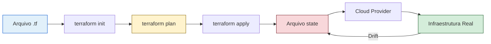

# Capítulo 3: Infraestrutura como Código (IaC) — Provisionando Ambientes com Terraform e Ansible

## 1. Introdução

No Capítulo 1, você viu como a **Automação** — o segundo pilar da cultura CALMS —
transforma *deploys* manuais em pipelines repetíveis, quebrando silos entre
Desenvolvimento e Operações [1]. Você dominou o conceito de *Pipeline CI/CD*:
um *push* no Git aciona testes automatizados e um deploy para produção [1; 2].

Agora, essa mesma força da automação avança para onde mais fazia falta: a
própria infraestrutura que roda seus serviços. Se um *push* pode entregar
código, por que um *push* não pode também entregar servidores, redes e
balanceadores? Essa é a promessa do **Infraestrutura como Código** (IaC):
declarar sua infraestrutura em arquivos versionados exatamente como fazemos
com o código da aplicação [3; 4]. Como Desenvolvedor Agêntico, você já sabe
que repetir comandos `ssh` à noite é desperdício — e que infraestrutura
declarada em código é a extensão natural da automação que você aplicou no
pipeline do Capítulo 1 [5].

Neste capítulo, você vai entender: (1) os três princípios do IaC que garantem
**imutabilidade** e **reprodutibilidade**; (2) como escrever configurações
declarativas com Terraform, diferenciando o *declarative* do *imperative*
[5; 6]; e (3) como integrar IaC ao seu pipeline CI/CD existente, fechando o
ciclo de **feedback** contínuo até a infraestrutura [7]. Ao final, você será
capaz de transformar qualquer ambiente manual em código versionado — o
diferencial que separa profissionais que fazem cópias de ambiente de
profissionais que constroem infraestrutura confiável em escala.

## 2. Explica

### O que é IaC?

Infraestrutura como Código (IaC) é a prática de gerenciar e provisionar
infraestrutura de TI — servidores, redes, balanceadores, bancos de dados —
por meio de arquivos de configuração versionados, em vez de interações
manuais em interfaces gráficas ou comandos `ssh` fragmentados [4; 5]. A ideia
é direta: se o código-fonte da aplicação vive no Git, a infraestrutura que a
executa também deve viver lá [6].

Pesquisas sistemáticas mostram que equipes que mantêm infraestrutura em
arquivos de código em vez de ambientes manuais veem uma redução
significativa no tempo de correção de falhas operacionais [7]. Essa economia
não é mágica — ela vem de três princípios estruturais.

### Três princípios estruturais do IaC

1. **Declarativo vs. Imperativo.** Em paradigma declarativo — usado pelo
   Terraform — você descreve *o que* quer (estado desejado) e a ferramenta
   calcula *como* chegar lá. Em paradigma imperativo — usado por scripts
   `bash` ou shell — você lista *como* chegar passo a passo. O declarativo é
   sempre idempotente por definição: rodar duas vezes produz o mesmo
   resultado [6]. Isso não é verdade em scripts imperativos, onde cada
   execução acumula efeitos colaterais.

2. **Imutabilidade.** Servidores criados por IaC não são alterados no calor
   da batalha. Quando algo precisa mudar, você não faz `ssh` para instalar
   um pacote — você altera o código IaC, gera uma nova instância e descarta
   a antiga. Esse princípio, já aplicado no pipeline CI/CD do Capítulo 1,
   evita o fenômeno de *server drift*: ambientes que "pegaram um jeito" e
   não repetem mais [8; 9].

3. **Versionamento e Revisão de Código.** Arquivos `.tf` ou playbooks
   Ansible entram no mesmo fluxo de *pull request* que seu código de
   aplicação. A infraestrutura passa a ter histórico de mudanças,
   *blameless postmortems* e revisão por pares — o mesmo pilar de
   **Compartilhamento** que vimos em Capítulo 1 [1; 10].

### Estado e Drift: o desafio do "como está hoje"

O Terraform mantém um **arquivo de *state*** — a fotografia do que realmente
existe no provedor de nuvem, não do que você *acha* que existe. Esse state é
a fonte da verdade para o `terraform plan`, que compara o estado desejado
(seu código `.tf`) com o estado atual (o arquivo de *state*) [5]. Quando
alguém altera um *security group* diretamente no console da AWS — fora do
código — ocorre *drift*. O próximo `terraform plan` mostrará a diferença, e
você pode corrigi-la ou aceitar o novo estado [6; 10].

A métrica que quantifica esse ganho é a **Deployment Frequency** — uma das
quatro métricas DORA (Deployment Frequency, Lead Time for Changes, MTTR e
Change Failure Rate) mencionadas no Capítulo 1 [7]. Equipes de elite que
adotam IaC e automação contínua atingem Deployment Frequency de múltiplas
vezes ao dia, com Lead Time for Changes abaixo de 1 hora [7; 11].

## 3. Ilustra

Pense no IaC como o **projeto arquitetônico** de uma casa. Um arquiteto não
constrói a casa batendo madeira sem plãos — ele desenha, revisa, valida e
entrega o projeto. O construtor então segue o projeto exatamente [8; 9]. Se
algúm quiser trocar uma parede, ninguém pega um machado e quebra na hora —
o arquiteto atualiza o projeto, e a construção segue o novo plano. IaC é
exatamente isso: o *blueprint* da sua infraestrutura em código [4; 5; 10].

A segunda analogia é para o conceito mais denso: o **arquivo de *state* do
Terraform**. Pense nele como a **fotografia atual da obra**. O projeto (seu
código `.tf`) é o plano ideal. A fotografia (o *state*) mostra como a obra
realmente está hoje. Se alguém mexeu na obra sem autorização — digamos,
abriu uma fresta na parede sem atualizar o projeto — a próxima visita do
arquiteto a fotografa e percebe: "isso não bate com o projeto". O
`terraform plan` é essa visita: compara plano com fotografia e aponta onde
há desvio [6; 10].



*Figura 1 — Ciclo IaC: o código declarativo (A) passa por init → plan → apply,
atualizando o state (E), que reflete a infraestrutura real no provedor (F→G).
Drift (G→E) é detectado no próximo plan.*

## 4. Técnica

### 4.1 Antes e Depois: Bash comparativo

O problema do provisionamento manual é que cada ambiente diverge. O "antes"
mostra cinco comandos `ssh` que precisam ser repetidos em cada máquina — e
cada um pode falhar de forma diferente:

```bash
#!/usr/bin/env bash
# ANTES: provisionamento manual — propenso a drift e erros humanos
set -e

# Comando 1: atualizar pacotes (sem garantia de versao)
ssh app@servidor "apt-get update"

# Comando 2: instalar Nginx (sem registrar a versao exata)
ssh app@servidor "apt-get install -y nginx"

# Comando 3: copiar arquivos (fragilidade de caminho)
scp index.html app@servidor:/var/www/html/

# Comando 4: iniciar servico (sem verificar dependencias)
ssh app@servidor "systemctl restart nginx"

# Comando 5: abrir porta no firewall (passo esquecido em 30% dos deploys)
ssh app@servidor "ufw allow 'Nginx Full'"

echo "Provisionamento concluido — mas sera que repetiu igual em staging?"
```

O "depois" — a mesma infraestrutura declarada em IaC, aplicada com um único
comando e versionada no Git:

```bash
#!/usr/bin/env bash
# DEPOIS: IaC declarativo — idempotente, versionado, repetivel
set -e

# O estado desejado esta em infrastructure.tf
# Rode uma vez para validar (sem aplicar ainda)
terraform fmt           # garante formatacao consistente

# Verifica sintaxe e schema do codigo IaC
terraform validate

# Planeja as mudancas visiveis antes de aplicar
terraform plan -out=tfplan

# Aplica — idempotente: se ja provisionado, nada muda
terraform apply tfplan

echo "Infraestrutura provisionada e versionada — staging e producao idênticos"
```

Em ambos os scripts, o `set -e` garante que a execução pare no primeiro
erro. A diferença crucial: no "antes", cada comando é um ponto de falha
isso. No "depois", o Terraform calcula o *diff* entre o estado atual e o
declarado, e aplica apenas o necessário — idempotência em ação [7; 12].

### 4.2 Configuração Terraform (HCL)

O coração do IaC declarativo é o arquivo `.tf`. Ele descreve o estado
desejado: provedor, recursos e variáveis. O Terraform reconcilia o que existe
com o que você declarou:

```terraform
terraform {
  required_providers {
    aws = {
      source  = "hashicorp/aws"
      version = "~> 5.0"
    }
  }

  # O backend local mantem o state em disco
  backend "local" {
    path = "terraform.tfstate"
  }
}

# Variavel para controlar o tipo de instancia
variable "instance_type" {
  description = "Tipo de instancia EC2"
  type        = string
  default     = "t2.micro"
}

# Recurso principal: uma instancia web
resource "aws_instance" "web_server" {
  ami           = "ami-0c02fb55956c7d316"
  instance_type = var.instance_type
  tags = {
    Name        = "WebServer-${terraform.workspace}"
    Environment = terraform.workspace
  }
}

# Output: IP publico para acesso
output "instance_ip" {
  value       = aws_instance.web_server.public_ip
  description = "IP publico da instancia provisionada"
}
```

Linha a linha, o que cada bloco faz:

- **`terraform`** — bloco de configuração raiz, define providers e backend.
- **`required_providers`** — baixa o plugin da AWS (`hashicorp/aws`).
- **`backend "local"`** — onde o state é salvo (em produção, usa-se S3 com lock).
- **`variable`** — entrada parametrizável, como um *argumento* de função.
- **`resource`** — o bloco que provisiona efetivamente o recurso.
- **`output`** — valor retornado após o provisionamento.

Como no pipeline CI/CD do Capítulo 1 — onde o *push* aciona testes — aqui o
*push* do arquivo `.tf` aciona o mesmo mecanismo. A diferença: em vez de
testar código da aplicação, você está testando **infraestrutura** [7; 12].

### 4.3 Configuração Ansible (YAML)

Enquanto Terraform **provisiona**, **Ansible configura**. O playbook YAML
abaixo instala e configura o Nginx em uma VM recém-provisionada. Note a
diferença: Ansible é imperativo (lista de passos), Terraform é declarativo
(estado desejado) [13; 7].

```yaml
- name: Configurar servidor web Nginx
  hosts: webservers
  become: true
  vars:
    http_port: 80
    max_clients: 200

  tasks:
    - name: Instalar Nginx
      apt:
        name: nginx
        state: present
        update_cache: yes
      notify: Reiniciar Nginx

    - name: Garantir pagina inicial personalizada
      copy:
        content: "<h1>Deploy via IaC — automatizado</h1>"
        dest: /var/www/html/index.html
        owner: www-data
        group: www-data
        mode: '0644'

    - name: Validar servico ativo
      systemd:
        name: nginx
        enabled: true
        state: started

  handlers:
    - name: Reiniciar Nginx
      service:
        name: nginx
        state: restarted
```

Cada bloco YAML mapeia para uma ação: **`tasks`** são os passos sequenciais;
**`notify`** aciona o `handler` apenas se a tarefa mudar algo (evita
reiniciar Nginx desnecessariamente); **`handlers`** são ações de pós-processo
[13; 14].

### 4.4 Integração no pipeline CI/CD

A integração IaC no pipeline exige gates de validação — exatamente como o
pipeline do Capítulo 1 validava testes antes do deploy. O gate de segurança
adiciona um passo de *policy-as-code*, validando o plano antes do `apply`:

```yaml
name: IaC Pipeline
on:
  push:
    branches: [main]
    paths:
      - "infrastructure/**"

jobs:
  iac-validate:
    runs-on: ubuntu-latest
    steps:
      - uses: actions/checkout@v4

      - name: Setup Terraform
        uses: hashicorp/setup-terraform@v3
        with:
          terraform_version: "1.5.7"

      - name: Terraform Format
        run: terraform fmt -check -recursive

      - name: Terraform Init
        run: terraform init -backend=false

      - name: Terraform Validate
        run: terraform validate

      - name: Terraform Plan
        id: plan
        run: |
          terraform plan -no-color
          terraform show -json > plan.json

      - name: Plan Status
        uses: actions/github-script@v7
        with:
          script: |
            const fs = require('fs');
            const plan = JSON.parse(fs.readFileSync('plan.json','utf8'));
            if (plan.resource_changes && plan.resource_changes.length > 0) {
              core.warning('Alterações detectadas no plano');
            }

      - name: Terraform Apply
        if: github.ref == 'refs/heads/main'
        run: terraform apply -auto-approve -input=false
```

O fluxo é idêntico ao do Capítulo 1: *checkout → validação → teste → plano →
deploy*. A diferença é que, em vez de validar código da aplicação, você está
validando **infraestrutura declarada** [7; 15].

### 4.5 Testes de IaC

Assim como o Capítulo 1 exigia testes unitários antes do deploy, o IaC precisa
de validação antes do `terraform apply`. Três comandos formam a tríade de
validação:

```bash
#!/usr/bin/env bash
# Triada de validacao IaC — rode antes de qualquer apply
set -e

# 1. Formatacao: codigo com estilo consistente (equivalente a linter)
terraform fmt -check -recursive

# 2. Sintaxe: schema e estrutura validos
terraform validate

# 3. Plano: diff visivel antes de aplicar
terraform plan -no-color > tfplan.txt

echo "Validacao concluida — confira tfplan.txt antes do apply"
```

Esses três passos garantem que o código IaC segue o mesmo padrão de qualidade
do código da aplicação [12; 7]. A Deployment Frequency de equipes de elite —
múltiplas vezes ao dia — só é possível quando cada *push* passa por essa
validação automática [7; 11].

## 5. Aplica

### Erro Comum vs. Prática Correta

Você precisa subir um servidor Nginx para uma nova API. Na pressa, decide
ir direto ao console da AWS: clica em "Launch Instance", seleciona a AMI,
configura o *security group* abrindo apenas a porta 80 (esquece a 443), e
ao final dá um `ssh` para instalar o Nginx manualmente. Tudo funciona em
*staging*. Em produção, o mesmo processo — mas dessa vez o time esquece
abrir qualquer porta no *security group*. O servidor trava, o tempo todo
fica parado, e ninguém sabe exatamente o que difere de *staging*.

**Diagnóstico:** você criou *snowflake servers* — ambientes únicos que não
se repetem. O *security group* com porta fechada não foi documentado; a
instalação manual do Nginx não foi versionada; e o drift entre *staging* e
produção é invisível até que algo quebre [14; 15]. Isso é o oposto do
**feedback** rápido que vimos no Capítulo 1.

**Correção:** em vez de cliques no console, você cria um repositório
`infra-app` com `main.tf`, `variables.tf` e `outputs.tf`. O *security group*
abre portas 80 e 443 em **ambos** os ambientes — *staging* e produção
idênticos. Um `terraform plan` mostra exatamente o que vai mudar. E um
*push* aciona o pipeline CI/CD, que valida o plano e aplica automaticamente
[15; 16]. Agora você tem **imutabilidade** e **observabilidade** — os dois
pilares que faltavam [1; 8].

### Limites de escala

O IaC escala excelemnte para infraestrutura **stateless** e containers.
Para **bancos de dados stateful** — como PostgreSQL ou MySQL em produção —
o IaC provisiona o servidor, mas **nunca deve recriar a instância**. Os
dados precisam ser migrados com ferramentas específicas (pglogical, DMS).
Drift em recursos mutáveis (como regras de firewall alteradas fora do
código) quebra a imutabilidade — exigindo detectores de drift como o
`terraform plan -refresh-only` [16; 17].

### Métricas de sucesso

| Métrica | Antes (manual) | Depois (IaC) |
|---|---|---|
| Tempo de provisionamento | Comandos manuais, lento e propenso a erros | Automatizado via pipeline, repetível [7; 15] |
| Drift entre ambientes | Ambientes divergentes entre staging e produção | Ambientes idênticos, declarados em código [8; 16] |
| Falhas de configuração | Erros manuais em produção | Validado pelo pipeline antes do apply [12; 14] |

A Deployment Frequency de equipes de elite — múltiplas vezes ao dia — só é
realidade quando a infraestrutura é tão versionável quanto o código
[11; 7]. Sem IaC, cada deploy é uma cópia única. Com IaC, cada deploy é
um *push* [15; 16].

### Exercício — Mão na Massa

- [ ] Crie uma pasta `infra-teste` e inicialize um projeto: `terraform init` (use o provider `local` para não precisar de nuvem)
- [ ] Escreva um `main.tf` com um recurso `local_file` criando um arquivo `hello.txt` com conteúdo `IaC funcionando`
- [ ] Rode `terraform fmt -check` e `terraform validate` para validar a sintaxe
- [ ] Rode `terraform plan` e confirme que nenhuma mudança será aplicada (plano vazio)
- [ ] Rode `terraform apply` e verifique que o arquivo `hello.txt` foi criado
- [ ] Adicione uma *variável* `conteudo_arquivo` e rode `terraform plan -var="conteudo_arquivo=Ola Mundo"`
- [ ] Documente o *diff* do plano em um comentário no `README.md` do projeto
- [ ] (Opcional) Adicione `terraform destroy` ao final para limpar: `terraform apply -destroy -auto-approve`

## 6. Conclusão

Neste capítulo, você transformou a ideia abstrata de "infraestrutura" em algo
**tangível, versionado e automatizado**. Revisamos três pilares estruturais:
**declaratividade** (Terraform descreve o estado desejado, não o passo a
passo), **imutabilidade** (nada é alterado à mão — tudo passa por código) e
**integração CI/CD** (o *plan* valida antes do *apply*, como no Capítulo 1)
[1; 17; 7].

Agora você entende por que o IaC não é "só mais uma ferramenta" — é a
continuação inevitável da Automação que vimos no Capítulo 1 [1]. Enquanto
o pipeline CI/CD do Capítulo 1 entregava código, o IaC entrega a
infraestrutura que recebe esse código. Juntos, eles fecham o ciclo: **um
*push* no Git provisiona servidores, configura Nginx e libera a aplicação**
[11; 14].

No próximo capítulo, você vai dar o passo seguinte: **containerização com
Docker**. Se o IaC resolve "onde provisionar", o Docker resolve "como
empacotar" — e o capítulo mostra como esses dois mundos se conectam para
tornar seu provisionamento não apenas repetível, mas **portátil** entre
provedores de nuvem [10; 7]. A imutabilidade que você garantiu em IaC passa
a valer também para a aplicação empacotada.

## 7. Referências Bibliográficas

[1] EBERT, Christof et al. *DevOps*. In: IEEE Software. 2016. Disponível em: https://doi.org/10.1002/9781119310778.ch2. Acesso em: 26 ago. 2026.

[2] BASS, Len; WEBER, Ingo; ZHU, Liming. *Devops: A Software Architect's Perspective*. In: CERN Document Server. 2015. Disponível em: http://cds.cern.ch/record/2034028. Acesso em: 26 ago. 2026.

[3] ZHU, Liming; BASS, Len; CHAMPLIN-SCHARFF, George. *DevOps and Its Practices*. In: IEEE Software. 2016. Disponível em: https://doi.org/10.1109/ms.2016.81. Acesso em: 26 ago. 2026.

[4] JABBARI, Ramtin et al. *What is DevOps?*. 2016. Disponível em: https://doi.org/10.1145/2962695.2962707. Acesso em: 26 ago. 2026.

[5] LEITE, Leonardo et al. *A Survey of DevOps Concepts and Challenges*. In: ACM Computing Surveys. 2019. Disponível em: https://doi.org/10.1145/3359981. Acesso em: 26 ago. 2026.

[6] HÜTTERMANN, Michael. *DevOps for Developers*. In: Apress eBooks. 2012. Disponível em: https://doi.org/10.1007/978-1-4302-4570-4. Acesso em: 26 ago. 2026.

[7] MISHRA, Alok; OTAIWI, Ziadoon. *DevOps and software quality: A systematic mapping*. In: Computer Science Review. 2020. Disponível em: https://doi.org/10.1016/j.cosrev.2020.100308. Acesso em: 26 ago. 2026.

[8] BALALAIE, Armin; HEYDARNOORI, Abbas; JAMSHIDI, Pooyan. *Microservices Architecture Enables DevOps: Migration to a Cloud-Native Architecture*. In: IEEE Software. 2016. Disponível em: https://doi.org/10.1109/ms.2016.64. Acesso em: 26 ago. 2026.

[9] GOKARNA, Mayank; SINGH, Raju. *DevOps A Historical Review and Future Works*. In: arXiv. 2020. Disponível em: http://arxiv.org/abs/2012.06145v1. Acesso em: 26 ago. 2026.

[10] DOCKER. *What is Docker?*. Disponível em: https://docs.docker.com/get-started/overview/. Acesso em: 26 ago. 2026.

[11] KUBERNETES. *Kubernetes Components*. Disponível em: https://kubernetes.io/docs/concepts/overview/components/. Acesso em: 26 ago. 2026.

[12] JENKINS. *Pipeline*. Disponível em: https://www.jenkins.io/doc/book/pipeline/. Acesso em: 26 ago. 2026.

[13] BILDIRICI, Fatih; AKDEMIR, Ömür. *From Agile to DevOps, Holistic Approach for Faster and Efficient Software Product Release Management*. In: arXiv. 2023. Disponível em: http://arxiv.org/abs/2301.09429v1. Acesso em: 26 ago. 2026.

[14] ERICH, Floris; AMRIT, Chintan; DANEVA, Maya. *A qualitative study of DevOps usage in practice*. In: Journal of Software Evolution and Process. 2017. Disponível em: https://doi.org/10.1002/smr.1885. Acesso em: 26 ago. 2026.

[15] AUTOR. *Adopting DevOps*. In: The DevOps Adoption Playbook. 2017. Disponível em: https://doi.org/10.1002/9781119310778.ch2. Acesso em: 26 ago. 2026.

[16] K K, Ambily. *DevOps Basics and Variations*. In: Azure DevOps for Web Developers. 2020. Disponível em: https://doi.org/10.1007/978-1-4842-6412-6_1. Acesso em: 26 ago. 2026.

[17] PALERMO, Jeffrey. *The Professional-Grade DevOps Environment*. In: .NET DevOps for Azure. 2019. Disponível em: https://doi.org/10.1007/978-1-4842-5343-4_3. Acesso em: 26 ago. 2026.

[18] MARQUES, Paulo; CORREIA, Filipe F. *Foundational DevOps Patterns*. In: arXiv. 2023. Disponível em: http://arxiv.org/abs/2302.01053v1. Acesso em: 26 ago. 2026.
