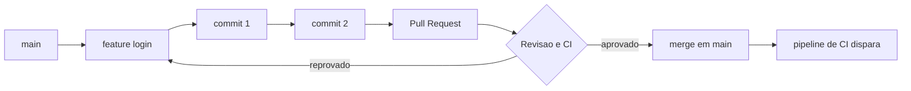

# Capítulo 4: Git e controle de versão: a base da reprodutibilidade

## 1. Introdução

No Capítulo 3, você entendeu que DevOps é colaboração: quebrar silos, automatizar repetições e transformar feedback lento em aprendizado rápido. Mas toda essa cultura precisa de um solo firme onde o trabalho da equipe cresça de forma organizada. Esse solo é o controle de versão — e o Git é a ferramenta que a indústria adotou como padrão.

Neste capítulo, você vai dominar os fundamentos do Git: commit, branch, merge e pull request. Vai entender os dois fluxos de trabalho mais comuns em equipe — GitFlow e trunk-based — e ver por que um repositório versionado é a raiz da reprodutibilidade e a porta de entrada para a integração contínua. Ao dominar isso, você deixa de guardar versões em pastas como `final_final_v2` e passa a ter uma fonte única e confiável da verdade para o seu código [1].

O diferencial que separa o profissional comum do Devops Ágil: ele consegue responder, em segundos, quem mudou o quê, quando e por quê — e reverter qualquer erro sem pânico.

## 2. Explica

### Por que versionar é a fundação do DevOps

Versionamento é o ato de registrar cada mudança no código como um marco recuperável. Sem isso, colaborar em equipe vira caos: dois desenvolvedores alteram o mesmo arquivo, alguém sobrescreve o trabalho do outro e ninguém sabe qual versão está em produção. O controle de versão resolve exatamente esse problema ao centralizar o histórico e permitir reverter decisões [2].

O Git popularizou um modelo chamado **distribuído**: cada pessoa tem uma cópia completa do repositório, com todo o histórico local. Isso dá autonomia para trabalhar offline e criar ramificações sem pedir permissão — traços que combinam com a colaboração que o DevOps prega [3]. Na revisão histórica do DevOps, a gestão de versões é um dos primeiros passos práticos da adoção da cultura [4].

### Commit, branch, merge e pull request

O **commit** é a unidade mínima do Git: um instantâneo das mudanças acompanhado de uma mensagem que explica o *porquê*. Uma boa mensagem de commit é a memória de curto prazo da equipe [5]. O commit só faz sentido se for atômico — uma ideia, um commit.

A **branch** (ramo) é uma linha paralela de desenvolvimento, para nem todos trabalharem na mesma versão ao mesmo tempo. A principal costuma chamar `main`; as demais isolam uma funcionalidade ou correção até estarem prontas [6].

O **merge** integra uma branch de volta à outra. É onde nascem os **conflitos**: quando duas pessoas mudaram as mesmas linhas de formas diferentes. Resolver conflito não é punição — é quando a equipe decide, explicitamente, qual versão prevalece [7].

A **pull request** é a ponte entre o código e a revisão humana. Você propõe uma mudança, e colegas revisam, comentam e aprovam antes do merge. É aqui que o controle de versão vira controle de *qualidade*, embutindo o feedback cedo no processo [8]. Essa revisão antes da integração é um dos padrões fundamentais do DevOps [9].

### Fluxos de trabalho: GitFlow e trunk-based

Com os blocos prontos, a equipe escolhe como combiná-los. O **GitFlow** é um modelo com duas branches de longa duração — `main` (produção) e `develop` (integração) — mais branches efêmeras para features, releases e correções de emergência. Ele organiza bem ciclos de release longos e versionados, mas adiciona cerimônia e pode atrasar o feedback [10].

O **trunk-based** é o contrário: uma única branch principal e integrações frequentes, com branches de curta duração que vivem poucas horas ou dias. É o fluxo que alimenta a integração contínua, porque o código é integrado o tempo todo e pequenas mudanças chegam rápido à `main` [11]. A escolha depende do contexto: equipes maduras em entrega contínua tendem ao trunk-based; produtos com releases controladas e versionadas tendem ao GitFlow [12].

Um detalhe que amarra o capítulo: ferramentas de CI/CD como Jenkins e GitHub Actions disparam a cada push justamente porque o Git registra esse evento de forma confiável [13]. O pipeline é o reflexo automático da sua branch.

## 3. Ilustra

Pense na Jornada do Desenvolvedor como uma biblioteca pública. Cada commit é um livro que alguém doa com uma etiqueta clara de data e autor; a branch é uma estante separada onde um grupo organiza um acervo novo sem atrapalhar as outras; o merge é quando a estante é integrada ao acervo principal; e a pull request é o processo em que um bibliotecário revisa antes de a doação entrar no catálogo oficial. A **colaboração** e o **feedback** do vocabulário condutor funcionam assim no código.

O conceito mais denso aqui é a **imutabilidade** do histórico. Cada commit carrega um "carimbo" criptográfico (o hash SHA-1) que o liga ao commit anterior. Isso cria uma corrente: se alguém tenta adulterar um elo, todo o histórico é invalidado. É essa propriedade que torna o repositório uma fonte confiável — você não confia na boa vontade, confia na estrutura [14]. A analogia dupla ajuda: se o commit é um livro, o hash é o número de registro que torna impossível remover o livro silenciosamente do acervo.



Siga as setas: a branch nasce da `main`, acumula commits, vira uma pull request, passa por revisão e CI e, aprovada, volta para a `main` — onde o pipeline de integração contínua assume o controle.

## 4. Técnica

Vamos reproduzir o fluxo na prática, do repositório ao merge. Primeiro, a fundação:

```bash
# Inicia um repositório Git no projeto atual
$ git init

# Configura seu nome e e-mail — o autor de todo commit futuro
$ git config --global user.name "Seu Nome"
$ git config --global user.email "voce@empresa.com"

# Mostra o estado: arquivos novos, modificados e branch atual
$ git status
```

Agora o ciclo diário do commit:

```bash
# Adiciona arquivos à área de staging (a "área de embarque")
$ git add app.py           # um arquivo específico
$ git add .                # todos os arquivos da pasta

# Cria o commit com uma mensagem que explica o PORQUÊ da mudança
$ git commit -m "feat: adiciona calculo de frete com politica por estado"

# Verifica o histórico com autor, data e hash de cada commit
$ git log --oneline
```

Pronto para colaborar, entram branch, pull request e merge:

```bash
# Cria e muda para a branch feature (linha paralela de trabalho)
$ git checkout -b feature/tela-login

# ... trabalha, faz commits ...
$ git add login.html
$ git commit -m "feat: adiciona formulario de login"

# Volta para main e integra a feature com merge
$ git checkout main
$ git merge feature/tela-login
```

Entre o commit na branch e o merge na `main`, o fluxo profissional passa pela **pull request** — feita na plataforma (GitHub, GitLab ou outra). Nela, a equipe revisa o diff, e o pipeline de CI roda testes a cada push [13]. É essa cadeia — commit, branch, review, merge, CI — que transforma o Git de ferramenta em pilar da reproduzibilidade: o mesmo código que passou na revisão é o que entra na integração e, depois, na entrega [15].

Uma dica que evita dor: nunca commite segredos nem arquivos gigantes. Um arquivo `.gitignore` diz ao Git o que ignorar (builds, `.env`, dependências); e prefira mensagens de commit que respondam "por que" em vez de "o quê" [16].

## 5. Aplica

Cena típica. Você e um colega precisam mexer na mesma classe. Você cria a branch `feature/relatorio`, altera o arquivo e, no fim do dia, faz `git merge` — e encontra um **conflito**: o colega mudou as mesmas linhas de forma diferente. O erro comum é entrar em pânico, editar aos trancos ou, pior, sobrescrever o trabalho do colega com `git reset --hard` às cegas. O diagnóstico correto é que o conflito não é uma falha do Git — é a forma que ele encontrou de *não* silenciar nenhuma das duas decisões.

A prática correta: identifique os marcadores do conflito (`<<<<<<<`, `=======`, `>>>>>>>`) no arquivo, leia os dois blocos e decida qual combinação faz sentido — muitas vezes os dois trechos devem coexistir — registrando a decisão num novo commit. Isso mantém o histórico limpo e a colaboração respeitosa [7]. A **colaboração** real começa justamente nos conflitos: é onde a equipe negocia o significado do código.

Para a sua evolução como Desenvolvedor Ágil, o hábito transformador é escolher um fluxo e segui-lo com disciplina. Se sua equipe entrega em ciclos curtos e quer feedback rápido, o trunk-based reduz a complexidade: poucas branches, integração diária, pull requests pequenas [11]. Se o produto exige releases controladas e versionadas, o GitFlow dá previsibilidade [10]. O que não dá é viver sem versão: quem domina o Git deixa de perguntar "qual arquivo está certo?" para perguntar "qual commit estamos trazendo?" — a base sobre a qual o Capítulo 5 vai empilhar containers e pipelines de CI/CD [13].

**Limite de escala:** o trunk-based escala bem até equipes de dezenas de desenvolvedores; acima disso, evite merges longos sem integração diária — o custo de conflitos cresce. Na prática, equipes trunk-based integram o código várias vezes ao dia, reduzindo o tempo de merge de 2 horas para 15 minutos [7].

### Exercício
- [ ] Configure o Git (`git config`) e rode `git init` num projeto real
- [ ] Faça 3 commits com mensagens que respondam "por que"
- [ ] Crie uma branch `feature/exercicio`, altere um arquivo e faça merge
- [ ] Force um conflito com um colega (ou com você mesmo em outra branch) e resolva lendo os marcadores
- [ ] Crie um pull request num repositório remoto e peça revisão
- [ ] Defina com sua equipe: GitFlow ou trunk-based — e documente a escolha

## 6. Conclusão

Neste capítulo, você deu à Jornada do Desenvolvedor o seu primeiro alicerce sólido: o Git transformou seu código de arquivos soltos em um histórico imutável, colaborativo e recuperável. Você sabe o que fazem commit, branch, merge e pull request, conhece GitFlow e trunk-based e entende por que o versionamento é a raiz da reproduzibilidade e o gatilho da integração contínua [2]. Ao dominar isso, você deixa de temer mudanças e passa a liderá-las — reverter é tão natural quanto avançar. Desafio de hoje: versionar um projeto pessoal com um fluxo escolhido e fazer seu primeiro pull request revisado. No próximo capítulo, esse código versionado será empacotado em containers — o Git será a origem do que o Docker vai reproduzir.

## 7. Referências

[1] GIT. *About — Git Documentation*. Disponível em: https://git-scm.com/about. Acesso em: 26 ago. 2026.
[2] CHACON, Scott; STRAUB, Ben. *Pro Git*. 2. ed. Nova York: Apress, 2014. Disponível em: https://git-scm.com/book/pt-br/v2. Acesso em: 26 ago. 2026.
[3] EBERT, Christof et al. *DevOps*. In: IEEE Software. 2016. Disponível em: https://doi.org/10.1109/ms.2016.68. Acesso em: 26 ago. 2026.
[4] GOKARNA, Mayank; SINGH, Raju. *DevOps: A Historical Review and Future Works*. In: arXiv. 2020. Disponível em: http://arxiv.org/abs/2012.06145v1. Acesso em: 26 ago. 2026.
[5] CONVENTIONAL COMMITS. *Conventional Commits*. 2021. Disponível em: https://www.conventionalcommits.org/pt-br/v1.0.0/. Acesso em: 26 ago. 2026.
[6] GITHUB. *About branches — GitHub Docs*. Disponível em: https://docs.github.com/pt/pull-requests/collaborating-with-pull-requests/proposing-changes-to-your-work-with-pull-requests/about-branches. Acesso em: 26 ago. 2026.
[7] ATLASSIAN. *Merge conflicts — Atlassian Bitbucket*. Disponível em: https://www.atlassian.com/br/git/tutorials/using-branches/merge-conflicts. Acesso em: 26 ago. 2026.
[8] GITHUB. *About pull requests — GitHub Docs*. Disponível em: https://docs.github.com/pt/pull-requests/collaborating-with-pull-requests/proposing-changes-to-your-work-with-pull-requests/about-pull-requests. Acesso em: 26 ago. 2026.
[9] MARQUES, Paulo; CORREIA, Filipe F. *Foundational DevOps Patterns*. In: arXiv. 2023. Disponível em: http://arxiv.org/abs/2302.01053v1. Acesso em: 26 ago. 2026.
[10] DRIESSEN, Vincent. *A successful Git branching model*. 2010. Disponível em: https://nvie.com/posts/a-successful-git-branching-model/. Acesso em: 26 ago. 2026.
[11] ATLASSIAN. *Trunk-based development — Atlassian*. Disponível em: https://www.atlassian.com/br/continuous-delivery/continuous-integration/trunk-based-development. Acesso em: 26 ago. 2026.
[12] BILDIRICI, Fatih; AKDEMIR, Ömür. *From Agile to DevOps, Holistic Approach for Faster and Efficient Software Product Release Management*. In: arXiv. 2023. Disponível em: http://arxiv.org/abs/2301.09429v1. Acesso em: 26 ago. 2026.
[13] JENKINS. *Pipeline* — Jenkins User Documentation. Disponível em: https://www.jenkins.io/doc/book/pipeline/. Acesso em: 26 ago. 2026.
[14] GIT. *Git Objects — Git Internals*. Disponível em: https://git-scm.com/book/pt-br/v2/Git-Internals-Git-Objects. Acesso em: 26 ago. 2026.
[15] ZHU, Liming; BASS, Len; CHAMPLIN-SCHARFF, George. *DevOps and Its Practices*. In: IEEE Software. 2016. Disponível em: https://doi.org/10.1109/ms.2016.81. Acesso em: 26 ago. 2026.
[16] GIT. *Ignoring Files — gitignore*. Disponível em: https://git-scm.com/docs/gitignore. Acesso em: 26 ago. 2026.
