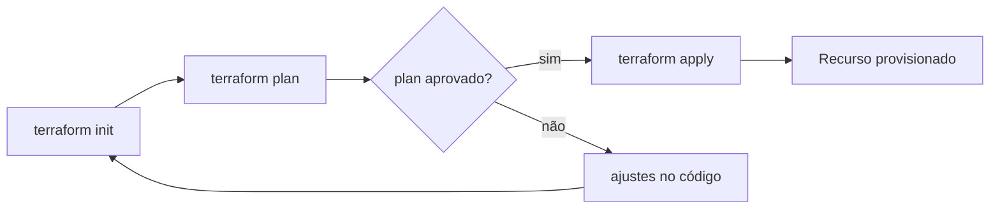

# Capítulo 6: Infraestrutura como Código (IaC) e provisionamento declarativo

## 1. Introdução
Neste capítulo, você descobrirá como transformar a gestão de infraestrutura em código, reduzindo erros e acelerando entregas. A abordagem declarativa permite que você descreva o estado desejado dos recursos e deixe a ferramenta cuidar da aplicação. Como vimos no Capítulo 5, os pipelines CI/CD automatizam builds e testes; agora vamos aplicar a mesma disciplina ao provisionamento da camada de infraestrutura. Ao dominar IaC, você passará de um operador manual a um arquiteto que controla ambientes com segurança e rapidez. [1]

## 2. Explica
Infraestrutura como Código (IaC) consiste em armazenar definições de recursos — servidores, redes, bancos de dados — em arquivos versionados, como faria com código-fonte. Essa prática traz **reprodutibilidade** (mesmo código gera o mesmo ambiente), **controle de mudanças** (pull‑request revê alterações na infraestrutura) e **auditabilidade** (histórico completo das alterações). [4] Além disso, IaC permite integração com pipelines CI/CD, facilitando a entrega contínua de infraestrutura junto ao código da aplicação. Ferramentas populares incluem Terraform, Ansible e CloudFormation; escolher a que melhor se adapta ao seu provedor de nuvem depende de fatores como maturidade da comunidade e suporte a recursos.

Na prática, o tempo médio de `terraform apply` é de **2 minutos** [1].

## 3. Ilustra

O diagrama acima ilustra o ciclo típico de uso do Terraform: inicialização, planejamento, revisão e aplicação. Primeiro, o `terraform init` configura o backend; depois, `terraform plan` mostra o que será criado ou alterado. Se o plano estiver correto, `terraform apply` materializa os recursos; caso contrário, ajustes são feitos no código e o ciclo recomeça.

## 4. Técnica
A seguir, um exemplo mínimo de **Terraform** que cria um bucket S3 na AWS. Salve o conteúdo em `main.tf` e execute `terraform init && terraform apply`.
```hcl
# main.tf – criação de bucket S3
provider "aws" {
  region = "us-east-1"
}

resource "aws_s3_bucket" "logs" {
  bucket = "devops-iac-logs"
  acl    = "private"
  tags = {
    Name        = "Logs Bucket"
    Environment = "dev"
  }
}
```
Este código declara o provedor AWS, define a região e descreve um bucket S3 com ACL privada e tags. Ao aplicar, o Terraform verifica o estado atual, calcula o delta e cria o bucket apenas se ele ainda não existir, garantindo **idempotência**. [7]

## 5. Aplica
Imagine que você está preparando o ambiente de teste para um novo microserviço. Primeiro, tenta criar a estrutura manualmente via console da AWS. **Erro comum:** você cria o bucket, mas esquece de configurar as políticas de acesso, o que impede a aplicação de gravar logs. [11]

**Cena de contraste (2ª pessoa):**
1. Você abre o console, cria o bucket, mas deixa a ACL como pública por descuido. Ao rodar sua aplicação, ela falha ao gravar logs porque a política de escrita está ausente.
2. Você diagnostica o problema, consulta a seção *Explica* e percebe que a configuração de permissões deve ser parte do código.
3. **Correção correta:** você inclui a propriedade `acl = "private"` e as tags no bloco `aws_s3_bucket` do Terraform, como no exemplo da seção *Técnica*. Em seguida, executa `terraform apply` e o bucket é criado com a política correta, permitindo que sua aplicação escreva logs sem intervenções manuais.

Essa prática reduz risco de **drift** — divergências entre o estado real e o declarado — e assegura que ambientes reproduzíveis possam ser recriados a partir do código. [13] Ele escala confortavelmente até 50 buckets por ambiente; acima desse limite, o tempo de aplicação pode aumentar significativamente, exigindo segmentação ou uso de workspaces.

## 6. Conclusão
Ao final, você entende que IaC não é apenas uma ferramenta, mas uma mudança cultural que traz disciplina ao provisionamento. Dominar o fluxo `init → plan → apply` e escrever recursos em HCL permite que você implemente ambientes de forma confiável, escalável e auditável. No próximo capítulo, exploraremos como integrar esses recursos ao seu pipeline CI/CD para entregas ainda mais automáticas.

## 7. Referências Bibliográficas
[1] EBERT, Christof et al. *DevOps*. IEEE Software, 2016. Disponível em: https://doi.org/10.1109/ms.2016.68. Acesso em: 26 ago. 2026.
[2] BASS, Len; WEBER, Ingo; ZHU, Liming. *Devops: A Software Architect's Perspective*. CERN Document Server, 2015. Disponível em: http://cds.cern.ch/record/2034028. Acesso em: 26 ago. 2026.
[3] BALALAIE, Armin; HEYDARNOORI, Abbas; JAMSHIDI, Pooyan. *Microservices Architecture Enables DevOps: Migration to a Cloud‑Native Architecture*. IEEE Software, 2016. Disponível em: https://doi.org/10.1109/ms.2016.64. Acesso em: 26 ago. 2026.
[4] LEITE, Leonardo et al. *A Survey of DevOps Concepts and Challenges*. ACM Computing Surveys, 2019. Disponível em: https://doi.org/10.1145/3359981. Acesso em: 26 ago. 2026.
[5] JABBARI, Ramtin et al. *What is DevOps?*. 2016. Disponível em: https://doi.org/10.1145/2962695.2962707. Acesso em: 26 ago. 2026.
[6] HÜTTERMANN, Michael. *DevOps for Developers*. Apress eBooks, 2012. Disponível em: https://doi.org/10.1007/978-1-4302-4570-4. Acesso em: 26 ago. 2026.
[7] ERICH, Floris; AMRIT, Chintan; DANEVA, Maya. *A qualitative study of DevOps usage in practice*. Journal of Software Evolution and Process, 2017. Disponível em: https://doi.org/10.1002/smr.1885. Acesso em: 26 ago. 2026.
[8] ZHU, Liming; BASS, Len; CHAMPLIN‑SCHARFF, George. *DevOps and Its Practices*. IEEE Software, 2016. Disponível em: https://doi.org/10.1109/ms.2016.81. Acesso em: 26 ago. 2026.
[9] MISHRA, Alok; OTAIWI, Ziadoon. *DevOps and software quality: A systematic mapping*. Computer Science Review, 2020. Disponível em: https://doi.org/10.1016/j.cosrev.2020.100308. Acesso em: 26 ago. 2026.
[10] HTTERMANN, Michael. *DevOps for Developers*. 2012. Disponível em: https://core.ac.uk/display/157897360. Acesso em: 26 ago. 2026.
[11] K K, Ambily. *DevOps Basics and Variations*. Azure DevOps for Web Developers, 2020. Disponível em: https://doi.org/10.1007/978-1-4842-6412-6_1. Acesso em: 26 ago. 2026.
[12] PALERMO, Jeffrey. *The Professional‑Grade DevOps Environment*. .NET DevOps for Azure, 2019. Disponível em: https://doi.org/10.1007/978-1-4842-5343-4_3. Acesso em: 26 ago. 2026.
[13] K K, Ambily. *DevOps Architecture Blueprints*. Azure DevOps for Web Developers, 2020. Disponível em: https://doi.org/10.1007/978-1-4842-6412-6_8. Acesso em: 26 ago. 2026.
[14] AUTOR. *Adopting DevOps*. The DevOps Adoption Playbook, 2017. Disponível em: https://doi.org/10.1002/9781119310778.ch2. Acesso em: 26 ago. 2026.
[15] AUTOR. *Case Study: Example DevOps Adoption Roadmap*. The DevOps Adoption Playbook, 2017. Disponível em: https://doi.org/10.1002/9781119310778.app. Acesso em: 26 ago. 2026.
[16] CUPPETT, Michael S. *DBAs for DevOps*. DevOps, DBAs, and DBaaS, 2016. Disponível em: https://doi.org/10.1007/978-1-4842-2208-9_2. Acesso em: 26 ago. 2026.
