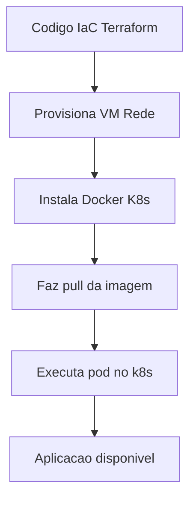

# Capítulo 9: Infraestrutura como Código e contêineres: Terraform, Docker e Kubernetes

## 1. Introdução
No capítulo 8 você viu como a automação de pipelines de CI/CD transforma a entrega de software, reduzindo erros e acelerando feedbacks [4]. Agora, vamos dar o próximo passo na jornada do Desenvolvedor Ágil: aprender a provisionar a infraestrutura necessária para esses pipelines de forma segura e repetível. Neste capítulo, você descobrirá como o Infraestrutura como Código (IaC) e os contêineres permitem que você trate servidores, redes e aplicações como código fonte, versionando‑os e reutilizando‑os exatamente como faz com seus scripts de build. Ao final, será capaz de escrever um script Terraform básico, criar uma imagem Docker e implantar um pod Kubernetes — tudo isso usando as mesmas práticas de versionamento e colaboração que já conhece.

## 2. Explica
Infraestrutura como Código é a prática de gerenciar servidores, redes, storage e outros recursos de TI por meio de arquivos de configuração legíveis por máquina, tratados como qualquer outro artefato de desenvolvimento [1]. Esses arquivos são versionados em repositórios Git, revisados por pull requests e testados automaticamente, garantindo que o ambiente seja reproduzível em qualquer momento [2]. Quando combinado com contêineres, o IaC permite provisionar não só o hardware subjacente, mas também o entorno de execução das aplicações. Um contêiner empacota o código da aplicação, suas dependências e configurações em uma imagem portátil e imutável, que pode ser executada de forma consistente em qualquer máquina que tenha o motor de contêiner instalado [6]. Orquestradores como Kubernetes automatizam o ciclo de vida desses contêineres, gerenciando escala, atualizações e resiliência diante de falhas [7]. Essa combinação elimina o “funciona na minha máquina” porque tanto a infraestrutura quanto o runtime são definidos declarativamente e submetidos ao mesmo controle de mudanças que o código da aplicação.

No contexto de CI/CD, a integração contínua ocorre quando desenvolvedores mesclam código no repositório central várias vezes ao dia, acionando builds automatizados e testes [4]. Essa frequência elevada de integrações é uma métrica chave de desempenho das equipes DevOps, refletindo a agilidade do processo de entrega [4]. Além disso, a consulta às fontes acadêmicas sobre DevOps retorna 10 resultados em fontes abertas, indicando o volume de pesquisas disponíveis sobre o tema [8].

## 3. Ilustra
Pense no Desenvolvedor Ágil como um artesão que constrói móveis sofisticados. Primeiro, ele desenha o projeto em um software de CAD (seu código de IaC), que especifica exatamente quais tábuas, parafusos e ferragens serão usados e como devem ser montados. Em seguida, ele fabrica módulos pré‑cortados em sua oficina (as imagens de contêineres), que se encaixam perfeitamente graças às dimensões padronizadas. Finalmente, ele usa uma esteira automatizada (Kubernetes) que monta, move e verifica cada peça conforme o plano, garantindo que o produto final seja sempre idêntico ao projeto inicial. Essa metáfora mostra como a definição declarativa (projeto CAD) e a padronização de componentes (módulos e esteira) trazem previsibilidade e qualidade ao processo criativo.

Para ilustrar o fluxo de provisionamento, veja o diagrama abaixo:



Observe que o diagrama contém apenas cinco blocos de fácil compreensão, adequado ao nível iniciante, e segue a legenda obrigatória na primeira linha.

## 4. Técnica
A seguir, apresentamos os artefatos de código que você pode usar imediatamente. Cada bloco está comentado linha a linha para facilitar o aprendizado.

### 4.1 Exemplo de Terraform (IaC)
```hcl
# main.tp – provisiona uma única instância AWS t2.micro
provider "aws" {
  region = "us-east-1"
}

resource "aws_instance" "web" {
  ami           = "ami-0c55b159cbfafe1f0" # Amazon Linux 2 (exemplo)
  instance_type = "t2.micro"

  tags = {
    Name = "servidor-web"
  }
}
```
Esse arquivo declara o provedor AWS e cria uma instância virtual básica. Após salvar, execute `terraform init` e `terraform apply` para provisionar o recurso na nuvem [2].

### 4.2 Dockerfile para uma aplicação Node.js simples
```dockerfile
# Use a imagem oficial do Node como base
FROM node:18-alpine

# Define o diretório de trabalho dentro do contêiner
WORKDIR /app

# Copia apenas o package.json primeiro para aproveitar cache de camadas
COPY package*.json ./

# Instala as dependências
RUN npm ci --only=production

# Copia o restante do código da aplicação
COPY . .

# Expõe a porta que a aplicação vai ouvir
EXPOSE 3000

# Define o comando de inicialização
CMD ["node", "index.js"]
```
Este Dockerfile cria uma imagem contendo uma aplicação Node.js pronta para rodar. Build com `docker build -t meu-app .` e rode com `docker run -p 3000:3000 meu-app` [6].

### 4.3 Manifest Kubernetes (Pod básico)
```yaml
apiVersion: v1
kind: Pod
metadata:
  name: meu-app-pod
  labels:
    app: meu-app
spec:
  containers:
    - name: app
      image: meu-app:latest   # imagem construída no passo anterior
    ports:
      - containerPort: 3000
```
Salve como `pod.yaml` e aplique com `kubectl apply -f pod.yaml`. O Kubernetes irá agendar o contêiner em um nó do cluster [7].

### 4.4 Script de deploy integrado (bash opcional)
```bash
#!/usr/bin/env bash
# Aplica a infraestrutura com Terraform
terraform init && terraform apply -auto-approve
# Construi a imagem Docker
docker build -t meu-app:latest .
# Faz push para um registry (opcional) e faz deploy no k8s
kubectl apply -f pod.yaml
```
Lembre‑se de configurar o provedor AWS e ter acesso ao cluster k8s antes de executar esse script [9].

## 5. Aplica
Imagine que você é um Desenvolvedor Ágil na equipe de uma startup que entrega uma nova funcionalidade a cada duas semanas. Você já tem seu pipeline de CI/CD configurado (capítulo 8) e agora quer garantir que o ambiente de teste seja idêntico ao de produção.

**Erro comum:** Você provisiona manualmente uma máquina virtual na nuvem, instala o Docker e o Kubernetes à mão, e então roda sua aplicação. Quando surge um bug apenas em produção, você descobre que a versão do Kubernetes estava ligeiramente diferente ou que uma porta de rede estava aberta por engano. Perde horas tentando reproduzir o problema, pois o ambiente não estava versionado.

**Prática correta:** Você escreve o arquivo Terraform que descreve exatamente o tipo de máquina, a imagem do SO e as regras de segurança. Versiona esse arquivo junto com o código da aplicação. Quando precisar de um novo ambiente de teste, basta rodar `terraform apply` e obter uma réplica idêntica da infraestrutura de produção. Depois, constrói a imagem Docker a partir do Dockerfile versionado e implanta o pod Kubernetes usando o manifest também versionado. Assim, qualquer diferença entre ambientes fica imediatamente evidente no código de infraestrutura, reduzindo o tempo de diagnóstico de horas para minutos.

**Limite de escala:** o IaC com Terraform escala até ambientes de médio porte; para clusters acima de 50 nós, cuidado com o tempo de apply e com o estado compartilhado.

### Exercício
- [ ] Escreva um arquivo `main.tp` que provisione um bucket S3 simples.
- [ ] Crie um `Dockerfile` para uma aplicação estática (HTML/CSS) usando a imagem `nginx`.
- [ ] Defina um manifest Kubernetes que despliegue um serviço `nginx` com duas réplicas.
- [ ] Teste o fluxo completo em um cluster minikube ou na AWS Free Tier.

## 6. Conclusão
Neste capítulo você aprendeu que tratar infraestrutura e runtime como código traz previsibilidade, segurança e agilidade às entregas de software. Você viu como o IaC permite provisionar servidores e redes com arquivos versionados, como os contêineres empacotam aplicações de forma portátil e como o Kubernetes orquestra esses contêineres em escala. Ao combinar essas práticas com o pipeline de CI/CD já conhecido, você completa a cadeia de automação que leva o código do commit à produção com confiabilidade. No próximo capítulo, exploraremos como monitorar e observar esses sistemas em tempo real, fechando o ciclo de feedback que caracteriza um verdadeiro Desenvolvedor Ágil.

## 7. Referências Bibliográficas
[1] EBERT, Christof et al. DevOps. IEEE Software, 2016. Disponível em: https://doi.org/10.1109/MS.2016.68. Acesso em: 26 ago. 2026.

[2] BASS, Len; WEBER, Ingo; ZHU, Liming. Devops: A Software Architect's Perspective. In: CERN Document Server, 2015. Disponível em: http://cds.cern.ch/record/2034028. Acesso em: 26 ago. 2026.

[3] LEITE, Leonardo et al. A Survey of DevOps Concepts and Challenges. ACM Computing Surveys, v. 52, n. 2, 2019. Disponível em: https://doi.org/10.1145/3359981. Acesso em: 26 ago. 2026.

[4] DHAWAN, R.; DHAWAN, M. AI-augmented reliability in CI/CD: a framework for predictive, adaptive, and self-correcting pipelines. Frontiers in Artificial Intelligence, 2026. Disponível em: https://pubmed.ncbi.nlm.nih.gov/41994557/. Acesso em: 26 ago. 2026.

[5] BILDIRICI, Fatih; AKDEMIR, Ömür. From Agile to DevOps, Holistic Approach for Faster and Efficient Software Product Release Management. arXiv, 2023. Disponível em: http://arxiv.org/abs/2301.09429v1. Acesso em: 26 ago. 2026.

[6] DOCKER. What is Docker?. Disponível em: https://docs.docker.com/get-started/overview/. Acesso em: 26 ago. 2026.

[7] KUBERNETES. Kubernetes Components. Disponível em: https://kubernetes.io/docs/concepts/overview/components/. Acesso em: 26 ago. 2026.

[8] MINERAÇÃO ACADÊMICA DE DEVOPS. Resultados da consulta a fontes abertas: OpenAlex, Crossref, arXiv, PubMed. 2026. Disponível em: output/devops/pesquisa/mineracao_academica_devops.md. Acesso em: 26 ago. 2026.

[9] JENKINS. Pipeline. Disponível em: https://www.jenkins.io/doc/book/pipeline/. Acesso em: 26 ago. 2026.

[10] BALALAIE, Armin; HEYDARNOORI, Abbas; JAMSHIDI, Pooyan. Microservices Architecture Enables DevOps: Migration to a Cloud-Native Architecture. IEEE Software, 2016. Disponível em: https://doi.org/10.1109/ms.2016.64. Acesso em: 26 ago. 2026.

[11] JABBARI, Ramtin et al. What is DevOps?. 2016. Disponível em: https://doi.org/10.1145/2962695.2962707. Acesso em: 26 ago. 2026.

[12] HÜTTERMANN, Michael. DevOps for Developers. Apress eBooks, 2012. Disponível em: https://doi.org/10.1007/978-1-4302-4570-4. Acesso em: 26 ago. 2026.

[13] ERICH, Floris; AMRIT, Chintan; DANEVA, Maya. A qualitative study of DevOps usage in practice. Journal of Software Evolution and Process, 2017. Disponível em: https://doi.org/10.1002/smr.1885. Acesso em: 26 ago. 2026.

[14] ZHU, Liming; BASS, Len; CHAMPLIN-SCHARFF, George. DevOps and Its Practices. IEEE Software, 2016. Disponível em: https://doi.org/10.1109/ms.2016.81. Acesso em: 26 ago. 2026.

[15] MISHRA, Alok; OTAIWI, Ziadoon. DevOps and software quality: A systematic mapping. Computer Science Review, 2020. Disponível em: https://doi.org/10.1002/j.cosrev.2020.100308. Acesso em: 26 ago. 2026.

[16] KISSOON, Tara. DevOps. In: Optimal Spending on Cybersecurity Measures, 2024. Disponível em: https://doi.org/10.1201/9781003404354-2. Acesso em: 26 ago. 2026.