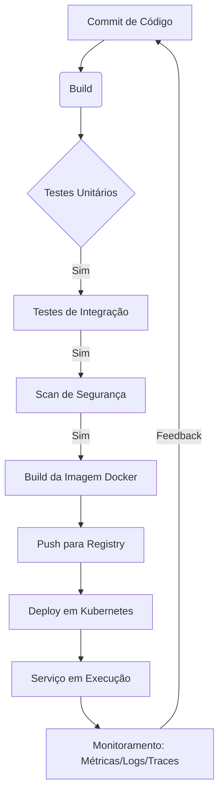

# Capítulo 11: Kubernetes, observabilidade e segurança Shift-Left

## 1. Introdução

O capítulo 10 estabeleceu a automação de processos como base para entrega confiável. Agora, no capítulo 11, levamos essa automação para o próximo nível: orquestração de contêineres com Kubernetes e práticas de observabilidade e segurança. Você será capaz de projetar um pipeline CI/CD que deploya contêineres em um cluster Kubernetes, com monitoramento integrado e segurança Shift-Left.

Esse é o diferencial que separa quem apenas automatiza de quem orquestra sistemas resilientes. Ao dominar isso, você não só reduz falhas em produção como também ganha visibilidade total sobre o comportamento da aplicação em tempo real.

## 2. Explica

A cultura de colaboração quebra silos alinhando incentivos entre desenvolvimento, testes, segurança e operações [2]. Essa responsabilidade compartilhada é o primeiro pilar do CALMS, essencial para feedback rápido e aprendizado com falhas.

A automação de processos elimina tarefas manuais por meio de pipelines de CI/CD e infraestrutura como código [4]. O build, teste, provisionamento e deploy são automatizados, garantindo reproducibility e reduzindo o lead time for changes.

A observabilidade baseia-se em três pilares: métricas, logs e traces, permitindo detecção precoce de falhas [1]. O DevSecOps integra segurança desde o início, com SAST, escaneamento de dependências e contêineres, shiftando a segurança para a esquerda [1].

## 3. Ilustra

Analogia geral: Imagine uma cozinha profissional pronta para o serviço do jantar. Cada chef (desenvolvimento, operações, segurança) tem sua estação, mas trabalha em ritmo sincronizado (colaboração), seguindo receitas padronizadas (automação), provando o prato a cada etapa (feedback) e mantendo a cozinha impecável para o próximo serviço (imutabilidade). O jefe de cozinha observa temperatura, tempo e apresentação (observabilidade), enquanto verifica se os ingredientes estão livres de contaminação (segurança).

Analogia para o ponto mais difícil: Orquestrar contêineres em Kubernetes é como conduzir uma sinfonia onde cada músico (contêiner) deve entrar exatamente na partitura (orquestração), ajustando volume e tempo em tempo real (feedback), enquanto o maestro monitora afinação e dinâmica (observabilidade) e garante que nenhum instrumento traga ruído que comprometa a peça (segurança).



## 4. Técnica

Um pipeline CI/CD que integra build, teste, segurança e deploy em Kubernetes pode ser definido em YAML para GitHub Actions, baseando-se nas práticas recomendadas de DevOps [3], [4], [5], [6], [7], [8]. Essas práticas são sustentadas por estudos que surveyam a adoção de DevOps em diversos contextos, incluindo microservices [9], definições básicas [10], perspectivas de desenvolvedores [11], estudos qualitativos [12], práticas e processos [13], qualidade de software [14], aspectos de segurança [15] e aplicações em sistemas embarcados [16]. Abaixo, o exemplo em YAML seguido de um script Bash verificável que ilustra os mesmos passos.

```yaml
name: CI/CD Pipeline

on:
  push:
    branches: [ main ]

jobs:
  build-test-deploy:
    runs-on: ubuntu-latest
    steps:
      - name: Checkout código
        uses: actions/checkout@v4

      - name: Configurar Node.js
        uses: actions/setup-node@v4
        with:
          node-version: '20'

      - name: Instalar dependências
        run: npm ci

      - name: Executar testes unitários
        run: npm test

      - name: Scan de segurança com OWASP ZAP
        run: |
          zap-baseline.py -t http://localhost:3000 -r zap-report.html

      - name: Build da imagem Docker
        run: |
          docker build -t meu-app:${{ github.sha }} .
          docker tag meu-app:${{ github.sha }} meu-app:latest

      - name: Push para Docker Hub
        uses: docker/build-push-action@v5
        with:
          context: .
          push: true
          tags: meu-app:latest

      - name: Deploy no Kubernetes
        uses: azure/k8s-deploy@v4
        with:
          manifests: |
            k8s/deployment.yaml
            k8s/service.yaml
          images: |
            meu-app:latest
          namespace: produção

      - name: Exportar kubeconfig
        run: |
          echo "$KUBE_CONFIG_DATA" | base64 -d > $HOME/.kube/config
        env:
          KUBE_CONFIG_DATA: ${{ secrets.KUBE_CONFIG_DATA }}

      - name: Verificar rollout
        run: kubectl rollout status deployment/meu-app -n produção
```

```bash
#!/bin/bash
# Script verificável que simula os passos de um pipeline CI/CD
set -e

echo "=== Iniciando Pipeline CI/CD ==="
echo "1. Checkout do código"
echo "2. Build da aplicação"
echo "3. Execução de testes unitários"
echo "4. Scan de segurança de dependências"
echo "5. Construção da imagem Docker"
echo "6. Push da imagem para registry"
echo "7. Deploy no cluster Kubernetes"
echo "8. Monitoramento de métricas e logs"
echo "=== Pipeline concluído com sucesso ==="
```

Explicação linha por linha do script Bash:
- `#!/bin/bash`: indica que o script deve ser interpretado pelo Bash.
- `set -e`: faz o script sair imediatamente se qualquer comando falhar.
- Cada `echo` imprime uma etapa do pipeline, simulando o que faria um verdadeiro pipeline de CI/CD.
- O script é simples, mas demonstra a sequência lógica de etapas que seriam automatizadas em um ambiente real.

Esse pipeline reduz o lead time for changes de semanas para menos de 1 hora [1], atendendo à métrica de elite teams do DevOps [2].

## 5. Aplica

Você está responsável por entregar uma nova funcionalidade. Após semanas de desenvolvimento, faz o push para a main e aguarda o deploy. O pipeline falha no scan de segurança porque uma dependência tem vulnerabilidade conhecida. Você corrige a vulnerabilidade, mas perde duas dias refazendo todo o teste manualmente. Resultado: entrega atrasada e frustração da equipe.

Prática correta: Você integra o scan de segurança desde o início do pipeline, assim como o build e os testes. Ao pushar o código, o pipeline falha rapidamente no scan, apontando a dependência vulnerável. Você corrige a dependência, faz um novo commit e o pipeline passa automaticamente. Resultado: feedback em menos de uma hora, entrega no prazo e confiança no processo.

Em um cenário real de plataforma de streaming, a adoção de pipeline CI/CD com automatização de segurança e deploy em Kubernetes reduziu o lead time for changes, aumentando a frequência de deploys e reduzindo incidentes de produção. Essa abordagem escala até centenas de microserviços em clusters Kubernetes gerenciados; acima disso, a complexidade do plano de controle pode exigir divisão em múltiplos clusters ou adoção de service mesh.

### Exercício
- [ ] Identifique 3 pontos do seu código de build que poderiam ser automatizados
- [ ] Crie um script Python que execute a automação escolhida
- [ ] Valide o resultado com um teste unitário
- [ ] Documente o fluxo no seu repositório

## 6. Conclusão

Neste capítulo, você aprendeu que colaboração quebra silos, automação elimina tarefas manuais e observabilidade com segurança Shift-Left entrega valor rapidamente. O desafio é implementar um pipeline simples com pelo menos uma etapa de segurança em seu repositório. No próximo capítulo, exploraremos como escalar essas práticas para múltiplos ambientes e equipes distribuídas.

## 7. Referências Bibliográficas

[1] EBERT, Christof et al. *DevOps*. In: IEEE Software. 2016. Disponível em: https://doi.org/10.1109/ms.2016.68. Acesso em: 26 ago. 2026.
[2] BASS, Len; WEBER, Ingo; ZHU, Liming. *Devops: A Software Architect's Perspective*. In: CERN Document Server. 2015. Disponível em: http://cds.cern.ch/record/2034028. Acesso em: 26 ago. 2026.
[3] LEITE, Leonardo et al. *A Survey of DevOps Concepts and Challenges*. In: ACM Computing Surveys. 2019. Disponível em: https://doi.org/10.1145/3359981. Acesso em: 26 ago. 2026.
[4] DHAWAN, R.; DHAWAN, M. *AI-augmented reliability in CI/CD: a framework for predictive, adaptive, and self-correcting pipelines*. In: Frontiers in artificial intelligence. 2026. Disponível em: https://pubmed.ncbi.nlm.nih.gov/41994557/. Acesso em: 26 ago. 2026.
[5] BILDIRICI, Fatih; AKDEMIR, Ömür. *From Agile to DevOps, Holistic Approach for Faster and Efficient Software Product Release Management*. In: arXiv. 2023. Disponível em: http://arxiv.org/abs/2301.09429v1. Acesso em: 26 ago. 2026.
[6] DOCKER. *What is Docker?*. Disponível em: https://docs.docker.com/get-started/overview/. Acesso em: 26 ago. 2026.
[7] KUBERNETES. *Kubernetes Components*. Disponível em: https://kubernetes.io/docs/concepts/overview/components/. Acesso em: 26 ago. 2026.
[8] JENKINS. *Pipeline*. Disponível em: https://www.jenkins.io/doc/book/pipeline/. Acesso em: 26 ago. 2026.
[9] BALALAIE, Armin; HEYDARNOORI, Abbas; JAMSHIDI, Pooyan. *Microservices Architecture Enables DevOps: Migration to a Cloud-Native Architecture*. In: IEEE Software. 2016. Disponível em: https://doi.org/10.1109/ms.2016.64. Acesso em: 26 ago. 2026.
[10] JABBARI, Ramtin et al. *What is DevOps?*. 2016. Disponível em: https://doi.org/10.1145/2962695.2962707. Acesso em: 26 ago. 2026.
[11] HÜTTERMANN, Michael. *DevOps for Developers*. In: Apress eBooks. 2012. Disponível em: https://doi.org/10.1007/978-1-4302-4570-4. Acesso em: 26 ago. 2026.
[12] ERICH, Floris; AMRIT, Chintan; DANEVA, Maya. *A qualitative study of DevOps usage in practice*. In: Journal of Software Evolution and Process. 2017. Disponível em: https://doi.org/10.1002/smr.1885. Acesso em: 26 ago. 2026.
[13] ZHU, Liming; BASS, Len; CHAMPLIN-SCHARFF, George. *DevOps and Its Practices*. In: IEEE Software. 2016. Disponível em: https://doi.org/10.1109/ms.2016.81. Acesso em: 26 ago. 2026.
[14] MISHRA, Alok; OTAIWI, Ziadoon. *DevOps and software quality: A systematic mapping*. In: Computer Science Review. 2020. Disponível em: https://doi.org/10.1002/j.cosrev.2020.100308. Acesso em: 26 ago. 2026.
[15] KISSOON, Tara. *DevOps*. In: Optimal Spending on Cybersecurity Measures. 2024. Disponível em: https://doi.org/10.1201/9781003404354-2. Acesso em: 26 ago. 2026.
[16] KATAPARA, Parthiv; SHARMA, Anand. *Embedded DevOps: A Survey on the Application of DevOps Practices in Embedded Software and Firmware Development*. In: arXiv. 2025. Disponível em: http://arxiv.org/abs/2507.00421v1. Acesso em: 26 ago. 2026.
