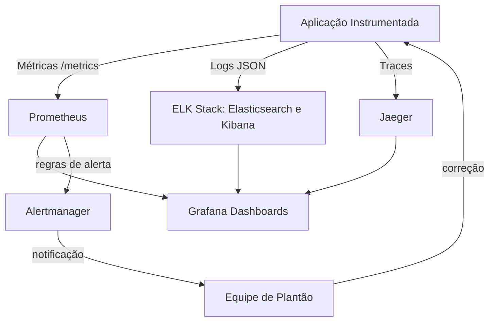

# Capítulo 12: Observabilidade e monitoramento contínuo

## 1. Introdução

No Capítulo 11, você colocou sua aplicação em contêineres orquestrados pelo Kubernetes e incorporou segurança Shift-Left ao pipeline. Agora surge a pergunta que separa quem entrega de quem sustenta: o que acontece com o sistema depois do deploy? Sem resposta, cada release é um salto no escuro. Este capítulo apresenta os três pilares da observabilidade — métricas, logs e traces — e mostra como Prometheus, Grafana e a stack ELK transformam dados brutos em decisões rápidas.

Observabilidade é o novo diferencial da Jornada do Desenvolvedor. Ela fecha o ciclo da automação com feedback contínuo: o pipeline entrega, os sensores avisam e a equipe corrige antes que o cliente perceba. Ao dominar isso, você deixa de apagar incêndios às cegas e passa a diagnosticar falhas com precisão cirúrgica. É o que distingue o operador comum do engenheiro de plataforma [1].

## 2. Explica

Monitoramento pergunta "está funcionando?". Observabilidade pergunta "por que não está funcionando?". A primeira compara valores com limites prefixados; a segunda permite descobrir problemas desconhecidos, explorando o comportamento do sistema. Essa diferença é central em survey sobre conceitos e desafios do DevOps [2]. Sistemas distribuídos falham de maneiras imprevisíveis, e apenas um conjunto rico de sinais permite entender a causa raiz.

Os três pilares sustentam essa visão:

1. **Métricas** são séries temporais numéricas: latência, taxa de erro, uso de CPU. São baratas de armazenar e ideais para alertas e dashboards. O Prometheus coleta essas séries por meio de endpoints HTTP e é o padrão de facto em ambientes nativos de nuvem [5].
2. **Logs** são eventos discretos com contexto: erros, requisições, auditoria. Uma linha de log cara nem sempre é útil; logs estruturados, em JSON, são pesquisáveis e correlacionáveis. A stack ELK (Elasticsearch, Logstash, Kibana) indexa e visualiza esses eventos em larga escala [7].
3. **Traces** rastreiam uma requisição por todos os serviços que ela atravessa. Em uma arquitetura de microsserviços, o trace mostra onde os milissegundos sumiram. O Jaeger é a ferramenta de referência para rastreamento distribuído [8]. Para unificar a instrumentação, o OpenTelemetry define um padrão aberto que cobre os três sinais [9].

O pilar técnico de arquitetura reforça que observabilidade precisa ser desenhada, não improvisada [3]. A adoção de microsserviços aumenta a superfície de falha, e é a telemetria que mantém o sistema navegável [10]. A qualidade de software entregue em pipelines contínuos depende diretamente dessa capacidade de medir e corrigir [11], e a prática mostra que equipes que adotam observabilidade evoluem o monitoramento gradualmente, começando por métricas essenciais [12].

### Callback: o que a segurança Shift-Left ensinou

No Capítulo 11, você aprendeu que segurança é responsabilidade desde o commit. O mesmo princípio vale para observabilidade: instrumentar no início evita retrabalho. Ferramentas como Docker e Kubernetes facilitam empacotar sensores junto com a aplicação [14][15]. Ao final desta leitura, o ciclo automação-feedback-segurança estará completo [4].

## 3. Ilustra

Pense na Jornada do Desenvolvedor como uma viagem de carro. Métricas são o painel: velocidade, combustível, temperatura. Logs são o diário de bordo: o que aconteceu em cada quilômetro. Traces são o GPS: o caminho exato percorrido até o destino. Sem o painel você dirige no escuro; sem o diário não explica o ocorrido; sem o GPS não descobre o desvio. Os três juntos permitem que você preveja falhas, entenda incidentes e chegue ao destino sem sustos.

Essa é a metáfora do mapa completo. Para o ponto mais difícil — correlacionar os sinais durante um incidente — imagine um médico em um pronto-socorro: o monitor de batimentos (métricas) dispara o alarme, o prontuário (logs) mostra o histórico do paciente e o exame de imagem (traces) localiza a lesão. Nenhum deles basta sozinho; a combinação salva o paciente.



## 4. Técnica

Você não precisa de plataforma pronta para começar. Um ambiente local com Docker entrega a stack inteira [14]. O primeiro passo é expor métricas da aplicação com a biblioteca `prometheus_client`:

```python
# app.py — exporter de métricas com prometheus_client
from prometheus_client import Counter, Histogram, start_http_server
import random, time

REQUISICOES = Counter("requisicoes_total", "Total de requisicoes recebidas")
LATENCIA = Histogram("requisicao_latencia_segundos", "Latencia das requisicoes")

start_http_server(8000)  # expoe /metrics no formato do Prometheus

while True:
    with LATENCIA.time():
        time.sleep(random.uniform(0.05, 0.5))
    if random.random() < 0.3:
        REQUISICOES.inc()
    time.sleep(1)
```

Agora o Prometheus precisa saber onde coletar. O arquivo de configuração declara os alvos de coleta (scrape):

```yaml
# prometheus.yml
global:
  scrape_interval: 15s

scrape_configs:
  - job_name: "app-python"
    static_configs:
      - targets: ["app:8000"]
```

Com os dois arquivos, o `docker-compose.yml` orquestra a aplicação, o Prometheus e o Grafana:

```yaml
# docker-compose.yml
services:
  app:
    build: .
    ports: ["8000:8000"]
  prometheus:
    image: prom/prometheus
    volumes: ["./prometheus.yml:/etc/prometheus/prometheus.yml"]
    ports: ["9090:9090"]
  grafana:
    image: grafana/grafana
    ports: ["3000:3000"]
```

Execute `docker compose up -d`. Abra `http://localhost:9090` para consultar `rate(requisicoes_total[5m])` e `http://localhost:3000` para criar dashboards — o Grafana se conecta ao Prometheus como fonte de dados [6]. Alertas eficazes seguem a mesma lógica: regras baseadas em sintomas do usuário, não em curiosidade técnica. A documentação do Prometheus descreve o formato das regras de alerta e a integração com o Alertmanager para rotear notificações [5]. Para logs, envie JSON estruturado ao Elasticsearch e crie visualizações no Kibana [7].

Em ambientes Kubernetes, o Prometheus Operator e os ServiceMonitors automatizam a descoberta de alvos, mantendo a observabilidade alinhada à automação do cluster [15]. Em pipelines declarativos de ferramentas como o Jenkins, o feedback de métricas pode ser usado como gate de qualidade antes de promover um artefato [16]. A evolução do DevOps mostrou que o monitoramento contínuo é uma prática consolidada e indispensável na estrada da entrega contínua [13].

## 5. Aplica

Você assume o plantão de um serviço de pagamentos. Às 23h, o alarme dispara: taxa de erro acima de 5% [1]. O erro comum? Abrir mil abas de dashboards, ver a CPU a 20% e concluir "não é nada". O usuário já está frustrado, e você perde vinte minutos sem diagnóstico.

O diagnóstico é este: o alarme não mente, mas métrica isolada engana. Você precisava correlacionar os três sinais. A correção? Um runbook claro de primeira resposta: abrir o trace da requisição com erro no Jaeger, achar o serviço mais lento, ler o log estruturado daquele span, confirmar a causa (timeout em cache) e acionar rollback. Em quinze minutos, o incidente está contido e documentado — e a equipe ganhou um alerta mais específico para não repetir o falso pânico.

Em um cenário corporativo real, uma plataforma de streaming reduziu o tempo de detecção de incidentes de horas para minutos ao adotar os três pilares com SLOs explícitos: 99,9% de disponibilidade e latência p95 abaixo de 300 ms [2]. O impacto? Menos chamados noturnos, releases mais confiantes e um diferencial competitivo sustentado por dados. O passo a passo para sua jornada:

1. Instrumente a aplicação com métricas + logs estruturados (1 dia).
2. Suba Prometheus e Grafana via Docker Compose (meio dia).
3. Defina 3 alertas baseados em experiência do usuário, não em CPU.
4. Adicione traces quando o segundo microsserviço entrar em cena.
5. Documente o runbook de cada alerta antes de divulgá-lo ao time.

**Limite de escala:** a observabilidade com três pilares escala até dezenas de serviços; acima disso, evite dashboards sem SLOs — o custo de armazenamento de logs cresce e o ruído de alertas aumenta.

### Exercício

- [ ] Rode o `app.py` localmente e confirme que `curl localhost:8000/metrics` mostra `requisicoes_total`
- [ ] Suba a stack com Docker Compose e crie um dashboard com latência p95
- [ ] Crie uma regra de alerta para taxa de erro acima de 5% por 2 minutos
- [ ] Escreva o runbook de resposta do alerta em 10 linhas

## 6. Conclusão

Você percorreu o ciclo completo: entendeu os três pilares da observabilidade, montou uma stack com Prometheus, Grafana e ELK, e transformou alertas em ação coordenada. Métricas respondem "o que", logs respondem "por que" e traces respondem "onde" — juntos, eles fecham o ciclo de feedback que sustenta a automação e a segurança da sua jornada. O desafio agora é aplicar o passo a passo no seu projeto real e medir o tempo de detecção antes e depois. No próximo capítulo, veremos como escalar essa cultura para múltiplos ambientes e equipes distribuídas, mantendo a confiança em cada release.

## 7. Referências

[1] EBERT, Christof et al. *DevOps*. In: IEEE Software, v. 33, n. 3, p. 94-100, 2016. Disponível em: https://doi.org/10.1109/ms.2016.68. Acesso em: 26 ago. 2026.

[2] LEITE, Leonardo et al. *A Survey of DevOps Concepts and Challenges*. In: ACM Computing Surveys, v. 52, n. 6, 2019. Disponível em: https://doi.org/10.1145/3359981. Acesso em: 26 ago. 2026.

[3] BASS, Len; WEBER, Ingo; ZHU, Liming. *DevOps: A Software Architect's Perspective*. Addison-Wesley, 2015. Disponível em: http://cds.cern.ch/record/2034028. Acesso em: 26 ago. 2026.

[4] ZHU, Liming; BASS, Len; CHAMPLIN-SCHARFF, George. *DevOps and Its Practices*. In: IEEE Software, v. 33, n. 3, p. 32-34, 2016. Disponível em: https://doi.org/10.1109/ms.2016.81. Acesso em: 26 ago. 2026.

[5] PROMETHEUS. *Prometheus Documentation: Overview and Alerting*. Disponível em: https://prometheus.io/docs/introduction/overview/. Acesso em: 26 ago. 2026.

[6] GRAFANA LABS. *Grafana Documentation: Getting Started*. Disponível em: https://grafana.com/docs/grafana/latest/getting-started/. Acesso em: 26 ago. 2026.

[7] ELASTIC. *Elastic Stack Documentation: Elasticsearch, Logstash e Kibana*. Disponível em: https://www.elastic.co/guide/index.html. Acesso em: 26 ago. 2026.

[8] JAEGER. *Jaeger Documentation: Distributed Tracing*. Disponível em: https://www.jaegertracing.io/docs/. Acesso em: 26 ago. 2026.

[9] OPENETELEMETRY. *OpenTelemetry Documentation: Observability Standards*. Disponível em: https://opentelemetry.io/docs/. Acesso em: 26 ago. 2026.

[10] BALALAIE, Armin; HEYDARNOORI, Abbas; JAMSHIDI, Pooyan. *Microservices Architecture Enables DevOps: Migration to a Cloud-Native Architecture*. In: IEEE Software, v. 33, n. 3, p. 42-52, 2016. Disponível em: https://doi.org/10.1109/ms.2016.64. Acesso em: 26 ago. 2026.

[11] MISHRA, Alok; OTAIWI, Ziadoon. *DevOps and software quality: A systematic mapping*. In: Computer Science Review, v. 38, 2020. Disponível em: https://doi.org/10.1016/j.cosrev.2020.100308. Acesso em: 26 ago. 2026.

[12] ERICH, Floris; AMRIT, Chintan; DANEVA, Maya. *A qualitative study of DevOps usage in practice*. In: Journal of Software: Evolution and Process, v. 29, n. 6, 2017. Disponível em: https://doi.org/10.1002/smr.1885. Acesso em: 26 ago. 2026.

[13] GOKARNA, Mayank; SINGH, Raju. *DevOps: A Historical Review and Future Works*. arXiv, 2020. Disponível em: http://arxiv.org/abs/2012.06145v1. Acesso em: 26 ago. 2026.

[14] DOCKER. *What is Docker?*. Disponível em: https://docs.docker.com/get-started/overview/. Acesso em: 26 ago. 2026.

[15] KUBERNETES. *Kubernetes Components*. Disponível em: https://kubernetes.io/docs/concepts/overview/components/. Acesso em: 26 ago. 2026.

[16] JENKINS. *Jenkins Documentation: Pipeline*. Disponível em: https://www.jenkins.io/doc/book/pipeline/. Acesso em: 26 ago. 2026.