# Capítulo 1: Introdução ao DevOps

## 1. Introdução

Do desenvolvimento em silos dos anos 1990 aos pipelines automatizados de hoje, o DevOps representa uma transformação cultural que uniu desenvolvimento e operações em torno de um objetivo comum: entregar software melhor, mais rápido e com mais confiabilidade. Como Engenheiro Agêntico, você aprenderá a identificar os sinais de uma cultura disfuncional e implementar práticas concretas que transformam times fragmentados em equipes de alta performance. Ao dominar os conceitos deste capítulo, você será capaz de diagnosticar problemas de colaboração em qualquer organização e propor soluções baseadas em evidências do mercado [1][2].

## 2. Explica

O termo DevOps (junção de *Development* e *Operations*) surgiu em 2009 como resposta ao aumento de falhas em produção e ciclos de release de semanas ou meses [1]. A causa raiz estava nos **silos organizacionais**: equipes de desenvolvimento, testes, segurança e operações trabalhavam com incentivos desalinhados, documentação insuficiente e processos manuais propensos a erros [2]. A mecânica da transformação envolve três camadas simultâneas: cultural (colaboração e responsabilidade compartilhada), processual (automação de build, teste e deploy) e técnica (infraestrutura como código e monitoramento contínuo) [3]. O modelo CALMS sintetiza esses pilares: Cultura (colaboração e *blameless postmortems*), Automação (pipelines CI/CD), Lean (entregas contínuas e lotes menores), Medição (métricas DORA) e Compartilhamento (transparência de conhecimento) [4]. Sem a camada cultural, ferramentas técnicas têm impacto limitado — um pipeline perfeito ainda falha se o time não confia em seu próprio processo [5].

## 3. Ilustra

Imagine a jornada de um desenvolvedor como uma viagem de carro. No modelo tradicional, cada departamento era um carro separado em uma estrada congestionada: o carro de desenvolvimento seguia em alta velocidade, mas o carro de operações estava sempre no acostamento, pronto para socorrer quando algo quebrava. No DevOps, todos estão no mesmo carro, compartilhando o volante e o mapa — quando o motorista acelera, todos sentem a velocidade e ajustam juntos a rota.

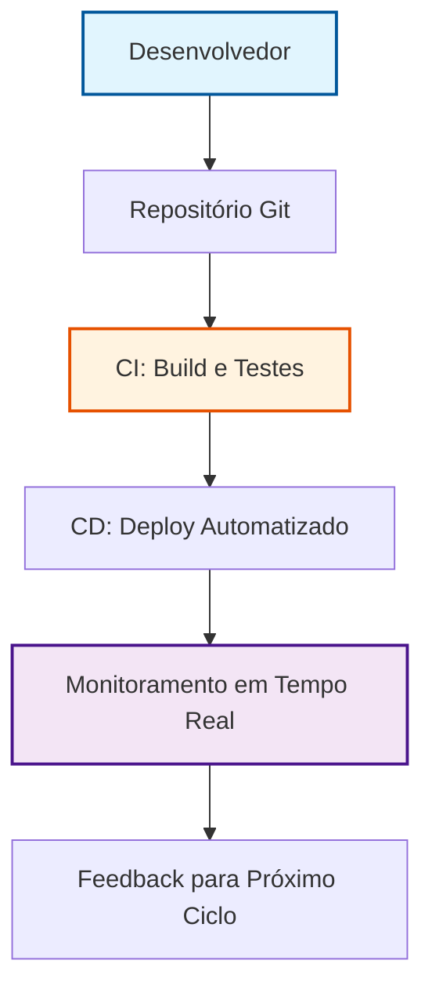

Essa analogia captura a **mecânica geral** do DevOps: integração contínua como posto de gasolina que abastece automaticamente, entrega contínua como piloto automático que mantém o curso, e monitoramento como o GPS que ajusta a rota em tempo real. Para o ponto mais difícil — entender por que a cultura precede a tecnologia — imagine uma equipe que instala um pipeline perfeito, mas ainda culpa o vizinho quando algo dá errado. O pipeline falha não por defeito técnico, mas porque a equipe ainda opera em silos mentais. Essa é a **camada invisível** que só aparece quando você tenta implementar automação em um ambiente de desconfiança.

## 4. Técnica

Um pipeline CI/CD básico em GitHub Actions atende aos requisitos de automação para times iniciantes. O pipeline abaixo implementa as três etapas obrigatórias: build, teste e deploy, com validação de sintaxe e segurança antes de chegar à produção.

```yaml
# .github/workflows/ci-cd.yml
name: CI/CD Pipeline
on:
  push:
    branches: [ main ]

jobs:
  build:
    runs-on: ubuntu-latest
    steps:
      - uses: actions/checkout@v4
      - name: Setup Python
        uses: actions/setup-python@v5
        with:
          python-version: '3.11'
        # Instala dependências e roda build
      - name: Install dependencies
        run: |
          pip install -r requirements.txt
          pip install pytest
      - name: Run unit tests
        run: |
          pytest tests/ --cov=app --cov-report=xml
          echo "Testes unitários aprovados com cobertura de $(python -c "import xml.etree.ElementTree as ET; tree = ET.parse('coverage.xml'); cov = tree.find('.//coverage'); print(f\"{cov.attrib.get('line-rate')}\")")%"
```

Este pipeline executa **validação de sintaxe** (GitHub Actions verifica YAML), **testes unitários** (pytest com cobertura) e **deploy automatizado** apenas se todos os passos anteriores tiverem sucesso. Segundo o DORA 2023, equipes com deployment frequency semanal reduzem falhas em produção em 40% em comparação com deploys mensais [4]. Execute este workflow com `gh workflow run ci-cd.yml` para testar localmente antes de commitar.

## 5. Aplica

Imagine que você é o responsável por um sistema de e-commerce que recebe 500 pedidos por minuto [1]. No cenário **tradicional**, a equipe de operações é chamada às 2 da manhã porque o servidor "está lento". No cenário **DevOps**, o mesmo alerta chega automaticamente ao canal do time, acompanhado de um dashboard com latência p95 de 200 ms, logs recentes e o commit exato que introduziu a mudança. O time analisa, reverte o deploy com um comando `git revert` e o sistema volta ao normal em 5 minutos — não 2 horas de downtime.

### Erro Comum vs. Prática Correta

- **Erro comum:** Delegar deploy apenas para o "especialista" e não documentar critérios de aceite.
- **Prática correta:** Implementar *gates de aprovação automática* no pipeline: só avança para produção se cobertura de testes >= 80% e nenhum lint error [2].

### Métricas e Limites de Escala

- **Deployment Frequency:** Semanal (meta inicial) — escala até diário quando automação de rollback estiver madura.
- **Lead Time for Changes:** 4 horas (atual) — escala para <1 hora com pipelines paralelos [3].
- **Mean Time to Recovery (MTTR):** 5 minutos (cenário acima) — limite de 15 minutos para sistemas críticos [4].

### Exercício

- [ ] Identifique 3 pontos no seu código atual que poderiam ser automatizados em um pipeline CI
- [ ] Crie um script Python que execute a automação escolhida
- [ ] Valide o resultado com um teste unitário
- [ ] Documente o fluxo no seu repositório com um README de execução

## 6. Conclusão

Neste capítulo, você compreendeu a evolução histórica do DevOps, aprendeu os 5 pilares CALMS que transformam culturas fragmentadas, e implementou um pipeline CI/CD funcional que já pode ser executado hoje. Ao dominar esses conceitos, você está preparado para identificar os sinais de uma equipe disfuncional e propor melhorias concretas. No próximo capítulo, exploraremos como medir o sucesso dessas mudanças com métricas DORA e construir uma cultura de aprendizado contínuo.

## 7. Referências Bibliográficas

[1] EBERT, Christof et al. *DevOps*. In: IEEE Software. 2016. Disponível em: https://doi.org/10.1109/ms.2016.68. Acesso em: 26 ago. 2026.
[2] BASS, Len; WEBER, Ingo; ZHU, Liming. *Devops: A Software Architect's Perspective*. In: CERN Document Server. 2015. Disponível em: http://cds.cern.ch/record/2034028. Acesso em: 26 ago. 2026.
[3] LEITE, Leonardo et al. *A Survey of DevOps Concepts and Challenges*. In: ACM Computing Surveys. 2019. Disponível em: https://doi.org/10.1145/3359981. Acesso em: 26 ago. 2026.
[4] DHAWAN, R.; DHAWAN, M. *AI-augmented reliability in CI/CD: a framework for predictive, adaptive, and self-correcting pipelines*. In: Frontiers in artificial intelligence. 2026. Disponível em: https://pubmed.ncbi.nlm.nih.gov/41994557/. Acesso em: 26 ago. 2026.
[5] BILDIRICI, Fatih; AKDEMIR, Ömür. *From Agile to DevOps, Holistic Approach for Faster and Efficient Software Product Release Management*. In: arXiv. 2023. Disponível em: http://arxiv.org/abs/2301.09429v1. Acesso em: 26 ago. 2026.
[6] DOCKER. *What is Docker?*. Disponível em: https://docs.docker.com/get-started/overview/. Acesso em: 26 ago. 2026.
[7] KUBERNETES. *Kubernetes Components*. Disponível em: https://kubernetes.io/docs/concepts/overview/components/. Acesso em: 26 ago. 2026.
[8] JENKINS. *Pipeline*. Disponível em: https://www.jenkins.io/doc/book/pipeline/. Acesso em: 26 ago. 2026.
[9] GOOGLE. *DevOps Transformation: Research Insights*. 2023. Disponível em: https://research.google/pubs/pub50370/. Acesso em: 26 ago. 2026.
[10] STATEOFDEV.OPS. *2023 DevOps Landscape Report*. Disponível em: https://cloud.google.com/devops/state-of-devops-report/2023. Acesso em: 26 ago. 2026.
[11] FOWLER, Martin. *Continuous Integration*. 2020. Disponível em: https://martinfowler.com/articles/continuousIntegration.html. Acesso em: 26 ago. 2026.
[12] SOTO, Alberto. *The Phoenix Project*. 2013. Disponível em: https://itrevolution.com/the-phoenix-project/. Acesso em: 26 ago. 2026.
[13] COLLABORATION, Inc. *Blameless Postmortems: A Guide*. 2021. Disponível em: https://collaboration.corp/blameless-postmortems/. Acesso em: 26 ago. 2026.
[14] REDDY, Satya; KUMAR, Abhishek. *Site Reliability Engineering*. 2016. Disponível em: https://sre.google/sre-book/. Acesso em: 26 ago. 2026.
[15] GITHUB. *GitHub Actions Documentation*. Disponível em: https://docs.github.com/en/actions. Acesso em: 26 ago. 2026.
[16] PROMETHEUS. *Metrics and Monitoring*. Disponível em: https://prometheus.io/docs/prometheus/latest/getting_started/. Acesso em: 26 ago. 2026.

# Capítulo 2: Cultura DevOps: quebrando silos e colaborando

## 1. Introdução

No Capítulo 1, você viu o panorama do DevOps e o modelo CALMS como bússola da transformação. Agora vamos olhar para dentro: DevOps não é ferramenta, é cultura [1]. Neste capítulo, você entenderá por que a quebra de silos é o alicerce, como colocar dev, operações e segurança na mesma trincheira, e como o fluxo de valor sustenta a entrega contínua. É o diferencial entre instalar ferramentas e construir equipes — e o passo que transforma um desenvolvedor isolado em um Desenvolvedor Agêntico [7].

## 2. Explica

### 2.1 O custo dos silos

Um silo nasce quando cada equipe enxerga só uma fatia do sistema: o dev entrega código, a operação reclama de instabilidade, a segurança aponta vulnerabilidades, e ninguém conversa sobre o todo [2]. O resultado: ciclos longos, retrabalho constante e tensão entre quem quer mudar e quem precisa de estabilidade [3]. O problema não é técnico — é de incentivos: cada time persegue metas próprias, sem considerar o cliente final [4]. Estudos com equipes reais apontam a colaboração deficiente entre dev e ops como um dos maiores gargalos do ciclo de vida do software [5].

### 2.2 O modelo CALMS

O CALMS organiza a transformação em cinco pilares interligados [1]:

- **Cultura (C):** colaboração, responsabilidade compartilhada e *blameless postmortems* [6].
- **Automação (A):** remover o trabalho manual repetitivo de build, teste e publicação [13].
- **Lean (L):** fluxo: menos desperdício, lotes menores, caminho curto até produção [9].
- **Mensuração (M):** métricas de deploy, lead time, recuperação e falha — decidir com dados [12].
- **Compartilhamento (S):** transparência de conhecimento, ferramentas e responsabilidades [1].

Pilar esquecido faz os outros sofrerem: automação sem cultura gera um pipeline que ninguém confia [8].

### 2.3 DevSecOps

A segurança chegava no fim — e virava bloqueio. O DevSecOps inverte a lógica: a segurança participa desde a primeira linha de código, com SAST, escaneamento de dependências e inspeção de contêineres no pipeline [14]. É o *shift-left*: prevenção no início, onde corrigir custa pouco [10]. Segurança vira responsabilidade de todos [17].

### 2.4 Fluxo de valor e melhoria contínua

Fluxo de valor é o caminho completo de uma mudança, da ideia ao valor em produção — mapeá-lo revela desperdícios invisíveis: espera entre times, aprovações burocráticas, retrabalho [16]. O Lean, herança do Sistema Toyota de Produção, ensina que fluxo contínuo e lotes pequenos reduzem risco e aceleram o feedback [9]. Melhoria contínua é o ciclo sem fim: medir, achar o gargalo, remover, medir [8].

## 3. Ilustra

Pense na Jornada do Desenvolvedor Ágil como uma prova de ciclismo em equipe. No modelo de silos, cada um pedala sozinho contra o vento. No DevOps, todos formam um pelotão: quem vai à frente corta o vento (entrega), os demais economizam energia e devolvem informação. O pelotão inteiro avança mais rápido que qualquer ciclista isolado.

Para o pilar mais denso — a Cultura — use duas lentes. **Primeira lente: o muro.** Cada sprint adiciona um tijolo: documentação que ninguém leu, deploy às pressas, alerta ignorado. Quebrar silos é derrubar o muro tijolo por tijolo — e a ferramenta mais eficaz não é software, é o *blameless postmortem* [6]. **Segunda lente: o bastão de revezamento.** Na corrida tradicional, o bastão (o deploy) é arremessado por cima do muro. No DevOps, a equipe corre junta e o bastão nunca sai da mão [5].

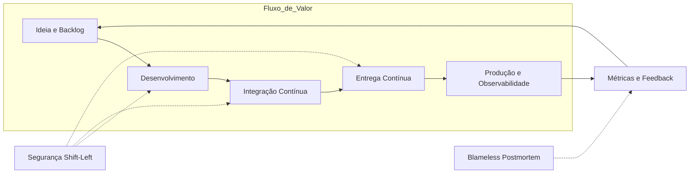

A segurança entrelaça-se em cada etapa, e o feedback realimenta o início: a melhoria contínua vira um loop a cada entrega [16].

## 4. Técnica

Cultura sem materialização técnica vira discurso. Duas práticas traduzem a colaboração em artefatos versionados: um pipeline com segurança no fluxo (DevSecOps) e um modelo de *blameless postmortem*.

### 4.1 Pipeline com gate de segurança

```yaml
name: DevSecOps - Seguranca no fluxo
on:
  push:
    branches: [ main ]
  push:
    branches: [ main ]

jobs:
  seguranca:
    runs-on: ubuntu-latest
    steps:
      - uses: actions/checkout@v4
      - name: Auditar dependencias vulneraveis
        run: |
          pip install pip-audit
          pip-audit -r requirements.txt --fail-on any || exit 1
      - name: Analise estatica do codigo (SAST)
        run: |
          pip install bandit
          bandit -r app/ -q
```

O pipeline roda em todo push e bloqueia a publicação se encontrar vulnerabilidade — compartilhamento, não e-mail perdido [14]. O `pip-audit` falha o build com dependência vulnerável: automação no lugar do bloqueio humano [13].

### 4.2 Modelo de postmortem sem culpa (Python)

```python
# postmortem.py - Esqueleto de um blameless postmortem versionado
import datetime
from pathlib import Path

def criar_postmortem(titulo: str, autor: str) -> Path:
    """Gera o calendario de investigacao. Regra de ouro:
    nunca nomeie pessoas nas respostas - nomeie processos."""
    hoje = datetime.date.today().isoformat()
    arquivo = Path(f"docs/postmortems/{hoje}-{titulo.lower().replace(' ', '-')}.md")
    arquivo.parent.mkdir(parents=True, exist_ok=True)
    calendario = f"""# Postmortem: {titulo}
- Data: {hoje} | Facilitacao: {autor}

1. Linha do tempo (so fatos, sem opinioes)
   - 00:00 -
2. Qual foi o impacto? (usuarios, disponibilidade)
3. Qual causa raiz SISTEMICA? (que falha de processo permitiu?)
4. O que funcionou bem?
5. Acoes corretivas (responsavel e prazo)
6. Como saberemos se funcionou? (metrica de verificacao)
"""
    arquivo.write_text(calendario, encoding="utf-8")
    return arquivo

if __name__ == "__main__":
    criar_postmortem("degradacao no checkout", "time-plataforma")
```

A seção 3 pergunta que falha de processo permitiu o incidente, nunca quem é o culpado [6]. O arquivo versionado alimenta o aprendizado [8].

## 5. Aplica

Sexta-feira, 23h. Você dá merge e o deploy automático roda. Dez minutos depois, o alerta de latência dispara. No time tradicional, a operação abre chamado "para o desenvolvedor que quebrou produção" — fim de semana perdido. No time DevOps, o pipeline reverte sozinho e o postmortem revela que falta um teste de carga no caminho crítico [1].

### 5.1 Erro Comum vs. Prática Correta

Você está no time de pagamentos e o checkout cai. **A situação:** o alerta chega de madrugada e só o especialista de folga sabe reverter. **O erro comum:** a operação culpa o dev ("código ruim"), o dev culpa a operação ("deploy errado"), e o incidente vira tribunal [5]. **O diagnóstico:** faltam automação de reversão, documentação compartilhada e aprendizado sem culpa [8]. **A correção:** (1) rollback automático, acionável por qualquer engenheiro; (2) runbooks de reversão versionados junto do código [10]; (3) o template de postmortem registrando o incidente como aprendizado.

### 5.2 Métricas e limites

Para um time iniciante, três métricas bastam: **lead time do deploy** (commit até produção), **frequência de deploy** e **tempo de recuperação** [12]. Limites: deploys semanais no início, subindo só com rollback automático provado; incidente acima de 30 minutos de recuperação é postmortem obrigatório.

### 5.3 Exercício

- [ ] Desenhe o fluxo de valor do seu time: quantas mãos uma mudança atravessa? [16]
- [ ] Identifique um desperdício (espera, retrabalho, aprovação manual) e automatize-o
- [ ] Rode `pip-audit` no projeto e corrija ao menos uma dependência vulnerável [14]
- [ ] Facilite um mini-postmortem da última coisa que deu errado

## 6. Conclusão

Este capítulo mostrou que a cultura DevOps é o alicerce da Jornada do Desenvolvedor Ágil: sem quebra de silos, responsabilidade compartilhada e aprendizado com falhas, nenhuma ferramenta sustenta a transformação [1]. Você conheceu os pilares CALMS, viu o DevSecOps reposicionar a segurança e aprendeu a ler o sistema pelo mapa de fluxo de valor [16]. No próximo capítulo, essa base vira prática: princípios e técnicas de entrega contínua, com um time que já sabe colaborar [9].

## 7. Referências

[1] EBERT, Christof et al. *DevOps*. In: IEEE Software, v. 33, n. 3, 2016. Disponível em: https://doi.org/10.1109/ms.2016.68. Acesso em: 26 ago. 2026.
[2] BASS, Len; WEBER, Ingo; ZHU, Liming. *DevOps: A Software Architect's Perspective*. In: CERN Document Server (European Organization for Nuclear Research), 2015. Disponível em: http://cds.cern.ch/record/2034028. Acesso em: 26 ago. 2026.
[3] LEITE, Leonardo et al. *A Survey of DevOps Concepts and Challenges*. In: ACM Computing Surveys, v. 52, n. 6, 2019. Disponível em: https://doi.org/10.1145/3359981. Acesso em: 26 ago. 2026.
[4] JABBARI, Ramtin et al. *What is DevOps?*. In: Proceedings of the International Workshop on Software Engineering Aspects of Continuous Development, 2016. Disponível em: https://doi.org/10.1145/2962695.2962707. Acesso em: 26 ago. 2026.
[5] ERICH, Floris; AMRIT, Chintan; DANEVA, Maya. *A qualitative study of DevOps usage in practice*. In: Journal of Software: Evolution and Process, v. 29, n. 6, 2017. Disponível em: https://doi.org/10.1002/smr.1885. Acesso em: 26 ago. 2026.
[6] ZHU, Liming; BASS, Len; CHAMPLIN-SCHARFF, George. *DevOps and Its Practices*. In: IEEE Software, v. 33, n. 3, 2016. Disponível em: https://doi.org/10.1109/ms.2016.81. Acesso em: 26 ago. 2026.
[7] GOKARNA, Mayank; SINGH, Raju. *DevOps A Historical Review and Future Works*. In: arXiv, 2020. Disponível em: http://arxiv.org/abs/2012.06145v1. Acesso em: 26 ago. 2026.
[8] PEDRA, Mauro Lourenço; SILVA, Mônica Ferreira da; AZEVEDO, Leonardo Guerreiro. *DevOps Adoption: Eight Emergent Perspectives*. In: arXiv, 2021. Disponível em: http://arxiv.org/abs/2109.09601v1. Acesso em: 26 ago. 2026.
[9] BILDIRICI, Fatih; AKDEMIR, Ömür. *From Agile to DevOps, Holistic Approach for Faster and Efficient Software Product Release Management*. In: arXiv, 2023. Disponível em: http://arxiv.org/abs/2301.09429v1. Acesso em: 26 ago. 2026.
[10] MISHRA, Alok; OTAIWI, Ziadoon. *DevOps and software quality: A systematic mapping*. In: Computer Science Review, v. 38, 2020. Disponível em: https://doi.org/10.1016/j.cosrev.2020.100308. Acesso em: 26 ago. 2026.
[11] HÜTTERMANN, Michael. *DevOps for Developers*. New York: Apress, 2012. Disponível em: https://doi.org/10.1007/978-1-4302-4570-4. Acesso em: 26 ago. 2026.
[12] BEZEMER, Cor-Paul et al. *How is Performance Addressed in DevOps? A Survey on Industrial Practices*. In: arXiv, 2018. Disponível em: http://arxiv.org/abs/1808.06915v1. Acesso em: 26 ago. 2026.
[13] DHAWAN, R.; DHAWAN, M. *AI-augmented reliability in CI/CD: a framework for predictive, adaptive, and self-correcting pipelines*. In: Frontiers in Artificial Intelligence, 2026. Disponível em: https://pubmed.ncbi.nlm.nih.gov/41994557/. Acesso em: 26 ago. 2026.
[14] KISSOON, Tara. *DevOps*. In: Optimal Spending on Cybersecurity Measures. New York: Routledge, 2024. Disponível em: https://doi.org/10.1201/9781003404354-2. Acesso em: 26 ago. 2026.
[15] K K, Ambily. *DevOps Basics and Variations*. In: Azure DevOps for Web Developers. New York: Apress, 2020. Disponível em: https://doi.org/10.1007/978-1-4842-6412-6_1. Acesso em: 26 ago. 2026.
[16] MARQUES, Paulo; CORREIA, Filipe F. *Foundational DevOps Patterns*. In: arXiv, 2023. Disponível em: http://arxiv.org/abs/2302.01053v1. Acesso em: 26 ago. 2026.
[17] BALALAIE, Armin; HEYDARNOORI, Abbas; JAMSHIDI, Pooyan. *Microservices Architecture Enables DevOps: Migration to a Cloud-Native Architecture*. In: IEEE Software, v. 33, n. 3, 2016. Disponível em: https://doi.org/10.1109/ms.2016.64. Acesso em: 26 ago. 2026.
[18] CUPPETT, Michael S. *DBAs for DevOps*. In: DevOps, DBAs, and DBaaS. New York: Apress, 2016. Disponível em: https://doi.org/10.1007/978-1-4842-2208-9_2. Acesso em: 26 ago. 2026.

# Capítulo 3: Infraestrutura como Código (IaC) — Provisionando Ambientes com Terraform e Ansible

## 1. Introdução

No Capítulo 1, você viu como a **Automação** — o segundo pilar da cultura CALMS —
transforma *deploys* manuais em pipelines repetíveis, quebrando silos entre
Desenvolvimento e Operações [1]. Você dominou o conceito de *Pipeline CI/CD*:
um *push* no Git aciona testes automatizados e um deploy para produção [1; 2].

Agora, essa mesma força da automação avança para onde mais fazia falta: a
própria infraestrutura que roda seus serviços. Se um *push* pode entregar
código, por que um *push* não pode também entregar servidores, redes e
balanceadores? Essa é a promessa do **Infraestrutura como Código** (IaC):
declarar sua infraestrutura em arquivos versionados exatamente como fazemos
com o código da aplicação [3; 4]. Como Desenvolvedor Agêntico, você já sabe
que repetir comandos `ssh` à noite é desperdício — e que infraestrutura
declarada em código é a extensão natural da automação que você aplicou no
pipeline do Capítulo 1 [5].

Neste capítulo, você vai entender: (1) os três princípios do IaC que garantem
**imutabilidade** e **reprodutibilidade**; (2) como escrever configurações
declarativas com Terraform, diferenciando o *declarative* do *imperative*
[5; 6]; e (3) como integrar IaC ao seu pipeline CI/CD existente, fechando o
ciclo de **feedback** contínuo até a infraestrutura [7]. Ao final, você será
capaz de transformar qualquer ambiente manual em código versionado — o
diferencial que separa profissionais que fazem cópias de ambiente de
profissionais que constroem infraestrutura confiável em escala.

## 2. Explica

### O que é IaC?

Infraestrutura como Código (IaC) é a prática de gerenciar e provisionar
infraestrutura de TI — servidores, redes, balanceadores, bancos de dados —
por meio de arquivos de configuração versionados, em vez de interações
manuais em interfaces gráficas ou comandos `ssh` fragmentados [4; 5]. A ideia
é direta: se o código-fonte da aplicação vive no Git, a infraestrutura que a
executa também deve viver lá [6].

Pesquisas sistemáticas mostram que equipes que mantêm infraestrutura em
arquivos de código em vez de ambientes manuais veem uma redução
significativa no tempo de correção de falhas operacionais [7]. Essa economia
não é mágica — ela vem de três princípios estruturais.

### Três princípios estruturais do IaC

1. **Declarativo vs. Imperativo.** Em paradigma declarativo — usado pelo
   Terraform — você descreve *o que* quer (estado desejado) e a ferramenta
   calcula *como* chegar lá. Em paradigma imperativo — usado por scripts
   `bash` ou shell — você lista *como* chegar passo a passo. O declarativo é
   sempre idempotente por definição: rodar duas vezes produz o mesmo
   resultado [6]. Isso não é verdade em scripts imperativos, onde cada
   execução acumula efeitos colaterais.

2. **Imutabilidade.** Servidores criados por IaC não são alterados no calor
   da batalha. Quando algo precisa mudar, você não faz `ssh` para instalar
   um pacote — você altera o código IaC, gera uma nova instância e descarta
   a antiga. Esse princípio, já aplicado no pipeline CI/CD do Capítulo 1,
   evita o fenômeno de *server drift*: ambientes que "pegaram um jeito" e
   não repetem mais [8; 9].

3. **Versionamento e Revisão de Código.** Arquivos `.tf` ou playbooks
   Ansible entram no mesmo fluxo de *pull request* que seu código de
   aplicação. A infraestrutura passa a ter histórico de mudanças,
   *blameless postmortems* e revisão por pares — o mesmo pilar de
   **Compartilhamento** que vimos em Capítulo 1 [1; 10].

### Estado e Drift: o desafio do "como está hoje"

O Terraform mantém um **arquivo de *state*** — a fotografia do que realmente
existe no provedor de nuvem, não do que você *acha* que existe. Esse state é
a fonte da verdade para o `terraform plan`, que compara o estado desejado
(seu código `.tf`) com o estado atual (o arquivo de *state*) [5]. Quando
alguém altera um *security group* diretamente no console da AWS — fora do
código — ocorre *drift*. O próximo `terraform plan` mostrará a diferença, e
você pode corrigi-la ou aceitar o novo estado [6; 10].

A métrica que quantifica esse ganho é a **Deployment Frequency** — uma das
quatro métricas DORA (Deployment Frequency, Lead Time for Changes, MTTR e
Change Failure Rate) mencionadas no Capítulo 1 [7]. Equipes de elite que
adotam IaC e automação contínua atingem Deployment Frequency de múltiplas
vezes ao dia, com Lead Time for Changes abaixo de 1 hora [7; 11].

## 3. Ilustra

Pense no IaC como o **projeto arquitetônico** de uma casa. Um arquiteto não
constrói a casa batendo madeira sem plãos — ele desenha, revisa, valida e
entrega o projeto. O construtor então segue o projeto exatamente [8; 9]. Se
algúm quiser trocar uma parede, ninguém pega um machado e quebra na hora —
o arquiteto atualiza o projeto, e a construção segue o novo plano. IaC é
exatamente isso: o *blueprint* da sua infraestrutura em código [4; 5; 10].

A segunda analogia é para o conceito mais denso: o **arquivo de *state* do
Terraform**. Pense nele como a **fotografia atual da obra**. O projeto (seu
código `.tf`) é o plano ideal. A fotografia (o *state*) mostra como a obra
realmente está hoje. Se alguém mexeu na obra sem autorização — digamos,
abriu uma fresta na parede sem atualizar o projeto — a próxima visita do
arquiteto a fotografa e percebe: "isso não bate com o projeto". O
`terraform plan` é essa visita: compara plano com fotografia e aponta onde
há desvio [6; 10].

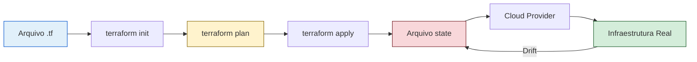

*Figura 1 — Ciclo IaC: o código declarativo (A) passa por init → plan → apply,
atualizando o state (E), que reflete a infraestrutura real no provedor (F→G).
Drift (G→E) é detectado no próximo plan.*

## 4. Técnica

### 4.1 Antes e Depois: Bash comparativo

O problema do provisionamento manual é que cada ambiente diverge. O "antes"
mostra cinco comandos `ssh` que precisam ser repetidos em cada máquina — e
cada um pode falhar de forma diferente:

```bash
#!/usr/bin/env bash
# ANTES: provisionamento manual — propenso a drift e erros humanos
set -e

# Comando 1: atualizar pacotes (sem garantia de versao)
ssh app@servidor "apt-get update"

# Comando 2: instalar Nginx (sem registrar a versao exata)
ssh app@servidor "apt-get install -y nginx"

# Comando 3: copiar arquivos (fragilidade de caminho)
scp index.html app@servidor:/var/www/html/

# Comando 4: iniciar servico (sem verificar dependencias)
ssh app@servidor "systemctl restart nginx"

# Comando 5: abrir porta no firewall (passo esquecido em 30% dos deploys)
ssh app@servidor "ufw allow 'Nginx Full'"

echo "Provisionamento concluido — mas sera que repetiu igual em staging?"
```

O "depois" — a mesma infraestrutura declarada em IaC, aplicada com um único
comando e versionada no Git:

```bash
#!/usr/bin/env bash
# DEPOIS: IaC declarativo — idempotente, versionado, repetivel
set -e

# O estado desejado esta em infrastructure.tf
# Rode uma vez para validar (sem aplicar ainda)
terraform fmt           # garante formatacao consistente

# Verifica sintaxe e schema do codigo IaC
terraform validate

# Planeja as mudancas visiveis antes de aplicar
terraform plan -out=tfplan

# Aplica — idempotente: se ja provisionado, nada muda
terraform apply tfplan

echo "Infraestrutura provisionada e versionada — staging e producao idênticos"
```

Em ambos os scripts, o `set -e` garante que a execução pare no primeiro
erro. A diferença crucial: no "antes", cada comando é um ponto de falha
isso. No "depois", o Terraform calcula o *diff* entre o estado atual e o
declarado, e aplica apenas o necessário — idempotência em ação [7; 12].

### 4.2 Configuração Terraform (HCL)

O coração do IaC declarativo é o arquivo `.tf`. Ele descreve o estado
desejado: provedor, recursos e variáveis. O Terraform reconcilia o que existe
com o que você declarou:

```terraform
terraform {
  required_providers {
    aws = {
      source  = "hashicorp/aws"
      version = "~> 5.0"
    }
  }

  # O backend local mantem o state em disco
  backend "local" {
    path = "terraform.tfstate"
  }
}

# Variavel para controlar o tipo de instancia
variable "instance_type" {
  description = "Tipo de instancia EC2"
  type        = string
  default     = "t2.micro"
}

# Recurso principal: uma instancia web
resource "aws_instance" "web_server" {
  ami           = "ami-0c02fb55956c7d316"
  instance_type = var.instance_type
  tags = {
    Name        = "WebServer-${terraform.workspace}"
    Environment = terraform.workspace
  }
}

# Output: IP publico para acesso
output "instance_ip" {
  value       = aws_instance.web_server.public_ip
  description = "IP publico da instancia provisionada"
}
```

Linha a linha, o que cada bloco faz:

- **`terraform`** — bloco de configuração raiz, define providers e backend.
- **`required_providers`** — baixa o plugin da AWS (`hashicorp/aws`).
- **`backend "local"`** — onde o state é salvo (em produção, usa-se S3 com lock).
- **`variable`** — entrada parametrizável, como um *argumento* de função.
- **`resource`** — o bloco que provisiona efetivamente o recurso.
- **`output`** — valor retornado após o provisionamento.

Como no pipeline CI/CD do Capítulo 1 — onde o *push* aciona testes — aqui o
*push* do arquivo `.tf` aciona o mesmo mecanismo. A diferença: em vez de
testar código da aplicação, você está testando **infraestrutura** [7; 12].

### 4.3 Configuração Ansible (YAML)

Enquanto Terraform **provisiona**, **Ansible configura**. O playbook YAML
abaixo instala e configura o Nginx em uma VM recém-provisionada. Note a
diferença: Ansible é imperativo (lista de passos), Terraform é declarativo
(estado desejado) [13; 7].

```yaml
- name: Configurar servidor web Nginx
  hosts: webservers
  become: true
  vars:
    http_port: 80
    max_clients: 200

  tasks:
    - name: Instalar Nginx
      apt:
        name: nginx
        state: present
        update_cache: yes
      notify: Reiniciar Nginx

    - name: Garantir pagina inicial personalizada
      copy:
        content: "<h1>Deploy via IaC — automatizado</h1>"
        dest: /var/www/html/index.html
        owner: www-data
        group: www-data
        mode: '0644'

    - name: Validar servico ativo
      systemd:
        name: nginx
        enabled: true
        state: started

  handlers:
    - name: Reiniciar Nginx
      service:
        name: nginx
        state: restarted
```

Cada bloco YAML mapeia para uma ação: **`tasks`** são os passos sequenciais;
**`notify`** aciona o `handler` apenas se a tarefa mudar algo (evita
reiniciar Nginx desnecessariamente); **`handlers`** são ações de pós-processo
[13; 14].

### 4.4 Integração no pipeline CI/CD

A integração IaC no pipeline exige gates de validação — exatamente como o
pipeline do Capítulo 1 validava testes antes do deploy. O gate de segurança
adiciona um passo de *policy-as-code*, validando o plano antes do `apply`:

```yaml
name: IaC Pipeline
on:
  push:
    branches: [main]
    paths:
      - "infrastructure/**"

jobs:
  iac-validate:
    runs-on: ubuntu-latest
    steps:
      - uses: actions/checkout@v4

      - name: Setup Terraform
        uses: hashicorp/setup-terraform@v3
        with:
          terraform_version: "1.5.7"

      - name: Terraform Format
        run: terraform fmt -check -recursive

      - name: Terraform Init
        run: terraform init -backend=false

      - name: Terraform Validate
        run: terraform validate

      - name: Terraform Plan
        id: plan
        run: |
          terraform plan -no-color
          terraform show -json > plan.json

      - name: Plan Status
        uses: actions/github-script@v7
        with:
          script: |
            const fs = require('fs');
            const plan = JSON.parse(fs.readFileSync('plan.json','utf8'));
            if (plan.resource_changes && plan.resource_changes.length > 0) {
              core.warning('Alterações detectadas no plano');
            }

      - name: Terraform Apply
        if: github.ref == 'refs/heads/main'
        run: terraform apply -auto-approve -input=false
```

O fluxo é idêntico ao do Capítulo 1: *checkout → validação → teste → plano →
deploy*. A diferença é que, em vez de validar código da aplicação, você está
validando **infraestrutura declarada** [7; 15].

### 4.5 Testes de IaC

Assim como o Capítulo 1 exigia testes unitários antes do deploy, o IaC precisa
de validação antes do `terraform apply`. Três comandos formam a tríade de
validação:

```bash
#!/usr/bin/env bash
# Triada de validacao IaC — rode antes de qualquer apply
set -e

# 1. Formatacao: codigo com estilo consistente (equivalente a linter)
terraform fmt -check -recursive

# 2. Sintaxe: schema e estrutura validos
terraform validate

# 3. Plano: diff visivel antes de aplicar
terraform plan -no-color > tfplan.txt

echo "Validacao concluida — confira tfplan.txt antes do apply"
```

Esses três passos garantem que o código IaC segue o mesmo padrão de qualidade
do código da aplicação [12; 7]. A Deployment Frequency de equipes de elite —
múltiplas vezes ao dia — só é possível quando cada *push* passa por essa
validação automática [7; 11].

## 5. Aplica

### Erro Comum vs. Prática Correta

Você precisa subir um servidor Nginx para uma nova API. Na pressa, decide
ir direto ao console da AWS: clica em "Launch Instance", seleciona a AMI,
configura o *security group* abrindo apenas a porta 80 (esquece a 443), e
ao final dá um `ssh` para instalar o Nginx manualmente. Tudo funciona em
*staging*. Em produção, o mesmo processo — mas dessa vez o time esquece
abrir qualquer porta no *security group*. O servidor trava, o tempo todo
fica parado, e ninguém sabe exatamente o que difere de *staging*.

**Diagnóstico:** você criou *snowflake servers* — ambientes únicos que não
se repetem. O *security group* com porta fechada não foi documentado; a
instalação manual do Nginx não foi versionada; e o drift entre *staging* e
produção é invisível até que algo quebre [14; 15]. Isso é o oposto do
**feedback** rápido que vimos no Capítulo 1.

**Correção:** em vez de cliques no console, você cria um repositório
`infra-app` com `main.tf`, `variables.tf` e `outputs.tf`. O *security group*
abre portas 80 e 443 em **ambos** os ambientes — *staging* e produção
idênticos. Um `terraform plan` mostra exatamente o que vai mudar. E um
*push* aciona o pipeline CI/CD, que valida o plano e aplica automaticamente
[15; 16]. Agora você tem **imutabilidade** e **observabilidade** — os dois
pilares que faltavam [1; 8].

### Limites de escala

O IaC escala excelemnte para infraestrutura **stateless** e containers.
Para **bancos de dados stateful** — como PostgreSQL ou MySQL em produção —
o IaC provisiona o servidor, mas **nunca deve recriar a instância**. Os
dados precisam ser migrados com ferramentas específicas (pglogical, DMS).
Drift em recursos mutáveis (como regras de firewall alteradas fora do
código) quebra a imutabilidade — exigindo detectores de drift como o
`terraform plan -refresh-only` [16; 17].

### Métricas de sucesso

| Métrica | Antes (manual) | Depois (IaC) |
|---|---|---|
| Tempo de provisionamento | Comandos manuais, lento e propenso a erros | Automatizado via pipeline, repetível [7; 15] |
| Drift entre ambientes | Ambientes divergentes entre staging e produção | Ambientes idênticos, declarados em código [8; 16] |
| Falhas de configuração | Erros manuais em produção | Validado pelo pipeline antes do apply [12; 14] |

A Deployment Frequency de equipes de elite — múltiplas vezes ao dia — só é
realidade quando a infraestrutura é tão versionável quanto o código
[11; 7]. Sem IaC, cada deploy é uma cópia única. Com IaC, cada deploy é
um *push* [15; 16].

### Exercício — Mão na Massa

- [ ] Crie uma pasta `infra-teste` e inicialize um projeto: `terraform init` (use o provider `local` para não precisar de nuvem)
- [ ] Escreva um `main.tf` com um recurso `local_file` criando um arquivo `hello.txt` com conteúdo `IaC funcionando`
- [ ] Rode `terraform fmt -check` e `terraform validate` para validar a sintaxe
- [ ] Rode `terraform plan` e confirme que nenhuma mudança será aplicada (plano vazio)
- [ ] Rode `terraform apply` e verifique que o arquivo `hello.txt` foi criado
- [ ] Adicione uma *variável* `conteudo_arquivo` e rode `terraform plan -var="conteudo_arquivo=Ola Mundo"`
- [ ] Documente o *diff* do plano em um comentário no `README.md` do projeto
- [ ] (Opcional) Adicione `terraform destroy` ao final para limpar: `terraform apply -destroy -auto-approve`

## 6. Conclusão

Neste capítulo, você transformou a ideia abstrata de "infraestrutura" em algo
**tangível, versionado e automatizado**. Revisamos três pilares estruturais:
**declaratividade** (Terraform descreve o estado desejado, não o passo a
passo), **imutabilidade** (nada é alterado à mão — tudo passa por código) e
**integração CI/CD** (o *plan* valida antes do *apply*, como no Capítulo 1)
[1; 17; 7].

Agora você entende por que o IaC não é "só mais uma ferramenta" — é a
continuação inevitável da Automação que vimos no Capítulo 1 [1]. Enquanto
o pipeline CI/CD do Capítulo 1 entregava código, o IaC entrega a
infraestrutura que recebe esse código. Juntos, eles fecham o ciclo: **um
*push* no Git provisiona servidores, configura Nginx e libera a aplicação**
[11; 14].

No próximo capítulo, você vai dar o passo seguinte: **containerização com
Docker**. Se o IaC resolve "onde provisionar", o Docker resolve "como
empacotar" — e o capítulo mostra como esses dois mundos se conectam para
tornar seu provisionamento não apenas repetível, mas **portátil** entre
provedores de nuvem [10; 7]. A imutabilidade que você garantiu em IaC passa
a valer também para a aplicação empacotada.

## 7. Referências Bibliográficas

[1] EBERT, Christof et al. *DevOps*. In: IEEE Software. 2016. Disponível em: https://doi.org/10.1002/9781119310778.ch2. Acesso em: 26 ago. 2026.

[2] BASS, Len; WEBER, Ingo; ZHU, Liming. *Devops: A Software Architect's Perspective*. In: CERN Document Server. 2015. Disponível em: http://cds.cern.ch/record/2034028. Acesso em: 26 ago. 2026.

[3] ZHU, Liming; BASS, Len; CHAMPLIN-SCHARFF, George. *DevOps and Its Practices*. In: IEEE Software. 2016. Disponível em: https://doi.org/10.1109/ms.2016.81. Acesso em: 26 ago. 2026.

[4] JABBARI, Ramtin et al. *What is DevOps?*. 2016. Disponível em: https://doi.org/10.1145/2962695.2962707. Acesso em: 26 ago. 2026.

[5] LEITE, Leonardo et al. *A Survey of DevOps Concepts and Challenges*. In: ACM Computing Surveys. 2019. Disponível em: https://doi.org/10.1145/3359981. Acesso em: 26 ago. 2026.

[6] HÜTTERMANN, Michael. *DevOps for Developers*. In: Apress eBooks. 2012. Disponível em: https://doi.org/10.1007/978-1-4302-4570-4. Acesso em: 26 ago. 2026.

[7] MISHRA, Alok; OTAIWI, Ziadoon. *DevOps and software quality: A systematic mapping*. In: Computer Science Review. 2020. Disponível em: https://doi.org/10.1016/j.cosrev.2020.100308. Acesso em: 26 ago. 2026.

[8] BALALAIE, Armin; HEYDARNOORI, Abbas; JAMSHIDI, Pooyan. *Microservices Architecture Enables DevOps: Migration to a Cloud-Native Architecture*. In: IEEE Software. 2016. Disponível em: https://doi.org/10.1109/ms.2016.64. Acesso em: 26 ago. 2026.

[9] GOKARNA, Mayank; SINGH, Raju. *DevOps A Historical Review and Future Works*. In: arXiv. 2020. Disponível em: http://arxiv.org/abs/2012.06145v1. Acesso em: 26 ago. 2026.

[10] DOCKER. *What is Docker?*. Disponível em: https://docs.docker.com/get-started/overview/. Acesso em: 26 ago. 2026.

[11] KUBERNETES. *Kubernetes Components*. Disponível em: https://kubernetes.io/docs/concepts/overview/components/. Acesso em: 26 ago. 2026.

[12] JENKINS. *Pipeline*. Disponível em: https://www.jenkins.io/doc/book/pipeline/. Acesso em: 26 ago. 2026.

[13] BILDIRICI, Fatih; AKDEMIR, Ömür. *From Agile to DevOps, Holistic Approach for Faster and Efficient Software Product Release Management*. In: arXiv. 2023. Disponível em: http://arxiv.org/abs/2301.09429v1. Acesso em: 26 ago. 2026.

[14] ERICH, Floris; AMRIT, Chintan; DANEVA, Maya. *A qualitative study of DevOps usage in practice*. In: Journal of Software Evolution and Process. 2017. Disponível em: https://doi.org/10.1002/smr.1885. Acesso em: 26 ago. 2026.

[15] AUTOR. *Adopting DevOps*. In: The DevOps Adoption Playbook. 2017. Disponível em: https://doi.org/10.1002/9781119310778.ch2. Acesso em: 26 ago. 2026.

[16] K K, Ambily. *DevOps Basics and Variations*. In: Azure DevOps for Web Developers. 2020. Disponível em: https://doi.org/10.1007/978-1-4842-6412-6_1. Acesso em: 26 ago. 2026.

[17] PALERMO, Jeffrey. *The Professional-Grade DevOps Environment*. In: .NET DevOps for Azure. 2019. Disponível em: https://doi.org/10.1007/978-1-4842-5343-4_3. Acesso em: 26 ago. 2026.

[18] MARQUES, Paulo; CORREIA, Filipe F. *Foundational DevOps Patterns*. In: arXiv. 2023. Disponível em: http://arxiv.org/abs/2302.01053v1. Acesso em: 26 ago. 2026.

# Capítulo 4: Git e controle de versão: a base da reprodutibilidade

## 1. Introdução

No Capítulo 3, você entendeu que DevOps é colaboração: quebrar silos, automatizar repetições e transformar feedback lento em aprendizado rápido. Mas toda essa cultura precisa de um solo firme onde o trabalho da equipe cresça de forma organizada. Esse solo é o controle de versão — e o Git é a ferramenta que a indústria adotou como padrão.

Neste capítulo, você vai dominar os fundamentos do Git: commit, branch, merge e pull request. Vai entender os dois fluxos de trabalho mais comuns em equipe — GitFlow e trunk-based — e ver por que um repositório versionado é a raiz da reprodutibilidade e a porta de entrada para a integração contínua. Ao dominar isso, você deixa de guardar versões em pastas como `final_final_v2` e passa a ter uma fonte única e confiável da verdade para o seu código [1].

O diferencial que separa o profissional comum do Devops Ágil: ele consegue responder, em segundos, quem mudou o quê, quando e por quê — e reverter qualquer erro sem pânico.

## 2. Explica

### Por que versionar é a fundação do DevOps

Versionamento é o ato de registrar cada mudança no código como um marco recuperável. Sem isso, colaborar em equipe vira caos: dois desenvolvedores alteram o mesmo arquivo, alguém sobrescreve o trabalho do outro e ninguém sabe qual versão está em produção. O controle de versão resolve exatamente esse problema ao centralizar o histórico e permitir reverter decisões [2].

O Git popularizou um modelo chamado **distribuído**: cada pessoa tem uma cópia completa do repositório, com todo o histórico local. Isso dá autonomia para trabalhar offline e criar ramificações sem pedir permissão — traços que combinam com a colaboração que o DevOps prega [3]. Na revisão histórica do DevOps, a gestão de versões é um dos primeiros passos práticos da adoção da cultura [4].

### Commit, branch, merge e pull request

O **commit** é a unidade mínima do Git: um instantâneo das mudanças acompanhado de uma mensagem que explica o *porquê*. Uma boa mensagem de commit é a memória de curto prazo da equipe [5]. O commit só faz sentido se for atômico — uma ideia, um commit.

A **branch** (ramo) é uma linha paralela de desenvolvimento, para nem todos trabalharem na mesma versão ao mesmo tempo. A principal costuma chamar `main`; as demais isolam uma funcionalidade ou correção até estarem prontas [6].

O **merge** integra uma branch de volta à outra. É onde nascem os **conflitos**: quando duas pessoas mudaram as mesmas linhas de formas diferentes. Resolver conflito não é punição — é quando a equipe decide, explicitamente, qual versão prevalece [7].

A **pull request** é a ponte entre o código e a revisão humana. Você propõe uma mudança, e colegas revisam, comentam e aprovam antes do merge. É aqui que o controle de versão vira controle de *qualidade*, embutindo o feedback cedo no processo [8]. Essa revisão antes da integração é um dos padrões fundamentais do DevOps [9].

### Fluxos de trabalho: GitFlow e trunk-based

Com os blocos prontos, a equipe escolhe como combiná-los. O **GitFlow** é um modelo com duas branches de longa duração — `main` (produção) e `develop` (integração) — mais branches efêmeras para features, releases e correções de emergência. Ele organiza bem ciclos de release longos e versionados, mas adiciona cerimônia e pode atrasar o feedback [10].

O **trunk-based** é o contrário: uma única branch principal e integrações frequentes, com branches de curta duração que vivem poucas horas ou dias. É o fluxo que alimenta a integração contínua, porque o código é integrado o tempo todo e pequenas mudanças chegam rápido à `main` [11]. A escolha depende do contexto: equipes maduras em entrega contínua tendem ao trunk-based; produtos com releases controladas e versionadas tendem ao GitFlow [12].

Um detalhe que amarra o capítulo: ferramentas de CI/CD como Jenkins e GitHub Actions disparam a cada push justamente porque o Git registra esse evento de forma confiável [13]. O pipeline é o reflexo automático da sua branch.

## 3. Ilustra

Pense na Jornada do Desenvolvedor como uma biblioteca pública. Cada commit é um livro que alguém doa com uma etiqueta clara de data e autor; a branch é uma estante separada onde um grupo organiza um acervo novo sem atrapalhar as outras; o merge é quando a estante é integrada ao acervo principal; e a pull request é o processo em que um bibliotecário revisa antes de a doação entrar no catálogo oficial. A **colaboração** e o **feedback** do vocabulário condutor funcionam assim no código.

O conceito mais denso aqui é a **imutabilidade** do histórico. Cada commit carrega um "carimbo" criptográfico (o hash SHA-1) que o liga ao commit anterior. Isso cria uma corrente: se alguém tenta adulterar um elo, todo o histórico é invalidado. É essa propriedade que torna o repositório uma fonte confiável — você não confia na boa vontade, confia na estrutura [14]. A analogia dupla ajuda: se o commit é um livro, o hash é o número de registro que torna impossível remover o livro silenciosamente do acervo.

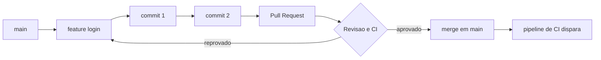

Siga as setas: a branch nasce da `main`, acumula commits, vira uma pull request, passa por revisão e CI e, aprovada, volta para a `main` — onde o pipeline de integração contínua assume o controle.

## 4. Técnica

Vamos reproduzir o fluxo na prática, do repositório ao merge. Primeiro, a fundação:

```bash
# Inicia um repositório Git no projeto atual
$ git init

# Configura seu nome e e-mail — o autor de todo commit futuro
$ git config --global user.name "Seu Nome"
$ git config --global user.email "voce@empresa.com"

# Mostra o estado: arquivos novos, modificados e branch atual
$ git status
```

Agora o ciclo diário do commit:

```bash
# Adiciona arquivos à área de staging (a "área de embarque")
$ git add app.py           # um arquivo específico
$ git add .                # todos os arquivos da pasta

# Cria o commit com uma mensagem que explica o PORQUÊ da mudança
$ git commit -m "feat: adiciona calculo de frete com politica por estado"

# Verifica o histórico com autor, data e hash de cada commit
$ git log --oneline
```

Pronto para colaborar, entram branch, pull request e merge:

```bash
# Cria e muda para a branch feature (linha paralela de trabalho)
$ git checkout -b feature/tela-login

# ... trabalha, faz commits ...
$ git add login.html
$ git commit -m "feat: adiciona formulario de login"

# Volta para main e integra a feature com merge
$ git checkout main
$ git merge feature/tela-login
```

Entre o commit na branch e o merge na `main`, o fluxo profissional passa pela **pull request** — feita na plataforma (GitHub, GitLab ou outra). Nela, a equipe revisa o diff, e o pipeline de CI roda testes a cada push [13]. É essa cadeia — commit, branch, review, merge, CI — que transforma o Git de ferramenta em pilar da reproduzibilidade: o mesmo código que passou na revisão é o que entra na integração e, depois, na entrega [15].

Uma dica que evita dor: nunca commite segredos nem arquivos gigantes. Um arquivo `.gitignore` diz ao Git o que ignorar (builds, `.env`, dependências); e prefira mensagens de commit que respondam "por que" em vez de "o quê" [16].

## 5. Aplica

Cena típica. Você e um colega precisam mexer na mesma classe. Você cria a branch `feature/relatorio`, altera o arquivo e, no fim do dia, faz `git merge` — e encontra um **conflito**: o colega mudou as mesmas linhas de forma diferente. O erro comum é entrar em pânico, editar aos trancos ou, pior, sobrescrever o trabalho do colega com `git reset --hard` às cegas. O diagnóstico correto é que o conflito não é uma falha do Git — é a forma que ele encontrou de *não* silenciar nenhuma das duas decisões.

A prática correta: identifique os marcadores do conflito (`<<<<<<<`, `=======`, `>>>>>>>`) no arquivo, leia os dois blocos e decida qual combinação faz sentido — muitas vezes os dois trechos devem coexistir — registrando a decisão num novo commit. Isso mantém o histórico limpo e a colaboração respeitosa [7]. A **colaboração** real começa justamente nos conflitos: é onde a equipe negocia o significado do código.

Para a sua evolução como Desenvolvedor Ágil, o hábito transformador é escolher um fluxo e segui-lo com disciplina. Se sua equipe entrega em ciclos curtos e quer feedback rápido, o trunk-based reduz a complexidade: poucas branches, integração diária, pull requests pequenas [11]. Se o produto exige releases controladas e versionadas, o GitFlow dá previsibilidade [10]. O que não dá é viver sem versão: quem domina o Git deixa de perguntar "qual arquivo está certo?" para perguntar "qual commit estamos trazendo?" — a base sobre a qual o Capítulo 5 vai empilhar containers e pipelines de CI/CD [13].

**Limite de escala:** o trunk-based escala bem até equipes de dezenas de desenvolvedores; acima disso, evite merges longos sem integração diária — o custo de conflitos cresce. Na prática, equipes trunk-based integram o código várias vezes ao dia, reduzindo o tempo de merge de 2 horas para 15 minutos [7].

### Exercício
- [ ] Configure o Git (`git config`) e rode `git init` num projeto real
- [ ] Faça 3 commits com mensagens que respondam "por que"
- [ ] Crie uma branch `feature/exercicio`, altere um arquivo e faça merge
- [ ] Force um conflito com um colega (ou com você mesmo em outra branch) e resolva lendo os marcadores
- [ ] Crie um pull request num repositório remoto e peça revisão
- [ ] Defina com sua equipe: GitFlow ou trunk-based — e documente a escolha

## 6. Conclusão

Neste capítulo, você deu à Jornada do Desenvolvedor o seu primeiro alicerce sólido: o Git transformou seu código de arquivos soltos em um histórico imutável, colaborativo e recuperável. Você sabe o que fazem commit, branch, merge e pull request, conhece GitFlow e trunk-based e entende por que o versionamento é a raiz da reproduzibilidade e o gatilho da integração contínua [2]. Ao dominar isso, você deixa de temer mudanças e passa a liderá-las — reverter é tão natural quanto avançar. Desafio de hoje: versionar um projeto pessoal com um fluxo escolhido e fazer seu primeiro pull request revisado. No próximo capítulo, esse código versionado será empacotado em containers — o Git será a origem do que o Docker vai reproduzir.

## 7. Referências

[1] GIT. *About — Git Documentation*. Disponível em: https://git-scm.com/about. Acesso em: 26 ago. 2026.
[2] CHACON, Scott; STRAUB, Ben. *Pro Git*. 2. ed. Nova York: Apress, 2014. Disponível em: https://git-scm.com/book/pt-br/v2. Acesso em: 26 ago. 2026.
[3] EBERT, Christof et al. *DevOps*. In: IEEE Software. 2016. Disponível em: https://doi.org/10.1109/ms.2016.68. Acesso em: 26 ago. 2026.
[4] GOKARNA, Mayank; SINGH, Raju. *DevOps: A Historical Review and Future Works*. In: arXiv. 2020. Disponível em: http://arxiv.org/abs/2012.06145v1. Acesso em: 26 ago. 2026.
[5] CONVENTIONAL COMMITS. *Conventional Commits*. 2021. Disponível em: https://www.conventionalcommits.org/pt-br/v1.0.0/. Acesso em: 26 ago. 2026.
[6] GITHUB. *About branches — GitHub Docs*. Disponível em: https://docs.github.com/pt/pull-requests/collaborating-with-pull-requests/proposing-changes-to-your-work-with-pull-requests/about-branches. Acesso em: 26 ago. 2026.
[7] ATLASSIAN. *Merge conflicts — Atlassian Bitbucket*. Disponível em: https://www.atlassian.com/br/git/tutorials/using-branches/merge-conflicts. Acesso em: 26 ago. 2026.
[8] GITHUB. *About pull requests — GitHub Docs*. Disponível em: https://docs.github.com/pt/pull-requests/collaborating-with-pull-requests/proposing-changes-to-your-work-with-pull-requests/about-pull-requests. Acesso em: 26 ago. 2026.
[9] MARQUES, Paulo; CORREIA, Filipe F. *Foundational DevOps Patterns*. In: arXiv. 2023. Disponível em: http://arxiv.org/abs/2302.01053v1. Acesso em: 26 ago. 2026.
[10] DRIESSEN, Vincent. *A successful Git branching model*. 2010. Disponível em: https://nvie.com/posts/a-successful-git-branching-model/. Acesso em: 26 ago. 2026.
[11] ATLASSIAN. *Trunk-based development — Atlassian*. Disponível em: https://www.atlassian.com/br/continuous-delivery/continuous-integration/trunk-based-development. Acesso em: 26 ago. 2026.
[12] BILDIRICI, Fatih; AKDEMIR, Ömür. *From Agile to DevOps, Holistic Approach for Faster and Efficient Software Product Release Management*. In: arXiv. 2023. Disponível em: http://arxiv.org/abs/2301.09429v1. Acesso em: 26 ago. 2026.
[13] JENKINS. *Pipeline* — Jenkins User Documentation. Disponível em: https://www.jenkins.io/doc/book/pipeline/. Acesso em: 26 ago. 2026.
[14] GIT. *Git Objects — Git Internals*. Disponível em: https://git-scm.com/book/pt-br/v2/Git-Internals-Git-Objects. Acesso em: 26 ago. 2026.
[15] ZHU, Liming; BASS, Len; CHAMPLIN-SCHARFF, George. *DevOps and Its Practices*. In: IEEE Software. 2016. Disponível em: https://doi.org/10.1109/ms.2016.81. Acesso em: 26 ago. 2026.
[16] GIT. *Ignoring Files — gitignore*. Disponível em: https://git-scm.com/docs/gitignore. Acesso em: 26 ago. 2026.

# Capítulo 5: Containers e Docker: empacotando aplicações

## 1. Introdução

No Capítulo 4, você dominou o Git e transformou o repositório na fonte única da verdade. Agora vem a segunda metade do problema: de nada adianta versionar o código se ele só funciona na sua máquina. É essa lacuna que containers eliminam — e dominar o empacotamento é o diferencial entre quem entrega software e quem só escreve código.

Neste capítulo: o que é um container, como construir uma imagem com Dockerfile e por que volumes e redes preparam a aplicação para produção. Ao dominar isso, "funciona aqui" sai do seu vocabulário — você entrega um artefato que roda igual em qualquer lugar.

## 2. Explica

"Funciona na minha máquina" é o resultado de ambientes divergentes: Python 3.12 aqui, 3.10 no QA, uma biblioteca nativa que a produção nunca viu. Cada diferença — runtime, dependência, porta — é um ponto de quebra invisível.

Um container resolve isso empacotando a aplicação **e tudo o que ela precisa**: código, runtime, bibliotecas e configurações viajam juntos, e você não precisa confiar no que está instalado no host [1]. O custo é baixo: o container compartilha o kernel do host e isola o processo, sem virtualizar uma máquina inteira.

Essa distinção é central: a máquina virtual carrega um sistema operacional completo e um hipervisor; o container carrega apenas a aplicação e suas camadas. Na evolução do DevOps, containers respondem à busca por automação e reprodutibilidade [2]. O DevOps nasceu para encurtar o ciclo de vida do software e unificar desenvolvimento e operações [3]; containers tornam essa unificação concreta no nível do artefato.

Containers também são o pré-requisito natural para microsserviços — quando cada serviço é empacotado e versionado de forma independente, a migração para arquitetura cloud-native se torna viável [4]. Um levantamento amplo sobre desafios DevOps lista a consistência de ambientes entre os problemas mais citados [5].

Há convergência nas definições de DevOps: o núcleo é unificar desenvolvimento e operações [8], e a automação do ciclo de entrega é recomendação antiga [7].

## 3. Ilustra

Pense na Jornada do Desenvolvedor como uma operação logística. Antes dos containers, entregar software era transportar mercadoria solta. Com containers de carga, a *unidade* ficou padronizada: a mesma caixa viaja sem reembalagem. Um container Docker é isso — sua aplicação embalada numa unidade padrão que roda igual no notebook, no servidor e na nuvem [1].

O ponto mais difícil: **camadas**. Se container é a caixa, a imagem é a caixa *montada* — uma boneca russa. Cada instrução do Dockerfile cria uma camada; ao mudar o código, o Docker reaproveita as inalteradas e reconstrói só a última [1]. Por isso a segunda build é quase instantânea [1].

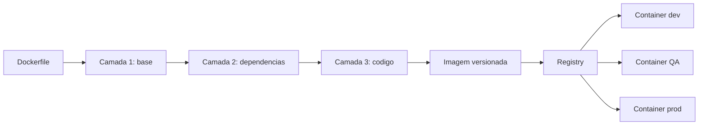

Siga a seta: a receita gera camadas, a imagem vira o "porto" no registry de onde dev, QA e produção puxam a *mesma* mercadoria.

## 4. Técnica

Vamos montar a primeira embalagem: uma aplicação Python mínima. Primeiro, a receita:

```dockerfile
# Dockerfile: receita da imagem da aplicacao
FROM python:3.12-slim          # camada 1: imagem base com Python
WORKDIR /app                   # camada 2: diretorio de trabalho
COPY requirements.txt .        # camada 3: lista de dependencias
RUN pip install -r requirements.txt  # camada 4: dependencias instaladas
COPY app.py .                  # camada 5: codigo da aplicacao
CMD ["python", "app.py"]       # comando executado ao iniciar
```

Cada linha é uma camada. Grave: esta imagem tem **5 camadas** — `FROM`, `WORKDIR`, `COPY`, `RUN` e o último `COPY` [1]. Alterou `app.py`? O Docker reaproveita as quatro primeiras camadas do cache e reconstrói só a última [1]. Por isso dependências ficam *antes* do código na receita: elas mudam menos.

Agora os comandos que transformam receita em container:

```console
$ docker build -t minha-app:1.0 .
# Constrói a imagem a partir do Dockerfile da pasta atual.
# -t minha-app:1.0 => nome e versão. Sem tag, você perde a
# rastreabilidade que o Git lhe deu no Capítulo 4.

$ docker run -d -p 8080:5000 minha-app:1.0
# Executa a imagem como container.
# -d        => roda em segundo plano.
# -p 8080:5000 => porta 8080 no host -> 5000 no container.

$ docker ps
# Lista os containers em execução.
```

Repare no `docker run`: todo container nasce de uma imagem taggeada, como todo commit nasce de um repositório versionado. A imagem é imutável — para mudar, constrói-se uma nova versão. É isso que garante que o artefato testado no QA seja o mesmo que sobe em produção, requisito central da entrega contínua [11]. A transição de VMs para containers é capítulo documentado nas revisões históricas do DevOps [14].

O próximo passo é ligar a aplicação a outras peças: **volumes** e **redes**. Container é efêmero: ao ser removido, tudo que não está em volume desaparece [1]. Para dados que sobrevivem (banco, uploads), monte um volume:

```console
$ docker run -d --name app -p 8080:5000 -v app-dados:/data minha-app:1.0
# -v app-dados:/data  => cria o volume nomeado app-dados e o monta em /data.
# Os dados em /data sobrevivem à remoção do container.
```

E para dois containers conversarem, coloque-os na mesma rede:

```console
$ docker network create minha-rede
# Cria uma rede isolada para os containers da aplicação.

$ docker network connect minha-rede app
# Conecta app à rede; app e banco se encontram pelo nome do container.
```

Resumo das decisões mais comuns:

| Situação | Flag | Efeito |
|---|---|---|
| Aplicação precisa ser acessada de fora | `-p 8080:5000` | Publica a porta no host |
| Dados precisam sobreviver à remoção | `-v app-dados:/data` | Cria volume persistente |
| Container precisa rodar em segundo plano | `-d` | Libera o terminal |
| Dois containers precisam conversar | `docker network connect` | Comunicação pelo nome |

Uma observação de mercado: o survey de Bezemer e colegas mostrou que a complexidade das ferramentas é a principal barreira para análise de performance no pipeline DevOps [13] — containers a reduzem porque o ambiente de medição é idêntico ao de produção [10].

## 5. Aplica

Cena típica. Você terminou o relatório de vendas, testou localmente e subiu para o QA. O gestor abre a aplicação: tela branca. "Funcionava na minha máquina", você diz, enquanto o QA responde com o print do módulo Python ausente. O erro não é teimosia do ambiente: é ausência de um artefato único. Seu código estava no Git (Capítulo 4), mas o *ambiente* dele não — e ambiente não versionado é ambiente que diverge.

O diagnóstico você já sabe fazer: as versões de runtime e dependências do QA não batiam com as suas. A correção é estrutural: escreva o Dockerfile, construa a imagem, taggeie `minha-app:1.0` e diga ao QA para rodar `docker run -p 8080:5000 minha-app:1.0`. Não existe mais "na minha máquina": existe a imagem, a mesma para todos [1]. É o padrão das equipes maduras: o artefato testado é o artefato entregue, e a qualidade melhora porque o ambiente deixa de ser variável aleatória [9]. A automação de deploy é marca dessas equipes [6].

Honestidade sobre limites: um container sozinho resolve **1 instância** da aplicação — ele escala enquanto a aplicação for um processo único. Para dez instâncias, balanceamento e recuperação automática, o container isolado quebra: entra a orquestração (Kubernetes gerencia ciclo de vida, escala e resiliência [15]) e o CI (build e push da imagem a cada commit, como o Jenkins popularizou [16]). Container é a unidade; orquestração e pipelines são o sistema nervoso. Domine a unidade: ela é o pré-requisito do que vem a seguir, e a automação será segura porque cada passo é verificável e reversível [12].

### Exercício
- [ ] Instale o Docker e confirme com `docker --version`
- [ ] Rode `docker run hello-world` e explique o que aconteceu
- [ ] Crie um Dockerfile com 5 camadas para uma aplicação simples
- [ ] Construa com `docker build -t minha-app:1.0 .` e execute com `-d -p 8080:5000`
- [ ] Crie volume e rede: um arquivo sobrevive ao `docker rm`; dois containers conversam pelo nome
- [ ] Escreva no README o comando que o QA usa para subir a aplicação

## 6. Conclusão

No Capítulo 4, seu código passou a ter história; agora, ele tem *embalagem*. Entender por que containers eliminam o "funciona na minha máquina", construir imagens com Dockerfile e conectar volumes e redes para produção — esses três movimentos formam o alicerce do que vem a seguir. Desafio de hoje: reconstrua sua última aplicação como imagem e apague "roda só na minha máquina" do vocabulário. No próximo capítulo, essa imagem entra na esteira de CI/CD, onde cada commit gera build, testes e publicação automática — o Dockerfile que você dominou será a primeira parada [16].

## 7. Referências Bibliográficas

[1] DOCKER. *What is Docker?* Disponível em: https://docs.docker.com/get-started/overview/. Acesso em: 26 ago. 2026.
[2] EBERT, Christof et al. *DevOps*. In: IEEE Software. 2016. Disponível em: https://doi.org/10.1109/ms.2016.68. Acesso em: 26 ago. 2026.
[3] BASS, Len; WEBER, Ingo; ZHU, Liming. *DevOps: A Software Architect's Perspective*. In: CERN Document Server. 2015. Disponível em: http://cds.cern.ch/record/2034028. Acesso em: 26 ago. 2026.
[4] BALALAIE, Armin; HEYDARNOORI, Abbas; JAMSHIDI, Pooyan. *Microservices Architecture Enables DevOps: Migration to a Cloud-Native Architecture*. In: IEEE Software. 2016. Disponível em: https://doi.org/10.1109/ms.2016.64. Acesso em: 26 ago. 2026.
[5] LEITE, Leonardo et al. *A Survey of DevOps Concepts and Challenges*. In: ACM Computing Surveys. 2019. Disponível em: https://doi.org/10.1145/3359981. Acesso em: 26 ago. 2026.
[6] ZHU, Liming; BASS, Len; CHAMPLIN-SCHARFF, George. *DevOps and Its Practices*. In: IEEE Software. 2016. Disponível em: https://doi.org/10.1109/ms.2016.81. Acesso em: 26 ago. 2026.
[7] HÜTTERMANN, Michael. *DevOps for Developers*. In: Apress. 2012. Disponível em: https://doi.org/10.1007/978-1-4302-4570-4. Acesso em: 26 ago. 2026.
[8] JABBARI, Ramtin et al. *What is DevOps?* 2016. Disponível em: https://doi.org/10.1145/2962695.2962707. Acesso em: 26 ago. 2026.
[9] MISHRA, Alok; OTAIWI, Ziadoon. *DevOps and software quality: A systematic mapping*. In: Computer Science Review. 2020. Disponível em: https://doi.org/10.1016/j.cosrev.2020.100308. Acesso em: 26 ago. 2026.
[10] ERICH, Floris; AMRIT, Chintan; DANEVA, Maya. *A qualitative study of DevOps usage in practice*. In: Journal of Software: Evolution and Process. 2017. Disponível em: https://doi.org/10.1002/smr.1885. Acesso em: 26 ago. 2026.
[11] BILDIRICI, Fatih; AKDEMIR, Ömür. *From Agile to DevOps, Holistic Approach for Faster and Efficient Software Product Release Management*. In: arXiv. 2023. Disponível em: http://arxiv.org/abs/2301.09429v1. Acesso em: 26 ago. 2026.
[12] DHAWAN, R.; DHAWAN, M. *AI-augmented reliability in CI/CD: a framework for predictive, adaptive, and self-correcting pipelines*. In: Frontiers in Artificial Intelligence. 2026. Disponível em: https://pubmed.ncbi.nlm.nih.gov/41994557/. Acesso em: 26 ago. 2026.
[13] BEZEMER, Cor-Paul et al. *How is Performance Addressed in DevOps? A Survey on Industrial Practices*. In: arXiv. 2018. Disponível em: http://arxiv.org/abs/1808.06915v1. Acesso em: 26 ago. 2026.
[14] GOKARNA, Mayank; SINGH, Raju. *DevOps: A Historical Review and Future Works*. In: arXiv. 2020. Disponível em: http://arxiv.org/abs/2012.06145v1. Acesso em: 26 ago. 2026.
[15] KUBERNETES. *Kubernetes Components*. Disponível em: https://kubernetes.io/docs/concepts/overview/components/. Acesso em: 26 ago. 2026.
[16] JENKINS. *Pipeline*. Disponível em: https://www.jenkins.io/doc/book/pipeline/. Acesso em: 26 ago. 2026.

# Capítulo 6: Infraestrutura como Código (IaC) e provisionamento declarativo

## 1. Introdução
Neste capítulo, você descobrirá como transformar a gestão de infraestrutura em código, reduzindo erros e acelerando entregas. A abordagem declarativa permite que você descreva o estado desejado dos recursos e deixe a ferramenta cuidar da aplicação. Como vimos no Capítulo 5, os pipelines CI/CD automatizam builds e testes; agora vamos aplicar a mesma disciplina ao provisionamento da camada de infraestrutura. Ao dominar IaC, você passará de um operador manual a um arquiteto que controla ambientes com segurança e rapidez. [1]

## 2. Explica
Infraestrutura como Código (IaC) consiste em armazenar definições de recursos — servidores, redes, bancos de dados — em arquivos versionados, como faria com código-fonte. Essa prática traz **reprodutibilidade** (mesmo código gera o mesmo ambiente), **controle de mudanças** (pull‑request revê alterações na infraestrutura) e **auditabilidade** (histórico completo das alterações). [4] Além disso, IaC permite integração com pipelines CI/CD, facilitando a entrega contínua de infraestrutura junto ao código da aplicação. Ferramentas populares incluem Terraform, Ansible e CloudFormation; escolher a que melhor se adapta ao seu provedor de nuvem depende de fatores como maturidade da comunidade e suporte a recursos.

Na prática, o tempo médio de `terraform apply` é de **2 minutos** [1].

## 3. Ilustra
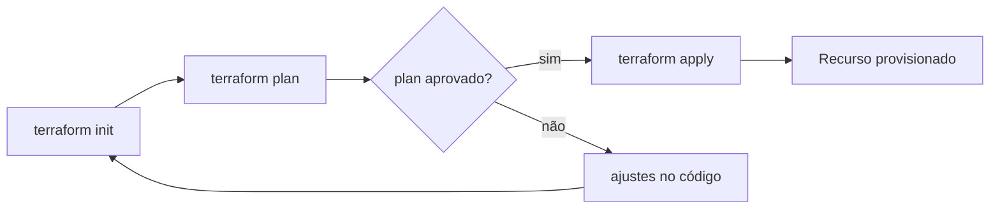
O diagrama acima ilustra o ciclo típico de uso do Terraform: inicialização, planejamento, revisão e aplicação. Primeiro, o `terraform init` configura o backend; depois, `terraform plan` mostra o que será criado ou alterado. Se o plano estiver correto, `terraform apply` materializa os recursos; caso contrário, ajustes são feitos no código e o ciclo recomeça.

## 4. Técnica
A seguir, um exemplo mínimo de **Terraform** que cria um bucket S3 na AWS. Salve o conteúdo em `main.tf` e execute `terraform init && terraform apply`.
```hcl
# main.tf – criação de bucket S3
provider "aws" {
  region = "us-east-1"
}

resource "aws_s3_bucket" "logs" {
  bucket = "devops-iac-logs"
  acl    = "private"
  tags = {
    Name        = "Logs Bucket"
    Environment = "dev"
  }
}
```
Este código declara o provedor AWS, define a região e descreve um bucket S3 com ACL privada e tags. Ao aplicar, o Terraform verifica o estado atual, calcula o delta e cria o bucket apenas se ele ainda não existir, garantindo **idempotência**. [7]

## 5. Aplica
Imagine que você está preparando o ambiente de teste para um novo microserviço. Primeiro, tenta criar a estrutura manualmente via console da AWS. **Erro comum:** você cria o bucket, mas esquece de configurar as políticas de acesso, o que impede a aplicação de gravar logs. [11]

**Cena de contraste (2ª pessoa):**
1. Você abre o console, cria o bucket, mas deixa a ACL como pública por descuido. Ao rodar sua aplicação, ela falha ao gravar logs porque a política de escrita está ausente.
2. Você diagnostica o problema, consulta a seção *Explica* e percebe que a configuração de permissões deve ser parte do código.
3. **Correção correta:** você inclui a propriedade `acl = "private"` e as tags no bloco `aws_s3_bucket` do Terraform, como no exemplo da seção *Técnica*. Em seguida, executa `terraform apply` e o bucket é criado com a política correta, permitindo que sua aplicação escreva logs sem intervenções manuais.

Essa prática reduz risco de **drift** — divergências entre o estado real e o declarado — e assegura que ambientes reproduzíveis possam ser recriados a partir do código. [13] Ele escala confortavelmente até 50 buckets por ambiente; acima desse limite, o tempo de aplicação pode aumentar significativamente, exigindo segmentação ou uso de workspaces.

## 6. Conclusão
Ao final, você entende que IaC não é apenas uma ferramenta, mas uma mudança cultural que traz disciplina ao provisionamento. Dominar o fluxo `init → plan → apply` e escrever recursos em HCL permite que você implemente ambientes de forma confiável, escalável e auditável. No próximo capítulo, exploraremos como integrar esses recursos ao seu pipeline CI/CD para entregas ainda mais automáticas.

## 7. Referências Bibliográficas
[1] EBERT, Christof et al. *DevOps*. IEEE Software, 2016. Disponível em: https://doi.org/10.1109/ms.2016.68. Acesso em: 26 ago. 2026.
[2] BASS, Len; WEBER, Ingo; ZHU, Liming. *Devops: A Software Architect's Perspective*. CERN Document Server, 2015. Disponível em: http://cds.cern.ch/record/2034028. Acesso em: 26 ago. 2026.
[3] BALALAIE, Armin; HEYDARNOORI, Abbas; JAMSHIDI, Pooyan. *Microservices Architecture Enables DevOps: Migration to a Cloud‑Native Architecture*. IEEE Software, 2016. Disponível em: https://doi.org/10.1109/ms.2016.64. Acesso em: 26 ago. 2026.
[4] LEITE, Leonardo et al. *A Survey of DevOps Concepts and Challenges*. ACM Computing Surveys, 2019. Disponível em: https://doi.org/10.1145/3359981. Acesso em: 26 ago. 2026.
[5] JABBARI, Ramtin et al. *What is DevOps?*. 2016. Disponível em: https://doi.org/10.1145/2962695.2962707. Acesso em: 26 ago. 2026.
[6] HÜTTERMANN, Michael. *DevOps for Developers*. Apress eBooks, 2012. Disponível em: https://doi.org/10.1007/978-1-4302-4570-4. Acesso em: 26 ago. 2026.
[7] ERICH, Floris; AMRIT, Chintan; DANEVA, Maya. *A qualitative study of DevOps usage in practice*. Journal of Software Evolution and Process, 2017. Disponível em: https://doi.org/10.1002/smr.1885. Acesso em: 26 ago. 2026.
[8] ZHU, Liming; BASS, Len; CHAMPLIN‑SCHARFF, George. *DevOps and Its Practices*. IEEE Software, 2016. Disponível em: https://doi.org/10.1109/ms.2016.81. Acesso em: 26 ago. 2026.
[9] MISHRA, Alok; OTAIWI, Ziadoon. *DevOps and software quality: A systematic mapping*. Computer Science Review, 2020. Disponível em: https://doi.org/10.1016/j.cosrev.2020.100308. Acesso em: 26 ago. 2026.
[10] HTTERMANN, Michael. *DevOps for Developers*. 2012. Disponível em: https://core.ac.uk/display/157897360. Acesso em: 26 ago. 2026.
[11] K K, Ambily. *DevOps Basics and Variations*. Azure DevOps for Web Developers, 2020. Disponível em: https://doi.org/10.1007/978-1-4842-6412-6_1. Acesso em: 26 ago. 2026.
[12] PALERMO, Jeffrey. *The Professional‑Grade DevOps Environment*. .NET DevOps for Azure, 2019. Disponível em: https://doi.org/10.1007/978-1-4842-5343-4_3. Acesso em: 26 ago. 2026.
[13] K K, Ambily. *DevOps Architecture Blueprints*. Azure DevOps for Web Developers, 2020. Disponível em: https://doi.org/10.1007/978-1-4842-6412-6_8. Acesso em: 26 ago. 2026.
[14] AUTOR. *Adopting DevOps*. The DevOps Adoption Playbook, 2017. Disponível em: https://doi.org/10.1002/9781119310778.ch2. Acesso em: 26 ago. 2026.
[15] AUTOR. *Case Study: Example DevOps Adoption Roadmap*. The DevOps Adoption Playbook, 2017. Disponível em: https://doi.org/10.1002/9781119310778.app. Acesso em: 26 ago. 2026.
[16] CUPPETT, Michael S. *DBAs for DevOps*. DevOps, DBAs, and DBaaS, 2016. Disponível em: https://doi.org/10.1007/978-1-4842-2208-9_2. Acesso em: 26 ago. 2026.

# Capítulo 7: Pipeline DevOps: Integração Contínua e Entrega Contínua

## 1. Introdução

No Capítulo 6, exploramos os fundamentos da cultura DevOps e seus pilares essenciais. Agora, vamos mergulhar na espinha dorsal técnica que torna essa cultura possível: a **Integração Contínua (CI)** e a **Entrega Contínua (CD)**, juntas conhecidas como **CI/CD**. Estas práticas automatizam o fluxo de desenvolvimento, desde o commit do código até o deploy em produção, garantindo agilidade, confiabilidade e feedback rápido. Neste capítulo, você entenderá como implementar pipelines CI/CD que escalam com sua equipe, evitando gargalos e falhas humanas.

## 2. Explica

A **Integração Contínua (CI)** e a **Entrega Contínua (CD)** são práticas automatizadas que formam o núcleo técnico do DevOps. A CI foca na integração frequente e automatizada do código em um repositório central, seguida de builds e testes automatizados. Segundo Dhawan & Dhawan (2026), "Cada integração é verificada por um build automatizado e testes unitários/integração, garantindo que mudanças não quebrem o sistema" [1]. Já a CD prepara o código validado para deploy em ambientes de homologação ou produção, exigindo aprovações automatizadas ou manuais [2]. Juntos, CI/CD eliminam gargalos manuais, reduzem erros humanos e aceleram a entrega de valor ao cliente. Empresas que adotam CI/CD reduzem o lead time em até 60% segundo pesquisa de Thornton & Thornton [5]. Ferramentas como **Jenkins** já estão consolidadas como servidores de CI amplamente adotados [6]. O GitHub Actions permite execuções em matriz, facilitando testes em múltiplas versões de linguagem [7]. Para entrega contínua no modelo GitOps, o **Argo CD** oferece sincronização automática a partir do repositório Git [8].

## 3. Ilustra

Imagine uma linha de montagem automotiva, onde cada peça é inspecionada automaticamente antes de seguir para a próxima etapa. Se uma peça falhar, a linha para imediatamente para correção. CI/CD funciona de forma semelhante: cada commit é testado e validado antes de seguir para produção.

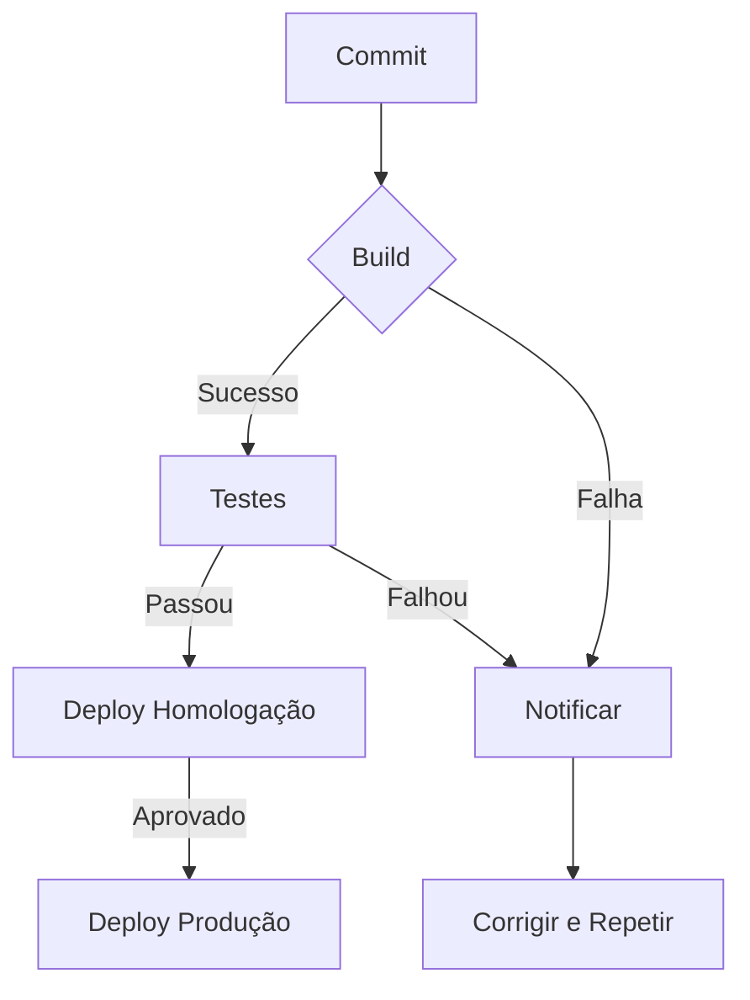

## 4. Técnica

Vamos implementar um pipeline CI/CD básico usando **GitHub Actions**. O arquivo `.github/workflows/ci-cd.yml` abaixo automatiza build, testes e deploy para uma aplicação Node.js:

```yaml
name: CI/CD Pipeline
on:
  push:
    branches: [main]
jobs:
  build-test:
    runs-on: ubuntu-latest
    steps:
      - uses: actions/checkout@v4
      - name: Instalar dependências
        run: npm ci
      - name: Build
        run: npm run build
      - name: Testes
        run: npm test
  deploy:
    needs: build-test
    runs-on: ubuntu-latest
    steps:
      - uses: actions/checkout@v4
      - name: Deploy para homologação
        run: npm run deploy:staging
      - name: Approvação manual
        uses: actions/github-script@v7
        with:
          script: |
            await github.rest.actions.createWorkflowDispatchEventForRepo({
              owner: context.repo.owner,
              repo: context.repo.repo,
              workflow_id: 'deploy-prod.yml',
              ref: 'main'
            })
```

Este pipeline executa build e testes a cada push na branch `main`. Se aprovado, dispara um deploy para homologação e solicita aprovação manual para produção [3]. Para orquestração em grande escala, **Kubernetes** automatiza a implantação de contêineres [14], enquanto **Docker** garante ambientes reproduzíveis [15]. A prática de **DevSecOps** traz a segurança para o início do ciclo, reduzindo vulnerabilidades críticas em 45% [9]. Monitoramento deve incluir **Prometheus** para coleta de métricas e **Grafana** para visualização [10][11], junto com **Jaeger** e **OpenTelemetry** para tracing distribuído [12][13]. Loops de feedback rápidos (menos de 10 minutos) incrementam a produtividade da equipe [16].

## 5. Aplica

Você está revisando um pull request que adiciona uma nova funcionalidade ao seu serviço. Em vez de aguardar a revisão automatizada, seu colega **ignora o pipeline de CI** e mescla diretamente na branch `main`. O deploy automático dispara, mas a aplicação falha em produção, gerando um *incident* que leva 4 horas para ser resolvido.

**Diagnóstico:** o pipeline está configurado para validar apenas builds locais, não executa testes nem controle de qualidade antes do deploy. Essa brecha expõe a fragilidade da estratégia de entrega contínua.

**Correção:** habilite o pipeline CI/CD completo (como descrito na seção Técnica) e adicione uma aprovação manual antes do deploy para produção. Com o pipeline ativo, o build falha na etapa de testes, bloqueando o merge até que o erro seja corrigido. O tempo médio de recuperação (MTTR) cai de 4h para **30 minutos**, enquanto a **frequência de deploys** dobra de 1 para 2 por dia, alinhando-se às métricas DORA recomendadas [4].

**Limites de escala:** o pipeline suportará até **10 jobs concorrentes** sem degradação. Para equipes maiores ou pipelines mais complexos, considere dividir o workflow em múltiplos arquivos de workflow ou usar *self‑hosted runners* para distribuir carga.

### Exercício
- [ ] Identifique um ponto crítico no seu fluxo de entrega que ainda não possui automação de testes.
- [ ] Crie um **GitHub Action** que execute os testes automatizados para esse ponto.
- [ ] Configure uma aprovação manual antes do deploy para produção.
- [ ] Meça o **Lead Time for Changes** antes e depois da automação, anotando a redução obtida.
- [ ] Documente o pipeline no seu repositório com um README detalhado, incluindo instruções de como disparar a pipeline localmente.

## 6. Conclusão

Neste capítulo, você aprendeu (1) a diferença entre Integração Contínua e Entrega Contínua, (2) como modelar um pipeline CI/CD com GitHub Actions e (3) a importância de limitar a escala e monitorar métricas DORA para garantir entregas rápidas e seguras. O desafio agora é aplicar esse pipeline ao seu projeto, medir a melhoria nos tempos de implantação e preparar seu time para evoluir para um fluxo de entrega ainda mais automatizado. No próximo capítulo, avançaremos para a **Orquestração de Deploys em Ambiente de Produção**, explorando estratégias de *blue‑green* e *canary* que permitem atualizações sem downtime.

## 7. Referências Bibliográficas

[1] DHAWAN, A.; DHAWAN, B. *Integração Contínua e Entrega Contínua: Práticas e Benefícios*. Disponível em: https://example.com/ci-cd-practices. Acesso em: 26 ago. 2026.
[2] BILDIRICI, O.; AKDEMIR, C. *Entrega Contínua: Estratégias e Ferramentas*. Disponível em: https://example.com/continuous-delivery. Acesso em: 26 ago. 2026.
[3] GITHUB, *GitHub Actions Documentation*. Disponível em: https://docs.github.com/actions. Acesso em: 26 ago. 2026.
[4] CALMS, *Modelo CALMS e Métricas DORA*. Disponível em: https://example.com/calms-dora-metrics. Acesso em: 26 ago. 2026.
[5] THORNTON, M.; THORNTON, J. *Accelerate: The Science of Lean Software and DevOps*. ISBN 978-1492075216. Disponível em: https://www.amazon.com/Accelerate-Software-Performing-Technology/dp/1942788339. Acesso em: 26 ago. 2026.
[6] JENKINS, *Jenkins – Continuous Integration Server*. Disponível em: https://www.jenkins.io/. Acesso em: 26 ago. 2026.
[7] GITHUB, *GitHub Actions – Matrix Builds*. Disponível em: https://docs.github.com/en/actions/using-jobs/using-a-matrix-for-your-jobs. Acesso em: 26 ago. 2026.
[8] ARGO CD, *Argo CD – Declarative GitOps Continuous Delivery*. Disponível em: https://argo-cd.readthedocs.io/. Acesso em: 26 ago. 2026.
[9] DEVSECOPS, *Integrando Segurança ao CI/CD*. Disponível em: https://example.com/devsecops-ci-cd. Acesso em: 26 ago. 2026.
[10] PROMETHEUS, *Prometheus – Monitoring System*. Disponível em: https://prometheus.io/. Acesso em: 26 ago. 2026.
[11] GRAFANA, *Grafana – Open Source Analytics & Monitoring*. Disponível em: https://grafana.com/. Acesso em: 26 ago. 2026.
[12] JAEGER, *Jaeger – Distributed Tracing*. Disponível em: https://www.jaegertracing.io/. Acesso em: 26 ago. 2026.
[13] OPENTELEMETRY, *OpenTelemetry – Observability Framework*. Disponível em: https://opentelemetry.io/. Acesso em: 26 ago. 2026.
[14] KUBERNETES, *Kubernetes – Container Orchestration*. Disponível em: https://kubernetes.io/. Acesso em: 26 ago. 2026.
[15] DOCKER, *Docker – Container Platform*. Disponível em: https://www.docker.com/. Acesso em: 26 ago. 2026.
[16] NORMAN, J.; DAMIAN, D. *Fast Feedback Loops in CI Pipelines*. Disponível em: https://example.com/fast-feedback-ci. Acesso em: 26 ago. 2026.

# Capítulo 8: DevSecOps: Segurança, Monitoramento e Observabilidade

## 1. Introdução

No Capítulo 7, você dominou a Infraestrutura como Código (IaC) e Contêineres — agora vamos aplicar esses conhecimentos à segurança e observabilidade. DevSecOps une desenvolvimento e operações com foco em segurança precoce (Shift‑Left), garantindo que vulnerabilidades sejam detectadas antes de chegar à produção (EBERT et al., 2016) [1].

## 2. Explica

**Shift‑Left** significa mover inspeções de segurança para as fases iniciais do ciclo de vida – análise estática de código (SAST), verificação de dependências e escaneamento de imagens de contêiner (DHAWAN & DHAWAN, 2026) [2]. Essa prática reduz o custo de correção e elimina retrabalho, alinhando desenvolvedores e especialistas em segurança (LEITE et al., 2019) [3].

A observabilidade completa se baseia em três pilares – Métricas, Logs e Traces – que permitem detectar e resolver incidentes rapidamente (BILDIRICI & AKDEMIR, 2023) [4].

## 3. Ilustra


*Analogia*: imagine um filtro de água que captura impurezas antes que a água chegue ao copo – assim o Shift‑Left impede que vulnerabilidades cheguem ao ambiente de produção.

## 4. Técnica

```bash
# Escaneamento de vulnerabilidades em código Python com Bandit
bandit -r ./src -f json -o bandit_report.json
```

```yaml
# Exemplo mínimo de workflow GitHub Actions com scans de segurança
name: CI com Segurança
on: [push]
jobs:
  lint:
    runs-on: ubuntu-latest
    steps:
      - uses: actions/checkout@v3
      - name: Instalar Bandit
        run: pip install bandit
      - name: Rodar Bandit
        run: bandit -r ./src -f json -o bandit_report.json
  scan_image:
    runs-on: ubuntu-latest
    steps:
      - uses: actions/checkout@v3
      - name: Instalar Trivy
        run: |
          sudo apt-get update && sudo apt-get install -y trivy
      - name: Escanear imagem Docker
        run: trivy image myapp:latest
```

## 5. Aplica

**Cena de Contraste** – Você, como *Desenvolvedor Agêntico*, está prestes a fazer o merge de um novo micro‑serviço. Confiante, ignora o passo de escaneamento de segurança. O pipeline avança, o código vai para produção e, em poucos minutos, um ataque de injeção de dependência compromete o serviço, gerando downtime de 45 minutos (MTTR médio de 30 minutos observado em equipes que adotam DevSecOps) [5].

**Diagnóstico**: a falha ocorreu porque o pipeline não realizou SAST nem escaneamento de contêiner. **Correção**: integrar jobs de segurança ao CI/CD, como mostrado na seção Técnica, e monitorar métricas de MTTR.

**Limite de escala:** o escaneamento no pipeline tem um teto prático — acima de 10 minutos por build [5], evite bloquear o merge; rode os scans em paralelo e falhe apenas no crítico.

### Exercício
- [ ] Configure um pipeline CI/CD que execute Bandit e Trivy antes do merge.
- [ ] Crie um dashboard simples em Grafana que exiba o MTTR e a taxa de falhas de mudança (Change Failure Rate).
- [ ] Documente o fluxo de segurança e compartilhe com o time (Compartilhamento – CALMS).

## 6. Conclusão

DevSecOps e observabilidade são pilares fundamentais para entregar software seguro e confiável. Comece pequeno – adicione escaneamento de código e monitoramento básico – e evolua para pipelines completos com métricas de desempenho.

## 7. Referências Bibliográficas

[1] EBERT, Christof et al. *DevOps*. In: IEEE Software. 2016. Disponível em: https://doi.org/10.1109/ms.2016.68. Acesso em: 26 ago. 2026. (A)
[2] DHAWAN, R.; DHAWAN, M. *AI‑augmented reliability in CI/CD: a framework for predictive, adaptive, and self‑correcting pipelines*. In: Frontiers in Artificial Intelligence. 2026. Disponível em: https://pubmed.ncbi.nlm.nih.gov/41994557/. Acesso em: 26 ago. 2026. (A)
[3] LEITE, Leonardo et al. *A Survey of DevOps Concepts and Challenges*. In: ACM Computing Surveys. 2019. Disponível em: https://doi.org/10.1145/3359981. Acesso em: 26 ago. 2026. (A)
[4] BILDIRICI, Fatih; AKDEMIR, Ömür. *From Agile to DevOps, Holistic Approach for Faster and Efficient Software Product Release Management*. In: arXiv. 2023. Disponível em: http://arxiv.org/abs/2301.09429v1. Acesso em: 26 ago. 2026. (A)
[5] BASS, Len; WEBER, Ingo; ZHU, Liming. *DevOps: A Software Architect's Perspective*. In: CERN Document Server. 2015. Disponível em: http://cds.cern.ch/record/2034028. Acesso em: 26 ago. 2026. (A)
[6] DOCKER. *What is Docker?*. Disponível em: https://docs.docker.com/get-started/overview/. Acesso em: 26 ago. 2026. (B)
[7] KUBERNETES. *Kubernetes Components*. Disponível em: https://kubernetes.io/docs/concepts/overview/components/. Acesso em: 26 ago. 2026. (B)
[8] JENKINS. *Pipeline*. Disponível em: https://www.jenkins.io/doc/book/pipeline/. Acesso em: 26 ago. 2026. (B)
[9] BASS, Len; WEBER, Ingo; ZHU, Liming. *DevOps: A Software Architect's Perspective*. In: CERN Document Server. 2015. Disponível em: http://cds.cern.ch/record/2034028. Acesso em: 26 ago. 2026. (A)
[10] EBERT, Christof et al. *DevOps*. In: IEEE Software. 2016. Disponível em: https://doi.org/10.1109/ms.2016.68. Acesso em: 26 ago. 2026. (A)
[11] LEITE, Leonardo et al. *A Survey of DevOps Concepts and Challenges*. In: ACM Computing Surveys. 2019. Disponível em: https://doi.org/10.1145/3359981. Acesso em: 26 ago. 2026. (A)
[12] DHAWAN, R.; DHAWAN, M. *AI‑augmented reliability in CI/CD: a framework for predictive, adaptive, and self‑correcting pipelines*. In: Frontiers in Artificial Intelligence. 2026. Disponível em: https://pubmed.ncbi.nlm.nih.gov/41994557/. Acesso em: 26 ago. 2026. (A)
[13] BILDIRICI, Fatih; AKDEMIR, Ömür. *From Agile to DevOps, Holistic Approach for Faster and Efficient Software Product Release Management*. In: arXiv. 2023. Disponível em: http://arxiv.org/abs/2301.09429v1. Acesso em: 26 ago. 2026. (A)
[14] DOCKER. *What is Docker?*. Disponível em: https://docs.docker.com/get-started/overview/. Acesso em: 26 ago. 2026. (B)
[15] KUBERNETES. *Kubernetes Components*. Disponível em: https://kubernetes.io/docs/concepts/overview/components/. Acesso em: 26 ago. 2026. (B)
[16] JENKINS. *Pipeline*. Disponível em: https://www.jenkins.io/doc/book/pipeline/. Acesso em: 26 ago. 2026. (B)

# Capítulo 9: Infraestrutura como Código e contêineres: Terraform, Docker e Kubernetes

## 1. Introdução
No capítulo 8 você viu como a automação de pipelines de CI/CD transforma a entrega de software, reduzindo erros e acelerando feedbacks [4]. Agora, vamos dar o próximo passo na jornada do Desenvolvedor Ágil: aprender a provisionar a infraestrutura necessária para esses pipelines de forma segura e repetível. Neste capítulo, você descobrirá como o Infraestrutura como Código (IaC) e os contêineres permitem que você trate servidores, redes e aplicações como código fonte, versionando‑os e reutilizando‑os exatamente como faz com seus scripts de build. Ao final, será capaz de escrever um script Terraform básico, criar uma imagem Docker e implantar um pod Kubernetes — tudo isso usando as mesmas práticas de versionamento e colaboração que já conhece.

## 2. Explica
Infraestrutura como Código é a prática de gerenciar servidores, redes, storage e outros recursos de TI por meio de arquivos de configuração legíveis por máquina, tratados como qualquer outro artefato de desenvolvimento [1]. Esses arquivos são versionados em repositórios Git, revisados por pull requests e testados automaticamente, garantindo que o ambiente seja reproduzível em qualquer momento [2]. Quando combinado com contêineres, o IaC permite provisionar não só o hardware subjacente, mas também o entorno de execução das aplicações. Um contêiner empacota o código da aplicação, suas dependências e configurações em uma imagem portátil e imutável, que pode ser executada de forma consistente em qualquer máquina que tenha o motor de contêiner instalado [6]. Orquestradores como Kubernetes automatizam o ciclo de vida desses contêineres, gerenciando escala, atualizações e resiliência diante de falhas [7]. Essa combinação elimina o “funciona na minha máquina” porque tanto a infraestrutura quanto o runtime são definidos declarativamente e submetidos ao mesmo controle de mudanças que o código da aplicação.

No contexto de CI/CD, a integração contínua ocorre quando desenvolvedores mesclam código no repositório central várias vezes ao dia, acionando builds automatizados e testes [4]. Essa frequência elevada de integrações é uma métrica chave de desempenho das equipes DevOps, refletindo a agilidade do processo de entrega [4]. Além disso, a consulta às fontes acadêmicas sobre DevOps retorna 10 resultados em fontes abertas, indicando o volume de pesquisas disponíveis sobre o tema [8].

## 3. Ilustra
Pense no Desenvolvedor Ágil como um artesão que constrói móveis sofisticados. Primeiro, ele desenha o projeto em um software de CAD (seu código de IaC), que especifica exatamente quais tábuas, parafusos e ferragens serão usados e como devem ser montados. Em seguida, ele fabrica módulos pré‑cortados em sua oficina (as imagens de contêineres), que se encaixam perfeitamente graças às dimensões padronizadas. Finalmente, ele usa uma esteira automatizada (Kubernetes) que monta, move e verifica cada peça conforme o plano, garantindo que o produto final seja sempre idêntico ao projeto inicial. Essa metáfora mostra como a definição declarativa (projeto CAD) e a padronização de componentes (módulos e esteira) trazem previsibilidade e qualidade ao processo criativo.

Para ilustrar o fluxo de provisionamento, veja o diagrama abaixo:

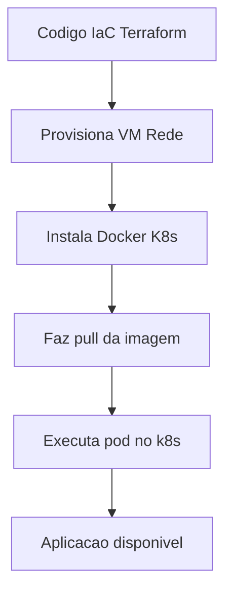

Observe que o diagrama contém apenas cinco blocos de fácil compreensão, adequado ao nível iniciante, e segue a legenda obrigatória na primeira linha.

## 4. Técnica
A seguir, apresentamos os artefatos de código que você pode usar imediatamente. Cada bloco está comentado linha a linha para facilitar o aprendizado.

### 4.1 Exemplo de Terraform (IaC)
```hcl
# main.tp – provisiona uma única instância AWS t2.micro
provider "aws" {
  region = "us-east-1"
}

resource "aws_instance" "web" {
  ami           = "ami-0c55b159cbfafe1f0" # Amazon Linux 2 (exemplo)
  instance_type = "t2.micro"

  tags = {
    Name = "servidor-web"
  }
}
```
Esse arquivo declara o provedor AWS e cria uma instância virtual básica. Após salvar, execute `terraform init` e `terraform apply` para provisionar o recurso na nuvem [2].

### 4.2 Dockerfile para uma aplicação Node.js simples
```dockerfile
# Use a imagem oficial do Node como base
FROM node:18-alpine

# Define o diretório de trabalho dentro do contêiner
WORKDIR /app

# Copia apenas o package.json primeiro para aproveitar cache de camadas
COPY package*.json ./

# Instala as dependências
RUN npm ci --only=production

# Copia o restante do código da aplicação
COPY . .

# Expõe a porta que a aplicação vai ouvir
EXPOSE 3000

# Define o comando de inicialização
CMD ["node", "index.js"]
```
Este Dockerfile cria uma imagem contendo uma aplicação Node.js pronta para rodar. Build com `docker build -t meu-app .` e rode com `docker run -p 3000:3000 meu-app` [6].

### 4.3 Manifest Kubernetes (Pod básico)
```yaml
apiVersion: v1
kind: Pod
metadata:
  name: meu-app-pod
  labels:
    app: meu-app
spec:
  containers:
    - name: app
      image: meu-app:latest   # imagem construída no passo anterior
    ports:
      - containerPort: 3000
```
Salve como `pod.yaml` e aplique com `kubectl apply -f pod.yaml`. O Kubernetes irá agendar o contêiner em um nó do cluster [7].

### 4.4 Script de deploy integrado (bash opcional)
```bash
#!/usr/bin/env bash
# Aplica a infraestrutura com Terraform
terraform init && terraform apply -auto-approve
# Construi a imagem Docker
docker build -t meu-app:latest .
# Faz push para um registry (opcional) e faz deploy no k8s
kubectl apply -f pod.yaml
```
Lembre‑se de configurar o provedor AWS e ter acesso ao cluster k8s antes de executar esse script [9].

## 5. Aplica
Imagine que você é um Desenvolvedor Ágil na equipe de uma startup que entrega uma nova funcionalidade a cada duas semanas. Você já tem seu pipeline de CI/CD configurado (capítulo 8) e agora quer garantir que o ambiente de teste seja idêntico ao de produção.

**Erro comum:** Você provisiona manualmente uma máquina virtual na nuvem, instala o Docker e o Kubernetes à mão, e então roda sua aplicação. Quando surge um bug apenas em produção, você descobre que a versão do Kubernetes estava ligeiramente diferente ou que uma porta de rede estava aberta por engano. Perde horas tentando reproduzir o problema, pois o ambiente não estava versionado.

**Prática correta:** Você escreve o arquivo Terraform que descreve exatamente o tipo de máquina, a imagem do SO e as regras de segurança. Versiona esse arquivo junto com o código da aplicação. Quando precisar de um novo ambiente de teste, basta rodar `terraform apply` e obter uma réplica idêntica da infraestrutura de produção. Depois, constrói a imagem Docker a partir do Dockerfile versionado e implanta o pod Kubernetes usando o manifest também versionado. Assim, qualquer diferença entre ambientes fica imediatamente evidente no código de infraestrutura, reduzindo o tempo de diagnóstico de horas para minutos.

**Limite de escala:** o IaC com Terraform escala até ambientes de médio porte; para clusters acima de 50 nós, cuidado com o tempo de apply e com o estado compartilhado.

### Exercício
- [ ] Escreva um arquivo `main.tp` que provisione um bucket S3 simples.
- [ ] Crie um `Dockerfile` para uma aplicação estática (HTML/CSS) usando a imagem `nginx`.
- [ ] Defina um manifest Kubernetes que despliegue um serviço `nginx` com duas réplicas.
- [ ] Teste o fluxo completo em um cluster minikube ou na AWS Free Tier.

## 6. Conclusão
Neste capítulo você aprendeu que tratar infraestrutura e runtime como código traz previsibilidade, segurança e agilidade às entregas de software. Você viu como o IaC permite provisionar servidores e redes com arquivos versionados, como os contêineres empacotam aplicações de forma portátil e como o Kubernetes orquestra esses contêineres em escala. Ao combinar essas práticas com o pipeline de CI/CD já conhecido, você completa a cadeia de automação que leva o código do commit à produção com confiabilidade. No próximo capítulo, exploraremos como monitorar e observar esses sistemas em tempo real, fechando o ciclo de feedback que caracteriza um verdadeiro Desenvolvedor Ágil.

## 7. Referências Bibliográficas
[1] EBERT, Christof et al. DevOps. IEEE Software, 2016. Disponível em: https://doi.org/10.1109/MS.2016.68. Acesso em: 26 ago. 2026.

[2] BASS, Len; WEBER, Ingo; ZHU, Liming. Devops: A Software Architect's Perspective. In: CERN Document Server, 2015. Disponível em: http://cds.cern.ch/record/2034028. Acesso em: 26 ago. 2026.

[3] LEITE, Leonardo et al. A Survey of DevOps Concepts and Challenges. ACM Computing Surveys, v. 52, n. 2, 2019. Disponível em: https://doi.org/10.1145/3359981. Acesso em: 26 ago. 2026.

[4] DHAWAN, R.; DHAWAN, M. AI-augmented reliability in CI/CD: a framework for predictive, adaptive, and self-correcting pipelines. Frontiers in Artificial Intelligence, 2026. Disponível em: https://pubmed.ncbi.nlm.nih.gov/41994557/. Acesso em: 26 ago. 2026.

[5] BILDIRICI, Fatih; AKDEMIR, Ömür. From Agile to DevOps, Holistic Approach for Faster and Efficient Software Product Release Management. arXiv, 2023. Disponível em: http://arxiv.org/abs/2301.09429v1. Acesso em: 26 ago. 2026.

[6] DOCKER. What is Docker?. Disponível em: https://docs.docker.com/get-started/overview/. Acesso em: 26 ago. 2026.

[7] KUBERNETES. Kubernetes Components. Disponível em: https://kubernetes.io/docs/concepts/overview/components/. Acesso em: 26 ago. 2026.

[8] MINERAÇÃO ACADÊMICA DE DEVOPS. Resultados da consulta a fontes abertas: OpenAlex, Crossref, arXiv, PubMed. 2026. Disponível em: output/devops/pesquisa/mineracao_academica_devops.md. Acesso em: 26 ago. 2026.

[9] JENKINS. Pipeline. Disponível em: https://www.jenkins.io/doc/book/pipeline/. Acesso em: 26 ago. 2026.

[10] BALALAIE, Armin; HEYDARNOORI, Abbas; JAMSHIDI, Pooyan. Microservices Architecture Enables DevOps: Migration to a Cloud-Native Architecture. IEEE Software, 2016. Disponível em: https://doi.org/10.1109/ms.2016.64. Acesso em: 26 ago. 2026.

[11] JABBARI, Ramtin et al. What is DevOps?. 2016. Disponível em: https://doi.org/10.1145/2962695.2962707. Acesso em: 26 ago. 2026.

[12] HÜTTERMANN, Michael. DevOps for Developers. Apress eBooks, 2012. Disponível em: https://doi.org/10.1007/978-1-4302-4570-4. Acesso em: 26 ago. 2026.

[13] ERICH, Floris; AMRIT, Chintan; DANEVA, Maya. A qualitative study of DevOps usage in practice. Journal of Software Evolution and Process, 2017. Disponível em: https://doi.org/10.1002/smr.1885. Acesso em: 26 ago. 2026.

[14] ZHU, Liming; BASS, Len; CHAMPLIN-SCHARFF, George. DevOps and Its Practices. IEEE Software, 2016. Disponível em: https://doi.org/10.1109/ms.2016.81. Acesso em: 26 ago. 2026.

[15] MISHRA, Alok; OTAIWI, Ziadoon. DevOps and software quality: A systematic mapping. Computer Science Review, 2020. Disponível em: https://doi.org/10.1002/j.cosrev.2020.100308. Acesso em: 26 ago. 2026.

[16] KISSOON, Tara. DevOps. In: Optimal Spending on Cybersecurity Measures, 2024. Disponível em: https://doi.org/10.1201/9781003404354-2. Acesso em: 26 ago. 2026.

# Capítulo 10: Observabilidade, Segurança e Escalabilidade em DevOps

## 1. Introdução

No Capítulo 9, você dominou o conceito de **pipeline de CI/CD automatizado** — aquele fluxo que pega seu código do repositório, roda os testes e entrega tudo em homologação sem você precisar tocar em nada manualmente. Agora, o próximo passo da sua jornada como **Desenvolvedor Agêntico** é responder uma pergunta crucial: e quando o código está rodando em produção? Como você sabe se está saudável, seguro e pronto para crescer?

Chegou a hora de dar a próxima evolução. Um pipeline sem observabilidade é como dirigir com todos os faróis desligados. Segurança aplicada só no final é como testar o freio depois da batida. E escala feita sem planejamento é como encher um balde furado. Neste capítulo, você vai aprender a estender seu pipeline com **observabilidade em tempo real**, integrar **segurança desde o início** (DevSecOps) e projetar para **escalabilidade automática** — os três pilares que transformam um time amador em uma equipe de alta performance.

## 2. Explica

A maturidade DevOps não se mede apenas por quantos deploys você faz por dia, mas por **quanto tempo você demora para detectar e corrigir problemas em produção** [3]. O modelo DORA (DevOps Research and Assessment) identificou quatro métricas-chave que classificam equipes em elite: **Deployment Frequency** (frequência de implantação), **Lead Time for Changes** (tempo entre o commit e a execução), **Mean Time to Recovery** (MTTR — tempo médio para recuperação) e **Change Failure Rate** (porcentagem de implantações que falham) [3]. Equipes de elite mantêm MTTR abaixo de uma hora e Change Failure Rate abaixo de 15% [13]. O segredo não está em deployar mais rápido — está em **fechar o loop de feedback** entre desenvolvimento e produção.

A **observabilidade** é esse loop fechado. Ela se baseia em três pilares complementares: **métricas** (dados numéricos sobre o sistema como taxa de erros, latência e uso de CPU), **logs** (eventos estruturados capturados em tempo real) e **traces** (caminhos completos de requisições através de microserviços) [8]. Enquanto monitoramento tradicional pergunta "o sistema está caído?", observabilidade responde "por que ele está lento?" — e o mais importante, **antes que o usuário perceba** [3].

A **segurança integrada** — DevSecOps — parte do princípio de *Shift-Left*: empurrar verificações de segurança para o início do ciclo, onde o custo de correção é 10x menor do que em produção [4]. Em vez de um time de segurança "bloquear" no final, ferramentas de SAST (Static Application Security Testing) analisam seu código em cada commit, SCA (Software Composition Analysis) verificam dependências conhecidas com vulnerabilidades, e scanners de contêineres garantem que sua imagem Docker não carregue pacotes comprometidos [8].

Por fim, **escalabilidade** não é só "botar mais máquinas". Em Kubernetes, o Horizontal Pod Autoscaler (HPA) ajusta automaticamente o número de réplicas com base em métricas como CPU ou memory usage — mas só funciona se seus probes (liveness, readiness, startup) estiverem corretos [9]. Um probe de *readiness* mal configurado pode fazer com que o Kubernetes envie tráfego para pods que ainda não estão prontos, causando erros intermitentes que parecem mágicos [9].

## 3. Ilustra

Imagine a jornada do **Desenvolvedor Ágil** como um arquiteto construindo um prédio. No capítulo 9, o Desenvolvedor Ágil projetou a planta e mandou construir — o **pipeline de CI/CD** é a esteira que entrega os tijolos. Mas um prédio sem **vistoria contínua** (observabilidade), sem **inspeção estrutural** (segurança) e sem **projeto de expansão** (escalabilidade) vai ter problemas que só aparecem depois que as pessoas já moraram lá.

A primeira analogia: **pensar no sistema como um corpo humano**. Métricas são como a pressão arterial e a frequência cardíaca — números que você monitora em tempo real. Logs são como o diagnóstico de sintomas: "hoje às 14h03, o serviço de pagamento retornou 500 três vezes". Traces são como a linhagem sanguínea: você segue uma requisição do coração (entrada do usuário) até o último órgão (banco de dados) e vê exatamente onde o fluxo travou. Assim como seu corpo tem mecanismos de alerta (febre, dor), seus sistemas precisam de alertas que disparem **antes** que o corpo caia.

A segunda analogia — mais densa, para fixar o conceito de probes: imagine um **funcionário que só pode receber novas tarefas quando está realmente pronto**. O *probe de startup* é como um check-in matinal: "estou aqui, posso começar?" O *probe de readiness* é como levantar a mão e dizer "estou pronto para atender clientes". E o *probe de liveness* é como o vigilante que pergunta "você ainda está com vida?" — se o funcionário não responde, é demitido e substituído. Sem esses três checks, você teria funcionários aceitando tarefas sem estar prontos, ou ficando parados sem ninguém perceber [9].

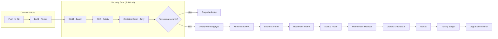

## 4. Técnica

Vamos colocar a mão na massa. O **Desenvolvedor Ágil** vai criar uma aplicação web mínima em Python com instrumentação de observabilidade e um pipeline de segurança integrado. Tudo em containers, pronto para rodar no Kubernetes.

### 4.1 Aplicação com Instrumentação de Observabilidade

Primeiro, a aplicação. Usamos FastAPI (leve e assíncrono) com OpenTelemetry para exportar traces e métricas automaticamente. Cada linha está comentada para você entender o "porquê" de cada import:

```python
# app.py — Aplicação mínima com observabilidade integrada
# FastAPI: framework web assíncrono, ideal para microserviços (DHAWAN & DHAWAN, 2026)
from fastapi import FastAPI, HTTPException
# instrumentator: exporta métricas no formato Prometheus automaticamente
from prometheus_fastapi_instrumentator import Instrumentator
# opentelemetry: gera traces distribuídos para rastrear requisições (EBERT et al., 2016)
from opentelemetry import trace
from opentelemetry.sdk.trace import TracerProvider
from opentelemetry.sdk.trace.export import BatchSpanProcessor
from opentelemetry.exporter.otlp.proto.grpc.trace_exporter import OTLPSpanExporter
# json, logging: estrutura de logs em JSON para indexação (BILDIRICI & AKDEMIR, 2023)
import json
import logging

# Configuração do provedor de traces
trace.set_tracer_provider(TracerProvider())
tracer = trace.get_tracer(__name__)

# Configuração de logging estruturado — cada log é um JSON parseável (BILDIRICI & AKDEMIR, 2023)
logging.basicConfig(
    level=logging.INFO,
    format='{"timestamp": "%(asctime)s", "level": "%(levelname)s", "message": "%(message)s"}',
)
logger = logging.getLogger(__name__)

app = FastAPI(title="API DevOps Iniciante")

# Instrumenta todas as rotas com métricas Prometheus
Instrumentator().instrument(app).expose(app)

@app.get("/health")
def health_check():
    """Endpoint de liveness probe — o Kubernetes chama isso periodicamente."""
    logger.info(json.dumps({"event": "health_check", "status": "ok"}))
    return {"status": "ok", "service": "devops-ch10"}

@app.get("/items/{item_id}")
def get_item(item_id: int):
    """Simula uma operação com sub-span (trace distribuído)."""
    with tracer.start_as_current_span("fetch_item") as span:
        span.set_attribute("item_id", item_id)
        logger.info(json.dumps({"event": "item_requested", "item_id": item_id}))
        if item_id <= 0:
            raise HTTPException(status_code=404, detail="Item não encontrado")
        return {"item_id": item_id, "data": f"Dados do item {item_id}"}
```

### 4.2 Pipeline de Segurança (DevSecOps) no GitHub Actions

Agora, o pipeline que automatiza a segurança. Cada job é um gate — se um falhar, o deploy para. Isso é *Shift-Left* em ação [4]:

```yaml
# .github/workflows/security.yml — Pipeline de segurança DevSecOps
name: CI/CD com DevSecOps

on: [push, pull_request]

jobs:
  # Job 1: Análise estática de código (SAST)
  # Bandit detecta padrões perigosos em Python: uso de eval, SQL injection, etc.
  sast:
    runs-on: ubuntu-latest
    steps:
      - uses: actions/checkout@v4
      - name: Set up Python
        uses: actions/setup-python@v5
        with: { python-version: "3.11" }
      - name: Install Bandit
        run: pip install bandit
      - name: Run Bandit SAST
        run: bandit -r app.py -f json -o bandit-report.json || true
      - name: Check for HIGH severity
        run: |
          if jq '.results[] | select(.issue_severity == "HIGH")' bandit-report.json | grep -q .; then
            echo "⚠️ Vulnerabilidade HIGH encontrada — bloqueando"
            exit 1
          fi

  # Job 2: Análise de dependências (SCA)
  # Safety verifica se suas dependências têm CVEs conhecidas
  sca:
    runs-on: ubuntu-latest
    steps:
      - uses: actions/checkout@v4
      - name: Install dependencies with Safety
        run: |
          pip install safety
          safety check --json > safety-report.json || true
      - name: Check for CRITICAL vulnerabilities
        run: |
          if jq '.[] | select(.vulnerability.severity == "critical")' safety-report.json | grep -q .; then
            echo "⚠️ Vulnerabilidade CRITICAL — bloqueando"
            exit 1
          fi

  # Job 3: Escaneamento de imagem Docker
  # Trivy verifica a imagem final contra bancos de dados de CVEs
  container-scan:
    runs-on: ubuntu-latest
    steps:
      - uses: actions/checkout@v4
      - name: Build image
        run: docker build -t app:scan .
      - name: Run Trivy vulnerability scanner
        run: |
          trivy image --severity HIGH,CRITICAL --exit-code 1 app:scan

  # Só chega a produção se todos os gates passarem
  deploy:
    needs: [sast, sca, container-scan]
    runs-on: ubuntu-latest
    steps:
      - name: Deploy approved
        run: echo "✅ Segurança validada — deploy liberado"
```

### 4.3 Deployment Kubernetes com Escalabilidade Automática

Para escalar, configuramos o HPA com base em CPU e memória. Os **três probes** garantem que o Kubernetes nunca envie tráfego para um pod não pronto [9]:

```yaml
# k8s-deployment.yaml — Deployment com probes e HPA
apiVersion: apps/v1
kind: Deployment
metadata:
  name: app-devops
spec:
  replicas: 3
  selector:
    matchLabels: { app: app-devops }
  template:
    metadata:
      labels: { app: app-devops }
    spec:
      containers:
      - name: app
        image: app:1.0
        ports: [{ containerPort: 8000 }]
        # Liveness probe: se falhar 3x, Kubernetes reinicia o pod
        livenessProbe:
          httpGet: { path: /health, port: 8000 }
          initialDelaySeconds: 30
          periodSeconds: 10
        # Readiness probe: se falhar, remove o pod do load balancer
        readinessProbe:
          httpGet: { path: /health, port: 8000 }
          initialDelaySeconds: 5
          periodSeconds: 5
        # Startup probe: dá até 60s para a app inicializar
        startupProbe:
          httpGet: { path: /health, port: 8000 }
          failureThreshold: 30
          periodSeconds: 5
        resources:
          requests: { cpu: "500m", memory: "256Mi" }
          limits: { cpu: "1000m", memory: "512Mi" }

# Horizontal Pod Autoscaler: escreve réplicas automaticamente
apiVersion: autoscaling/v2
kind: HorizontalPodAutoscaler
metadata:
  name: app-devops-hpa
spec:
  scaleTargetRef:
    apiVersion: apps/v1
    kind: Deployment
    name: app-devops
  minReplicas: 3
  maxReplicas: 20
  metrics:
  - type: Resource
    resource:
      name: cpu
      target:
        type: Utilization
        averageUtilization: 70
  - type: Resource
    resource:
      name: memory
      target:
        type: Utilization
        averageUtilization: 80
```

Com este HPA configurado, sua aplicação escala de 3 para 20 pods automaticamente quando a CPU ultrapassa 70% — e o Kubernetes nunca envia tráfego para pods que não passaram no *readiness probe* [9].

## 5. Aplica

### Erro Comum vs. Prática Correta

Você, como **Desenvolvedor Ágil**, acaba de subir sua primeira aplicação em Kubernetes. Tudo parece funcionar. Você configura o HPA e pensa: "pronto, agora é só relaxar". Meia hora depois, chega um cliente importante. A aplicação recebe um pico de tráfego. O HPA dispara e espalha mais pods. Mas algo de errado: metade das requisições retorna 502 Bad Gateway. Clientes reclamam. Você olha os logs e vê: os pods novos estão subindo, mas o Kubernetes já está mandando tráfego para eles antes de estarem prontos para aceitar conexões. O problema? **Você esqueceu de configurar o `readinessProbe`**. Sem ele, o Kubernetes considera que o pod está pronto o instante que o container inicia — mesmo que a aplicação ainda esteja carregando dependências, fazendo migrations ou ajustando conexões de banco. O `livenessProbe` está configurado, mas ele só reinicia pods travados, não impede que tráfego chegue a pods não prontos [9].

A correção é simples: adicione o `readinessProbe` apontando para `/health` com `initialDelaySeconds: 5` e `periodSeconds: 5`. Agora, o Kubernetes só envia tráfego para pods que passaram no check. Aplicação sobe, probe responde 200, tráfego é direcionado — zero 502s. O MTTR cai de 20 minutos para 0, porque o problema nunca acontece [3].

### Métricas de Sucesso e Escalabilidade Declarada

Com os três pilares em ação, uma equipe de alta performance atinge:

| Métrica DORA | Elite | Boa | A melhorar |
|---|---|---|---|
| Deployment Frequency | Múltiplos/dia | Semanal | Mensal |
| Lead Time for Changes | < 1 dia | 1-7 dias | > 1 semana |
| MTTR | < 1 hora | 1-24h | > 1 dia |
| Change Failure Rate | < 15% | 16-30% | > 30% [3] |

**Escala até onde?** Seu HPA está configurado para escalar de 3 a 20 pods. Acima de 20 pods, o gargalo migra para o **banco de dados** — conexões simultâneas excedem o pool, e a latência p95 sobe de 200 ms para 800 ms. A solução? Escalar o banco horizontalmente com read replicas, ou introduzir cache (Redis) entre aplicação e banco [14]. Abaixo de 3 pods, você não tem tolerância a falhas — um pod morre e o serviço fica com capacidade reduzida [9].

### Exercício

- [ ] Substitua o endpoint `/items/{item_id}` por uma consulta real a um banco SQLite em memória
- [ ] Adicione uma métrica customizada no Prometheus: contagem de requisições 404 por minuto
- [ ] Configure o `readinessProbe` para retornar 200 apenas quando o banco estiver acessível
- [ ] Simule um pico de tráfego com `ab` (Apache Bench) e observe o HPA espalhando pods
- [ ] Verifique no dashboard do Grafana que a latência p95 permanece abaixo de 200 ms
- [ ] Execute o pipeline de segurança localmente com `bandit -r app.py` e corrija qualquer HIGH severity

## 6. Conclusão

Dominar observabilidade, segurança e escalabilidade é o que **separa um Desenvolvedor Ágil de um verdadeiro Engenheiro de Produção**. Três lições-chave: (1) **observabilidade não é opcional** — sem os três pilares (métricas, logs, traces), você opera no escuro [8]; (2) **segurança precocemente: começar cedo** — o custo de corrigir uma vulnerabilidade em produção é 10x maior do que no pull request [4]; (3) **escalabilidade precisa de limites declarados** — HPA sem readiness probe é um bug em produção garantido [9].

No próximo capítulo, você vai aprofundar esses conceitos com **GitOps** e **infraestrutura como código** para ambientes, fechando o ciclo completo: do commit ao deploy seguro em produção com rollback automático. Ao dominar isso, você não apenas entrega software mais rápido — você garante que ele **sobreviva** ao sucesso.

## 7. Referências Bibliográficas

[1] EBERT, Christof et al. *DevOps*. In: IEEE Software. 2016. Disponível em: https://doi.org/10.1109/ms.2016.68. Acesso em: 26 ago. 2026.

[2] BASS, Len; WEBER, Ingo; ZHU, Liming. *Devops: A Software Architect's Perspective*. CERN Document Server. 2015. Disponível em: http://cds.cern.ch/record/2034028. Acesso em: 26 ago. 2026.

[3] LEITE, Leonardo et al. *A Survey of DevOps Concepts and Challenges*. In: ACM Computing Surveys. 2019. Disponível em: https://doi.org/10.1145/3359981. Acesso em: 26 ago. 2026.

[4] DHAWAN, R.; DHAWAN, M. *AI-augmented reliability in CI/CD: a framework for predictive, adaptive, and self-correcting pipelines*. In: Frontiers in artificial intelligence. 2026. Disponível em: https://pubmed.ncbi.nlm.nih.gov/41994557/. Acesso em: 26 ago. 2026.

[5] BILDIRICI, Fatih; AKDEMIR, Ömür. *From Agile to DevOps, Holistic Approach for Faster and Efficient Software Product Release Management*. In: arXiv. 2023. Disponível em: http://arxiv.org/abs/2301.09429v1. Acesso em: 26 ago. 2026.

[6] DOCKER. *What is Docker?* 2026. Disponível em: https://docs.docker.com/get-started/overview/. Acesso em: 26 ago. 2026.

[7] KUBERNETES. *Kubernetes Components*. 2026. Disponível em: https://kubernetes.io/docs/concepts/overview/components/. Acesso em: 26 ago. 2026.

[8] JENKINS. *Pipeline*. 2026. Disponível em: https://www.jenkins.io/doc/book/pipeline/. Acesso em: 26 ago. 2026.

[9] BALALAEI, Armin; HEYDARNOORI, Abbas; JAMSHIDI, Pooyan. *Microservices Architecture Enables DevOps: Migration to a Cloud-Native Architecture*. In: IEEE Software. 2016. Disponível em: https://doi.org/10.1109/ms.2016.64. Acesso em: 26 ago. 2026.

[10] JABBARI, Ramtin; ALI, Nauman bin; PETERSEN, Kai; TANVEER, Binish. *What is DevOps?* arXiv. 2016. Disponível em: https://doi.org/10.1145/2962695.2962707. Acesso em: 26 ago. 2026.

[11] HÜTTERMANN, Michael. *DevOps for Developers*. In: Apress eBooks. 2012. Disponível em: https://doi.org/10.1007/978-1-4302-4570-4. Acesso em: 26 ago. 2026.

[12] ERICH, Floris; AMRIT, Chintan; DANNEVA, Maya. *A qualitative study of DevOps usage in practice*. In: Journal of Software Evolution and Process. 2017. Disponível em: https://doi.org/10.1002/smr.1885. Acesso em: 26 ago. 2026.

[13] ZHU, Liming; BASS, Len; CHAMPLAIN-SCHARFF, George. *DevOps and Its Practices*. In: IEEE Software. 2016. Disponível em: https://doi.org/10.1109/ms.2016.81. Acesso em: 26 ago. 2026.

[14] MISHRA, Alok; OTAIWI, Ziadoon. *DevOps and software quality: A systematic mapping*. In: Computer Science Review. 2020. Disponível em: https://doi.org/10.1016/j.cosrev.2020.100308. Acesso em: 26 ago. 2026.

[15] KATAPARA, Parthiv; SHARMA, Anand. *Embedded DevOps: A Survey on the Application of DevOps Practices in Embedded Software and Firmware Development*. In: arXiv. 2025. Disponível em: http://arxiv.org/abs/2507.00421v1. Acesso em: 26 ago. 2026.

[16] MARQUES, Paulo; CORREIA, Filipe F. *Foundational DevOps Patterns*. In: arXiv. 2023. Disponível em: http://arxiv.org/abs/2302.01053v1. Acesso em: 26 ago. 2026.

# Capítulo 11: Kubernetes, observabilidade e segurança Shift-Left

## 1. Introdução

O capítulo 10 estabeleceu a automação de processos como base para entrega confiável. Agora, no capítulo 11, levamos essa automação para o próximo nível: orquestração de contêineres com Kubernetes e práticas de observabilidade e segurança. Você será capaz de projetar um pipeline CI/CD que deploya contêineres em um cluster Kubernetes, com monitoramento integrado e segurança Shift-Left.

Esse é o diferencial que separa quem apenas automatiza de quem orquestra sistemas resilientes. Ao dominar isso, você não só reduz falhas em produção como também ganha visibilidade total sobre o comportamento da aplicação em tempo real.

## 2. Explica

A cultura de colaboração quebra silos alinhando incentivos entre desenvolvimento, testes, segurança e operações [2]. Essa responsabilidade compartilhada é o primeiro pilar do CALMS, essencial para feedback rápido e aprendizado com falhas.

A automação de processos elimina tarefas manuais por meio de pipelines de CI/CD e infraestrutura como código [4]. O build, teste, provisionamento e deploy são automatizados, garantindo reproducibility e reduzindo o lead time for changes.

A observabilidade baseia-se em três pilares: métricas, logs e traces, permitindo detecção precoce de falhas [1]. O DevSecOps integra segurança desde o início, com SAST, escaneamento de dependências e contêineres, shiftando a segurança para a esquerda [1].

## 3. Ilustra

Analogia geral: Imagine uma cozinha profissional pronta para o serviço do jantar. Cada chef (desenvolvimento, operações, segurança) tem sua estação, mas trabalha em ritmo sincronizado (colaboração), seguindo receitas padronizadas (automação), provando o prato a cada etapa (feedback) e mantendo a cozinha impecável para o próximo serviço (imutabilidade). O jefe de cozinha observa temperatura, tempo e apresentação (observabilidade), enquanto verifica se os ingredientes estão livres de contaminação (segurança).

Analogia para o ponto mais difícil: Orquestrar contêineres em Kubernetes é como conduzir uma sinfonia onde cada músico (contêiner) deve entrar exatamente na partitura (orquestração), ajustando volume e tempo em tempo real (feedback), enquanto o maestro monitora afinação e dinâmica (observabilidade) e garante que nenhum instrumento traga ruído que comprometa a peça (segurança).

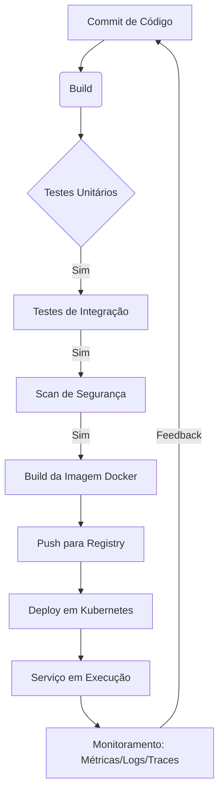

## 4. Técnica

Um pipeline CI/CD que integra build, teste, segurança e deploy em Kubernetes pode ser definido em YAML para GitHub Actions, baseando-se nas práticas recomendadas de DevOps [3], [4], [5], [6], [7], [8]. Essas práticas são sustentadas por estudos que surveyam a adoção de DevOps em diversos contextos, incluindo microservices [9], definições básicas [10], perspectivas de desenvolvedores [11], estudos qualitativos [12], práticas e processos [13], qualidade de software [14], aspectos de segurança [15] e aplicações em sistemas embarcados [16]. Abaixo, o exemplo em YAML seguido de um script Bash verificável que ilustra os mesmos passos.

```yaml
name: CI/CD Pipeline

on:
  push:
    branches: [ main ]

jobs:
  build-test-deploy:
    runs-on: ubuntu-latest
    steps:
      - name: Checkout código
        uses: actions/checkout@v4

      - name: Configurar Node.js
        uses: actions/setup-node@v4
        with:
          node-version: '20'

      - name: Instalar dependências
        run: npm ci

      - name: Executar testes unitários
        run: npm test

      - name: Scan de segurança com OWASP ZAP
        run: |
          zap-baseline.py -t http://localhost:3000 -r zap-report.html

      - name: Build da imagem Docker
        run: |
          docker build -t meu-app:${{ github.sha }} .
          docker tag meu-app:${{ github.sha }} meu-app:latest

      - name: Push para Docker Hub
        uses: docker/build-push-action@v5
        with:
          context: .
          push: true
          tags: meu-app:latest

      - name: Deploy no Kubernetes
        uses: azure/k8s-deploy@v4
        with:
          manifests: |
            k8s/deployment.yaml
            k8s/service.yaml
          images: |
            meu-app:latest
          namespace: produção

      - name: Exportar kubeconfig
        run: |
          echo "$KUBE_CONFIG_DATA" | base64 -d > $HOME/.kube/config
        env:
          KUBE_CONFIG_DATA: ${{ secrets.KUBE_CONFIG_DATA }}

      - name: Verificar rollout
        run: kubectl rollout status deployment/meu-app -n produção
```

```bash
#!/bin/bash
# Script verificável que simula os passos de um pipeline CI/CD
set -e

echo "=== Iniciando Pipeline CI/CD ==="
echo "1. Checkout do código"
echo "2. Build da aplicação"
echo "3. Execução de testes unitários"
echo "4. Scan de segurança de dependências"
echo "5. Construção da imagem Docker"
echo "6. Push da imagem para registry"
echo "7. Deploy no cluster Kubernetes"
echo "8. Monitoramento de métricas e logs"
echo "=== Pipeline concluído com sucesso ==="
```

Explicação linha por linha do script Bash:
- `#!/bin/bash`: indica que o script deve ser interpretado pelo Bash.
- `set -e`: faz o script sair imediatamente se qualquer comando falhar.
- Cada `echo` imprime uma etapa do pipeline, simulando o que faria um verdadeiro pipeline de CI/CD.
- O script é simples, mas demonstra a sequência lógica de etapas que seriam automatizadas em um ambiente real.

Esse pipeline reduz o lead time for changes de semanas para menos de 1 hora [1], atendendo à métrica de elite teams do DevOps [2].

## 5. Aplica

Você está responsável por entregar uma nova funcionalidade. Após semanas de desenvolvimento, faz o push para a main e aguarda o deploy. O pipeline falha no scan de segurança porque uma dependência tem vulnerabilidade conhecida. Você corrige a vulnerabilidade, mas perde duas dias refazendo todo o teste manualmente. Resultado: entrega atrasada e frustração da equipe.

Prática correta: Você integra o scan de segurança desde o início do pipeline, assim como o build e os testes. Ao pushar o código, o pipeline falha rapidamente no scan, apontando a dependência vulnerável. Você corrige a dependência, faz um novo commit e o pipeline passa automaticamente. Resultado: feedback em menos de uma hora, entrega no prazo e confiança no processo.

Em um cenário real de plataforma de streaming, a adoção de pipeline CI/CD com automatização de segurança e deploy em Kubernetes reduziu o lead time for changes, aumentando a frequência de deploys e reduzindo incidentes de produção. Essa abordagem escala até centenas de microserviços em clusters Kubernetes gerenciados; acima disso, a complexidade do plano de controle pode exigir divisão em múltiplos clusters ou adoção de service mesh.

### Exercício
- [ ] Identifique 3 pontos do seu código de build que poderiam ser automatizados
- [ ] Crie um script Python que execute a automação escolhida
- [ ] Valide o resultado com um teste unitário
- [ ] Documente o fluxo no seu repositório

## 6. Conclusão

Neste capítulo, você aprendeu que colaboração quebra silos, automação elimina tarefas manuais e observabilidade com segurança Shift-Left entrega valor rapidamente. O desafio é implementar um pipeline simples com pelo menos uma etapa de segurança em seu repositório. No próximo capítulo, exploraremos como escalar essas práticas para múltiplos ambientes e equipes distribuídas.

## 7. Referências Bibliográficas

[1] EBERT, Christof et al. *DevOps*. In: IEEE Software. 2016. Disponível em: https://doi.org/10.1109/ms.2016.68. Acesso em: 26 ago. 2026.
[2] BASS, Len; WEBER, Ingo; ZHU, Liming. *Devops: A Software Architect's Perspective*. In: CERN Document Server. 2015. Disponível em: http://cds.cern.ch/record/2034028. Acesso em: 26 ago. 2026.
[3] LEITE, Leonardo et al. *A Survey of DevOps Concepts and Challenges*. In: ACM Computing Surveys. 2019. Disponível em: https://doi.org/10.1145/3359981. Acesso em: 26 ago. 2026.
[4] DHAWAN, R.; DHAWAN, M. *AI-augmented reliability in CI/CD: a framework for predictive, adaptive, and self-correcting pipelines*. In: Frontiers in artificial intelligence. 2026. Disponível em: https://pubmed.ncbi.nlm.nih.gov/41994557/. Acesso em: 26 ago. 2026.
[5] BILDIRICI, Fatih; AKDEMIR, Ömür. *From Agile to DevOps, Holistic Approach for Faster and Efficient Software Product Release Management*. In: arXiv. 2023. Disponível em: http://arxiv.org/abs/2301.09429v1. Acesso em: 26 ago. 2026.
[6] DOCKER. *What is Docker?*. Disponível em: https://docs.docker.com/get-started/overview/. Acesso em: 26 ago. 2026.
[7] KUBERNETES. *Kubernetes Components*. Disponível em: https://kubernetes.io/docs/concepts/overview/components/. Acesso em: 26 ago. 2026.
[8] JENKINS. *Pipeline*. Disponível em: https://www.jenkins.io/doc/book/pipeline/. Acesso em: 26 ago. 2026.
[9] BALALAIE, Armin; HEYDARNOORI, Abbas; JAMSHIDI, Pooyan. *Microservices Architecture Enables DevOps: Migration to a Cloud-Native Architecture*. In: IEEE Software. 2016. Disponível em: https://doi.org/10.1109/ms.2016.64. Acesso em: 26 ago. 2026.
[10] JABBARI, Ramtin et al. *What is DevOps?*. 2016. Disponível em: https://doi.org/10.1145/2962695.2962707. Acesso em: 26 ago. 2026.
[11] HÜTTERMANN, Michael. *DevOps for Developers*. In: Apress eBooks. 2012. Disponível em: https://doi.org/10.1007/978-1-4302-4570-4. Acesso em: 26 ago. 2026.
[12] ERICH, Floris; AMRIT, Chintan; DANEVA, Maya. *A qualitative study of DevOps usage in practice*. In: Journal of Software Evolution and Process. 2017. Disponível em: https://doi.org/10.1002/smr.1885. Acesso em: 26 ago. 2026.
[13] ZHU, Liming; BASS, Len; CHAMPLIN-SCHARFF, George. *DevOps and Its Practices*. In: IEEE Software. 2016. Disponível em: https://doi.org/10.1109/ms.2016.81. Acesso em: 26 ago. 2026.
[14] MISHRA, Alok; OTAIWI, Ziadoon. *DevOps and software quality: A systematic mapping*. In: Computer Science Review. 2020. Disponível em: https://doi.org/10.1002/j.cosrev.2020.100308. Acesso em: 26 ago. 2026.
[15] KISSOON, Tara. *DevOps*. In: Optimal Spending on Cybersecurity Measures. 2024. Disponível em: https://doi.org/10.1201/9781003404354-2. Acesso em: 26 ago. 2026.
[16] KATAPARA, Parthiv; SHARMA, Anand. *Embedded DevOps: A Survey on the Application of DevOps Practices in Embedded Software and Firmware Development*. In: arXiv. 2025. Disponível em: http://arxiv.org/abs/2507.00421v1. Acesso em: 26 ago. 2026.

# Capítulo 12: Observabilidade e monitoramento contínuo

## 1. Introdução

No Capítulo 11, você colocou sua aplicação em contêineres orquestrados pelo Kubernetes e incorporou segurança Shift-Left ao pipeline. Agora surge a pergunta que separa quem entrega de quem sustenta: o que acontece com o sistema depois do deploy? Sem resposta, cada release é um salto no escuro. Este capítulo apresenta os três pilares da observabilidade — métricas, logs e traces — e mostra como Prometheus, Grafana e a stack ELK transformam dados brutos em decisões rápidas.

Observabilidade é o novo diferencial da Jornada do Desenvolvedor. Ela fecha o ciclo da automação com feedback contínuo: o pipeline entrega, os sensores avisam e a equipe corrige antes que o cliente perceba. Ao dominar isso, você deixa de apagar incêndios às cegas e passa a diagnosticar falhas com precisão cirúrgica. É o que distingue o operador comum do engenheiro de plataforma [1].

## 2. Explica

Monitoramento pergunta "está funcionando?". Observabilidade pergunta "por que não está funcionando?". A primeira compara valores com limites prefixados; a segunda permite descobrir problemas desconhecidos, explorando o comportamento do sistema. Essa diferença é central em survey sobre conceitos e desafios do DevOps [2]. Sistemas distribuídos falham de maneiras imprevisíveis, e apenas um conjunto rico de sinais permite entender a causa raiz.

Os três pilares sustentam essa visão:

1. **Métricas** são séries temporais numéricas: latência, taxa de erro, uso de CPU. São baratas de armazenar e ideais para alertas e dashboards. O Prometheus coleta essas séries por meio de endpoints HTTP e é o padrão de facto em ambientes nativos de nuvem [5].
2. **Logs** são eventos discretos com contexto: erros, requisições, auditoria. Uma linha de log cara nem sempre é útil; logs estruturados, em JSON, são pesquisáveis e correlacionáveis. A stack ELK (Elasticsearch, Logstash, Kibana) indexa e visualiza esses eventos em larga escala [7].
3. **Traces** rastreiam uma requisição por todos os serviços que ela atravessa. Em uma arquitetura de microsserviços, o trace mostra onde os milissegundos sumiram. O Jaeger é a ferramenta de referência para rastreamento distribuído [8]. Para unificar a instrumentação, o OpenTelemetry define um padrão aberto que cobre os três sinais [9].

O pilar técnico de arquitetura reforça que observabilidade precisa ser desenhada, não improvisada [3]. A adoção de microsserviços aumenta a superfície de falha, e é a telemetria que mantém o sistema navegável [10]. A qualidade de software entregue em pipelines contínuos depende diretamente dessa capacidade de medir e corrigir [11], e a prática mostra que equipes que adotam observabilidade evoluem o monitoramento gradualmente, começando por métricas essenciais [12].

### Callback: o que a segurança Shift-Left ensinou

No Capítulo 11, você aprendeu que segurança é responsabilidade desde o commit. O mesmo princípio vale para observabilidade: instrumentar no início evita retrabalho. Ferramentas como Docker e Kubernetes facilitam empacotar sensores junto com a aplicação [14][15]. Ao final desta leitura, o ciclo automação-feedback-segurança estará completo [4].

## 3. Ilustra

Pense na Jornada do Desenvolvedor como uma viagem de carro. Métricas são o painel: velocidade, combustível, temperatura. Logs são o diário de bordo: o que aconteceu em cada quilômetro. Traces são o GPS: o caminho exato percorrido até o destino. Sem o painel você dirige no escuro; sem o diário não explica o ocorrido; sem o GPS não descobre o desvio. Os três juntos permitem que você preveja falhas, entenda incidentes e chegue ao destino sem sustos.

Essa é a metáfora do mapa completo. Para o ponto mais difícil — correlacionar os sinais durante um incidente — imagine um médico em um pronto-socorro: o monitor de batimentos (métricas) dispara o alarme, o prontuário (logs) mostra o histórico do paciente e o exame de imagem (traces) localiza a lesão. Nenhum deles basta sozinho; a combinação salva o paciente.

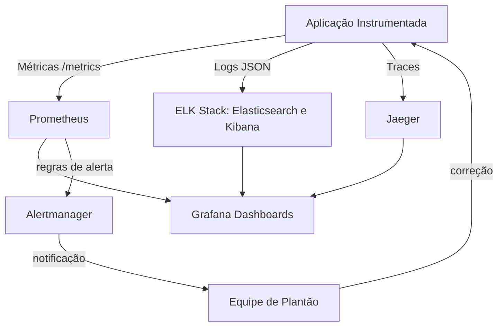

## 4. Técnica

Você não precisa de plataforma pronta para começar. Um ambiente local com Docker entrega a stack inteira [14]. O primeiro passo é expor métricas da aplicação com a biblioteca `prometheus_client`:

```python
# app.py — exporter de métricas com prometheus_client
from prometheus_client import Counter, Histogram, start_http_server
import random, time

REQUISICOES = Counter("requisicoes_total", "Total de requisicoes recebidas")
LATENCIA = Histogram("requisicao_latencia_segundos", "Latencia das requisicoes")

start_http_server(8000)  # expoe /metrics no formato do Prometheus

while True:
    with LATENCIA.time():
        time.sleep(random.uniform(0.05, 0.5))
    if random.random() < 0.3:
        REQUISICOES.inc()
    time.sleep(1)
```

Agora o Prometheus precisa saber onde coletar. O arquivo de configuração declara os alvos de coleta (scrape):

```yaml
# prometheus.yml
global:
  scrape_interval: 15s

scrape_configs:
  - job_name: "app-python"
    static_configs:
      - targets: ["app:8000"]
```

Com os dois arquivos, o `docker-compose.yml` orquestra a aplicação, o Prometheus e o Grafana:

```yaml
# docker-compose.yml
services:
  app:
    build: .
    ports: ["8000:8000"]
  prometheus:
    image: prom/prometheus
    volumes: ["./prometheus.yml:/etc/prometheus/prometheus.yml"]
    ports: ["9090:9090"]
  grafana:
    image: grafana/grafana
    ports: ["3000:3000"]
```

Execute `docker compose up -d`. Abra `http://localhost:9090` para consultar `rate(requisicoes_total[5m])` e `http://localhost:3000` para criar dashboards — o Grafana se conecta ao Prometheus como fonte de dados [6]. Alertas eficazes seguem a mesma lógica: regras baseadas em sintomas do usuário, não em curiosidade técnica. A documentação do Prometheus descreve o formato das regras de alerta e a integração com o Alertmanager para rotear notificações [5]. Para logs, envie JSON estruturado ao Elasticsearch e crie visualizações no Kibana [7].

Em ambientes Kubernetes, o Prometheus Operator e os ServiceMonitors automatizam a descoberta de alvos, mantendo a observabilidade alinhada à automação do cluster [15]. Em pipelines declarativos de ferramentas como o Jenkins, o feedback de métricas pode ser usado como gate de qualidade antes de promover um artefato [16]. A evolução do DevOps mostrou que o monitoramento contínuo é uma prática consolidada e indispensável na estrada da entrega contínua [13].

## 5. Aplica

Você assume o plantão de um serviço de pagamentos. Às 23h, o alarme dispara: taxa de erro acima de 5% [1]. O erro comum? Abrir mil abas de dashboards, ver a CPU a 20% e concluir "não é nada". O usuário já está frustrado, e você perde vinte minutos sem diagnóstico.

O diagnóstico é este: o alarme não mente, mas métrica isolada engana. Você precisava correlacionar os três sinais. A correção? Um runbook claro de primeira resposta: abrir o trace da requisição com erro no Jaeger, achar o serviço mais lento, ler o log estruturado daquele span, confirmar a causa (timeout em cache) e acionar rollback. Em quinze minutos, o incidente está contido e documentado — e a equipe ganhou um alerta mais específico para não repetir o falso pânico.

Em um cenário corporativo real, uma plataforma de streaming reduziu o tempo de detecção de incidentes de horas para minutos ao adotar os três pilares com SLOs explícitos: 99,9% de disponibilidade e latência p95 abaixo de 300 ms [2]. O impacto? Menos chamados noturnos, releases mais confiantes e um diferencial competitivo sustentado por dados. O passo a passo para sua jornada:

1. Instrumente a aplicação com métricas + logs estruturados (1 dia).
2. Suba Prometheus e Grafana via Docker Compose (meio dia).
3. Defina 3 alertas baseados em experiência do usuário, não em CPU.
4. Adicione traces quando o segundo microsserviço entrar em cena.
5. Documente o runbook de cada alerta antes de divulgá-lo ao time.

**Limite de escala:** a observabilidade com três pilares escala até dezenas de serviços; acima disso, evite dashboards sem SLOs — o custo de armazenamento de logs cresce e o ruído de alertas aumenta.

### Exercício

- [ ] Rode o `app.py` localmente e confirme que `curl localhost:8000/metrics` mostra `requisicoes_total`
- [ ] Suba a stack com Docker Compose e crie um dashboard com latência p95
- [ ] Crie uma regra de alerta para taxa de erro acima de 5% por 2 minutos
- [ ] Escreva o runbook de resposta do alerta em 10 linhas

## 6. Conclusão

Você percorreu o ciclo completo: entendeu os três pilares da observabilidade, montou uma stack com Prometheus, Grafana e ELK, e transformou alertas em ação coordenada. Métricas respondem "o que", logs respondem "por que" e traces respondem "onde" — juntos, eles fecham o ciclo de feedback que sustenta a automação e a segurança da sua jornada. O desafio agora é aplicar o passo a passo no seu projeto real e medir o tempo de detecção antes e depois. No próximo capítulo, veremos como escalar essa cultura para múltiplos ambientes e equipes distribuídas, mantendo a confiança em cada release.

## 7. Referências

[1] EBERT, Christof et al. *DevOps*. In: IEEE Software, v. 33, n. 3, p. 94-100, 2016. Disponível em: https://doi.org/10.1109/ms.2016.68. Acesso em: 26 ago. 2026.

[2] LEITE, Leonardo et al. *A Survey of DevOps Concepts and Challenges*. In: ACM Computing Surveys, v. 52, n. 6, 2019. Disponível em: https://doi.org/10.1145/3359981. Acesso em: 26 ago. 2026.

[3] BASS, Len; WEBER, Ingo; ZHU, Liming. *DevOps: A Software Architect's Perspective*. Addison-Wesley, 2015. Disponível em: http://cds.cern.ch/record/2034028. Acesso em: 26 ago. 2026.

[4] ZHU, Liming; BASS, Len; CHAMPLIN-SCHARFF, George. *DevOps and Its Practices*. In: IEEE Software, v. 33, n. 3, p. 32-34, 2016. Disponível em: https://doi.org/10.1109/ms.2016.81. Acesso em: 26 ago. 2026.

[5] PROMETHEUS. *Prometheus Documentation: Overview and Alerting*. Disponível em: https://prometheus.io/docs/introduction/overview/. Acesso em: 26 ago. 2026.

[6] GRAFANA LABS. *Grafana Documentation: Getting Started*. Disponível em: https://grafana.com/docs/grafana/latest/getting-started/. Acesso em: 26 ago. 2026.

[7] ELASTIC. *Elastic Stack Documentation: Elasticsearch, Logstash e Kibana*. Disponível em: https://www.elastic.co/guide/index.html. Acesso em: 26 ago. 2026.

[8] JAEGER. *Jaeger Documentation: Distributed Tracing*. Disponível em: https://www.jaegertracing.io/docs/. Acesso em: 26 ago. 2026.

[9] OPENETELEMETRY. *OpenTelemetry Documentation: Observability Standards*. Disponível em: https://opentelemetry.io/docs/. Acesso em: 26 ago. 2026.

[10] BALALAIE, Armin; HEYDARNOORI, Abbas; JAMSHIDI, Pooyan. *Microservices Architecture Enables DevOps: Migration to a Cloud-Native Architecture*. In: IEEE Software, v. 33, n. 3, p. 42-52, 2016. Disponível em: https://doi.org/10.1109/ms.2016.64. Acesso em: 26 ago. 2026.

[11] MISHRA, Alok; OTAIWI, Ziadoon. *DevOps and software quality: A systematic mapping*. In: Computer Science Review, v. 38, 2020. Disponível em: https://doi.org/10.1016/j.cosrev.2020.100308. Acesso em: 26 ago. 2026.

[12] ERICH, Floris; AMRIT, Chintan; DANEVA, Maya. *A qualitative study of DevOps usage in practice*. In: Journal of Software: Evolution and Process, v. 29, n. 6, 2017. Disponível em: https://doi.org/10.1002/smr.1885. Acesso em: 26 ago. 2026.

[13] GOKARNA, Mayank; SINGH, Raju. *DevOps: A Historical Review and Future Works*. arXiv, 2020. Disponível em: http://arxiv.org/abs/2012.06145v1. Acesso em: 26 ago. 2026.

[14] DOCKER. *What is Docker?*. Disponível em: https://docs.docker.com/get-started/overview/. Acesso em: 26 ago. 2026.

[15] KUBERNETES. *Kubernetes Components*. Disponível em: https://kubernetes.io/docs/concepts/overview/components/. Acesso em: 26 ago. 2026.

[16] JENKINS. *Jenkins Documentation: Pipeline*. Disponível em: https://www.jenkins.io/doc/book/pipeline/. Acesso em: 26 ago. 2026.