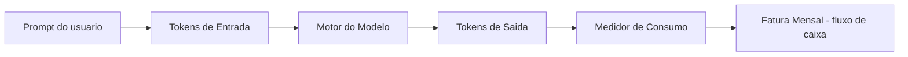
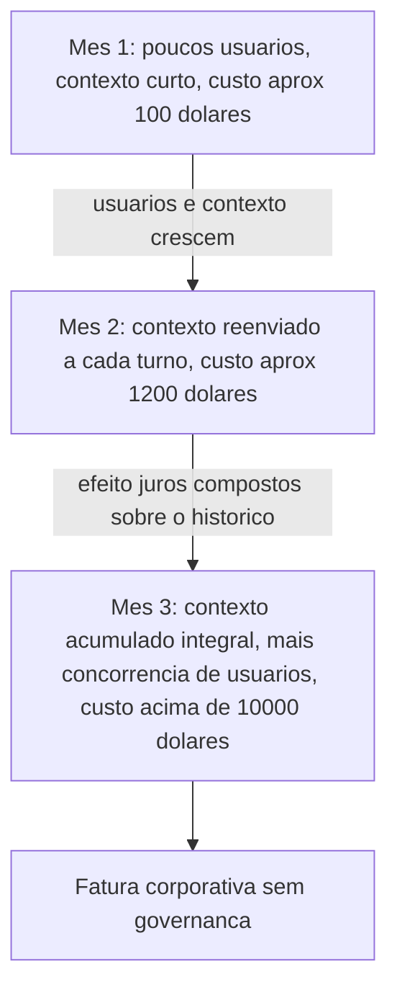

# Capítulo 1: A Crise de Custos com LLMs: De $100 para $10k Sem Aviso

## 1. Introdução

No primeiro mês, tudo parece controlado. Um protótipo com IA generativa entra em produção com um cartão de crédito de teste, um punhado de usuários internos e uma fatura de $100 que ninguém sequer confere com atenção. É assim que quase todo projeto com LLMs começa: pequeno, barato, "só um experimento" — o mesmo padrão de baixo overhead percebido antes de qualquer escala real que o mapeamento de custos de contexto desta obra registra na origem [5]. Ninguém desliga um alarme que nunca tocou.

Este livro parte de um compromisso simples: você vai deixar de tratar tokens como uma abstração técnica distante e passar a enxergá-los como o que realmente são — dinheiro em movimento, saindo da sua conta a cada chamada de API. Ao longo deste capítulo, você começa a se comportar como um Engenheiro de Custos com IA: alguém que não espera a fatura chegar para descobrir o tamanho do problema. Esse é o primeiro instinto que separa quem apenas consome modelos de linguagem de quem gerencia o consumo com governança.

Esse padrão se repete com uma regularidade quase estatística. Levantamentos que documentam a evolução dos grandes modelos de linguagem mostram uma adoção que saiu de dezenas de times pioneiros para milhares de aplicações em produção em poucos anos [2] — e junto com a adoção vem a mesma cegueira inicial sobre custo. O motivo não é falta de cuidado do time: é estrutural. O preço de uma chamada de API não aparece no momento em que a decisão de arquitetura é tomada. Ele aparece 30 dias depois, consolidado, sem contexto sobre qual parte do sistema o gerou. Você, como Engenheiro de Custos com IA, vai aprender a inverter essa ordem ao longo deste livro: colocar o preço na frente da decisão, não atrás dela.

## 2. Explica

Comece pela definição operacional, porque ela evita um erro comum de quem começa agora: token não é sinônimo de palavra. Um token é o pedaço de texto que o modelo processa como unidade — em português, isso costuma variar entre um caractere isolado e uma palavra inteira, passando por sílabas e prefixos comuns, dependendo de como o tokenizador do provedor fatia o texto, um mecanismo que a literatura de arquitetura de LLMs documenta em detalhe [1]. Uma frase de 10 palavras raramente vira exatamente 10 tokens: normalmente vira entre 12 e 18, porque pontuação, espaços e palavras compostas contam separadamente. Essa é a primeira armadilha de quem estima custo "no olho": contar palavras subestima sistematicamente o número de tokens, e subestimar tokens é subestimar a fatura.

Para enxergar essa mecânica de ponta a ponta, vale desenhar o caminho que uma única pergunta percorre até virar uma linha na sua fatura. O prompt do usuário — pergunta, mais qualquer histórico e instrução de sistema anexada — vira tokens de entrada; o motor do modelo processa esses tokens e gera tokens de saída; um medidor de consumo soma os dois tipos, multiplica pelo preço por milhão de cada categoria e credita o total na fatura mensal. Nenhuma etapa desse caminho é opcional, e nenhuma é gratuita.



Todo provedor comercial de LLM cobra por dois tipos de token: os de entrada (o que você envia — prompt, histórico, contexto) e os de saída (o que o modelo gera como resposta). Eles não custam o mesmo. Na maioria dos provedores, o token de saída é sensivelmente mais caro que o de entrada, porque exige computação ativa de geração, enquanto o de entrada é "apenas" processado em paralelo. Isso significa que uma resposta longa custa mais que uma pergunta longa — um detalhe que passa despercebido até a fatura mostrar o contrário do que a intuição sugeria.

O motivo pelo qual esse detalhe importa em escala é simples: a adoção de LLMs em produção deixou de ser nicho. A literatura técnica já trata modelos de linguagem de larga escala como infraestrutura corrente de software, não mais como curiosidade de laboratório [1]. Quando uma tecnologia vira infraestrutura, o custo de operá-la deixa de ser marginal e passa a competir por linha no orçamento com banco de dados, hospedagem e equipe. Pesquisas que mapeiam a evolução desses modelos mostram exatamente essa transição: de experimentos acadêmicos para peças centrais de arquiteturas de produto [2].

Some a isso um segundo fator, menos óbvio: o preço por milhão de tokens parece baixo quando olhado isoladamente — frações de centavo por chamada. É aqui que mora a ilusão do "modelo barato": o preço unitário é pequeno, mas ele é multiplicado por volume, frequência e, principalmente, por quanto contexto você reenvia a cada interação. Um preço baixo multiplicado por um volume que cresce todo mês não é mais um preço baixo — é uma curva.

Nem todo contexto reenviado tem o mesmo valor. Arquiteturas que buscam apenas o trecho relevante de um documento no momento da pergunta — em vez de reenviar a base inteira a cada chamada — existem justamente para separar "contexto que ajuda a resposta" de "contexto que só ajuda a fatura" [3]. Guarde essa distinção: ela é a ponte entre o problema deste capítulo e as ferramentas de compressão dos próximos.

Essa cobrança direta por token — em vez de uma taxa fixa por usuário — também é uma faca de dois gumes. Ferramentas de produtividade com IA vendidas no modelo SaaS tradicional costumam cobrar entre 10 e 50 dólares por usuário ao mês, um valor previsível e fácil de orçar [5]. Já uma aplicação construída sobre a API pura de um provedor de LLM paga por token consumido, sem teto fixo: mais barata em baixo volume, e capaz de ultrapassar qualquer plano de assinatura assim que o uso escala sem controle. Saber qual dos dois modelos de cobrança está por trás da sua aplicação é o primeiro passo para localizar onde mora o risco orçamentário.

## 3. Ilustra

Pense na curva de custo como uma bola de neve descendo uma ladeira: no primeiro metro, ela é pequena e lenta — é o seu Mês 1, com poucos usuários e prompts curtos. A cada volta, porém, ela recolhe mais neve (mais contexto acumulado) e ganha mais velocidade (mais chamadas por dia). No Mês 2, a bola já não é mais a mesma: ela carrega o histórico das interações anteriores porque a aplicação reenvia a conversa inteira a cada novo turno.

Essa é a mecânica geral. Mas há um ponto mais sutil, e é ele que explica por que o crescimento é exponencial e não apenas "um pouco maior a cada mês": pense em juros compostos. Quando o contexto de uma chamada inclui o contexto da chamada anterior — que já incluía a anterior a ela —, cada nova requisição não paga só pelo conteúdo novo. Ela paga "juros" sobre todo o histórico acumulado. Assim como uma dívida com juros compostos não cresce em linha reta, o custo de um sistema que reenvia contexto cumulativo também não cresce em linha reta — ele acelera.



**Cena:** para tornar esse acúmulo palpável, vale um exemplo numérico simples. Imagine que a primeira mensagem de uma conversa carrega 200 tokens de contexto. Se a aplicação reenvia o histórico inteiro a cada turno, a segunda mensagem já soma os 200 tokens anteriores mais os novos; a décima mensagem pode carregar dez vezes esse volume, mesmo que a pergunta do usuário continue igualmente curta. O crescimento não vem da pergunta — vem do que é reenviado ao redor dela. Esse é o detalhe que a maioria dos times enxerga tarde demais: o vilão do orçamento raramente é o modelo escolhido, é a política de reenvio de contexto.

Como Engenheiro de Custos com IA, seu trabalho nesta fase não é ainda otimizar — é reconhecer o padrão. Os Capítulos 2 a 7 vão te dar as ferramentas de compressão e cache para cortar essa curva. Antes disso, você precisa conseguir apontar o dedo para o estágio exato em que ela sai de controle.

## 4. Técnica

O primeiro instrumento de um Engenheiro de Custos com IA não é uma ferramenta sofisticada — é uma calculadora. Abaixo está `calculadora_projecao_custos.py`, um script único, comentado passo a passo, que faz três coisas: calcula o custo de uma chamada isolada, projeta o custo ao longo de 3 meses considerando crescimento de usuários e de contexto, e audita um histórico real de chamadas a partir de um CSV.

Pesquisas sobre arquiteturas de cache de contexto mostram que boa parte da fatura de produção vem exatamente do contexto redundante reenviado entre chamadas, não da geração em si [9]. É esse componente que a função de projeção abaixo isola para você enxergar.

```python
"""
calculadora_projecao_custos.py
Ferramenta de bolso do Engenheiro de Custos com IA.

Uso:
  python calculadora_projecao_custos.py chamada
  python calculadora_projecao_custos.py projetar
  python calculadora_projecao_custos.py auditar caminho/para/log.csv
"""

import csv
import sys

# Preco de referencia por 1 milhao de tokens (valores ilustrativos, em dolares).
# Troque pelos precos reais do seu provedor antes de usar em producao.
PRECO_ENTRADA_POR_MILHAO = 3.00
PRECO_SAIDA_POR_MILHAO = 15.00


def custo_de_uma_chamada(tokens_entrada: int, tokens_saida: int) -> float:
    """Calcula o custo de uma unica chamada de API, em dolares.

    Cada tipo de token tem um preco diferente por milhao [8]: tokens de
    saida custam mais porque exigem geracao ativa, nao so leitura.
    """
    custo_entrada = (tokens_entrada / 1_000_000) * PRECO_ENTRADA_POR_MILHAO
    custo_saida = (tokens_saida / 1_000_000) * PRECO_SAIDA_POR_MILHAO
    return round(custo_entrada + custo_saida, 6)


def projetar_tres_meses(
    usuarios_mes1: int,
    chamadas_por_usuario_dia: int,
    tokens_medios_por_chamada: int,
    taxa_crescimento_contexto: float,
) -> list:
    """Projeta o custo mensal para 3 meses.

    A cada mes, o numero de usuarios dobra (cenario tipico de adocao
    inicial) e o contexto medio por chamada cresce pela taxa informada,
    simulando o efeito de "juros compostos" do historico reenviado.
    """
    resultados = []
    usuarios = usuarios_mes1
    tokens_por_chamada = tokens_medios_por_chamada

    for mes in range(1, 4):
        chamadas_no_mes = usuarios * chamadas_por_usuario_dia * 30
        # Metade dos tokens da chamada e entrada, metade e saida (aproximacao didatica).
        tokens_entrada = int(tokens_por_chamada * 0.5)
        tokens_saida = int(tokens_por_chamada * 0.5)
        custo_unitario = custo_de_uma_chamada(tokens_entrada, tokens_saida)
        custo_do_mes = round(custo_unitario * chamadas_no_mes, 2)

        resultados.append({
            "mes": mes,
            "usuarios": usuarios,
            "tokens_por_chamada": tokens_por_chamada,
            "custo_mensal_dolares": custo_do_mes,
        })

        # Prepara o proximo mes: usuarios crescem, contexto acumula.
        usuarios *= 2
        tokens_por_chamada = int(tokens_por_chamada * (1 + taxa_crescimento_contexto))

    return resultados


def auditar_csv(caminho_csv: str) -> dict:
    """Le um CSV de chamadas (data,tokens_entrada,tokens_saida,modelo)
    e devolve um resumo de custo por dia e por modelo.

    Esta e a rotina de auditoria: medir antes de otimizar.
    """
    resumo_por_dia = {}
    resumo_por_modelo = {}

    with open(caminho_csv, newline="", encoding="utf-8") as arquivo:
        leitor = csv.DictReader(arquivo)
        for linha in leitor:
            data = linha["data"]
            modelo = linha["modelo"]
            tokens_entrada = int(linha["tokens_entrada"])
            tokens_saida = int(linha["tokens_saida"])
            custo = custo_de_uma_chamada(tokens_entrada, tokens_saida)

            resumo_por_dia[data] = round(resumo_por_dia.get(data, 0.0) + custo, 4)
            resumo_por_modelo[modelo] = round(resumo_por_modelo.get(modelo, 0.0) + custo, 4)

    return {"por_dia": resumo_por_dia, "por_modelo": resumo_por_modelo}


def main():
    if len(sys.argv) < 2:
        print("Uso: python calculadora_projecao_custos.py [chamada|projetar|auditar <csv>]")
        return

    comando = sys.argv[1]

    if comando == "chamada":
        custo = custo_de_uma_chamada(tokens_entrada=1500, tokens_saida=500)
        print(f"Custo estimado da chamada: ${custo}")

    elif comando == "projetar":
        projecao = projetar_tres_meses(
            usuarios_mes1=50,
            chamadas_por_usuario_dia=10,
            tokens_medios_por_chamada=2000,
            taxa_crescimento_contexto=0.6,
        )
        for linha in projecao:
            print(
                f"Mes {linha['mes']}: {linha['usuarios']} usuarios, "
                f"{linha['tokens_por_chamada']} tokens/chamada, "
                f"custo ${linha['custo_mensal_dolares']}"
            )

    elif comando == "auditar" and len(sys.argv) == 3:
        resumo = auditar_csv(sys.argv[2])
        print("Custo por dia:", resumo["por_dia"])
        print("Custo por modelo:", resumo["por_modelo"])

    else:
        print("Comando invalido. Use chamada, projetar ou auditar <csv>.")


if __name__ == "__main__":
    main()
```

Rodando o modo `projetar` com os parâmetros didáticos acima, a saída se parece com isto:

```console
$ python calculadora_projecao_custos.py projetar
Mes 1: 50 usuarios, 2000 tokens/chamada, custo $135.0
Mes 2: 100 usuarios, 3200 tokens/chamada, custo $432.0
Mes 3: 200 usuarios, 5120 tokens/chamada, custo $1382.4
```

Repare que o custo não dobra junto com os usuários — ele mais que triplica, porque o contexto por chamada também está crescendo. Esse é o mecanismo de KV cache e contexto longo que a literatura de otimização de inferência trata como um dos principais vetores de custo em produção [6]. E é exatamente esse vetor que técnicas de compressão de prompt, como as descritas em trabalhos sobre compactação de instruções para inferência acelerada, atacam diretamente [8] — assunto que retomamos a partir do próximo capítulo.

Uma extensão simples, mas de alto valor prático, é transformar essa auditoria em alerta. A função abaixo pode ser adicionada ao mesmo módulo: ela recebe o resumo diário já calculado por `auditar_csv` e sinaliza quando o custo de um dia ultrapassa um limite de orçamento definido pelo Engenheiro de Custos com IA.

```python
def alertar_limite_orcamento(resumo_por_dia: dict, limite_diario_dolares: float) -> list:
    """Compara o custo de cada dia contra um limite de orcamento.

    Retorna a lista de dias que estouraram o limite, ordenada do maior
    excesso para o menor. Esta e a diferenca entre auditar depois do
    fato e ser avisado no mesmo dia em que o custo sai da faixa esperada.
    """
    dias_fora_do_orcamento = []
    for data, custo_do_dia in resumo_por_dia.items():
        if custo_do_dia > limite_diario_dolares:
            dias_fora_do_orcamento.append((data, custo_do_dia))
    return sorted(dias_fora_do_orcamento, key=lambda item: item[1], reverse=True)
```

Em termos práticos, rodar `alertar_limite_orcamento` sobre o resultado de `auditar_csv`, com um limite de, por exemplo, $50 por dia, transforma a auditoria de um exercício manual mensal em um hábito de checagem diária — o mesmo princípio de governança contínua que a seção Aplica detalha a seguir.

O script também pode responder à pergunta que abre a seção Explica deste capítulo: a partir de que volume mensal de uso o pagamento por token deixa de ser mais barato que uma assinatura fixa por usuário? A função abaixo calcula esse ponto de equilíbrio.

```python
def ponto_de_equilibrio_saas_vs_api(
    custo_assinatura_mensal_por_usuario: float,
    numero_de_usuarios: int,
    custo_medio_por_chamada: float,
) -> int:
    """Calcula quantas chamadas por mes, no total, igualam o custo
    de uma assinatura SaaS de preco fixo por usuario.

    Acima desse numero de chamadas, pagar por token (modelo de API)
    fica mais caro que a assinatura; abaixo, fica mais barato.
    """
    if custo_medio_por_chamada <= 0:
        raise ValueError("custo_medio_por_chamada deve ser maior que zero")
    custo_total_assinatura = custo_assinatura_mensal_por_usuario * numero_de_usuarios
    return int(custo_total_assinatura / custo_medio_por_chamada)
```

**Situação:** com os preços de referência deste capítulo, uma assinatura de $20 por usuário/mês para 50 usuários custaria $1.000 fixos; ao custo médio de $0,012 por chamada (a mesma chamada de 1.500 tokens de entrada e 500 de saída calculada no início desta seção), o ponto de equilíbrio fica em torno de 83 mil chamadas mensais — cerca de 55 chamadas por usuário por dia. Abaixo disso, pagar por token tende a ser mais barato; acima, a assinatura fixa vence. Essa é exatamente a conta que o Engenheiro de Custos com IA faz antes de escolher a arquitetura de cobrança, não depois.

Há ainda uma camada intermediária entre "reenviar tudo" e "comprimir tudo": guardar em cache o resultado de contextos já processados, para não pagar duas vezes pelo mesmo trecho de histórico. Esse é o princípio por trás de camadas de cache semântico que reconhecem contexto repetido entre chamadas antes mesmo de ele chegar ao modelo [4]. O motivo pelo qual isso importa para o seu bolso é físico, não só algorítmico: modelos que precisam manter contexto crescente em memória durante a geração enfrentam limites reais de hardware, e contornar esse limite tem custo — seja em latência, seja em dólares por chamada [7].

## 5. Aplica

Você acabou de assumir a manutenção de um assistente interno que responde dúvidas de suporte usando um LLM. Para "garantir contexto", a aplicação foi configurada para reenviar o histórico inteiro da conversa a cada nova pergunta do usuário — parecia a decisão mais segura, a que menos arriscava perder informação relevante.

Três semanas depois, a fatura mensal triplicou sem que o número de usuários tivesse dobrado. Você abre o painel do provedor e não encontra nada de anormal: nenhuma chamada isolada é cara, nenhum erro de código, nenhum ataque óbvio. O erro está espalhado, não concentrado — cada conversa mais longa reenvia um histórico cada vez maior, e ninguém tinha visibilidade agregada disso.

O diagnóstico é o mesmo do "efeito juros compostos" da seção Ilustra: cada nova chamada estava pagando pelo histórico acumulado inteiro, não apenas pela pergunta nova. A correção prática, antes de qualquer técnica de compressão (que você vai aprender nos próximos capítulos), é auditar: rodar `calculadora_projecao_custos.py auditar` sobre o log de chamadas e descobrir em quais dias e com qual modelo o custo por conversa está crescendo mais rápido que o número de conversas.

Auditorias desse tipo revelam um padrão recorrente: sem nenhuma skill de compressão aplicada, o overhead de contexto redundante — informação reenviada que não agrega valor à resposta atual — pode representar de 80% a 100% do custo mensal em puro ruído; quando skills de eficiência entram em cena, essa faixa cai para 15% a 30% do custo mensal [5]. É a diferença entre reagir à fatura e antecipá-la.

**Cena:** compare esse cenário com o de outro time, que herdou o mesmo tipo de assistente mas manteve o hábito de rodar `calculadora_projecao_custos.py auditar` toda sexta-feira sobre o log da semana. Na terceira semana, o resumo por dia mostrou um crescimento de 40% no custo médio por conversa — sem que o número de conversas tivesse mudado. Em vez de esperar a fatura consolidar o problema, o time cruzou a data do salto de custo com o changelog da aplicação e achou a causa: uma atualização recente havia dobrado o tamanho das instruções fixas de sistema reenviadas em toda chamada. A correção — comprimir esse prompt de sistema, técnica que você vai aprofundar no Capítulo 3 — aconteceu antes que o custo mensal saísse da faixa orçada. A diferença entre os dois times não foi o modelo escolhido, nem o volume de usuários: foi o hábito de auditoria.

Vale registrar onde essa auditoria manual para de escalar: uma planilha ou CSV revisado à mão funciona bem até algumas dezenas de chamadas por dia; a partir de um volume maior de tráfego, o gargalo deixa de ser o cálculo e passa a ser a coleta — nesse ponto, a auditoria pontual precisa virar pipeline automatizado de logging e alertas, tema que retomamos no Capítulo 8 (Governança).

### Exercício
- [ ] Exporte (ou simule) um CSV com as colunas `data,tokens_entrada,tokens_saida,modelo` das últimas duas semanas do seu projeto
- [ ] Rode `calculadora_projecao_custos.py auditar` sobre esse CSV e identifique o dia de maior custo
- [ ] Calcule quantos tokens de entrada, em média, são histórico reenviado versus pergunta nova
- [ ] Rode o modo `projetar` com os parâmetros reais do seu projeto e compare com a fatura real dos últimos 2 meses
- [ ] Escreva, em uma frase, o estágio da curva de escalada em que seu projeto está hoje (Mês 1, 2 ou 3 da seção Ilustra)
- [ ] Rode `ponto_de_equilibrio_saas_vs_api` com o preço de uma assinatura SaaS equivalente ao seu caso de uso e descubra se pagar por token ainda é a opção mais barata no seu volume atual

## 6. Conclusão

Três ideias sustentam este capítulo: tokens de entrada e saída são cobrados de forma diferente e viram dólares reais a cada chamada; o custo de um projeto com LLM não cresce de forma linear quando o contexto reenviado se acumula — ele acelera, como juros compostos; e a única defesa antes de qualquer otimização é a visibilidade, não a economia por si só. "Barato" não é uma propriedade do preço por token — é uma propriedade do sistema inteiro, e um sistema sem auditoria não tem como ser barato em escala.

Guarde esse hábito como o primeiro traço identitário do Engenheiro de Custos com IA: você não é a pessoa que aceita a fatura como fato consumado, é a pessoa que já sabia, antes de ela chegar, aproximadamente quanto ela custaria — e por quê. Esse é o diferencial que separa quem apenas opera um sistema com IA de quem o governa.

Você agora sabe reconhecer a curva antes que ela vire manchete no seu próprio orçamento. No Capítulo 2, você vai conhecer as duas primeiras ferramentas táticas — caveman e headroom — que atacam diretamente o contexto redundante que este capítulo te ensinou a enxergar, aplicando na prática o princípio de orçar tokens de raciocínio como um recurso finito, e não infinito [10].

## 7. Referências Bibliográficas

[1] NAVEED, Humza et al. *A Comprehensive Overview of Large Language Models*. arXiv, 2023. Disponível em: http://arxiv.org/abs/2307.06435. Acesso em: 25 ago. 2026.

[2] ZHAO, Wayne Xin et al. *A Survey of Large Language Models*. Frontiers of Computer Science, 2026. Disponível em: https://doi.org/10.1007/s11704-026-60308-3. Acesso em: 25 ago. 2026.

[3] FAN, Wenqi et al. *A Survey on RAG Meeting LLMs: Towards Retrieval-Augmented Large Language Models*. 2024. Disponível em: https://doi.org/10.1145/3637528.3671470. Acesso em: 25 ago. 2026.

[4] MOHANDOSS, Ramaswami. *Context-based Semantic Caching for LLM Applications*. In: 2024 IEEE Conference on Artificial Intelligence (CAI), 2024. Disponível em: https://doi.org/10.1109/cai59869.2024.00075. Acesso em: 25 ago. 2026.

[5] ECONOMIA EXTREMA DE TOKENS: contexto e skills de eficiência. Compêndio técnico. Curadoria de Elite — Open Source Initiative (OSI), Linux Foundation, CNCF Landscape, 2026. Documento técnico interno (dossiê de pesquisa da obra).

[6] YUAN, Jiayi et al. *KV Cache Compression, But What Must We Give in Return? A Comprehensive Benchmark of Long Context Capable Approaches*. arXiv, 2024. Disponível em: http://arxiv.org/abs/2407.01527v2. Acesso em: 25 ago. 2026.

[7] ALIZADEH, Keivan et al. *LLM in a Flash: Efficient Large Language Model Inference with Limited Memory*. 2024. Disponível em: https://doi.org/10.18653/v1/2024.acl-long.678. Acesso em: 25 ago. 2026.

[8] JIANG, Huiqiang et al. *LLMLingua: Compressing Prompts for Accelerated Inference of Large Language Models*. 2023. Disponível em: https://doi.org/10.18653/v1/2023.emnlp-main.825. Acesso em: 25 ago. 2026.

[9] AUTOR. *Prompt Context Caching Architecture for Cost Reduction in Large Language Model Systems*. International Journal of Intelligent Systems and Applications in Engineering, 2026. Disponível em: https://doi.org/10.17762/ijisae.v14i1s.8385. Acesso em: 25 ago. 2026.

[10] HAN, Tingxu et al. *Token-Budget-Aware LLM Reasoning*. 2025. Disponível em: https://doi.org/10.18653/v1/2025.findings-acl.1274. Acesso em: 25 ago. 2026.
