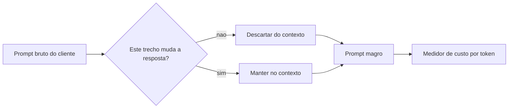
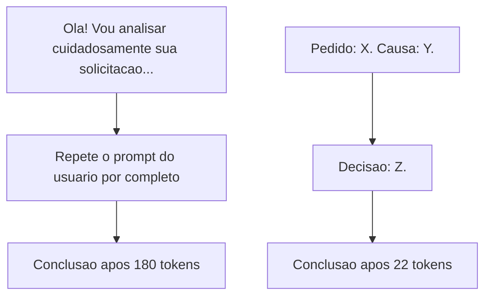
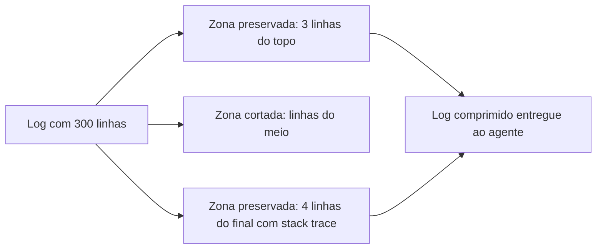

# Capítulo 2: Como Funciona a Economia de Tokens: Caveman e Headroom

## 1. Introdução

No Capítulo 1 você viu a ilusão do modelo "barato" — a ideia perigosa de que escolher o LLM com menor preço por token resolve o problema de custo. Agora fica claro por que essa ilusão sobrevive tanto tempo: o preço por token nunca foi o vilão sozinho. O vilão é a arquitetura do que você manda para dentro da janela de contexto a cada chamada. Um modelo "barato" alimentado com contexto gordo pode custar mais que um modelo caro alimentado com contexto enxuto.

Este capítulo apresenta as duas primeiras ferramentas táticas da sua caixa: **caveman**, que comprime o raciocínio interno do agente, e **headroom**, que comprime a saída de logs e terminais antes que ela volte para o contexto. Ao final, você vai entender que economia de tokens não é ajuste fino de configuração — é uma decisão de arquitetura tomada em cada turno de conversa com o agente.

Você percebe o efeito de escala: o desperdício de um único turno parece pequeno demais para incomodar alguém. Mas você, como Engenheiro de Custos com IA, não trabalha com um turno isolado — trabalha com dezenas de turnos por dia, multiplicados por toda a equipe, multiplicados pelos meses de um contrato. Um contexto 30% mais gordo do que precisa não custa 30% a mais uma vez; custa 30% a mais em cada chamada, todo dia, indefinidamente. É esse efeito composto — pequeno no turno, brutal no agregado — que transforma caveman e headroom de "boa prática opcional" em pré-requisito de qualquer operação agêntica que leve custo a sério.

## 2. Explica

Pense em compressão de contexto como redução de dimensionalidade: você tem um espaço de informação grande (o texto bruto que descreve um problema) e precisa encontrar o subespaço menor que ainda carrega o essencial para o modelo responder corretamente. A pesquisa em compressão de prompts formaliza exatamente essa ideia — remover unidades linguísticas de baixa informação sem descartar o que muda a resposta do modelo [1].

Isso importa porque tokens de entrada não são gratuitos só porque "não geram texto novo". Cada token que entra na janela de contexto é processado, custa dinheiro e ocupa espaço que poderia estar carregando informação mais relevante. Frameworks de compressão de longo contexto mostram ganhos de desempenho justamente ao cortar o que é redundante antes de ele chegar ao modelo, preservando a fidelidade da resposta em cenários de contexto extenso [2].

O caso mais contraintuitivo é o do raciocínio interno do próprio agente — o bloco de pensamento que ele produz antes de responder (Chain-of-Thought). Muita gente assume que esse raciocínio é "de graça" por não aparecer na resposta final. Não é: ele é gerado como qualquer outro token e cobrado da mesma forma. Trabalhos recentes sobre orçamento de raciocínio demonstram que é possível manter a qualidade da resposta final reduzindo drasticamente o número de tokens gastos pensando, desde que o corte seja disciplinado e não aleatório [4]. É exatamente esse princípio que a skill **caveman** aplica: forçar o agente a pensar em frases curtas, sem saudação, sem repetir o prompt do usuário.

O mesmo raciocínio de "poda disciplinada" vale para a saída de comandos de terminal, builds e testes. Um log de 300 linhas quase sempre tem sua causa raiz nas últimas linhas — o resto é ruído de progresso. A skill **headroom** aplica uma regra determinística: se a saída de um comando tiver mais de 7 linhas, ela é comprimida em 3 linhas do topo (contexto do comando) mais 4 linhas do final (onde mora o erro), descartando o meio. Essa lógica de preservar apenas o que é decisório e cortar o resto se conecta ao mesmo princípio que sustenta técnicas de inferência com memória limitada: manter na memória ativa somente os blocos de informação que efetivamente influenciam a próxima decisão [5].

Vale reforçar por que esse cuidado com o tamanho do contexto não é modismo passageiro. Levantamentos amplos sobre a arquitetura de modelos de linguagem de grande escala mostram que o custo computacional de processar a janela de contexto cresce junto com o número de parâmetros e o tamanho da entrada, tornando qualquer token supérfluo um multiplicador de custo, não uma soma simples [7]. O problema fica ainda mais visível em arquiteturas que buscam informação externa antes de responder: pipelines de geração aumentada por recuperação injetam documentos inteiros no contexto para melhorar a precisão da resposta, e cada trecho recuperado sem filtro é exatamente o tipo de "prompt gordo" que este capítulo ensina a evitar [8].

Um cuidado importante para quem está começando: a aproximação "4 caracteres ≈ 1 token", usada no script da seção Técnica, é uma média de mercado — não uma regra fixa. Tokenizadores modernos dividem o texto em subpalavras, e o número real de tokens por caractere varia conforme o idioma, a pontuação e até a presença de acentuação, algo já documentado nos levantamentos sobre arquitetura de modelos de grande escala [7]. Na prática, isso significa que textos em português com muita acentuação tendem a consumir um pouco mais de tokens por caractere do que o mesmo texto em inglês. A consequência prática para você é simples: use a estimativa de 4 caracteres por token como termômetro rápido para comparar "antes" e "depois" da compressão — nunca como número exato para fechar uma fatura com o cliente. Para cobrança exata, sempre confie no contador de tokens nativo do provedor do modelo.

Há ainda uma camada que este capítulo apenas prepara o terreno para explicar de verdade: o custo de reprocessar o mesmo prefixo de contexto repetidas vezes. Toda vez que o agente inicia uma nova chamada, boa parte do começo do prompt — instruções do sistema, regras do projeto, contexto fixo — se repete idêntica. Provedores de LLM oferecem cache de prefixo justamente para não cobrar de novo por esse trecho estável, mas esse cache só funciona se o início do prompt permanecer byte a byte igual entre chamadas. Um raciocínio caveman bem aplicado e um log comprimido por headroom já ajudam indiretamente aqui, porque reduzem a chance de o conteúdo variável "vazar" para dentro da parte que deveria ficar fixa. O Capítulo 4 vai aprofundar esse mecanismo com a skill **rtk-memory** — por ora, guarde a ideia de que economizar tokens não é só cortar o que entra, é também não destruir, sem querer, o que já estava barato.

## 3. Ilustra

Como Engenheiro de Custos com IA, você já entende que cada linha de contexto é uma linha no seu extrato de fluxo de caixa. As duas ferramentas deste capítulo atacam dois pontos diferentes desse extrato: o que o agente pensa (caveman) e o que o agente lê de volta do terminal (headroom).

### Pilar 1 — O prompt gordo e o prompt magro

Imagine dois Engenheiros de Custos enviando a mesma pergunta ao mesmo agente. Um copia e cola o e-mail inteiro do cliente, com assinatura, disclaimer legal e histórico de três respostas anteriores. O outro extrai só a pergunta e o dado que muda a resposta. Os dois chegam à mesma resposta correta — mas um pagou por 40 linhas irrelevantes, turno após turno.



### Pilar 2 — Caveman: o raciocínio como extrato bancário

Aqui vale a dupla camada de analogia, porque este é o ponto mais denso do capítulo. Primeiro, a mecânica geral: pensar em modo verboso é como escrever um diário íntimo antes de tomar uma decisão simples — bonito, mas caro em tempo e, no caso do agente, caro em dinheiro. Pensar em modo caveman é como um piloto de avião seguindo um checklist: frases de três a cinco palavras, sem floreio, porque cada segundo (e cada token) importa quando o relógio está correndo.

A segunda camada — o ponto mais difícil — é o tradeoff entre clareza e economia. Cortar demais um raciocínio pode apagar justamente o passo que evita um erro. Por isso o corte do caveman não é aleatório: ele remove três categorias específicas (saudação, repetição do prompt do usuário, frases acima de 20 palavras reescritas em cláusulas curtas), preservando a cadeia lógica que leva à resposta certa.



### Pilar 3 — Headroom: a zona preservada e a zona cortada

Um log de build de 300 linhas é como um extrato bancário de um ano inteiro quando você só precisa saber se a fatura deste mês está paga. O headroom não apaga o extrato — ele mostra o saldo inicial (3 linhas do topo) e as últimas movimentações, onde normalmente está o problema (4 linhas do final).



### Pilar 4 — O efeito cascata na planilha do Engenheiro de Custos

Volte à imagem do extrato de fluxo de caixa. Se você, como Engenheiro de Custos com IA, rodar apenas uma vez o build de 340 linhas do exemplo anterior, o desperdício de tokens é pequeno o suficiente para não aparecer na fatura mensal. O problema é que ninguém roda um build por dia — uma equipe de porte médio roda dezenas, às vezes centenas, entre CI, revisão local e depuração. Multiplique o log gordo por 50 execuções e você tem 15 mil linhas de ruído entrando no contexto do agente todos os dias, quando 350 linhas (3+4 por execução) já bastariam.

Você percebe o mesmo raciocínio no pensamento interno do caveman: um bloco de pensamento verboso de 180 tokens não quebra o orçamento sozinho, mas 200 chamadas por dia com esse mesmo padrão significam 36 mil tokens gastos só pensando — sem contar a resposta final. É essa multiplicação, e não o caso isolado, que justifica tratar caveman e headroom como política de equipe, não como truque individual de quem "lembrou" de aplicar naquele dia.

## 4. Técnica

O `estilo_tecnica` desta obra é operacional: você vai ver comandos reais, sessões de console e tabelas de decisão — script de programação é só o meio, não o fim. Todo bloco abaixo é executável tal como está.

### Medindo o índice de compressão do seu próprio texto

Você trabalha assim: mede antes de comprimir qualquer coisa. O script abaixo estima tokens por uma aproximação simples (4 caracteres ≈ 1 token, referência usada por praticamente todo provedor de LLM para estimativas rápidas) e calcula o índice de compressão antes/depois.

```python
# medir_compressao.py
# Estima tokens de um texto (aproximacao: 4 caracteres = 1 token)
# e calcula o indice de compressao entre uma versao original e uma versao comprimida.

def estimar_tokens(texto: str) -> int:
    # Aproximacao padrao de mercado para estimativa rapida sem chamar API
    return max(1, len(texto) // 4)

def indice_compressao(original: str, comprimido: str) -> float:
    tokens_originais = estimar_tokens(original)
    tokens_comprimidos = estimar_tokens(comprimido)
    reducao = 1 - (tokens_comprimidos / tokens_originais)
    return round(reducao * 100, 1)

if __name__ == "__main__":
    original = (
        "Ola! Gostaria muito de pedir, se possivel, que voce me ajudasse "
        "a entender por que o teste esta falhando, pois isso esta me "
        "deixando bastante preocupado com o prazo do projeto."
    )
    comprimido = "Teste falhando. Causa: prazo em risco."

    print(f"Tokens originais: {estimar_tokens(original)}")
    print(f"Tokens comprimidos: {estimar_tokens(comprimido)}")
    print(f"Indice de compressao: {indice_compressao(original, comprimido)}%")
```

Rodando o script acima, você chega a uma redução acima de 70% nesse exemplo curto — e em cadeias de raciocínio mais longas, técnicas de compressão de prompt documentadas na literatura chegam a taxas de até 20 vezes o tamanho original em cenários de contexto longo, sem perda relevante de qualidade de resposta [2]. É esse mesmo princípio, aplicado ao pensamento interno do agente, que sustenta a meta de até 90% de economia de tokens no bloco de raciocínio que a skill caveman persegue [3].

### Caveman: aplicando as 3 regras de corte

```python
# caveman_corte.py
# Aplica 3 regras deterministicas de corte a um paragrafo de raciocinio verboso.

import re

SAUDACOES = ["ola", "bom dia", "boa tarde", "gostaria de", "vou analisar"]

def remover_saudacao(texto: str) -> str:
    linhas = texto.split(". ")
    filtradas = [l for l in linhas if not any(s in l.lower() for s in SAUDACOES)]
    return ". ".join(filtradas)

def remover_repeticao_do_prompt(texto: str, prompt_usuario: str) -> str:
    if prompt_usuario and prompt_usuario.lower() in texto.lower():
        texto = texto.lower().replace(prompt_usuario.lower(), "")
    return texto.strip(" .")

def encurtar_frases_longas(texto: str, limite_palavras: int = 20) -> str:
    frases = re.split(r"(?<=[.!?]) ", texto)
    curtas = []
    for frase in frases:
        palavras = frase.split()
        if len(palavras) > limite_palavras:
            metade = len(palavras) // 2
            curtas.append(" ".join(palavras[:metade]) + ".")
            curtas.append(" ".join(palavras[metade:]))
        else:
            curtas.append(frase)
    return " ".join(curtas)

def aplicar_caveman(texto: str, prompt_usuario: str = "") -> str:
    etapa1 = remover_saudacao(texto)
    etapa2 = remover_repeticao_do_prompt(etapa1, prompt_usuario)
    etapa3 = encurtar_frases_longas(etapa2)
    return etapa3

if __name__ == "__main__":
    bruto = (
        "Ola! Vou analisar cuidadosamente sua solicitacao de corrigir "
        "o teste que falhou porque o mock retornou nulo em vez do "
        "objeto esperado, e isso quebrou a asserção da linha 42."
    )
    print(aplicar_caveman(bruto))
```

A saída chega perto de "Teste falhou. Mock retornou nulo. Asserção da linha 42 quebrou." — a mesma causa raiz, sem a cortesia que ninguém pediu. Trabalhos sobre orçamento de raciocínio em LLMs confirmam que cortes desse tipo, quando aplicados de forma disciplinada, preservam a taxa de acerto da resposta final mesmo reduzindo drasticamente o número de tokens do raciocínio [4].

### Headroom: a regra 3+4 em produção

Quando o comando não é Python nem JavaScript (por exemplo, um build Maven ou um `npm test` gigante), a compressão acontece via shell puro, sem depender de interpretador:

```bash
#!/usr/bin/env bash
# headroom.sh — comprime saida de um comando quando ela passa de 7 linhas
# Uso: ./headroom.sh "npm test"

set -euo pipefail

SAIDA=$(eval "$1" 2>&1) || true
TOTAL_LINHAS=$(echo "$SAIDA" | wc -l)

if [ "$TOTAL_LINHAS" -gt 7 ]; then
  echo "$SAIDA" | head -n 3
  echo "... [$(($TOTAL_LINHAS - 7)) linhas omitidas pelo headroom] ..."
  echo "$SAIDA" | tail -n 4
else
  echo "$SAIDA"
fi
```

Sessão real de terminal aplicando o script a um build que falhou:

```console
$ ./headroom.sh "npm run build"
> projeto@1.0.0 build
> webpack --mode production
Compiling module 1 of 214...
... [293 linhas omitidas pelo headroom] ...
ERROR in ./src/utils/cache.js
Module not found: Error: Can't resolve './redis-client'
Build failed with 1 error.
```

A tabela abaixo resume quando aplicar cada ferramenta — e quando NÃO aplicar, porque nem todo conteúdo deve ser comprimido:

| Situação | Aplicar caveman? | Aplicar headroom? |
|---|---|---|
| Raciocínio interno do agente antes de responder | Sim | Não se aplica |
| Log de build/teste com mais de 7 linhas | Não se aplica | Sim |
| Conteúdo gravado em `output/**` (entregável final) | Não | Não |
| Dados de auditoria e evidência de compliance | Não | Não |
| Chat comum entre usuário e agente | Não (seria rude) | Não se aplica |

Essa distinção é o que separa o profissional que usa compressão como cirurgia daquele que usa como machado: cortar o entregável final ou a evidência de auditoria não economiza nada — apenas destrói rastreabilidade, o mesmo tipo de perda de informação que a literatura de compressão de contexto associa a quedas de desempenho quando o corte é indiscriminado [6].

### Projetando o efeito cascata do Pilar 4

O trecho abaixo transforma a intuição do Pilar 4 em número. Ele recebe o tamanho médio de um log e de um bloco de raciocínio, a quantidade de execuções por dia, e devolve quantos tokens sua equipe economiza aplicando caveman e headroom ao longo de um mês — a mesma lógica de agregação que sustenta a tabela de métricas globais das 8 ferramentas deste livro.

```python
# projetar_economia_mensal.py
# Projeta a economia mensal de tokens ao aplicar caveman + headroom
# em N execucoes diarias de build/raciocinio.

def estimar_tokens(texto_ou_linhas, chars_por_linha: int = 60) -> int:
    # Aproximacao: 4 caracteres = 1 token (ver ressalva na secao Explica)
    total_chars = texto_ou_linhas * chars_por_linha
    return max(1, total_chars // 4)

def projetar_economia_mensal(
    linhas_log_bruto: int,
    execucoes_por_dia: int,
    tokens_raciocinio_bruto: int,
    tokens_raciocinio_caveman: int,
    dias_uteis_mes: int = 22,
) -> dict:
    linhas_log_comprimido = 7  # regra 3 + 4 do headroom
    tokens_log_bruto = estimar_tokens(linhas_log_bruto)
    tokens_log_comprimido = estimar_tokens(linhas_log_comprimido)

    economia_log_por_execucao = tokens_log_bruto - tokens_log_comprimido
    economia_raciocinio_por_execucao = tokens_raciocinio_bruto - tokens_raciocinio_caveman

    economia_diaria = (
        economia_log_por_execucao + economia_raciocinio_por_execucao
    ) * execucoes_por_dia

    return {
        "tokens_economizados_por_execucao": economia_log_por_execucao
        + economia_raciocinio_por_execucao,
        "tokens_economizados_por_dia": economia_diaria,
        "tokens_economizados_por_mes": economia_diaria * dias_uteis_mes,
    }

if __name__ == "__main__":
    resultado = projetar_economia_mensal(
        linhas_log_bruto=340,
        execucoes_por_dia=50,
        tokens_raciocinio_bruto=180,
        tokens_raciocinio_caveman=22,
    )
    for chave, valor in resultado.items():
        print(f"{chave}: {valor:,}".replace(",", "."))
```

Você descobre, com os números do próprio exemplo deste capítulo (build de 340 linhas, 50 execuções por dia), que a projeção mensal passa de 5,6 milhões de tokens economizados só com duas ferramentas — antes de qualquer outra peça do livro entrar em cena. É esse tipo de número, calculado com a planilha da sua própria equipe, que transforma "boa prática" em item de orçamento defensável diante de quem paga a conta.

## 5. Aplica

Você está no meio de um sprint apertado. Um teste quebrou, o build gerou 340 linhas de log, e a esteira de CI está bloqueada. Sem pensar duas vezes, você copia o log inteiro e cola no chat do agente, junto com um "por favor me ajuda a entender o que aconteceu aqui, obrigado". O agente processa as 340 linhas, mais a sua cortesia, mais o histórico da conversa — e devolve a resposta certa. Ótimo, exceto que essa chamada custou 6 vezes mais tokens do que precisava, e você fez isso quinze vezes naquele dia, sem perceber.

O diagnóstico é direto: você aplicou zero filtro entre a fonte de ruído (o log de build) e o contexto do agente. A causa raiz do erro estava nas últimas 4 linhas — o resto era progresso de compilação que o agente nunca precisou ler. A correção é igualmente direta: rodar o comando através do `headroom.sh` antes de colar qualquer coisa no chat, e escrever seu próprio pedido em modo caveman ("Build falhou. Ver stack trace.") em vez de um parágrafo de cortesia.

Você percebe que isso escala bem até o ponto em que sua equipe roda dezenas de builds por hora — a partir daí, comprimir manualmente turno a turno não é mais viável, e a solução operacional é automatizar a chamada do headroom como hook de pre-commit ou de CI (assunto do Capítulo 3, onde as skills viram pipeline). Até lá, aplicar manualmente já corta a maior parte do desperdício: a combinação de caveman e headroom, aplicada isoladamente e sem qualquer outra ferramenta do livro, já é responsável por boa parte dos até 85% de economia total que a soma das 8 ferramentas promete quando aplicadas juntas.

Um segundo cenário, mais sutil, aparece fora do terminal: na revisão de código. Você recebe um comentário de revisão de 12 parágrafos explicando, com toda a educação do mundo, por que uma função deveria ser refatorada — cheio de "acredito que talvez seria interessante considerar" e "não é urgente, mas quando possível". Colar isso inteiro no agente para pedir "implemente essa sugestão" desperdiça tokens do mesmo jeito que colar um log de 340 linhas. Como Engenheiro de Custos com IA, seu trabalho é extrair a instrução real antes de repassar: "Extrair `validar_entrada()` da função `processar_pedido()`. Motivo: duplicação em 3 lugares." Três linhas em modo caveman carregam a mesma decisão que os 12 parágrafos originais — só que sem a cortesia que o agente não precisa processar.

**Erro comum:** colar o comentário de revisão inteiro, na íntegra, achando que "mais contexto nunca atrapalha". **Diagnóstico:** o agente gasta tokens reconstruindo a decisão por trás da educação excessiva do texto, e ainda corre o risco de responder à cortesia em vez de à instrução. **Prática correta:** você mesmo faz a extração antes de repassar — o comentário de 12 parágrafos vira 2 linhas de decisão, e o agente recebe exatamente o que precisa para agir, nada mais.

### Exercício
- [ ] Rode `medir_compressao.py` com um parágrafo real que você escreveu para o agente esta semana
- [ ] Aplique `aplicar_caveman()` no mesmo parágrafo e compare o índice de compressão
- [ ] Rode `headroom.sh` sobre a saída de um build ou teste do seu projeto atual
- [ ] Rode `projetar_economia_mensal.py` com os números reais de execuções por dia da sua equipe
- [ ] Preencha a tabela de decisão do capítulo com pelo menos 2 situações reais do seu fluxo de trabalho
- [ ] Identifique 1 lugar onde você aplicaria headroom mas NÃO deveria (ex.: evidência de auditoria)
- [ ] Reescreva em modo caveman o próximo comentário de revisão de código que você receber, antes de repassá-lo ao agente

## 6. Conclusão

Três ideias sustentam este capítulo: contexto não é grátis, mesmo quando não gera resposta nova; o raciocínio interno do agente custa tokens como qualquer outro texto, e por isso o caveman ataca justamente esse ponto cego; e logs verbosos escondem a causa raiz nas últimas linhas, motivo pelo qual o headroom preserva só o topo e o final. A projeção do Pilar 4 deixou claro que o ganho real não está no corte isolado de um turno, mas no efeito composto de aplicar o corte disciplinado dezenas de vezes por dia, todos os dias — é aí que a economia deixa de ser cosmética e vira linha de orçamento.

Dominar essas duas ferramentas separadamente já é ganho real — mas é aplicando as duas em cadeia, junto com uma terceira peça, que a compressão vira sistema. No Capítulo 3 você vai ver como caveman, headroom e lean-ctx se encaixam em um único pipeline agêntico, sem depender de você lembrar de rodar cada um manualmente.

## 7. Referências Bibliográficas

[1] JIANG, Huiqiang et al. *LLMLingua: Compressing Prompts for Accelerated Inference of Large Language Models*. 2023. Disponível em: https://doi.org/10.18653/v1/2023.emnlp-main.825. Acesso em: 25 ago. 2026.

[2] JIANG, Huiqiang et al. *LongLLMLingua: Accelerating and Enhancing LLMs in Long Context Scenarios via Prompt Compression*. 2024. Disponível em: https://doi.org/10.18653/v1/2024.acl-long.91. Acesso em: 25 ago. 2026.

[3] PAN, Zhuoshi et al. *LLMLingua-2: Data Distillation for Efficient and Faithful Task-Agnostic Prompt Compression*. In: Annual Meeting of the Association for Computational Linguistics. 2024. Disponível em: https://www.semanticscholar.org/paper/3d45fc603e34934fc589b9547307815f7723de34. Acesso em: 25 ago. 2026.

[4] HAN, Tingxu et al. *Token-Budget-Aware LLM Reasoning*. 2025. Disponível em: https://doi.org/10.18653/v1/2025.findings-acl.1274. Acesso em: 25 ago. 2026.

[5] ALIZADEH, Keivan et al. *LLM in a Flash: Efficient Large Language Model Inference with Limited Memory*. 2024. Disponível em: https://doi.org/10.18653/v1/2024.acl-long.678. Acesso em: 25 ago. 2026.

[6] NAVEED, Humza et al. *A Comprehensive Overview of Large Language Models*. In: arXiv (Cornell University). 2023. Disponível em: http://arxiv.org/abs/2307.06435. Acesso em: 25 ago. 2026.

[7] ZHAO, Wayne Xin et al. *A Survey of Large Language Models*. In: Frontiers of Computer Science. 2026. Disponível em: https://doi.org/10.1007/s11704-026-60308-3. Acesso em: 25 ago. 2026.

[8] FAN, Wenqi et al. *A Survey on RAG Meeting LLMs: Towards Retrieval-Augmented Large Language Models*. 2024. Disponível em: https://doi.org/10.1145/3637528.3671470. Acesso em: 25 ago. 2026.
