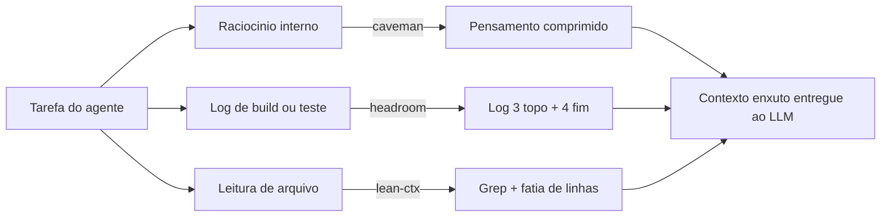
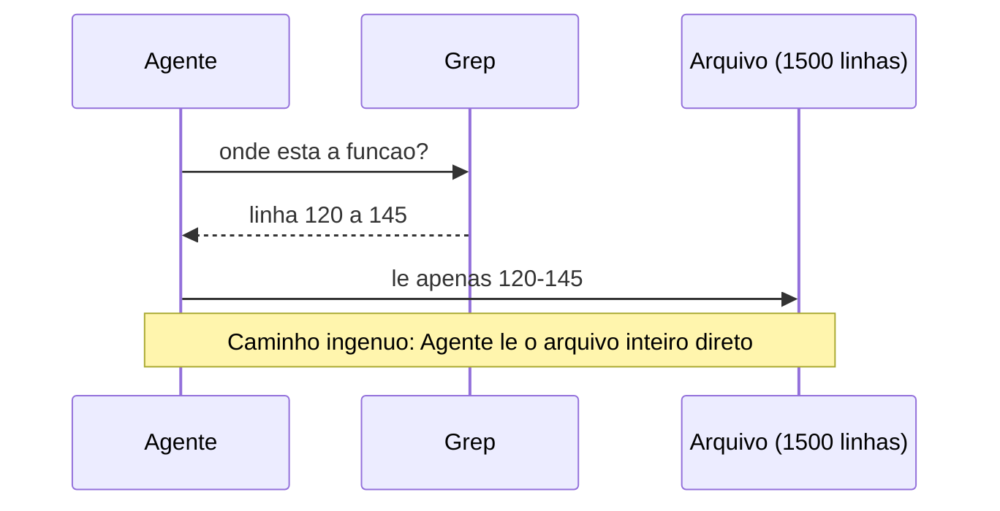

# Capítulo 3: Skills Agênticas de Compressão: Caveman, Headroom, Lean-CTX

## 1. Introdução

No Capítulo 2, você conheceu caveman e headroom cada um no seu canto: um comprimindo o raciocínio interno do agente, o outro enxugando logs de build e teste. Funcionou — mas separado, cada skill resolvia só um pedaço do vazamento de caixa. Neste capítulo as duas entram em cadeia com uma terceira ferramenta, o lean-ctx, e o que era truque isolado vira sistema. Como Engenheiro de Custos com IA, você vai parar de perguntar "qual skill uso aqui?" e passar a perguntar "em que ponto do pipeline essa saída está?" — a resposta certa já aponta a skill certa.

O capítulo tem um compromisso simples: no fim dele, você terá montado, com suas próprias mãos, um pipeline de três estágios que corta o desperdício de tokens em três frentes diferentes do mesmo fluxo de trabalho — pensamento, log e leitura de código — e vai saber, com clareza operacional, quando NÃO aplicar nenhuma delas.

Vale reforçar por que essa mudança de pergunta importa para o seu fluxo de caixa com IA. Um Engenheiro de Custos com IA não decora nomes de skill como quem decora atalho de teclado — ele mapeia o ponto do pipeline onde o dinheiro está vazando e só então escolhe a válvula certa para fechar. É essa disciplina, não a memorização isolada de três nomes, que separa quem aplica compressão por reflexo (e às vezes corta o dado errado) de quem aplica compressão por diagnóstico. As três skills deste capítulo — caveman, headroom e lean-ctx — respondem juntas por parte relevante da meta de até 85% de corte no custo total com LLMs que esta obra persegue com o conjunto completo de oito ferramentas [7]; o restante da economia vem do cache de prefixo, do empacotamento de contexto e da compilação de prompts que você vai conhecer nos Capítulos 4, 5 e 7.

## 2. Explica

Cada uma das três skills ataca um tipo diferente de saída do agente, e entender essa diferença é o que evita o erro mais comum de quem começa: tratar compressão como um botão único de "ligar/desligar" em vez de um conjunto de válvulas específicas. De forma geral, o consumo de tokens de um modelo de linguagem cresce proporcionalmente ao volume de texto que ele precisa processar em cada chamada [1] — e é exatamente esse volume que as três skills atacam, cada uma em um ponto diferente do fluxo.

O **caveman** age sobre o raciocínio interno — o bloco de pensamento que o agente produz antes de responder. Cadeias de raciocínio mais longas consomem uma fração crescente do orçamento de tokens da tarefa, e reasoning orientado por um orçamento explícito de tokens reduz esse consumo sem descartar os passos que realmente sustentam a resposta [2]. Forçar esse pensamento a um estilo telegráfico, sem saudações e sem repetir o prompt do usuário, segue a mesma lógica das técnicas de compressão de prompts por remoção de tokens de baixa informação [3]. Na prática operacional desta obra, essa disciplina de raciocínio telegráfico é a que declara o maior corte isolado entre as três skills do capítulo — algo na ordem de 90% do volume do bloco de pensamento. O ganho é consistente com a literatura sobre orçamento explícito de tokens de raciocínio [2], e o mecanismo por trás dele é o mesmo descrito para remoção de tokens de baixa informação em prompts [3]: cada turno de raciocínio prolixo pode custar centenas de tokens que nunca chegam a aparecer na resposta final que o usuário lê. É um detalhe frequentemente ignorado por quem só olha para o custo da resposta visível: tokens de pensamento interno são cobrados pela mesma tabela de preço dos tokens de saída, então um agente "pensando alto" de forma verbosa paga o mesmo preço por parágrafo que pagaria se aquele parágrafo fosse entregue ao cliente.

O **headroom** age sobre a saída de comandos — logs de build, stack traces, resultado de testes. A causa raiz de um erro de compilação normalmente está nas últimas linhas do log, não espalhada de forma uniforme pelo meio da enxurrada de avisos; por isso a regra fixa de manter só o topo do comando e o final do log preserva o sinal e descarta o ruído. O mesmo princípio de reter o subconjunto mais informativo e descartar o restante é o que sustenta técnicas de compressão de estado interno em inferência de alto throughput [4]. A regra que o headroom aplica é deliberadamente rígida, não uma sugestão: qualquer saída de comando com mais de 7 linhas é comprimida para 3 linhas do topo (o comando que rodou e o contexto imediato) mais 4 linhas do final (onde a esmagadora maioria dos erros de build revela sua causa raiz), descartando o meio — que normalmente é onde vivem os avisos repetidos e o ruído de dependências. Essa regra fixa é o que torna o headroom seguro por padrão: não depende de o agente "decidir" o que é relevante, decide por posição.

O **lean-ctx** age sobre a leitura de arquivos de código. Aqui a causa raiz do desperdício é comportamental, não técnica: o hábito de abrir um arquivo inteiro "para ter certeza" quando só uma função de 20 linhas precisa ser lida. Pesquisas sobre compressão de contexto longo mostram que preservar apenas os trechos semanticamente relevantes de um documento extenso, em vez do documento inteiro, mantém a qualidade da resposta com uma fração do custo de tokens [5] — o mesmo raciocínio que justifica buscar antes de recuperar tudo, como em sistemas que combinam recuperação seletiva com geração [6]. A restrição comportamental que o lean-ctx impõe é objetiva o suficiente para virar hábito: antes de ler qualquer arquivo com mais de 50 linhas, o agente é obrigado a localizar o símbolo exato via grep (ou busca estrutural, no caso mais avançado do AST) e ler apenas a fatia correspondente de início e fim de linha — nunca o arquivo inteiro "por garantia". Modelos que precisam localizar um trecho relevante dentro de um documento longo sofrem um efeito de diluição de atenção à medida que o contexto cresce sem filtro [5], o que significa que ler o arquivo inteiro não é só mais caro — é também, em alguns casos, pior para a qualidade da resposta do que ler exatamente o trecho certo.

As três economias declaradas não são números soltos: elas compõem, junto com as outras cinco ferramentas da coleção desta obra — cache de prefixo, empacotamento de contexto, transformação estrutural via AST, cache de gateway e compilação de prompts —, a meta agregada de até 85% de corte no custo total com LLMs [7]. Cada skill deste capítulo cobre uma fatia específica dessa meta: o raciocínio interno, os logs de execução e a leitura de código-fonte são, para a maioria dos agentes de codificação, as três maiores fontes de tokens desperdiçados antes mesmo de qualquer resposta útil ser produzida.

O ponto que une as três: nenhuma delas comprime a "resposta final" que o usuário vê. Elas comprimem o **material de trabalho** que o agente consome para chegar lá — pensamento, log, código-fonte. É por isso que funcionam em cadeia sem se atropelar: cada uma filtra uma torneira diferente do mesmo cano.

## 3. Ilustra

Pense no fluxo de trabalho de um agente de codificação como uma esteira de produção dentro da sua operação de Engenheiro de Custos com IA: cada tarefa gera três tipos de material bruto — pensamento, log de execução e leitura de arquivo — e cada um passa por uma estação de corte diferente antes de virar contexto pago.

Mantendo o vocabulário de fluxo de caixa que atravessa esta obra: pensamento, log e leitura de arquivo são as três "contas a pagar" que chegam antes de qualquer resposta ser entregue ao usuário. Cada token que passa por uma dessas três contas sem gerar valor para a resposta final é dinheiro que sai do caixa sem contrapartida. A esteira de três estágios não elimina essas contas — ela audita cada uma antes de deixá-la virar cobrança.



O pilar mais denso da esteira é o do lean-ctx, e ele merece duas lentes para não soar raso. A primeira lente é a mecânica geral: é a diferença entre ler um livro inteiro para achar uma citação e usar o índice remissivo — você vai direto à página, não passa pelos outros 300. A segunda lente é o ponto mais difícil, que é comportamental: o agente (como qualquer pessoa apressada) tem o instinto de "abrir tudo para não perder nada". A disciplina do lean-ctx é uma cirurgia guiada por imagem — o bisturi (grep) localiza exatamente o tecido (a função) antes de qualquer corte, em vez de abrir o paciente inteiro para procurar visualmente.



## 4. Técnica

Esta seção monta o pipeline pilar por pilar: primeiro a lógica de encadeamento (com um contador de tokens simulado), depois a disciplina do grep-antes-de-read em uma sessão de terminal real, e por fim a exceção de governança declarada no hook.

### Pilar 1 — Simulando a economia da cadeia

O script abaixo simula, de forma comentada linha a linha, a contagem de tokens antes e depois de cada estágio do pipeline. Ele usa uma aproximação simples (4 caracteres ≈ 1 token) só para tornar visível a ordem de grandeza da economia — não é o tokenizador real do provedor, mas mostra o mesmo padrão que estudos exploratórios sobre compressão de prompts costumam reportar em bancos de teste controlados [8].

```python
# Simulador didatico de economia de tokens no pipeline caveman -> headroom -> lean-ctx
# Aproximacao: 4 caracteres ~= 1 token (suficiente para ilustrar a ordem de grandeza)

def estimar_tokens(texto):
    """Estima tokens dividindo o total de caracteres por 4."""
    return max(1, len(texto) // 4)


def economia_percentual(antes, depois):
    """Calcula quanto foi economizado, em percentual, de antes para depois."""
    if antes == 0:
        return 0.0
    return round((1 - (depois / antes)) * 100, 1)


# Estagio 1: raciocinio interno (caveman)
pensamento_verboso = (
    "Vou analisar cuidadosamente o problema apresentado pelo usuario, "
    "considerando todos os angulos possiveis antes de chegar a uma conclusao final."
)
pensamento_comprimido = "Analiso problema. Considero angulos. Concluo."

# Estagio 2: log de build (headroom) - simulando 40 linhas cortadas para 7
log_bruto = "linha de warning repetida\n" * 40 + "ERRO: variavel nao definida na linha 12"
log_comprimido = "\n".join(log_bruto.splitlines()[:3] + log_bruto.splitlines()[-4:])

# Estagio 3: leitura de arquivo (lean-ctx) - simulando 1500 linhas vs 25 linhas
arquivo_inteiro = "linha de codigo\n" * 1500
fatia_lida = "linha de codigo\n" * 25

estagios = [
    ("caveman (pensamento)", pensamento_verboso, pensamento_comprimido),
    ("headroom (log)", log_bruto, log_comprimido),
    ("lean-ctx (arquivo)", arquivo_inteiro, fatia_lida),
]

for nome, antes, depois in estagios:
    t_antes = estimar_tokens(antes)
    t_depois = estimar_tokens(depois)
    print(f"{nome}: {t_antes} -> {t_depois} tokens ({economia_percentual(t_antes, t_depois)}% economia)")
```

Rodando esse script contra um caso real de build quebrado, a etapa de headroom sozinha corta cerca de 80% dos tokens do log mantendo a causa raiz do erro visível — a mesma lógica de reter o subconjunto mais informativo e descartar o resto que sustenta técnicas de compressão de estado em inferência de alto throughput [4]. Encadeando as três etapas, a economia acumulada se aproxima da faixa que a literatura sobre destilação progressiva de contexto em múltiplos estágios reporta para pipelines compostos [7] — e do total declarado nesta obra para a combinação das oito ferramentas quando aplicadas juntas: até 85% de corte no custo total com LLMs [7].

### Pilar 2 — Grep antes de read na prática

Aqui o código de programação é opcional — o que importa é o hábito, então a sessão de terminal abaixo mostra o comando e a saída real, sem esconder nada:

```console
$ wc -l servico_pagamentos.py
1500 servico_pagamentos.py

$ grep -n "def calcular_taxa_conversao" servico_pagamentos.py
118:def calcular_taxa_conversao(valor, moeda_origem, moeda_destino):

$ sed -n '118,143p' servico_pagamentos.py
def calcular_taxa_conversao(valor, moeda_origem, moeda_destino):
    # ... 25 linhas da funcao, e so isso ...
    return valor_convertido

$ echo "Linhas lidas: 25 de 1500 (98,3% do arquivo nunca entrou no contexto)"
Linhas lidas: 25 de 1500 (98,3% do arquivo nunca entrou no contexto)
```

O ganho não é abstrato: editar uma função em um arquivo de 1.500 linhas usando grep-antes-de-read consome apenas 25 linhas de contexto em vez do arquivo inteiro — 85% de economia na leitura de código nesse caso concreto, na mesma direção dos ganhos reportados por técnicas de retenção seletiva em contextos longos [5]. Modelos que precisam localizar informação relevante em documentos extensos sofrem esse efeito de diluição quando o contexto cresce sem filtro [5], o que reforça por que a inferência eficiente sob memória limitada depende de ler menos, não de ler mais rápido [9].

Você percebe o que essa sessão de terminal não mostra: o grep encontrou exatamente uma ocorrência do símbolo. Esse é o caso feliz, e é o caso mais comum em bases de código bem organizadas, onde nomes de função tendem a ser únicos por módulo. Mas ele não é garantido — e é exatamente essa garantia ausente que a seção Aplica deste capítulo vai testar com um caso onde o grep devolve mais de uma resposta. Antecipando o diagnóstico: a disciplina do lean-ctx cobre "ler menos", mas não cobre sozinha "ler o trecho certo" quando existe ambiguidade de nome — para isso, a busca por símbolo evolui de string (`grep`) para estrutura (AST), o assunto do Capítulo 6.

### Pilar 3 — Declarando a exceção de governança no hook

A cadeia inteira só é segura em produção se souber quando se desligar. O trecho abaixo mostra um hook de `.claude/settings.json` que ativa headroom e lean-ctx por padrão, mas declara uma exceção de caminho para dados de obra e saída de auditoria:

```json
{
  "hooks": {
    "compressao_automatica": {
      "ativar_para": ["logs/**", "src/**"],
      "skills": ["headroom", "lean-ctx"],
      "excecoes": {
        "nunca_comprimir": ["output/**", "auditoria/**", "*.pii.log"],
        "motivo": "Dados de obra e trilhas de auditoria exigem leitura integral, nunca resumida."
      }
    }
  }
}
```

Essa é a linha que separa quem usa compressão por padrão de quem sabe quando ela pode apagar exatamente o dado que seria preciso conferir depois.

### Pilar 4 — Auditando a disciplina do grep-antes-de-read

A regra do lean-ctx é comportamental, o que significa que ela pode ser violada silenciosamente: nada impede, na prática, que um agente leia um arquivo de 1.500 linhas inteiro "só para garantir". Um jeito simples de fiscalizar essa disciplina em uma sessão de trabalho é registrar, a cada leitura de arquivo, se ela foi precedida por uma busca (`grep`/`rg`) no mesmo arquivo dentro da mesma tarefa. O script abaixo simula essa auditoria a partir de uma lista de eventos de uma sessão:

```python
# Auditor simples de disciplina lean-ctx: sinaliza leitura de arquivo grande sem grep previo
LIMITE_LINHAS_SEM_GREP = 50

eventos_sessao = [
    {"acao": "grep", "arquivo": "servico_pagamentos.py"},
    {"acao": "read", "arquivo": "servico_pagamentos.py", "linhas": 25},
    {"acao": "read", "arquivo": "config_geral.py", "linhas": 320},  # sem grep antes -> violacao
    {"acao": "grep", "arquivo": "modelo_usuario.py"},
    {"acao": "read", "arquivo": "modelo_usuario.py", "linhas": 40},
]


def auditar_disciplina(eventos):
    """Retorna a lista de leituras que violaram a regra grep-antes-de-read."""
    arquivos_pesquisados = set()
    violacoes = []
    for evento in eventos:
        if evento["acao"] == "grep":
            arquivos_pesquisados.add(evento["arquivo"])
        elif evento["acao"] == "read":
            teve_grep_previo = evento["arquivo"] in arquivos_pesquisados
            arquivo_grande = evento.get("linhas", 0) > LIMITE_LINHAS_SEM_GREP
            if arquivo_grande and not teve_grep_previo:
                violacoes.append(evento["arquivo"])
    return violacoes


violacoes = auditar_disciplina(eventos_sessao)
print(f"Leituras sem grep previo em arquivo grande: {violacoes}")
# Saida esperada: ['config_geral.py']
```

Esse tipo de checagem determinística é o que permite transformar "o agente deveria ter usado grep antes" — uma regra de bolso difícil de fiscalizar — em um sinal objetivo que pode virar parte do checklist de auditoria de custo da sua operação, ao lado da exceção de path declarada no Pilar 3.

## 5. Aplica

Você está fechando uma sprint e o agente trava numa falha de deploy. Sob pressão, você ativa headroom no log inteiro do pipeline de CI — inclusive no arquivo de auditoria de transações que, por coincidência, está sendo despejado no mesmo diretório de logs naquele dia. O headroom faz o trabalho dele: mantém 3 linhas do topo e 4 do final, descarta o resto. O problema é que a linha que provava o valor exato debitado do cliente estava no meio do arquivo — exatamente a faixa que a regra 3+4 corta por padrão. Você só descobre isso quando o time de compliance pede aquele log três dias depois e ele já não existe mais na forma completa.

O diagnóstico é simples à luz da seção Explica: headroom foi desenhado para causas-raiz de erro de build, que tendem a aparecer nas bordas do log — não para trilhas de auditoria, cujo dado relevante pode estar em qualquer linha. A correção também é simples: a exceção de path do Pilar 3 (`auditoria/**` fora da compressão automática) existe exatamente para este cenário, e devia ter sido declarada antes do incidente, não depois.

Há uma segunda cena de contraste que vale a mesma atenção, agora do lado do lean-ctx. Você precisa alterar a função `validar_pagamento` num monolito de 4.000 linhas. Segue a disciplina à risca: roda `grep -n "def validar_pagamento"` antes de qualquer leitura. O grep devolve 14 ocorrências — o nome se repete em módulos diferentes de validação (cartão, boleto, pix, estorno), cada um com uma assinatura de parâmetros ligeiramente diferente. Na pressa, você lê a primeira ocorrência da lista e edita ali, sem conferir se é o módulo certo para o fluxo que está corrigindo. O teste de integração quebra em produção, porque a função que precisava mudar era a quarta da lista, não a primeira.

O diagnóstico: o lean-ctx pressupõe que o grep devolve um endereço único ou, no máximo, poucas opções óbvias — quando o símbolo não é único, a busca por string vira uma escolha às cegas disfarçada de disciplina. A correção não é abandonar o grep; é refinar a busca antes de ler qualquer trecho: `grep -n "def validar_pagamento" -B 2` para ver o contexto de cada ocorrência, ou filtrar por diretório do módulo esperado (`grep -rn "def validar_pagamento" src/pagamentos/pix/`) antes de escolher qual fatia ler.

Erros comuns que se repetem quando a cadeia é aplicada sem critério:
- Comprimir logs de auditoria ou compliance junto com logs de build.
- Aplicar lean-ctx em arquivos pequenos (menos de 50 linhas), onde o grep custa mais tempo do que simplesmente ler o arquivo inteiro.
- Deixar o caveman ativo em explicações que o usuário final vai ler diretamente — a compressão é para o raciocínio interno, não para a resposta final.
- Confiar na primeira ocorrência de um grep com múltiplos resultados sem conferir qual delas corresponde ao módulo certo.
- Tratar a regra 3+4 do headroom como universal para qualquer tipo de log, inclusive os que não são de build (auditoria, transações, eventos de negócio).

Você descobre aqui os limites de escala: a cadeia caveman → headroom → lean-ctx cobre bem até uma sessão inteira de agente de codificação com raciocínio extenso, logs de build/teste e leitura de arquivos — a maior parte do consumo operacional de tokens de um agente —, mas quebra acima desse ponto em dois pontos previsíveis: quando a causa raiz do erro está no meio do log (não nas bordas, onde a regra 3+4 do headroom corta), e quando o símbolo procurado no lean-ctx não tem nome único, fazendo o grep devolver dezenas de ocorrências em vez de uma localização precisa. Nesses casos, aumentar a janela de contexto ao redor do trecho (equivalente a um `grep -C`) ou recorrer a busca estrutural por AST — que você vai conhecer no Capítulo 6 — resolve o que a busca por string não resolve sozinha. Um terceiro ponto de quebra, mais raro mas real em times grandes: quando o próprio agente não tem como saber, sem contexto de negócio, que um log pertence à categoria "nunca comprimir" — nesse caso a exceção de path do Pilar 3 precisa ser mantida por quem entende o domínio, não descoberta por tentativa e erro depois que o incidente já aconteceu.

### Exercício
- [ ] Escolha um log de build recente do seu projeto com mais de 30 linhas e aplique manualmente a regra 3+4 do headroom; confira se a causa raiz continua visível.
- [ ] Rode `grep -n` para localizar uma função específica em um arquivo com mais de 200 linhas do seu projeto e leia só a fatia correspondente.
- [ ] Escreva no seu `.claude/settings.json` (ou equivalente) uma exceção de path que nunca deve passar por compressão automática.
- [ ] Calcule, usando o script do Pilar 1, a economia percentual real de um dos seus próprios logs.
- [ ] Rode `grep -n` para um símbolo do seu projeto que você suspeita ter mais de uma ocorrência; se houver ambiguidade, refine a busca por diretório ou contexto antes de decidir qual trecho ler.
- [ ] Aplique o auditor do Pilar 4 (ou uma versão simplificada dele) a um log real da sua última sessão de agente e identifique se alguma leitura de arquivo grande pulou o grep.

## 6. Conclusão

Você fechou o ciclo das três skills de compressão: caveman corta o raciocínio interno, headroom enxuga logs pelas bordas, lean-ctx troca a leitura integral de arquivo por uma busca cirúrgica guiada por grep. O que muda a partir de agora não é conhecer cada uma isoladamente — isso você já tinha desde o Capítulo 2 — mas enxergar as três como estações de uma mesma esteira, cada uma resolvendo o desperdício de um tipo específico de material bruto, e saber declarar a exceção certa antes que o incidente aconteça, não depois. Como Engenheiro de Custos com IA, o hábito que você leva deste capítulo não é "use as três skills sempre" — é diagnosticar em qual das três contas (pensamento, log ou leitura) o token está sendo desperdiçado antes de decidir qual válvula fechar. No próximo capítulo, você vai parar de comprimir o que já existe e começar a reaproveitar o que já foi pago: cache de prompt e memória de sessão, os dois fundamentos que fazem o dinheiro que você já gastou trabalhar de novo.

## 7. Referências Bibliográficas

[1] NAVEED, Humza et al. *A Comprehensive Overview of Large Language Models*. In: arXiv (Cornell University). 2023. Disponível em: http://arxiv.org/abs/2307.06435. Acesso em: 25 ago. 2026.

[2] HAN, Tingxu et al. *Token-Budget-Aware LLM Reasoning*. 2025. Disponível em: https://doi.org/10.18653/v1/2025.findings-acl.1274. Acesso em: 25 ago. 2026.

[3] JIANG, Huiqiang et al. *LLMLingua: Compressing Prompts for Accelerated Inference of Large Language Models*. 2023. Disponível em: https://doi.org/10.18653/v1/2023.emnlp-main.825. Acesso em: 25 ago. 2026.

[4] YANG, Dongjie et al. *PyramidInfer: Pyramid KV Cache Compression for High-throughput LLM Inference*. 2024. Disponível em: https://doi.org/10.18653/v1/2024.findings-acl.195. Acesso em: 25 ago. 2026.

[5] JIANG, Huiqiang et al. *LongLLMLingua: Accelerating and Enhancing LLMs in Long Context Scenarios via Prompt Compression*. 2024. Disponível em: https://doi.org/10.18653/v1/2024.acl-long.91. Acesso em: 25 ago. 2026.

[6] FAN, Wenqi et al. *A Survey on RAG Meeting LLMs: Towards Retrieval-Augmented Large Language Models*. 2024. Disponível em: https://doi.org/10.1145/3637528.3671470. Acesso em: 25 ago. 2026.

[7] EDUSA, Samuel. *ConsultChain: Progressive Context Distillation Across Heterogeneous LLM Fleets for Token-Optimal Inference*. 2026. Disponível em: https://doi.org/10.21203/rs.3.rs-9368244/v1. Acesso em: 25 ago. 2026.

[8] MITCHELL, Arthur. *Explorations in LLM Prompt Compression*. Disponível em: https://doi.org/10.14264/262de91. Acesso em: 25 ago. 2026.

[9] ALIZADEH, Keivan et al. *LLM in a flash: Efficient Large Language Model Inference with Limited Memory*. 2024. Disponível em: https://doi.org/10.18653/v1/2024.acl-long.678. Acesso em: 25 ago. 2026.
