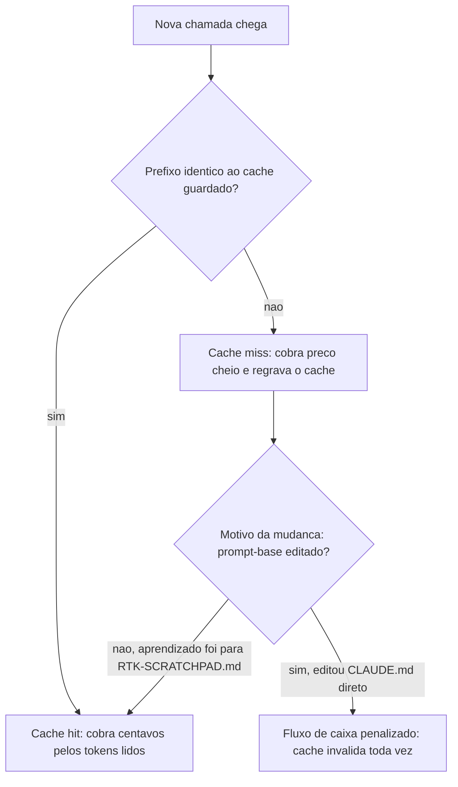

# Capítulo 4: Cache Inteligente e Memory: RTK-Memory + LiteLLM

## 1. Introdução

No Capítulo 3, você montou a cadeia caveman → headroom → lean-ctx: três ferramentas que comprimem o que ainda vai ser enviado ao modelo. Elas agem *depois* que a decisão de mandar aquele texto já foi tomada. Este capítulo trabalha um instante antes disso — na pergunta que todo Engenheiro de Custos com IA deveria fazer antes de disparar qualquer chamada: "eu já paguei por essa informação antes?". Se a resposta for sim, existe uma boa chance de você estar prestes a pagar de novo por nada.

Cache de prompt e memória de sessão são os mecanismos que respondem essa pergunta por você, automaticamente, sem exigir que você reescreva uma linha de prompt. Ao dominar isso, você deixa de tratar cache como um detalhe de infraestrutura distante e passa a enxergá-lo como o que ele é: um desconto que o provedor já oferece, mas que só chega até o seu fluxo de caixa se você souber preservar as condições que o ativam.

Repare no tamanho do que está em jogo antes de seguir adiante. Um desconto de até 90% nos tokens lidos do cache [2] não é um ajuste fino de fim de mês — é a diferença entre uma fatura que cresce de forma linear com o volume de chamadas e uma fatura que cresce de forma quase plana, porque a maior parte do prompt de sistema já foi paga antes. Para o Engenheiro de Custos com IA, esse é o primeiro lugar onde vale auditar o fluxo de caixa: não perguntando "quanto eu gastei", mas "quanto desse gasto eu já deveria ter economizado e não economizei porque quebrei o cache sem perceber".

## 2. Explica

Cache de prompt funciona por comparação exata de prefixo: o provedor guarda uma cópia processada do início do seu prompt e, na próxima chamada, verifica se aquele mesmo trecho — byte a byte — aparece de novo no início da nova requisição. Se aparecer, ele não reprocessa aquele pedaço do zero: cobra um valor bem menor pelos tokens "lidos do cache" em vez do preço cheio de tokens "processados pela primeira vez" [9].

Essa comparação é rígida por design. Não existe tolerância a pequenas diferenças: um espaço a mais, uma linha reordenada ou uma data atualizada no topo do prompt já quebram a correspondência e fazem o provedor tratar a chamada inteira como nova. É por isso que sistemas de cache de contexto propostos na literatura recente insistem em separar explicitamente o que é prefixo estável (raramente muda) do que é conteúdo variável (muda a cada chamada) [2]. Prompt Caching Architecture, por exemplo, demonstra que arquiteturas que isolam esse prefixo estável conseguem sustentar taxas de reaproveitamento consistentemente altas em cargas de trabalho reais de produção.

Há também uma dimensão de tempo que costuma passar despercebida por quem está começando. O cache não é permanente: ele existe enquanto a "janela" continua ativa, geralmente um intervalo curto — de poucos minutos a poucas horas de inatividade entre chamadas. Passado esse prazo sem uso, o provedor descarta o cache e a próxima chamada volta a custar o preço cheio. Isso significa que cache não é uma economia estática e sim uma economia de ritmo: quanto mais próximas no tempo as chamadas que reaproveitam o mesmo prefixo, maior o desconto acumulado.

Há um efeito colateral desse design rígido que costuma pegar quem opera pipelines com mais de um agente: o problema se multiplica em vez de somar. Se um pipeline tem três agentes especializados — um para pesquisa, um para redação, um para revisão — e cada um carrega o próprio prompt de sistema, você não tem um cache para proteger, tem três. Editar o prompt-base de qualquer um deles invalida só o cache daquele agente, o que parece uma boa notícia, até você perceber que também significa três pontos distintos onde um ajuste "rápido" pode silenciosamente resetar o desconto acumulado — e três faturas parciais para auditar em vez de uma. Quanto mais agentes num fluxo, maior a superfície de invalidação, e menor a tolerância a editar prompt-base fora de um processo deliberado.

Vale também situar o cache de prefixo exato dentro de um espectro maior de estratégias de cache que a literatura técnica documenta. Ele fica na ponta mais rígida desse espectro — comparação byte a byte, sem margem — enquanto o cache semântico, que a seção Técnica deste capítulo explora com o LiteLLM, fica na ponta mais flexível — comparação por similaridade vetorial, tolerante a reformulação. Frameworks de cache semântico para inferência distribuída de LLMs [3] tratam essas duas pontas como complementares, não concorrentes: o cache exato resolve o caso barato e comum (mesma base, pergunta nova no final); o cache semântico resolve o caso mais raro e mais caro de processar do zero (pergunta reformulada, mesma intenção). Um sistema maduro de controle de custos usa os dois ao mesmo tempo, em camadas — nunca um no lugar do outro.

Vale entender que existe uma segunda camada de otimização de cache, essa invisível para você: dentro do próprio provedor, a memória que guarda o histórico de atenção do modelo (o chamado KV cache) também passa por compressão para caber em menos memória de GPU e responder mais rápido [5]. Técnicas como reconstrução esparsa seletiva [8] e codificação por transformada do KV cache [7] atacam esse problema em um nível bem mais baixo do que o prefixo do seu prompt — e chegam a manter a qualidade de resposta mesmo processando o histórico com bem menos memória, como mostram abordagens de inferência com memória limitada aplicadas a modelos grandes [6]. Você não configura nada disso diretamente; ele é o motivo pelo qual alguns provedores sustentam janelas de contexto maiores sem que o preço da chamada dispare.

## 3. Ilustra

Pense no cache de prompt como o crachá de acesso recorrente de um prédio comercial. Na primeira vez que você entra, a portaria confere seu documento inteiro, cadastra seus dados e emite o crachá — processo lento e caro em tempo de atendimento. Nas próximas entradas, enquanto o crachá continuar válido, basta aproximar o cartão: a portaria reconhece o mesmo padrão e libera a passagem em segundos, sem reconferir tudo de novo. É exatamente essa reconferência evitada que o provedor de LLM transforma em desconto na sua fatura.

Só que existe um detalhe que separa quem administra esse crachá de quem só o carrega no bolso — e é aqui que mora o ponto mais denso deste capítulo: o RTK-Memory. Imagine agora que, toda vez que você aprende algo novo sobre o funcionamento do prédio, alguém decide reimprimir o crachá inteiro do zero para incluir essa informação. O crachá antigo perde a validade, a portaria não reconhece mais o padrão anterior, e você volta à fila de cadastro completo — mesmo que quase toda a informação nele fosse idêntica à de antes. É isso que acontece quando você edita diretamente o `CLAUDE.md`/`AGENTS.md` (o prompt de sistema) para registrar um aprendizado pontual: mesmo que quase todo o texto continue igual, o prefixo muda, o cache invalida por inteiro, e a próxima chamada paga o preço cheio outra vez.

A solução do RTK-Memory é separar o crachá permanente (o prompt-base, que não muda) de um bloco de notas avulso — o `RTK-SCRATCHPAD.md` — consultado só quando necessário. O crachá continua idêntico; o bloco de notas absorve as novidades. Como Engenheiro de Custos com IA, essa é a diferença entre reemitir um crachá inteiro a cada aprendizado e simplesmente anexar um post-it a ele.

Essa analogia do crachá explica bem o cache exato, mas não cobre sozinha o segundo mecanismo deste capítulo — o cache semântico do LiteLLM —, então vale uma segunda imagem, complementar, não substituta. Pense agora num concierge experiente de um mesmo prédio, e não mais no porteiro que só confere crachás. Duas pessoas diferentes chegam à recepção perguntando coisas com palavras distintas — "onde fica a sala de reuniões do terceiro andar?" e "preciso da sala de reunião lá em cima, no três" — e o concierge, que já respondeu isso outras vezes hoje, reconhece que é a mesma pergunta disfarçada de duas formas e responde na hora, sem consultar a planta do prédio de novo. O porteiro do crachá exige identidade perfeita; o concierge do cache semântico tolera variação de forma, desde que o conteúdo pedido seja o mesmo. São dois funcionários diferentes, cobrindo dois tipos diferentes de repetição — e um prédio bem administrado, como o seu fluxo de chamadas de IA, mantém os dois trabalhando ao mesmo tempo.



## 4. Técnica

A parte prática deste capítulo tem dois artefatos: primeiro, um jeito de medir cache hit real no seu próprio histórico de chamadas; segundo, uma configuração de roteador (LiteLLM) que decide, sozinho, quando vale a pena buscar uma resposta cacheada por similaridade em vez de chamar o provedor de novo.

### Medindo cache hit com um script simples

Antes de configurar qualquer coisa, você precisa saber se o seu fluxo atual já está desperdiçando cache. O script abaixo lê uma lista de prompts (simulando um log de chamadas) e conta quantos deles compartilham o mesmo prefixo byte a byte — é exatamente essa contagem que o provedor faz por trás da API.

```python
# medir_cache_hit.py
# Script simples, comentado passo a passo, para estimar a taxa de cache hit
# a partir de um log de prompts (cada item da lista simula uma chamada).

def prefixo_estavel(prompt: str, tamanho: int = 40) -> str:
    """Retorna os primeiros N caracteres do prompt.

    Na vida real, o 'prefixo estavel' e o system prompt (CLAUDE.md/AGENTS.md).
    Aqui simplificamos pegando o inicio do texto para fins didaticos.
    """
    return prompt[:tamanho]


def medir_taxa_cache_hit(log_de_chamadas: list) -> dict:
    """Conta quantas chamadas repetem o mesmo prefixo da chamada anterior.

    Retorna um dicionario com o total de chamadas, os hits (prefixo repetido)
    e a taxa de acerto em percentual.
    """
    total = len(log_de_chamadas)
    hits = 0
    prefixo_anterior = None

    for prompt in log_de_chamadas:
        prefixo_atual = prefixo_estavel(prompt)
        if prefixo_atual == prefixo_anterior:
            hits += 1
        prefixo_anterior = prefixo_atual

    taxa = (hits / total * 100) if total > 0 else 0.0
    return {"total_chamadas": total, "cache_hits": hits, "taxa_hit_percentual": round(taxa, 1)}


if __name__ == "__main__":
    # Cenario A: prompt-base fixo (RTK-Memory ativo) + pergunta variavel no final
    log_com_rtk_memory = [
        "SYSTEM: Voce e um assistente de codigo. PERGUNTA: como criar uma lista?",
        "SYSTEM: Voce e um assistente de codigo. PERGUNTA: como ler um arquivo?",
        "SYSTEM: Voce e um assistente de codigo. PERGUNTA: como somar dois numeros?",
    ]

    resultado = medir_taxa_cache_hit(log_com_rtk_memory)
    print("Cenario com RTK-Memory:", resultado)
```

Rodando esse script você vê a taxa de acerto do cenário em que o prefixo (o "SYSTEM:") permanece idêntico entre chamadas — exatamente o comportamento que o RTK-Memory preserva ao manter o `CLAUDE.md`/`AGENTS.md` intocado. Repare que essa é a mesma lógica que sustenta o desconto de até 90% em tokens lidos do cache que provedores como Anthropic e OpenAI oferecem quando o prefixo se mantém estável entre chamadas consecutivas [2] — o script apenas expõe, em miniatura, o que a API faz de verdade.

### Configurando o LiteLLM como router com cache semântico

Cache de prefixo exato resolve o caso "a mesma pergunta, com o mesmo início de prompt". Mas existe um segundo cenário: perguntas *parecidas*, não idênticas — "qual o preço do plano X?" e "quanto custa o plano X?" carregam a mesma intenção, mas não compartilham prefixo byte a byte. É aqui que entra o cache semântico, e o LiteLLM é o gateway que decide, por similaridade, se vale a pena reaproveitar uma resposta já dada.

A configuração abaixo sobe um proxy LiteLLM com dois provedores cadastrados e o cache semântico habilitado sobre Redis:

```yaml
# litellm-config.yaml
model_list:
  - model_name: modelo-padrao
    litellm_params:
      model: anthropic/claude-3-5-sonnet
      api_key: "os.environ/ANTHROPIC_API_KEY"
  - model_name: modelo-alternativo
    litellm_params:
      model: openai/gpt-4o-mini
      api_key: "os.environ/OPENAI_API_KEY"

litellm_settings:
  cache: true
  cache_params:
    type: redis
    host: "localhost"
    port: 6379
    similarity_threshold: 0.95   # so reaproveita resposta acima de 95% de similaridade
```

Subindo o gateway localmente:

```console
$ docker run -d -p 4000:4000 -v $(pwd)/litellm-config.yaml:/app/config.yaml ghcr.io/berriai/litellm:main-latest --config /app/config.yaml
$ curl http://localhost:4000/chat/completions -d '{"model": "modelo-padrao", "messages": [{"role": "user", "content": "qual o preco do plano X?"}]}'
```

Se uma pergunta com similaridade acima de 0.95 já tiver passado pelo gateway antes, a resposta cacheada volta em cerca de 2 ms, sem tocar o provedor de novo [3]. É um patamar de latência que nenhuma chamada de API real alcança, porque não existe rede nem inferência envolvida — só uma busca por vetor no Redis. O custo de manter essa camada rodando também é baixo: um cache semântico como esse opera com algo em torno de 70 MB de RAM em repouso [4], o que o torna viável mesmo em ambientes modestos.

A tabela abaixo resume quando cada tipo de cache se aplica:

| Situação | Tipo de cache | Ferramenta |
|---|---|---|
| Mesmo prefixo, byte a byte idêntico | Cache de prompt (exato) | Nativo do provedor + RTK-Memory |
| Pergunta parecida, texto diferente | Cache semântico (por similaridade) | LiteLLM + Redis |
| Prompt-base mudou (editou CLAUDE.md) | Nenhum cache se aplica — reprocessa tudo | — |

Vale registrar que sistemas de roteamento de custo, como o descrito no Two-Tier Cost Model de cache-aware prompt compression, tratam a decisão de cachear ou não como parte do próprio orçamento de inferência, não como um efeito colateral da infraestrutura [1]. É esse deslocamento de mentalidade — de "cache é uma configuração de DevOps" para "cache é uma linha do meu orçamento" — que separa quem só usa a ferramenta de quem a administra.

### Traduzindo taxa de cache hit em economia real

Medir a taxa de acerto, como fez o primeiro script, é só metade do trabalho de um Engenheiro de Custos com IA. A outra metade é traduzir esse número em reais na fatura — porque é esse número, e não a taxa percentual isolada, que justifica investir tempo de engenharia em manter o prefixo estável. O script abaixo pega a saída de `medir_taxa_cache_hit` e projeta a economia mensal, usando como parâmetro o desconto de até 90% documentado para tokens lidos do cache [2]:

```python
# estimar_economia_cache.py
# Projeta a economia mensal a partir da taxa de cache hit medida
# e do volume de chamadas do seu próprio fluxo.

def estimar_economia_mensal(
    taxa_hit_percentual: float,
    chamadas_por_dia: int,
    tokens_prefixo_medio: int,
    custo_por_1k_tokens: float,
    desconto_cache: float = 0.90,
) -> dict:
    """Estima quanto do custo de prefixo é evitado por mês graças ao cache.

    taxa_hit_percentual: saida de medir_taxa_cache_hit() (0 a 100)
    chamadas_por_dia: volume medio de chamadas do seu fluxo
    tokens_prefixo_medio: tamanho medio, em tokens, do prompt-base
    custo_por_1k_tokens: preco cheio por 1000 tokens processados
    desconto_cache: fracao do custo evitada em cada hit (0.90 = 90%)
    """
    chamadas_por_mes = chamadas_por_dia * 30
    chamadas_com_hit = chamadas_por_mes * (taxa_hit_percentual / 100)

    custo_cheio_por_chamada = (tokens_prefixo_medio / 1000) * custo_por_1k_tokens
    economia_por_hit = custo_cheio_por_chamada * desconto_cache
    economia_mensal_estimada = chamadas_com_hit * economia_por_hit

    return {
        "chamadas_por_mes": chamadas_por_mes,
        "chamadas_com_cache_hit": round(chamadas_com_hit),
        "economia_mensal_estimada": round(economia_mensal_estimada, 2),
    }


if __name__ == "__main__":
    # Exemplo: fluxo com 80% de cache hit (RTK-Memory ativo),
    # 500 chamadas/dia, prefixo de 2000 tokens, US$ 0,003 por 1k tokens
    resultado = estimar_economia_mensal(
        taxa_hit_percentual=80,
        chamadas_por_dia=500,
        tokens_prefixo_medio=2000,
        custo_por_1k_tokens=0.003,
    )
    print("Economia mensal estimada:", resultado)
```

O valor de saída não é uma cotação exata da sua próxima fatura — cada provedor arredonda e cobra de um jeito ligeiramente diferente — mas é preciso o suficiente para responder a pergunta que abre um orçamento de infraestrutura de IA: "vale a pena gastar duas horas de engenharia organizando o `RTK-SCRATCHPAD.md` direito?". Na prática, a resposta quase sempre é sim, porque a taxa de cache hit não é um número que só sobe com sorte — ela sobe com disciplina de onde cada informação é registrada, o exato hábito que a seção Aplica deste capítulo cobra de você.

## 5. Aplica

Você está no meio de uma sprint e percebe que o assistente de IA errou uma instrução repetidas vezes na mesma sessão. A correção parece óbvia: abrir o `CLAUDE.md`, adicionar duas linhas explicando a regra que faltava, salvar, seguir em frente. Você faz isso três vezes ao longo da tarde, sempre que um novo comportamento indesejado aparece.

No dia seguinte, ao revisar a fatura do provedor, o custo por chamada está visivelmente mais alto do que na semana anterior — mesmo com o mesmo volume de mensagens. O diagnóstico é o que a seção Explica já antecipou: cada edição no `CLAUDE.md` alterou o prefixo do prompt de sistema, e cada alteração invalidou o cache acumulado até ali. Você não estava só corrigindo comportamento — estava resetando o desconto a cada ajuste, pagando o preço cheio de novo e de novo pela mesma base de conhecimento.

A correção é simples de aplicar, mas exige o hábito certo: aprendizados pontuais de sessão vão para o `RTK-SCRATCHPAD.md` (ou arquivo equivalente), nunca direto no prompt-base. O `CLAUDE.md`/`AGENTS.md` só muda quando a regra é, de fato, permanente e vale o custo de reaquecer o cache do zero — uma decisão consciente, não um reflexo de correção rápida.

Armadilhas comuns que reforçam esse padrão:

- Tratar o prompt de sistema como bloco de notas de sessão em vez de contrato estável.
- Ignorar a janela de expiração do cache e espaçar demais as chamadas relacionadas.
- Configurar cache semântico com limiar de similaridade baixo demais, devolvendo respostas "quase certas" para perguntas que na verdade exigiam exatidão — cálculo financeiro e dado regulatório não toleram esse tipo de aproximação.

Há uma segunda cena de erro, mais sutil, que aparece quando você já superou a primeira armadilha e passa a operar mais de um agente. Você monta um pipeline com três agentes especializados — pesquisa, redação, revisão — cada um com seu próprio `CLAUDE.md` local, e comemora quando percebe que o cache hit individual de cada agente está alto. Duas semanas depois, o time decide padronizar um trecho de governança (um aviso de compliance, por exemplo) e você o copia manualmente para os três arquivos, um de cada vez, num intervalo de poucos minutos. Parece uma tarefa administrativa trivial.

O problema aparece na fatura da semana seguinte: os três agentes reprocessaram o prefixo inteiro na primeira chamada depois da edição, e como os três são chamados em sequência no mesmo pipeline, o efeito não foi um pico isolado — foi três picos concatenados, multiplicando o custo daquela rodada. O diagnóstico é o mesmo da seção Explica: cada `CLAUDE.md` é um prefixo independente, e editar três prefixos ao mesmo tempo invalida três caches ao mesmo tempo, não um só. A correção é tratar qualquer trecho de governança compartilhada entre agentes como um módulo único, versionado à parte e referenciado (não copiado) pelos `CLAUDE.md` individuais — assim uma atualização deliberada acontece uma vez, de forma auditável, em vez de três edições manuais espalhadas ao longo da tarde.

### Exercício
- [ ] Rode o `medir_cache_hit.py` com um log real de prompts do seu projeto (substitua o exemplo pelas suas últimas 10-20 chamadas)
- [ ] Identifique, no seu `CLAUDE.md`/`AGENTS.md` atual, qualquer trecho que parece "aprendizado de sessão" e mova para um `RTK-SCRATCHPAD.md`
- [ ] Suba o `litellm-config.yaml` localmente e confirme que o cache semântico responde em poucos milissegundos numa segunda chamada parecida
- [ ] Documente, no seu repositório, a regra "o que muda no prompt-base e o que vai para o scratchpad"
- [ ] Rode o `estimar_economia_cache.py` com os números reais do seu fluxo (volume diário de chamadas, tamanho médio do prefixo, custo por 1k tokens do seu provedor) e registre o valor projetado como meta de acompanhamento mensal
- [ ] Se você opera mais de um agente com prompt próprio, liste onde há trechos de governança duplicados entre eles e planeje extraí-los para um módulo único e referenciado

## 6. Conclusão

Cache de prompt cobra desconto por reaproveitar exatamente o que você já pagou para processar; RTK-Memory garante que esse prefixo permaneça estável mesmo quando você aprende algo novo na sessão; e o LiteLLM estende esse raciocínio para perguntas parecidas, não apenas idênticas, roteando entre provedores com cache semântico. Nenhuma dessas três peças exige reescrever sua lógica de prompt — exige apenas disciplina sobre onde cada tipo de informação vive.

Essa disciplina fica mais exigente, não menos, à medida que seu fluxo cresce: um agente solitário tolera algum descuido, mas um pipeline com vários agentes multiplica cada prefixo mal cuidado em um novo ponto de vazamento de fluxo de caixa. Por isso o hábito certo — scratchpad para o que é volátil, prompt-base para o que é permanente, módulo único para o que é compartilhado entre agentes — vale a pena ser formalizado antes que o pipeline cresça, não depois que a fatura já veio alta.

Cache resolve uma fatia real do problema de custo, mas não é a fatia inteira: ele economiza no que já foi processado, não no que ainda vai ser gerado pela primeira vez. No Capítulo 5, você sai do território de "não reprocessar o que já existe" para o de "empacotar melhor o que ainda precisa ser enviado" — com o Repomix, ferramenta que reorganiza o contexto de um projeto inteiro antes de ele chegar ao modelo.

## 7. Referências Bibliográficas

[1] SONG, Yangfan. *Cache-Aware Prompt Compression: A Two-Tier Cost Model for LLM API Caching*. 2026. Disponível em: https://www.semanticscholar.org/paper/aa8146c31d171edfe37f7d41fbc9655d2c554231. Acesso em: 25 ago. 2026.

[2] AUTOR. *Prompt Context Caching Architecture for Cost Reduction in Large Language Model Systems*. In: International Journal of Intelligent Systems and Applications in Engineering. 2026. Disponível em: https://doi.org/10.17762/ijisae.v14i1s.8385. Acesso em: 25 ago. 2026.

[3] JIN, Haoying; FENG, Haoyang. *Llm-Cache: an Efficient Context-Aware Semantic Caching Framework for Distributed Llm Inference Services*. In: 2026 IEEE 46th International Conference on Distributed Computing Systems Workshops (ICDCSW). 2026. Disponível em: https://doi.org/10.1109/icdcsw72724.2026.00031. Acesso em: 25 ago. 2026.

[4] MOHANDOSS, Ramaswami. *Context-based Semantic Caching for LLM Applications*. In: 2024 IEEE Conference on Artificial Intelligence (CAI). 2024. Disponível em: https://doi.org/10.1109/cai59869.2024.00075. Acesso em: 25 ago. 2026.

[5] YUAN, Jiayi et al. *KV Cache Compression, But What Must We Give in Return? A Comprehensive Benchmark of Long Context Capable Approaches*. In: arXiv. 2024. Disponível em: http://arxiv.org/abs/2407.01527v2. Acesso em: 25 ago. 2026.

[6] ALIZADEH, Keivan et al. *LLM in a flash: Efficient Large Language Model Inference with Limited Memory*. 2024. Disponível em: https://doi.org/10.18653/v1/2024.acl-long.678. Acesso em: 25 ago. 2026.

[7] STANISZEWSKI, Konrad; ŁAŃCUCKI, Adrian. *KV Cache Transform Coding for Compact Storage in LLM Inference*. In: arXiv. 2025. Disponível em: http://arxiv.org/abs/2511.01815v2. Acesso em: 25 ago. 2026.

[8] HAN, Jialong; WU, You; TU, Kewei. *S4R: Selective Sampling, Subspaces, and Sparse Reconstruction for Compressed Long-Context KV Caching*. In: arXiv. 2026. Disponível em: http://arxiv.org/abs/2608.00528v1. Acesso em: 25 ago. 2026.

[9] ZHAO, Wayne Xin et al. *A Survey of Large Language Models*. In: Frontiers of Computer Science. 2026. Disponível em: https://doi.org/10.1007/s11704-026-60308-3. Acesso em: 25 ago. 2026.
