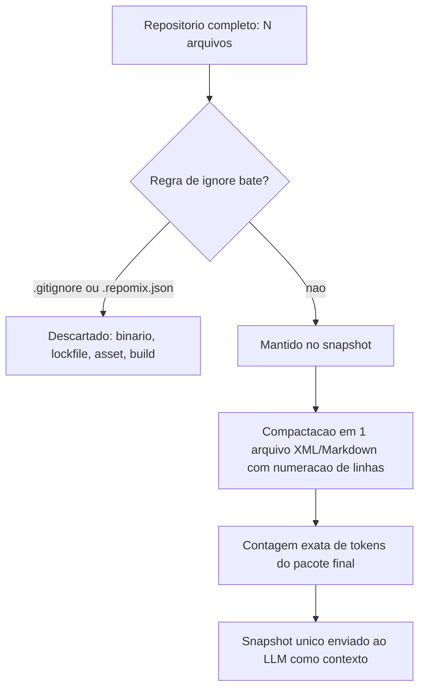

# Capítulo 5: Empacotamento de Contexto: Repomix

## 1. Introdução

No Capítulo 4, você aprendeu que reprocessar o mesmo prefixo do zero é dinheiro saindo do seu fluxo de caixa sem necessidade — e que o RTK-Memory resolve isso mantendo o prompt-base estável entre chamadas. Cache de prefixo estável, porém, só ajuda quando o que muda é a pergunta, não o material enviado. Este capítulo ataca o outro lado da equação: o que fazer quando o próprio contexto — os arquivos, o código, a documentação — muda de tamanho a cada chamada, porque você decide "na hora" o que incluir.

Se você já abriu um agente de IA e pensou "vou colar só estes três arquivos, deve bastar", você já pagou o preço desse capítulo antes de lê-lo. Às vezes bastava mesmo. Às vezes faltava um arquivo-chave, e a resposta saiu errada — não porque o modelo é ruim, mas porque a fatia de contexto que você escolheu não cobria o problema. Ao dominar o empacotamento estruturado de contexto, você deixa de apostar arquivo por arquivo e passa a trabalhar com um snapshot único, medido, versionado — a ferramenta central deste capítulo chama-se Repomix.

Este capítulo não trata apenas de "uma ferramenta a mais na caixa". Trata de mudar o ponto em que a decisão de custo é tomada: em vez de decidir, sob pressão, o que colar numa conversa, você decide uma vez — em configuração versionada — o que qualquer sessão futura vai enviar. É a diferença entre otimizar tokens *durante* o trabalho e otimizar a *forma como o trabalho é preparado* antes de começar. Como Engenheiro de Custos com IA, essa distinção é o que separa economia pontual de economia estrutural: a primeira se perde na próxima tarefa apressada, a segunda fica embutida no processo e se paga sozinha, sessão após sessão.

## 2. Explica

Todo Engenheiro de Custos com IA que já trabalhou com um projeto de mais de dez arquivos conhece o dilema: incluir contexto demais custa tokens sem necessariamente agregar sinal; incluir de menos custa uma resposta errada e uma nova chamada para corrigir o rumo. Esse segundo custo é traiçoeiro porque não aparece separado na fatura do provedor — ele se esconde dentro do total de tokens gastos, disfarçado de "mais uma pergunta de acompanhamento".

Repomix resolve esse dilema invertendo a lógica de decisão. Em vez de você escolher arquivo por arquivo a cada sessão, a ferramenta varre o repositório inteiro uma única vez, aplica um conjunto de regras de exclusão — o `.gitignore` do projeto somado às regras próprias do `.repomix.json` — e descarta automaticamente o que não carrega sinal útil para um modelo de linguagem: binários, lockfiles, assets de build, arquivos gerados. O que sobra é compactado em um único arquivo, tipicamente XML ou Markdown, com cabeçalhos que identificam cada arquivo original e numeração de linhas preservada [1].

Esse processo de decidir automaticamente "o que fica" versus "o que sai" não é exclusividade do Repomix — é uma versão prática do mesmo problema que pesquisas de compressão de prompt vêm formalizando: dado um orçamento de tokens, qual subconjunto do conteúdo original preserva o máximo de informação relevante para a tarefa? Trabalhos como o LLMLingua tratam esse recorte como um problema de otimização explícito, removendo tokens de baixa informação preservando a estrutura semântica do texto original [4]. O Repomix aplica a mesma lógica em um nível mais grosso — arquivos inteiros, não tokens individuais — mas o princípio de fundo é idêntico: cobertura máxima pelo menor custo possível.

Há ainda um ganho que não aparece na fatura, mas aparece no comportamento do modelo: pesquisas sobre uso eficiente de janelas longas de contexto mostram que modelos raciocinam melhor quando o contexto é denso e bem delimitado do que quando é longo e disperso [5]. Um snapshot compactado do Repomix não é só mais barato — tende a produzir respostas mais precisas, porque elimina o ruído que competiria por atenção do modelo junto com o sinal real.

Vale marcar onde termina o território do Repomix e começa o de outra ferramenta deste livro. O DSPy, que você vai encontrar mais à frente na coleção de ferramentas desta obra, ataca um problema vizinho mas diferente: ele comprime *instruções e few-shots* — o texto da própria pergunta e dos exemplos que a acompanham — recompilando-os automaticamente para a versão mais enxuta que ainda preserva acurácia. O Repomix não toca no texto da pergunta; ele decide *qual matéria-prima de código* entra na conversa antes da pergunta ser feita. São camadas diferentes do mesmo funil de custo: uma decide o que entra, a outra decide como o que já entrou é formulado. Tratá-las como concorrentes é um erro comum — na prática, um pipeline maduro de Engenharia de Custos usa as duas em sequência, snapshot primeiro, compilação de prompt depois.

Outro ponto que a explicação superficial do Repomix costuma pular: a ferramenta não exige que o repositório esteja clonado localmente. É possível apontar o comando direto para uma URL remota (`npx repomix --remote <url>`), o que muda o cálculo de custo em cenários de auditoria externa — revisar a arquitetura de um repositório de terceiros, ou de um fork que você nunca clonou, sem precisar baixar o projeto inteiro para o disco antes de decidir se vale a pena investigar mais [1]. Essa flexibilidade importa porque o custo de *preparar* o contexto também tem um componente de tempo, não só de tokens — e um comando que varre remotamente elimina uma etapa manual inteira do fluxo.

Vale registrar também o lado em que a exclusão automática pode errar. Um filtro de `.gitignore` bem construído descarta artefato de build com segurança — mas nada impede que um arquivo genuinamente relevante caia na mesma regra por engano, como uma pasta `generated/` que na verdade guarda schemas de API escritos à mão, não gerados por ferramenta nenhuma. O Repomix não adivinha a intenção por trás do nome de uma pasta; ele aplica a regra que você escreveu. Isso não é uma falha da ferramenta — é a razão pela qual o `.repomix.json` precisa ser revisado por alguém que conhece o projeto, não herdado de um template genérico e esquecido. Como Engenheiro de Custos com IA, sua responsabilidade não termina ao rodar o comando; termina quando você confirma que o snapshot gerado reflete a intenção real do escopo, não apenas a intenção mecânica do filtro.

## 3. Ilustra

Pense num projeto de médio porte: 340 arquivos, sendo boa parte deles `node_modules`, imagens de teste, arquivos de lock e configurações de CI que nunca importam para uma pergunta sobre lógica de negócio. Ler manualmente "os arquivos relevantes" para essa pergunta, um agente ou uma pessoa provavelmente escolheria entre 15 e 20 arquivos — um chute educado, mas ainda um chute. Rodar o Repomix sobre o mesmo repositório produz um único arquivo de saída de cerca de 45 mil tokens, cobrindo *todo* o código-fonte relevante, com os binários, os testes de fixture e o `node_modules` já descartados pelo filtro. A economia declarada da ferramenta gira em torno de 70% de redução de tokens por prompt frente ao hábito de colar múltiplos arquivos manualmente [1] — e a cobertura, ao contrário da escolha manual, não depende de quem lembrou de incluir o quê.

Para entender por que esse resultado não é mágica, vale usar duas imagens complementares — porque o mecanismo por trás do Repomix tem uma camada mecânica (o que ele descarta) e uma camada de intenção (por que descarta daquele jeito), e nenhuma das duas sozinha explica o resultado inteiro.

A primeira imagem: pense no Repomix como a lista de embarque de uma mala de viagem. Você não joga o guarda-roupa inteiro dentro da mala na esperança de que "vai que precisa" — decide, antes de fechar o zíper, o que cobre os dias de viagem e descarta o resto sem pena. O `.repomix.json` é essa lista de embarque escrita uma vez, revisada quando o destino muda, não reinventada a cada viagem.

A segunda imagem, mais próxima do vocabulário de quem administra custo: pense no snapshot do Repomix como o sumário executivo de uma empresa antes de uma reunião de investidores. Ninguém entrega o arquivo morto da empresa inteira para o investidor decidir — entrega um documento único, denso, que representa o que importa para aquela decisão específica. O sumário executivo não é uma versão incompleta da empresa; é a representação mínima suficiente para decisão informada. É exatamente esse o papel do arquivo único que sai do Repomix: não é "menos projeto", é o projeto reorganizado para a pergunta que o modelo vai responder.



A tabela abaixo resume o antes e depois do exemplo de 340 arquivos:

| Métrica | Escolha manual | Snapshot Repomix |
|---|---|---|
| Arquivos avaliados | ~15-20 (chute educado) | 340 (varredura completa) |
| Cobertura garantida | Depende de quem escolheu | Determinística (regras versionadas) |
| Tokens enviados | Variável, sem contagem prévia | ~45 mil, contados antes do envio |
| Reprodutibilidade entre sessões | Baixa (memória do agente) | Alta (config versionada) |

Um detalhe que a tabela sozinha não mostra: os "~45 mil" tokens do snapshot não são uma estimativa por heurística de caracteres — o Repomix conta os tokens de fato, com o tokenizador do modelo-alvo, e mostra esse número antes de você decidir enviar o pacote para a API [1]. Essa diferença parece pequena, mas muda o tipo de decisão que você consegue tomar: uma estimativa aproximada serve para ter uma noção de ordem de grandeza; uma contagem exata serve para comparar contra um orçamento de tokens definido em contrato ou em budget mensal, sem margem de erro escondida entre "achei que cabia" e "realmente coube". É a mesma disciplina de medição exata que a calculadora de custo do Capítulo 1 exige — aqui aplicada no momento em que o contexto é montado, não só depois que a fatura chega.

O exemplo dos 340 arquivos também esconde uma pergunta que só aparece quando o projeto cresce mais ainda: o que acontece num monorepo com múltiplos serviços independentes, cada um com sua própria árvore de dependências? Rodar o Repomix sobre o monorepo inteiro sem escopo produziria um snapshot correto, mas desperdiçado — a pergunta sobre o serviço de pagamentos não precisa do código do serviço de notificações por e-mail, mesmo que ambos vivam no mesmo repositório Git. A resposta prática é a mesma lição da lista de embarque: o `.repomix.json` não precisa ser um arquivo único para o monorepo inteiro. Times maduros mantêm um `.repomix.json` por serviço, cada um com seu próprio padrão de `include`, e escolhem qual configuração rodar de acordo com qual parte do sistema a pergunta atual realmente toca. A ferramenta escala com a granularidade da pergunta — não obriga você a escolher entre "tudo" ou "nada".

## 4. Técnica

A parte prática deste capítulo tem dois artefatos: primeiro, uma configuração `.repomix.json` que declara as regras de inclusão/exclusão do seu projeto; segundo, um script que mede o ganho real — em bytes e em tokens estimados — entre "enviar arquivos soltos" e "enviar o snapshot compactado".

### Instalando e rodando o Repomix

Repomix roda via `npx`, sem exigir instalação global — o que reduz a fricção de testar antes de decidir adotar:

```console
$ npx repomix --style xml --output-show-line-numbers
$ cat repomix-output.xml | wc -c
```

O primeiro comando varre o diretório atual e gera `repomix-output.xml`; o segundo mostra o tamanho em bytes do pacote final, o número que você vai comparar com o total de bytes do projeto original.

### Configurando regras próprias com `.repomix.json`

Repomix já filtra pelo `.gitignore`, mas projetos reais quase sempre precisam de regras adicionais — documentação gerada, arquivos de fixture de teste, diretórios de build específicos:

```json
{
  "output": {
    "filePath": "repomix-output.xml",
    "style": "xml",
    "showLineNumbers": true
  },
  "include": [
    "src/**/*.py",
    "src/**/*.ts",
    "docs/**/*.md"
  ],
  "ignore": {
    "useGitignore": true,
    "customPatterns": [
      "**/*.test.fixture.*",
      "**/dist/**",
      "**/*.generated.*",
      "**/CHANGELOG.md"
    ]
  }
}
```

Versionar esse arquivo no repositório transforma a decisão de "o que entra no contexto" em configuração auditável — qualquer pessoa do time vê exatamente o que está incluído, em vez de depender da memória de quem rodou o agente da última vez.

### Medindo o ganho real: bytes e tokens estimados

O script abaixo compara o tamanho do snapshot compactado com a soma dos arquivos originais, estimando também a redução aproximada de tokens (usando a heurística comum de ~4 caracteres por token):

```python
# medir_ganho_repomix.py
# Compara o tamanho do snapshot compactado com a soma dos arquivos originais.
import os

CARACTERES_POR_TOKEN = 4  # heuristica aproximada para estimativa rapida


def tamanho_total_diretorio(caminho: str, extensoes: tuple) -> int:
    """Soma o tamanho em bytes de todos os arquivos com as extensoes dadas."""
    total = 0
    for raiz, _dirs, arquivos in os.walk(caminho):
        for nome in arquivos:
            if nome.endswith(extensoes):
                caminho_completo = os.path.join(raiz, nome)
                total += os.path.getsize(caminho_completo)
    return total


def estimar_tokens(bytes_totais: int) -> int:
    """Estimativa grosseira de tokens a partir do tamanho em bytes."""
    return bytes_totais // CARACTERES_POR_TOKEN


def comparar_ganho(caminho_projeto: str, caminho_snapshot: str) -> dict:
    """Retorna bytes/tokens do projeto original vs. do snapshot compactado."""
    bytes_original = tamanho_total_diretorio(caminho_projeto, (".py", ".ts", ".md"))
    bytes_snapshot = os.path.getsize(caminho_snapshot)

    return {
        "bytes_original": bytes_original,
        "bytes_snapshot": bytes_snapshot,
        "tokens_estimados_original": estimar_tokens(bytes_original),
        "tokens_estimados_snapshot": estimar_tokens(bytes_snapshot),
        "reducao_percentual": round((1 - bytes_snapshot / bytes_original) * 100, 1)
        if bytes_original > 0
        else 0.0,
    }


if __name__ == "__main__":
    import argparse
    import sys

    parser = argparse.ArgumentParser(description="Mede o ganho de empacotamento do Repomix.")
    parser.add_argument("--limite-tokens", type=int, default=None,
                         help="Orcamento maximo de tokens estimados no snapshot.")
    parser.add_argument("--falhar-se-exceder", action="store_true",
                         help="Encerra com codigo de erro se o limite for ultrapassado.")
    args = parser.parse_args()

    resultado = comparar_ganho("./src", "./repomix-output.xml")
    print("Comparativo de empacotamento:", resultado)

    if args.limite_tokens is not None:
        tokens_snapshot = resultado["tokens_estimados_snapshot"]
        if tokens_snapshot > args.limite_tokens:
            print(f"ORCAMENTO EXCEDIDO: {tokens_snapshot} > {args.limite_tokens} tokens estimados")
            if args.falhar_se_exceder:
                sys.exit(1)
        else:
            print(f"Dentro do orcamento: {tokens_snapshot} <= {args.limite_tokens} tokens estimados")
```

Rodar esse script logo depois de gerar o snapshot dá um número concreto para colocar ao lado da calculadora de custo do Capítulo 1: não é "o Repomix ajuda", é "o Repomix reduziu X% do tokens estimados neste projeto específico" [1]. Esse tipo de medição empírica, feita projeto a projeto, é o que separa uma decisão de engenharia de uma impressão vaga de que "parece mais rápido agora" — e reflete a mesma disciplina que a literatura de compressão de prompt recomenda: medir ganho e perda de informação antes de declarar sucesso [6].

### Travando o orçamento de tokens em CI

Medir uma vez, manualmente, resolve o problema no dia em que você mediu. Mas o código muda: um módulo cresce, alguém importa uma biblioteca nova, a documentação gerada automaticamente incha o diretório `docs/`. Sem uma trava automatizada, o snapshot do Repomix cresce silenciosamente até que, meses depois, o "pacote enxuto" já não é mais tão enxuto — e ninguém percebeu porque a medição nunca foi repetida. A prática que fecha esse ciclo é transformar o script de medição num gate de CI que falha o build quando o snapshot ultrapassa um orçamento definido:

```yaml
# .github/workflows/orcamento-contexto.yml
name: Orcamento de Contexto (Repomix)
on: [pull_request]

jobs:
  medir-snapshot:
    runs-on: ubuntu-latest
    steps:
      - uses: actions/checkout@v4
      - name: Gerar snapshot Repomix
        run: npx repomix --style xml --output-show-line-numbers
      - name: Validar orcamento de tokens
        run: |
          python medir_ganho_repomix.py --limite-tokens 60000 --falhar-se-exceder
```

O parâmetro `--limite-tokens` não é arbitrário: ele deve nascer da calculadora de custo do Capítulo 1, calibrado para o orçamento mensal real do time, não para um número redondo escolhido de improviso. Quando o gate falha, a mensagem de erro aponta para o `.repomix.json` — sinal de que chegou a hora de revisar as regras de `customPatterns`, não de aumentar o limite sem pensar. Esse é o mecanismo que resolve a terceira armadilha listada na seção Aplica a seguir: tratar o snapshot como algo gerado uma vez e esquecido.

## 5. Aplica

Você está no meio de uma tarefa urgente: o agente precisa entender uma função que quebra em produção, e ela depende de três módulos espalhados pelo projeto. Sem pensar muito, você abre os três arquivos que lembra que existem, cola o conteúdo na conversa e pede o diagnóstico. O agente responde com confiança — e erra, porque a função na verdade importa um quarto módulo, que você esqueceu de incluir porque não apareceu na sua busca mental rápida.

O diagnóstico do erro não é "o modelo é ruim": é que a escolha manual de contexto depende da sua memória do projeto no momento exato da pergunta, e memória humana sob pressão de prazo erra fatias inteiras do problema. Você pagou tokens pela resposta errada e vai pagar de novo pela correção — o dobro do custo pela metade da cobertura.

A prática correta inverte a ordem: antes de formular a pergunta ao agente, você roda o Repomix sobre o diretório do módulo (não o projeto inteiro, quando o escopo é conhecido), com um `.repomix.json` que já inclui os padrões de import mais comuns daquele domínio. O snapshot resultante cobre a função quebrada e suas dependências diretas, sem depender de você lembrar de cada uma na hora. A pergunta ao agente vem depois, sobre um contexto que você sabe — porque mediu — que é completo o suficiente para a tarefa.

Há um segundo cenário, menos urgente mas igualmente comum, em que o mesmo erro de escolha manual aparece disfarçado de outra forma: você acabou de entrar num time novo e recebeu acesso a um repositório com sete anos de histórico, três reescritas parciais e nenhuma documentação atualizada. Seu instinto é pedir ao agente "explique a arquitetura deste projeto" e colar os arquivos que *parecem* centrais — o `main.py`, o `README.md`, talvez o arquivo de configuração mais recente. O agente entrega uma explicação plausível, coerente, bem escrita — e sutilmente errada, porque a lógica de negócio real vive num módulo antigo que ninguém mais toca, mas que ainda é importado por metade do sistema, e você não tinha como saber que ele existia.

Esse erro é mais caro que o do primeiro cenário porque ele não avisa que errou. Um diagnóstico de bug errado geralmente quebra de novo em produção e você percebe rápido; uma explicação de arquitetura errada vira a base mental com a qual você vai tomar decisões nas próximas semanas, e o erro só aparece quando já custou tempo de várias pessoas. A prática correta, de novo, inverte a ordem: rodar o Repomix sobre o repositório inteiro *antes* de formular qualquer pergunta sobre arquitetura, pedir ao agente que resuma a partir do snapshot completo — não de uma seleção prévia sua — e só então refinar com perguntas específicas sobre módulos que o próprio resumo apontar como centrais. A cobertura determinística do snapshot substitui o palpite de "o que parece importante" por uma varredura que não depende de você já conhecer o projeto — que é justamente o problema que te trouxe até ali.

Armadilhas comuns que vale evitar:

- Rodar o Repomix sobre o repositório inteiro quando o escopo real é um módulo — você paga por cobertura que não usa.
- Deixar o `.repomix.json` desatualizado depois que a estrutura de pastas do projeto muda, gerando snapshots que ainda incluem diretórios já removidos.
- Tratar o snapshot como estático depois de gerado uma vez — código muda, e um snapshot velho é tão perigoso quanto nenhum snapshot, porque passa confiança falsa de cobertura atual.
- Pular o gate de orçamento em CI por parecer burocracia — é exatamente essa checagem que pega o snapshot inchado antes que ele vire hábito caro em toda sessão do time.

### Exercício
- [ ] Instale o Repomix com `npx repomix --style xml --output-show-line-numbers` no seu projeto atual
- [ ] Escreva um `.repomix.json` com pelo menos 3 regras de `customPatterns` específicas do seu projeto
- [ ] Rode `medir_ganho_repomix.py` e registre a redução percentual real obtida
- [ ] Versione o `.repomix.json` no repositório e documente, em uma linha, quando ele deve ser revisado
- [ ] Configure o gate de CI de orçamento de tokens (seção Técnica) com um limite calibrado pela calculadora de custo do Capítulo 1, não por um número redondo escolhido de improviso

## 6. Conclusão

O Repomix não inventa uma técnica de compressão nova — ele aplica, em nível de arquivo, o mesmo princípio que sustenta toda compressão de prompt: dado um orçamento de tokens, maximizar cobertura e minimizar ruído. A diferença prática é que ele faz isso de forma determinística e versionável, tirando de você a responsabilidade de lembrar, sessão após sessão, quais arquivos importam. Como Engenheiro de Custos com IA, esse é o tipo de automação que paga por si mesma na primeira tarefa que não precisa de retrabalho.

Note o padrão que se repete nos dois cenários da seção anterior: o custo real nunca aparece na primeira chamada — aparece na segunda, na correção, na decisão tomada sobre uma base incompleta que ninguém percebeu como incompleta. Empacotar contexto de forma determinística não elimina esse risco por completo, mas o reduz de "depende da sua memória hoje" para "depende de uma configuração que o time revisa e versiona" — e essa mudança de categoria, de decisão implícita para decisão auditável, é o fio condutor que vai reaparecer em quase toda ferramenta discutida no restante desta obra.

Empacotar melhor o que ainda precisa ser enviado resolve metade do problema de contexto — a outra metade é o que já está dentro do código: duplicação, padrões repetidos, funções que fazem a mesma coisa de jeitos diferentes. No Capítulo 6, você usa o ast-grep para encontrar essa duplicação estruturalmente, sem depender de grep textual, reduzindo o próprio tamanho do código antes mesmo dele virar contexto para qualquer chamada.

## 7. Referências Bibliográficas

[1] REPOMIX. *Repomix: Pack your codebase into AI-friendly formats*. Disponível em: https://github.com/yamadashy/repomix. Acesso em: 25 ago. 2026.

[2] FAN, Wenqi et al. *A Survey on RAG Meeting LLMs: Towards Retrieval-Augmented Large Language Models*. 2024. Disponível em: https://doi.org/10.1145/3637528.3671470. Acesso em: 25 ago. 2026.

[3] JIANG, Huiqiang et al. *LongLLMLingua: Accelerating and Enhancing LLMs in Long Context Scenarios via Prompt Compression*. 2024. Disponível em: https://doi.org/10.18653/v1/2024.acl-long.91. Acesso em: 25 ago. 2026.

[4] JIANG, Huiqiang et al. *LLMLingua: Compressing Prompts for Accelerated Inference of Large Language Models*. 2023. Disponível em: https://doi.org/10.18653/v1/2023.emnlp-main.825. Acesso em: 25 ago. 2026.

[5] HAN, Tingxu et al. *Token-Budget-Aware LLM Reasoning*. 2025. Disponível em: https://doi.org/10.18653/v1/2025.findings-acl.1274. Acesso em: 25 ago. 2026.

[6] PAN, Zhuoshi et al. *LLMLingua-2: Data Distillation for Efficient and Faithful Task-Agnostic Prompt Compression*. In: Annual Meeting of the Association for Computational Linguistics. 2024. Disponível em: https://www.semanticscholar.org/paper/3d45fc603e34934fc589b9547307815f7723de34. Acesso em: 25 ago. 2026.

[7] NAVEED, Humza et al. *A Comprehensive Overview of Large Language Models*. In: arXiv (Cornell University). 2023. Disponível em: http://arxiv.org/abs/2307.06435. Acesso em: 25 ago. 2026.

[8] ZHAO, Wayne Xin et al. *A Survey of Large Language Models*. In: Frontiers of Computer Science. 2026. Disponível em: https://doi.org/10.1007/s11704-026-60308-3. Acesso em: 25 ago. 2026.
