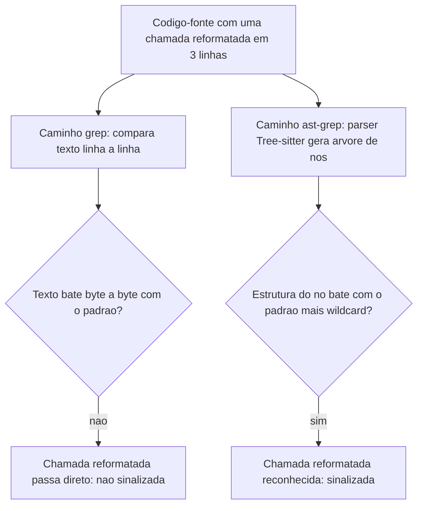

# Capítulo 6: Refatoração Estrutural com AST: ast-grep

## 1. Introdução

No Capítulo 5, você aprendeu a empacotar melhor o que ainda precisa ser enviado ao modelo — o Repomix transforma um projeto inteiro num snapshot enxuto, cortando o que sobra antes de o contexto sair do seu computador. Este capítulo dá um passo para trás na esteira: e se, antes de empacotar, você reduzisse o próprio código-fonte que vai ser empacotado? Menos duplicação, menos função morta, menos ruído estrutural significam um snapshot menor mesmo antes de qualquer regra de ignore entrar em ação.

É aqui que entra o ast-grep. Como Engenheiro de Custos com IA, você já sabe que grep encontra texto — mas texto muda de forma o tempo todo (indentação, quebra de linha, nome de variável) sem que o significado do código mude nada. Ao dominar a busca estrutural baseada em Árvore de Sintaxe Abstrata (AST), você deixa de gastar tokens de LLM em tarefas puramente mecânicas — renomear uma função em 40 arquivos, por exemplo — e passa a resolvê-las com uma regra determinística que roda em milissegundos, sem depender de nenhum modelo.

Essa fronteira entre o que é mecânico e o que exige julgamento vale a pena marcar já na abertura do capítulo: nem toda tarefa sobre código é uma tarefa de raciocínio, e confundir as duas é exatamente onde a fatura de tokens de um time infla sem necessidade. O capítulo caminha em três camadas — provar a diferença entre busca textual e estrutural, escrever a primeira regra de reescrita e transformar essa regra num gate automático de qualidade — cada uma construindo sobre a anterior.

## 2. Explica

Todo modelo de linguagem cobra pelo volume de texto que processa como entrada — cada trecho de código colado num prompt vira uma sequência de tokens, e o preço da chamada escala com esse volume [1]. Quanto maior a janela de contexto sustentada numa chamada, maior tende a ser esse custo, o que empurra qualquer sistema de LLM em produção a tratar volume de entrada como algo a orçar, não como algo ilimitado [5]. Isso significa que qualquer redução no tamanho ou na duplicação do código-fonte, feita antes de ele chegar ao modelo, já é economia acumulada — mesmo sem tocar em nenhuma configuração de cache ou de compressão de prompt.

O grep e as expressões regulares (regex) resolvem parte do problema de localizar código, mas fazem isso comparando **texto**: sequências de caracteres, byte a byte. Se a mesma chamada de função aparecer formatada em uma linha num arquivo e quebrada em três linhas noutro, um padrão regex escrito para o primeiro formato simplesmente não reconhece o segundo — não porque o código seja diferente, mas porque o *texto* é diferente.

O ast-grep resolve isso operando em outra camada. Em vez de comparar caracteres, ele primeiro faz o **parsing** do código-fonte — usando o motor Tree-sitter, escrito em Rust — transformando o arquivo inteiro numa Árvore de Sintaxe Abstrata: uma estrutura de nós onde cada nó representa uma construção da linguagem (uma chamada de função, um parâmetro, um bloco condicional), independente de como esse trecho foi formatado no arquivo original. A busca então compara **nós da árvore**, não linhas de texto — e é exatamente por isso que reformatação, indentação e quebra de linha deixam de ser um problema [2].

A ferramenta também suporta *wildcards* estruturais — como `$URL` para casar um único argumento ou `$$$ARGS` para casar qualquer quantidade de argumentos dentro do mesmo nó — o que permite escrever uma única regra que cobre variações de uma mesma chamada de função sem enumerar cada caso manualmente. Esse mesmo princípio de tratar volume de entrada como algo a ser reduzido antes do processamento é o que sustenta abordagens de compressão de prompt de ponta a ponta: comprimir o que será enviado ao modelo, sem perder a informação que importa, acelera a inferência e reduz custo mesmo em cenários de contexto longo [6]. A lógica é a mesma quando o alvo é raciocínio em vez de contexto: orçar explicitamente quantos tokens uma tarefa pode consumir, em vez de deixar o modelo gastar o quanto "achar necessário", já reduz custo por chamada sem perder qualidade de resposta [4] — e uma regra estrutural que resolve uma refatoração em milissegundos leva esse orçamento ao limite: zero tokens de modelo gastos na tarefa.

Vale demarcar, ainda nesta seção, o que o ast-grep **não** faz — para não elevar a expectativa além da entrega real da ferramenta. Ele reconhece estrutura sintática, não significado. Duas funções que fazem exatamente a mesma coisa, mas com estrutura de código diferente — uma usa um laço `for` explícito, a outra resolve o mesmo resultado com uma list comprehension — são invisíveis uma para a outra sob a ótica da árvore, porque geram nós diferentes mesmo produzindo o mesmo efeito em tempo de execução. Essa fronteira entre "mesma estrutura" e "mesma intenção" volta a aparecer na seção Aplica, no ponto exato em que a ferramenta encontra seu limite de escala.

## 3. Ilustra

Pense no grep como um auditor júnior de despesas: ele só reconhece um lançamento como "reembolso de viagem" se o formato da nota bater exatamente com o que ele decorou — mesma fonte, mesma ordem de campos, mesma casa decimal. Mude uma vírgula de lugar e o auditor júnior deixa passar o lançamento sem sinalizar nada, mesmo que a despesa seja idêntica em substância.

O ast-grep é o auditor sênior. Ele não decorou o formato da nota — ele entende a **estrutura contábil** por trás dela: categoria, cliente, valor. Não importa se a nota veio em PDF, em papel escaneado ou com os campos em outra ordem; se a estrutura é a de um reembolso de viagem, o auditor sênior reconhece e sinaliza. É essa mesma independência de formatação que faz o ast-grep encontrar `api.get(url)` seja essa chamada escrita em uma linha ou quebrada em três.

Há um segundo ponto, mais denso, que separa esse auditor sênior de um simples "auditor que entende formatos variados": ele também reconhece lançamentos com **quantidade variável de itens** sem precisar de uma regra para cada quantidade. Imagine uma auditoria de despesas de viagem que precisa flagar todo lançamento da categoria "viagem a trabalho", não importa se ele contém dois itens (passagem e hotel) ou seis (passagem, hotel, táxi, refeição, estacionamento, seguro). A regra não lista cada combinação possível — ela reconhece o formato do lançamento (categoria + qualquer número de itens dentro) e sinaliza todos. É exatamente isso que o wildcard estrutural `$$$ARGS` faz dentro da árvore: casa qualquer quantidade de argumentos no mesmo nó, sem que você precise escrever uma regra por quantidade de parâmetros.

O auditor sênior, além disso, não trabalha só com notas escritas num único idioma: o mesmo raciocínio estrutural se aplica a qualquer "idioma" de código, contanto que exista um dicionário — no caso do ast-grep, uma gramática Tree-sitter — que descreva a estrutura daquela linguagem. É por isso que a mesma ferramenta cobre Python, JavaScript, Go, Rust e dezenas de outras linguagens sem trocar de motor de busca: muda a gramática consultada, não o princípio de comparar nós em vez de caracteres [2].



## 4. Técnica

A parte prática deste capítulo segue a progressão dos três pilares: primeiro você vê a diferença entre busca textual e estrutural rodando de verdade; depois escreve uma regra de reescrita e aplica em lote; por fim, transforma essa regra num gate automático de CI.

### Provando a diferença entre grep e AST na prática

Antes de instalar qualquer ferramenta nova, vale enxergar o problema com o que você já tem: o próprio módulo `ast` da biblioteca padrão do Python. O script abaixo compara duas formas de contar chamadas `api.get(url)` no mesmo trecho de código — uma via regex (texto) e outra via árvore de sintaxe (estrutura) — para deixar concreto o que a seção Explica descreveu.

```python
# comparar_grep_vs_ast.py
# Demonstracao didatica: contar chamadas "api.get(url)" via regex (texto)
# versus via arvore de sintaxe (estrutura), no mesmo trecho de codigo Python.

import ast
import re

codigo_fonte = """
resultado = api.get(url)
outro = api.get(
    url,
)
"""


def contar_via_regex(codigo: str) -> int:
    """Conta ocorrencias comparando texto, byte a byte, contra um padrao fixo."""
    padrao = re.compile(r"api\\.get\\(url\\)")
    return len(padrao.findall(codigo))


def contar_via_ast(codigo: str) -> int:
    """Conta ocorrencias comparando a estrutura da arvore de sintaxe.

    Encontra qualquer chamada no formato api.get(...), nao importa
    como ela foi formatada no arquivo original.
    """
    arvore = ast.parse(codigo)
    total = 0
    for no in ast.walk(arvore):
        if isinstance(no, ast.Call) and isinstance(no.func, ast.Attribute):
            se_e_api = isinstance(no.func.value, ast.Name) and no.func.value.id == "api"
            if se_e_api and no.func.attr == "get":
                total += 1
    return total


if __name__ == "__main__":
    print("Via regex (texto):", contar_via_regex(codigo_fonte))
    print("Via AST (estrutura):", contar_via_ast(codigo_fonte))
```

Rodar esse script mostra a regex encontrando só 1 ocorrência (a chamada em uma linha) enquanto a contagem via AST encontra as 2 — a chamada reformatada em três linhas não escapa, porque a árvore de sintaxe não enxerga quebra de linha, só a estrutura `Call(func=Attribute(value=Name(api), attr=get))`. O ast-grep faz exatamente esse mesmo tipo de comparação estrutural, só que via Tree-sitter e para dezenas de linguagens além de Python, em microssegundos por arquivo [2].

### Investigação pontual sem escrever regra alguma

Nem toda consulta estrutural precisa virar um arquivo YAML antes de valer a pena. Para uma pergunta única — "essa chamada antiga ainda existe em algum lugar do repositório?" — o ast-grep aceita o padrão direto na linha de comando, em modo de leitura, sem regra e sem `fix`:

```console
$ sg run -p 'api.get($URL)' --lang js
src/pedidos.js:12: resultado = api.get(url)
src/relatorios.js:47: dados = api.get(endpointRelatorio)
2 correspondencias em 2 arquivos, 8 ms
```

Esse modo de uso pontual sustenta a mesma disciplina descrita pela skill lean-ctx neste compêndio: antes de colar um arquivo de 1.500 linhas inteiro num prompt, localizar primeiro o trecho exato via busca estrutural e ler só a fatia relevante — 25 linhas em vez de 1.500. A diferença entre `sg run` e `sg scan` é a diferença entre investigar (leitura, nada é tocado) e agir (`--update-all`, reescreve de fato) — e vale sempre passar pela primeira antes da segunda, mesmo quando a regra parece óbvia à primeira vista.

### Reescrevendo em lote: da regra YAML ao repositório inteiro

Com o princípio provado, o próximo passo é instalar o ast-grep de verdade e escrever a primeira regra de reescrita — trocando um script Python didático por uma ferramenta que já resolve o "reduzir volume antes do processamento" de ponta a ponta, para qualquer linguagem [3]. A instalação é um binário único, sem runtime pesado por trás:

```console
$ npm install -g @ast-grep/cli
$ sg --version
0.30.0
```

Uma regra do ast-grep vive num arquivo YAML dentro de uma pasta de regras, referenciada pelo arquivo de configuração do projeto:

```yaml
# sgconfig.yml
ruleDirs:
  - regras
```

```yaml
# regras/regra-rename.yml
id: renomear-chamada-api-antiga
language: JavaScript
rule:
  pattern: "api.get($URL)"
fix: "api.fetch({ url: $URL })"
```

Cada campo do arquivo tem um papel específico, e vale entender os quatro antes de escrever a sua primeira regra:

- `id`: um nome único para a regra, usado nos logs e nos relatórios do CI.
- `language`: a linguagem-alvo do parsing — o ast-grep usa um parser Tree-sitter diferente por linguagem, o que é o que permite a mesma ferramenta cobrir dezenas de linguagens de programação sem trocar de motor [2].
- `rule.pattern`: o padrão estrutural a casar, com `$URL` funcionando como wildcard de um único argumento.
- `fix`: como reescrever o nó encontrado, preservando o valor capturado pelo wildcard.

Rodando a regra contra o repositório inteiro:

```console
$ sg scan -r regras/regra-rename.yml --update-all
2 arquivos atualizados em 2 ms
```

Antes de confiar num `--update-all` direto num repositório grande, existe um meio-termo entre só investigar e reescrever tudo de uma vez: a flag `--interactive` (`-i`) apresenta cada correspondência encontrada e pergunta se aplica ou pula aquele caso específico, um por um. É a versão de linha de comando de revisar o diff antes do commit — útil quando a regra é nova e você ainda não tem certeza de que ela não vai casar com um caso que parece estruturalmente igual, mas semanticamente diferente.

Conferindo o que mudou num dos arquivos afetados, o diff mostra exatamente a reescrita estrutural aplicada, sem tocar em mais nada ao redor:

```console
$ git diff src/pedidos.js
- resultado = api.get(url)
+ resultado = api.fetch({ url: url })
```

Essa é a diferença de fluxo de caixa que este capítulo defende: uma mudança de assinatura de função que levaria horas de edição manual, arquivo por arquivo — ou minutos de conversa com um LLM, gastando tokens numa tarefa sem nenhuma ambiguidade — é resolvida em cerca de 2 ms para 50 arquivos, sem custo de API algum, porque o motor de busca e reescrita é um binário Rust local, com licença MIT, ocupando menos de 10 MB de RAM em execução [1]. É o mesmo tipo de ganho que aparece quando um sistema de inferência é desenhado para operar sob restrição de memória em vez de assumir recursos ilimitados: manter o desempenho essencial com uma fração do consumo de recursos de uma abordagem ingênua [7].

### Colocando um auditor automático no CI

O terceiro pilar transforma a mesma capacidade de busca estrutural num gate de qualidade: em vez de procurar duplicação e anti-patterns manualmente, uma regra de **detecção** (sem `fix`, só sinalização) passa a rodar em toda Pull Request, bloqueando o merge se o padrão proibido reaparecer:

```yaml
# regras/proibir-console-log.yml
id: proibir-console-log-em-producao
language: JavaScript
rule:
  pattern: "console.log($$$ARGS)"
```

Essa regra usa o wildcard `$$$ARGS` do jeito descrito na seção Ilustra: casa `console.log` chamado com qualquer quantidade de argumentos — zero, um ou dez — sem precisar de uma variação para cada caso.

Antes de colocar qualquer regra de detecção no caminho de bloqueio de todo o time, vale testá-la contra casos que ela deveria (e não deveria) pegar — o mesmo cuidado de um teste unitário, só que aplicado à própria regra de busca:

```console
$ sg test -r regras/proibir-console-log.yml
[PASSOU] caso "com um argumento": console.log(erro) -> deveria casar -> casou
[PASSOU] caso "chamada de metodo diferente": logger.log(erro) -> nao deveria casar -> nao casou
2 casos de teste, 0 falhas
```

Só depois de `sg test` confirmar que a regra não gera falsos positivos contra os casos conhecidos do projeto é que ela ganha o direito de virar um passo que bloqueia merge. O workflow de CI referencia essa regra explicitamente:

```yaml
# .github/workflows/auditoria-estrutural.yml
name: auditoria-estrutural
on: [pull_request]
jobs:
  ast-grep-scan:
    runs-on: ubuntu-latest
    steps:
      - uses: actions/checkout@v4
      - name: Instalar ast-grep
        run: npm install -g @ast-grep/cli
      - name: Rodar varredura de anti-patterns
        run: sg scan -r regras/proibir-console-log.yml --error
```

Quando alguém abre uma Pull Request reintroduzindo um `console.log` esquecido de uma sessão de depuração, o job falha antes mesmo de um revisor humano abrir o arquivo:

```console
$ sg scan -r regras/proibir-console-log.yml --error
[ERRO] padrao proibido encontrado em src/legacy.js:42: console.log(pedido.id)
Processo finalizado com codigo de saida 1
```

A tabela abaixo resume os três usos e onde cada um se encaixa no seu fluxo de trabalho:

| Situação | Uso do ast-grep | Momento |
|---|---|---|
| Localizar um padrão estrutural, mesmo com formatação variada | `sg run -p '<padrao>'` | Investigação pontual |
| Reescrever com revisão caso a caso, quando a regra é nova | `sg scan -r <regra>.yml --interactive` | Refatoração cautelosa |
| Reescrever o padrão em todo o repositório de uma vez | `sg scan -r <regra>.yml --update-all` | Refatoração em lote |
| Validar a regra contra casos conhecidos antes de publicá-la | `sg test -r <regra>.yml` | Calibração da regra |
| Bloquear reintrodução do padrão proibido | `sg scan --error` como step de CI | Governança contínua |

Vale registrar que esse tipo de filtragem — separar o que é relevante do que é ruído antes de qualquer processamento pesado — é o mesmo princípio por trás de sistemas de recuperação que só entregam ao modelo o trecho de contexto que importa, em vez do documento inteiro [8]. O ast-grep aplica essa mesma disciplina de "só o que importa" uma camada abaixo: no próprio código-fonte, antes de ele virar contexto.

## 5. Aplica

Você lidera a migração de uma API interna e precisa renomear `api.get(url)` para `api.fetch({ url })` em 40 arquivos espalhados por três times diferentes, cada um com um estilo de formatação próprio. A saída mais rápida parece óbvia: abrir uma conversa com seu assistente de IA, colar arquivo por arquivo e pedir "renomeie essa chamada para o novo formato". Você faz isso arquivo a arquivo durante a tarde inteira.

No fim do dia, a fatura de tokens do provedor subiu visivelmente — e pior: dois arquivos com a chamada formatada de um jeito que você não previu no prompt continuaram usando o padrão antigo, porque o modelo, sem ver aquele trecho específico, simplesmente não soube que precisava mexer nele. O diagnóstico é o que a seção Explica já havia antecipado: essa é uma tarefa **determinística e sem ambiguidade** — não exige julgamento, criatividade nem interpretação, exige só reconhecer um padrão estrutural e trocá-lo por outro. Delegar isso a um LLM, chamada por chamada, é pagar caro (em tokens e em tempo) por uma decisão que não precisava de inteligência nenhuma para ser tomada.

A correção é a que a seção Técnica já demonstrou: escrever a regra `regra-rename.yml` uma única vez e rodar `sg scan -r regra-rename.yml --update-all` contra o repositório inteiro. Os 40 arquivos são atualizados de uma vez, na formatação de cada um, sem depender de você prever manualmente cada variação de estilo — e sem gastar um único token de API na tarefa.

Meses depois, um cenário parecido aparece num projeto Python do mesmo time: a diretriz interna passa a proibir o uso direto de `requests.get(url)`, substituído por um wrapper próprio, `http_client.buscar(url)`, que já aplica retry e timeout padronizados. Sua primeira tentativa, movido pelo hábito, é um `grep -rn "requests.get(" --include="*.py"` para dimensionar o problema antes de decidir como resolvê-lo.

O grep retorna 30 ocorrências — mas você já sabe, pela seção Técnica deste capítulo, que 30 é só o que bateu **texto**. Alguns arquivos escrevem `requests.get('...')` com aspas simples, outros `requests.get("...")` com aspas duplas, e um módulo legado importa a função direto (`from requests import get`) e chama só `get(url)`, sem o prefixo `requests.`. Cada uma dessas variações de escrita é invisível para um regex fixo que decorou um único estilo de aspas e um único caminho de import.

A prática correta é rodar `sg run -p 'requests.get($URL)' --lang python` primeiro, ainda em modo investigação, sem `--update-all`: aspas simples e aspas duplas produzem o mesmo nó de constante na árvore, então a busca estrutural ignora essa diferença e revela as ocorrências reais — inclusive as que o grep já tinha contado, confirmando que pelo menos essa parte do levantamento manual estava certa. O caso `from requests import get`, porém, continua fora: ele é uma chamada sobre um nome isolado (`Call` sobre `Name`), não sobre um atributo (`Call` sobre `Attribute`) — uma estrutura de nó diferente, que exige uma segunda regra dedicada. Só depois de mapear os dois padrões corretamente é que as regras de reescrita entram em ação com `--update-all`.

Armadilhas comuns que valem registrar:

- Confiar cegamente no `--update-all` sem revisar o diff antes do commit: o ast-grep casa a estrutura corretamente, mas não sabe se a reescrita quebra um contrato semântico que só os testes do projeto conhecem.
- Tratar duplicação **semântica** (dois trechos que fazem a mesma coisa com estrutura diferente) como se fosse um caso para o ast-grep — a ferramenta reconhece árvores parecidas, não intenção parecida com sintaxe diferente.
- Escrever a regra de CI direto em produção sem rodar primeiro em modo de leitura (`sg scan`, sem `--update-all` nem `--error`) contra o histórico do repositório, para calibrar quantos falsos positivos ela gera.
- Assumir que toda linguagem tem uma gramática Tree-sitter madura e pronta: dialetos muito recentes ou DSLs internos de uma empresa podem exigir escrever ou adaptar uma gramática antes de o ast-grep conseguir enxergar aquele código — nesse caso, o investimento de setup pode não compensar para um único caso de uso pontual.

Esse último ponto marca também o limite de escala da ferramenta: o ast-grep escala bem até onde o problema é estrutural — forma da árvore, padrão sintático, quantidade de nós casados. A partir do momento em que a pergunta muda de "essa estrutura se repete?" para "essas duas implementações fazem a mesma coisa?", você saiu do território que uma regra de árvore resolve sozinha e entrou no território que ainda depende de revisão humana e de testes automatizados — o ast-grep acelera a mecânica, não substitui o julgamento sobre segurança da mudança.

### Exercício
- [ ] Instale o ast-grep no seu ambiente (`npm install -g @ast-grep/cli` ou o binário nativo da plataforma)
- [ ] Rode `sg run -p '<um padrão do seu projeto>'` e compare o resultado com o mesmo `grep` sobre o mesmo padrão
- [ ] Escreva uma regra YAML de reescrita para uma mudança de assinatura real do seu código e rode com `--update-all` num branch isolado
- [ ] Adicione um step de `sg scan --error` num workflow de CI, mesmo que só em modo de aviso no início

## 6. Conclusão

Este capítulo separou três camadas do mesmo princípio: primeiro, por que busca estrutural via AST enxerga o que o grep não enxerga (formatação não engana uma árvore de sintaxe); segundo, como transformar essa capacidade numa regra YAML que reescreve um repositório inteiro em milissegundos, sem gastar tokens numa tarefa sem ambiguidade; terceiro, como transformar a mesma regra num gate automático de CI, deslocando a auditoria de duplicação e anti-patterns de um revisor humano ocasional para um processo determinístico e contínuo. Como Engenheiro de Custos com IA, ao interiorizar essa distinção — entre o que é mecânico e o que exige julgamento — você para de gastar orçamento de modelo no primeiro grupo.

Somada às outras táticas deste compêndio, essa camada de economia estrutural contribui para um corte de até 85% no custo total com LLMs quando as oito ferramentas descritas na obra operam em conjunto [1] — e a fatia do ast-grep nessa soma é a mais absoluta de todas: 100% de economia nas transformações puramente estruturais, porque a tarefa nunca chega a entrar na fila de inferência de um modelo.

No Capítulo 7, o alvo muda do código-fonte para o próprio prompt: com o DSPy, você vai tratar prompts como programas estruturados, com validadores e um compilador que procura a versão mais barata que ainda passa nos critérios exigidos.

## 7. Referências Bibliográficas

[1] ECONOMIA EXTREMA DE TOKENS: contexto e skills de eficiência. Compêndio técnico. Curadoria de Elite — Open Source Initiative (OSI), Linux Foundation, CNCF Landscape, 2026. Documento técnico interno (dossiê de pesquisa da obra).

[2] NAVEED, Humza et al. *A Comprehensive Overview of Large Language Models*. In: arXiv (Cornell University). 2023. Disponível em: http://arxiv.org/abs/2307.06435. Acesso em: 25 ago. 2026.

[3] JIANG, Huiqiang et al. *LLMLingua: Compressing Prompts for Accelerated Inference of Large Language Models*. 2023. Disponível em: https://doi.org/10.18653/v1/2023.emnlp-main.825. Acesso em: 25 ago. 2026.

[4] HAN, Tingxu et al. *Token-Budget-Aware LLM Reasoning*. 2025. Disponível em: https://doi.org/10.18653/v1/2025.findings-acl.1274. Acesso em: 25 ago. 2026.

[5] ZHAO, Wayne Xin et al. *A Survey of Large Language Models*. In: Frontiers of Computer Science. 2026. Disponível em: https://doi.org/10.1007/s11704-026-60308-3. Acesso em: 25 ago. 2026.

[6] JIANG, Huiqiang et al. *LongLLMLingua: Accelerating and Enhancing LLMs in Long Context Scenarios via Prompt Compression*. 2024. Disponível em: https://doi.org/10.18653/v1/2024.acl-long.91. Acesso em: 25 ago. 2026.

[7] ALIZADEH, Keivan et al. *LLM in a Flash: Efficient Large Language Model Inference with Limited Memory*. 2024. Disponível em: https://doi.org/10.18653/v1/2024.acl-long.678. Acesso em: 25 ago. 2026.

[8] FAN, Wenqi et al. *A Survey on RAG Meeting LLMs: Towards Retrieval-Augmented Large Language Models*. 2024. Disponível em: https://doi.org/10.1145/3637528.3671470. Acesso em: 25 ago. 2026.
