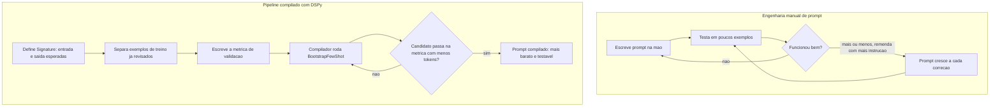

# Capítulo 7: Otimização de Prompts: DSPy

## 1. Introdução

No Capítulo 6, você usou o ast-grep para encontrar padrões estruturais em código — função duplicada, parâmetro que ninguém usa — sem precisar ler arquivo por arquivo. A ferramenta buscava estrutura, não decorava exemplos isolados. Este capítulo pega essa mesma ideia e aponta para um material bem diferente: o prompt que você reenvia, quase idêntico, centenas de vezes por mês para resolver o mesmo tipo de tarefa.

Se você já escreveu um prompt, testou em três ou quatro casos, achou que "ficou bom" e seguiu em frente, você fez engenharia de prompt no achômetro: sem métrica, sem comparação objetiva com uma versão alternativa, só a sensação de que funcionou. Isso é normal — é como praticamente todo mundo começa. O problema aparece quando esse prompt "que parece bom" vira parte fixa de um fluxo que roda mil vezes por mês. Nesse volume, cada palavra desnecessária no prompt é uma despesa recorrente que ninguém nunca auditou.

O DSPy nasceu para resolver exatamente esse ponto: trata o prompt como programa, não como texto místico. Você declara o que entra e o que deve sair, fornece alguns exemplos já revisados, define uma métrica que diz se a saída está certa, e deixa um compilador testar variações até encontrar a mais enxuta que ainda passa. Como Engenheiro de Custos com IA, esse é o momento em que você troca a intuição por evidência: em vez de confiar que seu prompt está bom, você prova, com números, que ele é o mais barato possível sem perder qualidade.

Vale marcar a diferença entre o que este capítulo cobre e o que os capítulos anteriores cobriram. Ast-grep, Repomix e headroom atacam o que entra no contexto — código, logs, arquivos inteiros — cortando volume antes de a chamada acontecer. O DSPy ataca uma camada diferente: o próprio texto de instrução que você escreve, ou paga alguém para escrever, e que se repete idêntico a cada chamada de um fluxo fixo. Não é sobre reduzir o que o modelo lê de contexto variável; é sobre reduzir o peso morto que vive na parte fixa do prompt e nunca foi auditado desde que alguém digitou pela primeira vez.

## 2. Explica

O DSPy organiza um prompt em três peças separadas, e entender essa separação é o que torna tudo testável. A primeira é a Signature: um contrato que declara só o que entra e o que sai da tarefa — por exemplo, "recebe um texto de contrato, devolve nome do cliente, valor e data de vencimento". A Signature não diz como o modelo deve pensar para chegar lá; ela só define a forma do problema [1].

Pense na Signature de duas formas complementares, porque essa separação costuma confundir quem vem de "prompt é só texto". Primeiro: ela é como um formulário de RH com campos obrigatórios — nome, cargo, salário. O formulário exige que os campos sejam preenchidos, mas não ensina o funcionário a pensar sobre o que escrever em cada um. Segundo, para quem já programou algo: a Signature é como a assinatura de uma função — os nomes dos parâmetros de entrada e o tipo do retorno, sem revelar uma linha do corpo da função. Em ambos os casos, o contrato e a implementação são coisas diferentes.

Um detalhe que ajuda a evitar retrabalho, para quem está começando: a Signature aceita tipos declarados nos campos de entrada e saída, não só texto solto. Um campo pode ser declarado como `str`, mas também como uma lista de strings, um número ou uma classe de dados mais estruturada. Isso importa porque parte do erro que antes exigia "mais uma frase de instrução" no prompt manual — como "responda só com números, sem texto ao redor" — deixa de ser um pedido em linguagem natural, torcendo para o modelo obedecer, e passa a ser uma restrição estrutural do próprio contrato [1]. Menos instrução escrita para garantir formato correto significa, de novo, menos tokens fixos pagos a cada chamada.

A segunda peça é o Module: a estratégia real de chamada ao modelo que preenche esse contrato. É o "funcionário" que de fato responde ao formulário, ou o "corpo da função" que implementa a assinatura. Um Module simples só pede a resposta direto; um mais elaborado pode pedir raciocínio passo a passo antes da resposta final — mas esse raciocínio extra também é tokens pagos, e tratá-los como orçamento finito, gastando só quando o problema exige, é o mesmo princípio que sustenta pesquisas recentes sobre uso consciente de tokens em cadeias de raciocínio [5]. A mesma Signature pode ser cumprida por Modules diferentes — e é aqui que mora parte da economia: às vezes a estratégia mais simples já basta, e gastar tokens com uma estratégia elaborada é desperdício.

Para tornar essa escolha concreta: o `dspy.Predict` é o Module mais simples — recebe a entrada, devolve a saída, sem etapa intermediária. Já o `dspy.ChainOfThought` cumpre a mesma Signature, mas insere um passo de raciocínio explícito antes da resposta final, o que costuma melhorar a taxa de acerto em tarefas que exigem alguma dedução — e custa mais tokens por chamada, porque o raciocínio intermediário também entra na saída paga. Extrair três campos de um texto de contrato claro raramente precisa desse raciocínio extra; classificar a intenção ambígua de um ticket de suporte, às vezes precisa. A escolha entre os dois não é estética — é uma decisão de custo que a métrica ajuda a validar: se o `Predict` simples já atinge a taxa de acerto exigida, não há motivo para pagar pelo `ChainOfThought`.

A terceira peça é o que faz tudo isso virar economia de verdade: o compilador. Em vez de você tentar manualmente qual combinação de instrução e exemplos funciona melhor, o compilador do DSPy testa várias combinações contra uma métrica objetiva — uma função que compara a saída do modelo com a resposta certa — e mantém a versão que acerta com o prompt mais curto possível [1]. Um dos otimizadores mais usados para essa busca, o BootstrapFewShot, gera e testa conjuntos de exemplos automaticamente, descartando os que não ajudam a métrica a subir. O resultado declarado é uma redução de até 50% no tamanho do prompt final, sem abrir mão da taxa de acerto [1]. O mesmo princípio — buscar a versão mais enxuta que ainda funciona — sustenta trabalhos recentes sobre compressão de prompts para inferência mais rápida [2]. Pesquisas voltadas a contextos longos mostram que essa busca por enxugamento fica mais crítica quanto maior o histórico envolvido na chamada, não menos [3].

Vale entender, em linhas gerais, como o compilador chega nesse resultado, porque isso muda a forma como você confia (ou desconfia) do número final. O DSPy modela o Module inteiro como um grafo computacional: cada chamada ao modelo é um nó, e o compilador pode ajustar as instruções e os exemplos de cada nó de forma independente, medindo o efeito de cada ajuste na métrica final [1]. O BootstrapFewShot, especificamente, funciona por tentativa supervisionada: ele roda o Module várias vezes sobre os exemplos de treino, guarda apenas as execuções em que a métrica bateu, e usa essas execuções bem-sucedidas como os próprios exemplos que vão compor o prompt final. Ou seja, o compilador não inventa exemplo nenhum — ele seleciona, entre execuções reais do seu próprio Module, quais valem a pena manter. É diferente de um humano escrevendo exemplo à mão a partir da memória, porque cada exemplo escolhido já passou pelo crivo da métrica antes de entrar no prompt compilado.

Essa distinção importa porque muda onde fica o seu esforço. Você não escreve mais a instrução final nem escolhe manualmente o exemplo "que parece representativo" — você escreve a métrica, que é o critério que decide o que é bom. Se a métrica estiver mal desenhada (por exemplo, aceitando qualquer resposta não vazia como correta), o compilador vai otimizar exatamente para esse critério fraco, produzindo um prompt curto e barato que passa na métrica errada. A qualidade do resultado final depende diretamente da qualidade da métrica — não existe compilação boa sobre métrica ruim.

## 3. Ilustra

Pense no seu prompt fixo, aquele que roda em produção toda semana, como uma linha de despesa recorrente no seu fluxo de caixa. Um contrato de aluguel que ninguém renegocia há anos continua sendo pago no valor cheio, mesmo que o mercado tenha mudado — simplesmente porque ninguém parou para auditar aquele item específico. Um prompt nunca otimizado é a mesma coisa: ele continua cobrando o preço cheio em tokens a cada chamada, porque foi escrito uma vez, "pareceu bom" e nunca mais foi questionado.

O DSPy é a auditoria que renegocia essa despesa. Em vez de reescrever o prompt de memória, você define o contrato (Signature), separa alguns exemplos já corretos, escreve a métrica que diz "isso está certo" e deixa o compilador procurar, sistematicamente, a versão mais barata que ainda passa nessa métrica. É a diferença entre pagar o aluguel antigo por comodismo e efetivamente sentar para renegociar o contrato com dados na mão.

Um caso prático comum: um pipeline de extração de dados de contratos, que roda a cada novo documento recebido. A versão manual desse prompt cresce ao longo do tempo — cada vez que o modelo erra um campo, alguém adiciona mais uma frase de instrução "para garantir". A versão compilada parte de poucos exemplos corretos e deixa o otimizador decidir quais exemplos e quais instruções realmente sustentam a taxa de acerto, descartando o resto. Abordagens recentes de compressão generativa de prompts seguem essa mesma lógica de manter só o que contribui para a métrica final [4]. Um resultado parecido aparece em técnicas que geram prompts mais curtos a partir dos próprios exemplos de treino, preservando a taxa de acerto original sem exigir reescrita manual [6].

Continuando com o vocabulário de fluxo de caixa que atravessa este livro: pense no prompt manual, cheio de remendos, como uma despesa que aparece na sua planilha sob a categoria genérica "diversos" — ninguém sabe dizer, linha a linha, quanto cada frase custa nem se ela ainda é necessária. O prompt compilado pelo DSPy é a mesma despesa depois de categorizada: cada exemplo e cada instrução que sobreviveram ao compilador têm uma razão auditável de estar ali — a métrica subiu quando eles entraram. Como Engenheiro de Custos com IA, essa é a diferença entre "gasto que ninguém sabe explicar" e "gasto que você consegue justificar linha por linha para qualquer auditor".



## 4. Técnica

A parte prática tem três passos: declarar o contrato (Signature e Module), fornecer exemplos e métrica, e chamar o compilador. O exemplo abaixo extrai três campos de um texto de contrato — tarefa repetitiva o suficiente para justificar compilar em vez de escrever o prompt à mão.

```python
import dspy

# 1. Signature: contrato de entrada/saida (o que preencher, nao como pensar)
class ExtrairDadosContrato(dspy.Signature):
    """Extrai nome do cliente, valor e data de vencimento de um texto de contrato."""
    texto_contrato: str = dspy.InputField()
    nome_cliente: str = dspy.OutputField()
    valor: str = dspy.OutputField()
    vencimento: str = dspy.OutputField()


# 2. Module: a estrategia de chamada que cumpre esse contrato
class ExtratorDeContrato(dspy.Module):
    def __init__(self):
        super().__init__()
        self.extrair = dspy.Predict(ExtrairDadosContrato)

    def forward(self, texto_contrato):
        return self.extrair(texto_contrato=texto_contrato)


# 3. Exemplos de treino: poucos casos ja revisados manualmente bastam
exemplos_treino = [
    dspy.Example(
        texto_contrato="Contrato entre ACME LTDA e Joao Silva, valor R$ 4.500,00, vencimento 10/09/2026",
        nome_cliente="Joao Silva",
        valor="R$ 4.500,00",
        vencimento="10/09/2026",
    ).with_inputs("texto_contrato"),
    # ... mais 4 a 9 exemplos revisados a mao formam um conjunto de treino razoavel
]


# 4. Metrica: funcao objetiva que diz se a saida esta certa
def validador_extracao(exemplo, predicao, trace=None):
    return (
        predicao.nome_cliente.strip() == exemplo.nome_cliente.strip()
        and predicao.valor.strip() == exemplo.valor.strip()
    )


# 5. Compilador: busca o prompt mais barato que ainda passa na metrica
from dspy.teleprompt import BootstrapFewShot

compilador = BootstrapFewShot(metric=validador_extracao)
extrator_otimizado = compilador.compile(ExtratorDeContrato(), trainset=exemplos_treino)

# 6. Uso em producao: o prompt final ja esta "compilado" dentro do modulo
resultado = extrator_otimizado(
    texto_contrato="Contrato entre XPTO SA e Maria Souza, valor R$ 2.100,00, vencimento 05/10/2026"
)
print(resultado.nome_cliente, resultado.valor, resultado.vencimento)
```

Repare que em nenhum momento você escreveu manualmente a frase final de instrução que vai para o modelo — o compilador monta isso a partir da Signature, dos exemplos que sobreviveram à métrica e da estratégia definida no Module. Isso é o que torna o processo reproduzível: se você trocar de modelo (de um provedor para outro), basta recompilar contra os mesmos exemplos e a mesma métrica, sem reescrever prompt algum [1].

Um passo que iniciantes costumam pular, e que vale a pena incluir na rotina: inspecionar o prompt que o compilador realmente produziu, antes de colocar em produção. O DSPy guarda o histórico de chamadas feitas durante a compilação, e você pode revisar o texto final gerado — não para editá-lo à mão de volta ao hábito antigo, mas para confirmar que ele faz sentido e não incorporou nenhum exemplo de treino com dado sensível.

```python
# Passo extra: auditar o prompt que o compilador produziu antes de ir para producao
# (nao para editar a mao - para confirmar que faz sentido e nao vaza dado sensivel)
extrator_otimizado(
    texto_contrato="Contrato entre Beta ME e Carlos Nunes, valor R$ 900,00, vencimento 01/11/2026"
)

# Mostra a ultima chamada feita ao modelo, incluindo o prompt final montado
dspy.inspect_history(n=1)

# Boa pratica: salvar o modulo compilado em disco para nao recompilar a cada deploy
extrator_otimizado.save("extrator_contrato_compilado.json")

# Em producao, so carregar o artefato ja compilado - sem chamar o compilador de novo
extrator_producao = ExtratorDeContrato()
extrator_producao.load("extrator_contrato_compilado.json")
```

Esse último detalhe é o que fecha o ciclo de custo: a compilação em si consome chamadas ao modelo (o compilador testa candidatos, e cada teste é uma requisição paga), mas é um custo único, pago uma vez por versão do pipeline. O prompt compilado, salvo em disco, é reutilizado em milhares de chamadas de produção sem precisar recompilar. Se você recompilar a cada deploy sem necessidade, está pagando de novo por um resultado que já tinha.

Os números abaixo não são uma promessa fixa — o percentual de redução varia conforme a tarefa, o modelo e a qualidade dos exemplos de treino disponíveis. O valor de referência é a ordem de grandeza declarada pelos criadores da ferramenta: até 50% de corte no tamanho do prompt final [1]. A tabela abaixo resume o tipo de ganho esperado ao comparar as duas versões do mesmo pipeline:

| Versão do prompt | Tamanho aproximado | Como foi construído |
|---|---|---|
| Manual (achômetro, com remendos) | ~850 tokens | Instruções acumuladas a cada erro percebido |
| Compilado (DSPy, BootstrapFewShot) | ~420 tokens | Exemplos e instrução escolhidos pela métrica |

Esse tipo de resultado — prompt final bem mais curto sustentando a mesma taxa de acerto — aparece também em abordagens que tratam a compressão de prompt como parte do orçamento de inferência, não como um efeito colateral de como o texto foi escrito [7]. Técnicas de compressão sem perda por codificação de dicionário mostram que dá para cortar tokens repetidos sem tocar no conteúdo que realmente importa para a resposta final [8].

Você decide se vale compilar observando o volume, não o tamanho isolado do prompt: a diferença entre 850 e 420 tokens por chamada parece pequena isoladamente, mas multiplicada pelo volume ela justifica o esforço. Um pipeline que roda mil vezes por mês economiza cerca de 430 mil tokens mensais só nessa etapa — e essa economia se repete todo mês, sem esforço adicional, porque o prompt compilado não volta a crescer sozinho como o manual crescia a cada correção.

## 5. Aplica

Você mantém um pipeline que classifica tickets de suporte automaticamente, chamado cerca de mil vezes por mês. Toda vez que o modelo erra uma classificação, sua reação é abrir o prompt e adicionar mais uma frase: "preste atenção em tickets sobre cobrança", "não confunda reembolso com cancelamento", "sempre responda em uma palavra". Depois de seis meses, o prompt tem quinze parágrafos de instruções acumuladas, e ninguém lembra mais qual frase resolve qual problema.

O diagnóstico é o mesmo do "aluguel nunca renegociado" da seção Ilustra: você está tratando cada erro como uma correção pontual no texto, em vez de tratá-lo como um sinal de que falta um exemplo no seu conjunto de treino. Cada remendo aumenta o custo de tokens por chamada — mil vezes por mês, multiplicado por quinze parágrafos extras — sem que exista qualquer garantia de que a frase nova não atrapalha um caso que já funcionava antes.

A correção: em vez de editar o prompt manualmente, você transforma o ticket que o modelo errou em um novo exemplo de treino com a classificação correta, ajusta (se necessário) a métrica de validação, e roda o compilador de novo. O prompt final pode até diminuir de tamanho, porque o compilador tem liberdade para descartar instrução redundante que os exemplos por si só já cobrem — o oposto do que acontece quando você só acrescenta texto por cima de texto.

Note a inversão de hábito que isso exige. Durante meses, seu reflexo diante de um erro foi abrir o editor de texto e escrever mais uma frase. O novo reflexo é abrir a planilha (ou o arquivo) de exemplos de treino, adicionar o caso que falhou com o rótulo correto, e deixar o compilador decidir se aquele caso muda a instrução final ou só reforça um exemplo já parecido. No começo parece mais lento — editar uma frase é mais rápido do que rodar um compilador. Mas o hábito antigo paga juros: cada frase acumulada continua sendo cobrada em tokens para sempre, em toda chamada futura, enquanto o exemplo de treino só custa alguma coisa durante a recompilação pontual.

Armadilhas comuns que reforçam o padrão manual:
- Tratar todo erro do modelo como "falta de instrução" em vez de "falta de exemplo representativo".
- Compilar contra poucos exemplos de treino (menos de cinco) e aceitar o resultado sem validar contra um conjunto separado.
- Reutilizar a mesma métrica de validação para tarefas diferentes, mascarando queda de qualidade em uma delas.
- Recompilar a cada deploy sem necessidade, pagando de novo pelas chamadas de teste do compilador quando o Module e os exemplos não mudaram.
- Confiar no número de "redução de tamanho" sem antes ler o prompt compilado (`dspy.inspect_history`) e confirmar que ele não incorporou dado sensível de um exemplo de treino.

Um segundo cenário, menos óbvio: você herda um pipeline de outra pessoa, já compilado, e o time pede para você "só trocar o modelo por um mais barato". Sua primeira reação, seguindo o hábito manual, seria reescrever o prompt do zero para o novo modelo — afinal, cada modelo "responde diferente". Com DSPy, a resposta correta costuma ser mais simples: trocar o modelo configurado no ambiente e rodar o compilador de novo contra os mesmos exemplos e a mesma métrica. O compilador redescobre, para o novo modelo, qual formulação é mais barata e ainda passa no critério — sem que você precise adivinhar manualmente o que aquele modelo específico "gosta" de ler.

Sobre escala: o BootstrapFewShot escala bem até poucas dezenas de exemplos de treino; acima disso, cuidado — o tempo de compilação cresce e vale checar se o ganho de custo ainda compensa recompilar a cada ajuste, ou se o gargalo passou a ser o próprio conjunto de exemplos, não mais o prompt.

Antes de rodar o exercício abaixo, vale um alerta prático: não escolha, na primeira tentativa, o prompt mais complexo do seu projeto. Escolha um caso pequeno e repetitivo — como o de extração de contratos usado neste capítulo — para aprender o fluxo Signature → exemplos → métrica → compilador em um cenário onde é fácil conferir manualmente se o resultado está certo. Só depois de sentir esse ciclo funcionar de ponta a ponta vale migrar para o prompt mais crítico e de maior volume do seu pipeline.

### Exercício
- [ ] Escolha um prompt do seu projeto que roda pelo menos algumas centenas de vezes por mês
- [ ] Escreva a Signature dele: quais campos realmente entram e quais devem sair
- [ ] Separe de 5 a 10 casos reais já revisados manualmente como exemplos de treino
- [ ] Escreva uma função de métrica objetiva (não "parece certo", mas um critério comparável)
- [ ] Rode o compilador e compare o tamanho do prompt final com o prompt manual atual
- [ ] Antes de colocar em produção, inspecione o prompt compilado (`dspy.inspect_history`) e confirme que nenhum exemplo de treino carrega dado sensível

## 6. Conclusão

DSPy separa três coisas que a engenharia manual de prompt costuma misturar: o contrato do que entra e sai (Signature), a estratégia de chamada (Module) e o critério objetivo de acerto (métrica), deixando um compilador buscar, entre variações reais, a combinação mais barata que ainda passa. O ganho declarado — até 50% de redução no tamanho do prompt [1] — não vem de cortar palavras às cegas, mas de parar de pagar por instrução redundante que nenhum exemplo comprova ser necessária.

Repare no padrão que se repete desde o Capítulo 1: primeiro você separa o que é fixo do que é variável (Signature), depois isola o critério que decide o que é "bom o suficiente" (métrica), e só então automatiza a busca pela versão mais barata que ainda satisfaz esse critério. É a mesma lógica de auditoria de despesa recorrente que sustenta cada ferramenta deste livro — muda o alvo (código, log, contexto, ou agora, o próprio texto do prompt), mas o método de enxugar sem perder qualidade continua sendo o mesmo: medir antes de cortar, nunca cortar de olho fechado.

Ao dominar isso, você deixa de ser quem escreve prompts bons por sorte e passa a ser quem prova, com métrica e exemplo real, que um prompt é o mais enxuto possível sem sacrificar qualidade — o diferencial que separa quem "tem jeito com IA" de quem administra o custo de IA como profissão. Isoladamente, cada uma das oito ferramentas deste livro ataca um ponto específico do fluxo; combinadas, chegam a cortar até 85% do custo total com LLMs [1]. Falta fechar o círculo: garantir que essa economia não se perca por falta de visibilidade. É exatamente esse o assunto do Capítulo 8, os quatro pilares de governança que sustentam tudo o que você aprendeu até aqui.

## 7. Referências Bibliográficas

[1] ECONOMIA EXTREMA DE TOKENS: contexto e skills de eficiência. Compêndio técnico. Curadoria de Elite — Open Source Initiative (OSI), Linux Foundation, CNCF Landscape, 2026. Documento técnico interno (dossiê de pesquisa da obra).

[2] JIANG, Huiqiang et al. *LLMLingua: Compressing Prompts for Accelerated Inference of Large Language Models*. 2023. Disponível em: https://doi.org/10.18653/v1/2023.emnlp-main.825. Acesso em: 25 ago. 2026.

[3] JIANG, Huiqiang et al. *LongLLMLingua: Accelerating and Enhancing LLMs in Long Context Scenarios via Prompt Compression*. 2024. Disponível em: https://doi.org/10.18653/v1/2024.acl-long.91. Acesso em: 25 ago. 2026.

[4] PAN, Zhuoshi et al. *LLMLingua-2: Data Distillation for Efficient and Faithful Task-Agnostic Prompt Compression*. In: Annual Meeting of the Association for Computational Linguistics. 2024. Disponível em: https://www.semanticscholar.org/paper/3d45fc603e34934fc589b9547307815f7723de34. Acesso em: 25 ago. 2026.

[5] HAN, Tingxu et al. *Token-Budget-Aware LLM Reasoning*. 2025. Disponível em: https://doi.org/10.18653/v1/2025.findings-acl.1274. Acesso em: 25 ago. 2026.

[6] ZHANG, Tinghui; WANG, Yifan; WANG, Daisy Zhe. *SCOPE: A Generative Approach for LLM Prompt Compression*. In: arXiv.org. 2025. Disponível em: https://www.semanticscholar.org/paper/4c101e9b3a84a793b00d3ed00c5232435420142c. Acesso em: 25 ago. 2026.

[7] LISKAVETS, Barys et al. *Prompt Compression with Context-Aware Sentence Encoding for Fast and Improved LLM Inference*. In: Proceedings of the AAAI Conference on Artificial Intelligence. 2025. Disponível em: https://doi.org/10.1609/aaai.v39i23.34639. Acesso em: 25 ago. 2026.

[8] CAMPOS, A. et al. *Lossless Prompt Compression via Dictionary-Encoding and In-Context Learning: Enabling Cost-Effective LLM Analysis of Repetitive Data*. In: arXiv.org. 2026. Disponível em: https://www.semanticscholar.org/paper/c9314e5c12102c8d489f511fd3764408229045d5. Acesso em: 25 ago. 2026.
