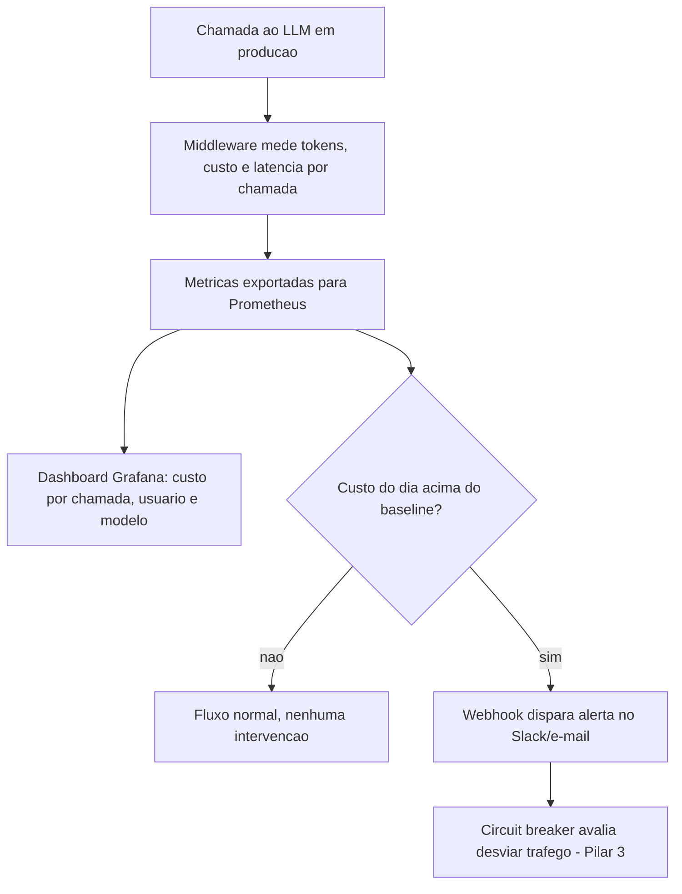
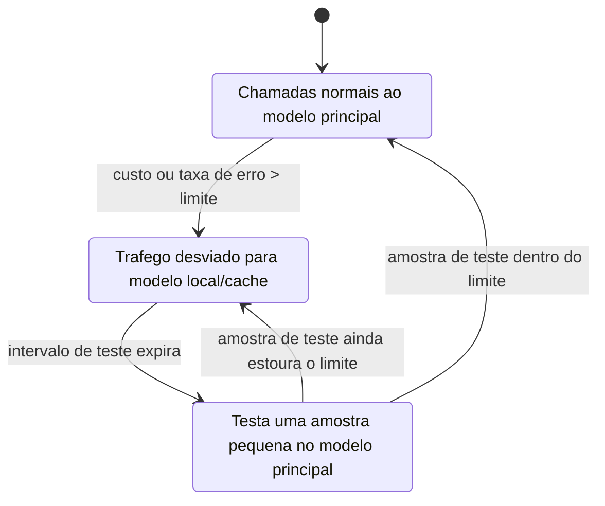
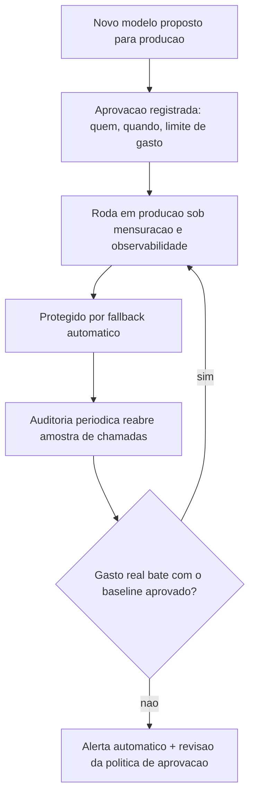

# Capítulo 8: Governança em Produção: 4 Pilares + Checklist

## 1. Introdução

No Capítulo 7, você aprendeu a tratar prompt como programa: o compilador DSPy testa permutações contra um validador e entrega a versão mais enxuta e assertiva, sem que você precise reescrever nada à mão a cada troca de modelo. Some esse resultado às seis ferramentas anteriores — caveman, headroom, lean-ctx, RTK-Memory, LiteLLM, Repomix, ast-grep — e você tem, no papel, um sistema capaz de cortar até 85% do custo com LLMs quando todas operam juntas [1]. No papel.

Você descobre, neste capítulo, uma pergunta que nenhuma das oito ferramentas anteriores responde sozinha: quem garante que elas continuam economizando amanhã, depois que você parar de olhar? Um prompt otimizado pelo DSPy hoje pode ser reescrito por engano na semana que vem. Um cache que hoje reduz a fatura em 60% pode silenciosamente parar de funcionar depois de um deploy, e ninguém percebe até a fatura do mês seguinte. Já lá no Capítulo 1 você viu o limite da auditoria manual: uma planilha revisada à mão resolve até algumas dezenas de chamadas por dia, mas a partir de um certo volume o gargalo deixa de ser o cálculo e passa a ser a coleta. Este capítulo entrega o pipeline automatizado que aquele momento exige.

Como Engenheiro de Custos com IA, seu trabalho neste capítulo muda de "aplicar a ferramenta certa" para "sustentar o sistema inteiro sem precisar vigiar cada peça". Ao dominar isso, você deixa de ser a pessoa que descobre o estouro de orçamento na fatura do fim do mês e passa a ser quem já tinha um alerta disparado três dias antes — e uma resposta automática rodando enquanto você lia o e-mail.

## 2. Explica

Governança em produção não é um pilar isolado: é a integração de quatro camadas que, juntas, transformam economia de tokens de "aconteceu uma vez, num laboratório" em "acontece todo dia, em escala, sem ninguém precisar lembrar de checar". Isso importa porque a adoção de modelos de linguagem em produção deixou de ser experimento de time pequeno para virar infraestrutura crítica de empresas inteiras, com todas as exigências de confiabilidade que isso implica [6]. As duas primeiras camadas resolvem o mesmo problema visto de ângulos diferentes: mensuração responde "quanto custou", observabilidade responde "o que exatamente aconteceu para custar isso". Sem as duas juntas, você tem números sem contexto ou contexto sem números — nenhum dos dois basta para decidir o que fazer a seguir.

Mensuração, na prática, é atribuir custo a cada chamada — não ao total do mês, mas por usuário, por modelo, por rota de código que disparou a requisição. É a diferença entre saber que você gastou US$ 8 mil em agosto e saber que 40% desse valor veio de um único endpoint que reenvia o histórico inteiro a cada chamada. Tratar tokens como um orçamento finito por chamada — não como um recurso ilimitado que só é revisado no fim do mês — é exatamente o que propostas recentes de raciocínio sensível a orçamento de tokens tentam formalizar em modelos de linguagem [7]. Observabilidade complementa isso com logs estruturados e traces distribuídos: cada resposta cara fica ligada a exatamente qual prompt, qual usuário e qual modelo a gerou, permitindo reconstruir a cadeia de decisão depois do fato [2]. Sistemas de recuperação aumentada (RAG) que compõem múltiplas chamadas em pipeline — busca, reordenação, geração — tornam essa rastreabilidade ainda mais crítica, porque o custo de uma única resposta ao usuário final pode estar distribuído em três ou quatro chamadas internas invisíveis sem instrumentação [3].

A terceira camada, fallback, assume que a primeira e a segunda vão, em algum momento, disparar um alerta — e prepara o sistema para reagir sem depender de uma pessoa acordada às 3h da manhã. Fallback inteligente é um circuit breaker: um mecanismo que desvia tráfego para um modelo mais barato, uma resposta cacheada, ou um modelo local, quando o custo ou a taxa de erro do modelo principal ultrapassa um limite pré-definido — a mesma lógica de proteção usada em arquiteturas distribuídas para conter falhas em cascata antes que elas cheguem ao usuário final [4].

A quarta camada, governança propriamente dita, é a única das quatro que não é técnica: é processo e responsabilidade. Quem aprova a troca de um modelo em produção? Qual é o limite de gasto por equipe antes que uma aprovação manual seja obrigatória? Quem audita, periodicamente, se o custo real ainda bate com o esperado? Frotas heterogêneas de modelos — combinando fornecedores diferentes para tarefas diferentes — só permanecem econômicas enquanto existir um processo nomeado decidindo quando adicionar, trocar ou aposentar um modelo da frota; sem isso, a otimização token-a-token vira ruído perto do custo de manter modelos redundantes rodando sem necessidade [5].

Essas quatro camadas não amadurecem ao mesmo tempo dentro de uma equipe — elas avançam em estágios, e reconhecer em qual estágio você está evita o erro de pular etapas. No estágio inicial, existe mensuração, mas ainda manual: alguém exporta a fatura do provedor uma vez por mês e tenta adivinhar, de memória, de onde veio o pico. No estágio intermediário, a observabilidade automatiza a coleta e o dashboard já responde "quem gastou o quê", mas o fallback ainda é uma decisão humana tomada sob pressão — geralmente tarde demais, depois que a fatura já fechou. Só no estágio maduro o fallback vira código que roda sozinho, e a governança deixa de ser "quem lembrar de revisar a planilha" para virar um processo com dono, calendário e critério escrito. Pular do estágio inicial direto para automatizar o fallback, sem antes consolidar a mensuração, é como instalar um disjuntor num quadro de luz sem saber quantos amperes cada circuito da casa realmente consome: o disjuntor até desarma, mas ninguém sabe se desarmou na hora certa — ou se deveria ter desarmado bem antes.

## 3. Ilustra

Pense nos 4 pilares como o sistema financeiro completo de uma empresa, não como quatro ferramentas de TI separadas. Mensuração e observabilidade juntas são o extrato bancário detalhado — não só "saiu dinheiro", mas "saiu para quem, quando, em que transação". Fallback é o limite do cheque especial: quando o saldo em conta corrente (o modelo principal) fica perto do limite, o banco automaticamente redireciona para uma reserva mais barata antes de recusar a operação. Governança é o conselho fiscal: define o teto de gastos, aprova novos fornecedores e audita, de tempos em tempos, se o extrato bate com o orçamento aprovado.

Pense também no aplicativo do banco que te avisa em tempo real a cada compra no cartão — é a versão automática do extrato que mensuração e observabilidade constroem para tokens. Você não espera a fatura fechar no fim do mês para descobrir que algo saiu da curva esperada; a notificação chega enquanto o gasto ainda está acontecendo, a tempo de você agir.



O terceiro pilar, fallback, merece uma segunda lente porque é o mais fácil de implementar errado. A primeira analogia é o disjuntor elétrico da sua casa: quando a corrente ultrapassa o limite seguro, ele desarma sozinho, cortando o circuito antes que o excesso vire incêndio — ninguém precisa estar olhando o quadro de luz no momento exato da sobrecarga. A segunda analogia, mais próxima do vocabulário deste livro, é o próprio limite de cartão de crédito: passar do limite não significa "gastar mais rápido sem perceber" — significa que a próxima transação é recusada ou redirecionada automaticamente, protegendo o fluxo de caixa de quem administra a conta. Um circuit breaker de custo faz exatamente isso com chamadas de LLM: ao ultrapassar o limite, ele "desarma" o caminho caro e redireciona para a reserva (modelo mais barato ou cache) até a situação se normalizar. Servir uma resposta cacheada como rota de reserva, em vez de reprocessar do zero, é a aplicação direta de frameworks de cache semântico pensados para reduzir custo de inferência distribuída sem esperar por uma correspondência exata de prompt [9].



O quarto pilar fecha o ciclo transformando os três anteriores em processo nomeado, não em script solto rodando sem dono:



## 4. Técnica

A entrega prática deste capítulo tem três artefatos, um por pilar: um middleware que mede e registra custo por chamada, um circuit breaker de custo pronto para adaptar, e um checklist de produção com o alerta automático que fecha o ciclo de governança.

### Middleware de mensuração e observabilidade

O trecho abaixo envolve qualquer chamada de API de LLM, calcula o custo estimado com base nos tokens de entrada/saída e grava um registro estruturado (um JSON por linha) pronto para alimentar um dashboard ou um agregador como Prometheus.

```python
# middleware_custo.py
# Envolve uma chamada de LLM e registra custo, usuario e modelo por linha JSON.
import json
import time

PRECO_POR_1K_TOKENS = {
    "modelo-padrao": {"entrada": 0.003, "saida": 0.015},
    "modelo-barato": {"entrada": 0.0008, "saida": 0.004},
}


def calcular_custo(modelo: str, tokens_entrada: int, tokens_saida: int) -> float:
    """Calcula o custo estimado da chamada em dolares, a partir da tabela de precos."""
    preco = PRECO_POR_1K_TOKENS.get(modelo, PRECO_POR_1K_TOKENS["modelo-padrao"])
    custo_entrada = (tokens_entrada / 1000) * preco["entrada"]
    custo_saida = (tokens_saida / 1000) * preco["saida"]
    return round(custo_entrada + custo_saida, 6)


def registrar_chamada(usuario: str, modelo: str, tokens_entrada: int, tokens_saida: int, arquivo="log_custos.jsonl"):
    """Grava um registro estruturado de uma chamada, pronto para agregacao posterior."""
    registro = {
        "timestamp": time.time(),
        "usuario": usuario,
        "modelo": modelo,
        "tokens_entrada": tokens_entrada,
        "tokens_saida": tokens_saida,
        "custo_usd": calcular_custo(modelo, tokens_entrada, tokens_saida),
    }
    with open(arquivo, "a", encoding="utf-8") as f:
        f.write(json.dumps(registro, ensure_ascii=False) + "\n")
    return registro


if __name__ == "__main__":
    exemplo = registrar_chamada("usuario_42", "modelo-padrao", tokens_entrada=1200, tokens_saida=350)
    print("Chamada registrada:", exemplo)
```

Cada linha desse arquivo é uma transação do seu "extrato bancário" de tokens. Agregado por dia, por usuário ou por modelo, ele já responde à pergunta que a mensuração exige — sem depender de esperar a fatura do provedor no fim do mês. Essa separação entre o custo do que já foi processado (cache) e o custo do que é gerado pela primeira vez segue a mesma lógica de arquiteturas que isolam explicitamente as duas categorias para poder medir cada uma de forma independente [8].

Um log linha a linha só vira observabilidade de verdade quando alguém consulta esse extrato antes de a fatura chegar. O trecho a seguir fecha essa lacuna: lê o `log_custos.jsonl` inteiro, filtra pelo dia desejado e devolve o total já agregado por modelo e por usuário — exatamente o resumo que alimenta o painel "custo por usuário e modelo" do diagrama de arquitetura.

```python
# resumo_diario.py
# Agrega o log_custos.jsonl em um resumo diario por modelo e por usuario.
import json
from collections import defaultdict
from datetime import datetime, timezone


def resumir_dia(arquivo="log_custos.jsonl", dia=None):
    """Le o log linha a linha e agrega custo total por modelo e por usuario no dia informado."""
    dia = dia or datetime.now(timezone.utc).strftime("%Y-%m-%d")
    custo_por_modelo = defaultdict(float)
    custo_por_usuario = defaultdict(float)
    total_chamadas = 0

    with open(arquivo, encoding="utf-8") as f:
        for linha in f:
            registro = json.loads(linha)
            data_registro = datetime.fromtimestamp(
                registro["timestamp"], tz=timezone.utc
            ).strftime("%Y-%m-%d")
            if data_registro != dia:
                continue
            custo_por_modelo[registro["modelo"]] += registro["custo_usd"]
            custo_por_usuario[registro["usuario"]] += registro["custo_usd"]
            total_chamadas += 1

    return {
        "dia": dia,
        "total_chamadas": total_chamadas,
        "custo_por_modelo": dict(custo_por_modelo),
        "custo_por_usuario": dict(custo_por_usuario),
    }


if __name__ == "__main__":
    print(resumir_dia())
```

Note que `resumir_dia` não faz nenhuma mágica: é uma soma simples, agrupada por chave. A parte difícil de governança nunca foi o cálculo — é garantir que o log exista, esteja completo e seja consultado com regularidade. Um `resumo_diario.py` que ninguém roda é tão inútil quanto um extrato bancário que ninguém abre.

### Circuit breaker de custo

A classe abaixo implementa a máquina de estados do diagrama anterior: fechado (chamadas normais), aberto (tráfego desviado) e meio-aberto (teste controlado antes de voltar ao normal).

```python
# circuit_breaker_custo.py
# Circuit breaker simples que desvia trafego quando o custo por chamada estoura o limite.
import time


class CircuitBreakerCusto:
    def __init__(self, limite_usd: float, janela_teste_segundos: int = 60):
        self.limite_usd = limite_usd
        self.janela_teste_segundos = janela_teste_segundos
        self.estado = "fechado"
        self.momento_abertura = None

    def registrar_custo(self, custo_usd: float) -> str:
        """Recebe o custo da ultima chamada e decide o proximo estado/rota."""
        if self.estado == "fechado":
            if custo_usd > self.limite_usd:
                self.estado = "aberto"
                self.momento_abertura = time.time()
                return "modelo-fallback"
            return "modelo-principal"

        if self.estado == "aberto":
            if time.time() - self.momento_abertura >= self.janela_teste_segundos:
                self.estado = "meio-aberto"
                return "modelo-principal"  # testa uma amostra
            return "modelo-fallback"

        if self.estado == "meio-aberto":
            if custo_usd > self.limite_usd:
                self.estado = "aberto"
                self.momento_abertura = time.time()
                return "modelo-fallback"
            self.estado = "fechado"
            return "modelo-principal"


if __name__ == "__main__":
    breaker = CircuitBreakerCusto(limite_usd=0.05)
    print(breaker.registrar_custo(0.02))   # modelo-principal
    print(breaker.registrar_custo(0.09))   # modelo-fallback (abre)
    print(breaker.registrar_custo(0.03))   # ainda modelo-fallback, dentro da janela
```

Repare que este circuit breaker decide só com base em custo. É exatamente o limite que a seção Aplica vai explorar: decidir com base em custo, sem acoplar uma métrica de qualidade mínima, resolve a fatura e cria um problema novo.

### Fechando o buraco: piso de qualidade acoplado ao fallback

O gateway de cache semântico documentado no dossiê desta obra só serve uma resposta cacheada quando a similaridade de cosseno entre o prompt novo e o prompt já respondido ultrapassa 0,95 — abaixo desse limiar, ele prefere pagar de novo a arriscar devolver uma resposta que não corresponde de verdade à pergunta [1]. É a mesma disciplina que falta ao `CircuitBreakerCusto` da forma como ele foi escrito: ele decide a rota só pelo custo da última chamada, sem checar se a rota mais barata ainda entrega uma resposta utilizável. A função abaixo envolve o método original e fecha exatamente essa lacuna, sem precisar reescrever a classe inteira.

```python
# circuit_breaker_qualidade.py
# Envolve o CircuitBreakerCusto com um piso de qualidade antes de aceitar o fallback.
from circuit_breaker_custo import CircuitBreakerCusto


def registrar_custo_com_qualidade(breaker: CircuitBreakerCusto, custo_usd: float, resposta_valida: bool) -> str:
    """So aceita a rota de fallback se a amostra tambem passar num criterio minimo de qualidade."""
    rota = breaker.registrar_custo(custo_usd)
    if rota == "modelo-fallback" and not resposta_valida:
        # custo baixo nao compensa se a resposta nao serve: forca nova tentativa no principal
        breaker.estado = "aberto"
        return "modelo-principal-forcado"
    return rota
```

`resposta_valida` pode ser algo tão simples quanto validar se um JSON esperado tem os campos obrigatórios, ou tão elaborado quanto um segundo modelo mais barato julgando a resposta do primeiro. O que importa é que a decisão de desviar tráfego nunca fique sozinha com o número do custo — ela precisa de um segundo voto, mesmo que rudimentar, antes de ser considerada segura para o tráfego inteiro.

### Checklist de produção e alerta automático

```yaml
# checklist-governanca.yaml
# Checklist minimo de producao: uma linha por decisao que precisa de dono.
governanca_producao:
  aprovacao_de_modelo:
    exigida_acima_de_usd_mes: 500
    aprovador: "lider_tecnico_da_equipe"
  limite_de_gasto_por_projeto:
    valor_usd_mes: 2000
    acao_ao_ultrapassar: "alerta + revisao obrigatoria"
  auditoria_periodica:
    cadencia: "semanal"
    escopo: "reabrir 5% das chamadas e conferir custo real vs. estimado"
  canais_de_alerta:
    - "slack:#custos-llm"
    - "email:financeiro@empresa.com"
```

```python
# alerta_custo.py
# Dispara um alerta (webhook) quando o custo diario acumulado foge do baseline.
import json
import urllib.request

WEBHOOK_SLACK = "https://hooks.slack.com/services/EXEMPLO/SUBSTITUIR/URL"


def disparar_alerta(custo_diario: float, baseline: float, canal=WEBHOOK_SLACK):
    """Envia um alerta simples quando o custo do dia ultrapassa o baseline configurado."""
    if custo_diario <= baseline:
        return "dentro_do_baseline"
    mensagem = {
        "text": f"[ALERTA] Custo diario de LLM em US$ {custo_diario:.2f}, "
                f"acima do baseline de US$ {baseline:.2f}."
    }
    requisicao = urllib.request.Request(
        canal, data=json.dumps(mensagem).encode("utf-8"),
        headers={"Content-Type": "application/json"},
    )
    urllib.request.urlopen(requisicao, timeout=5)
    return "alerta_disparado"
```

## 5. Aplica

Você está numa sexta-feira à tarde, revisando a fatura da semana com o time. O custo com o modelo principal subiu 30% desde a segunda-feira, e alguém sugere a correção óbvia: trocar temporariamente para um modelo mais barato até segunda, sem tocar em código de produto. A decisão é aprovada no chat da equipe em cinco minutos, o deploy sai em dez, e todo mundo comemora a fatura que não vai estourar.

Na segunda-feira seguinte, o time de suporte reporta um aumento de reclamações: respostas incompletas, um relatório que antes vinha estruturado agora sai em texto corrido, um cálculo que antes batia agora erra por uma casa decimal. Ninguém associa isso à troca de modelo de sexta-feira, porque a decisão nunca foi registrada em lugar nenhum — foi uma mensagem de chat, não uma linha do checklist de produção.

O diagnóstico é o mesmo que o circuit breaker da seção Técnica deixou em aberto de propósito: a troca de modelo foi decidida só pelo custo, sem nenhuma métrica de qualidade acoplada à decisão, e sem passar pela aprovação registrada que o Pilar 4 exige. Você resolveu o número da fatura e criou uma dívida de qualidade invisível — pior ainda, sem nenhum dono formalmente responsável por ela.

A correção não é abandonar o fallback automático — é acoplar um piso de qualidade a ele, exatamente como a função `registrar_custo_com_qualidade` da seção Técnica faz. Antes de qualquer troca de modelo, mesmo automática, o circuit breaker precisa validar uma amostra de respostas contra um critério mínimo (formato esperado, presença de campos obrigatórios, ou mesmo um validador simples de estrutura) antes de considerar a rota de fallback "segura" para o tráfego inteiro. E toda troca — automática ou manual — precisa aparecer no checklist de governança, com quem aprovou e por quanto tempo, para que o próximo aumento de reclamações não vire um mistério de segunda-feira.

Você descobre o problema oposto três semanas depois: o webhook do `alerta_custo.py` dispara todo dia, por volta das 14h, avisando que o custo diário passou do baseline. No começo, o time larga o que está fazendo e investiga. Na segunda semana, alguém verifica rápido, não acha nada de anormal e volta ao trabalho. Na terceira semana, ninguém mais abre o canal `#custos-llm` quando o alerta chega — virou ruído de fundo, como aquele alarme de carro que dispara toda madrugada e o vizinho já nem escuta mais.

O diagnóstico, desta vez, não é falta de alerta — é excesso de alerta sem ajuste. O baseline foi calculado uma única vez, no dia em que a equipe tinha cinco pessoas. Três meses depois, com doze pessoas usando o mesmo modelo em produção, o volume normal de chamadas mais que dobrou, e o "baseline" virou uma constante desatualizada disparando todo santo dia. O alerta continua tecnicamente correto — o custo do dia realmente está acima daquele número antigo — mas deixou de carregar informação útil, e é exatamente esse tipo de alerta que ensina um time a ignorar o próximo aviso, inclusive o que vai importar de verdade.

A correção mora na camada de auditoria periódica do checklist de governança, não em desligar o alerta: o baseline precisa ser recalculado com uma cadência definida — por exemplo, como média móvel dos últimos 14 dias, revista toda auditoria semanal — em vez de ficar congelado no valor do dia em que alguém configurou o webhook pela primeira vez. Um alerta que se ajusta ao crescimento normal da equipe continua sensível ao que de fato é anormal; um alerta parado no tempo vira apenas fundo de tela.

Erros comuns que reforçam esse padrão:

- Tratar decisão de custo e decisão de qualidade como problemas separados, quando elas compartilham o mesmo gatilho.
- Aprovar mudança de modelo em produção por mensagem de chat, sem registro formal de quem decidiu e com qual limite.
- Configurar alertas de custo sem configurar auditoria periódica — o alerta avisa que algo estourou, mas só a auditoria confirma se a causa foi resolvida de verdade.
- Deixar o baseline do alerta congelado no valor do dia da configuração, até ele parar de significar qualquer coisa.

### Exercício
- [ ] Implemente o `middleware_custo.py` sobre uma chamada real do seu projeto e rode por um dia inteiro
- [ ] Rode o `resumo_diario.py` sobre o log gerado e confira se o total agregado bate com o que você esperava gastar naquele dia
- [ ] Ajuste o `limite_usd` do `circuit_breaker_custo.py` para o teto que sua equipe consideraria aceitável por chamada
- [ ] Preencha o `checklist-governanca.yaml` com os nomes reais de aprovador, limite de gasto e canal de alerta da sua equipe
- [ ] Defina, por escrito, qual métrica de qualidade mínima seu circuit breaker vai checar antes de aceitar uma rota de fallback como segura
- [ ] Defina a cadência de recálculo do baseline de alerta (ex.: média móvel de 14 dias) para que o webhook não vire ruído ignorado

## 6. Conclusão

Os 4 pilares não são uma nova ferramenta para adicionar à lista das oito primeiras — são o seguro que garante que as oito continuam funcionando depois que o entusiasmo inicial passa. Mensuração e observabilidade dizem quanto custou e o que aconteceu; fallback garante que o sistema se protege sozinho antes de qualquer pessoa perceber o problema; governança garante que existe um dono e um processo por trás de cada decisão que afeta o fluxo de caixa da equipe com IA.

Volte, por um instante, ao início deste livro. No Capítulo 1, o problema era uma planilha revisada à mão, incapaz de acompanhar o volume real de chamadas. Nos capítulos seguintes, você foi empilhando resposta técnica sobre resposta técnica — caveman e headroom cortando tokens na entrada, lean-ctx e RTK-Memory evitando reenvio de contexto redundante, LiteLLM e o cache semântico reaproveitando o que já foi pago, ast-grep substituindo refatoração cara por transformação estrutural gratuita, DSPy compilando o prompt em vez de reescrevê-lo manualmente a cada troca de modelo. Cada uma dessas oito ferramentas resolve um ponto específico da fatura. Nenhuma delas, sozinha, garante que a economia obtida hoje ainda vai existir daqui a três meses, depois de um deploy, uma troca de equipe ou um crescimento de dez para cinquenta usuários.

É esse o papel que os 4 pilares deste capítulo final cumprem: não uma nona ferramenta, mas a camada que impede as outras oito de se degradarem em silêncio. Você chegou ao fim do arco deste livro sabendo que economia de tokens não é uma coleção de oito truques isolados — é um sistema com pontas de compressão, cache, empacotamento, refatoração e otimização de prompt, sustentado por uma estrutura de governança que audita, alerta e se corrige sozinha antes que a fatura vire surpresa. O Engenheiro de Custos com IA que sai deste capítulo não é quem aplicou mais ferramentas, mas quem construiu o processo que faz essas ferramentas continuarem economizando sem exigir vigilância constante — o diferencial que separa quem implementou uma otimização pontual de quem sustenta, ano após ano, um sistema de custo com IA que se paga sozinho.

## 7. Referências Bibliográficas

[1] ECONOMIA EXTREMA DE TOKENS: contexto e skills de eficiência. Compêndio técnico. Curadoria de Elite — Open Source Initiative (OSI), Linux Foundation, CNCF Landscape, 2026. Documento técnico interno (dossiê de pesquisa da obra).

[2] ZHAO, Wayne Xin et al. *A Survey of Large Language Models*. In: Frontiers of Computer Science. 2026. Disponível em: https://doi.org/10.1007/s11704-026-60308-3. Acesso em: 25 ago. 2026.

[3] FAN, Wenqi et al. *A Survey on RAG Meeting LLMs: Towards Retrieval-Augmented Large Language Models*. 2024. Disponível em: https://doi.org/10.1145/3637528.3671470. Acesso em: 25 ago. 2026.

[4] JIN, Haoying; FENG, Haoyang. *Llm-Cache: an Efficient Context-Aware Semantic Caching Framework for Distributed Llm Inference Services*. In: 2026 IEEE 46th International Conference on Distributed Computing Systems Workshops (ICDCSW). 2026. Disponível em: https://doi.org/10.1109/icdcsw72724.2026.00031. Acesso em: 25 ago. 2026.

[5] EDUSA, Samuel. *ConsultChain: Progressive Context Distillation Across Heterogeneous LLM Fleets for Token-Optimal Inference*. 2026. Disponível em: https://doi.org/10.21203/rs.3.rs-9368244/v1. Acesso em: 25 ago. 2026.

[6] NAVEED, Humza et al. *A Comprehensive Overview of Large Language Models*. In: arXiv (Cornell University). 2023. Disponível em: http://arxiv.org/abs/2307.06435. Acesso em: 25 ago. 2026.

[7] HAN, Tingxu et al. *Token-Budget-Aware LLM Reasoning*. 2025. Disponível em: https://doi.org/10.18653/v1/2025.findings-acl.1274. Acesso em: 25 ago. 2026.

[8] AUTOR. *Prompt Context Caching Architecture for Cost Reduction in Large Language Model Systems*. In: International Journal of Intelligent Systems and Applications in Engineering. 2026. Disponível em: https://doi.org/10.17762/ijisae.v14i1s.8385. Acesso em: 25 ago. 2026.

[9] MOHANDOSS, Ramaswami. *Context-based Semantic Caching for LLM Applications*. In: 2024 IEEE Conference on Artificial Intelligence (CAI). 2024. Disponível em: https://doi.org/10.1109/cai59869.2024.00075. Acesso em: 25 ago. 2026.
