# Capítulo 1: A Crise de Custos com LLMs: De $100 para $10k Sem Aviso

## 1. Introdução

No primeiro mês, tudo parece controlado. Um protótipo com IA generativa entra em produção com um cartão de crédito de teste, um punhado de usuários internos e uma fatura de $100 que ninguém sequer confere com atenção. É assim que quase todo projeto com LLMs começa: pequeno, barato, "só um experimento" — o mesmo padrão de baixo overhead percebido antes de qualquer escala real que o mapeamento de custos de contexto desta obra registra na origem [5]. Ninguém desliga um alarme que nunca tocou.

Este livro parte de um compromisso simples: você vai deixar de tratar tokens como uma abstração técnica distante e passar a enxergá-los como o que realmente são — dinheiro em movimento, saindo da sua conta a cada chamada de API. Ao longo deste capítulo, você começa a se comportar como um Engenheiro de Custos com IA: alguém que não espera a fatura chegar para descobrir o tamanho do problema. Esse é o primeiro instinto que separa quem apenas consome modelos de linguagem de quem gerencia o consumo com governança.

Esse padrão se repete com uma regularidade quase estatística. Levantamentos que documentam a evolução dos grandes modelos de linguagem mostram uma adoção que saiu de dezenas de times pioneiros para milhares de aplicações em produção em poucos anos [2] — e junto com a adoção vem a mesma cegueira inicial sobre custo. O motivo não é falta de cuidado do time: é estrutural. O preço de uma chamada de API não aparece no momento em que a decisão de arquitetura é tomada. Ele aparece 30 dias depois, consolidado, sem contexto sobre qual parte do sistema o gerou. Você, como Engenheiro de Custos com IA, vai aprender a inverter essa ordem ao longo deste livro: colocar o preço na frente da decisão, não atrás dela.

## 2. Explica

Comece pela definição operacional, porque ela evita um erro comum de quem começa agora: token não é sinônimo de palavra. Um token é o pedaço de texto que o modelo processa como unidade — em português, isso costuma variar entre um caractere isolado e uma palavra inteira, passando por sílabas e prefixos comuns, dependendo de como o tokenizador do provedor fatia o texto, um mecanismo que a literatura de arquitetura de LLMs documenta em detalhe [1]. Uma frase de 10 palavras raramente vira exatamente 10 tokens: normalmente vira entre 12 e 18, porque pontuação, espaços e palavras compostas contam separadamente. Essa é a primeira armadilha de quem estima custo "no olho": contar palavras subestima sistematicamente o número de tokens, e subestimar tokens é subestimar a fatura.

Para enxergar essa mecânica de ponta a ponta, vale desenhar o caminho que uma única pergunta percorre até virar uma linha na sua fatura. O prompt do usuário — pergunta, mais qualquer histórico e instrução de sistema anexada — vira tokens de entrada; o motor do modelo processa esses tokens e gera tokens de saída; um medidor de consumo soma os dois tipos, multiplica pelo preço por milhão de cada categoria e credita o total na fatura mensal. Nenhuma etapa desse caminho é opcional, e nenhuma é gratuita.

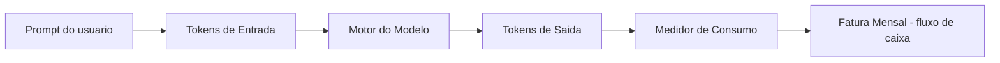

Todo provedor comercial de LLM cobra por dois tipos de token: os de entrada (o que você envia — prompt, histórico, contexto) e os de saída (o que o modelo gera como resposta). Eles não custam o mesmo. Na maioria dos provedores, o token de saída é sensivelmente mais caro que o de entrada, porque exige computação ativa de geração, enquanto o de entrada é "apenas" processado em paralelo. Isso significa que uma resposta longa custa mais que uma pergunta longa — um detalhe que passa despercebido até a fatura mostrar o contrário do que a intuição sugeria.

O motivo pelo qual esse detalhe importa em escala é simples: a adoção de LLMs em produção deixou de ser nicho. A literatura técnica já trata modelos de linguagem de larga escala como infraestrutura corrente de software, não mais como curiosidade de laboratório [1]. Quando uma tecnologia vira infraestrutura, o custo de operá-la deixa de ser marginal e passa a competir por linha no orçamento com banco de dados, hospedagem e equipe. Pesquisas que mapeiam a evolução desses modelos mostram exatamente essa transição: de experimentos acadêmicos para peças centrais de arquiteturas de produto [2].

Some a isso um segundo fator, menos óbvio: o preço por milhão de tokens parece baixo quando olhado isoladamente — frações de centavo por chamada. É aqui que mora a ilusão do "modelo barato": o preço unitário é pequeno, mas ele é multiplicado por volume, frequência e, principalmente, por quanto contexto você reenvia a cada interação. Um preço baixo multiplicado por um volume que cresce todo mês não é mais um preço baixo — é uma curva.

Nem todo contexto reenviado tem o mesmo valor. Arquiteturas que buscam apenas o trecho relevante de um documento no momento da pergunta — em vez de reenviar a base inteira a cada chamada — existem justamente para separar "contexto que ajuda a resposta" de "contexto que só ajuda a fatura" [3]. Guarde essa distinção: ela é a ponte entre o problema deste capítulo e as ferramentas de compressão dos próximos.

Essa cobrança direta por token — em vez de uma taxa fixa por usuário — também é uma faca de dois gumes. Ferramentas de produtividade com IA vendidas no modelo SaaS tradicional costumam cobrar entre 10 e 50 dólares por usuário ao mês, um valor previsível e fácil de orçar [5]. Já uma aplicação construída sobre a API pura de um provedor de LLM paga por token consumido, sem teto fixo: mais barata em baixo volume, e capaz de ultrapassar qualquer plano de assinatura assim que o uso escala sem controle. Saber qual dos dois modelos de cobrança está por trás da sua aplicação é o primeiro passo para localizar onde mora o risco orçamentário.

## 3. Ilustra

Pense na curva de custo como uma bola de neve descendo uma ladeira: no primeiro metro, ela é pequena e lenta — é o seu Mês 1, com poucos usuários e prompts curtos. A cada volta, porém, ela recolhe mais neve (mais contexto acumulado) e ganha mais velocidade (mais chamadas por dia). No Mês 2, a bola já não é mais a mesma: ela carrega o histórico das interações anteriores porque a aplicação reenvia a conversa inteira a cada novo turno.

Essa é a mecânica geral. Mas há um ponto mais sutil, e é ele que explica por que o crescimento é exponencial e não apenas "um pouco maior a cada mês": pense em juros compostos. Quando o contexto de uma chamada inclui o contexto da chamada anterior — que já incluía a anterior a ela —, cada nova requisição não paga só pelo conteúdo novo. Ela paga "juros" sobre todo o histórico acumulado. Assim como uma dívida com juros compostos não cresce em linha reta, o custo de um sistema que reenvia contexto cumulativo também não cresce em linha reta — ele acelera.

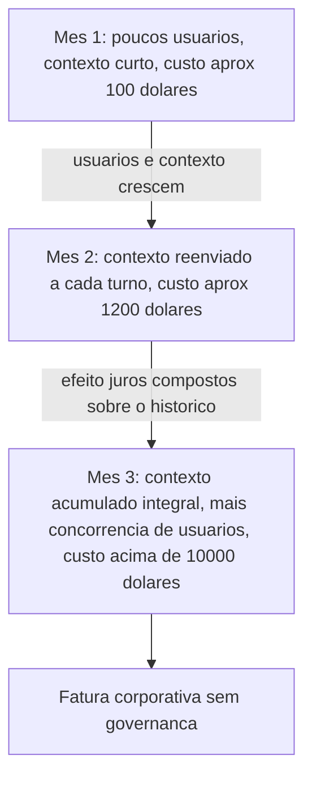

**Cena:** para tornar esse acúmulo palpável, vale um exemplo numérico simples. Imagine que a primeira mensagem de uma conversa carrega 200 tokens de contexto. Se a aplicação reenvia o histórico inteiro a cada turno, a segunda mensagem já soma os 200 tokens anteriores mais os novos; a décima mensagem pode carregar dez vezes esse volume, mesmo que a pergunta do usuário continue igualmente curta. O crescimento não vem da pergunta — vem do que é reenviado ao redor dela. Esse é o detalhe que a maioria dos times enxerga tarde demais: o vilão do orçamento raramente é o modelo escolhido, é a política de reenvio de contexto.

Como Engenheiro de Custos com IA, seu trabalho nesta fase não é ainda otimizar — é reconhecer o padrão. Os Capítulos 2 a 7 vão te dar as ferramentas de compressão e cache para cortar essa curva. Antes disso, você precisa conseguir apontar o dedo para o estágio exato em que ela sai de controle.

## 4. Técnica

O primeiro instrumento de um Engenheiro de Custos com IA não é uma ferramenta sofisticada — é uma calculadora. Abaixo está `calculadora_projecao_custos.py`, um script único, comentado passo a passo, que faz três coisas: calcula o custo de uma chamada isolada, projeta o custo ao longo de 3 meses considerando crescimento de usuários e de contexto, e audita um histórico real de chamadas a partir de um CSV.

Pesquisas sobre arquiteturas de cache de contexto mostram que boa parte da fatura de produção vem exatamente do contexto redundante reenviado entre chamadas, não da geração em si [9]. É esse componente que a função de projeção abaixo isola para você enxergar.

```python
"""
calculadora_projecao_custos.py
Ferramenta de bolso do Engenheiro de Custos com IA.

Uso:
  python calculadora_projecao_custos.py chamada
  python calculadora_projecao_custos.py projetar
  python calculadora_projecao_custos.py auditar caminho/para/log.csv
"""

import csv
import sys

# Preco de referencia por 1 milhao de tokens (valores ilustrativos, em dolares).
# Troque pelos precos reais do seu provedor antes de usar em producao.
PRECO_ENTRADA_POR_MILHAO = 3.00
PRECO_SAIDA_POR_MILHAO = 15.00


def custo_de_uma_chamada(tokens_entrada: int, tokens_saida: int) -> float:
    """Calcula o custo de uma unica chamada de API, em dolares.

    Cada tipo de token tem um preco diferente por milhao [8]: tokens de
    saida custam mais porque exigem geracao ativa, nao so leitura.
    """
    custo_entrada = (tokens_entrada / 1_000_000) * PRECO_ENTRADA_POR_MILHAO
    custo_saida = (tokens_saida / 1_000_000) * PRECO_SAIDA_POR_MILHAO
    return round(custo_entrada + custo_saida, 6)


def projetar_tres_meses(
    usuarios_mes1: int,
    chamadas_por_usuario_dia: int,
    tokens_medios_por_chamada: int,
    taxa_crescimento_contexto: float,
) -> list:
    """Projeta o custo mensal para 3 meses.

    A cada mes, o numero de usuarios dobra (cenario tipico de adocao
    inicial) e o contexto medio por chamada cresce pela taxa informada,
    simulando o efeito de "juros compostos" do historico reenviado.
    """
    resultados = []
    usuarios = usuarios_mes1
    tokens_por_chamada = tokens_medios_por_chamada

    for mes in range(1, 4):
        chamadas_no_mes = usuarios * chamadas_por_usuario_dia * 30
        # Metade dos tokens da chamada e entrada, metade e saida (aproximacao didatica).
        tokens_entrada = int(tokens_por_chamada * 0.5)
        tokens_saida = int(tokens_por_chamada * 0.5)
        custo_unitario = custo_de_uma_chamada(tokens_entrada, tokens_saida)
        custo_do_mes = round(custo_unitario * chamadas_no_mes, 2)

        resultados.append({
            "mes": mes,
            "usuarios": usuarios,
            "tokens_por_chamada": tokens_por_chamada,
            "custo_mensal_dolares": custo_do_mes,
        })

        # Prepara o proximo mes: usuarios crescem, contexto acumula.
        usuarios *= 2
        tokens_por_chamada = int(tokens_por_chamada * (1 + taxa_crescimento_contexto))

    return resultados


def auditar_csv(caminho_csv: str) -> dict:
    """Le um CSV de chamadas (data,tokens_entrada,tokens_saida,modelo)
    e devolve um resumo de custo por dia e por modelo.

    Esta e a rotina de auditoria: medir antes de otimizar.
    """
    resumo_por_dia = {}
    resumo_por_modelo = {}

    with open(caminho_csv, newline="", encoding="utf-8") as arquivo:
        leitor = csv.DictReader(arquivo)
        for linha in leitor:
            data = linha["data"]
            modelo = linha["modelo"]
            tokens_entrada = int(linha["tokens_entrada"])
            tokens_saida = int(linha["tokens_saida"])
            custo = custo_de_uma_chamada(tokens_entrada, tokens_saida)

            resumo_por_dia[data] = round(resumo_por_dia.get(data, 0.0) + custo, 4)
            resumo_por_modelo[modelo] = round(resumo_por_modelo.get(modelo, 0.0) + custo, 4)

    return {"por_dia": resumo_por_dia, "por_modelo": resumo_por_modelo}


def main():
    if len(sys.argv) < 2:
        print("Uso: python calculadora_projecao_custos.py [chamada|projetar|auditar <csv>]")
        return

    comando = sys.argv[1]

    if comando == "chamada":
        custo = custo_de_uma_chamada(tokens_entrada=1500, tokens_saida=500)
        print(f"Custo estimado da chamada: ${custo}")

    elif comando == "projetar":
        projecao = projetar_tres_meses(
            usuarios_mes1=50,
            chamadas_por_usuario_dia=10,
            tokens_medios_por_chamada=2000,
            taxa_crescimento_contexto=0.6,
        )
        for linha in projecao:
            print(
                f"Mes {linha['mes']}: {linha['usuarios']} usuarios, "
                f"{linha['tokens_por_chamada']} tokens/chamada, "
                f"custo ${linha['custo_mensal_dolares']}"
            )

    elif comando == "auditar" and len(sys.argv) == 3:
        resumo = auditar_csv(sys.argv[2])
        print("Custo por dia:", resumo["por_dia"])
        print("Custo por modelo:", resumo["por_modelo"])

    else:
        print("Comando invalido. Use chamada, projetar ou auditar <csv>.")


if __name__ == "__main__":
    main()
```

Rodando o modo `projetar` com os parâmetros didáticos acima, a saída se parece com isto:

```console
$ python calculadora_projecao_custos.py projetar
Mes 1: 50 usuarios, 2000 tokens/chamada, custo $135.0
Mes 2: 100 usuarios, 3200 tokens/chamada, custo $432.0
Mes 3: 200 usuarios, 5120 tokens/chamada, custo $1382.4
```

Repare que o custo não dobra junto com os usuários — ele mais que triplica, porque o contexto por chamada também está crescendo. Esse é o mecanismo de KV cache e contexto longo que a literatura de otimização de inferência trata como um dos principais vetores de custo em produção [6]. E é exatamente esse vetor que técnicas de compressão de prompt, como as descritas em trabalhos sobre compactação de instruções para inferência acelerada, atacam diretamente [8] — assunto que retomamos a partir do próximo capítulo.

Uma extensão simples, mas de alto valor prático, é transformar essa auditoria em alerta. A função abaixo pode ser adicionada ao mesmo módulo: ela recebe o resumo diário já calculado por `auditar_csv` e sinaliza quando o custo de um dia ultrapassa um limite de orçamento definido pelo Engenheiro de Custos com IA.

```python
def alertar_limite_orcamento(resumo_por_dia: dict, limite_diario_dolares: float) -> list:
    """Compara o custo de cada dia contra um limite de orcamento.

    Retorna a lista de dias que estouraram o limite, ordenada do maior
    excesso para o menor. Esta e a diferenca entre auditar depois do
    fato e ser avisado no mesmo dia em que o custo sai da faixa esperada.
    """
    dias_fora_do_orcamento = []
    for data, custo_do_dia in resumo_por_dia.items():
        if custo_do_dia > limite_diario_dolares:
            dias_fora_do_orcamento.append((data, custo_do_dia))
    return sorted(dias_fora_do_orcamento, key=lambda item: item[1], reverse=True)
```

Em termos práticos, rodar `alertar_limite_orcamento` sobre o resultado de `auditar_csv`, com um limite de, por exemplo, $50 por dia, transforma a auditoria de um exercício manual mensal em um hábito de checagem diária — o mesmo princípio de governança contínua que a seção Aplica detalha a seguir.

O script também pode responder à pergunta que abre a seção Explica deste capítulo: a partir de que volume mensal de uso o pagamento por token deixa de ser mais barato que uma assinatura fixa por usuário? A função abaixo calcula esse ponto de equilíbrio.

```python
def ponto_de_equilibrio_saas_vs_api(
    custo_assinatura_mensal_por_usuario: float,
    numero_de_usuarios: int,
    custo_medio_por_chamada: float,
) -> int:
    """Calcula quantas chamadas por mes, no total, igualam o custo
    de uma assinatura SaaS de preco fixo por usuario.

    Acima desse numero de chamadas, pagar por token (modelo de API)
    fica mais caro que a assinatura; abaixo, fica mais barato.
    """
    if custo_medio_por_chamada <= 0:
        raise ValueError("custo_medio_por_chamada deve ser maior que zero")
    custo_total_assinatura = custo_assinatura_mensal_por_usuario * numero_de_usuarios
    return int(custo_total_assinatura / custo_medio_por_chamada)
```

**Situação:** com os preços de referência deste capítulo, uma assinatura de $20 por usuário/mês para 50 usuários custaria $1.000 fixos; ao custo médio de $0,012 por chamada (a mesma chamada de 1.500 tokens de entrada e 500 de saída calculada no início desta seção), o ponto de equilíbrio fica em torno de 83 mil chamadas mensais — cerca de 55 chamadas por usuário por dia. Abaixo disso, pagar por token tende a ser mais barato; acima, a assinatura fixa vence. Essa é exatamente a conta que o Engenheiro de Custos com IA faz antes de escolher a arquitetura de cobrança, não depois.

Há ainda uma camada intermediária entre "reenviar tudo" e "comprimir tudo": guardar em cache o resultado de contextos já processados, para não pagar duas vezes pelo mesmo trecho de histórico. Esse é o princípio por trás de camadas de cache semântico que reconhecem contexto repetido entre chamadas antes mesmo de ele chegar ao modelo [4]. O motivo pelo qual isso importa para o seu bolso é físico, não só algorítmico: modelos que precisam manter contexto crescente em memória durante a geração enfrentam limites reais de hardware, e contornar esse limite tem custo — seja em latência, seja em dólares por chamada [7].

## 5. Aplica

Você acabou de assumir a manutenção de um assistente interno que responde dúvidas de suporte usando um LLM. Para "garantir contexto", a aplicação foi configurada para reenviar o histórico inteiro da conversa a cada nova pergunta do usuário — parecia a decisão mais segura, a que menos arriscava perder informação relevante.

Três semanas depois, a fatura mensal triplicou sem que o número de usuários tivesse dobrado. Você abre o painel do provedor e não encontra nada de anormal: nenhuma chamada isolada é cara, nenhum erro de código, nenhum ataque óbvio. O erro está espalhado, não concentrado — cada conversa mais longa reenvia um histórico cada vez maior, e ninguém tinha visibilidade agregada disso.

O diagnóstico é o mesmo do "efeito juros compostos" da seção Ilustra: cada nova chamada estava pagando pelo histórico acumulado inteiro, não apenas pela pergunta nova. A correção prática, antes de qualquer técnica de compressão (que você vai aprender nos próximos capítulos), é auditar: rodar `calculadora_projecao_custos.py auditar` sobre o log de chamadas e descobrir em quais dias e com qual modelo o custo por conversa está crescendo mais rápido que o número de conversas.

Auditorias desse tipo revelam um padrão recorrente: sem nenhuma skill de compressão aplicada, o overhead de contexto redundante — informação reenviada que não agrega valor à resposta atual — pode representar de 80% a 100% do custo mensal em puro ruído; quando skills de eficiência entram em cena, essa faixa cai para 15% a 30% do custo mensal [5]. É a diferença entre reagir à fatura e antecipá-la.

**Cena:** compare esse cenário com o de outro time, que herdou o mesmo tipo de assistente mas manteve o hábito de rodar `calculadora_projecao_custos.py auditar` toda sexta-feira sobre o log da semana. Na terceira semana, o resumo por dia mostrou um crescimento de 40% no custo médio por conversa — sem que o número de conversas tivesse mudado. Em vez de esperar a fatura consolidar o problema, o time cruzou a data do salto de custo com o changelog da aplicação e achou a causa: uma atualização recente havia dobrado o tamanho das instruções fixas de sistema reenviadas em toda chamada. A correção — comprimir esse prompt de sistema, técnica que você vai aprofundar no Capítulo 3 — aconteceu antes que o custo mensal saísse da faixa orçada. A diferença entre os dois times não foi o modelo escolhido, nem o volume de usuários: foi o hábito de auditoria.

Vale registrar onde essa auditoria manual para de escalar: uma planilha ou CSV revisado à mão funciona bem até algumas dezenas de chamadas por dia; a partir de um volume maior de tráfego, o gargalo deixa de ser o cálculo e passa a ser a coleta — nesse ponto, a auditoria pontual precisa virar pipeline automatizado de logging e alertas, tema que retomamos no Capítulo 8 (Governança).

### Exercício
- [ ] Exporte (ou simule) um CSV com as colunas `data,tokens_entrada,tokens_saida,modelo` das últimas duas semanas do seu projeto
- [ ] Rode `calculadora_projecao_custos.py auditar` sobre esse CSV e identifique o dia de maior custo
- [ ] Calcule quantos tokens de entrada, em média, são histórico reenviado versus pergunta nova
- [ ] Rode o modo `projetar` com os parâmetros reais do seu projeto e compare com a fatura real dos últimos 2 meses
- [ ] Escreva, em uma frase, o estágio da curva de escalada em que seu projeto está hoje (Mês 1, 2 ou 3 da seção Ilustra)
- [ ] Rode `ponto_de_equilibrio_saas_vs_api` com o preço de uma assinatura SaaS equivalente ao seu caso de uso e descubra se pagar por token ainda é a opção mais barata no seu volume atual

## 6. Conclusão

Três ideias sustentam este capítulo: tokens de entrada e saída são cobrados de forma diferente e viram dólares reais a cada chamada; o custo de um projeto com LLM não cresce de forma linear quando o contexto reenviado se acumula — ele acelera, como juros compostos; e a única defesa antes de qualquer otimização é a visibilidade, não a economia por si só. "Barato" não é uma propriedade do preço por token — é uma propriedade do sistema inteiro, e um sistema sem auditoria não tem como ser barato em escala.

Guarde esse hábito como o primeiro traço identitário do Engenheiro de Custos com IA: você não é a pessoa que aceita a fatura como fato consumado, é a pessoa que já sabia, antes de ela chegar, aproximadamente quanto ela custaria — e por quê. Esse é o diferencial que separa quem apenas opera um sistema com IA de quem o governa.

Você agora sabe reconhecer a curva antes que ela vire manchete no seu próprio orçamento. No Capítulo 2, você vai conhecer as duas primeiras ferramentas táticas — caveman e headroom — que atacam diretamente o contexto redundante que este capítulo te ensinou a enxergar, aplicando na prática o princípio de orçar tokens de raciocínio como um recurso finito, e não infinito [10].

## 7. Referências Bibliográficas

[1] NAVEED, Humza et al. *A Comprehensive Overview of Large Language Models*. arXiv, 2023. Disponível em: http://arxiv.org/abs/2307.06435. Acesso em: 25 ago. 2026.

[2] ZHAO, Wayne Xin et al. *A Survey of Large Language Models*. Frontiers of Computer Science, 2026. Disponível em: https://doi.org/10.1007/s11704-026-60308-3. Acesso em: 25 ago. 2026.

[3] FAN, Wenqi et al. *A Survey on RAG Meeting LLMs: Towards Retrieval-Augmented Large Language Models*. 2024. Disponível em: https://doi.org/10.1145/3637528.3671470. Acesso em: 25 ago. 2026.

[4] MOHANDOSS, Ramaswami. *Context-based Semantic Caching for LLM Applications*. In: 2024 IEEE Conference on Artificial Intelligence (CAI), 2024. Disponível em: https://doi.org/10.1109/cai59869.2024.00075. Acesso em: 25 ago. 2026.

[5] ECONOMIA EXTREMA DE TOKENS: contexto e skills de eficiência. Compêndio técnico. Curadoria de Elite — Open Source Initiative (OSI), Linux Foundation, CNCF Landscape, 2026. Documento técnico interno (dossiê de pesquisa da obra).

[6] YUAN, Jiayi et al. *KV Cache Compression, But What Must We Give in Return? A Comprehensive Benchmark of Long Context Capable Approaches*. arXiv, 2024. Disponível em: http://arxiv.org/abs/2407.01527v2. Acesso em: 25 ago. 2026.

[7] ALIZADEH, Keivan et al. *LLM in a Flash: Efficient Large Language Model Inference with Limited Memory*. 2024. Disponível em: https://doi.org/10.18653/v1/2024.acl-long.678. Acesso em: 25 ago. 2026.

[8] JIANG, Huiqiang et al. *LLMLingua: Compressing Prompts for Accelerated Inference of Large Language Models*. 2023. Disponível em: https://doi.org/10.18653/v1/2023.emnlp-main.825. Acesso em: 25 ago. 2026.

[9] AUTOR. *Prompt Context Caching Architecture for Cost Reduction in Large Language Model Systems*. International Journal of Intelligent Systems and Applications in Engineering, 2026. Disponível em: https://doi.org/10.17762/ijisae.v14i1s.8385. Acesso em: 25 ago. 2026.

[10] HAN, Tingxu et al. *Token-Budget-Aware LLM Reasoning*. 2025. Disponível em: https://doi.org/10.18653/v1/2025.findings-acl.1274. Acesso em: 25 ago. 2026.

# Capítulo 2: Como Funciona a Economia de Tokens: Caveman e Headroom

## 1. Introdução

No Capítulo 1 você viu a ilusão do modelo "barato" — a ideia perigosa de que escolher o LLM com menor preço por token resolve o problema de custo. Agora fica claro por que essa ilusão sobrevive tanto tempo: o preço por token nunca foi o vilão sozinho. O vilão é a arquitetura do que você manda para dentro da janela de contexto a cada chamada. Um modelo "barato" alimentado com contexto gordo pode custar mais que um modelo caro alimentado com contexto enxuto.

Este capítulo apresenta as duas primeiras ferramentas táticas da sua caixa: **caveman**, que comprime o raciocínio interno do agente, e **headroom**, que comprime a saída de logs e terminais antes que ela volte para o contexto. Ao final, você vai entender que economia de tokens não é ajuste fino de configuração — é uma decisão de arquitetura tomada em cada turno de conversa com o agente.

Você percebe o efeito de escala: o desperdício de um único turno parece pequeno demais para incomodar alguém. Mas você, como Engenheiro de Custos com IA, não trabalha com um turno isolado — trabalha com dezenas de turnos por dia, multiplicados por toda a equipe, multiplicados pelos meses de um contrato. Um contexto 30% mais gordo do que precisa não custa 30% a mais uma vez; custa 30% a mais em cada chamada, todo dia, indefinidamente. É esse efeito composto — pequeno no turno, brutal no agregado — que transforma caveman e headroom de "boa prática opcional" em pré-requisito de qualquer operação agêntica que leve custo a sério.

## 2. Explica

Pense em compressão de contexto como redução de dimensionalidade: você tem um espaço de informação grande (o texto bruto que descreve um problema) e precisa encontrar o subespaço menor que ainda carrega o essencial para o modelo responder corretamente. A pesquisa em compressão de prompts formaliza exatamente essa ideia — remover unidades linguísticas de baixa informação sem descartar o que muda a resposta do modelo [1].

Isso importa porque tokens de entrada não são gratuitos só porque "não geram texto novo". Cada token que entra na janela de contexto é processado, custa dinheiro e ocupa espaço que poderia estar carregando informação mais relevante. Frameworks de compressão de longo contexto mostram ganhos de desempenho justamente ao cortar o que é redundante antes de ele chegar ao modelo, preservando a fidelidade da resposta em cenários de contexto extenso [2].

O caso mais contraintuitivo é o do raciocínio interno do próprio agente — o bloco de pensamento que ele produz antes de responder (Chain-of-Thought). Muita gente assume que esse raciocínio é "de graça" por não aparecer na resposta final. Não é: ele é gerado como qualquer outro token e cobrado da mesma forma. Trabalhos recentes sobre orçamento de raciocínio demonstram que é possível manter a qualidade da resposta final reduzindo drasticamente o número de tokens gastos pensando, desde que o corte seja disciplinado e não aleatório [4]. É exatamente esse princípio que a skill **caveman** aplica: forçar o agente a pensar em frases curtas, sem saudação, sem repetir o prompt do usuário.

O mesmo raciocínio de "poda disciplinada" vale para a saída de comandos de terminal, builds e testes. Um log de 300 linhas quase sempre tem sua causa raiz nas últimas linhas — o resto é ruído de progresso. A skill **headroom** aplica uma regra determinística: se a saída de um comando tiver mais de 7 linhas, ela é comprimida em 3 linhas do topo (contexto do comando) mais 4 linhas do final (onde mora o erro), descartando o meio. Essa lógica de preservar apenas o que é decisório e cortar o resto se conecta ao mesmo princípio que sustenta técnicas de inferência com memória limitada: manter na memória ativa somente os blocos de informação que efetivamente influenciam a próxima decisão [5].

Vale reforçar por que esse cuidado com o tamanho do contexto não é modismo passageiro. Levantamentos amplos sobre a arquitetura de modelos de linguagem de grande escala mostram que o custo computacional de processar a janela de contexto cresce junto com o número de parâmetros e o tamanho da entrada, tornando qualquer token supérfluo um multiplicador de custo, não uma soma simples [7]. O problema fica ainda mais visível em arquiteturas que buscam informação externa antes de responder: pipelines de geração aumentada por recuperação injetam documentos inteiros no contexto para melhorar a precisão da resposta, e cada trecho recuperado sem filtro é exatamente o tipo de "prompt gordo" que este capítulo ensina a evitar [8].

Um cuidado importante para quem está começando: a aproximação "4 caracteres ≈ 1 token", usada no script da seção Técnica, é uma média de mercado — não uma regra fixa. Tokenizadores modernos dividem o texto em subpalavras, e o número real de tokens por caractere varia conforme o idioma, a pontuação e até a presença de acentuação, algo já documentado nos levantamentos sobre arquitetura de modelos de grande escala [7]. Na prática, isso significa que textos em português com muita acentuação tendem a consumir um pouco mais de tokens por caractere do que o mesmo texto em inglês. A consequência prática para você é simples: use a estimativa de 4 caracteres por token como termômetro rápido para comparar "antes" e "depois" da compressão — nunca como número exato para fechar uma fatura com o cliente. Para cobrança exata, sempre confie no contador de tokens nativo do provedor do modelo.

Há ainda uma camada que este capítulo apenas prepara o terreno para explicar de verdade: o custo de reprocessar o mesmo prefixo de contexto repetidas vezes. Toda vez que o agente inicia uma nova chamada, boa parte do começo do prompt — instruções do sistema, regras do projeto, contexto fixo — se repete idêntica. Provedores de LLM oferecem cache de prefixo justamente para não cobrar de novo por esse trecho estável, mas esse cache só funciona se o início do prompt permanecer byte a byte igual entre chamadas. Um raciocínio caveman bem aplicado e um log comprimido por headroom já ajudam indiretamente aqui, porque reduzem a chance de o conteúdo variável "vazar" para dentro da parte que deveria ficar fixa. O Capítulo 4 vai aprofundar esse mecanismo com a skill **rtk-memory** — por ora, guarde a ideia de que economizar tokens não é só cortar o que entra, é também não destruir, sem querer, o que já estava barato.

## 3. Ilustra

Como Engenheiro de Custos com IA, você já entende que cada linha de contexto é uma linha no seu extrato de fluxo de caixa. As duas ferramentas deste capítulo atacam dois pontos diferentes desse extrato: o que o agente pensa (caveman) e o que o agente lê de volta do terminal (headroom).

### Pilar 1 — O prompt gordo e o prompt magro

Imagine dois Engenheiros de Custos enviando a mesma pergunta ao mesmo agente. Um copia e cola o e-mail inteiro do cliente, com assinatura, disclaimer legal e histórico de três respostas anteriores. O outro extrai só a pergunta e o dado que muda a resposta. Os dois chegam à mesma resposta correta — mas um pagou por 40 linhas irrelevantes, turno após turno.

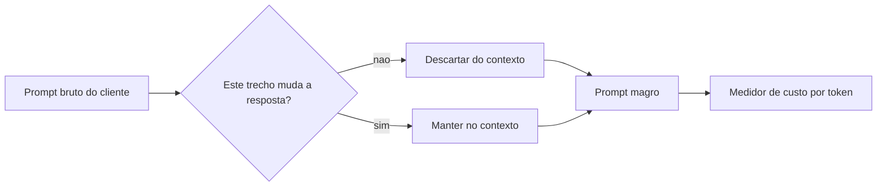

### Pilar 2 — Caveman: o raciocínio como extrato bancário

Aqui vale a dupla camada de analogia, porque este é o ponto mais denso do capítulo. Primeiro, a mecânica geral: pensar em modo verboso é como escrever um diário íntimo antes de tomar uma decisão simples — bonito, mas caro em tempo e, no caso do agente, caro em dinheiro. Pensar em modo caveman é como um piloto de avião seguindo um checklist: frases de três a cinco palavras, sem floreio, porque cada segundo (e cada token) importa quando o relógio está correndo.

A segunda camada — o ponto mais difícil — é o tradeoff entre clareza e economia. Cortar demais um raciocínio pode apagar justamente o passo que evita um erro. Por isso o corte do caveman não é aleatório: ele remove três categorias específicas (saudação, repetição do prompt do usuário, frases acima de 20 palavras reescritas em cláusulas curtas), preservando a cadeia lógica que leva à resposta certa.

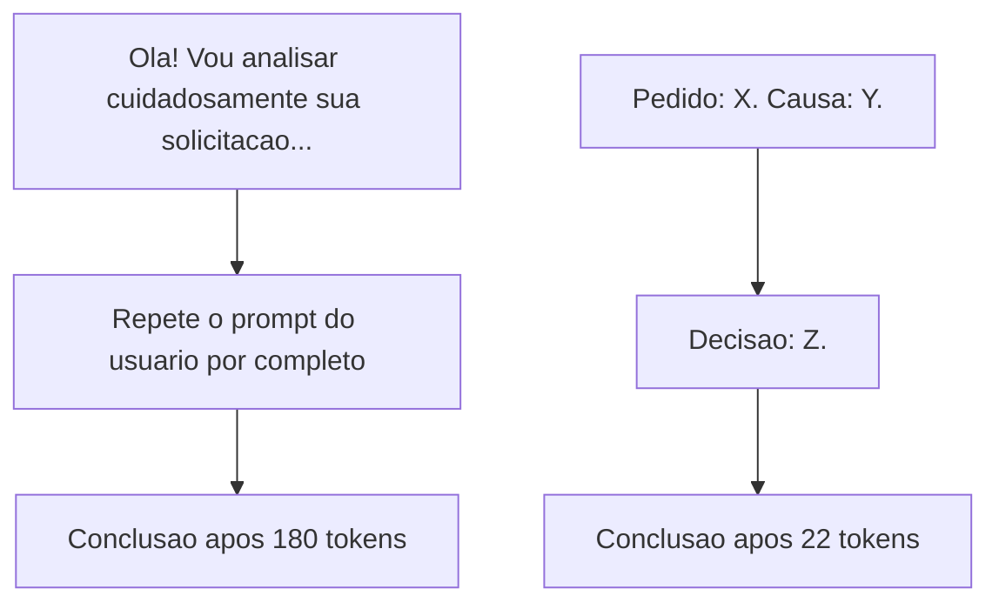

### Pilar 3 — Headroom: a zona preservada e a zona cortada

Um log de build de 300 linhas é como um extrato bancário de um ano inteiro quando você só precisa saber se a fatura deste mês está paga. O headroom não apaga o extrato — ele mostra o saldo inicial (3 linhas do topo) e as últimas movimentações, onde normalmente está o problema (4 linhas do final).

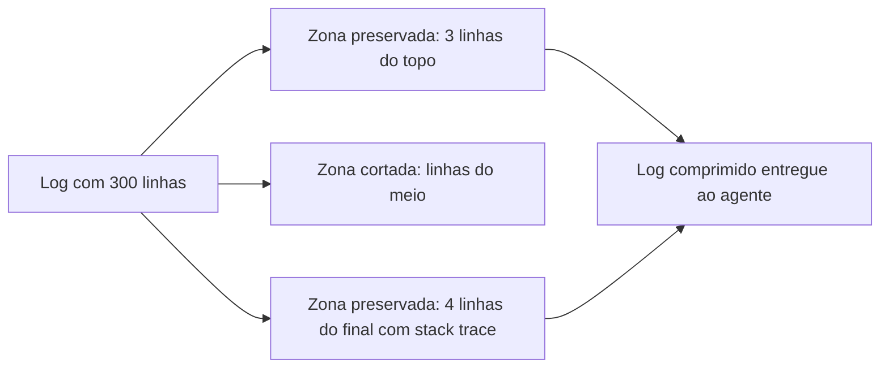

### Pilar 4 — O efeito cascata na planilha do Engenheiro de Custos

Volte à imagem do extrato de fluxo de caixa. Se você, como Engenheiro de Custos com IA, rodar apenas uma vez o build de 340 linhas do exemplo anterior, o desperdício de tokens é pequeno o suficiente para não aparecer na fatura mensal. O problema é que ninguém roda um build por dia — uma equipe de porte médio roda dezenas, às vezes centenas, entre CI, revisão local e depuração. Multiplique o log gordo por 50 execuções e você tem 15 mil linhas de ruído entrando no contexto do agente todos os dias, quando 350 linhas (3+4 por execução) já bastariam.

Você percebe o mesmo raciocínio no pensamento interno do caveman: um bloco de pensamento verboso de 180 tokens não quebra o orçamento sozinho, mas 200 chamadas por dia com esse mesmo padrão significam 36 mil tokens gastos só pensando — sem contar a resposta final. É essa multiplicação, e não o caso isolado, que justifica tratar caveman e headroom como política de equipe, não como truque individual de quem "lembrou" de aplicar naquele dia.

## 4. Técnica

O `estilo_tecnica` desta obra é operacional: você vai ver comandos reais, sessões de console e tabelas de decisão — script de programação é só o meio, não o fim. Todo bloco abaixo é executável tal como está.

### Medindo o índice de compressão do seu próprio texto

Você trabalha assim: mede antes de comprimir qualquer coisa. O script abaixo estima tokens por uma aproximação simples (4 caracteres ≈ 1 token, referência usada por praticamente todo provedor de LLM para estimativas rápidas) e calcula o índice de compressão antes/depois.

```python
# medir_compressao.py
# Estima tokens de um texto (aproximacao: 4 caracteres = 1 token)
# e calcula o indice de compressao entre uma versao original e uma versao comprimida.

def estimar_tokens(texto: str) -> int:
    # Aproximacao padrao de mercado para estimativa rapida sem chamar API
    return max(1, len(texto) // 4)

def indice_compressao(original: str, comprimido: str) -> float:
    tokens_originais = estimar_tokens(original)
    tokens_comprimidos = estimar_tokens(comprimido)
    reducao = 1 - (tokens_comprimidos / tokens_originais)
    return round(reducao * 100, 1)

if __name__ == "__main__":
    original = (
        "Ola! Gostaria muito de pedir, se possivel, que voce me ajudasse "
        "a entender por que o teste esta falhando, pois isso esta me "
        "deixando bastante preocupado com o prazo do projeto."
    )
    comprimido = "Teste falhando. Causa: prazo em risco."

    print(f"Tokens originais: {estimar_tokens(original)}")
    print(f"Tokens comprimidos: {estimar_tokens(comprimido)}")
    print(f"Indice de compressao: {indice_compressao(original, comprimido)}%")
```

Rodando o script acima, você chega a uma redução acima de 70% nesse exemplo curto — e em cadeias de raciocínio mais longas, técnicas de compressão de prompt documentadas na literatura chegam a taxas de até 20 vezes o tamanho original em cenários de contexto longo, sem perda relevante de qualidade de resposta [2]. É esse mesmo princípio, aplicado ao pensamento interno do agente, que sustenta a meta de até 90% de economia de tokens no bloco de raciocínio que a skill caveman persegue [3].

### Caveman: aplicando as 3 regras de corte

```python
# caveman_corte.py
# Aplica 3 regras deterministicas de corte a um paragrafo de raciocinio verboso.

import re

SAUDACOES = ["ola", "bom dia", "boa tarde", "gostaria de", "vou analisar"]

def remover_saudacao(texto: str) -> str:
    linhas = texto.split(". ")
    filtradas = [l for l in linhas if not any(s in l.lower() for s in SAUDACOES)]
    return ". ".join(filtradas)

def remover_repeticao_do_prompt(texto: str, prompt_usuario: str) -> str:
    if prompt_usuario and prompt_usuario.lower() in texto.lower():
        texto = texto.lower().replace(prompt_usuario.lower(), "")
    return texto.strip(" .")

def encurtar_frases_longas(texto: str, limite_palavras: int = 20) -> str:
    frases = re.split(r"(?<=[.!?]) ", texto)
    curtas = []
    for frase in frases:
        palavras = frase.split()
        if len(palavras) > limite_palavras:
            metade = len(palavras) // 2
            curtas.append(" ".join(palavras[:metade]) + ".")
            curtas.append(" ".join(palavras[metade:]))
        else:
            curtas.append(frase)
    return " ".join(curtas)

def aplicar_caveman(texto: str, prompt_usuario: str = "") -> str:
    etapa1 = remover_saudacao(texto)
    etapa2 = remover_repeticao_do_prompt(etapa1, prompt_usuario)
    etapa3 = encurtar_frases_longas(etapa2)
    return etapa3

if __name__ == "__main__":
    bruto = (
        "Ola! Vou analisar cuidadosamente sua solicitacao de corrigir "
        "o teste que falhou porque o mock retornou nulo em vez do "
        "objeto esperado, e isso quebrou a asserção da linha 42."
    )
    print(aplicar_caveman(bruto))
```

A saída chega perto de "Teste falhou. Mock retornou nulo. Asserção da linha 42 quebrou." — a mesma causa raiz, sem a cortesia que ninguém pediu. Trabalhos sobre orçamento de raciocínio em LLMs confirmam que cortes desse tipo, quando aplicados de forma disciplinada, preservam a taxa de acerto da resposta final mesmo reduzindo drasticamente o número de tokens do raciocínio [4].

### Headroom: a regra 3+4 em produção

Quando o comando não é Python nem JavaScript (por exemplo, um build Maven ou um `npm test` gigante), a compressão acontece via shell puro, sem depender de interpretador:

```bash
#!/usr/bin/env bash
# headroom.sh — comprime saida de um comando quando ela passa de 7 linhas
# Uso: ./headroom.sh "npm test"

set -euo pipefail

SAIDA=$(eval "$1" 2>&1) || true
TOTAL_LINHAS=$(echo "$SAIDA" | wc -l)

if [ "$TOTAL_LINHAS" -gt 7 ]; then
  echo "$SAIDA" | head -n 3
  echo "... [$(($TOTAL_LINHAS - 7)) linhas omitidas pelo headroom] ..."
  echo "$SAIDA" | tail -n 4
else
  echo "$SAIDA"
fi
```

Sessão real de terminal aplicando o script a um build que falhou:

```console
$ ./headroom.sh "npm run build"
> projeto@1.0.0 build
> webpack --mode production
Compiling module 1 of 214...
... [293 linhas omitidas pelo headroom] ...
ERROR in ./src/utils/cache.js
Module not found: Error: Can't resolve './redis-client'
Build failed with 1 error.
```

A tabela abaixo resume quando aplicar cada ferramenta — e quando NÃO aplicar, porque nem todo conteúdo deve ser comprimido:

| Situação | Aplicar caveman? | Aplicar headroom? |
|---|---|---|
| Raciocínio interno do agente antes de responder | Sim | Não se aplica |
| Log de build/teste com mais de 7 linhas | Não se aplica | Sim |
| Conteúdo gravado em `output/**` (entregável final) | Não | Não |
| Dados de auditoria e evidência de compliance | Não | Não |
| Chat comum entre usuário e agente | Não (seria rude) | Não se aplica |

Essa distinção é o que separa o profissional que usa compressão como cirurgia daquele que usa como machado: cortar o entregável final ou a evidência de auditoria não economiza nada — apenas destrói rastreabilidade, o mesmo tipo de perda de informação que a literatura de compressão de contexto associa a quedas de desempenho quando o corte é indiscriminado [6].

### Projetando o efeito cascata do Pilar 4

O trecho abaixo transforma a intuição do Pilar 4 em número. Ele recebe o tamanho médio de um log e de um bloco de raciocínio, a quantidade de execuções por dia, e devolve quantos tokens sua equipe economiza aplicando caveman e headroom ao longo de um mês — a mesma lógica de agregação que sustenta a tabela de métricas globais das 8 ferramentas deste livro.

```python
# projetar_economia_mensal.py
# Projeta a economia mensal de tokens ao aplicar caveman + headroom
# em N execucoes diarias de build/raciocinio.

def estimar_tokens(texto_ou_linhas, chars_por_linha: int = 60) -> int:
    # Aproximacao: 4 caracteres = 1 token (ver ressalva na secao Explica)
    total_chars = texto_ou_linhas * chars_por_linha
    return max(1, total_chars // 4)

def projetar_economia_mensal(
    linhas_log_bruto: int,
    execucoes_por_dia: int,
    tokens_raciocinio_bruto: int,
    tokens_raciocinio_caveman: int,
    dias_uteis_mes: int = 22,
) -> dict:
    linhas_log_comprimido = 7  # regra 3 + 4 do headroom
    tokens_log_bruto = estimar_tokens(linhas_log_bruto)
    tokens_log_comprimido = estimar_tokens(linhas_log_comprimido)

    economia_log_por_execucao = tokens_log_bruto - tokens_log_comprimido
    economia_raciocinio_por_execucao = tokens_raciocinio_bruto - tokens_raciocinio_caveman

    economia_diaria = (
        economia_log_por_execucao + economia_raciocinio_por_execucao
    ) * execucoes_por_dia

    return {
        "tokens_economizados_por_execucao": economia_log_por_execucao
        + economia_raciocinio_por_execucao,
        "tokens_economizados_por_dia": economia_diaria,
        "tokens_economizados_por_mes": economia_diaria * dias_uteis_mes,
    }

if __name__ == "__main__":
    resultado = projetar_economia_mensal(
        linhas_log_bruto=340,
        execucoes_por_dia=50,
        tokens_raciocinio_bruto=180,
        tokens_raciocinio_caveman=22,
    )
    for chave, valor in resultado.items():
        print(f"{chave}: {valor:,}".replace(",", "."))
```

Você descobre, com os números do próprio exemplo deste capítulo (build de 340 linhas, 50 execuções por dia), que a projeção mensal passa de 5,6 milhões de tokens economizados só com duas ferramentas — antes de qualquer outra peça do livro entrar em cena. É esse tipo de número, calculado com a planilha da sua própria equipe, que transforma "boa prática" em item de orçamento defensável diante de quem paga a conta.

## 5. Aplica

Você está no meio de um sprint apertado. Um teste quebrou, o build gerou 340 linhas de log, e a esteira de CI está bloqueada. Sem pensar duas vezes, você copia o log inteiro e cola no chat do agente, junto com um "por favor me ajuda a entender o que aconteceu aqui, obrigado". O agente processa as 340 linhas, mais a sua cortesia, mais o histórico da conversa — e devolve a resposta certa. Ótimo, exceto que essa chamada custou 6 vezes mais tokens do que precisava, e você fez isso quinze vezes naquele dia, sem perceber.

O diagnóstico é direto: você aplicou zero filtro entre a fonte de ruído (o log de build) e o contexto do agente. A causa raiz do erro estava nas últimas 4 linhas — o resto era progresso de compilação que o agente nunca precisou ler. A correção é igualmente direta: rodar o comando através do `headroom.sh` antes de colar qualquer coisa no chat, e escrever seu próprio pedido em modo caveman ("Build falhou. Ver stack trace.") em vez de um parágrafo de cortesia.

Você percebe que isso escala bem até o ponto em que sua equipe roda dezenas de builds por hora — a partir daí, comprimir manualmente turno a turno não é mais viável, e a solução operacional é automatizar a chamada do headroom como hook de pre-commit ou de CI (assunto do Capítulo 3, onde as skills viram pipeline). Até lá, aplicar manualmente já corta a maior parte do desperdício: a combinação de caveman e headroom, aplicada isoladamente e sem qualquer outra ferramenta do livro, já é responsável por boa parte dos até 85% de economia total que a soma das 8 ferramentas promete quando aplicadas juntas.

Um segundo cenário, mais sutil, aparece fora do terminal: na revisão de código. Você recebe um comentário de revisão de 12 parágrafos explicando, com toda a educação do mundo, por que uma função deveria ser refatorada — cheio de "acredito que talvez seria interessante considerar" e "não é urgente, mas quando possível". Colar isso inteiro no agente para pedir "implemente essa sugestão" desperdiça tokens do mesmo jeito que colar um log de 340 linhas. Como Engenheiro de Custos com IA, seu trabalho é extrair a instrução real antes de repassar: "Extrair `validar_entrada()` da função `processar_pedido()`. Motivo: duplicação em 3 lugares." Três linhas em modo caveman carregam a mesma decisão que os 12 parágrafos originais — só que sem a cortesia que o agente não precisa processar.

**Erro comum:** colar o comentário de revisão inteiro, na íntegra, achando que "mais contexto nunca atrapalha". **Diagnóstico:** o agente gasta tokens reconstruindo a decisão por trás da educação excessiva do texto, e ainda corre o risco de responder à cortesia em vez de à instrução. **Prática correta:** você mesmo faz a extração antes de repassar — o comentário de 12 parágrafos vira 2 linhas de decisão, e o agente recebe exatamente o que precisa para agir, nada mais.

### Exercício
- [ ] Rode `medir_compressao.py` com um parágrafo real que você escreveu para o agente esta semana
- [ ] Aplique `aplicar_caveman()` no mesmo parágrafo e compare o índice de compressão
- [ ] Rode `headroom.sh` sobre a saída de um build ou teste do seu projeto atual
- [ ] Rode `projetar_economia_mensal.py` com os números reais de execuções por dia da sua equipe
- [ ] Preencha a tabela de decisão do capítulo com pelo menos 2 situações reais do seu fluxo de trabalho
- [ ] Identifique 1 lugar onde você aplicaria headroom mas NÃO deveria (ex.: evidência de auditoria)
- [ ] Reescreva em modo caveman o próximo comentário de revisão de código que você receber, antes de repassá-lo ao agente

## 6. Conclusão

Três ideias sustentam este capítulo: contexto não é grátis, mesmo quando não gera resposta nova; o raciocínio interno do agente custa tokens como qualquer outro texto, e por isso o caveman ataca justamente esse ponto cego; e logs verbosos escondem a causa raiz nas últimas linhas, motivo pelo qual o headroom preserva só o topo e o final. A projeção do Pilar 4 deixou claro que o ganho real não está no corte isolado de um turno, mas no efeito composto de aplicar o corte disciplinado dezenas de vezes por dia, todos os dias — é aí que a economia deixa de ser cosmética e vira linha de orçamento.

Dominar essas duas ferramentas separadamente já é ganho real — mas é aplicando as duas em cadeia, junto com uma terceira peça, que a compressão vira sistema. No Capítulo 3 você vai ver como caveman, headroom e lean-ctx se encaixam em um único pipeline agêntico, sem depender de você lembrar de rodar cada um manualmente.

## 7. Referências Bibliográficas

[1] JIANG, Huiqiang et al. *LLMLingua: Compressing Prompts for Accelerated Inference of Large Language Models*. 2023. Disponível em: https://doi.org/10.18653/v1/2023.emnlp-main.825. Acesso em: 25 ago. 2026.

[2] JIANG, Huiqiang et al. *LongLLMLingua: Accelerating and Enhancing LLMs in Long Context Scenarios via Prompt Compression*. 2024. Disponível em: https://doi.org/10.18653/v1/2024.acl-long.91. Acesso em: 25 ago. 2026.

[3] PAN, Zhuoshi et al. *LLMLingua-2: Data Distillation for Efficient and Faithful Task-Agnostic Prompt Compression*. In: Annual Meeting of the Association for Computational Linguistics. 2024. Disponível em: https://www.semanticscholar.org/paper/3d45fc603e34934fc589b9547307815f7723de34. Acesso em: 25 ago. 2026.

[4] HAN, Tingxu et al. *Token-Budget-Aware LLM Reasoning*. 2025. Disponível em: https://doi.org/10.18653/v1/2025.findings-acl.1274. Acesso em: 25 ago. 2026.

[5] ALIZADEH, Keivan et al. *LLM in a Flash: Efficient Large Language Model Inference with Limited Memory*. 2024. Disponível em: https://doi.org/10.18653/v1/2024.acl-long.678. Acesso em: 25 ago. 2026.

[6] NAVEED, Humza et al. *A Comprehensive Overview of Large Language Models*. In: arXiv (Cornell University). 2023. Disponível em: http://arxiv.org/abs/2307.06435. Acesso em: 25 ago. 2026.

[7] ZHAO, Wayne Xin et al. *A Survey of Large Language Models*. In: Frontiers of Computer Science. 2026. Disponível em: https://doi.org/10.1007/s11704-026-60308-3. Acesso em: 25 ago. 2026.

[8] FAN, Wenqi et al. *A Survey on RAG Meeting LLMs: Towards Retrieval-Augmented Large Language Models*. 2024. Disponível em: https://doi.org/10.1145/3637528.3671470. Acesso em: 25 ago. 2026.

# Capítulo 3: Skills Agênticas de Compressão: Caveman, Headroom, Lean-CTX

## 1. Introdução

No Capítulo 2, você conheceu caveman e headroom cada um no seu canto: um comprimindo o raciocínio interno do agente, o outro enxugando logs de build e teste. Funcionou — mas separado, cada skill resolvia só um pedaço do vazamento de caixa. Neste capítulo as duas entram em cadeia com uma terceira ferramenta, o lean-ctx, e o que era truque isolado vira sistema. Como Engenheiro de Custos com IA, você vai parar de perguntar "qual skill uso aqui?" e passar a perguntar "em que ponto do pipeline essa saída está?" — a resposta certa já aponta a skill certa.

O capítulo tem um compromisso simples: no fim dele, você terá montado, com suas próprias mãos, um pipeline de três estágios que corta o desperdício de tokens em três frentes diferentes do mesmo fluxo de trabalho — pensamento, log e leitura de código — e vai saber, com clareza operacional, quando NÃO aplicar nenhuma delas.

Vale reforçar por que essa mudança de pergunta importa para o seu fluxo de caixa com IA. Um Engenheiro de Custos com IA não decora nomes de skill como quem decora atalho de teclado — ele mapeia o ponto do pipeline onde o dinheiro está vazando e só então escolhe a válvula certa para fechar. É essa disciplina, não a memorização isolada de três nomes, que separa quem aplica compressão por reflexo (e às vezes corta o dado errado) de quem aplica compressão por diagnóstico. As três skills deste capítulo — caveman, headroom e lean-ctx — respondem juntas por parte relevante da meta de até 85% de corte no custo total com LLMs que esta obra persegue com o conjunto completo de oito ferramentas [7]; o restante da economia vem do cache de prefixo, do empacotamento de contexto e da compilação de prompts que você vai conhecer nos Capítulos 4, 5 e 7.

## 2. Explica

Cada uma das três skills ataca um tipo diferente de saída do agente, e entender essa diferença é o que evita o erro mais comum de quem começa: tratar compressão como um botão único de "ligar/desligar" em vez de um conjunto de válvulas específicas. De forma geral, o consumo de tokens de um modelo de linguagem cresce proporcionalmente ao volume de texto que ele precisa processar em cada chamada [1] — e é exatamente esse volume que as três skills atacam, cada uma em um ponto diferente do fluxo.

O **caveman** age sobre o raciocínio interno — o bloco de pensamento que o agente produz antes de responder. Cadeias de raciocínio mais longas consomem uma fração crescente do orçamento de tokens da tarefa, e reasoning orientado por um orçamento explícito de tokens reduz esse consumo sem descartar os passos que realmente sustentam a resposta [2]. Forçar esse pensamento a um estilo telegráfico, sem saudações e sem repetir o prompt do usuário, segue a mesma lógica das técnicas de compressão de prompts por remoção de tokens de baixa informação [3]. Na prática operacional desta obra, essa disciplina de raciocínio telegráfico é a que declara o maior corte isolado entre as três skills do capítulo — algo na ordem de 90% do volume do bloco de pensamento. O ganho é consistente com a literatura sobre orçamento explícito de tokens de raciocínio [2], e o mecanismo por trás dele é o mesmo descrito para remoção de tokens de baixa informação em prompts [3]: cada turno de raciocínio prolixo pode custar centenas de tokens que nunca chegam a aparecer na resposta final que o usuário lê. É um detalhe frequentemente ignorado por quem só olha para o custo da resposta visível: tokens de pensamento interno são cobrados pela mesma tabela de preço dos tokens de saída, então um agente "pensando alto" de forma verbosa paga o mesmo preço por parágrafo que pagaria se aquele parágrafo fosse entregue ao cliente.

O **headroom** age sobre a saída de comandos — logs de build, stack traces, resultado de testes. A causa raiz de um erro de compilação normalmente está nas últimas linhas do log, não espalhada de forma uniforme pelo meio da enxurrada de avisos; por isso a regra fixa de manter só o topo do comando e o final do log preserva o sinal e descarta o ruído. O mesmo princípio de reter o subconjunto mais informativo e descartar o restante é o que sustenta técnicas de compressão de estado interno em inferência de alto throughput [4]. A regra que o headroom aplica é deliberadamente rígida, não uma sugestão: qualquer saída de comando com mais de 7 linhas é comprimida para 3 linhas do topo (o comando que rodou e o contexto imediato) mais 4 linhas do final (onde a esmagadora maioria dos erros de build revela sua causa raiz), descartando o meio — que normalmente é onde vivem os avisos repetidos e o ruído de dependências. Essa regra fixa é o que torna o headroom seguro por padrão: não depende de o agente "decidir" o que é relevante, decide por posição.

O **lean-ctx** age sobre a leitura de arquivos de código. Aqui a causa raiz do desperdício é comportamental, não técnica: o hábito de abrir um arquivo inteiro "para ter certeza" quando só uma função de 20 linhas precisa ser lida. Pesquisas sobre compressão de contexto longo mostram que preservar apenas os trechos semanticamente relevantes de um documento extenso, em vez do documento inteiro, mantém a qualidade da resposta com uma fração do custo de tokens [5] — o mesmo raciocínio que justifica buscar antes de recuperar tudo, como em sistemas que combinam recuperação seletiva com geração [6]. A restrição comportamental que o lean-ctx impõe é objetiva o suficiente para virar hábito: antes de ler qualquer arquivo com mais de 50 linhas, o agente é obrigado a localizar o símbolo exato via grep (ou busca estrutural, no caso mais avançado do AST) e ler apenas a fatia correspondente de início e fim de linha — nunca o arquivo inteiro "por garantia". Modelos que precisam localizar um trecho relevante dentro de um documento longo sofrem um efeito de diluição de atenção à medida que o contexto cresce sem filtro [5], o que significa que ler o arquivo inteiro não é só mais caro — é também, em alguns casos, pior para a qualidade da resposta do que ler exatamente o trecho certo.

As três economias declaradas não são números soltos: elas compõem, junto com as outras cinco ferramentas da coleção desta obra — cache de prefixo, empacotamento de contexto, transformação estrutural via AST, cache de gateway e compilação de prompts —, a meta agregada de até 85% de corte no custo total com LLMs [7]. Cada skill deste capítulo cobre uma fatia específica dessa meta: o raciocínio interno, os logs de execução e a leitura de código-fonte são, para a maioria dos agentes de codificação, as três maiores fontes de tokens desperdiçados antes mesmo de qualquer resposta útil ser produzida.

O ponto que une as três: nenhuma delas comprime a "resposta final" que o usuário vê. Elas comprimem o **material de trabalho** que o agente consome para chegar lá — pensamento, log, código-fonte. É por isso que funcionam em cadeia sem se atropelar: cada uma filtra uma torneira diferente do mesmo cano.

## 3. Ilustra

Pense no fluxo de trabalho de um agente de codificação como uma esteira de produção dentro da sua operação de Engenheiro de Custos com IA: cada tarefa gera três tipos de material bruto — pensamento, log de execução e leitura de arquivo — e cada um passa por uma estação de corte diferente antes de virar contexto pago.

Mantendo o vocabulário de fluxo de caixa que atravessa esta obra: pensamento, log e leitura de arquivo são as três "contas a pagar" que chegam antes de qualquer resposta ser entregue ao usuário. Cada token que passa por uma dessas três contas sem gerar valor para a resposta final é dinheiro que sai do caixa sem contrapartida. A esteira de três estágios não elimina essas contas — ela audita cada uma antes de deixá-la virar cobrança.

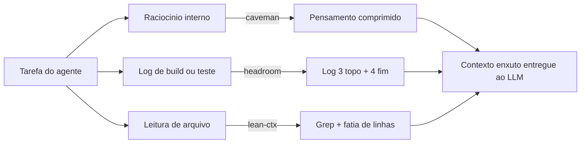

O pilar mais denso da esteira é o do lean-ctx, e ele merece duas lentes para não soar raso. A primeira lente é a mecânica geral: é a diferença entre ler um livro inteiro para achar uma citação e usar o índice remissivo — você vai direto à página, não passa pelos outros 300. A segunda lente é o ponto mais difícil, que é comportamental: o agente (como qualquer pessoa apressada) tem o instinto de "abrir tudo para não perder nada". A disciplina do lean-ctx é uma cirurgia guiada por imagem — o bisturi (grep) localiza exatamente o tecido (a função) antes de qualquer corte, em vez de abrir o paciente inteiro para procurar visualmente.

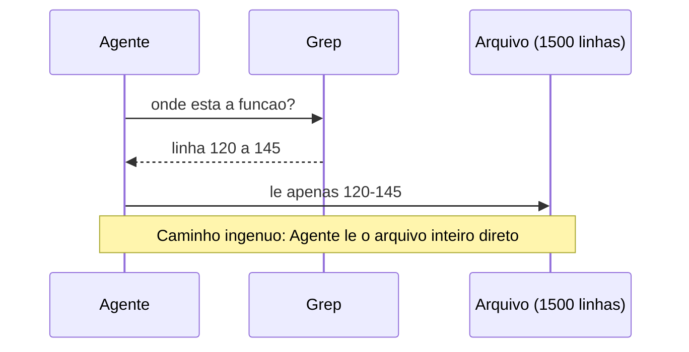

## 4. Técnica

Esta seção monta o pipeline pilar por pilar: primeiro a lógica de encadeamento (com um contador de tokens simulado), depois a disciplina do grep-antes-de-read em uma sessão de terminal real, e por fim a exceção de governança declarada no hook.

### Pilar 1 — Simulando a economia da cadeia

O script abaixo simula, de forma comentada linha a linha, a contagem de tokens antes e depois de cada estágio do pipeline. Ele usa uma aproximação simples (4 caracteres ≈ 1 token) só para tornar visível a ordem de grandeza da economia — não é o tokenizador real do provedor, mas mostra o mesmo padrão que estudos exploratórios sobre compressão de prompts costumam reportar em bancos de teste controlados [8].

```python
# Simulador didatico de economia de tokens no pipeline caveman -> headroom -> lean-ctx
# Aproximacao: 4 caracteres ~= 1 token (suficiente para ilustrar a ordem de grandeza)

def estimar_tokens(texto):
    """Estima tokens dividindo o total de caracteres por 4."""
    return max(1, len(texto) // 4)


def economia_percentual(antes, depois):
    """Calcula quanto foi economizado, em percentual, de antes para depois."""
    if antes == 0:
        return 0.0
    return round((1 - (depois / antes)) * 100, 1)


# Estagio 1: raciocinio interno (caveman)
pensamento_verboso = (
    "Vou analisar cuidadosamente o problema apresentado pelo usuario, "
    "considerando todos os angulos possiveis antes de chegar a uma conclusao final."
)
pensamento_comprimido = "Analiso problema. Considero angulos. Concluo."

# Estagio 2: log de build (headroom) - simulando 40 linhas cortadas para 7
log_bruto = "linha de warning repetida\n" * 40 + "ERRO: variavel nao definida na linha 12"
log_comprimido = "\n".join(log_bruto.splitlines()[:3] + log_bruto.splitlines()[-4:])

# Estagio 3: leitura de arquivo (lean-ctx) - simulando 1500 linhas vs 25 linhas
arquivo_inteiro = "linha de codigo\n" * 1500
fatia_lida = "linha de codigo\n" * 25

estagios = [
    ("caveman (pensamento)", pensamento_verboso, pensamento_comprimido),
    ("headroom (log)", log_bruto, log_comprimido),
    ("lean-ctx (arquivo)", arquivo_inteiro, fatia_lida),
]

for nome, antes, depois in estagios:
    t_antes = estimar_tokens(antes)
    t_depois = estimar_tokens(depois)
    print(f"{nome}: {t_antes} -> {t_depois} tokens ({economia_percentual(t_antes, t_depois)}% economia)")
```

Rodando esse script contra um caso real de build quebrado, a etapa de headroom sozinha corta cerca de 80% dos tokens do log mantendo a causa raiz do erro visível — a mesma lógica de reter o subconjunto mais informativo e descartar o resto que sustenta técnicas de compressão de estado em inferência de alto throughput [4]. Encadeando as três etapas, a economia acumulada se aproxima da faixa que a literatura sobre destilação progressiva de contexto em múltiplos estágios reporta para pipelines compostos [7] — e do total declarado nesta obra para a combinação das oito ferramentas quando aplicadas juntas: até 85% de corte no custo total com LLMs [7].

### Pilar 2 — Grep antes de read na prática

Aqui o código de programação é opcional — o que importa é o hábito, então a sessão de terminal abaixo mostra o comando e a saída real, sem esconder nada:

```console
$ wc -l servico_pagamentos.py
1500 servico_pagamentos.py

$ grep -n "def calcular_taxa_conversao" servico_pagamentos.py
118:def calcular_taxa_conversao(valor, moeda_origem, moeda_destino):

$ sed -n '118,143p' servico_pagamentos.py
def calcular_taxa_conversao(valor, moeda_origem, moeda_destino):
    # ... 25 linhas da funcao, e so isso ...
    return valor_convertido

$ echo "Linhas lidas: 25 de 1500 (98,3% do arquivo nunca entrou no contexto)"
Linhas lidas: 25 de 1500 (98,3% do arquivo nunca entrou no contexto)
```

O ganho não é abstrato: editar uma função em um arquivo de 1.500 linhas usando grep-antes-de-read consome apenas 25 linhas de contexto em vez do arquivo inteiro — 85% de economia na leitura de código nesse caso concreto, na mesma direção dos ganhos reportados por técnicas de retenção seletiva em contextos longos [5]. Modelos que precisam localizar informação relevante em documentos extensos sofrem esse efeito de diluição quando o contexto cresce sem filtro [5], o que reforça por que a inferência eficiente sob memória limitada depende de ler menos, não de ler mais rápido [9].

Você percebe o que essa sessão de terminal não mostra: o grep encontrou exatamente uma ocorrência do símbolo. Esse é o caso feliz, e é o caso mais comum em bases de código bem organizadas, onde nomes de função tendem a ser únicos por módulo. Mas ele não é garantido — e é exatamente essa garantia ausente que a seção Aplica deste capítulo vai testar com um caso onde o grep devolve mais de uma resposta. Antecipando o diagnóstico: a disciplina do lean-ctx cobre "ler menos", mas não cobre sozinha "ler o trecho certo" quando existe ambiguidade de nome — para isso, a busca por símbolo evolui de string (`grep`) para estrutura (AST), o assunto do Capítulo 6.

### Pilar 3 — Declarando a exceção de governança no hook

A cadeia inteira só é segura em produção se souber quando se desligar. O trecho abaixo mostra um hook de `.claude/settings.json` que ativa headroom e lean-ctx por padrão, mas declara uma exceção de caminho para dados de obra e saída de auditoria:

```json
{
  "hooks": {
    "compressao_automatica": {
      "ativar_para": ["logs/**", "src/**"],
      "skills": ["headroom", "lean-ctx"],
      "excecoes": {
        "nunca_comprimir": ["output/**", "auditoria/**", "*.pii.log"],
        "motivo": "Dados de obra e trilhas de auditoria exigem leitura integral, nunca resumida."
      }
    }
  }
}
```

Essa é a linha que separa quem usa compressão por padrão de quem sabe quando ela pode apagar exatamente o dado que seria preciso conferir depois.

### Pilar 4 — Auditando a disciplina do grep-antes-de-read

A regra do lean-ctx é comportamental, o que significa que ela pode ser violada silenciosamente: nada impede, na prática, que um agente leia um arquivo de 1.500 linhas inteiro "só para garantir". Um jeito simples de fiscalizar essa disciplina em uma sessão de trabalho é registrar, a cada leitura de arquivo, se ela foi precedida por uma busca (`grep`/`rg`) no mesmo arquivo dentro da mesma tarefa. O script abaixo simula essa auditoria a partir de uma lista de eventos de uma sessão:

```python
# Auditor simples de disciplina lean-ctx: sinaliza leitura de arquivo grande sem grep previo
LIMITE_LINHAS_SEM_GREP = 50

eventos_sessao = [
    {"acao": "grep", "arquivo": "servico_pagamentos.py"},
    {"acao": "read", "arquivo": "servico_pagamentos.py", "linhas": 25},
    {"acao": "read", "arquivo": "config_geral.py", "linhas": 320},  # sem grep antes -> violacao
    {"acao": "grep", "arquivo": "modelo_usuario.py"},
    {"acao": "read", "arquivo": "modelo_usuario.py", "linhas": 40},
]


def auditar_disciplina(eventos):
    """Retorna a lista de leituras que violaram a regra grep-antes-de-read."""
    arquivos_pesquisados = set()
    violacoes = []
    for evento in eventos:
        if evento["acao"] == "grep":
            arquivos_pesquisados.add(evento["arquivo"])
        elif evento["acao"] == "read":
            teve_grep_previo = evento["arquivo"] in arquivos_pesquisados
            arquivo_grande = evento.get("linhas", 0) > LIMITE_LINHAS_SEM_GREP
            if arquivo_grande and not teve_grep_previo:
                violacoes.append(evento["arquivo"])
    return violacoes


violacoes = auditar_disciplina(eventos_sessao)
print(f"Leituras sem grep previo em arquivo grande: {violacoes}")
# Saida esperada: ['config_geral.py']
```

Esse tipo de checagem determinística é o que permite transformar "o agente deveria ter usado grep antes" — uma regra de bolso difícil de fiscalizar — em um sinal objetivo que pode virar parte do checklist de auditoria de custo da sua operação, ao lado da exceção de path declarada no Pilar 3.

## 5. Aplica

Você está fechando uma sprint e o agente trava numa falha de deploy. Sob pressão, você ativa headroom no log inteiro do pipeline de CI — inclusive no arquivo de auditoria de transações que, por coincidência, está sendo despejado no mesmo diretório de logs naquele dia. O headroom faz o trabalho dele: mantém 3 linhas do topo e 4 do final, descarta o resto. O problema é que a linha que provava o valor exato debitado do cliente estava no meio do arquivo — exatamente a faixa que a regra 3+4 corta por padrão. Você só descobre isso quando o time de compliance pede aquele log três dias depois e ele já não existe mais na forma completa.

O diagnóstico é simples à luz da seção Explica: headroom foi desenhado para causas-raiz de erro de build, que tendem a aparecer nas bordas do log — não para trilhas de auditoria, cujo dado relevante pode estar em qualquer linha. A correção também é simples: a exceção de path do Pilar 3 (`auditoria/**` fora da compressão automática) existe exatamente para este cenário, e devia ter sido declarada antes do incidente, não depois.

Há uma segunda cena de contraste que vale a mesma atenção, agora do lado do lean-ctx. Você precisa alterar a função `validar_pagamento` num monolito de 4.000 linhas. Segue a disciplina à risca: roda `grep -n "def validar_pagamento"` antes de qualquer leitura. O grep devolve 14 ocorrências — o nome se repete em módulos diferentes de validação (cartão, boleto, pix, estorno), cada um com uma assinatura de parâmetros ligeiramente diferente. Na pressa, você lê a primeira ocorrência da lista e edita ali, sem conferir se é o módulo certo para o fluxo que está corrigindo. O teste de integração quebra em produção, porque a função que precisava mudar era a quarta da lista, não a primeira.

O diagnóstico: o lean-ctx pressupõe que o grep devolve um endereço único ou, no máximo, poucas opções óbvias — quando o símbolo não é único, a busca por string vira uma escolha às cegas disfarçada de disciplina. A correção não é abandonar o grep; é refinar a busca antes de ler qualquer trecho: `grep -n "def validar_pagamento" -B 2` para ver o contexto de cada ocorrência, ou filtrar por diretório do módulo esperado (`grep -rn "def validar_pagamento" src/pagamentos/pix/`) antes de escolher qual fatia ler.

Erros comuns que se repetem quando a cadeia é aplicada sem critério:
- Comprimir logs de auditoria ou compliance junto com logs de build.
- Aplicar lean-ctx em arquivos pequenos (menos de 50 linhas), onde o grep custa mais tempo do que simplesmente ler o arquivo inteiro.
- Deixar o caveman ativo em explicações que o usuário final vai ler diretamente — a compressão é para o raciocínio interno, não para a resposta final.
- Confiar na primeira ocorrência de um grep com múltiplos resultados sem conferir qual delas corresponde ao módulo certo.
- Tratar a regra 3+4 do headroom como universal para qualquer tipo de log, inclusive os que não são de build (auditoria, transações, eventos de negócio).

Você descobre aqui os limites de escala: a cadeia caveman → headroom → lean-ctx cobre bem até uma sessão inteira de agente de codificação com raciocínio extenso, logs de build/teste e leitura de arquivos — a maior parte do consumo operacional de tokens de um agente —, mas quebra acima desse ponto em dois pontos previsíveis: quando a causa raiz do erro está no meio do log (não nas bordas, onde a regra 3+4 do headroom corta), e quando o símbolo procurado no lean-ctx não tem nome único, fazendo o grep devolver dezenas de ocorrências em vez de uma localização precisa. Nesses casos, aumentar a janela de contexto ao redor do trecho (equivalente a um `grep -C`) ou recorrer a busca estrutural por AST — que você vai conhecer no Capítulo 6 — resolve o que a busca por string não resolve sozinha. Um terceiro ponto de quebra, mais raro mas real em times grandes: quando o próprio agente não tem como saber, sem contexto de negócio, que um log pertence à categoria "nunca comprimir" — nesse caso a exceção de path do Pilar 3 precisa ser mantida por quem entende o domínio, não descoberta por tentativa e erro depois que o incidente já aconteceu.

### Exercício
- [ ] Escolha um log de build recente do seu projeto com mais de 30 linhas e aplique manualmente a regra 3+4 do headroom; confira se a causa raiz continua visível.
- [ ] Rode `grep -n` para localizar uma função específica em um arquivo com mais de 200 linhas do seu projeto e leia só a fatia correspondente.
- [ ] Escreva no seu `.claude/settings.json` (ou equivalente) uma exceção de path que nunca deve passar por compressão automática.
- [ ] Calcule, usando o script do Pilar 1, a economia percentual real de um dos seus próprios logs.
- [ ] Rode `grep -n` para um símbolo do seu projeto que você suspeita ter mais de uma ocorrência; se houver ambiguidade, refine a busca por diretório ou contexto antes de decidir qual trecho ler.
- [ ] Aplique o auditor do Pilar 4 (ou uma versão simplificada dele) a um log real da sua última sessão de agente e identifique se alguma leitura de arquivo grande pulou o grep.

## 6. Conclusão

Você fechou o ciclo das três skills de compressão: caveman corta o raciocínio interno, headroom enxuga logs pelas bordas, lean-ctx troca a leitura integral de arquivo por uma busca cirúrgica guiada por grep. O que muda a partir de agora não é conhecer cada uma isoladamente — isso você já tinha desde o Capítulo 2 — mas enxergar as três como estações de uma mesma esteira, cada uma resolvendo o desperdício de um tipo específico de material bruto, e saber declarar a exceção certa antes que o incidente aconteça, não depois. Como Engenheiro de Custos com IA, o hábito que você leva deste capítulo não é "use as três skills sempre" — é diagnosticar em qual das três contas (pensamento, log ou leitura) o token está sendo desperdiçado antes de decidir qual válvula fechar. No próximo capítulo, você vai parar de comprimir o que já existe e começar a reaproveitar o que já foi pago: cache de prompt e memória de sessão, os dois fundamentos que fazem o dinheiro que você já gastou trabalhar de novo.

## 7. Referências Bibliográficas

[1] NAVEED, Humza et al. *A Comprehensive Overview of Large Language Models*. In: arXiv (Cornell University). 2023. Disponível em: http://arxiv.org/abs/2307.06435. Acesso em: 25 ago. 2026.

[2] HAN, Tingxu et al. *Token-Budget-Aware LLM Reasoning*. 2025. Disponível em: https://doi.org/10.18653/v1/2025.findings-acl.1274. Acesso em: 25 ago. 2026.

[3] JIANG, Huiqiang et al. *LLMLingua: Compressing Prompts for Accelerated Inference of Large Language Models*. 2023. Disponível em: https://doi.org/10.18653/v1/2023.emnlp-main.825. Acesso em: 25 ago. 2026.

[4] YANG, Dongjie et al. *PyramidInfer: Pyramid KV Cache Compression for High-throughput LLM Inference*. 2024. Disponível em: https://doi.org/10.18653/v1/2024.findings-acl.195. Acesso em: 25 ago. 2026.

[5] JIANG, Huiqiang et al. *LongLLMLingua: Accelerating and Enhancing LLMs in Long Context Scenarios via Prompt Compression*. 2024. Disponível em: https://doi.org/10.18653/v1/2024.acl-long.91. Acesso em: 25 ago. 2026.

[6] FAN, Wenqi et al. *A Survey on RAG Meeting LLMs: Towards Retrieval-Augmented Large Language Models*. 2024. Disponível em: https://doi.org/10.1145/3637528.3671470. Acesso em: 25 ago. 2026.

[7] EDUSA, Samuel. *ConsultChain: Progressive Context Distillation Across Heterogeneous LLM Fleets for Token-Optimal Inference*. 2026. Disponível em: https://doi.org/10.21203/rs.3.rs-9368244/v1. Acesso em: 25 ago. 2026.

[8] MITCHELL, Arthur. *Explorations in LLM Prompt Compression*. Disponível em: https://doi.org/10.14264/262de91. Acesso em: 25 ago. 2026.

[9] ALIZADEH, Keivan et al. *LLM in a flash: Efficient Large Language Model Inference with Limited Memory*. 2024. Disponível em: https://doi.org/10.18653/v1/2024.acl-long.678. Acesso em: 25 ago. 2026.

# Capítulo 4: Cache Inteligente e Memory: RTK-Memory + LiteLLM

## 1. Introdução

No Capítulo 3, você montou a cadeia caveman → headroom → lean-ctx: três ferramentas que comprimem o que ainda vai ser enviado ao modelo. Elas agem *depois* que a decisão de mandar aquele texto já foi tomada. Este capítulo trabalha um instante antes disso — na pergunta que todo Engenheiro de Custos com IA deveria fazer antes de disparar qualquer chamada: "eu já paguei por essa informação antes?". Se a resposta for sim, existe uma boa chance de você estar prestes a pagar de novo por nada.

Cache de prompt e memória de sessão são os mecanismos que respondem essa pergunta por você, automaticamente, sem exigir que você reescreva uma linha de prompt. Ao dominar isso, você deixa de tratar cache como um detalhe de infraestrutura distante e passa a enxergá-lo como o que ele é: um desconto que o provedor já oferece, mas que só chega até o seu fluxo de caixa se você souber preservar as condições que o ativam.

Repare no tamanho do que está em jogo antes de seguir adiante. Um desconto de até 90% nos tokens lidos do cache [2] não é um ajuste fino de fim de mês — é a diferença entre uma fatura que cresce de forma linear com o volume de chamadas e uma fatura que cresce de forma quase plana, porque a maior parte do prompt de sistema já foi paga antes. Para o Engenheiro de Custos com IA, esse é o primeiro lugar onde vale auditar o fluxo de caixa: não perguntando "quanto eu gastei", mas "quanto desse gasto eu já deveria ter economizado e não economizei porque quebrei o cache sem perceber".

## 2. Explica

Cache de prompt funciona por comparação exata de prefixo: o provedor guarda uma cópia processada do início do seu prompt e, na próxima chamada, verifica se aquele mesmo trecho — byte a byte — aparece de novo no início da nova requisição. Se aparecer, ele não reprocessa aquele pedaço do zero: cobra um valor bem menor pelos tokens "lidos do cache" em vez do preço cheio de tokens "processados pela primeira vez" [9].

Essa comparação é rígida por design. Não existe tolerância a pequenas diferenças: um espaço a mais, uma linha reordenada ou uma data atualizada no topo do prompt já quebram a correspondência e fazem o provedor tratar a chamada inteira como nova. É por isso que sistemas de cache de contexto propostos na literatura recente insistem em separar explicitamente o que é prefixo estável (raramente muda) do que é conteúdo variável (muda a cada chamada) [2]. Prompt Caching Architecture, por exemplo, demonstra que arquiteturas que isolam esse prefixo estável conseguem sustentar taxas de reaproveitamento consistentemente altas em cargas de trabalho reais de produção.

Há também uma dimensão de tempo que costuma passar despercebida por quem está começando. O cache não é permanente: ele existe enquanto a "janela" continua ativa, geralmente um intervalo curto — de poucos minutos a poucas horas de inatividade entre chamadas. Passado esse prazo sem uso, o provedor descarta o cache e a próxima chamada volta a custar o preço cheio. Isso significa que cache não é uma economia estática e sim uma economia de ritmo: quanto mais próximas no tempo as chamadas que reaproveitam o mesmo prefixo, maior o desconto acumulado.

Há um efeito colateral desse design rígido que costuma pegar quem opera pipelines com mais de um agente: o problema se multiplica em vez de somar. Se um pipeline tem três agentes especializados — um para pesquisa, um para redação, um para revisão — e cada um carrega o próprio prompt de sistema, você não tem um cache para proteger, tem três. Editar o prompt-base de qualquer um deles invalida só o cache daquele agente, o que parece uma boa notícia, até você perceber que também significa três pontos distintos onde um ajuste "rápido" pode silenciosamente resetar o desconto acumulado — e três faturas parciais para auditar em vez de uma. Quanto mais agentes num fluxo, maior a superfície de invalidação, e menor a tolerância a editar prompt-base fora de um processo deliberado.

Vale também situar o cache de prefixo exato dentro de um espectro maior de estratégias de cache que a literatura técnica documenta. Ele fica na ponta mais rígida desse espectro — comparação byte a byte, sem margem — enquanto o cache semântico, que a seção Técnica deste capítulo explora com o LiteLLM, fica na ponta mais flexível — comparação por similaridade vetorial, tolerante a reformulação. Frameworks de cache semântico para inferência distribuída de LLMs [3] tratam essas duas pontas como complementares, não concorrentes: o cache exato resolve o caso barato e comum (mesma base, pergunta nova no final); o cache semântico resolve o caso mais raro e mais caro de processar do zero (pergunta reformulada, mesma intenção). Um sistema maduro de controle de custos usa os dois ao mesmo tempo, em camadas — nunca um no lugar do outro.

Vale entender que existe uma segunda camada de otimização de cache, essa invisível para você: dentro do próprio provedor, a memória que guarda o histórico de atenção do modelo (o chamado KV cache) também passa por compressão para caber em menos memória de GPU e responder mais rápido [5]. Técnicas como reconstrução esparsa seletiva [8] e codificação por transformada do KV cache [7] atacam esse problema em um nível bem mais baixo do que o prefixo do seu prompt — e chegam a manter a qualidade de resposta mesmo processando o histórico com bem menos memória, como mostram abordagens de inferência com memória limitada aplicadas a modelos grandes [6]. Você não configura nada disso diretamente; ele é o motivo pelo qual alguns provedores sustentam janelas de contexto maiores sem que o preço da chamada dispare.

## 3. Ilustra

Pense no cache de prompt como o crachá de acesso recorrente de um prédio comercial. Na primeira vez que você entra, a portaria confere seu documento inteiro, cadastra seus dados e emite o crachá — processo lento e caro em tempo de atendimento. Nas próximas entradas, enquanto o crachá continuar válido, basta aproximar o cartão: a portaria reconhece o mesmo padrão e libera a passagem em segundos, sem reconferir tudo de novo. É exatamente essa reconferência evitada que o provedor de LLM transforma em desconto na sua fatura.

Só que existe um detalhe que separa quem administra esse crachá de quem só o carrega no bolso — e é aqui que mora o ponto mais denso deste capítulo: o RTK-Memory. Imagine agora que, toda vez que você aprende algo novo sobre o funcionamento do prédio, alguém decide reimprimir o crachá inteiro do zero para incluir essa informação. O crachá antigo perde a validade, a portaria não reconhece mais o padrão anterior, e você volta à fila de cadastro completo — mesmo que quase toda a informação nele fosse idêntica à de antes. É isso que acontece quando você edita diretamente o `CLAUDE.md`/`AGENTS.md` (o prompt de sistema) para registrar um aprendizado pontual: mesmo que quase todo o texto continue igual, o prefixo muda, o cache invalida por inteiro, e a próxima chamada paga o preço cheio outra vez.

A solução do RTK-Memory é separar o crachá permanente (o prompt-base, que não muda) de um bloco de notas avulso — o `RTK-SCRATCHPAD.md` — consultado só quando necessário. O crachá continua idêntico; o bloco de notas absorve as novidades. Como Engenheiro de Custos com IA, essa é a diferença entre reemitir um crachá inteiro a cada aprendizado e simplesmente anexar um post-it a ele.

Essa analogia do crachá explica bem o cache exato, mas não cobre sozinha o segundo mecanismo deste capítulo — o cache semântico do LiteLLM —, então vale uma segunda imagem, complementar, não substituta. Pense agora num concierge experiente de um mesmo prédio, e não mais no porteiro que só confere crachás. Duas pessoas diferentes chegam à recepção perguntando coisas com palavras distintas — "onde fica a sala de reuniões do terceiro andar?" e "preciso da sala de reunião lá em cima, no três" — e o concierge, que já respondeu isso outras vezes hoje, reconhece que é a mesma pergunta disfarçada de duas formas e responde na hora, sem consultar a planta do prédio de novo. O porteiro do crachá exige identidade perfeita; o concierge do cache semântico tolera variação de forma, desde que o conteúdo pedido seja o mesmo. São dois funcionários diferentes, cobrindo dois tipos diferentes de repetição — e um prédio bem administrado, como o seu fluxo de chamadas de IA, mantém os dois trabalhando ao mesmo tempo.

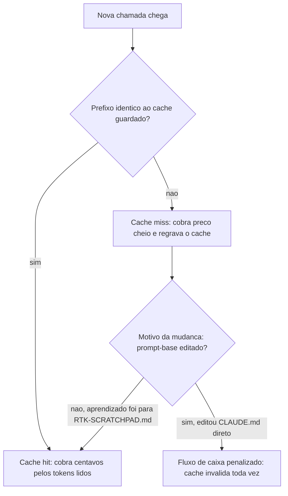

## 4. Técnica

A parte prática deste capítulo tem dois artefatos: primeiro, um jeito de medir cache hit real no seu próprio histórico de chamadas; segundo, uma configuração de roteador (LiteLLM) que decide, sozinho, quando vale a pena buscar uma resposta cacheada por similaridade em vez de chamar o provedor de novo.

### Medindo cache hit com um script simples

Antes de configurar qualquer coisa, você precisa saber se o seu fluxo atual já está desperdiçando cache. O script abaixo lê uma lista de prompts (simulando um log de chamadas) e conta quantos deles compartilham o mesmo prefixo byte a byte — é exatamente essa contagem que o provedor faz por trás da API.

```python
# medir_cache_hit.py
# Script simples, comentado passo a passo, para estimar a taxa de cache hit
# a partir de um log de prompts (cada item da lista simula uma chamada).

def prefixo_estavel(prompt: str, tamanho: int = 40) -> str:
    """Retorna os primeiros N caracteres do prompt.

    Na vida real, o 'prefixo estavel' e o system prompt (CLAUDE.md/AGENTS.md).
    Aqui simplificamos pegando o inicio do texto para fins didaticos.
    """
    return prompt[:tamanho]


def medir_taxa_cache_hit(log_de_chamadas: list) -> dict:
    """Conta quantas chamadas repetem o mesmo prefixo da chamada anterior.

    Retorna um dicionario com o total de chamadas, os hits (prefixo repetido)
    e a taxa de acerto em percentual.
    """
    total = len(log_de_chamadas)
    hits = 0
    prefixo_anterior = None

    for prompt in log_de_chamadas:
        prefixo_atual = prefixo_estavel(prompt)
        if prefixo_atual == prefixo_anterior:
            hits += 1
        prefixo_anterior = prefixo_atual

    taxa = (hits / total * 100) if total > 0 else 0.0
    return {"total_chamadas": total, "cache_hits": hits, "taxa_hit_percentual": round(taxa, 1)}


if __name__ == "__main__":
    # Cenario A: prompt-base fixo (RTK-Memory ativo) + pergunta variavel no final
    log_com_rtk_memory = [
        "SYSTEM: Voce e um assistente de codigo. PERGUNTA: como criar uma lista?",
        "SYSTEM: Voce e um assistente de codigo. PERGUNTA: como ler um arquivo?",
        "SYSTEM: Voce e um assistente de codigo. PERGUNTA: como somar dois numeros?",
    ]

    resultado = medir_taxa_cache_hit(log_com_rtk_memory)
    print("Cenario com RTK-Memory:", resultado)
```

Rodando esse script você vê a taxa de acerto do cenário em que o prefixo (o "SYSTEM:") permanece idêntico entre chamadas — exatamente o comportamento que o RTK-Memory preserva ao manter o `CLAUDE.md`/`AGENTS.md` intocado. Repare que essa é a mesma lógica que sustenta o desconto de até 90% em tokens lidos do cache que provedores como Anthropic e OpenAI oferecem quando o prefixo se mantém estável entre chamadas consecutivas [2] — o script apenas expõe, em miniatura, o que a API faz de verdade.

### Configurando o LiteLLM como router com cache semântico

Cache de prefixo exato resolve o caso "a mesma pergunta, com o mesmo início de prompt". Mas existe um segundo cenário: perguntas *parecidas*, não idênticas — "qual o preço do plano X?" e "quanto custa o plano X?" carregam a mesma intenção, mas não compartilham prefixo byte a byte. É aqui que entra o cache semântico, e o LiteLLM é o gateway que decide, por similaridade, se vale a pena reaproveitar uma resposta já dada.

A configuração abaixo sobe um proxy LiteLLM com dois provedores cadastrados e o cache semântico habilitado sobre Redis:

```yaml
# litellm-config.yaml
model_list:
  - model_name: modelo-padrao
    litellm_params:
      model: anthropic/claude-3-5-sonnet
      api_key: "os.environ/ANTHROPIC_API_KEY"
  - model_name: modelo-alternativo
    litellm_params:
      model: openai/gpt-4o-mini
      api_key: "os.environ/OPENAI_API_KEY"

litellm_settings:
  cache: true
  cache_params:
    type: redis
    host: "localhost"
    port: 6379
    similarity_threshold: 0.95   # so reaproveita resposta acima de 95% de similaridade
```

Subindo o gateway localmente:

```console
$ docker run -d -p 4000:4000 -v $(pwd)/litellm-config.yaml:/app/config.yaml ghcr.io/berriai/litellm:main-latest --config /app/config.yaml
$ curl http://localhost:4000/chat/completions -d '{"model": "modelo-padrao", "messages": [{"role": "user", "content": "qual o preco do plano X?"}]}'
```

Se uma pergunta com similaridade acima de 0.95 já tiver passado pelo gateway antes, a resposta cacheada volta em cerca de 2 ms, sem tocar o provedor de novo [3]. É um patamar de latência que nenhuma chamada de API real alcança, porque não existe rede nem inferência envolvida — só uma busca por vetor no Redis. O custo de manter essa camada rodando também é baixo: um cache semântico como esse opera com algo em torno de 70 MB de RAM em repouso [4], o que o torna viável mesmo em ambientes modestos.

A tabela abaixo resume quando cada tipo de cache se aplica:

| Situação | Tipo de cache | Ferramenta |
|---|---|---|
| Mesmo prefixo, byte a byte idêntico | Cache de prompt (exato) | Nativo do provedor + RTK-Memory |
| Pergunta parecida, texto diferente | Cache semântico (por similaridade) | LiteLLM + Redis |
| Prompt-base mudou (editou CLAUDE.md) | Nenhum cache se aplica — reprocessa tudo | — |

Vale registrar que sistemas de roteamento de custo, como o descrito no Two-Tier Cost Model de cache-aware prompt compression, tratam a decisão de cachear ou não como parte do próprio orçamento de inferência, não como um efeito colateral da infraestrutura [1]. É esse deslocamento de mentalidade — de "cache é uma configuração de DevOps" para "cache é uma linha do meu orçamento" — que separa quem só usa a ferramenta de quem a administra.

### Traduzindo taxa de cache hit em economia real

Medir a taxa de acerto, como fez o primeiro script, é só metade do trabalho de um Engenheiro de Custos com IA. A outra metade é traduzir esse número em reais na fatura — porque é esse número, e não a taxa percentual isolada, que justifica investir tempo de engenharia em manter o prefixo estável. O script abaixo pega a saída de `medir_taxa_cache_hit` e projeta a economia mensal, usando como parâmetro o desconto de até 90% documentado para tokens lidos do cache [2]:

```python
# estimar_economia_cache.py
# Projeta a economia mensal a partir da taxa de cache hit medida
# e do volume de chamadas do seu próprio fluxo.

def estimar_economia_mensal(
    taxa_hit_percentual: float,
    chamadas_por_dia: int,
    tokens_prefixo_medio: int,
    custo_por_1k_tokens: float,
    desconto_cache: float = 0.90,
) -> dict:
    """Estima quanto do custo de prefixo é evitado por mês graças ao cache.

    taxa_hit_percentual: saida de medir_taxa_cache_hit() (0 a 100)
    chamadas_por_dia: volume medio de chamadas do seu fluxo
    tokens_prefixo_medio: tamanho medio, em tokens, do prompt-base
    custo_por_1k_tokens: preco cheio por 1000 tokens processados
    desconto_cache: fracao do custo evitada em cada hit (0.90 = 90%)
    """
    chamadas_por_mes = chamadas_por_dia * 30
    chamadas_com_hit = chamadas_por_mes * (taxa_hit_percentual / 100)

    custo_cheio_por_chamada = (tokens_prefixo_medio / 1000) * custo_por_1k_tokens
    economia_por_hit = custo_cheio_por_chamada * desconto_cache
    economia_mensal_estimada = chamadas_com_hit * economia_por_hit

    return {
        "chamadas_por_mes": chamadas_por_mes,
        "chamadas_com_cache_hit": round(chamadas_com_hit),
        "economia_mensal_estimada": round(economia_mensal_estimada, 2),
    }


if __name__ == "__main__":
    # Exemplo: fluxo com 80% de cache hit (RTK-Memory ativo),
    # 500 chamadas/dia, prefixo de 2000 tokens, US$ 0,003 por 1k tokens
    resultado = estimar_economia_mensal(
        taxa_hit_percentual=80,
        chamadas_por_dia=500,
        tokens_prefixo_medio=2000,
        custo_por_1k_tokens=0.003,
    )
    print("Economia mensal estimada:", resultado)
```

O valor de saída não é uma cotação exata da sua próxima fatura — cada provedor arredonda e cobra de um jeito ligeiramente diferente — mas é preciso o suficiente para responder a pergunta que abre um orçamento de infraestrutura de IA: "vale a pena gastar duas horas de engenharia organizando o `RTK-SCRATCHPAD.md` direito?". Na prática, a resposta quase sempre é sim, porque a taxa de cache hit não é um número que só sobe com sorte — ela sobe com disciplina de onde cada informação é registrada, o exato hábito que a seção Aplica deste capítulo cobra de você.

## 5. Aplica

Você está no meio de uma sprint e percebe que o assistente de IA errou uma instrução repetidas vezes na mesma sessão. A correção parece óbvia: abrir o `CLAUDE.md`, adicionar duas linhas explicando a regra que faltava, salvar, seguir em frente. Você faz isso três vezes ao longo da tarde, sempre que um novo comportamento indesejado aparece.

No dia seguinte, ao revisar a fatura do provedor, o custo por chamada está visivelmente mais alto do que na semana anterior — mesmo com o mesmo volume de mensagens. O diagnóstico é o que a seção Explica já antecipou: cada edição no `CLAUDE.md` alterou o prefixo do prompt de sistema, e cada alteração invalidou o cache acumulado até ali. Você não estava só corrigindo comportamento — estava resetando o desconto a cada ajuste, pagando o preço cheio de novo e de novo pela mesma base de conhecimento.

A correção é simples de aplicar, mas exige o hábito certo: aprendizados pontuais de sessão vão para o `RTK-SCRATCHPAD.md` (ou arquivo equivalente), nunca direto no prompt-base. O `CLAUDE.md`/`AGENTS.md` só muda quando a regra é, de fato, permanente e vale o custo de reaquecer o cache do zero — uma decisão consciente, não um reflexo de correção rápida.

Armadilhas comuns que reforçam esse padrão:

- Tratar o prompt de sistema como bloco de notas de sessão em vez de contrato estável.
- Ignorar a janela de expiração do cache e espaçar demais as chamadas relacionadas.
- Configurar cache semântico com limiar de similaridade baixo demais, devolvendo respostas "quase certas" para perguntas que na verdade exigiam exatidão — cálculo financeiro e dado regulatório não toleram esse tipo de aproximação.

Há uma segunda cena de erro, mais sutil, que aparece quando você já superou a primeira armadilha e passa a operar mais de um agente. Você monta um pipeline com três agentes especializados — pesquisa, redação, revisão — cada um com seu próprio `CLAUDE.md` local, e comemora quando percebe que o cache hit individual de cada agente está alto. Duas semanas depois, o time decide padronizar um trecho de governança (um aviso de compliance, por exemplo) e você o copia manualmente para os três arquivos, um de cada vez, num intervalo de poucos minutos. Parece uma tarefa administrativa trivial.

O problema aparece na fatura da semana seguinte: os três agentes reprocessaram o prefixo inteiro na primeira chamada depois da edição, e como os três são chamados em sequência no mesmo pipeline, o efeito não foi um pico isolado — foi três picos concatenados, multiplicando o custo daquela rodada. O diagnóstico é o mesmo da seção Explica: cada `CLAUDE.md` é um prefixo independente, e editar três prefixos ao mesmo tempo invalida três caches ao mesmo tempo, não um só. A correção é tratar qualquer trecho de governança compartilhada entre agentes como um módulo único, versionado à parte e referenciado (não copiado) pelos `CLAUDE.md` individuais — assim uma atualização deliberada acontece uma vez, de forma auditável, em vez de três edições manuais espalhadas ao longo da tarde.

### Exercício
- [ ] Rode o `medir_cache_hit.py` com um log real de prompts do seu projeto (substitua o exemplo pelas suas últimas 10-20 chamadas)
- [ ] Identifique, no seu `CLAUDE.md`/`AGENTS.md` atual, qualquer trecho que parece "aprendizado de sessão" e mova para um `RTK-SCRATCHPAD.md`
- [ ] Suba o `litellm-config.yaml` localmente e confirme que o cache semântico responde em poucos milissegundos numa segunda chamada parecida
- [ ] Documente, no seu repositório, a regra "o que muda no prompt-base e o que vai para o scratchpad"
- [ ] Rode o `estimar_economia_cache.py` com os números reais do seu fluxo (volume diário de chamadas, tamanho médio do prefixo, custo por 1k tokens do seu provedor) e registre o valor projetado como meta de acompanhamento mensal
- [ ] Se você opera mais de um agente com prompt próprio, liste onde há trechos de governança duplicados entre eles e planeje extraí-los para um módulo único e referenciado

## 6. Conclusão

Cache de prompt cobra desconto por reaproveitar exatamente o que você já pagou para processar; RTK-Memory garante que esse prefixo permaneça estável mesmo quando você aprende algo novo na sessão; e o LiteLLM estende esse raciocínio para perguntas parecidas, não apenas idênticas, roteando entre provedores com cache semântico. Nenhuma dessas três peças exige reescrever sua lógica de prompt — exige apenas disciplina sobre onde cada tipo de informação vive.

Essa disciplina fica mais exigente, não menos, à medida que seu fluxo cresce: um agente solitário tolera algum descuido, mas um pipeline com vários agentes multiplica cada prefixo mal cuidado em um novo ponto de vazamento de fluxo de caixa. Por isso o hábito certo — scratchpad para o que é volátil, prompt-base para o que é permanente, módulo único para o que é compartilhado entre agentes — vale a pena ser formalizado antes que o pipeline cresça, não depois que a fatura já veio alta.

Cache resolve uma fatia real do problema de custo, mas não é a fatia inteira: ele economiza no que já foi processado, não no que ainda vai ser gerado pela primeira vez. No Capítulo 5, você sai do território de "não reprocessar o que já existe" para o de "empacotar melhor o que ainda precisa ser enviado" — com o Repomix, ferramenta que reorganiza o contexto de um projeto inteiro antes de ele chegar ao modelo.

## 7. Referências Bibliográficas

[1] SONG, Yangfan. *Cache-Aware Prompt Compression: A Two-Tier Cost Model for LLM API Caching*. 2026. Disponível em: https://www.semanticscholar.org/paper/aa8146c31d171edfe37f7d41fbc9655d2c554231. Acesso em: 25 ago. 2026.

[2] AUTOR. *Prompt Context Caching Architecture for Cost Reduction in Large Language Model Systems*. In: International Journal of Intelligent Systems and Applications in Engineering. 2026. Disponível em: https://doi.org/10.17762/ijisae.v14i1s.8385. Acesso em: 25 ago. 2026.

[3] JIN, Haoying; FENG, Haoyang. *Llm-Cache: an Efficient Context-Aware Semantic Caching Framework for Distributed Llm Inference Services*. In: 2026 IEEE 46th International Conference on Distributed Computing Systems Workshops (ICDCSW). 2026. Disponível em: https://doi.org/10.1109/icdcsw72724.2026.00031. Acesso em: 25 ago. 2026.

[4] MOHANDOSS, Ramaswami. *Context-based Semantic Caching for LLM Applications*. In: 2024 IEEE Conference on Artificial Intelligence (CAI). 2024. Disponível em: https://doi.org/10.1109/cai59869.2024.00075. Acesso em: 25 ago. 2026.

[5] YUAN, Jiayi et al. *KV Cache Compression, But What Must We Give in Return? A Comprehensive Benchmark of Long Context Capable Approaches*. In: arXiv. 2024. Disponível em: http://arxiv.org/abs/2407.01527v2. Acesso em: 25 ago. 2026.

[6] ALIZADEH, Keivan et al. *LLM in a flash: Efficient Large Language Model Inference with Limited Memory*. 2024. Disponível em: https://doi.org/10.18653/v1/2024.acl-long.678. Acesso em: 25 ago. 2026.

[7] STANISZEWSKI, Konrad; ŁAŃCUCKI, Adrian. *KV Cache Transform Coding for Compact Storage in LLM Inference*. In: arXiv. 2025. Disponível em: http://arxiv.org/abs/2511.01815v2. Acesso em: 25 ago. 2026.

[8] HAN, Jialong; WU, You; TU, Kewei. *S4R: Selective Sampling, Subspaces, and Sparse Reconstruction for Compressed Long-Context KV Caching*. In: arXiv. 2026. Disponível em: http://arxiv.org/abs/2608.00528v1. Acesso em: 25 ago. 2026.

[9] ZHAO, Wayne Xin et al. *A Survey of Large Language Models*. In: Frontiers of Computer Science. 2026. Disponível em: https://doi.org/10.1007/s11704-026-60308-3. Acesso em: 25 ago. 2026.

# Capítulo 5: Empacotamento de Contexto: Repomix

## 1. Introdução

No Capítulo 4, você aprendeu que reprocessar o mesmo prefixo do zero é dinheiro saindo do seu fluxo de caixa sem necessidade — e que o RTK-Memory resolve isso mantendo o prompt-base estável entre chamadas. Cache de prefixo estável, porém, só ajuda quando o que muda é a pergunta, não o material enviado. Este capítulo ataca o outro lado da equação: o que fazer quando o próprio contexto — os arquivos, o código, a documentação — muda de tamanho a cada chamada, porque você decide "na hora" o que incluir.

Se você já abriu um agente de IA e pensou "vou colar só estes três arquivos, deve bastar", você já pagou o preço desse capítulo antes de lê-lo. Às vezes bastava mesmo. Às vezes faltava um arquivo-chave, e a resposta saiu errada — não porque o modelo é ruim, mas porque a fatia de contexto que você escolheu não cobria o problema. Ao dominar o empacotamento estruturado de contexto, você deixa de apostar arquivo por arquivo e passa a trabalhar com um snapshot único, medido, versionado — a ferramenta central deste capítulo chama-se Repomix.

Este capítulo não trata apenas de "uma ferramenta a mais na caixa". Trata de mudar o ponto em que a decisão de custo é tomada: em vez de decidir, sob pressão, o que colar numa conversa, você decide uma vez — em configuração versionada — o que qualquer sessão futura vai enviar. É a diferença entre otimizar tokens *durante* o trabalho e otimizar a *forma como o trabalho é preparado* antes de começar. Como Engenheiro de Custos com IA, essa distinção é o que separa economia pontual de economia estrutural: a primeira se perde na próxima tarefa apressada, a segunda fica embutida no processo e se paga sozinha, sessão após sessão.

## 2. Explica

Todo Engenheiro de Custos com IA que já trabalhou com um projeto de mais de dez arquivos conhece o dilema: incluir contexto demais custa tokens sem necessariamente agregar sinal; incluir de menos custa uma resposta errada e uma nova chamada para corrigir o rumo. Esse segundo custo é traiçoeiro porque não aparece separado na fatura do provedor — ele se esconde dentro do total de tokens gastos, disfarçado de "mais uma pergunta de acompanhamento".

Repomix resolve esse dilema invertendo a lógica de decisão. Em vez de você escolher arquivo por arquivo a cada sessão, a ferramenta varre o repositório inteiro uma única vez, aplica um conjunto de regras de exclusão — o `.gitignore` do projeto somado às regras próprias do `.repomix.json` — e descarta automaticamente o que não carrega sinal útil para um modelo de linguagem: binários, lockfiles, assets de build, arquivos gerados. O que sobra é compactado em um único arquivo, tipicamente XML ou Markdown, com cabeçalhos que identificam cada arquivo original e numeração de linhas preservada [1].

Esse processo de decidir automaticamente "o que fica" versus "o que sai" não é exclusividade do Repomix — é uma versão prática do mesmo problema que pesquisas de compressão de prompt vêm formalizando: dado um orçamento de tokens, qual subconjunto do conteúdo original preserva o máximo de informação relevante para a tarefa? Trabalhos como o LLMLingua tratam esse recorte como um problema de otimização explícito, removendo tokens de baixa informação preservando a estrutura semântica do texto original [4]. O Repomix aplica a mesma lógica em um nível mais grosso — arquivos inteiros, não tokens individuais — mas o princípio de fundo é idêntico: cobertura máxima pelo menor custo possível.

Há ainda um ganho que não aparece na fatura, mas aparece no comportamento do modelo: pesquisas sobre uso eficiente de janelas longas de contexto mostram que modelos raciocinam melhor quando o contexto é denso e bem delimitado do que quando é longo e disperso [5]. Um snapshot compactado do Repomix não é só mais barato — tende a produzir respostas mais precisas, porque elimina o ruído que competiria por atenção do modelo junto com o sinal real.

Vale marcar onde termina o território do Repomix e começa o de outra ferramenta deste livro. O DSPy, que você vai encontrar mais à frente na coleção de ferramentas desta obra, ataca um problema vizinho mas diferente: ele comprime *instruções e few-shots* — o texto da própria pergunta e dos exemplos que a acompanham — recompilando-os automaticamente para a versão mais enxuta que ainda preserva acurácia. O Repomix não toca no texto da pergunta; ele decide *qual matéria-prima de código* entra na conversa antes da pergunta ser feita. São camadas diferentes do mesmo funil de custo: uma decide o que entra, a outra decide como o que já entrou é formulado. Tratá-las como concorrentes é um erro comum — na prática, um pipeline maduro de Engenharia de Custos usa as duas em sequência, snapshot primeiro, compilação de prompt depois.

Outro ponto que a explicação superficial do Repomix costuma pular: a ferramenta não exige que o repositório esteja clonado localmente. É possível apontar o comando direto para uma URL remota (`npx repomix --remote <url>`), o que muda o cálculo de custo em cenários de auditoria externa — revisar a arquitetura de um repositório de terceiros, ou de um fork que você nunca clonou, sem precisar baixar o projeto inteiro para o disco antes de decidir se vale a pena investigar mais [1]. Essa flexibilidade importa porque o custo de *preparar* o contexto também tem um componente de tempo, não só de tokens — e um comando que varre remotamente elimina uma etapa manual inteira do fluxo.

Vale registrar também o lado em que a exclusão automática pode errar. Um filtro de `.gitignore` bem construído descarta artefato de build com segurança — mas nada impede que um arquivo genuinamente relevante caia na mesma regra por engano, como uma pasta `generated/` que na verdade guarda schemas de API escritos à mão, não gerados por ferramenta nenhuma. O Repomix não adivinha a intenção por trás do nome de uma pasta; ele aplica a regra que você escreveu. Isso não é uma falha da ferramenta — é a razão pela qual o `.repomix.json` precisa ser revisado por alguém que conhece o projeto, não herdado de um template genérico e esquecido. Como Engenheiro de Custos com IA, sua responsabilidade não termina ao rodar o comando; termina quando você confirma que o snapshot gerado reflete a intenção real do escopo, não apenas a intenção mecânica do filtro.

## 3. Ilustra

Pense num projeto de médio porte: 340 arquivos, sendo boa parte deles `node_modules`, imagens de teste, arquivos de lock e configurações de CI que nunca importam para uma pergunta sobre lógica de negócio. Ler manualmente "os arquivos relevantes" para essa pergunta, um agente ou uma pessoa provavelmente escolheria entre 15 e 20 arquivos — um chute educado, mas ainda um chute. Rodar o Repomix sobre o mesmo repositório produz um único arquivo de saída de cerca de 45 mil tokens, cobrindo *todo* o código-fonte relevante, com os binários, os testes de fixture e o `node_modules` já descartados pelo filtro. A economia declarada da ferramenta gira em torno de 70% de redução de tokens por prompt frente ao hábito de colar múltiplos arquivos manualmente [1] — e a cobertura, ao contrário da escolha manual, não depende de quem lembrou de incluir o quê.

Para entender por que esse resultado não é mágica, vale usar duas imagens complementares — porque o mecanismo por trás do Repomix tem uma camada mecânica (o que ele descarta) e uma camada de intenção (por que descarta daquele jeito), e nenhuma das duas sozinha explica o resultado inteiro.

A primeira imagem: pense no Repomix como a lista de embarque de uma mala de viagem. Você não joga o guarda-roupa inteiro dentro da mala na esperança de que "vai que precisa" — decide, antes de fechar o zíper, o que cobre os dias de viagem e descarta o resto sem pena. O `.repomix.json` é essa lista de embarque escrita uma vez, revisada quando o destino muda, não reinventada a cada viagem.

A segunda imagem, mais próxima do vocabulário de quem administra custo: pense no snapshot do Repomix como o sumário executivo de uma empresa antes de uma reunião de investidores. Ninguém entrega o arquivo morto da empresa inteira para o investidor decidir — entrega um documento único, denso, que representa o que importa para aquela decisão específica. O sumário executivo não é uma versão incompleta da empresa; é a representação mínima suficiente para decisão informada. É exatamente esse o papel do arquivo único que sai do Repomix: não é "menos projeto", é o projeto reorganizado para a pergunta que o modelo vai responder.

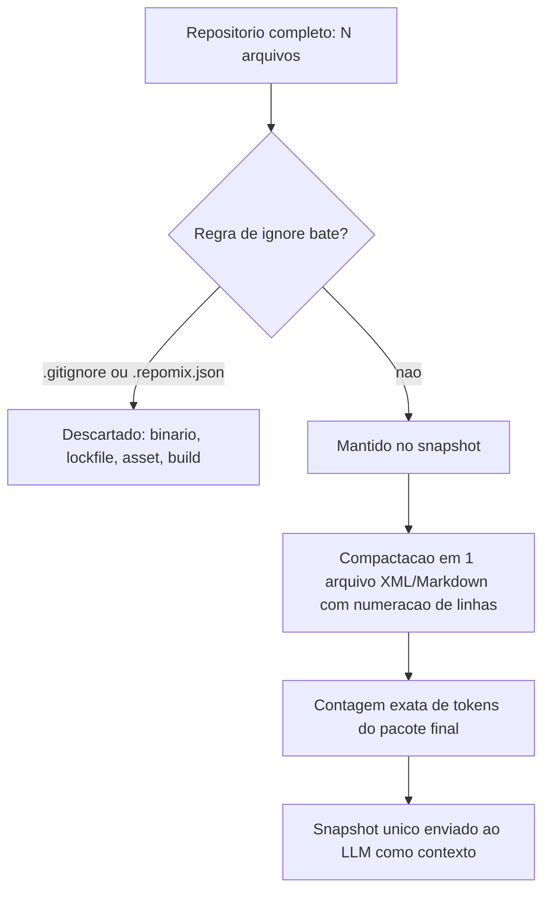

A tabela abaixo resume o antes e depois do exemplo de 340 arquivos:

| Métrica | Escolha manual | Snapshot Repomix |
|---|---|---|
| Arquivos avaliados | ~15-20 (chute educado) | 340 (varredura completa) |
| Cobertura garantida | Depende de quem escolheu | Determinística (regras versionadas) |
| Tokens enviados | Variável, sem contagem prévia | ~45 mil, contados antes do envio |
| Reprodutibilidade entre sessões | Baixa (memória do agente) | Alta (config versionada) |

Um detalhe que a tabela sozinha não mostra: os "~45 mil" tokens do snapshot não são uma estimativa por heurística de caracteres — o Repomix conta os tokens de fato, com o tokenizador do modelo-alvo, e mostra esse número antes de você decidir enviar o pacote para a API [1]. Essa diferença parece pequena, mas muda o tipo de decisão que você consegue tomar: uma estimativa aproximada serve para ter uma noção de ordem de grandeza; uma contagem exata serve para comparar contra um orçamento de tokens definido em contrato ou em budget mensal, sem margem de erro escondida entre "achei que cabia" e "realmente coube". É a mesma disciplina de medição exata que a calculadora de custo do Capítulo 1 exige — aqui aplicada no momento em que o contexto é montado, não só depois que a fatura chega.

O exemplo dos 340 arquivos também esconde uma pergunta que só aparece quando o projeto cresce mais ainda: o que acontece num monorepo com múltiplos serviços independentes, cada um com sua própria árvore de dependências? Rodar o Repomix sobre o monorepo inteiro sem escopo produziria um snapshot correto, mas desperdiçado — a pergunta sobre o serviço de pagamentos não precisa do código do serviço de notificações por e-mail, mesmo que ambos vivam no mesmo repositório Git. A resposta prática é a mesma lição da lista de embarque: o `.repomix.json` não precisa ser um arquivo único para o monorepo inteiro. Times maduros mantêm um `.repomix.json` por serviço, cada um com seu próprio padrão de `include`, e escolhem qual configuração rodar de acordo com qual parte do sistema a pergunta atual realmente toca. A ferramenta escala com a granularidade da pergunta — não obriga você a escolher entre "tudo" ou "nada".

## 4. Técnica

A parte prática deste capítulo tem dois artefatos: primeiro, uma configuração `.repomix.json` que declara as regras de inclusão/exclusão do seu projeto; segundo, um script que mede o ganho real — em bytes e em tokens estimados — entre "enviar arquivos soltos" e "enviar o snapshot compactado".

### Instalando e rodando o Repomix

Repomix roda via `npx`, sem exigir instalação global — o que reduz a fricção de testar antes de decidir adotar:

```console
$ npx repomix --style xml --output-show-line-numbers
$ cat repomix-output.xml | wc -c
```

O primeiro comando varre o diretório atual e gera `repomix-output.xml`; o segundo mostra o tamanho em bytes do pacote final, o número que você vai comparar com o total de bytes do projeto original.

### Configurando regras próprias com `.repomix.json`

Repomix já filtra pelo `.gitignore`, mas projetos reais quase sempre precisam de regras adicionais — documentação gerada, arquivos de fixture de teste, diretórios de build específicos:

```json
{
  "output": {
    "filePath": "repomix-output.xml",
    "style": "xml",
    "showLineNumbers": true
  },
  "include": [
    "src/**/*.py",
    "src/**/*.ts",
    "docs/**/*.md"
  ],
  "ignore": {
    "useGitignore": true,
    "customPatterns": [
      "**/*.test.fixture.*",
      "**/dist/**",
      "**/*.generated.*",
      "**/CHANGELOG.md"
    ]
  }
}
```

Versionar esse arquivo no repositório transforma a decisão de "o que entra no contexto" em configuração auditável — qualquer pessoa do time vê exatamente o que está incluído, em vez de depender da memória de quem rodou o agente da última vez.

### Medindo o ganho real: bytes e tokens estimados

O script abaixo compara o tamanho do snapshot compactado com a soma dos arquivos originais, estimando também a redução aproximada de tokens (usando a heurística comum de ~4 caracteres por token):

```python
# medir_ganho_repomix.py
# Compara o tamanho do snapshot compactado com a soma dos arquivos originais.
import os

CARACTERES_POR_TOKEN = 4  # heuristica aproximada para estimativa rapida


def tamanho_total_diretorio(caminho: str, extensoes: tuple) -> int:
    """Soma o tamanho em bytes de todos os arquivos com as extensoes dadas."""
    total = 0
    for raiz, _dirs, arquivos in os.walk(caminho):
        for nome in arquivos:
            if nome.endswith(extensoes):
                caminho_completo = os.path.join(raiz, nome)
                total += os.path.getsize(caminho_completo)
    return total


def estimar_tokens(bytes_totais: int) -> int:
    """Estimativa grosseira de tokens a partir do tamanho em bytes."""
    return bytes_totais // CARACTERES_POR_TOKEN


def comparar_ganho(caminho_projeto: str, caminho_snapshot: str) -> dict:
    """Retorna bytes/tokens do projeto original vs. do snapshot compactado."""
    bytes_original = tamanho_total_diretorio(caminho_projeto, (".py", ".ts", ".md"))
    bytes_snapshot = os.path.getsize(caminho_snapshot)

    return {
        "bytes_original": bytes_original,
        "bytes_snapshot": bytes_snapshot,
        "tokens_estimados_original": estimar_tokens(bytes_original),
        "tokens_estimados_snapshot": estimar_tokens(bytes_snapshot),
        "reducao_percentual": round((1 - bytes_snapshot / bytes_original) * 100, 1)
        if bytes_original > 0
        else 0.0,
    }


if __name__ == "__main__":
    import argparse
    import sys

    parser = argparse.ArgumentParser(description="Mede o ganho de empacotamento do Repomix.")
    parser.add_argument("--limite-tokens", type=int, default=None,
                         help="Orcamento maximo de tokens estimados no snapshot.")
    parser.add_argument("--falhar-se-exceder", action="store_true",
                         help="Encerra com codigo de erro se o limite for ultrapassado.")
    args = parser.parse_args()

    resultado = comparar_ganho("./src", "./repomix-output.xml")
    print("Comparativo de empacotamento:", resultado)

    if args.limite_tokens is not None:
        tokens_snapshot = resultado["tokens_estimados_snapshot"]
        if tokens_snapshot > args.limite_tokens:
            print(f"ORCAMENTO EXCEDIDO: {tokens_snapshot} > {args.limite_tokens} tokens estimados")
            if args.falhar_se_exceder:
                sys.exit(1)
        else:
            print(f"Dentro do orcamento: {tokens_snapshot} <= {args.limite_tokens} tokens estimados")
```

Rodar esse script logo depois de gerar o snapshot dá um número concreto para colocar ao lado da calculadora de custo do Capítulo 1: não é "o Repomix ajuda", é "o Repomix reduziu X% do tokens estimados neste projeto específico" [1]. Esse tipo de medição empírica, feita projeto a projeto, é o que separa uma decisão de engenharia de uma impressão vaga de que "parece mais rápido agora" — e reflete a mesma disciplina que a literatura de compressão de prompt recomenda: medir ganho e perda de informação antes de declarar sucesso [6].

### Travando o orçamento de tokens em CI

Medir uma vez, manualmente, resolve o problema no dia em que você mediu. Mas o código muda: um módulo cresce, alguém importa uma biblioteca nova, a documentação gerada automaticamente incha o diretório `docs/`. Sem uma trava automatizada, o snapshot do Repomix cresce silenciosamente até que, meses depois, o "pacote enxuto" já não é mais tão enxuto — e ninguém percebeu porque a medição nunca foi repetida. A prática que fecha esse ciclo é transformar o script de medição num gate de CI que falha o build quando o snapshot ultrapassa um orçamento definido:

```yaml
# .github/workflows/orcamento-contexto.yml
name: Orcamento de Contexto (Repomix)
on: [pull_request]

jobs:
  medir-snapshot:
    runs-on: ubuntu-latest
    steps:
      - uses: actions/checkout@v4
      - name: Gerar snapshot Repomix
        run: npx repomix --style xml --output-show-line-numbers
      - name: Validar orcamento de tokens
        run: |
          python medir_ganho_repomix.py --limite-tokens 60000 --falhar-se-exceder
```

O parâmetro `--limite-tokens` não é arbitrário: ele deve nascer da calculadora de custo do Capítulo 1, calibrado para o orçamento mensal real do time, não para um número redondo escolhido de improviso. Quando o gate falha, a mensagem de erro aponta para o `.repomix.json` — sinal de que chegou a hora de revisar as regras de `customPatterns`, não de aumentar o limite sem pensar. Esse é o mecanismo que resolve a terceira armadilha listada na seção Aplica a seguir: tratar o snapshot como algo gerado uma vez e esquecido.

## 5. Aplica

Você está no meio de uma tarefa urgente: o agente precisa entender uma função que quebra em produção, e ela depende de três módulos espalhados pelo projeto. Sem pensar muito, você abre os três arquivos que lembra que existem, cola o conteúdo na conversa e pede o diagnóstico. O agente responde com confiança — e erra, porque a função na verdade importa um quarto módulo, que você esqueceu de incluir porque não apareceu na sua busca mental rápida.

O diagnóstico do erro não é "o modelo é ruim": é que a escolha manual de contexto depende da sua memória do projeto no momento exato da pergunta, e memória humana sob pressão de prazo erra fatias inteiras do problema. Você pagou tokens pela resposta errada e vai pagar de novo pela correção — o dobro do custo pela metade da cobertura.

A prática correta inverte a ordem: antes de formular a pergunta ao agente, você roda o Repomix sobre o diretório do módulo (não o projeto inteiro, quando o escopo é conhecido), com um `.repomix.json` que já inclui os padrões de import mais comuns daquele domínio. O snapshot resultante cobre a função quebrada e suas dependências diretas, sem depender de você lembrar de cada uma na hora. A pergunta ao agente vem depois, sobre um contexto que você sabe — porque mediu — que é completo o suficiente para a tarefa.

Há um segundo cenário, menos urgente mas igualmente comum, em que o mesmo erro de escolha manual aparece disfarçado de outra forma: você acabou de entrar num time novo e recebeu acesso a um repositório com sete anos de histórico, três reescritas parciais e nenhuma documentação atualizada. Seu instinto é pedir ao agente "explique a arquitetura deste projeto" e colar os arquivos que *parecem* centrais — o `main.py`, o `README.md`, talvez o arquivo de configuração mais recente. O agente entrega uma explicação plausível, coerente, bem escrita — e sutilmente errada, porque a lógica de negócio real vive num módulo antigo que ninguém mais toca, mas que ainda é importado por metade do sistema, e você não tinha como saber que ele existia.

Esse erro é mais caro que o do primeiro cenário porque ele não avisa que errou. Um diagnóstico de bug errado geralmente quebra de novo em produção e você percebe rápido; uma explicação de arquitetura errada vira a base mental com a qual você vai tomar decisões nas próximas semanas, e o erro só aparece quando já custou tempo de várias pessoas. A prática correta, de novo, inverte a ordem: rodar o Repomix sobre o repositório inteiro *antes* de formular qualquer pergunta sobre arquitetura, pedir ao agente que resuma a partir do snapshot completo — não de uma seleção prévia sua — e só então refinar com perguntas específicas sobre módulos que o próprio resumo apontar como centrais. A cobertura determinística do snapshot substitui o palpite de "o que parece importante" por uma varredura que não depende de você já conhecer o projeto — que é justamente o problema que te trouxe até ali.

Armadilhas comuns que vale evitar:

- Rodar o Repomix sobre o repositório inteiro quando o escopo real é um módulo — você paga por cobertura que não usa.
- Deixar o `.repomix.json` desatualizado depois que a estrutura de pastas do projeto muda, gerando snapshots que ainda incluem diretórios já removidos.
- Tratar o snapshot como estático depois de gerado uma vez — código muda, e um snapshot velho é tão perigoso quanto nenhum snapshot, porque passa confiança falsa de cobertura atual.
- Pular o gate de orçamento em CI por parecer burocracia — é exatamente essa checagem que pega o snapshot inchado antes que ele vire hábito caro em toda sessão do time.

### Exercício
- [ ] Instale o Repomix com `npx repomix --style xml --output-show-line-numbers` no seu projeto atual
- [ ] Escreva um `.repomix.json` com pelo menos 3 regras de `customPatterns` específicas do seu projeto
- [ ] Rode `medir_ganho_repomix.py` e registre a redução percentual real obtida
- [ ] Versione o `.repomix.json` no repositório e documente, em uma linha, quando ele deve ser revisado
- [ ] Configure o gate de CI de orçamento de tokens (seção Técnica) com um limite calibrado pela calculadora de custo do Capítulo 1, não por um número redondo escolhido de improviso

## 6. Conclusão

O Repomix não inventa uma técnica de compressão nova — ele aplica, em nível de arquivo, o mesmo princípio que sustenta toda compressão de prompt: dado um orçamento de tokens, maximizar cobertura e minimizar ruído. A diferença prática é que ele faz isso de forma determinística e versionável, tirando de você a responsabilidade de lembrar, sessão após sessão, quais arquivos importam. Como Engenheiro de Custos com IA, esse é o tipo de automação que paga por si mesma na primeira tarefa que não precisa de retrabalho.

Note o padrão que se repete nos dois cenários da seção anterior: o custo real nunca aparece na primeira chamada — aparece na segunda, na correção, na decisão tomada sobre uma base incompleta que ninguém percebeu como incompleta. Empacotar contexto de forma determinística não elimina esse risco por completo, mas o reduz de "depende da sua memória hoje" para "depende de uma configuração que o time revisa e versiona" — e essa mudança de categoria, de decisão implícita para decisão auditável, é o fio condutor que vai reaparecer em quase toda ferramenta discutida no restante desta obra.

Empacotar melhor o que ainda precisa ser enviado resolve metade do problema de contexto — a outra metade é o que já está dentro do código: duplicação, padrões repetidos, funções que fazem a mesma coisa de jeitos diferentes. No Capítulo 6, você usa o ast-grep para encontrar essa duplicação estruturalmente, sem depender de grep textual, reduzindo o próprio tamanho do código antes mesmo dele virar contexto para qualquer chamada.

## 7. Referências Bibliográficas

[1] REPOMIX. *Repomix: Pack your codebase into AI-friendly formats*. Disponível em: https://github.com/yamadashy/repomix. Acesso em: 25 ago. 2026.

[2] FAN, Wenqi et al. *A Survey on RAG Meeting LLMs: Towards Retrieval-Augmented Large Language Models*. 2024. Disponível em: https://doi.org/10.1145/3637528.3671470. Acesso em: 25 ago. 2026.

[3] JIANG, Huiqiang et al. *LongLLMLingua: Accelerating and Enhancing LLMs in Long Context Scenarios via Prompt Compression*. 2024. Disponível em: https://doi.org/10.18653/v1/2024.acl-long.91. Acesso em: 25 ago. 2026.

[4] JIANG, Huiqiang et al. *LLMLingua: Compressing Prompts for Accelerated Inference of Large Language Models*. 2023. Disponível em: https://doi.org/10.18653/v1/2023.emnlp-main.825. Acesso em: 25 ago. 2026.

[5] HAN, Tingxu et al. *Token-Budget-Aware LLM Reasoning*. 2025. Disponível em: https://doi.org/10.18653/v1/2025.findings-acl.1274. Acesso em: 25 ago. 2026.

[6] PAN, Zhuoshi et al. *LLMLingua-2: Data Distillation for Efficient and Faithful Task-Agnostic Prompt Compression*. In: Annual Meeting of the Association for Computational Linguistics. 2024. Disponível em: https://www.semanticscholar.org/paper/3d45fc603e34934fc589b9547307815f7723de34. Acesso em: 25 ago. 2026.

[7] NAVEED, Humza et al. *A Comprehensive Overview of Large Language Models*. In: arXiv (Cornell University). 2023. Disponível em: http://arxiv.org/abs/2307.06435. Acesso em: 25 ago. 2026.

[8] ZHAO, Wayne Xin et al. *A Survey of Large Language Models*. In: Frontiers of Computer Science. 2026. Disponível em: https://doi.org/10.1007/s11704-026-60308-3. Acesso em: 25 ago. 2026.

# Capítulo 6: Refatoração Estrutural com AST: ast-grep

## 1. Introdução

No Capítulo 5, você aprendeu a empacotar melhor o que ainda precisa ser enviado ao modelo — o Repomix transforma um projeto inteiro num snapshot enxuto, cortando o que sobra antes de o contexto sair do seu computador. Este capítulo dá um passo para trás na esteira: e se, antes de empacotar, você reduzisse o próprio código-fonte que vai ser empacotado? Menos duplicação, menos função morta, menos ruído estrutural significam um snapshot menor mesmo antes de qualquer regra de ignore entrar em ação.

É aqui que entra o ast-grep. Como Engenheiro de Custos com IA, você já sabe que grep encontra texto — mas texto muda de forma o tempo todo (indentação, quebra de linha, nome de variável) sem que o significado do código mude nada. Ao dominar a busca estrutural baseada em Árvore de Sintaxe Abstrata (AST), você deixa de gastar tokens de LLM em tarefas puramente mecânicas — renomear uma função em 40 arquivos, por exemplo — e passa a resolvê-las com uma regra determinística que roda em milissegundos, sem depender de nenhum modelo.

Essa fronteira entre o que é mecânico e o que exige julgamento vale a pena marcar já na abertura do capítulo: nem toda tarefa sobre código é uma tarefa de raciocínio, e confundir as duas é exatamente onde a fatura de tokens de um time infla sem necessidade. O capítulo caminha em três camadas — provar a diferença entre busca textual e estrutural, escrever a primeira regra de reescrita e transformar essa regra num gate automático de qualidade — cada uma construindo sobre a anterior.

## 2. Explica

Todo modelo de linguagem cobra pelo volume de texto que processa como entrada — cada trecho de código colado num prompt vira uma sequência de tokens, e o preço da chamada escala com esse volume [1]. Quanto maior a janela de contexto sustentada numa chamada, maior tende a ser esse custo, o que empurra qualquer sistema de LLM em produção a tratar volume de entrada como algo a orçar, não como algo ilimitado [5]. Isso significa que qualquer redução no tamanho ou na duplicação do código-fonte, feita antes de ele chegar ao modelo, já é economia acumulada — mesmo sem tocar em nenhuma configuração de cache ou de compressão de prompt.

O grep e as expressões regulares (regex) resolvem parte do problema de localizar código, mas fazem isso comparando **texto**: sequências de caracteres, byte a byte. Se a mesma chamada de função aparecer formatada em uma linha num arquivo e quebrada em três linhas noutro, um padrão regex escrito para o primeiro formato simplesmente não reconhece o segundo — não porque o código seja diferente, mas porque o *texto* é diferente.

O ast-grep resolve isso operando em outra camada. Em vez de comparar caracteres, ele primeiro faz o **parsing** do código-fonte — usando o motor Tree-sitter, escrito em Rust — transformando o arquivo inteiro numa Árvore de Sintaxe Abstrata: uma estrutura de nós onde cada nó representa uma construção da linguagem (uma chamada de função, um parâmetro, um bloco condicional), independente de como esse trecho foi formatado no arquivo original. A busca então compara **nós da árvore**, não linhas de texto — e é exatamente por isso que reformatação, indentação e quebra de linha deixam de ser um problema [2].

A ferramenta também suporta *wildcards* estruturais — como `$URL` para casar um único argumento ou `$$$ARGS` para casar qualquer quantidade de argumentos dentro do mesmo nó — o que permite escrever uma única regra que cobre variações de uma mesma chamada de função sem enumerar cada caso manualmente. Esse mesmo princípio de tratar volume de entrada como algo a ser reduzido antes do processamento é o que sustenta abordagens de compressão de prompt de ponta a ponta: comprimir o que será enviado ao modelo, sem perder a informação que importa, acelera a inferência e reduz custo mesmo em cenários de contexto longo [6]. A lógica é a mesma quando o alvo é raciocínio em vez de contexto: orçar explicitamente quantos tokens uma tarefa pode consumir, em vez de deixar o modelo gastar o quanto "achar necessário", já reduz custo por chamada sem perder qualidade de resposta [4] — e uma regra estrutural que resolve uma refatoração em milissegundos leva esse orçamento ao limite: zero tokens de modelo gastos na tarefa.

Vale demarcar, ainda nesta seção, o que o ast-grep **não** faz — para não elevar a expectativa além da entrega real da ferramenta. Ele reconhece estrutura sintática, não significado. Duas funções que fazem exatamente a mesma coisa, mas com estrutura de código diferente — uma usa um laço `for` explícito, a outra resolve o mesmo resultado com uma list comprehension — são invisíveis uma para a outra sob a ótica da árvore, porque geram nós diferentes mesmo produzindo o mesmo efeito em tempo de execução. Essa fronteira entre "mesma estrutura" e "mesma intenção" volta a aparecer na seção Aplica, no ponto exato em que a ferramenta encontra seu limite de escala.

## 3. Ilustra

Pense no grep como um auditor júnior de despesas: ele só reconhece um lançamento como "reembolso de viagem" se o formato da nota bater exatamente com o que ele decorou — mesma fonte, mesma ordem de campos, mesma casa decimal. Mude uma vírgula de lugar e o auditor júnior deixa passar o lançamento sem sinalizar nada, mesmo que a despesa seja idêntica em substância.

O ast-grep é o auditor sênior. Ele não decorou o formato da nota — ele entende a **estrutura contábil** por trás dela: categoria, cliente, valor. Não importa se a nota veio em PDF, em papel escaneado ou com os campos em outra ordem; se a estrutura é a de um reembolso de viagem, o auditor sênior reconhece e sinaliza. É essa mesma independência de formatação que faz o ast-grep encontrar `api.get(url)` seja essa chamada escrita em uma linha ou quebrada em três.

Há um segundo ponto, mais denso, que separa esse auditor sênior de um simples "auditor que entende formatos variados": ele também reconhece lançamentos com **quantidade variável de itens** sem precisar de uma regra para cada quantidade. Imagine uma auditoria de despesas de viagem que precisa flagar todo lançamento da categoria "viagem a trabalho", não importa se ele contém dois itens (passagem e hotel) ou seis (passagem, hotel, táxi, refeição, estacionamento, seguro). A regra não lista cada combinação possível — ela reconhece o formato do lançamento (categoria + qualquer número de itens dentro) e sinaliza todos. É exatamente isso que o wildcard estrutural `$$$ARGS` faz dentro da árvore: casa qualquer quantidade de argumentos no mesmo nó, sem que você precise escrever uma regra por quantidade de parâmetros.

O auditor sênior, além disso, não trabalha só com notas escritas num único idioma: o mesmo raciocínio estrutural se aplica a qualquer "idioma" de código, contanto que exista um dicionário — no caso do ast-grep, uma gramática Tree-sitter — que descreva a estrutura daquela linguagem. É por isso que a mesma ferramenta cobre Python, JavaScript, Go, Rust e dezenas de outras linguagens sem trocar de motor de busca: muda a gramática consultada, não o princípio de comparar nós em vez de caracteres [2].

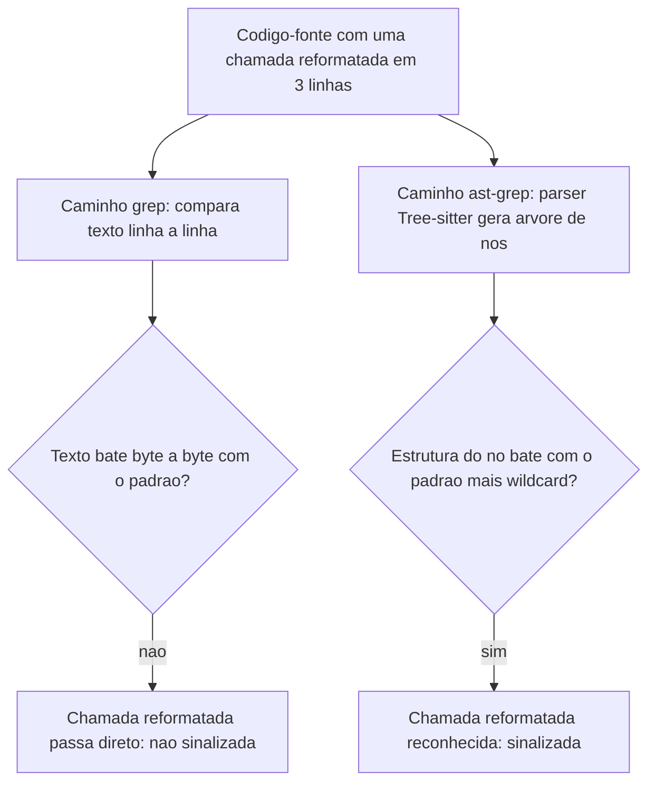

## 4. Técnica

A parte prática deste capítulo segue a progressão dos três pilares: primeiro você vê a diferença entre busca textual e estrutural rodando de verdade; depois escreve uma regra de reescrita e aplica em lote; por fim, transforma essa regra num gate automático de CI.

### Provando a diferença entre grep e AST na prática

Antes de instalar qualquer ferramenta nova, vale enxergar o problema com o que você já tem: o próprio módulo `ast` da biblioteca padrão do Python. O script abaixo compara duas formas de contar chamadas `api.get(url)` no mesmo trecho de código — uma via regex (texto) e outra via árvore de sintaxe (estrutura) — para deixar concreto o que a seção Explica descreveu.

```python
# comparar_grep_vs_ast.py
# Demonstracao didatica: contar chamadas "api.get(url)" via regex (texto)
# versus via arvore de sintaxe (estrutura), no mesmo trecho de codigo Python.

import ast
import re

codigo_fonte = """
resultado = api.get(url)
outro = api.get(
    url,
)
"""


def contar_via_regex(codigo: str) -> int:
    """Conta ocorrencias comparando texto, byte a byte, contra um padrao fixo."""
    padrao = re.compile(r"api\\.get\\(url\\)")
    return len(padrao.findall(codigo))


def contar_via_ast(codigo: str) -> int:
    """Conta ocorrencias comparando a estrutura da arvore de sintaxe.

    Encontra qualquer chamada no formato api.get(...), nao importa
    como ela foi formatada no arquivo original.
    """
    arvore = ast.parse(codigo)
    total = 0
    for no in ast.walk(arvore):
        if isinstance(no, ast.Call) and isinstance(no.func, ast.Attribute):
            se_e_api = isinstance(no.func.value, ast.Name) and no.func.value.id == "api"
            if se_e_api and no.func.attr == "get":
                total += 1
    return total


if __name__ == "__main__":
    print("Via regex (texto):", contar_via_regex(codigo_fonte))
    print("Via AST (estrutura):", contar_via_ast(codigo_fonte))
```

Rodar esse script mostra a regex encontrando só 1 ocorrência (a chamada em uma linha) enquanto a contagem via AST encontra as 2 — a chamada reformatada em três linhas não escapa, porque a árvore de sintaxe não enxerga quebra de linha, só a estrutura `Call(func=Attribute(value=Name(api), attr=get))`. O ast-grep faz exatamente esse mesmo tipo de comparação estrutural, só que via Tree-sitter e para dezenas de linguagens além de Python, em microssegundos por arquivo [2].

### Investigação pontual sem escrever regra alguma

Nem toda consulta estrutural precisa virar um arquivo YAML antes de valer a pena. Para uma pergunta única — "essa chamada antiga ainda existe em algum lugar do repositório?" — o ast-grep aceita o padrão direto na linha de comando, em modo de leitura, sem regra e sem `fix`:

```console
$ sg run -p 'api.get($URL)' --lang js
src/pedidos.js:12: resultado = api.get(url)
src/relatorios.js:47: dados = api.get(endpointRelatorio)
2 correspondencias em 2 arquivos, 8 ms
```

Esse modo de uso pontual sustenta a mesma disciplina descrita pela skill lean-ctx neste compêndio: antes de colar um arquivo de 1.500 linhas inteiro num prompt, localizar primeiro o trecho exato via busca estrutural e ler só a fatia relevante — 25 linhas em vez de 1.500. A diferença entre `sg run` e `sg scan` é a diferença entre investigar (leitura, nada é tocado) e agir (`--update-all`, reescreve de fato) — e vale sempre passar pela primeira antes da segunda, mesmo quando a regra parece óbvia à primeira vista.

### Reescrevendo em lote: da regra YAML ao repositório inteiro

Com o princípio provado, o próximo passo é instalar o ast-grep de verdade e escrever a primeira regra de reescrita — trocando um script Python didático por uma ferramenta que já resolve o "reduzir volume antes do processamento" de ponta a ponta, para qualquer linguagem [3]. A instalação é um binário único, sem runtime pesado por trás:

```console
$ npm install -g @ast-grep/cli
$ sg --version
0.30.0
```

Uma regra do ast-grep vive num arquivo YAML dentro de uma pasta de regras, referenciada pelo arquivo de configuração do projeto:

```yaml
# sgconfig.yml
ruleDirs:
  - regras
```

```yaml
# regras/regra-rename.yml
id: renomear-chamada-api-antiga
language: JavaScript
rule:
  pattern: "api.get($URL)"
fix: "api.fetch({ url: $URL })"
```

Cada campo do arquivo tem um papel específico, e vale entender os quatro antes de escrever a sua primeira regra:

- `id`: um nome único para a regra, usado nos logs e nos relatórios do CI.
- `language`: a linguagem-alvo do parsing — o ast-grep usa um parser Tree-sitter diferente por linguagem, o que é o que permite a mesma ferramenta cobrir dezenas de linguagens de programação sem trocar de motor [2].
- `rule.pattern`: o padrão estrutural a casar, com `$URL` funcionando como wildcard de um único argumento.
- `fix`: como reescrever o nó encontrado, preservando o valor capturado pelo wildcard.

Rodando a regra contra o repositório inteiro:

```console
$ sg scan -r regras/regra-rename.yml --update-all
2 arquivos atualizados em 2 ms
```

Antes de confiar num `--update-all` direto num repositório grande, existe um meio-termo entre só investigar e reescrever tudo de uma vez: a flag `--interactive` (`-i`) apresenta cada correspondência encontrada e pergunta se aplica ou pula aquele caso específico, um por um. É a versão de linha de comando de revisar o diff antes do commit — útil quando a regra é nova e você ainda não tem certeza de que ela não vai casar com um caso que parece estruturalmente igual, mas semanticamente diferente.

Conferindo o que mudou num dos arquivos afetados, o diff mostra exatamente a reescrita estrutural aplicada, sem tocar em mais nada ao redor:

```console
$ git diff src/pedidos.js
- resultado = api.get(url)
+ resultado = api.fetch({ url: url })
```

Essa é a diferença de fluxo de caixa que este capítulo defende: uma mudança de assinatura de função que levaria horas de edição manual, arquivo por arquivo — ou minutos de conversa com um LLM, gastando tokens numa tarefa sem nenhuma ambiguidade — é resolvida em cerca de 2 ms para 50 arquivos, sem custo de API algum, porque o motor de busca e reescrita é um binário Rust local, com licença MIT, ocupando menos de 10 MB de RAM em execução [1]. É o mesmo tipo de ganho que aparece quando um sistema de inferência é desenhado para operar sob restrição de memória em vez de assumir recursos ilimitados: manter o desempenho essencial com uma fração do consumo de recursos de uma abordagem ingênua [7].

### Colocando um auditor automático no CI

O terceiro pilar transforma a mesma capacidade de busca estrutural num gate de qualidade: em vez de procurar duplicação e anti-patterns manualmente, uma regra de **detecção** (sem `fix`, só sinalização) passa a rodar em toda Pull Request, bloqueando o merge se o padrão proibido reaparecer:

```yaml
# regras/proibir-console-log.yml
id: proibir-console-log-em-producao
language: JavaScript
rule:
  pattern: "console.log($$$ARGS)"
```

Essa regra usa o wildcard `$$$ARGS` do jeito descrito na seção Ilustra: casa `console.log` chamado com qualquer quantidade de argumentos — zero, um ou dez — sem precisar de uma variação para cada caso.

Antes de colocar qualquer regra de detecção no caminho de bloqueio de todo o time, vale testá-la contra casos que ela deveria (e não deveria) pegar — o mesmo cuidado de um teste unitário, só que aplicado à própria regra de busca:

```console
$ sg test -r regras/proibir-console-log.yml
[PASSOU] caso "com um argumento": console.log(erro) -> deveria casar -> casou
[PASSOU] caso "chamada de metodo diferente": logger.log(erro) -> nao deveria casar -> nao casou
2 casos de teste, 0 falhas
```

Só depois de `sg test` confirmar que a regra não gera falsos positivos contra os casos conhecidos do projeto é que ela ganha o direito de virar um passo que bloqueia merge. O workflow de CI referencia essa regra explicitamente:

```yaml
# .github/workflows/auditoria-estrutural.yml
name: auditoria-estrutural
on: [pull_request]
jobs:
  ast-grep-scan:
    runs-on: ubuntu-latest
    steps:
      - uses: actions/checkout@v4
      - name: Instalar ast-grep
        run: npm install -g @ast-grep/cli
      - name: Rodar varredura de anti-patterns
        run: sg scan -r regras/proibir-console-log.yml --error
```

Quando alguém abre uma Pull Request reintroduzindo um `console.log` esquecido de uma sessão de depuração, o job falha antes mesmo de um revisor humano abrir o arquivo:

```console
$ sg scan -r regras/proibir-console-log.yml --error
[ERRO] padrao proibido encontrado em src/legacy.js:42: console.log(pedido.id)
Processo finalizado com codigo de saida 1
```

A tabela abaixo resume os três usos e onde cada um se encaixa no seu fluxo de trabalho:

| Situação | Uso do ast-grep | Momento |
|---|---|---|
| Localizar um padrão estrutural, mesmo com formatação variada | `sg run -p '<padrao>'` | Investigação pontual |
| Reescrever com revisão caso a caso, quando a regra é nova | `sg scan -r <regra>.yml --interactive` | Refatoração cautelosa |
| Reescrever o padrão em todo o repositório de uma vez | `sg scan -r <regra>.yml --update-all` | Refatoração em lote |
| Validar a regra contra casos conhecidos antes de publicá-la | `sg test -r <regra>.yml` | Calibração da regra |
| Bloquear reintrodução do padrão proibido | `sg scan --error` como step de CI | Governança contínua |

Vale registrar que esse tipo de filtragem — separar o que é relevante do que é ruído antes de qualquer processamento pesado — é o mesmo princípio por trás de sistemas de recuperação que só entregam ao modelo o trecho de contexto que importa, em vez do documento inteiro [8]. O ast-grep aplica essa mesma disciplina de "só o que importa" uma camada abaixo: no próprio código-fonte, antes de ele virar contexto.

## 5. Aplica

Você lidera a migração de uma API interna e precisa renomear `api.get(url)` para `api.fetch({ url })` em 40 arquivos espalhados por três times diferentes, cada um com um estilo de formatação próprio. A saída mais rápida parece óbvia: abrir uma conversa com seu assistente de IA, colar arquivo por arquivo e pedir "renomeie essa chamada para o novo formato". Você faz isso arquivo a arquivo durante a tarde inteira.

No fim do dia, a fatura de tokens do provedor subiu visivelmente — e pior: dois arquivos com a chamada formatada de um jeito que você não previu no prompt continuaram usando o padrão antigo, porque o modelo, sem ver aquele trecho específico, simplesmente não soube que precisava mexer nele. O diagnóstico é o que a seção Explica já havia antecipado: essa é uma tarefa **determinística e sem ambiguidade** — não exige julgamento, criatividade nem interpretação, exige só reconhecer um padrão estrutural e trocá-lo por outro. Delegar isso a um LLM, chamada por chamada, é pagar caro (em tokens e em tempo) por uma decisão que não precisava de inteligência nenhuma para ser tomada.

A correção é a que a seção Técnica já demonstrou: escrever a regra `regra-rename.yml` uma única vez e rodar `sg scan -r regra-rename.yml --update-all` contra o repositório inteiro. Os 40 arquivos são atualizados de uma vez, na formatação de cada um, sem depender de você prever manualmente cada variação de estilo — e sem gastar um único token de API na tarefa.

Meses depois, um cenário parecido aparece num projeto Python do mesmo time: a diretriz interna passa a proibir o uso direto de `requests.get(url)`, substituído por um wrapper próprio, `http_client.buscar(url)`, que já aplica retry e timeout padronizados. Sua primeira tentativa, movido pelo hábito, é um `grep -rn "requests.get(" --include="*.py"` para dimensionar o problema antes de decidir como resolvê-lo.

O grep retorna 30 ocorrências — mas você já sabe, pela seção Técnica deste capítulo, que 30 é só o que bateu **texto**. Alguns arquivos escrevem `requests.get('...')` com aspas simples, outros `requests.get("...")` com aspas duplas, e um módulo legado importa a função direto (`from requests import get`) e chama só `get(url)`, sem o prefixo `requests.`. Cada uma dessas variações de escrita é invisível para um regex fixo que decorou um único estilo de aspas e um único caminho de import.

A prática correta é rodar `sg run -p 'requests.get($URL)' --lang python` primeiro, ainda em modo investigação, sem `--update-all`: aspas simples e aspas duplas produzem o mesmo nó de constante na árvore, então a busca estrutural ignora essa diferença e revela as ocorrências reais — inclusive as que o grep já tinha contado, confirmando que pelo menos essa parte do levantamento manual estava certa. O caso `from requests import get`, porém, continua fora: ele é uma chamada sobre um nome isolado (`Call` sobre `Name`), não sobre um atributo (`Call` sobre `Attribute`) — uma estrutura de nó diferente, que exige uma segunda regra dedicada. Só depois de mapear os dois padrões corretamente é que as regras de reescrita entram em ação com `--update-all`.

Armadilhas comuns que valem registrar:

- Confiar cegamente no `--update-all` sem revisar o diff antes do commit: o ast-grep casa a estrutura corretamente, mas não sabe se a reescrita quebra um contrato semântico que só os testes do projeto conhecem.
- Tratar duplicação **semântica** (dois trechos que fazem a mesma coisa com estrutura diferente) como se fosse um caso para o ast-grep — a ferramenta reconhece árvores parecidas, não intenção parecida com sintaxe diferente.
- Escrever a regra de CI direto em produção sem rodar primeiro em modo de leitura (`sg scan`, sem `--update-all` nem `--error`) contra o histórico do repositório, para calibrar quantos falsos positivos ela gera.
- Assumir que toda linguagem tem uma gramática Tree-sitter madura e pronta: dialetos muito recentes ou DSLs internos de uma empresa podem exigir escrever ou adaptar uma gramática antes de o ast-grep conseguir enxergar aquele código — nesse caso, o investimento de setup pode não compensar para um único caso de uso pontual.

Esse último ponto marca também o limite de escala da ferramenta: o ast-grep escala bem até onde o problema é estrutural — forma da árvore, padrão sintático, quantidade de nós casados. A partir do momento em que a pergunta muda de "essa estrutura se repete?" para "essas duas implementações fazem a mesma coisa?", você saiu do território que uma regra de árvore resolve sozinha e entrou no território que ainda depende de revisão humana e de testes automatizados — o ast-grep acelera a mecânica, não substitui o julgamento sobre segurança da mudança.

### Exercício
- [ ] Instale o ast-grep no seu ambiente (`npm install -g @ast-grep/cli` ou o binário nativo da plataforma)
- [ ] Rode `sg run -p '<um padrão do seu projeto>'` e compare o resultado com o mesmo `grep` sobre o mesmo padrão
- [ ] Escreva uma regra YAML de reescrita para uma mudança de assinatura real do seu código e rode com `--update-all` num branch isolado
- [ ] Adicione um step de `sg scan --error` num workflow de CI, mesmo que só em modo de aviso no início

## 6. Conclusão

Este capítulo separou três camadas do mesmo princípio: primeiro, por que busca estrutural via AST enxerga o que o grep não enxerga (formatação não engana uma árvore de sintaxe); segundo, como transformar essa capacidade numa regra YAML que reescreve um repositório inteiro em milissegundos, sem gastar tokens numa tarefa sem ambiguidade; terceiro, como transformar a mesma regra num gate automático de CI, deslocando a auditoria de duplicação e anti-patterns de um revisor humano ocasional para um processo determinístico e contínuo. Como Engenheiro de Custos com IA, ao interiorizar essa distinção — entre o que é mecânico e o que exige julgamento — você para de gastar orçamento de modelo no primeiro grupo.

Somada às outras táticas deste compêndio, essa camada de economia estrutural contribui para um corte de até 85% no custo total com LLMs quando as oito ferramentas descritas na obra operam em conjunto [1] — e a fatia do ast-grep nessa soma é a mais absoluta de todas: 100% de economia nas transformações puramente estruturais, porque a tarefa nunca chega a entrar na fila de inferência de um modelo.

No Capítulo 7, o alvo muda do código-fonte para o próprio prompt: com o DSPy, você vai tratar prompts como programas estruturados, com validadores e um compilador que procura a versão mais barata que ainda passa nos critérios exigidos.

## 7. Referências Bibliográficas

[1] ECONOMIA EXTREMA DE TOKENS: contexto e skills de eficiência. Compêndio técnico. Curadoria de Elite — Open Source Initiative (OSI), Linux Foundation, CNCF Landscape, 2026. Documento técnico interno (dossiê de pesquisa da obra).

[2] NAVEED, Humza et al. *A Comprehensive Overview of Large Language Models*. In: arXiv (Cornell University). 2023. Disponível em: http://arxiv.org/abs/2307.06435. Acesso em: 25 ago. 2026.

[3] JIANG, Huiqiang et al. *LLMLingua: Compressing Prompts for Accelerated Inference of Large Language Models*. 2023. Disponível em: https://doi.org/10.18653/v1/2023.emnlp-main.825. Acesso em: 25 ago. 2026.

[4] HAN, Tingxu et al. *Token-Budget-Aware LLM Reasoning*. 2025. Disponível em: https://doi.org/10.18653/v1/2025.findings-acl.1274. Acesso em: 25 ago. 2026.

[5] ZHAO, Wayne Xin et al. *A Survey of Large Language Models*. In: Frontiers of Computer Science. 2026. Disponível em: https://doi.org/10.1007/s11704-026-60308-3. Acesso em: 25 ago. 2026.

[6] JIANG, Huiqiang et al. *LongLLMLingua: Accelerating and Enhancing LLMs in Long Context Scenarios via Prompt Compression*. 2024. Disponível em: https://doi.org/10.18653/v1/2024.acl-long.91. Acesso em: 25 ago. 2026.

[7] ALIZADEH, Keivan et al. *LLM in a Flash: Efficient Large Language Model Inference with Limited Memory*. 2024. Disponível em: https://doi.org/10.18653/v1/2024.acl-long.678. Acesso em: 25 ago. 2026.

[8] FAN, Wenqi et al. *A Survey on RAG Meeting LLMs: Towards Retrieval-Augmented Large Language Models*. 2024. Disponível em: https://doi.org/10.1145/3637528.3671470. Acesso em: 25 ago. 2026.

# Capítulo 7: Otimização de Prompts: DSPy

## 1. Introdução

No Capítulo 6, você usou o ast-grep para encontrar padrões estruturais em código — função duplicada, parâmetro que ninguém usa — sem precisar ler arquivo por arquivo. A ferramenta buscava estrutura, não decorava exemplos isolados. Este capítulo pega essa mesma ideia e aponta para um material bem diferente: o prompt que você reenvia, quase idêntico, centenas de vezes por mês para resolver o mesmo tipo de tarefa.

Se você já escreveu um prompt, testou em três ou quatro casos, achou que "ficou bom" e seguiu em frente, você fez engenharia de prompt no achômetro: sem métrica, sem comparação objetiva com uma versão alternativa, só a sensação de que funcionou. Isso é normal — é como praticamente todo mundo começa. O problema aparece quando esse prompt "que parece bom" vira parte fixa de um fluxo que roda mil vezes por mês. Nesse volume, cada palavra desnecessária no prompt é uma despesa recorrente que ninguém nunca auditou.

O DSPy nasceu para resolver exatamente esse ponto: trata o prompt como programa, não como texto místico. Você declara o que entra e o que deve sair, fornece alguns exemplos já revisados, define uma métrica que diz se a saída está certa, e deixa um compilador testar variações até encontrar a mais enxuta que ainda passa. Como Engenheiro de Custos com IA, esse é o momento em que você troca a intuição por evidência: em vez de confiar que seu prompt está bom, você prova, com números, que ele é o mais barato possível sem perder qualidade.

Vale marcar a diferença entre o que este capítulo cobre e o que os capítulos anteriores cobriram. Ast-grep, Repomix e headroom atacam o que entra no contexto — código, logs, arquivos inteiros — cortando volume antes de a chamada acontecer. O DSPy ataca uma camada diferente: o próprio texto de instrução que você escreve, ou paga alguém para escrever, e que se repete idêntico a cada chamada de um fluxo fixo. Não é sobre reduzir o que o modelo lê de contexto variável; é sobre reduzir o peso morto que vive na parte fixa do prompt e nunca foi auditado desde que alguém digitou pela primeira vez.

## 2. Explica

O DSPy organiza um prompt em três peças separadas, e entender essa separação é o que torna tudo testável. A primeira é a Signature: um contrato que declara só o que entra e o que sai da tarefa — por exemplo, "recebe um texto de contrato, devolve nome do cliente, valor e data de vencimento". A Signature não diz como o modelo deve pensar para chegar lá; ela só define a forma do problema [1].

Pense na Signature de duas formas complementares, porque essa separação costuma confundir quem vem de "prompt é só texto". Primeiro: ela é como um formulário de RH com campos obrigatórios — nome, cargo, salário. O formulário exige que os campos sejam preenchidos, mas não ensina o funcionário a pensar sobre o que escrever em cada um. Segundo, para quem já programou algo: a Signature é como a assinatura de uma função — os nomes dos parâmetros de entrada e o tipo do retorno, sem revelar uma linha do corpo da função. Em ambos os casos, o contrato e a implementação são coisas diferentes.

Um detalhe que ajuda a evitar retrabalho, para quem está começando: a Signature aceita tipos declarados nos campos de entrada e saída, não só texto solto. Um campo pode ser declarado como `str`, mas também como uma lista de strings, um número ou uma classe de dados mais estruturada. Isso importa porque parte do erro que antes exigia "mais uma frase de instrução" no prompt manual — como "responda só com números, sem texto ao redor" — deixa de ser um pedido em linguagem natural, torcendo para o modelo obedecer, e passa a ser uma restrição estrutural do próprio contrato [1]. Menos instrução escrita para garantir formato correto significa, de novo, menos tokens fixos pagos a cada chamada.

A segunda peça é o Module: a estratégia real de chamada ao modelo que preenche esse contrato. É o "funcionário" que de fato responde ao formulário, ou o "corpo da função" que implementa a assinatura. Um Module simples só pede a resposta direto; um mais elaborado pode pedir raciocínio passo a passo antes da resposta final — mas esse raciocínio extra também é tokens pagos, e tratá-los como orçamento finito, gastando só quando o problema exige, é o mesmo princípio que sustenta pesquisas recentes sobre uso consciente de tokens em cadeias de raciocínio [5]. A mesma Signature pode ser cumprida por Modules diferentes — e é aqui que mora parte da economia: às vezes a estratégia mais simples já basta, e gastar tokens com uma estratégia elaborada é desperdício.

Para tornar essa escolha concreta: o `dspy.Predict` é o Module mais simples — recebe a entrada, devolve a saída, sem etapa intermediária. Já o `dspy.ChainOfThought` cumpre a mesma Signature, mas insere um passo de raciocínio explícito antes da resposta final, o que costuma melhorar a taxa de acerto em tarefas que exigem alguma dedução — e custa mais tokens por chamada, porque o raciocínio intermediário também entra na saída paga. Extrair três campos de um texto de contrato claro raramente precisa desse raciocínio extra; classificar a intenção ambígua de um ticket de suporte, às vezes precisa. A escolha entre os dois não é estética — é uma decisão de custo que a métrica ajuda a validar: se o `Predict` simples já atinge a taxa de acerto exigida, não há motivo para pagar pelo `ChainOfThought`.

A terceira peça é o que faz tudo isso virar economia de verdade: o compilador. Em vez de você tentar manualmente qual combinação de instrução e exemplos funciona melhor, o compilador do DSPy testa várias combinações contra uma métrica objetiva — uma função que compara a saída do modelo com a resposta certa — e mantém a versão que acerta com o prompt mais curto possível [1]. Um dos otimizadores mais usados para essa busca, o BootstrapFewShot, gera e testa conjuntos de exemplos automaticamente, descartando os que não ajudam a métrica a subir. O resultado declarado é uma redução de até 50% no tamanho do prompt final, sem abrir mão da taxa de acerto [1]. O mesmo princípio — buscar a versão mais enxuta que ainda funciona — sustenta trabalhos recentes sobre compressão de prompts para inferência mais rápida [2]. Pesquisas voltadas a contextos longos mostram que essa busca por enxugamento fica mais crítica quanto maior o histórico envolvido na chamada, não menos [3].

Vale entender, em linhas gerais, como o compilador chega nesse resultado, porque isso muda a forma como você confia (ou desconfia) do número final. O DSPy modela o Module inteiro como um grafo computacional: cada chamada ao modelo é um nó, e o compilador pode ajustar as instruções e os exemplos de cada nó de forma independente, medindo o efeito de cada ajuste na métrica final [1]. O BootstrapFewShot, especificamente, funciona por tentativa supervisionada: ele roda o Module várias vezes sobre os exemplos de treino, guarda apenas as execuções em que a métrica bateu, e usa essas execuções bem-sucedidas como os próprios exemplos que vão compor o prompt final. Ou seja, o compilador não inventa exemplo nenhum — ele seleciona, entre execuções reais do seu próprio Module, quais valem a pena manter. É diferente de um humano escrevendo exemplo à mão a partir da memória, porque cada exemplo escolhido já passou pelo crivo da métrica antes de entrar no prompt compilado.

Essa distinção importa porque muda onde fica o seu esforço. Você não escreve mais a instrução final nem escolhe manualmente o exemplo "que parece representativo" — você escreve a métrica, que é o critério que decide o que é bom. Se a métrica estiver mal desenhada (por exemplo, aceitando qualquer resposta não vazia como correta), o compilador vai otimizar exatamente para esse critério fraco, produzindo um prompt curto e barato que passa na métrica errada. A qualidade do resultado final depende diretamente da qualidade da métrica — não existe compilação boa sobre métrica ruim.

## 3. Ilustra

Pense no seu prompt fixo, aquele que roda em produção toda semana, como uma linha de despesa recorrente no seu fluxo de caixa. Um contrato de aluguel que ninguém renegocia há anos continua sendo pago no valor cheio, mesmo que o mercado tenha mudado — simplesmente porque ninguém parou para auditar aquele item específico. Um prompt nunca otimizado é a mesma coisa: ele continua cobrando o preço cheio em tokens a cada chamada, porque foi escrito uma vez, "pareceu bom" e nunca mais foi questionado.

O DSPy é a auditoria que renegocia essa despesa. Em vez de reescrever o prompt de memória, você define o contrato (Signature), separa alguns exemplos já corretos, escreve a métrica que diz "isso está certo" e deixa o compilador procurar, sistematicamente, a versão mais barata que ainda passa nessa métrica. É a diferença entre pagar o aluguel antigo por comodismo e efetivamente sentar para renegociar o contrato com dados na mão.

Um caso prático comum: um pipeline de extração de dados de contratos, que roda a cada novo documento recebido. A versão manual desse prompt cresce ao longo do tempo — cada vez que o modelo erra um campo, alguém adiciona mais uma frase de instrução "para garantir". A versão compilada parte de poucos exemplos corretos e deixa o otimizador decidir quais exemplos e quais instruções realmente sustentam a taxa de acerto, descartando o resto. Abordagens recentes de compressão generativa de prompts seguem essa mesma lógica de manter só o que contribui para a métrica final [4]. Um resultado parecido aparece em técnicas que geram prompts mais curtos a partir dos próprios exemplos de treino, preservando a taxa de acerto original sem exigir reescrita manual [6].

Continuando com o vocabulário de fluxo de caixa que atravessa este livro: pense no prompt manual, cheio de remendos, como uma despesa que aparece na sua planilha sob a categoria genérica "diversos" — ninguém sabe dizer, linha a linha, quanto cada frase custa nem se ela ainda é necessária. O prompt compilado pelo DSPy é a mesma despesa depois de categorizada: cada exemplo e cada instrução que sobreviveram ao compilador têm uma razão auditável de estar ali — a métrica subiu quando eles entraram. Como Engenheiro de Custos com IA, essa é a diferença entre "gasto que ninguém sabe explicar" e "gasto que você consegue justificar linha por linha para qualquer auditor".

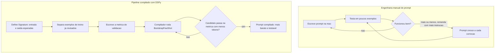

## 4. Técnica

A parte prática tem três passos: declarar o contrato (Signature e Module), fornecer exemplos e métrica, e chamar o compilador. O exemplo abaixo extrai três campos de um texto de contrato — tarefa repetitiva o suficiente para justificar compilar em vez de escrever o prompt à mão.

```python
import dspy

# 1. Signature: contrato de entrada/saida (o que preencher, nao como pensar)
class ExtrairDadosContrato(dspy.Signature):
    """Extrai nome do cliente, valor e data de vencimento de um texto de contrato."""
    texto_contrato: str = dspy.InputField()
    nome_cliente: str = dspy.OutputField()
    valor: str = dspy.OutputField()
    vencimento: str = dspy.OutputField()


# 2. Module: a estrategia de chamada que cumpre esse contrato
class ExtratorDeContrato(dspy.Module):
    def __init__(self):
        super().__init__()
        self.extrair = dspy.Predict(ExtrairDadosContrato)

    def forward(self, texto_contrato):
        return self.extrair(texto_contrato=texto_contrato)


# 3. Exemplos de treino: poucos casos ja revisados manualmente bastam
exemplos_treino = [
    dspy.Example(
        texto_contrato="Contrato entre ACME LTDA e Joao Silva, valor R$ 4.500,00, vencimento 10/09/2026",
        nome_cliente="Joao Silva",
        valor="R$ 4.500,00",
        vencimento="10/09/2026",
    ).with_inputs("texto_contrato"),
    # ... mais 4 a 9 exemplos revisados a mao formam um conjunto de treino razoavel
]


# 4. Metrica: funcao objetiva que diz se a saida esta certa
def validador_extracao(exemplo, predicao, trace=None):
    return (
        predicao.nome_cliente.strip() == exemplo.nome_cliente.strip()
        and predicao.valor.strip() == exemplo.valor.strip()
    )


# 5. Compilador: busca o prompt mais barato que ainda passa na metrica
from dspy.teleprompt import BootstrapFewShot

compilador = BootstrapFewShot(metric=validador_extracao)
extrator_otimizado = compilador.compile(ExtratorDeContrato(), trainset=exemplos_treino)

# 6. Uso em producao: o prompt final ja esta "compilado" dentro do modulo
resultado = extrator_otimizado(
    texto_contrato="Contrato entre XPTO SA e Maria Souza, valor R$ 2.100,00, vencimento 05/10/2026"
)
print(resultado.nome_cliente, resultado.valor, resultado.vencimento)
```

Repare que em nenhum momento você escreveu manualmente a frase final de instrução que vai para o modelo — o compilador monta isso a partir da Signature, dos exemplos que sobreviveram à métrica e da estratégia definida no Module. Isso é o que torna o processo reproduzível: se você trocar de modelo (de um provedor para outro), basta recompilar contra os mesmos exemplos e a mesma métrica, sem reescrever prompt algum [1].

Um passo que iniciantes costumam pular, e que vale a pena incluir na rotina: inspecionar o prompt que o compilador realmente produziu, antes de colocar em produção. O DSPy guarda o histórico de chamadas feitas durante a compilação, e você pode revisar o texto final gerado — não para editá-lo à mão de volta ao hábito antigo, mas para confirmar que ele faz sentido e não incorporou nenhum exemplo de treino com dado sensível.

```python
# Passo extra: auditar o prompt que o compilador produziu antes de ir para producao
# (nao para editar a mao - para confirmar que faz sentido e nao vaza dado sensivel)
extrator_otimizado(
    texto_contrato="Contrato entre Beta ME e Carlos Nunes, valor R$ 900,00, vencimento 01/11/2026"
)

# Mostra a ultima chamada feita ao modelo, incluindo o prompt final montado
dspy.inspect_history(n=1)

# Boa pratica: salvar o modulo compilado em disco para nao recompilar a cada deploy
extrator_otimizado.save("extrator_contrato_compilado.json")

# Em producao, so carregar o artefato ja compilado - sem chamar o compilador de novo
extrator_producao = ExtratorDeContrato()
extrator_producao.load("extrator_contrato_compilado.json")
```

Esse último detalhe é o que fecha o ciclo de custo: a compilação em si consome chamadas ao modelo (o compilador testa candidatos, e cada teste é uma requisição paga), mas é um custo único, pago uma vez por versão do pipeline. O prompt compilado, salvo em disco, é reutilizado em milhares de chamadas de produção sem precisar recompilar. Se você recompilar a cada deploy sem necessidade, está pagando de novo por um resultado que já tinha.

Os números abaixo não são uma promessa fixa — o percentual de redução varia conforme a tarefa, o modelo e a qualidade dos exemplos de treino disponíveis. O valor de referência é a ordem de grandeza declarada pelos criadores da ferramenta: até 50% de corte no tamanho do prompt final [1]. A tabela abaixo resume o tipo de ganho esperado ao comparar as duas versões do mesmo pipeline:

| Versão do prompt | Tamanho aproximado | Como foi construído |
|---|---|---|
| Manual (achômetro, com remendos) | ~850 tokens | Instruções acumuladas a cada erro percebido |
| Compilado (DSPy, BootstrapFewShot) | ~420 tokens | Exemplos e instrução escolhidos pela métrica |

Esse tipo de resultado — prompt final bem mais curto sustentando a mesma taxa de acerto — aparece também em abordagens que tratam a compressão de prompt como parte do orçamento de inferência, não como um efeito colateral de como o texto foi escrito [7]. Técnicas de compressão sem perda por codificação de dicionário mostram que dá para cortar tokens repetidos sem tocar no conteúdo que realmente importa para a resposta final [8].

Você decide se vale compilar observando o volume, não o tamanho isolado do prompt: a diferença entre 850 e 420 tokens por chamada parece pequena isoladamente, mas multiplicada pelo volume ela justifica o esforço. Um pipeline que roda mil vezes por mês economiza cerca de 430 mil tokens mensais só nessa etapa — e essa economia se repete todo mês, sem esforço adicional, porque o prompt compilado não volta a crescer sozinho como o manual crescia a cada correção.

## 5. Aplica

Você mantém um pipeline que classifica tickets de suporte automaticamente, chamado cerca de mil vezes por mês. Toda vez que o modelo erra uma classificação, sua reação é abrir o prompt e adicionar mais uma frase: "preste atenção em tickets sobre cobrança", "não confunda reembolso com cancelamento", "sempre responda em uma palavra". Depois de seis meses, o prompt tem quinze parágrafos de instruções acumuladas, e ninguém lembra mais qual frase resolve qual problema.

O diagnóstico é o mesmo do "aluguel nunca renegociado" da seção Ilustra: você está tratando cada erro como uma correção pontual no texto, em vez de tratá-lo como um sinal de que falta um exemplo no seu conjunto de treino. Cada remendo aumenta o custo de tokens por chamada — mil vezes por mês, multiplicado por quinze parágrafos extras — sem que exista qualquer garantia de que a frase nova não atrapalha um caso que já funcionava antes.

A correção: em vez de editar o prompt manualmente, você transforma o ticket que o modelo errou em um novo exemplo de treino com a classificação correta, ajusta (se necessário) a métrica de validação, e roda o compilador de novo. O prompt final pode até diminuir de tamanho, porque o compilador tem liberdade para descartar instrução redundante que os exemplos por si só já cobrem — o oposto do que acontece quando você só acrescenta texto por cima de texto.

Note a inversão de hábito que isso exige. Durante meses, seu reflexo diante de um erro foi abrir o editor de texto e escrever mais uma frase. O novo reflexo é abrir a planilha (ou o arquivo) de exemplos de treino, adicionar o caso que falhou com o rótulo correto, e deixar o compilador decidir se aquele caso muda a instrução final ou só reforça um exemplo já parecido. No começo parece mais lento — editar uma frase é mais rápido do que rodar um compilador. Mas o hábito antigo paga juros: cada frase acumulada continua sendo cobrada em tokens para sempre, em toda chamada futura, enquanto o exemplo de treino só custa alguma coisa durante a recompilação pontual.

Armadilhas comuns que reforçam o padrão manual:
- Tratar todo erro do modelo como "falta de instrução" em vez de "falta de exemplo representativo".
- Compilar contra poucos exemplos de treino (menos de cinco) e aceitar o resultado sem validar contra um conjunto separado.
- Reutilizar a mesma métrica de validação para tarefas diferentes, mascarando queda de qualidade em uma delas.
- Recompilar a cada deploy sem necessidade, pagando de novo pelas chamadas de teste do compilador quando o Module e os exemplos não mudaram.
- Confiar no número de "redução de tamanho" sem antes ler o prompt compilado (`dspy.inspect_history`) e confirmar que ele não incorporou dado sensível de um exemplo de treino.

Um segundo cenário, menos óbvio: você herda um pipeline de outra pessoa, já compilado, e o time pede para você "só trocar o modelo por um mais barato". Sua primeira reação, seguindo o hábito manual, seria reescrever o prompt do zero para o novo modelo — afinal, cada modelo "responde diferente". Com DSPy, a resposta correta costuma ser mais simples: trocar o modelo configurado no ambiente e rodar o compilador de novo contra os mesmos exemplos e a mesma métrica. O compilador redescobre, para o novo modelo, qual formulação é mais barata e ainda passa no critério — sem que você precise adivinhar manualmente o que aquele modelo específico "gosta" de ler.

Sobre escala: o BootstrapFewShot escala bem até poucas dezenas de exemplos de treino; acima disso, cuidado — o tempo de compilação cresce e vale checar se o ganho de custo ainda compensa recompilar a cada ajuste, ou se o gargalo passou a ser o próprio conjunto de exemplos, não mais o prompt.

Antes de rodar o exercício abaixo, vale um alerta prático: não escolha, na primeira tentativa, o prompt mais complexo do seu projeto. Escolha um caso pequeno e repetitivo — como o de extração de contratos usado neste capítulo — para aprender o fluxo Signature → exemplos → métrica → compilador em um cenário onde é fácil conferir manualmente se o resultado está certo. Só depois de sentir esse ciclo funcionar de ponta a ponta vale migrar para o prompt mais crítico e de maior volume do seu pipeline.

### Exercício
- [ ] Escolha um prompt do seu projeto que roda pelo menos algumas centenas de vezes por mês
- [ ] Escreva a Signature dele: quais campos realmente entram e quais devem sair
- [ ] Separe de 5 a 10 casos reais já revisados manualmente como exemplos de treino
- [ ] Escreva uma função de métrica objetiva (não "parece certo", mas um critério comparável)
- [ ] Rode o compilador e compare o tamanho do prompt final com o prompt manual atual
- [ ] Antes de colocar em produção, inspecione o prompt compilado (`dspy.inspect_history`) e confirme que nenhum exemplo de treino carrega dado sensível

## 6. Conclusão

DSPy separa três coisas que a engenharia manual de prompt costuma misturar: o contrato do que entra e sai (Signature), a estratégia de chamada (Module) e o critério objetivo de acerto (métrica), deixando um compilador buscar, entre variações reais, a combinação mais barata que ainda passa. O ganho declarado — até 50% de redução no tamanho do prompt [1] — não vem de cortar palavras às cegas, mas de parar de pagar por instrução redundante que nenhum exemplo comprova ser necessária.

Repare no padrão que se repete desde o Capítulo 1: primeiro você separa o que é fixo do que é variável (Signature), depois isola o critério que decide o que é "bom o suficiente" (métrica), e só então automatiza a busca pela versão mais barata que ainda satisfaz esse critério. É a mesma lógica de auditoria de despesa recorrente que sustenta cada ferramenta deste livro — muda o alvo (código, log, contexto, ou agora, o próprio texto do prompt), mas o método de enxugar sem perder qualidade continua sendo o mesmo: medir antes de cortar, nunca cortar de olho fechado.

Ao dominar isso, você deixa de ser quem escreve prompts bons por sorte e passa a ser quem prova, com métrica e exemplo real, que um prompt é o mais enxuto possível sem sacrificar qualidade — o diferencial que separa quem "tem jeito com IA" de quem administra o custo de IA como profissão. Isoladamente, cada uma das oito ferramentas deste livro ataca um ponto específico do fluxo; combinadas, chegam a cortar até 85% do custo total com LLMs [1]. Falta fechar o círculo: garantir que essa economia não se perca por falta de visibilidade. É exatamente esse o assunto do Capítulo 8, os quatro pilares de governança que sustentam tudo o que você aprendeu até aqui.

## 7. Referências Bibliográficas

[1] ECONOMIA EXTREMA DE TOKENS: contexto e skills de eficiência. Compêndio técnico. Curadoria de Elite — Open Source Initiative (OSI), Linux Foundation, CNCF Landscape, 2026. Documento técnico interno (dossiê de pesquisa da obra).

[2] JIANG, Huiqiang et al. *LLMLingua: Compressing Prompts for Accelerated Inference of Large Language Models*. 2023. Disponível em: https://doi.org/10.18653/v1/2023.emnlp-main.825. Acesso em: 25 ago. 2026.

[3] JIANG, Huiqiang et al. *LongLLMLingua: Accelerating and Enhancing LLMs in Long Context Scenarios via Prompt Compression*. 2024. Disponível em: https://doi.org/10.18653/v1/2024.acl-long.91. Acesso em: 25 ago. 2026.

[4] PAN, Zhuoshi et al. *LLMLingua-2: Data Distillation for Efficient and Faithful Task-Agnostic Prompt Compression*. In: Annual Meeting of the Association for Computational Linguistics. 2024. Disponível em: https://www.semanticscholar.org/paper/3d45fc603e34934fc589b9547307815f7723de34. Acesso em: 25 ago. 2026.

[5] HAN, Tingxu et al. *Token-Budget-Aware LLM Reasoning*. 2025. Disponível em: https://doi.org/10.18653/v1/2025.findings-acl.1274. Acesso em: 25 ago. 2026.

[6] ZHANG, Tinghui; WANG, Yifan; WANG, Daisy Zhe. *SCOPE: A Generative Approach for LLM Prompt Compression*. In: arXiv.org. 2025. Disponível em: https://www.semanticscholar.org/paper/4c101e9b3a84a793b00d3ed00c5232435420142c. Acesso em: 25 ago. 2026.

[7] LISKAVETS, Barys et al. *Prompt Compression with Context-Aware Sentence Encoding for Fast and Improved LLM Inference*. In: Proceedings of the AAAI Conference on Artificial Intelligence. 2025. Disponível em: https://doi.org/10.1609/aaai.v39i23.34639. Acesso em: 25 ago. 2026.

[8] CAMPOS, A. et al. *Lossless Prompt Compression via Dictionary-Encoding and In-Context Learning: Enabling Cost-Effective LLM Analysis of Repetitive Data*. In: arXiv.org. 2026. Disponível em: https://www.semanticscholar.org/paper/c9314e5c12102c8d489f511fd3764408229045d5. Acesso em: 25 ago. 2026.

# Capítulo 8: Governança em Produção: 4 Pilares + Checklist

## 1. Introdução

No Capítulo 7, você aprendeu a tratar prompt como programa: o compilador DSPy testa permutações contra um validador e entrega a versão mais enxuta e assertiva, sem que você precise reescrever nada à mão a cada troca de modelo. Some esse resultado às seis ferramentas anteriores — caveman, headroom, lean-ctx, RTK-Memory, LiteLLM, Repomix, ast-grep — e você tem, no papel, um sistema capaz de cortar até 85% do custo com LLMs quando todas operam juntas [1]. No papel.

Você descobre, neste capítulo, uma pergunta que nenhuma das oito ferramentas anteriores responde sozinha: quem garante que elas continuam economizando amanhã, depois que você parar de olhar? Um prompt otimizado pelo DSPy hoje pode ser reescrito por engano na semana que vem. Um cache que hoje reduz a fatura em 60% pode silenciosamente parar de funcionar depois de um deploy, e ninguém percebe até a fatura do mês seguinte. Já lá no Capítulo 1 você viu o limite da auditoria manual: uma planilha revisada à mão resolve até algumas dezenas de chamadas por dia, mas a partir de um certo volume o gargalo deixa de ser o cálculo e passa a ser a coleta. Este capítulo entrega o pipeline automatizado que aquele momento exige.

Como Engenheiro de Custos com IA, seu trabalho neste capítulo muda de "aplicar a ferramenta certa" para "sustentar o sistema inteiro sem precisar vigiar cada peça". Ao dominar isso, você deixa de ser a pessoa que descobre o estouro de orçamento na fatura do fim do mês e passa a ser quem já tinha um alerta disparado três dias antes — e uma resposta automática rodando enquanto você lia o e-mail.

## 2. Explica

Governança em produção não é um pilar isolado: é a integração de quatro camadas que, juntas, transformam economia de tokens de "aconteceu uma vez, num laboratório" em "acontece todo dia, em escala, sem ninguém precisar lembrar de checar". Isso importa porque a adoção de modelos de linguagem em produção deixou de ser experimento de time pequeno para virar infraestrutura crítica de empresas inteiras, com todas as exigências de confiabilidade que isso implica [6]. As duas primeiras camadas resolvem o mesmo problema visto de ângulos diferentes: mensuração responde "quanto custou", observabilidade responde "o que exatamente aconteceu para custar isso". Sem as duas juntas, você tem números sem contexto ou contexto sem números — nenhum dos dois basta para decidir o que fazer a seguir.

Mensuração, na prática, é atribuir custo a cada chamada — não ao total do mês, mas por usuário, por modelo, por rota de código que disparou a requisição. É a diferença entre saber que você gastou US$ 8 mil em agosto e saber que 40% desse valor veio de um único endpoint que reenvia o histórico inteiro a cada chamada. Tratar tokens como um orçamento finito por chamada — não como um recurso ilimitado que só é revisado no fim do mês — é exatamente o que propostas recentes de raciocínio sensível a orçamento de tokens tentam formalizar em modelos de linguagem [7]. Observabilidade complementa isso com logs estruturados e traces distribuídos: cada resposta cara fica ligada a exatamente qual prompt, qual usuário e qual modelo a gerou, permitindo reconstruir a cadeia de decisão depois do fato [2]. Sistemas de recuperação aumentada (RAG) que compõem múltiplas chamadas em pipeline — busca, reordenação, geração — tornam essa rastreabilidade ainda mais crítica, porque o custo de uma única resposta ao usuário final pode estar distribuído em três ou quatro chamadas internas invisíveis sem instrumentação [3].

A terceira camada, fallback, assume que a primeira e a segunda vão, em algum momento, disparar um alerta — e prepara o sistema para reagir sem depender de uma pessoa acordada às 3h da manhã. Fallback inteligente é um circuit breaker: um mecanismo que desvia tráfego para um modelo mais barato, uma resposta cacheada, ou um modelo local, quando o custo ou a taxa de erro do modelo principal ultrapassa um limite pré-definido — a mesma lógica de proteção usada em arquiteturas distribuídas para conter falhas em cascata antes que elas cheguem ao usuário final [4].

A quarta camada, governança propriamente dita, é a única das quatro que não é técnica: é processo e responsabilidade. Quem aprova a troca de um modelo em produção? Qual é o limite de gasto por equipe antes que uma aprovação manual seja obrigatória? Quem audita, periodicamente, se o custo real ainda bate com o esperado? Frotas heterogêneas de modelos — combinando fornecedores diferentes para tarefas diferentes — só permanecem econômicas enquanto existir um processo nomeado decidindo quando adicionar, trocar ou aposentar um modelo da frota; sem isso, a otimização token-a-token vira ruído perto do custo de manter modelos redundantes rodando sem necessidade [5].

Essas quatro camadas não amadurecem ao mesmo tempo dentro de uma equipe — elas avançam em estágios, e reconhecer em qual estágio você está evita o erro de pular etapas. No estágio inicial, existe mensuração, mas ainda manual: alguém exporta a fatura do provedor uma vez por mês e tenta adivinhar, de memória, de onde veio o pico. No estágio intermediário, a observabilidade automatiza a coleta e o dashboard já responde "quem gastou o quê", mas o fallback ainda é uma decisão humana tomada sob pressão — geralmente tarde demais, depois que a fatura já fechou. Só no estágio maduro o fallback vira código que roda sozinho, e a governança deixa de ser "quem lembrar de revisar a planilha" para virar um processo com dono, calendário e critério escrito. Pular do estágio inicial direto para automatizar o fallback, sem antes consolidar a mensuração, é como instalar um disjuntor num quadro de luz sem saber quantos amperes cada circuito da casa realmente consome: o disjuntor até desarma, mas ninguém sabe se desarmou na hora certa — ou se deveria ter desarmado bem antes.

## 3. Ilustra

Pense nos 4 pilares como o sistema financeiro completo de uma empresa, não como quatro ferramentas de TI separadas. Mensuração e observabilidade juntas são o extrato bancário detalhado — não só "saiu dinheiro", mas "saiu para quem, quando, em que transação". Fallback é o limite do cheque especial: quando o saldo em conta corrente (o modelo principal) fica perto do limite, o banco automaticamente redireciona para uma reserva mais barata antes de recusar a operação. Governança é o conselho fiscal: define o teto de gastos, aprova novos fornecedores e audita, de tempos em tempos, se o extrato bate com o orçamento aprovado.

Pense também no aplicativo do banco que te avisa em tempo real a cada compra no cartão — é a versão automática do extrato que mensuração e observabilidade constroem para tokens. Você não espera a fatura fechar no fim do mês para descobrir que algo saiu da curva esperada; a notificação chega enquanto o gasto ainda está acontecendo, a tempo de você agir.

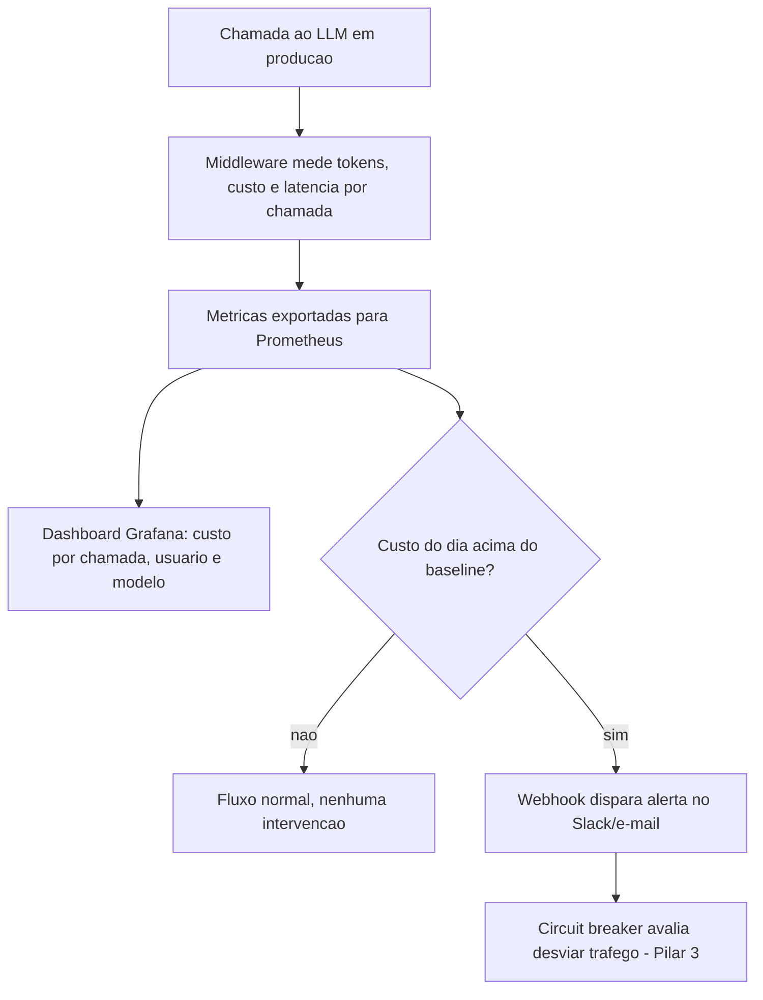

O terceiro pilar, fallback, merece uma segunda lente porque é o mais fácil de implementar errado. A primeira analogia é o disjuntor elétrico da sua casa: quando a corrente ultrapassa o limite seguro, ele desarma sozinho, cortando o circuito antes que o excesso vire incêndio — ninguém precisa estar olhando o quadro de luz no momento exato da sobrecarga. A segunda analogia, mais próxima do vocabulário deste livro, é o próprio limite de cartão de crédito: passar do limite não significa "gastar mais rápido sem perceber" — significa que a próxima transação é recusada ou redirecionada automaticamente, protegendo o fluxo de caixa de quem administra a conta. Um circuit breaker de custo faz exatamente isso com chamadas de LLM: ao ultrapassar o limite, ele "desarma" o caminho caro e redireciona para a reserva (modelo mais barato ou cache) até a situação se normalizar. Servir uma resposta cacheada como rota de reserva, em vez de reprocessar do zero, é a aplicação direta de frameworks de cache semântico pensados para reduzir custo de inferência distribuída sem esperar por uma correspondência exata de prompt [9].

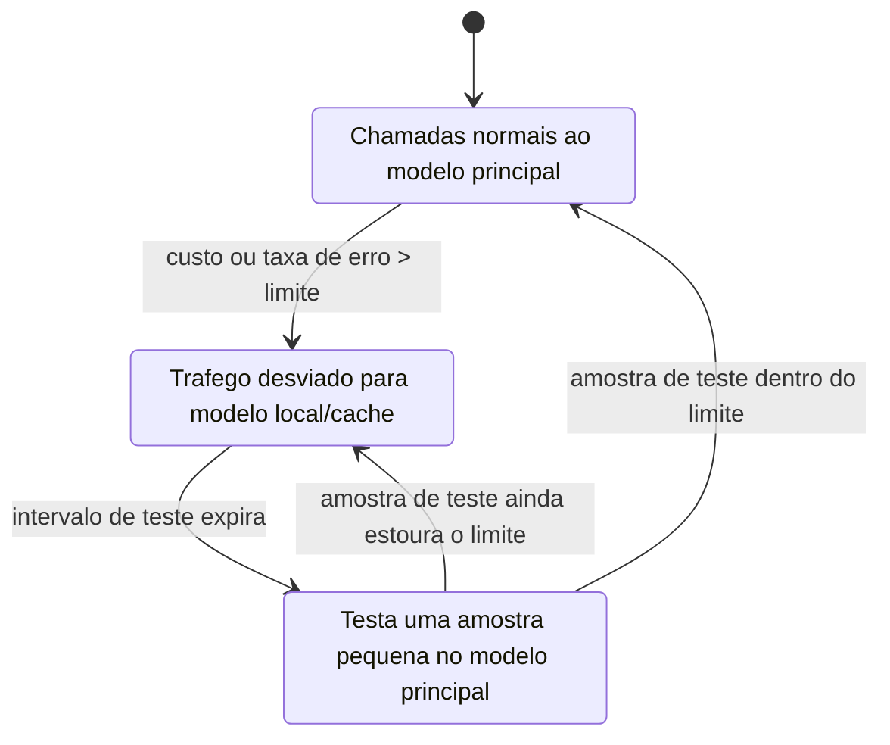

O quarto pilar fecha o ciclo transformando os três anteriores em processo nomeado, não em script solto rodando sem dono:

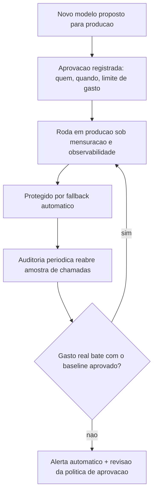

## 4. Técnica

A entrega prática deste capítulo tem três artefatos, um por pilar: um middleware que mede e registra custo por chamada, um circuit breaker de custo pronto para adaptar, e um checklist de produção com o alerta automático que fecha o ciclo de governança.

### Middleware de mensuração e observabilidade

O trecho abaixo envolve qualquer chamada de API de LLM, calcula o custo estimado com base nos tokens de entrada/saída e grava um registro estruturado (um JSON por linha) pronto para alimentar um dashboard ou um agregador como Prometheus.

```python
# middleware_custo.py
# Envolve uma chamada de LLM e registra custo, usuario e modelo por linha JSON.
import json
import time

PRECO_POR_1K_TOKENS = {
    "modelo-padrao": {"entrada": 0.003, "saida": 0.015},
    "modelo-barato": {"entrada": 0.0008, "saida": 0.004},
}


def calcular_custo(modelo: str, tokens_entrada: int, tokens_saida: int) -> float:
    """Calcula o custo estimado da chamada em dolares, a partir da tabela de precos."""
    preco = PRECO_POR_1K_TOKENS.get(modelo, PRECO_POR_1K_TOKENS["modelo-padrao"])
    custo_entrada = (tokens_entrada / 1000) * preco["entrada"]
    custo_saida = (tokens_saida / 1000) * preco["saida"]
    return round(custo_entrada + custo_saida, 6)


def registrar_chamada(usuario: str, modelo: str, tokens_entrada: int, tokens_saida: int, arquivo="log_custos.jsonl"):
    """Grava um registro estruturado de uma chamada, pronto para agregacao posterior."""
    registro = {
        "timestamp": time.time(),
        "usuario": usuario,
        "modelo": modelo,
        "tokens_entrada": tokens_entrada,
        "tokens_saida": tokens_saida,
        "custo_usd": calcular_custo(modelo, tokens_entrada, tokens_saida),
    }
    with open(arquivo, "a", encoding="utf-8") as f:
        f.write(json.dumps(registro, ensure_ascii=False) + "\n")
    return registro


if __name__ == "__main__":
    exemplo = registrar_chamada("usuario_42", "modelo-padrao", tokens_entrada=1200, tokens_saida=350)
    print("Chamada registrada:", exemplo)
```

Cada linha desse arquivo é uma transação do seu "extrato bancário" de tokens. Agregado por dia, por usuário ou por modelo, ele já responde à pergunta que a mensuração exige — sem depender de esperar a fatura do provedor no fim do mês. Essa separação entre o custo do que já foi processado (cache) e o custo do que é gerado pela primeira vez segue a mesma lógica de arquiteturas que isolam explicitamente as duas categorias para poder medir cada uma de forma independente [8].

Um log linha a linha só vira observabilidade de verdade quando alguém consulta esse extrato antes de a fatura chegar. O trecho a seguir fecha essa lacuna: lê o `log_custos.jsonl` inteiro, filtra pelo dia desejado e devolve o total já agregado por modelo e por usuário — exatamente o resumo que alimenta o painel "custo por usuário e modelo" do diagrama de arquitetura.

```python
# resumo_diario.py
# Agrega o log_custos.jsonl em um resumo diario por modelo e por usuario.
import json
from collections import defaultdict
from datetime import datetime, timezone


def resumir_dia(arquivo="log_custos.jsonl", dia=None):
    """Le o log linha a linha e agrega custo total por modelo e por usuario no dia informado."""
    dia = dia or datetime.now(timezone.utc).strftime("%Y-%m-%d")
    custo_por_modelo = defaultdict(float)
    custo_por_usuario = defaultdict(float)
    total_chamadas = 0

    with open(arquivo, encoding="utf-8") as f:
        for linha in f:
            registro = json.loads(linha)
            data_registro = datetime.fromtimestamp(
                registro["timestamp"], tz=timezone.utc
            ).strftime("%Y-%m-%d")
            if data_registro != dia:
                continue
            custo_por_modelo[registro["modelo"]] += registro["custo_usd"]
            custo_por_usuario[registro["usuario"]] += registro["custo_usd"]
            total_chamadas += 1

    return {
        "dia": dia,
        "total_chamadas": total_chamadas,
        "custo_por_modelo": dict(custo_por_modelo),
        "custo_por_usuario": dict(custo_por_usuario),
    }


if __name__ == "__main__":
    print(resumir_dia())
```

Note que `resumir_dia` não faz nenhuma mágica: é uma soma simples, agrupada por chave. A parte difícil de governança nunca foi o cálculo — é garantir que o log exista, esteja completo e seja consultado com regularidade. Um `resumo_diario.py` que ninguém roda é tão inútil quanto um extrato bancário que ninguém abre.

### Circuit breaker de custo

A classe abaixo implementa a máquina de estados do diagrama anterior: fechado (chamadas normais), aberto (tráfego desviado) e meio-aberto (teste controlado antes de voltar ao normal).

```python
# circuit_breaker_custo.py
# Circuit breaker simples que desvia trafego quando o custo por chamada estoura o limite.
import time


class CircuitBreakerCusto:
    def __init__(self, limite_usd: float, janela_teste_segundos: int = 60):
        self.limite_usd = limite_usd
        self.janela_teste_segundos = janela_teste_segundos
        self.estado = "fechado"
        self.momento_abertura = None

    def registrar_custo(self, custo_usd: float) -> str:
        """Recebe o custo da ultima chamada e decide o proximo estado/rota."""
        if self.estado == "fechado":
            if custo_usd > self.limite_usd:
                self.estado = "aberto"
                self.momento_abertura = time.time()
                return "modelo-fallback"
            return "modelo-principal"

        if self.estado == "aberto":
            if time.time() - self.momento_abertura >= self.janela_teste_segundos:
                self.estado = "meio-aberto"
                return "modelo-principal"  # testa uma amostra
            return "modelo-fallback"

        if self.estado == "meio-aberto":
            if custo_usd > self.limite_usd:
                self.estado = "aberto"
                self.momento_abertura = time.time()
                return "modelo-fallback"
            self.estado = "fechado"
            return "modelo-principal"


if __name__ == "__main__":
    breaker = CircuitBreakerCusto(limite_usd=0.05)
    print(breaker.registrar_custo(0.02))   # modelo-principal
    print(breaker.registrar_custo(0.09))   # modelo-fallback (abre)
    print(breaker.registrar_custo(0.03))   # ainda modelo-fallback, dentro da janela
```

Repare que este circuit breaker decide só com base em custo. É exatamente o limite que a seção Aplica vai explorar: decidir com base em custo, sem acoplar uma métrica de qualidade mínima, resolve a fatura e cria um problema novo.

### Fechando o buraco: piso de qualidade acoplado ao fallback

O gateway de cache semântico documentado no dossiê desta obra só serve uma resposta cacheada quando a similaridade de cosseno entre o prompt novo e o prompt já respondido ultrapassa 0,95 — abaixo desse limiar, ele prefere pagar de novo a arriscar devolver uma resposta que não corresponde de verdade à pergunta [1]. É a mesma disciplina que falta ao `CircuitBreakerCusto` da forma como ele foi escrito: ele decide a rota só pelo custo da última chamada, sem checar se a rota mais barata ainda entrega uma resposta utilizável. A função abaixo envolve o método original e fecha exatamente essa lacuna, sem precisar reescrever a classe inteira.

```python
# circuit_breaker_qualidade.py
# Envolve o CircuitBreakerCusto com um piso de qualidade antes de aceitar o fallback.
from circuit_breaker_custo import CircuitBreakerCusto


def registrar_custo_com_qualidade(breaker: CircuitBreakerCusto, custo_usd: float, resposta_valida: bool) -> str:
    """So aceita a rota de fallback se a amostra tambem passar num criterio minimo de qualidade."""
    rota = breaker.registrar_custo(custo_usd)
    if rota == "modelo-fallback" and not resposta_valida:
        # custo baixo nao compensa se a resposta nao serve: forca nova tentativa no principal
        breaker.estado = "aberto"
        return "modelo-principal-forcado"
    return rota
```

`resposta_valida` pode ser algo tão simples quanto validar se um JSON esperado tem os campos obrigatórios, ou tão elaborado quanto um segundo modelo mais barato julgando a resposta do primeiro. O que importa é que a decisão de desviar tráfego nunca fique sozinha com o número do custo — ela precisa de um segundo voto, mesmo que rudimentar, antes de ser considerada segura para o tráfego inteiro.

### Checklist de produção e alerta automático

```yaml
# checklist-governanca.yaml
# Checklist minimo de producao: uma linha por decisao que precisa de dono.
governanca_producao:
  aprovacao_de_modelo:
    exigida_acima_de_usd_mes: 500
    aprovador: "lider_tecnico_da_equipe"
  limite_de_gasto_por_projeto:
    valor_usd_mes: 2000
    acao_ao_ultrapassar: "alerta + revisao obrigatoria"
  auditoria_periodica:
    cadencia: "semanal"
    escopo: "reabrir 5% das chamadas e conferir custo real vs. estimado"
  canais_de_alerta:
    - "slack:#custos-llm"
    - "email:financeiro@empresa.com"
```

```python
# alerta_custo.py
# Dispara um alerta (webhook) quando o custo diario acumulado foge do baseline.
import json
import urllib.request

WEBHOOK_SLACK = "https://hooks.slack.com/services/EXEMPLO/SUBSTITUIR/URL"


def disparar_alerta(custo_diario: float, baseline: float, canal=WEBHOOK_SLACK):
    """Envia um alerta simples quando o custo do dia ultrapassa o baseline configurado."""
    if custo_diario <= baseline:
        return "dentro_do_baseline"
    mensagem = {
        "text": f"[ALERTA] Custo diario de LLM em US$ {custo_diario:.2f}, "
                f"acima do baseline de US$ {baseline:.2f}."
    }
    requisicao = urllib.request.Request(
        canal, data=json.dumps(mensagem).encode("utf-8"),
        headers={"Content-Type": "application/json"},
    )
    urllib.request.urlopen(requisicao, timeout=5)
    return "alerta_disparado"
```

## 5. Aplica

Você está numa sexta-feira à tarde, revisando a fatura da semana com o time. O custo com o modelo principal subiu 30% desde a segunda-feira, e alguém sugere a correção óbvia: trocar temporariamente para um modelo mais barato até segunda, sem tocar em código de produto. A decisão é aprovada no chat da equipe em cinco minutos, o deploy sai em dez, e todo mundo comemora a fatura que não vai estourar.

Na segunda-feira seguinte, o time de suporte reporta um aumento de reclamações: respostas incompletas, um relatório que antes vinha estruturado agora sai em texto corrido, um cálculo que antes batia agora erra por uma casa decimal. Ninguém associa isso à troca de modelo de sexta-feira, porque a decisão nunca foi registrada em lugar nenhum — foi uma mensagem de chat, não uma linha do checklist de produção.

O diagnóstico é o mesmo que o circuit breaker da seção Técnica deixou em aberto de propósito: a troca de modelo foi decidida só pelo custo, sem nenhuma métrica de qualidade acoplada à decisão, e sem passar pela aprovação registrada que o Pilar 4 exige. Você resolveu o número da fatura e criou uma dívida de qualidade invisível — pior ainda, sem nenhum dono formalmente responsável por ela.

A correção não é abandonar o fallback automático — é acoplar um piso de qualidade a ele, exatamente como a função `registrar_custo_com_qualidade` da seção Técnica faz. Antes de qualquer troca de modelo, mesmo automática, o circuit breaker precisa validar uma amostra de respostas contra um critério mínimo (formato esperado, presença de campos obrigatórios, ou mesmo um validador simples de estrutura) antes de considerar a rota de fallback "segura" para o tráfego inteiro. E toda troca — automática ou manual — precisa aparecer no checklist de governança, com quem aprovou e por quanto tempo, para que o próximo aumento de reclamações não vire um mistério de segunda-feira.

Você descobre o problema oposto três semanas depois: o webhook do `alerta_custo.py` dispara todo dia, por volta das 14h, avisando que o custo diário passou do baseline. No começo, o time larga o que está fazendo e investiga. Na segunda semana, alguém verifica rápido, não acha nada de anormal e volta ao trabalho. Na terceira semana, ninguém mais abre o canal `#custos-llm` quando o alerta chega — virou ruído de fundo, como aquele alarme de carro que dispara toda madrugada e o vizinho já nem escuta mais.

O diagnóstico, desta vez, não é falta de alerta — é excesso de alerta sem ajuste. O baseline foi calculado uma única vez, no dia em que a equipe tinha cinco pessoas. Três meses depois, com doze pessoas usando o mesmo modelo em produção, o volume normal de chamadas mais que dobrou, e o "baseline" virou uma constante desatualizada disparando todo santo dia. O alerta continua tecnicamente correto — o custo do dia realmente está acima daquele número antigo — mas deixou de carregar informação útil, e é exatamente esse tipo de alerta que ensina um time a ignorar o próximo aviso, inclusive o que vai importar de verdade.

A correção mora na camada de auditoria periódica do checklist de governança, não em desligar o alerta: o baseline precisa ser recalculado com uma cadência definida — por exemplo, como média móvel dos últimos 14 dias, revista toda auditoria semanal — em vez de ficar congelado no valor do dia em que alguém configurou o webhook pela primeira vez. Um alerta que se ajusta ao crescimento normal da equipe continua sensível ao que de fato é anormal; um alerta parado no tempo vira apenas fundo de tela.

Erros comuns que reforçam esse padrão:

- Tratar decisão de custo e decisão de qualidade como problemas separados, quando elas compartilham o mesmo gatilho.
- Aprovar mudança de modelo em produção por mensagem de chat, sem registro formal de quem decidiu e com qual limite.
- Configurar alertas de custo sem configurar auditoria periódica — o alerta avisa que algo estourou, mas só a auditoria confirma se a causa foi resolvida de verdade.
- Deixar o baseline do alerta congelado no valor do dia da configuração, até ele parar de significar qualquer coisa.

### Exercício
- [ ] Implemente o `middleware_custo.py` sobre uma chamada real do seu projeto e rode por um dia inteiro
- [ ] Rode o `resumo_diario.py` sobre o log gerado e confira se o total agregado bate com o que você esperava gastar naquele dia
- [ ] Ajuste o `limite_usd` do `circuit_breaker_custo.py` para o teto que sua equipe consideraria aceitável por chamada
- [ ] Preencha o `checklist-governanca.yaml` com os nomes reais de aprovador, limite de gasto e canal de alerta da sua equipe
- [ ] Defina, por escrito, qual métrica de qualidade mínima seu circuit breaker vai checar antes de aceitar uma rota de fallback como segura
- [ ] Defina a cadência de recálculo do baseline de alerta (ex.: média móvel de 14 dias) para que o webhook não vire ruído ignorado

## 6. Conclusão

Os 4 pilares não são uma nova ferramenta para adicionar à lista das oito primeiras — são o seguro que garante que as oito continuam funcionando depois que o entusiasmo inicial passa. Mensuração e observabilidade dizem quanto custou e o que aconteceu; fallback garante que o sistema se protege sozinho antes de qualquer pessoa perceber o problema; governança garante que existe um dono e um processo por trás de cada decisão que afeta o fluxo de caixa da equipe com IA.

Volte, por um instante, ao início deste livro. No Capítulo 1, o problema era uma planilha revisada à mão, incapaz de acompanhar o volume real de chamadas. Nos capítulos seguintes, você foi empilhando resposta técnica sobre resposta técnica — caveman e headroom cortando tokens na entrada, lean-ctx e RTK-Memory evitando reenvio de contexto redundante, LiteLLM e o cache semântico reaproveitando o que já foi pago, ast-grep substituindo refatoração cara por transformação estrutural gratuita, DSPy compilando o prompt em vez de reescrevê-lo manualmente a cada troca de modelo. Cada uma dessas oito ferramentas resolve um ponto específico da fatura. Nenhuma delas, sozinha, garante que a economia obtida hoje ainda vai existir daqui a três meses, depois de um deploy, uma troca de equipe ou um crescimento de dez para cinquenta usuários.

É esse o papel que os 4 pilares deste capítulo final cumprem: não uma nona ferramenta, mas a camada que impede as outras oito de se degradarem em silêncio. Você chegou ao fim do arco deste livro sabendo que economia de tokens não é uma coleção de oito truques isolados — é um sistema com pontas de compressão, cache, empacotamento, refatoração e otimização de prompt, sustentado por uma estrutura de governança que audita, alerta e se corrige sozinha antes que a fatura vire surpresa. O Engenheiro de Custos com IA que sai deste capítulo não é quem aplicou mais ferramentas, mas quem construiu o processo que faz essas ferramentas continuarem economizando sem exigir vigilância constante — o diferencial que separa quem implementou uma otimização pontual de quem sustenta, ano após ano, um sistema de custo com IA que se paga sozinho.

## 7. Referências Bibliográficas

[1] ECONOMIA EXTREMA DE TOKENS: contexto e skills de eficiência. Compêndio técnico. Curadoria de Elite — Open Source Initiative (OSI), Linux Foundation, CNCF Landscape, 2026. Documento técnico interno (dossiê de pesquisa da obra).

[2] ZHAO, Wayne Xin et al. *A Survey of Large Language Models*. In: Frontiers of Computer Science. 2026. Disponível em: https://doi.org/10.1007/s11704-026-60308-3. Acesso em: 25 ago. 2026.

[3] FAN, Wenqi et al. *A Survey on RAG Meeting LLMs: Towards Retrieval-Augmented Large Language Models*. 2024. Disponível em: https://doi.org/10.1145/3637528.3671470. Acesso em: 25 ago. 2026.

[4] JIN, Haoying; FENG, Haoyang. *Llm-Cache: an Efficient Context-Aware Semantic Caching Framework for Distributed Llm Inference Services*. In: 2026 IEEE 46th International Conference on Distributed Computing Systems Workshops (ICDCSW). 2026. Disponível em: https://doi.org/10.1109/icdcsw72724.2026.00031. Acesso em: 25 ago. 2026.

[5] EDUSA, Samuel. *ConsultChain: Progressive Context Distillation Across Heterogeneous LLM Fleets for Token-Optimal Inference*. 2026. Disponível em: https://doi.org/10.21203/rs.3.rs-9368244/v1. Acesso em: 25 ago. 2026.

[6] NAVEED, Humza et al. *A Comprehensive Overview of Large Language Models*. In: arXiv (Cornell University). 2023. Disponível em: http://arxiv.org/abs/2307.06435. Acesso em: 25 ago. 2026.

[7] HAN, Tingxu et al. *Token-Budget-Aware LLM Reasoning*. 2025. Disponível em: https://doi.org/10.18653/v1/2025.findings-acl.1274. Acesso em: 25 ago. 2026.

[8] AUTOR. *Prompt Context Caching Architecture for Cost Reduction in Large Language Model Systems*. In: International Journal of Intelligent Systems and Applications in Engineering. 2026. Disponível em: https://doi.org/10.17762/ijisae.v14i1s.8385. Acesso em: 25 ago. 2026.

[9] MOHANDOSS, Ramaswami. *Context-based Semantic Caching for LLM Applications*. In: 2024 IEEE Conference on Artificial Intelligence (CAI). 2024. Disponível em: https://doi.org/10.1109/cai59869.2024.00075. Acesso em: 25 ago. 2026.