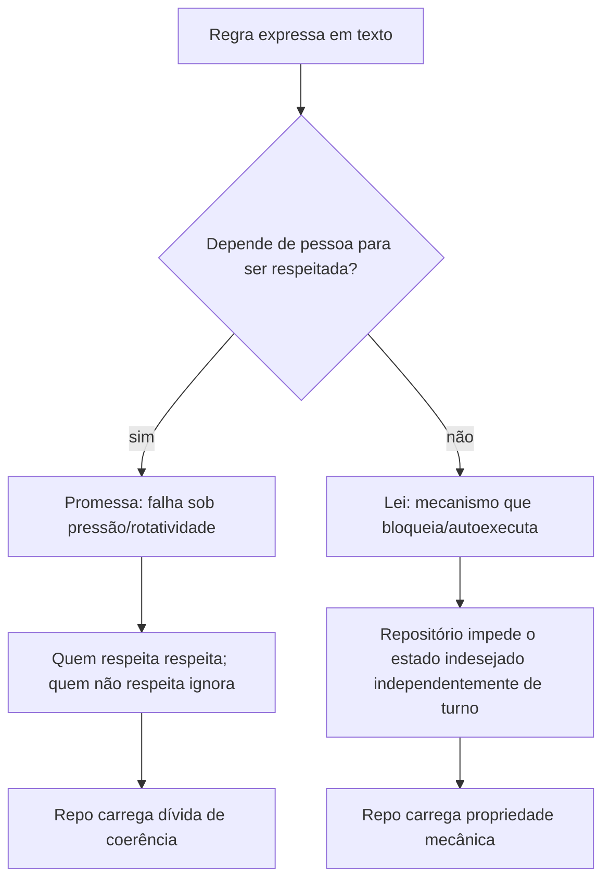

# Capítulo 1: O pretexto que custa caro

## 1. Introdução

Se você já herdou um repositório onde a única defesa contra um commit vermelho era a frase "sepamos fazer diferente", você já conheceu o custo real de uma regra expressa em texto. Esse capítulo mostra por que promessas escritas em README, comentários ou conversas de time são mais caras do que parecem — e introduz a pergunta central do livro: quais dessas promessas poderiam virar leis do repo independentemente de quem está no turno?

Ao final deste capítulo, você será capaz de identificar quatro falhas archetípicas onde a manualidade substituiu o mecanismo e nomear, para cada uma, o tipo de mecanismo que a substitui.

## 2. Explica

O problema não é a intenção — é a dependência da vontade humana para coerência. Uma regra que precisa de lembrança, disciplina ou pressão social para serrespeitada é uma regra que falha exatamente quando o contexto está sob pressão (velocidade de entrega, rotação de pessoas, cansaço). Esse padrão é reconhecido há décadas como um dado de engenharia de software: quando a responsabilidade de manter uma propriedade do sistema recai sobre memória humana em vez de mecanismo automatizado, a propriedade se torna frágil ao crescimento do time e à rotatividade [1][2].

As quatro falhas que estruturam o livro são arquetípicas, não acusatórias — qualquer projeto pode reconhecer pelo menos uma delas:

1. **Revisão onde quem escreveu também aprovou.** Quando a mesma entidade que gerou o artefato decide sua própria aprovação, o conflito de interesse é estrutural, não moral [3].
2. **Hook que "deve existir" mas não impede o commit vermelho.** Um arquivo de instrução que descreve um comportamento esperado sem implementar um mecanismo que o bloqueie é uma promessa, não uma lei [4].
3. **Postmortem que documenta a lição mas não previne a recorrência.** Arquivar um aprendizado sem transformá-lo em teste que o repo possa executar é documentar para a memória, não para o sistema [5].
4. **CI que só reporta sem bloquear.** Um pipeline que avisa "deu ruim" mas permite o merge é um mecanismo que falhou em sua função principal: impedir que o repo leve vermelho adiante [6].

A pergunta do livro é a mesma para as quatro: o que transformaria essa dependência de pessoa em dependência de mecanismo?

Métrica deste capítulo: número de regras do seu repo que descrevem uma propriedade mas não podem ser verificadas por script, hook ou pipeline — e o contraste com o número de regras que já são leis mecânicas (gate/hook/pipeline/teste de regressão). Essa métrica é o ponto de partida para o capítulo 9 (diagnosticar antes de instalar).

## 3. Ilustra

Imagine um prédio onde cada pavimento tem um aviso "uso correto: não pisar aqui" mas nenhum degrau foi removido nem nenhuma barreira colocada. A pessoa que respeita o aviso é disciplinada; a que não respeita encontra o aviso, ignora e continua. A regra existiu, mas só para quem já queria respeitá-la. Substituir o aviso por um degrau removido mudou a propriedade do prédio: ninguém mais precisa ser lembrado.



## 4. Técnica

Não existe uma ferramenta mágica que transforme promessa em lei — existe um conjunto de decisões de engenharia que, usadas juntas, reduzem a dependência da vontade humana. As seis peças que o livro estrutura (capítulos 3 a 8) são:

1. **Builder ≠ Critic** (cap 3): quem gera nunca é quem aprova — separação de responsabilidades identificável por critérios objetivos (tools de leitura isolada vs. escrita).
2. **Crítico determinístico / gate** (cap 4): script que decide aceitável/não-aceitável em formato, presença ou contagem — nunca julgamento de nuance de LLM.
3. **Registro declarativo** (cap 5): princípio Aberto/Fechado onde tipo novo = 1 entrada no dicionário, não edição de múltiplos arquivos de dispatch.
4. **Nunca commitar vermelho** (cap 6): hook de pre-commit que bloqueia quando a suíte de teste fala "não" — não promessa de "vamos revisar depois".
5. **Postmortem que vira teste** (cap 7): cada linha de "Prevenção" nasce com um stub de teste de regressão, não só anotação arquivada.
6. **Hook + CI/CD** (cap 8): dois pontos de aplicação do mesmo gate — local antes do commit, remoto antes do merge — complementando, não duplicando.

Cada peça é descrita em seu capítulo com exemplo real, exercício prático e referência acadêmica ou técnica (ABNT). Os três primeiros capítulos da Parte 1 (1, 2 e 3) não exigem código para entender — são contexto e mapeamento. A partir do capítulo 4, cada peça traz um mecanismo concreto que você pode reproduzir no seu repo.

O código deste capítulo entrega o diagnóstico de sintoma da peça 1 em repo: script que busca nos registros de revisão onde autor do PR e revisor são a mesma pessoa — porque a detecção de builder=critic começa por fazer visível o que até então é invisível.

### Código: diagnóstico de sintoma de builder=critic em repo (Python)

```python
# diagnose_builder_critic.py — detecta sintoma de builder=critic em repo
# Critério objetivo, sem nuance de LLM. Baseado em ferramentas e fluxo, não em intenção.

import os
import sys
import json
from pathlib import Path
from collections import defaultdict

def carregar_reviews(caminho_repo: Path) -> list[dict]:
    """Carrega lista de reviews de .gitreviews.json (formato livre — adapte ao seu repo).
    Se o repo não tiver esse artefato, a peça 1 ainda é válida — o diagnóstico pergunta
    'o que eu teria que instrumentar para saber que builder=critic acontece?'.
    """
    arquivo = caminho_repo / ".gitreviews.json"
    if not arquivo.exists():
        return []
    with open(arquivo, encoding="utf-8") as f:
        return json.load(f)

def agrupar_por_pr(reviews: list[dict]) -> dict[str, list[dict]]:
    grupos = defaultdict(list)
    for r in reviews:
        pr = r.get("pull_request") or r.get("pr") or "desconhecido"
        grupos[pr].append(r)
    return dict(grupos)

def sintomas_builder_critic(reviews: list[dict]) -> list[dict]:
    """Detecta reviews onde autor do PR revisou/aprovou seu próprio PR.
    Critério objetivo: quem abriu == quem aprovou. Sem nuance de LLM.
    """
    resultados = []
    for review in reviews:
        autor = review.get("author") or review.get("quem_abriu") or ""
        revisor = review.get("reviewer") or review.get("quem_aprovou") or ""
        if autor and revisor and autor.lower().strip() == revisor.lower().strip():
            resultados.append({
                "arquivo": review.get("arquivo") or "desconhecido",
                "pr": review.get("pull_request") or review.get("pr") or "desconhecido",
                "autor": autor,
                "revisora": revisor,
                "data": review.get("data") or "desconhecida",
            })
    return resultados

def main(caminho: str) -> int:
    repo = Path(caminho)
    if not repo.is_dir():
        print(f"ERRO: {caminho} não é diretório", file=sys.stderr)
        return 2
    reviews = carregar_reviews(repo)
    if not reviews:
        print("AVISO: sem .gitreviews.json — peça 1 não pode ser diagnosticada numericamente.\n"
              "Instrumentar coleta de reviews é o primeiro passo para tornar builder=critic auditável.\n"
              "Veja capítulo 3 para critérios objetivos de classificação builder/critic/ambíguo.")
        return 0
    por_pr = agrupar_por_pr(reviews)
    sintomas = sintomas_builder_critic(reviews)
    print(f"Reviews carregados: {len(reviews)}")
    print(f"PRs distintas: {len(por_pr)}")
    print(f"Sintomas builder=critic: {len(sintomas)}")
    for s in sintomas[:10]:
        print(f"  - PR {s['pr']}: {s['autor']} aprovou próprio {s['arquivo']} em {s['data']}")
    if len(sintomas) > 10:
        print(f"  ... mais {len(sintomas) - 10} sintoma (ver perfil completo)")
    return 0

if __name__ == "__main__":
    if len(sys.argv) < 2:
        print("Uso: python diagnose_builder_critic.py <caminho-do-repo>", file=sys.stderr)
        sys.exit(2)
    raise SystemExit(main(sys.argv[1]))
```

O diagnóstico entrega número de sintomas — e esse número é a métrica inicial de builder=critic no repo. Se o número é zero, o repo pode não ter sintoma de builder=critic (ou não tem instrumentação para detectá-lo); se é maior que zero, peça 1 é candidata a instalação. O diagnóstico não decide — ele faz o sintoma visível para decisão do time [1][4].

## 5. Aplica

Você entrou em um repo novo. No README havia uma seção "Convenções" com cinco itens: "rodar testes antes de commit", "criar postmortem após incidente", "separar revisão do autor", "usar lint", "manter suíte verde". Você rodou os testes. Se passaram, rolou o merge. Se não passaram, ninguém olhou. O postmortem existia — três incidents documentados em uma pasta, sem teste que verificasse se o mesmo problema voltaria.

O que faltava não era intenção. Faltava mecanismo. O repo confiava em lembrança e pressão social para cinco propriedades que poderiam ser leis.

Para transformar cada promessa em lei, o caminho é o inverso do que parece óbvio: não começa adicionando mais texto — começa perguntando "isso pode ser verificado por script, hook ou pipeline?" Se a resposta for sim, a regra vira gate (cap 4). Se a resposta for "depende de pessoa revisar", a pergunta seguinte é "essa pessoa é o mesmo que criou o artefato?" — e se for, a separação builder/critic (cap 3) é o mecanismo. Se a resposta for "é um aprendizado de incidente", a pergunta é "o repo pode executar um teste que descubra a recorrência?" — e se puder, o postmortem vira teste (cap 7) [5].

Um dado concreto ajuda a calibrar: no Google, a disciplina de integração contínua e testes automatizados é apresentada como prática de qualidade do sistema como um todo — não como ferramenta opcional de melhoria de velocidade [7]. A mesma intenção — não plantar vermelho no repo — é alcançada por mecanismos, não por lembretes.

Escala: essa transformação de promessa em lei escala até repositórios com centenas de colaboradores — o mecanismo do hook e do pipeline não conhece turno nem intenção. Acima de determinado tamanho de time (e acima de determinado número de incidentes por trimestre), a ausência de mecanismo torna-se mais cara que a sua implantação; abaixo disso, a decisão é conservadora: diagnosticar antes de instalar (cap 9).

### Exercício

- [ ] Liste todas as regras do seu repo que estão descritas apenas em texto (README, comentários, conversas).
- [ ] Para cada regra, responda: "isso pode ser verificado por script, hook ou pipeline?" — sim ou não.
- [ ] Para as respostas "sim", descreva em uma linha qual mecanismo poderia substituir a promessa.
- [ ] Para as respostas "não", explique em uma linha por que não é determinístico hoje — e se isso é tempo esperado ou sinal de que a regra é mais frágil do que parecia.

## 6. Conclusão

O custo de uma promessa não é o texto que a descreve — é a dependência da vontade humana para que ela seja respeitada. Quando o repo cresce, quando o time gira, quando a pressão de entrega aumenta, as regras que dependem de pessoa começam a falhar. As regras que dependem de mecanismo — gate, hook, pipeline, separação, teste de regressão — continuam a funcionar porque são executadas pelo sistema, não pela memória.

Os próximos capítulos (2 a 8) detalham as seis peças que transformam promessa em lei. Antes de entrar em cada uma, o capítulo 2 traz o mapa de mapeamento: para cada peça, a pergunta que ela resolve, o custo de não ter, e quando introduzir.

Escala: a técnica de substituir promessa por mecanismo escala até times de qualquer tamanho — o custo de implantação é maior em repositórios pequenos, mas o benefício é proporcional à rotatividade e à frequência de incidentes. Em repo com poucos incidentes por ano e time estável, a prioridade é diagnosticar antes de instalar (cap 9). Em repo com turnover alto ou incidentes recorrentes, a prioridade é instalar as peças que protegem o merge e o postmortem (caps 4, 6, 7).

## 7. Referências Bibliográficas

[1] MARTIN, R. C. *Agile Software Development: Principles, Patterns, and Practices*. Boston: Prentice Hall, 2002. ISBN 978-0135974543.

[2] MARTIN, R. C. *Clean Architecture: A Craftsman's Guide to Software Structure and Design*. 1. ed. Boston: Pearson, 2017. ISBN 978-0134434403.

[3] IEEE COMPUTER SOCIETY. *Code Review*. In: *IEEE Software*. Disponível em: https://www.computer.org/publications/ieee-software/. Acesso em: 09 set. 2026.

[4] CHACON, S.; STRAUB, B. *Pro Git*. 2. ed. Apress, 2014. Disponível em: https://git-scm.com/book/en/v2/Customizing-Git-Git-Hooks. Acesso em: 09 set. 2026.

[5] GOOGLE SRE. *Postmortem Culture: Learning from Failure*. In: *Site Reliability Engineering*. Disponível em: https://sre.google/sre-book/postmortem-culture/. Acesso em: 09 set. 2026.

[6] FOWLER, M. *Continuous Integration*. 2001. Disponível em: https://martinfowler.com/articles/continuousIntegration.html. Acesso em: 09 set. 2026.

[7] HUMBLE, J.; FARLEY, D. *Continuous Delivery: Reliable Software Releases through Build, Test, and Deployment Automation*. Boston: Addison-Wesley, 2010. ISBN 978-0321601945.
