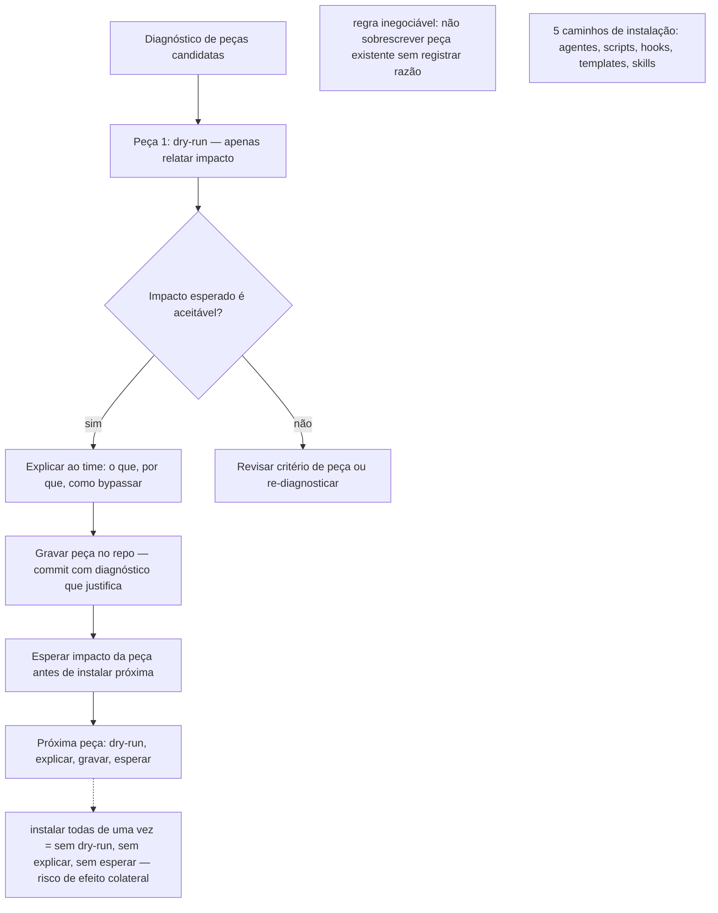

# Capítulo 10: Instalar sem destruir

## 1. Introdução

O capítulo anterior mostrou que o diagnóstico precede a instalação — e que instalar peça sem sintoma é custo sem benefício, e instalar peça de proteção de merge antes de ter suíte executável é hook que bloqueia tudo e developer bypassa. Este capítulo detalha o ritual de instalação que transforma a decisão de diagnóstico em ação sem destruir o repo: dry-run, explicar, gravar peça por peça — nunca "todas de uma vez" — e a regra inegociável de colisão [1][2].

Ao final deste capítulo você será capaz de, diante de um repo e de um diagnóstico de peças candidatas, instalar cada peça no ritmo de peça por peça — com dry-run antes de gravar, explicar antes de committing, e sem sobrescrever proteção existente sem registrar a razão.

## 2. Explica

Instalar sem destruir é o princípio que orienta a ordem e o ritmo de instalação: não instalar todas as peças de uma vez porque (1) cada peça, uma vez instalada, exige manutenção; (2) instalar peça sem dry-run pode introduzir comportamento surpresa que o time não espera; (3) instalar peça sem explicar pode gerar bypass porque o time não entende o mecanismo; (4) instalar peça que sobrescreve proteção existente sem registrar a razão apaga proteção sem rastreio [3][4].

O ritual de instalação é: para cada peça candidata do diagnóstico, (1) dry-run — aplicar a peça em modo de apenas relatar, sem bloquear, para saber o impacto; (2) explicar — comunicar ao time o que a peça faz, por que foi escolhida, e como bypassar em caso de emergência (com registro de motivo); (3) gravar — instalar a peça no repo, com commit que explica o que foi instalado e o diagnóstico que justificou; (4) esperar — observar o impacto da peça antes de instalar a próxima, porque instalar peça por peça permite detectar efeito colateral antes que múltiplas peças estejam ativas [5][6].

Cinco caminhos reais de instalação: agentes (agente de IA que aplica gate ou gera artefato), scripts (script de gate, diagnóstico, conversor), hooks (pre-commit, post-commit), templates (template de postmortem, template de registro), skills (skill de revisor, skill de compilador). Cada caminho tem ritmo próprio de instalação — e o diagnóstico orienta qual caminho usar para qual peça [1][7].

Regra inegociável de colisão: não instalar peça que sobrescreve peça existente sem registrar a razão. Se o repo já tem hook de lint e você instala gate que inclui lint, não apague o hook existente sem registrar que o gate agora centraliza a verificação — porque apagar sem registrar é perda de rastreio, e o próximo developer não sabe que o lint saiu do hook e agora está no gate [2][4].

## 3. Ilustra

Imagine um sistema de instalação de peças de segurança de um prédio onde cada peça é instalada uma de cada vez, com teste de impacto antes de tornar permanente — e cada instalação é registrada com motivo. Instalar todas as peças de uma vez sem teste de impacto é instalar com risco de efeito colateral não detectado — e uma peça que causa problema no prédio inteiro sem rastreio de qual peça causou. Em repo, o ritual de instalação é o teste de impacto antes de permanente — e o commit por peça é o registro de rastreio [3][6].



## 4. Técnica

A técnica de instalação é o ritual por peça — dry-run, explicar, gravar, esperar — aplicado a cada peça candidata do diagnóstico. A técnica também entrega os cinco caminhos reais de instalação e a regra inegociável de colisão [1][5].

### Ritual de instalação por peça

Para cada peça candidata do diagnóstico:

1. **Dry-run:** aplicar a peça em modo de apenas relatar, sem bloquear. Para gate: rodar gate em modo dry-run (relatar quantos arquivos falhariam, sem bloquear commit). Para hook: instalar hook em modo de apenas avisar (sem bloquear) por um período de observação. Para postmortem vira teste: gerar stubs em modo dry-run (relatar quantos stubs gerados) antes de integrar na suíte. Para registro: gerar registro em modo dry-run (relatar quantos arquivos teriam que ser refatorados) antes de refatorar.

2. **Explicar:** comunicar ao time o que a peça faz, por que foi escolhida (diagnóstico), e como bypassar em caso de emergência. A explicação é o que transforma a peça de "coisa que apareceu no repo" em "coisa que o time entende e aceita". O bypass é documentado com motivo — porque bypass sem registro é bypass sem rastreio.

3. **Gravar:** instalar a peça no repo, com commit que explica o que foi instalado e o diagnóstico que justificou. O commit de instalação não é "instalando peça X" — é "instalando peça X porque diagnóstico mostrou sintoma Y, dry-run mostrou impacto Z". O commit é o rastreio da decisão.

4. **Esperar:** observar o impacto da peça antes de instalar a próxima. Observar significa: quantos bypasses o hook gerou? Quantos falsos-positivos o gate gerou? Quantos incidentes o postmortem vira teste detectou? O impacto orienta a decisão de instalar a próxima peça ou revisar a atual.

### Cinco caminhos reais de instalação

1. **Agentes:**
- [ ] Defina o limite de instalação de agente: instalar agente em modo dry-run por pelo menos 2 sprints antes de tornar permanente — agente é comportamento não determinístico, e o dry-run longo captura comportamento surpresa que o dry-run curto não captura.
- [ ] Defina o contorno de instalação de agente: agente que gera artefato sem gate (peça 2) não deve ser instalado em modo permanente — agente sem verificação entrega comportamento sem rastreabilidade. agente de IA que aplica gate (roda gate no artefato gerado) ou gera artefato (capítulo de documento, configuração). Instalação de agente é a mais complexa porque agente é comportamento não determinístico — e o gate (peça 2) é o que verifica o que o agente gera. Instalar agente sem gate é instalar comportamento sem verificação — e o capítulo 3 mostrou que agente builder/critic ambíguo é sintoma de processo sem separação.

2. **Scripts:** script de gate (cap 4), script de diagnóstico (cap 5), conversor de postmortem para stub (cap 7), verificador de consistência de gate (cap 8). Script é a instalação mais simples porque script é comportamento determinístico — e o gate é o que verifica o script. Instalar script é instalar mecanismo que pode ser auditado por script.

3. **Hooks:** pre-commit (cap 6) que bloqueia commit vermelha. Instalar hook é instalar a linha de defesa local — e o diagnóstico orienta se o hook é prioridade antes ou depois de suíte executável.

4. **Templates:** template de postmortem (cap 7) que entrega molde com checkbox de prevenção, template de registro (cap 5) que entrega scaffold de dicionário. Template é instalação de padrão de documento — e o diagnóstico orienta se o template é prioridade antes ou depois da peça de mecanismo.

5. **Skills:** skill de revisor (cap 3, revisão de builder/critic), skill de compilador (compilador-abnt, Fase 3 do livro). Skill é instalação de comportamento de revisão ou compilação — e o diagnóstico orienta se a skill é prioridade antes ou depois da peça de mecanismo.

### Código: script de dry-run de instalação de peça (Python)

```python
# instalar_peca_dryrun.py — simula instalação de peça em modo dry-run, sem gravar no repo
# Critério objetivo: relata impacto esperado sem alterar arquivos.

import os
import re
import sys
import json
from pathlib import Path
from dataclasses import dataclass, field
from typing import Any

@dataclass
class ImpactoPeça:
    """Impacto esperado de instalação de uma peça: arquivos afetados, ações, risco."""
    peça: str
    ações: list[str] = field(default_factory=list)
    arquivos_afetados: list[str] = field(default_factory=list)
    risco: str = "baixo"
    nota: str = ""

class InstaladorDryRun:
    """Simula instalação de peças sem gravar no repo — reporta impacto esperado."""

    def __init__(self, caminho_repo: Path) -> None:
        self.repo = caminho_repo
        self.caminhos_py = list(caminho_repo.rglob("*.py")) + list(caminho_repo.rglob("*.js")) + list(caminho_repo.rglob("*.ts"))
        self.caminhos_md = list(caminho_repo.rglob("*.md"))
        self.caminhos_yaml = list(caminho_repo.rglob("*.yaml")) + list(caminho_repo.rglob("*.yml"))
        self.caminhos_hook = list(caminho_repo.rglob(".git/hooks/pre-commit")) + list(caminho_repo.rglob("*.hook"))
        self.caminhos_ci = list(caminho_repo.rglob(".github/workflows/*.yml")) + list(caminho_repo.rglob(".gitlab-ci.yml"))

    def dry_run_peca2(self) -> ImpactoPeça:
        """Dry-run de gate: relata quantos arquivos de configuração seriam verificados."""
        configs = self.caminhos_yaml + self.caminhos_json
        ações = ["escrever gate_canonico.py com critérios de presença/formato"] if configs else ["gate não necessário sem configuração"]
        return ImpactoPeça(
            peça="2: Gate determinístico",
            ações=ações,
            arquivos_afetados=[str(p) for p in configs] if configs else [],
            risco="baixo" if configs else "nenhum",
            nota=f"dry-run: {len(configs)} arquivo(s) de configuração seriam verificados pelo gate" if configs else "sem configuração para gate",
        )

    def dry_run_peca3(self) -> ImpactoPeça:
        """Dry-run de registro: relata quantos arquivos teriam que ser refatorados."""
        repeticoes: dict[str, list[str]] = {}
        for caminho in self.caminhos_py:
            try:
                texto = caminho.read_text(encoding="utf-8", errors="ignore")
            except OSError:
                continue
            for tipo in ("agente", "configuracao", "politica", "pipeline"):
                if tipo in texto and len(self.caminhos_py) > 1:
                    repeticoes.setdefault(tipo, []).append(str(caminho))
        multi = {k: v for k, v in repeticoes.items() if len(v) >= 2}
        ações = ["escrever scaffold de registro (registro_tipos.py) e refatorar consumidores para ler registro"]
        return ImpactoPeça(
            peça="3: Registro declarativo",
            ações=ações,
            arquivos_afetados=[str(p) for v in multi.values() for p in v],
            risco="médio" if multi else "baixo",
            nota=f"dry-run: {len(multi)} tipo(s) com critério em múltiplos arquivos — refatorar {sum(len(v) for v in multi.values())} arquivo(s)" if multi else "sem sintoma de espalhamento — registro não necessário agora",
        )

    def dry_run_peca4(self) -> ImpactoPeça:
        """Dry-run de hook: relata se hook existente bloqueia e quantos commits seriam afetados."""
        hooks = [p for p in self.caminhos_hook if p.is_file()]
        ações = []
        if hooks:
            bloqueia = any("return 1" in p.read_text(encoding="utf-8", errors="ignore") or "sys.exit(1)" in p.read_text(encoding="utf-8", errors="ignore") for p in hooks)
            if bloqueia:
                ações = ["hook de bloqueio já existente — revisar consistência com CI (cap 8)"]
                risco = "baixo"
                nota = "dry-run: hook bloqueia — não há ação de instalação, apenas revisão de consistência"
            else:
                ações = ["adicionar retorno de código não-zero ao hook existente para transformar em peça 4"]
                risco = "médio"
                nota = "dry-run: hook atual apenas avisa — adicionar bloqueio é mínimo (1 linha)"
        else:
            ações = ["escrever pre_commit_hook.py minimal que roda suíte e bloqueia com código não-zero"]
            risco = "médio"
            nota = "dry-run: sem hook — instalar hook minimal; verificar se suíte existe antes de instalar hook de bloqueio"
        return ImpactoPeça(
            peça="4: Nunca commitar vermelho",
            ações=ações,
            arquivos_afetados=[str(p) for p in hooks] if hooks else [],
            risco=risco,
            nota=nota,
        )

    def dry_run_peca5(self) -> ImpactoPeça:
        """Dry-run de postmortem vira teste: relata quantos stubs seriam gerados."""
        postmortems = [p for p in self.caminhos_md if "postmortem" in p.name.lower() or "incidente" in p.name.lower()]
        if not postmortems:
            return ImpactoPeça(
                peça="5: Postmortem vira teste",
                ações=["sem postmortem — não há ação de instalação agora"],
                arquivos_afetados=[],
                risco="nenhum",
                nota="dry-run: sem postmortem — peça 5 não ativa até surgir incidente documentado",
            )
        ações = [f"rodar postmortem_para_stub.py em cada postmortem para gerar stub de prevenções com condição objetiva"]
        return ImpactoPeça(
            peça="5: Postmortem vira teste",
            ações=ações,
            arquivos_afetados=[str(p) for p in postmortems],
            risco="baixo",
            nota=f"dry-run: {len(postmortems)} postmortem(ês) — gerar stubs e integrar na suíte",
        )

    def dry_run_peca6(self) -> ImpactoPeça:
        """Dry-run de CI/CD: relata se CI existe e se é consistente com hook local."""
        ci = [p for p in self.caminhos_ci if p.is_file()]
        local = [p for p in self.caminhos_hook if p.is_file()]
        ações = []
        risco = "baixo"
        if not ci:
            ações = ["escrever .github/workflows/ci-gate.yml com as mesmas etapas do hook local (formatação, lint, suíte, gate)"]
            risco = "médio"
            nota = "dry-run: sem CI — instalar workflow mínimo que bloqueia merge quando gate decide não"
        elif not local:
            ações = ["instalar hook local (peça 4) para detecção antes do commit — CI é segunda linha"]
            risco = "médio"
            nota = "dry-run: CI presente sem hook local — hook local é primeira linha de defesa"
        else:
            ações = ["verificar consistência de gate local/remoto com consistencia_gate.py"]
            nota = "dry-run: hook local e CI presentes — verificar se critério é o mesmo"
        return ImpactoPeça(
            peça="6: Hook + CI/CD",
            ações=ações,
            arquivos_afetados=[str(p) for p in ci] + [str(p) for p in local],
            risco=risco,
            nota=nota,
        )

    def gerar_relatório_impacto(self) -> list[ImpactoPeça]:
        """Gera relatório de impacto de dry-run para todas as peças."""
        return [
            self.dry_run_peca2(),
            self.dry_run_peca3(),
            self.dry_run_peca4(),
            self.dry_run_peca5(),
            self.dry_run_peca6(),
        ]

def main(caminho: str) -> int:
    repo = Path(caminho)
    if not repo.is_dir():
        print(f"ERRO: {caminho} não é diretório", file=sys.stderr)
        return 2
    instalador = InstaladorDryRun(repo)
    impactos = instalador.gerar_relatório_impacto()
    print("DRY-RUN DE INSTALAÇÃO DE PEÇAS")
    print("=" * 50)
    print(f"Repo: {repo}")
    print("AVISO: dry-run não altera arquivos — apenas relata impacto esperado\n")
    for impacto in impactos:
        print(f"[{impacto.peça}]")
        print(f"  Risco: {impacto.risco}")
        print(f"  Ações: {len(impacto.acoes)}")
        for ação in impacto.acoes:
            print(f"    - {ação}")
        if impacto.arquivos_afetados:
            print(f"  Arquivos afetados: {len(impacto.arquivos_afetados)}")
            for a in impacto.arquivos_afetados[:5]:
                print(f"    - {a}")
            if len(impacto.arquivos_afetados) > 5:
                print(f"    ... +{len(impacto.arquivos_afetados) - 5} mais")
        print(f"  Nota: {impacto.nota}")
        print()
    return 0

if __name__ == "__main__":
    if len(sys.argv) < 2:
        print("Uso: python instalar_peca_dryrun.py <caminho-do-repo>", file=sys.stderr)
        sys.exit(2)
    raise SystemExit(main(sys.argv[1]))
```

O script de dry-run entrega impacto esperado de cada peça sem alterar arquivos — e o que orienta a decisão de instalar ou não com base no impacto real, não na intenção. O dry-run é o primeiro passo do ritual de instalação (cap 10): antes de gravar, ver o impacto [1][4].

### Regra inegociável de colisão

Não instalar peça que sobrescreve peça existente sem registrar a razão. Se o repo já tem hook de lint e você instala gate que inclui lint, o gate pode substituir o hook de lint — mas o commit de instalação deve registrar: "gate agora centraliza verificação de lint; hook de lint existente foi substituído porque gate cobre o mesmo critério com origem centralizada no registro (peça 3)". O registro da razão é o que transforma a substituição de proteção em decisão de engenharia rastreável — e o que evita que o próximo developer perca a proteção de lint sem saber [2][7].

## 5. Aplica

Você tem diagnóstico de peças candidatas: gate (peça 2) por critério textual de chaves obrigatórias; registro (peça 3) por variável repetida em múltiplos arquivos; hook (peça 4) por hook existente que apenas avisa. O ritual de instalação: primeira peça é gate, porque gate é base para registro (registro registra critério do gate). Dry-run de gate mostra quantos arquivos teriam que corrigir — e o time decide a prioridade de correção. Depois de gate instalado e observado, segunda peça é registro — porque gate agora lê registro para critério de chaves. Dry-run de registro mostra quantos arquivos teriam que ser refatorados — e o time decide. Depois de registro, terceira peça é hook — porque hook agora aplica gate (e gate é instalado). Dry-run de hook mostra quantos commits teriam que ser bloqueados — e o time decide se hook é prioridade antes ou depois de suíte executável [3][5].

Um cenário real de instalação: repo com hook de lint existente e gate novo que inclui lint. A regra de colisão orienta: não apagar hook de lint sem registrar que gate agora centraliza verificação de lint — e o commit de instalação registra a razão. O time decide: manter hook de lint por enquanto (para reforço local) e deixar gate centralizar no CI (para verificação remota) — porque em repo grande, dupla verificação local/remota de lint é redundante, mas em repo pequeno, reforço local é benefício porque o developer fixa lint no contexto. A decisão é do time com base no diagnóstico, não automática [1][7].

Escala: em repo grande com múltiplos agentes, o ritual de instalação por peça é mais relevante porque o número de peças candidatas cresce — e instalar todas de uma vez é instalar com risco de efeito colateral não detectado. O dry-run é o que orienta o impacto de cada peça antes de permanente — e o commit por peça é o que rastreia a decisão [4][6].

## 6. Conclusão

Instalar sem destruir é o ritual que transforma a decisão de diagnóstico em ação sem destruir o repo: dry-run antes de gravar, explicar antes de committing, gravar por peça, esperar impacto antes da próxima — e a regra inegociável de colisão que evita apagar proteção existente sem registrar razão. Os cinco caminhos reais de instalação orientam o ritmo de cada peça — e o diagnóstico orienta a prioridade de cada peça. O próximo capítulo detalha a manutenção depois da instalação: manter vivo depois da instalação (cap 11). A peça de instalação é a que transforma diagnóstico em mecanismo — e é a que mais vezes é feita "todas de uma vez" sem dry-run, sem explicar, sem esperar — e é a que gera bypass e efeito colateral quando feita sem ritual [2][3].

## 7. Referências Bibliográficas

[1] MARTIN, R. C. *Agile Software Development: Principles, Patterns, and Practices*. Boston: Prentice Hall, 2002. ISBN 978-0135974543.

[2] MARTIN, R. C. *Clean Architecture: A Craftsman's Guide to Software Structure and Design*. 1. ed. Boston: Pearson, 2017. ISBN 978-0134434403.

[3] FOWLER, M. *Continuous Integration*. 2001. Disponível em: https://martinfowler.com/articles/continuousIntegration.html. Acesso em: 09 set. 2026.

[4] GOOGLE SRE. *Testing Release and Deployment*. In: *Site Reliability Engineering*. Disponível em: https://sre.google/sre-book/testing-releases/. Acesso em: 09 set. 2026.

[5] HUMBLE, J.; FARLEY, D. *Continuous Delivery: Reliable Software Releases through Build, Test, and Deployment Automation*. Boston: Addison-Wesley, 2010. ISBN 978-0321601945.

[6] BROWN, S.; BEYER, B.; et al. *Site Reliability Engineering: How Google Runs Production Systems*. Sebastopol: O'Reilly Media, 2016. ISBN 978-1491929124.

[7] CHACON, S.; STRAUB, B. *Pro Git*. 2. ed. Apress, 2014. Disponível em: https://git-scm.com/book/en/v2/Customizing-Git-Git-Hooks. Acesso em: 09 set. 2026.
