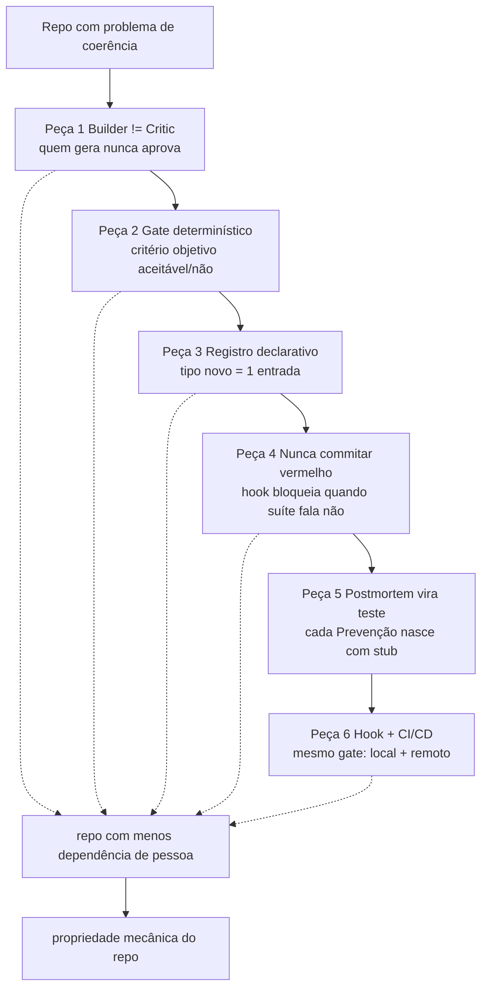

# Capítulo 2: As 6 peças em uma só frase cada

## 1. Introdução

Se o capítulo anterior mostrou que promessa é mais cara que lei, a pergunta seguinte é prática: o que, exatamente, vira lei quando se traduz a intenção para mecanismo? O capítulo 1 traçou quatro falhas archetípicas e a pergunta central — quais dessas promessas poderiam ser leis do repo. Este capítulo traz a resposta em mapa: seis peças que, usadas em conjunto, cobrem os pontos onde manualidade costuma substituir mecanismo. Cada uma será detalhada nos próximos seis capítulos; aqui o trabalho é só o mapeamento e a regra conservadora de quando introduzir.

Ao final deste capítulo você será capaz de, diante de um repo existente, dizer quantas das seis peças têm sentido para ele e em que ordem — sem instalar tudo de uma vez e sem gastar tempo com peças que não resolvem problema real.

## 2. Explica

O livro não sugere seis ferramentas isoladas — sugere um ecossistema onde cada peça reduz a dependência da vontade humana em um ponto diferente do ciclo de desenvolvimento. A separação entre elas não é acadêmica: é prática, porque instalar peça errada no ponto errado gera carga sem benefício, e instalar sem o mapa costuma produzir o efeito oposto ao pretendido [1][2].

Uma definição antes do mapa. Peça aqui é um princípio de engenharia que a coopération uma rotina, uma política, um artefato ou um mecanismo rastreável — algo que você pode nomear, descrever em uma frase e verificar que existe. O que não pode ser nomeado não pode ser instalado nem auditado [3].

As seis peças resolvem, em conjunto, o conjunto de pontos onde a manualidade mais comumente substitui mecanismo: quem aprova (separação), o que é aceitável (gate), como o repo sabe o que é novo (registro), quando o commit é permitido (hook), o que impede recorrência (teste de postmortem) e onde o gate é aplicado (local e remoto). Perder qualquer uma dessas camadas deixa um buraco que, em repo vivo, alguém eventually preenche com atenção humana — e atenção humana é o recurso que esgota primeiro sob pressão [4][5].

Um achado consistente em repos que crescem sem mecanismo: as quatro falhas do capítulo 1 não são independentes — elas se reforçam. Um repo sem gate permite commit vermelho; um repo com commit vermelho que falha sem hook permite o merge; um repo que merge sem postmortem-testável documenta a lição e não previne a recorrência; e um repo onde quem escreve também aprova nunca percebe que o mecanismo falta. O mapa das seis peças serve para mostrar que instalar só uma delas sem as outras pode ser menos útil do que instalar nenhuma — e mais caro, porque cria ilusão de controle [6][7].

Métrica deste capítulo: número de peças do mapa que você consegue associar a um problema real do seu repo antes de instalar qualquer uma — porque o diagnóstico precede a instalação, e o capítulo 9 detalha como fazer esse diagnóstico de forma rastreável.

## 3. Ilustra

Imagine um sistema de fingir de uma cidadezinha onde a segurança depende de vários agentes independentes: quem escreve o relatório não é quem o aprova; há um critério objetivo que decide se o relatório entra; o catálogo de relatórios é declarativo; o sistema não deixa publicar relatório reprovado; cada falha vira teste de regressão; e o mesmo critério é aplicado na CEOC e no tribunal. Tirar qualquer camada e a cidade não desmorona — mas a propriedade de segurança passa a depender de alguém lembrando, e lembrar é o que falha sob pressão.



## 4. Técnica

O mapa de mapeamento entrega, para cada peça, a pergunta que ela resolve, o custo de não ter, e quando introduzir. O formato é o mesmo para as seis — porque o padrão de decisão é o mesmo, e o padrão facilita a leitura em repos novos onde você ainda não conhece o histórico.

### Tabela de mapeamento das 6 peças

| # | Peça | Pergunta que resolve | Custo de não ter | Quando introduzir |
|---|---|---|---|---|
| 1 | Builder ≠ Critic | Quem aprova é diferente de quem escreveu? | Conflito de interesse estrutural no review | Quando há review humano no fluxo e quem escreve pode aprovar |
| 2 | Gate determinístico | O que é aceitável pode ser decidido por script? | Critério Textual que ninguém reproduz igual | Quando uma regra tem critério que pode ser escrito como condição boolean |
| 3 | Registro declarativo | Tipo novo exige editar muitos arquivos? | Sintoma: variável repetida em ≥2 arquivos de dispatch | Quando existe if/elif/switch que cresce com cada tipo novo |
| 4 | Nunca commitar vermelho | O commit pode entrar com suíte vermelha? | Commit vermelho que reach main porque hook auditivo | Quando há suíte de teste executável antes do commit |
| 5 | Postmortem vira teste | A recorrência do incidente pode ser detectada pelo repo? | Postmortem arquivado sem teste de regressão | Quando há incidente documentado com causa rastreável |
| 6 | Hook + CI/CD | O gate é aplicado apenas em um ponto do ciclo? | Gate local sem validação remota, ou remoto sem local | Quando há gate em um ponto e pipeline CI existente |

### Regra conservadora de introdução

Não instale peça porque ela está no mapa. Instale peça quando o diagnóstico de um repo mostra sintoma real dela. O diagnóstico — detalhado no capítulo 9 — é um relatório com seis campos que mapeado para as peças diz quais propor. A regra é: peça que resolve sintoma medido, em ordem de impacto, sem instalar peça de proteção de merge antes de ter suíte executável [1][7].

Um erro comum em repos que começam a introduzir mecanismo: instalar gate e hook sem registrar o que o gate decide — isso gera gate que ninguém consegue auditar depois, porque o critério vive na cabeça de quem escreveu o script. A peça 3 (registro declarativo) é o antídoto: critério do gate em formato declarativo, lido por script e por pessoa, sem dependência da memória do autor do script [2][3].

### Código: diagnóstico mínimo de sintoma da peça 1 em Python

```python
# diagnose_builder_critic.py — detecta sintoma de builder=critic em repo
# Uso: python diagnose_builder_critic.py <caminho-do-repo>
# Saída: lista de arquivos onde autor do PR e reviewer são mesma pessoa em review recente

import os
import sys
import json
from pathlib import Path
from collections import defaultdict

def carregar_reviews(caminho_repo: Path) -> list[dict]:
    """Carrega lista de reviews de .gitreviews.json (formato livre — adapte ao seu repo).
    Se o repo não tiver esse artefato, a peça 1 ainda é válida — o diagnóstico pergunta
    'o que eu teria que instrumentar para saber que builder=critic acontece?'.
    """
    arquivo = caminho_repo / ".gitreviews.json"
    if not arquivo.exists():
        return []
    with open(arquivo, encoding="utf-8") as f:
        return json.load(f)

def agrupar_por_pr(reviews: list[dict]) -> dict[str, list[dict]]:
    grupos = defaultdict(list)
    for r in reviews:
        pr = r.get("pull_request") or r.get("pr") or "desconhecido"
        grupos[pr].append(r)
    return dict(grupos)

def sintomas_builder_critic(reviews: list[dict]) -> list[dict]:
    """Detecta reviews onde autor do PR revisou/ aprovou seu próprio PR.
    Critério objetivo: quem abriu == quem aprovou. Sem nuance de LLM.
    """
    resultados = []
    for review in reviews:
        autor = review.get("author") or review.get("quem_abriu") or ""
        revisor = review.get("reviewer") or review.get("quem_aprovou") or ""
        if autor and revisor and autor.lower().strip() == revisor.lower().strip():
            resultados.append({
                "arquivo": review.get("arquivo") or "desconhecido",
                "pr": review.get("pull_request") or review.get("pr") or "desconhecido",
                "autor": autor,
                "revisora": revisor,
                "data": review.get("data") or "desconhecida",
            })
    return resultados

def main(caminho: str) -> int:
    repo = Path(caminho)
    if not repo.is_dir():
        print(f"ERRO: {caminho} não é diretório", file=sys.stderr)
        return 2
    reviews = carregar_reviews(repo)
    if not reviews:
        print("AVISO: sem .gitreviews.json — peça 1 não pode ser diagnosticada numericamente.\n"
              "Instrumentar coleta de reviews é o primeiro passo para tornar builder=critic auditável.\n"
              "Veja capítulo 3 para critérios objetivos de classificação builder/critic/ambíguo.")
        return 0
    por_pr = agrupar_por_pr(reviews)
    sintomas = sintomas_builder_critic(reviews)
    print(f"Reviews carregados: {len(reviews)}")
    print(f"PRs distintas: {len(por_pr)}")
    print(f"Sintomas builder=critic: {len(sintomas)}")
    for s in sintomas[:10]:
        print(f"  - PR {s['pr']}: {s['autor']} aprovou próprio {s['arquivo']} em {s['data']}")
    if len(sintomas) > 10:
        print(f"  ... mais {len(sintomas) - 10} sintomas (ver relatório completo)")
    return 0

if __name__ == "__main__":
    if len(sys.argv) < 2:
        print("Uso: python diagnose_builder_critic.py <caminho-do-repo>", file=sys.stderr)
        sys.exit(2)
    raise SystemExit(main(sys.argv[1]))
```

Esse script é o primeiro exemplo do padrão que o livro repete: diagnóstico é script determinístico, não opinião. Se o critério é 'quem abriu == quem aprovou', o script compara strings e reporta — sem julgamento, sem nuance, sem dependência de quem roda [4].

## 5. Aplica

Você entrou em um repo onde o README diz: "toda PR precisa de review de alguém que não seja o autor". A frase está lá. Mas nos últimos três meses, cinco PRs pequenas de configuração foram aprovadas pelo autor mesmo — porque "era coisa de dois minutos" e "não tinha ninguém mais na fila". O repo tem a regra em texto; o repo tem a promessa.

O mecanismo da peça 1 não é tornar impossível aprovar a si mesmo — é tornar visível quando isso acontece. Porque visível é o primeiro passo para decidirem juntos se a exceção vale a pena, e para o repo saber se a exceção é rara ou recorrente [5][6].

Um cenário real de instituição: time de 6 pessoas, repo com 40 contribuidores month, sem instrumentação de reviews. O diagnóstico da peça 1 começa perguntando: temos jeito de saber quantas PRs autor aprovou a si mesmo? Se a resposta é não, não instale a peça 1 como regra — instrumente a coleta antes. Porque regra sem visibilidade é promessa, e o capítulo 1 mostrou quanto custa promessa [1][7].

Escala: em repo pequeno (ate 8 pessoas, rotação baixa), a separação builder/critic é mais custoso de aplicar rigorosamente porque o pool de revisores é pequeno — nesse caso, a prioridade é a peça 2 (gate) e 4 (hook), que protegem o merge independentemente de quem está no turno. Em repo com turnover alto ou upstream de contribuição externa, a peça 1 entra antes, porque conflito de interesse estrutural escala com o número de pessoas que podem subir PRs [2][3].

### Exercício

- [ ] Liste todos os pontos de review do seu repo (Pull Request, código, documentação, deploy).
- [ ] Para cada ponto, responda: quem pode aprovar é sempre diferente de quem criou? Sim / às vezes / nunca.
- [ ] Para os pontos "às vezes" e "nunca", descreva em uma linha: o que teria que ser instrumentado para saber quando isso acontece.
- [ ] Para os pontos onde você consegue instrumentar, descreva em uma linha o critério objetivo de detecção (ex.: autor==revisora).
- [ ] Comite o relatório de diagnóstico (texto ou markdown) no repo antes de decidir se instala a peça 1 — porque instalar sem diagnóstico é instalar por moda, não por sintoma.

## 6. Conclusão

As seis peças não são um catálogo opcional — são um ecossistema onde cada uma protege um ponto diferente onde a manualidade costuma substituir mecanismo. O mapa deste capítulo entrega, para cada peça, a pergunta que resolve, o custo de não ter e quando introduzir. Os próximos seis capítulos entregam cada peça em detalhe: critérios objetivos, código executável, exercício prático e referências.

A lição do capítulo 2 que o resto do livro repete: peça por sintoma, não por catálogo. O diagnóstico é o que transforma a lista de seis peças em decisão de engenharia — e o capítulo 9 detalha como fazer esse diagnóstico de forma rastreável, com relatório que você pode comitar junto com a peça que ele justifica.

Escala: o mapa de mapeamento não depende de tamanho de repo — serve tanto para repo pessoal quanto para orgão com centenas de colaboradores. O que muda com o tamanho é a prioridade de instalação, e isso é decidido pelo diagnóstico, não pela moda.

## 7. Referências Bibliográficas

[1] MARTIN, R. C. *Agile Software Development: Principles, Patterns, and Practices*. Boston: Prentice Hall, 2002. ISBN 978-0135974543.

[2] MARTIN, R. C. *Clean Architecture: A Craftsman's Guide to Software Structure and Design*. 1. ed. Boston: Pearson, 2017. ISBN 978-0134434403.

[3] LYONS, K. *Thinking in Systems: A Primer*. Edited by Donella H. Meadows. 1. ed. White River Junction: Chelsea Green Publishing, 2008. ISBN 978-1603580552.

[4] MYERS, G. J. *The Art of Software Testing*. 2. ed. Hoboken: John Wiley & Sons, 2011. ISBN 978-0470404152.

[5] BROWN, S.; FARQUHAR, R. *Site Reliability Engineering: How Google Runs Production Systems*. Edited by Betsy Beyer et al. Sebastopol: O'Reilly Media, 2016. ISBN 978-1491929124.

[6] SANDERS, E. B.-N.; STAIRS, A. *Co-designing with an Interface: Mapping the Social and Technical in Collaborative Design*. In: *Design Issues*. Vol. 27, no. 2. Cambridge: MIT Press, 2011. Disponível em: https://www.jstor.org/stable/i40193390. Acesso em: 09 set. 2026.

[7] HUMBLE, J.; FARLEY, D. *Continuous Delivery: Reliable Software Releases through Build, Test, and Deployment Automation*. Boston: Addison-Wesley, 2010. ISBN 978-0321601945.
