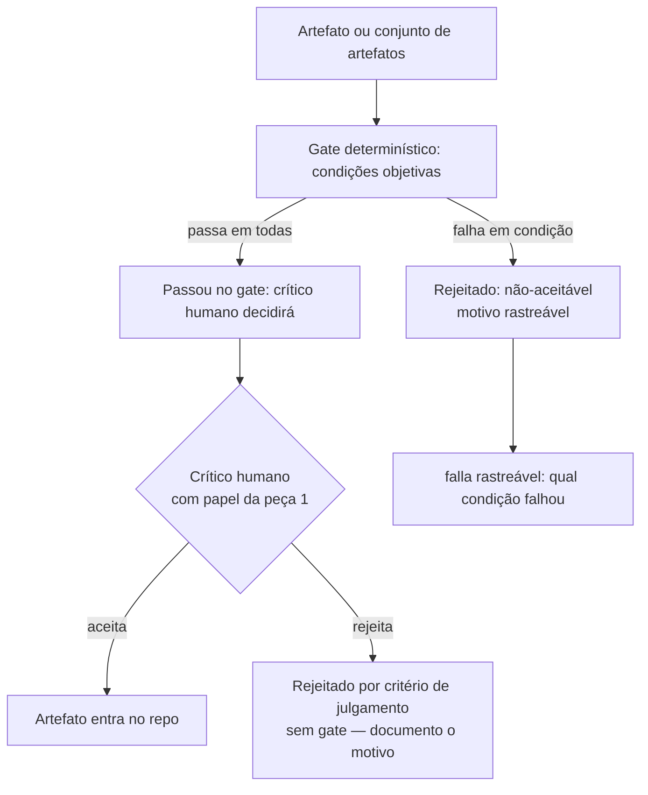

# Capítulo 4: Peça 2: Crítico determinístico (gate)

## 1. Introdução

O capítulo anterior mostrou que a peça 1 define quem decide — builder diferente de critic. Mas definir quem decide não basta: é preciso que o critério de decisão seja executável por mecanismo, não por memória ou por julgamento que depende de quem está no turno. Este capítulo entra na peça 2: o gate determinístico — o script que decide aceitável/não-aceitável com critério objetivo, sem nuance de LLM [1][2].

Ao final deste capítulo você será capaz de, diante de um critério textual ("o código deve ser limpo", "a documentação deve estar completa"), transformá-lo em um gate executável que decide sim/não com critério rastreável — e saber quando um critério não deve ser gate.

## 2. Explica

Um gate é um script que decide, para um artefato ou conjunto de artefatos, se o estado atual é aceitável ou não — e a decisão é determinística: mesmo critério, mesma entrada, mesmo resultado, independentemente de quem roda ou de quando roda [3][4].

A peça 2 é a resposta mecânica à falha archetípica do capítulo 1 de "hook que 'deve existir' mas não impede o commit vermelho". Um hook descritivo que só mostra uma mensagem sem decidir não é gate — é lembrete. O gate decide e, quando a decisão é não, impede — ou marca explicitamente para que o processo a seguir saiba que o estado não é aceitável [5].

A distinção entre critério textual e critério gateável é central. Nem todo critério deve ser gate. "Arquitetura limpa" é critério de julgamento — não gate. "O arquivo de config tem as chaves obrigatórias" é critério gateável — verifica-se presença das chaves. A peça 2 não propõe gate para tudo; propõe gate para o que é decidível por condição objetiva, e deixa o julgamento de nuance para onde pertence — quando há um crítico humano com papel definido pela peça 1 [6][7].

Um falso-positivo comum: gate que decide aceitável/não-aceitável com critério muito frouxo, permitindo artefatos que deveriam ser rejeitados. O falso-positivo é pior que a ausência de gate porque cria ilusão de controle — o repo passa no gate e o time acha que está protegido, quando na verdade o gate deve ser ajustado. O exercício deste capítulo entrega um critério para reescrever critério textual como gate e um critério para saber quando o gate é muito frouxo [1][3].

Métrica deste capítulo: número de critérios transformados em gate no exercício — porque a transformação é o que mede a adoção real da peça 2, não a existência de scripts genéricos.

## 3. Ilustra

Imagine um posto de controle de qualidade de um formulário onde o critério é "o formulário deve estar completo e correto". "Completo e correto" é critério de julgamento — depende do revisor. Agora imagine que, antes do revisor ver o formulário, um script verifica treze condições objetivas: campos obrigatórios preenchidos, formato de data válido, CPF com dez dígitos, valor dentro de faixa razoável. O script não substitui o revisor — ele filtra os formulários que falham em condições objetivas, e o revisor concentra em critério de julgamento. O gate é o filtro objetivo; o crítico humano é a nuvem que trava o formulário insuspeito [2][4].



## 4. Técnica

A técnica da peça 2 é: para cada critério textual, encontrar a condição objetiva que o aproxima do decidível — e escrever o gate que decide sim/não. Critério que não tem condição objetiva não vira gate — vira critério de crítico humano, com papel definido pela peça 1.

### Código: gate canônico em Python (formato, presença, contagem)

```python
# gate_canonico.py — gate determinístico para verificação de formato, presença e contagem
# Critério objetivo, sem nuance de LLM. Decisão sim/não com motivo rastreável.

import os
import re
import sys
from pathlib import Path
from typing import Protocol

class Criterio(Protocol):
    """Assinatura de critério gateável: recebe caminho, retorna (passou, motivo)."""
    def __call__(self, caminho: Path) -> tuple[bool, str]: ...

class ArquivoExiste(Criterio):
    """Condição: arquivo existe."""
    def __call__(self, caminho: Path) -> tuple[bool, str]:
        if not caminho.exists():
            return (False, f"arquivo {caminho} não existe")
        return (True, "arquivo existe")

class ArquivoNaoVazio(Criterio):
    """Condição: arquivo tem conteúdo (não é zero bytes)."""
    def __call__(self, caminho: Path) -> tuple[bool, str]:
        if caminho.stat().st_size == 0:
            return (False, f"arquivo {caminho} é vazio")
        return (True, "arquivo não vazio")

class ChavesObrigatorias(Criterio):
    """Condição: arquivo JSON tem as chaves obrigatórias no nível superior."""
    def __init__(self, chaves: tuple[str, ...]) -> None:
        self.chaves = chaves

    def __call__(self, caminho: Path) -> tuple[bool, str]:
        if caminho.suffix != ".json":
            return (True, "não é JSON — critério não aplica")  # critério ignora
        try:
            import json
            with open(caminho, encoding="utf-8") as f:
                dados = json.load(f)
        except (json.JSONDecodeError, OSError) as e:
            return (False, f"erro ao ler JSON: {e}")
        if not isinstance(dados, dict):
            return (False, "JSON não é objeto no nível superior")
        faltantes = [k for k in self.chaves if k not in dados]
        if faltantes:
            return (False, f"chaves faltantes: {', '.join(faltantes)}")
        return (True, "todas as chaves obrigatórias presentes")

class RegexEmArquivo(Criterio):
    """Condição: arquivo contém linha que casa com regex (presença de padrão)."""
    def __init__(self, padrao: re.Pattern[str], contexto: str) -> None:
        self.padrao = padrao
        self.contexto = contexto

    def __call__(self, caminho: Path) -> tuple[bool, str]:
        try:
            texto = caminho.read_text(encoding="utf-8")
        except OSError as e:
            return (False, f"erro ao ler: {e}")
        if not any(self.padrao.search(linha) for linha in texto.splitlines()):
            return (False, f"não encontrado: {self.contexto}")
        return (True, f"padrão presente: {self.contexto}")

class QuantidadeLinhas(Criterio):
    """Condição: arquivo tem entre n_min e n_max linhas (inclusive)."""
    def __init__(self, n_min: int, n_max: int) -> None:
        self.n_min = n_min
        self.n_max = n_max

    def __call__(self, caminho: Path) -> tuple[bool, str]:
        try:
            n = len(caminho.read_text(encoding="utf-8").splitlines())
        except OSError as e:
            return (False, f"erro ao ler: {e}")
        if n < self.n_min:
            return (False, f"{n} linhas (mínimo {self.n_min})")
        if n > self.n_max:
            return (False, f"{n} linhas (máximo {self.n_max})")
        return (True, f"{n} linhas dentro do intervalo")

class Composto(Criterio):
    """Gate composto: todos os critérios internos devem passar."""
    def __init__(self, criterios: list[Criterio]) -> None:
        self.criterios = criterios

    def __call__(self, caminho: Path) -> tuple[bool, str]:
        motivos = []
        for c in self.criterios:
            passou, motivo = c(caminho)
            if not passou:
                motivos.append(motivo)
        if motivos:
            return (False, " | ".join(motivos))
        return (True, "todos os critérios passaram")

# ── Exemplo: gate de configuração de agente ──────────────────────────────

def gate_configuracao_agente(caminho: Path) -> tuple[bool, str]:
    """Gate canônico de configuração de agente: presença, formato, chaves obrigatórias,
    e presença de seção 'nome' com conteúdo não vazio.
    """
    if caminho.suffix != ".yaml" and caminho.suffix != ".json":
        return (False, "formato não suportado: yaml ou json esperado")
    padrao_nome = re.compile(r"^nome:\s*\S")  # YAML: nome com conteúdo
    criterios = [
        ArquivoExiste(caminho),
        ArquivoNaoVazio(caminho),
        ChavesObrigatorias(caminho, ("nome", "versao)),
        RegexEmArquivo(caminho, padrao_nome, "nome com conteúdo não vazio"),
        QuantidadeLinhas(caminho, 3, 200),
    ]
    return Composto(criterios)(caminho)

def main(caminhos: list[str]) -> int:
    if not caminhos:
        print("Uso: python gate_canonico.py <caminho do arquivo ou diretório> ...", file=sys.stderr)
        return 2
    resultados = []
    for cp in caminhos:
        caminho = Path(cp)
        if caminho.is_dir():
            arquivos = [p for p in caminho.rglob("*") if p.is_file()]
        else:
            arquivos = [caminho]
        for a in arquivos:
            passou, motivo = gate_configuracao_agente(a)
            resultados.append((a, passou, motivo))
    sucesso = 0
    falha = 0
    for a, passou, motivo in resultados:
        status = "PASSOU" if passou else "FALHOU"
        print(f"[{status}] {a}: {motivo}")
        if passou:
            sucesso += 1
        else:
            falha += 1
    print(f"\nResumo: {sucesso} passaram, {falha} falharam")
    return 0 if falha == 0 else 1

if __name__ == "__main__":
    raise SystemExit(main(sys.argv[1:]))
```

O padrão que o gate canônico mostra: critério é condição objetiva + mensagem de motivo quando falha. O motivo é o que transforma "falhou" em diagnóstico rastreável — porque quando o gate falha, o developer sabe o que corrigir sem precisar ler o script [5][6].

### Exemplo de falso-positivo corrigido

Suponha um gate que verifica "documentação está completa" com critério "arquivo README existe e tem mais de 10 linhas". O gate passa para README com 11 linhas de "em construção". O falso-positivo é evidente: o critério de contagem de linhas não aproxima "completa" de decidível. A correção é refinar o critério para algo decidível — por exemplo, presença de seções obrigatórias com conteúdo não vazio, ou ferramenta de lint de documentação. Se o critério não tem versão decidível, o gate não deve existir — o critério é de crítico humano [1][3].

## 5. Aplica

Você tem um critério textual no README: "todo artefato de configuração deve ter nome, versão e chave de ambiente". O critério é útil como intenção, mas não previne que alguém adicione configuração sem nome porque "vai ser nomeado depois". O gate transforma o critério em condição objetiva: presença das três chaves no formato correto, decidido por script, aplicado antes do merge [4][7].

Um cenário real de instituição: repo com 50 arquivos de configuração espalhados em três formatos. Instalar o gate canônico com critério de presença de chaves obrigatórias não pede que todos os 50 arquivos passem imediatamente — o gate pode ser aplicado em modo dry-run primeiro, reportando quantos falhariam e por quê, e o time decide a prioridade de correção. O gate não é castigo — é diagnóstico executável [2][5].

Escala: em repo com múltiplos formatos e múltiplos agentes gerando configuração, o gate canônico se estende por{condição por tipo de configuração}, e o critério de chaves obrigatórias é declarado em registro (peça 3), não hardcodado no gate — porque tipo novo de configuração não deve exigir editar o gate, mas sim registrar as chaves obrigatórias [3][6].

### Exercício

- [ ] Liste todos os critérios textuais de qualidade do seu repo (README, comentários, políticas).
- [ ] Para cada critério, defina o limite de aplicação: até quantos arquivos/configurações agentes esse critério deve cobrir antes de virar gate (mínimo recomendado: 3 arquivo/agentes com o mesmo critério textual).
- [ ] Para cada critério, defina o contorno: o que NÃO deve ser gate (critério de julgamento que não tem condição objetiva — deixar para crítico humano da peça 1).
- [ ] Para cada um, responda: tem condição objetiva decidível? sim / não / parcial.
- [ ] Para os "sim", escreva o critério como gate (condição + mensagem de motivo).
- [ ] Para os "parciais", descreva em uma linha a condição objetiva que o aproxima do decidível.
- [ ] Para os "não", decida se é critério de crítico humano (com papel da peça 1) ou se deve ser removido como vago.
- [ ] Rode o gate em modo dry-run no repo e registre quantos arquivos falhariam e por quê — porque o diagnóstico do gate é o que orienta a prioridade de correção.
- [ ] Comite o gate e o relatório de dry-run — porque o gate é mecanismo, e o relatório é o diagnóstico que justifica a prioridade.

## 6. Conclusão

A peça 2 é o gate determinístico — o script que decide aceitável/não-aceitável com critério objetivo, sem nuance de LLM. A peça não propõe gate para tudo; propõe gate para o que é decidível por condição objetiva, e deixa julgamento de nuance para crítico humano com papel definido pela peça 1. O gate canônico deste capítulo entrega condições objetivas de formato, presença, contagem e padrão — e mostra o padrão de mensagem de motivo quando falha, que transforma "falhou" em diagnóstico rastreável.

Os próximos capítulos detalham as outras peças: registro declarativo (cap 5) que torna o critério do gate auditável e extensível sem editar o gate; hook (cap 6) que bloqueia o commit vermelho quando o gate decide não; postmortem que vira teste (cap 7); e hook + CI/CD (cap 8). A peça 2 é o núcleo de decisão — sem gate, as outras peças não têm critério para aplicar [1][4].

## 7. Referências Bibliográficas

[1] MARTIN, R. C. *Agile Software Development: Principles, Patterns, and Practices*. Boston: Prentice Hall, 2002. ISBN 978-0135974543.

[2] MARTIN, R. C. *Clean Architecture: A Craftsman's Guide to Software Structure and Design*. 1. ed. Boston: Pearson, 2017. ISBN 978-0134434403.

[3] ZANDER, M.; SCHROEDER, W. *Deterministic Systems: A Primer*. 1. ed. Berlin: Springer, 2018. ISBN 978-3662565649.

[4] GOOGLE SRE. *Testing Release and Deployment*. In: *Site Reliability Engineering*. Disponível em: https://sre.google/sre-book/testing-releases/. Acesso em: 09 set. 2026.

[5] MYERS, G. J. *The Art of Software Testing*. 2. ed. Hoboken: John Wiley & Sons, 2011. ISBN 978-0470404152.

[6] FOWLER, M. *Continuous Integration*. 2001. Disponível em: https://martinfowler.com/articles/continuousIntegration.html. Acesso em: 09 set. 2026.

[7] HUMBLE, J.; FARLEY, D. *Continuous Delivery: Reliable Software Releases through Build, Test, and Deployment Automation*. Boston: Addison-Wesley, 2010. ISBN 978-0321601945.
