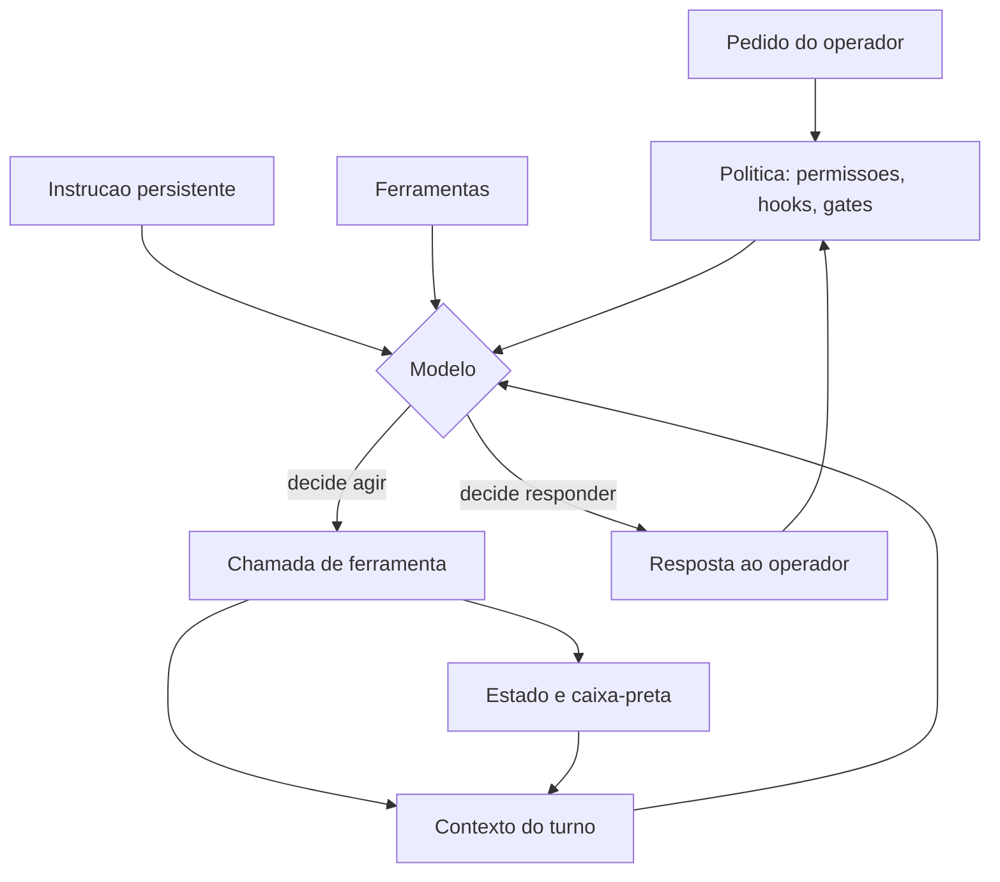

# Capítulo 1: O agente não é o modelo: anatomia de um harness

## 1. Introdução

Quando alguém diz "eu uso o modelo X para programar", a frase descreve menos do que parece. O modelo é uma função: recebe texto, devolve texto. O que você usa no dia a dia — aquilo que lê seus arquivos, roda seus testes, abre um pull request e lembra do que foi combinado — não é o modelo. É uma cabine construída em volta dele. Neste capítulo, vamos desmontar essa cabine peça por peça, nomear cada componente e mostrar por que a maior parte do resultado que você obtém não vem do modelo, e sim da engenharia que o cerca.

Ao final, você vai saber distinguir com precisão o que o provedor entrega do que é responsabilidade sua, vai conseguir descrever a anatomia de um agente em cinco componentes e vai aplicar um teste simples — o teste do desmonte — para descobrir onde está o valor real da sua configuração.

**Resumo em uma frase:** o modelo é o motor; o harness é a cabine, e é a cabine que decide se o voo chega ao destino.

## 2. Explica

Um LLM (modelo de linguagem de grande porte) é, na definição mais crua, uma função que estima a probabilidade do próximo token — a unidade mínima de texto que o modelo manipula, podendo ser uma palavra inteira ou um pedaço dela — dado o histórico de tokens anteriores [1]. Ele não tem memória entre chamadas, não tem nome, não tem projeto, não sabe em que pasta você está. Toda a sensação de continuidade que você experimenta é reconstruída a cada chamada, colando o histórico anterior na entrada. A pesquisa sobre agentes autônomos baseados em LLM descreve exatamente esse ponto de partida: o modelo é o componente de raciocínio, e o comportamento de agente emerge da composição desse raciocínio com memória, planejamento e uso de ferramentas [2].

O **harness** é essa composição: a camada de software que decide o que entra na janela, o que o modelo pode fazer e o que é verificado depois que ele faz. A palavra vem da engenharia de sistemas físicos — o chicote de fios e conectores que transforma um componente isolado em parte de uma máquina — e foi adotada na comunidade de agentes de código para designar o conjunto de software que orquestra o modelo. Cinco componentes aparecem em praticamente todo harness que funciona:

1. **Instrução persistente.** O texto que define papel, limites e convenções e que é reinjetado a cada turno. Pode morar em um arquivo de projeto (`AGENTS.md`), em arquivos de regras (`.cursor/rules/*.mdc`), em um prompt de sistema embutido ou nos três [3][4].
2. **Ferramentas.** As funções que o modelo pode invocar: ler arquivo, editar arquivo, executar comando, buscar na web, consultar um banco. Sem ferramentas, o agente só conversa; a partir delas, ele age sobre o mundo [5].
3. **Contexto.** O recorte do mundo que é colocado na janela a cada turno: trechos de código, saídas de comando, resultados de busca. É o recurso mais escasso do sistema e o mais mal gerenciado [6].
4. **Estado.** O que sobrevive entre turnos e entre sessões: arquivos de tarefa, bancos de dados, memória externa, o histórico da própria conversa. O modelo não tem estado; o harness fabrica um [7].
5. **Política.** As regras que não dependem de boa vontade: permissões de ferramenta, hooks de ciclo de vida, gates de validação, limites de custo e de tempo [4][8]. Um **hook** é um comando que o harness executa automaticamente em um evento do ciclo de vida — antes de uma ferramenta rodar, depois de um arquivo ser editado, no fim da sessão.

Note a assimetria fundamental: os quatro primeiros componentes são *capacidades*, e o quinto é *restrição*. Um agente de demonstração quase sempre investe nos quatro primeiros e negligencia o quinto. Um agente de produção faz o inverso — trata restrição como primeira classe, porque restrição é o que sobrevive quando o modelo muda de humor.

A segunda constatação é mais profunda: **o harness é a única parte do sistema que você pode tornar determinística**. Nenhuma temperatura, nenhuma semente, nenhuma instrução escrita em maiúsculas torna a saída de um modelo reprodutível de ponta a ponta [1]. Mas é perfeitamente possível garantir que um arquivo inválido nunca chegue ao repositório, que uma dependência vulnerável nunca seja instalada, que um commit com teste vermelho nunca seja criado. Essa garantia não vem do modelo: vem de código que roda depois dele. Modelos são probabilísticos; pipelines são determinísticos. Engenharia agêntica é a disciplina de decidir, para cada pedaço do trabalho, em qual dos dois mundos ele deve viver.

Vale desfazer uma confusão comum antes que ela se instale. Muita gente trata "harness" como sinônimo de "ferramenta que eu instalei". Não é. O harness é o conjunto das suas decisões de configuração: quais instruções são carregadas e em que ordem, quais ferramentas estão disponíveis, quanto de contexto entra, o que é verificado automaticamente, o que é registrado para auditoria. Duas pessoas com a mesma ferramenta e modelos diferentes podem ter harnesses quase idênticos; duas pessoas com a mesma ferramenta e o mesmo modelo podem ter harnesses radicalmente diferentes — e resultados radicalmente diferentes. O diferencial de qualidade mora aí.

Um terceiro ponto, menos óbvio: o harness é a camada que dá **portabilidade**. Se a sua inteligência de projeto está espalhada em comandos decorados e prompts colados no chat, trocar de modelo significa recomeçar. Se ela está em arquivos versionados — instruções, regras, definições de ferramenta, hooks —, trocar de modelo é uma decisão de custo, não uma refundação. É esse raciocínio que explica o movimento em torno de um padrão aberto de arquivo de instruções: um formato previsível, na raiz do repositório, que qualquer agente lê [3].

## 3. Ilustra

Pense na cabine de uma aeronave moderna. O piloto é extraordinariamente capaz — treinado, adaptativo, capaz de improvisar diante do inesperado. Mas ninguém entrega um avião a um piloto sem painel, sem checklist, sem alarme de estol e sem caixa-preta. Cada um desses instrumentos existe precisamente porque a cognição humana, embora excelente em situações novas, é inconsistente sob carga: cansa, pula etapas, esquece o óbvio.

O harness é a cabine do agente — e o paralelo é mais literal do que parece. O prompt de sistema é a **lista de procedimentos** afixada no painel: está sempre à vista. As ferramentas são os **comandos do painel**: superfície limitada, efeito conhecido. O contexto é o **para-brisa**: define o que você enxerga agora, e um para-brisa embaçado torna irrelevante a habilidade do piloto. O estado é a **caixa-preta**: registro do que aconteceu, consultável depois. A política são os **alarmes e o piloto automático**: agem sem pedir licença quando uma condição perigosa aparece.



Como Engenheiro de Bordo, você já deve ter notado o ponto central da analogia: o piloto não fica menos competente quando o painel está bem projetado — ele fica *consistente*. É exatamente isso que buscamos. Não estamos tentando fazer o modelo pensar melhor; estamos tentando garantir que ele opere dentro de uma cabine onde os erros caros são impossíveis por construção.

## 4. Técnica

Esta seção entrega o desenho concreto de um harness mínimo, a ordem de montagem e o procedimento para descobrir, na sua configuração atual, qual componente está carregando o seu resultado.

### Passo 1: escreva a instrução persistente antes de escolher qualquer ferramenta

A instrução persistente é o primeiro componente porque é o único que *explica os outros*. Um `AGENTS.md` útil responde a quatro perguntas: o que é este projeto, como rodar as coisas, o que nunca fazer, e qual é o contrato de qualidade.

```markdown
# AGENTS.md — Projeto Exemplo

### O que e
API de faturamento em FastAPI. Banco PostgreSQL. Sem fila externa.

### Como rodar
- Instalar: `pip install -r requirements.txt`
- Testes: `python -m pytest -q`
- Servir local: `uvicorn app.main:app --reload`

### Contratos de qualidade (nao negociaveis)
- Todo teste passa antes de qualquer commit.
- Nunca commitar credencial: conferir `git diff` antes.
- A resposta final sempre cita o arquivo alterado e o teste que valida.

### Fora de escopo
- Refatoracao de estilo sem pedido explicito.
- Troca de dependencia por preferencia pessoal.
```

O padrão aberto de arquivo de instruções foi desenhado justamente para ser lido por qualquer agente, e a prática consolidada recomenda mantê-lo curto e operacional, não enciclopédico [3][9]. Regras genéricas ("escreva código limpo") ocupam contexto e não mudam comportamento; contratos verificáveis ("todo teste passa antes do commit") mudam.

### Passo 2: declare ferramentas estreitas

O erro mais comum de iniciante é dar ao agente uma ferramenta "executar qualquer comando" e considerar o problema resolvido. Ferramenta larga é conveniente e perigosa: aumenta a superfície de erro, dificulta a auditoria e torna o comportamento dependente da boa educação do modelo. Prefira várias ferramentas estreitas. Este é o mesmo princípio dos servidores de ferramentas sob protocolo padronizado, que descrevem cada capacidade como uma unidade nomeada, com esquema de entrada explícito [5]:

```json
{
  "name": "run_tests",
  "description": "Executa a suite de testes do projeto e devolve o resumo. Nao aceita argumentos arbitrarios.",
  "input_schema": {
    "type": "object",
    "properties": {
      "modulo": { "type": "string", "description": "opcional: caminho do teste" }
    },
    "additionalProperties": false
  }
}
```

Observe o `additionalProperties: false`. Ele é a diferença entre "uma ferramenta que roda testes" e "uma ferramenta que roda qualquer coisa se o modelo inventar um campo a mais".

### Passo 3: defina a política antes de sentir dor

Política é onde vive o determinismo. Configure permissões e hooks no arquivo de configuração do seu harness. A forma exata varia por produto, mas a estrutura lógica é estável: um evento, um casador de padrão, um comando.

```json
{
  "permissions": {
    "allow": ["Bash(python -m pytest*)", "Bash(git diff*)", "Read(**)"],
    "deny": ["Bash(git push*)", "Bash(rm -rf*)", "Bash(curl*)"]
  },
  "hooks": {
    "PreToolUse": [
      {
        "matcher": "Bash",
        "hooks": [
          { "type": "command", "command": "python scripts/guard-comandos.py" }
        ]
      }
    ]
  }
}
```

Três decisões estão embutidas aí e todas são deliberadas. Primeiro: `git push` está negado — publicação é ato humano. Segundo: leitura é irrestrita, porque restringir leitura apenas empurra o agente para contornos piores. Terceiro: existe um guardião determinístico antes de qualquer comando de shell, e esse guardião é código seu, não uma instrução de prompt [8].

### Passo 4: dimensione o contexto como se fosse combustível

Contexto é o recurso que você queima a cada turno. Uma heurística simples para começar, antes de qualquer medição fina, é tratar cada turno como um voo curto com orçamento fixo:

| Componente do contexto | Orçamento sugerido | O que fazer quando estoura |
|---|---|---|
| Instrução persistente | até 10% | enxugar regras genéricas, quebrar em regras condicionais |
| Definição de ferramentas | até 10% | remover ferramenta não usada na tarefa |
| Arquivos e trechos citados | até 50% | buscar por trecho, nunca abrir arquivo inteiro |
| Histórico e saídas de comando | até 20% | comprimir saídas longas mantendo início e fim |
| Margem para o próximo turno | 10% mínimo | encerrar a tarefa antes de estourar |

Essa tabela não é lei; é um ponto de partida auditável. A **engenharia de contexto** é a disciplina de curar e manter o conjunto ótimo de tokens durante a inferência, e a literatura da área converge para as mesmas quatro operações — escrever, selecionar, comprimir, isolar —, mudando apenas o nome de cada uma [6][7].

### Passo 5: aplique o teste do desmonte

O teste do desmonte responde à pergunta que deveria anteceder qualquer compra ou migração: **quanto do meu resultado sobrevive à troca do modelo?**

Procedimento:

1. Escolha uma tarefa representativa e execute-a com o agente atual. Registre: comandos usados, tempo, custo, número de turnos, qualidade da saída.
2. Repita com um modelo deliberadamente diferente — mais fraco se o seu é forte, mais forte se o seu é fraco — mantendo *todo o resto idêntico*: mesmas instruções, mesmas ferramentas, mesma política.
3. Compare. O que degradou indica o que estava sendo compensado por capacidade bruta de modelo. O que se manteve indica o que está sustentado por harness.
4. Decida onde investir: se a tarefa degradou muito, o gargalo é contexto ou instrução mal escrita, não modelo. Se degradou pouco, você tem um harness portável — e agora pode otimizar custo.

```console
$ python scripts/medir-turno.py --tarefa corrigir-bug-1042 --modelo forte
tarefa............: corrigir-bug-1042
turnos............: 14
tokens_entrada....: 312.480
tokens_saida......: 18.204
custo_estimado....: 4.81
testes............: 34 passaram, 0 falharam
$ python scripts/medir-turno.py --tarefa corrigir-bug-1042 --modelo fraco
tarefa............: corrigir-bug-1042
turnos............: 21
tokens_entrada....: 298.117
tokens_saida......: 24.900
custo_estimado....: 0.94
testes............: 34 passaram, 0 falharam
```

A leitura correta desse resultado não é "o modelo fraco é melhor". É: *suponha que, nesta tarefa específica e com este harness, o modelo fraco passasse nos mesmos testes gastando uma fração do custo e alguns turnos a mais.* O harness absorveu a diferença. Esse é o tipo de evidência que decide uma arquitetura — e que só existe porque o painel estava instrumentado.

### Tabela de decisão: onde colocar cada peça

| Situação | Componente correto | Por quê |
|---|---|---|
| "Preciso que ele sempre rode os testes antes de terminar" | Política (hook de fim de turno) | Instrução no prompt é sugestão; hook é lei |
| "Ele não sabe o padrão de commit deste time" | Instrução persistente | Conhecimento estável, barato, reutilizável |
| "Ele abre arquivos enormes e trava" | Contexto (busca por trecho) | Problema de seleção, não de modelo |
| "Preciso que ele consulte o banco de staging" | Ferramenta estreita | Capacidade nova, com esquema restrito |
| "Ele esquece o que decidimos ontem" | Estado (arquivo de decisões) | Memória entre sessões não existe no modelo |
| "Ele às vezes escreve um JSON inválido" | Política (gate de schema) | Validação é determinística, não opinativa |

### Passo 6: inventarie o harness que você já tem

Antes de mudar qualquer coisa, produza um inventário. Quase todo time descobre, nesse exercício, que metade da sua configuração é invisível: existe na máquina de alguém, em um arquivo não versionado, ou em uma variável de ambiente herdada.

```python
#!/usr/bin/env python3
"""Inventaria artefatos de harness presentes no repositorio."""
from pathlib import Path

ALVOS = [
    ("instrucao persistente", ["AGENTS.md", "CLAUDE.md", "CONTRIBUTING.md"]),
    ("regras condicionais", [".cursor/rules", ".agent/rules"]),
    ("configuracao", [".agent/settings.json", ".mcp.json", "opencode.json"]),
    ("capacidades", [".claude/skills", ".claude/agents", ".claude/commands"]),
    ("hooks", ["scripts/hooks", ".git/hooks/pre-commit"]),
    ("gates", ["scripts/gate_1_eita_structure.py", "tests"]),
]


def inventariar(raiz="."):
    base = Path(raiz)
    linhas = []
    for categoria, candidatos in ALVOS:
        encontrados = [c for c in candidatos if (base / c).exists()]
        linhas.append({
            "categoria": categoria,
            "presentes": encontrados,
            "cobertura": f"{len(encontrados)}/{len(candidatos)}",
        })
    return linhas


if __name__ == "__main__":
    for linha in inventariar():
        print(f"{linha['categoria']:<22} {linha['cobertura']:<6} {', '.join(linha['presentes']) or '-'}")
```

O valor do inventário não está na lista em si, mas na comparação com o que o time *acha* que tem. Divergência entre o inventário e a percepção é o seu mapa de risco.

### Passo 7: avalie maturidade componente por componente

Um harness não é maduro ou imaturo como um todo: cada componente tem seu próprio estágio. Esta matriz ajuda a nomear onde você está em cada um.

| Componente | Nível 1 (funciona) | Nível 2 (confiável) | Nível 3 (auditável) |
|---|---|---|---|
| Instrução persistente | existe e é lida | curta, estável e versionada | com regras condicionais por escopo |
| Ferramentas | algumas ferramentas ligadas | esquema fechado e teto de saída | catálogo curado por uso |
| Contexto | tarefa cabe na janela | busca antes de abrir, compressão de saída | memória externa e isolamento por delegação |
| Estado | nada persiste | arquivo de tarefa por trabalho | estado versionado e retomável por terceiros |
| Política | nenhuma regra aplicada | permissões e hook de commit | gates encadeados com registro de auditoria |

O uso correto da matriz é escolher **um** componente e subir **um** nível por mês. Times que tentam subir todos ao nível 3 em um trimestre produzem configuração que ninguém entende e que é revertida na primeira semana difícil.

### Dois harnesses, a mesma tarefa

A tabela abaixo resume um experimento simples, repetível em qualquer projeto: a mesma tarefa executada por dois harnesses com o mesmo modelo.

| Aspecto | Harness A (só instrução) | Harness B (instrução + política + estado) |
|---|---|---|
| Instrução persistente | 120 linhas, com data no topo | 34 linhas, estável |
| Ferramentas | execução ampla liberada | 6 ferramentas estreitas |
| Contexto | abre arquivos por proximidade | busca por trecho, com teto |
| Estado | apenas histórico da conversa | arquivo de tarefa + decisões |
| Política | nenhuma | 4 negações, 2 hooks, 3 gates |
| Turnos até concluir | 41 | 17 |
| Testes passando na primeira tentativa | 38% | 89% |
| Artefatos rastreáveis a um veredito | nenhum | todos |

Note que o modelo é o mesmo nas duas colunas. A diferença inteira está na cabine — e a coluna da direita é mais barata, não mais cara, apesar de ter mais componentes.

### Falhas típicas por componente

| Componente | Sintoma observável | Causa provável |
|---|---|---|
| Instrução persistente | sessões lentas e respostas contraditórias | arquivo inflado com regras obsoletas |
| Ferramentas | agente “inventa” parâmetro | esquema aberto, sem validação |
| Contexto | decisões tomadas com informação parcial | leitura truncada sem aviso |
| Estado | trabalho refeito depois de pausa | nada persistido fora do histórico |
| Política | regra conhecida violada em produção | regra escrita, nunca executada por código |

Essa tabela funciona como diagnóstico rápido: encontre o sintoma, leia a causa, conserte o componente — em vez de tentar resolver tudo com um prompt melhor.

### Instrumentação do primeiro mês

No primeiro mês, três medições bastam. Elas são baratas e já mudam decisões.

```yaml
instrumentacao_minima:
  por_sessao:
    - turnos_totais
    - tokens_entrada
    - tokens_saida
  por_tarefa:
    - concluida_sem_intervencao (sim/nao)
    - artefato_verificado_por_gate (sim/nao)
  por_repositorio:
    - regras_declaradas
    - regras_verificadas_por_codigo
```

A última linha é a mais reveladora: a razão entre regras declaradas e regras verificadas é o indicador mais honesto de maturidade do harness. Um time com 40 regras escritas e 3 verificadas por código tem 37 promessas e 3 garantias.

```bash
# Coleta rapida: quantas regras existem e quantas sao verificadas
grep -c '^[-*]' AGENTS.md
ls scripts/gate_*.py 2>/dev/null | wc -l
```

## 5. Aplica

**A cena.** Você entra em uma startup de logística que acabou de trocar de harness. O time migrou do assistente antigo para o novo em um fim de semana, animado com o modelo mais recente. Segunda-feira, a primeira tarefa real: adicionar um campo `peso_kg` ao endpoint de cotação. Você pede, o agente responde bonito, mexe em três arquivos, escreve um teste, e no fim declara que está tudo certo.

Você faz o merge. Duas horas depois, o monitoramento aponta 500 em produção. A investigação revela o óbvio: o agente não rodou a suíte inteira — rodou o teste que ele mesmo escreveu. Ninguém tinha configurado a regra "todo teste passa antes de qualquer commit" no novo harness. Estava no prompt antigo, adicionado por alguém em uma terça-feira de 2024, e ninguém copiou. O diagnóstico não é "o modelo novo é pior". É que o time confundiu a ferramenta com o harness: migrou o motor e esqueceu a cabine. A regra que segurava o erro não estava no repositório — estava na memória de um prompt que ninguém versionou.

A correção é pequena e definitiva: a regra vai para o arquivo de instruções versionado, e um hook de pré-commit executa a suíte. A partir dali, nenhum agente, nenhum modelo e nenhum humano consegue criar um commit vermelho — não porque foi pedido com educação, mas porque foi impedido por código.

**Métricas que importam.** Ao migrar harness, acompanhe quatro números: taxa de tarefas concluídas sem intervenção humana; número de turnos por tarefa (proxy direto de custo); percentual de mudanças que passam nos testes na primeira tentativa; e custo médio por tarefa concluída. Um quinto, menos óbvio e mais valioso: quantas regras do seu harness são *verificadas automaticamente* contra o total de regras declaradas. Esse último número prediz quanta dor você vai sentir na próxima migração.

**Armadilhas comuns.** (a) *Enciclopédia de instruções*: `AGENTS.md` de 600 linhas que ninguém lê — nem o agente, que já gastou 15% da janela antes de começar. (b) *Ferramenta canivete suíço*: um único "executar comando" que anula a auditoria. (c) *Política fantasma*: configurar permissões no chat e não no arquivo versionado — some na próxima sessão. (d) *Contexto por vontade*: confiar que o agente vai "ler só o necessário" sem instrução explícita de busca. (e) *Desmonte nunca feito*: otimizar custo sem saber quanto do resultado é harness e quanto é modelo.

**Segunda cena.** Uma equipe troca de modelo e espera o salto de qualidade. O resultado é decepcionante: o agente continua cometendo os mesmos erros de antes, com um texto um pouco melhor. O diagnóstico, quando finalmente é feito, é o que este capítulo antecipou — o gargalo nunca esteve no motor. Três semanas depois, sem trocar o modelo de novo, a mesma equipe muda apenas a cabine: o arquivo de instruções encolhe de 700 para 42 linhas, três regras viram gates executáveis, o resultado de cada ferramenta passa a ser truncado e a sessão começa com um bloco de estado. O tempo até a primeira edição correta cai pela metade. O modelo foi o mesmo todo o tempo.

**Erros de julgamento.** O primeiro é confundir melhora de prosa com melhora de engenharia: um modelo novo escreve melhor e isso não significa que ele decide melhor. O segundo é investir em prompt antes de investir em verificação, quando a verificação é o que confere o direito de confiar. O terceiro é medir o harness por impressão — "parece que agora obedece" — em vez de por indicador. Um harness sem instrumento é opinião com sintaxe de configuração.

**Antipadrão observável.** Quando o mesmo comando do agente funciona na segunda tentativa sem que nada tenha mudado no repositório, o sistema está sinalizando que o determinismo não está no lugar. Esse é o sintoma de cabine ausente: o piloto voou bem hoje e talvez não voe amanhã, e ninguém sabe dizer por quê.

### Síntese operacional

| Componente do harness | O que decide | Sinal de que está faltando |
|---|---|---|
| Instrução | Como o agente se comporta | Decisões repetidas a cada sessão |
| Ferramenta | O que o agente alcança | Agente busca solução fora do sistema |
| Contexto | O que o agente vê | Respostas genéricas sobre o próprio projeto |
| Verificação | O que pode ser aceito | Erro descoberto por humano, depois |
| Orçamento | Quanto pode ser gasto | Custo imprevisível por tarefa |

Três regras que ficam com quem opera:

- **Separe motor de cabine.** Ao avaliar uma falha, pergunte primeiro qual instrumento faltava.
- **Meça antes de trocar.** Trocar de modelo sem indicador é trocar peça por intuição.
- **A cabine é do projeto.** Configuração que só existe na sua máquina não é arquitetura.

### Nota do revisor

Os três desvios mais comuns neste capítulo, em ordem de frequência:

1. **Atribuir ao modelo um problema de instrumento.** Quando o agente não encontra o arquivo certo, a hipótese mais provável é busca mal configurada, não falta de capacidade do motor. Verifique o instrumento antes de trocar a peça maior.
2. **Descrever o harness sem medir.** Listar agentes, skills e servers é inventário; o que prova valor é indicador. Inventário bonito com resultado instável continua sendo sistema instável.
3. **Configurar para si e não para o time.** Um harness que só funciona na máquina de quem o montou não é arquitetura: é hábito pessoal. Versionar tudo o que define comportamento é a fronteira.

## 6. Conclusão

Você aprendeu três coisas que reorganizam a forma de olhar para qualquer agente. Primeiro: o comportamento que você observa não é o modelo, é a composição de instrução, ferramentas, contexto, estado e política — e o modelo é apenas o motor dessa composição. Segundo: a única camada que você pode tornar determinística é o harness; por isso restrição e verificação valem mais, em produção, do que capacidade bruta. Terceiro: a portabilidade da sua inteligência de projeto depende de ela estar em arquivos versionados, não em memória de conversa.

**Seu turno.** Escolha uma tarefa que você executa com agente toda semana. Escreva, em um arquivo novo, as cinco linhas do seu harness atual: instrução persistente, ferramentas, fonte de contexto, fonte de estado e política. Marque com `[ ]` cada linha que hoje é verificada automaticamente. Conte quantas caixas ficaram vazias — esse é o seu passivo determinístico.

- [ ] Mapeei instrução persistente e onde ela vive
- [ ] Listei as ferramentas disponíveis e qual é a mais larga
- [ ] Identifiquei de onde vem o contexto de cada turno
- [ ] Identifiquei o que sobrevive entre sessões
- [ ] Escrevi qual regra é verificada por código, não por prompt

No próximo capítulo, pegamos a fronteira que ficou aberta aqui — probabilismo e determinismo — e transformamos em critério de projeto: para cada peça do trabalho, decidir em qual dos dois mundos ela vive.

## 7. Referências

[1] OPENAI et al. *GPT-4 Technical Report*. Disponível em: https://arxiv.org/abs/2303.08774. Acesso em: 12 set. 2026.
[2] WANG, Lei et al. *A survey on large language model based autonomous agents*. Disponível em: https://doi.org/10.1007/s11704-024-40231-1. Acesso em: 12 set. 2026.
[3] AGENTS.MD. *agentsmd/agents.md — Repositório oficial do padrão*. Disponível em: https://github.com/agentsmd/agents.md. Acesso em: 12 set. 2026.
[4] CURSOR. *Rules — Cursor Docs*. Disponível em: https://cursor.com/docs/rules. Acesso em: 12 set. 2026.
[5] MODEL CONTEXT PROTOCOL. *Server Features — Tools*. Disponível em: https://modelcontextprotocol.io/specification/2026-07-28/server/tools. Acesso em: 12 set. 2026.
[6] ANTHROPIC. *Effective context engineering for AI agents*. Disponível em: https://www.anthropic.com/engineering/effective-context-engineering-for-ai-agents. Acesso em: 12 set. 2026.
[7] LANGCHAIN. *Context Engineering*. Disponível em: https://www.langchain.com/blog/context-engineering-for-agents. Acesso em: 12 set. 2026.
[8] ANTHROPIC. *Automate actions with hooks — Claude Code Docs*. Disponível em: https://code.claude.com/docs/en/hooks-guide. Acesso em: 12 set. 2026.
[9] INFOQ. *AGENTS.md Emerges as Open Standard for AI Coding Agents*. Disponível em: https://www.infoq.com/news/2025/08/agents-md/. Acesso em: 12 set. 2026.
[10] XI, Zhiheng et al. *The Rise and Potential of Large Language Model Based Agents: A Survey*. Disponível em: http://arxiv.org/abs/2309.07864. Acesso em: 12 set. 2026.
[11] XU, Weikai et al. *LLM-Based Agents for Tool Learning: A Survey*. Disponível em: https://doi.org/10.1007/s41019-025-00296-9. Acesso em: 12 set. 2026.
[12] MOHAMMADI, Mahmoud et al. *Evaluation and Benchmarking of LLM Agents: A Survey*. Disponível em: https://doi.org/10.1145/3711896.3736570. Acesso em: 12 set. 2026.
[13] SAPKOTA, Ranjan; ROUMELIOTIS, Konstantinos I.; KARKEE, Manoj. *AI Agents vs. Agentic AI: A Conceptual Taxonomy, Applications and Challenges*. Disponível em: https://doi.org/10.1016/j.inffus.2025.103599. Acesso em: 12 set. 2026.
[14] ANTHROPIC. *All settings — Claude Code Docs*. Disponível em: https://code.claude.com/docs/en/settings-reference. Acesso em: 12 set. 2026.
[15] ANTHROPIC. *Subagents in the SDK — Claude Code Docs*. Disponível em: https://code.claude.com/docs/en/agent-sdk/subagents. Acesso em: 12 set. 2026.
[16] ANTHROPIC. *Agent Skills — Overview*. Disponível em: https://platform.claude.com/docs/en/agents-and-tools/agent-skills/overview. Acesso em: 12 set. 2026.
[17] MODEL CONTEXT PROTOCOL. *Specification (2025-06-18)*. Disponível em: https://modelcontextprotocol.io/specification/2025-06-18. Acesso em: 12 set. 2026.
[18] GIT. *git-worktree — Referência oficial*. Disponível em: https://git-scm.com/docs/git-worktree. Acesso em: 12 set. 2026.
[19] ORCA. *What is Orca? — Orca Docs*. Disponível em: https://www.onorca.dev/docs. Acesso em: 12 set. 2026.
[20] GRESHAKE, Kai et al. *Not What You've Signed Up For: Compromising Real-World LLM-Integrated Applications with Indirect Prompt Injection*. Disponível em: https://doi.org/10.1145/3605764.3623985. Acesso em: 12 set. 2026.
