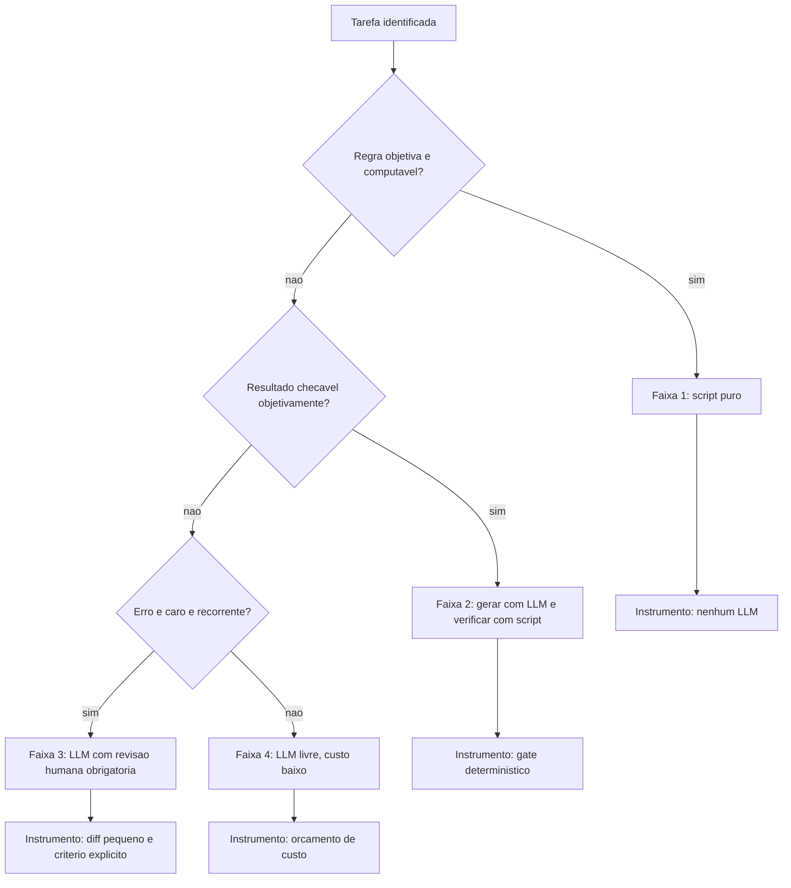

# Capítulo 2: Probabilismo e determinismo: onde cada um manda

## 1. Introdução

No Capítulo 1, você desmontou o agente em cinco componentes e viu que apenas um deles — a política — tem vocação para ser determinística. Agora vamos transformar essa observação em método: para cada pedaço de trabalho, decidir se ele deve viver no mundo probabilístico do modelo ou no mundo determinístico do código. Essa decisão, tomada dezenas de vezes em um projeto real, é o que separa um agente que "às vezes funciona" de um sistema em que se pode confiar.

Ao final, você vai entender por que nenhuma configuração torna um LLM reprodutível de ponta a ponta, vai saber classificar cada tarefa em quatro categorias de confiabilidade e vai construir sua primeira barreira determinística — uma verificação que impede o erro caro de chegar ao destino, não importa o que o modelo decida fazer.

**Resumo em uma frase:** deixe o modelo decidir o que é ambíguo e obrigue o código a garantir o que é crítico.

## 2. Explica

Comece pelo desconforto: você não consegue fazer um LLM ser determinístico. Não é falta de jeito. A geração de texto é uma amostragem de uma distribuição de probabilidades [1]. Reduzir a temperatura a zero, fixar a semente, repetir exatamente o mesmo prompt — nada disso garante saída idêntica entre duas execuções do mesmo serviço, e muito menos entre versões diferentes do mesmo modelo. Pesquisas de avaliação de agentes mostram que pequenas variações de prompt, ordem de ferramentas e estado do ambiente produzem mudanças relevantes de resultado [2]. A reprodutibilidade não é uma propriedade que se liga; é uma propriedade que se conquista por fora do modelo.

Três termos aparecem o tempo todo nesta obra e vale fixá-los agora. LLM é o modelo de linguagem de grande porte, que gera texto por amostragem probabilística. Token é a unidade mínima de texto que esse modelo processa — pode ser uma palavra curta inteira ou um pedaço de palavra. Harness é a camada de software em volta do modelo que decide o que entra na janela, o que ele pode executar e o que é verificado depois.

**Determinismo**, aqui, não significa "mesma saída para mesma entrada" no sentido acadêmico estrito. No contexto de engenharia agêntica, determinismo significa: **a verificação é determinística, mesmo quando a produção não é**. Você não controla o caminho, mas controla as portas. Essa mudança de perspectiva é a chave do capítulo. Um sistema é confiável quando a única coisa que precisa ser verdadeira sobre a saída do modelo é que ela passa por um teste que você escreveu.

Considere o que acontece quando um teste falha. A resposta "o teste falhou" é binária, reprodutível e auditável. Isso vale para uma suíte de testes, para um validador de esquema JSON, para um linter, para uma checagem de tipo, para um script que verifica se todas as citações de um documento existem na bibliografia. Nenhum desses verificadores usa um LLM. Todos produzem exatamente o mesmo veredito diante da mesma entrada. É nesse andar do prédio que você constrói a confiança.

Agora a parte difícil: nem tudo pode ser verificado, e nem tudo que pode ser verificado vale o custo. Existe um espectro com quatro faixas úteis [3][4]:

1. **Determinístico por construção.** Aqui o modelo nem entra: contar palavras, validar um JSON, checar se um arquivo existe, comparar duas listas. Custo de verificação próximo de zero, precisão total. Se o seu problema cabe aqui, mantenha-o aqui.
2. **Determinístico por verificação.** A produção é probabilística, mas o resultado é checável de forma objetiva: um trecho de código que compila e passa nos testes, um documento que satisfaz um esquema, uma extração que bate com a fonte. É a faixa mais rentável do ponto de vista de engenharia — o modelo faz o trabalho pesado e o script decide se valeu.
3. **Probabilístico com revisão humana.** A saída é boa o suficiente para acelerar, mas ninguém assina sem ler: um parecer técnico, uma decisão de arquitetura, um e-mail para um cliente importante. Nessa faixa, o que você constrói não é verificação automática, é *revisão eficiente* — diff pequeno, contexto claro, critério explícito.
4. **Probabilístico e aceito como tal.** Exploração criativa: brainstorm, rascunho, propostas alternativas. Forçar determinismo aqui destrói o valor. A única proteção necessária é o custo: barato de gerar, barato de descartar.

Um erro de projeto clássico é colocar na faixa 4 algo que pertence à faixa 2. Pedir ao modelo, em linguagem natural, que "confira se o schema está correto" é caro, lento e não confiável — quando um validador de esquema faz isso em milissegundos, de graça e sem errar. O erro simétrico é colocar na faixa 1 algo que é intrinsecamente ambíguo — tentar escrever uma regra determinística para "este parágrafo está bem escrito" leva a heurísticas frágeis que rejeitam texto bom e aprovam texto ruim.

Há também uma assimetria econômica que vale interiorizar. **Verificação é barata; geração é cara.** Um gate que reprova custa frações de centavo; um capítulo reescrito custa dólares e minutos. Por isso a regra prática é assimétrica: na dúvida sobre se vale automatizar uma verificação, automatize — desde que ela seja objetiva. O retorno vem da falha que você *não* precisou investigar.

Depois, há o efeito de segunda ordem, que é o verdadeiro motivo de separar esses mundos: **um harness com boas verificações permite usar modelos mais baratos**. Se a saída é checada, o custo de errar cai, e você pode trocar capacidade bruta por custo. Sem verificação, cada economia de modelo se converte em risco. Mais adiante, no Capítulo 13, vamos usar exatamente esse raciocínio para decidir roteamento de modelos — mas ele nasce aqui.

Por último, note o papel do **relatório de verificação**. Um gate não serve só para reprovar; serve para *explicar*. "Falhou: 3 citações órfãs nos capítulos 4, 9 e 12" é uma instrução de correção perfeita, precisa e barata. É por isso que um bom gate devolve o motivo com localização exata, e não apenas um erro genérico. O agente seguinte consome esse relatório como contexto — e nós já sabemos que contexto é o recurso mais caro da cabine.

## 3. Ilustra

Volte à cabine. O piloto decide continuamente: quanto de potência, qual ângulo, quando iniciar a descida. Nada disso é determinístico — é julgamento, informado por experiência e pelos instrumentos. Mas há uma categoria inteira de sistemas na aeronave que **não pede opinião a ninguém**. Quando o ângulo de ataque se aproxima do limite, o alarme de estol soa. Quando a pressurização cai, a máscara cai sozinha. Quando o trem de pouso não está travado, a luz é vermelha. O piloto pode discordar do alarme; o alarme não negocia.



Os três primeiros instrumentos — script puro, gate e revisão com diff pequeno — são os alarmes da cabine. O quarto, o orçamento de custo, é o combustível: na faixa 4, você não controla a qualidade da ideia, controla quanto pode gastar gerando ideias. Note como essa organização responde à pergunta que parecia insolúvel no início do capítulo: como confiar em algo que não é determinístico? Confiando no que está em volta dele.

## 4. Técnica

Esta seção constrói a barreira determinística em quatro movimentos: um gate mínimo funcional, a classificação das tarefas do seu projeto, a medição do que o gate já evitou, e a regra de ordem de execução.

### Movimento 1: um gate mínimo que reprova por contrato

Um gate é um script com uma única responsabilidade: receber um artefato, devolver zero se ele é válido e diferente de zero se não é, imprimindo o motivo com localização. Comece pelo gate mais barato e mais universal — verificação de esquema.

```python
#!/usr/bin/env python3
"""Gate minimo: valida o esquema de um JSON de configuracao."""
import json
import sys
from pathlib import Path

CAMPOS_OBRIGATORIOS = ("tema", "tipo_obra", "min_referencias_por_capitulo")


def validar(caminho):
    erros = []
    try:
        dados = json.loads(Path(caminho).read_text(encoding="utf-8"))
    except json.JSONDecodeError as exc:
        return [f"JSON invalido em {caminho}:{exc.lineno}: {exc.msg}"]

    for campo in CAMPOS_OBRIGATORIOS:
        if campo not in dados:
            erros.append(f"{caminho}: campo obrigatorio ausente -> {campo}")

    refs = dados.get("min_referencias_por_capitulo")
    if isinstance(refs, int) and not (1 <= refs <= 20):
        erros.append(f"{caminho}: min_referencias_por_capitulo fora de 1..20 -> {refs}")

    return erros


if __name__ == "__main__":
    if len(sys.argv) < 2:
        print("uso: python gate_config.py <arquivo.json>")
        sys.exit(2)
    problemas = validar(sys.argv[1])
    for p in problemas:
        print(f"[REPROVADO] {p}")
    sys.exit(1 if problemas else 0)
```

Três detalhes fazem esse script valer mais do que parece. Primeiro, ele devolve **código de saída** — é isso que o transforma em lei, porque o shell, o hook e a esteira de integração entendem códigos de saída. Segundo, ele imprime **arquivo e campo**, não apenas "inválido". Terceiro, ele não conhece LLM: roda em milissegundos e nunca varia.

### Movimento 2: classifique o trabalho antes de automatizar

Percorra as tarefas do seu projeto e escreva a faixa de cada uma. A tabela abaixo é um exemplo preenchido de um projeto de publicação técnica:

| Tarefa | Faixa | Instrumento | Quem verifica |
|---|---|---|---|
| Contar páginas do PDF final | 1 | contador de páginas | script |
| Validar formato das referências | 1 | expressão regular | script |
| Escrever um capítulo | 2 | gate de estrutura EITA | script |
| Escrever o resumo comercial da obra | 3 | revisão humana | pessoa |
| Gerar dez títulos alternativos | 4 | orçamento de custo | ninguém |
| Decidir a ordem das partes do livro | 3 | revisão humana | pessoa |

Duas leituras importam nessa tabela. A primeira é que apenas duas das seis tarefas pertencem ao mundo probabilístico sem verificação — e ambas são baratas de descartar. A segunda é que nenhuma tarefa de alta consequência ficou sem instrumento. Esse é o objetivo do exercício: não eliminar a probabilidade, mas garantir que ela nunca seja a última palavra em algo irreversível.

### Movimento 3: meça o que o gate já evitou

Gate que ninguém mede é gate que ninguém mantém. Registre cada reprovação com data, gate e motivo, e revise o registro semanalmente.

```json
{
  "gate": "gate_estrutura_eita",
  "artefato": "cap_07.md",
  "data": "2026-09-12",
  "resultado": "reprovado",
  "motivos": ["secao 4 com 0 blocos de codigo", "citacao orfa [19]"],
  "custo_evitado_estimado_usd": 0.42,
  "tempo_evitado_min": 11
}
```

O campo `custo_evitado_estimado` é uma estimativa grosseira e ainda assim extremamente útil: ele transforma "boas práticas" em número. Depois de um mês, você saberá quais gates pagam o próprio custo de manutenção. Gates que nunca reprovam nada em trinta dias são candidatos a simplificação — ou a estarem quebrados.

### Movimento 4: fixe a ordem de execução

A ordem correta é sempre do mais barato para o mais caro, do mais objetivo para o mais subjetivo:

1. Verificação de forma (sintaxe, esquema, arquivo existe).
2. Verificação de contrato (campos obrigatórios, limites de tamanho, citações rastreáveis).
3. Verificação de mérito (testes passam, exemplo executa, métrica dentro da meta).
4. Julgamento (revisão humana ou revisão por modelo com rubrica explícita).

```bash
# Esteira de verificacao: para no primeiro erro, do mais barato ao mais caro
python scripts/validar-forma.py "$ARTEFATO" || exit 1
python scripts/validar-contrato.py "$ARTEFATO" || exit 1
python scripts/validar-merito.py "$ARTEFATO" || exit 1
echo "[OK] artefato liberado para revisao humana"
```

O operador `|| exit 1` é o coração do determinismo: nenhuma etapa seguinte roda sobre um artefato que falhou na anterior. Isso evita o pior cenário possível em uma esteira — gastar tokens caros revisando algo que já se sabia inválido.

### Tabela de decisão: modelo ou código?

| Pergunta | Se sim | Se não |
|---|---|---|
| A regra pode ser escrita como comparação exata? | código | próxima |
| O resultado é checável por um script? | código verifica, modelo gera | próxima |
| O erro é caro e recorrente? | revisão humana obrigatória | próxima |
| O custo de gerar é baixo? | modelo livre | modelo livre, com teto de custo |

### Movimento 5: classifique uma tarefa nova em menos de um minuto

O método do capítulo fica útil quando vira rotina. Use esta sequência para qualquer tarefa que apareça pela primeira vez.

| Passo | Pergunta | Se sim | Se não |
|---|---|---|---|
| 1 | Existe regra objetiva que resolve sem modelo? | faixa 1: script puro | passo 2 |
| 2 | A saída é checável por script? | faixa 2: gerar e verificar | passo 3 |
| 3 | O erro é caro e recorrente? | faixa 3: revisão humana | faixa 4: livre |
| 4 | Já existe gate cobrindo essa saída? | reusar o gate | criar o gate |
| 5 | O custo de verificar é menor que o de corrigir? | automatizar | revisão humana amostral |

A quinta pergunta é a que separa rigor de teatro. Verificação que custa mais que o erro que previne é burocracia; verificação que custa uma fração do erro é engenharia.

### Movimento 6: decida quando a verificação precisa de humano

Nem toda verificação automatizável deve ser automatizada, e nem toda verificação humana é julgamento legítimo. A fronteira fica clara quando se separa **consistência** de **consequência**.

| Situação | Verificação adequada | Motivo |
|---|---|---|
| Formato de arquivo, esquema, tamanho | só script | objetivo, sem interpretação |
| Conteúdo factual com fonte | script + amostragem humana | a fonte pode estar errada de forma consistente |
| Mudança em contrato público de API | humano obrigatório | consequência fora do repositório |
| Ação irreversível (publicar, apagar, pagar) | humano obrigatório | não há desfazer |
| Estilo e tom de documento | amostragem humana | julgamento, sem regra objetiva |
| Cálculo com fórmula definida | só script | reproduzível por definição |

Uma heurística útil: se o dano é reversível com um comando, automatize; se exige pedido de desculpas, não.

### O que faz um motivo de reprovação ser útil

Um gate informa; um bom gate orienta. A diferença está na composição do motivo.

| Motivo ruim | Problema | Motivo bom |
|---|---|---|
| "documento inválido" | não localiza | "cap_07.md seção 4: 0 blocos de código" |
| "faltam referências" | não quantifica | "cap_09.md: 12 referências (mínimo 20)" |
| "erro no JSON" | não indica onde | "config.json:14: vírgula final inválida" |
| "teste falhou" | não diferencia causa | "tests/test_api.py:88 — esperado 200, obtido 500" |
| "comando proibido" | não justifica | "git push bloqueado: publicação é ato humano" |

O padrão comum aos bons motivos é sempre o mesmo: **localização + grandeza + expectativa**. Com esses três elementos, a correção deixa de exigir investigação e passa a ser execução.

### Três verificações que pagam o próprio custo

Nem toda verificação tem o mesmo retorno. Estas três costumam pagar o custo de implementação na primeira semana.

| Verificação | Custo de implementar | O que previne |
|---|---|---|
| Esquema fechado em toda saída estruturada | 1 hora | erro silencioso de campo inventado |
| Execução real do exemplo do documento | 2 horas | código que nunca rodou e foi publicado |
| Rastreabilidade de citação | 2 horas | afirmação sem fonte em material publicado |

Em contrapartida, estas costumam custar mais do que economizam e merecem esperar: validação estilística de prosa por heurística frágil, verificação de ortografia específica de domínio sem dicionário curado e qualquer checagem que dependa de julgamento disfarçado de regra.

### Instrumentação: um painel de reprovações

Registre cada reprovação com o mesmo formato, para que a leitura semanal seja mecânica.

```yaml
registro_reprovacao:
  campos:
    - data
    - gate
    - artefato
    - motivo_localizado
    - corrigido_em: "numero de turnos ate a correcao"
    - custo_evitado_estimado_usd
  leitura_semanal:
    - reprovacoes_por_gate
    - tempo_medio_ate_correcao
    - gates_sem_reprovacao_ha_30_dias
```

```python
def saude_do_gate(registros, gate, dias=30):
    """Indica se um gate esta trabalhando ou virou decoracao."""
    do_gate = [r for r in registros if r["gate"] == gate][-dias:]
    reprovacoes = [r for r in do_gate if r["resultado"] == "reprovado"]
    if not do_gate:
        return {"gate": gate, "estado": "sem execucao registrada"}
    if not reprovacoes:
        return {"gate": gate, "estado": "suspeito: aprovou tudo em 30 dias"}
    return {
        "gate": gate,
        "estado": "ativo",
        "taxa_reprovacao": round(len(reprovacoes) / len(do_gate), 3),
        "turnos_ate_correcao": round(sum(r["corrigido_em"] for r in reprovacoes) / len(reprovacoes), 1),
    }
```

Um gate que aprova tudo em trinta dias está quebrado, mal calibrado ou desativado — e as três possibilidades produzem o mesmo efeito no sistema: a ausência de verificação disfarçada de controle.

## 5. Aplica

**A cena.** Você é responsável por uma esteira que publica um relatório técnico semanal. O time pediu velocidade, você entregou: um agente que recebe os dados brutos, escreve o relatório, e publica direto na intranet. Durante três semanas, funciona. Na quarta, um campo chega vazio na origem — um bug no sistema de vendas. O agente, cumprindo a instrução de "escrever o relatório com os dados disponíveis", preenche o espaço com uma estimativa plausível. Ninguém verifica. O relatório vai para a diretoria com um número inventado.

A investigação mostra o que faltava: nenhuma verificação. O agente fez exatamente o que foi mandado; o harness falhou em exigir que todo número tivesse origem rastreável. O diagnóstico é o do capítulo: uma tarefa de faixa 3 (decisão de negócio com consequência) ficou sem instrumento, porque "o agente escrevia bem". A correção tem duas partes. Primeiro, um gate que reprova relatório contendo qualquer número sem campo de origem. Segundo, a política de que nenhum relatório publica sem revisão humana de uma linha — a linha de variação total.

**Métricas de sucesso.** Quatro números mostram se sua fronteira está bem traçada: percentual de artefatos reprovados antes da fase seguinte (deve ser maior que zero — zero indica ausência de verificação, não excelência); tempo médio entre geração e detecção de um erro relevante; número de incidentes que exigiram correção depois da entrega; e razão entre custo de verificação e custo de geração. Esta última é a mais reveladora: se a verificação custa mais de 20% da geração, você provavelmente está verificando a coisa errada, com o instrumento errado.

**Armadilhas comuns.** (a) *Verificar com o mesmo modelo*: pedir ao LLM que revise o próprio trabalho é útil como camada extra, nunca como gate — ele compartilha os mesmos pontos cegos. (b) *Gate que sempre passa*: política permissiva demais dá sensação de segurança sem cobertura. (c) *Gate que ninguém entende*: verificação que reprova sem explicar o motivo vira ruído e é desativada pelo time. (d) *Automatizar o julgamento*: usar heurística frágil para substituir decisão humana em tema ambíguo é pior que não automatizar. (e) *Ordem invertida*: rodar a verificação caríssima antes da barata queima orçamento em artefato que já estava condenado.

**Segunda cena.** Um time mede a taxa de acerto do agente em três execuções da mesma tarefa e obtém 4, 12 e 5 arquivos alterados. A reação instintiva é culpar o modelo. A investigação, no entanto, encontra três fontes de variação que nada têm a ver com amostragem: a lista de arquivos lida era diferente a cada execução, o comando de busca varria diretórios diferentes, e o resultado de uma ferramenta era truncado em ponto distinto conforme o tamanho da sessão. Ou seja, a variabilidade era de entorno, não de temperatura. Corrigidos os três pontos, as execuções convergiram para 6, 6 e 6 arquivos.

**Erros de julgamento.** (a) Tratar toda variação como ruído de amostragem — quando a maior parte costuma ser de entorno mal fixado. (b) Reduzir a temperatura a zero e concluir que o sistema ficou determinístico, ignorando que busca, ordenação e truncamento continuam variáveis. (c) Confundir reprodutibilidade com acerto: uma resposta pode ser estável e errada, e um sistema determinístico que erra sempre é apenas um erro previsível.

**Antipadrão observável.** Um relatório de avaliação que reporta média de acerto sem reportar desvio entre execuções. Sem o desvio, a média esconde exatamente o que interessa: se o sistema é estável ou se está acertando por sorte. A régua precisa medir as duas coisas.

### Síntese operacional

| Estratégia | Onde aplicar | Limite |
|---|---|---|
| Temperatura baixa | Extração, classificação, edição | Não elimina variação de entorno |
| Ordenação explícita | Busca, listagem, diff | Custo de ordenar é baixo |
| Semente fixa | Avaliação comparativa | Não substitui ambiente controlado |
| Esquema de saída | Ferramentas e agentes | Validação obrigatória do formato |
| Gate determinístico | Entrega | Só para critério binário |

Três regras que ficam com quem opera:

- **Fixar o entorno antes de ajustar o modelo.** A maior parte da variação não vem da amostragem.
- **Meça desvio, não só média.** Duas execuções que divergem indicam entorno solto.
- **Estabilidade não é acerto.** Um erro estável continua sendo erro.

### Nota do revisor

Os três desvios mais comuns neste capítulo, em ordem de frequência:

1. **Confundir temperatura baixa com determinismo.** A amostragem é apenas uma das fontes de variação; ordem de busca, truncamento e concorrência produzem divergência com a temperatura já em zero.
2. **Medir acerto sem medir desvio.** Uma média de sucesso sem dispersão esconde se o sistema é estável ou sortudo — e sortudo não escala.
3. **Colocar verificação só no fim.** O determinismo que importa é o que bloqueia antes da entrega. Gate tardio confirma o erro em vez de impedi-lo.

## 6. Conclusão

Você saiu deste capítulo com três certezas operacionais. Primeira: determinismo, em sistemas agênticos, é uma propriedade da verificação, não da geração — você não torna o modelo previsível, você torna a passagem do erro dependente de quebrar o próprio gate, não da sorte da geração. Segunda: toda tarefa pertence a uma das quatro faixas de confiabilidade, e o erro mais caro é colocar na faixa livre algo que exigia instrumento. Terceira: quando a saída é verificada, você ganha permissão para economizar — esse é o elo que conecta este capítulo ao resto da obra.

**Seu turno.** Pegue as cinco tarefas mais frequentes do seu fluxo de trabalho com agentes. Para cada uma, escreva a faixa, o instrumento e quem verifica. Depois implemente **um** gate da faixa 2 — o mais simples que você conseguir — e deixe rodando por uma semana, registrando reprovações.

- [ ] Classifiquei minhas cinco tarefas mais frequentes nas quatro faixas
- [ ] Identifiquei alguma tarefa de faixa 3 que hoje está na faixa 4
- [ ] Escrevi um gate que devolve código de saída e motivo localizado
- [ ] Instalei o gate na ordem correta (barato antes de caro)
- [ ] Registrei as reprovações em arquivo para medir o retorno

No próximo capítulo, você escreve as instruções persistentes que fazem o agente começar cada tarefa já sabendo o que importa — `AGENTS.md`, arquivos de configuração e regras de projeto.

## 7. Referências

[1] OPENAI et al. *GPT-4 Technical Report*. Disponível em: https://arxiv.org/abs/2303.08774. Acesso em: 12 set. 2026.
[2] MOHAMMADI, Mahmoud et al. *Evaluation and Benchmarking of LLM Agents: A Survey*. Disponível em: https://doi.org/10.1145/3711896.3736570. Acesso em: 12 set. 2026.
[3] ANTHROPIC. *Effective context engineering for AI agents*. Disponível em: https://www.anthropic.com/engineering/effective-context-engineering-for-ai-agents. Acesso em: 12 set. 2026.
[4] AGENTS.MD. *agentsmd/agents.md — Repositório oficial do padrão*. Disponível em: https://github.com/agentsmd/agents.md. Acesso em: 12 set. 2026.
[5] ANTHROPIC. *Automate actions with hooks — Claude Code Docs*. Disponível em: https://code.claude.com/docs/en/hooks-guide. Acesso em: 12 set. 2026.
[6] ANTHROPIC. *Hooks reference — Claude Code Docs*. Disponível em: https://code.claude.com/docs/en/hooks. Acesso em: 12 set. 2026.
[7] CURSOR. *Rules — Cursor Docs*. Disponível em: https://cursor.com/docs/rules. Acesso em: 12 set. 2026.
[8] WANG, Lei et al. *A survey on large language model based autonomous agents*. Disponível em: https://doi.org/10.1007/s11704-024-40231-1. Acesso em: 12 set. 2026.
[9] XI, Zhiheng et al. *The Rise and Potential of Large Language Model Based Agents: A Survey*. Disponível em: http://arxiv.org/abs/2309.07864. Acesso em: 12 set. 2026.
[10] XU, Weikai et al. *LLM-Based Agents for Tool Learning: A Survey*. Disponível em: https://doi.org/10.1007/s41019-025-00296-9. Acesso em: 12 set. 2026.
[11] GRESHAKE, Kai et al. *Not What You've Signed Up For: Compromising Real-World LLM-Integrated Applications with Indirect Prompt Injection*. Disponível em: https://doi.org/10.1145/3605764.3623985. Acesso em: 12 set. 2026.
[12] MODEL CONTEXT PROTOCOL. *Server Features — Tools*. Disponível em: https://modelcontextprotocol.io/specification/2026-07-28/server/tools. Acesso em: 12 set. 2026.
[13] ANTHROPIC. *All settings — Claude Code Docs*. Disponível em: https://code.claude.com/docs/en/settings-reference. Acesso em: 12 set. 2026.
[14] ANTHROPIC. *Subagents in the SDK — Claude Code Docs*. Disponível em: https://code.claude.com/docs/en/agent-sdk/subagents. Acesso em: 12 set. 2026.
[15] LANGCHAIN. *Context Engineering*. Disponível em: https://www.langchain.com/blog/context-engineering-for-agents. Acesso em: 12 set. 2026.
[16] SAPKOTA, Ranjan; ROUMELIOTIS, Konstantinos I.; KARKEE, Manoj. *AI Agents vs. Agentic AI: A Conceptual Taxonomy, Applications and Challenges*. Disponível em: https://doi.org/10.1016/j.inffus.2025.103599. Acesso em: 12 set. 2026.
[17] ANTHROPIC. *Agent Skills — Overview*. Disponível em: https://platform.claude.com/docs/en/agents-and-tools/agent-skills/overview. Acesso em: 12 set. 2026.
[18] GIT. *git-worktree — Referência oficial*. Disponível em: https://git-scm.com/docs/git-worktree. Acesso em: 12 set. 2026.
[19] ORCA. *What is Orca? — Orca Docs*. Disponível em: https://www.onorca.dev/docs. Acesso em: 12 set. 2026.
[20] GOOGLE CLOUD. *Prompt caching — Claude partner models*. Disponível em: https://docs.cloud.google.com/gemini-enterprise-agent-platform/models/partner-models/claude/prompt-caching. Acesso em: 12 set. 2026.
